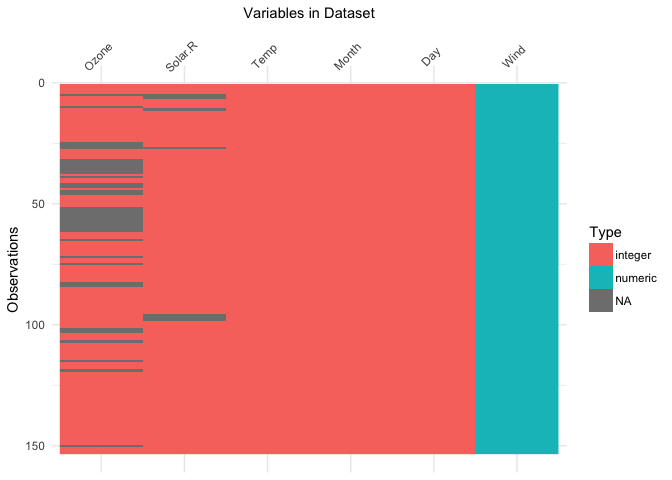
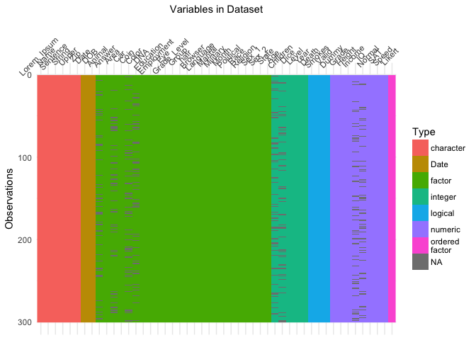
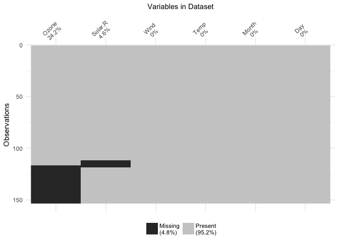
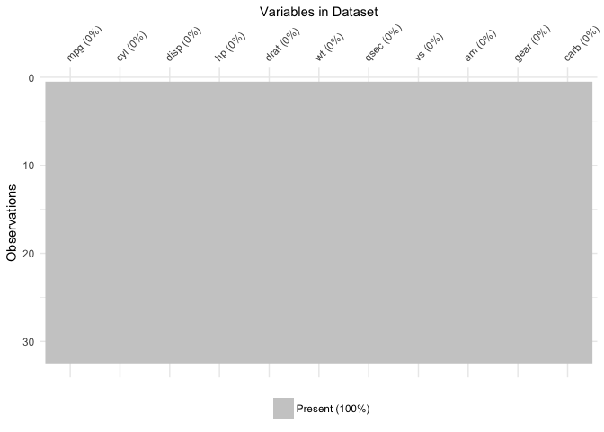

<!-- README.md is generated from README.Rmd. Please edit that file -->
visdat
======

<!-- add a TravisCI badge -->
<!-- Add an appVeyor badge -->
[](https://travis-ci.org/njtierney/visdat) [](https://ci.appveyor.com/project/njtierney/visdat)[](https://codecov.io/github/njtierney/visdat?branch=master)

How to install
==============

``` r
# install.packages("devtools")

devtools::install_github("njtierney/visdat")
```

What does visdat do?
====================

Initially inspired by [`csv-fingerprint`](https://github.com/setosa/csv-fingerprint), `vis_dat` helps you visualise a dataframe and "get a look at the data" by displaying the variable classes in a dataframe as a plot with `vis_dat`, and getting a brief look into missing data patterns using `vis_miss`.

The name `visdat` was chosen as I think in the future it could be integrated with [`testdat`](https://github.com/ropensci/testdat). The idea being that first you visualise your data (`visdat`), then you run tests from `testdat` to fix them.

There are two main commands in the `visdat` package:

-   `vis_dat()` visualises a dataframe showing you what the classes of the columns are, and also displaying the missing data.

-   `vis_miss()` visualises just the missing data, and allows for missingness to be clustered and columns rearranged. `vis_miss()` is similar to `missing.pattern.plot` from the [`mi`](https://cran.r-project.org/web/packages/mi/index.html) package. Unfortunately `missing.pattern.plot` is no longer in the `mi` package (well, as of 14/02/2016).

There are two experimental functions:

-   `vis_guess()` has a guess at what the value of each cell, using `readr::parse_guess`. This means that "10.1" will return "double", and `10.1` will return "double", and `01/01/01` will return "date". Keep in mind that it is a **guess** at what each cell is, so you can't trust this fully.

-   `vis_compare()` compares two dataframes, displaying the differences.

Please note that this project is released with a [Contributor Code of Conduct](CONDUCT.md). By participating in this project you agree to abide by its terms.

Examples
========

Using `vis_dat()`
-----------------

Let's see what's inside the `airquality` dataset from base R.

``` r

library(visdat)

vis_dat(airquality)
#> dmap() is deprecated. Please use the new colwise family in dplyr.
#> E.g., summarise_all(), mutate_all(), etc.
```



The plot above tells us that R reads this dataset as having numeric and integer values, with some missing data in `Ozone` and `Solar.R`. The classes are represented on the legend, and missing data represented by grey. The column/variable names are listed on the x axis.

By default, `vis_dat` sorts the columns according to the type of the data in the vectors. You can turn this off by setting `sort_type = FALSE`.

``` r

vis_dat(airquality, 
        sort_type = FALSE)
#> dmap() is deprecated. Please use the new colwise family in dplyr.
#> E.g., summarise_all(), mutate_all(), etc.
```


### With many kinds of data

To demonstrate what visdat looks like when you have different kinds of data, we can look at the dataset `typical_data`, provided within `visdat`, and created with the excellent [`wakefield` package](https://github.com/trinker/wakefield).

``` r

vis_dat(typical_data)
#> dmap() is deprecated. Please use the new colwise family in dplyr.
#> E.g., summarise_all(), mutate_all(), etc.
#> Warning: attributes are not identical across measure variables; they will
#> be dropped
```


We can also look into using even wider data, looking at `typical_larger_data`

``` r

vis_dat(typical_larger_data)
#> dmap() is deprecated. Please use the new colwise family in dplyr.
#> E.g., summarise_all(), mutate_all(), etc.
#> Warning: attributes are not identical across measure variables; they will
#> be dropped
```



Using `vis_miss()`
------------------

We can explore the missing data further using `vis_miss()`.

``` r

vis_miss(airquality)
```


The percentages of missing/complete in `vis_miss` are accurate to 1 decimal place.

You can cluster the missingness by setting `cluster = TRUE`.

``` r

vis_miss(airquality, 
         cluster = TRUE)
```



The columns can also just be arranged by columns with most missingness, by setting `sort_miss = TRUE`.

``` r

vis_miss(airquality,
         sort_miss = TRUE)
```


`vis_miss` indicates when there is a very small amount of missing data at &lt;0.1% missingness.

``` r

test_miss_df <- data.frame(x1 = 1:10000,
                           x2 = rep("A", 10000),
                           x3 = c(rep(1L, 9999), NA))

vis_miss(test_miss_df)
#> Warning: attributes are not identical across measure variables; they will
#> be dropped
```


`vis_miss` will also indicate when there is no missing data at all.

``` r

vis_miss(mtcars)
```



Thank yous
==========

Thank you to Ivan Hanigan who [first commented](http://www.njtierney.com/r/missing%20data/rbloggers/2015/12/01/ggplot-missing-data/#comment-2388263747) this suggestion after I made a blog post about an initial prototype `ggplot_missing`, and Jenny Bryan, whose [tweet](https://twitter.com/JennyBryan/status/679011378414268416) got me thinking about `vis_dat`, and for her code contributions that removed a lot of errors.

Thank you to Hadley Wickham for suggesting the use of the internals of `readr` to make `vis_guess` work.

Thank you to Miles McBain for his suggestions on how to improve `vis_guess`. This resulted in making it at least 2-3 times faster.

Thanks also to Carson Sievert for writing the code that combined `plotly` with `visdat`, and for Noam Ross for suggesting this in the first place.
