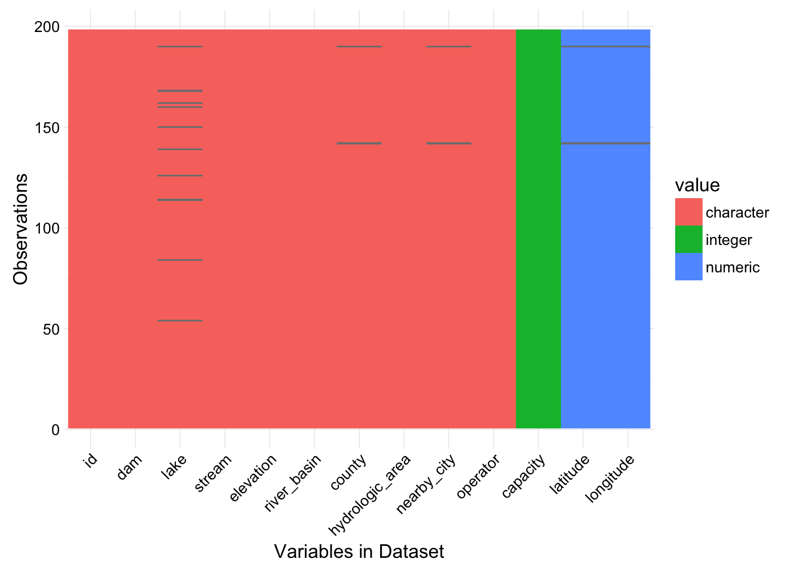
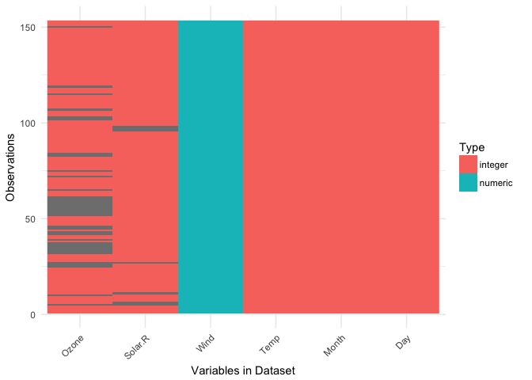
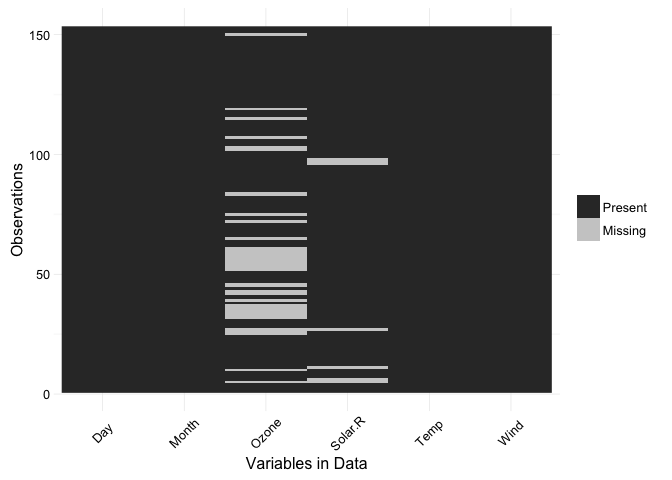
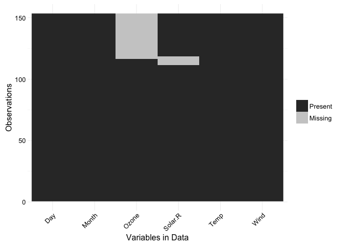
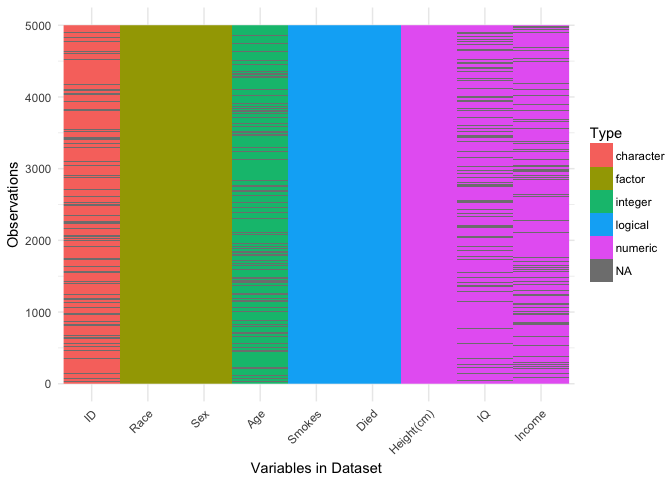
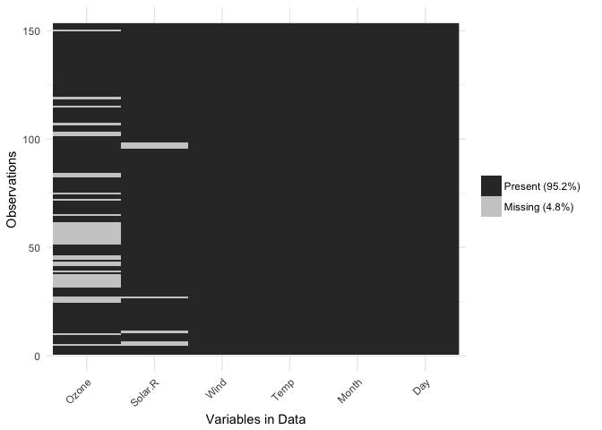
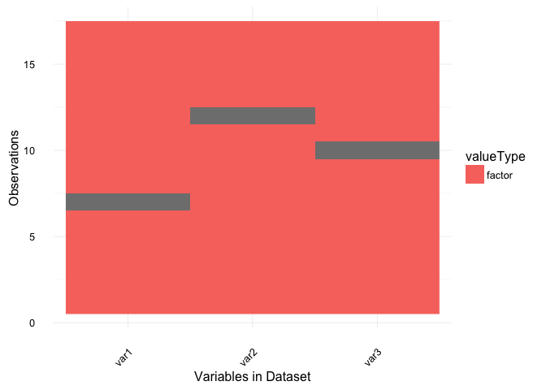

<!-- README.md is generated from README.Rmd. Please edit that file -->
visdat
======

What does visdat do?
====================

Initially inspired by [`csv-fingerprint`](https://github.com/setosa/csv-fingerprint), `vis_dat` helps you visualise a dataframe and "get a look at the data" by displaying the variable classes in a dataframe as a plot with `vis_dat`, and getting a brief look into missing data patterns `vis_miss`.

The name `visdat` was chosen as I think in the future it could be integrated with [`testdat`](https://github.com/ropensci/testdat). The idea being that first you visualise your data (`visdat`), then you run tests from `testdat` to fix them.

There are currently two main commands: `vis_dat` and `vis_miss`.

-   `vis_dat` visualises a dataframe showing you what the classes of the columns are, and also displaying the missing data.

-   `vis_miss` visualises just the missing data, and allows for missingness to be clustered and columns rearranged. `vis_miss` is similar to `missing.pattern.plot` from the `mi` package. Unfortunately `missing.pattern.plot` is no longer in the `mi` package (well, as of 14/02/2016).

-   **new!!** `vis_guess` has a guess at what the value of each cell. So "10.1" will return "double", and `10.1` will return "double", and 01/01/01 will return "date". Keep in mind that it is a **guess** at what each cell is, so you can't trust this fully. `vis_guess` is made possible thanks to Hadley Wickham's `readr` package - thanks mate!

How to install
==============

``` r
# install.packages("devtools")

library(devtools)

install_github("tierneyn/visdat")
```

Example
=======

Let's see what's inside the dataset `airquality`

``` r

library(visdat)

vis_dat(airquality)
```


The classes are represented on the legend, and missing data represented by grey.

by default, `vis_dat` sorts the columns according to the type of the data in the vectors. You can turn this off by setting `sort_type == FALSE`. This feature is better illustrated using the `example2` dataset, borrowed from csv-fingerprint.

``` r

vis_dat(example2)
```



``` r


vis_dat(example2, 
        sort_type = FALSE)
```



The plot above tells us that R reads this dataset as having numeric and integer values, along with some missing data in `Ozone` and `Solar.R`.

We can explore the missing data further using `vis_miss`

``` r

vis_miss(airquality)
```



You can cluster the missingness by setting `cluster = TRUE`

``` r

vis_miss(airquality, 
         cluster = TRUE)
```



The columns can also just be arranged by columns with most missingness, by setting `sort_miss = TRUE`.

``` r

vis_miss(airquality,
         sort_miss = TRUE)
```



`vis_guess` takes a guess at what each cell is. It's best illustrated using some messy data, which we'll make here.

``` r

messy_vector <- c(TRUE,
                  T,
                  "TRUE",
                  "T",
                  "01/01/01",
                  "01/01/2001",
                  NA,
                  NaN,
                  "NA",
                  "Na",
                  "na",
                  "10",
                  10,
                  "10.1",
                  10.1,
                  "abc",
                  "$%TG")

messy_df <- data.frame(var1 = messy_vector,
                       var2 = sample(messy_vector),
                       var3 = sample(messy_vector))
```

``` r

vis_guess(messy_df)
```



So here we see that there are many different kinds of data in your dataframe. As an analyst this might be a depressing finding. Compare this to `vis_dat`.

``` r

vis_dat(messy_df)
```



Where you'd just assume your data is wierd because it's all factors - or worse, not notice that this is a problem.

At the moment `vis_guess` is very slow. Please take this into consideration when you are using it on data with more than 1000 rows. We're looking into ways of making it faster, potentially using methods from the `parallel` package, or extending the c++ code from `readr:::collectorGuess`.

Interactivity
=============

Thanks to Carson Sievert, you can now add some really nifty interactivity into visdat by using `plotly::ggplotly`, allowing for information to be revealed upon mouseover of a cell. For example:

``` r

library(plotly)
#> Loading required package: ggplot2
#> 
#> Attaching package: 'plotly'
#> The following object is masked from 'package:ggplot2':
#> 
#>     last_plot
#> The following object is masked from 'package:graphics':
#> 
#>     layout

vis_dat(example2) %>% ggplotly()
```

<!--html_preserve-->

<script type="application/json" data-for="htmlwidget-2597">{"x":{"data":[{"x":[0.5,0.5,1.5,1.5,0.5,null,0.5,0.5,1.5,1.5,0.5,null,0.5,0.5,1.5,1.5,0.5,null,0.5,0.5,1.5,1.5,0.5,null,0.5,0.5,1.5,1.5,0.5,null,0.5,0.5,1.5,1.5,0.5,null,0.5,0.5,1.5,1.5,0.5,null,0.5,0.5,1.5,1.5,0.5,null,0.5,0.5,1.5,1.5,0.5,null,0.5,0.5,1.5,1.5,0.5,null,0.5,0.5,1.5,1.5,0.5,null,0.5,0.5,1.5,1.5,0.5,null,0.5,0.5,1.5,1.5,0.5,null,0.5,0.5,1.5,1.5,0.5,null,0.5,0.5,1.5,1.5,0.5,null,0.5,0.5,1.5,1.5,0.5,null,0.5,0.5,1.5,1.5,0.5,null,0.5,0.5,1.5,1.5,0.5,null,0.5,0.5,1.5,1.5,0.5,null,0.5,0.5,1.5,1.5,0.5,null,0.5,0.5,1.5,1.5,0.5,null,0.5,0.5,1.5,1.5,0.5,null,0.5,0.5,1.5,1.5,0.5,null,0.5,0.5,1.5,1.5,0.5,null,0.5,0.5,1.5,1.5,0.5,null,0.5,0.5,1.5,1.5,0.5,null,0.5,0.5,1.5,1.5,0.5,null,0.5,0.5,1.5,1.5,0.5,null,0.5,0.5,1.5,1.5,0.5,null,0.5,0.5,1.5,1.5,0.5,null,0.5,0.5,1.5,1.5,0.5,null,0.5,0.5,1.5,1.5,0.5,null,0.5,0.5,1.5,1.5,0.5,null,0.5,0.5,1.5,1.5,0.5,null,0.5,0.5,1.5,1.5,0.5,null,0.5,0.5,1.5,1.5,0.5,null,0.5,0.5,1.5,1.5,0.5,null,0.5,0.5,1.5,1.5,0.5,null,0.5,0.5,1.5,1.5,0.5,null,0.5,0.5,1.5,1.5,0.5,null,0.5,0.5,1.5,1.5,0.5,null,0.5,0.5,1.5,1.5,0.5,null,0.5,0.5,1.5,1.5,0.5,null,0.5,0.5,1.5,1.5,0.5,null,0.5,0.5,1.5,1.5,0.5,null,0.5,0.5,1.5,1.5,0.5,null,0.5,0.5,1.5,1.5,0.5,null,0.5,0.5,1.5,1.5,0.5,null,0.5,0.5,1.5,1.5,0.5,null,0.5,0.5,1.5,1.5,0.5,null,0.5,0.5,1.5,1.5,0.5,null,0.5,0.5,1.5,1.5,0.5,null,0.5,0.5,1.5,1.5,0.5,null,0.5,0.5,1.5,1.5,0.5,null,0.5,0.5,1.5,1.5,0.5,null,0.5,0.5,1.5,1.5,0.5,null,0.5,0.5,1.5,1.5,0.5,null,0.5,0.5,1.5,1.5,0.5,null,0.5,0.5,1.5,1.5,0.5,null,0.5,0.5,1.5,1.5,0.5,null,0.5,0.5,1.5,1.5,0.5,null,0.5,0.5,1.5,1.5,0.5,null,0.5,0.5,1.5,1.5,0.5,null,0.5,0.5,1.5,1.5,0.5,null,0.5,0.5,1.5,1.5,0.5,null,0.5,0.5,1.5,1.5,0.5,null,0.5,0.5,1.5,1.5,0.5,null,0.5,0.5,1.5,1.5,0.5,null,0.5,0.5,1.5,1.5,0.5,null,0.5,0.5,1.5,1.5,0.5,null,0.5,0.5,1.5,1.5,0.5,null,0.5,0.5,1.5,1.5,0.5,null,0.5,0.5,1.5,1.5,0.5,null,0.5,0.5,1.5,1.5,0.5,null,0.5,0.5,1.5,1.5,0.5,null,0.5,0.5,1.5,1.5,0.5,null,0.5,0.5,1.5,1.5,0.5,null,0.5,0.5,1.5,1.5,0.5,null,0.5,0.5,1.5,1.5,0.5,null,0.5,0.5,1.5,1.5,0.5,null,0.5,0.5,1.5,1.5,0.5,null,0.5,0.5,1.5,1.5,0.5,null,0.5,0.5,1.5,1.5,0.5,null,0.5,0.5,1.5,1.5,0.5,null,0.5,0.5,1.5,1.5,0.5,null,0.5,0.5,1.5,1.5,0.5,null,0.5,0.5,1.5,1.5,0.5,null,0.5,0.5,1.5,1.5,0.5,null,0.5,0.5,1.5,1.5,0.5,null,0.5,0.5,1.5,1.5,0.5,null,0.5,0.5,1.5,1.5,0.5,null,0.5,0.5,1.5,1.5,0.5,null,0.5,0.5,1.5,1.5,0.5,null,0.5,0.5,1.5,1.5,0.5,null,0.5,0.5,1.5,1.5,0.5,null,0.5,0.5,1.5,1.5,0.5,null,0.5,0.5,1.5,1.5,0.5,null,0.5,0.5,1.5,1.5,0.5,null,0.5,0.5,1.5,1.5,0.5,null,0.5,0.5,1.5,1.5,0.5,null,0.5,0.5,1.5,1.5,0.5,null,0.5,0.5,1.5,1.5,0.5,null,0.5,0.5,1.5,1.5,0.5,null,0.5,0.5,1.5,1.5,0.5,null,0.5,0.5,1.5,1.5,0.5,null,0.5,0.5,1.5,1.5,0.5,null,0.5,0.5,1.5,1.5,0.5,null,0.5,0.5,1.5,1.5,0.5,null,0.5,0.5,1.5,1.5,0.5,null,0.5,0.5,1.5,1.5,0.5,null,0.5,0.5,1.5,1.5,0.5,null,0.5,0.5,1.5,1.5,0.5,null,0.5,0.5,1.5,1.5,0.5,null,0.5,0.5,1.5,1.5,0.5,null,0.5,0.5,1.5,1.5,0.5,null,0.5,0.5,1.5,1.5,0.5,null,0.5,0.5,1.5,1.5,0.5,null,0.5,0.5,1.5,1.5,0.5,null,0.5,0.5,1.5,1.5,0.5,null,0.5,0.5,1.5,1.5,0.5,null,0.5,0.5,1.5,1.5,0.5,null,0.5,0.5,1.5,1.5,0.5,null,0.5,0.5,1.5,1.5,0.5,null,0.5,0.5,1.5,1.5,0.5,null,0.5,0.5,1.5,1.5,0.5,null,0.5,0.5,1.5,1.5,0.5,null,0.5,0.5,1.5,1.5,0.5,null,0.5,0.5,1.5,1.5,0.5,null,0.5,0.5,1.5,1.5,0.5,null,0.5,0.5,1.5,1.5,0.5,null,0.5,0.5,1.5,1.5,0.5,null,0.5,0.5,1.5,1.5,0.5,null,0.5,0.5,1.5,1.5,0.5,null,0.5,0.5,1.5,1.5,0.5,null,0.5,0.5,1.5,1.5,0.5,null,0.5,0.5,1.5,1.5,0.5,null,0.5,0.5,1.5,1.5,0.5,null,0.5,0.5,1.5,1.5,0.5,null,0.5,0.5,1.5,1.5,0.5,null,0.5,0.5,1.5,1.5,0.5,null,0.5,0.5,1.5,1.5,0.5,null,0.5,0.5,1.5,1.5,0.5,null,0.5,0.5,1.5,1.5,0.5,null,0.5,0.5,1.5,1.5,0.5,null,0.5,0.5,1.5,1.5,0.5,null,0.5,0.5,1.5,1.5,0.5,null,0.5,0.5,1.5,1.5,0.5,null,0.5,0.5,1.5,1.5,0.5,null,0.5,0.5,1.5,1.5,0.5,null,0.5,0.5,1.5,1.5,0.5,null,0.5,0.5,1.5,1.5,0.5,null,0.5,0.5,1.5,1.5,0.5,null,0.5,0.5,1.5,1.5,0.5,null,0.5,0.5,1.5,1.5,0.5,null,0.5,0.5,1.5,1.5,0.5,null,0.5,0.5,1.5,1.5,0.5,null,0.5,0.5,1.5,1.5,0.5,null,0.5,0.5,1.5,1.5,0.5,null,0.5,0.5,1.5,1.5,0.5,null,0.5,0.5,1.5,1.5,0.5,null,0.5,0.5,1.5,1.5,0.5,null,0.5,0.5,1.5,1.5,0.5,null,0.5,0.5,1.5,1.5,0.5,null,0.5,0.5,1.5,1.5,0.5,null,0.5,0.5,1.5,1.5,0.5,null,0.5,0.5,1.5,1.5,0.5,null,0.5,0.5,1.5,1.5,0.5,null,0.5,0.5,1.5,1.5,0.5,null,0.5,0.5,1.5,1.5,0.5,null,0.5,0.5,1.5,1.5,0.5,null,0.5,0.5,1.5,1.5,0.5,null,0.5,0.5,1.5,1.5,0.5,null,0.5,0.5,1.5,1.5,0.5,null,0.5,0.5,1.5,1.5,0.5,null,0.5,0.5,1.5,1.5,0.5,null,0.5,0.5,1.5,1.5,0.5,null,0.5,0.5,1.5,1.5,0.5,null,0.5,0.5,1.5,1.5,0.5,null,0.5,0.5,1.5,1.5,0.5,null,0.5,0.5,1.5,1.5,0.5,null,0.5,0.5,1.5,1.5,0.5,null,0.5,0.5,1.5,1.5,0.5,null,0.5,0.5,1.5,1.5,0.5,null,0.5,0.5,1.5,1.5,0.5,null,0.5,0.5,1.5,1.5,0.5,null,0.5,0.5,1.5,1.5,0.5,null,0.5,0.5,1.5,1.5,0.5,null,0.5,0.5,1.5,1.5,0.5,null,0.5,0.5,1.5,1.5,0.5,null,0.5,0.5,1.5,1.5,0.5,null,0.5,0.5,1.5,1.5,0.5,null,0.5,0.5,1.5,1.5,0.5,null,0.5,0.5,1.5,1.5,0.5,null,0.5,0.5,1.5,1.5,0.5,null,0.5,0.5,1.5,1.5,0.5,null,0.5,0.5,1.5,1.5,0.5,null,0.5,0.5,1.5,1.5,0.5,null,0.5,0.5,1.5,1.5,0.5,null,1.5,1.5,2.5,2.5,1.5,null,1.5,1.5,2.5,2.5,1.5,null,1.5,1.5,2.5,2.5,1.5,null,1.5,1.5,2.5,2.5,1.5,null,1.5,1.5,2.5,2.5,1.5,null,1.5,1.5,2.5,2.5,1.5,null,1.5,1.5,2.5,2.5,1.5,null,1.5,1.5,2.5,2.5,1.5,null,1.5,1.5,2.5,2.5,1.5,null,1.5,1.5,2.5,2.5,1.5,null,1.5,1.5,2.5,2.5,1.5,null,1.5,1.5,2.5,2.5,1.5,null,1.5,1.5,2.5,2.5,1.5,null,1.5,1.5,2.5,2.5,1.5,null,1.5,1.5,2.5,2.5,1.5,null,1.5,1.5,2.5,2.5,1.5,null,1.5,1.5,2.5,2.5,1.5,null,1.5,1.5,2.5,2.5,1.5,null,1.5,1.5,2.5,2.5,1.5,null,1.5,1.5,2.5,2.5,1.5,null,1.5,1.5,2.5,2.5,1.5,null,1.5,1.5,2.5,2.5,1.5,null,1.5,1.5,2.5,2.5,1.5,null,1.5,1.5,2.5,2.5,1.5,null,1.5,1.5,2.5,2.5,1.5,null,1.5,1.5,2.5,2.5,1.5,null,1.5,1.5,2.5,2.5,1.5,null,1.5,1.5,2.5,2.5,1.5,null,1.5,1.5,2.5,2.5,1.5,null,1.5,1.5,2.5,2.5,1.5,null,1.5,1.5,2.5,2.5,1.5,null,1.5,1.5,2.5,2.5,1.5,null,1.5,1.5,2.5,2.5,1.5,null,1.5,1.5,2.5,2.5,1.5,null,1.5,1.5,2.5,2.5,1.5,null,1.5,1.5,2.5,2.5,1.5,null,1.5,1.5,2.5,2.5,1.5,null,1.5,1.5,2.5,2.5,1.5,null,1.5,1.5,2.5,2.5,1.5,null,1.5,1.5,2.5,2.5,1.5,null,1.5,1.5,2.5,2.5,1.5,null,1.5,1.5,2.5,2.5,1.5,null,1.5,1.5,2.5,2.5,1.5,null,1.5,1.5,2.5,2.5,1.5,null,1.5,1.5,2.5,2.5,1.5,null,1.5,1.5,2.5,2.5,1.5,null,1.5,1.5,2.5,2.5,1.5,null,1.5,1.5,2.5,2.5,1.5,null,1.5,1.5,2.5,2.5,1.5,null,1.5,1.5,2.5,2.5,1.5,null,1.5,1.5,2.5,2.5,1.5,null,1.5,1.5,2.5,2.5,1.5,null,1.5,1.5,2.5,2.5,1.5,null,1.5,1.5,2.5,2.5,1.5,null,1.5,1.5,2.5,2.5,1.5,null,1.5,1.5,2.5,2.5,1.5,null,1.5,1.5,2.5,2.5,1.5,null,1.5,1.5,2.5,2.5,1.5,null,1.5,1.5,2.5,2.5,1.5,null,1.5,1.5,2.5,2.5,1.5,null,1.5,1.5,2.5,2.5,1.5,null,1.5,1.5,2.5,2.5,1.5,null,1.5,1.5,2.5,2.5,1.5,null,1.5,1.5,2.5,2.5,1.5,null,1.5,1.5,2.5,2.5,1.5,null,1.5,1.5,2.5,2.5,1.5,null,1.5,1.5,2.5,2.5,1.5,null,1.5,1.5,2.5,2.5,1.5,null,1.5,1.5,2.5,2.5,1.5,null,1.5,1.5,2.5,2.5,1.5,null,1.5,1.5,2.5,2.5,1.5,null,1.5,1.5,2.5,2.5,1.5,null,1.5,1.5,2.5,2.5,1.5,null,1.5,1.5,2.5,2.5,1.5,null,1.5,1.5,2.5,2.5,1.5,null,1.5,1.5,2.5,2.5,1.5,null,1.5,1.5,2.5,2.5,1.5,null,1.5,1.5,2.5,2.5,1.5,null,1.5,1.5,2.5,2.5,1.5,null,1.5,1.5,2.5,2.5,1.5,null,1.5,1.5,2.5,2.5,1.5,null,1.5,1.5,2.5,2.5,1.5,null,1.5,1.5,2.5,2.5,1.5,null,1.5,1.5,2.5,2.5,1.5,null,1.5,1.5,2.5,2.5,1.5,null,1.5,1.5,2.5,2.5,1.5,null,1.5,1.5,2.5,2.5,1.5,null,1.5,1.5,2.5,2.5,1.5,null,1.5,1.5,2.5,2.5,1.5,null,1.5,1.5,2.5,2.5,1.5,null,1.5,1.5,2.5,2.5,1.5,null,1.5,1.5,2.5,2.5,1.5,null,1.5,1.5,2.5,2.5,1.5,null,1.5,1.5,2.5,2.5,1.5,null,1.5,1.5,2.5,2.5,1.5,null,1.5,1.5,2.5,2.5,1.5,null,1.5,1.5,2.5,2.5,1.5,null,1.5,1.5,2.5,2.5,1.5,null,1.5,1.5,2.5,2.5,1.5,null,1.5,1.5,2.5,2.5,1.5,null,1.5,1.5,2.5,2.5,1.5,null,1.5,1.5,2.5,2.5,1.5,null,1.5,1.5,2.5,2.5,1.5,null,1.5,1.5,2.5,2.5,1.5,null,1.5,1.5,2.5,2.5,1.5,null,1.5,1.5,2.5,2.5,1.5,null,1.5,1.5,2.5,2.5,1.5,null,1.5,1.5,2.5,2.5,1.5,null,1.5,1.5,2.5,2.5,1.5,null,1.5,1.5,2.5,2.5,1.5,null,1.5,1.5,2.5,2.5,1.5,null,1.5,1.5,2.5,2.5,1.5,null,1.5,1.5,2.5,2.5,1.5,null,1.5,1.5,2.5,2.5,1.5,null,1.5,1.5,2.5,2.5,1.5,null,1.5,1.5,2.5,2.5,1.5,null,1.5,1.5,2.5,2.5,1.5,null,1.5,1.5,2.5,2.5,1.5,null,1.5,1.5,2.5,2.5,1.5,null,1.5,1.5,2.5,2.5,1.5,null,1.5,1.5,2.5,2.5,1.5,null,1.5,1.5,2.5,2.5,1.5,null,1.5,1.5,2.5,2.5,1.5,null,1.5,1.5,2.5,2.5,1.5,null,1.5,1.5,2.5,2.5,1.5,null,1.5,1.5,2.5,2.5,1.5,null,1.5,1.5,2.5,2.5,1.5,null,1.5,1.5,2.5,2.5,1.5,null,1.5,1.5,2.5,2.5,1.5,null,1.5,1.5,2.5,2.5,1.5,null,1.5,1.5,2.5,2.5,1.5,null,1.5,1.5,2.5,2.5,1.5,null,1.5,1.5,2.5,2.5,1.5,null,1.5,1.5,2.5,2.5,1.5,null,1.5,1.5,2.5,2.5,1.5,null,1.5,1.5,2.5,2.5,1.5,null,1.5,1.5,2.5,2.5,1.5,null,1.5,1.5,2.5,2.5,1.5,null,1.5,1.5,2.5,2.5,1.5,null,1.5,1.5,2.5,2.5,1.5,null,1.5,1.5,2.5,2.5,1.5,null,1.5,1.5,2.5,2.5,1.5,null,1.5,1.5,2.5,2.5,1.5,null,1.5,1.5,2.5,2.5,1.5,null,1.5,1.5,2.5,2.5,1.5,null,1.5,1.5,2.5,2.5,1.5,null,1.5,1.5,2.5,2.5,1.5,null,1.5,1.5,2.5,2.5,1.5,null,1.5,1.5,2.5,2.5,1.5,null,1.5,1.5,2.5,2.5,1.5,null,1.5,1.5,2.5,2.5,1.5,null,1.5,1.5,2.5,2.5,1.5,null,1.5,1.5,2.5,2.5,1.5,null,1.5,1.5,2.5,2.5,1.5,null,1.5,1.5,2.5,2.5,1.5,null,1.5,1.5,2.5,2.5,1.5,null,1.5,1.5,2.5,2.5,1.5,null,1.5,1.5,2.5,2.5,1.5,null,1.5,1.5,2.5,2.5,1.5,null,1.5,1.5,2.5,2.5,1.5,null,1.5,1.5,2.5,2.5,1.5,null,1.5,1.5,2.5,2.5,1.5,null,1.5,1.5,2.5,2.5,1.5,null,1.5,1.5,2.5,2.5,1.5,null,1.5,1.5,2.5,2.5,1.5,null,1.5,1.5,2.5,2.5,1.5,null,1.5,1.5,2.5,2.5,1.5,null,1.5,1.5,2.5,2.5,1.5,null,1.5,1.5,2.5,2.5,1.5,null,1.5,1.5,2.5,2.5,1.5,null,1.5,1.5,2.5,2.5,1.5,null,1.5,1.5,2.5,2.5,1.5,null,1.5,1.5,2.5,2.5,1.5,null,1.5,1.5,2.5,2.5,1.5,null,1.5,1.5,2.5,2.5,1.5,null,1.5,1.5,2.5,2.5,1.5,null,1.5,1.5,2.5,2.5,1.5,null,1.5,1.5,2.5,2.5,1.5,null,1.5,1.5,2.5,2.5,1.5,null,1.5,1.5,2.5,2.5,1.5,null,1.5,1.5,2.5,2.5,1.5,null,1.5,1.5,2.5,2.5,1.5,null,1.5,1.5,2.5,2.5,1.5,null,1.5,1.5,2.5,2.5,1.5,null,1.5,1.5,2.5,2.5,1.5,null,1.5,1.5,2.5,2.5,1.5,null,1.5,1.5,2.5,2.5,1.5,null,1.5,1.5,2.5,2.5,1.5,null,1.5,1.5,2.5,2.5,1.5,null,1.5,1.5,2.5,2.5,1.5,null,1.5,1.5,2.5,2.5,1.5,null,1.5,1.5,2.5,2.5,1.5,null,1.5,1.5,2.5,2.5,1.5,null,1.5,1.5,2.5,2.5,1.5,null,1.5,1.5,2.5,2.5,1.5,null,1.5,1.5,2.5,2.5,1.5,null,1.5,1.5,2.5,2.5,1.5,null,1.5,1.5,2.5,2.5,1.5,null,2.5,2.5,3.5,3.5,2.5,null,2.5,2.5,3.5,3.5,2.5,null,2.5,2.5,3.5,3.5,2.5,null,2.5,2.5,3.5,3.5,2.5,null,2.5,2.5,3.5,3.5,2.5,null,2.5,2.5,3.5,3.5,2.5,null,2.5,2.5,3.5,3.5,2.5,null,2.5,2.5,3.5,3.5,2.5,null,2.5,2.5,3.5,3.5,2.5,null,2.5,2.5,3.5,3.5,2.5,null,2.5,2.5,3.5,3.5,2.5,null,2.5,2.5,3.5,3.5,2.5,null,2.5,2.5,3.5,3.5,2.5,null,2.5,2.5,3.5,3.5,2.5,null,2.5,2.5,3.5,3.5,2.5,null,2.5,2.5,3.5,3.5,2.5,null,2.5,2.5,3.5,3.5,2.5,null,2.5,2.5,3.5,3.5,2.5,null,2.5,2.5,3.5,3.5,2.5,null,2.5,2.5,3.5,3.5,2.5,null,2.5,2.5,3.5,3.5,2.5,null,2.5,2.5,3.5,3.5,2.5,null,2.5,2.5,3.5,3.5,2.5,null,2.5,2.5,3.5,3.5,2.5,null,2.5,2.5,3.5,3.5,2.5,null,2.5,2.5,3.5,3.5,2.5,null,2.5,2.5,3.5,3.5,2.5,null,2.5,2.5,3.5,3.5,2.5,null,2.5,2.5,3.5,3.5,2.5,null,2.5,2.5,3.5,3.5,2.5,null,2.5,2.5,3.5,3.5,2.5,null,2.5,2.5,3.5,3.5,2.5,null,2.5,2.5,3.5,3.5,2.5,null,2.5,2.5,3.5,3.5,2.5,null,2.5,2.5,3.5,3.5,2.5,null,2.5,2.5,3.5,3.5,2.5,null,2.5,2.5,3.5,3.5,2.5,null,2.5,2.5,3.5,3.5,2.5,null,2.5,2.5,3.5,3.5,2.5,null,2.5,2.5,3.5,3.5,2.5,null,2.5,2.5,3.5,3.5,2.5,null,2.5,2.5,3.5,3.5,2.5,null,2.5,2.5,3.5,3.5,2.5,null,2.5,2.5,3.5,3.5,2.5,null,2.5,2.5,3.5,3.5,2.5,null,2.5,2.5,3.5,3.5,2.5,null,2.5,2.5,3.5,3.5,2.5,null,2.5,2.5,3.5,3.5,2.5,null,2.5,2.5,3.5,3.5,2.5,null,2.5,2.5,3.5,3.5,2.5,null,2.5,2.5,3.5,3.5,2.5,null,2.5,2.5,3.5,3.5,2.5,null,2.5,2.5,3.5,3.5,2.5,null,2.5,2.5,3.5,3.5,2.5,null,2.5,2.5,3.5,3.5,2.5,null,2.5,2.5,3.5,3.5,2.5,null,2.5,2.5,3.5,3.5,2.5,null,2.5,2.5,3.5,3.5,2.5,null,2.5,2.5,3.5,3.5,2.5,null,2.5,2.5,3.5,3.5,2.5,null,2.5,2.5,3.5,3.5,2.5,null,2.5,2.5,3.5,3.5,2.5,null,2.5,2.5,3.5,3.5,2.5,null,2.5,2.5,3.5,3.5,2.5,null,2.5,2.5,3.5,3.5,2.5,null,2.5,2.5,3.5,3.5,2.5,null,2.5,2.5,3.5,3.5,2.5,null,2.5,2.5,3.5,3.5,2.5,null,2.5,2.5,3.5,3.5,2.5,null,2.5,2.5,3.5,3.5,2.5,null,2.5,2.5,3.5,3.5,2.5,null,2.5,2.5,3.5,3.5,2.5,null,2.5,2.5,3.5,3.5,2.5,null,2.5,2.5,3.5,3.5,2.5,null,2.5,2.5,3.5,3.5,2.5,null,2.5,2.5,3.5,3.5,2.5,null,2.5,2.5,3.5,3.5,2.5,null,2.5,2.5,3.5,3.5,2.5,null,2.5,2.5,3.5,3.5,2.5,null,2.5,2.5,3.5,3.5,2.5,null,2.5,2.5,3.5,3.5,2.5,null,2.5,2.5,3.5,3.5,2.5,null,2.5,2.5,3.5,3.5,2.5,null,2.5,2.5,3.5,3.5,2.5,null,2.5,2.5,3.5,3.5,2.5,null,2.5,2.5,3.5,3.5,2.5,null,2.5,2.5,3.5,3.5,2.5,null,2.5,2.5,3.5,3.5,2.5,null,2.5,2.5,3.5,3.5,2.5,null,2.5,2.5,3.5,3.5,2.5,null,2.5,2.5,3.5,3.5,2.5,null,2.5,2.5,3.5,3.5,2.5,null,2.5,2.5,3.5,3.5,2.5,null,2.5,2.5,3.5,3.5,2.5,null,2.5,2.5,3.5,3.5,2.5,null,2.5,2.5,3.5,3.5,2.5,null,2.5,2.5,3.5,3.5,2.5,null,2.5,2.5,3.5,3.5,2.5,null,2.5,2.5,3.5,3.5,2.5,null,2.5,2.5,3.5,3.5,2.5,null,2.5,2.5,3.5,3.5,2.5,null,2.5,2.5,3.5,3.5,2.5,null,2.5,2.5,3.5,3.5,2.5,null,2.5,2.5,3.5,3.5,2.5,null,2.5,2.5,3.5,3.5,2.5,null,2.5,2.5,3.5,3.5,2.5,null,2.5,2.5,3.5,3.5,2.5,null,2.5,2.5,3.5,3.5,2.5,null,2.5,2.5,3.5,3.5,2.5,null,2.5,2.5,3.5,3.5,2.5,null,2.5,2.5,3.5,3.5,2.5,null,2.5,2.5,3.5,3.5,2.5,null,2.5,2.5,3.5,3.5,2.5,null,2.5,2.5,3.5,3.5,2.5,null,2.5,2.5,3.5,3.5,2.5,null,2.5,2.5,3.5,3.5,2.5,null,2.5,2.5,3.5,3.5,2.5,null,2.5,2.5,3.5,3.5,2.5,null,2.5,2.5,3.5,3.5,2.5,null,2.5,2.5,3.5,3.5,2.5,null,2.5,2.5,3.5,3.5,2.5,null,2.5,2.5,3.5,3.5,2.5,null,2.5,2.5,3.5,3.5,2.5,null,2.5,2.5,3.5,3.5,2.5,null,2.5,2.5,3.5,3.5,2.5,null,2.5,2.5,3.5,3.5,2.5,null,2.5,2.5,3.5,3.5,2.5,null,2.5,2.5,3.5,3.5,2.5,null,2.5,2.5,3.5,3.5,2.5,null,2.5,2.5,3.5,3.5,2.5,null,2.5,2.5,3.5,3.5,2.5,null,2.5,2.5,3.5,3.5,2.5,null,2.5,2.5,3.5,3.5,2.5,null,2.5,2.5,3.5,3.5,2.5,null,2.5,2.5,3.5,3.5,2.5,null,2.5,2.5,3.5,3.5,2.5,null,2.5,2.5,3.5,3.5,2.5,null,2.5,2.5,3.5,3.5,2.5,null,2.5,2.5,3.5,3.5,2.5,null,2.5,2.5,3.5,3.5,2.5,null,2.5,2.5,3.5,3.5,2.5,null,2.5,2.5,3.5,3.5,2.5,null,2.5,2.5,3.5,3.5,2.5,null,2.5,2.5,3.5,3.5,2.5,null,2.5,2.5,3.5,3.5,2.5,null,2.5,2.5,3.5,3.5,2.5,null,2.5,2.5,3.5,3.5,2.5,null,2.5,2.5,3.5,3.5,2.5,null,2.5,2.5,3.5,3.5,2.5,null,2.5,2.5,3.5,3.5,2.5,null,2.5,2.5,3.5,3.5,2.5,null,2.5,2.5,3.5,3.5,2.5,null,2.5,2.5,3.5,3.5,2.5,null,2.5,2.5,3.5,3.5,2.5,null,2.5,2.5,3.5,3.5,2.5,null,2.5,2.5,3.5,3.5,2.5,null,2.5,2.5,3.5,3.5,2.5,null,2.5,2.5,3.5,3.5,2.5,null,2.5,2.5,3.5,3.5,2.5,null,2.5,2.5,3.5,3.5,2.5,null,2.5,2.5,3.5,3.5,2.5,null,2.5,2.5,3.5,3.5,2.5,null,2.5,2.5,3.5,3.5,2.5,null,2.5,2.5,3.5,3.5,2.5,null,2.5,2.5,3.5,3.5,2.5,null,2.5,2.5,3.5,3.5,2.5,null,2.5,2.5,3.5,3.5,2.5,null,2.5,2.5,3.5,3.5,2.5,null,2.5,2.5,3.5,3.5,2.5,null,2.5,2.5,3.5,3.5,2.5,null,2.5,2.5,3.5,3.5,2.5,null,2.5,2.5,3.5,3.5,2.5,null,2.5,2.5,3.5,3.5,2.5,null,2.5,2.5,3.5,3.5,2.5,null,2.5,2.5,3.5,3.5,2.5,null,2.5,2.5,3.5,3.5,2.5,null,2.5,2.5,3.5,3.5,2.5,null,2.5,2.5,3.5,3.5,2.5,null,2.5,2.5,3.5,3.5,2.5,null,2.5,2.5,3.5,3.5,2.5,null,2.5,2.5,3.5,3.5,2.5,null,2.5,2.5,3.5,3.5,2.5,null,2.5,2.5,3.5,3.5,2.5,null,2.5,2.5,3.5,3.5,2.5,null,2.5,2.5,3.5,3.5,2.5,null,2.5,2.5,3.5,3.5,2.5,null,2.5,2.5,3.5,3.5,2.5,null,2.5,2.5,3.5,3.5,2.5,null,3.5,3.5,4.5,4.5,3.5,null,3.5,3.5,4.5,4.5,3.5,null,3.5,3.5,4.5,4.5,3.5,null,3.5,3.5,4.5,4.5,3.5,null,3.5,3.5,4.5,4.5,3.5,null,3.5,3.5,4.5,4.5,3.5,null,3.5,3.5,4.5,4.5,3.5,null,3.5,3.5,4.5,4.5,3.5,null,3.5,3.5,4.5,4.5,3.5,null,3.5,3.5,4.5,4.5,3.5,null,3.5,3.5,4.5,4.5,3.5,null,3.5,3.5,4.5,4.5,3.5,null,3.5,3.5,4.5,4.5,3.5,null,3.5,3.5,4.5,4.5,3.5,null,3.5,3.5,4.5,4.5,3.5,null,3.5,3.5,4.5,4.5,3.5,null,3.5,3.5,4.5,4.5,3.5,null,3.5,3.5,4.5,4.5,3.5,null,3.5,3.5,4.5,4.5,3.5,null,3.5,3.5,4.5,4.5,3.5,null,3.5,3.5,4.5,4.5,3.5,null,3.5,3.5,4.5,4.5,3.5,null,3.5,3.5,4.5,4.5,3.5,null,3.5,3.5,4.5,4.5,3.5,null,3.5,3.5,4.5,4.5,3.5,null,3.5,3.5,4.5,4.5,3.5,null,3.5,3.5,4.5,4.5,3.5,null,3.5,3.5,4.5,4.5,3.5,null,3.5,3.5,4.5,4.5,3.5,null,3.5,3.5,4.5,4.5,3.5,null,3.5,3.5,4.5,4.5,3.5,null,3.5,3.5,4.5,4.5,3.5,null,3.5,3.5,4.5,4.5,3.5,null,3.5,3.5,4.5,4.5,3.5,null,3.5,3.5,4.5,4.5,3.5,null,3.5,3.5,4.5,4.5,3.5,null,3.5,3.5,4.5,4.5,3.5,null,3.5,3.5,4.5,4.5,3.5,null,3.5,3.5,4.5,4.5,3.5,null,3.5,3.5,4.5,4.5,3.5,null,3.5,3.5,4.5,4.5,3.5,null,3.5,3.5,4.5,4.5,3.5,null,3.5,3.5,4.5,4.5,3.5,null,3.5,3.5,4.5,4.5,3.5,null,3.5,3.5,4.5,4.5,3.5,null,3.5,3.5,4.5,4.5,3.5,null,3.5,3.5,4.5,4.5,3.5,null,3.5,3.5,4.5,4.5,3.5,null,3.5,3.5,4.5,4.5,3.5,null,3.5,3.5,4.5,4.5,3.5,null,3.5,3.5,4.5,4.5,3.5,null,3.5,3.5,4.5,4.5,3.5,null,3.5,3.5,4.5,4.5,3.5,null,3.5,3.5,4.5,4.5,3.5,null,3.5,3.5,4.5,4.5,3.5,null,3.5,3.5,4.5,4.5,3.5,null,3.5,3.5,4.5,4.5,3.5,null,3.5,3.5,4.5,4.5,3.5,null,3.5,3.5,4.5,4.5,3.5,null,3.5,3.5,4.5,4.5,3.5,null,3.5,3.5,4.5,4.5,3.5,null,3.5,3.5,4.5,4.5,3.5,null,3.5,3.5,4.5,4.5,3.5,null,3.5,3.5,4.5,4.5,3.5,null,3.5,3.5,4.5,4.5,3.5,null,3.5,3.5,4.5,4.5,3.5,null,3.5,3.5,4.5,4.5,3.5,null,3.5,3.5,4.5,4.5,3.5,null,3.5,3.5,4.5,4.5,3.5,null,3.5,3.5,4.5,4.5,3.5,null,3.5,3.5,4.5,4.5,3.5,null,3.5,3.5,4.5,4.5,3.5,null,3.5,3.5,4.5,4.5,3.5,null,3.5,3.5,4.5,4.5,3.5,null,3.5,3.5,4.5,4.5,3.5,null,3.5,3.5,4.5,4.5,3.5,null,3.5,3.5,4.5,4.5,3.5,null,3.5,3.5,4.5,4.5,3.5,null,3.5,3.5,4.5,4.5,3.5,null,3.5,3.5,4.5,4.5,3.5,null,3.5,3.5,4.5,4.5,3.5,null,3.5,3.5,4.5,4.5,3.5,null,3.5,3.5,4.5,4.5,3.5,null,3.5,3.5,4.5,4.5,3.5,null,3.5,3.5,4.5,4.5,3.5,null,3.5,3.5,4.5,4.5,3.5,null,3.5,3.5,4.5,4.5,3.5,null,3.5,3.5,4.5,4.5,3.5,null,3.5,3.5,4.5,4.5,3.5,null,3.5,3.5,4.5,4.5,3.5,null,3.5,3.5,4.5,4.5,3.5,null,3.5,3.5,4.5,4.5,3.5,null,3.5,3.5,4.5,4.5,3.5,null,3.5,3.5,4.5,4.5,3.5,null,3.5,3.5,4.5,4.5,3.5,null,3.5,3.5,4.5,4.5,3.5,null,3.5,3.5,4.5,4.5,3.5,null,3.5,3.5,4.5,4.5,3.5,null,3.5,3.5,4.5,4.5,3.5,null,3.5,3.5,4.5,4.5,3.5,null,3.5,3.5,4.5,4.5,3.5,null,3.5,3.5,4.5,4.5,3.5,null,3.5,3.5,4.5,4.5,3.5,null,3.5,3.5,4.5,4.5,3.5,null,3.5,3.5,4.5,4.5,3.5,null,3.5,3.5,4.5,4.5,3.5,null,3.5,3.5,4.5,4.5,3.5,null,3.5,3.5,4.5,4.5,3.5,null,3.5,3.5,4.5,4.5,3.5,null,3.5,3.5,4.5,4.5,3.5,null,3.5,3.5,4.5,4.5,3.5,null,3.5,3.5,4.5,4.5,3.5,null,3.5,3.5,4.5,4.5,3.5,null,3.5,3.5,4.5,4.5,3.5,null,3.5,3.5,4.5,4.5,3.5,null,3.5,3.5,4.5,4.5,3.5,null,3.5,3.5,4.5,4.5,3.5,null,3.5,3.5,4.5,4.5,3.5,null,3.5,3.5,4.5,4.5,3.5,null,3.5,3.5,4.5,4.5,3.5,null,3.5,3.5,4.5,4.5,3.5,null,3.5,3.5,4.5,4.5,3.5,null,3.5,3.5,4.5,4.5,3.5,null,3.5,3.5,4.5,4.5,3.5,null,3.5,3.5,4.5,4.5,3.5,null,3.5,3.5,4.5,4.5,3.5,null,3.5,3.5,4.5,4.5,3.5,null,3.5,3.5,4.5,4.5,3.5,null,3.5,3.5,4.5,4.5,3.5,null,3.5,3.5,4.5,4.5,3.5,null,3.5,3.5,4.5,4.5,3.5,null,3.5,3.5,4.5,4.5,3.5,null,3.5,3.5,4.5,4.5,3.5,null,3.5,3.5,4.5,4.5,3.5,null,3.5,3.5,4.5,4.5,3.5,null,3.5,3.5,4.5,4.5,3.5,null,3.5,3.5,4.5,4.5,3.5,null,3.5,3.5,4.5,4.5,3.5,null,3.5,3.5,4.5,4.5,3.5,null,3.5,3.5,4.5,4.5,3.5,null,3.5,3.5,4.5,4.5,3.5,null,3.5,3.5,4.5,4.5,3.5,null,3.5,3.5,4.5,4.5,3.5,null,3.5,3.5,4.5,4.5,3.5,null,3.5,3.5,4.5,4.5,3.5,null,3.5,3.5,4.5,4.5,3.5,null,3.5,3.5,4.5,4.5,3.5,null,3.5,3.5,4.5,4.5,3.5,null,3.5,3.5,4.5,4.5,3.5,null,3.5,3.5,4.5,4.5,3.5,null,3.5,3.5,4.5,4.5,3.5,null,3.5,3.5,4.5,4.5,3.5,null,3.5,3.5,4.5,4.5,3.5,null,3.5,3.5,4.5,4.5,3.5,null,3.5,3.5,4.5,4.5,3.5,null,3.5,3.5,4.5,4.5,3.5,null,3.5,3.5,4.5,4.5,3.5,null,3.5,3.5,4.5,4.5,3.5,null,3.5,3.5,4.5,4.5,3.5,null,3.5,3.5,4.5,4.5,3.5,null,3.5,3.5,4.5,4.5,3.5,null,3.5,3.5,4.5,4.5,3.5,null,3.5,3.5,4.5,4.5,3.5,null,3.5,3.5,4.5,4.5,3.5,null,3.5,3.5,4.5,4.5,3.5,null,3.5,3.5,4.5,4.5,3.5,null,3.5,3.5,4.5,4.5,3.5,null,3.5,3.5,4.5,4.5,3.5,null,3.5,3.5,4.5,4.5,3.5,null,3.5,3.5,4.5,4.5,3.5,null,3.5,3.5,4.5,4.5,3.5,null,3.5,3.5,4.5,4.5,3.5,null,3.5,3.5,4.5,4.5,3.5,null,3.5,3.5,4.5,4.5,3.5,null,3.5,3.5,4.5,4.5,3.5,null,3.5,3.5,4.5,4.5,3.5,null,3.5,3.5,4.5,4.5,3.5,null,3.5,3.5,4.5,4.5,3.5,null,3.5,3.5,4.5,4.5,3.5,null,3.5,3.5,4.5,4.5,3.5,null,3.5,3.5,4.5,4.5,3.5,null,3.5,3.5,4.5,4.5,3.5,null,3.5,3.5,4.5,4.5,3.5,null,3.5,3.5,4.5,4.5,3.5,null,3.5,3.5,4.5,4.5,3.5,null,3.5,3.5,4.5,4.5,3.5,null,3.5,3.5,4.5,4.5,3.5,null,3.5,3.5,4.5,4.5,3.5,null,3.5,3.5,4.5,4.5,3.5,null,3.5,3.5,4.5,4.5,3.5,null,3.5,3.5,4.5,4.5,3.5,null,3.5,3.5,4.5,4.5,3.5,null,3.5,3.5,4.5,4.5,3.5,null,3.5,3.5,4.5,4.5,3.5,null,3.5,3.5,4.5,4.5,3.5,null,3.5,3.5,4.5,4.5,3.5,null,3.5,3.5,4.5,4.5,3.5,null,3.5,3.5,4.5,4.5,3.5,null,4.5,4.5,5.5,5.5,4.5,null,4.5,4.5,5.5,5.5,4.5,null,4.5,4.5,5.5,5.5,4.5,null,4.5,4.5,5.5,5.5,4.5,null,4.5,4.5,5.5,5.5,4.5,null,4.5,4.5,5.5,5.5,4.5,null,4.5,4.5,5.5,5.5,4.5,null,4.5,4.5,5.5,5.5,4.5,null,4.5,4.5,5.5,5.5,4.5,null,4.5,4.5,5.5,5.5,4.5,null,4.5,4.5,5.5,5.5,4.5,null,4.5,4.5,5.5,5.5,4.5,null,4.5,4.5,5.5,5.5,4.5,null,4.5,4.5,5.5,5.5,4.5,null,4.5,4.5,5.5,5.5,4.5,null,4.5,4.5,5.5,5.5,4.5,null,4.5,4.5,5.5,5.5,4.5,null,4.5,4.5,5.5,5.5,4.5,null,4.5,4.5,5.5,5.5,4.5,null,4.5,4.5,5.5,5.5,4.5,null,4.5,4.5,5.5,5.5,4.5,null,4.5,4.5,5.5,5.5,4.5,null,4.5,4.5,5.5,5.5,4.5,null,4.5,4.5,5.5,5.5,4.5,null,4.5,4.5,5.5,5.5,4.5,null,4.5,4.5,5.5,5.5,4.5,null,4.5,4.5,5.5,5.5,4.5,null,4.5,4.5,5.5,5.5,4.5,null,4.5,4.5,5.5,5.5,4.5,null,4.5,4.5,5.5,5.5,4.5,null,4.5,4.5,5.5,5.5,4.5,null,4.5,4.5,5.5,5.5,4.5,null,4.5,4.5,5.5,5.5,4.5,null,4.5,4.5,5.5,5.5,4.5,null,4.5,4.5,5.5,5.5,4.5,null,4.5,4.5,5.5,5.5,4.5,null,4.5,4.5,5.5,5.5,4.5,null,4.5,4.5,5.5,5.5,4.5,null,4.5,4.5,5.5,5.5,4.5,null,4.5,4.5,5.5,5.5,4.5,null,4.5,4.5,5.5,5.5,4.5,null,4.5,4.5,5.5,5.5,4.5,null,4.5,4.5,5.5,5.5,4.5,null,4.5,4.5,5.5,5.5,4.5,null,4.5,4.5,5.5,5.5,4.5,null,4.5,4.5,5.5,5.5,4.5,null,4.5,4.5,5.5,5.5,4.5,null,4.5,4.5,5.5,5.5,4.5,null,4.5,4.5,5.5,5.5,4.5,null,4.5,4.5,5.5,5.5,4.5,null,4.5,4.5,5.5,5.5,4.5,null,4.5,4.5,5.5,5.5,4.5,null,4.5,4.5,5.5,5.5,4.5,null,4.5,4.5,5.5,5.5,4.5,null,4.5,4.5,5.5,5.5,4.5,null,4.5,4.5,5.5,5.5,4.5,null,4.5,4.5,5.5,5.5,4.5,null,4.5,4.5,5.5,5.5,4.5,null,4.5,4.5,5.5,5.5,4.5,null,4.5,4.5,5.5,5.5,4.5,null,4.5,4.5,5.5,5.5,4.5,null,4.5,4.5,5.5,5.5,4.5,null,4.5,4.5,5.5,5.5,4.5,null,4.5,4.5,5.5,5.5,4.5,null,4.5,4.5,5.5,5.5,4.5,null,4.5,4.5,5.5,5.5,4.5,null,4.5,4.5,5.5,5.5,4.5,null,4.5,4.5,5.5,5.5,4.5,null,4.5,4.5,5.5,5.5,4.5,null,4.5,4.5,5.5,5.5,4.5,null,4.5,4.5,5.5,5.5,4.5,null,4.5,4.5,5.5,5.5,4.5,null,4.5,4.5,5.5,5.5,4.5,null,4.5,4.5,5.5,5.5,4.5,null,4.5,4.5,5.5,5.5,4.5,null,4.5,4.5,5.5,5.5,4.5,null,4.5,4.5,5.5,5.5,4.5,null,4.5,4.5,5.5,5.5,4.5,null,4.5,4.5,5.5,5.5,4.5,null,4.5,4.5,5.5,5.5,4.5,null,4.5,4.5,5.5,5.5,4.5,null,4.5,4.5,5.5,5.5,4.5,null,4.5,4.5,5.5,5.5,4.5,null,4.5,4.5,5.5,5.5,4.5,null,4.5,4.5,5.5,5.5,4.5,null,4.5,4.5,5.5,5.5,4.5,null,4.5,4.5,5.5,5.5,4.5,null,4.5,4.5,5.5,5.5,4.5,null,4.5,4.5,5.5,5.5,4.5,null,4.5,4.5,5.5,5.5,4.5,null,4.5,4.5,5.5,5.5,4.5,null,4.5,4.5,5.5,5.5,4.5,null,4.5,4.5,5.5,5.5,4.5,null,4.5,4.5,5.5,5.5,4.5,null,4.5,4.5,5.5,5.5,4.5,null,4.5,4.5,5.5,5.5,4.5,null,4.5,4.5,5.5,5.5,4.5,null,4.5,4.5,5.5,5.5,4.5,null,4.5,4.5,5.5,5.5,4.5,null,4.5,4.5,5.5,5.5,4.5,null,4.5,4.5,5.5,5.5,4.5,null,4.5,4.5,5.5,5.5,4.5,null,4.5,4.5,5.5,5.5,4.5,null,4.5,4.5,5.5,5.5,4.5,null,4.5,4.5,5.5,5.5,4.5,null,4.5,4.5,5.5,5.5,4.5,null,4.5,4.5,5.5,5.5,4.5,null,4.5,4.5,5.5,5.5,4.5,null,4.5,4.5,5.5,5.5,4.5,null,4.5,4.5,5.5,5.5,4.5,null,4.5,4.5,5.5,5.5,4.5,null,4.5,4.5,5.5,5.5,4.5,null,4.5,4.5,5.5,5.5,4.5,null,4.5,4.5,5.5,5.5,4.5,null,4.5,4.5,5.5,5.5,4.5,null,4.5,4.5,5.5,5.5,4.5,null,4.5,4.5,5.5,5.5,4.5,null,4.5,4.5,5.5,5.5,4.5,null,4.5,4.5,5.5,5.5,4.5,null,4.5,4.5,5.5,5.5,4.5,null,4.5,4.5,5.5,5.5,4.5,null,4.5,4.5,5.5,5.5,4.5,null,4.5,4.5,5.5,5.5,4.5,null,4.5,4.5,5.5,5.5,4.5,null,4.5,4.5,5.5,5.5,4.5,null,4.5,4.5,5.5,5.5,4.5,null,4.5,4.5,5.5,5.5,4.5,null,4.5,4.5,5.5,5.5,4.5,null,4.5,4.5,5.5,5.5,4.5,null,4.5,4.5,5.5,5.5,4.5,null,4.5,4.5,5.5,5.5,4.5,null,4.5,4.5,5.5,5.5,4.5,null,4.5,4.5,5.5,5.5,4.5,null,4.5,4.5,5.5,5.5,4.5,null,4.5,4.5,5.5,5.5,4.5,null,4.5,4.5,5.5,5.5,4.5,null,4.5,4.5,5.5,5.5,4.5,null,4.5,4.5,5.5,5.5,4.5,null,4.5,4.5,5.5,5.5,4.5,null,4.5,4.5,5.5,5.5,4.5,null,4.5,4.5,5.5,5.5,4.5,null,4.5,4.5,5.5,5.5,4.5,null,4.5,4.5,5.5,5.5,4.5,null,4.5,4.5,5.5,5.5,4.5,null,4.5,4.5,5.5,5.5,4.5,null,4.5,4.5,5.5,5.5,4.5,null,4.5,4.5,5.5,5.5,4.5,null,4.5,4.5,5.5,5.5,4.5,null,4.5,4.5,5.5,5.5,4.5,null,4.5,4.5,5.5,5.5,4.5,null,4.5,4.5,5.5,5.5,4.5,null,4.5,4.5,5.5,5.5,4.5,null,4.5,4.5,5.5,5.5,4.5,null,4.5,4.5,5.5,5.5,4.5,null,4.5,4.5,5.5,5.5,4.5,null,4.5,4.5,5.5,5.5,4.5,null,4.5,4.5,5.5,5.5,4.5,null,4.5,4.5,5.5,5.5,4.5,null,4.5,4.5,5.5,5.5,4.5,null,4.5,4.5,5.5,5.5,4.5,null,4.5,4.5,5.5,5.5,4.5,null,4.5,4.5,5.5,5.5,4.5,null,4.5,4.5,5.5,5.5,4.5,null,4.5,4.5,5.5,5.5,4.5,null,4.5,4.5,5.5,5.5,4.5,null,4.5,4.5,5.5,5.5,4.5,null,4.5,4.5,5.5,5.5,4.5,null,4.5,4.5,5.5,5.5,4.5,null,4.5,4.5,5.5,5.5,4.5,null,4.5,4.5,5.5,5.5,4.5,null,4.5,4.5,5.5,5.5,4.5,null,4.5,4.5,5.5,5.5,4.5,null,4.5,4.5,5.5,5.5,4.5,null,4.5,4.5,5.5,5.5,4.5,null,4.5,4.5,5.5,5.5,4.5,null,4.5,4.5,5.5,5.5,4.5,null,4.5,4.5,5.5,5.5,4.5,null,4.5,4.5,5.5,5.5,4.5,null,4.5,4.5,5.5,5.5,4.5,null,4.5,4.5,5.5,5.5,4.5,null,4.5,4.5,5.5,5.5,4.5,null,4.5,4.5,5.5,5.5,4.5,null,4.5,4.5,5.5,5.5,4.5,null,4.5,4.5,5.5,5.5,4.5,null,4.5,4.5,5.5,5.5,4.5,null,4.5,4.5,5.5,5.5,4.5,null,4.5,4.5,5.5,5.5,4.5,null,4.5,4.5,5.5,5.5,4.5,null,4.5,4.5,5.5,5.5,4.5,null,4.5,4.5,5.5,5.5,4.5,null,4.5,4.5,5.5,5.5,4.5,null,4.5,4.5,5.5,5.5,4.5,null,4.5,4.5,5.5,5.5,4.5,null,4.5,4.5,5.5,5.5,4.5,null,4.5,4.5,5.5,5.5,4.5,null,4.5,4.5,5.5,5.5,4.5,null,4.5,4.5,5.5,5.5,4.5,null,4.5,4.5,5.5,5.5,4.5,null,5.5,5.5,6.5,6.5,5.5,null,5.5,5.5,6.5,6.5,5.5,null,5.5,5.5,6.5,6.5,5.5,null,5.5,5.5,6.5,6.5,5.5,null,5.5,5.5,6.5,6.5,5.5,null,5.5,5.5,6.5,6.5,5.5,null,5.5,5.5,6.5,6.5,5.5,null,5.5,5.5,6.5,6.5,5.5,null,5.5,5.5,6.5,6.5,5.5,null,5.5,5.5,6.5,6.5,5.5,null,5.5,5.5,6.5,6.5,5.5,null,5.5,5.5,6.5,6.5,5.5,null,5.5,5.5,6.5,6.5,5.5,null,5.5,5.5,6.5,6.5,5.5,null,5.5,5.5,6.5,6.5,5.5,null,5.5,5.5,6.5,6.5,5.5,null,5.5,5.5,6.5,6.5,5.5,null,5.5,5.5,6.5,6.5,5.5,null,5.5,5.5,6.5,6.5,5.5,null,5.5,5.5,6.5,6.5,5.5,null,5.5,5.5,6.5,6.5,5.5,null,5.5,5.5,6.5,6.5,5.5,null,5.5,5.5,6.5,6.5,5.5,null,5.5,5.5,6.5,6.5,5.5,null,5.5,5.5,6.5,6.5,5.5,null,5.5,5.5,6.5,6.5,5.5,null,5.5,5.5,6.5,6.5,5.5,null,5.5,5.5,6.5,6.5,5.5,null,5.5,5.5,6.5,6.5,5.5,null,5.5,5.5,6.5,6.5,5.5,null,5.5,5.5,6.5,6.5,5.5,null,5.5,5.5,6.5,6.5,5.5,null,5.5,5.5,6.5,6.5,5.5,null,5.5,5.5,6.5,6.5,5.5,null,5.5,5.5,6.5,6.5,5.5,null,5.5,5.5,6.5,6.5,5.5,null,5.5,5.5,6.5,6.5,5.5,null,5.5,5.5,6.5,6.5,5.5,null,5.5,5.5,6.5,6.5,5.5,null,5.5,5.5,6.5,6.5,5.5,null,5.5,5.5,6.5,6.5,5.5,null,5.5,5.5,6.5,6.5,5.5,null,5.5,5.5,6.5,6.5,5.5,null,5.5,5.5,6.5,6.5,5.5,null,5.5,5.5,6.5,6.5,5.5,null,5.5,5.5,6.5,6.5,5.5,null,5.5,5.5,6.5,6.5,5.5,null,5.5,5.5,6.5,6.5,5.5,null,5.5,5.5,6.5,6.5,5.5,null,5.5,5.5,6.5,6.5,5.5,null,5.5,5.5,6.5,6.5,5.5,null,5.5,5.5,6.5,6.5,5.5,null,5.5,5.5,6.5,6.5,5.5,null,5.5,5.5,6.5,6.5,5.5,null,5.5,5.5,6.5,6.5,5.5,null,5.5,5.5,6.5,6.5,5.5,null,5.5,5.5,6.5,6.5,5.5,null,5.5,5.5,6.5,6.5,5.5,null,5.5,5.5,6.5,6.5,5.5,null,5.5,5.5,6.5,6.5,5.5,null,5.5,5.5,6.5,6.5,5.5,null,5.5,5.5,6.5,6.5,5.5,null,5.5,5.5,6.5,6.5,5.5,null,5.5,5.5,6.5,6.5,5.5,null,5.5,5.5,6.5,6.5,5.5,null,5.5,5.5,6.5,6.5,5.5,null,5.5,5.5,6.5,6.5,5.5,null,5.5,5.5,6.5,6.5,5.5,null,5.5,5.5,6.5,6.5,5.5,null,5.5,5.5,6.5,6.5,5.5,null,5.5,5.5,6.5,6.5,5.5,null,5.5,5.5,6.5,6.5,5.5,null,5.5,5.5,6.5,6.5,5.5,null,5.5,5.5,6.5,6.5,5.5,null,5.5,5.5,6.5,6.5,5.5,null,5.5,5.5,6.5,6.5,5.5,null,5.5,5.5,6.5,6.5,5.5,null,5.5,5.5,6.5,6.5,5.5,null,5.5,5.5,6.5,6.5,5.5,null,5.5,5.5,6.5,6.5,5.5,null,5.5,5.5,6.5,6.5,5.5,null,5.5,5.5,6.5,6.5,5.5,null,5.5,5.5,6.5,6.5,5.5,null,5.5,5.5,6.5,6.5,5.5,null,5.5,5.5,6.5,6.5,5.5,null,5.5,5.5,6.5,6.5,5.5,null,5.5,5.5,6.5,6.5,5.5,null,5.5,5.5,6.5,6.5,5.5,null,5.5,5.5,6.5,6.5,5.5,null,5.5,5.5,6.5,6.5,5.5,null,5.5,5.5,6.5,6.5,5.5,null,5.5,5.5,6.5,6.5,5.5,null,5.5,5.5,6.5,6.5,5.5,null,5.5,5.5,6.5,6.5,5.5,null,5.5,5.5,6.5,6.5,5.5,null,5.5,5.5,6.5,6.5,5.5,null,5.5,5.5,6.5,6.5,5.5,null,5.5,5.5,6.5,6.5,5.5,null,5.5,5.5,6.5,6.5,5.5,null,5.5,5.5,6.5,6.5,5.5,null,5.5,5.5,6.5,6.5,5.5,null,5.5,5.5,6.5,6.5,5.5,null,5.5,5.5,6.5,6.5,5.5,null,5.5,5.5,6.5,6.5,5.5,null,5.5,5.5,6.5,6.5,5.5,null,5.5,5.5,6.5,6.5,5.5,null,5.5,5.5,6.5,6.5,5.5,null,5.5,5.5,6.5,6.5,5.5,null,5.5,5.5,6.5,6.5,5.5,null,5.5,5.5,6.5,6.5,5.5,null,5.5,5.5,6.5,6.5,5.5,null,5.5,5.5,6.5,6.5,5.5,null,5.5,5.5,6.5,6.5,5.5,null,5.5,5.5,6.5,6.5,5.5,null,5.5,5.5,6.5,6.5,5.5,null,5.5,5.5,6.5,6.5,5.5,null,5.5,5.5,6.5,6.5,5.5,null,5.5,5.5,6.5,6.5,5.5,null,5.5,5.5,6.5,6.5,5.5,null,5.5,5.5,6.5,6.5,5.5,null,5.5,5.5,6.5,6.5,5.5,null,5.5,5.5,6.5,6.5,5.5,null,5.5,5.5,6.5,6.5,5.5,null,5.5,5.5,6.5,6.5,5.5,null,5.5,5.5,6.5,6.5,5.5,null,5.5,5.5,6.5,6.5,5.5,null,5.5,5.5,6.5,6.5,5.5,null,5.5,5.5,6.5,6.5,5.5,null,5.5,5.5,6.5,6.5,5.5,null,5.5,5.5,6.5,6.5,5.5,null,5.5,5.5,6.5,6.5,5.5,null,5.5,5.5,6.5,6.5,5.5,null,5.5,5.5,6.5,6.5,5.5,null,5.5,5.5,6.5,6.5,5.5,null,5.5,5.5,6.5,6.5,5.5,null,5.5,5.5,6.5,6.5,5.5,null,5.5,5.5,6.5,6.5,5.5,null,5.5,5.5,6.5,6.5,5.5,null,5.5,5.5,6.5,6.5,5.5,null,5.5,5.5,6.5,6.5,5.5,null,5.5,5.5,6.5,6.5,5.5,null,5.5,5.5,6.5,6.5,5.5,null,5.5,5.5,6.5,6.5,5.5,null,5.5,5.5,6.5,6.5,5.5,null,5.5,5.5,6.5,6.5,5.5,null,5.5,5.5,6.5,6.5,5.5,null,5.5,5.5,6.5,6.5,5.5,null,5.5,5.5,6.5,6.5,5.5,null,5.5,5.5,6.5,6.5,5.5,null,5.5,5.5,6.5,6.5,5.5,null,5.5,5.5,6.5,6.5,5.5,null,5.5,5.5,6.5,6.5,5.5,null,5.5,5.5,6.5,6.5,5.5,null,5.5,5.5,6.5,6.5,5.5,null,5.5,5.5,6.5,6.5,5.5,null,5.5,5.5,6.5,6.5,5.5,null,5.5,5.5,6.5,6.5,5.5,null,5.5,5.5,6.5,6.5,5.5,null,5.5,5.5,6.5,6.5,5.5,null,5.5,5.5,6.5,6.5,5.5,null,5.5,5.5,6.5,6.5,5.5,null,5.5,5.5,6.5,6.5,5.5,null,5.5,5.5,6.5,6.5,5.5,null,5.5,5.5,6.5,6.5,5.5,null,5.5,5.5,6.5,6.5,5.5,null,5.5,5.5,6.5,6.5,5.5,null,5.5,5.5,6.5,6.5,5.5,null,5.5,5.5,6.5,6.5,5.5,null,5.5,5.5,6.5,6.5,5.5,null,5.5,5.5,6.5,6.5,5.5,null,5.5,5.5,6.5,6.5,5.5,null,5.5,5.5,6.5,6.5,5.5,null,5.5,5.5,6.5,6.5,5.5,null,5.5,5.5,6.5,6.5,5.5,null,5.5,5.5,6.5,6.5,5.5,null,5.5,5.5,6.5,6.5,5.5,null,5.5,5.5,6.5,6.5,5.5,null,5.5,5.5,6.5,6.5,5.5,null,5.5,5.5,6.5,6.5,5.5,null,5.5,5.5,6.5,6.5,5.5,null,5.5,5.5,6.5,6.5,5.5,null,5.5,5.5,6.5,6.5,5.5,null,5.5,5.5,6.5,6.5,5.5,null,5.5,5.5,6.5,6.5,5.5,null,5.5,5.5,6.5,6.5,5.5,null,5.5,5.5,6.5,6.5,5.5,null,5.5,5.5,6.5,6.5,5.5,null,5.5,5.5,6.5,6.5,5.5,null,5.5,5.5,6.5,6.5,5.5,null,5.5,5.5,6.5,6.5,5.5,null,5.5,5.5,6.5,6.5,5.5,null,5.5,5.5,6.5,6.5,5.5,null,5.5,5.5,6.5,6.5,5.5,null,5.5,5.5,6.5,6.5,5.5,null,5.5,5.5,6.5,6.5,5.5,null,5.5,5.5,6.5,6.5,5.5,null,5.5,5.5,6.5,6.5,5.5,null,5.5,5.5,6.5,6.5,5.5,null,6.5,6.5,7.5,7.5,6.5,null,6.5,6.5,7.5,7.5,6.5,null,6.5,6.5,7.5,7.5,6.5,null,6.5,6.5,7.5,7.5,6.5,null,6.5,6.5,7.5,7.5,6.5,null,6.5,6.5,7.5,7.5,6.5,null,6.5,6.5,7.5,7.5,6.5,null,6.5,6.5,7.5,7.5,6.5,null,6.5,6.5,7.5,7.5,6.5,null,6.5,6.5,7.5,7.5,6.5,null,6.5,6.5,7.5,7.5,6.5,null,6.5,6.5,7.5,7.5,6.5,null,6.5,6.5,7.5,7.5,6.5,null,6.5,6.5,7.5,7.5,6.5,null,6.5,6.5,7.5,7.5,6.5,null,6.5,6.5,7.5,7.5,6.5,null,6.5,6.5,7.5,7.5,6.5,null,6.5,6.5,7.5,7.5,6.5,null,6.5,6.5,7.5,7.5,6.5,null,6.5,6.5,7.5,7.5,6.5,null,6.5,6.5,7.5,7.5,6.5,null,6.5,6.5,7.5,7.5,6.5,null,6.5,6.5,7.5,7.5,6.5,null,6.5,6.5,7.5,7.5,6.5,null,6.5,6.5,7.5,7.5,6.5,null,6.5,6.5,7.5,7.5,6.5,null,6.5,6.5,7.5,7.5,6.5,null,6.5,6.5,7.5,7.5,6.5,null,6.5,6.5,7.5,7.5,6.5,null,6.5,6.5,7.5,7.5,6.5,null,6.5,6.5,7.5,7.5,6.5,null,6.5,6.5,7.5,7.5,6.5,null,6.5,6.5,7.5,7.5,6.5,null,6.5,6.5,7.5,7.5,6.5,null,6.5,6.5,7.5,7.5,6.5,null,6.5,6.5,7.5,7.5,6.5,null,6.5,6.5,7.5,7.5,6.5,null,6.5,6.5,7.5,7.5,6.5,null,6.5,6.5,7.5,7.5,6.5,null,6.5,6.5,7.5,7.5,6.5,null,6.5,6.5,7.5,7.5,6.5,null,6.5,6.5,7.5,7.5,6.5,null,6.5,6.5,7.5,7.5,6.5,null,6.5,6.5,7.5,7.5,6.5,null,6.5,6.5,7.5,7.5,6.5,null,6.5,6.5,7.5,7.5,6.5,null,6.5,6.5,7.5,7.5,6.5,null,6.5,6.5,7.5,7.5,6.5,null,6.5,6.5,7.5,7.5,6.5,null,6.5,6.5,7.5,7.5,6.5,null,6.5,6.5,7.5,7.5,6.5,null,6.5,6.5,7.5,7.5,6.5,null,6.5,6.5,7.5,7.5,6.5,null,6.5,6.5,7.5,7.5,6.5,null,6.5,6.5,7.5,7.5,6.5,null,6.5,6.5,7.5,7.5,6.5,null,6.5,6.5,7.5,7.5,6.5,null,6.5,6.5,7.5,7.5,6.5,null,6.5,6.5,7.5,7.5,6.5,null,6.5,6.5,7.5,7.5,6.5,null,6.5,6.5,7.5,7.5,6.5,null,6.5,6.5,7.5,7.5,6.5,null,6.5,6.5,7.5,7.5,6.5,null,6.5,6.5,7.5,7.5,6.5,null,6.5,6.5,7.5,7.5,6.5,null,6.5,6.5,7.5,7.5,6.5,null,6.5,6.5,7.5,7.5,6.5,null,6.5,6.5,7.5,7.5,6.5,null,6.5,6.5,7.5,7.5,6.5,null,6.5,6.5,7.5,7.5,6.5,null,6.5,6.5,7.5,7.5,6.5,null,6.5,6.5,7.5,7.5,6.5,null,6.5,6.5,7.5,7.5,6.5,null,6.5,6.5,7.5,7.5,6.5,null,6.5,6.5,7.5,7.5,6.5,null,6.5,6.5,7.5,7.5,6.5,null,6.5,6.5,7.5,7.5,6.5,null,6.5,6.5,7.5,7.5,6.5,null,6.5,6.5,7.5,7.5,6.5,null,6.5,6.5,7.5,7.5,6.5,null,6.5,6.5,7.5,7.5,6.5,null,6.5,6.5,7.5,7.5,6.5,null,6.5,6.5,7.5,7.5,6.5,null,6.5,6.5,7.5,7.5,6.5,null,6.5,6.5,7.5,7.5,6.5,null,6.5,6.5,7.5,7.5,6.5,null,6.5,6.5,7.5,7.5,6.5,null,6.5,6.5,7.5,7.5,6.5,null,6.5,6.5,7.5,7.5,6.5,null,6.5,6.5,7.5,7.5,6.5,null,6.5,6.5,7.5,7.5,6.5,null,6.5,6.5,7.5,7.5,6.5,null,6.5,6.5,7.5,7.5,6.5,null,6.5,6.5,7.5,7.5,6.5,null,6.5,6.5,7.5,7.5,6.5,null,6.5,6.5,7.5,7.5,6.5,null,6.5,6.5,7.5,7.5,6.5,null,6.5,6.5,7.5,7.5,6.5,null,6.5,6.5,7.5,7.5,6.5,null,6.5,6.5,7.5,7.5,6.5,null,6.5,6.5,7.5,7.5,6.5,null,6.5,6.5,7.5,7.5,6.5,null,6.5,6.5,7.5,7.5,6.5,null,6.5,6.5,7.5,7.5,6.5,null,6.5,6.5,7.5,7.5,6.5,null,6.5,6.5,7.5,7.5,6.5,null,6.5,6.5,7.5,7.5,6.5,null,6.5,6.5,7.5,7.5,6.5,null,6.5,6.5,7.5,7.5,6.5,null,6.5,6.5,7.5,7.5,6.5,null,6.5,6.5,7.5,7.5,6.5,null,6.5,6.5,7.5,7.5,6.5,null,6.5,6.5,7.5,7.5,6.5,null,6.5,6.5,7.5,7.5,6.5,null,6.5,6.5,7.5,7.5,6.5,null,6.5,6.5,7.5,7.5,6.5,null,6.5,6.5,7.5,7.5,6.5,null,6.5,6.5,7.5,7.5,6.5,null,6.5,6.5,7.5,7.5,6.5,null,6.5,6.5,7.5,7.5,6.5,null,6.5,6.5,7.5,7.5,6.5,null,6.5,6.5,7.5,7.5,6.5,null,6.5,6.5,7.5,7.5,6.5,null,6.5,6.5,7.5,7.5,6.5,null,6.5,6.5,7.5,7.5,6.5,null,6.5,6.5,7.5,7.5,6.5,null,6.5,6.5,7.5,7.5,6.5,null,6.5,6.5,7.5,7.5,6.5,null,6.5,6.5,7.5,7.5,6.5,null,6.5,6.5,7.5,7.5,6.5,null,6.5,6.5,7.5,7.5,6.5,null,6.5,6.5,7.5,7.5,6.5,null,6.5,6.5,7.5,7.5,6.5,null,6.5,6.5,7.5,7.5,6.5,null,6.5,6.5,7.5,7.5,6.5,null,6.5,6.5,7.5,7.5,6.5,null,6.5,6.5,7.5,7.5,6.5,null,6.5,6.5,7.5,7.5,6.5,null,6.5,6.5,7.5,7.5,6.5,null,6.5,6.5,7.5,7.5,6.5,null,6.5,6.5,7.5,7.5,6.5,null,6.5,6.5,7.5,7.5,6.5,null,6.5,6.5,7.5,7.5,6.5,null,6.5,6.5,7.5,7.5,6.5,null,6.5,6.5,7.5,7.5,6.5,null,6.5,6.5,7.5,7.5,6.5,null,6.5,6.5,7.5,7.5,6.5,null,6.5,6.5,7.5,7.5,6.5,null,6.5,6.5,7.5,7.5,6.5,null,6.5,6.5,7.5,7.5,6.5,null,6.5,6.5,7.5,7.5,6.5,null,6.5,6.5,7.5,7.5,6.5,null,6.5,6.5,7.5,7.5,6.5,null,6.5,6.5,7.5,7.5,6.5,null,6.5,6.5,7.5,7.5,6.5,null,6.5,6.5,7.5,7.5,6.5,null,6.5,6.5,7.5,7.5,6.5,null,6.5,6.5,7.5,7.5,6.5,null,6.5,6.5,7.5,7.5,6.5,null,6.5,6.5,7.5,7.5,6.5,null,6.5,6.5,7.5,7.5,6.5,null,6.5,6.5,7.5,7.5,6.5,null,6.5,6.5,7.5,7.5,6.5,null,6.5,6.5,7.5,7.5,6.5,null,6.5,6.5,7.5,7.5,6.5,null,6.5,6.5,7.5,7.5,6.5,null,6.5,6.5,7.5,7.5,6.5,null,6.5,6.5,7.5,7.5,6.5,null,6.5,6.5,7.5,7.5,6.5,null,6.5,6.5,7.5,7.5,6.5,null,6.5,6.5,7.5,7.5,6.5,null,6.5,6.5,7.5,7.5,6.5,null,6.5,6.5,7.5,7.5,6.5,null,6.5,6.5,7.5,7.5,6.5,null,6.5,6.5,7.5,7.5,6.5,null,6.5,6.5,7.5,7.5,6.5,null,6.5,6.5,7.5,7.5,6.5,null,6.5,6.5,7.5,7.5,6.5,null,6.5,6.5,7.5,7.5,6.5,null,6.5,6.5,7.5,7.5,6.5,null,6.5,6.5,7.5,7.5,6.5,null,6.5,6.5,7.5,7.5,6.5,null,6.5,6.5,7.5,7.5,6.5,null,6.5,6.5,7.5,7.5,6.5,null,6.5,6.5,7.5,7.5,6.5,null,6.5,6.5,7.5,7.5,6.5,null,6.5,6.5,7.5,7.5,6.5,null,6.5,6.5,7.5,7.5,6.5,null,6.5,6.5,7.5,7.5,6.5,null,6.5,6.5,7.5,7.5,6.5,null,6.5,6.5,7.5,7.5,6.5,null,6.5,6.5,7.5,7.5,6.5,null,6.5,6.5,7.5,7.5,6.5,null,6.5,6.5,7.5,7.5,6.5,null,6.5,6.5,7.5,7.5,6.5,null,6.5,6.5,7.5,7.5,6.5,null,7.5,7.5,8.5,8.5,7.5,null,7.5,7.5,8.5,8.5,7.5,null,7.5,7.5,8.5,8.5,7.5,null,7.5,7.5,8.5,8.5,7.5,null,7.5,7.5,8.5,8.5,7.5,null,7.5,7.5,8.5,8.5,7.5,null,7.5,7.5,8.5,8.5,7.5,null,7.5,7.5,8.5,8.5,7.5,null,7.5,7.5,8.5,8.5,7.5,null,7.5,7.5,8.5,8.5,7.5,null,7.5,7.5,8.5,8.5,7.5,null,7.5,7.5,8.5,8.5,7.5,null,7.5,7.5,8.5,8.5,7.5,null,7.5,7.5,8.5,8.5,7.5,null,7.5,7.5,8.5,8.5,7.5,null,7.5,7.5,8.5,8.5,7.5,null,7.5,7.5,8.5,8.5,7.5,null,7.5,7.5,8.5,8.5,7.5,null,7.5,7.5,8.5,8.5,7.5,null,7.5,7.5,8.5,8.5,7.5,null,7.5,7.5,8.5,8.5,7.5,null,7.5,7.5,8.5,8.5,7.5,null,7.5,7.5,8.5,8.5,7.5,null,7.5,7.5,8.5,8.5,7.5,null,7.5,7.5,8.5,8.5,7.5,null,7.5,7.5,8.5,8.5,7.5,null,7.5,7.5,8.5,8.5,7.5,null,7.5,7.5,8.5,8.5,7.5,null,7.5,7.5,8.5,8.5,7.5,null,7.5,7.5,8.5,8.5,7.5,null,7.5,7.5,8.5,8.5,7.5,null,7.5,7.5,8.5,8.5,7.5,null,7.5,7.5,8.5,8.5,7.5,null,7.5,7.5,8.5,8.5,7.5,null,7.5,7.5,8.5,8.5,7.5,null,7.5,7.5,8.5,8.5,7.5,null,7.5,7.5,8.5,8.5,7.5,null,7.5,7.5,8.5,8.5,7.5,null,7.5,7.5,8.5,8.5,7.5,null,7.5,7.5,8.5,8.5,7.5,null,7.5,7.5,8.5,8.5,7.5,null,7.5,7.5,8.5,8.5,7.5,null,7.5,7.5,8.5,8.5,7.5,null,7.5,7.5,8.5,8.5,7.5,null,7.5,7.5,8.5,8.5,7.5,null,7.5,7.5,8.5,8.5,7.5,null,7.5,7.5,8.5,8.5,7.5,null,7.5,7.5,8.5,8.5,7.5,null,7.5,7.5,8.5,8.5,7.5,null,7.5,7.5,8.5,8.5,7.5,null,7.5,7.5,8.5,8.5,7.5,null,7.5,7.5,8.5,8.5,7.5,null,7.5,7.5,8.5,8.5,7.5,null,7.5,7.5,8.5,8.5,7.5,null,7.5,7.5,8.5,8.5,7.5,null,7.5,7.5,8.5,8.5,7.5,null,7.5,7.5,8.5,8.5,7.5,null,7.5,7.5,8.5,8.5,7.5,null,7.5,7.5,8.5,8.5,7.5,null,7.5,7.5,8.5,8.5,7.5,null,7.5,7.5,8.5,8.5,7.5,null,7.5,7.5,8.5,8.5,7.5,null,7.5,7.5,8.5,8.5,7.5,null,7.5,7.5,8.5,8.5,7.5,null,7.5,7.5,8.5,8.5,7.5,null,7.5,7.5,8.5,8.5,7.5,null,7.5,7.5,8.5,8.5,7.5,null,7.5,7.5,8.5,8.5,7.5,null,7.5,7.5,8.5,8.5,7.5,null,7.5,7.5,8.5,8.5,7.5,null,7.5,7.5,8.5,8.5,7.5,null,7.5,7.5,8.5,8.5,7.5,null,7.5,7.5,8.5,8.5,7.5,null,7.5,7.5,8.5,8.5,7.5,null,7.5,7.5,8.5,8.5,7.5,null,7.5,7.5,8.5,8.5,7.5,null,7.5,7.5,8.5,8.5,7.5,null,7.5,7.5,8.5,8.5,7.5,null,7.5,7.5,8.5,8.5,7.5,null,7.5,7.5,8.5,8.5,7.5,null,7.5,7.5,8.5,8.5,7.5,null,7.5,7.5,8.5,8.5,7.5,null,7.5,7.5,8.5,8.5,7.5,null,7.5,7.5,8.5,8.5,7.5,null,7.5,7.5,8.5,8.5,7.5,null,7.5,7.5,8.5,8.5,7.5,null,7.5,7.5,8.5,8.5,7.5,null,7.5,7.5,8.5,8.5,7.5,null,7.5,7.5,8.5,8.5,7.5,null,7.5,7.5,8.5,8.5,7.5,null,7.5,7.5,8.5,8.5,7.5,null,7.5,7.5,8.5,8.5,7.5,null,7.5,7.5,8.5,8.5,7.5,null,7.5,7.5,8.5,8.5,7.5,null,7.5,7.5,8.5,8.5,7.5,null,7.5,7.5,8.5,8.5,7.5,null,7.5,7.5,8.5,8.5,7.5,null,7.5,7.5,8.5,8.5,7.5,null,7.5,7.5,8.5,8.5,7.5,null,7.5,7.5,8.5,8.5,7.5,null,7.5,7.5,8.5,8.5,7.5,null,7.5,7.5,8.5,8.5,7.5,null,7.5,7.5,8.5,8.5,7.5,null,7.5,7.5,8.5,8.5,7.5,null,7.5,7.5,8.5,8.5,7.5,null,7.5,7.5,8.5,8.5,7.5,null,7.5,7.5,8.5,8.5,7.5,null,7.5,7.5,8.5,8.5,7.5,null,7.5,7.5,8.5,8.5,7.5,null,7.5,7.5,8.5,8.5,7.5,null,7.5,7.5,8.5,8.5,7.5,null,7.5,7.5,8.5,8.5,7.5,null,7.5,7.5,8.5,8.5,7.5,null,7.5,7.5,8.5,8.5,7.5,null,7.5,7.5,8.5,8.5,7.5,null,7.5,7.5,8.5,8.5,7.5,null,7.5,7.5,8.5,8.5,7.5,null,7.5,7.5,8.5,8.5,7.5,null,7.5,7.5,8.5,8.5,7.5,null,7.5,7.5,8.5,8.5,7.5,null,7.5,7.5,8.5,8.5,7.5,null,7.5,7.5,8.5,8.5,7.5,null,7.5,7.5,8.5,8.5,7.5,null,7.5,7.5,8.5,8.5,7.5,null,7.5,7.5,8.5,8.5,7.5,null,7.5,7.5,8.5,8.5,7.5,null,7.5,7.5,8.5,8.5,7.5,null,7.5,7.5,8.5,8.5,7.5,null,7.5,7.5,8.5,8.5,7.5,null,7.5,7.5,8.5,8.5,7.5,null,7.5,7.5,8.5,8.5,7.5,null,7.5,7.5,8.5,8.5,7.5,null,7.5,7.5,8.5,8.5,7.5,null,7.5,7.5,8.5,8.5,7.5,null,7.5,7.5,8.5,8.5,7.5,null,7.5,7.5,8.5,8.5,7.5,null,7.5,7.5,8.5,8.5,7.5,null,7.5,7.5,8.5,8.5,7.5,null,7.5,7.5,8.5,8.5,7.5,null,7.5,7.5,8.5,8.5,7.5,null,7.5,7.5,8.5,8.5,7.5,null,7.5,7.5,8.5,8.5,7.5,null,7.5,7.5,8.5,8.5,7.5,null,7.5,7.5,8.5,8.5,7.5,null,7.5,7.5,8.5,8.5,7.5,null,7.5,7.5,8.5,8.5,7.5,null,7.5,7.5,8.5,8.5,7.5,null,7.5,7.5,8.5,8.5,7.5,null,7.5,7.5,8.5,8.5,7.5,null,7.5,7.5,8.5,8.5,7.5,null,7.5,7.5,8.5,8.5,7.5,null,7.5,7.5,8.5,8.5,7.5,null,7.5,7.5,8.5,8.5,7.5,null,7.5,7.5,8.5,8.5,7.5,null,7.5,7.5,8.5,8.5,7.5,null,7.5,7.5,8.5,8.5,7.5,null,7.5,7.5,8.5,8.5,7.5,null,7.5,7.5,8.5,8.5,7.5,null,7.5,7.5,8.5,8.5,7.5,null,7.5,7.5,8.5,8.5,7.5,null,7.5,7.5,8.5,8.5,7.5,null,7.5,7.5,8.5,8.5,7.5,null,7.5,7.5,8.5,8.5,7.5,null,7.5,7.5,8.5,8.5,7.5,null,7.5,7.5,8.5,8.5,7.5,null,7.5,7.5,8.5,8.5,7.5,null,7.5,7.5,8.5,8.5,7.5,null,7.5,7.5,8.5,8.5,7.5,null,7.5,7.5,8.5,8.5,7.5,null,7.5,7.5,8.5,8.5,7.5,null,7.5,7.5,8.5,8.5,7.5,null,7.5,7.5,8.5,8.5,7.5,null,7.5,7.5,8.5,8.5,7.5,null,7.5,7.5,8.5,8.5,7.5,null,7.5,7.5,8.5,8.5,7.5,null,7.5,7.5,8.5,8.5,7.5,null,7.5,7.5,8.5,8.5,7.5,null,7.5,7.5,8.5,8.5,7.5,null,7.5,7.5,8.5,8.5,7.5,null,7.5,7.5,8.5,8.5,7.5,null,7.5,7.5,8.5,8.5,7.5,null,7.5,7.5,8.5,8.5,7.5,null,7.5,7.5,8.5,8.5,7.5,null,7.5,7.5,8.5,8.5,7.5,null,7.5,7.5,8.5,8.5,7.5,null,7.5,7.5,8.5,8.5,7.5,null,7.5,7.5,8.5,8.5,7.5,null,7.5,7.5,8.5,8.5,7.5,null,7.5,7.5,8.5,8.5,7.5,null,7.5,7.5,8.5,8.5,7.5,null,7.5,7.5,8.5,8.5,7.5,null,7.5,7.5,8.5,8.5,7.5,null,7.5,7.5,8.5,8.5,7.5,null,7.5,7.5,8.5,8.5,7.5,null,7.5,7.5,8.5,8.5,7.5,null,7.5,7.5,8.5,8.5,7.5,null,7.5,7.5,8.5,8.5,7.5,null,7.5,7.5,8.5,8.5,7.5,null,8.5,8.5,9.5,9.5,8.5,null,8.5,8.5,9.5,9.5,8.5,null,8.5,8.5,9.5,9.5,8.5,null,8.5,8.5,9.5,9.5,8.5,null,8.5,8.5,9.5,9.5,8.5,null,8.5,8.5,9.5,9.5,8.5,null,8.5,8.5,9.5,9.5,8.5,null,8.5,8.5,9.5,9.5,8.5,null,8.5,8.5,9.5,9.5,8.5,null,8.5,8.5,9.5,9.5,8.5,null,8.5,8.5,9.5,9.5,8.5,null,8.5,8.5,9.5,9.5,8.5,null,8.5,8.5,9.5,9.5,8.5,null,8.5,8.5,9.5,9.5,8.5,null,8.5,8.5,9.5,9.5,8.5,null,8.5,8.5,9.5,9.5,8.5,null,8.5,8.5,9.5,9.5,8.5,null,8.5,8.5,9.5,9.5,8.5,null,8.5,8.5,9.5,9.5,8.5,null,8.5,8.5,9.5,9.5,8.5,null,8.5,8.5,9.5,9.5,8.5,null,8.5,8.5,9.5,9.5,8.5,null,8.5,8.5,9.5,9.5,8.5,null,8.5,8.5,9.5,9.5,8.5,null,8.5,8.5,9.5,9.5,8.5,null,8.5,8.5,9.5,9.5,8.5,null,8.5,8.5,9.5,9.5,8.5,null,8.5,8.5,9.5,9.5,8.5,null,8.5,8.5,9.5,9.5,8.5,null,8.5,8.5,9.5,9.5,8.5,null,8.5,8.5,9.5,9.5,8.5,null,8.5,8.5,9.5,9.5,8.5,null,8.5,8.5,9.5,9.5,8.5,null,8.5,8.5,9.5,9.5,8.5,null,8.5,8.5,9.5,9.5,8.5,null,8.5,8.5,9.5,9.5,8.5,null,8.5,8.5,9.5,9.5,8.5,null,8.5,8.5,9.5,9.5,8.5,null,8.5,8.5,9.5,9.5,8.5,null,8.5,8.5,9.5,9.5,8.5,null,8.5,8.5,9.5,9.5,8.5,null,8.5,8.5,9.5,9.5,8.5,null,8.5,8.5,9.5,9.5,8.5,null,8.5,8.5,9.5,9.5,8.5,null,8.5,8.5,9.5,9.5,8.5,null,8.5,8.5,9.5,9.5,8.5,null,8.5,8.5,9.5,9.5,8.5,null,8.5,8.5,9.5,9.5,8.5,null,8.5,8.5,9.5,9.5,8.5,null,8.5,8.5,9.5,9.5,8.5,null,8.5,8.5,9.5,9.5,8.5,null,8.5,8.5,9.5,9.5,8.5,null,8.5,8.5,9.5,9.5,8.5,null,8.5,8.5,9.5,9.5,8.5,null,8.5,8.5,9.5,9.5,8.5,null,8.5,8.5,9.5,9.5,8.5,null,8.5,8.5,9.5,9.5,8.5,null,8.5,8.5,9.5,9.5,8.5,null,8.5,8.5,9.5,9.5,8.5,null,8.5,8.5,9.5,9.5,8.5,null,8.5,8.5,9.5,9.5,8.5,null,8.5,8.5,9.5,9.5,8.5,null,8.5,8.5,9.5,9.5,8.5,null,8.5,8.5,9.5,9.5,8.5,null,8.5,8.5,9.5,9.5,8.5,null,8.5,8.5,9.5,9.5,8.5,null,8.5,8.5,9.5,9.5,8.5,null,8.5,8.5,9.5,9.5,8.5,null,8.5,8.5,9.5,9.5,8.5,null,8.5,8.5,9.5,9.5,8.5,null,8.5,8.5,9.5,9.5,8.5,null,8.5,8.5,9.5,9.5,8.5,null,8.5,8.5,9.5,9.5,8.5,null,8.5,8.5,9.5,9.5,8.5,null,8.5,8.5,9.5,9.5,8.5,null,8.5,8.5,9.5,9.5,8.5,null,8.5,8.5,9.5,9.5,8.5,null,8.5,8.5,9.5,9.5,8.5,null,8.5,8.5,9.5,9.5,8.5,null,8.5,8.5,9.5,9.5,8.5,null,8.5,8.5,9.5,9.5,8.5,null,8.5,8.5,9.5,9.5,8.5,null,8.5,8.5,9.5,9.5,8.5,null,8.5,8.5,9.5,9.5,8.5,null,8.5,8.5,9.5,9.5,8.5,null,8.5,8.5,9.5,9.5,8.5,null,8.5,8.5,9.5,9.5,8.5,null,8.5,8.5,9.5,9.5,8.5,null,8.5,8.5,9.5,9.5,8.5,null,8.5,8.5,9.5,9.5,8.5,null,8.5,8.5,9.5,9.5,8.5,null,8.5,8.5,9.5,9.5,8.5,null,8.5,8.5,9.5,9.5,8.5,null,8.5,8.5,9.5,9.5,8.5,null,8.5,8.5,9.5,9.5,8.5,null,8.5,8.5,9.5,9.5,8.5,null,8.5,8.5,9.5,9.5,8.5,null,8.5,8.5,9.5,9.5,8.5,null,8.5,8.5,9.5,9.5,8.5,null,8.5,8.5,9.5,9.5,8.5,null,8.5,8.5,9.5,9.5,8.5,null,8.5,8.5,9.5,9.5,8.5,null,8.5,8.5,9.5,9.5,8.5,null,8.5,8.5,9.5,9.5,8.5,null,8.5,8.5,9.5,9.5,8.5,null,8.5,8.5,9.5,9.5,8.5,null,8.5,8.5,9.5,9.5,8.5,null,8.5,8.5,9.5,9.5,8.5,null,8.5,8.5,9.5,9.5,8.5,null,8.5,8.5,9.5,9.5,8.5,null,8.5,8.5,9.5,9.5,8.5,null,8.5,8.5,9.5,9.5,8.5,null,8.5,8.5,9.5,9.5,8.5,null,8.5,8.5,9.5,9.5,8.5,null,8.5,8.5,9.5,9.5,8.5,null,8.5,8.5,9.5,9.5,8.5,null,8.5,8.5,9.5,9.5,8.5,null,8.5,8.5,9.5,9.5,8.5,null,8.5,8.5,9.5,9.5,8.5,null,8.5,8.5,9.5,9.5,8.5,null,8.5,8.5,9.5,9.5,8.5,null,8.5,8.5,9.5,9.5,8.5,null,8.5,8.5,9.5,9.5,8.5,null,8.5,8.5,9.5,9.5,8.5,null,8.5,8.5,9.5,9.5,8.5,null,8.5,8.5,9.5,9.5,8.5,null,8.5,8.5,9.5,9.5,8.5,null,8.5,8.5,9.5,9.5,8.5,null,8.5,8.5,9.5,9.5,8.5,null,8.5,8.5,9.5,9.5,8.5,null,8.5,8.5,9.5,9.5,8.5,null,8.5,8.5,9.5,9.5,8.5,null,8.5,8.5,9.5,9.5,8.5,null,8.5,8.5,9.5,9.5,8.5,null,8.5,8.5,9.5,9.5,8.5,null,8.5,8.5,9.5,9.5,8.5,null,8.5,8.5,9.5,9.5,8.5,null,8.5,8.5,9.5,9.5,8.5,null,8.5,8.5,9.5,9.5,8.5,null,8.5,8.5,9.5,9.5,8.5,null,8.5,8.5,9.5,9.5,8.5,null,8.5,8.5,9.5,9.5,8.5,null,8.5,8.5,9.5,9.5,8.5,null,8.5,8.5,9.5,9.5,8.5,null,8.5,8.5,9.5,9.5,8.5,null,8.5,8.5,9.5,9.5,8.5,null,8.5,8.5,9.5,9.5,8.5,null,8.5,8.5,9.5,9.5,8.5,null,8.5,8.5,9.5,9.5,8.5,null,8.5,8.5,9.5,9.5,8.5,null,8.5,8.5,9.5,9.5,8.5,null,8.5,8.5,9.5,9.5,8.5,null,8.5,8.5,9.5,9.5,8.5,null,8.5,8.5,9.5,9.5,8.5,null,8.5,8.5,9.5,9.5,8.5,null,8.5,8.5,9.5,9.5,8.5,null,8.5,8.5,9.5,9.5,8.5,null,8.5,8.5,9.5,9.5,8.5,null,8.5,8.5,9.5,9.5,8.5,null,8.5,8.5,9.5,9.5,8.5,null,8.5,8.5,9.5,9.5,8.5,null,8.5,8.5,9.5,9.5,8.5,null,8.5,8.5,9.5,9.5,8.5,null,8.5,8.5,9.5,9.5,8.5,null,8.5,8.5,9.5,9.5,8.5,null,8.5,8.5,9.5,9.5,8.5,null,8.5,8.5,9.5,9.5,8.5,null,8.5,8.5,9.5,9.5,8.5,null,8.5,8.5,9.5,9.5,8.5,null,8.5,8.5,9.5,9.5,8.5,null,8.5,8.5,9.5,9.5,8.5,null,8.5,8.5,9.5,9.5,8.5,null,8.5,8.5,9.5,9.5,8.5,null,8.5,8.5,9.5,9.5,8.5,null,8.5,8.5,9.5,9.5,8.5,null,8.5,8.5,9.5,9.5,8.5,null,8.5,8.5,9.5,9.5,8.5,null,8.5,8.5,9.5,9.5,8.5,null,8.5,8.5,9.5,9.5,8.5,null,8.5,8.5,9.5,9.5,8.5,null,8.5,8.5,9.5,9.5,8.5,null,8.5,8.5,9.5,9.5,8.5,null,8.5,8.5,9.5,9.5,8.5,null,8.5,8.5,9.5,9.5,8.5,null,8.5,8.5,9.5,9.5,8.5,null,8.5,8.5,9.5,9.5,8.5,null,8.5,8.5,9.5,9.5,8.5,null,8.5,8.5,9.5,9.5,8.5,null,8.5,8.5,9.5,9.5,8.5,null,8.5,8.5,9.5,9.5,8.5,null,8.5,8.5,9.5,9.5,8.5,null,8.5,8.5,9.5,9.5,8.5,null,8.5,8.5,9.5,9.5,8.5,null,8.5,8.5,9.5,9.5,8.5,null,8.5,8.5,9.5,9.5,8.5,null,8.5,8.5,9.5,9.5,8.5,null,9.5,9.5,10.5,10.5,9.5,null,9.5,9.5,10.5,10.5,9.5,null,9.5,9.5,10.5,10.5,9.5,null,9.5,9.5,10.5,10.5,9.5,null,9.5,9.5,10.5,10.5,9.5,null,9.5,9.5,10.5,10.5,9.5,null,9.5,9.5,10.5,10.5,9.5,null,9.5,9.5,10.5,10.5,9.5,null,9.5,9.5,10.5,10.5,9.5,null,9.5,9.5,10.5,10.5,9.5,null,9.5,9.5,10.5,10.5,9.5,null,9.5,9.5,10.5,10.5,9.5,null,9.5,9.5,10.5,10.5,9.5,null,9.5,9.5,10.5,10.5,9.5,null,9.5,9.5,10.5,10.5,9.5,null,9.5,9.5,10.5,10.5,9.5,null,9.5,9.5,10.5,10.5,9.5,null,9.5,9.5,10.5,10.5,9.5,null,9.5,9.5,10.5,10.5,9.5,null,9.5,9.5,10.5,10.5,9.5,null,9.5,9.5,10.5,10.5,9.5,null,9.5,9.5,10.5,10.5,9.5,null,9.5,9.5,10.5,10.5,9.5,null,9.5,9.5,10.5,10.5,9.5,null,9.5,9.5,10.5,10.5,9.5,null,9.5,9.5,10.5,10.5,9.5,null,9.5,9.5,10.5,10.5,9.5,null,9.5,9.5,10.5,10.5,9.5,null,9.5,9.5,10.5,10.5,9.5,null,9.5,9.5,10.5,10.5,9.5,null,9.5,9.5,10.5,10.5,9.5,null,9.5,9.5,10.5,10.5,9.5,null,9.5,9.5,10.5,10.5,9.5,null,9.5,9.5,10.5,10.5,9.5,null,9.5,9.5,10.5,10.5,9.5,null,9.5,9.5,10.5,10.5,9.5,null,9.5,9.5,10.5,10.5,9.5,null,9.5,9.5,10.5,10.5,9.5,null,9.5,9.5,10.5,10.5,9.5,null,9.5,9.5,10.5,10.5,9.5,null,9.5,9.5,10.5,10.5,9.5,null,9.5,9.5,10.5,10.5,9.5,null,9.5,9.5,10.5,10.5,9.5,null,9.5,9.5,10.5,10.5,9.5,null,9.5,9.5,10.5,10.5,9.5,null,9.5,9.5,10.5,10.5,9.5,null,9.5,9.5,10.5,10.5,9.5,null,9.5,9.5,10.5,10.5,9.5,null,9.5,9.5,10.5,10.5,9.5,null,9.5,9.5,10.5,10.5,9.5,null,9.5,9.5,10.5,10.5,9.5,null,9.5,9.5,10.5,10.5,9.5,null,9.5,9.5,10.5,10.5,9.5,null,9.5,9.5,10.5,10.5,9.5,null,9.5,9.5,10.5,10.5,9.5,null,9.5,9.5,10.5,10.5,9.5,null,9.5,9.5,10.5,10.5,9.5,null,9.5,9.5,10.5,10.5,9.5,null,9.5,9.5,10.5,10.5,9.5,null,9.5,9.5,10.5,10.5,9.5,null,9.5,9.5,10.5,10.5,9.5,null,9.5,9.5,10.5,10.5,9.5,null,9.5,9.5,10.5,10.5,9.5,null,9.5,9.5,10.5,10.5,9.5,null,9.5,9.5,10.5,10.5,9.5,null,9.5,9.5,10.5,10.5,9.5,null,9.5,9.5,10.5,10.5,9.5,null,9.5,9.5,10.5,10.5,9.5,null,9.5,9.5,10.5,10.5,9.5,null,9.5,9.5,10.5,10.5,9.5,null,9.5,9.5,10.5,10.5,9.5,null,9.5,9.5,10.5,10.5,9.5,null,9.5,9.5,10.5,10.5,9.5,null,9.5,9.5,10.5,10.5,9.5,null,9.5,9.5,10.5,10.5,9.5,null,9.5,9.5,10.5,10.5,9.5,null,9.5,9.5,10.5,10.5,9.5,null,9.5,9.5,10.5,10.5,9.5,null,9.5,9.5,10.5,10.5,9.5,null,9.5,9.5,10.5,10.5,9.5,null,9.5,9.5,10.5,10.5,9.5,null,9.5,9.5,10.5,10.5,9.5,null,9.5,9.5,10.5,10.5,9.5,null,9.5,9.5,10.5,10.5,9.5,null,9.5,9.5,10.5,10.5,9.5,null,9.5,9.5,10.5,10.5,9.5,null,9.5,9.5,10.5,10.5,9.5,null,9.5,9.5,10.5,10.5,9.5,null,9.5,9.5,10.5,10.5,9.5,null,9.5,9.5,10.5,10.5,9.5,null,9.5,9.5,10.5,10.5,9.5,null,9.5,9.5,10.5,10.5,9.5,null,9.5,9.5,10.5,10.5,9.5,null,9.5,9.5,10.5,10.5,9.5,null,9.5,9.5,10.5,10.5,9.5,null,9.5,9.5,10.5,10.5,9.5,null,9.5,9.5,10.5,10.5,9.5,null,9.5,9.5,10.5,10.5,9.5,null,9.5,9.5,10.5,10.5,9.5,null,9.5,9.5,10.5,10.5,9.5,null,9.5,9.5,10.5,10.5,9.5,null,9.5,9.5,10.5,10.5,9.5,null,9.5,9.5,10.5,10.5,9.5,null,9.5,9.5,10.5,10.5,9.5,null,9.5,9.5,10.5,10.5,9.5,null,9.5,9.5,10.5,10.5,9.5,null,9.5,9.5,10.5,10.5,9.5,null,9.5,9.5,10.5,10.5,9.5,null,9.5,9.5,10.5,10.5,9.5,null,9.5,9.5,10.5,10.5,9.5,null,9.5,9.5,10.5,10.5,9.5,null,9.5,9.5,10.5,10.5,9.5,null,9.5,9.5,10.5,10.5,9.5,null,9.5,9.5,10.5,10.5,9.5,null,9.5,9.5,10.5,10.5,9.5,null,9.5,9.5,10.5,10.5,9.5,null,9.5,9.5,10.5,10.5,9.5,null,9.5,9.5,10.5,10.5,9.5,null,9.5,9.5,10.5,10.5,9.5,null,9.5,9.5,10.5,10.5,9.5,null,9.5,9.5,10.5,10.5,9.5,null,9.5,9.5,10.5,10.5,9.5,null,9.5,9.5,10.5,10.5,9.5,null,9.5,9.5,10.5,10.5,9.5,null,9.5,9.5,10.5,10.5,9.5,null,9.5,9.5,10.5,10.5,9.5,null,9.5,9.5,10.5,10.5,9.5,null,9.5,9.5,10.5,10.5,9.5,null,9.5,9.5,10.5,10.5,9.5,null,9.5,9.5,10.5,10.5,9.5,null,9.5,9.5,10.5,10.5,9.5,null,9.5,9.5,10.5,10.5,9.5,null,9.5,9.5,10.5,10.5,9.5,null,9.5,9.5,10.5,10.5,9.5,null,9.5,9.5,10.5,10.5,9.5,null,9.5,9.5,10.5,10.5,9.5,null,9.5,9.5,10.5,10.5,9.5,null,9.5,9.5,10.5,10.5,9.5,null,9.5,9.5,10.5,10.5,9.5,null,9.5,9.5,10.5,10.5,9.5,null,9.5,9.5,10.5,10.5,9.5,null,9.5,9.5,10.5,10.5,9.5,null,9.5,9.5,10.5,10.5,9.5,null,9.5,9.5,10.5,10.5,9.5,null,9.5,9.5,10.5,10.5,9.5,null,9.5,9.5,10.5,10.5,9.5,null,9.5,9.5,10.5,10.5,9.5,null,9.5,9.5,10.5,10.5,9.5,null,9.5,9.5,10.5,10.5,9.5,null,9.5,9.5,10.5,10.5,9.5,null,9.5,9.5,10.5,10.5,9.5,null,9.5,9.5,10.5,10.5,9.5,null,9.5,9.5,10.5,10.5,9.5,null,9.5,9.5,10.5,10.5,9.5,null,9.5,9.5,10.5,10.5,9.5,null,9.5,9.5,10.5,10.5,9.5,null,9.5,9.5,10.5,10.5,9.5,null,9.5,9.5,10.5,10.5,9.5,null,9.5,9.5,10.5,10.5,9.5,null,9.5,9.5,10.5,10.5,9.5,null,9.5,9.5,10.5,10.5,9.5,null,9.5,9.5,10.5,10.5,9.5,null,9.5,9.5,10.5,10.5,9.5,null,9.5,9.5,10.5,10.5,9.5,null,9.5,9.5,10.5,10.5,9.5,null,9.5,9.5,10.5,10.5,9.5,null,9.5,9.5,10.5,10.5,9.5,null,9.5,9.5,10.5,10.5,9.5,null,9.5,9.5,10.5,10.5,9.5,null,9.5,9.5,10.5,10.5,9.5,null,9.5,9.5,10.5,10.5,9.5,null,9.5,9.5,10.5,10.5,9.5,null,9.5,9.5,10.5,10.5,9.5,null,9.5,9.5,10.5,10.5,9.5,null,9.5,9.5,10.5,10.5,9.5,null,9.5,9.5,10.5,10.5,9.5,null,9.5,9.5,10.5,10.5,9.5,null,9.5,9.5,10.5,10.5,9.5,null,9.5,9.5,10.5,10.5,9.5,null,9.5,9.5,10.5,10.5,9.5,null,9.5,9.5,10.5,10.5,9.5,null,9.5,9.5,10.5,10.5,9.5,null,9.5,9.5,10.5,10.5,9.5,null,9.5,9.5,10.5,10.5,9.5,null,9.5,9.5,10.5,10.5,9.5,null,9.5,9.5,10.5,10.5,9.5,null,9.5,9.5,10.5,10.5,9.5,null,9.5,9.5,10.5,10.5,9.5,null,9.5,9.5,10.5,10.5,9.5,null,9.5,9.5,10.5,10.5,9.5,null,9.5,9.5,10.5,10.5,9.5,null,9.5,9.5,10.5,10.5,9.5,null,9.5,9.5,10.5,10.5,9.5,null,9.5,9.5,10.5,10.5,9.5,null,9.5,9.5,10.5,10.5,9.5,null,9.5,9.5,10.5,10.5,9.5,null,9.5,9.5,10.5,10.5,9.5,null,9.5,9.5,10.5,10.5,9.5,null,9.5,null,9.5,null,9.5,null,9.5,null,9.5,null,9.5,null,9.5,null,9.5,null,9.5,null,9.5,null,9.5,null,9.5,null,9.5,null,9.5,null,9.5,null,9.5,null,9.5,null,9.5,null,9.5,null,9.5,null,9.5,null,9.5,null,9.5,null,9.5,null,9.5,null,9.5,null,9.5,null,9.5,null,9.5,null,9.5,null,9.5,null,9.5,null,9.5,null,9.5,null,9.5,null,9.5,null,9.5,null,9.5,null,9.5,null,9.5,null,9.5,null,9.5,null,9.5,null,9.5,null,9.5,null,9.5,null,9.5,null,9.5,null,9.5,null,9.5,null,9.5,null,9.5,null,9.5,null,9.5,null,9.5,null,9.5,null,9.5,null,9.5,null,9.5,null,9.5,null,9.5,null,9.5,null,9.5,null,9.5,null,9.5,null,9.5,null,9.5,null,9.5,null,9.5,null,9.5,null,9.5,null,9.5,null,9.5,null,9.5,null,9.5,null,9.5,null,9.5,null,9.5,null,9.5,null,9.5,null,9.5,null,9.5,null,9.5,null,9.5,null,9.5,null,9.5,null,9.5,null,9.5,null,9.5,null,9.5,null,9.5,null,9.5,null,9.5,null,9.5,null,9.5,null,9.5,null,9.5,null,9.5,null,9.5,null,9.5,null,9.5,null,9.5,null,9.5,null,9.5,null,9.5,null,9.5,null,9.5,null,9.5,null,9.5,null,9.5,null,9.5,null,9.5,null,9.5,null,9.5,null,9.5,null,9.5,null,9.5,null,9.5,null,9.5,null,9.5,null,9.5,null,9.5,null,9.5,null,9.5,null,9.5,null,9.5,null,9.5,null,9.5,null,9.5,null,9.5,null,9.5,null,9.5,null,9.5,null,9.5,null,9.5,null,9.5,null,9.5,null,9.5,null,9.5,null,9.5,null,9.5,null,9.5,null,9.5,null,9.5,null,9.5,null,9.5,null,9.5,null,9.5,null,9.5,null,9.5,null,9.5,null,9.5,null,9.5,null,9.5,null,9.5,null,9.5,null,9.5,null,9.5,null,9.5,null,9.5,null,9.5,null,9.5,null,9.5,null,9.5,null,9.5,null,9.5,null,9.5,null,9.5,null,9.5,null,9.5,null,9.5,null,9.5,null,9.5,null,9.5,null,9.5,null,9.5,null,9.5,null,9.5,null,9.5,null,9.5,null,9.5,null,9.5,null,9.5,null,9.5,null,9.5,null,9.5,null,9.5,null,9.5,null,9.5,null,9.5,null,9.5,null,9.5,null,9.5,null,9.5,null,9.5,null,9.5,null,9.5,null,8.5,null,8.5,null,8.5,null,8.5,null,8.5,null,8.5,null,8.5,null,8.5,null,8.5,null,8.5,null,8.5,null,8.5,null,8.5,null,8.5,null,8.5,null,8.5,null,8.5,null,8.5,null,8.5,null,8.5,null,8.5,null,8.5,null,8.5,null,8.5,null,8.5,null,8.5,null,8.5,null,8.5,null,8.5,null,8.5,null,8.5,null,8.5,null,8.5,null,8.5,null,8.5,null,8.5,null,8.5,null,8.5,null,8.5,null,8.5,null,8.5,null,8.5,null,8.5,null,8.5,null,8.5,null,8.5,null,8.5,null,8.5,null,8.5,null,8.5,null,8.5,null,8.5,null,8.5,null,8.5,null,8.5,null,8.5,null,8.5,null,8.5,null,8.5,null,8.5,null,8.5,null,8.5,null,8.5,null,8.5,null,8.5,null,8.5,null,8.5,null,8.5,null,8.5,null,8.5,null,8.5,null,8.5,null,8.5,null,8.5,null,8.5,null,8.5,null,8.5,null,8.5,null,8.5,null,8.5,null,8.5,null,8.5,null,8.5,null,8.5,null,8.5,null,8.5,null,8.5,null,8.5,null,8.5,null,8.5,null,8.5,null,8.5,null,8.5,null,8.5,null,8.5,null,8.5,null,8.5,null,8.5,null,8.5,null,8.5,null,8.5,null,8.5,null,8.5,null,8.5,null,8.5,null,8.5,null,8.5,null,8.5,null,8.5,null,8.5,null,8.5,null,8.5,null,8.5,null,8.5,null,8.5,null,8.5,null,8.5,null,8.5,null,8.5,null,8.5,null,8.5,null,8.5,null,8.5,null,8.5,null,8.5,null,8.5,null,8.5,null,8.5,null,8.5,null,8.5,null,8.5,null,8.5,null,8.5,null,8.5,null,8.5,null,8.5,null,8.5,null,8.5,null,8.5,null,8.5,null,8.5,null,8.5,null,8.5,null,8.5,null,8.5,null,8.5,null,8.5,null,8.5,null,8.5,null,8.5,null,8.5,null,8.5,null,8.5,null,8.5,null,8.5,null,8.5,null,8.5,null,8.5,null,8.5,null,8.5,null,8.5,null,8.5,null,8.5,null,8.5,null,8.5,null,8.5,null,8.5,null,8.5,null,8.5,null,8.5,null,8.5,null,8.5,null,8.5,null,8.5,null,8.5,null,8.5,null,8.5,null,8.5,null,8.5,null,8.5,null,8.5,null,8.5,null,8.5,null,8.5,null,8.5,null,8.5,null,8.5,null,8.5,null,8.5,null,8.5,null,8.5,null,8.5,null,8.5,null,8.5,null,8.5,null,8.5,null,7.5,null,7.5,null,7.5,null,7.5,null,7.5,null,7.5,null,7.5,null,7.5,null,7.5,null,7.5,null,7.5,null,7.5,null,7.5,null,7.5,null,7.5,null,7.5,null,7.5,null,7.5,null,7.5,null,7.5,null,7.5,null,7.5,null,7.5,null,7.5,null,7.5,null,7.5,null,7.5,null,7.5,null,7.5,null,7.5,null,7.5,null,7.5,null,7.5,null,7.5,null,7.5,null,7.5,null,7.5,null,7.5,null,7.5,null,7.5,null,7.5,null,7.5,null,7.5,null,7.5,null,7.5,null,7.5,null,7.5,null,7.5,null,7.5,null,7.5,null,7.5,null,7.5,null,7.5,null,7.5,null,7.5,null,7.5,null,7.5,null,7.5,null,7.5,null,7.5,null,7.5,null,7.5,null,7.5,null,7.5,null,7.5,null,7.5,null,7.5,null,7.5,null,7.5,null,7.5,null,7.5,null,7.5,null,7.5,null,7.5,null,7.5,null,7.5,null,7.5,null,7.5,null,7.5,null,7.5,null,7.5,null,7.5,null,7.5,null,7.5,null,7.5,null,7.5,null,7.5,null,7.5,null,7.5,null,7.5,null,7.5,null,7.5,null,7.5,null,7.5,null,7.5,null,7.5,null,7.5,null,7.5,null,7.5,null,7.5,null,7.5,null,7.5,null,7.5,null,7.5,null,7.5,null,7.5,null,7.5,null,7.5,null,7.5,null,7.5,null,7.5,null,7.5,null,7.5,null,7.5,null,7.5,null,7.5,null,7.5,null,7.5,null,7.5,null,7.5,null,7.5,null,7.5,null,7.5,null,7.5,null,7.5,null,7.5,null,7.5,null,7.5,null,7.5,null,7.5,null,7.5,null,7.5,null,7.5,null,7.5,null,7.5,null,7.5,null,7.5,null,7.5,null,7.5,null,7.5,null,7.5,null,7.5,null,7.5,null,7.5,null,7.5,null,7.5,null,7.5,null,7.5,null,7.5,null,7.5,null,7.5,null,7.5,null,7.5,null,7.5,null,7.5,null,7.5,null,7.5,null,7.5,null,7.5,null,7.5,null,7.5,null,7.5,null,7.5,null,7.5,null,7.5,null,7.5,null,7.5,null,7.5,null,7.5,null,7.5,null,7.5,null,7.5,null,7.5,null,7.5,null,7.5,null,7.5,null,7.5,null,7.5,null,7.5,null,7.5,null,7.5,null,7.5,null,7.5,null,7.5,null,7.5,null,7.5,null,7.5,null,7.5,null,7.5,null,7.5,null,7.5,null,7.5,null,7.5,null,7.5,null,7.5,null,7.5,null,7.5,null,7.5,null,6.5,null,6.5,null,6.5,null,6.5,null,6.5,null,6.5,null,6.5,null,6.5,null,6.5,null,6.5,null,6.5,null,6.5,null,6.5,null,6.5,null,6.5,null,6.5,null,6.5,null,6.5,null,6.5,null,6.5,null,6.5,null,6.5,null,6.5,null,6.5,null,6.5,null,6.5,null,6.5,null,6.5,null,6.5,null,6.5,null,6.5,null,6.5,null,6.5,null,6.5,null,6.5,null,6.5,null,6.5,null,6.5,null,6.5,null,6.5,null,6.5,null,6.5,null,6.5,null,6.5,null,6.5,null,6.5,null,6.5,null,6.5,null,6.5,null,6.5,null,6.5,null,6.5,null,6.5,null,6.5,null,6.5,null,6.5,null,6.5,null,6.5,null,6.5,null,6.5,null,6.5,null,6.5,null,6.5,null,6.5,null,6.5,null,6.5,null,6.5,null,6.5,null,6.5,null,6.5,null,6.5,null,6.5,null,6.5,null,6.5,null,6.5,null,6.5,null,6.5,null,6.5,null,6.5,null,6.5,null,6.5,null,6.5,null,6.5,null,6.5,null,6.5,null,6.5,null,6.5,null,6.5,null,6.5,null,6.5,null,6.5,null,6.5,null,6.5,null,6.5,null,6.5,null,6.5,null,6.5,null,6.5,null,6.5,null,6.5,null,6.5,null,6.5,null,6.5,null,6.5,null,6.5,null,6.5,null,6.5,null,6.5,null,6.5,null,6.5,null,6.5,null,6.5,null,6.5,null,6.5,null,6.5,null,6.5,null,6.5,null,6.5,null,6.5,null,6.5,null,6.5,null,6.5,null,6.5,null,6.5,null,6.5,null,6.5,null,6.5,null,6.5,null,6.5,null,6.5,null,6.5,null,6.5,null,6.5,null,6.5,null,6.5,null,6.5,null,6.5,null,6.5,null,6.5,null,6.5,null,6.5,null,6.5,null,6.5,null,6.5,null,6.5,null,6.5,null,6.5,null,6.5,null,6.5,null,6.5,null,6.5,null,6.5,null,6.5,null,6.5,null,6.5,null,6.5,null,6.5,null,6.5,null,6.5,null,6.5,null,6.5,null,6.5,null,6.5,null,6.5,null,6.5,null,6.5,null,6.5,null,6.5,null,6.5,null,6.5,null,6.5,null,6.5,null,6.5,null,6.5,null,6.5,null,6.5,null,6.5,null,6.5,null,6.5,null,6.5,null,6.5,null,6.5,null,6.5,null,6.5,null,6.5,null,6.5,null,6.5,null,6.5,null,6.5,null,6.5,null,6.5,null,6.5,null,6.5,null,6.5,null,6.5,null,6.5,null,5.5,null,5.5,null,5.5,null,5.5,null,5.5,null,5.5,null,5.5,null,5.5,null,5.5,null,5.5,null,5.5,null,5.5,null,5.5,null,5.5,null,5.5,null,5.5,null,5.5,null,5.5,null,5.5,null,5.5,null,5.5,null,5.5,null,5.5,null,5.5,null,5.5,null,5.5,null,5.5,null,5.5,null,5.5,null,5.5,null,5.5,null,5.5,null,5.5,null,5.5,null,5.5,null,5.5,null,5.5,null,5.5,null,5.5,null,5.5,null,5.5,null,5.5,null,5.5,null,5.5,null,5.5,null,5.5,null,5.5,null,5.5,null,5.5,null,5.5,null,5.5,null,5.5,null,5.5,null,5.5,null,5.5,null,5.5,null,5.5,null,5.5,null,5.5,null,5.5,null,5.5,null,5.5,null,5.5,null,5.5,null,5.5,null,5.5,null,5.5,null,5.5,null,5.5,null,5.5,null,5.5,null,5.5,null,5.5,null,5.5,null,5.5,null,5.5,null,5.5,null,5.5,null,5.5,null,5.5,null,5.5,null,5.5,null,5.5,null,5.5,null,5.5,null,5.5,null,5.5,null,5.5,null,5.5,null,5.5,null,5.5,null,5.5,null,5.5,null,5.5,null,5.5,null,5.5,null,5.5,null,5.5,null,5.5,null,5.5,null,5.5,null,5.5,null,5.5,null,5.5,null,5.5,null,5.5,null,5.5,null,5.5,null,5.5,null,5.5,null,5.5,null,5.5,null,5.5,null,5.5,null,5.5,null,5.5,null,5.5,null,5.5,null,5.5,null,5.5,null,5.5,null,5.5,null,5.5,null,5.5,null,5.5,null,5.5,null,5.5,null,5.5,null,5.5,null,5.5,null,5.5,null,5.5,null,5.5,null,5.5,null,5.5,null,5.5,null,5.5,null,5.5,null,5.5,null,5.5,null,5.5,null,5.5,null,5.5,null,5.5,null,5.5,null,5.5,null,5.5,null,5.5,null,5.5,null,5.5,null,5.5,null,5.5,null,5.5,null,5.5,null,5.5,null,5.5,null,5.5,null,5.5,null,5.5,null,5.5,null,5.5,null,5.5,null,5.5,null,5.5,null,5.5,null,5.5,null,5.5,null,5.5,null,5.5,null,5.5,null,5.5,null,5.5,null,5.5,null,5.5,null,5.5,null,5.5,null,5.5,null,5.5,null,5.5,null,5.5,null,5.5,null,5.5,null,5.5,null,5.5,null,5.5,null,5.5,null,5.5,null,5.5,null,5.5,null,5.5,null,5.5,null,5.5,null,5.5,null,5.5,null,5.5,null,5.5,null,5.5,null,5.5,null,4.5,null,4.5,null,4.5,null,4.5,null,4.5,null,4.5,null,4.5,null,4.5,null,4.5,null,4.5,null,4.5,null,4.5,null,4.5,null,4.5,null,4.5,null,4.5,null,4.5,null,4.5,null,4.5,null,4.5,null,4.5,null,4.5,null,4.5,null,4.5,null,4.5,null,4.5,null,4.5,null,4.5,null,4.5,null,4.5,null,4.5,null,4.5,null,4.5,null,4.5,null,4.5,null,4.5,null,4.5,null,4.5,null,4.5,null,4.5,null,4.5,null,4.5,null,4.5,null,4.5,null,4.5,null,4.5,null,4.5,null,4.5,null,4.5,null,4.5,null,4.5,null,4.5,null,4.5,null,4.5,null,4.5,null,4.5,null,4.5,null,4.5,null,4.5,null,4.5,null,4.5,null,4.5,null,4.5,null,4.5,null,4.5,null,4.5,null,4.5,null,4.5,null,4.5,null,4.5,null,4.5,null,4.5,null,4.5,null,4.5,null,4.5,null,4.5,null,4.5,null,4.5,null,4.5,null,4.5,null,4.5,null,4.5,null,4.5,null,4.5,null,4.5,null,4.5,null,4.5,null,4.5,null,4.5,null,4.5,null,4.5,null,4.5,null,4.5,null,4.5,null,4.5,null,4.5,null,4.5,null,4.5,null,4.5,null,4.5,null,4.5,null,4.5,null,4.5,null,4.5,null,4.5,null,4.5,null,4.5,null,4.5,null,4.5,null,4.5,null,4.5,null,4.5,null,4.5,null,4.5,null,4.5,null,4.5,null,4.5,null,4.5,null,4.5,null,4.5,null,4.5,null,4.5,null,4.5,null,4.5,null,4.5,null,4.5,null,4.5,null,4.5,null,4.5,null,4.5,null,4.5,null,4.5,null,4.5,null,4.5,null,4.5,null,4.5,null,4.5,null,4.5,null,4.5,null,4.5,null,4.5,null,4.5,null,4.5,null,4.5,null,4.5,null,4.5,null,4.5,null,4.5,null,4.5,null,4.5,null,4.5,null,4.5,null,4.5,null,4.5,null,4.5,null,4.5,null,4.5,null,4.5,null,4.5,null,4.5,null,4.5,null,4.5,null,4.5,null,4.5,null,4.5,null,4.5,null,4.5,null,4.5,null,4.5,null,4.5,null,4.5,null,4.5,null,4.5,null,4.5,null,4.5,null,4.5,null,4.5,null,4.5,null,4.5,null,4.5,null,4.5,null,4.5,null,4.5,null,4.5,null,4.5,null,4.5,null,4.5,null,4.5,null,4.5,null,4.5,null,4.5,null,4.5,null,4.5,null,4.5,null,4.5,null,4.5,null,4.5,null,4.5,null,3.5,null,3.5,null,3.5,null,3.5,null,3.5,null,3.5,null,3.5,null,3.5,null,3.5,null,3.5,null,3.5,null,3.5,null,3.5,null,3.5,null,3.5,null,3.5,null,3.5,null,3.5,null,3.5,null,3.5,null,3.5,null,3.5,null,3.5,null,3.5,null,3.5,null,3.5,null,3.5,null,3.5,null,3.5,null,3.5,null,3.5,null,3.5,null,3.5,null,3.5,null,3.5,null,3.5,null,3.5,null,3.5,null,3.5,null,3.5,null,3.5,null,3.5,null,3.5,null,3.5,null,3.5,null,3.5,null,3.5,null,3.5,null,3.5,null,3.5,null,3.5,null,3.5,null,3.5,null,3.5,null,3.5,null,3.5,null,3.5,null,3.5,null,3.5,null,3.5,null,3.5,null,3.5,null,3.5,null,3.5,null,3.5,null,3.5,null,3.5,null,3.5,null,3.5,null,3.5,null,3.5,null,3.5,null,3.5,null,3.5,null,3.5,null,3.5,null,3.5,null,3.5,null,3.5,null,3.5,null,3.5,null,3.5,null,3.5,null,3.5,null,3.5,null,3.5,null,3.5,null,3.5,null,3.5,null,3.5,null,3.5,null,3.5,null,3.5,null,3.5,null,3.5,null,3.5,null,3.5,null,3.5,null,3.5,null,3.5,null,3.5,null,3.5,null,3.5,null,3.5,null,3.5,null,3.5,null,3.5,null,3.5,null,3.5,null,3.5,null,3.5,null,3.5,null,3.5,null,3.5,null,3.5,null,3.5,null,3.5,null,3.5,null,3.5,null,3.5,null,3.5,null,3.5,null,3.5,null,3.5,null,3.5,null,3.5,null,3.5,null,3.5,null,3.5,null,3.5,null,3.5,null,3.5,null,3.5,null,3.5,null,3.5,null,3.5,null,3.5,null,3.5,null,3.5,null,3.5,null,3.5,null,3.5,null,3.5,null,3.5,null,3.5,null,3.5,null,3.5,null,3.5,null,3.5,null,3.5,null,3.5,null,3.5,null,3.5,null,3.5,null,3.5,null,3.5,null,3.5,null,3.5,null,3.5,null,3.5,null,3.5,null,3.5,null,3.5,null,3.5,null,3.5,null,3.5,null,3.5,null,3.5,null,3.5,null,3.5,null,3.5,null,3.5,null,3.5,null,3.5,null,3.5,null,3.5,null,3.5,null,3.5,null,3.5,null,3.5,null,3.5,null,3.5,null,3.5,null,3.5,null,3.5,null,3.5,null,3.5,null,3.5,null,3.5,null,3.5,null,3.5,null,3.5,null,3.5,null,3.5,null,3.5,null,3.5,null,3.5,null,3.5,null,2.5,null,2.5,null,2.5,null,2.5,null,2.5,null,2.5,null,2.5,null,2.5,null,2.5,null,2.5,null,2.5,null,2.5,null,2.5,null,2.5,null,2.5,null,2.5,null,2.5,null,2.5,null,2.5,null,2.5,null,2.5,null,2.5,null,2.5,null,2.5,null,2.5,null,2.5,null,2.5,null,2.5,null,2.5,null,2.5,null,2.5,null,2.5,null,2.5,null,2.5,null,2.5,null,2.5,null,2.5,null,2.5,null,2.5,null,2.5,null,2.5,null,2.5,null,2.5,null,2.5,null,2.5,null,2.5,null,2.5,null,2.5,null,2.5,null,2.5,null,2.5,null,2.5,null,2.5,null,2.5,null,2.5,null,2.5,null,2.5,null,2.5,null,2.5,null,2.5,null,2.5,null,2.5,null,2.5,null,2.5,null,2.5,null,2.5,null,2.5,null,2.5,null,2.5,null,2.5,null,2.5,null,2.5,null,2.5,null,2.5,null,2.5,null,2.5,null,2.5,null,2.5,null,2.5,null,2.5,null,2.5,null,2.5,null,2.5,null,2.5,null,2.5,null,2.5,null,2.5,null,2.5,null,2.5,null,2.5,null,2.5,null,2.5,null,2.5,null,2.5,null,2.5,null,2.5,null,2.5,null,2.5,null,2.5,null,2.5,null,2.5,null,2.5,null,2.5,null,2.5,null,2.5,null,2.5,null,2.5,null,2.5,null,2.5,null,2.5,null,2.5,null,2.5,null,2.5,null,2.5,null,2.5,null,2.5,null,2.5,null,2.5,null,2.5,null,2.5,null,2.5,null,2.5,null,2.5,null,2.5,null,2.5,null,2.5,null,2.5,null,2.5,null,2.5,null,2.5,null,2.5,null,2.5,null,2.5,null,2.5,null,2.5,null,2.5,null,2.5,null,2.5,null,2.5,null,2.5,null,2.5,null,2.5,null,2.5,null,2.5,null,2.5,null,2.5,null,2.5,null,2.5,null,2.5,null,2.5,null,2.5,null,2.5,null,2.5,null,2.5,null,2.5,null,2.5,null,2.5,null,2.5,null,2.5,null,2.5,null,2.5,null,2.5,null,2.5,null,2.5,null,2.5,null,2.5,null,2.5,null,2.5,null,2.5,null,2.5,null,2.5,null,2.5,null,2.5,null,2.5,null,2.5,null,2.5,null,2.5,null,2.5,null,2.5,null,2.5,null,2.5,null,2.5,null,2.5,null,2.5,null,2.5,null,2.5,null,2.5,null,2.5,null,1.5,null,1.5,null,1.5,null,1.5,null,1.5,null,1.5,null,1.5,null,1.5,null,1.5,null,1.5,null,1.5,null,1.5,null,1.5,null,1.5,null,1.5,null,1.5,null,1.5,null,1.5,null,1.5,null,1.5,null,1.5,null,1.5,null,1.5,null,1.5,null,1.5,null,1.5,null,1.5,null,1.5,null,1.5,null,1.5,null,1.5,null,1.5,null,1.5,null,1.5,null,1.5,null,1.5,null,1.5,null,1.5,null,1.5,null,1.5,null,1.5,null,1.5,null,1.5,null,1.5,null,1.5,null,1.5,null,1.5,null,1.5,null,1.5,null,1.5,null,1.5,null,1.5,null,1.5,null,1.5,null,1.5,null,1.5,null,1.5,null,1.5,null,1.5,null,1.5,null,1.5,null,1.5,null,1.5,null,1.5,null,1.5,null,1.5,null,1.5,null,1.5,null,1.5,null,1.5,null,1.5,null,1.5,null,1.5,null,1.5,null,1.5,null,1.5,null,1.5,null,1.5,null,1.5,null,1.5,null,1.5,null,1.5,null,1.5,null,1.5,null,1.5,null,1.5,null,1.5,null,1.5,null,1.5,null,1.5,null,1.5,null,1.5,null,1.5,null,1.5,null,1.5,null,1.5,null,1.5,null,1.5,null,1.5,null,1.5,null,1.5,null,1.5,null,1.5,null,1.5,null,1.5,null,1.5,null,1.5,null,1.5,null,1.5,null,1.5,null,1.5,null,1.5,null,1.5,null,1.5,null,1.5,null,1.5,null,1.5,null,1.5,null,1.5,null,1.5,null,1.5,null,1.5,null,1.5,null,1.5,null,1.5,null,1.5,null,1.5,null,1.5,null,1.5,null,1.5,null,1.5,null,1.5,null,1.5,null,1.5,null,1.5,null,1.5,null,1.5,null,1.5,null,1.5,null,1.5,null,1.5,null,1.5,null,1.5,null,1.5,null,1.5,null,1.5,null,1.5,null,1.5,null,1.5,null,1.5,null,1.5,null,1.5,null,1.5,null,1.5,null,1.5,null,1.5,null,1.5,null,1.5,null,1.5,null,1.5,null,1.5,null,1.5,null,1.5,null,1.5,null,1.5,null,1.5,null,1.5,null,1.5,null,1.5,null,1.5,null,1.5,null,1.5,null,1.5,null,1.5,null,1.5,null,1.5,null,1.5,null,1.5,null,1.5,null,1.5,null,1.5,null,1.5,null,1.5,null,1.5,null,1.5,null,1.5,null,1.5,null,1.5,null,1.5,null,1.5,null,1.5,null,1.5,null,1.5,null,1.5,null,1.5,null,1.5,null,1.5,null,1.5,null,0.5,null,0.5,null,0.5,null,0.5,null,0.5,null,0.5,null,0.5,null,0.5,null,0.5,null,0.5,null,0.5,null,0.5,null,0.5,null,0.5,null,0.5,null,0.5,null,0.5,null,0.5,null,0.5,null,0.5,null,0.5,null,0.5,null,0.5,null,0.5,null,0.5,null,0.5,null,0.5,null,0.5,null,0.5,null,0.5,null,0.5,null,0.5,null,0.5,null,0.5,null,0.5,null,0.5,null,0.5,null,0.5,null,0.5,null,0.5,null,0.5,null,0.5,null,0.5,null,0.5,null,0.5,null,0.5,null,0.5,null,0.5,null,0.5,null,0.5,null,0.5,null,0.5,null,0.5,null,0.5,null,0.5,null,0.5,null,0.5,null,0.5,null,0.5,null,0.5,null,0.5,null,0.5,null,0.5,null,0.5,null,0.5,null,0.5,null,0.5,null,0.5,null,0.5,null,0.5,null,0.5,null,0.5,null,0.5,null,0.5,null,0.5,null,0.5,null,0.5,null,0.5,null,0.5,null,0.5,null,0.5,null,0.5,null,0.5,null,0.5,null,0.5,null,0.5,null,0.5,null,0.5,null,0.5,null,0.5,null,0.5,null,0.5,null,0.5,null,0.5,null,0.5,null,0.5,null,0.5,null,0.5,null,0.5,null,0.5,null,0.5,null,0.5,null,0.5,null,0.5,null,0.5,null,0.5,null,0.5,null,0.5,null,0.5,null,0.5,null,0.5,null,0.5,null,0.5,null,0.5,null,0.5,null,0.5,null,0.5,null,0.5,null,0.5,null,0.5,null,0.5,null,0.5,null,0.5,null,0.5,null,0.5,null,0.5,null,0.5,null,0.5,null,0.5,null,0.5,null,0.5,null,0.5,null,0.5,null,0.5,null,0.5,null,0.5,null,0.5,null,0.5,null,0.5,null,0.5,null,0.5,null,0.5,null,0.5,null,0.5,null,0.5,null,0.5,null,0.5,null,0.5,null,0.5,null,0.5,null,0.5,null,0.5,null,0.5,null,0.5,null,0.5,null,0.5,null,0.5,null,0.5,null,0.5,null,0.5,null,0.5,null,0.5,null,0.5,null,0.5,null,0.5,null,0.5,null,0.5,null,0.5,null,0.5,null,0.5,null,0.5,null,0.5,null,0.5,null,0.5,null,0.5,null,0.5,null,0.5,null,0.5,null,0.5,null,0.5,null,0.5,null,0.5,null,0.5,null,0.5,null,0.5,null,0.5,null,0.5,null,0.5,null,0.5,null,0.5,null,0.5,null,0.5,null,0.5,null,0.5,null,0.5,null,0.5,null,0.5,null,0.5,0.5],"y":[0.5,1.5,1.5,0.5,0.5,null,1.5,2.5,2.5,1.5,1.5,null,2.5,3.5,3.5,2.5,2.5,null,3.5,4.5,4.5,3.5,3.5,null,4.5,5.5,5.5,4.5,4.5,null,5.5,6.5,6.5,5.5,5.5,null,6.5,7.5,7.5,6.5,6.5,null,7.5,8.5,8.5,7.5,7.5,null,8.5,9.5,9.5,8.5,8.5,null,9.5,10.5,10.5,9.5,9.5,null,10.5,11.5,11.5,10.5,10.5,null,11.5,12.5,12.5,11.5,11.5,null,12.5,13.5,13.5,12.5,12.5,null,13.5,14.5,14.5,13.5,13.5,null,14.5,15.5,15.5,14.5,14.5,null,15.5,16.5,16.5,15.5,15.5,null,16.5,17.5,17.5,16.5,16.5,null,17.5,18.5,18.5,17.5,17.5,null,18.5,19.5,19.5,18.5,18.5,null,19.5,20.5,20.5,19.5,19.5,null,20.5,21.5,21.5,20.5,20.5,null,21.5,22.5,22.5,21.5,21.5,null,22.5,23.5,23.5,22.5,22.5,null,23.5,24.5,24.5,23.5,23.5,null,24.5,25.5,25.5,24.5,24.5,null,25.5,26.5,26.5,25.5,25.5,null,26.5,27.5,27.5,26.5,26.5,null,27.5,28.5,28.5,27.5,27.5,null,28.5,29.5,29.5,28.5,28.5,null,29.5,30.5,30.5,29.5,29.5,null,30.5,31.5,31.5,30.5,30.5,null,31.5,32.5,32.5,31.5,31.5,null,32.5,33.5,33.5,32.5,32.5,null,33.5,34.5,34.5,33.5,33.5,null,34.5,35.5,35.5,34.5,34.5,null,35.5,36.5,36.5,35.5,35.5,null,36.5,37.5,37.5,36.5,36.5,null,37.5,38.5,38.5,37.5,37.5,null,38.5,39.5,39.5,38.5,38.5,null,39.5,40.5,40.5,39.5,39.5,null,40.5,41.5,41.5,40.5,40.5,null,41.5,42.5,42.5,41.5,41.5,null,42.5,43.5,43.5,42.5,42.5,null,43.5,44.5,44.5,43.5,43.5,null,44.5,45.5,45.5,44.5,44.5,null,45.5,46.5,46.5,45.5,45.5,null,46.5,47.5,47.5,46.5,46.5,null,47.5,48.5,48.5,47.5,47.5,null,48.5,49.5,49.5,48.5,48.5,null,49.5,50.5,50.5,49.5,49.5,null,50.5,51.5,51.5,50.5,50.5,null,51.5,52.5,52.5,51.5,51.5,null,52.5,53.5,53.5,52.5,52.5,null,53.5,54.5,54.5,53.5,53.5,null,54.5,55.5,55.5,54.5,54.5,null,55.5,56.5,56.5,55.5,55.5,null,56.5,57.5,57.5,56.5,56.5,null,57.5,58.5,58.5,57.5,57.5,null,58.5,59.5,59.5,58.5,58.5,null,59.5,60.5,60.5,59.5,59.5,null,60.5,61.5,61.5,60.5,60.5,null,61.5,62.5,62.5,61.5,61.5,null,62.5,63.5,63.5,62.5,62.5,null,63.5,64.5,64.5,63.5,63.5,null,64.5,65.5,65.5,64.5,64.5,null,65.5,66.5,66.5,65.5,65.5,null,66.5,67.5,67.5,66.5,66.5,null,67.5,68.5,68.5,67.5,67.5,null,68.5,69.5,69.5,68.5,68.5,null,69.5,70.5,70.5,69.5,69.5,null,70.5,71.5,71.5,70.5,70.5,null,71.5,72.5,72.5,71.5,71.5,null,72.5,73.5,73.5,72.5,72.5,null,73.5,74.5,74.5,73.5,73.5,null,74.5,75.5,75.5,74.5,74.5,null,75.5,76.5,76.5,75.5,75.5,null,76.5,77.5,77.5,76.5,76.5,null,77.5,78.5,78.5,77.5,77.5,null,78.5,79.5,79.5,78.5,78.5,null,79.5,80.5,80.5,79.5,79.5,null,80.5,81.5,81.5,80.5,80.5,null,81.5,82.5,82.5,81.5,81.5,null,82.5,83.5,83.5,82.5,82.5,null,83.5,84.5,84.5,83.5,83.5,null,84.5,85.5,85.5,84.5,84.5,null,85.5,86.5,86.5,85.5,85.5,null,86.5,87.5,87.5,86.5,86.5,null,87.5,88.5,88.5,87.5,87.5,null,88.5,89.5,89.5,88.5,88.5,null,89.5,90.5,90.5,89.5,89.5,null,90.5,91.5,91.5,90.5,90.5,null,91.5,92.5,92.5,91.5,91.5,null,92.5,93.5,93.5,92.5,92.5,null,93.5,94.5,94.5,93.5,93.5,null,94.5,95.5,95.5,94.5,94.5,null,95.5,96.5,96.5,95.5,95.5,null,96.5,97.5,97.5,96.5,96.5,null,97.5,98.5,98.5,97.5,97.5,null,98.5,99.5,99.5,98.5,98.5,null,99.5,100.5,100.5,99.5,99.5,null,100.5,101.5,101.5,100.5,100.5,null,101.5,102.5,102.5,101.5,101.5,null,102.5,103.5,103.5,102.5,102.5,null,103.5,104.5,104.5,103.5,103.5,null,104.5,105.5,105.5,104.5,104.5,null,105.5,106.5,106.5,105.5,105.5,null,106.5,107.5,107.5,106.5,106.5,null,107.5,108.5,108.5,107.5,107.5,null,108.5,109.5,109.5,108.5,108.5,null,109.5,110.5,110.5,109.5,109.5,null,110.5,111.5,111.5,110.5,110.5,null,111.5,112.5,112.5,111.5,111.5,null,112.5,113.5,113.5,112.5,112.5,null,113.5,114.5,114.5,113.5,113.5,null,114.5,115.5,115.5,114.5,114.5,null,115.5,116.5,116.5,115.5,115.5,null,116.5,117.5,117.5,116.5,116.5,null,117.5,118.5,118.5,117.5,117.5,null,118.5,119.5,119.5,118.5,118.5,null,119.5,120.5,120.5,119.5,119.5,null,120.5,121.5,121.5,120.5,120.5,null,121.5,122.5,122.5,121.5,121.5,null,122.5,123.5,123.5,122.5,122.5,null,123.5,124.5,124.5,123.5,123.5,null,124.5,125.5,125.5,124.5,124.5,null,125.5,126.5,126.5,125.5,125.5,null,126.5,127.5,127.5,126.5,126.5,null,127.5,128.5,128.5,127.5,127.5,null,128.5,129.5,129.5,128.5,128.5,null,129.5,130.5,130.5,129.5,129.5,null,130.5,131.5,131.5,130.5,130.5,null,131.5,132.5,132.5,131.5,131.5,null,132.5,133.5,133.5,132.5,132.5,null,133.5,134.5,134.5,133.5,133.5,null,134.5,135.5,135.5,134.5,134.5,null,135.5,136.5,136.5,135.5,135.5,null,136.5,137.5,137.5,136.5,136.5,null,137.5,138.5,138.5,137.5,137.5,null,138.5,139.5,139.5,138.5,138.5,null,139.5,140.5,140.5,139.5,139.5,null,140.5,141.5,141.5,140.5,140.5,null,141.5,142.5,142.5,141.5,141.5,null,142.5,143.5,143.5,142.5,142.5,null,143.5,144.5,144.5,143.5,143.5,null,144.5,145.5,145.5,144.5,144.5,null,145.5,146.5,146.5,145.5,145.5,null,146.5,147.5,147.5,146.5,146.5,null,147.5,148.5,148.5,147.5,147.5,null,148.5,149.5,149.5,148.5,148.5,null,149.5,150.5,150.5,149.5,149.5,null,150.5,151.5,151.5,150.5,150.5,null,151.5,152.5,152.5,151.5,151.5,null,152.5,153.5,153.5,152.5,152.5,null,153.5,154.5,154.5,153.5,153.5,null,154.5,155.5,155.5,154.5,154.5,null,155.5,156.5,156.5,155.5,155.5,null,156.5,157.5,157.5,156.5,156.5,null,157.5,158.5,158.5,157.5,157.5,null,158.5,159.5,159.5,158.5,158.5,null,159.5,160.5,160.5,159.5,159.5,null,160.5,161.5,161.5,160.5,160.5,null,161.5,162.5,162.5,161.5,161.5,null,162.5,163.5,163.5,162.5,162.5,null,163.5,164.5,164.5,163.5,163.5,null,164.5,165.5,165.5,164.5,164.5,null,165.5,166.5,166.5,165.5,165.5,null,166.5,167.5,167.5,166.5,166.5,null,167.5,168.5,168.5,167.5,167.5,null,168.5,169.5,169.5,168.5,168.5,null,169.5,170.5,170.5,169.5,169.5,null,170.5,171.5,171.5,170.5,170.5,null,171.5,172.5,172.5,171.5,171.5,null,172.5,173.5,173.5,172.5,172.5,null,173.5,174.5,174.5,173.5,173.5,null,174.5,175.5,175.5,174.5,174.5,null,175.5,176.5,176.5,175.5,175.5,null,176.5,177.5,177.5,176.5,176.5,null,177.5,178.5,178.5,177.5,177.5,null,178.5,179.5,179.5,178.5,178.5,null,179.5,180.5,180.5,179.5,179.5,null,180.5,181.5,181.5,180.5,180.5,null,181.5,182.5,182.5,181.5,181.5,null,182.5,183.5,183.5,182.5,182.5,null,183.5,184.5,184.5,183.5,183.5,null,184.5,185.5,185.5,184.5,184.5,null,185.5,186.5,186.5,185.5,185.5,null,186.5,187.5,187.5,186.5,186.5,null,187.5,188.5,188.5,187.5,187.5,null,188.5,189.5,189.5,188.5,188.5,null,189.5,190.5,190.5,189.5,189.5,null,190.5,191.5,191.5,190.5,190.5,null,191.5,192.5,192.5,191.5,191.5,null,192.5,193.5,193.5,192.5,192.5,null,193.5,194.5,194.5,193.5,193.5,null,194.5,195.5,195.5,194.5,194.5,null,195.5,196.5,196.5,195.5,195.5,null,196.5,197.5,197.5,196.5,196.5,null,197.5,198.5,198.5,197.5,197.5,null,0.5,1.5,1.5,0.5,0.5,null,1.5,2.5,2.5,1.5,1.5,null,2.5,3.5,3.5,2.5,2.5,null,3.5,4.5,4.5,3.5,3.5,null,4.5,5.5,5.5,4.5,4.5,null,5.5,6.5,6.5,5.5,5.5,null,6.5,7.5,7.5,6.5,6.5,null,7.5,8.5,8.5,7.5,7.5,null,8.5,9.5,9.5,8.5,8.5,null,9.5,10.5,10.5,9.5,9.5,null,10.5,11.5,11.5,10.5,10.5,null,11.5,12.5,12.5,11.5,11.5,null,12.5,13.5,13.5,12.5,12.5,null,13.5,14.5,14.5,13.5,13.5,null,14.5,15.5,15.5,14.5,14.5,null,15.5,16.5,16.5,15.5,15.5,null,16.5,17.5,17.5,16.5,16.5,null,17.5,18.5,18.5,17.5,17.5,null,18.5,19.5,19.5,18.5,18.5,null,19.5,20.5,20.5,19.5,19.5,null,20.5,21.5,21.5,20.5,20.5,null,21.5,22.5,22.5,21.5,21.5,null,22.5,23.5,23.5,22.5,22.5,null,23.5,24.5,24.5,23.5,23.5,null,24.5,25.5,25.5,24.5,24.5,null,25.5,26.5,26.5,25.5,25.5,null,26.5,27.5,27.5,26.5,26.5,null,27.5,28.5,28.5,27.5,27.5,null,28.5,29.5,29.5,28.5,28.5,null,29.5,30.5,30.5,29.5,29.5,null,30.5,31.5,31.5,30.5,30.5,null,31.5,32.5,32.5,31.5,31.5,null,32.5,33.5,33.5,32.5,32.5,null,33.5,34.5,34.5,33.5,33.5,null,34.5,35.5,35.5,34.5,34.5,null,35.5,36.5,36.5,35.5,35.5,null,36.5,37.5,37.5,36.5,36.5,null,37.5,38.5,38.5,37.5,37.5,null,38.5,39.5,39.5,38.5,38.5,null,39.5,40.5,40.5,39.5,39.5,null,40.5,41.5,41.5,40.5,40.5,null,41.5,42.5,42.5,41.5,41.5,null,42.5,43.5,43.5,42.5,42.5,null,43.5,44.5,44.5,43.5,43.5,null,44.5,45.5,45.5,44.5,44.5,null,45.5,46.5,46.5,45.5,45.5,null,46.5,47.5,47.5,46.5,46.5,null,47.5,48.5,48.5,47.5,47.5,null,48.5,49.5,49.5,48.5,48.5,null,49.5,50.5,50.5,49.5,49.5,null,50.5,51.5,51.5,50.5,50.5,null,51.5,52.5,52.5,51.5,51.5,null,52.5,53.5,53.5,52.5,52.5,null,53.5,54.5,54.5,53.5,53.5,null,54.5,55.5,55.5,54.5,54.5,null,55.5,56.5,56.5,55.5,55.5,null,56.5,57.5,57.5,56.5,56.5,null,57.5,58.5,58.5,57.5,57.5,null,58.5,59.5,59.5,58.5,58.5,null,59.5,60.5,60.5,59.5,59.5,null,60.5,61.5,61.5,60.5,60.5,null,61.5,62.5,62.5,61.5,61.5,null,62.5,63.5,63.5,62.5,62.5,null,63.5,64.5,64.5,63.5,63.5,null,64.5,65.5,65.5,64.5,64.5,null,65.5,66.5,66.5,65.5,65.5,null,66.5,67.5,67.5,66.5,66.5,null,67.5,68.5,68.5,67.5,67.5,null,68.5,69.5,69.5,68.5,68.5,null,69.5,70.5,70.5,69.5,69.5,null,70.5,71.5,71.5,70.5,70.5,null,71.5,72.5,72.5,71.5,71.5,null,72.5,73.5,73.5,72.5,72.5,null,73.5,74.5,74.5,73.5,73.5,null,74.5,75.5,75.5,74.5,74.5,null,75.5,76.5,76.5,75.5,75.5,null,76.5,77.5,77.5,76.5,76.5,null,77.5,78.5,78.5,77.5,77.5,null,78.5,79.5,79.5,78.5,78.5,null,79.5,80.5,80.5,79.5,79.5,null,80.5,81.5,81.5,80.5,80.5,null,81.5,82.5,82.5,81.5,81.5,null,82.5,83.5,83.5,82.5,82.5,null,83.5,84.5,84.5,83.5,83.5,null,84.5,85.5,85.5,84.5,84.5,null,85.5,86.5,86.5,85.5,85.5,null,86.5,87.5,87.5,86.5,86.5,null,87.5,88.5,88.5,87.5,87.5,null,88.5,89.5,89.5,88.5,88.5,null,89.5,90.5,90.5,89.5,89.5,null,90.5,91.5,91.5,90.5,90.5,null,91.5,92.5,92.5,91.5,91.5,null,92.5,93.5,93.5,92.5,92.5,null,93.5,94.5,94.5,93.5,93.5,null,94.5,95.5,95.5,94.5,94.5,null,95.5,96.5,96.5,95.5,95.5,null,96.5,97.5,97.5,96.5,96.5,null,97.5,98.5,98.5,97.5,97.5,null,98.5,99.5,99.5,98.5,98.5,null,99.5,100.5,100.5,99.5,99.5,null,100.5,101.5,101.5,100.5,100.5,null,101.5,102.5,102.5,101.5,101.5,null,102.5,103.5,103.5,102.5,102.5,null,103.5,104.5,104.5,103.5,103.5,null,104.5,105.5,105.5,104.5,104.5,null,105.5,106.5,106.5,105.5,105.5,null,106.5,107.5,107.5,106.5,106.5,null,107.5,108.5,108.5,107.5,107.5,null,108.5,109.5,109.5,108.5,108.5,null,109.5,110.5,110.5,109.5,109.5,null,110.5,111.5,111.5,110.5,110.5,null,111.5,112.5,112.5,111.5,111.5,null,112.5,113.5,113.5,112.5,112.5,null,113.5,114.5,114.5,113.5,113.5,null,114.5,115.5,115.5,114.5,114.5,null,115.5,116.5,116.5,115.5,115.5,null,116.5,117.5,117.5,116.5,116.5,null,117.5,118.5,118.5,117.5,117.5,null,118.5,119.5,119.5,118.5,118.5,null,119.5,120.5,120.5,119.5,119.5,null,120.5,121.5,121.5,120.5,120.5,null,121.5,122.5,122.5,121.5,121.5,null,122.5,123.5,123.5,122.5,122.5,null,123.5,124.5,124.5,123.5,123.5,null,124.5,125.5,125.5,124.5,124.5,null,125.5,126.5,126.5,125.5,125.5,null,126.5,127.5,127.5,126.5,126.5,null,127.5,128.5,128.5,127.5,127.5,null,128.5,129.5,129.5,128.5,128.5,null,129.5,130.5,130.5,129.5,129.5,null,130.5,131.5,131.5,130.5,130.5,null,131.5,132.5,132.5,131.5,131.5,null,132.5,133.5,133.5,132.5,132.5,null,133.5,134.5,134.5,133.5,133.5,null,134.5,135.5,135.5,134.5,134.5,null,135.5,136.5,136.5,135.5,135.5,null,136.5,137.5,137.5,136.5,136.5,null,137.5,138.5,138.5,137.5,137.5,null,138.5,139.5,139.5,138.5,138.5,null,139.5,140.5,140.5,139.5,139.5,null,140.5,141.5,141.5,140.5,140.5,null,141.5,142.5,142.5,141.5,141.5,null,142.5,143.5,143.5,142.5,142.5,null,143.5,144.5,144.5,143.5,143.5,null,144.5,145.5,145.5,144.5,144.5,null,145.5,146.5,146.5,145.5,145.5,null,146.5,147.5,147.5,146.5,146.5,null,147.5,148.5,148.5,147.5,147.5,null,148.5,149.5,149.5,148.5,148.5,null,149.5,150.5,150.5,149.5,149.5,null,150.5,151.5,151.5,150.5,150.5,null,151.5,152.5,152.5,151.5,151.5,null,152.5,153.5,153.5,152.5,152.5,null,153.5,154.5,154.5,153.5,153.5,null,154.5,155.5,155.5,154.5,154.5,null,155.5,156.5,156.5,155.5,155.5,null,156.5,157.5,157.5,156.5,156.5,null,157.5,158.5,158.5,157.5,157.5,null,158.5,159.5,159.5,158.5,158.5,null,159.5,160.5,160.5,159.5,159.5,null,160.5,161.5,161.5,160.5,160.5,null,161.5,162.5,162.5,161.5,161.5,null,162.5,163.5,163.5,162.5,162.5,null,163.5,164.5,164.5,163.5,163.5,null,164.5,165.5,165.5,164.5,164.5,null,165.5,166.5,166.5,165.5,165.5,null,166.5,167.5,167.5,166.5,166.5,null,167.5,168.5,168.5,167.5,167.5,null,168.5,169.5,169.5,168.5,168.5,null,169.5,170.5,170.5,169.5,169.5,null,170.5,171.5,171.5,170.5,170.5,null,171.5,172.5,172.5,171.5,171.5,null,172.5,173.5,173.5,172.5,172.5,null,173.5,174.5,174.5,173.5,173.5,null,174.5,175.5,175.5,174.5,174.5,null,175.5,176.5,176.5,175.5,175.5,null,176.5,177.5,177.5,176.5,176.5,null,177.5,178.5,178.5,177.5,177.5,null,178.5,179.5,179.5,178.5,178.5,null,179.5,180.5,180.5,179.5,179.5,null,180.5,181.5,181.5,180.5,180.5,null,181.5,182.5,182.5,181.5,181.5,null,182.5,183.5,183.5,182.5,182.5,null,183.5,184.5,184.5,183.5,183.5,null,184.5,185.5,185.5,184.5,184.5,null,185.5,186.5,186.5,185.5,185.5,null,186.5,187.5,187.5,186.5,186.5,null,187.5,188.5,188.5,187.5,187.5,null,188.5,189.5,189.5,188.5,188.5,null,189.5,190.5,190.5,189.5,189.5,null,190.5,191.5,191.5,190.5,190.5,null,191.5,192.5,192.5,191.5,191.5,null,192.5,193.5,193.5,192.5,192.5,null,193.5,194.5,194.5,193.5,193.5,null,194.5,195.5,195.5,194.5,194.5,null,195.5,196.5,196.5,195.5,195.5,null,196.5,197.5,197.5,196.5,196.5,null,197.5,198.5,198.5,197.5,197.5,null,0.5,1.5,1.5,0.5,0.5,null,1.5,2.5,2.5,1.5,1.5,null,2.5,3.5,3.5,2.5,2.5,null,3.5,4.5,4.5,3.5,3.5,null,4.5,5.5,5.5,4.5,4.5,null,5.5,6.5,6.5,5.5,5.5,null,6.5,7.5,7.5,6.5,6.5,null,7.5,8.5,8.5,7.5,7.5,null,8.5,9.5,9.5,8.5,8.5,null,9.5,10.5,10.5,9.5,9.5,null,10.5,11.5,11.5,10.5,10.5,null,11.5,12.5,12.5,11.5,11.5,null,12.5,13.5,13.5,12.5,12.5,null,13.5,14.5,14.5,13.5,13.5,null,14.5,15.5,15.5,14.5,14.5,null,15.5,16.5,16.5,15.5,15.5,null,16.5,17.5,17.5,16.5,16.5,null,17.5,18.5,18.5,17.5,17.5,null,18.5,19.5,19.5,18.5,18.5,null,19.5,20.5,20.5,19.5,19.5,null,20.5,21.5,21.5,20.5,20.5,null,21.5,22.5,22.5,21.5,21.5,null,22.5,23.5,23.5,22.5,22.5,null,23.5,24.5,24.5,23.5,23.5,null,24.5,25.5,25.5,24.5,24.5,null,25.5,26.5,26.5,25.5,25.5,null,26.5,27.5,27.5,26.5,26.5,null,27.5,28.5,28.5,27.5,27.5,null,28.5,29.5,29.5,28.5,28.5,null,29.5,30.5,30.5,29.5,29.5,null,30.5,31.5,31.5,30.5,30.5,null,31.5,32.5,32.5,31.5,31.5,null,32.5,33.5,33.5,32.5,32.5,null,33.5,34.5,34.5,33.5,33.5,null,34.5,35.5,35.5,34.5,34.5,null,35.5,36.5,36.5,35.5,35.5,null,36.5,37.5,37.5,36.5,36.5,null,37.5,38.5,38.5,37.5,37.5,null,38.5,39.5,39.5,38.5,38.5,null,39.5,40.5,40.5,39.5,39.5,null,40.5,41.5,41.5,40.5,40.5,null,41.5,42.5,42.5,41.5,41.5,null,42.5,43.5,43.5,42.5,42.5,null,43.5,44.5,44.5,43.5,43.5,null,44.5,45.5,45.5,44.5,44.5,null,45.5,46.5,46.5,45.5,45.5,null,46.5,47.5,47.5,46.5,46.5,null,47.5,48.5,48.5,47.5,47.5,null,48.5,49.5,49.5,48.5,48.5,null,49.5,50.5,50.5,49.5,49.5,null,50.5,51.5,51.5,50.5,50.5,null,51.5,52.5,52.5,51.5,51.5,null,52.5,53.5,53.5,52.5,52.5,null,54.5,55.5,55.5,54.5,54.5,null,55.5,56.5,56.5,55.5,55.5,null,56.5,57.5,57.5,56.5,56.5,null,57.5,58.5,58.5,57.5,57.5,null,58.5,59.5,59.5,58.5,58.5,null,59.5,60.5,60.5,59.5,59.5,null,60.5,61.5,61.5,60.5,60.5,null,61.5,62.5,62.5,61.5,61.5,null,62.5,63.5,63.5,62.5,62.5,null,63.5,64.5,64.5,63.5,63.5,null,64.5,65.5,65.5,64.5,64.5,null,65.5,66.5,66.5,65.5,65.5,null,66.5,67.5,67.5,66.5,66.5,null,67.5,68.5,68.5,67.5,67.5,null,68.5,69.5,69.5,68.5,68.5,null,69.5,70.5,70.5,69.5,69.5,null,70.5,71.5,71.5,70.5,70.5,null,71.5,72.5,72.5,71.5,71.5,null,72.5,73.5,73.5,72.5,72.5,null,73.5,74.5,74.5,73.5,73.5,null,74.5,75.5,75.5,74.5,74.5,null,75.5,76.5,76.5,75.5,75.5,null,76.5,77.5,77.5,76.5,76.5,null,77.5,78.5,78.5,77.5,77.5,null,78.5,79.5,79.5,78.5,78.5,null,79.5,80.5,80.5,79.5,79.5,null,80.5,81.5,81.5,80.5,80.5,null,81.5,82.5,82.5,81.5,81.5,null,82.5,83.5,83.5,82.5,82.5,null,84.5,85.5,85.5,84.5,84.5,null,85.5,86.5,86.5,85.5,85.5,null,86.5,87.5,87.5,86.5,86.5,null,87.5,88.5,88.5,87.5,87.5,null,88.5,89.5,89.5,88.5,88.5,null,89.5,90.5,90.5,89.5,89.5,null,90.5,91.5,91.5,90.5,90.5,null,91.5,92.5,92.5,91.5,91.5,null,92.5,93.5,93.5,92.5,92.5,null,93.5,94.5,94.5,93.5,93.5,null,94.5,95.5,95.5,94.5,94.5,null,95.5,96.5,96.5,95.5,95.5,null,96.5,97.5,97.5,96.5,96.5,null,97.5,98.5,98.5,97.5,97.5,null,98.5,99.5,99.5,98.5,98.5,null,99.5,100.5,100.5,99.5,99.5,null,100.5,101.5,101.5,100.5,100.5,null,101.5,102.5,102.5,101.5,101.5,null,102.5,103.5,103.5,102.5,102.5,null,103.5,104.5,104.5,103.5,103.5,null,104.5,105.5,105.5,104.5,104.5,null,105.5,106.5,106.5,105.5,105.5,null,106.5,107.5,107.5,106.5,106.5,null,107.5,108.5,108.5,107.5,107.5,null,108.5,109.5,109.5,108.5,108.5,null,109.5,110.5,110.5,109.5,109.5,null,110.5,111.5,111.5,110.5,110.5,null,111.5,112.5,112.5,111.5,111.5,null,112.5,113.5,113.5,112.5,112.5,null,114.5,115.5,115.5,114.5,114.5,null,115.5,116.5,116.5,115.5,115.5,null,116.5,117.5,117.5,116.5,116.5,null,117.5,118.5,118.5,117.5,117.5,null,118.5,119.5,119.5,118.5,118.5,null,119.5,120.5,120.5,119.5,119.5,null,120.5,121.5,121.5,120.5,120.5,null,121.5,122.5,122.5,121.5,121.5,null,122.5,123.5,123.5,122.5,122.5,null,123.5,124.5,124.5,123.5,123.5,null,124.5,125.5,125.5,124.5,124.5,null,126.5,127.5,127.5,126.5,126.5,null,127.5,128.5,128.5,127.5,127.5,null,128.5,129.5,129.5,128.5,128.5,null,129.5,130.5,130.5,129.5,129.5,null,130.5,131.5,131.5,130.5,130.5,null,131.5,132.5,132.5,131.5,131.5,null,132.5,133.5,133.5,132.5,132.5,null,133.5,134.5,134.5,133.5,133.5,null,134.5,135.5,135.5,134.5,134.5,null,135.5,136.5,136.5,135.5,135.5,null,136.5,137.5,137.5,136.5,136.5,null,137.5,138.5,138.5,137.5,137.5,null,139.5,140.5,140.5,139.5,139.5,null,140.5,141.5,141.5,140.5,140.5,null,141.5,142.5,142.5,141.5,141.5,null,142.5,143.5,143.5,142.5,142.5,null,143.5,144.5,144.5,143.5,143.5,null,144.5,145.5,145.5,144.5,144.5,null,145.5,146.5,146.5,145.5,145.5,null,146.5,147.5,147.5,146.5,146.5,null,147.5,148.5,148.5,147.5,147.5,null,148.5,149.5,149.5,148.5,148.5,null,150.5,151.5,151.5,150.5,150.5,null,151.5,152.5,152.5,151.5,151.5,null,152.5,153.5,153.5,152.5,152.5,null,153.5,154.5,154.5,153.5,153.5,null,154.5,155.5,155.5,154.5,154.5,null,155.5,156.5,156.5,155.5,155.5,null,156.5,157.5,157.5,156.5,156.5,null,157.5,158.5,158.5,157.5,157.5,null,158.5,159.5,159.5,158.5,158.5,null,160.5,161.5,161.5,160.5,160.5,null,162.5,163.5,163.5,162.5,162.5,null,163.5,164.5,164.5,163.5,163.5,null,164.5,165.5,165.5,164.5,164.5,null,165.5,166.5,166.5,165.5,165.5,null,166.5,167.5,167.5,166.5,166.5,null,168.5,169.5,169.5,168.5,168.5,null,169.5,170.5,170.5,169.5,169.5,null,170.5,171.5,171.5,170.5,170.5,null,171.5,172.5,172.5,171.5,171.5,null,172.5,173.5,173.5,172.5,172.5,null,173.5,174.5,174.5,173.5,173.5,null,174.5,175.5,175.5,174.5,174.5,null,175.5,176.5,176.5,175.5,175.5,null,176.5,177.5,177.5,176.5,176.5,null,177.5,178.5,178.5,177.5,177.5,null,178.5,179.5,179.5,178.5,178.5,null,179.5,180.5,180.5,179.5,179.5,null,180.5,181.5,181.5,180.5,180.5,null,181.5,182.5,182.5,181.5,181.5,null,182.5,183.5,183.5,182.5,182.5,null,183.5,184.5,184.5,183.5,183.5,null,184.5,185.5,185.5,184.5,184.5,null,185.5,186.5,186.5,185.5,185.5,null,186.5,187.5,187.5,186.5,186.5,null,187.5,188.5,188.5,187.5,187.5,null,188.5,189.5,189.5,188.5,188.5,null,190.5,191.5,191.5,190.5,190.5,null,191.5,192.5,192.5,191.5,191.5,null,192.5,193.5,193.5,192.5,192.5,null,193.5,194.5,194.5,193.5,193.5,null,194.5,195.5,195.5,194.5,194.5,null,195.5,196.5,196.5,195.5,195.5,null,196.5,197.5,197.5,196.5,196.5,null,197.5,198.5,198.5,197.5,197.5,null,0.5,1.5,1.5,0.5,0.5,null,1.5,2.5,2.5,1.5,1.5,null,2.5,3.5,3.5,2.5,2.5,null,3.5,4.5,4.5,3.5,3.5,null,4.5,5.5,5.5,4.5,4.5,null,5.5,6.5,6.5,5.5,5.5,null,6.5,7.5,7.5,6.5,6.5,null,7.5,8.5,8.5,7.5,7.5,null,8.5,9.5,9.5,8.5,8.5,null,9.5,10.5,10.5,9.5,9.5,null,10.5,11.5,11.5,10.5,10.5,null,11.5,12.5,12.5,11.5,11.5,null,12.5,13.5,13.5,12.5,12.5,null,13.5,14.5,14.5,13.5,13.5,null,14.5,15.5,15.5,14.5,14.5,null,15.5,16.5,16.5,15.5,15.5,null,16.5,17.5,17.5,16.5,16.5,null,17.5,18.5,18.5,17.5,17.5,null,18.5,19.5,19.5,18.5,18.5,null,19.5,20.5,20.5,19.5,19.5,null,20.5,21.5,21.5,20.5,20.5,null,21.5,22.5,22.5,21.5,21.5,null,22.5,23.5,23.5,22.5,22.5,null,23.5,24.5,24.5,23.5,23.5,null,24.5,25.5,25.5,24.5,24.5,null,25.5,26.5,26.5,25.5,25.5,null,26.5,27.5,27.5,26.5,26.5,null,27.5,28.5,28.5,27.5,27.5,null,28.5,29.5,29.5,28.5,28.5,null,29.5,30.5,30.5,29.5,29.5,null,30.5,31.5,31.5,30.5,30.5,null,31.5,32.5,32.5,31.5,31.5,null,32.5,33.5,33.5,32.5,32.5,null,33.5,34.5,34.5,33.5,33.5,null,34.5,35.5,35.5,34.5,34.5,null,35.5,36.5,36.5,35.5,35.5,null,36.5,37.5,37.5,36.5,36.5,null,37.5,38.5,38.5,37.5,37.5,null,38.5,39.5,39.5,38.5,38.5,null,39.5,40.5,40.5,39.5,39.5,null,40.5,41.5,41.5,40.5,40.5,null,41.5,42.5,42.5,41.5,41.5,null,42.5,43.5,43.5,42.5,42.5,null,43.5,44.5,44.5,43.5,43.5,null,44.5,45.5,45.5,44.5,44.5,null,45.5,46.5,46.5,45.5,45.5,null,46.5,47.5,47.5,46.5,46.5,null,47.5,48.5,48.5,47.5,47.5,null,48.5,49.5,49.5,48.5,48.5,null,49.5,50.5,50.5,49.5,49.5,null,50.5,51.5,51.5,50.5,50.5,null,51.5,52.5,52.5,51.5,51.5,null,52.5,53.5,53.5,52.5,52.5,null,53.5,54.5,54.5,53.5,53.5,null,54.5,55.5,55.5,54.5,54.5,null,55.5,56.5,56.5,55.5,55.5,null,56.5,57.5,57.5,56.5,56.5,null,57.5,58.5,58.5,57.5,57.5,null,58.5,59.5,59.5,58.5,58.5,null,59.5,60.5,60.5,59.5,59.5,null,60.5,61.5,61.5,60.5,60.5,null,61.5,62.5,62.5,61.5,61.5,null,62.5,63.5,63.5,62.5,62.5,null,63.5,64.5,64.5,63.5,63.5,null,64.5,65.5,65.5,64.5,64.5,null,65.5,66.5,66.5,65.5,65.5,null,66.5,67.5,67.5,66.5,66.5,null,67.5,68.5,68.5,67.5,67.5,null,68.5,69.5,69.5,68.5,68.5,null,69.5,70.5,70.5,69.5,69.5,null,70.5,71.5,71.5,70.5,70.5,null,71.5,72.5,72.5,71.5,71.5,null,72.5,73.5,73.5,72.5,72.5,null,73.5,74.5,74.5,73.5,73.5,null,74.5,75.5,75.5,74.5,74.5,null,75.5,76.5,76.5,75.5,75.5,null,76.5,77.5,77.5,76.5,76.5,null,77.5,78.5,78.5,77.5,77.5,null,78.5,79.5,79.5,78.5,78.5,null,79.5,80.5,80.5,79.5,79.5,null,80.5,81.5,81.5,80.5,80.5,null,81.5,82.5,82.5,81.5,81.5,null,82.5,83.5,83.5,82.5,82.5,null,83.5,84.5,84.5,83.5,83.5,null,84.5,85.5,85.5,84.5,84.5,null,85.5,86.5,86.5,85.5,85.5,null,86.5,87.5,87.5,86.5,86.5,null,87.5,88.5,88.5,87.5,87.5,null,88.5,89.5,89.5,88.5,88.5,null,89.5,90.5,90.5,89.5,89.5,null,90.5,91.5,91.5,90.5,90.5,null,91.5,92.5,92.5,91.5,91.5,null,92.5,93.5,93.5,92.5,92.5,null,93.5,94.5,94.5,93.5,93.5,null,94.5,95.5,95.5,94.5,94.5,null,95.5,96.5,96.5,95.5,95.5,null,96.5,97.5,97.5,96.5,96.5,null,97.5,98.5,98.5,97.5,97.5,null,98.5,99.5,99.5,98.5,98.5,null,99.5,100.5,100.5,99.5,99.5,null,100.5,101.5,101.5,100.5,100.5,null,101.5,102.5,102.5,101.5,101.5,null,102.5,103.5,103.5,102.5,102.5,null,103.5,104.5,104.5,103.5,103.5,null,104.5,105.5,105.5,104.5,104.5,null,105.5,106.5,106.5,105.5,105.5,null,106.5,107.5,107.5,106.5,106.5,null,107.5,108.5,108.5,107.5,107.5,null,108.5,109.5,109.5,108.5,108.5,null,109.5,110.5,110.5,109.5,109.5,null,110.5,111.5,111.5,110.5,110.5,null,111.5,112.5,112.5,111.5,111.5,null,112.5,113.5,113.5,112.5,112.5,null,113.5,114.5,114.5,113.5,113.5,null,114.5,115.5,115.5,114.5,114.5,null,115.5,116.5,116.5,115.5,115.5,null,116.5,117.5,117.5,116.5,116.5,null,117.5,118.5,118.5,117.5,117.5,null,118.5,119.5,119.5,118.5,118.5,null,119.5,120.5,120.5,119.5,119.5,null,120.5,121.5,121.5,120.5,120.5,null,121.5,122.5,122.5,121.5,121.5,null,122.5,123.5,123.5,122.5,122.5,null,123.5,124.5,124.5,123.5,123.5,null,124.5,125.5,125.5,124.5,124.5,null,125.5,126.5,126.5,125.5,125.5,null,126.5,127.5,127.5,126.5,126.5,null,127.5,128.5,128.5,127.5,127.5,null,128.5,129.5,129.5,128.5,128.5,null,129.5,130.5,130.5,129.5,129.5,null,130.5,131.5,131.5,130.5,130.5,null,131.5,132.5,132.5,131.5,131.5,null,132.5,133.5,133.5,132.5,132.5,null,133.5,134.5,134.5,133.5,133.5,null,134.5,135.5,135.5,134.5,134.5,null,135.5,136.5,136.5,135.5,135.5,null,136.5,137.5,137.5,136.5,136.5,null,137.5,138.5,138.5,137.5,137.5,null,138.5,139.5,139.5,138.5,138.5,null,139.5,140.5,140.5,139.5,139.5,null,140.5,141.5,141.5,140.5,140.5,null,141.5,142.5,142.5,141.5,141.5,null,142.5,143.5,143.5,142.5,142.5,null,143.5,144.5,144.5,143.5,143.5,null,144.5,145.5,145.5,144.5,144.5,null,145.5,146.5,146.5,145.5,145.5,null,146.5,147.5,147.5,146.5,146.5,null,147.5,148.5,148.5,147.5,147.5,null,148.5,149.5,149.5,148.5,148.5,null,149.5,150.5,150.5,149.5,149.5,null,150.5,151.5,151.5,150.5,150.5,null,151.5,152.5,152.5,151.5,151.5,null,152.5,153.5,153.5,152.5,152.5,null,153.5,154.5,154.5,153.5,153.5,null,154.5,155.5,155.5,154.5,154.5,null,155.5,156.5,156.5,155.5,155.5,null,156.5,157.5,157.5,156.5,156.5,null,157.5,158.5,158.5,157.5,157.5,null,158.5,159.5,159.5,158.5,158.5,null,159.5,160.5,160.5,159.5,159.5,null,160.5,161.5,161.5,160.5,160.5,null,161.5,162.5,162.5,161.5,161.5,null,162.5,163.5,163.5,162.5,162.5,null,163.5,164.5,164.5,163.5,163.5,null,164.5,165.5,165.5,164.5,164.5,null,165.5,166.5,166.5,165.5,165.5,null,166.5,167.5,167.5,166.5,166.5,null,167.5,168.5,168.5,167.5,167.5,null,168.5,169.5,169.5,168.5,168.5,null,169.5,170.5,170.5,169.5,169.5,null,170.5,171.5,171.5,170.5,170.5,null,171.5,172.5,172.5,171.5,171.5,null,172.5,173.5,173.5,172.5,172.5,null,173.5,174.5,174.5,173.5,173.5,null,174.5,175.5,175.5,174.5,174.5,null,175.5,176.5,176.5,175.5,175.5,null,176.5,177.5,177.5,176.5,176.5,null,177.5,178.5,178.5,177.5,177.5,null,178.5,179.5,179.5,178.5,178.5,null,179.5,180.5,180.5,179.5,179.5,null,180.5,181.5,181.5,180.5,180.5,null,181.5,182.5,182.5,181.5,181.5,null,182.5,183.5,183.5,182.5,182.5,null,183.5,184.5,184.5,183.5,183.5,null,184.5,185.5,185.5,184.5,184.5,null,185.5,186.5,186.5,185.5,185.5,null,186.5,187.5,187.5,186.5,186.5,null,187.5,188.5,188.5,187.5,187.5,null,188.5,189.5,189.5,188.5,188.5,null,189.5,190.5,190.5,189.5,189.5,null,190.5,191.5,191.5,190.5,190.5,null,191.5,192.5,192.5,191.5,191.5,null,192.5,193.5,193.5,192.5,192.5,null,193.5,194.5,194.5,193.5,193.5,null,194.5,195.5,195.5,194.5,194.5,null,195.5,196.5,196.5,195.5,195.5,null,196.5,197.5,197.5,196.5,196.5,null,197.5,198.5,198.5,197.5,197.5,null,0.5,1.5,1.5,0.5,0.5,null,1.5,2.5,2.5,1.5,1.5,null,2.5,3.5,3.5,2.5,2.5,null,3.5,4.5,4.5,3.5,3.5,null,4.5,5.5,5.5,4.5,4.5,null,5.5,6.5,6.5,5.5,5.5,null,6.5,7.5,7.5,6.5,6.5,null,7.5,8.5,8.5,7.5,7.5,null,8.5,9.5,9.5,8.5,8.5,null,9.5,10.5,10.5,9.5,9.5,null,10.5,11.5,11.5,10.5,10.5,null,11.5,12.5,12.5,11.5,11.5,null,12.5,13.5,13.5,12.5,12.5,null,13.5,14.5,14.5,13.5,13.5,null,14.5,15.5,15.5,14.5,14.5,null,15.5,16.5,16.5,15.5,15.5,null,16.5,17.5,17.5,16.5,16.5,null,17.5,18.5,18.5,17.5,17.5,null,18.5,19.5,19.5,18.5,18.5,null,19.5,20.5,20.5,19.5,19.5,null,20.5,21.5,21.5,20.5,20.5,null,21.5,22.5,22.5,21.5,21.5,null,22.5,23.5,23.5,22.5,22.5,null,23.5,24.5,24.5,23.5,23.5,null,24.5,25.5,25.5,24.5,24.5,null,25.5,26.5,26.5,25.5,25.5,null,26.5,27.5,27.5,26.5,26.5,null,27.5,28.5,28.5,27.5,27.5,null,28.5,29.5,29.5,28.5,28.5,null,29.5,30.5,30.5,29.5,29.5,null,30.5,31.5,31.5,30.5,30.5,null,31.5,32.5,32.5,31.5,31.5,null,32.5,33.5,33.5,32.5,32.5,null,33.5,34.5,34.5,33.5,33.5,null,34.5,35.5,35.5,34.5,34.5,null,35.5,36.5,36.5,35.5,35.5,null,36.5,37.5,37.5,36.5,36.5,null,37.5,38.5,38.5,37.5,37.5,null,38.5,39.5,39.5,38.5,38.5,null,39.5,40.5,40.5,39.5,39.5,null,40.5,41.5,41.5,40.5,40.5,null,41.5,42.5,42.5,41.5,41.5,null,42.5,43.5,43.5,42.5,42.5,null,43.5,44.5,44.5,43.5,43.5,null,44.5,45.5,45.5,44.5,44.5,null,45.5,46.5,46.5,45.5,45.5,null,46.5,47.5,47.5,46.5,46.5,null,47.5,48.5,48.5,47.5,47.5,null,48.5,49.5,49.5,48.5,48.5,null,49.5,50.5,50.5,49.5,49.5,null,50.5,51.5,51.5,50.5,50.5,null,51.5,52.5,52.5,51.5,51.5,null,52.5,53.5,53.5,52.5,52.5,null,53.5,54.5,54.5,53.5,53.5,null,54.5,55.5,55.5,54.5,54.5,null,55.5,56.5,56.5,55.5,55.5,null,56.5,57.5,57.5,56.5,56.5,null,57.5,58.5,58.5,57.5,57.5,null,58.5,59.5,59.5,58.5,58.5,null,59.5,60.5,60.5,59.5,59.5,null,60.5,61.5,61.5,60.5,60.5,null,61.5,62.5,62.5,61.5,61.5,null,62.5,63.5,63.5,62.5,62.5,null,63.5,64.5,64.5,63.5,63.5,null,64.5,65.5,65.5,64.5,64.5,null,65.5,66.5,66.5,65.5,65.5,null,66.5,67.5,67.5,66.5,66.5,null,67.5,68.5,68.5,67.5,67.5,null,68.5,69.5,69.5,68.5,68.5,null,69.5,70.5,70.5,69.5,69.5,null,70.5,71.5,71.5,70.5,70.5,null,71.5,72.5,72.5,71.5,71.5,null,72.5,73.5,73.5,72.5,72.5,null,73.5,74.5,74.5,73.5,73.5,null,74.5,75.5,75.5,74.5,74.5,null,75.5,76.5,76.5,75.5,75.5,null,76.5,77.5,77.5,76.5,76.5,null,77.5,78.5,78.5,77.5,77.5,null,78.5,79.5,79.5,78.5,78.5,null,79.5,80.5,80.5,79.5,79.5,null,80.5,81.5,81.5,80.5,80.5,null,81.5,82.5,82.5,81.5,81.5,null,82.5,83.5,83.5,82.5,82.5,null,83.5,84.5,84.5,83.5,83.5,null,84.5,85.5,85.5,84.5,84.5,null,85.5,86.5,86.5,85.5,85.5,null,86.5,87.5,87.5,86.5,86.5,null,87.5,88.5,88.5,87.5,87.5,null,88.5,89.5,89.5,88.5,88.5,null,89.5,90.5,90.5,89.5,89.5,null,90.5,91.5,91.5,90.5,90.5,null,91.5,92.5,92.5,91.5,91.5,null,92.5,93.5,93.5,92.5,92.5,null,93.5,94.5,94.5,93.5,93.5,null,94.5,95.5,95.5,94.5,94.5,null,95.5,96.5,96.5,95.5,95.5,null,96.5,97.5,97.5,96.5,96.5,null,97.5,98.5,98.5,97.5,97.5,null,98.5,99.5,99.5,98.5,98.5,null,99.5,100.5,100.5,99.5,99.5,null,100.5,101.5,101.5,100.5,100.5,null,101.5,102.5,102.5,101.5,101.5,null,102.5,103.5,103.5,102.5,102.5,null,103.5,104.5,104.5,103.5,103.5,null,104.5,105.5,105.5,104.5,104.5,null,105.5,106.5,106.5,105.5,105.5,null,106.5,107.5,107.5,106.5,106.5,null,107.5,108.5,108.5,107.5,107.5,null,108.5,109.5,109.5,108.5,108.5,null,109.5,110.5,110.5,109.5,109.5,null,110.5,111.5,111.5,110.5,110.5,null,111.5,112.5,112.5,111.5,111.5,null,112.5,113.5,113.5,112.5,112.5,null,113.5,114.5,114.5,113.5,113.5,null,114.5,115.5,115.5,114.5,114.5,null,115.5,116.5,116.5,115.5,115.5,null,116.5,117.5,117.5,116.5,116.5,null,117.5,118.5,118.5,117.5,117.5,null,118.5,119.5,119.5,118.5,118.5,null,119.5,120.5,120.5,119.5,119.5,null,120.5,121.5,121.5,120.5,120.5,null,121.5,122.5,122.5,121.5,121.5,null,122.5,123.5,123.5,122.5,122.5,null,123.5,124.5,124.5,123.5,123.5,null,124.5,125.5,125.5,124.5,124.5,null,125.5,126.5,126.5,125.5,125.5,null,126.5,127.5,127.5,126.5,126.5,null,127.5,128.5,128.5,127.5,127.5,null,128.5,129.5,129.5,128.5,128.5,null,129.5,130.5,130.5,129.5,129.5,null,130.5,131.5,131.5,130.5,130.5,null,131.5,132.5,132.5,131.5,131.5,null,132.5,133.5,133.5,132.5,132.5,null,133.5,134.5,134.5,133.5,133.5,null,134.5,135.5,135.5,134.5,134.5,null,135.5,136.5,136.5,135.5,135.5,null,136.5,137.5,137.5,136.5,136.5,null,137.5,138.5,138.5,137.5,137.5,null,138.5,139.5,139.5,138.5,138.5,null,139.5,140.5,140.5,139.5,139.5,null,140.5,141.5,141.5,140.5,140.5,null,141.5,142.5,142.5,141.5,141.5,null,142.5,143.5,143.5,142.5,142.5,null,143.5,144.5,144.5,143.5,143.5,null,144.5,145.5,145.5,144.5,144.5,null,145.5,146.5,146.5,145.5,145.5,null,146.5,147.5,147.5,146.5,146.5,null,147.5,148.5,148.5,147.5,147.5,null,148.5,149.5,149.5,148.5,148.5,null,149.5,150.5,150.5,149.5,149.5,null,150.5,151.5,151.5,150.5,150.5,null,151.5,152.5,152.5,151.5,151.5,null,152.5,153.5,153.5,152.5,152.5,null,153.5,154.5,154.5,153.5,153.5,null,154.5,155.5,155.5,154.5,154.5,null,155.5,156.5,156.5,155.5,155.5,null,156.5,157.5,157.5,156.5,156.5,null,157.5,158.5,158.5,157.5,157.5,null,158.5,159.5,159.5,158.5,158.5,null,159.5,160.5,160.5,159.5,159.5,null,160.5,161.5,161.5,160.5,160.5,null,161.5,162.5,162.5,161.5,161.5,null,162.5,163.5,163.5,162.5,162.5,null,163.5,164.5,164.5,163.5,163.5,null,164.5,165.5,165.5,164.5,164.5,null,165.5,166.5,166.5,165.5,165.5,null,166.5,167.5,167.5,166.5,166.5,null,167.5,168.5,168.5,167.5,167.5,null,168.5,169.5,169.5,168.5,168.5,null,169.5,170.5,170.5,169.5,169.5,null,170.5,171.5,171.5,170.5,170.5,null,171.5,172.5,172.5,171.5,171.5,null,172.5,173.5,173.5,172.5,172.5,null,173.5,174.5,174.5,173.5,173.5,null,174.5,175.5,175.5,174.5,174.5,null,175.5,176.5,176.5,175.5,175.5,null,176.5,177.5,177.5,176.5,176.5,null,177.5,178.5,178.5,177.5,177.5,null,178.5,179.5,179.5,178.5,178.5,null,179.5,180.5,180.5,179.5,179.5,null,180.5,181.5,181.5,180.5,180.5,null,181.5,182.5,182.5,181.5,181.5,null,182.5,183.5,183.5,182.5,182.5,null,183.5,184.5,184.5,183.5,183.5,null,184.5,185.5,185.5,184.5,184.5,null,185.5,186.5,186.5,185.5,185.5,null,186.5,187.5,187.5,186.5,186.5,null,187.5,188.5,188.5,187.5,187.5,null,188.5,189.5,189.5,188.5,188.5,null,189.5,190.5,190.5,189.5,189.5,null,190.5,191.5,191.5,190.5,190.5,null,191.5,192.5,192.5,191.5,191.5,null,192.5,193.5,193.5,192.5,192.5,null,193.5,194.5,194.5,193.5,193.5,null,194.5,195.5,195.5,194.5,194.5,null,195.5,196.5,196.5,195.5,195.5,null,196.5,197.5,197.5,196.5,196.5,null,197.5,198.5,198.5,197.5,197.5,null,0.5,1.5,1.5,0.5,0.5,null,1.5,2.5,2.5,1.5,1.5,null,2.5,3.5,3.5,2.5,2.5,null,3.5,4.5,4.5,3.5,3.5,null,4.5,5.5,5.5,4.5,4.5,null,5.5,6.5,6.5,5.5,5.5,null,6.5,7.5,7.5,6.5,6.5,null,7.5,8.5,8.5,7.5,7.5,null,8.5,9.5,9.5,8.5,8.5,null,9.5,10.5,10.5,9.5,9.5,null,10.5,11.5,11.5,10.5,10.5,null,11.5,12.5,12.5,11.5,11.5,null,12.5,13.5,13.5,12.5,12.5,null,13.5,14.5,14.5,13.5,13.5,null,14.5,15.5,15.5,14.5,14.5,null,15.5,16.5,16.5,15.5,15.5,null,16.5,17.5,17.5,16.5,16.5,null,17.5,18.5,18.5,17.5,17.5,null,18.5,19.5,19.5,18.5,18.5,null,19.5,20.5,20.5,19.5,19.5,null,20.5,21.5,21.5,20.5,20.5,null,21.5,22.5,22.5,21.5,21.5,null,22.5,23.5,23.5,22.5,22.5,null,23.5,24.5,24.5,23.5,23.5,null,24.5,25.5,25.5,24.5,24.5,null,25.5,26.5,26.5,25.5,25.5,null,26.5,27.5,27.5,26.5,26.5,null,27.5,28.5,28.5,27.5,27.5,null,28.5,29.5,29.5,28.5,28.5,null,29.5,30.5,30.5,29.5,29.5,null,30.5,31.5,31.5,30.5,30.5,null,31.5,32.5,32.5,31.5,31.5,null,32.5,33.5,33.5,32.5,32.5,null,33.5,34.5,34.5,33.5,33.5,null,34.5,35.5,35.5,34.5,34.5,null,35.5,36.5,36.5,35.5,35.5,null,36.5,37.5,37.5,36.5,36.5,null,37.5,38.5,38.5,37.5,37.5,null,38.5,39.5,39.5,38.5,38.5,null,39.5,40.5,40.5,39.5,39.5,null,40.5,41.5,41.5,40.5,40.5,null,41.5,42.5,42.5,41.5,41.5,null,42.5,43.5,43.5,42.5,42.5,null,43.5,44.5,44.5,43.5,43.5,null,44.5,45.5,45.5,44.5,44.5,null,45.5,46.5,46.5,45.5,45.5,null,46.5,47.5,47.5,46.5,46.5,null,47.5,48.5,48.5,47.5,47.5,null,48.5,49.5,49.5,48.5,48.5,null,49.5,50.5,50.5,49.5,49.5,null,50.5,51.5,51.5,50.5,50.5,null,51.5,52.5,52.5,51.5,51.5,null,52.5,53.5,53.5,52.5,52.5,null,53.5,54.5,54.5,53.5,53.5,null,54.5,55.5,55.5,54.5,54.5,null,55.5,56.5,56.5,55.5,55.5,null,56.5,57.5,57.5,56.5,56.5,null,57.5,58.5,58.5,57.5,57.5,null,58.5,59.5,59.5,58.5,58.5,null,59.5,60.5,60.5,59.5,59.5,null,60.5,61.5,61.5,60.5,60.5,null,61.5,62.5,62.5,61.5,61.5,null,62.5,63.5,63.5,62.5,62.5,null,63.5,64.5,64.5,63.5,63.5,null,64.5,65.5,65.5,64.5,64.5,null,65.5,66.5,66.5,65.5,65.5,null,66.5,67.5,67.5,66.5,66.5,null,67.5,68.5,68.5,67.5,67.5,null,68.5,69.5,69.5,68.5,68.5,null,69.5,70.5,70.5,69.5,69.5,null,70.5,71.5,71.5,70.5,70.5,null,71.5,72.5,72.5,71.5,71.5,null,72.5,73.5,73.5,72.5,72.5,null,73.5,74.5,74.5,73.5,73.5,null,74.5,75.5,75.5,74.5,74.5,null,75.5,76.5,76.5,75.5,75.5,null,76.5,77.5,77.5,76.5,76.5,null,77.5,78.5,78.5,77.5,77.5,null,78.5,79.5,79.5,78.5,78.5,null,79.5,80.5,80.5,79.5,79.5,null,80.5,81.5,81.5,80.5,80.5,null,81.5,82.5,82.5,81.5,81.5,null,82.5,83.5,83.5,82.5,82.5,null,83.5,84.5,84.5,83.5,83.5,null,84.5,85.5,85.5,84.5,84.5,null,85.5,86.5,86.5,85.5,85.5,null,86.5,87.5,87.5,86.5,86.5,null,87.5,88.5,88.5,87.5,87.5,null,88.5,89.5,89.5,88.5,88.5,null,89.5,90.5,90.5,89.5,89.5,null,90.5,91.5,91.5,90.5,90.5,null,91.5,92.5,92.5,91.5,91.5,null,92.5,93.5,93.5,92.5,92.5,null,93.5,94.5,94.5,93.5,93.5,null,94.5,95.5,95.5,94.5,94.5,null,95.5,96.5,96.5,95.5,95.5,null,96.5,97.5,97.5,96.5,96.5,null,97.5,98.5,98.5,97.5,97.5,null,98.5,99.5,99.5,98.5,98.5,null,99.5,100.5,100.5,99.5,99.5,null,100.5,101.5,101.5,100.5,100.5,null,101.5,102.5,102.5,101.5,101.5,null,102.5,103.5,103.5,102.5,102.5,null,103.5,104.5,104.5,103.5,103.5,null,104.5,105.5,105.5,104.5,104.5,null,105.5,106.5,106.5,105.5,105.5,null,106.5,107.5,107.5,106.5,106.5,null,107.5,108.5,108.5,107.5,107.5,null,108.5,109.5,109.5,108.5,108.5,null,109.5,110.5,110.5,109.5,109.5,null,110.5,111.5,111.5,110.5,110.5,null,111.5,112.5,112.5,111.5,111.5,null,112.5,113.5,113.5,112.5,112.5,null,113.5,114.5,114.5,113.5,113.5,null,114.5,115.5,115.5,114.5,114.5,null,115.5,116.5,116.5,115.5,115.5,null,116.5,117.5,117.5,116.5,116.5,null,117.5,118.5,118.5,117.5,117.5,null,118.5,119.5,119.5,118.5,118.5,null,119.5,120.5,120.5,119.5,119.5,null,120.5,121.5,121.5,120.5,120.5,null,121.5,122.5,122.5,121.5,121.5,null,122.5,123.5,123.5,122.5,122.5,null,123.5,124.5,124.5,123.5,123.5,null,124.5,125.5,125.5,124.5,124.5,null,125.5,126.5,126.5,125.5,125.5,null,126.5,127.5,127.5,126.5,126.5,null,127.5,128.5,128.5,127.5,127.5,null,128.5,129.5,129.5,128.5,128.5,null,129.5,130.5,130.5,129.5,129.5,null,130.5,131.5,131.5,130.5,130.5,null,131.5,132.5,132.5,131.5,131.5,null,132.5,133.5,133.5,132.5,132.5,null,133.5,134.5,134.5,133.5,133.5,null,134.5,135.5,135.5,134.5,134.5,null,135.5,136.5,136.5,135.5,135.5,null,136.5,137.5,137.5,136.5,136.5,null,137.5,138.5,138.5,137.5,137.5,null,138.5,139.5,139.5,138.5,138.5,null,139.5,140.5,140.5,139.5,139.5,null,140.5,141.5,141.5,140.5,140.5,null,141.5,142.5,142.5,141.5,141.5,null,142.5,143.5,143.5,142.5,142.5,null,143.5,144.5,144.5,143.5,143.5,null,144.5,145.5,145.5,144.5,144.5,null,145.5,146.5,146.5,145.5,145.5,null,146.5,147.5,147.5,146.5,146.5,null,147.5,148.5,148.5,147.5,147.5,null,148.5,149.5,149.5,148.5,148.5,null,149.5,150.5,150.5,149.5,149.5,null,150.5,151.5,151.5,150.5,150.5,null,151.5,152.5,152.5,151.5,151.5,null,152.5,153.5,153.5,152.5,152.5,null,153.5,154.5,154.5,153.5,153.5,null,154.5,155.5,155.5,154.5,154.5,null,155.5,156.5,156.5,155.5,155.5,null,156.5,157.5,157.5,156.5,156.5,null,157.5,158.5,158.5,157.5,157.5,null,158.5,159.5,159.5,158.5,158.5,null,159.5,160.5,160.5,159.5,159.5,null,160.5,161.5,161.5,160.5,160.5,null,161.5,162.5,162.5,161.5,161.5,null,162.5,163.5,163.5,162.5,162.5,null,163.5,164.5,164.5,163.5,163.5,null,164.5,165.5,165.5,164.5,164.5,null,165.5,166.5,166.5,165.5,165.5,null,166.5,167.5,167.5,166.5,166.5,null,167.5,168.5,168.5,167.5,167.5,null,168.5,169.5,169.5,168.5,168.5,null,169.5,170.5,170.5,169.5,169.5,null,170.5,171.5,171.5,170.5,170.5,null,171.5,172.5,172.5,171.5,171.5,null,172.5,173.5,173.5,172.5,172.5,null,173.5,174.5,174.5,173.5,173.5,null,174.5,175.5,175.5,174.5,174.5,null,175.5,176.5,176.5,175.5,175.5,null,176.5,177.5,177.5,176.5,176.5,null,177.5,178.5,178.5,177.5,177.5,null,178.5,179.5,179.5,178.5,178.5,null,179.5,180.5,180.5,179.5,179.5,null,180.5,181.5,181.5,180.5,180.5,null,181.5,182.5,182.5,181.5,181.5,null,182.5,183.5,183.5,182.5,182.5,null,183.5,184.5,184.5,183.5,183.5,null,184.5,185.5,185.5,184.5,184.5,null,185.5,186.5,186.5,185.5,185.5,null,186.5,187.5,187.5,186.5,186.5,null,187.5,188.5,188.5,187.5,187.5,null,188.5,189.5,189.5,188.5,188.5,null,189.5,190.5,190.5,189.5,189.5,null,190.5,191.5,191.5,190.5,190.5,null,191.5,192.5,192.5,191.5,191.5,null,192.5,193.5,193.5,192.5,192.5,null,193.5,194.5,194.5,193.5,193.5,null,194.5,195.5,195.5,194.5,194.5,null,195.5,196.5,196.5,195.5,195.5,null,196.5,197.5,197.5,196.5,196.5,null,197.5,198.5,198.5,197.5,197.5,null,0.5,1.5,1.5,0.5,0.5,null,1.5,2.5,2.5,1.5,1.5,null,2.5,3.5,3.5,2.5,2.5,null,3.5,4.5,4.5,3.5,3.5,null,4.5,5.5,5.5,4.5,4.5,null,5.5,6.5,6.5,5.5,5.5,null,6.5,7.5,7.5,6.5,6.5,null,7.5,8.5,8.5,7.5,7.5,null,8.5,9.5,9.5,8.5,8.5,null,9.5,10.5,10.5,9.5,9.5,null,10.5,11.5,11.5,10.5,10.5,null,11.5,12.5,12.5,11.5,11.5,null,12.5,13.5,13.5,12.5,12.5,null,13.5,14.5,14.5,13.5,13.5,null,14.5,15.5,15.5,14.5,14.5,null,15.5,16.5,16.5,15.5,15.5,null,16.5,17.5,17.5,16.5,16.5,null,17.5,18.5,18.5,17.5,17.5,null,18.5,19.5,19.5,18.5,18.5,null,19.5,20.5,20.5,19.5,19.5,null,20.5,21.5,21.5,20.5,20.5,null,21.5,22.5,22.5,21.5,21.5,null,22.5,23.5,23.5,22.5,22.5,null,23.5,24.5,24.5,23.5,23.5,null,24.5,25.5,25.5,24.5,24.5,null,25.5,26.5,26.5,25.5,25.5,null,26.5,27.5,27.5,26.5,26.5,null,27.5,28.5,28.5,27.5,27.5,null,28.5,29.5,29.5,28.5,28.5,null,29.5,30.5,30.5,29.5,29.5,null,30.5,31.5,31.5,30.5,30.5,null,31.5,32.5,32.5,31.5,31.5,null,32.5,33.5,33.5,32.5,32.5,null,33.5,34.5,34.5,33.5,33.5,null,34.5,35.5,35.5,34.5,34.5,null,35.5,36.5,36.5,35.5,35.5,null,36.5,37.5,37.5,36.5,36.5,null,37.5,38.5,38.5,37.5,37.5,null,38.5,39.5,39.5,38.5,38.5,null,39.5,40.5,40.5,39.5,39.5,null,40.5,41.5,41.5,40.5,40.5,null,41.5,42.5,42.5,41.5,41.5,null,42.5,43.5,43.5,42.5,42.5,null,43.5,44.5,44.5,43.5,43.5,null,44.5,45.5,45.5,44.5,44.5,null,45.5,46.5,46.5,45.5,45.5,null,46.5,47.5,47.5,46.5,46.5,null,47.5,48.5,48.5,47.5,47.5,null,48.5,49.5,49.5,48.5,48.5,null,49.5,50.5,50.5,49.5,49.5,null,50.5,51.5,51.5,50.5,50.5,null,51.5,52.5,52.5,51.5,51.5,null,52.5,53.5,53.5,52.5,52.5,null,53.5,54.5,54.5,53.5,53.5,null,54.5,55.5,55.5,54.5,54.5,null,55.5,56.5,56.5,55.5,55.5,null,56.5,57.5,57.5,56.5,56.5,null,57.5,58.5,58.5,57.5,57.5,null,58.5,59.5,59.5,58.5,58.5,null,59.5,60.5,60.5,59.5,59.5,null,60.5,61.5,61.5,60.5,60.5,null,61.5,62.5,62.5,61.5,61.5,null,62.5,63.5,63.5,62.5,62.5,null,63.5,64.5,64.5,63.5,63.5,null,64.5,65.5,65.5,64.5,64.5,null,65.5,66.5,66.5,65.5,65.5,null,66.5,67.5,67.5,66.5,66.5,null,67.5,68.5,68.5,67.5,67.5,null,68.5,69.5,69.5,68.5,68.5,null,69.5,70.5,70.5,69.5,69.5,null,70.5,71.5,71.5,70.5,70.5,null,71.5,72.5,72.5,71.5,71.5,null,72.5,73.5,73.5,72.5,72.5,null,73.5,74.5,74.5,73.5,73.5,null,74.5,75.5,75.5,74.5,74.5,null,75.5,76.5,76.5,75.5,75.5,null,76.5,77.5,77.5,76.5,76.5,null,77.5,78.5,78.5,77.5,77.5,null,78.5,79.5,79.5,78.5,78.5,null,79.5,80.5,80.5,79.5,79.5,null,80.5,81.5,81.5,80.5,80.5,null,81.5,82.5,82.5,81.5,81.5,null,82.5,83.5,83.5,82.5,82.5,null,83.5,84.5,84.5,83.5,83.5,null,84.5,85.5,85.5,84.5,84.5,null,85.5,86.5,86.5,85.5,85.5,null,86.5,87.5,87.5,86.5,86.5,null,87.5,88.5,88.5,87.5,87.5,null,88.5,89.5,89.5,88.5,88.5,null,89.5,90.5,90.5,89.5,89.5,null,90.5,91.5,91.5,90.5,90.5,null,91.5,92.5,92.5,91.5,91.5,null,92.5,93.5,93.5,92.5,92.5,null,93.5,94.5,94.5,93.5,93.5,null,94.5,95.5,95.5,94.5,94.5,null,95.5,96.5,96.5,95.5,95.5,null,96.5,97.5,97.5,96.5,96.5,null,97.5,98.5,98.5,97.5,97.5,null,98.5,99.5,99.5,98.5,98.5,null,99.5,100.5,100.5,99.5,99.5,null,100.5,101.5,101.5,100.5,100.5,null,101.5,102.5,102.5,101.5,101.5,null,102.5,103.5,103.5,102.5,102.5,null,103.5,104.5,104.5,103.5,103.5,null,104.5,105.5,105.5,104.5,104.5,null,105.5,106.5,106.5,105.5,105.5,null,106.5,107.5,107.5,106.5,106.5,null,107.5,108.5,108.5,107.5,107.5,null,108.5,109.5,109.5,108.5,108.5,null,109.5,110.5,110.5,109.5,109.5,null,110.5,111.5,111.5,110.5,110.5,null,111.5,112.5,112.5,111.5,111.5,null,112.5,113.5,113.5,112.5,112.5,null,113.5,114.5,114.5,113.5,113.5,null,114.5,115.5,115.5,114.5,114.5,null,115.5,116.5,116.5,115.5,115.5,null,116.5,117.5,117.5,116.5,116.5,null,117.5,118.5,118.5,117.5,117.5,null,118.5,119.5,119.5,118.5,118.5,null,119.5,120.5,120.5,119.5,119.5,null,120.5,121.5,121.5,120.5,120.5,null,121.5,122.5,122.5,121.5,121.5,null,122.5,123.5,123.5,122.5,122.5,null,123.5,124.5,124.5,123.5,123.5,null,124.5,125.5,125.5,124.5,124.5,null,125.5,126.5,126.5,125.5,125.5,null,126.5,127.5,127.5,126.5,126.5,null,127.5,128.5,128.5,127.5,127.5,null,128.5,129.5,129.5,128.5,128.5,null,129.5,130.5,130.5,129.5,129.5,null,130.5,131.5,131.5,130.5,130.5,null,131.5,132.5,132.5,131.5,131.5,null,132.5,133.5,133.5,132.5,132.5,null,133.5,134.5,134.5,133.5,133.5,null,134.5,135.5,135.5,134.5,134.5,null,135.5,136.5,136.5,135.5,135.5,null,136.5,137.5,137.5,136.5,136.5,null,137.5,138.5,138.5,137.5,137.5,null,138.5,139.5,139.5,138.5,138.5,null,139.5,140.5,140.5,139.5,139.5,null,140.5,141.5,141.5,140.5,140.5,null,142.5,143.5,143.5,142.5,142.5,null,143.5,144.5,144.5,143.5,143.5,null,144.5,145.5,145.5,144.5,144.5,null,145.5,146.5,146.5,145.5,145.5,null,146.5,147.5,147.5,146.5,146.5,null,147.5,148.5,148.5,147.5,147.5,null,148.5,149.5,149.5,148.5,148.5,null,149.5,150.5,150.5,149.5,149.5,null,150.5,151.5,151.5,150.5,150.5,null,151.5,152.5,152.5,151.5,151.5,null,152.5,153.5,153.5,152.5,152.5,null,153.5,154.5,154.5,153.5,153.5,null,154.5,155.5,155.5,154.5,154.5,null,155.5,156.5,156.5,155.5,155.5,null,156.5,157.5,157.5,156.5,156.5,null,157.5,158.5,158.5,157.5,157.5,null,158.5,159.5,159.5,158.5,158.5,null,159.5,160.5,160.5,159.5,159.5,null,160.5,161.5,161.5,160.5,160.5,null,161.5,162.5,162.5,161.5,161.5,null,162.5,163.5,163.5,162.5,162.5,null,163.5,164.5,164.5,163.5,163.5,null,164.5,165.5,165.5,164.5,164.5,null,165.5,166.5,166.5,165.5,165.5,null,166.5,167.5,167.5,166.5,166.5,null,167.5,168.5,168.5,167.5,167.5,null,168.5,169.5,169.5,168.5,168.5,null,169.5,170.5,170.5,169.5,169.5,null,170.5,171.5,171.5,170.5,170.5,null,171.5,172.5,172.5,171.5,171.5,null,172.5,173.5,173.5,172.5,172.5,null,173.5,174.5,174.5,173.5,173.5,null,174.5,175.5,175.5,174.5,174.5,null,175.5,176.5,176.5,175.5,175.5,null,176.5,177.5,177.5,176.5,176.5,null,177.5,178.5,178.5,177.5,177.5,null,178.5,179.5,179.5,178.5,178.5,null,179.5,180.5,180.5,179.5,179.5,null,180.5,181.5,181.5,180.5,180.5,null,181.5,182.5,182.5,181.5,181.5,null,182.5,183.5,183.5,182.5,182.5,null,183.5,184.5,184.5,183.5,183.5,null,184.5,185.5,185.5,184.5,184.5,null,185.5,186.5,186.5,185.5,185.5,null,186.5,187.5,187.5,186.5,186.5,null,187.5,188.5,188.5,187.5,187.5,null,188.5,189.5,189.5,188.5,188.5,null,190.5,191.5,191.5,190.5,190.5,null,191.5,192.5,192.5,191.5,191.5,null,192.5,193.5,193.5,192.5,192.5,null,193.5,194.5,194.5,193.5,193.5,null,194.5,195.5,195.5,194.5,194.5,null,195.5,196.5,196.5,195.5,195.5,null,196.5,197.5,197.5,196.5,196.5,null,197.5,198.5,198.5,197.5,197.5,null,0.5,1.5,1.5,0.5,0.5,null,1.5,2.5,2.5,1.5,1.5,null,2.5,3.5,3.5,2.5,2.5,null,3.5,4.5,4.5,3.5,3.5,null,4.5,5.5,5.5,4.5,4.5,null,5.5,6.5,6.5,5.5,5.5,null,6.5,7.5,7.5,6.5,6.5,null,7.5,8.5,8.5,7.5,7.5,null,8.5,9.5,9.5,8.5,8.5,null,9.5,10.5,10.5,9.5,9.5,null,10.5,11.5,11.5,10.5,10.5,null,11.5,12.5,12.5,11.5,11.5,null,12.5,13.5,13.5,12.5,12.5,null,13.5,14.5,14.5,13.5,13.5,null,14.5,15.5,15.5,14.5,14.5,null,15.5,16.5,16.5,15.5,15.5,null,16.5,17.5,17.5,16.5,16.5,null,17.5,18.5,18.5,17.5,17.5,null,18.5,19.5,19.5,18.5,18.5,null,19.5,20.5,20.5,19.5,19.5,null,20.5,21.5,21.5,20.5,20.5,null,21.5,22.5,22.5,21.5,21.5,null,22.5,23.5,23.5,22.5,22.5,null,23.5,24.5,24.5,23.5,23.5,null,24.5,25.5,25.5,24.5,24.5,null,25.5,26.5,26.5,25.5,25.5,null,26.5,27.5,27.5,26.5,26.5,null,27.5,28.5,28.5,27.5,27.5,null,28.5,29.5,29.5,28.5,28.5,null,29.5,30.5,30.5,29.5,29.5,null,30.5,31.5,31.5,30.5,30.5,null,31.5,32.5,32.5,31.5,31.5,null,32.5,33.5,33.5,32.5,32.5,null,33.5,34.5,34.5,33.5,33.5,null,34.5,35.5,35.5,34.5,34.5,null,35.5,36.5,36.5,35.5,35.5,null,36.5,37.5,37.5,36.5,36.5,null,37.5,38.5,38.5,37.5,37.5,null,38.5,39.5,39.5,38.5,38.5,null,39.5,40.5,40.5,39.5,39.5,null,40.5,41.5,41.5,40.5,40.5,null,41.5,42.5,42.5,41.5,41.5,null,42.5,43.5,43.5,42.5,42.5,null,43.5,44.5,44.5,43.5,43.5,null,44.5,45.5,45.5,44.5,44.5,null,45.5,46.5,46.5,45.5,45.5,null,46.5,47.5,47.5,46.5,46.5,null,47.5,48.5,48.5,47.5,47.5,null,48.5,49.5,49.5,48.5,48.5,null,49.5,50.5,50.5,49.5,49.5,null,50.5,51.5,51.5,50.5,50.5,null,51.5,52.5,52.5,51.5,51.5,null,52.5,53.5,53.5,52.5,52.5,null,53.5,54.5,54.5,53.5,53.5,null,54.5,55.5,55.5,54.5,54.5,null,55.5,56.5,56.5,55.5,55.5,null,56.5,57.5,57.5,56.5,56.5,null,57.5,58.5,58.5,57.5,57.5,null,58.5,59.5,59.5,58.5,58.5,null,59.5,60.5,60.5,59.5,59.5,null,60.5,61.5,61.5,60.5,60.5,null,61.5,62.5,62.5,61.5,61.5,null,62.5,63.5,63.5,62.5,62.5,null,63.5,64.5,64.5,63.5,63.5,null,64.5,65.5,65.5,64.5,64.5,null,65.5,66.5,66.5,65.5,65.5,null,66.5,67.5,67.5,66.5,66.5,null,67.5,68.5,68.5,67.5,67.5,null,68.5,69.5,69.5,68.5,68.5,null,69.5,70.5,70.5,69.5,69.5,null,70.5,71.5,71.5,70.5,70.5,null,71.5,72.5,72.5,71.5,71.5,null,72.5,73.5,73.5,72.5,72.5,null,73.5,74.5,74.5,73.5,73.5,null,74.5,75.5,75.5,74.5,74.5,null,75.5,76.5,76.5,75.5,75.5,null,76.5,77.5,77.5,76.5,76.5,null,77.5,78.5,78.5,77.5,77.5,null,78.5,79.5,79.5,78.5,78.5,null,79.5,80.5,80.5,79.5,79.5,null,80.5,81.5,81.5,80.5,80.5,null,81.5,82.5,82.5,81.5,81.5,null,82.5,83.5,83.5,82.5,82.5,null,83.5,84.5,84.5,83.5,83.5,null,84.5,85.5,85.5,84.5,84.5,null,85.5,86.5,86.5,85.5,85.5,null,86.5,87.5,87.5,86.5,86.5,null,87.5,88.5,88.5,87.5,87.5,null,88.5,89.5,89.5,88.5,88.5,null,89.5,90.5,90.5,89.5,89.5,null,90.5,91.5,91.5,90.5,90.5,null,91.5,92.5,92.5,91.5,91.5,null,92.5,93.5,93.5,92.5,92.5,null,93.5,94.5,94.5,93.5,93.5,null,94.5,95.5,95.5,94.5,94.5,null,95.5,96.5,96.5,95.5,95.5,null,96.5,97.5,97.5,96.5,96.5,null,97.5,98.5,98.5,97.5,97.5,null,98.5,99.5,99.5,98.5,98.5,null,99.5,100.5,100.5,99.5,99.5,null,100.5,101.5,101.5,100.5,100.5,null,101.5,102.5,102.5,101.5,101.5,null,102.5,103.5,103.5,102.5,102.5,null,103.5,104.5,104.5,103.5,103.5,null,104.5,105.5,105.5,104.5,104.5,null,105.5,106.5,106.5,105.5,105.5,null,106.5,107.5,107.5,106.5,106.5,null,107.5,108.5,108.5,107.5,107.5,null,108.5,109.5,109.5,108.5,108.5,null,109.5,110.5,110.5,109.5,109.5,null,110.5,111.5,111.5,110.5,110.5,null,111.5,112.5,112.5,111.5,111.5,null,112.5,113.5,113.5,112.5,112.5,null,113.5,114.5,114.5,113.5,113.5,null,114.5,115.5,115.5,114.5,114.5,null,115.5,116.5,116.5,115.5,115.5,null,116.5,117.5,117.5,116.5,116.5,null,117.5,118.5,118.5,117.5,117.5,null,118.5,119.5,119.5,118.5,118.5,null,119.5,120.5,120.5,119.5,119.5,null,120.5,121.5,121.5,120.5,120.5,null,121.5,122.5,122.5,121.5,121.5,null,122.5,123.5,123.5,122.5,122.5,null,123.5,124.5,124.5,123.5,123.5,null,124.5,125.5,125.5,124.5,124.5,null,125.5,126.5,126.5,125.5,125.5,null,126.5,127.5,127.5,126.5,126.5,null,127.5,128.5,128.5,127.5,127.5,null,128.5,129.5,129.5,128.5,128.5,null,129.5,130.5,130.5,129.5,129.5,null,130.5,131.5,131.5,130.5,130.5,null,131.5,132.5,132.5,131.5,131.5,null,132.5,133.5,133.5,132.5,132.5,null,133.5,134.5,134.5,133.5,133.5,null,134.5,135.5,135.5,134.5,134.5,null,135.5,136.5,136.5,135.5,135.5,null,136.5,137.5,137.5,136.5,136.5,null,137.5,138.5,138.5,137.5,137.5,null,138.5,139.5,139.5,138.5,138.5,null,139.5,140.5,140.5,139.5,139.5,null,140.5,141.5,141.5,140.5,140.5,null,141.5,142.5,142.5,141.5,141.5,null,142.5,143.5,143.5,142.5,142.5,null,143.5,144.5,144.5,143.5,143.5,null,144.5,145.5,145.5,144.5,144.5,null,145.5,146.5,146.5,145.5,145.5,null,146.5,147.5,147.5,146.5,146.5,null,147.5,148.5,148.5,147.5,147.5,null,148.5,149.5,149.5,148.5,148.5,null,149.5,150.5,150.5,149.5,149.5,null,150.5,151.5,151.5,150.5,150.5,null,151.5,152.5,152.5,151.5,151.5,null,152.5,153.5,153.5,152.5,152.5,null,153.5,154.5,154.5,153.5,153.5,null,154.5,155.5,155.5,154.5,154.5,null,155.5,156.5,156.5,155.5,155.5,null,156.5,157.5,157.5,156.5,156.5,null,157.5,158.5,158.5,157.5,157.5,null,158.5,159.5,159.5,158.5,158.5,null,159.5,160.5,160.5,159.5,159.5,null,160.5,161.5,161.5,160.5,160.5,null,161.5,162.5,162.5,161.5,161.5,null,162.5,163.5,163.5,162.5,162.5,null,163.5,164.5,164.5,163.5,163.5,null,164.5,165.5,165.5,164.5,164.5,null,165.5,166.5,166.5,165.5,165.5,null,166.5,167.5,167.5,166.5,166.5,null,167.5,168.5,168.5,167.5,167.5,null,168.5,169.5,169.5,168.5,168.5,null,169.5,170.5,170.5,169.5,169.5,null,170.5,171.5,171.5,170.5,170.5,null,171.5,172.5,172.5,171.5,171.5,null,172.5,173.5,173.5,172.5,172.5,null,173.5,174.5,174.5,173.5,173.5,null,174.5,175.5,175.5,174.5,174.5,null,175.5,176.5,176.5,175.5,175.5,null,176.5,177.5,177.5,176.5,176.5,null,177.5,178.5,178.5,177.5,177.5,null,178.5,179.5,179.5,178.5,178.5,null,179.5,180.5,180.5,179.5,179.5,null,180.5,181.5,181.5,180.5,180.5,null,181.5,182.5,182.5,181.5,181.5,null,182.5,183.5,183.5,182.5,182.5,null,183.5,184.5,184.5,183.5,183.5,null,184.5,185.5,185.5,184.5,184.5,null,185.5,186.5,186.5,185.5,185.5,null,186.5,187.5,187.5,186.5,186.5,null,187.5,188.5,188.5,187.5,187.5,null,188.5,189.5,189.5,188.5,188.5,null,189.5,190.5,190.5,189.5,189.5,null,190.5,191.5,191.5,190.5,190.5,null,191.5,192.5,192.5,191.5,191.5,null,192.5,193.5,193.5,192.5,192.5,null,193.5,194.5,194.5,193.5,193.5,null,194.5,195.5,195.5,194.5,194.5,null,195.5,196.5,196.5,195.5,195.5,null,196.5,197.5,197.5,196.5,196.5,null,197.5,198.5,198.5,197.5,197.5,null,0.5,1.5,1.5,0.5,0.5,null,1.5,2.5,2.5,1.5,1.5,null,2.5,3.5,3.5,2.5,2.5,null,3.5,4.5,4.5,3.5,3.5,null,4.5,5.5,5.5,4.5,4.5,null,5.5,6.5,6.5,5.5,5.5,null,6.5,7.5,7.5,6.5,6.5,null,7.5,8.5,8.5,7.5,7.5,null,8.5,9.5,9.5,8.5,8.5,null,9.5,10.5,10.5,9.5,9.5,null,10.5,11.5,11.5,10.5,10.5,null,11.5,12.5,12.5,11.5,11.5,null,12.5,13.5,13.5,12.5,12.5,null,13.5,14.5,14.5,13.5,13.5,null,14.5,15.5,15.5,14.5,14.5,null,15.5,16.5,16.5,15.5,15.5,null,16.5,17.5,17.5,16.5,16.5,null,17.5,18.5,18.5,17.5,17.5,null,18.5,19.5,19.5,18.5,18.5,null,19.5,20.5,20.5,19.5,19.5,null,20.5,21.5,21.5,20.5,20.5,null,21.5,22.5,22.5,21.5,21.5,null,22.5,23.5,23.5,22.5,22.5,null,23.5,24.5,24.5,23.5,23.5,null,24.5,25.5,25.5,24.5,24.5,null,25.5,26.5,26.5,25.5,25.5,null,26.5,27.5,27.5,26.5,26.5,null,27.5,28.5,28.5,27.5,27.5,null,28.5,29.5,29.5,28.5,28.5,null,29.5,30.5,30.5,29.5,29.5,null,30.5,31.5,31.5,30.5,30.5,null,31.5,32.5,32.5,31.5,31.5,null,32.5,33.5,33.5,32.5,32.5,null,33.5,34.5,34.5,33.5,33.5,null,34.5,35.5,35.5,34.5,34.5,null,35.5,36.5,36.5,35.5,35.5,null,36.5,37.5,37.5,36.5,36.5,null,37.5,38.5,38.5,37.5,37.5,null,38.5,39.5,39.5,38.5,38.5,null,39.5,40.5,40.5,39.5,39.5,null,40.5,41.5,41.5,40.5,40.5,null,41.5,42.5,42.5,41.5,41.5,null,42.5,43.5,43.5,42.5,42.5,null,43.5,44.5,44.5,43.5,43.5,null,44.5,45.5,45.5,44.5,44.5,null,45.5,46.5,46.5,45.5,45.5,null,46.5,47.5,47.5,46.5,46.5,null,47.5,48.5,48.5,47.5,47.5,null,48.5,49.5,49.5,48.5,48.5,null,49.5,50.5,50.5,49.5,49.5,null,50.5,51.5,51.5,50.5,50.5,null,51.5,52.5,52.5,51.5,51.5,null,52.5,53.5,53.5,52.5,52.5,null,53.5,54.5,54.5,53.5,53.5,null,54.5,55.5,55.5,54.5,54.5,null,55.5,56.5,56.5,55.5,55.5,null,56.5,57.5,57.5,56.5,56.5,null,57.5,58.5,58.5,57.5,57.5,null,58.5,59.5,59.5,58.5,58.5,null,59.5,60.5,60.5,59.5,59.5,null,60.5,61.5,61.5,60.5,60.5,null,61.5,62.5,62.5,61.5,61.5,null,62.5,63.5,63.5,62.5,62.5,null,63.5,64.5,64.5,63.5,63.5,null,64.5,65.5,65.5,64.5,64.5,null,65.5,66.5,66.5,65.5,65.5,null,66.5,67.5,67.5,66.5,66.5,null,67.5,68.5,68.5,67.5,67.5,null,68.5,69.5,69.5,68.5,68.5,null,69.5,70.5,70.5,69.5,69.5,null,70.5,71.5,71.5,70.5,70.5,null,71.5,72.5,72.5,71.5,71.5,null,72.5,73.5,73.5,72.5,72.5,null,73.5,74.5,74.5,73.5,73.5,null,74.5,75.5,75.5,74.5,74.5,null,75.5,76.5,76.5,75.5,75.5,null,76.5,77.5,77.5,76.5,76.5,null,77.5,78.5,78.5,77.5,77.5,null,78.5,79.5,79.5,78.5,78.5,null,79.5,80.5,80.5,79.5,79.5,null,80.5,81.5,81.5,80.5,80.5,null,81.5,82.5,82.5,81.5,81.5,null,82.5,83.5,83.5,82.5,82.5,null,83.5,84.5,84.5,83.5,83.5,null,84.5,85.5,85.5,84.5,84.5,null,85.5,86.5,86.5,85.5,85.5,null,86.5,87.5,87.5,86.5,86.5,null,87.5,88.5,88.5,87.5,87.5,null,88.5,89.5,89.5,88.5,88.5,null,89.5,90.5,90.5,89.5,89.5,null,90.5,91.5,91.5,90.5,90.5,null,91.5,92.5,92.5,91.5,91.5,null,92.5,93.5,93.5,92.5,92.5,null,93.5,94.5,94.5,93.5,93.5,null,94.5,95.5,95.5,94.5,94.5,null,95.5,96.5,96.5,95.5,95.5,null,96.5,97.5,97.5,96.5,96.5,null,97.5,98.5,98.5,97.5,97.5,null,98.5,99.5,99.5,98.5,98.5,null,99.5,100.5,100.5,99.5,99.5,null,100.5,101.5,101.5,100.5,100.5,null,101.5,102.5,102.5,101.5,101.5,null,102.5,103.5,103.5,102.5,102.5,null,103.5,104.5,104.5,103.5,103.5,null,104.5,105.5,105.5,104.5,104.5,null,105.5,106.5,106.5,105.5,105.5,null,106.5,107.5,107.5,106.5,106.5,null,107.5,108.5,108.5,107.5,107.5,null,108.5,109.5,109.5,108.5,108.5,null,109.5,110.5,110.5,109.5,109.5,null,110.5,111.5,111.5,110.5,110.5,null,111.5,112.5,112.5,111.5,111.5,null,112.5,113.5,113.5,112.5,112.5,null,113.5,114.5,114.5,113.5,113.5,null,114.5,115.5,115.5,114.5,114.5,null,115.5,116.5,116.5,115.5,115.5,null,116.5,117.5,117.5,116.5,116.5,null,117.5,118.5,118.5,117.5,117.5,null,118.5,119.5,119.5,118.5,118.5,null,119.5,120.5,120.5,119.5,119.5,null,120.5,121.5,121.5,120.5,120.5,null,121.5,122.5,122.5,121.5,121.5,null,122.5,123.5,123.5,122.5,122.5,null,123.5,124.5,124.5,123.5,123.5,null,124.5,125.5,125.5,124.5,124.5,null,125.5,126.5,126.5,125.5,125.5,null,126.5,127.5,127.5,126.5,126.5,null,127.5,128.5,128.5,127.5,127.5,null,128.5,129.5,129.5,128.5,128.5,null,129.5,130.5,130.5,129.5,129.5,null,130.5,131.5,131.5,130.5,130.5,null,131.5,132.5,132.5,131.5,131.5,null,132.5,133.5,133.5,132.5,132.5,null,133.5,134.5,134.5,133.5,133.5,null,134.5,135.5,135.5,134.5,134.5,null,135.5,136.5,136.5,135.5,135.5,null,136.5,137.5,137.5,136.5,136.5,null,137.5,138.5,138.5,137.5,137.5,null,138.5,139.5,139.5,138.5,138.5,null,139.5,140.5,140.5,139.5,139.5,null,140.5,141.5,141.5,140.5,140.5,null,142.5,143.5,143.5,142.5,142.5,null,143.5,144.5,144.5,143.5,143.5,null,144.5,145.5,145.5,144.5,144.5,null,145.5,146.5,146.5,145.5,145.5,null,146.5,147.5,147.5,146.5,146.5,null,147.5,148.5,148.5,147.5,147.5,null,148.5,149.5,149.5,148.5,148.5,null,149.5,150.5,150.5,149.5,149.5,null,150.5,151.5,151.5,150.5,150.5,null,151.5,152.5,152.5,151.5,151.5,null,152.5,153.5,153.5,152.5,152.5,null,153.5,154.5,154.5,153.5,153.5,null,154.5,155.5,155.5,154.5,154.5,null,155.5,156.5,156.5,155.5,155.5,null,156.5,157.5,157.5,156.5,156.5,null,157.5,158.5,158.5,157.5,157.5,null,158.5,159.5,159.5,158.5,158.5,null,159.5,160.5,160.5,159.5,159.5,null,160.5,161.5,161.5,160.5,160.5,null,161.5,162.5,162.5,161.5,161.5,null,162.5,163.5,163.5,162.5,162.5,null,163.5,164.5,164.5,163.5,163.5,null,164.5,165.5,165.5,164.5,164.5,null,165.5,166.5,166.5,165.5,165.5,null,166.5,167.5,167.5,166.5,166.5,null,167.5,168.5,168.5,167.5,167.5,null,168.5,169.5,169.5,168.5,168.5,null,169.5,170.5,170.5,169.5,169.5,null,170.5,171.5,171.5,170.5,170.5,null,171.5,172.5,172.5,171.5,171.5,null,172.5,173.5,173.5,172.5,172.5,null,173.5,174.5,174.5,173.5,173.5,null,174.5,175.5,175.5,174.5,174.5,null,175.5,176.5,176.5,175.5,175.5,null,176.5,177.5,177.5,176.5,176.5,null,177.5,178.5,178.5,177.5,177.5,null,178.5,179.5,179.5,178.5,178.5,null,179.5,180.5,180.5,179.5,179.5,null,180.5,181.5,181.5,180.5,180.5,null,181.5,182.5,182.5,181.5,181.5,null,182.5,183.5,183.5,182.5,182.5,null,183.5,184.5,184.5,183.5,183.5,null,184.5,185.5,185.5,184.5,184.5,null,185.5,186.5,186.5,185.5,185.5,null,186.5,187.5,187.5,186.5,186.5,null,187.5,188.5,188.5,187.5,187.5,null,188.5,189.5,189.5,188.5,188.5,null,190.5,191.5,191.5,190.5,190.5,null,191.5,192.5,192.5,191.5,191.5,null,192.5,193.5,193.5,192.5,192.5,null,193.5,194.5,194.5,193.5,193.5,null,194.5,195.5,195.5,194.5,194.5,null,195.5,196.5,196.5,195.5,195.5,null,196.5,197.5,197.5,196.5,196.5,null,197.5,198.5,198.5,197.5,197.5,null,0.5,1.5,1.5,0.5,0.5,null,1.5,2.5,2.5,1.5,1.5,null,2.5,3.5,3.5,2.5,2.5,null,3.5,4.5,4.5,3.5,3.5,null,4.5,5.5,5.5,4.5,4.5,null,5.5,6.5,6.5,5.5,5.5,null,6.5,7.5,7.5,6.5,6.5,null,7.5,8.5,8.5,7.5,7.5,null,8.5,9.5,9.5,8.5,8.5,null,9.5,10.5,10.5,9.5,9.5,null,10.5,11.5,11.5,10.5,10.5,null,11.5,12.5,12.5,11.5,11.5,null,12.5,13.5,13.5,12.5,12.5,null,13.5,14.5,14.5,13.5,13.5,null,14.5,15.5,15.5,14.5,14.5,null,15.5,16.5,16.5,15.5,15.5,null,16.5,17.5,17.5,16.5,16.5,null,17.5,18.5,18.5,17.5,17.5,null,18.5,19.5,19.5,18.5,18.5,null,19.5,20.5,20.5,19.5,19.5,null,20.5,21.5,21.5,20.5,20.5,null,21.5,22.5,22.5,21.5,21.5,null,22.5,23.5,23.5,22.5,22.5,null,23.5,24.5,24.5,23.5,23.5,null,24.5,25.5,25.5,24.5,24.5,null,25.5,26.5,26.5,25.5,25.5,null,26.5,27.5,27.5,26.5,26.5,null,27.5,28.5,28.5,27.5,27.5,null,28.5,29.5,29.5,28.5,28.5,null,29.5,30.5,30.5,29.5,29.5,null,30.5,31.5,31.5,30.5,30.5,null,31.5,32.5,32.5,31.5,31.5,null,32.5,33.5,33.5,32.5,32.5,null,33.5,34.5,34.5,33.5,33.5,null,34.5,35.5,35.5,34.5,34.5,null,35.5,36.5,36.5,35.5,35.5,null,36.5,37.5,37.5,36.5,36.5,null,37.5,38.5,38.5,37.5,37.5,null,38.5,39.5,39.5,38.5,38.5,null,39.5,40.5,40.5,39.5,39.5,null,40.5,41.5,41.5,40.5,40.5,null,41.5,42.5,42.5,41.5,41.5,null,42.5,43.5,43.5,42.5,42.5,null,43.5,44.5,44.5,43.5,43.5,null,44.5,45.5,45.5,44.5,44.5,null,45.5,46.5,46.5,45.5,45.5,null,46.5,47.5,47.5,46.5,46.5,null,47.5,48.5,48.5,47.5,47.5,null,48.5,49.5,49.5,48.5,48.5,null,49.5,50.5,50.5,49.5,49.5,null,50.5,51.5,51.5,50.5,50.5,null,51.5,52.5,52.5,51.5,51.5,null,52.5,53.5,53.5,52.5,52.5,null,53.5,54.5,54.5,53.5,53.5,null,54.5,55.5,55.5,54.5,54.5,null,55.5,56.5,56.5,55.5,55.5,null,56.5,57.5,57.5,56.5,56.5,null,57.5,58.5,58.5,57.5,57.5,null,58.5,59.5,59.5,58.5,58.5,null,59.5,60.5,60.5,59.5,59.5,null,60.5,61.5,61.5,60.5,60.5,null,61.5,62.5,62.5,61.5,61.5,null,62.5,63.5,63.5,62.5,62.5,null,63.5,64.5,64.5,63.5,63.5,null,64.5,65.5,65.5,64.5,64.5,null,65.5,66.5,66.5,65.5,65.5,null,66.5,67.5,67.5,66.5,66.5,null,67.5,68.5,68.5,67.5,67.5,null,68.5,69.5,69.5,68.5,68.5,null,69.5,70.5,70.5,69.5,69.5,null,70.5,71.5,71.5,70.5,70.5,null,71.5,72.5,72.5,71.5,71.5,null,72.5,73.5,73.5,72.5,72.5,null,73.5,74.5,74.5,73.5,73.5,null,74.5,75.5,75.5,74.5,74.5,null,75.5,76.5,76.5,75.5,75.5,null,76.5,77.5,77.5,76.5,76.5,null,77.5,78.5,78.5,77.5,77.5,null,78.5,79.5,79.5,78.5,78.5,null,79.5,80.5,80.5,79.5,79.5,null,80.5,81.5,81.5,80.5,80.5,null,81.5,82.5,82.5,81.5,81.5,null,82.5,83.5,83.5,82.5,82.5,null,83.5,84.5,84.5,83.5,83.5,null,84.5,85.5,85.5,84.5,84.5,null,85.5,86.5,86.5,85.5,85.5,null,86.5,87.5,87.5,86.5,86.5,null,87.5,88.5,88.5,87.5,87.5,null,88.5,89.5,89.5,88.5,88.5,null,89.5,90.5,90.5,89.5,89.5,null,90.5,91.5,91.5,90.5,90.5,null,91.5,92.5,92.5,91.5,91.5,null,92.5,93.5,93.5,92.5,92.5,null,93.5,94.5,94.5,93.5,93.5,null,94.5,95.5,95.5,94.5,94.5,null,95.5,96.5,96.5,95.5,95.5,null,96.5,97.5,97.5,96.5,96.5,null,97.5,98.5,98.5,97.5,97.5,null,98.5,99.5,99.5,98.5,98.5,null,99.5,100.5,100.5,99.5,99.5,null,100.5,101.5,101.5,100.5,100.5,null,101.5,102.5,102.5,101.5,101.5,null,102.5,103.5,103.5,102.5,102.5,null,103.5,104.5,104.5,103.5,103.5,null,104.5,105.5,105.5,104.5,104.5,null,105.5,106.5,106.5,105.5,105.5,null,106.5,107.5,107.5,106.5,106.5,null,107.5,108.5,108.5,107.5,107.5,null,108.5,109.5,109.5,108.5,108.5,null,109.5,110.5,110.5,109.5,109.5,null,110.5,111.5,111.5,110.5,110.5,null,111.5,112.5,112.5,111.5,111.5,null,112.5,113.5,113.5,112.5,112.5,null,113.5,114.5,114.5,113.5,113.5,null,114.5,115.5,115.5,114.5,114.5,null,115.5,116.5,116.5,115.5,115.5,null,116.5,117.5,117.5,116.5,116.5,null,117.5,118.5,118.5,117.5,117.5,null,118.5,119.5,119.5,118.5,118.5,null,119.5,120.5,120.5,119.5,119.5,null,120.5,121.5,121.5,120.5,120.5,null,121.5,122.5,122.5,121.5,121.5,null,122.5,123.5,123.5,122.5,122.5,null,123.5,124.5,124.5,123.5,123.5,null,124.5,125.5,125.5,124.5,124.5,null,125.5,126.5,126.5,125.5,125.5,null,126.5,127.5,127.5,126.5,126.5,null,127.5,128.5,128.5,127.5,127.5,null,128.5,129.5,129.5,128.5,128.5,null,129.5,130.5,130.5,129.5,129.5,null,130.5,131.5,131.5,130.5,130.5,null,131.5,132.5,132.5,131.5,131.5,null,132.5,133.5,133.5,132.5,132.5,null,133.5,134.5,134.5,133.5,133.5,null,134.5,135.5,135.5,134.5,134.5,null,135.5,136.5,136.5,135.5,135.5,null,136.5,137.5,137.5,136.5,136.5,null,137.5,138.5,138.5,137.5,137.5,null,138.5,139.5,139.5,138.5,138.5,null,139.5,140.5,140.5,139.5,139.5,null,140.5,141.5,141.5,140.5,140.5,null,141.5,142.5,142.5,141.5,141.5,null,142.5,143.5,143.5,142.5,142.5,null,143.5,144.5,144.5,143.5,143.5,null,144.5,145.5,145.5,144.5,144.5,null,145.5,146.5,146.5,145.5,145.5,null,146.5,147.5,147.5,146.5,146.5,null,147.5,148.5,148.5,147.5,147.5,null,148.5,149.5,149.5,148.5,148.5,null,149.5,150.5,150.5,149.5,149.5,null,150.5,151.5,151.5,150.5,150.5,null,151.5,152.5,152.5,151.5,151.5,null,152.5,153.5,153.5,152.5,152.5,null,153.5,154.5,154.5,153.5,153.5,null,154.5,155.5,155.5,154.5,154.5,null,155.5,156.5,156.5,155.5,155.5,null,156.5,157.5,157.5,156.5,156.5,null,157.5,158.5,158.5,157.5,157.5,null,158.5,159.5,159.5,158.5,158.5,null,159.5,160.5,160.5,159.5,159.5,null,160.5,161.5,161.5,160.5,160.5,null,161.5,162.5,162.5,161.5,161.5,null,162.5,163.5,163.5,162.5,162.5,null,163.5,164.5,164.5,163.5,163.5,null,164.5,165.5,165.5,164.5,164.5,null,165.5,166.5,166.5,165.5,165.5,null,166.5,167.5,167.5,166.5,166.5,null,167.5,168.5,168.5,167.5,167.5,null,168.5,169.5,169.5,168.5,168.5,null,169.5,170.5,170.5,169.5,169.5,null,170.5,171.5,171.5,170.5,170.5,null,171.5,172.5,172.5,171.5,171.5,null,172.5,173.5,173.5,172.5,172.5,null,173.5,174.5,174.5,173.5,173.5,null,174.5,175.5,175.5,174.5,174.5,null,175.5,176.5,176.5,175.5,175.5,null,176.5,177.5,177.5,176.5,176.5,null,177.5,178.5,178.5,177.5,177.5,null,178.5,179.5,179.5,178.5,178.5,null,179.5,180.5,180.5,179.5,179.5,null,180.5,181.5,181.5,180.5,180.5,null,181.5,182.5,182.5,181.5,181.5,null,182.5,183.5,183.5,182.5,182.5,null,183.5,184.5,184.5,183.5,183.5,null,184.5,185.5,185.5,184.5,184.5,null,185.5,186.5,186.5,185.5,185.5,null,186.5,187.5,187.5,186.5,186.5,null,187.5,188.5,188.5,187.5,187.5,null,188.5,189.5,189.5,188.5,188.5,null,189.5,190.5,190.5,189.5,189.5,null,190.5,191.5,191.5,190.5,190.5,null,191.5,192.5,192.5,191.5,191.5,null,192.5,193.5,193.5,192.5,192.5,null,193.5,194.5,194.5,193.5,193.5,null,194.5,195.5,195.5,194.5,194.5,null,195.5,196.5,196.5,195.5,195.5,null,196.5,197.5,197.5,196.5,196.5,null,197.5,198.5,198.5,197.5,197.5,null,196.5,null,195.5,null,194.5,null,193.5,null,192.5,null,191.5,null,190.5,null,189.5,null,188.5,null,187.5,null,186.5,null,185.5,null,184.5,null,183.5,null,182.5,null,181.5,null,180.5,null,179.5,null,178.5,null,177.5,null,176.5,null,175.5,null,174.5,null,173.5,null,172.5,null,171.5,null,170.5,null,169.5,null,168.5,null,167.5,null,166.5,null,165.5,null,164.5,null,163.5,null,162.5,null,161.5,null,160.5,null,159.5,null,158.5,null,157.5,null,156.5,null,155.5,null,154.5,null,153.5,null,152.5,null,151.5,null,150.5,null,149.5,null,148.5,null,147.5,null,146.5,null,145.5,null,144.5,null,143.5,null,142.5,null,141.5,null,140.5,null,139.5,null,138.5,null,137.5,null,136.5,null,135.5,null,134.5,null,133.5,null,132.5,null,131.5,null,130.5,null,129.5,null,128.5,null,127.5,null,126.5,null,125.5,null,124.5,null,123.5,null,122.5,null,121.5,null,120.5,null,119.5,null,118.5,null,117.5,null,116.5,null,115.5,null,114.5,null,113.5,null,112.5,null,111.5,null,110.5,null,109.5,null,108.5,null,107.5,null,106.5,null,105.5,null,104.5,null,103.5,null,102.5,null,101.5,null,100.5,null,99.5,null,98.5,null,97.5,null,96.5,null,95.5,null,94.5,null,93.5,null,92.5,null,91.5,null,90.5,null,89.5,null,88.5,null,87.5,null,86.5,null,85.5,null,84.5,null,83.5,null,82.5,null,81.5,null,80.5,null,79.5,null,78.5,null,77.5,null,76.5,null,75.5,null,74.5,null,73.5,null,72.5,null,71.5,null,70.5,null,69.5,null,68.5,null,67.5,null,66.5,null,65.5,null,64.5,null,63.5,null,62.5,null,61.5,null,60.5,null,59.5,null,58.5,null,57.5,null,56.5,null,55.5,null,54.5,null,53.5,null,52.5,null,51.5,null,50.5,null,49.5,null,48.5,null,47.5,null,46.5,null,45.5,null,44.5,null,43.5,null,42.5,null,41.5,null,40.5,null,39.5,null,38.5,null,37.5,null,36.5,null,35.5,null,34.5,null,33.5,null,32.5,null,31.5,null,30.5,null,29.5,null,28.5,null,27.5,null,26.5,null,25.5,null,24.5,null,23.5,null,22.5,null,21.5,null,20.5,null,19.5,null,18.5,null,17.5,null,16.5,null,15.5,null,14.5,null,13.5,null,12.5,null,11.5,null,10.5,null,9.5,null,8.5,null,7.5,null,6.5,null,5.5,null,4.5,null,3.5,null,2.5,null,1.5,null,0.5,null,197.5,null,196.5,null,195.5,null,194.5,null,193.5,null,192.5,null,191.5,null,190.5,null,188.5,null,187.5,null,186.5,null,185.5,null,184.5,null,183.5,null,182.5,null,181.5,null,180.5,null,179.5,null,178.5,null,177.5,null,176.5,null,175.5,null,174.5,null,173.5,null,172.5,null,171.5,null,170.5,null,169.5,null,168.5,null,167.5,null,166.5,null,165.5,null,164.5,null,163.5,null,162.5,null,161.5,null,160.5,null,159.5,null,158.5,null,157.5,null,156.5,null,155.5,null,154.5,null,153.5,null,152.5,null,151.5,null,150.5,null,149.5,null,148.5,null,147.5,null,146.5,null,145.5,null,144.5,null,143.5,null,142.5,null,140.5,null,139.5,null,138.5,null,137.5,null,136.5,null,135.5,null,134.5,null,133.5,null,132.5,null,131.5,null,130.5,null,129.5,null,128.5,null,127.5,null,126.5,null,125.5,null,124.5,null,123.5,null,122.5,null,121.5,null,120.5,null,119.5,null,118.5,null,117.5,null,116.5,null,115.5,null,114.5,null,113.5,null,112.5,null,111.5,null,110.5,null,109.5,null,108.5,null,107.5,null,106.5,null,105.5,null,104.5,null,103.5,null,102.5,null,101.5,null,100.5,null,99.5,null,98.5,null,97.5,null,96.5,null,95.5,null,94.5,null,93.5,null,92.5,null,91.5,null,90.5,null,89.5,null,88.5,null,87.5,null,86.5,null,85.5,null,84.5,null,83.5,null,82.5,null,81.5,null,80.5,null,79.5,null,78.5,null,77.5,null,76.5,null,75.5,null,74.5,null,73.5,null,72.5,null,71.5,null,70.5,null,69.5,null,68.5,null,67.5,null,66.5,null,65.5,null,64.5,null,63.5,null,62.5,null,61.5,null,60.5,null,59.5,null,58.5,null,57.5,null,56.5,null,55.5,null,54.5,null,53.5,null,52.5,null,51.5,null,50.5,null,49.5,null,48.5,null,47.5,null,46.5,null,45.5,null,44.5,null,43.5,null,42.5,null,41.5,null,40.5,null,39.5,null,38.5,null,37.5,null,36.5,null,35.5,null,34.5,null,33.5,null,32.5,null,31.5,null,30.5,null,29.5,null,28.5,null,27.5,null,26.5,null,25.5,null,24.5,null,23.5,null,22.5,null,21.5,null,20.5,null,19.5,null,18.5,null,17.5,null,16.5,null,15.5,null,14.5,null,13.5,null,12.5,null,11.5,null,10.5,null,9.5,null,8.5,null,7.5,null,6.5,null,5.5,null,4.5,null,3.5,null,2.5,null,1.5,null,0.5,null,197.5,null,196.5,null,195.5,null,194.5,null,193.5,null,192.5,null,191.5,null,190.5,null,189.5,null,188.5,null,187.5,null,186.5,null,185.5,null,184.5,null,183.5,null,182.5,null,181.5,null,180.5,null,179.5,null,178.5,null,177.5,null,176.5,null,175.5,null,174.5,null,173.5,null,172.5,null,171.5,null,170.5,null,169.5,null,168.5,null,167.5,null,166.5,null,165.5,null,164.5,null,163.5,null,162.5,null,161.5,null,160.5,null,159.5,null,158.5,null,157.5,null,156.5,null,155.5,null,154.5,null,153.5,null,152.5,null,151.5,null,150.5,null,149.5,null,148.5,null,147.5,null,146.5,null,145.5,null,144.5,null,143.5,null,142.5,null,141.5,null,140.5,null,139.5,null,138.5,null,137.5,null,136.5,null,135.5,null,134.5,null,133.5,null,132.5,null,131.5,null,130.5,null,129.5,null,128.5,null,127.5,null,126.5,null,125.5,null,124.5,null,123.5,null,122.5,null,121.5,null,120.5,null,119.5,null,118.5,null,117.5,null,116.5,null,115.5,null,114.5,null,113.5,null,112.5,null,111.5,null,110.5,null,109.5,null,108.5,null,107.5,null,106.5,null,105.5,null,104.5,null,103.5,null,102.5,null,101.5,null,100.5,null,99.5,null,98.5,null,97.5,null,96.5,null,95.5,null,94.5,null,93.5,null,92.5,null,91.5,null,90.5,null,89.5,null,88.5,null,87.5,null,86.5,null,85.5,null,84.5,null,83.5,null,82.5,null,81.5,null,80.5,null,79.5,null,78.5,null,77.5,null,76.5,null,75.5,null,74.5,null,73.5,null,72.5,null,71.5,null,70.5,null,69.5,null,68.5,null,67.5,null,66.5,null,65.5,null,64.5,null,63.5,null,62.5,null,61.5,null,60.5,null,59.5,null,58.5,null,57.5,null,56.5,null,55.5,null,54.5,null,53.5,null,52.5,null,51.5,null,50.5,null,49.5,null,48.5,null,47.5,null,46.5,null,45.5,null,44.5,null,43.5,null,42.5,null,41.5,null,40.5,null,39.5,null,38.5,null,37.5,null,36.5,null,35.5,null,34.5,null,33.5,null,32.5,null,31.5,null,30.5,null,29.5,null,28.5,null,27.5,null,26.5,null,25.5,null,24.5,null,23.5,null,22.5,null,21.5,null,20.5,null,19.5,null,18.5,null,17.5,null,16.5,null,15.5,null,14.5,null,13.5,null,12.5,null,11.5,null,10.5,null,9.5,null,8.5,null,7.5,null,6.5,null,5.5,null,4.5,null,3.5,null,2.5,null,1.5,null,0.5,null,197.5,null,196.5,null,195.5,null,194.5,null,193.5,null,192.5,null,191.5,null,190.5,null,188.5,null,187.5,null,186.5,null,185.5,null,184.5,null,183.5,null,182.5,null,181.5,null,180.5,null,179.5,null,178.5,null,177.5,null,176.5,null,175.5,null,174.5,null,173.5,null,172.5,null,171.5,null,170.5,null,169.5,null,168.5,null,167.5,null,166.5,null,165.5,null,164.5,null,163.5,null,162.5,null,161.5,null,160.5,null,159.5,null,158.5,null,157.5,null,156.5,null,155.5,null,154.5,null,153.5,null,152.5,null,151.5,null,150.5,null,149.5,null,148.5,null,147.5,null,146.5,null,145.5,null,144.5,null,143.5,null,142.5,null,140.5,null,139.5,null,138.5,null,137.5,null,136.5,null,135.5,null,134.5,null,133.5,null,132.5,null,131.5,null,130.5,null,129.5,null,128.5,null,127.5,null,126.5,null,125.5,null,124.5,null,123.5,null,122.5,null,121.5,null,120.5,null,119.5,null,118.5,null,117.5,null,116.5,null,115.5,null,114.5,null,113.5,null,112.5,null,111.5,null,110.5,null,109.5,null,108.5,null,107.5,null,106.5,null,105.5,null,104.5,null,103.5,null,102.5,null,101.5,null,100.5,null,99.5,null,98.5,null,97.5,null,96.5,null,95.5,null,94.5,null,93.5,null,92.5,null,91.5,null,90.5,null,89.5,null,88.5,null,87.5,null,86.5,null,85.5,null,84.5,null,83.5,null,82.5,null,81.5,null,80.5,null,79.5,null,78.5,null,77.5,null,76.5,null,75.5,null,74.5,null,73.5,null,72.5,null,71.5,null,70.5,null,69.5,null,68.5,null,67.5,null,66.5,null,65.5,null,64.5,null,63.5,null,62.5,null,61.5,null,60.5,null,59.5,null,58.5,null,57.5,null,56.5,null,55.5,null,54.5,null,53.5,null,52.5,null,51.5,null,50.5,null,49.5,null,48.5,null,47.5,null,46.5,null,45.5,null,44.5,null,43.5,null,42.5,null,41.5,null,40.5,null,39.5,null,38.5,null,37.5,null,36.5,null,35.5,null,34.5,null,33.5,null,32.5,null,31.5,null,30.5,null,29.5,null,28.5,null,27.5,null,26.5,null,25.5,null,24.5,null,23.5,null,22.5,null,21.5,null,20.5,null,19.5,null,18.5,null,17.5,null,16.5,null,15.5,null,14.5,null,13.5,null,12.5,null,11.5,null,10.5,null,9.5,null,8.5,null,7.5,null,6.5,null,5.5,null,4.5,null,3.5,null,2.5,null,1.5,null,0.5,null,197.5,null,196.5,null,195.5,null,194.5,null,193.5,null,192.5,null,191.5,null,190.5,null,189.5,null,188.5,null,187.5,null,186.5,null,185.5,null,184.5,null,183.5,null,182.5,null,181.5,null,180.5,null,179.5,null,178.5,null,177.5,null,176.5,null,175.5,null,174.5,null,173.5,null,172.5,null,171.5,null,170.5,null,169.5,null,168.5,null,167.5,null,166.5,null,165.5,null,164.5,null,163.5,null,162.5,null,161.5,null,160.5,null,159.5,null,158.5,null,157.5,null,156.5,null,155.5,null,154.5,null,153.5,null,152.5,null,151.5,null,150.5,null,149.5,null,148.5,null,147.5,null,146.5,null,145.5,null,144.5,null,143.5,null,142.5,null,141.5,null,140.5,null,139.5,null,138.5,null,137.5,null,136.5,null,135.5,null,134.5,null,133.5,null,132.5,null,131.5,null,130.5,null,129.5,null,128.5,null,127.5,null,126.5,null,125.5,null,124.5,null,123.5,null,122.5,null,121.5,null,120.5,null,119.5,null,118.5,null,117.5,null,116.5,null,115.5,null,114.5,null,113.5,null,112.5,null,111.5,null,110.5,null,109.5,null,108.5,null,107.5,null,106.5,null,105.5,null,104.5,null,103.5,null,102.5,null,101.5,null,100.5,null,99.5,null,98.5,null,97.5,null,96.5,null,95.5,null,94.5,null,93.5,null,92.5,null,91.5,null,90.5,null,89.5,null,88.5,null,87.5,null,86.5,null,85.5,null,84.5,null,83.5,null,82.5,null,81.5,null,80.5,null,79.5,null,78.5,null,77.5,null,76.5,null,75.5,null,74.5,null,73.5,null,72.5,null,71.5,null,70.5,null,69.5,null,68.5,null,67.5,null,66.5,null,65.5,null,64.5,null,63.5,null,62.5,null,61.5,null,60.5,null,59.5,null,58.5,null,57.5,null,56.5,null,55.5,null,54.5,null,53.5,null,52.5,null,51.5,null,50.5,null,49.5,null,48.5,null,47.5,null,46.5,null,45.5,null,44.5,null,43.5,null,42.5,null,41.5,null,40.5,null,39.5,null,38.5,null,37.5,null,36.5,null,35.5,null,34.5,null,33.5,null,32.5,null,31.5,null,30.5,null,29.5,null,28.5,null,27.5,null,26.5,null,25.5,null,24.5,null,23.5,null,22.5,null,21.5,null,20.5,null,19.5,null,18.5,null,17.5,null,16.5,null,15.5,null,14.5,null,13.5,null,12.5,null,11.5,null,10.5,null,9.5,null,8.5,null,7.5,null,6.5,null,5.5,null,4.5,null,3.5,null,2.5,null,1.5,null,0.5,null,197.5,null,196.5,null,195.5,null,194.5,null,193.5,null,192.5,null,191.5,null,190.5,null,189.5,null,188.5,null,187.5,null,186.5,null,185.5,null,184.5,null,183.5,null,182.5,null,181.5,null,180.5,null,179.5,null,178.5,null,177.5,null,176.5,null,175.5,null,174.5,null,173.5,null,172.5,null,171.5,null,170.5,null,169.5,null,168.5,null,167.5,null,166.5,null,165.5,null,164.5,null,163.5,null,162.5,null,161.5,null,160.5,null,159.5,null,158.5,null,157.5,null,156.5,null,155.5,null,154.5,null,153.5,null,152.5,null,151.5,null,150.5,null,149.5,null,148.5,null,147.5,null,146.5,null,145.5,null,144.5,null,143.5,null,142.5,null,141.5,null,140.5,null,139.5,null,138.5,null,137.5,null,136.5,null,135.5,null,134.5,null,133.5,null,132.5,null,131.5,null,130.5,null,129.5,null,128.5,null,127.5,null,126.5,null,125.5,null,124.5,null,123.5,null,122.5,null,121.5,null,120.5,null,119.5,null,118.5,null,117.5,null,116.5,null,115.5,null,114.5,null,113.5,null,112.5,null,111.5,null,110.5,null,109.5,null,108.5,null,107.5,null,106.5,null,105.5,null,104.5,null,103.5,null,102.5,null,101.5,null,100.5,null,99.5,null,98.5,null,97.5,null,96.5,null,95.5,null,94.5,null,93.5,null,92.5,null,91.5,null,90.5,null,89.5,null,88.5,null,87.5,null,86.5,null,85.5,null,84.5,null,83.5,null,82.5,null,81.5,null,80.5,null,79.5,null,78.5,null,77.5,null,76.5,null,75.5,null,74.5,null,73.5,null,72.5,null,71.5,null,70.5,null,69.5,null,68.5,null,67.5,null,66.5,null,65.5,null,64.5,null,63.5,null,62.5,null,61.5,null,60.5,null,59.5,null,58.5,null,57.5,null,56.5,null,55.5,null,54.5,null,53.5,null,52.5,null,51.5,null,50.5,null,49.5,null,48.5,null,47.5,null,46.5,null,45.5,null,44.5,null,43.5,null,42.5,null,41.5,null,40.5,null,39.5,null,38.5,null,37.5,null,36.5,null,35.5,null,34.5,null,33.5,null,32.5,null,31.5,null,30.5,null,29.5,null,28.5,null,27.5,null,26.5,null,25.5,null,24.5,null,23.5,null,22.5,null,21.5,null,20.5,null,19.5,null,18.5,null,17.5,null,16.5,null,15.5,null,14.5,null,13.5,null,12.5,null,11.5,null,10.5,null,9.5,null,8.5,null,7.5,null,6.5,null,5.5,null,4.5,null,3.5,null,2.5,null,1.5,null,0.5,null,197.5,null,196.5,null,195.5,null,194.5,null,193.5,null,192.5,null,191.5,null,190.5,null,189.5,null,188.5,null,187.5,null,186.5,null,185.5,null,184.5,null,183.5,null,182.5,null,181.5,null,180.5,null,179.5,null,178.5,null,177.5,null,176.5,null,175.5,null,174.5,null,173.5,null,172.5,null,171.5,null,170.5,null,169.5,null,168.5,null,167.5,null,166.5,null,165.5,null,164.5,null,163.5,null,162.5,null,161.5,null,160.5,null,159.5,null,158.5,null,157.5,null,156.5,null,155.5,null,154.5,null,153.5,null,152.5,null,151.5,null,150.5,null,149.5,null,148.5,null,147.5,null,146.5,null,145.5,null,144.5,null,143.5,null,142.5,null,141.5,null,140.5,null,139.5,null,138.5,null,137.5,null,136.5,null,135.5,null,134.5,null,133.5,null,132.5,null,131.5,null,130.5,null,129.5,null,128.5,null,127.5,null,126.5,null,125.5,null,124.5,null,123.5,null,122.5,null,121.5,null,120.5,null,119.5,null,118.5,null,117.5,null,116.5,null,115.5,null,114.5,null,113.5,null,112.5,null,111.5,null,110.5,null,109.5,null,108.5,null,107.5,null,106.5,null,105.5,null,104.5,null,103.5,null,102.5,null,101.5,null,100.5,null,99.5,null,98.5,null,97.5,null,96.5,null,95.5,null,94.5,null,93.5,null,92.5,null,91.5,null,90.5,null,89.5,null,88.5,null,87.5,null,86.5,null,85.5,null,84.5,null,83.5,null,82.5,null,81.5,null,80.5,null,79.5,null,78.5,null,77.5,null,76.5,null,75.5,null,74.5,null,73.5,null,72.5,null,71.5,null,70.5,null,69.5,null,68.5,null,67.5,null,66.5,null,65.5,null,64.5,null,63.5,null,62.5,null,61.5,null,60.5,null,59.5,null,58.5,null,57.5,null,56.5,null,55.5,null,54.5,null,53.5,null,52.5,null,51.5,null,50.5,null,49.5,null,48.5,null,47.5,null,46.5,null,45.5,null,44.5,null,43.5,null,42.5,null,41.5,null,40.5,null,39.5,null,38.5,null,37.5,null,36.5,null,35.5,null,34.5,null,33.5,null,32.5,null,31.5,null,30.5,null,29.5,null,28.5,null,27.5,null,26.5,null,25.5,null,24.5,null,23.5,null,22.5,null,21.5,null,20.5,null,19.5,null,18.5,null,17.5,null,16.5,null,15.5,null,14.5,null,13.5,null,12.5,null,11.5,null,10.5,null,9.5,null,8.5,null,7.5,null,6.5,null,5.5,null,4.5,null,3.5,null,2.5,null,1.5,null,0.5,null,197.5,null,196.5,null,195.5,null,194.5,null,193.5,null,192.5,null,191.5,null,190.5,null,188.5,null,187.5,null,186.5,null,185.5,null,184.5,null,183.5,null,182.5,null,181.5,null,180.5,null,179.5,null,178.5,null,177.5,null,176.5,null,175.5,null,174.5,null,173.5,null,172.5,null,171.5,null,170.5,null,169.5,null,168.5,null,166.5,null,165.5,null,164.5,null,163.5,null,162.5,null,160.5,null,158.5,null,157.5,null,156.5,null,155.5,null,154.5,null,153.5,null,152.5,null,151.5,null,150.5,null,148.5,null,147.5,null,146.5,null,145.5,null,144.5,null,143.5,null,142.5,null,141.5,null,140.5,null,139.5,null,137.5,null,136.5,null,135.5,null,134.5,null,133.5,null,132.5,null,131.5,null,130.5,null,129.5,null,128.5,null,127.5,null,126.5,null,124.5,null,123.5,null,122.5,null,121.5,null,120.5,null,119.5,null,118.5,null,117.5,null,116.5,null,115.5,null,114.5,null,112.5,null,111.5,null,110.5,null,109.5,null,108.5,null,107.5,null,106.5,null,105.5,null,104.5,null,103.5,null,102.5,null,101.5,null,100.5,null,99.5,null,98.5,null,97.5,null,96.5,null,95.5,null,94.5,null,93.5,null,92.5,null,91.5,null,90.5,null,89.5,null,88.5,null,87.5,null,86.5,null,85.5,null,84.5,null,82.5,null,81.5,null,80.5,null,79.5,null,78.5,null,77.5,null,76.5,null,75.5,null,74.5,null,73.5,null,72.5,null,71.5,null,70.5,null,69.5,null,68.5,null,67.5,null,66.5,null,65.5,null,64.5,null,63.5,null,62.5,null,61.5,null,60.5,null,59.5,null,58.5,null,57.5,null,56.5,null,55.5,null,54.5,null,52.5,null,51.5,null,50.5,null,49.5,null,48.5,null,47.5,null,46.5,null,45.5,null,44.5,null,43.5,null,42.5,null,41.5,null,40.5,null,39.5,null,38.5,null,37.5,null,36.5,null,35.5,null,34.5,null,33.5,null,32.5,null,31.5,null,30.5,null,29.5,null,28.5,null,27.5,null,26.5,null,25.5,null,24.5,null,23.5,null,22.5,null,21.5,null,20.5,null,19.5,null,18.5,null,17.5,null,16.5,null,15.5,null,14.5,null,13.5,null,12.5,null,11.5,null,10.5,null,9.5,null,8.5,null,7.5,null,6.5,null,5.5,null,4.5,null,3.5,null,2.5,null,1.5,null,0.5,null,197.5,null,196.5,null,195.5,null,194.5,null,193.5,null,192.5,null,191.5,null,190.5,null,189.5,null,188.5,null,187.5,null,186.5,null,185.5,null,184.5,null,183.5,null,182.5,null,181.5,null,180.5,null,179.5,null,178.5,null,177.5,null,176.5,null,175.5,null,174.5,null,173.5,null,172.5,null,171.5,null,170.5,null,169.5,null,168.5,null,167.5,null,166.5,null,165.5,null,164.5,null,163.5,null,162.5,null,161.5,null,160.5,null,159.5,null,158.5,null,157.5,null,156.5,null,155.5,null,154.5,null,153.5,null,152.5,null,151.5,null,150.5,null,149.5,null,148.5,null,147.5,null,146.5,null,145.5,null,144.5,null,143.5,null,142.5,null,141.5,null,140.5,null,139.5,null,138.5,null,137.5,null,136.5,null,135.5,null,134.5,null,133.5,null,132.5,null,131.5,null,130.5,null,129.5,null,128.5,null,127.5,null,126.5,null,125.5,null,124.5,null,123.5,null,122.5,null,121.5,null,120.5,null,119.5,null,118.5,null,117.5,null,116.5,null,115.5,null,114.5,null,113.5,null,112.5,null,111.5,null,110.5,null,109.5,null,108.5,null,107.5,null,106.5,null,105.5,null,104.5,null,103.5,null,102.5,null,101.5,null,100.5,null,99.5,null,98.5,null,97.5,null,96.5,null,95.5,null,94.5,null,93.5,null,92.5,null,91.5,null,90.5,null,89.5,null,88.5,null,87.5,null,86.5,null,85.5,null,84.5,null,83.5,null,82.5,null,81.5,null,80.5,null,79.5,null,78.5,null,77.5,null,76.5,null,75.5,null,74.5,null,73.5,null,72.5,null,71.5,null,70.5,null,69.5,null,68.5,null,67.5,null,66.5,null,65.5,null,64.5,null,63.5,null,62.5,null,61.5,null,60.5,null,59.5,null,58.5,null,57.5,null,56.5,null,55.5,null,54.5,null,53.5,null,52.5,null,51.5,null,50.5,null,49.5,null,48.5,null,47.5,null,46.5,null,45.5,null,44.5,null,43.5,null,42.5,null,41.5,null,40.5,null,39.5,null,38.5,null,37.5,null,36.5,null,35.5,null,34.5,null,33.5,null,32.5,null,31.5,null,30.5,null,29.5,null,28.5,null,27.5,null,26.5,null,25.5,null,24.5,null,23.5,null,22.5,null,21.5,null,20.5,null,19.5,null,18.5,null,17.5,null,16.5,null,15.5,null,14.5,null,13.5,null,12.5,null,11.5,null,10.5,null,9.5,null,8.5,null,7.5,null,6.5,null,5.5,null,4.5,null,3.5,null,2.5,null,1.5,null,0.5,null,197.5,null,196.5,null,195.5,null,194.5,null,193.5,null,192.5,null,191.5,null,190.5,null,189.5,null,188.5,null,187.5,null,186.5,null,185.5,null,184.5,null,183.5,null,182.5,null,181.5,null,180.5,null,179.5,null,178.5,null,177.5,null,176.5,null,175.5,null,174.5,null,173.5,null,172.5,null,171.5,null,170.5,null,169.5,null,168.5,null,167.5,null,166.5,null,165.5,null,164.5,null,163.5,null,162.5,null,161.5,null,160.5,null,159.5,null,158.5,null,157.5,null,156.5,null,155.5,null,154.5,null,153.5,null,152.5,null,151.5,null,150.5,null,149.5,null,148.5,null,147.5,null,146.5,null,145.5,null,144.5,null,143.5,null,142.5,null,141.5,null,140.5,null,139.5,null,138.5,null,137.5,null,136.5,null,135.5,null,134.5,null,133.5,null,132.5,null,131.5,null,130.5,null,129.5,null,128.5,null,127.5,null,126.5,null,125.5,null,124.5,null,123.5,null,122.5,null,121.5,null,120.5,null,119.5,null,118.5,null,117.5,null,116.5,null,115.5,null,114.5,null,113.5,null,112.5,null,111.5,null,110.5,null,109.5,null,108.5,null,107.5,null,106.5,null,105.5,null,104.5,null,103.5,null,102.5,null,101.5,null,100.5,null,99.5,null,98.5,null,97.5,null,96.5,null,95.5,null,94.5,null,93.5,null,92.5,null,91.5,null,90.5,null,89.5,null,88.5,null,87.5,null,86.5,null,85.5,null,84.5,null,83.5,null,82.5,null,81.5,null,80.5,null,79.5,null,78.5,null,77.5,null,76.5,null,75.5,null,74.5,null,73.5,null,72.5,null,71.5,null,70.5,null,69.5,null,68.5,null,67.5,null,66.5,null,65.5,null,64.5,null,63.5,null,62.5,null,61.5,null,60.5,null,59.5,null,58.5,null,57.5,null,56.5,null,55.5,null,54.5,null,53.5,null,52.5,null,51.5,null,50.5,null,49.5,null,48.5,null,47.5,null,46.5,null,45.5,null,44.5,null,43.5,null,42.5,null,41.5,null,40.5,null,39.5,null,38.5,null,37.5,null,36.5,null,35.5,null,34.5,null,33.5,null,32.5,null,31.5,null,30.5,null,29.5,null,28.5,null,27.5,null,26.5,null,25.5,null,24.5,null,23.5,null,22.5,null,21.5,null,20.5,null,19.5,null,18.5,null,17.5,null,16.5,null,15.5,null,14.5,null,13.5,null,12.5,null,11.5,null,10.5,null,9.5,null,8.5,null,7.5,null,6.5,null,5.5,null,4.5,null,3.5,null,2.5,null,1.5,null,0.5,0.5],"text":["APN<br>variables: id<br>rows: 1<br>valueType: character","APN<br>variables: id<br>rows: 1<br>valueType: character","APN<br>variables: id<br>rows: 1<br>valueType: character","APN<br>variables: id<br>rows: 1<br>valueType: character","APN<br>variables: id<br>rows: 1<br>valueType: character","APN<br>variables: id<br>rows: 1<br>valueType: character","ANT<br>variables: id<br>rows: 2<br>valueType: character","ANT<br>variables: id<br>rows: 2<br>valueType: character","ANT<br>variables: id<br>rows: 2<br>valueType: character","ANT<br>variables: id<br>rows: 2<br>valueType: character","ANT<br>variables: id<br>rows: 2<br>valueType: character","ANT<br>variables: id<br>rows: 2<br>valueType: character","AST<br>variables: id<br>rows: 3<br>valueType: character","AST<br>variables: id<br>rows: 3<br>valueType: character","AST<br>variables: id<br>rows: 3<br>valueType: character","AST<br>variables: id<br>rows: 3<br>valueType: character","AST<br>variables: id<br>rows: 3<br>valueType: character","AST<br>variables: id<br>rows: 3<br>valueType: character","BRT<br>variables: id<br>rows: 4<br>valueType: character","BRT<br>variables: id<br>rows: 4<br>valueType: character","BRT<br>variables: id<br>rows: 4<br>valueType: character","BRT<br>variables: id<br>rows: 4<br>valueType: character","BRT<br>variables: id<br>rows: 4<br>valueType: character","BRT<br>variables: id<br>rows: 4<br>valueType: character","BRV<br>variables: id<br>rows: 5<br>valueType: character","BRV<br>variables: id<br>rows: 5<br>valueType: character","BRV<br>variables: id<br>rows: 5<br>valueType: character","BRV<br>variables: id<br>rows: 5<br>valueType: character","BRV<br>variables: id<br>rows: 5<br>valueType: character","BRV<br>variables: id<br>rows: 5<br>valueType: character","BRD<br>variables: id<br>rows: 6<br>valueType: character","BRD<br>variables: id<br>rows: 6<br>valueType: character","BRD<br>variables: id<br>rows: 6<br>valueType: character","BRD<br>variables: id<br>rows: 6<br>valueType: character","BRD<br>variables: id<br>rows: 6<br>valueType: character","BRD<br>variables: id<br>rows: 6<br>valueType: character","BTH<br>variables: id<br>rows: 7<br>valueType: character","BTH<br>variables: id<br>rows: 7<br>valueType: character","BTH<br>variables: id<br>rows: 7<br>valueType: character","BTH<br>variables: id<br>rows: 7<br>valueType: character","BTH<br>variables: id<br>rows: 7<br>valueType: character","BTH<br>variables: id<br>rows: 7<br>valueType: character","BLB<br>variables: id<br>rows: 8<br>valueType: character","BLB<br>variables: id<br>rows: 8<br>valueType: character","BLB<br>variables: id<br>rows: 8<br>valueType: character","BLB<br>variables: id<br>rows: 8<br>valueType: character","BLB<br>variables: id<br>rows: 8<br>valueType: character","BLB<br>variables: id<br>rows: 8<br>valueType: character","BOC<br>variables: id<br>rows: 9<br>valueType: character","BOC<br>variables: id<br>rows: 9<br>valueType: character","BOC<br>variables: id<br>rows: 9<br>valueType: character","BOC<br>variables: id<br>rows: 9<br>valueType: character","BOC<br>variables: id<br>rows: 9<br>valueType: character","BOC<br>variables: id<br>rows: 9<br>valueType: character","BMP<br>variables: id<br>rows: 10<br>valueType: character","BMP<br>variables: id<br>rows: 10<br>valueType: character","BMP<br>variables: id<br>rows: 10<br>valueType: character","BMP<br>variables: id<br>rows: 10<br>valueType: character","BMP<br>variables: id<br>rows: 10<br>valueType: character","BMP<br>variables: id<br>rows: 10<br>valueType: character","BQC<br>variables: id<br>rows: 11<br>valueType: character","BQC<br>variables: id<br>rows: 11<br>valueType: character","BQC<br>variables: id<br>rows: 11<br>valueType: character","BQC<br>variables: id<br>rows: 11<br>valueType: character","BQC<br>variables: id<br>rows: 11<br>valueType: character","BQC<br>variables: id<br>rows: 11<br>valueType: character","BWN<br>variables: id<br>rows: 12<br>valueType: character","BWN<br>variables: id<br>rows: 12<br>valueType: character","BWN<br>variables: id<br>rows: 12<br>valueType: character","BWN<br>variables: id<br>rows: 12<br>valueType: character","BWN<br>variables: id<br>rows: 12<br>valueType: character","BWN<br>variables: id<br>rows: 12<br>valueType: character","BWS<br>variables: id<br>rows: 13<br>valueType: character","BWS<br>variables: id<br>rows: 13<br>valueType: character","BWS<br>variables: id<br>rows: 13<br>valueType: character","BWS<br>variables: id<br>rows: 13<br>valueType: character","BWS<br>variables: id<br>rows: 13<br>valueType: character","BWS<br>variables: id<br>rows: 13<br>valueType: character","BDP<br>variables: id<br>rows: 14<br>valueType: character","BDP<br>variables: id<br>rows: 14<br>valueType: character","BDP<br>variables: id<br>rows: 14<br>valueType: character","BDP<br>variables: id<br>rows: 14<br>valueType: character","BDP<br>variables: id<br>rows: 14<br>valueType: character","BDP<br>variables: id<br>rows: 14<br>valueType: character","BIO<br>variables: id<br>rows: 15<br>valueType: character","BIO<br>variables: id<br>rows: 15<br>valueType: character","BIO<br>variables: id<br>rows: 15<br>valueType: character","BIO<br>variables: id<br>rows: 15<br>valueType: character","BIO<br>variables: id<br>rows: 15<br>valueType: character","BIO<br>variables: id<br>rows: 15<br>valueType: character","BUC<br>variables: id<br>rows: 16<br>valueType: character","BUC<br>variables: id<br>rows: 16<br>valueType: character","BUC<br>variables: id<br>rows: 16<br>valueType: character","BUC<br>variables: id<br>rows: 16<br>valueType: character","BUC<br>variables: id<br>rows: 16<br>valueType: character","BUC<br>variables: id<br>rows: 16<br>valueType: character","BCL<br>variables: id<br>rows: 17<br>valueType: character","BCL<br>variables: id<br>rows: 17<br>valueType: character","BCL<br>variables: id<br>rows: 17<br>valueType: character","BCL<br>variables: id<br>rows: 17<br>valueType: character","BCL<br>variables: id<br>rows: 17<br>valueType: character","BCL<br>variables: id<br>rows: 17<br>valueType: character","BTV<br>variables: id<br>rows: 18<br>valueType: character","BTV<br>variables: id<br>rows: 18<br>valueType: character","BTV<br>variables: id<br>rows: 18<br>valueType: character","BTV<br>variables: id<br>rows: 18<br>valueType: character","BTV<br>variables: id<br>rows: 18<br>valueType: character","BTV<br>variables: id<br>rows: 18<br>valueType: character","CCH<br>variables: id<br>rows: 19<br>valueType: character","CCH<br>variables: id<br>rows: 19<br>valueType: character","CCH<br>variables: id<br>rows: 19<br>valueType: character","CCH<br>variables: id<br>rows: 19<br>valueType: character","CCH<br>variables: id<br>rows: 19<br>valueType: character","CCH<br>variables: id<br>rows: 19<br>valueType: character","CVE<br>variables: id<br>rows: 20<br>valueType: character","CVE<br>variables: id<br>rows: 20<br>valueType: character","CVE<br>variables: id<br>rows: 20<br>valueType: character","CVE<br>variables: id<br>rows: 20<br>valueType: character","CVE<br>variables: id<br>rows: 20<br>valueType: character","CVE<br>variables: id<br>rows: 20<br>valueType: character","CMN<br>variables: id<br>rows: 21<br>valueType: character","CMN<br>variables: id<br>rows: 21<br>valueType: character","CMN<br>variables: id<br>rows: 21<br>valueType: character","CMN<br>variables: id<br>rows: 21<br>valueType: character","CMN<br>variables: id<br>rows: 21<br>valueType: character","CMN<br>variables: id<br>rows: 21<br>valueType: character","CFW<br>variables: id<br>rows: 22<br>valueType: character","CFW<br>variables: id<br>rows: 22<br>valueType: character","CFW<br>variables: id<br>rows: 22<br>valueType: character","CFW<br>variables: id<br>rows: 22<br>valueType: character","CFW<br>variables: id<br>rows: 22<br>valueType: character","CFW<br>variables: id<br>rows: 22<br>valueType: character","ALM<br>variables: id<br>rows: 23<br>valueType: character","ALM<br>variables: id<br>rows: 23<br>valueType: character","ALM<br>variables: id<br>rows: 23<br>valueType: character","ALM<br>variables: id<br>rows: 23<br>valueType: character","ALM<br>variables: id<br>rows: 23<br>valueType: character","ALM<br>variables: id<br>rows: 23<br>valueType: character","CPL<br>variables: id<br>rows: 24<br>valueType: character","CPL<br>variables: id<br>rows: 24<br>valueType: character","CPL<br>variables: id<br>rows: 24<br>valueType: character","CPL<br>variables: id<br>rows: 24<br>valueType: character","CPL<br>variables: id<br>rows: 24<br>valueType: character","CPL<br>variables: id<br>rows: 24<br>valueType: character","CSI<br>variables: id<br>rows: 25<br>valueType: character","CSI<br>variables: id<br>rows: 25<br>valueType: character","CSI<br>variables: id<br>rows: 25<br>valueType: character","CSI<br>variables: id<br>rows: 25<br>valueType: character","CSI<br>variables: id<br>rows: 25<br>valueType: character","CSI<br>variables: id<br>rows: 25<br>valueType: character","CAS<br>variables: id<br>rows: 26<br>valueType: character","CAS<br>variables: id<br>rows: 26<br>valueType: character","CAS<br>variables: id<br>rows: 26<br>valueType: character","CAS<br>variables: id<br>rows: 26<br>valueType: character","CAS<br>variables: id<br>rows: 26<br>valueType: character","CAS<br>variables: id<br>rows: 26<br>valueType: character","SLW<br>variables: id<br>rows: 27<br>valueType: character","SLW<br>variables: id<br>rows: 27<br>valueType: character","SLW<br>variables: id<br>rows: 27<br>valueType: character","SLW<br>variables: id<br>rows: 27<br>valueType: character","SLW<br>variables: id<br>rows: 27<br>valueType: character","SLW<br>variables: id<br>rows: 27<br>valueType: character","CHB<br>variables: id<br>rows: 28<br>valueType: character","CHB<br>variables: id<br>rows: 28<br>valueType: character","CHB<br>variables: id<br>rows: 28<br>valueType: character","CHB<br>variables: id<br>rows: 28<br>valueType: character","CHB<br>variables: id<br>rows: 28<br>valueType: character","CHB<br>variables: id<br>rows: 28<br>valueType: character","CHV<br>variables: id<br>rows: 29<br>valueType: character","CHV<br>variables: id<br>rows: 29<br>valueType: character","CHV<br>variables: id<br>rows: 29<br>valueType: character","CHV<br>variables: id<br>rows: 29<br>valueType: character","CHV<br>variables: id<br>rows: 29<br>valueType: character","CHV<br>variables: id<br>rows: 29<br>valueType: character","CHY<br>variables: id<br>rows: 30<br>valueType: character","CHY<br>variables: id<br>rows: 30<br>valueType: character","CHY<br>variables: id<br>rows: 30<br>valueType: character","CHY<br>variables: id<br>rows: 30<br>valueType: character","CHY<br>variables: id<br>rows: 30<br>valueType: character","CHY<br>variables: id<br>rows: 30<br>valueType: character","JNN<br>variables: id<br>rows: 31<br>valueType: character","JNN<br>variables: id<br>rows: 31<br>valueType: character","JNN<br>variables: id<br>rows: 31<br>valueType: character","JNN<br>variables: id<br>rows: 31<br>valueType: character","JNN<br>variables: id<br>rows: 31<br>valueType: character","JNN<br>variables: id<br>rows: 31<br>valueType: character","CLK<br>variables: id<br>rows: 32<br>valueType: character","CLK<br>variables: id<br>rows: 32<br>valueType: character","CLK<br>variables: id<br>rows: 32<br>valueType: character","CLK<br>variables: id<br>rows: 32<br>valueType: character","CLK<br>variables: id<br>rows: 32<br>valueType: character","CLK<br>variables: id<br>rows: 32<br>valueType: character","CLA<br>variables: id<br>rows: 33<br>valueType: character","CLA<br>variables: id<br>rows: 33<br>valueType: character","CLA<br>variables: id<br>rows: 33<br>valueType: character","CLA<br>variables: id<br>rows: 33<br>valueType: character","CLA<br>variables: id<br>rows: 33<br>valueType: character","CLA<br>variables: id<br>rows: 33<br>valueType: character","CGS<br>variables: id<br>rows: 34<br>valueType: character","CGS<br>variables: id<br>rows: 34<br>valueType: character","CGS<br>variables: id<br>rows: 34<br>valueType: character","CGS<br>variables: id<br>rows: 34<br>valueType: character","CGS<br>variables: id<br>rows: 34<br>valueType: character","CGS<br>variables: id<br>rows: 34<br>valueType: character","CMB<br>variables: id<br>rows: 35<br>valueType: character","CMB<br>variables: id<br>rows: 35<br>valueType: character","CMB<br>variables: id<br>rows: 35<br>valueType: character","CMB<br>variables: id<br>rows: 35<br>valueType: character","CMB<br>variables: id<br>rows: 35<br>valueType: character","CMB<br>variables: id<br>rows: 35<br>valueType: character","CTG<br>variables: id<br>rows: 36<br>valueType: character","CTG<br>variables: id<br>rows: 36<br>valueType: character","CTG<br>variables: id<br>rows: 36<br>valueType: character","CTG<br>variables: id<br>rows: 36<br>valueType: character","CTG<br>variables: id<br>rows: 36<br>valueType: character","CTG<br>variables: id<br>rows: 36<br>valueType: character","CYC<br>variables: id<br>rows: 37<br>valueType: character","CYC<br>variables: id<br>rows: 37<br>valueType: character","CYC<br>variables: id<br>rows: 37<br>valueType: character","CYC<br>variables: id<br>rows: 37<br>valueType: character","CYC<br>variables: id<br>rows: 37<br>valueType: character","CYC<br>variables: id<br>rows: 37<br>valueType: character","COY<br>variables: id<br>rows: 38<br>valueType: character","COY<br>variables: id<br>rows: 38<br>valueType: character","COY<br>variables: id<br>rows: 38<br>valueType: character","COY<br>variables: id<br>rows: 38<br>valueType: character","COY<br>variables: id<br>rows: 38<br>valueType: character","COY<br>variables: id<br>rows: 38<br>valueType: character","MNC<br>variables: id<br>rows: 39<br>valueType: character","MNC<br>variables: id<br>rows: 39<br>valueType: character","MNC<br>variables: id<br>rows: 39<br>valueType: character","MNC<br>variables: id<br>rows: 39<br>valueType: character","MNC<br>variables: id<br>rows: 39<br>valueType: character","MNC<br>variables: id<br>rows: 39<br>valueType: character","CNV<br>variables: id<br>rows: 40<br>valueType: character","CNV<br>variables: id<br>rows: 40<br>valueType: character","CNV<br>variables: id<br>rows: 40<br>valueType: character","CNV<br>variables: id<br>rows: 40<br>valueType: character","CNV<br>variables: id<br>rows: 40<br>valueType: character","CNV<br>variables: id<br>rows: 40<br>valueType: character","CUY<br>variables: id<br>rows: 41<br>valueType: character","CUY<br>variables: id<br>rows: 41<br>valueType: character","CUY<br>variables: id<br>rows: 41<br>valueType: character","CUY<br>variables: id<br>rows: 41<br>valueType: character","CUY<br>variables: id<br>rows: 41<br>valueType: character","CUY<br>variables: id<br>rows: 41<br>valueType: character","MHV<br>variables: id<br>rows: 42<br>valueType: character","MHV<br>variables: id<br>rows: 42<br>valueType: character","MHV<br>variables: id<br>rows: 42<br>valueType: character","MHV<br>variables: id<br>rows: 42<br>valueType: character","MHV<br>variables: id<br>rows: 42<br>valueType: character","MHV<br>variables: id<br>rows: 42<br>valueType: character","DLV<br>variables: id<br>rows: 43<br>valueType: character","DLV<br>variables: id<br>rows: 43<br>valueType: character","DLV<br>variables: id<br>rows: 43<br>valueType: character","DLV<br>variables: id<br>rows: 43<br>valueType: character","DLV<br>variables: id<br>rows: 43<br>valueType: character","DLV<br>variables: id<br>rows: 43<br>valueType: character","DMV<br>variables: id<br>rows: 44<br>valueType: character","DMV<br>variables: id<br>rows: 44<br>valueType: character","DMV<br>variables: id<br>rows: 44<br>valueType: character","DMV<br>variables: id<br>rows: 44<br>valueType: character","DMV<br>variables: id<br>rows: 44<br>valueType: character","DMV<br>variables: id<br>rows: 44<br>valueType: character","DNP<br>variables: id<br>rows: 45<br>valueType: character","DNP<br>variables: id<br>rows: 45<br>valueType: character","DNP<br>variables: id<br>rows: 45<br>valueType: character","DNP<br>variables: id<br>rows: 45<br>valueType: character","DNP<br>variables: id<br>rows: 45<br>valueType: character","DNP<br>variables: id<br>rows: 45<br>valueType: character","DON<br>variables: id<br>rows: 46<br>valueType: character","DON<br>variables: id<br>rows: 46<br>valueType: character","DON<br>variables: id<br>rows: 46<br>valueType: character","DON<br>variables: id<br>rows: 46<br>valueType: character","DON<br>variables: id<br>rows: 46<br>valueType: character","DON<br>variables: id<br>rows: 46<br>valueType: character","DNN<br>variables: id<br>rows: 47<br>valueType: character","DNN<br>variables: id<br>rows: 47<br>valueType: character","DNN<br>variables: id<br>rows: 47<br>valueType: character","DNN<br>variables: id<br>rows: 47<br>valueType: character","DNN<br>variables: id<br>rows: 47<br>valueType: character","DNN<br>variables: id<br>rows: 47<br>valueType: character","DNL<br>variables: id<br>rows: 48<br>valueType: character","DNL<br>variables: id<br>rows: 48<br>valueType: character","DNL<br>variables: id<br>rows: 48<br>valueType: character","DNL<br>variables: id<br>rows: 48<br>valueType: character","DNL<br>variables: id<br>rows: 48<br>valueType: character","DNL<br>variables: id<br>rows: 48<br>valueType: character","DWN<br>variables: id<br>rows: 49<br>valueType: character","DWN<br>variables: id<br>rows: 49<br>valueType: character","DWN<br>variables: id<br>rows: 49<br>valueType: character","DWN<br>variables: id<br>rows: 49<br>valueType: character","DWN<br>variables: id<br>rows: 49<br>valueType: character","DWN<br>variables: id<br>rows: 49<br>valueType: character","EPK<br>variables: id<br>rows: 50<br>valueType: character","EPK<br>variables: id<br>rows: 50<br>valueType: character","EPK<br>variables: id<br>rows: 50<br>valueType: character","EPK<br>variables: id<br>rows: 50<br>valueType: character","EPK<br>variables: id<br>rows: 50<br>valueType: character","EPK<br>variables: id<br>rows: 50<br>valueType: character","ELC<br>variables: id<br>rows: 51<br>valueType: character","ELC<br>variables: id<br>rows: 51<br>valueType: character","ELC<br>variables: id<br>rows: 51<br>valueType: character","ELC<br>variables: id<br>rows: 51<br>valueType: character","ELC<br>variables: id<br>rows: 51<br>valueType: character","ELC<br>variables: id<br>rows: 51<br>valueType: character","ENR<br>variables: id<br>rows: 52<br>valueType: character","ENR<br>variables: id<br>rows: 52<br>valueType: character","ENR<br>variables: id<br>rows: 52<br>valueType: character","ENR<br>variables: id<br>rows: 52<br>valueType: character","ENR<br>variables: id<br>rows: 52<br>valueType: character","ENR<br>variables: id<br>rows: 52<br>valueType: character","ENG<br>variables: id<br>rows: 53<br>valueType: character","ENG<br>variables: id<br>rows: 53<br>valueType: character","ENG<br>variables: id<br>rows: 53<br>valueType: character","ENG<br>variables: id<br>rows: 53<br>valueType: character","ENG<br>variables: id<br>rows: 53<br>valueType: character","ENG<br>variables: id<br>rows: 53<br>valueType: character","FRM<br>variables: id<br>rows: 54<br>valueType: character","FRM<br>variables: id<br>rows: 54<br>valueType: character","FRM<br>variables: id<br>rows: 54<br>valueType: character","FRM<br>variables: id<br>rows: 54<br>valueType: character","FRM<br>variables: id<br>rows: 54<br>valueType: character","FRM<br>variables: id<br>rows: 54<br>valueType: character","FLR<br>variables: id<br>rows: 55<br>valueType: character","FLR<br>variables: id<br>rows: 55<br>valueType: character","FLR<br>variables: id<br>rows: 55<br>valueType: character","FLR<br>variables: id<br>rows: 55<br>valueType: character","FLR<br>variables: id<br>rows: 55<br>valueType: character","FLR<br>variables: id<br>rows: 55<br>valueType: character","FOL<br>variables: id<br>rows: 56<br>valueType: character","FOL<br>variables: id<br>rows: 56<br>valueType: character","FOL<br>variables: id<br>rows: 56<br>valueType: character","FOL<br>variables: id<br>rows: 56<br>valueType: character","FOL<br>variables: id<br>rows: 56<br>valueType: character","FOL<br>variables: id<br>rows: 56<br>valueType: character","FRL<br>variables: id<br>rows: 57<br>valueType: character","FRL<br>variables: id<br>rows: 57<br>valueType: character","FRL<br>variables: id<br>rows: 57<br>valueType: character","FRL<br>variables: id<br>rows: 57<br>valueType: character","FRL<br>variables: id<br>rows: 57<br>valueType: character","FRL<br>variables: id<br>rows: 57<br>valueType: character","FMD<br>variables: id<br>rows: 58<br>valueType: character","FMD<br>variables: id<br>rows: 58<br>valueType: character","FMD<br>variables: id<br>rows: 58<br>valueType: character","FMD<br>variables: id<br>rows: 58<br>valueType: character","FMD<br>variables: id<br>rows: 58<br>valueType: character","FMD<br>variables: id<br>rows: 58<br>valueType: character","FRD<br>variables: id<br>rows: 59<br>valueType: character","FRD<br>variables: id<br>rows: 59<br>valueType: character","FRD<br>variables: id<br>rows: 59<br>valueType: character","FRD<br>variables: id<br>rows: 59<br>valueType: character","FRD<br>variables: id<br>rows: 59<br>valueType: character","FRD<br>variables: id<br>rows: 59<br>valueType: character","MIL<br>variables: id<br>rows: 60<br>valueType: character","MIL<br>variables: id<br>rows: 60<br>valueType: character","MIL<br>variables: id<br>rows: 60<br>valueType: character","MIL<br>variables: id<br>rows: 60<br>valueType: character","MIL<br>variables: id<br>rows: 60<br>valueType: character","MIL<br>variables: id<br>rows: 60<br>valueType: character","GLK<br>variables: id<br>rows: 61<br>valueType: character","GLK<br>variables: id<br>rows: 61<br>valueType: character","GLK<br>variables: id<br>rows: 61<br>valueType: character","GLK<br>variables: id<br>rows: 61<br>valueType: character","GLK<br>variables: id<br>rows: 61<br>valueType: character","GLK<br>variables: id<br>rows: 61<br>valueType: character","GBR<br>variables: id<br>rows: 62<br>valueType: character","GBR<br>variables: id<br>rows: 62<br>valueType: character","GBR<br>variables: id<br>rows: 62<br>valueType: character","GBR<br>variables: id<br>rows: 62<br>valueType: character","GBR<br>variables: id<br>rows: 62<br>valueType: character","GBR<br>variables: id<br>rows: 62<br>valueType: character","GBL<br>variables: id<br>rows: 63<br>valueType: character","GBL<br>variables: id<br>rows: 63<br>valueType: character","GBL<br>variables: id<br>rows: 63<br>valueType: character","GBL<br>variables: id<br>rows: 63<br>valueType: character","GBL<br>variables: id<br>rows: 63<br>valueType: character","GBL<br>variables: id<br>rows: 63<br>valueType: character","PWL<br>variables: id<br>rows: 64<br>valueType: character","PWL<br>variables: id<br>rows: 64<br>valueType: character","PWL<br>variables: id<br>rows: 64<br>valueType: character","PWL<br>variables: id<br>rows: 64<br>valueType: character","PWL<br>variables: id<br>rows: 64<br>valueType: character","PWL<br>variables: id<br>rows: 64<br>valueType: character","GNT<br>variables: id<br>rows: 65<br>valueType: character","GNT<br>variables: id<br>rows: 65<br>valueType: character","GNT<br>variables: id<br>rows: 65<br>valueType: character","GNT<br>variables: id<br>rows: 65<br>valueType: character","GNT<br>variables: id<br>rows: 65<br>valueType: character","GNT<br>variables: id<br>rows: 65<br>valueType: character","DAV<br>variables: id<br>rows: 66<br>valueType: character","DAV<br>variables: id<br>rows: 66<br>valueType: character","DAV<br>variables: id<br>rows: 66<br>valueType: character","DAV<br>variables: id<br>rows: 66<br>valueType: character","DAV<br>variables: id<br>rows: 66<br>valueType: character","DAV<br>variables: id<br>rows: 66<br>valueType: character","HWE<br>variables: id<br>rows: 67<br>valueType: character","HWE<br>variables: id<br>rows: 67<br>valueType: character","HWE<br>variables: id<br>rows: 67<br>valueType: character","HWE<br>variables: id<br>rows: 67<br>valueType: character","HWE<br>variables: id<br>rows: 67<br>valueType: character","HWE<br>variables: id<br>rows: 67<br>valueType: character","HNS<br>variables: id<br>rows: 68<br>valueType: character","HNS<br>variables: id<br>rows: 68<br>valueType: character","HNS<br>variables: id<br>rows: 68<br>valueType: character","HNS<br>variables: id<br>rows: 68<br>valueType: character","HNS<br>variables: id<br>rows: 68<br>valueType: character","HNS<br>variables: id<br>rows: 68<br>valueType: character","HID<br>variables: id<br>rows: 69<br>valueType: character","HID<br>variables: id<br>rows: 69<br>valueType: character","HID<br>variables: id<br>rows: 69<br>valueType: character","HID<br>variables: id<br>rows: 69<br>valueType: character","HID<br>variables: id<br>rows: 69<br>valueType: character","HID<br>variables: id<br>rows: 69<br>valueType: character","MEA<br>variables: id<br>rows: 70<br>valueType: character","MEA<br>variables: id<br>rows: 70<br>valueType: character","MEA<br>variables: id<br>rows: 70<br>valueType: character","MEA<br>variables: id<br>rows: 70<br>valueType: character","MEA<br>variables: id<br>rows: 70<br>valueType: character","MEA<br>variables: id<br>rows: 70<br>valueType: character","HNT<br>variables: id<br>rows: 71<br>valueType: character","HNT<br>variables: id<br>rows: 71<br>valueType: character","HNT<br>variables: id<br>rows: 71<br>valueType: character","HNT<br>variables: id<br>rows: 71<br>valueType: character","HNT<br>variables: id<br>rows: 71<br>valueType: character","HNT<br>variables: id<br>rows: 71<br>valueType: character","ICH<br>variables: id<br>rows: 72<br>valueType: character","ICH<br>variables: id<br>rows: 72<br>valueType: character","ICH<br>variables: id<br>rows: 72<br>valueType: character","ICH<br>variables: id<br>rows: 72<br>valueType: character","ICH<br>variables: id<br>rows: 72<br>valueType: character","ICH<br>variables: id<br>rows: 72<br>valueType: character","INP<br>variables: id<br>rows: 73<br>valueType: character","INP<br>variables: id<br>rows: 73<br>valueType: character","INP<br>variables: id<br>rows: 73<br>valueType: character","INP<br>variables: id<br>rows: 73<br>valueType: character","INP<br>variables: id<br>rows: 73<br>valueType: character","INP<br>variables: id<br>rows: 73<br>valueType: character","INL<br>variables: id<br>rows: 74<br>valueType: character","INL<br>variables: id<br>rows: 74<br>valueType: character","INL<br>variables: id<br>rows: 74<br>valueType: character","INL<br>variables: id<br>rows: 74<br>valueType: character","INL<br>variables: id<br>rows: 74<br>valueType: character","INL<br>variables: id<br>rows: 74<br>valueType: character","MMW<br>variables: id<br>rows: 75<br>valueType: character","MMW<br>variables: id<br>rows: 75<br>valueType: character","MMW<br>variables: id<br>rows: 75<br>valueType: character","MMW<br>variables: id<br>rows: 75<br>valueType: character","MMW<br>variables: id<br>rows: 75<br>valueType: character","MMW<br>variables: id<br>rows: 75<br>valueType: character","INV<br>variables: id<br>rows: 76<br>valueType: character","INV<br>variables: id<br>rows: 76<br>valueType: character","INV<br>variables: id<br>rows: 76<br>valueType: character","INV<br>variables: id<br>rows: 76<br>valueType: character","INV<br>variables: id<br>rows: 76<br>valueType: character","INV<br>variables: id<br>rows: 76<br>valueType: character","IRC<br>variables: id<br>rows: 77<br>valueType: character","IRC<br>variables: id<br>rows: 77<br>valueType: character","IRC<br>variables: id<br>rows: 77<br>valueType: character","IRC<br>variables: id<br>rows: 77<br>valueType: character","IRC<br>variables: id<br>rows: 77<br>valueType: character","IRC<br>variables: id<br>rows: 77<br>valueType: character","ISB<br>variables: id<br>rows: 78<br>valueType: character","ISB<br>variables: id<br>rows: 78<br>valueType: character","ISB<br>variables: id<br>rows: 78<br>valueType: character","ISB<br>variables: id<br>rows: 78<br>valueType: character","ISB<br>variables: id<br>rows: 78<br>valueType: character","ISB<br>variables: id<br>rows: 78<br>valueType: character","JCK<br>variables: id<br>rows: 79<br>valueType: character","JCK<br>variables: id<br>rows: 79<br>valueType: character","JCK<br>variables: id<br>rows: 79<br>valueType: character","JCK<br>variables: id<br>rows: 79<br>valueType: character","JCK<br>variables: id<br>rows: 79<br>valueType: character","JCK<br>variables: id<br>rows: 79<br>valueType: character","ATN<br>variables: id<br>rows: 80<br>valueType: character","ATN<br>variables: id<br>rows: 80<br>valueType: character","ATN<br>variables: id<br>rows: 80<br>valueType: character","ATN<br>variables: id<br>rows: 80<br>valueType: character","ATN<br>variables: id<br>rows: 80<br>valueType: character","ATN<br>variables: id<br>rows: 80<br>valueType: character","KNT<br>variables: id<br>rows: 81<br>valueType: character","KNT<br>variables: id<br>rows: 81<br>valueType: character","KNT<br>variables: id<br>rows: 81<br>valueType: character","KNT<br>variables: id<br>rows: 81<br>valueType: character","KNT<br>variables: id<br>rows: 81<br>valueType: character","KNT<br>variables: id<br>rows: 81<br>valueType: character","KRH<br>variables: id<br>rows: 82<br>valueType: character","KRH<br>variables: id<br>rows: 82<br>valueType: character","KRH<br>variables: id<br>rows: 82<br>valueType: character","KRH<br>variables: id<br>rows: 82<br>valueType: character","KRH<br>variables: id<br>rows: 82<br>valueType: character","KRH<br>variables: id<br>rows: 82<br>valueType: character","KES<br>variables: id<br>rows: 83<br>valueType: character","KES<br>variables: id<br>rows: 83<br>valueType: character","KES<br>variables: id<br>rows: 83<br>valueType: character","KES<br>variables: id<br>rows: 83<br>valueType: character","KES<br>variables: id<br>rows: 83<br>valueType: character","KES<br>variables: id<br>rows: 83<br>valueType: character","LGR<br>variables: id<br>rows: 84<br>valueType: character","LGR<br>variables: id<br>rows: 84<br>valueType: character","LGR<br>variables: id<br>rows: 84<br>valueType: character","LGR<br>variables: id<br>rows: 84<br>valueType: character","LGR<br>variables: id<br>rows: 84<br>valueType: character","LGR<br>variables: id<br>rows: 84<br>valueType: character","LFY<br>variables: id<br>rows: 85<br>valueType: character","LFY<br>variables: id<br>rows: 85<br>valueType: character","LFY<br>variables: id<br>rows: 85<br>valueType: character","LFY<br>variables: id<br>rows: 85<br>valueType: character","LFY<br>variables: id<br>rows: 85<br>valueType: character","LFY<br>variables: id<br>rows: 85<br>valueType: character","LGT<br>variables: id<br>rows: 86<br>valueType: character","LGT<br>variables: id<br>rows: 86<br>valueType: character","LGT<br>variables: id<br>rows: 86<br>valueType: character","LGT<br>variables: id<br>rows: 86<br>valueType: character","LGT<br>variables: id<br>rows: 86<br>valueType: character","LGT<br>variables: id<br>rows: 86<br>valueType: character","HMT<br>variables: id<br>rows: 87<br>valueType: character","HMT<br>variables: id<br>rows: 87<br>valueType: character","HMT<br>variables: id<br>rows: 87<br>valueType: character","HMT<br>variables: id<br>rows: 87<br>valueType: character","HMT<br>variables: id<br>rows: 87<br>valueType: character","HMT<br>variables: id<br>rows: 87<br>valueType: character","HNN<br>variables: id<br>rows: 88<br>valueType: character","HNN<br>variables: id<br>rows: 88<br>valueType: character","HNN<br>variables: id<br>rows: 88<br>valueType: character","HNN<br>variables: id<br>rows: 88<br>valueType: character","HNN<br>variables: id<br>rows: 88<br>valueType: character","HNN<br>variables: id<br>rows: 88<br>valueType: character","HDG<br>variables: id<br>rows: 89<br>valueType: character","HDG<br>variables: id<br>rows: 89<br>valueType: character","HDG<br>variables: id<br>rows: 89<br>valueType: character","HDG<br>variables: id<br>rows: 89<br>valueType: character","HDG<br>variables: id<br>rows: 89<br>valueType: character","HDG<br>variables: id<br>rows: 89<br>valueType: character","LVD<br>variables: id<br>rows: 90<br>valueType: character","LVD<br>variables: id<br>rows: 90<br>valueType: character","LVD<br>variables: id<br>rows: 90<br>valueType: character","LVD<br>variables: id<br>rows: 90<br>valueType: character","LVD<br>variables: id<br>rows: 90<br>valueType: character","LVD<br>variables: id<br>rows: 90<br>valueType: character","TAH<br>variables: id<br>rows: 91<br>valueType: character","TAH<br>variables: id<br>rows: 91<br>valueType: character","TAH<br>variables: id<br>rows: 91<br>valueType: character","TAH<br>variables: id<br>rows: 91<br>valueType: character","TAH<br>variables: id<br>rows: 91<br>valueType: character","TAH<br>variables: id<br>rows: 91<br>valueType: character","LVY<br>variables: id<br>rows: 92<br>valueType: character","LVY<br>variables: id<br>rows: 92<br>valueType: character","LVY<br>variables: id<br>rows: 92<br>valueType: character","LVY<br>variables: id<br>rows: 92<br>valueType: character","LVY<br>variables: id<br>rows: 92<br>valueType: character","LVY<br>variables: id<br>rows: 92<br>valueType: character","LRA<br>variables: id<br>rows: 93<br>valueType: character","LRA<br>variables: id<br>rows: 93<br>valueType: character","LRA<br>variables: id<br>rows: 93<br>valueType: character","LRA<br>variables: id<br>rows: 93<br>valueType: character","LRA<br>variables: id<br>rows: 93<br>valueType: character","LRA<br>variables: id<br>rows: 93<br>valueType: character","LEW<br>variables: id<br>rows: 94<br>valueType: character","LEW<br>variables: id<br>rows: 94<br>valueType: character","LEW<br>variables: id<br>rows: 94<br>valueType: character","LEW<br>variables: id<br>rows: 94<br>valueType: character","LEW<br>variables: id<br>rows: 94<br>valueType: character","LEW<br>variables: id<br>rows: 94<br>valueType: character","LNG<br>variables: id<br>rows: 95<br>valueType: character","LNG<br>variables: id<br>rows: 95<br>valueType: character","LNG<br>variables: id<br>rows: 95<br>valueType: character","LNG<br>variables: id<br>rows: 95<br>valueType: character","LNG<br>variables: id<br>rows: 95<br>valueType: character","LNG<br>variables: id<br>rows: 95<br>valueType: character","LGV<br>variables: id<br>rows: 96<br>valueType: character","LGV<br>variables: id<br>rows: 96<br>valueType: character","LGV<br>variables: id<br>rows: 96<br>valueType: character","LGV<br>variables: id<br>rows: 96<br>valueType: character","LGV<br>variables: id<br>rows: 96<br>valueType: character","LGV<br>variables: id<br>rows: 96<br>valueType: character","CRW<br>variables: id<br>rows: 97<br>valueType: character","CRW<br>variables: id<br>rows: 97<br>valueType: character","CRW<br>variables: id<br>rows: 97<br>valueType: character","CRW<br>variables: id<br>rows: 97<br>valueType: character","CRW<br>variables: id<br>rows: 97<br>valueType: character","CRW<br>variables: id<br>rows: 97<br>valueType: character","LON<br>variables: id<br>rows: 98<br>valueType: character","LON<br>variables: id<br>rows: 98<br>valueType: character","LON<br>variables: id<br>rows: 98<br>valueType: character","LON<br>variables: id<br>rows: 98<br>valueType: character","LON<br>variables: id<br>rows: 98<br>valueType: character","LON<br>variables: id<br>rows: 98<br>valueType: character","LSB<br>variables: id<br>rows: 99<br>valueType: character","LSB<br>variables: id<br>rows: 99<br>valueType: character","LSB<br>variables: id<br>rows: 99<br>valueType: character","LSB<br>variables: id<br>rows: 99<br>valueType: character","LSB<br>variables: id<br>rows: 99<br>valueType: character","LSB<br>variables: id<br>rows: 99<br>valueType: character","LVQ<br>variables: id<br>rows: 100<br>valueType: character","LVQ<br>variables: id<br>rows: 100<br>valueType: character","LVQ<br>variables: id<br>rows: 100<br>valueType: character","LVQ<br>variables: id<br>rows: 100<br>valueType: character","LVQ<br>variables: id<br>rows: 100<br>valueType: character","LVQ<br>variables: id<br>rows: 100<br>valueType: character","LWB<br>variables: id<br>rows: 101<br>valueType: character","LWB<br>variables: id<br>rows: 101<br>valueType: character","LWB<br>variables: id<br>rows: 101<br>valueType: character","LWB<br>variables: id<br>rows: 101<br>valueType: character","LWB<br>variables: id<br>rows: 101<br>valueType: character","LWB<br>variables: id<br>rows: 101<br>valueType: character","CRY<br>variables: id<br>rows: 102<br>valueType: character","CRY<br>variables: id<br>rows: 102<br>valueType: character","CRY<br>variables: id<br>rows: 102<br>valueType: character","CRY<br>variables: id<br>rows: 102<br>valueType: character","CRY<br>variables: id<br>rows: 102<br>valueType: character","CRY<br>variables: id<br>rows: 102<br>valueType: character","HHL<br>variables: id<br>rows: 103<br>valueType: character","HHL<br>variables: id<br>rows: 103<br>valueType: character","HHL<br>variables: id<br>rows: 103<br>valueType: character","HHL<br>variables: id<br>rows: 103<br>valueType: character","HHL<br>variables: id<br>rows: 103<br>valueType: character","HHL<br>variables: id<br>rows: 103<br>valueType: character","LYS<br>variables: id<br>rows: 104<br>valueType: character","LYS<br>variables: id<br>rows: 104<br>valueType: character","LYS<br>variables: id<br>rows: 104<br>valueType: character","LYS<br>variables: id<br>rows: 104<br>valueType: character","LYS<br>variables: id<br>rows: 104<br>valueType: character","LYS<br>variables: id<br>rows: 104<br>valueType: character","SWB<br>variables: id<br>rows: 105<br>valueType: character","SWB<br>variables: id<br>rows: 105<br>valueType: character","SWB<br>variables: id<br>rows: 105<br>valueType: character","SWB<br>variables: id<br>rows: 105<br>valueType: character","SWB<br>variables: id<br>rows: 105<br>valueType: character","SWB<br>variables: id<br>rows: 105<br>valueType: character","MPL<br>variables: id<br>rows: 106<br>valueType: character","MPL<br>variables: id<br>rows: 106<br>valueType: character","MPL<br>variables: id<br>rows: 106<br>valueType: character","MPL<br>variables: id<br>rows: 106<br>valueType: character","MPL<br>variables: id<br>rows: 106<br>valueType: character","MPL<br>variables: id<br>rows: 106<br>valueType: character","EDN<br>variables: id<br>rows: 107<br>valueType: character","EDN<br>variables: id<br>rows: 107<br>valueType: character","EDN<br>variables: id<br>rows: 107<br>valueType: character","EDN<br>variables: id<br>rows: 107<br>valueType: character","EDN<br>variables: id<br>rows: 107<br>valueType: character","EDN<br>variables: id<br>rows: 107<br>valueType: character","MRT<br>variables: id<br>rows: 108<br>valueType: character","MRT<br>variables: id<br>rows: 108<br>valueType: character","MRT<br>variables: id<br>rows: 108<br>valueType: character","MRT<br>variables: id<br>rows: 108<br>valueType: character","MRT<br>variables: id<br>rows: 108<br>valueType: character","MRT<br>variables: id<br>rows: 108<br>valueType: character","MAT<br>variables: id<br>rows: 109<br>valueType: character","MAT<br>variables: id<br>rows: 109<br>valueType: character","MAT<br>variables: id<br>rows: 109<br>valueType: character","MAT<br>variables: id<br>rows: 109<br>valueType: character","MAT<br>variables: id<br>rows: 109<br>valueType: character","MAT<br>variables: id<br>rows: 109<br>valueType: character","MHW<br>variables: id<br>rows: 110<br>valueType: character","MHW<br>variables: id<br>rows: 110<br>valueType: character","MHW<br>variables: id<br>rows: 110<br>valueType: character","MHW<br>variables: id<br>rows: 110<br>valueType: character","MHW<br>variables: id<br>rows: 110<br>valueType: character","MHW<br>variables: id<br>rows: 110<br>valueType: character","MCO<br>variables: id<br>rows: 111<br>valueType: character","MCO<br>variables: id<br>rows: 111<br>valueType: character","MCO<br>variables: id<br>rows: 111<br>valueType: character","MCO<br>variables: id<br>rows: 111<br>valueType: character","MCO<br>variables: id<br>rows: 111<br>valueType: character","MCO<br>variables: id<br>rows: 111<br>valueType: character","MCS<br>variables: id<br>rows: 112<br>valueType: character","MCS<br>variables: id<br>rows: 112<br>valueType: character","MCS<br>variables: id<br>rows: 112<br>valueType: character","MCS<br>variables: id<br>rows: 112<br>valueType: character","MCS<br>variables: id<br>rows: 112<br>valueType: character","MCS<br>variables: id<br>rows: 112<br>valueType: character","MMR<br>variables: id<br>rows: 113<br>valueType: character","MMR<br>variables: id<br>rows: 113<br>valueType: character","MMR<br>variables: id<br>rows: 113<br>valueType: character","MMR<br>variables: id<br>rows: 113<br>valueType: character","MMR<br>variables: id<br>rows: 113<br>valueType: character","MMR<br>variables: id<br>rows: 113<br>valueType: character","MDO<br>variables: id<br>rows: 114<br>valueType: character","MDO<br>variables: id<br>rows: 114<br>valueType: character","MDO<br>variables: id<br>rows: 114<br>valueType: character","MDO<br>variables: id<br>rows: 114<br>valueType: character","MDO<br>variables: id<br>rows: 114<br>valueType: character","MDO<br>variables: id<br>rows: 114<br>valueType: character","BER<br>variables: id<br>rows: 115<br>valueType: character","BER<br>variables: id<br>rows: 115<br>valueType: character","BER<br>variables: id<br>rows: 115<br>valueType: character","BER<br>variables: id<br>rows: 115<br>valueType: character","BER<br>variables: id<br>rows: 115<br>valueType: character","BER<br>variables: id<br>rows: 115<br>valueType: character","MOR<br>variables: id<br>rows: 116<br>valueType: character","MOR<br>variables: id<br>rows: 116<br>valueType: character","MOR<br>variables: id<br>rows: 116<br>valueType: character","MOR<br>variables: id<br>rows: 116<br>valueType: character","MOR<br>variables: id<br>rows: 116<br>valueType: character","MOR<br>variables: id<br>rows: 116<br>valueType: character","MRR<br>variables: id<br>rows: 117<br>valueType: character","MRR<br>variables: id<br>rows: 117<br>valueType: character","MRR<br>variables: id<br>rows: 117<br>valueType: character","MRR<br>variables: id<br>rows: 117<br>valueType: character","MRR<br>variables: id<br>rows: 117<br>valueType: character","MRR<br>variables: id<br>rows: 117<br>valueType: character","NCM<br>variables: id<br>rows: 118<br>valueType: character","NCM<br>variables: id<br>rows: 118<br>valueType: character","NCM<br>variables: id<br>rows: 118<br>valueType: character","NCM<br>variables: id<br>rows: 118<br>valueType: character","NCM<br>variables: id<br>rows: 118<br>valueType: character","NCM<br>variables: id<br>rows: 118<br>valueType: character","NAT<br>variables: id<br>rows: 119<br>valueType: character","NAT<br>variables: id<br>rows: 119<br>valueType: character","NAT<br>variables: id<br>rows: 119<br>valueType: character","NAT<br>variables: id<br>rows: 119<br>valueType: character","NAT<br>variables: id<br>rows: 119<br>valueType: character","NAT<br>variables: id<br>rows: 119<br>valueType: character","BUL<br>variables: id<br>rows: 120<br>valueType: character","BUL<br>variables: id<br>rows: 120<br>valueType: character","BUL<br>variables: id<br>rows: 120<br>valueType: character","BUL<br>variables: id<br>rows: 120<br>valueType: character","BUL<br>variables: id<br>rows: 120<br>valueType: character","BUL<br>variables: id<br>rows: 120<br>valueType: character","EXC<br>variables: id<br>rows: 121<br>valueType: character","EXC<br>variables: id<br>rows: 121<br>valueType: character","EXC<br>variables: id<br>rows: 121<br>valueType: character","EXC<br>variables: id<br>rows: 121<br>valueType: character","EXC<br>variables: id<br>rows: 121<br>valueType: character","EXC<br>variables: id<br>rows: 121<br>valueType: character","MCR<br>variables: id<br>rows: 122<br>valueType: character","MCR<br>variables: id<br>rows: 122<br>valueType: character","MCR<br>variables: id<br>rows: 122<br>valueType: character","MCR<br>variables: id<br>rows: 122<br>valueType: character","MCR<br>variables: id<br>rows: 122<br>valueType: character","MCR<br>variables: id<br>rows: 122<br>valueType: character","NHG<br>variables: id<br>rows: 123<br>valueType: character","NHG<br>variables: id<br>rows: 123<br>valueType: character","NHG<br>variables: id<br>rows: 123<br>valueType: character","NHG<br>variables: id<br>rows: 123<br>valueType: character","NHG<br>variables: id<br>rows: 123<br>valueType: character","NHG<br>variables: id<br>rows: 123<br>valueType: character","NML<br>variables: id<br>rows: 124<br>valueType: character","NML<br>variables: id<br>rows: 124<br>valueType: character","NML<br>variables: id<br>rows: 124<br>valueType: character","NML<br>variables: id<br>rows: 124<br>valueType: character","NML<br>variables: id<br>rows: 124<br>valueType: character","NML<br>variables: id<br>rows: 124<br>valueType: character","NCA<br>variables: id<br>rows: 125<br>valueType: character","NCA<br>variables: id<br>rows: 125<br>valueType: character","NCA<br>variables: id<br>rows: 125<br>valueType: character","NCA<br>variables: id<br>rows: 125<br>valueType: character","NCA<br>variables: id<br>rows: 125<br>valueType: character","NCA<br>variables: id<br>rows: 125<br>valueType: character","ONF<br>variables: id<br>rows: 126<br>valueType: character","ONF<br>variables: id<br>rows: 126<br>valueType: character","ONF<br>variables: id<br>rows: 126<br>valueType: character","ONF<br>variables: id<br>rows: 126<br>valueType: character","ONF<br>variables: id<br>rows: 126<br>valueType: character","ONF<br>variables: id<br>rows: 126<br>valueType: character","HTH<br>variables: id<br>rows: 127<br>valueType: character","HTH<br>variables: id<br>rows: 127<br>valueType: character","HTH<br>variables: id<br>rows: 127<br>valueType: character","HTH<br>variables: id<br>rows: 127<br>valueType: character","HTH<br>variables: id<br>rows: 127<br>valueType: character","HTH<br>variables: id<br>rows: 127<br>valueType: character","ORO<br>variables: id<br>rows: 128<br>valueType: character","ORO<br>variables: id<br>rows: 128<br>valueType: character","ORO<br>variables: id<br>rows: 128<br>valueType: character","ORO<br>variables: id<br>rows: 128<br>valueType: character","ORO<br>variables: id<br>rows: 128<br>valueType: character","ORO<br>variables: id<br>rows: 128<br>valueType: character","LOT<br>variables: id<br>rows: 129<br>valueType: character","LOT<br>variables: id<br>rows: 129<br>valueType: character","LOT<br>variables: id<br>rows: 129<br>valueType: character","LOT<br>variables: id<br>rows: 129<br>valueType: character","LOT<br>variables: id<br>rows: 129<br>valueType: character","LOT<br>variables: id<br>rows: 129<br>valueType: character","PAR<br>variables: id<br>rows: 130<br>valueType: character","PAR<br>variables: id<br>rows: 130<br>valueType: character","PAR<br>variables: id<br>rows: 130<br>valueType: character","PAR<br>variables: id<br>rows: 130<br>valueType: character","PAR<br>variables: id<br>rows: 130<br>valueType: character","PAR<br>variables: id<br>rows: 130<br>valueType: character","HVS<br>variables: id<br>rows: 131<br>valueType: character","HVS<br>variables: id<br>rows: 131<br>valueType: character","HVS<br>variables: id<br>rows: 131<br>valueType: character","HVS<br>variables: id<br>rows: 131<br>valueType: character","HVS<br>variables: id<br>rows: 131<br>valueType: character","HVS<br>variables: id<br>rows: 131<br>valueType: character","PRR<br>variables: id<br>rows: 132<br>valueType: character","PRR<br>variables: id<br>rows: 132<br>valueType: character","PRR<br>variables: id<br>rows: 132<br>valueType: character","PRR<br>variables: id<br>rows: 132<br>valueType: character","PRR<br>variables: id<br>rows: 132<br>valueType: character","PRR<br>variables: id<br>rows: 132<br>valueType: character","SCD<br>variables: id<br>rows: 133<br>valueType: character","SCD<br>variables: id<br>rows: 133<br>valueType: character","SCD<br>variables: id<br>rows: 133<br>valueType: character","SCD<br>variables: id<br>rows: 133<br>valueType: character","SCD<br>variables: id<br>rows: 133<br>valueType: character","SCD<br>variables: id<br>rows: 133<br>valueType: character","PLL<br>variables: id<br>rows: 134<br>valueType: character","PLL<br>variables: id<br>rows: 134<br>valueType: character","PLL<br>variables: id<br>rows: 134<br>valueType: character","PLL<br>variables: id<br>rows: 134<br>valueType: character","PLL<br>variables: id<br>rows: 134<br>valueType: character","PLL<br>variables: id<br>rows: 134<br>valueType: character","PNF<br>variables: id<br>rows: 135<br>valueType: character","PNF<br>variables: id<br>rows: 135<br>valueType: character","PNF<br>variables: id<br>rows: 135<br>valueType: character","PNF<br>variables: id<br>rows: 135<br>valueType: character","PNF<br>variables: id<br>rows: 135<br>valueType: character","PNF<br>variables: id<br>rows: 135<br>valueType: character","PT6<br>variables: id<br>rows: 136<br>valueType: character","PT6<br>variables: id<br>rows: 136<br>valueType: character","PT6<br>variables: id<br>rows: 136<br>valueType: character","PT6<br>variables: id<br>rows: 136<br>valueType: character","PT6<br>variables: id<br>rows: 136<br>valueType: character","PT6<br>variables: id<br>rows: 136<br>valueType: character","PT7<br>variables: id<br>rows: 137<br>valueType: character","PT7<br>variables: id<br>rows: 137<br>valueType: character","PT7<br>variables: id<br>rows: 137<br>valueType: character","PT7<br>variables: id<br>rows: 137<br>valueType: character","PT7<br>variables: id<br>rows: 137<br>valueType: character","PT7<br>variables: id<br>rows: 137<br>valueType: character","BIT<br>variables: id<br>rows: 138<br>valueType: character","BIT<br>variables: id<br>rows: 138<br>valueType: character","BIT<br>variables: id<br>rows: 138<br>valueType: character","BIT<br>variables: id<br>rows: 138<br>valueType: character","BIT<br>variables: id<br>rows: 138<br>valueType: character","BIT<br>variables: id<br>rows: 138<br>valueType: character","PVP<br>variables: id<br>rows: 139<br>valueType: character","PVP<br>variables: id<br>rows: 139<br>valueType: character","PVP<br>variables: id<br>rows: 139<br>valueType: character","PVP<br>variables: id<br>rows: 139<br>valueType: character","PVP<br>variables: id<br>rows: 139<br>valueType: character","PVP<br>variables: id<br>rows: 139<br>valueType: character","PRS<br>variables: id<br>rows: 140<br>valueType: character","PRS<br>variables: id<br>rows: 140<br>valueType: character","PRS<br>variables: id<br>rows: 140<br>valueType: character","PRS<br>variables: id<br>rows: 140<br>valueType: character","PRS<br>variables: id<br>rows: 140<br>valueType: character","PRS<br>variables: id<br>rows: 140<br>valueType: character","PYM<br>variables: id<br>rows: 141<br>valueType: character","PYM<br>variables: id<br>rows: 141<br>valueType: character","PYM<br>variables: id<br>rows: 141<br>valueType: character","PYM<br>variables: id<br>rows: 141<br>valueType: character","PYM<br>variables: id<br>rows: 141<br>valueType: character","PYM<br>variables: id<br>rows: 141<br>valueType: character","QUL<br>variables: id<br>rows: 142<br>valueType: character","QUL<br>variables: id<br>rows: 142<br>valueType: character","QUL<br>variables: id<br>rows: 142<br>valueType: character","QUL<br>variables: id<br>rows: 142<br>valueType: character","QUL<br>variables: id<br>rows: 142<br>valueType: character","QUL<br>variables: id<br>rows: 142<br>valueType: character","RLC<br>variables: id<br>rows: 143<br>valueType: character","RLC<br>variables: id<br>rows: 143<br>valueType: character","RLC<br>variables: id<br>rows: 143<br>valueType: character","RLC<br>variables: id<br>rows: 143<br>valueType: character","RLC<br>variables: id<br>rows: 143<br>valueType: character","RLC<br>variables: id<br>rows: 143<br>valueType: character","RDN<br>variables: id<br>rows: 144<br>valueType: character","RDN<br>variables: id<br>rows: 144<br>valueType: character","RDN<br>variables: id<br>rows: 144<br>valueType: character","RDN<br>variables: id<br>rows: 144<br>valueType: character","RDN<br>variables: id<br>rows: 144<br>valueType: character","RDN<br>variables: id<br>rows: 144<br>valueType: character","RLF<br>variables: id<br>rows: 145<br>valueType: character","RLF<br>variables: id<br>rows: 145<br>valueType: character","RLF<br>variables: id<br>rows: 145<br>valueType: character","RLF<br>variables: id<br>rows: 145<br>valueType: character","RLF<br>variables: id<br>rows: 145<br>valueType: character","RLF<br>variables: id<br>rows: 145<br>valueType: character","RLL<br>variables: id<br>rows: 146<br>valueType: character","RLL<br>variables: id<br>rows: 146<br>valueType: character","RLL<br>variables: id<br>rows: 146<br>valueType: character","RLL<br>variables: id<br>rows: 146<br>valueType: character","RLL<br>variables: id<br>rows: 146<br>valueType: character","RLL<br>variables: id<br>rows: 146<br>valueType: character","RTD<br>variables: id<br>rows: 147<br>valueType: character","RTD<br>variables: id<br>rows: 147<br>valueType: character","RTD<br>variables: id<br>rows: 147<br>valueType: character","RTD<br>variables: id<br>rows: 147<br>valueType: character","RTD<br>variables: id<br>rows: 147<br>valueType: character","RTD<br>variables: id<br>rows: 147<br>valueType: character","SDB<br>variables: id<br>rows: 148<br>valueType: character","SDB<br>variables: id<br>rows: 148<br>valueType: character","SDB<br>variables: id<br>rows: 148<br>valueType: character","SDB<br>variables: id<br>rows: 148<br>valueType: character","SDB<br>variables: id<br>rows: 148<br>valueType: character","SDB<br>variables: id<br>rows: 148<br>valueType: character","SLN<br>variables: id<br>rows: 149<br>valueType: character","SLN<br>variables: id<br>rows: 149<br>valueType: character","SLN<br>variables: id<br>rows: 149<br>valueType: character","SLN<br>variables: id<br>rows: 149<br>valueType: character","SLN<br>variables: id<br>rows: 149<br>valueType: character","SLN<br>variables: id<br>rows: 149<br>valueType: character","SLS<br>variables: id<br>rows: 150<br>valueType: character","SLS<br>variables: id<br>rows: 150<br>valueType: character","SLS<br>variables: id<br>rows: 150<br>valueType: character","SLS<br>variables: id<br>rows: 150<br>valueType: character","SLS<br>variables: id<br>rows: 150<br>valueType: character","SLS<br>variables: id<br>rows: 150<br>valueType: character","SNN<br>variables: id<br>rows: 151<br>valueType: character","SNN<br>variables: id<br>rows: 151<br>valueType: character","SNN<br>variables: id<br>rows: 151<br>valueType: character","SNN<br>variables: id<br>rows: 151<br>valueType: character","SNN<br>variables: id<br>rows: 151<br>valueType: character","SNN<br>variables: id<br>rows: 151<br>valueType: character","SAT<br>variables: id<br>rows: 152<br>valueType: character","SAT<br>variables: id<br>rows: 152<br>valueType: character","SAT<br>variables: id<br>rows: 152<br>valueType: character","SAT<br>variables: id<br>rows: 152<br>valueType: character","SAT<br>variables: id<br>rows: 152<br>valueType: character","SAT<br>variables: id<br>rows: 152<br>valueType: character","SGB<br>variables: id<br>rows: 153<br>valueType: character","SGB<br>variables: id<br>rows: 153<br>valueType: character","SGB<br>variables: id<br>rows: 153<br>valueType: character","SGB<br>variables: id<br>rows: 153<br>valueType: character","SGB<br>variables: id<br>rows: 153<br>valueType: character","SGB<br>variables: id<br>rows: 153<br>valueType: character","SNL<br>variables: id<br>rows: 154<br>valueType: character","SNL<br>variables: id<br>rows: 154<br>valueType: character","SNL<br>variables: id<br>rows: 154<br>valueType: character","SNL<br>variables: id<br>rows: 154<br>valueType: character","SNL<br>variables: id<br>rows: 154<br>valueType: character","SNL<br>variables: id<br>rows: 154<br>valueType: character","SLF<br>variables: id<br>rows: 155<br>valueType: character","SLF<br>variables: id<br>rows: 155<br>valueType: character","SLF<br>variables: id<br>rows: 155<br>valueType: character","SLF<br>variables: id<br>rows: 155<br>valueType: character","SLF<br>variables: id<br>rows: 155<br>valueType: character","SLF<br>variables: id<br>rows: 155<br>valueType: character","LUS<br>variables: id<br>rows: 156<br>valueType: character","LUS<br>variables: id<br>rows: 156<br>valueType: character","LUS<br>variables: id<br>rows: 156<br>valueType: character","LUS<br>variables: id<br>rows: 156<br>valueType: character","LUS<br>variables: id<br>rows: 156<br>valueType: character","LUS<br>variables: id<br>rows: 156<br>valueType: character","SPB<br>variables: id<br>rows: 157<br>valueType: character","SPB<br>variables: id<br>rows: 157<br>valueType: character","SPB<br>variables: id<br>rows: 157<br>valueType: character","SPB<br>variables: id<br>rows: 157<br>valueType: character","SPB<br>variables: id<br>rows: 157<br>valueType: character","SPB<br>variables: id<br>rows: 157<br>valueType: character","SVT<br>variables: id<br>rows: 158<br>valueType: character","SVT<br>variables: id<br>rows: 158<br>valueType: character","SVT<br>variables: id<br>rows: 158<br>valueType: character","SVT<br>variables: id<br>rows: 158<br>valueType: character","SVT<br>variables: id<br>rows: 158<br>valueType: character","SVT<br>variables: id<br>rows: 158<br>valueType: character","PRU<br>variables: id<br>rows: 159<br>valueType: character","PRU<br>variables: id<br>rows: 159<br>valueType: character","PRU<br>variables: id<br>rows: 159<br>valueType: character","PRU<br>variables: id<br>rows: 159<br>valueType: character","PRU<br>variables: id<br>rows: 159<br>valueType: character","PRU<br>variables: id<br>rows: 159<br>valueType: character","SGC<br>variables: id<br>rows: 160<br>valueType: character","SGC<br>variables: id<br>rows: 160<br>valueType: character","SGC<br>variables: id<br>rows: 160<br>valueType: character","SGC<br>variables: id<br>rows: 160<br>valueType: character","SGC<br>variables: id<br>rows: 160<br>valueType: character","SGC<br>variables: id<br>rows: 160<br>valueType: character","SFL<br>variables: id<br>rows: 161<br>valueType: character","SFL<br>variables: id<br>rows: 161<br>valueType: character","SFL<br>variables: id<br>rows: 161<br>valueType: character","SFL<br>variables: id<br>rows: 161<br>valueType: character","SFL<br>variables: id<br>rows: 161<br>valueType: character","SFL<br>variables: id<br>rows: 161<br>valueType: character","SVO<br>variables: id<br>rows: 162<br>valueType: character","SVO<br>variables: id<br>rows: 162<br>valueType: character","SVO<br>variables: id<br>rows: 162<br>valueType: character","SVO<br>variables: id<br>rows: 162<br>valueType: character","SVO<br>variables: id<br>rows: 162<br>valueType: character","SVO<br>variables: id<br>rows: 162<br>valueType: character","SHA<br>variables: id<br>rows: 163<br>valueType: character","SHA<br>variables: id<br>rows: 163<br>valueType: character","SHA<br>variables: id<br>rows: 163<br>valueType: character","SHA<br>variables: id<br>rows: 163<br>valueType: character","SHA<br>variables: id<br>rows: 163<br>valueType: character","SHA<br>variables: id<br>rows: 163<br>valueType: character","SHV<br>variables: id<br>rows: 164<br>valueType: character","SHV<br>variables: id<br>rows: 164<br>valueType: character","SHV<br>variables: id<br>rows: 164<br>valueType: character","SHV<br>variables: id<br>rows: 164<br>valueType: character","SHV<br>variables: id<br>rows: 164<br>valueType: character","SHV<br>variables: id<br>rows: 164<br>valueType: character","SIV<br>variables: id<br>rows: 165<br>valueType: character","SIV<br>variables: id<br>rows: 165<br>valueType: character","SIV<br>variables: id<br>rows: 165<br>valueType: character","SIV<br>variables: id<br>rows: 165<br>valueType: character","SIV<br>variables: id<br>rows: 165<br>valueType: character","SIV<br>variables: id<br>rows: 165<br>valueType: character","SKN<br>variables: id<br>rows: 166<br>valueType: character","SKN<br>variables: id<br>rows: 166<br>valueType: character","SKN<br>variables: id<br>rows: 166<br>valueType: character","SKN<br>variables: id<br>rows: 166<br>valueType: character","SKN<br>variables: id<br>rows: 166<br>valueType: character","SKN<br>variables: id<br>rows: 166<br>valueType: character","SLB<br>variables: id<br>rows: 167<br>valueType: character","SLB<br>variables: id<br>rows: 167<br>valueType: character","SLB<br>variables: id<br>rows: 167<br>valueType: character","SLB<br>variables: id<br>rows: 167<br>valueType: character","SLB<br>variables: id<br>rows: 167<br>valueType: character","SLB<br>variables: id<br>rows: 167<br>valueType: character","SLC<br>variables: id<br>rows: 168<br>valueType: character","SLC<br>variables: id<br>rows: 168<br>valueType: character","SLC<br>variables: id<br>rows: 168<br>valueType: character","SLC<br>variables: id<br>rows: 168<br>valueType: character","SLC<br>variables: id<br>rows: 168<br>valueType: character","SLC<br>variables: id<br>rows: 168<br>valueType: character","JNK<br>variables: id<br>rows: 169<br>valueType: character","JNK<br>variables: id<br>rows: 169<br>valueType: character","JNK<br>variables: id<br>rows: 169<br>valueType: character","JNK<br>variables: id<br>rows: 169<br>valueType: character","JNK<br>variables: id<br>rows: 169<br>valueType: character","JNK<br>variables: id<br>rows: 169<br>valueType: character","SOL<br>variables: id<br>rows: 170<br>valueType: character","SOL<br>variables: id<br>rows: 170<br>valueType: character","SOL<br>variables: id<br>rows: 170<br>valueType: character","SOL<br>variables: id<br>rows: 170<br>valueType: character","SOL<br>variables: id<br>rows: 170<br>valueType: character","SOL<br>variables: id<br>rows: 170<br>valueType: character","SLJ<br>variables: id<br>rows: 171<br>valueType: character","SLJ<br>variables: id<br>rows: 171<br>valueType: character","SLJ<br>variables: id<br>rows: 171<br>valueType: character","SLJ<br>variables: id<br>rows: 171<br>valueType: character","SLJ<br>variables: id<br>rows: 171<br>valueType: character","SLJ<br>variables: id<br>rows: 171<br>valueType: character","SLK<br>variables: id<br>rows: 172<br>valueType: character","SLK<br>variables: id<br>rows: 172<br>valueType: character","SLK<br>variables: id<br>rows: 172<br>valueType: character","SLK<br>variables: id<br>rows: 172<br>valueType: character","SLK<br>variables: id<br>rows: 172<br>valueType: character","SLK<br>variables: id<br>rows: 172<br>valueType: character","SPG<br>variables: id<br>rows: 173<br>valueType: character","SPG<br>variables: id<br>rows: 173<br>valueType: character","SPG<br>variables: id<br>rows: 173<br>valueType: character","SPG<br>variables: id<br>rows: 173<br>valueType: character","SPG<br>variables: id<br>rows: 173<br>valueType: character","SPG<br>variables: id<br>rows: 173<br>valueType: character","SPM<br>variables: id<br>rows: 174<br>valueType: character","SPM<br>variables: id<br>rows: 174<br>valueType: character","SPM<br>variables: id<br>rows: 174<br>valueType: character","SPM<br>variables: id<br>rows: 174<br>valueType: character","SPM<br>variables: id<br>rows: 174<br>valueType: character","SPM<br>variables: id<br>rows: 174<br>valueType: character","STP<br>variables: id<br>rows: 175<br>valueType: character","STP<br>variables: id<br>rows: 175<br>valueType: character","STP<br>variables: id<br>rows: 175<br>valueType: character","STP<br>variables: id<br>rows: 175<br>valueType: character","STP<br>variables: id<br>rows: 175<br>valueType: character","STP<br>variables: id<br>rows: 175<br>valueType: character","STG<br>variables: id<br>rows: 176<br>valueType: character","STG<br>variables: id<br>rows: 176<br>valueType: character","STG<br>variables: id<br>rows: 176<br>valueType: character","STG<br>variables: id<br>rows: 176<br>valueType: character","STG<br>variables: id<br>rows: 176<br>valueType: character","STG<br>variables: id<br>rows: 176<br>valueType: character","SCC<br>variables: id<br>rows: 177<br>valueType: character","SCC<br>variables: id<br>rows: 177<br>valueType: character","SCC<br>variables: id<br>rows: 177<br>valueType: character","SCC<br>variables: id<br>rows: 177<br>valueType: character","SCC<br>variables: id<br>rows: 177<br>valueType: character","SCC<br>variables: id<br>rows: 177<br>valueType: character","STD<br>variables: id<br>rows: 178<br>valueType: character","STD<br>variables: id<br>rows: 178<br>valueType: character","STD<br>variables: id<br>rows: 178<br>valueType: character","STD<br>variables: id<br>rows: 178<br>valueType: character","STD<br>variables: id<br>rows: 178<br>valueType: character","STD<br>variables: id<br>rows: 178<br>valueType: character","SW3<br>variables: id<br>rows: 179<br>valueType: character","SW3<br>variables: id<br>rows: 179<br>valueType: character","SW3<br>variables: id<br>rows: 179<br>valueType: character","SW3<br>variables: id<br>rows: 179<br>valueType: character","SW3<br>variables: id<br>rows: 179<br>valueType: character","SW3<br>variables: id<br>rows: 179<br>valueType: character","TRM<br>variables: id<br>rows: 180<br>valueType: character","TRM<br>variables: id<br>rows: 180<br>valueType: character","TRM<br>variables: id<br>rows: 180<br>valueType: character","TRM<br>variables: id<br>rows: 180<br>valueType: character","TRM<br>variables: id<br>rows: 180<br>valueType: character","TRM<br>variables: id<br>rows: 180<br>valueType: character","TAB<br>variables: id<br>rows: 181<br>valueType: character","TAB<br>variables: id<br>rows: 181<br>valueType: character","TAB<br>variables: id<br>rows: 181<br>valueType: character","TAB<br>variables: id<br>rows: 181<br>valueType: character","TAB<br>variables: id<br>rows: 181<br>valueType: character","TAB<br>variables: id<br>rows: 181<br>valueType: character","TMT<br>variables: id<br>rows: 182<br>valueType: character","TMT<br>variables: id<br>rows: 182<br>valueType: character","TMT<br>variables: id<br>rows: 182<br>valueType: character","TMT<br>variables: id<br>rows: 182<br>valueType: character","TMT<br>variables: id<br>rows: 182<br>valueType: character","TMT<br>variables: id<br>rows: 182<br>valueType: character","TNM<br>variables: id<br>rows: 183<br>valueType: character","TNM<br>variables: id<br>rows: 183<br>valueType: character","TNM<br>variables: id<br>rows: 183<br>valueType: character","TNM<br>variables: id<br>rows: 183<br>valueType: character","TNM<br>variables: id<br>rows: 183<br>valueType: character","TNM<br>variables: id<br>rows: 183<br>valueType: character","CLE<br>variables: id<br>rows: 184<br>valueType: character","CLE<br>variables: id<br>rows: 184<br>valueType: character","CLE<br>variables: id<br>rows: 184<br>valueType: character","CLE<br>variables: id<br>rows: 184<br>valueType: character","CLE<br>variables: id<br>rows: 184<br>valueType: character","CLE<br>variables: id<br>rows: 184<br>valueType: character","TUL<br>variables: id<br>rows: 185<br>valueType: character","TUL<br>variables: id<br>rows: 185<br>valueType: character","TUL<br>variables: id<br>rows: 185<br>valueType: character","TUL<br>variables: id<br>rows: 185<br>valueType: character","TUL<br>variables: id<br>rows: 185<br>valueType: character","TUL<br>variables: id<br>rows: 185<br>valueType: character","TLC<br>variables: id<br>rows: 186<br>valueType: character","TLC<br>variables: id<br>rows: 186<br>valueType: character","TLC<br>variables: id<br>rows: 186<br>valueType: character","TLC<br>variables: id<br>rows: 186<br>valueType: character","TLC<br>variables: id<br>rows: 186<br>valueType: character","TLC<br>variables: id<br>rows: 186<br>valueType: character","TWT<br>variables: id<br>rows: 187<br>valueType: character","TWT<br>variables: id<br>rows: 187<br>valueType: character","TWT<br>variables: id<br>rows: 187<br>valueType: character","TWT<br>variables: id<br>rows: 187<br>valueType: character","TWT<br>variables: id<br>rows: 187<br>valueType: character","TWT<br>variables: id<br>rows: 187<br>valueType: character","UNV<br>variables: id<br>rows: 188<br>valueType: character","UNV<br>variables: id<br>rows: 188<br>valueType: character","UNV<br>variables: id<br>rows: 188<br>valueType: character","UNV<br>variables: id<br>rows: 188<br>valueType: character","UNV<br>variables: id<br>rows: 188<br>valueType: character","UNV<br>variables: id<br>rows: 188<br>valueType: character","KLM<br>variables: id<br>rows: 189<br>valueType: character","KLM<br>variables: id<br>rows: 189<br>valueType: character","KLM<br>variables: id<br>rows: 189<br>valueType: character","KLM<br>variables: id<br>rows: 189<br>valueType: character","KLM<br>variables: id<br>rows: 189<br>valueType: character","KLM<br>variables: id<br>rows: 189<br>valueType: character","SJT<br>variables: id<br>rows: 190<br>valueType: character","SJT<br>variables: id<br>rows: 190<br>valueType: character","SJT<br>variables: id<br>rows: 190<br>valueType: character","SJT<br>variables: id<br>rows: 190<br>valueType: character","SJT<br>variables: id<br>rows: 190<br>valueType: character","SJT<br>variables: id<br>rows: 190<br>valueType: character","USL<br>variables: id<br>rows: 191<br>valueType: character","USL<br>variables: id<br>rows: 191<br>valueType: character","USL<br>variables: id<br>rows: 191<br>valueType: character","USL<br>variables: id<br>rows: 191<br>valueType: character","USL<br>variables: id<br>rows: 191<br>valueType: character","USL<br>variables: id<br>rows: 191<br>valueType: character","VIL<br>variables: id<br>rows: 192<br>valueType: character","VIL<br>variables: id<br>rows: 192<br>valueType: character","VIL<br>variables: id<br>rows: 192<br>valueType: character","VIL<br>variables: id<br>rows: 192<br>valueType: character","VIL<br>variables: id<br>rows: 192<br>valueType: character","VIL<br>variables: id<br>rows: 192<br>valueType: character","TAE<br>variables: id<br>rows: 193<br>valueType: character","TAE<br>variables: id<br>rows: 193<br>valueType: character","TAE<br>variables: id<br>rows: 193<br>valueType: character","TAE<br>variables: id<br>rows: 193<br>valueType: character","TAE<br>variables: id<br>rows: 193<br>valueType: character","TAE<br>variables: id<br>rows: 193<br>valueType: character","VLP<br>variables: id<br>rows: 194<br>valueType: character","VLP<br>variables: id<br>rows: 194<br>valueType: character","VLP<br>variables: id<br>rows: 194<br>valueType: character","VLP<br>variables: id<br>rows: 194<br>valueType: character","VLP<br>variables: id<br>rows: 194<br>valueType: character","VLP<br>variables: id<br>rows: 194<br>valueType: character","WRS<br>variables: id<br>rows: 195<br>valueType: character","WRS<br>variables: id<br>rows: 195<br>valueType: character","WRS<br>variables: id<br>rows: 195<br>valueType: character","WRS<br>variables: id<br>rows: 195<br>valueType: character","WRS<br>variables: id<br>rows: 195<br>valueType: character","WRS<br>variables: id<br>rows: 195<br>valueType: character","WHR<br>variables: id<br>rows: 196<br>valueType: character","WHR<br>variables: id<br>rows: 196<br>valueType: character","WHR<br>variables: id<br>rows: 196<br>valueType: character","WHR<br>variables: id<br>rows: 196<br>valueType: character","WHR<br>variables: id<br>rows: 196<br>valueType: character","WHR<br>variables: id<br>rows: 196<br>valueType: character","WHI<br>variables: id<br>rows: 197<br>valueType: character","WHI<br>variables: id<br>rows: 197<br>valueType: character","WHI<br>variables: id<br>rows: 197<br>valueType: character","WHI<br>variables: id<br>rows: 197<br>valueType: character","WHI<br>variables: id<br>rows: 197<br>valueType: character","WHI<br>variables: id<br>rows: 197<br>valueType: character","WSN<br>variables: id<br>rows: 198<br>valueType: character","WSN<br>variables: id<br>rows: 198<br>valueType: character","WSN<br>variables: id<br>rows: 198<br>valueType: character","WSN<br>variables: id<br>rows: 198<br>valueType: character","WSN<br>variables: id<br>rows: 198<br>valueType: character","WSN<br>variables: id<br>rows: 198<br>valueType: character","Alpine<br>variables: dam<br>rows: 1<br>valueType: character","Alpine<br>variables: dam<br>rows: 1<br>valueType: character","Alpine<br>variables: dam<br>rows: 1<br>valueType: character","Alpine<br>variables: dam<br>rows: 1<br>valueType: character","Alpine<br>variables: dam<br>rows: 1<br>valueType: character","Alpine<br>variables: dam<br>rows: 1<br>valueType: character","Antelope<br>variables: dam<br>rows: 2<br>valueType: character","Antelope<br>variables: dam<br>rows: 2<br>valueType: character","Antelope<br>variables: dam<br>rows: 2<br>valueType: character","Antelope<br>variables: dam<br>rows: 2<br>valueType: character","Antelope<br>variables: dam<br>rows: 2<br>valueType: character","Antelope<br>variables: dam<br>rows: 2<br>valueType: character","Austrian<br>variables: dam<br>rows: 3<br>valueType: character","Austrian<br>variables: dam<br>rows: 3<br>valueType: character","Austrian<br>variables: dam<br>rows: 3<br>valueType: character","Austrian<br>variables: dam<br>rows: 3<br>valueType: character","Austrian<br>variables: dam<br>rows: 3<br>valueType: character","Austrian<br>variables: dam<br>rows: 3<br>valueType: character","Barrett<br>variables: dam<br>rows: 4<br>valueType: character","Barrett<br>variables: dam<br>rows: 4<br>valueType: character","Barrett<br>variables: dam<br>rows: 4<br>valueType: character","Barrett<br>variables: dam<br>rows: 4<br>valueType: character","Barrett<br>variables: dam<br>rows: 4<br>valueType: character","Barrett<br>variables: dam<br>rows: 4<br>valueType: character","Bear Valley<br>variables: dam<br>rows: 5<br>valueType: character","Bear Valley<br>variables: dam<br>rows: 5<br>valueType: character","Bear Valley<br>variables: dam<br>rows: 5<br>valueType: character","Bear Valley<br>variables: dam<br>rows: 5<br>valueType: character","Bear Valley<br>variables: dam<br>rows: 5<br>valueType: character","Bear Valley<br>variables: dam<br>rows: 5<br>valueType: character","Beardsley<br>variables: dam<br>rows: 6<br>valueType: character","Beardsley<br>variables: dam<br>rows: 6<br>valueType: character","Beardsley<br>variables: dam<br>rows: 6<br>valueType: character","Beardsley<br>variables: dam<br>rows: 6<br>valueType: character","Beardsley<br>variables: dam<br>rows: 6<br>valueType: character","Beardsley<br>variables: dam<br>rows: 6<br>valueType: character","Bethany Forebay<br>variables: dam<br>rows: 7<br>valueType: character","Bethany Forebay<br>variables: dam<br>rows: 7<br>valueType: character","Bethany Forebay<br>variables: dam<br>rows: 7<br>valueType: character","Bethany Forebay<br>variables: dam<br>rows: 7<br>valueType: character","Bethany Forebay<br>variables: dam<br>rows: 7<br>valueType: character","Bethany Forebay<br>variables: dam<br>rows: 7<br>valueType: character","Black Butte Rereg<br>variables: dam<br>rows: 8<br>valueType: character","Black Butte Rereg<br>variables: dam<br>rows: 8<br>valueType: character","Black Butte Rereg<br>variables: dam<br>rows: 8<br>valueType: character","Black Butte Rereg<br>variables: dam<br>rows: 8<br>valueType: character","Black Butte Rereg<br>variables: dam<br>rows: 8<br>valueType: character","Black Butte Rereg<br>variables: dam<br>rows: 8<br>valueType: character","Boca<br>variables: dam<br>rows: 9<br>valueType: character","Boca<br>variables: dam<br>rows: 9<br>valueType: character","Boca<br>variables: dam<br>rows: 9<br>valueType: character","Boca<br>variables: dam<br>rows: 9<br>valueType: character","Boca<br>variables: dam<br>rows: 9<br>valueType: character","Boca<br>variables: dam<br>rows: 9<br>valueType: character","Bon Tempe<br>variables: dam<br>rows: 10<br>valueType: character","Bon Tempe<br>variables: dam<br>rows: 10<br>valueType: character","Bon Tempe<br>variables: dam<br>rows: 10<br>valueType: character","Bon Tempe<br>variables: dam<br>rows: 10<br>valueType: character","Bon Tempe<br>variables: dam<br>rows: 10<br>valueType: character","Bon Tempe<br>variables: dam<br>rows: 10<br>valueType: character","Bouquet Canyon<br>variables: dam<br>rows: 11<br>valueType: character","Bouquet Canyon<br>variables: dam<br>rows: 11<br>valueType: character","Bouquet Canyon<br>variables: dam<br>rows: 11<br>valueType: character","Bouquet Canyon<br>variables: dam<br>rows: 11<br>valueType: character","Bouquet Canyon<br>variables: dam<br>rows: 11<br>valueType: character","Bouquet Canyon<br>variables: dam<br>rows: 11<br>valueType: character","Bowman<br>variables: dam<br>rows: 12<br>valueType: character","Bowman<br>variables: dam<br>rows: 12<br>valueType: character","Bowman<br>variables: dam<br>rows: 12<br>valueType: character","Bowman<br>variables: dam<br>rows: 12<br>valueType: character","Bowman<br>variables: dam<br>rows: 12<br>valueType: character","Bowman<br>variables: dam<br>rows: 12<br>valueType: character","Bowman Spaulding Diversion<br>variables: dam<br>rows: 13<br>valueType: character","Bowman Spaulding Diversion<br>variables: dam<br>rows: 13<br>valueType: character","Bowman Spaulding Diversion<br>variables: dam<br>rows: 13<br>valueType: character","Bowman Spaulding Diversion<br>variables: dam<br>rows: 13<br>valueType: character","Bowman Spaulding Diversion<br>variables: dam<br>rows: 13<br>valueType: character","Bowman Spaulding Diversion<br>variables: dam<br>rows: 13<br>valueType: character","Bridgeport<br>variables: dam<br>rows: 14<br>valueType: character","Bridgeport<br>variables: dam<br>rows: 14<br>valueType: character","Bridgeport<br>variables: dam<br>rows: 14<br>valueType: character","Bridgeport<br>variables: dam<br>rows: 14<br>valueType: character","Bridgeport<br>variables: dam<br>rows: 14<br>valueType: character","Bridgeport<br>variables: dam<br>rows: 14<br>valueType: character","Briones<br>variables: dam<br>rows: 15<br>valueType: character","Briones<br>variables: dam<br>rows: 15<br>valueType: character","Briones<br>variables: dam<br>rows: 15<br>valueType: character","Briones<br>variables: dam<br>rows: 15<br>valueType: character","Briones<br>variables: dam<br>rows: 15<br>valueType: character","Briones<br>variables: dam<br>rows: 15<br>valueType: character","Buchanan<br>variables: dam<br>rows: 16<br>valueType: character","Buchanan<br>variables: dam<br>rows: 16<br>valueType: character","Buchanan<br>variables: dam<br>rows: 16<br>valueType: character","Buchanan<br>variables: dam<br>rows: 16<br>valueType: character","Buchanan<br>variables: dam<br>rows: 16<br>valueType: character","Buchanan<br>variables: dam<br>rows: 16<br>valueType: character","Bucks<br>variables: dam<br>rows: 17<br>valueType: character","Bucks<br>variables: dam<br>rows: 17<br>valueType: character","Bucks<br>variables: dam<br>rows: 17<br>valueType: character","Bucks<br>variables: dam<br>rows: 17<br>valueType: character","Bucks<br>variables: dam<br>rows: 17<br>valueType: character","Bucks<br>variables: dam<br>rows: 17<br>valueType: character","Butt Valley<br>variables: dam<br>rows: 18<br>valueType: character","Butt Valley<br>variables: dam<br>rows: 18<br>valueType: character","Butt Valley<br>variables: dam<br>rows: 18<br>valueType: character","Butt Valley<br>variables: dam<br>rows: 18<br>valueType: character","Butt Valley<br>variables: dam<br>rows: 18<br>valueType: character","Butt Valley<br>variables: dam<br>rows: 18<br>valueType: character","Cachuma<br>variables: dam<br>rows: 19<br>valueType: character","Cachuma<br>variables: dam<br>rows: 19<br>valueType: character","Cachuma<br>variables: dam<br>rows: 19<br>valueType: character","Cachuma<br>variables: dam<br>rows: 19<br>valueType: character","Cachuma<br>variables: dam<br>rows: 19<br>valueType: character","Cachuma<br>variables: dam<br>rows: 19<br>valueType: character","Calaveras<br>variables: dam<br>rows: 20<br>valueType: character","Calaveras<br>variables: dam<br>rows: 20<br>valueType: character","Calaveras<br>variables: dam<br>rows: 20<br>valueType: character","Calaveras<br>variables: dam<br>rows: 20<br>valueType: character","Calaveras<br>variables: dam<br>rows: 20<br>valueType: character","Calaveras<br>variables: dam<br>rows: 20<br>valueType: character","Camanche<br>variables: dam<br>rows: 21<br>valueType: character","Camanche<br>variables: dam<br>rows: 21<br>valueType: character","Camanche<br>variables: dam<br>rows: 21<br>valueType: character","Camanche<br>variables: dam<br>rows: 21<br>valueType: character","Camanche<br>variables: dam<br>rows: 21<br>valueType: character","Camanche<br>variables: dam<br>rows: 21<br>valueType: character","Camp Far West<br>variables: dam<br>rows: 22<br>valueType: character","Camp Far West<br>variables: dam<br>rows: 22<br>valueType: character","Camp Far West<br>variables: dam<br>rows: 22<br>valueType: character","Camp Far West<br>variables: dam<br>rows: 22<br>valueType: character","Camp Far West<br>variables: dam<br>rows: 22<br>valueType: character","Camp Far West<br>variables: dam<br>rows: 22<br>valueType: character","Canyon<br>variables: dam<br>rows: 23<br>valueType: character","Canyon<br>variables: dam<br>rows: 23<br>valueType: character","Canyon<br>variables: dam<br>rows: 23<br>valueType: character","Canyon<br>variables: dam<br>rows: 23<br>valueType: character","Canyon<br>variables: dam<br>rows: 23<br>valueType: character","Canyon<br>variables: dam<br>rows: 23<br>valueType: character","Caples<br>variables: dam<br>rows: 24<br>valueType: character","Caples<br>variables: dam<br>rows: 24<br>valueType: character","Caples<br>variables: dam<br>rows: 24<br>valueType: character","Caples<br>variables: dam<br>rows: 24<br>valueType: character","Caples<br>variables: dam<br>rows: 24<br>valueType: character","Caples<br>variables: dam<br>rows: 24<br>valueType: character","Casitas<br>variables: dam<br>rows: 25<br>valueType: character","Casitas<br>variables: dam<br>rows: 25<br>valueType: character","Casitas<br>variables: dam<br>rows: 25<br>valueType: character","Casitas<br>variables: dam<br>rows: 25<br>valueType: character","Casitas<br>variables: dam<br>rows: 25<br>valueType: character","Casitas<br>variables: dam<br>rows: 25<br>valueType: character","Castaic<br>variables: dam<br>rows: 26<br>valueType: character","Castaic<br>variables: dam<br>rows: 26<br>valueType: character","Castaic<br>variables: dam<br>rows: 26<br>valueType: character","Castaic<br>variables: dam<br>rows: 26<br>valueType: character","Castaic<br>variables: dam<br>rows: 26<br>valueType: character","Castaic<br>variables: dam<br>rows: 26<br>valueType: character","Cedar Springs<br>variables: dam<br>rows: 27<br>valueType: character","Cedar Springs<br>variables: dam<br>rows: 27<br>valueType: character","Cedar Springs<br>variables: dam<br>rows: 27<br>valueType: character","Cedar Springs<br>variables: dam<br>rows: 27<br>valueType: character","Cedar Springs<br>variables: dam<br>rows: 27<br>valueType: character","Cedar Springs<br>variables: dam<br>rows: 27<br>valueType: character","Chabot<br>variables: dam<br>rows: 28<br>valueType: character","Chabot<br>variables: dam<br>rows: 28<br>valueType: character","Chabot<br>variables: dam<br>rows: 28<br>valueType: character","Chabot<br>variables: dam<br>rows: 28<br>valueType: character","Chabot<br>variables: dam<br>rows: 28<br>valueType: character","Chabot<br>variables: dam<br>rows: 28<br>valueType: character","Cherry Valley<br>variables: dam<br>rows: 29<br>valueType: character","Cherry Valley<br>variables: dam<br>rows: 29<br>valueType: character","Cherry Valley<br>variables: dam<br>rows: 29<br>valueType: character","Cherry Valley<br>variables: dam<br>rows: 29<br>valueType: character","Cherry Valley<br>variables: dam<br>rows: 29<br>valueType: character","Cherry Valley<br>variables: dam<br>rows: 29<br>valueType: character","Cherry Valley<br>variables: dam<br>rows: 30<br>valueType: character","Cherry Valley<br>variables: dam<br>rows: 30<br>valueType: character","Cherry Valley<br>variables: dam<br>rows: 30<br>valueType: character","Cherry Valley<br>variables: dam<br>rows: 30<br>valueType: character","Cherry Valley<br>variables: dam<br>rows: 30<br>valueType: character","Cherry Valley<br>variables: dam<br>rows: 30<br>valueType: character","Chet Harrit<br>variables: dam<br>rows: 31<br>valueType: character","Chet Harrit<br>variables: dam<br>rows: 31<br>valueType: character","Chet Harrit<br>variables: dam<br>rows: 31<br>valueType: character","Chet Harrit<br>variables: dam<br>rows: 31<br>valueType: character","Chet Harrit<br>variables: dam<br>rows: 31<br>valueType: character","Chet Harrit<br>variables: dam<br>rows: 31<br>valueType: character","Clear Lake<br>variables: dam<br>rows: 32<br>valueType: character","Clear Lake<br>variables: dam<br>rows: 32<br>valueType: character","Clear Lake<br>variables: dam<br>rows: 32<br>valueType: character","Clear Lake<br>variables: dam<br>rows: 32<br>valueType: character","Clear Lake<br>variables: dam<br>rows: 32<br>valueType: character","Clear Lake<br>variables: dam<br>rows: 32<br>valueType: character","Clear Lake Imp<br>variables: dam<br>rows: 33<br>valueType: character","Clear Lake Imp<br>variables: dam<br>rows: 33<br>valueType: character","Clear Lake Imp<br>variables: dam<br>rows: 33<br>valueType: character","Clear Lake Imp<br>variables: dam<br>rows: 33<br>valueType: character","Clear Lake Imp<br>variables: dam<br>rows: 33<br>valueType: character","Clear Lake Imp<br>variables: dam<br>rows: 33<br>valueType: character","Cogswell<br>variables: dam<br>rows: 34<br>valueType: character","Cogswell<br>variables: dam<br>rows: 34<br>valueType: character","Cogswell<br>variables: dam<br>rows: 34<br>valueType: character","Cogswell<br>variables: dam<br>rows: 34<br>valueType: character","Cogswell<br>variables: dam<br>rows: 34<br>valueType: character","Cogswell<br>variables: dam<br>rows: 34<br>valueType: character","Combie<br>variables: dam<br>rows: 35<br>valueType: character","Combie<br>variables: dam<br>rows: 35<br>valueType: character","Combie<br>variables: dam<br>rows: 35<br>valueType: character","Combie<br>variables: dam<br>rows: 35<br>valueType: character","Combie<br>variables: dam<br>rows: 35<br>valueType: character","Combie<br>variables: dam<br>rows: 35<br>valueType: character","Courtright<br>variables: dam<br>rows: 36<br>valueType: character","Courtright<br>variables: dam<br>rows: 36<br>valueType: character","Courtright<br>variables: dam<br>rows: 36<br>valueType: character","Courtright<br>variables: dam<br>rows: 36<br>valueType: character","Courtright<br>variables: dam<br>rows: 36<br>valueType: character","Courtright<br>variables: dam<br>rows: 36<br>valueType: character","Coyote Percolation<br>variables: dam<br>rows: 37<br>valueType: character","Coyote Percolation<br>variables: dam<br>rows: 37<br>valueType: character","Coyote Percolation<br>variables: dam<br>rows: 37<br>valueType: character","Coyote Percolation<br>variables: dam<br>rows: 37<br>valueType: character","Coyote Percolation<br>variables: dam<br>rows: 37<br>valueType: character","Coyote Percolation<br>variables: dam<br>rows: 37<br>valueType: character","Coyote Valley<br>variables: dam<br>rows: 38<br>valueType: character","Coyote Valley<br>variables: dam<br>rows: 38<br>valueType: character","Coyote Valley<br>variables: dam<br>rows: 38<br>valueType: character","Coyote Valley<br>variables: dam<br>rows: 38<br>valueType: character","Coyote Valley<br>variables: dam<br>rows: 38<br>valueType: character","Coyote Valley<br>variables: dam<br>rows: 38<br>valueType: character","Coyote Valley<br>variables: dam<br>rows: 39<br>valueType: character","Coyote Valley<br>variables: dam<br>rows: 39<br>valueType: character","Coyote Valley<br>variables: dam<br>rows: 39<br>valueType: character","Coyote Valley<br>variables: dam<br>rows: 39<br>valueType: character","Coyote Valley<br>variables: dam<br>rows: 39<br>valueType: character","Coyote Valley<br>variables: dam<br>rows: 39<br>valueType: character","Crane Valley Storage<br>variables: dam<br>rows: 40<br>valueType: character","Crane Valley Storage<br>variables: dam<br>rows: 40<br>valueType: character","Crane Valley Storage<br>variables: dam<br>rows: 40<br>valueType: character","Crane Valley Storage<br>variables: dam<br>rows: 40<br>valueType: character","Crane Valley Storage<br>variables: dam<br>rows: 40<br>valueType: character","Crane Valley Storage<br>variables: dam<br>rows: 40<br>valueType: character","Cuyamaca<br>variables: dam<br>rows: 41<br>valueType: character","Cuyamaca<br>variables: dam<br>rows: 41<br>valueType: character","Cuyamaca<br>variables: dam<br>rows: 41<br>valueType: character","Cuyamaca<br>variables: dam<br>rows: 41<br>valueType: character","Cuyamaca<br>variables: dam<br>rows: 41<br>valueType: character","Cuyamaca<br>variables: dam<br>rows: 41<br>valueType: character","Davis<br>variables: dam<br>rows: 42<br>valueType: character","Davis<br>variables: dam<br>rows: 42<br>valueType: character","Davis<br>variables: dam<br>rows: 42<br>valueType: character","Davis<br>variables: dam<br>rows: 42<br>valueType: character","Davis<br>variables: dam<br>rows: 42<br>valueType: character","Davis<br>variables: dam<br>rows: 42<br>valueType: character","Del Valle<br>variables: dam<br>rows: 43<br>valueType: character","Del Valle<br>variables: dam<br>rows: 43<br>valueType: character","Del Valle<br>variables: dam<br>rows: 43<br>valueType: character","Del Valle<br>variables: dam<br>rows: 43<br>valueType: character","Del Valle<br>variables: dam<br>rows: 43<br>valueType: character","Del Valle<br>variables: dam<br>rows: 43<br>valueType: character","Diamond Valley<br>variables: dam<br>rows: 44<br>valueType: character","Diamond Valley<br>variables: dam<br>rows: 44<br>valueType: character","Diamond Valley<br>variables: dam<br>rows: 44<br>valueType: character","Diamond Valley<br>variables: dam<br>rows: 44<br>valueType: character","Diamond Valley<br>variables: dam<br>rows: 44<br>valueType: character","Diamond Valley<br>variables: dam<br>rows: 44<br>valueType: character","Don Pedro<br>variables: dam<br>rows: 45<br>valueType: character","Don Pedro<br>variables: dam<br>rows: 45<br>valueType: character","Don Pedro<br>variables: dam<br>rows: 45<br>valueType: character","Don Pedro<br>variables: dam<br>rows: 45<br>valueType: character","Don Pedro<br>variables: dam<br>rows: 45<br>valueType: character","Don Pedro<br>variables: dam<br>rows: 45<br>valueType: character","Donnells<br>variables: dam<br>rows: 46<br>valueType: character","Donnells<br>variables: dam<br>rows: 46<br>valueType: character","Donnells<br>variables: dam<br>rows: 46<br>valueType: character","Donnells<br>variables: dam<br>rows: 46<br>valueType: character","Donnells<br>variables: dam<br>rows: 46<br>valueType: character","Donnells<br>variables: dam<br>rows: 46<br>valueType: character","Donner<br>variables: dam<br>rows: 47<br>valueType: character","Donner<br>variables: dam<br>rows: 47<br>valueType: character","Donner<br>variables: dam<br>rows: 47<br>valueType: character","Donner<br>variables: dam<br>rows: 47<br>valueType: character","Donner<br>variables: dam<br>rows: 47<br>valueType: character","Donner<br>variables: dam<br>rows: 47<br>valueType: character","Donner<br>variables: dam<br>rows: 48<br>valueType: character","Donner<br>variables: dam<br>rows: 48<br>valueType: character","Donner<br>variables: dam<br>rows: 48<br>valueType: character","Donner<br>variables: dam<br>rows: 48<br>valueType: character","Donner<br>variables: dam<br>rows: 48<br>valueType: character","Donner<br>variables: dam<br>rows: 48<br>valueType: character","Dwinnell<br>variables: dam<br>rows: 49<br>valueType: character","Dwinnell<br>variables: dam<br>rows: 49<br>valueType: character","Dwinnell<br>variables: dam<br>rows: 49<br>valueType: character","Dwinnell<br>variables: dam<br>rows: 49<br>valueType: character","Dwinnell<br>variables: dam<br>rows: 49<br>valueType: character","Dwinnell<br>variables: dam<br>rows: 49<br>valueType: character","East Park<br>variables: dam<br>rows: 50<br>valueType: character","East Park<br>variables: dam<br>rows: 50<br>valueType: character","East Park<br>variables: dam<br>rows: 50<br>valueType: character","East Park<br>variables: dam<br>rows: 50<br>valueType: character","East Park<br>variables: dam<br>rows: 50<br>valueType: character","East Park<br>variables: dam<br>rows: 50<br>valueType: character","El Capitan<br>variables: dam<br>rows: 51<br>valueType: character","El Capitan<br>variables: dam<br>rows: 51<br>valueType: character","El Capitan<br>variables: dam<br>rows: 51<br>valueType: character","El Capitan<br>variables: dam<br>rows: 51<br>valueType: character","El Capitan<br>variables: dam<br>rows: 51<br>valueType: character","El Capitan<br>variables: dam<br>rows: 51<br>valueType: character","Eleanor<br>variables: dam<br>rows: 52<br>valueType: character","Eleanor<br>variables: dam<br>rows: 52<br>valueType: character","Eleanor<br>variables: dam<br>rows: 52<br>valueType: character","Eleanor<br>variables: dam<br>rows: 52<br>valueType: character","Eleanor<br>variables: dam<br>rows: 52<br>valueType: character","Eleanor<br>variables: dam<br>rows: 52<br>valueType: character","Englebright Narrows<br>variables: dam<br>rows: 53<br>valueType: character","Englebright Narrows<br>variables: dam<br>rows: 53<br>valueType: character","Englebright Narrows<br>variables: dam<br>rows: 53<br>valueType: character","Englebright Narrows<br>variables: dam<br>rows: 53<br>valueType: character","Englebright Narrows<br>variables: dam<br>rows: 53<br>valueType: character","Englebright Narrows<br>variables: dam<br>rows: 53<br>valueType: character","Farmington<br>variables: dam<br>rows: 54<br>valueType: character","Farmington<br>variables: dam<br>rows: 54<br>valueType: character","Farmington<br>variables: dam<br>rows: 54<br>valueType: character","Farmington<br>variables: dam<br>rows: 54<br>valueType: character","Farmington<br>variables: dam<br>rows: 54<br>valueType: character","Farmington<br>variables: dam<br>rows: 54<br>valueType: character","Florence<br>variables: dam<br>rows: 55<br>valueType: character","Florence<br>variables: dam<br>rows: 55<br>valueType: character","Florence<br>variables: dam<br>rows: 55<br>valueType: character","Florence<br>variables: dam<br>rows: 55<br>valueType: character","Florence<br>variables: dam<br>rows: 55<br>valueType: character","Florence<br>variables: dam<br>rows: 55<br>valueType: character","Folsom<br>variables: dam<br>rows: 56<br>valueType: character","Folsom<br>variables: dam<br>rows: 56<br>valueType: character","Folsom<br>variables: dam<br>rows: 56<br>valueType: character","Folsom<br>variables: dam<br>rows: 56<br>valueType: character","Folsom<br>variables: dam<br>rows: 56<br>valueType: character","Folsom<br>variables: dam<br>rows: 56<br>valueType: character","French Lake<br>variables: dam<br>rows: 57<br>valueType: character","French Lake<br>variables: dam<br>rows: 57<br>valueType: character","French Lake<br>variables: dam<br>rows: 57<br>valueType: character","French Lake<br>variables: dam<br>rows: 57<br>valueType: character","French Lake<br>variables: dam<br>rows: 57<br>valueType: character","French Lake<br>variables: dam<br>rows: 57<br>valueType: character","French Meadows<br>variables: dam<br>rows: 58<br>valueType: character","French Meadows<br>variables: dam<br>rows: 58<br>valueType: character","French Meadows<br>variables: dam<br>rows: 58<br>valueType: character","French Meadows<br>variables: dam<br>rows: 58<br>valueType: character","French Meadows<br>variables: dam<br>rows: 58<br>valueType: character","French Meadows<br>variables: dam<br>rows: 58<br>valueType: character","Frenchman<br>variables: dam<br>rows: 59<br>valueType: character","Frenchman<br>variables: dam<br>rows: 59<br>valueType: character","Frenchman<br>variables: dam<br>rows: 59<br>valueType: character","Frenchman<br>variables: dam<br>rows: 59<br>valueType: character","Frenchman<br>variables: dam<br>rows: 59<br>valueType: character","Frenchman<br>variables: dam<br>rows: 59<br>valueType: character","Friant<br>variables: dam<br>rows: 60<br>valueType: character","Friant<br>variables: dam<br>rows: 60<br>valueType: character","Friant<br>variables: dam<br>rows: 60<br>valueType: character","Friant<br>variables: dam<br>rows: 60<br>valueType: character","Friant<br>variables: dam<br>rows: 60<br>valueType: character","Friant<br>variables: dam<br>rows: 60<br>valueType: character","Gem Lake<br>variables: dam<br>rows: 61<br>valueType: character","Gem Lake<br>variables: dam<br>rows: 61<br>valueType: character","Gem Lake<br>variables: dam<br>rows: 61<br>valueType: character","Gem Lake<br>variables: dam<br>rows: 61<br>valueType: character","Gem Lake<br>variables: dam<br>rows: 61<br>valueType: character","Gem Lake<br>variables: dam<br>rows: 61<br>valueType: character","Gerber<br>variables: dam<br>rows: 62<br>valueType: character","Gerber<br>variables: dam<br>rows: 62<br>valueType: character","Gerber<br>variables: dam<br>rows: 62<br>valueType: character","Gerber<br>variables: dam<br>rows: 62<br>valueType: character","Gerber<br>variables: dam<br>rows: 62<br>valueType: character","Gerber<br>variables: dam<br>rows: 62<br>valueType: character","Gibraltar<br>variables: dam<br>rows: 63<br>valueType: character","Gibraltar<br>variables: dam<br>rows: 63<br>valueType: character","Gibraltar<br>variables: dam<br>rows: 63<br>valueType: character","Gibraltar<br>variables: dam<br>rows: 63<br>valueType: character","Gibraltar<br>variables: dam<br>rows: 63<br>valueType: character","Gibraltar<br>variables: dam<br>rows: 63<br>valueType: character","Glen Canyon<br>variables: dam<br>rows: 64<br>valueType: character","Glen Canyon<br>variables: dam<br>rows: 64<br>valueType: character","Glen Canyon<br>variables: dam<br>rows: 64<br>valueType: character","Glen Canyon<br>variables: dam<br>rows: 64<br>valueType: character","Glen Canyon<br>variables: dam<br>rows: 64<br>valueType: character","Glen Canyon<br>variables: dam<br>rows: 64<br>valueType: character","Grant Lake<br>variables: dam<br>rows: 65<br>valueType: character","Grant Lake<br>variables: dam<br>rows: 65<br>valueType: character","Grant Lake<br>variables: dam<br>rows: 65<br>valueType: character","Grant Lake<br>variables: dam<br>rows: 65<br>valueType: character","Grant Lake<br>variables: dam<br>rows: 65<br>valueType: character","Grant Lake<br>variables: dam<br>rows: 65<br>valueType: character","Grizzly Valley<br>variables: dam<br>rows: 66<br>valueType: character","Grizzly Valley<br>variables: dam<br>rows: 66<br>valueType: character","Grizzly Valley<br>variables: dam<br>rows: 66<br>valueType: character","Grizzly Valley<br>variables: dam<br>rows: 66<br>valueType: character","Grizzly Valley<br>variables: dam<br>rows: 66<br>valueType: character","Grizzly Valley<br>variables: dam<br>rows: 66<br>valueType: character","Haiwee<br>variables: dam<br>rows: 67<br>valueType: character","Haiwee<br>variables: dam<br>rows: 67<br>valueType: character","Haiwee<br>variables: dam<br>rows: 67<br>valueType: character","Haiwee<br>variables: dam<br>rows: 67<br>valueType: character","Haiwee<br>variables: dam<br>rows: 67<br>valueType: character","Haiwee<br>variables: dam<br>rows: 67<br>valueType: character","Henshaw<br>variables: dam<br>rows: 68<br>valueType: character","Henshaw<br>variables: dam<br>rows: 68<br>valueType: character","Henshaw<br>variables: dam<br>rows: 68<br>valueType: character","Henshaw<br>variables: dam<br>rows: 68<br>valueType: character","Henshaw<br>variables: dam<br>rows: 68<br>valueType: character","Henshaw<br>variables: dam<br>rows: 68<br>valueType: character","Hidden<br>variables: dam<br>rows: 69<br>valueType: character","Hidden<br>variables: dam<br>rows: 69<br>valueType: character","Hidden<br>variables: dam<br>rows: 69<br>valueType: character","Hidden<br>variables: dam<br>rows: 69<br>valueType: character","Hidden<br>variables: dam<br>rows: 69<br>valueType: character","Hidden<br>variables: dam<br>rows: 69<br>valueType: character","Hoover<br>variables: dam<br>rows: 70<br>valueType: character","Hoover<br>variables: dam<br>rows: 70<br>valueType: character","Hoover<br>variables: dam<br>rows: 70<br>valueType: character","Hoover<br>variables: dam<br>rows: 70<br>valueType: character","Hoover<br>variables: dam<br>rows: 70<br>valueType: character","Hoover<br>variables: dam<br>rows: 70<br>valueType: character","Huntington<br>variables: dam<br>rows: 71<br>valueType: character","Huntington<br>variables: dam<br>rows: 71<br>valueType: character","Huntington<br>variables: dam<br>rows: 71<br>valueType: character","Huntington<br>variables: dam<br>rows: 71<br>valueType: character","Huntington<br>variables: dam<br>rows: 71<br>valueType: character","Huntington<br>variables: dam<br>rows: 71<br>valueType: character","Ice House<br>variables: dam<br>rows: 72<br>valueType: character","Ice House<br>variables: dam<br>rows: 72<br>valueType: character","Ice House<br>variables: dam<br>rows: 72<br>valueType: character","Ice House<br>variables: dam<br>rows: 72<br>valueType: character","Ice House<br>variables: dam<br>rows: 72<br>valueType: character","Ice House<br>variables: dam<br>rows: 72<br>valueType: character","Independence<br>variables: dam<br>rows: 73<br>valueType: character","Independence<br>variables: dam<br>rows: 73<br>valueType: character","Independence<br>variables: dam<br>rows: 73<br>valueType: character","Independence<br>variables: dam<br>rows: 73<br>valueType: character","Independence<br>variables: dam<br>rows: 73<br>valueType: character","Independence<br>variables: dam<br>rows: 73<br>valueType: character","Independence<br>variables: dam<br>rows: 74<br>valueType: character","Independence<br>variables: dam<br>rows: 74<br>valueType: character","Independence<br>variables: dam<br>rows: 74<br>valueType: character","Independence<br>variables: dam<br>rows: 74<br>valueType: character","Independence<br>variables: dam<br>rows: 74<br>valueType: character","Independence<br>variables: dam<br>rows: 74<br>valueType: character","Indian Ole<br>variables: dam<br>rows: 75<br>valueType: character","Indian Ole<br>variables: dam<br>rows: 75<br>valueType: character","Indian Ole<br>variables: dam<br>rows: 75<br>valueType: character","Indian Ole<br>variables: dam<br>rows: 75<br>valueType: character","Indian Ole<br>variables: dam<br>rows: 75<br>valueType: character","Indian Ole<br>variables: dam<br>rows: 75<br>valueType: character","Indian Valley<br>variables: dam<br>rows: 76<br>valueType: character","Indian Valley<br>variables: dam<br>rows: 76<br>valueType: character","Indian Valley<br>variables: dam<br>rows: 76<br>valueType: character","Indian Valley<br>variables: dam<br>rows: 76<br>valueType: character","Indian Valley<br>variables: dam<br>rows: 76<br>valueType: character","Indian Valley<br>variables: dam<br>rows: 76<br>valueType: character","Iron Canyon<br>variables: dam<br>rows: 77<br>valueType: character","Iron Canyon<br>variables: dam<br>rows: 77<br>valueType: character","Iron Canyon<br>variables: dam<br>rows: 77<br>valueType: character","Iron Canyon<br>variables: dam<br>rows: 77<br>valueType: character","Iron Canyon<br>variables: dam<br>rows: 77<br>valueType: character","Iron Canyon<br>variables: dam<br>rows: 77<br>valueType: character","Isabella<br>variables: dam<br>rows: 78<br>valueType: character","Isabella<br>variables: dam<br>rows: 78<br>valueType: character","Isabella<br>variables: dam<br>rows: 78<br>valueType: character","Isabella<br>variables: dam<br>rows: 78<br>valueType: character","Isabella<br>variables: dam<br>rows: 78<br>valueType: character","Isabella<br>variables: dam<br>rows: 78<br>valueType: character","Jackson Meadows<br>variables: dam<br>rows: 79<br>valueType: character","Jackson Meadows<br>variables: dam<br>rows: 79<br>valueType: character","Jackson Meadows<br>variables: dam<br>rows: 79<br>valueType: character","Jackson Meadows<br>variables: dam<br>rows: 79<br>valueType: character","Jackson Meadows<br>variables: dam<br>rows: 79<br>valueType: character","Jackson Meadows<br>variables: dam<br>rows: 79<br>valueType: character","James H Turner<br>variables: dam<br>rows: 80<br>valueType: character","James H Turner<br>variables: dam<br>rows: 80<br>valueType: character","James H Turner<br>variables: dam<br>rows: 80<br>valueType: character","James H Turner<br>variables: dam<br>rows: 80<br>valueType: character","James H Turner<br>variables: dam<br>rows: 80<br>valueType: character","James H Turner<br>variables: dam<br>rows: 80<br>valueType: character","Kent<br>variables: dam<br>rows: 81<br>valueType: character","Kent<br>variables: dam<br>rows: 81<br>valueType: character","Kent<br>variables: dam<br>rows: 81<br>valueType: character","Kent<br>variables: dam<br>rows: 81<br>valueType: character","Kent<br>variables: dam<br>rows: 81<br>valueType: character","Kent<br>variables: dam<br>rows: 81<br>valueType: character","Kerckhoff Diversion<br>variables: dam<br>rows: 82<br>valueType: character","Kerckhoff Diversion<br>variables: dam<br>rows: 82<br>valueType: character","Kerckhoff Diversion<br>variables: dam<br>rows: 82<br>valueType: character","Kerckhoff Diversion<br>variables: dam<br>rows: 82<br>valueType: character","Kerckhoff Diversion<br>variables: dam<br>rows: 82<br>valueType: character","Kerckhoff Diversion<br>variables: dam<br>rows: 82<br>valueType: character","Keswick<br>variables: dam<br>rows: 83<br>valueType: character","Keswick<br>variables: dam<br>rows: 83<br>valueType: character","Keswick<br>variables: dam<br>rows: 83<br>valueType: character","Keswick<br>variables: dam<br>rows: 83<br>valueType: character","Keswick<br>variables: dam<br>rows: 83<br>valueType: character","Keswick<br>variables: dam<br>rows: 83<br>valueType: character","La Grange<br>variables: dam<br>rows: 84<br>valueType: character","La Grange<br>variables: dam<br>rows: 84<br>valueType: character","La Grange<br>variables: dam<br>rows: 84<br>valueType: character","La Grange<br>variables: dam<br>rows: 84<br>valueType: character","La Grange<br>variables: dam<br>rows: 84<br>valueType: character","La Grange<br>variables: dam<br>rows: 84<br>valueType: character","Lafayette<br>variables: dam<br>rows: 85<br>valueType: character","Lafayette<br>variables: dam<br>rows: 85<br>valueType: character","Lafayette<br>variables: dam<br>rows: 85<br>valueType: character","Lafayette<br>variables: dam<br>rows: 85<br>valueType: character","Lafayette<br>variables: dam<br>rows: 85<br>valueType: character","Lafayette<br>variables: dam<br>rows: 85<br>valueType: character","Lagunitas<br>variables: dam<br>rows: 86<br>valueType: character","Lagunitas<br>variables: dam<br>rows: 86<br>valueType: character","Lagunitas<br>variables: dam<br>rows: 86<br>valueType: character","Lagunitas<br>variables: dam<br>rows: 86<br>valueType: character","Lagunitas<br>variables: dam<br>rows: 86<br>valueType: character","Lagunitas<br>variables: dam<br>rows: 86<br>valueType: character","Lake Hemet<br>variables: dam<br>rows: 87<br>valueType: character","Lake Hemet<br>variables: dam<br>rows: 87<br>valueType: character","Lake Hemet<br>variables: dam<br>rows: 87<br>valueType: character","Lake Hemet<br>variables: dam<br>rows: 87<br>valueType: character","Lake Hemet<br>variables: dam<br>rows: 87<br>valueType: character","Lake Hemet<br>variables: dam<br>rows: 87<br>valueType: character","Lake Hennessey<br>variables: dam<br>rows: 88<br>valueType: character","Lake Hennessey<br>variables: dam<br>rows: 88<br>valueType: character","Lake Hennessey<br>variables: dam<br>rows: 88<br>valueType: character","Lake Hennessey<br>variables: dam<br>rows: 88<br>valueType: character","Lake Hennessey<br>variables: dam<br>rows: 88<br>valueType: character","Lake Hennessey<br>variables: dam<br>rows: 88<br>valueType: character","Lake Hodges<br>variables: dam<br>rows: 89<br>valueType: character","Lake Hodges<br>variables: dam<br>rows: 89<br>valueType: character","Lake Hodges<br>variables: dam<br>rows: 89<br>valueType: character","Lake Hodges<br>variables: dam<br>rows: 89<br>valueType: character","Lake Hodges<br>variables: dam<br>rows: 89<br>valueType: character","Lake Hodges<br>variables: dam<br>rows: 89<br>valueType: character","Lake Loveland<br>variables: dam<br>rows: 90<br>valueType: character","Lake Loveland<br>variables: dam<br>rows: 90<br>valueType: character","Lake Loveland<br>variables: dam<br>rows: 90<br>valueType: character","Lake Loveland<br>variables: dam<br>rows: 90<br>valueType: character","Lake Loveland<br>variables: dam<br>rows: 90<br>valueType: character","Lake Loveland<br>variables: dam<br>rows: 90<br>valueType: character","Lake Tahoe<br>variables: dam<br>rows: 91<br>valueType: character","Lake Tahoe<br>variables: dam<br>rows: 91<br>valueType: character","Lake Tahoe<br>variables: dam<br>rows: 91<br>valueType: character","Lake Tahoe<br>variables: dam<br>rows: 91<br>valueType: character","Lake Tahoe<br>variables: dam<br>rows: 91<br>valueType: character","Lake Tahoe<br>variables: dam<br>rows: 91<br>valueType: character","Lake Valley<br>variables: dam<br>rows: 92<br>valueType: character","Lake Valley<br>variables: dam<br>rows: 92<br>valueType: character","Lake Valley<br>variables: dam<br>rows: 92<br>valueType: character","Lake Valley<br>variables: dam<br>rows: 92<br>valueType: character","Lake Valley<br>variables: dam<br>rows: 92<br>valueType: character","Lake Valley<br>variables: dam<br>rows: 92<br>valueType: character","Leroy Anderson<br>variables: dam<br>rows: 93<br>valueType: character","Leroy Anderson<br>variables: dam<br>rows: 93<br>valueType: character","Leroy Anderson<br>variables: dam<br>rows: 93<br>valueType: character","Leroy Anderson<br>variables: dam<br>rows: 93<br>valueType: character","Leroy Anderson<br>variables: dam<br>rows: 93<br>valueType: character","Leroy Anderson<br>variables: dam<br>rows: 93<br>valueType: character","Lewiston<br>variables: dam<br>rows: 94<br>valueType: character","Lewiston<br>variables: dam<br>rows: 94<br>valueType: character","Lewiston<br>variables: dam<br>rows: 94<br>valueType: character","Lewiston<br>variables: dam<br>rows: 94<br>valueType: character","Lewiston<br>variables: dam<br>rows: 94<br>valueType: character","Lewiston<br>variables: dam<br>rows: 94<br>valueType: character","Lexington<br>variables: dam<br>rows: 95<br>valueType: character","Lexington<br>variables: dam<br>rows: 95<br>valueType: character","Lexington<br>variables: dam<br>rows: 95<br>valueType: character","Lexington<br>variables: dam<br>rows: 95<br>valueType: character","Lexington<br>variables: dam<br>rows: 95<br>valueType: character","Lexington<br>variables: dam<br>rows: 95<br>valueType: character","Little Grass Valley<br>variables: dam<br>rows: 96<br>valueType: character","Little Grass Valley<br>variables: dam<br>rows: 96<br>valueType: character","Little Grass Valley<br>variables: dam<br>rows: 96<br>valueType: character","Little Grass Valley<br>variables: dam<br>rows: 96<br>valueType: character","Little Grass Valley<br>variables: dam<br>rows: 96<br>valueType: character","Little Grass Valley<br>variables: dam<br>rows: 96<br>valueType: character","Long Valley<br>variables: dam<br>rows: 97<br>valueType: character","Long Valley<br>variables: dam<br>rows: 97<br>valueType: character","Long Valley<br>variables: dam<br>rows: 97<br>valueType: character","Long Valley<br>variables: dam<br>rows: 97<br>valueType: character","Long Valley<br>variables: dam<br>rows: 97<br>valueType: character","Long Valley<br>variables: dam<br>rows: 97<br>valueType: character","Loon Lake<br>variables: dam<br>rows: 98<br>valueType: character","Loon Lake<br>variables: dam<br>rows: 98<br>valueType: character","Loon Lake<br>variables: dam<br>rows: 98<br>valueType: character","Loon Lake<br>variables: dam<br>rows: 98<br>valueType: character","Loon Lake<br>variables: dam<br>rows: 98<br>valueType: character","Loon Lake<br>variables: dam<br>rows: 98<br>valueType: character","Los Banos<br>variables: dam<br>rows: 99<br>valueType: character","Los Banos<br>variables: dam<br>rows: 99<br>valueType: character","Los Banos<br>variables: dam<br>rows: 99<br>valueType: character","Los Banos<br>variables: dam<br>rows: 99<br>valueType: character","Los Banos<br>variables: dam<br>rows: 99<br>valueType: character","Los Banos<br>variables: dam<br>rows: 99<br>valueType: character","Los Vaqueros<br>variables: dam<br>rows: 100<br>valueType: character","Los Vaqueros<br>variables: dam<br>rows: 100<br>valueType: character","Los Vaqueros<br>variables: dam<br>rows: 100<br>valueType: character","Los Vaqueros<br>variables: dam<br>rows: 100<br>valueType: character","Los Vaqueros<br>variables: dam<br>rows: 100<br>valueType: character","Los Vaqueros<br>variables: dam<br>rows: 100<br>valueType: character","Lower Bear River<br>variables: dam<br>rows: 101<br>valueType: character","Lower Bear River<br>variables: dam<br>rows: 101<br>valueType: character","Lower Bear River<br>variables: dam<br>rows: 101<br>valueType: character","Lower Bear River<br>variables: dam<br>rows: 101<br>valueType: character","Lower Bear River<br>variables: dam<br>rows: 101<br>valueType: character","Lower Bear River<br>variables: dam<br>rows: 101<br>valueType: character","Lower Crystal Springs<br>variables: dam<br>rows: 102<br>valueType: character","Lower Crystal Springs<br>variables: dam<br>rows: 102<br>valueType: character","Lower Crystal Springs<br>variables: dam<br>rows: 102<br>valueType: character","Lower Crystal Springs<br>variables: dam<br>rows: 102<br>valueType: character","Lower Crystal Springs<br>variables: dam<br>rows: 102<br>valueType: character","Lower Crystal Springs<br>variables: dam<br>rows: 102<br>valueType: character","Lower Hell Hole<br>variables: dam<br>rows: 103<br>valueType: character","Lower Hell Hole<br>variables: dam<br>rows: 103<br>valueType: character","Lower Hell Hole<br>variables: dam<br>rows: 103<br>valueType: character","Lower Hell Hole<br>variables: dam<br>rows: 103<br>valueType: character","Lower Hell Hole<br>variables: dam<br>rows: 103<br>valueType: character","Lower Hell Hole<br>variables: dam<br>rows: 103<br>valueType: character","Lyons<br>variables: dam<br>rows: 104<br>valueType: character","Lyons<br>variables: dam<br>rows: 104<br>valueType: character","Lyons<br>variables: dam<br>rows: 104<br>valueType: character","Lyons<br>variables: dam<br>rows: 104<br>valueType: character","Lyons<br>variables: dam<br>rows: 104<br>valueType: character","Lyons<br>variables: dam<br>rows: 104<br>valueType: character","Main Strawberry<br>variables: dam<br>rows: 105<br>valueType: character","Main Strawberry<br>variables: dam<br>rows: 105<br>valueType: character","Main Strawberry<br>variables: dam<br>rows: 105<br>valueType: character","Main Strawberry<br>variables: dam<br>rows: 105<br>valueType: character","Main Strawberry<br>variables: dam<br>rows: 105<br>valueType: character","Main Strawberry<br>variables: dam<br>rows: 105<br>valueType: character","Mammoth Pool<br>variables: dam<br>rows: 106<br>valueType: character","Mammoth Pool<br>variables: dam<br>rows: 106<br>valueType: character","Mammoth Pool<br>variables: dam<br>rows: 106<br>valueType: character","Mammoth Pool<br>variables: dam<br>rows: 106<br>valueType: character","Mammoth Pool<br>variables: dam<br>rows: 106<br>valueType: character","Mammoth Pool<br>variables: dam<br>rows: 106<br>valueType: character","Mark Edson<br>variables: dam<br>rows: 107<br>valueType: character","Mark Edson<br>variables: dam<br>rows: 107<br>valueType: character","Mark Edson<br>variables: dam<br>rows: 107<br>valueType: character","Mark Edson<br>variables: dam<br>rows: 107<br>valueType: character","Mark Edson<br>variables: dam<br>rows: 107<br>valueType: character","Mark Edson<br>variables: dam<br>rows: 107<br>valueType: character","Martis Creek Reservoir<br>variables: dam<br>rows: 108<br>valueType: character","Martis Creek Reservoir<br>variables: dam<br>rows: 108<br>valueType: character","Martis Creek Reservoir<br>variables: dam<br>rows: 108<br>valueType: character","Martis Creek Reservoir<br>variables: dam<br>rows: 108<br>valueType: character","Martis Creek Reservoir<br>variables: dam<br>rows: 108<br>valueType: character","Martis Creek Reservoir<br>variables: dam<br>rows: 108<br>valueType: character","Matilija<br>variables: dam<br>rows: 109<br>valueType: character","Matilija<br>variables: dam<br>rows: 109<br>valueType: character","Matilija<br>variables: dam<br>rows: 109<br>valueType: character","Matilija<br>variables: dam<br>rows: 109<br>valueType: character","Matilija<br>variables: dam<br>rows: 109<br>valueType: character","Matilija<br>variables: dam<br>rows: 109<br>valueType: character","Matthews<br>variables: dam<br>rows: 110<br>valueType: character","Matthews<br>variables: dam<br>rows: 110<br>valueType: character","Matthews<br>variables: dam<br>rows: 110<br>valueType: character","Matthews<br>variables: dam<br>rows: 110<br>valueType: character","Matthews<br>variables: dam<br>rows: 110<br>valueType: character","Matthews<br>variables: dam<br>rows: 110<br>valueType: character","McCloud<br>variables: dam<br>rows: 111<br>valueType: character","McCloud<br>variables: dam<br>rows: 111<br>valueType: character","McCloud<br>variables: dam<br>rows: 111<br>valueType: character","McCloud<br>variables: dam<br>rows: 111<br>valueType: character","McCloud<br>variables: dam<br>rows: 111<br>valueType: character","McCloud<br>variables: dam<br>rows: 111<br>valueType: character","McSwain<br>variables: dam<br>rows: 112<br>valueType: character","McSwain<br>variables: dam<br>rows: 112<br>valueType: character","McSwain<br>variables: dam<br>rows: 112<br>valueType: character","McSwain<br>variables: dam<br>rows: 112<br>valueType: character","McSwain<br>variables: dam<br>rows: 112<br>valueType: character","McSwain<br>variables: dam<br>rows: 112<br>valueType: character","Miramar<br>variables: dam<br>rows: 113<br>valueType: character","Miramar<br>variables: dam<br>rows: 113<br>valueType: character","Miramar<br>variables: dam<br>rows: 113<br>valueType: character","Miramar<br>variables: dam<br>rows: 113<br>valueType: character","Miramar<br>variables: dam<br>rows: 113<br>valueType: character","Miramar<br>variables: dam<br>rows: 113<br>valueType: character","Modesto Reservoir<br>variables: dam<br>rows: 114<br>valueType: character","Modesto Reservoir<br>variables: dam<br>rows: 114<br>valueType: character","Modesto Reservoir<br>variables: dam<br>rows: 114<br>valueType: character","Modesto Reservoir<br>variables: dam<br>rows: 114<br>valueType: character","Modesto Reservoir<br>variables: dam<br>rows: 114<br>valueType: character","Modesto Reservoir<br>variables: dam<br>rows: 114<br>valueType: character","Montecello<br>variables: dam<br>rows: 115<br>valueType: character","Montecello<br>variables: dam<br>rows: 115<br>valueType: character","Montecello<br>variables: dam<br>rows: 115<br>valueType: character","Montecello<br>variables: dam<br>rows: 115<br>valueType: character","Montecello<br>variables: dam<br>rows: 115<br>valueType: character","Montecello<br>variables: dam<br>rows: 115<br>valueType: character","Morena<br>variables: dam<br>rows: 116<br>valueType: character","Morena<br>variables: dam<br>rows: 116<br>valueType: character","Morena<br>variables: dam<br>rows: 116<br>valueType: character","Morena<br>variables: dam<br>rows: 116<br>valueType: character","Morena<br>variables: dam<br>rows: 116<br>valueType: character","Morena<br>variables: dam<br>rows: 116<br>valueType: character","Murray<br>variables: dam<br>rows: 117<br>valueType: character","Murray<br>variables: dam<br>rows: 117<br>valueType: character","Murray<br>variables: dam<br>rows: 117<br>valueType: character","Murray<br>variables: dam<br>rows: 117<br>valueType: character","Murray<br>variables: dam<br>rows: 117<br>valueType: character","Murray<br>variables: dam<br>rows: 117<br>valueType: character","Nacimiento<br>variables: dam<br>rows: 118<br>valueType: character","Nacimiento<br>variables: dam<br>rows: 118<br>valueType: character","Nacimiento<br>variables: dam<br>rows: 118<br>valueType: character","Nacimiento<br>variables: dam<br>rows: 118<br>valueType: character","Nacimiento<br>variables: dam<br>rows: 118<br>valueType: character","Nacimiento<br>variables: dam<br>rows: 118<br>valueType: character","Natoma<br>variables: dam<br>rows: 119<br>valueType: character","Natoma<br>variables: dam<br>rows: 119<br>valueType: character","Natoma<br>variables: dam<br>rows: 119<br>valueType: character","Natoma<br>variables: dam<br>rows: 119<br>valueType: character","Natoma<br>variables: dam<br>rows: 119<br>valueType: character","Natoma<br>variables: dam<br>rows: 119<br>valueType: character","New Bullards Bar<br>variables: dam<br>rows: 120<br>valueType: character","New Bullards Bar<br>variables: dam<br>rows: 120<br>valueType: character","New Bullards Bar<br>variables: dam<br>rows: 120<br>valueType: character","New Bullards Bar<br>variables: dam<br>rows: 120<br>valueType: character","New Bullards Bar<br>variables: dam<br>rows: 120<br>valueType: character","New Bullards Bar<br>variables: dam<br>rows: 120<br>valueType: character","New Exchequer<br>variables: dam<br>rows: 121<br>valueType: character","New Exchequer<br>variables: dam<br>rows: 121<br>valueType: character","New Exchequer<br>variables: dam<br>rows: 121<br>valueType: character","New Exchequer<br>variables: dam<br>rows: 121<br>valueType: character","New Exchequer<br>variables: dam<br>rows: 121<br>valueType: character","New Exchequer<br>variables: dam<br>rows: 121<br>valueType: character","New Exchequer<br>variables: dam<br>rows: 122<br>valueType: character","New Exchequer<br>variables: dam<br>rows: 122<br>valueType: character","New Exchequer<br>variables: dam<br>rows: 122<br>valueType: character","New Exchequer<br>variables: dam<br>rows: 122<br>valueType: character","New Exchequer<br>variables: dam<br>rows: 122<br>valueType: character","New Exchequer<br>variables: dam<br>rows: 122<br>valueType: character","New Hogan<br>variables: dam<br>rows: 123<br>valueType: character","New Hogan<br>variables: dam<br>rows: 123<br>valueType: character","New Hogan<br>variables: dam<br>rows: 123<br>valueType: character","New Hogan<br>variables: dam<br>rows: 123<br>valueType: character","New Hogan<br>variables: dam<br>rows: 123<br>valueType: character","New Hogan<br>variables: dam<br>rows: 123<br>valueType: character","New Melones<br>variables: dam<br>rows: 124<br>valueType: character","New Melones<br>variables: dam<br>rows: 124<br>valueType: character","New Melones<br>variables: dam<br>rows: 124<br>valueType: character","New Melones<br>variables: dam<br>rows: 124<br>valueType: character","New Melones<br>variables: dam<br>rows: 124<br>valueType: character","New Melones<br>variables: dam<br>rows: 124<br>valueType: character","Nicasio<br>variables: dam<br>rows: 125<br>valueType: character","Nicasio<br>variables: dam<br>rows: 125<br>valueType: character","Nicasio<br>variables: dam<br>rows: 125<br>valueType: character","Nicasio<br>variables: dam<br>rows: 125<br>valueType: character","Nicasio<br>variables: dam<br>rows: 125<br>valueType: character","Nicasio<br>variables: dam<br>rows: 125<br>valueType: character","O Neill Forebay<br>variables: dam<br>rows: 126<br>valueType: character","O Neill Forebay<br>variables: dam<br>rows: 126<br>valueType: character","O Neill Forebay<br>variables: dam<br>rows: 126<br>valueType: character","O Neill Forebay<br>variables: dam<br>rows: 126<br>valueType: character","O Neill Forebay<br>variables: dam<br>rows: 126<br>valueType: character","O Neill Forebay<br>variables: dam<br>rows: 126<br>valueType: character","O Shanessey<br>variables: dam<br>rows: 127<br>valueType: character","O Shanessey<br>variables: dam<br>rows: 127<br>valueType: character","O Shanessey<br>variables: dam<br>rows: 127<br>valueType: character","O Shanessey<br>variables: dam<br>rows: 127<br>valueType: character","O Shanessey<br>variables: dam<br>rows: 127<br>valueType: character","O Shanessey<br>variables: dam<br>rows: 127<br>valueType: character","Oroville<br>variables: dam<br>rows: 128<br>valueType: character","Oroville<br>variables: dam<br>rows: 128<br>valueType: character","Oroville<br>variables: dam<br>rows: 128<br>valueType: character","Oroville<br>variables: dam<br>rows: 128<br>valueType: character","Oroville<br>variables: dam<br>rows: 128<br>valueType: character","Oroville<br>variables: dam<br>rows: 128<br>valueType: character","Otay<br>variables: dam<br>rows: 129<br>valueType: character","Otay<br>variables: dam<br>rows: 129<br>valueType: character","Otay<br>variables: dam<br>rows: 129<br>valueType: character","Otay<br>variables: dam<br>rows: 129<br>valueType: character","Otay<br>variables: dam<br>rows: 129<br>valueType: character","Otay<br>variables: dam<br>rows: 129<br>valueType: character","Pardee Reservoir<br>variables: dam<br>rows: 130<br>valueType: character","Pardee Reservoir<br>variables: dam<br>rows: 130<br>valueType: character","Pardee Reservoir<br>variables: dam<br>rows: 130<br>valueType: character","Pardee Reservoir<br>variables: dam<br>rows: 130<br>valueType: character","Pardee Reservoir<br>variables: dam<br>rows: 130<br>valueType: character","Pardee Reservoir<br>variables: dam<br>rows: 130<br>valueType: character","Parker Dam<br>variables: dam<br>rows: 131<br>valueType: character","Parker Dam<br>variables: dam<br>rows: 131<br>valueType: character","Parker Dam<br>variables: dam<br>rows: 131<br>valueType: character","Parker Dam<br>variables: dam<br>rows: 131<br>valueType: character","Parker Dam<br>variables: dam<br>rows: 131<br>valueType: character","Parker Dam<br>variables: dam<br>rows: 131<br>valueType: character","Perris<br>variables: dam<br>rows: 132<br>valueType: character","Perris<br>variables: dam<br>rows: 132<br>valueType: character","Perris<br>variables: dam<br>rows: 132<br>valueType: character","Perris<br>variables: dam<br>rows: 132<br>valueType: character","Perris<br>variables: dam<br>rows: 132<br>valueType: character","Perris<br>variables: dam<br>rows: 132<br>valueType: character","Pillsbury<br>variables: dam<br>rows: 133<br>valueType: character","Pillsbury<br>variables: dam<br>rows: 133<br>valueType: character","Pillsbury<br>variables: dam<br>rows: 133<br>valueType: character","Pillsbury<br>variables: dam<br>rows: 133<br>valueType: character","Pillsbury<br>variables: dam<br>rows: 133<br>valueType: character","Pillsbury<br>variables: dam<br>rows: 133<br>valueType: character","Pillsbury<br>variables: dam<br>rows: 134<br>valueType: character","Pillsbury<br>variables: dam<br>rows: 134<br>valueType: character","Pillsbury<br>variables: dam<br>rows: 134<br>valueType: character","Pillsbury<br>variables: dam<br>rows: 134<br>valueType: character","Pillsbury<br>variables: dam<br>rows: 134<br>valueType: character","Pillsbury<br>variables: dam<br>rows: 134<br>valueType: character","Pine Flat<br>variables: dam<br>rows: 135<br>valueType: character","Pine Flat<br>variables: dam<br>rows: 135<br>valueType: character","Pine Flat<br>variables: dam<br>rows: 135<br>valueType: character","Pine Flat<br>variables: dam<br>rows: 135<br>valueType: character","Pine Flat<br>variables: dam<br>rows: 135<br>valueType: character","Pine Flat<br>variables: dam<br>rows: 135<br>valueType: character","Pit No. 6<br>variables: dam<br>rows: 136<br>valueType: character","Pit No. 6<br>variables: dam<br>rows: 136<br>valueType: character","Pit No. 6<br>variables: dam<br>rows: 136<br>valueType: character","Pit No. 6<br>variables: dam<br>rows: 136<br>valueType: character","Pit No. 6<br>variables: dam<br>rows: 136<br>valueType: character","Pit No. 6<br>variables: dam<br>rows: 136<br>valueType: character","Pit No. 7<br>variables: dam<br>rows: 137<br>valueType: character","Pit No. 7<br>variables: dam<br>rows: 137<br>valueType: character","Pit No. 7<br>variables: dam<br>rows: 137<br>valueType: character","Pit No. 7<br>variables: dam<br>rows: 137<br>valueType: character","Pit No. 7<br>variables: dam<br>rows: 137<br>valueType: character","Pit No. 7<br>variables: dam<br>rows: 137<br>valueType: character","Pit Number 3<br>variables: dam<br>rows: 138<br>valueType: character","Pit Number 3<br>variables: dam<br>rows: 138<br>valueType: character","Pit Number 3<br>variables: dam<br>rows: 138<br>valueType: character","Pit Number 3<br>variables: dam<br>rows: 138<br>valueType: character","Pit Number 3<br>variables: dam<br>rows: 138<br>valueType: character","Pit Number 3<br>variables: dam<br>rows: 138<br>valueType: character","Potter Valley PH<br>variables: dam<br>rows: 139<br>valueType: character","Potter Valley PH<br>variables: dam<br>rows: 139<br>valueType: character","Potter Valley PH<br>variables: dam<br>rows: 139<br>valueType: character","Potter Valley PH<br>variables: dam<br>rows: 139<br>valueType: character","Potter Valley PH<br>variables: dam<br>rows: 139<br>valueType: character","Potter Valley PH<br>variables: dam<br>rows: 139<br>valueType: character","Prosser<br>variables: dam<br>rows: 140<br>valueType: character","Prosser<br>variables: dam<br>rows: 140<br>valueType: character","Prosser<br>variables: dam<br>rows: 140<br>valueType: character","Prosser<br>variables: dam<br>rows: 140<br>valueType: character","Prosser<br>variables: dam<br>rows: 140<br>valueType: character","Prosser<br>variables: dam<br>rows: 140<br>valueType: character","Pyramid<br>variables: dam<br>rows: 141<br>valueType: character","Pyramid<br>variables: dam<br>rows: 141<br>valueType: character","Pyramid<br>variables: dam<br>rows: 141<br>valueType: character","Pyramid<br>variables: dam<br>rows: 141<br>valueType: character","Pyramid<br>variables: dam<br>rows: 141<br>valueType: character","Pyramid<br>variables: dam<br>rows: 141<br>valueType: character","Quail<br>variables: dam<br>rows: 142<br>valueType: character","Quail<br>variables: dam<br>rows: 142<br>valueType: character","Quail<br>variables: dam<br>rows: 142<br>valueType: character","Quail<br>variables: dam<br>rows: 142<br>valueType: character","Quail<br>variables: dam<br>rows: 142<br>valueType: character","Quail<br>variables: dam<br>rows: 142<br>valueType: character","Railroad Canyon<br>variables: dam<br>rows: 143<br>valueType: character","Railroad Canyon<br>variables: dam<br>rows: 143<br>valueType: character","Railroad Canyon<br>variables: dam<br>rows: 143<br>valueType: character","Railroad Canyon<br>variables: dam<br>rows: 143<br>valueType: character","Railroad Canyon<br>variables: dam<br>rows: 143<br>valueType: character","Railroad Canyon<br>variables: dam<br>rows: 143<br>valueType: character","Redinger<br>variables: dam<br>rows: 144<br>valueType: character","Redinger<br>variables: dam<br>rows: 144<br>valueType: character","Redinger<br>variables: dam<br>rows: 144<br>valueType: character","Redinger<br>variables: dam<br>rows: 144<br>valueType: character","Redinger<br>variables: dam<br>rows: 144<br>valueType: character","Redinger<br>variables: dam<br>rows: 144<br>valueType: character","Relief<br>variables: dam<br>rows: 145<br>valueType: character","Relief<br>variables: dam<br>rows: 145<br>valueType: character","Relief<br>variables: dam<br>rows: 145<br>valueType: character","Relief<br>variables: dam<br>rows: 145<br>valueType: character","Relief<br>variables: dam<br>rows: 145<br>valueType: character","Relief<br>variables: dam<br>rows: 145<br>valueType: character","Rollins<br>variables: dam<br>rows: 146<br>valueType: character","Rollins<br>variables: dam<br>rows: 146<br>valueType: character","Rollins<br>variables: dam<br>rows: 146<br>valueType: character","Rollins<br>variables: dam<br>rows: 146<br>valueType: character","Rollins<br>variables: dam<br>rows: 146<br>valueType: character","Rollins<br>variables: dam<br>rows: 146<br>valueType: character","Ruth<br>variables: dam<br>rows: 147<br>valueType: character","Ruth<br>variables: dam<br>rows: 147<br>valueType: character","Ruth<br>variables: dam<br>rows: 147<br>valueType: character","Ruth<br>variables: dam<br>rows: 147<br>valueType: character","Ruth<br>variables: dam<br>rows: 147<br>valueType: character","Ruth<br>variables: dam<br>rows: 147<br>valueType: character","Saddlebag<br>variables: dam<br>rows: 148<br>valueType: character","Saddlebag<br>variables: dam<br>rows: 148<br>valueType: character","Saddlebag<br>variables: dam<br>rows: 148<br>valueType: character","Saddlebag<br>variables: dam<br>rows: 148<br>valueType: character","Saddlebag<br>variables: dam<br>rows: 148<br>valueType: character","Saddlebag<br>variables: dam<br>rows: 148<br>valueType: character","Salinas<br>variables: dam<br>rows: 149<br>valueType: character","Salinas<br>variables: dam<br>rows: 149<br>valueType: character","Salinas<br>variables: dam<br>rows: 149<br>valueType: character","Salinas<br>variables: dam<br>rows: 149<br>valueType: character","Salinas<br>variables: dam<br>rows: 149<br>valueType: character","Salinas<br>variables: dam<br>rows: 149<br>valueType: character","Salt Springs<br>variables: dam<br>rows: 150<br>valueType: character","Salt Springs<br>variables: dam<br>rows: 150<br>valueType: character","Salt Springs<br>variables: dam<br>rows: 150<br>valueType: character","Salt Springs<br>variables: dam<br>rows: 150<br>valueType: character","Salt Springs<br>variables: dam<br>rows: 150<br>valueType: character","Salt Springs<br>variables: dam<br>rows: 150<br>valueType: character","San Andreas<br>variables: dam<br>rows: 151<br>valueType: character","San Andreas<br>variables: dam<br>rows: 151<br>valueType: character","San Andreas<br>variables: dam<br>rows: 151<br>valueType: character","San Andreas<br>variables: dam<br>rows: 151<br>valueType: character","San Andreas<br>variables: dam<br>rows: 151<br>valueType: character","San Andreas<br>variables: dam<br>rows: 151<br>valueType: character","San Antonio<br>variables: dam<br>rows: 152<br>valueType: character","San Antonio<br>variables: dam<br>rows: 152<br>valueType: character","San Antonio<br>variables: dam<br>rows: 152<br>valueType: character","San Antonio<br>variables: dam<br>rows: 152<br>valueType: character","San Antonio<br>variables: dam<br>rows: 152<br>valueType: character","San Antonio<br>variables: dam<br>rows: 152<br>valueType: character","San Gabriel No. 1<br>variables: dam<br>rows: 153<br>valueType: character","San Gabriel No. 1<br>variables: dam<br>rows: 153<br>valueType: character","San Gabriel No. 1<br>variables: dam<br>rows: 153<br>valueType: character","San Gabriel No. 1<br>variables: dam<br>rows: 153<br>valueType: character","San Gabriel No. 1<br>variables: dam<br>rows: 153<br>valueType: character","San Gabriel No. 1<br>variables: dam<br>rows: 153<br>valueType: character","San Luis<br>variables: dam<br>rows: 154<br>valueType: character","San Luis<br>variables: dam<br>rows: 154<br>valueType: character","San Luis<br>variables: dam<br>rows: 154<br>valueType: character","San Luis<br>variables: dam<br>rows: 154<br>valueType: character","San Luis<br>variables: dam<br>rows: 154<br>valueType: character","San Luis<br>variables: dam<br>rows: 154<br>valueType: character","San Luis<br>variables: dam<br>rows: 155<br>valueType: character","San Luis<br>variables: dam<br>rows: 155<br>valueType: character","San Luis<br>variables: dam<br>rows: 155<br>valueType: character","San Luis<br>variables: dam<br>rows: 155<br>valueType: character","San Luis<br>variables: dam<br>rows: 155<br>valueType: character","San Luis<br>variables: dam<br>rows: 155<br>valueType: character","San Luis<br>variables: dam<br>rows: 156<br>valueType: character","San Luis<br>variables: dam<br>rows: 156<br>valueType: character","San Luis<br>variables: dam<br>rows: 156<br>valueType: character","San Luis<br>variables: dam<br>rows: 156<br>valueType: character","San Luis<br>variables: dam<br>rows: 156<br>valueType: character","San Luis<br>variables: dam<br>rows: 156<br>valueType: character","San Pablo<br>variables: dam<br>rows: 157<br>valueType: character","San Pablo<br>variables: dam<br>rows: 157<br>valueType: character","San Pablo<br>variables: dam<br>rows: 157<br>valueType: character","San Pablo<br>variables: dam<br>rows: 157<br>valueType: character","San Pablo<br>variables: dam<br>rows: 157<br>valueType: character","San Pablo<br>variables: dam<br>rows: 157<br>valueType: character","San Vicente<br>variables: dam<br>rows: 158<br>valueType: character","San Vicente<br>variables: dam<br>rows: 158<br>valueType: character","San Vicente<br>variables: dam<br>rows: 158<br>valueType: character","San Vicente<br>variables: dam<br>rows: 158<br>valueType: character","San Vicente<br>variables: dam<br>rows: 158<br>valueType: character","San Vicente<br>variables: dam<br>rows: 158<br>valueType: character","Santa Felicia<br>variables: dam<br>rows: 159<br>valueType: character","Santa Felicia<br>variables: dam<br>rows: 159<br>valueType: character","Santa Felicia<br>variables: dam<br>rows: 159<br>valueType: character","Santa Felicia<br>variables: dam<br>rows: 159<br>valueType: character","Santa Felicia<br>variables: dam<br>rows: 159<br>valueType: character","Santa Felicia<br>variables: dam<br>rows: 159<br>valueType: character","Santiago Creek<br>variables: dam<br>rows: 160<br>valueType: character","Santiago Creek<br>variables: dam<br>rows: 160<br>valueType: character","Santiago Creek<br>variables: dam<br>rows: 160<br>valueType: character","Santiago Creek<br>variables: dam<br>rows: 160<br>valueType: character","Santiago Creek<br>variables: dam<br>rows: 160<br>valueType: character","Santiago Creek<br>variables: dam<br>rows: 160<br>valueType: character","Scotts Flat<br>variables: dam<br>rows: 161<br>valueType: character","Scotts Flat<br>variables: dam<br>rows: 161<br>valueType: character","Scotts Flat<br>variables: dam<br>rows: 161<br>valueType: character","Scotts Flat<br>variables: dam<br>rows: 161<br>valueType: character","Scotts Flat<br>variables: dam<br>rows: 161<br>valueType: character","Scotts Flat<br>variables: dam<br>rows: 161<br>valueType: character","Seven Oaks<br>variables: dam<br>rows: 162<br>valueType: character","Seven Oaks<br>variables: dam<br>rows: 162<br>valueType: character","Seven Oaks<br>variables: dam<br>rows: 162<br>valueType: character","Seven Oaks<br>variables: dam<br>rows: 162<br>valueType: character","Seven Oaks<br>variables: dam<br>rows: 162<br>valueType: character","Seven Oaks<br>variables: dam<br>rows: 162<br>valueType: character","Shasta<br>variables: dam<br>rows: 163<br>valueType: character","Shasta<br>variables: dam<br>rows: 163<br>valueType: character","Shasta<br>variables: dam<br>rows: 163<br>valueType: character","Shasta<br>variables: dam<br>rows: 163<br>valueType: character","Shasta<br>variables: dam<br>rows: 163<br>valueType: character","Shasta<br>variables: dam<br>rows: 163<br>valueType: character","Shaver<br>variables: dam<br>rows: 164<br>valueType: character","Shaver<br>variables: dam<br>rows: 164<br>valueType: character","Shaver<br>variables: dam<br>rows: 164<br>valueType: character","Shaver<br>variables: dam<br>rows: 164<br>valueType: character","Shaver<br>variables: dam<br>rows: 164<br>valueType: character","Shaver<br>variables: dam<br>rows: 164<br>valueType: character","Silver<br>variables: dam<br>rows: 165<br>valueType: character","Silver<br>variables: dam<br>rows: 165<br>valueType: character","Silver<br>variables: dam<br>rows: 165<br>valueType: character","Silver<br>variables: dam<br>rows: 165<br>valueType: character","Silver<br>variables: dam<br>rows: 165<br>valueType: character","Silver<br>variables: dam<br>rows: 165<br>valueType: character","Skinner Clearwell<br>variables: dam<br>rows: 166<br>valueType: character","Skinner Clearwell<br>variables: dam<br>rows: 166<br>valueType: character","Skinner Clearwell<br>variables: dam<br>rows: 166<br>valueType: character","Skinner Clearwell<br>variables: dam<br>rows: 166<br>valueType: character","Skinner Clearwell<br>variables: dam<br>rows: 166<br>valueType: character","Skinner Clearwell<br>variables: dam<br>rows: 166<br>valueType: character","Slab Creek<br>variables: dam<br>rows: 167<br>valueType: character","Slab Creek<br>variables: dam<br>rows: 167<br>valueType: character","Slab Creek<br>variables: dam<br>rows: 167<br>valueType: character","Slab Creek<br>variables: dam<br>rows: 167<br>valueType: character","Slab Creek<br>variables: dam<br>rows: 167<br>valueType: character","Slab Creek<br>variables: dam<br>rows: 167<br>valueType: character","Sly Creek<br>variables: dam<br>rows: 168<br>valueType: character","Sly Creek<br>variables: dam<br>rows: 168<br>valueType: character","Sly Creek<br>variables: dam<br>rows: 168<br>valueType: character","Sly Creek<br>variables: dam<br>rows: 168<br>valueType: character","Sly Creek<br>variables: dam<br>rows: 168<br>valueType: character","Sly Creek<br>variables: dam<br>rows: 168<br>valueType: character","Sly Park<br>variables: dam<br>rows: 169<br>valueType: character","Sly Park<br>variables: dam<br>rows: 169<br>valueType: character","Sly Park<br>variables: dam<br>rows: 169<br>valueType: character","Sly Park<br>variables: dam<br>rows: 169<br>valueType: character","Sly Park<br>variables: dam<br>rows: 169<br>valueType: character","Sly Park<br>variables: dam<br>rows: 169<br>valueType: character","Solano<br>variables: dam<br>rows: 170<br>valueType: character","Solano<br>variables: dam<br>rows: 170<br>valueType: character","Solano<br>variables: dam<br>rows: 170<br>valueType: character","Solano<br>variables: dam<br>rows: 170<br>valueType: character","Solano<br>variables: dam<br>rows: 170<br>valueType: character","Solano<br>variables: dam<br>rows: 170<br>valueType: character","Soulajule<br>variables: dam<br>rows: 171<br>valueType: character","Soulajule<br>variables: dam<br>rows: 171<br>valueType: character","Soulajule<br>variables: dam<br>rows: 171<br>valueType: character","Soulajule<br>variables: dam<br>rows: 171<br>valueType: character","Soulajule<br>variables: dam<br>rows: 171<br>valueType: character","Soulajule<br>variables: dam<br>rows: 171<br>valueType: character","South Lake<br>variables: dam<br>rows: 172<br>valueType: character","South Lake<br>variables: dam<br>rows: 172<br>valueType: character","South Lake<br>variables: dam<br>rows: 172<br>valueType: character","South Lake<br>variables: dam<br>rows: 172<br>valueType: character","South Lake<br>variables: dam<br>rows: 172<br>valueType: character","South Lake<br>variables: dam<br>rows: 172<br>valueType: character","Spaulding<br>variables: dam<br>rows: 173<br>valueType: character","Spaulding<br>variables: dam<br>rows: 173<br>valueType: character","Spaulding<br>variables: dam<br>rows: 173<br>valueType: character","Spaulding<br>variables: dam<br>rows: 173<br>valueType: character","Spaulding<br>variables: dam<br>rows: 173<br>valueType: character","Spaulding<br>variables: dam<br>rows: 173<br>valueType: character","Spicer Meadows<br>variables: dam<br>rows: 174<br>valueType: character","Spicer Meadows<br>variables: dam<br>rows: 174<br>valueType: character","Spicer Meadows<br>variables: dam<br>rows: 174<br>valueType: character","Spicer Meadows<br>variables: dam<br>rows: 174<br>valueType: character","Spicer Meadows<br>variables: dam<br>rows: 174<br>valueType: character","Spicer Meadows<br>variables: dam<br>rows: 174<br>valueType: character","Stampede<br>variables: dam<br>rows: 175<br>valueType: character","Stampede<br>variables: dam<br>rows: 175<br>valueType: character","Stampede<br>variables: dam<br>rows: 175<br>valueType: character","Stampede<br>variables: dam<br>rows: 175<br>valueType: character","Stampede<br>variables: dam<br>rows: 175<br>valueType: character","Stampede<br>variables: dam<br>rows: 175<br>valueType: character","Stony Gorge<br>variables: dam<br>rows: 176<br>valueType: character","Stony Gorge<br>variables: dam<br>rows: 176<br>valueType: character","Stony Gorge<br>variables: dam<br>rows: 176<br>valueType: character","Stony Gorge<br>variables: dam<br>rows: 176<br>valueType: character","Stony Gorge<br>variables: dam<br>rows: 176<br>valueType: character","Stony Gorge<br>variables: dam<br>rows: 176<br>valueType: character","Success<br>variables: dam<br>rows: 177<br>valueType: character","Success<br>variables: dam<br>rows: 177<br>valueType: character","Success<br>variables: dam<br>rows: 177<br>valueType: character","Success<br>variables: dam<br>rows: 177<br>valueType: character","Success<br>variables: dam<br>rows: 177<br>valueType: character","Success<br>variables: dam<br>rows: 177<br>valueType: character","Sutherland<br>variables: dam<br>rows: 178<br>valueType: character","Sutherland<br>variables: dam<br>rows: 178<br>valueType: character","Sutherland<br>variables: dam<br>rows: 178<br>valueType: character","Sutherland<br>variables: dam<br>rows: 178<br>valueType: character","Sutherland<br>variables: dam<br>rows: 178<br>valueType: character","Sutherland<br>variables: dam<br>rows: 178<br>valueType: character","Sweetwater<br>variables: dam<br>rows: 179<br>valueType: character","Sweetwater<br>variables: dam<br>rows: 179<br>valueType: character","Sweetwater<br>variables: dam<br>rows: 179<br>valueType: character","Sweetwater<br>variables: dam<br>rows: 179<br>valueType: character","Sweetwater<br>variables: dam<br>rows: 179<br>valueType: character","Sweetwater<br>variables: dam<br>rows: 179<br>valueType: character","Terminus<br>variables: dam<br>rows: 180<br>valueType: character","Terminus<br>variables: dam<br>rows: 180<br>valueType: character","Terminus<br>variables: dam<br>rows: 180<br>valueType: character","Terminus<br>variables: dam<br>rows: 180<br>valueType: character","Terminus<br>variables: dam<br>rows: 180<br>valueType: character","Terminus<br>variables: dam<br>rows: 180<br>valueType: character","Thermalito<br>variables: dam<br>rows: 181<br>valueType: character","Thermalito<br>variables: dam<br>rows: 181<br>valueType: character","Thermalito<br>variables: dam<br>rows: 181<br>valueType: character","Thermalito<br>variables: dam<br>rows: 181<br>valueType: character","Thermalito<br>variables: dam<br>rows: 181<br>valueType: character","Thermalito<br>variables: dam<br>rows: 181<br>valueType: character","Thermalito<br>variables: dam<br>rows: 182<br>valueType: character","Thermalito<br>variables: dam<br>rows: 182<br>valueType: character","Thermalito<br>variables: dam<br>rows: 182<br>valueType: character","Thermalito<br>variables: dam<br>rows: 182<br>valueType: character","Thermalito<br>variables: dam<br>rows: 182<br>valueType: character","Thermalito<br>variables: dam<br>rows: 182<br>valueType: character","Tinemaha<br>variables: dam<br>rows: 183<br>valueType: character","Tinemaha<br>variables: dam<br>rows: 183<br>valueType: character","Tinemaha<br>variables: dam<br>rows: 183<br>valueType: character","Tinemaha<br>variables: dam<br>rows: 183<br>valueType: character","Tinemaha<br>variables: dam<br>rows: 183<br>valueType: character","Tinemaha<br>variables: dam<br>rows: 183<br>valueType: character","Trinity<br>variables: dam<br>rows: 184<br>valueType: character","Trinity<br>variables: dam<br>rows: 184<br>valueType: character","Trinity<br>variables: dam<br>rows: 184<br>valueType: character","Trinity<br>variables: dam<br>rows: 184<br>valueType: character","Trinity<br>variables: dam<br>rows: 184<br>valueType: character","Trinity<br>variables: dam<br>rows: 184<br>valueType: character","Tulloch<br>variables: dam<br>rows: 185<br>valueType: character","Tulloch<br>variables: dam<br>rows: 185<br>valueType: character","Tulloch<br>variables: dam<br>rows: 185<br>valueType: character","Tulloch<br>variables: dam<br>rows: 185<br>valueType: character","Tulloch<br>variables: dam<br>rows: 185<br>valueType: character","Tulloch<br>variables: dam<br>rows: 185<br>valueType: character","Turlock<br>variables: dam<br>rows: 186<br>valueType: character","Turlock<br>variables: dam<br>rows: 186<br>valueType: character","Turlock<br>variables: dam<br>rows: 186<br>valueType: character","Turlock<br>variables: dam<br>rows: 186<br>valueType: character","Turlock<br>variables: dam<br>rows: 186<br>valueType: character","Turlock<br>variables: dam<br>rows: 186<br>valueType: character","Twitchell<br>variables: dam<br>rows: 187<br>valueType: character","Twitchell<br>variables: dam<br>rows: 187<br>valueType: character","Twitchell<br>variables: dam<br>rows: 187<br>valueType: character","Twitchell<br>variables: dam<br>rows: 187<br>valueType: character","Twitchell<br>variables: dam<br>rows: 187<br>valueType: character","Twitchell<br>variables: dam<br>rows: 187<br>valueType: character","Union Valley<br>variables: dam<br>rows: 188<br>valueType: character","Union Valley<br>variables: dam<br>rows: 188<br>valueType: character","Union Valley<br>variables: dam<br>rows: 188<br>valueType: character","Union Valley<br>variables: dam<br>rows: 188<br>valueType: character","Union Valley<br>variables: dam<br>rows: 188<br>valueType: character","Union Valley<br>variables: dam<br>rows: 188<br>valueType: character","Upper Klamath<br>variables: dam<br>rows: 189<br>valueType: character","Upper Klamath<br>variables: dam<br>rows: 189<br>valueType: character","Upper Klamath<br>variables: dam<br>rows: 189<br>valueType: character","Upper Klamath<br>variables: dam<br>rows: 189<br>valueType: character","Upper Klamath<br>variables: dam<br>rows: 189<br>valueType: character","Upper Klamath<br>variables: dam<br>rows: 189<br>valueType: character","Upper San Joaquin R Total<br>variables: dam<br>rows: 190<br>valueType: character","Upper San Joaquin R Total<br>variables: dam<br>rows: 190<br>valueType: character","Upper San Joaquin R Total<br>variables: dam<br>rows: 190<br>valueType: character","Upper San Joaquin R Total<br>variables: dam<br>rows: 190<br>valueType: character","Upper San Joaquin R Total<br>variables: dam<br>rows: 190<br>valueType: character","Upper San Joaquin R Total<br>variables: dam<br>rows: 190<br>valueType: character","Upper San Leandro<br>variables: dam<br>rows: 191<br>valueType: character","Upper San Leandro<br>variables: dam<br>rows: 191<br>valueType: character","Upper San Leandro<br>variables: dam<br>rows: 191<br>valueType: character","Upper San Leandro<br>variables: dam<br>rows: 191<br>valueType: character","Upper San Leandro<br>variables: dam<br>rows: 191<br>valueType: character","Upper San Leandro<br>variables: dam<br>rows: 191<br>valueType: character","Vail<br>variables: dam<br>rows: 192<br>valueType: character","Vail<br>variables: dam<br>rows: 192<br>valueType: character","Vail<br>variables: dam<br>rows: 192<br>valueType: character","Vail<br>variables: dam<br>rows: 192<br>valueType: character","Vail<br>variables: dam<br>rows: 192<br>valueType: character","Vail<br>variables: dam<br>rows: 192<br>valueType: character","Vermilion Valley<br>variables: dam<br>rows: 193<br>valueType: character","Vermilion Valley<br>variables: dam<br>rows: 193<br>valueType: character","Vermilion Valley<br>variables: dam<br>rows: 193<br>valueType: character","Vermilion Valley<br>variables: dam<br>rows: 193<br>valueType: character","Vermilion Valley<br>variables: dam<br>rows: 193<br>valueType: character","Vermilion Valley<br>variables: dam<br>rows: 193<br>valueType: character","Villa Park<br>variables: dam<br>rows: 194<br>valueType: character","Villa Park<br>variables: dam<br>rows: 194<br>valueType: character","Villa Park<br>variables: dam<br>rows: 194<br>valueType: character","Villa Park<br>variables: dam<br>rows: 194<br>valueType: character","Villa Park<br>variables: dam<br>rows: 194<br>valueType: character","Villa Park<br>variables: dam<br>rows: 194<br>valueType: character","Warm Springs<br>variables: dam<br>rows: 195<br>valueType: character","Warm Springs<br>variables: dam<br>rows: 195<br>valueType: character","Warm Springs<br>variables: dam<br>rows: 195<br>valueType: character","Warm Springs<br>variables: dam<br>rows: 195<br>valueType: character","Warm Springs<br>variables: dam<br>rows: 195<br>valueType: character","Warm Springs<br>variables: dam<br>rows: 195<br>valueType: character","Whale Rock<br>variables: dam<br>rows: 196<br>valueType: character","Whale Rock<br>variables: dam<br>rows: 196<br>valueType: character","Whale Rock<br>variables: dam<br>rows: 196<br>valueType: character","Whale Rock<br>variables: dam<br>rows: 196<br>valueType: character","Whale Rock<br>variables: dam<br>rows: 196<br>valueType: character","Whale Rock<br>variables: dam<br>rows: 196<br>valueType: character","Whiskeytown<br>variables: dam<br>rows: 197<br>valueType: character","Whiskeytown<br>variables: dam<br>rows: 197<br>valueType: character","Whiskeytown<br>variables: dam<br>rows: 197<br>valueType: character","Whiskeytown<br>variables: dam<br>rows: 197<br>valueType: character","Whiskeytown<br>variables: dam<br>rows: 197<br>valueType: character","Whiskeytown<br>variables: dam<br>rows: 197<br>valueType: character","Wishon<br>variables: dam<br>rows: 198<br>valueType: character","Wishon<br>variables: dam<br>rows: 198<br>valueType: character","Wishon<br>variables: dam<br>rows: 198<br>valueType: character","Wishon<br>variables: dam<br>rows: 198<br>valueType: character","Wishon<br>variables: dam<br>rows: 198<br>valueType: character","Wishon<br>variables: dam<br>rows: 198<br>valueType: character","Alpine Lake<br>variables: lake<br>rows: 1<br>valueType: character","Alpine Lake<br>variables: lake<br>rows: 1<br>valueType: character","Alpine Lake<br>variables: lake<br>rows: 1<br>valueType: character","Alpine Lake<br>variables: lake<br>rows: 1<br>valueType: character","Alpine Lake<br>variables: lake<br>rows: 1<br>valueType: character","Alpine Lake<br>variables: lake<br>rows: 1<br>valueType: character","Antelope<br>variables: lake<br>rows: 2<br>valueType: character","Antelope<br>variables: lake<br>rows: 2<br>valueType: character","Antelope<br>variables: lake<br>rows: 2<br>valueType: character","Antelope<br>variables: lake<br>rows: 2<br>valueType: character","Antelope<br>variables: lake<br>rows: 2<br>valueType: character","Antelope<br>variables: lake<br>rows: 2<br>valueType: character","Lake Austrian<br>variables: lake<br>rows: 3<br>valueType: character","Lake Austrian<br>variables: lake<br>rows: 3<br>valueType: character","Lake Austrian<br>variables: lake<br>rows: 3<br>valueType: character","Lake Austrian<br>variables: lake<br>rows: 3<br>valueType: character","Lake Austrian<br>variables: lake<br>rows: 3<br>valueType: character","Lake Austrian<br>variables: lake<br>rows: 3<br>valueType: character","Barrett Lake<br>variables: lake<br>rows: 4<br>valueType: character","Barrett Lake<br>variables: lake<br>rows: 4<br>valueType: character","Barrett Lake<br>variables: lake<br>rows: 4<br>valueType: character","Barrett Lake<br>variables: lake<br>rows: 4<br>valueType: character","Barrett Lake<br>variables: lake<br>rows: 4<br>valueType: character","Barrett Lake<br>variables: lake<br>rows: 4<br>valueType: character","Big Bear Lake<br>variables: lake<br>rows: 5<br>valueType: character","Big Bear Lake<br>variables: lake<br>rows: 5<br>valueType: character","Big Bear Lake<br>variables: lake<br>rows: 5<br>valueType: character","Big Bear Lake<br>variables: lake<br>rows: 5<br>valueType: character","Big Bear Lake<br>variables: lake<br>rows: 5<br>valueType: character","Big Bear Lake<br>variables: lake<br>rows: 5<br>valueType: character","Beardsley Lake<br>variables: lake<br>rows: 6<br>valueType: character","Beardsley Lake<br>variables: lake<br>rows: 6<br>valueType: character","Beardsley Lake<br>variables: lake<br>rows: 6<br>valueType: character","Beardsley Lake<br>variables: lake<br>rows: 6<br>valueType: character","Beardsley Lake<br>variables: lake<br>rows: 6<br>valueType: character","Beardsley Lake<br>variables: lake<br>rows: 6<br>valueType: character","Bethany Forebay<br>variables: lake<br>rows: 7<br>valueType: character","Bethany Forebay<br>variables: lake<br>rows: 7<br>valueType: character","Bethany Forebay<br>variables: lake<br>rows: 7<br>valueType: character","Bethany Forebay<br>variables: lake<br>rows: 7<br>valueType: character","Bethany Forebay<br>variables: lake<br>rows: 7<br>valueType: character","Bethany Forebay<br>variables: lake<br>rows: 7<br>valueType: character","Black Butte<br>variables: lake<br>rows: 8<br>valueType: character","Black Butte<br>variables: lake<br>rows: 8<br>valueType: character","Black Butte<br>variables: lake<br>rows: 8<br>valueType: character","Black Butte<br>variables: lake<br>rows: 8<br>valueType: character","Black Butte<br>variables: lake<br>rows: 8<br>valueType: character","Black Butte<br>variables: lake<br>rows: 8<br>valueType: character","Boca Reservoir<br>variables: lake<br>rows: 9<br>valueType: character","Boca Reservoir<br>variables: lake<br>rows: 9<br>valueType: character","Boca Reservoir<br>variables: lake<br>rows: 9<br>valueType: character","Boca Reservoir<br>variables: lake<br>rows: 9<br>valueType: character","Boca Reservoir<br>variables: lake<br>rows: 9<br>valueType: character","Boca Reservoir<br>variables: lake<br>rows: 9<br>valueType: character","Bon Tempe Reservoir<br>variables: lake<br>rows: 10<br>valueType: character","Bon Tempe Reservoir<br>variables: lake<br>rows: 10<br>valueType: character","Bon Tempe Reservoir<br>variables: lake<br>rows: 10<br>valueType: character","Bon Tempe Reservoir<br>variables: lake<br>rows: 10<br>valueType: character","Bon Tempe Reservoir<br>variables: lake<br>rows: 10<br>valueType: character","Bon Tempe Reservoir<br>variables: lake<br>rows: 10<br>valueType: character","Bouquet Reservoir<br>variables: lake<br>rows: 11<br>valueType: character","Bouquet Reservoir<br>variables: lake<br>rows: 11<br>valueType: character","Bouquet Reservoir<br>variables: lake<br>rows: 11<br>valueType: character","Bouquet Reservoir<br>variables: lake<br>rows: 11<br>valueType: character","Bouquet Reservoir<br>variables: lake<br>rows: 11<br>valueType: character","Bouquet Reservoir<br>variables: lake<br>rows: 11<br>valueType: character","Bowman Lake<br>variables: lake<br>rows: 12<br>valueType: character","Bowman Lake<br>variables: lake<br>rows: 12<br>valueType: character","Bowman Lake<br>variables: lake<br>rows: 12<br>valueType: character","Bowman Lake<br>variables: lake<br>rows: 12<br>valueType: character","Bowman Lake<br>variables: lake<br>rows: 12<br>valueType: character","Bowman Lake<br>variables: lake<br>rows: 12<br>valueType: character","Lake Spaulding System<br>variables: lake<br>rows: 13<br>valueType: character","Lake Spaulding System<br>variables: lake<br>rows: 13<br>valueType: character","Lake Spaulding System<br>variables: lake<br>rows: 13<br>valueType: character","Lake Spaulding System<br>variables: lake<br>rows: 13<br>valueType: character","Lake Spaulding System<br>variables: lake<br>rows: 13<br>valueType: character","Lake Spaulding System<br>variables: lake<br>rows: 13<br>valueType: character","Bridgeport Reservoir<br>variables: lake<br>rows: 14<br>valueType: character","Bridgeport Reservoir<br>variables: lake<br>rows: 14<br>valueType: character","Bridgeport Reservoir<br>variables: lake<br>rows: 14<br>valueType: character","Bridgeport Reservoir<br>variables: lake<br>rows: 14<br>valueType: character","Bridgeport Reservoir<br>variables: lake<br>rows: 14<br>valueType: character","Bridgeport Reservoir<br>variables: lake<br>rows: 14<br>valueType: character","Briones Lake<br>variables: lake<br>rows: 15<br>valueType: character","Briones Lake<br>variables: lake<br>rows: 15<br>valueType: character","Briones Lake<br>variables: lake<br>rows: 15<br>valueType: character","Briones Lake<br>variables: lake<br>rows: 15<br>valueType: character","Briones Lake<br>variables: lake<br>rows: 15<br>valueType: character","Briones Lake<br>variables: lake<br>rows: 15<br>valueType: character","Eastman Lake<br>variables: lake<br>rows: 16<br>valueType: character","Eastman Lake<br>variables: lake<br>rows: 16<br>valueType: character","Eastman Lake<br>variables: lake<br>rows: 16<br>valueType: character","Eastman Lake<br>variables: lake<br>rows: 16<br>valueType: character","Eastman Lake<br>variables: lake<br>rows: 16<br>valueType: character","Eastman Lake<br>variables: lake<br>rows: 16<br>valueType: character","Bucks Lake<br>variables: lake<br>rows: 17<br>valueType: character","Bucks Lake<br>variables: lake<br>rows: 17<br>valueType: character","Bucks Lake<br>variables: lake<br>rows: 17<br>valueType: character","Bucks Lake<br>variables: lake<br>rows: 17<br>valueType: character","Bucks Lake<br>variables: lake<br>rows: 17<br>valueType: character","Bucks Lake<br>variables: lake<br>rows: 17<br>valueType: character","Butt Valley Reservoir<br>variables: lake<br>rows: 18<br>valueType: character","Butt Valley Reservoir<br>variables: lake<br>rows: 18<br>valueType: character","Butt Valley Reservoir<br>variables: lake<br>rows: 18<br>valueType: character","Butt Valley Reservoir<br>variables: lake<br>rows: 18<br>valueType: character","Butt Valley Reservoir<br>variables: lake<br>rows: 18<br>valueType: character","Butt Valley Reservoir<br>variables: lake<br>rows: 18<br>valueType: character","Cachuma Lake<br>variables: lake<br>rows: 19<br>valueType: character","Cachuma Lake<br>variables: lake<br>rows: 19<br>valueType: character","Cachuma Lake<br>variables: lake<br>rows: 19<br>valueType: character","Cachuma Lake<br>variables: lake<br>rows: 19<br>valueType: character","Cachuma Lake<br>variables: lake<br>rows: 19<br>valueType: character","Cachuma Lake<br>variables: lake<br>rows: 19<br>valueType: character","Calaveras Reservoir<br>variables: lake<br>rows: 20<br>valueType: character","Calaveras Reservoir<br>variables: lake<br>rows: 20<br>valueType: character","Calaveras Reservoir<br>variables: lake<br>rows: 20<br>valueType: character","Calaveras Reservoir<br>variables: lake<br>rows: 20<br>valueType: character","Calaveras Reservoir<br>variables: lake<br>rows: 20<br>valueType: character","Calaveras Reservoir<br>variables: lake<br>rows: 20<br>valueType: character","Camanche Reservoir<br>variables: lake<br>rows: 21<br>valueType: character","Camanche Reservoir<br>variables: lake<br>rows: 21<br>valueType: character","Camanche Reservoir<br>variables: lake<br>rows: 21<br>valueType: character","Camanche Reservoir<br>variables: lake<br>rows: 21<br>valueType: character","Camanche Reservoir<br>variables: lake<br>rows: 21<br>valueType: character","Camanche Reservoir<br>variables: lake<br>rows: 21<br>valueType: character","Camp Far West<br>variables: lake<br>rows: 22<br>valueType: character","Camp Far West<br>variables: lake<br>rows: 22<br>valueType: character","Camp Far West<br>variables: lake<br>rows: 22<br>valueType: character","Camp Far West<br>variables: lake<br>rows: 22<br>valueType: character","Camp Far West<br>variables: lake<br>rows: 22<br>valueType: character","Camp Far West<br>variables: lake<br>rows: 22<br>valueType: character","Lake Almanor<br>variables: lake<br>rows: 23<br>valueType: character","Lake Almanor<br>variables: lake<br>rows: 23<br>valueType: character","Lake Almanor<br>variables: lake<br>rows: 23<br>valueType: character","Lake Almanor<br>variables: lake<br>rows: 23<br>valueType: character","Lake Almanor<br>variables: lake<br>rows: 23<br>valueType: character","Lake Almanor<br>variables: lake<br>rows: 23<br>valueType: character","Caples Lake<br>variables: lake<br>rows: 24<br>valueType: character","Caples Lake<br>variables: lake<br>rows: 24<br>valueType: character","Caples Lake<br>variables: lake<br>rows: 24<br>valueType: character","Caples Lake<br>variables: lake<br>rows: 24<br>valueType: character","Caples Lake<br>variables: lake<br>rows: 24<br>valueType: character","Caples Lake<br>variables: lake<br>rows: 24<br>valueType: character","Lake Casitas<br>variables: lake<br>rows: 25<br>valueType: character","Lake Casitas<br>variables: lake<br>rows: 25<br>valueType: character","Lake Casitas<br>variables: lake<br>rows: 25<br>valueType: character","Lake Casitas<br>variables: lake<br>rows: 25<br>valueType: character","Lake Casitas<br>variables: lake<br>rows: 25<br>valueType: character","Lake Casitas<br>variables: lake<br>rows: 25<br>valueType: character","Castaic Lake<br>variables: lake<br>rows: 26<br>valueType: character","Castaic Lake<br>variables: lake<br>rows: 26<br>valueType: character","Castaic Lake<br>variables: lake<br>rows: 26<br>valueType: character","Castaic Lake<br>variables: lake<br>rows: 26<br>valueType: character","Castaic Lake<br>variables: lake<br>rows: 26<br>valueType: character","Castaic Lake<br>variables: lake<br>rows: 26<br>valueType: character","Lake Silverwood<br>variables: lake<br>rows: 27<br>valueType: character","Lake Silverwood<br>variables: lake<br>rows: 27<br>valueType: character","Lake Silverwood<br>variables: lake<br>rows: 27<br>valueType: character","Lake Silverwood<br>variables: lake<br>rows: 27<br>valueType: character","Lake Silverwood<br>variables: lake<br>rows: 27<br>valueType: character","Lake Silverwood<br>variables: lake<br>rows: 27<br>valueType: character","Lake Chabot<br>variables: lake<br>rows: 28<br>valueType: character","Lake Chabot<br>variables: lake<br>rows: 28<br>valueType: character","Lake Chabot<br>variables: lake<br>rows: 28<br>valueType: character","Lake Chabot<br>variables: lake<br>rows: 28<br>valueType: character","Lake Chabot<br>variables: lake<br>rows: 28<br>valueType: character","Lake Chabot<br>variables: lake<br>rows: 28<br>valueType: character","Cherry Lake<br>variables: lake<br>rows: 29<br>valueType: character","Cherry Lake<br>variables: lake<br>rows: 29<br>valueType: character","Cherry Lake<br>variables: lake<br>rows: 29<br>valueType: character","Cherry Lake<br>variables: lake<br>rows: 29<br>valueType: character","Cherry Lake<br>variables: lake<br>rows: 29<br>valueType: character","Cherry Lake<br>variables: lake<br>rows: 29<br>valueType: character","Cherry Lake<br>variables: lake<br>rows: 30<br>valueType: character","Cherry Lake<br>variables: lake<br>rows: 30<br>valueType: character","Cherry Lake<br>variables: lake<br>rows: 30<br>valueType: character","Cherry Lake<br>variables: lake<br>rows: 30<br>valueType: character","Cherry Lake<br>variables: lake<br>rows: 30<br>valueType: character","Cherry Lake<br>variables: lake<br>rows: 30<br>valueType: character","Lake Jennings<br>variables: lake<br>rows: 31<br>valueType: character","Lake Jennings<br>variables: lake<br>rows: 31<br>valueType: character","Lake Jennings<br>variables: lake<br>rows: 31<br>valueType: character","Lake Jennings<br>variables: lake<br>rows: 31<br>valueType: character","Lake Jennings<br>variables: lake<br>rows: 31<br>valueType: character","Lake Jennings<br>variables: lake<br>rows: 31<br>valueType: character","Clear Lake<br>variables: lake<br>rows: 32<br>valueType: character","Clear Lake<br>variables: lake<br>rows: 32<br>valueType: character","Clear Lake<br>variables: lake<br>rows: 32<br>valueType: character","Clear Lake<br>variables: lake<br>rows: 32<br>valueType: character","Clear Lake<br>variables: lake<br>rows: 32<br>valueType: character","Clear Lake<br>variables: lake<br>rows: 32<br>valueType: character","Clear Lake<br>variables: lake<br>rows: 33<br>valueType: character","Clear Lake<br>variables: lake<br>rows: 33<br>valueType: character","Clear Lake<br>variables: lake<br>rows: 33<br>valueType: character","Clear Lake<br>variables: lake<br>rows: 33<br>valueType: character","Clear Lake<br>variables: lake<br>rows: 33<br>valueType: character","Clear Lake<br>variables: lake<br>rows: 33<br>valueType: character","Cogswell Reservoir<br>variables: lake<br>rows: 34<br>valueType: character","Cogswell Reservoir<br>variables: lake<br>rows: 34<br>valueType: character","Cogswell Reservoir<br>variables: lake<br>rows: 34<br>valueType: character","Cogswell Reservoir<br>variables: lake<br>rows: 34<br>valueType: character","Cogswell Reservoir<br>variables: lake<br>rows: 34<br>valueType: character","Cogswell Reservoir<br>variables: lake<br>rows: 34<br>valueType: character","Lake Combie<br>variables: lake<br>rows: 35<br>valueType: character","Lake Combie<br>variables: lake<br>rows: 35<br>valueType: character","Lake Combie<br>variables: lake<br>rows: 35<br>valueType: character","Lake Combie<br>variables: lake<br>rows: 35<br>valueType: character","Lake Combie<br>variables: lake<br>rows: 35<br>valueType: character","Lake Combie<br>variables: lake<br>rows: 35<br>valueType: character","Helms Creek<br>variables: lake<br>rows: 36<br>valueType: character","Helms Creek<br>variables: lake<br>rows: 36<br>valueType: character","Helms Creek<br>variables: lake<br>rows: 36<br>valueType: character","Helms Creek<br>variables: lake<br>rows: 36<br>valueType: character","Helms Creek<br>variables: lake<br>rows: 36<br>valueType: character","Helms Creek<br>variables: lake<br>rows: 36<br>valueType: character","Coyote Reservoir<br>variables: lake<br>rows: 37<br>valueType: character","Coyote Reservoir<br>variables: lake<br>rows: 37<br>valueType: character","Coyote Reservoir<br>variables: lake<br>rows: 37<br>valueType: character","Coyote Reservoir<br>variables: lake<br>rows: 37<br>valueType: character","Coyote Reservoir<br>variables: lake<br>rows: 37<br>valueType: character","Coyote Reservoir<br>variables: lake<br>rows: 37<br>valueType: character","Lake Mendocino<br>variables: lake<br>rows: 38<br>valueType: character","Lake Mendocino<br>variables: lake<br>rows: 38<br>valueType: character","Lake Mendocino<br>variables: lake<br>rows: 38<br>valueType: character","Lake Mendocino<br>variables: lake<br>rows: 38<br>valueType: character","Lake Mendocino<br>variables: lake<br>rows: 38<br>valueType: character","Lake Mendocino<br>variables: lake<br>rows: 38<br>valueType: character","Lake Mendocino<br>variables: lake<br>rows: 39<br>valueType: character","Lake Mendocino<br>variables: lake<br>rows: 39<br>valueType: character","Lake Mendocino<br>variables: lake<br>rows: 39<br>valueType: character","Lake Mendocino<br>variables: lake<br>rows: 39<br>valueType: character","Lake Mendocino<br>variables: lake<br>rows: 39<br>valueType: character","Lake Mendocino<br>variables: lake<br>rows: 39<br>valueType: character","Crane Valley Lake<br>variables: lake<br>rows: 40<br>valueType: character","Crane Valley Lake<br>variables: lake<br>rows: 40<br>valueType: character","Crane Valley Lake<br>variables: lake<br>rows: 40<br>valueType: character","Crane Valley Lake<br>variables: lake<br>rows: 40<br>valueType: character","Crane Valley Lake<br>variables: lake<br>rows: 40<br>valueType: character","Crane Valley Lake<br>variables: lake<br>rows: 40<br>valueType: character","Cuyamaca Lake<br>variables: lake<br>rows: 41<br>valueType: character","Cuyamaca Lake<br>variables: lake<br>rows: 41<br>valueType: character","Cuyamaca Lake<br>variables: lake<br>rows: 41<br>valueType: character","Cuyamaca Lake<br>variables: lake<br>rows: 41<br>valueType: character","Cuyamaca Lake<br>variables: lake<br>rows: 41<br>valueType: character","Cuyamaca Lake<br>variables: lake<br>rows: 41<br>valueType: character","Lake Mohave<br>variables: lake<br>rows: 42<br>valueType: character","Lake Mohave<br>variables: lake<br>rows: 42<br>valueType: character","Lake Mohave<br>variables: lake<br>rows: 42<br>valueType: character","Lake Mohave<br>variables: lake<br>rows: 42<br>valueType: character","Lake Mohave<br>variables: lake<br>rows: 42<br>valueType: character","Lake Mohave<br>variables: lake<br>rows: 42<br>valueType: character","Lake Del Valle<br>variables: lake<br>rows: 43<br>valueType: character","Lake Del Valle<br>variables: lake<br>rows: 43<br>valueType: character","Lake Del Valle<br>variables: lake<br>rows: 43<br>valueType: character","Lake Del Valle<br>variables: lake<br>rows: 43<br>valueType: character","Lake Del Valle<br>variables: lake<br>rows: 43<br>valueType: character","Lake Del Valle<br>variables: lake<br>rows: 43<br>valueType: character","Diamond Valley Lake<br>variables: lake<br>rows: 44<br>valueType: character","Diamond Valley Lake<br>variables: lake<br>rows: 44<br>valueType: character","Diamond Valley Lake<br>variables: lake<br>rows: 44<br>valueType: character","Diamond Valley Lake<br>variables: lake<br>rows: 44<br>valueType: character","Diamond Valley Lake<br>variables: lake<br>rows: 44<br>valueType: character","Diamond Valley Lake<br>variables: lake<br>rows: 44<br>valueType: character","New Don Pedro Reservoir<br>variables: lake<br>rows: 45<br>valueType: character","New Don Pedro Reservoir<br>variables: lake<br>rows: 45<br>valueType: character","New Don Pedro Reservoir<br>variables: lake<br>rows: 45<br>valueType: character","New Don Pedro Reservoir<br>variables: lake<br>rows: 45<br>valueType: character","New Don Pedro Reservoir<br>variables: lake<br>rows: 45<br>valueType: character","New Don Pedro Reservoir<br>variables: lake<br>rows: 45<br>valueType: character","Donnells Reservoir<br>variables: lake<br>rows: 46<br>valueType: character","Donnells Reservoir<br>variables: lake<br>rows: 46<br>valueType: character","Donnells Reservoir<br>variables: lake<br>rows: 46<br>valueType: character","Donnells Reservoir<br>variables: lake<br>rows: 46<br>valueType: character","Donnells Reservoir<br>variables: lake<br>rows: 46<br>valueType: character","Donnells Reservoir<br>variables: lake<br>rows: 46<br>valueType: character","Donner Lake<br>variables: lake<br>rows: 47<br>valueType: character","Donner Lake<br>variables: lake<br>rows: 47<br>valueType: character","Donner Lake<br>variables: lake<br>rows: 47<br>valueType: character","Donner Lake<br>variables: lake<br>rows: 47<br>valueType: character","Donner Lake<br>variables: lake<br>rows: 47<br>valueType: character","Donner Lake<br>variables: lake<br>rows: 47<br>valueType: character","Donner Lake<br>variables: lake<br>rows: 48<br>valueType: character","Donner Lake<br>variables: lake<br>rows: 48<br>valueType: character","Donner Lake<br>variables: lake<br>rows: 48<br>valueType: character","Donner Lake<br>variables: lake<br>rows: 48<br>valueType: character","Donner Lake<br>variables: lake<br>rows: 48<br>valueType: character","Donner Lake<br>variables: lake<br>rows: 48<br>valueType: character","Dwinnell<br>variables: lake<br>rows: 49<br>valueType: character","Dwinnell<br>variables: lake<br>rows: 49<br>valueType: character","Dwinnell<br>variables: lake<br>rows: 49<br>valueType: character","Dwinnell<br>variables: lake<br>rows: 49<br>valueType: character","Dwinnell<br>variables: lake<br>rows: 49<br>valueType: character","Dwinnell<br>variables: lake<br>rows: 49<br>valueType: character","East Park Reservoir<br>variables: lake<br>rows: 50<br>valueType: character","East Park Reservoir<br>variables: lake<br>rows: 50<br>valueType: character","East Park Reservoir<br>variables: lake<br>rows: 50<br>valueType: character","East Park Reservoir<br>variables: lake<br>rows: 50<br>valueType: character","East Park Reservoir<br>variables: lake<br>rows: 50<br>valueType: character","East Park Reservoir<br>variables: lake<br>rows: 50<br>valueType: character","El Capitan<br>variables: lake<br>rows: 51<br>valueType: character","El Capitan<br>variables: lake<br>rows: 51<br>valueType: character","El Capitan<br>variables: lake<br>rows: 51<br>valueType: character","El Capitan<br>variables: lake<br>rows: 51<br>valueType: character","El Capitan<br>variables: lake<br>rows: 51<br>valueType: character","El Capitan<br>variables: lake<br>rows: 51<br>valueType: character","Lake Eleanor<br>variables: lake<br>rows: 52<br>valueType: character","Lake Eleanor<br>variables: lake<br>rows: 52<br>valueType: character","Lake Eleanor<br>variables: lake<br>rows: 52<br>valueType: character","Lake Eleanor<br>variables: lake<br>rows: 52<br>valueType: character","Lake Eleanor<br>variables: lake<br>rows: 52<br>valueType: character","Lake Eleanor<br>variables: lake<br>rows: 52<br>valueType: character","Englebright Lake<br>variables: lake<br>rows: 53<br>valueType: character","Englebright Lake<br>variables: lake<br>rows: 53<br>valueType: character","Englebright Lake<br>variables: lake<br>rows: 53<br>valueType: character","Englebright Lake<br>variables: lake<br>rows: 53<br>valueType: character","Englebright Lake<br>variables: lake<br>rows: 53<br>valueType: character","Englebright Lake<br>variables: lake<br>rows: 53<br>valueType: character","Florence Lake<br>variables: lake<br>rows: 55<br>valueType: character","Florence Lake<br>variables: lake<br>rows: 55<br>valueType: character","Florence Lake<br>variables: lake<br>rows: 55<br>valueType: character","Florence Lake<br>variables: lake<br>rows: 55<br>valueType: character","Florence Lake<br>variables: lake<br>rows: 55<br>valueType: character","Florence Lake<br>variables: lake<br>rows: 55<br>valueType: character","Folsom Lake<br>variables: lake<br>rows: 56<br>valueType: character","Folsom Lake<br>variables: lake<br>rows: 56<br>valueType: character","Folsom Lake<br>variables: lake<br>rows: 56<br>valueType: character","Folsom Lake<br>variables: lake<br>rows: 56<br>valueType: character","Folsom Lake<br>variables: lake<br>rows: 56<br>valueType: character","Folsom Lake<br>variables: lake<br>rows: 56<br>valueType: character","French Lake<br>variables: lake<br>rows: 57<br>valueType: character","French Lake<br>variables: lake<br>rows: 57<br>valueType: character","French Lake<br>variables: lake<br>rows: 57<br>valueType: character","French Lake<br>variables: lake<br>rows: 57<br>valueType: character","French Lake<br>variables: lake<br>rows: 57<br>valueType: character","French Lake<br>variables: lake<br>rows: 57<br>valueType: character","French Meadows Reservoir<br>variables: lake<br>rows: 58<br>valueType: character","French Meadows Reservoir<br>variables: lake<br>rows: 58<br>valueType: character","French Meadows Reservoir<br>variables: lake<br>rows: 58<br>valueType: character","French Meadows Reservoir<br>variables: lake<br>rows: 58<br>valueType: character","French Meadows Reservoir<br>variables: lake<br>rows: 58<br>valueType: character","French Meadows Reservoir<br>variables: lake<br>rows: 58<br>valueType: character","Frenchman Lake<br>variables: lake<br>rows: 59<br>valueType: character","Frenchman Lake<br>variables: lake<br>rows: 59<br>valueType: character","Frenchman Lake<br>variables: lake<br>rows: 59<br>valueType: character","Frenchman Lake<br>variables: lake<br>rows: 59<br>valueType: character","Frenchman Lake<br>variables: lake<br>rows: 59<br>valueType: character","Frenchman Lake<br>variables: lake<br>rows: 59<br>valueType: character","Millerton Lake<br>variables: lake<br>rows: 60<br>valueType: character","Millerton Lake<br>variables: lake<br>rows: 60<br>valueType: character","Millerton Lake<br>variables: lake<br>rows: 60<br>valueType: character","Millerton Lake<br>variables: lake<br>rows: 60<br>valueType: character","Millerton Lake<br>variables: lake<br>rows: 60<br>valueType: character","Millerton Lake<br>variables: lake<br>rows: 60<br>valueType: character","Gem Lake<br>variables: lake<br>rows: 61<br>valueType: character","Gem Lake<br>variables: lake<br>rows: 61<br>valueType: character","Gem Lake<br>variables: lake<br>rows: 61<br>valueType: character","Gem Lake<br>variables: lake<br>rows: 61<br>valueType: character","Gem Lake<br>variables: lake<br>rows: 61<br>valueType: character","Gem Lake<br>variables: lake<br>rows: 61<br>valueType: character","Gerber Lake<br>variables: lake<br>rows: 62<br>valueType: character","Gerber Lake<br>variables: lake<br>rows: 62<br>valueType: character","Gerber Lake<br>variables: lake<br>rows: 62<br>valueType: character","Gerber Lake<br>variables: lake<br>rows: 62<br>valueType: character","Gerber Lake<br>variables: lake<br>rows: 62<br>valueType: character","Gerber Lake<br>variables: lake<br>rows: 62<br>valueType: character","Gibraltar Lake<br>variables: lake<br>rows: 63<br>valueType: character","Gibraltar Lake<br>variables: lake<br>rows: 63<br>valueType: character","Gibraltar Lake<br>variables: lake<br>rows: 63<br>valueType: character","Gibraltar Lake<br>variables: lake<br>rows: 63<br>valueType: character","Gibraltar Lake<br>variables: lake<br>rows: 63<br>valueType: character","Gibraltar Lake<br>variables: lake<br>rows: 63<br>valueType: character","Lake Powell<br>variables: lake<br>rows: 64<br>valueType: character","Lake Powell<br>variables: lake<br>rows: 64<br>valueType: character","Lake Powell<br>variables: lake<br>rows: 64<br>valueType: character","Lake Powell<br>variables: lake<br>rows: 64<br>valueType: character","Lake Powell<br>variables: lake<br>rows: 64<br>valueType: character","Lake Powell<br>variables: lake<br>rows: 64<br>valueType: character","Grant Lake<br>variables: lake<br>rows: 65<br>valueType: character","Grant Lake<br>variables: lake<br>rows: 65<br>valueType: character","Grant Lake<br>variables: lake<br>rows: 65<br>valueType: character","Grant Lake<br>variables: lake<br>rows: 65<br>valueType: character","Grant Lake<br>variables: lake<br>rows: 65<br>valueType: character","Grant Lake<br>variables: lake<br>rows: 65<br>valueType: character","Lake Davis<br>variables: lake<br>rows: 66<br>valueType: character","Lake Davis<br>variables: lake<br>rows: 66<br>valueType: character","Lake Davis<br>variables: lake<br>rows: 66<br>valueType: character","Lake Davis<br>variables: lake<br>rows: 66<br>valueType: character","Lake Davis<br>variables: lake<br>rows: 66<br>valueType: character","Lake Davis<br>variables: lake<br>rows: 66<br>valueType: character","Haiwee Reservoir<br>variables: lake<br>rows: 67<br>valueType: character","Haiwee Reservoir<br>variables: lake<br>rows: 67<br>valueType: character","Haiwee Reservoir<br>variables: lake<br>rows: 67<br>valueType: character","Haiwee Reservoir<br>variables: lake<br>rows: 67<br>valueType: character","Haiwee Reservoir<br>variables: lake<br>rows: 67<br>valueType: character","Haiwee Reservoir<br>variables: lake<br>rows: 67<br>valueType: character","Lake Henshaw<br>variables: lake<br>rows: 68<br>valueType: character","Lake Henshaw<br>variables: lake<br>rows: 68<br>valueType: character","Lake Henshaw<br>variables: lake<br>rows: 68<br>valueType: character","Lake Henshaw<br>variables: lake<br>rows: 68<br>valueType: character","Lake Henshaw<br>variables: lake<br>rows: 68<br>valueType: character","Lake Henshaw<br>variables: lake<br>rows: 68<br>valueType: character","Hensley Lake<br>variables: lake<br>rows: 69<br>valueType: character","Hensley Lake<br>variables: lake<br>rows: 69<br>valueType: character","Hensley Lake<br>variables: lake<br>rows: 69<br>valueType: character","Hensley Lake<br>variables: lake<br>rows: 69<br>valueType: character","Hensley Lake<br>variables: lake<br>rows: 69<br>valueType: character","Hensley Lake<br>variables: lake<br>rows: 69<br>valueType: character","Lake Mead<br>variables: lake<br>rows: 70<br>valueType: character","Lake Mead<br>variables: lake<br>rows: 70<br>valueType: character","Lake Mead<br>variables: lake<br>rows: 70<br>valueType: character","Lake Mead<br>variables: lake<br>rows: 70<br>valueType: character","Lake Mead<br>variables: lake<br>rows: 70<br>valueType: character","Lake Mead<br>variables: lake<br>rows: 70<br>valueType: character","Huntington Lake<br>variables: lake<br>rows: 71<br>valueType: character","Huntington Lake<br>variables: lake<br>rows: 71<br>valueType: character","Huntington Lake<br>variables: lake<br>rows: 71<br>valueType: character","Huntington Lake<br>variables: lake<br>rows: 71<br>valueType: character","Huntington Lake<br>variables: lake<br>rows: 71<br>valueType: character","Huntington Lake<br>variables: lake<br>rows: 71<br>valueType: character","Ice House Reservoir<br>variables: lake<br>rows: 72<br>valueType: character","Ice House Reservoir<br>variables: lake<br>rows: 72<br>valueType: character","Ice House Reservoir<br>variables: lake<br>rows: 72<br>valueType: character","Ice House Reservoir<br>variables: lake<br>rows: 72<br>valueType: character","Ice House Reservoir<br>variables: lake<br>rows: 72<br>valueType: character","Ice House Reservoir<br>variables: lake<br>rows: 72<br>valueType: character","Independence Lake<br>variables: lake<br>rows: 73<br>valueType: character","Independence Lake<br>variables: lake<br>rows: 73<br>valueType: character","Independence Lake<br>variables: lake<br>rows: 73<br>valueType: character","Independence Lake<br>variables: lake<br>rows: 73<br>valueType: character","Independence Lake<br>variables: lake<br>rows: 73<br>valueType: character","Independence Lake<br>variables: lake<br>rows: 73<br>valueType: character","Independence Lake<br>variables: lake<br>rows: 74<br>valueType: character","Independence Lake<br>variables: lake<br>rows: 74<br>valueType: character","Independence Lake<br>variables: lake<br>rows: 74<br>valueType: character","Independence Lake<br>variables: lake<br>rows: 74<br>valueType: character","Independence Lake<br>variables: lake<br>rows: 74<br>valueType: character","Independence Lake<br>variables: lake<br>rows: 74<br>valueType: character","Mountain Meadows<br>variables: lake<br>rows: 75<br>valueType: character","Mountain Meadows<br>variables: lake<br>rows: 75<br>valueType: character","Mountain Meadows<br>variables: lake<br>rows: 75<br>valueType: character","Mountain Meadows<br>variables: lake<br>rows: 75<br>valueType: character","Mountain Meadows<br>variables: lake<br>rows: 75<br>valueType: character","Mountain Meadows<br>variables: lake<br>rows: 75<br>valueType: character","Indian Valley Reservoir<br>variables: lake<br>rows: 76<br>valueType: character","Indian Valley Reservoir<br>variables: lake<br>rows: 76<br>valueType: character","Indian Valley Reservoir<br>variables: lake<br>rows: 76<br>valueType: character","Indian Valley Reservoir<br>variables: lake<br>rows: 76<br>valueType: character","Indian Valley Reservoir<br>variables: lake<br>rows: 76<br>valueType: character","Indian Valley Reservoir<br>variables: lake<br>rows: 76<br>valueType: character","Iron Canyon Reservoir<br>variables: lake<br>rows: 77<br>valueType: character","Iron Canyon Reservoir<br>variables: lake<br>rows: 77<br>valueType: character","Iron Canyon Reservoir<br>variables: lake<br>rows: 77<br>valueType: character","Iron Canyon Reservoir<br>variables: lake<br>rows: 77<br>valueType: character","Iron Canyon Reservoir<br>variables: lake<br>rows: 77<br>valueType: character","Iron Canyon Reservoir<br>variables: lake<br>rows: 77<br>valueType: character","Lake Isabella<br>variables: lake<br>rows: 78<br>valueType: character","Lake Isabella<br>variables: lake<br>rows: 78<br>valueType: character","Lake Isabella<br>variables: lake<br>rows: 78<br>valueType: character","Lake Isabella<br>variables: lake<br>rows: 78<br>valueType: character","Lake Isabella<br>variables: lake<br>rows: 78<br>valueType: character","Lake Isabella<br>variables: lake<br>rows: 78<br>valueType: character","Jackson Meadows Res<br>variables: lake<br>rows: 79<br>valueType: character","Jackson Meadows Res<br>variables: lake<br>rows: 79<br>valueType: character","Jackson Meadows Res<br>variables: lake<br>rows: 79<br>valueType: character","Jackson Meadows Res<br>variables: lake<br>rows: 79<br>valueType: character","Jackson Meadows Res<br>variables: lake<br>rows: 79<br>valueType: character","Jackson Meadows Res<br>variables: lake<br>rows: 79<br>valueType: character","Lake San Antonio<br>variables: lake<br>rows: 80<br>valueType: character","Lake San Antonio<br>variables: lake<br>rows: 80<br>valueType: character","Lake San Antonio<br>variables: lake<br>rows: 80<br>valueType: character","Lake San Antonio<br>variables: lake<br>rows: 80<br>valueType: character","Lake San Antonio<br>variables: lake<br>rows: 80<br>valueType: character","Lake San Antonio<br>variables: lake<br>rows: 80<br>valueType: character","Kent Lake<br>variables: lake<br>rows: 81<br>valueType: character","Kent Lake<br>variables: lake<br>rows: 81<br>valueType: character","Kent Lake<br>variables: lake<br>rows: 81<br>valueType: character","Kent Lake<br>variables: lake<br>rows: 81<br>valueType: character","Kent Lake<br>variables: lake<br>rows: 81<br>valueType: character","Kent Lake<br>variables: lake<br>rows: 81<br>valueType: character","Kerckhoff Reservoir<br>variables: lake<br>rows: 82<br>valueType: character","Kerckhoff Reservoir<br>variables: lake<br>rows: 82<br>valueType: character","Kerckhoff Reservoir<br>variables: lake<br>rows: 82<br>valueType: character","Kerckhoff Reservoir<br>variables: lake<br>rows: 82<br>valueType: character","Kerckhoff Reservoir<br>variables: lake<br>rows: 82<br>valueType: character","Kerckhoff Reservoir<br>variables: lake<br>rows: 82<br>valueType: character","Keswick Reservoir<br>variables: lake<br>rows: 83<br>valueType: character","Keswick Reservoir<br>variables: lake<br>rows: 83<br>valueType: character","Keswick Reservoir<br>variables: lake<br>rows: 83<br>valueType: character","Keswick Reservoir<br>variables: lake<br>rows: 83<br>valueType: character","Keswick Reservoir<br>variables: lake<br>rows: 83<br>valueType: character","Keswick Reservoir<br>variables: lake<br>rows: 83<br>valueType: character","Lafayette<br>variables: lake<br>rows: 85<br>valueType: character","Lafayette<br>variables: lake<br>rows: 85<br>valueType: character","Lafayette<br>variables: lake<br>rows: 85<br>valueType: character","Lafayette<br>variables: lake<br>rows: 85<br>valueType: character","Lafayette<br>variables: lake<br>rows: 85<br>valueType: character","Lafayette<br>variables: lake<br>rows: 85<br>valueType: character","Lagunitas Lake<br>variables: lake<br>rows: 86<br>valueType: character","Lagunitas Lake<br>variables: lake<br>rows: 86<br>valueType: character","Lagunitas Lake<br>variables: lake<br>rows: 86<br>valueType: character","Lagunitas Lake<br>variables: lake<br>rows: 86<br>valueType: character","Lagunitas Lake<br>variables: lake<br>rows: 86<br>valueType: character","Lagunitas Lake<br>variables: lake<br>rows: 86<br>valueType: character","Lake Hemet<br>variables: lake<br>rows: 87<br>valueType: character","Lake Hemet<br>variables: lake<br>rows: 87<br>valueType: character","Lake Hemet<br>variables: lake<br>rows: 87<br>valueType: character","Lake Hemet<br>variables: lake<br>rows: 87<br>valueType: character","Lake Hemet<br>variables: lake<br>rows: 87<br>valueType: character","Lake Hemet<br>variables: lake<br>rows: 87<br>valueType: character","Lake Hennessey<br>variables: lake<br>rows: 88<br>valueType: character","Lake Hennessey<br>variables: lake<br>rows: 88<br>valueType: character","Lake Hennessey<br>variables: lake<br>rows: 88<br>valueType: character","Lake Hennessey<br>variables: lake<br>rows: 88<br>valueType: character","Lake Hennessey<br>variables: lake<br>rows: 88<br>valueType: character","Lake Hennessey<br>variables: lake<br>rows: 88<br>valueType: character","Lake Hodges<br>variables: lake<br>rows: 89<br>valueType: character","Lake Hodges<br>variables: lake<br>rows: 89<br>valueType: character","Lake Hodges<br>variables: lake<br>rows: 89<br>valueType: character","Lake Hodges<br>variables: lake<br>rows: 89<br>valueType: character","Lake Hodges<br>variables: lake<br>rows: 89<br>valueType: character","Lake Hodges<br>variables: lake<br>rows: 89<br>valueType: character","Lake Loveland<br>variables: lake<br>rows: 90<br>valueType: character","Lake Loveland<br>variables: lake<br>rows: 90<br>valueType: character","Lake Loveland<br>variables: lake<br>rows: 90<br>valueType: character","Lake Loveland<br>variables: lake<br>rows: 90<br>valueType: character","Lake Loveland<br>variables: lake<br>rows: 90<br>valueType: character","Lake Loveland<br>variables: lake<br>rows: 90<br>valueType: character","Lake Tahoe<br>variables: lake<br>rows: 91<br>valueType: character","Lake Tahoe<br>variables: lake<br>rows: 91<br>valueType: character","Lake Tahoe<br>variables: lake<br>rows: 91<br>valueType: character","Lake Tahoe<br>variables: lake<br>rows: 91<br>valueType: character","Lake Tahoe<br>variables: lake<br>rows: 91<br>valueType: character","Lake Tahoe<br>variables: lake<br>rows: 91<br>valueType: character","Lake Valley Reservoir<br>variables: lake<br>rows: 92<br>valueType: character","Lake Valley Reservoir<br>variables: lake<br>rows: 92<br>valueType: character","Lake Valley Reservoir<br>variables: lake<br>rows: 92<br>valueType: character","Lake Valley Reservoir<br>variables: lake<br>rows: 92<br>valueType: character","Lake Valley Reservoir<br>variables: lake<br>rows: 92<br>valueType: character","Lake Valley Reservoir<br>variables: lake<br>rows: 92<br>valueType: character","Anderson Lake<br>variables: lake<br>rows: 93<br>valueType: character","Anderson Lake<br>variables: lake<br>rows: 93<br>valueType: character","Anderson Lake<br>variables: lake<br>rows: 93<br>valueType: character","Anderson Lake<br>variables: lake<br>rows: 93<br>valueType: character","Anderson Lake<br>variables: lake<br>rows: 93<br>valueType: character","Anderson Lake<br>variables: lake<br>rows: 93<br>valueType: character","Lewiston Lake<br>variables: lake<br>rows: 94<br>valueType: character","Lewiston Lake<br>variables: lake<br>rows: 94<br>valueType: character","Lewiston Lake<br>variables: lake<br>rows: 94<br>valueType: character","Lewiston Lake<br>variables: lake<br>rows: 94<br>valueType: character","Lewiston Lake<br>variables: lake<br>rows: 94<br>valueType: character","Lewiston Lake<br>variables: lake<br>rows: 94<br>valueType: character","Los Gatos Creek<br>variables: lake<br>rows: 95<br>valueType: character","Los Gatos Creek<br>variables: lake<br>rows: 95<br>valueType: character","Los Gatos Creek<br>variables: lake<br>rows: 95<br>valueType: character","Los Gatos Creek<br>variables: lake<br>rows: 95<br>valueType: character","Los Gatos Creek<br>variables: lake<br>rows: 95<br>valueType: character","Los Gatos Creek<br>variables: lake<br>rows: 95<br>valueType: character","Little Grass Valley Reservoir<br>variables: lake<br>rows: 96<br>valueType: character","Little Grass Valley Reservoir<br>variables: lake<br>rows: 96<br>valueType: character","Little Grass Valley Reservoir<br>variables: lake<br>rows: 96<br>valueType: character","Little Grass Valley Reservoir<br>variables: lake<br>rows: 96<br>valueType: character","Little Grass Valley Reservoir<br>variables: lake<br>rows: 96<br>valueType: character","Little Grass Valley Reservoir<br>variables: lake<br>rows: 96<br>valueType: character","Lake Crowley<br>variables: lake<br>rows: 97<br>valueType: character","Lake Crowley<br>variables: lake<br>rows: 97<br>valueType: character","Lake Crowley<br>variables: lake<br>rows: 97<br>valueType: character","Lake Crowley<br>variables: lake<br>rows: 97<br>valueType: character","Lake Crowley<br>variables: lake<br>rows: 97<br>valueType: character","Lake Crowley<br>variables: lake<br>rows: 97<br>valueType: character","Loon Lake<br>variables: lake<br>rows: 98<br>valueType: character","Loon Lake<br>variables: lake<br>rows: 98<br>valueType: character","Loon Lake<br>variables: lake<br>rows: 98<br>valueType: character","Loon Lake<br>variables: lake<br>rows: 98<br>valueType: character","Loon Lake<br>variables: lake<br>rows: 98<br>valueType: character","Loon Lake<br>variables: lake<br>rows: 98<br>valueType: character","Los Banos Reservoir<br>variables: lake<br>rows: 99<br>valueType: character","Los Banos Reservoir<br>variables: lake<br>rows: 99<br>valueType: character","Los Banos Reservoir<br>variables: lake<br>rows: 99<br>valueType: character","Los Banos Reservoir<br>variables: lake<br>rows: 99<br>valueType: character","Los Banos Reservoir<br>variables: lake<br>rows: 99<br>valueType: character","Los Banos Reservoir<br>variables: lake<br>rows: 99<br>valueType: character","Los Vaqueros Reservoir<br>variables: lake<br>rows: 100<br>valueType: character","Los Vaqueros Reservoir<br>variables: lake<br>rows: 100<br>valueType: character","Los Vaqueros Reservoir<br>variables: lake<br>rows: 100<br>valueType: character","Los Vaqueros Reservoir<br>variables: lake<br>rows: 100<br>valueType: character","Los Vaqueros Reservoir<br>variables: lake<br>rows: 100<br>valueType: character","Los Vaqueros Reservoir<br>variables: lake<br>rows: 100<br>valueType: character","Lower Bear Reservoir<br>variables: lake<br>rows: 101<br>valueType: character","Lower Bear Reservoir<br>variables: lake<br>rows: 101<br>valueType: character","Lower Bear Reservoir<br>variables: lake<br>rows: 101<br>valueType: character","Lower Bear Reservoir<br>variables: lake<br>rows: 101<br>valueType: character","Lower Bear Reservoir<br>variables: lake<br>rows: 101<br>valueType: character","Lower Bear Reservoir<br>variables: lake<br>rows: 101<br>valueType: character","Crystal Springs Reservoir<br>variables: lake<br>rows: 102<br>valueType: character","Crystal Springs Reservoir<br>variables: lake<br>rows: 102<br>valueType: character","Crystal Springs Reservoir<br>variables: lake<br>rows: 102<br>valueType: character","Crystal Springs Reservoir<br>variables: lake<br>rows: 102<br>valueType: character","Crystal Springs Reservoir<br>variables: lake<br>rows: 102<br>valueType: character","Crystal Springs Reservoir<br>variables: lake<br>rows: 102<br>valueType: character","Hell Hole Reservoir<br>variables: lake<br>rows: 103<br>valueType: character","Hell Hole Reservoir<br>variables: lake<br>rows: 103<br>valueType: character","Hell Hole Reservoir<br>variables: lake<br>rows: 103<br>valueType: character","Hell Hole Reservoir<br>variables: lake<br>rows: 103<br>valueType: character","Hell Hole Reservoir<br>variables: lake<br>rows: 103<br>valueType: character","Hell Hole Reservoir<br>variables: lake<br>rows: 103<br>valueType: character","Lyons Reservoir<br>variables: lake<br>rows: 104<br>valueType: character","Lyons Reservoir<br>variables: lake<br>rows: 104<br>valueType: character","Lyons Reservoir<br>variables: lake<br>rows: 104<br>valueType: character","Lyons Reservoir<br>variables: lake<br>rows: 104<br>valueType: character","Lyons Reservoir<br>variables: lake<br>rows: 104<br>valueType: character","Lyons Reservoir<br>variables: lake<br>rows: 104<br>valueType: character","Pinecrest Lake<br>variables: lake<br>rows: 105<br>valueType: character","Pinecrest Lake<br>variables: lake<br>rows: 105<br>valueType: character","Pinecrest Lake<br>variables: lake<br>rows: 105<br>valueType: character","Pinecrest Lake<br>variables: lake<br>rows: 105<br>valueType: character","Pinecrest Lake<br>variables: lake<br>rows: 105<br>valueType: character","Pinecrest Lake<br>variables: lake<br>rows: 105<br>valueType: character","Mammoth Pool Reservoir<br>variables: lake<br>rows: 106<br>valueType: character","Mammoth Pool Reservoir<br>variables: lake<br>rows: 106<br>valueType: character","Mammoth Pool Reservoir<br>variables: lake<br>rows: 106<br>valueType: character","Mammoth Pool Reservoir<br>variables: lake<br>rows: 106<br>valueType: character","Mammoth Pool Reservoir<br>variables: lake<br>rows: 106<br>valueType: character","Mammoth Pool Reservoir<br>variables: lake<br>rows: 106<br>valueType: character","Stumpy Meadows Lake<br>variables: lake<br>rows: 107<br>valueType: character","Stumpy Meadows Lake<br>variables: lake<br>rows: 107<br>valueType: character","Stumpy Meadows Lake<br>variables: lake<br>rows: 107<br>valueType: character","Stumpy Meadows Lake<br>variables: lake<br>rows: 107<br>valueType: character","Stumpy Meadows Lake<br>variables: lake<br>rows: 107<br>valueType: character","Stumpy Meadows Lake<br>variables: lake<br>rows: 107<br>valueType: character","Martis Creek<br>variables: lake<br>rows: 108<br>valueType: character","Martis Creek<br>variables: lake<br>rows: 108<br>valueType: character","Martis Creek<br>variables: lake<br>rows: 108<br>valueType: character","Martis Creek<br>variables: lake<br>rows: 108<br>valueType: character","Martis Creek<br>variables: lake<br>rows: 108<br>valueType: character","Martis Creek<br>variables: lake<br>rows: 108<br>valueType: character","Matilija Reservoir<br>variables: lake<br>rows: 109<br>valueType: character","Matilija Reservoir<br>variables: lake<br>rows: 109<br>valueType: character","Matilija Reservoir<br>variables: lake<br>rows: 109<br>valueType: character","Matilija Reservoir<br>variables: lake<br>rows: 109<br>valueType: character","Matilija Reservoir<br>variables: lake<br>rows: 109<br>valueType: character","Matilija Reservoir<br>variables: lake<br>rows: 109<br>valueType: character","Lake Matthews<br>variables: lake<br>rows: 110<br>valueType: character","Lake Matthews<br>variables: lake<br>rows: 110<br>valueType: character","Lake Matthews<br>variables: lake<br>rows: 110<br>valueType: character","Lake Matthews<br>variables: lake<br>rows: 110<br>valueType: character","Lake Matthews<br>variables: lake<br>rows: 110<br>valueType: character","Lake Matthews<br>variables: lake<br>rows: 110<br>valueType: character","McCloud Reservoir<br>variables: lake<br>rows: 111<br>valueType: character","McCloud Reservoir<br>variables: lake<br>rows: 111<br>valueType: character","McCloud Reservoir<br>variables: lake<br>rows: 111<br>valueType: character","McCloud Reservoir<br>variables: lake<br>rows: 111<br>valueType: character","McCloud Reservoir<br>variables: lake<br>rows: 111<br>valueType: character","McCloud Reservoir<br>variables: lake<br>rows: 111<br>valueType: character","Lake McSwain<br>variables: lake<br>rows: 112<br>valueType: character","Lake McSwain<br>variables: lake<br>rows: 112<br>valueType: character","Lake McSwain<br>variables: lake<br>rows: 112<br>valueType: character","Lake McSwain<br>variables: lake<br>rows: 112<br>valueType: character","Lake McSwain<br>variables: lake<br>rows: 112<br>valueType: character","Lake McSwain<br>variables: lake<br>rows: 112<br>valueType: character","Miramar<br>variables: lake<br>rows: 113<br>valueType: character","Miramar<br>variables: lake<br>rows: 113<br>valueType: character","Miramar<br>variables: lake<br>rows: 113<br>valueType: character","Miramar<br>variables: lake<br>rows: 113<br>valueType: character","Miramar<br>variables: lake<br>rows: 113<br>valueType: character","Miramar<br>variables: lake<br>rows: 113<br>valueType: character","Lake Berryessa<br>variables: lake<br>rows: 115<br>valueType: character","Lake Berryessa<br>variables: lake<br>rows: 115<br>valueType: character","Lake Berryessa<br>variables: lake<br>rows: 115<br>valueType: character","Lake Berryessa<br>variables: lake<br>rows: 115<br>valueType: character","Lake Berryessa<br>variables: lake<br>rows: 115<br>valueType: character","Lake Berryessa<br>variables: lake<br>rows: 115<br>valueType: character","Morena Lake<br>variables: lake<br>rows: 116<br>valueType: character","Morena Lake<br>variables: lake<br>rows: 116<br>valueType: character","Morena Lake<br>variables: lake<br>rows: 116<br>valueType: character","Morena Lake<br>variables: lake<br>rows: 116<br>valueType: character","Morena Lake<br>variables: lake<br>rows: 116<br>valueType: character","Morena Lake<br>variables: lake<br>rows: 116<br>valueType: character","Murray Reservoir<br>variables: lake<br>rows: 117<br>valueType: character","Murray Reservoir<br>variables: lake<br>rows: 117<br>valueType: character","Murray Reservoir<br>variables: lake<br>rows: 117<br>valueType: character","Murray Reservoir<br>variables: lake<br>rows: 117<br>valueType: character","Murray Reservoir<br>variables: lake<br>rows: 117<br>valueType: character","Murray Reservoir<br>variables: lake<br>rows: 117<br>valueType: character","Lake Nacimiento<br>variables: lake<br>rows: 118<br>valueType: character","Lake Nacimiento<br>variables: lake<br>rows: 118<br>valueType: character","Lake Nacimiento<br>variables: lake<br>rows: 118<br>valueType: character","Lake Nacimiento<br>variables: lake<br>rows: 118<br>valueType: character","Lake Nacimiento<br>variables: lake<br>rows: 118<br>valueType: character","Lake Nacimiento<br>variables: lake<br>rows: 118<br>valueType: character","Lake Natoma<br>variables: lake<br>rows: 119<br>valueType: character","Lake Natoma<br>variables: lake<br>rows: 119<br>valueType: character","Lake Natoma<br>variables: lake<br>rows: 119<br>valueType: character","Lake Natoma<br>variables: lake<br>rows: 119<br>valueType: character","Lake Natoma<br>variables: lake<br>rows: 119<br>valueType: character","Lake Natoma<br>variables: lake<br>rows: 119<br>valueType: character","Bullards Bar Reservoir<br>variables: lake<br>rows: 120<br>valueType: character","Bullards Bar Reservoir<br>variables: lake<br>rows: 120<br>valueType: character","Bullards Bar Reservoir<br>variables: lake<br>rows: 120<br>valueType: character","Bullards Bar Reservoir<br>variables: lake<br>rows: 120<br>valueType: character","Bullards Bar Reservoir<br>variables: lake<br>rows: 120<br>valueType: character","Bullards Bar Reservoir<br>variables: lake<br>rows: 120<br>valueType: character","Lake McClure<br>variables: lake<br>rows: 121<br>valueType: character","Lake McClure<br>variables: lake<br>rows: 121<br>valueType: character","Lake McClure<br>variables: lake<br>rows: 121<br>valueType: character","Lake McClure<br>variables: lake<br>rows: 121<br>valueType: character","Lake McClure<br>variables: lake<br>rows: 121<br>valueType: character","Lake McClure<br>variables: lake<br>rows: 121<br>valueType: character","Lake McClure<br>variables: lake<br>rows: 122<br>valueType: character","Lake McClure<br>variables: lake<br>rows: 122<br>valueType: character","Lake McClure<br>variables: lake<br>rows: 122<br>valueType: character","Lake McClure<br>variables: lake<br>rows: 122<br>valueType: character","Lake McClure<br>variables: lake<br>rows: 122<br>valueType: character","Lake McClure<br>variables: lake<br>rows: 122<br>valueType: character","New Hogan Lake<br>variables: lake<br>rows: 123<br>valueType: character","New Hogan Lake<br>variables: lake<br>rows: 123<br>valueType: character","New Hogan Lake<br>variables: lake<br>rows: 123<br>valueType: character","New Hogan Lake<br>variables: lake<br>rows: 123<br>valueType: character","New Hogan Lake<br>variables: lake<br>rows: 123<br>valueType: character","New Hogan Lake<br>variables: lake<br>rows: 123<br>valueType: character","New Melones Reservoir<br>variables: lake<br>rows: 124<br>valueType: character","New Melones Reservoir<br>variables: lake<br>rows: 124<br>valueType: character","New Melones Reservoir<br>variables: lake<br>rows: 124<br>valueType: character","New Melones Reservoir<br>variables: lake<br>rows: 124<br>valueType: character","New Melones Reservoir<br>variables: lake<br>rows: 124<br>valueType: character","New Melones Reservoir<br>variables: lake<br>rows: 124<br>valueType: character","Nicasio Reservoir<br>variables: lake<br>rows: 125<br>valueType: character","Nicasio Reservoir<br>variables: lake<br>rows: 125<br>valueType: character","Nicasio Reservoir<br>variables: lake<br>rows: 125<br>valueType: character","Nicasio Reservoir<br>variables: lake<br>rows: 125<br>valueType: character","Nicasio Reservoir<br>variables: lake<br>rows: 125<br>valueType: character","Nicasio Reservoir<br>variables: lake<br>rows: 125<br>valueType: character","Hetch-Hetchy Reservoir<br>variables: lake<br>rows: 127<br>valueType: character","Hetch-Hetchy Reservoir<br>variables: lake<br>rows: 127<br>valueType: character","Hetch-Hetchy Reservoir<br>variables: lake<br>rows: 127<br>valueType: character","Hetch-Hetchy Reservoir<br>variables: lake<br>rows: 127<br>valueType: character","Hetch-Hetchy Reservoir<br>variables: lake<br>rows: 127<br>valueType: character","Hetch-Hetchy Reservoir<br>variables: lake<br>rows: 127<br>valueType: character","Lake Oroville<br>variables: lake<br>rows: 128<br>valueType: character","Lake Oroville<br>variables: lake<br>rows: 128<br>valueType: character","Lake Oroville<br>variables: lake<br>rows: 128<br>valueType: character","Lake Oroville<br>variables: lake<br>rows: 128<br>valueType: character","Lake Oroville<br>variables: lake<br>rows: 128<br>valueType: character","Lake Oroville<br>variables: lake<br>rows: 128<br>valueType: character","Lower Otay<br>variables: lake<br>rows: 129<br>valueType: character","Lower Otay<br>variables: lake<br>rows: 129<br>valueType: character","Lower Otay<br>variables: lake<br>rows: 129<br>valueType: character","Lower Otay<br>variables: lake<br>rows: 129<br>valueType: character","Lower Otay<br>variables: lake<br>rows: 129<br>valueType: character","Lower Otay<br>variables: lake<br>rows: 129<br>valueType: character","Pardee Res<br>variables: lake<br>rows: 130<br>valueType: character","Pardee Res<br>variables: lake<br>rows: 130<br>valueType: character","Pardee Res<br>variables: lake<br>rows: 130<br>valueType: character","Pardee Res<br>variables: lake<br>rows: 130<br>valueType: character","Pardee Res<br>variables: lake<br>rows: 130<br>valueType: character","Pardee Res<br>variables: lake<br>rows: 130<br>valueType: character","Lake Havasu<br>variables: lake<br>rows: 131<br>valueType: character","Lake Havasu<br>variables: lake<br>rows: 131<br>valueType: character","Lake Havasu<br>variables: lake<br>rows: 131<br>valueType: character","Lake Havasu<br>variables: lake<br>rows: 131<br>valueType: character","Lake Havasu<br>variables: lake<br>rows: 131<br>valueType: character","Lake Havasu<br>variables: lake<br>rows: 131<br>valueType: character","Perris Lake<br>variables: lake<br>rows: 132<br>valueType: character","Perris Lake<br>variables: lake<br>rows: 132<br>valueType: character","Perris Lake<br>variables: lake<br>rows: 132<br>valueType: character","Perris Lake<br>variables: lake<br>rows: 132<br>valueType: character","Perris Lake<br>variables: lake<br>rows: 132<br>valueType: character","Perris Lake<br>variables: lake<br>rows: 132<br>valueType: character","Lake Pillsbury<br>variables: lake<br>rows: 133<br>valueType: character","Lake Pillsbury<br>variables: lake<br>rows: 133<br>valueType: character","Lake Pillsbury<br>variables: lake<br>rows: 133<br>valueType: character","Lake Pillsbury<br>variables: lake<br>rows: 133<br>valueType: character","Lake Pillsbury<br>variables: lake<br>rows: 133<br>valueType: character","Lake Pillsbury<br>variables: lake<br>rows: 133<br>valueType: character","Lake Pillsbury<br>variables: lake<br>rows: 134<br>valueType: character","Lake Pillsbury<br>variables: lake<br>rows: 134<br>valueType: character","Lake Pillsbury<br>variables: lake<br>rows: 134<br>valueType: character","Lake Pillsbury<br>variables: lake<br>rows: 134<br>valueType: character","Lake Pillsbury<br>variables: lake<br>rows: 134<br>valueType: character","Lake Pillsbury<br>variables: lake<br>rows: 134<br>valueType: character","Pine Flat Dam<br>variables: lake<br>rows: 135<br>valueType: character","Pine Flat Dam<br>variables: lake<br>rows: 135<br>valueType: character","Pine Flat Dam<br>variables: lake<br>rows: 135<br>valueType: character","Pine Flat Dam<br>variables: lake<br>rows: 135<br>valueType: character","Pine Flat Dam<br>variables: lake<br>rows: 135<br>valueType: character","Pine Flat Dam<br>variables: lake<br>rows: 135<br>valueType: character","Pit No. 6<br>variables: lake<br>rows: 136<br>valueType: character","Pit No. 6<br>variables: lake<br>rows: 136<br>valueType: character","Pit No. 6<br>variables: lake<br>rows: 136<br>valueType: character","Pit No. 6<br>variables: lake<br>rows: 136<br>valueType: character","Pit No. 6<br>variables: lake<br>rows: 136<br>valueType: character","Pit No. 6<br>variables: lake<br>rows: 136<br>valueType: character","Pit No. 7<br>variables: lake<br>rows: 137<br>valueType: character","Pit No. 7<br>variables: lake<br>rows: 137<br>valueType: character","Pit No. 7<br>variables: lake<br>rows: 137<br>valueType: character","Pit No. 7<br>variables: lake<br>rows: 137<br>valueType: character","Pit No. 7<br>variables: lake<br>rows: 137<br>valueType: character","Pit No. 7<br>variables: lake<br>rows: 137<br>valueType: character","Lake Britton<br>variables: lake<br>rows: 138<br>valueType: character","Lake Britton<br>variables: lake<br>rows: 138<br>valueType: character","Lake Britton<br>variables: lake<br>rows: 138<br>valueType: character","Lake Britton<br>variables: lake<br>rows: 138<br>valueType: character","Lake Britton<br>variables: lake<br>rows: 138<br>valueType: character","Lake Britton<br>variables: lake<br>rows: 138<br>valueType: character","Prosser Reservoir<br>variables: lake<br>rows: 140<br>valueType: character","Prosser Reservoir<br>variables: lake<br>rows: 140<br>valueType: character","Prosser Reservoir<br>variables: lake<br>rows: 140<br>valueType: character","Prosser Reservoir<br>variables: lake<br>rows: 140<br>valueType: character","Prosser Reservoir<br>variables: lake<br>rows: 140<br>valueType: character","Prosser Reservoir<br>variables: lake<br>rows: 140<br>valueType: character","Pyramid Lake<br>variables: lake<br>rows: 141<br>valueType: character","Pyramid Lake<br>variables: lake<br>rows: 141<br>valueType: character","Pyramid Lake<br>variables: lake<br>rows: 141<br>valueType: character","Pyramid Lake<br>variables: lake<br>rows: 141<br>valueType: character","Pyramid Lake<br>variables: lake<br>rows: 141<br>valueType: character","Pyramid Lake<br>variables: lake<br>rows: 141<br>valueType: character","Quail Lake<br>variables: lake<br>rows: 142<br>valueType: character","Quail Lake<br>variables: lake<br>rows: 142<br>valueType: character","Quail Lake<br>variables: lake<br>rows: 142<br>valueType: character","Quail Lake<br>variables: lake<br>rows: 142<br>valueType: character","Quail Lake<br>variables: lake<br>rows: 142<br>valueType: character","Quail Lake<br>variables: lake<br>rows: 142<br>valueType: character","Railroad Canyon Reservoir<br>variables: lake<br>rows: 143<br>valueType: character","Railroad Canyon Reservoir<br>variables: lake<br>rows: 143<br>valueType: character","Railroad Canyon Reservoir<br>variables: lake<br>rows: 143<br>valueType: character","Railroad Canyon Reservoir<br>variables: lake<br>rows: 143<br>valueType: character","Railroad Canyon Reservoir<br>variables: lake<br>rows: 143<br>valueType: character","Railroad Canyon Reservoir<br>variables: lake<br>rows: 143<br>valueType: character","Redinger Lake<br>variables: lake<br>rows: 144<br>valueType: character","Redinger Lake<br>variables: lake<br>rows: 144<br>valueType: character","Redinger Lake<br>variables: lake<br>rows: 144<br>valueType: character","Redinger Lake<br>variables: lake<br>rows: 144<br>valueType: character","Redinger Lake<br>variables: lake<br>rows: 144<br>valueType: character","Redinger Lake<br>variables: lake<br>rows: 144<br>valueType: character","Relief Reservoir<br>variables: lake<br>rows: 145<br>valueType: character","Relief Reservoir<br>variables: lake<br>rows: 145<br>valueType: character","Relief Reservoir<br>variables: lake<br>rows: 145<br>valueType: character","Relief Reservoir<br>variables: lake<br>rows: 145<br>valueType: character","Relief Reservoir<br>variables: lake<br>rows: 145<br>valueType: character","Relief Reservoir<br>variables: lake<br>rows: 145<br>valueType: character","Rollins Reservoir<br>variables: lake<br>rows: 146<br>valueType: character","Rollins Reservoir<br>variables: lake<br>rows: 146<br>valueType: character","Rollins Reservoir<br>variables: lake<br>rows: 146<br>valueType: character","Rollins Reservoir<br>variables: lake<br>rows: 146<br>valueType: character","Rollins Reservoir<br>variables: lake<br>rows: 146<br>valueType: character","Rollins Reservoir<br>variables: lake<br>rows: 146<br>valueType: character","Ruth Lake<br>variables: lake<br>rows: 147<br>valueType: character","Ruth Lake<br>variables: lake<br>rows: 147<br>valueType: character","Ruth Lake<br>variables: lake<br>rows: 147<br>valueType: character","Ruth Lake<br>variables: lake<br>rows: 147<br>valueType: character","Ruth Lake<br>variables: lake<br>rows: 147<br>valueType: character","Ruth Lake<br>variables: lake<br>rows: 147<br>valueType: character","Saddlebag Lake<br>variables: lake<br>rows: 148<br>valueType: character","Saddlebag Lake<br>variables: lake<br>rows: 148<br>valueType: character","Saddlebag Lake<br>variables: lake<br>rows: 148<br>valueType: character","Saddlebag Lake<br>variables: lake<br>rows: 148<br>valueType: character","Saddlebag Lake<br>variables: lake<br>rows: 148<br>valueType: character","Saddlebag Lake<br>variables: lake<br>rows: 148<br>valueType: character","Santa Margarita Lake<br>variables: lake<br>rows: 149<br>valueType: character","Santa Margarita Lake<br>variables: lake<br>rows: 149<br>valueType: character","Santa Margarita Lake<br>variables: lake<br>rows: 149<br>valueType: character","Santa Margarita Lake<br>variables: lake<br>rows: 149<br>valueType: character","Santa Margarita Lake<br>variables: lake<br>rows: 149<br>valueType: character","Santa Margarita Lake<br>variables: lake<br>rows: 149<br>valueType: character","San Andreas Lake<br>variables: lake<br>rows: 151<br>valueType: character","San Andreas Lake<br>variables: lake<br>rows: 151<br>valueType: character","San Andreas Lake<br>variables: lake<br>rows: 151<br>valueType: character","San Andreas Lake<br>variables: lake<br>rows: 151<br>valueType: character","San Andreas Lake<br>variables: lake<br>rows: 151<br>valueType: character","San Andreas Lake<br>variables: lake<br>rows: 151<br>valueType: character","San Antonio Reservoir<br>variables: lake<br>rows: 152<br>valueType: character","San Antonio Reservoir<br>variables: lake<br>rows: 152<br>valueType: character","San Antonio Reservoir<br>variables: lake<br>rows: 152<br>valueType: character","San Antonio Reservoir<br>variables: lake<br>rows: 152<br>valueType: character","San Antonio Reservoir<br>variables: lake<br>rows: 152<br>valueType: character","San Antonio Reservoir<br>variables: lake<br>rows: 152<br>valueType: character","San Gabriel Reservoir<br>variables: lake<br>rows: 153<br>valueType: character","San Gabriel Reservoir<br>variables: lake<br>rows: 153<br>valueType: character","San Gabriel Reservoir<br>variables: lake<br>rows: 153<br>valueType: character","San Gabriel Reservoir<br>variables: lake<br>rows: 153<br>valueType: character","San Gabriel Reservoir<br>variables: lake<br>rows: 153<br>valueType: character","San Gabriel Reservoir<br>variables: lake<br>rows: 153<br>valueType: character","San Luis Reservoir<br>variables: lake<br>rows: 154<br>valueType: character","San Luis Reservoir<br>variables: lake<br>rows: 154<br>valueType: character","San Luis Reservoir<br>variables: lake<br>rows: 154<br>valueType: character","San Luis Reservoir<br>variables: lake<br>rows: 154<br>valueType: character","San Luis Reservoir<br>variables: lake<br>rows: 154<br>valueType: character","San Luis Reservoir<br>variables: lake<br>rows: 154<br>valueType: character","San Luis Reservoir (CVP)<br>variables: lake<br>rows: 155<br>valueType: character","San Luis Reservoir (CVP)<br>variables: lake<br>rows: 155<br>valueType: character","San Luis Reservoir (CVP)<br>variables: lake<br>rows: 155<br>valueType: character","San Luis Reservoir (CVP)<br>variables: lake<br>rows: 155<br>valueType: character","San Luis Reservoir (CVP)<br>variables: lake<br>rows: 155<br>valueType: character","San Luis Reservoir (CVP)<br>variables: lake<br>rows: 155<br>valueType: character","San Luis Reservoir (SWP)<br>variables: lake<br>rows: 156<br>valueType: character","San Luis Reservoir (SWP)<br>variables: lake<br>rows: 156<br>valueType: character","San Luis Reservoir (SWP)<br>variables: lake<br>rows: 156<br>valueType: character","San Luis Reservoir (SWP)<br>variables: lake<br>rows: 156<br>valueType: character","San Luis Reservoir (SWP)<br>variables: lake<br>rows: 156<br>valueType: character","San Luis Reservoir (SWP)<br>variables: lake<br>rows: 156<br>valueType: character","San Pablo Reservoir<br>variables: lake<br>rows: 157<br>valueType: character","San Pablo Reservoir<br>variables: lake<br>rows: 157<br>valueType: character","San Pablo Reservoir<br>variables: lake<br>rows: 157<br>valueType: character","San Pablo Reservoir<br>variables: lake<br>rows: 157<br>valueType: character","San Pablo Reservoir<br>variables: lake<br>rows: 157<br>valueType: character","San Pablo Reservoir<br>variables: lake<br>rows: 157<br>valueType: character","San Vicente Reservoir<br>variables: lake<br>rows: 158<br>valueType: character","San Vicente Reservoir<br>variables: lake<br>rows: 158<br>valueType: character","San Vicente Reservoir<br>variables: lake<br>rows: 158<br>valueType: character","San Vicente Reservoir<br>variables: lake<br>rows: 158<br>valueType: character","San Vicente Reservoir<br>variables: lake<br>rows: 158<br>valueType: character","San Vicente Reservoir<br>variables: lake<br>rows: 158<br>valueType: character","Lake Piru<br>variables: lake<br>rows: 159<br>valueType: character","Lake Piru<br>variables: lake<br>rows: 159<br>valueType: character","Lake Piru<br>variables: lake<br>rows: 159<br>valueType: character","Lake Piru<br>variables: lake<br>rows: 159<br>valueType: character","Lake Piru<br>variables: lake<br>rows: 159<br>valueType: character","Lake Piru<br>variables: lake<br>rows: 159<br>valueType: character","Scotts Flat Reservoir<br>variables: lake<br>rows: 161<br>valueType: character","Scotts Flat Reservoir<br>variables: lake<br>rows: 161<br>valueType: character","Scotts Flat Reservoir<br>variables: lake<br>rows: 161<br>valueType: character","Scotts Flat Reservoir<br>variables: lake<br>rows: 161<br>valueType: character","Scotts Flat Reservoir<br>variables: lake<br>rows: 161<br>valueType: character","Scotts Flat Reservoir<br>variables: lake<br>rows: 161<br>valueType: character","Lake Shasta<br>variables: lake<br>rows: 163<br>valueType: character","Lake Shasta<br>variables: lake<br>rows: 163<br>valueType: character","Lake Shasta<br>variables: lake<br>rows: 163<br>valueType: character","Lake Shasta<br>variables: lake<br>rows: 163<br>valueType: character","Lake Shasta<br>variables: lake<br>rows: 163<br>valueType: character","Lake Shasta<br>variables: lake<br>rows: 163<br>valueType: character","Shaver Lake<br>variables: lake<br>rows: 164<br>valueType: character","Shaver Lake<br>variables: lake<br>rows: 164<br>valueType: character","Shaver Lake<br>variables: lake<br>rows: 164<br>valueType: character","Shaver Lake<br>variables: lake<br>rows: 164<br>valueType: character","Shaver Lake<br>variables: lake<br>rows: 164<br>valueType: character","Shaver Lake<br>variables: lake<br>rows: 164<br>valueType: character","Silver Lake<br>variables: lake<br>rows: 165<br>valueType: character","Silver Lake<br>variables: lake<br>rows: 165<br>valueType: character","Silver Lake<br>variables: lake<br>rows: 165<br>valueType: character","Silver Lake<br>variables: lake<br>rows: 165<br>valueType: character","Silver Lake<br>variables: lake<br>rows: 165<br>valueType: character","Silver Lake<br>variables: lake<br>rows: 165<br>valueType: character","Skinner Lake<br>variables: lake<br>rows: 166<br>valueType: character","Skinner Lake<br>variables: lake<br>rows: 166<br>valueType: character","Skinner Lake<br>variables: lake<br>rows: 166<br>valueType: character","Skinner Lake<br>variables: lake<br>rows: 166<br>valueType: character","Skinner Lake<br>variables: lake<br>rows: 166<br>valueType: character","Skinner Lake<br>variables: lake<br>rows: 166<br>valueType: character","Slab Creek Reservoir<br>variables: lake<br>rows: 167<br>valueType: character","Slab Creek Reservoir<br>variables: lake<br>rows: 167<br>valueType: character","Slab Creek Reservoir<br>variables: lake<br>rows: 167<br>valueType: character","Slab Creek Reservoir<br>variables: lake<br>rows: 167<br>valueType: character","Slab Creek Reservoir<br>variables: lake<br>rows: 167<br>valueType: character","Slab Creek Reservoir<br>variables: lake<br>rows: 167<br>valueType: character","Jenkinson Lake<br>variables: lake<br>rows: 169<br>valueType: character","Jenkinson Lake<br>variables: lake<br>rows: 169<br>valueType: character","Jenkinson Lake<br>variables: lake<br>rows: 169<br>valueType: character","Jenkinson Lake<br>variables: lake<br>rows: 169<br>valueType: character","Jenkinson Lake<br>variables: lake<br>rows: 169<br>valueType: character","Jenkinson Lake<br>variables: lake<br>rows: 169<br>valueType: character","Lake Solano<br>variables: lake<br>rows: 170<br>valueType: character","Lake Solano<br>variables: lake<br>rows: 170<br>valueType: character","Lake Solano<br>variables: lake<br>rows: 170<br>valueType: character","Lake Solano<br>variables: lake<br>rows: 170<br>valueType: character","Lake Solano<br>variables: lake<br>rows: 170<br>valueType: character","Lake Solano<br>variables: lake<br>rows: 170<br>valueType: character","Soulajule<br>variables: lake<br>rows: 171<br>valueType: character","Soulajule<br>variables: lake<br>rows: 171<br>valueType: character","Soulajule<br>variables: lake<br>rows: 171<br>valueType: character","Soulajule<br>variables: lake<br>rows: 171<br>valueType: character","Soulajule<br>variables: lake<br>rows: 171<br>valueType: character","Soulajule<br>variables: lake<br>rows: 171<br>valueType: character","South Lake<br>variables: lake<br>rows: 172<br>valueType: character","South Lake<br>variables: lake<br>rows: 172<br>valueType: character","South Lake<br>variables: lake<br>rows: 172<br>valueType: character","South Lake<br>variables: lake<br>rows: 172<br>valueType: character","South Lake<br>variables: lake<br>rows: 172<br>valueType: character","South Lake<br>variables: lake<br>rows: 172<br>valueType: character","Spaulding Lake<br>variables: lake<br>rows: 173<br>valueType: character","Spaulding Lake<br>variables: lake<br>rows: 173<br>valueType: character","Spaulding Lake<br>variables: lake<br>rows: 173<br>valueType: character","Spaulding Lake<br>variables: lake<br>rows: 173<br>valueType: character","Spaulding Lake<br>variables: lake<br>rows: 173<br>valueType: character","Spaulding Lake<br>variables: lake<br>rows: 173<br>valueType: character","New Spicer Meadows Reservoir<br>variables: lake<br>rows: 174<br>valueType: character","New Spicer Meadows Reservoir<br>variables: lake<br>rows: 174<br>valueType: character","New Spicer Meadows Reservoir<br>variables: lake<br>rows: 174<br>valueType: character","New Spicer Meadows Reservoir<br>variables: lake<br>rows: 174<br>valueType: character","New Spicer Meadows Reservoir<br>variables: lake<br>rows: 174<br>valueType: character","New Spicer Meadows Reservoir<br>variables: lake<br>rows: 174<br>valueType: character","Stampede Lake<br>variables: lake<br>rows: 175<br>valueType: character","Stampede Lake<br>variables: lake<br>rows: 175<br>valueType: character","Stampede Lake<br>variables: lake<br>rows: 175<br>valueType: character","Stampede Lake<br>variables: lake<br>rows: 175<br>valueType: character","Stampede Lake<br>variables: lake<br>rows: 175<br>valueType: character","Stampede Lake<br>variables: lake<br>rows: 175<br>valueType: character","Stony Gorge Reservoir<br>variables: lake<br>rows: 176<br>valueType: character","Stony Gorge Reservoir<br>variables: lake<br>rows: 176<br>valueType: character","Stony Gorge Reservoir<br>variables: lake<br>rows: 176<br>valueType: character","Stony Gorge Reservoir<br>variables: lake<br>rows: 176<br>valueType: character","Stony Gorge Reservoir<br>variables: lake<br>rows: 176<br>valueType: character","Stony Gorge Reservoir<br>variables: lake<br>rows: 176<br>valueType: character","Lake Success<br>variables: lake<br>rows: 177<br>valueType: character","Lake Success<br>variables: lake<br>rows: 177<br>valueType: character","Lake Success<br>variables: lake<br>rows: 177<br>valueType: character","Lake Success<br>variables: lake<br>rows: 177<br>valueType: character","Lake Success<br>variables: lake<br>rows: 177<br>valueType: character","Lake Success<br>variables: lake<br>rows: 177<br>valueType: character","Sutherland Lake<br>variables: lake<br>rows: 178<br>valueType: character","Sutherland Lake<br>variables: lake<br>rows: 178<br>valueType: character","Sutherland Lake<br>variables: lake<br>rows: 178<br>valueType: character","Sutherland Lake<br>variables: lake<br>rows: 178<br>valueType: character","Sutherland Lake<br>variables: lake<br>rows: 178<br>valueType: character","Sutherland Lake<br>variables: lake<br>rows: 178<br>valueType: character","Sweetwater Reservoir<br>variables: lake<br>rows: 179<br>valueType: character","Sweetwater Reservoir<br>variables: lake<br>rows: 179<br>valueType: character","Sweetwater Reservoir<br>variables: lake<br>rows: 179<br>valueType: character","Sweetwater Reservoir<br>variables: lake<br>rows: 179<br>valueType: character","Sweetwater Reservoir<br>variables: lake<br>rows: 179<br>valueType: character","Sweetwater Reservoir<br>variables: lake<br>rows: 179<br>valueType: character","Lake Kaweah<br>variables: lake<br>rows: 180<br>valueType: character","Lake Kaweah<br>variables: lake<br>rows: 180<br>valueType: character","Lake Kaweah<br>variables: lake<br>rows: 180<br>valueType: character","Lake Kaweah<br>variables: lake<br>rows: 180<br>valueType: character","Lake Kaweah<br>variables: lake<br>rows: 180<br>valueType: character","Lake Kaweah<br>variables: lake<br>rows: 180<br>valueType: character","Thermalito Afterbay<br>variables: lake<br>rows: 181<br>valueType: character","Thermalito Afterbay<br>variables: lake<br>rows: 181<br>valueType: character","Thermalito Afterbay<br>variables: lake<br>rows: 181<br>valueType: character","Thermalito Afterbay<br>variables: lake<br>rows: 181<br>valueType: character","Thermalito Afterbay<br>variables: lake<br>rows: 181<br>valueType: character","Thermalito Afterbay<br>variables: lake<br>rows: 181<br>valueType: character","Thermalito System<br>variables: lake<br>rows: 182<br>valueType: character","Thermalito System<br>variables: lake<br>rows: 182<br>valueType: character","Thermalito System<br>variables: lake<br>rows: 182<br>valueType: character","Thermalito System<br>variables: lake<br>rows: 182<br>valueType: character","Thermalito System<br>variables: lake<br>rows: 182<br>valueType: character","Thermalito System<br>variables: lake<br>rows: 182<br>valueType: character","Tinemaha Reservoir<br>variables: lake<br>rows: 183<br>valueType: character","Tinemaha Reservoir<br>variables: lake<br>rows: 183<br>valueType: character","Tinemaha Reservoir<br>variables: lake<br>rows: 183<br>valueType: character","Tinemaha Reservoir<br>variables: lake<br>rows: 183<br>valueType: character","Tinemaha Reservoir<br>variables: lake<br>rows: 183<br>valueType: character","Tinemaha Reservoir<br>variables: lake<br>rows: 183<br>valueType: character","Trinity Lake<br>variables: lake<br>rows: 184<br>valueType: character","Trinity Lake<br>variables: lake<br>rows: 184<br>valueType: character","Trinity Lake<br>variables: lake<br>rows: 184<br>valueType: character","Trinity Lake<br>variables: lake<br>rows: 184<br>valueType: character","Trinity Lake<br>variables: lake<br>rows: 184<br>valueType: character","Trinity Lake<br>variables: lake<br>rows: 184<br>valueType: character","Tulloch Reservoir<br>variables: lake<br>rows: 185<br>valueType: character","Tulloch Reservoir<br>variables: lake<br>rows: 185<br>valueType: character","Tulloch Reservoir<br>variables: lake<br>rows: 185<br>valueType: character","Tulloch Reservoir<br>variables: lake<br>rows: 185<br>valueType: character","Tulloch Reservoir<br>variables: lake<br>rows: 185<br>valueType: character","Tulloch Reservoir<br>variables: lake<br>rows: 185<br>valueType: character","Turlock Lake<br>variables: lake<br>rows: 186<br>valueType: character","Turlock Lake<br>variables: lake<br>rows: 186<br>valueType: character","Turlock Lake<br>variables: lake<br>rows: 186<br>valueType: character","Turlock Lake<br>variables: lake<br>rows: 186<br>valueType: character","Turlock Lake<br>variables: lake<br>rows: 186<br>valueType: character","Turlock Lake<br>variables: lake<br>rows: 186<br>valueType: character","Twitchell Reservoir<br>variables: lake<br>rows: 187<br>valueType: character","Twitchell Reservoir<br>variables: lake<br>rows: 187<br>valueType: character","Twitchell Reservoir<br>variables: lake<br>rows: 187<br>valueType: character","Twitchell Reservoir<br>variables: lake<br>rows: 187<br>valueType: character","Twitchell Reservoir<br>variables: lake<br>rows: 187<br>valueType: character","Twitchell Reservoir<br>variables: lake<br>rows: 187<br>valueType: character","Union Valley Reservoir<br>variables: lake<br>rows: 188<br>valueType: character","Union Valley Reservoir<br>variables: lake<br>rows: 188<br>valueType: character","Union Valley Reservoir<br>variables: lake<br>rows: 188<br>valueType: character","Union Valley Reservoir<br>variables: lake<br>rows: 188<br>valueType: character","Union Valley Reservoir<br>variables: lake<br>rows: 188<br>valueType: character","Union Valley Reservoir<br>variables: lake<br>rows: 188<br>valueType: character","Upper Klamath<br>variables: lake<br>rows: 189<br>valueType: character","Upper Klamath<br>variables: lake<br>rows: 189<br>valueType: character","Upper Klamath<br>variables: lake<br>rows: 189<br>valueType: character","Upper Klamath<br>variables: lake<br>rows: 189<br>valueType: character","Upper Klamath<br>variables: lake<br>rows: 189<br>valueType: character","Upper Klamath<br>variables: lake<br>rows: 189<br>valueType: character","U San Leandro R<br>variables: lake<br>rows: 191<br>valueType: character","U San Leandro R<br>variables: lake<br>rows: 191<br>valueType: character","U San Leandro R<br>variables: lake<br>rows: 191<br>valueType: character","U San Leandro R<br>variables: lake<br>rows: 191<br>valueType: character","U San Leandro R<br>variables: lake<br>rows: 191<br>valueType: character","U San Leandro R<br>variables: lake<br>rows: 191<br>valueType: character","Vail Reservoir<br>variables: lake<br>rows: 192<br>valueType: character","Vail Reservoir<br>variables: lake<br>rows: 192<br>valueType: character","Vail Reservoir<br>variables: lake<br>rows: 192<br>valueType: character","Vail Reservoir<br>variables: lake<br>rows: 192<br>valueType: character","Vail Reservoir<br>variables: lake<br>rows: 192<br>valueType: character","Vail Reservoir<br>variables: lake<br>rows: 192<br>valueType: character","Thomas A. Edison<br>variables: lake<br>rows: 193<br>valueType: character","Thomas A. Edison<br>variables: lake<br>rows: 193<br>valueType: character","Thomas A. Edison<br>variables: lake<br>rows: 193<br>valueType: character","Thomas A. Edison<br>variables: lake<br>rows: 193<br>valueType: character","Thomas A. Edison<br>variables: lake<br>rows: 193<br>valueType: character","Thomas A. Edison<br>variables: lake<br>rows: 193<br>valueType: character","Villa Park Reservoir<br>variables: lake<br>rows: 194<br>valueType: character","Villa Park Reservoir<br>variables: lake<br>rows: 194<br>valueType: character","Villa Park Reservoir<br>variables: lake<br>rows: 194<br>valueType: character","Villa Park Reservoir<br>variables: lake<br>rows: 194<br>valueType: character","Villa Park Reservoir<br>variables: lake<br>rows: 194<br>valueType: character","Villa Park Reservoir<br>variables: lake<br>rows: 194<br>valueType: character","Warm Springs Reservoir<br>variables: lake<br>rows: 195<br>valueType: character","Warm Springs Reservoir<br>variables: lake<br>rows: 195<br>valueType: character","Warm Springs Reservoir<br>variables: lake<br>rows: 195<br>valueType: character","Warm Springs Reservoir<br>variables: lake<br>rows: 195<br>valueType: character","Warm Springs Reservoir<br>variables: lake<br>rows: 195<br>valueType: character","Warm Springs Reservoir<br>variables: lake<br>rows: 195<br>valueType: character","Whale Rock Lake<br>variables: lake<br>rows: 196<br>valueType: character","Whale Rock Lake<br>variables: lake<br>rows: 196<br>valueType: character","Whale Rock Lake<br>variables: lake<br>rows: 196<br>valueType: character","Whale Rock Lake<br>variables: lake<br>rows: 196<br>valueType: character","Whale Rock Lake<br>variables: lake<br>rows: 196<br>valueType: character","Whale Rock Lake<br>variables: lake<br>rows: 196<br>valueType: character","Whiskeytown Lake<br>variables: lake<br>rows: 197<br>valueType: character","Whiskeytown Lake<br>variables: lake<br>rows: 197<br>valueType: character","Whiskeytown Lake<br>variables: lake<br>rows: 197<br>valueType: character","Whiskeytown Lake<br>variables: lake<br>rows: 197<br>valueType: character","Whiskeytown Lake<br>variables: lake<br>rows: 197<br>valueType: character","Whiskeytown Lake<br>variables: lake<br>rows: 197<br>valueType: character","Lake Wishon<br>variables: lake<br>rows: 198<br>valueType: character","Lake Wishon<br>variables: lake<br>rows: 198<br>valueType: character","Lake Wishon<br>variables: lake<br>rows: 198<br>valueType: character","Lake Wishon<br>variables: lake<br>rows: 198<br>valueType: character","Lake Wishon<br>variables: lake<br>rows: 198<br>valueType: character","Lake Wishon<br>variables: lake<br>rows: 198<br>valueType: character","Lagunitas Creek<br>variables: stream<br>rows: 1<br>valueType: character","Lagunitas Creek<br>variables: stream<br>rows: 1<br>valueType: character","Lagunitas Creek<br>variables: stream<br>rows: 1<br>valueType: character","Lagunitas Creek<br>variables: stream<br>rows: 1<br>valueType: character","Lagunitas Creek<br>variables: stream<br>rows: 1<br>valueType: character","Lagunitas Creek<br>variables: stream<br>rows: 1<br>valueType: character","Indian Creek<br>variables: stream<br>rows: 2<br>valueType: character","Indian Creek<br>variables: stream<br>rows: 2<br>valueType: character","Indian Creek<br>variables: stream<br>rows: 2<br>valueType: character","Indian Creek<br>variables: stream<br>rows: 2<br>valueType: character","Indian Creek<br>variables: stream<br>rows: 2<br>valueType: character","Indian Creek<br>variables: stream<br>rows: 2<br>valueType: character","Los Gatos Creek<br>variables: stream<br>rows: 3<br>valueType: character","Los Gatos Creek<br>variables: stream<br>rows: 3<br>valueType: character","Los Gatos Creek<br>variables: stream<br>rows: 3<br>valueType: character","Los Gatos Creek<br>variables: stream<br>rows: 3<br>valueType: character","Los Gatos Creek<br>variables: stream<br>rows: 3<br>valueType: character","Los Gatos Creek<br>variables: stream<br>rows: 3<br>valueType: character","Cottonwood Creek<br>variables: stream<br>rows: 4<br>valueType: character","Cottonwood Creek<br>variables: stream<br>rows: 4<br>valueType: character","Cottonwood Creek<br>variables: stream<br>rows: 4<br>valueType: character","Cottonwood Creek<br>variables: stream<br>rows: 4<br>valueType: character","Cottonwood Creek<br>variables: stream<br>rows: 4<br>valueType: character","Cottonwood Creek<br>variables: stream<br>rows: 4<br>valueType: character","Bear Creek<br>variables: stream<br>rows: 5<br>valueType: character","Bear Creek<br>variables: stream<br>rows: 5<br>valueType: character","Bear Creek<br>variables: stream<br>rows: 5<br>valueType: character","Bear Creek<br>variables: stream<br>rows: 5<br>valueType: character","Bear Creek<br>variables: stream<br>rows: 5<br>valueType: character","Bear Creek<br>variables: stream<br>rows: 5<br>valueType: character","M Fork Stanislaus River<br>variables: stream<br>rows: 6<br>valueType: character","M Fork Stanislaus River<br>variables: stream<br>rows: 6<br>valueType: character","M Fork Stanislaus River<br>variables: stream<br>rows: 6<br>valueType: character","M Fork Stanislaus River<br>variables: stream<br>rows: 6<br>valueType: character","M Fork Stanislaus River<br>variables: stream<br>rows: 6<br>valueType: character","M Fork Stanislaus River<br>variables: stream<br>rows: 6<br>valueType: character","Delta<br>variables: stream<br>rows: 7<br>valueType: character","Delta<br>variables: stream<br>rows: 7<br>valueType: character","Delta<br>variables: stream<br>rows: 7<br>valueType: character","Delta<br>variables: stream<br>rows: 7<br>valueType: character","Delta<br>variables: stream<br>rows: 7<br>valueType: character","Delta<br>variables: stream<br>rows: 7<br>valueType: character","Stony Creek<br>variables: stream<br>rows: 8<br>valueType: character","Stony Creek<br>variables: stream<br>rows: 8<br>valueType: character","Stony Creek<br>variables: stream<br>rows: 8<br>valueType: character","Stony Creek<br>variables: stream<br>rows: 8<br>valueType: character","Stony Creek<br>variables: stream<br>rows: 8<br>valueType: character","Stony Creek<br>variables: stream<br>rows: 8<br>valueType: character","Little Truckee River<br>variables: stream<br>rows: 9<br>valueType: character","Little Truckee River<br>variables: stream<br>rows: 9<br>valueType: character","Little Truckee River<br>variables: stream<br>rows: 9<br>valueType: character","Little Truckee River<br>variables: stream<br>rows: 9<br>valueType: character","Little Truckee River<br>variables: stream<br>rows: 9<br>valueType: character","Little Truckee River<br>variables: stream<br>rows: 9<br>valueType: character","Lagunitas Creek<br>variables: stream<br>rows: 10<br>valueType: character","Lagunitas Creek<br>variables: stream<br>rows: 10<br>valueType: character","Lagunitas Creek<br>variables: stream<br>rows: 10<br>valueType: character","Lagunitas Creek<br>variables: stream<br>rows: 10<br>valueType: character","Lagunitas Creek<br>variables: stream<br>rows: 10<br>valueType: character","Lagunitas Creek<br>variables: stream<br>rows: 10<br>valueType: character","Bouquet Creek<br>variables: stream<br>rows: 11<br>valueType: character","Bouquet Creek<br>variables: stream<br>rows: 11<br>valueType: character","Bouquet Creek<br>variables: stream<br>rows: 11<br>valueType: character","Bouquet Creek<br>variables: stream<br>rows: 11<br>valueType: character","Bouquet Creek<br>variables: stream<br>rows: 11<br>valueType: character","Bouquet Creek<br>variables: stream<br>rows: 11<br>valueType: character","Canyon Creek<br>variables: stream<br>rows: 12<br>valueType: character","Canyon Creek<br>variables: stream<br>rows: 12<br>valueType: character","Canyon Creek<br>variables: stream<br>rows: 12<br>valueType: character","Canyon Creek<br>variables: stream<br>rows: 12<br>valueType: character","Canyon Creek<br>variables: stream<br>rows: 12<br>valueType: character","Canyon Creek<br>variables: stream<br>rows: 12<br>valueType: character","none<br>variables: stream<br>rows: 13<br>valueType: character","none<br>variables: stream<br>rows: 13<br>valueType: character","none<br>variables: stream<br>rows: 13<br>valueType: character","none<br>variables: stream<br>rows: 13<br>valueType: character","none<br>variables: stream<br>rows: 13<br>valueType: character","none<br>variables: stream<br>rows: 13<br>valueType: character","E Fork Walker River<br>variables: stream<br>rows: 14<br>valueType: character","E Fork Walker River<br>variables: stream<br>rows: 14<br>valueType: character","E Fork Walker River<br>variables: stream<br>rows: 14<br>valueType: character","E Fork Walker River<br>variables: stream<br>rows: 14<br>valueType: character","E Fork Walker River<br>variables: stream<br>rows: 14<br>valueType: character","E Fork Walker River<br>variables: stream<br>rows: 14<br>valueType: character","Bear Creek<br>variables: stream<br>rows: 15<br>valueType: character","Bear Creek<br>variables: stream<br>rows: 15<br>valueType: character","Bear Creek<br>variables: stream<br>rows: 15<br>valueType: character","Bear Creek<br>variables: stream<br>rows: 15<br>valueType: character","Bear Creek<br>variables: stream<br>rows: 15<br>valueType: character","Bear Creek<br>variables: stream<br>rows: 15<br>valueType: character","Chowchilla River<br>variables: stream<br>rows: 16<br>valueType: character","Chowchilla River<br>variables: stream<br>rows: 16<br>valueType: character","Chowchilla River<br>variables: stream<br>rows: 16<br>valueType: character","Chowchilla River<br>variables: stream<br>rows: 16<br>valueType: character","Chowchilla River<br>variables: stream<br>rows: 16<br>valueType: character","Chowchilla River<br>variables: stream<br>rows: 16<br>valueType: character","Bucks Creek<br>variables: stream<br>rows: 17<br>valueType: character","Bucks Creek<br>variables: stream<br>rows: 17<br>valueType: character","Bucks Creek<br>variables: stream<br>rows: 17<br>valueType: character","Bucks Creek<br>variables: stream<br>rows: 17<br>valueType: character","Bucks Creek<br>variables: stream<br>rows: 17<br>valueType: character","Bucks Creek<br>variables: stream<br>rows: 17<br>valueType: character","Butt Creek<br>variables: stream<br>rows: 18<br>valueType: character","Butt Creek<br>variables: stream<br>rows: 18<br>valueType: character","Butt Creek<br>variables: stream<br>rows: 18<br>valueType: character","Butt Creek<br>variables: stream<br>rows: 18<br>valueType: character","Butt Creek<br>variables: stream<br>rows: 18<br>valueType: character","Butt Creek<br>variables: stream<br>rows: 18<br>valueType: character","Santa Ynez<br>variables: stream<br>rows: 19<br>valueType: character","Santa Ynez<br>variables: stream<br>rows: 19<br>valueType: character","Santa Ynez<br>variables: stream<br>rows: 19<br>valueType: character","Santa Ynez<br>variables: stream<br>rows: 19<br>valueType: character","Santa Ynez<br>variables: stream<br>rows: 19<br>valueType: character","Santa Ynez<br>variables: stream<br>rows: 19<br>valueType: character","Calaveras Creek<br>variables: stream<br>rows: 20<br>valueType: character","Calaveras Creek<br>variables: stream<br>rows: 20<br>valueType: character","Calaveras Creek<br>variables: stream<br>rows: 20<br>valueType: character","Calaveras Creek<br>variables: stream<br>rows: 20<br>valueType: character","Calaveras Creek<br>variables: stream<br>rows: 20<br>valueType: character","Calaveras Creek<br>variables: stream<br>rows: 20<br>valueType: character","Mokelumne River<br>variables: stream<br>rows: 21<br>valueType: character","Mokelumne River<br>variables: stream<br>rows: 21<br>valueType: character","Mokelumne River<br>variables: stream<br>rows: 21<br>valueType: character","Mokelumne River<br>variables: stream<br>rows: 21<br>valueType: character","Mokelumne River<br>variables: stream<br>rows: 21<br>valueType: character","Mokelumne River<br>variables: stream<br>rows: 21<br>valueType: character","Bear River<br>variables: stream<br>rows: 22<br>valueType: character","Bear River<br>variables: stream<br>rows: 22<br>valueType: character","Bear River<br>variables: stream<br>rows: 22<br>valueType: character","Bear River<br>variables: stream<br>rows: 22<br>valueType: character","Bear River<br>variables: stream<br>rows: 22<br>valueType: character","Bear River<br>variables: stream<br>rows: 22<br>valueType: character","N Fork Feather River<br>variables: stream<br>rows: 23<br>valueType: character","N Fork Feather River<br>variables: stream<br>rows: 23<br>valueType: character","N Fork Feather River<br>variables: stream<br>rows: 23<br>valueType: character","N Fork Feather River<br>variables: stream<br>rows: 23<br>valueType: character","N Fork Feather River<br>variables: stream<br>rows: 23<br>valueType: character","N Fork Feather River<br>variables: stream<br>rows: 23<br>valueType: character","Silver Fork American River<br>variables: stream<br>rows: 24<br>valueType: character","Silver Fork American River<br>variables: stream<br>rows: 24<br>valueType: character","Silver Fork American River<br>variables: stream<br>rows: 24<br>valueType: character","Silver Fork American River<br>variables: stream<br>rows: 24<br>valueType: character","Silver Fork American River<br>variables: stream<br>rows: 24<br>valueType: character","Silver Fork American River<br>variables: stream<br>rows: 24<br>valueType: character","Casitas Creek<br>variables: stream<br>rows: 25<br>valueType: character","Casitas Creek<br>variables: stream<br>rows: 25<br>valueType: character","Casitas Creek<br>variables: stream<br>rows: 25<br>valueType: character","Casitas Creek<br>variables: stream<br>rows: 25<br>valueType: character","Casitas Creek<br>variables: stream<br>rows: 25<br>valueType: character","Casitas Creek<br>variables: stream<br>rows: 25<br>valueType: character","Castaic Creek<br>variables: stream<br>rows: 26<br>valueType: character","Castaic Creek<br>variables: stream<br>rows: 26<br>valueType: character","Castaic Creek<br>variables: stream<br>rows: 26<br>valueType: character","Castaic Creek<br>variables: stream<br>rows: 26<br>valueType: character","Castaic Creek<br>variables: stream<br>rows: 26<br>valueType: character","Castaic Creek<br>variables: stream<br>rows: 26<br>valueType: character","Mojave River<br>variables: stream<br>rows: 27<br>valueType: character","Mojave River<br>variables: stream<br>rows: 27<br>valueType: character","Mojave River<br>variables: stream<br>rows: 27<br>valueType: character","Mojave River<br>variables: stream<br>rows: 27<br>valueType: character","Mojave River<br>variables: stream<br>rows: 27<br>valueType: character","Mojave River<br>variables: stream<br>rows: 27<br>valueType: character","San Leandro Creek<br>variables: stream<br>rows: 28<br>valueType: character","San Leandro Creek<br>variables: stream<br>rows: 28<br>valueType: character","San Leandro Creek<br>variables: stream<br>rows: 28<br>valueType: character","San Leandro Creek<br>variables: stream<br>rows: 28<br>valueType: character","San Leandro Creek<br>variables: stream<br>rows: 28<br>valueType: character","San Leandro Creek<br>variables: stream<br>rows: 28<br>valueType: character","Cherry Creek<br>variables: stream<br>rows: 29<br>valueType: character","Cherry Creek<br>variables: stream<br>rows: 29<br>valueType: character","Cherry Creek<br>variables: stream<br>rows: 29<br>valueType: character","Cherry Creek<br>variables: stream<br>rows: 29<br>valueType: character","Cherry Creek<br>variables: stream<br>rows: 29<br>valueType: character","Cherry Creek<br>variables: stream<br>rows: 29<br>valueType: character","Cherry Creek<br>variables: stream<br>rows: 30<br>valueType: character","Cherry Creek<br>variables: stream<br>rows: 30<br>valueType: character","Cherry Creek<br>variables: stream<br>rows: 30<br>valueType: character","Cherry Creek<br>variables: stream<br>rows: 30<br>valueType: character","Cherry Creek<br>variables: stream<br>rows: 30<br>valueType: character","Cherry Creek<br>variables: stream<br>rows: 30<br>valueType: character","Quail Canyon Creek<br>variables: stream<br>rows: 31<br>valueType: character","Quail Canyon Creek<br>variables: stream<br>rows: 31<br>valueType: character","Quail Canyon Creek<br>variables: stream<br>rows: 31<br>valueType: character","Quail Canyon Creek<br>variables: stream<br>rows: 31<br>valueType: character","Quail Canyon Creek<br>variables: stream<br>rows: 31<br>valueType: character","Quail Canyon Creek<br>variables: stream<br>rows: 31<br>valueType: character","Lost Creek<br>variables: stream<br>rows: 32<br>valueType: character","Lost Creek<br>variables: stream<br>rows: 32<br>valueType: character","Lost Creek<br>variables: stream<br>rows: 32<br>valueType: character","Lost Creek<br>variables: stream<br>rows: 32<br>valueType: character","Lost Creek<br>variables: stream<br>rows: 32<br>valueType: character","Lost Creek<br>variables: stream<br>rows: 32<br>valueType: character","Cache Creek<br>variables: stream<br>rows: 33<br>valueType: character","Cache Creek<br>variables: stream<br>rows: 33<br>valueType: character","Cache Creek<br>variables: stream<br>rows: 33<br>valueType: character","Cache Creek<br>variables: stream<br>rows: 33<br>valueType: character","Cache Creek<br>variables: stream<br>rows: 33<br>valueType: character","Cache Creek<br>variables: stream<br>rows: 33<br>valueType: character","W Fork San Gabriel River<br>variables: stream<br>rows: 34<br>valueType: character","W Fork San Gabriel River<br>variables: stream<br>rows: 34<br>valueType: character","W Fork San Gabriel River<br>variables: stream<br>rows: 34<br>valueType: character","W Fork San Gabriel River<br>variables: stream<br>rows: 34<br>valueType: character","W Fork San Gabriel River<br>variables: stream<br>rows: 34<br>valueType: character","W Fork San Gabriel River<br>variables: stream<br>rows: 34<br>valueType: character","Bear River<br>variables: stream<br>rows: 35<br>valueType: character","Bear River<br>variables: stream<br>rows: 35<br>valueType: character","Bear River<br>variables: stream<br>rows: 35<br>valueType: character","Bear River<br>variables: stream<br>rows: 35<br>valueType: character","Bear River<br>variables: stream<br>rows: 35<br>valueType: character","Bear River<br>variables: stream<br>rows: 35<br>valueType: character","Helms Creek<br>variables: stream<br>rows: 36<br>valueType: character","Helms Creek<br>variables: stream<br>rows: 36<br>valueType: character","Helms Creek<br>variables: stream<br>rows: 36<br>valueType: character","Helms Creek<br>variables: stream<br>rows: 36<br>valueType: character","Helms Creek<br>variables: stream<br>rows: 36<br>valueType: character","Helms Creek<br>variables: stream<br>rows: 36<br>valueType: character","Coyote Creek<br>variables: stream<br>rows: 37<br>valueType: character","Coyote Creek<br>variables: stream<br>rows: 37<br>valueType: character","Coyote Creek<br>variables: stream<br>rows: 37<br>valueType: character","Coyote Creek<br>variables: stream<br>rows: 37<br>valueType: character","Coyote Creek<br>variables: stream<br>rows: 37<br>valueType: character","Coyote Creek<br>variables: stream<br>rows: 37<br>valueType: character","Russian River<br>variables: stream<br>rows: 38<br>valueType: character","Russian River<br>variables: stream<br>rows: 38<br>valueType: character","Russian River<br>variables: stream<br>rows: 38<br>valueType: character","Russian River<br>variables: stream<br>rows: 38<br>valueType: character","Russian River<br>variables: stream<br>rows: 38<br>valueType: character","Russian River<br>variables: stream<br>rows: 38<br>valueType: character","Russian River<br>variables: stream<br>rows: 39<br>valueType: character","Russian River<br>variables: stream<br>rows: 39<br>valueType: character","Russian River<br>variables: stream<br>rows: 39<br>valueType: character","Russian River<br>variables: stream<br>rows: 39<br>valueType: character","Russian River<br>variables: stream<br>rows: 39<br>valueType: character","Russian River<br>variables: stream<br>rows: 39<br>valueType: character","N Fork San Joaquin River<br>variables: stream<br>rows: 40<br>valueType: character","N Fork San Joaquin River<br>variables: stream<br>rows: 40<br>valueType: character","N Fork San Joaquin River<br>variables: stream<br>rows: 40<br>valueType: character","N Fork San Joaquin River<br>variables: stream<br>rows: 40<br>valueType: character","N Fork San Joaquin River<br>variables: stream<br>rows: 40<br>valueType: character","N Fork San Joaquin River<br>variables: stream<br>rows: 40<br>valueType: character","Boulder Creek<br>variables: stream<br>rows: 41<br>valueType: character","Boulder Creek<br>variables: stream<br>rows: 41<br>valueType: character","Boulder Creek<br>variables: stream<br>rows: 41<br>valueType: character","Boulder Creek<br>variables: stream<br>rows: 41<br>valueType: character","Boulder Creek<br>variables: stream<br>rows: 41<br>valueType: character","Boulder Creek<br>variables: stream<br>rows: 41<br>valueType: character","Colorado River<br>variables: stream<br>rows: 42<br>valueType: character","Colorado River<br>variables: stream<br>rows: 42<br>valueType: character","Colorado River<br>variables: stream<br>rows: 42<br>valueType: character","Colorado River<br>variables: stream<br>rows: 42<br>valueType: character","Colorado River<br>variables: stream<br>rows: 42<br>valueType: character","Colorado River<br>variables: stream<br>rows: 42<br>valueType: character","Arroyo Valle<br>variables: stream<br>rows: 43<br>valueType: character","Arroyo Valle<br>variables: stream<br>rows: 43<br>valueType: character","Arroyo Valle<br>variables: stream<br>rows: 43<br>valueType: character","Arroyo Valle<br>variables: stream<br>rows: 43<br>valueType: character","Arroyo Valle<br>variables: stream<br>rows: 43<br>valueType: character","Arroyo Valle<br>variables: stream<br>rows: 43<br>valueType: character","Domenigoni Valley Creek<br>variables: stream<br>rows: 44<br>valueType: character","Domenigoni Valley Creek<br>variables: stream<br>rows: 44<br>valueType: character","Domenigoni Valley Creek<br>variables: stream<br>rows: 44<br>valueType: character","Domenigoni Valley Creek<br>variables: stream<br>rows: 44<br>valueType: character","Domenigoni Valley Creek<br>variables: stream<br>rows: 44<br>valueType: character","Domenigoni Valley Creek<br>variables: stream<br>rows: 44<br>valueType: character","Tuolumne River<br>variables: stream<br>rows: 45<br>valueType: character","Tuolumne River<br>variables: stream<br>rows: 45<br>valueType: character","Tuolumne River<br>variables: stream<br>rows: 45<br>valueType: character","Tuolumne River<br>variables: stream<br>rows: 45<br>valueType: character","Tuolumne River<br>variables: stream<br>rows: 45<br>valueType: character","Tuolumne River<br>variables: stream<br>rows: 45<br>valueType: character","M Fork Stanislaus<br>variables: stream<br>rows: 46<br>valueType: character","M Fork Stanislaus<br>variables: stream<br>rows: 46<br>valueType: character","M Fork Stanislaus<br>variables: stream<br>rows: 46<br>valueType: character","M Fork Stanislaus<br>variables: stream<br>rows: 46<br>valueType: character","M Fork Stanislaus<br>variables: stream<br>rows: 46<br>valueType: character","M Fork Stanislaus<br>variables: stream<br>rows: 46<br>valueType: character","Truckee River<br>variables: stream<br>rows: 47<br>valueType: character","Truckee River<br>variables: stream<br>rows: 47<br>valueType: character","Truckee River<br>variables: stream<br>rows: 47<br>valueType: character","Truckee River<br>variables: stream<br>rows: 47<br>valueType: character","Truckee River<br>variables: stream<br>rows: 47<br>valueType: character","Truckee River<br>variables: stream<br>rows: 47<br>valueType: character","Truckee River<br>variables: stream<br>rows: 48<br>valueType: character","Truckee River<br>variables: stream<br>rows: 48<br>valueType: character","Truckee River<br>variables: stream<br>rows: 48<br>valueType: character","Truckee River<br>variables: stream<br>rows: 48<br>valueType: character","Truckee River<br>variables: stream<br>rows: 48<br>valueType: character","Truckee River<br>variables: stream<br>rows: 48<br>valueType: character","Shasta River<br>variables: stream<br>rows: 49<br>valueType: character","Shasta River<br>variables: stream<br>rows: 49<br>valueType: character","Shasta River<br>variables: stream<br>rows: 49<br>valueType: character","Shasta River<br>variables: stream<br>rows: 49<br>valueType: character","Shasta River<br>variables: stream<br>rows: 49<br>valueType: character","Shasta River<br>variables: stream<br>rows: 49<br>valueType: character","Stony Creek<br>variables: stream<br>rows: 50<br>valueType: character","Stony Creek<br>variables: stream<br>rows: 50<br>valueType: character","Stony Creek<br>variables: stream<br>rows: 50<br>valueType: character","Stony Creek<br>variables: stream<br>rows: 50<br>valueType: character","Stony Creek<br>variables: stream<br>rows: 50<br>valueType: character","Stony Creek<br>variables: stream<br>rows: 50<br>valueType: character","San Diego River<br>variables: stream<br>rows: 51<br>valueType: character","San Diego River<br>variables: stream<br>rows: 51<br>valueType: character","San Diego River<br>variables: stream<br>rows: 51<br>valueType: character","San Diego River<br>variables: stream<br>rows: 51<br>valueType: character","San Diego River<br>variables: stream<br>rows: 51<br>valueType: character","San Diego River<br>variables: stream<br>rows: 51<br>valueType: character","Tuolumne River<br>variables: stream<br>rows: 52<br>valueType: character","Tuolumne River<br>variables: stream<br>rows: 52<br>valueType: character","Tuolumne River<br>variables: stream<br>rows: 52<br>valueType: character","Tuolumne River<br>variables: stream<br>rows: 52<br>valueType: character","Tuolumne River<br>variables: stream<br>rows: 52<br>valueType: character","Tuolumne River<br>variables: stream<br>rows: 52<br>valueType: character","Yuba River<br>variables: stream<br>rows: 53<br>valueType: character","Yuba River<br>variables: stream<br>rows: 53<br>valueType: character","Yuba River<br>variables: stream<br>rows: 53<br>valueType: character","Yuba River<br>variables: stream<br>rows: 53<br>valueType: character","Yuba River<br>variables: stream<br>rows: 53<br>valueType: character","Yuba River<br>variables: stream<br>rows: 53<br>valueType: character","Littlejohn Creek<br>variables: stream<br>rows: 54<br>valueType: character","Littlejohn Creek<br>variables: stream<br>rows: 54<br>valueType: character","Littlejohn Creek<br>variables: stream<br>rows: 54<br>valueType: character","Littlejohn Creek<br>variables: stream<br>rows: 54<br>valueType: character","Littlejohn Creek<br>variables: stream<br>rows: 54<br>valueType: character","Littlejohn Creek<br>variables: stream<br>rows: 54<br>valueType: character","S Fork San Joaquin River<br>variables: stream<br>rows: 55<br>valueType: character","S Fork San Joaquin River<br>variables: stream<br>rows: 55<br>valueType: character","S Fork San Joaquin River<br>variables: stream<br>rows: 55<br>valueType: character","S Fork San Joaquin River<br>variables: stream<br>rows: 55<br>valueType: character","S Fork San Joaquin River<br>variables: stream<br>rows: 55<br>valueType: character","S Fork San Joaquin River<br>variables: stream<br>rows: 55<br>valueType: character","American River<br>variables: stream<br>rows: 56<br>valueType: character","American River<br>variables: stream<br>rows: 56<br>valueType: character","American River<br>variables: stream<br>rows: 56<br>valueType: character","American River<br>variables: stream<br>rows: 56<br>valueType: character","American River<br>variables: stream<br>rows: 56<br>valueType: character","American River<br>variables: stream<br>rows: 56<br>valueType: character","Canyon Creek<br>variables: stream<br>rows: 57<br>valueType: character","Canyon Creek<br>variables: stream<br>rows: 57<br>valueType: character","Canyon Creek<br>variables: stream<br>rows: 57<br>valueType: character","Canyon Creek<br>variables: stream<br>rows: 57<br>valueType: character","Canyon Creek<br>variables: stream<br>rows: 57<br>valueType: character","Canyon Creek<br>variables: stream<br>rows: 57<br>valueType: character","M Fork American<br>variables: stream<br>rows: 58<br>valueType: character","M Fork American<br>variables: stream<br>rows: 58<br>valueType: character","M Fork American<br>variables: stream<br>rows: 58<br>valueType: character","M Fork American<br>variables: stream<br>rows: 58<br>valueType: character","M Fork American<br>variables: stream<br>rows: 58<br>valueType: character","M Fork American<br>variables: stream<br>rows: 58<br>valueType: character","Little Last Chance Creek<br>variables: stream<br>rows: 59<br>valueType: character","Little Last Chance Creek<br>variables: stream<br>rows: 59<br>valueType: character","Little Last Chance Creek<br>variables: stream<br>rows: 59<br>valueType: character","Little Last Chance Creek<br>variables: stream<br>rows: 59<br>valueType: character","Little Last Chance Creek<br>variables: stream<br>rows: 59<br>valueType: character","Little Last Chance Creek<br>variables: stream<br>rows: 59<br>valueType: character","San Joaquin River<br>variables: stream<br>rows: 60<br>valueType: character","San Joaquin River<br>variables: stream<br>rows: 60<br>valueType: character","San Joaquin River<br>variables: stream<br>rows: 60<br>valueType: character","San Joaquin River<br>variables: stream<br>rows: 60<br>valueType: character","San Joaquin River<br>variables: stream<br>rows: 60<br>valueType: character","San Joaquin River<br>variables: stream<br>rows: 60<br>valueType: character","Rush Creek<br>variables: stream<br>rows: 61<br>valueType: character","Rush Creek<br>variables: stream<br>rows: 61<br>valueType: character","Rush Creek<br>variables: stream<br>rows: 61<br>valueType: character","Rush Creek<br>variables: stream<br>rows: 61<br>valueType: character","Rush Creek<br>variables: stream<br>rows: 61<br>valueType: character","Rush Creek<br>variables: stream<br>rows: 61<br>valueType: character","Klamath River<br>variables: stream<br>rows: 62<br>valueType: character","Klamath River<br>variables: stream<br>rows: 62<br>valueType: character","Klamath River<br>variables: stream<br>rows: 62<br>valueType: character","Klamath River<br>variables: stream<br>rows: 62<br>valueType: character","Klamath River<br>variables: stream<br>rows: 62<br>valueType: character","Klamath River<br>variables: stream<br>rows: 62<br>valueType: character","Santa Ynez River<br>variables: stream<br>rows: 63<br>valueType: character","Santa Ynez River<br>variables: stream<br>rows: 63<br>valueType: character","Santa Ynez River<br>variables: stream<br>rows: 63<br>valueType: character","Santa Ynez River<br>variables: stream<br>rows: 63<br>valueType: character","Santa Ynez River<br>variables: stream<br>rows: 63<br>valueType: character","Santa Ynez River<br>variables: stream<br>rows: 63<br>valueType: character","Colorado River<br>variables: stream<br>rows: 64<br>valueType: character","Colorado River<br>variables: stream<br>rows: 64<br>valueType: character","Colorado River<br>variables: stream<br>rows: 64<br>valueType: character","Colorado River<br>variables: stream<br>rows: 64<br>valueType: character","Colorado River<br>variables: stream<br>rows: 64<br>valueType: character","Colorado River<br>variables: stream<br>rows: 64<br>valueType: character","Rush Creek<br>variables: stream<br>rows: 65<br>valueType: character","Rush Creek<br>variables: stream<br>rows: 65<br>valueType: character","Rush Creek<br>variables: stream<br>rows: 65<br>valueType: character","Rush Creek<br>variables: stream<br>rows: 65<br>valueType: character","Rush Creek<br>variables: stream<br>rows: 65<br>valueType: character","Rush Creek<br>variables: stream<br>rows: 65<br>valueType: character","Big Grizzly Creek<br>variables: stream<br>rows: 66<br>valueType: character","Big Grizzly Creek<br>variables: stream<br>rows: 66<br>valueType: character","Big Grizzly Creek<br>variables: stream<br>rows: 66<br>valueType: character","Big Grizzly Creek<br>variables: stream<br>rows: 66<br>valueType: character","Big Grizzly Creek<br>variables: stream<br>rows: 66<br>valueType: character","Big Grizzly Creek<br>variables: stream<br>rows: 66<br>valueType: character","Rose Valley<br>variables: stream<br>rows: 67<br>valueType: character","Rose Valley<br>variables: stream<br>rows: 67<br>valueType: character","Rose Valley<br>variables: stream<br>rows: 67<br>valueType: character","Rose Valley<br>variables: stream<br>rows: 67<br>valueType: character","Rose Valley<br>variables: stream<br>rows: 67<br>valueType: character","Rose Valley<br>variables: stream<br>rows: 67<br>valueType: character","San Luis Rey River<br>variables: stream<br>rows: 68<br>valueType: character","San Luis Rey River<br>variables: stream<br>rows: 68<br>valueType: character","San Luis Rey River<br>variables: stream<br>rows: 68<br>valueType: character","San Luis Rey River<br>variables: stream<br>rows: 68<br>valueType: character","San Luis Rey River<br>variables: stream<br>rows: 68<br>valueType: character","San Luis Rey River<br>variables: stream<br>rows: 68<br>valueType: character","Fresno River<br>variables: stream<br>rows: 69<br>valueType: character","Fresno River<br>variables: stream<br>rows: 69<br>valueType: character","Fresno River<br>variables: stream<br>rows: 69<br>valueType: character","Fresno River<br>variables: stream<br>rows: 69<br>valueType: character","Fresno River<br>variables: stream<br>rows: 69<br>valueType: character","Fresno River<br>variables: stream<br>rows: 69<br>valueType: character","Colorado River<br>variables: stream<br>rows: 70<br>valueType: character","Colorado River<br>variables: stream<br>rows: 70<br>valueType: character","Colorado River<br>variables: stream<br>rows: 70<br>valueType: character","Colorado River<br>variables: stream<br>rows: 70<br>valueType: character","Colorado River<br>variables: stream<br>rows: 70<br>valueType: character","Colorado River<br>variables: stream<br>rows: 70<br>valueType: character","San Joaquin River<br>variables: stream<br>rows: 71<br>valueType: character","San Joaquin River<br>variables: stream<br>rows: 71<br>valueType: character","San Joaquin River<br>variables: stream<br>rows: 71<br>valueType: character","San Joaquin River<br>variables: stream<br>rows: 71<br>valueType: character","San Joaquin River<br>variables: stream<br>rows: 71<br>valueType: character","San Joaquin River<br>variables: stream<br>rows: 71<br>valueType: character","S Fork Silver Creek<br>variables: stream<br>rows: 72<br>valueType: character","S Fork Silver Creek<br>variables: stream<br>rows: 72<br>valueType: character","S Fork Silver Creek<br>variables: stream<br>rows: 72<br>valueType: character","S Fork Silver Creek<br>variables: stream<br>rows: 72<br>valueType: character","S Fork Silver Creek<br>variables: stream<br>rows: 72<br>valueType: character","S Fork Silver Creek<br>variables: stream<br>rows: 72<br>valueType: character","Independence Creek<br>variables: stream<br>rows: 73<br>valueType: character","Independence Creek<br>variables: stream<br>rows: 73<br>valueType: character","Independence Creek<br>variables: stream<br>rows: 73<br>valueType: character","Independence Creek<br>variables: stream<br>rows: 73<br>valueType: character","Independence Creek<br>variables: stream<br>rows: 73<br>valueType: character","Independence Creek<br>variables: stream<br>rows: 73<br>valueType: character","Independence Creek<br>variables: stream<br>rows: 74<br>valueType: character","Independence Creek<br>variables: stream<br>rows: 74<br>valueType: character","Independence Creek<br>variables: stream<br>rows: 74<br>valueType: character","Independence Creek<br>variables: stream<br>rows: 74<br>valueType: character","Independence Creek<br>variables: stream<br>rows: 74<br>valueType: character","Independence Creek<br>variables: stream<br>rows: 74<br>valueType: character","N Fork Feather River Tributary<br>variables: stream<br>rows: 75<br>valueType: character","N Fork Feather River Tributary<br>variables: stream<br>rows: 75<br>valueType: character","N Fork Feather River Tributary<br>variables: stream<br>rows: 75<br>valueType: character","N Fork Feather River Tributary<br>variables: stream<br>rows: 75<br>valueType: character","N Fork Feather River Tributary<br>variables: stream<br>rows: 75<br>valueType: character","N Fork Feather River Tributary<br>variables: stream<br>rows: 75<br>valueType: character","Cache Creek Tributary<br>variables: stream<br>rows: 76<br>valueType: character","Cache Creek Tributary<br>variables: stream<br>rows: 76<br>valueType: character","Cache Creek Tributary<br>variables: stream<br>rows: 76<br>valueType: character","Cache Creek Tributary<br>variables: stream<br>rows: 76<br>valueType: character","Cache Creek Tributary<br>variables: stream<br>rows: 76<br>valueType: character","Cache Creek Tributary<br>variables: stream<br>rows: 76<br>valueType: character","Pit River Tribuatary<br>variables: stream<br>rows: 77<br>valueType: character","Pit River Tribuatary<br>variables: stream<br>rows: 77<br>valueType: character","Pit River Tribuatary<br>variables: stream<br>rows: 77<br>valueType: character","Pit River Tribuatary<br>variables: stream<br>rows: 77<br>valueType: character","Pit River Tribuatary<br>variables: stream<br>rows: 77<br>valueType: character","Pit River Tribuatary<br>variables: stream<br>rows: 77<br>valueType: character","Kern River<br>variables: stream<br>rows: 78<br>valueType: character","Kern River<br>variables: stream<br>rows: 78<br>valueType: character","Kern River<br>variables: stream<br>rows: 78<br>valueType: character","Kern River<br>variables: stream<br>rows: 78<br>valueType: character","Kern River<br>variables: stream<br>rows: 78<br>valueType: character","Kern River<br>variables: stream<br>rows: 78<br>valueType: character","M Fork Yuba River<br>variables: stream<br>rows: 79<br>valueType: character","M Fork Yuba River<br>variables: stream<br>rows: 79<br>valueType: character","M Fork Yuba River<br>variables: stream<br>rows: 79<br>valueType: character","M Fork Yuba River<br>variables: stream<br>rows: 79<br>valueType: character","M Fork Yuba River<br>variables: stream<br>rows: 79<br>valueType: character","M Fork Yuba River<br>variables: stream<br>rows: 79<br>valueType: character","Salinas River Tributary<br>variables: stream<br>rows: 80<br>valueType: character","Salinas River Tributary<br>variables: stream<br>rows: 80<br>valueType: character","Salinas River Tributary<br>variables: stream<br>rows: 80<br>valueType: character","Salinas River Tributary<br>variables: stream<br>rows: 80<br>valueType: character","Salinas River Tributary<br>variables: stream<br>rows: 80<br>valueType: character","Salinas River Tributary<br>variables: stream<br>rows: 80<br>valueType: character","Lagunitas Creek<br>variables: stream<br>rows: 81<br>valueType: character","Lagunitas Creek<br>variables: stream<br>rows: 81<br>valueType: character","Lagunitas Creek<br>variables: stream<br>rows: 81<br>valueType: character","Lagunitas Creek<br>variables: stream<br>rows: 81<br>valueType: character","Lagunitas Creek<br>variables: stream<br>rows: 81<br>valueType: character","Lagunitas Creek<br>variables: stream<br>rows: 81<br>valueType: character","San Joaquin<br>variables: stream<br>rows: 82<br>valueType: character","San Joaquin<br>variables: stream<br>rows: 82<br>valueType: character","San Joaquin<br>variables: stream<br>rows: 82<br>valueType: character","San Joaquin<br>variables: stream<br>rows: 82<br>valueType: character","San Joaquin<br>variables: stream<br>rows: 82<br>valueType: character","San Joaquin<br>variables: stream<br>rows: 82<br>valueType: character","Sacramento River<br>variables: stream<br>rows: 83<br>valueType: character","Sacramento River<br>variables: stream<br>rows: 83<br>valueType: character","Sacramento River<br>variables: stream<br>rows: 83<br>valueType: character","Sacramento River<br>variables: stream<br>rows: 83<br>valueType: character","Sacramento River<br>variables: stream<br>rows: 83<br>valueType: character","Sacramento River<br>variables: stream<br>rows: 83<br>valueType: character","Tuolumne River<br>variables: stream<br>rows: 84<br>valueType: character","Tuolumne River<br>variables: stream<br>rows: 84<br>valueType: character","Tuolumne River<br>variables: stream<br>rows: 84<br>valueType: character","Tuolumne River<br>variables: stream<br>rows: 84<br>valueType: character","Tuolumne River<br>variables: stream<br>rows: 84<br>valueType: character","Tuolumne River<br>variables: stream<br>rows: 84<br>valueType: character","Lafayette Creek<br>variables: stream<br>rows: 85<br>valueType: character","Lafayette Creek<br>variables: stream<br>rows: 85<br>valueType: character","Lafayette Creek<br>variables: stream<br>rows: 85<br>valueType: character","Lafayette Creek<br>variables: stream<br>rows: 85<br>valueType: character","Lafayette Creek<br>variables: stream<br>rows: 85<br>valueType: character","Lafayette Creek<br>variables: stream<br>rows: 85<br>valueType: character","Lagunitas Creek<br>variables: stream<br>rows: 86<br>valueType: character","Lagunitas Creek<br>variables: stream<br>rows: 86<br>valueType: character","Lagunitas Creek<br>variables: stream<br>rows: 86<br>valueType: character","Lagunitas Creek<br>variables: stream<br>rows: 86<br>valueType: character","Lagunitas Creek<br>variables: stream<br>rows: 86<br>valueType: character","Lagunitas Creek<br>variables: stream<br>rows: 86<br>valueType: character","San Jacinto River<br>variables: stream<br>rows: 87<br>valueType: character","San Jacinto River<br>variables: stream<br>rows: 87<br>valueType: character","San Jacinto River<br>variables: stream<br>rows: 87<br>valueType: character","San Jacinto River<br>variables: stream<br>rows: 87<br>valueType: character","San Jacinto River<br>variables: stream<br>rows: 87<br>valueType: character","San Jacinto River<br>variables: stream<br>rows: 87<br>valueType: character","Conn Creek<br>variables: stream<br>rows: 88<br>valueType: character","Conn Creek<br>variables: stream<br>rows: 88<br>valueType: character","Conn Creek<br>variables: stream<br>rows: 88<br>valueType: character","Conn Creek<br>variables: stream<br>rows: 88<br>valueType: character","Conn Creek<br>variables: stream<br>rows: 88<br>valueType: character","Conn Creek<br>variables: stream<br>rows: 88<br>valueType: character","San Dieguito River<br>variables: stream<br>rows: 89<br>valueType: character","San Dieguito River<br>variables: stream<br>rows: 89<br>valueType: character","San Dieguito River<br>variables: stream<br>rows: 89<br>valueType: character","San Dieguito River<br>variables: stream<br>rows: 89<br>valueType: character","San Dieguito River<br>variables: stream<br>rows: 89<br>valueType: character","San Dieguito River<br>variables: stream<br>rows: 89<br>valueType: character","Sweetwater River<br>variables: stream<br>rows: 90<br>valueType: character","Sweetwater River<br>variables: stream<br>rows: 90<br>valueType: character","Sweetwater River<br>variables: stream<br>rows: 90<br>valueType: character","Sweetwater River<br>variables: stream<br>rows: 90<br>valueType: character","Sweetwater River<br>variables: stream<br>rows: 90<br>valueType: character","Sweetwater River<br>variables: stream<br>rows: 90<br>valueType: character","Truckee River<br>variables: stream<br>rows: 91<br>valueType: character","Truckee River<br>variables: stream<br>rows: 91<br>valueType: character","Truckee River<br>variables: stream<br>rows: 91<br>valueType: character","Truckee River<br>variables: stream<br>rows: 91<br>valueType: character","Truckee River<br>variables: stream<br>rows: 91<br>valueType: character","Truckee River<br>variables: stream<br>rows: 91<br>valueType: character","N Fork American River<br>variables: stream<br>rows: 92<br>valueType: character","N Fork American River<br>variables: stream<br>rows: 92<br>valueType: character","N Fork American River<br>variables: stream<br>rows: 92<br>valueType: character","N Fork American River<br>variables: stream<br>rows: 92<br>valueType: character","N Fork American River<br>variables: stream<br>rows: 92<br>valueType: character","N Fork American River<br>variables: stream<br>rows: 92<br>valueType: character","Coyote Creek<br>variables: stream<br>rows: 93<br>valueType: character","Coyote Creek<br>variables: stream<br>rows: 93<br>valueType: character","Coyote Creek<br>variables: stream<br>rows: 93<br>valueType: character","Coyote Creek<br>variables: stream<br>rows: 93<br>valueType: character","Coyote Creek<br>variables: stream<br>rows: 93<br>valueType: character","Coyote Creek<br>variables: stream<br>rows: 93<br>valueType: character","Trinity River<br>variables: stream<br>rows: 94<br>valueType: character","Trinity River<br>variables: stream<br>rows: 94<br>valueType: character","Trinity River<br>variables: stream<br>rows: 94<br>valueType: character","Trinity River<br>variables: stream<br>rows: 94<br>valueType: character","Trinity River<br>variables: stream<br>rows: 94<br>valueType: character","Trinity River<br>variables: stream<br>rows: 94<br>valueType: character","Los Gatos Creek<br>variables: stream<br>rows: 95<br>valueType: character","Los Gatos Creek<br>variables: stream<br>rows: 95<br>valueType: character","Los Gatos Creek<br>variables: stream<br>rows: 95<br>valueType: character","Los Gatos Creek<br>variables: stream<br>rows: 95<br>valueType: character","Los Gatos Creek<br>variables: stream<br>rows: 95<br>valueType: character","Los Gatos Creek<br>variables: stream<br>rows: 95<br>valueType: character","S Fork Feather River<br>variables: stream<br>rows: 96<br>valueType: character","S Fork Feather River<br>variables: stream<br>rows: 96<br>valueType: character","S Fork Feather River<br>variables: stream<br>rows: 96<br>valueType: character","S Fork Feather River<br>variables: stream<br>rows: 96<br>valueType: character","S Fork Feather River<br>variables: stream<br>rows: 96<br>valueType: character","S Fork Feather River<br>variables: stream<br>rows: 96<br>valueType: character","Owens River<br>variables: stream<br>rows: 97<br>valueType: character","Owens River<br>variables: stream<br>rows: 97<br>valueType: character","Owens River<br>variables: stream<br>rows: 97<br>valueType: character","Owens River<br>variables: stream<br>rows: 97<br>valueType: character","Owens River<br>variables: stream<br>rows: 97<br>valueType: character","Owens River<br>variables: stream<br>rows: 97<br>valueType: character","Rubicon River Tributary<br>variables: stream<br>rows: 98<br>valueType: character","Rubicon River Tributary<br>variables: stream<br>rows: 98<br>valueType: character","Rubicon River Tributary<br>variables: stream<br>rows: 98<br>valueType: character","Rubicon River Tributary<br>variables: stream<br>rows: 98<br>valueType: character","Rubicon River Tributary<br>variables: stream<br>rows: 98<br>valueType: character","Rubicon River Tributary<br>variables: stream<br>rows: 98<br>valueType: character","Los Banos Creek<br>variables: stream<br>rows: 99<br>valueType: character","Los Banos Creek<br>variables: stream<br>rows: 99<br>valueType: character","Los Banos Creek<br>variables: stream<br>rows: 99<br>valueType: character","Los Banos Creek<br>variables: stream<br>rows: 99<br>valueType: character","Los Banos Creek<br>variables: stream<br>rows: 99<br>valueType: character","Los Banos Creek<br>variables: stream<br>rows: 99<br>valueType: character","Kellogg Creek<br>variables: stream<br>rows: 100<br>valueType: character","Kellogg Creek<br>variables: stream<br>rows: 100<br>valueType: character","Kellogg Creek<br>variables: stream<br>rows: 100<br>valueType: character","Kellogg Creek<br>variables: stream<br>rows: 100<br>valueType: character","Kellogg Creek<br>variables: stream<br>rows: 100<br>valueType: character","Kellogg Creek<br>variables: stream<br>rows: 100<br>valueType: character","Bear River<br>variables: stream<br>rows: 101<br>valueType: character","Bear River<br>variables: stream<br>rows: 101<br>valueType: character","Bear River<br>variables: stream<br>rows: 101<br>valueType: character","Bear River<br>variables: stream<br>rows: 101<br>valueType: character","Bear River<br>variables: stream<br>rows: 101<br>valueType: character","Bear River<br>variables: stream<br>rows: 101<br>valueType: character","San Mateo Creek<br>variables: stream<br>rows: 102<br>valueType: character","San Mateo Creek<br>variables: stream<br>rows: 102<br>valueType: character","San Mateo Creek<br>variables: stream<br>rows: 102<br>valueType: character","San Mateo Creek<br>variables: stream<br>rows: 102<br>valueType: character","San Mateo Creek<br>variables: stream<br>rows: 102<br>valueType: character","San Mateo Creek<br>variables: stream<br>rows: 102<br>valueType: character","Rubicon River<br>variables: stream<br>rows: 103<br>valueType: character","Rubicon River<br>variables: stream<br>rows: 103<br>valueType: character","Rubicon River<br>variables: stream<br>rows: 103<br>valueType: character","Rubicon River<br>variables: stream<br>rows: 103<br>valueType: character","Rubicon River<br>variables: stream<br>rows: 103<br>valueType: character","Rubicon River<br>variables: stream<br>rows: 103<br>valueType: character","S Fork Stanislaus River<br>variables: stream<br>rows: 104<br>valueType: character","S Fork Stanislaus River<br>variables: stream<br>rows: 104<br>valueType: character","S Fork Stanislaus River<br>variables: stream<br>rows: 104<br>valueType: character","S Fork Stanislaus River<br>variables: stream<br>rows: 104<br>valueType: character","S Fork Stanislaus River<br>variables: stream<br>rows: 104<br>valueType: character","S Fork Stanislaus River<br>variables: stream<br>rows: 104<br>valueType: character","S Fork Stanislaus<br>variables: stream<br>rows: 105<br>valueType: character","S Fork Stanislaus<br>variables: stream<br>rows: 105<br>valueType: character","S Fork Stanislaus<br>variables: stream<br>rows: 105<br>valueType: character","S Fork Stanislaus<br>variables: stream<br>rows: 105<br>valueType: character","S Fork Stanislaus<br>variables: stream<br>rows: 105<br>valueType: character","S Fork Stanislaus<br>variables: stream<br>rows: 105<br>valueType: character","San Joaquin River<br>variables: stream<br>rows: 106<br>valueType: character","San Joaquin River<br>variables: stream<br>rows: 106<br>valueType: character","San Joaquin River<br>variables: stream<br>rows: 106<br>valueType: character","San Joaquin River<br>variables: stream<br>rows: 106<br>valueType: character","San Joaquin River<br>variables: stream<br>rows: 106<br>valueType: character","San Joaquin River<br>variables: stream<br>rows: 106<br>valueType: character","Rubicon River<br>variables: stream<br>rows: 107<br>valueType: character","Rubicon River<br>variables: stream<br>rows: 107<br>valueType: character","Rubicon River<br>variables: stream<br>rows: 107<br>valueType: character","Rubicon River<br>variables: stream<br>rows: 107<br>valueType: character","Rubicon River<br>variables: stream<br>rows: 107<br>valueType: character","Rubicon River<br>variables: stream<br>rows: 107<br>valueType: character","Martis Creek<br>variables: stream<br>rows: 108<br>valueType: character","Martis Creek<br>variables: stream<br>rows: 108<br>valueType: character","Martis Creek<br>variables: stream<br>rows: 108<br>valueType: character","Martis Creek<br>variables: stream<br>rows: 108<br>valueType: character","Martis Creek<br>variables: stream<br>rows: 108<br>valueType: character","Martis Creek<br>variables: stream<br>rows: 108<br>valueType: character","Matilija Creek<br>variables: stream<br>rows: 109<br>valueType: character","Matilija Creek<br>variables: stream<br>rows: 109<br>valueType: character","Matilija Creek<br>variables: stream<br>rows: 109<br>valueType: character","Matilija Creek<br>variables: stream<br>rows: 109<br>valueType: character","Matilija Creek<br>variables: stream<br>rows: 109<br>valueType: character","Matilija Creek<br>variables: stream<br>rows: 109<br>valueType: character","De Luz Creek Tributary<br>variables: stream<br>rows: 110<br>valueType: character","De Luz Creek Tributary<br>variables: stream<br>rows: 110<br>valueType: character","De Luz Creek Tributary<br>variables: stream<br>rows: 110<br>valueType: character","De Luz Creek Tributary<br>variables: stream<br>rows: 110<br>valueType: character","De Luz Creek Tributary<br>variables: stream<br>rows: 110<br>valueType: character","De Luz Creek Tributary<br>variables: stream<br>rows: 110<br>valueType: character","McCloud River<br>variables: stream<br>rows: 111<br>valueType: character","McCloud River<br>variables: stream<br>rows: 111<br>valueType: character","McCloud River<br>variables: stream<br>rows: 111<br>valueType: character","McCloud River<br>variables: stream<br>rows: 111<br>valueType: character","McCloud River<br>variables: stream<br>rows: 111<br>valueType: character","McCloud River<br>variables: stream<br>rows: 111<br>valueType: character","Merced River<br>variables: stream<br>rows: 112<br>valueType: character","Merced River<br>variables: stream<br>rows: 112<br>valueType: character","Merced River<br>variables: stream<br>rows: 112<br>valueType: character","Merced River<br>variables: stream<br>rows: 112<br>valueType: character","Merced River<br>variables: stream<br>rows: 112<br>valueType: character","Merced River<br>variables: stream<br>rows: 112<br>valueType: character","none<br>variables: stream<br>rows: 113<br>valueType: character","none<br>variables: stream<br>rows: 113<br>valueType: character","none<br>variables: stream<br>rows: 113<br>valueType: character","none<br>variables: stream<br>rows: 113<br>valueType: character","none<br>variables: stream<br>rows: 113<br>valueType: character","none<br>variables: stream<br>rows: 113<br>valueType: character","Tuolumne River<br>variables: stream<br>rows: 114<br>valueType: character","Tuolumne River<br>variables: stream<br>rows: 114<br>valueType: character","Tuolumne River<br>variables: stream<br>rows: 114<br>valueType: character","Tuolumne River<br>variables: stream<br>rows: 114<br>valueType: character","Tuolumne River<br>variables: stream<br>rows: 114<br>valueType: character","Tuolumne River<br>variables: stream<br>rows: 114<br>valueType: character","Putah Creek<br>variables: stream<br>rows: 115<br>valueType: character","Putah Creek<br>variables: stream<br>rows: 115<br>valueType: character","Putah Creek<br>variables: stream<br>rows: 115<br>valueType: character","Putah Creek<br>variables: stream<br>rows: 115<br>valueType: character","Putah Creek<br>variables: stream<br>rows: 115<br>valueType: character","Putah Creek<br>variables: stream<br>rows: 115<br>valueType: character","Cottonwood Creek<br>variables: stream<br>rows: 116<br>valueType: character","Cottonwood Creek<br>variables: stream<br>rows: 116<br>valueType: character","Cottonwood Creek<br>variables: stream<br>rows: 116<br>valueType: character","Cottonwood Creek<br>variables: stream<br>rows: 116<br>valueType: character","Cottonwood Creek<br>variables: stream<br>rows: 116<br>valueType: character","Cottonwood Creek<br>variables: stream<br>rows: 116<br>valueType: character","Chaparral Canyon<br>variables: stream<br>rows: 117<br>valueType: character","Chaparral Canyon<br>variables: stream<br>rows: 117<br>valueType: character","Chaparral Canyon<br>variables: stream<br>rows: 117<br>valueType: character","Chaparral Canyon<br>variables: stream<br>rows: 117<br>valueType: character","Chaparral Canyon<br>variables: stream<br>rows: 117<br>valueType: character","Chaparral Canyon<br>variables: stream<br>rows: 117<br>valueType: character","Nacimiento River<br>variables: stream<br>rows: 118<br>valueType: character","Nacimiento River<br>variables: stream<br>rows: 118<br>valueType: character","Nacimiento River<br>variables: stream<br>rows: 118<br>valueType: character","Nacimiento River<br>variables: stream<br>rows: 118<br>valueType: character","Nacimiento River<br>variables: stream<br>rows: 118<br>valueType: character","Nacimiento River<br>variables: stream<br>rows: 118<br>valueType: character","American River<br>variables: stream<br>rows: 119<br>valueType: character","American River<br>variables: stream<br>rows: 119<br>valueType: character","American River<br>variables: stream<br>rows: 119<br>valueType: character","American River<br>variables: stream<br>rows: 119<br>valueType: character","American River<br>variables: stream<br>rows: 119<br>valueType: character","American River<br>variables: stream<br>rows: 119<br>valueType: character","N Fork Yuba River<br>variables: stream<br>rows: 120<br>valueType: character","N Fork Yuba River<br>variables: stream<br>rows: 120<br>valueType: character","N Fork Yuba River<br>variables: stream<br>rows: 120<br>valueType: character","N Fork Yuba River<br>variables: stream<br>rows: 120<br>valueType: character","N Fork Yuba River<br>variables: stream<br>rows: 120<br>valueType: character","N Fork Yuba River<br>variables: stream<br>rows: 120<br>valueType: character","Merced River<br>variables: stream<br>rows: 121<br>valueType: character","Merced River<br>variables: stream<br>rows: 121<br>valueType: character","Merced River<br>variables: stream<br>rows: 121<br>valueType: character","Merced River<br>variables: stream<br>rows: 121<br>valueType: character","Merced River<br>variables: stream<br>rows: 121<br>valueType: character","Merced River<br>variables: stream<br>rows: 121<br>valueType: character","Merced River<br>variables: stream<br>rows: 122<br>valueType: character","Merced River<br>variables: stream<br>rows: 122<br>valueType: character","Merced River<br>variables: stream<br>rows: 122<br>valueType: character","Merced River<br>variables: stream<br>rows: 122<br>valueType: character","Merced River<br>variables: stream<br>rows: 122<br>valueType: character","Merced River<br>variables: stream<br>rows: 122<br>valueType: character","Calaveras River<br>variables: stream<br>rows: 123<br>valueType: character","Calaveras River<br>variables: stream<br>rows: 123<br>valueType: character","Calaveras River<br>variables: stream<br>rows: 123<br>valueType: character","Calaveras River<br>variables: stream<br>rows: 123<br>valueType: character","Calaveras River<br>variables: stream<br>rows: 123<br>valueType: character","Calaveras River<br>variables: stream<br>rows: 123<br>valueType: character","Stanislaus River<br>variables: stream<br>rows: 124<br>valueType: character","Stanislaus River<br>variables: stream<br>rows: 124<br>valueType: character","Stanislaus River<br>variables: stream<br>rows: 124<br>valueType: character","Stanislaus River<br>variables: stream<br>rows: 124<br>valueType: character","Stanislaus River<br>variables: stream<br>rows: 124<br>valueType: character","Stanislaus River<br>variables: stream<br>rows: 124<br>valueType: character","Nicasio Creek<br>variables: stream<br>rows: 125<br>valueType: character","Nicasio Creek<br>variables: stream<br>rows: 125<br>valueType: character","Nicasio Creek<br>variables: stream<br>rows: 125<br>valueType: character","Nicasio Creek<br>variables: stream<br>rows: 125<br>valueType: character","Nicasio Creek<br>variables: stream<br>rows: 125<br>valueType: character","Nicasio Creek<br>variables: stream<br>rows: 125<br>valueType: character","San Luis Creek<br>variables: stream<br>rows: 126<br>valueType: character","San Luis Creek<br>variables: stream<br>rows: 126<br>valueType: character","San Luis Creek<br>variables: stream<br>rows: 126<br>valueType: character","San Luis Creek<br>variables: stream<br>rows: 126<br>valueType: character","San Luis Creek<br>variables: stream<br>rows: 126<br>valueType: character","San Luis Creek<br>variables: stream<br>rows: 126<br>valueType: character","Tuolumne River<br>variables: stream<br>rows: 127<br>valueType: character","Tuolumne River<br>variables: stream<br>rows: 127<br>valueType: character","Tuolumne River<br>variables: stream<br>rows: 127<br>valueType: character","Tuolumne River<br>variables: stream<br>rows: 127<br>valueType: character","Tuolumne River<br>variables: stream<br>rows: 127<br>valueType: character","Tuolumne River<br>variables: stream<br>rows: 127<br>valueType: character","Feather River<br>variables: stream<br>rows: 128<br>valueType: character","Feather River<br>variables: stream<br>rows: 128<br>valueType: character","Feather River<br>variables: stream<br>rows: 128<br>valueType: character","Feather River<br>variables: stream<br>rows: 128<br>valueType: character","Feather River<br>variables: stream<br>rows: 128<br>valueType: character","Feather River<br>variables: stream<br>rows: 128<br>valueType: character","Otay River<br>variables: stream<br>rows: 129<br>valueType: character","Otay River<br>variables: stream<br>rows: 129<br>valueType: character","Otay River<br>variables: stream<br>rows: 129<br>valueType: character","Otay River<br>variables: stream<br>rows: 129<br>valueType: character","Otay River<br>variables: stream<br>rows: 129<br>valueType: character","Otay River<br>variables: stream<br>rows: 129<br>valueType: character","Mokelumne River<br>variables: stream<br>rows: 130<br>valueType: character","Mokelumne River<br>variables: stream<br>rows: 130<br>valueType: character","Mokelumne River<br>variables: stream<br>rows: 130<br>valueType: character","Mokelumne River<br>variables: stream<br>rows: 130<br>valueType: character","Mokelumne River<br>variables: stream<br>rows: 130<br>valueType: character","Mokelumne River<br>variables: stream<br>rows: 130<br>valueType: character","Colorado River<br>variables: stream<br>rows: 131<br>valueType: character","Colorado River<br>variables: stream<br>rows: 131<br>valueType: character","Colorado River<br>variables: stream<br>rows: 131<br>valueType: character","Colorado River<br>variables: stream<br>rows: 131<br>valueType: character","Colorado River<br>variables: stream<br>rows: 131<br>valueType: character","Colorado River<br>variables: stream<br>rows: 131<br>valueType: character","none<br>variables: stream<br>rows: 132<br>valueType: character","none<br>variables: stream<br>rows: 132<br>valueType: character","none<br>variables: stream<br>rows: 132<br>valueType: character","none<br>variables: stream<br>rows: 132<br>valueType: character","none<br>variables: stream<br>rows: 132<br>valueType: character","none<br>variables: stream<br>rows: 132<br>valueType: character","Eel River<br>variables: stream<br>rows: 133<br>valueType: character","Eel River<br>variables: stream<br>rows: 133<br>valueType: character","Eel River<br>variables: stream<br>rows: 133<br>valueType: character","Eel River<br>variables: stream<br>rows: 133<br>valueType: character","Eel River<br>variables: stream<br>rows: 133<br>valueType: character","Eel River<br>variables: stream<br>rows: 133<br>valueType: character","Eel River<br>variables: stream<br>rows: 134<br>valueType: character","Eel River<br>variables: stream<br>rows: 134<br>valueType: character","Eel River<br>variables: stream<br>rows: 134<br>valueType: character","Eel River<br>variables: stream<br>rows: 134<br>valueType: character","Eel River<br>variables: stream<br>rows: 134<br>valueType: character","Eel River<br>variables: stream<br>rows: 134<br>valueType: character","Kings River<br>variables: stream<br>rows: 135<br>valueType: character","Kings River<br>variables: stream<br>rows: 135<br>valueType: character","Kings River<br>variables: stream<br>rows: 135<br>valueType: character","Kings River<br>variables: stream<br>rows: 135<br>valueType: character","Kings River<br>variables: stream<br>rows: 135<br>valueType: character","Kings River<br>variables: stream<br>rows: 135<br>valueType: character","Pit River<br>variables: stream<br>rows: 136<br>valueType: character","Pit River<br>variables: stream<br>rows: 136<br>valueType: character","Pit River<br>variables: stream<br>rows: 136<br>valueType: character","Pit River<br>variables: stream<br>rows: 136<br>valueType: character","Pit River<br>variables: stream<br>rows: 136<br>valueType: character","Pit River<br>variables: stream<br>rows: 136<br>valueType: character","Pit River<br>variables: stream<br>rows: 137<br>valueType: character","Pit River<br>variables: stream<br>rows: 137<br>valueType: character","Pit River<br>variables: stream<br>rows: 137<br>valueType: character","Pit River<br>variables: stream<br>rows: 137<br>valueType: character","Pit River<br>variables: stream<br>rows: 137<br>valueType: character","Pit River<br>variables: stream<br>rows: 137<br>valueType: character","Pit River<br>variables: stream<br>rows: 138<br>valueType: character","Pit River<br>variables: stream<br>rows: 138<br>valueType: character","Pit River<br>variables: stream<br>rows: 138<br>valueType: character","Pit River<br>variables: stream<br>rows: 138<br>valueType: character","Pit River<br>variables: stream<br>rows: 138<br>valueType: character","Pit River<br>variables: stream<br>rows: 138<br>valueType: character","EF Russian River<br>variables: stream<br>rows: 139<br>valueType: character","EF Russian River<br>variables: stream<br>rows: 139<br>valueType: character","EF Russian River<br>variables: stream<br>rows: 139<br>valueType: character","EF Russian River<br>variables: stream<br>rows: 139<br>valueType: character","EF Russian River<br>variables: stream<br>rows: 139<br>valueType: character","EF Russian River<br>variables: stream<br>rows: 139<br>valueType: character","Prosser Creek<br>variables: stream<br>rows: 140<br>valueType: character","Prosser Creek<br>variables: stream<br>rows: 140<br>valueType: character","Prosser Creek<br>variables: stream<br>rows: 140<br>valueType: character","Prosser Creek<br>variables: stream<br>rows: 140<br>valueType: character","Prosser Creek<br>variables: stream<br>rows: 140<br>valueType: character","Prosser Creek<br>variables: stream<br>rows: 140<br>valueType: character","Piru Creek<br>variables: stream<br>rows: 141<br>valueType: character","Piru Creek<br>variables: stream<br>rows: 141<br>valueType: character","Piru Creek<br>variables: stream<br>rows: 141<br>valueType: character","Piru Creek<br>variables: stream<br>rows: 141<br>valueType: character","Piru Creek<br>variables: stream<br>rows: 141<br>valueType: character","Piru Creek<br>variables: stream<br>rows: 141<br>valueType: character","none<br>variables: stream<br>rows: 142<br>valueType: character","none<br>variables: stream<br>rows: 142<br>valueType: character","none<br>variables: stream<br>rows: 142<br>valueType: character","none<br>variables: stream<br>rows: 142<br>valueType: character","none<br>variables: stream<br>rows: 142<br>valueType: character","none<br>variables: stream<br>rows: 142<br>valueType: character","San Jacinto River<br>variables: stream<br>rows: 143<br>valueType: character","San Jacinto River<br>variables: stream<br>rows: 143<br>valueType: character","San Jacinto River<br>variables: stream<br>rows: 143<br>valueType: character","San Jacinto River<br>variables: stream<br>rows: 143<br>valueType: character","San Jacinto River<br>variables: stream<br>rows: 143<br>valueType: character","San Jacinto River<br>variables: stream<br>rows: 143<br>valueType: character","San Joaquin River<br>variables: stream<br>rows: 144<br>valueType: character","San Joaquin River<br>variables: stream<br>rows: 144<br>valueType: character","San Joaquin River<br>variables: stream<br>rows: 144<br>valueType: character","San Joaquin River<br>variables: stream<br>rows: 144<br>valueType: character","San Joaquin River<br>variables: stream<br>rows: 144<br>valueType: character","San Joaquin River<br>variables: stream<br>rows: 144<br>valueType: character","M Fork Stanislaus River<br>variables: stream<br>rows: 145<br>valueType: character","M Fork Stanislaus River<br>variables: stream<br>rows: 145<br>valueType: character","M Fork Stanislaus River<br>variables: stream<br>rows: 145<br>valueType: character","M Fork Stanislaus River<br>variables: stream<br>rows: 145<br>valueType: character","M Fork Stanislaus River<br>variables: stream<br>rows: 145<br>valueType: character","M Fork Stanislaus River<br>variables: stream<br>rows: 145<br>valueType: character","Bear River<br>variables: stream<br>rows: 146<br>valueType: character","Bear River<br>variables: stream<br>rows: 146<br>valueType: character","Bear River<br>variables: stream<br>rows: 146<br>valueType: character","Bear River<br>variables: stream<br>rows: 146<br>valueType: character","Bear River<br>variables: stream<br>rows: 146<br>valueType: character","Bear River<br>variables: stream<br>rows: 146<br>valueType: character","Mad River<br>variables: stream<br>rows: 147<br>valueType: character","Mad River<br>variables: stream<br>rows: 147<br>valueType: character","Mad River<br>variables: stream<br>rows: 147<br>valueType: character","Mad River<br>variables: stream<br>rows: 147<br>valueType: character","Mad River<br>variables: stream<br>rows: 147<br>valueType: character","Mad River<br>variables: stream<br>rows: 147<br>valueType: character","Lee Vining Creek<br>variables: stream<br>rows: 148<br>valueType: character","Lee Vining Creek<br>variables: stream<br>rows: 148<br>valueType: character","Lee Vining Creek<br>variables: stream<br>rows: 148<br>valueType: character","Lee Vining Creek<br>variables: stream<br>rows: 148<br>valueType: character","Lee Vining Creek<br>variables: stream<br>rows: 148<br>valueType: character","Lee Vining Creek<br>variables: stream<br>rows: 148<br>valueType: character","Salinas River<br>variables: stream<br>rows: 149<br>valueType: character","Salinas River<br>variables: stream<br>rows: 149<br>valueType: character","Salinas River<br>variables: stream<br>rows: 149<br>valueType: character","Salinas River<br>variables: stream<br>rows: 149<br>valueType: character","Salinas River<br>variables: stream<br>rows: 149<br>valueType: character","Salinas River<br>variables: stream<br>rows: 149<br>valueType: character","N Fork Mokelumne River<br>variables: stream<br>rows: 150<br>valueType: character","N Fork Mokelumne River<br>variables: stream<br>rows: 150<br>valueType: character","N Fork Mokelumne River<br>variables: stream<br>rows: 150<br>valueType: character","N Fork Mokelumne River<br>variables: stream<br>rows: 150<br>valueType: character","N Fork Mokelumne River<br>variables: stream<br>rows: 150<br>valueType: character","N Fork Mokelumne River<br>variables: stream<br>rows: 150<br>valueType: character","San Mateo Creek Tributary<br>variables: stream<br>rows: 151<br>valueType: character","San Mateo Creek Tributary<br>variables: stream<br>rows: 151<br>valueType: character","San Mateo Creek Tributary<br>variables: stream<br>rows: 151<br>valueType: character","San Mateo Creek Tributary<br>variables: stream<br>rows: 151<br>valueType: character","San Mateo Creek Tributary<br>variables: stream<br>rows: 151<br>valueType: character","San Mateo Creek Tributary<br>variables: stream<br>rows: 151<br>valueType: character","Alameda Creek Tributary<br>variables: stream<br>rows: 152<br>valueType: character","Alameda Creek Tributary<br>variables: stream<br>rows: 152<br>valueType: character","Alameda Creek Tributary<br>variables: stream<br>rows: 152<br>valueType: character","Alameda Creek Tributary<br>variables: stream<br>rows: 152<br>valueType: character","Alameda Creek Tributary<br>variables: stream<br>rows: 152<br>valueType: character","Alameda Creek Tributary<br>variables: stream<br>rows: 152<br>valueType: character","San Gabriel<br>variables: stream<br>rows: 153<br>valueType: character","San Gabriel<br>variables: stream<br>rows: 153<br>valueType: character","San Gabriel<br>variables: stream<br>rows: 153<br>valueType: character","San Gabriel<br>variables: stream<br>rows: 153<br>valueType: character","San Gabriel<br>variables: stream<br>rows: 153<br>valueType: character","San Gabriel<br>variables: stream<br>rows: 153<br>valueType: character","San Luis Creek<br>variables: stream<br>rows: 154<br>valueType: character","San Luis Creek<br>variables: stream<br>rows: 154<br>valueType: character","San Luis Creek<br>variables: stream<br>rows: 154<br>valueType: character","San Luis Creek<br>variables: stream<br>rows: 154<br>valueType: character","San Luis Creek<br>variables: stream<br>rows: 154<br>valueType: character","San Luis Creek<br>variables: stream<br>rows: 154<br>valueType: character","San Luis Creek<br>variables: stream<br>rows: 155<br>valueType: character","San Luis Creek<br>variables: stream<br>rows: 155<br>valueType: character","San Luis Creek<br>variables: stream<br>rows: 155<br>valueType: character","San Luis Creek<br>variables: stream<br>rows: 155<br>valueType: character","San Luis Creek<br>variables: stream<br>rows: 155<br>valueType: character","San Luis Creek<br>variables: stream<br>rows: 155<br>valueType: character","San Luis Creek<br>variables: stream<br>rows: 156<br>valueType: character","San Luis Creek<br>variables: stream<br>rows: 156<br>valueType: character","San Luis Creek<br>variables: stream<br>rows: 156<br>valueType: character","San Luis Creek<br>variables: stream<br>rows: 156<br>valueType: character","San Luis Creek<br>variables: stream<br>rows: 156<br>valueType: character","San Luis Creek<br>variables: stream<br>rows: 156<br>valueType: character","San Pablo<br>variables: stream<br>rows: 157<br>valueType: character","San Pablo<br>variables: stream<br>rows: 157<br>valueType: character","San Pablo<br>variables: stream<br>rows: 157<br>valueType: character","San Pablo<br>variables: stream<br>rows: 157<br>valueType: character","San Pablo<br>variables: stream<br>rows: 157<br>valueType: character","San Pablo<br>variables: stream<br>rows: 157<br>valueType: character","San Vicente Creek<br>variables: stream<br>rows: 158<br>valueType: character","San Vicente Creek<br>variables: stream<br>rows: 158<br>valueType: character","San Vicente Creek<br>variables: stream<br>rows: 158<br>valueType: character","San Vicente Creek<br>variables: stream<br>rows: 158<br>valueType: character","San Vicente Creek<br>variables: stream<br>rows: 158<br>valueType: character","San Vicente Creek<br>variables: stream<br>rows: 158<br>valueType: character","Piru Creek<br>variables: stream<br>rows: 159<br>valueType: character","Piru Creek<br>variables: stream<br>rows: 159<br>valueType: character","Piru Creek<br>variables: stream<br>rows: 159<br>valueType: character","Piru Creek<br>variables: stream<br>rows: 159<br>valueType: character","Piru Creek<br>variables: stream<br>rows: 159<br>valueType: character","Piru Creek<br>variables: stream<br>rows: 159<br>valueType: character","Sangiago Creek<br>variables: stream<br>rows: 160<br>valueType: character","Sangiago Creek<br>variables: stream<br>rows: 160<br>valueType: character","Sangiago Creek<br>variables: stream<br>rows: 160<br>valueType: character","Sangiago Creek<br>variables: stream<br>rows: 160<br>valueType: character","Sangiago Creek<br>variables: stream<br>rows: 160<br>valueType: character","Sangiago Creek<br>variables: stream<br>rows: 160<br>valueType: character","Deer Creek<br>variables: stream<br>rows: 161<br>valueType: character","Deer Creek<br>variables: stream<br>rows: 161<br>valueType: character","Deer Creek<br>variables: stream<br>rows: 161<br>valueType: character","Deer Creek<br>variables: stream<br>rows: 161<br>valueType: character","Deer Creek<br>variables: stream<br>rows: 161<br>valueType: character","Deer Creek<br>variables: stream<br>rows: 161<br>valueType: character","Santa Ana River<br>variables: stream<br>rows: 162<br>valueType: character","Santa Ana River<br>variables: stream<br>rows: 162<br>valueType: character","Santa Ana River<br>variables: stream<br>rows: 162<br>valueType: character","Santa Ana River<br>variables: stream<br>rows: 162<br>valueType: character","Santa Ana River<br>variables: stream<br>rows: 162<br>valueType: character","Santa Ana River<br>variables: stream<br>rows: 162<br>valueType: character","Sacramento River<br>variables: stream<br>rows: 163<br>valueType: character","Sacramento River<br>variables: stream<br>rows: 163<br>valueType: character","Sacramento River<br>variables: stream<br>rows: 163<br>valueType: character","Sacramento River<br>variables: stream<br>rows: 163<br>valueType: character","Sacramento River<br>variables: stream<br>rows: 163<br>valueType: character","Sacramento River<br>variables: stream<br>rows: 163<br>valueType: character","San Joaquin River<br>variables: stream<br>rows: 164<br>valueType: character","San Joaquin River<br>variables: stream<br>rows: 164<br>valueType: character","San Joaquin River<br>variables: stream<br>rows: 164<br>valueType: character","San Joaquin River<br>variables: stream<br>rows: 164<br>valueType: character","San Joaquin River<br>variables: stream<br>rows: 164<br>valueType: character","San Joaquin River<br>variables: stream<br>rows: 164<br>valueType: character","Silver Fork American River<br>variables: stream<br>rows: 165<br>valueType: character","Silver Fork American River<br>variables: stream<br>rows: 165<br>valueType: character","Silver Fork American River<br>variables: stream<br>rows: 165<br>valueType: character","Silver Fork American River<br>variables: stream<br>rows: 165<br>valueType: character","Silver Fork American River<br>variables: stream<br>rows: 165<br>valueType: character","Silver Fork American River<br>variables: stream<br>rows: 165<br>valueType: character","none<br>variables: stream<br>rows: 166<br>valueType: character","none<br>variables: stream<br>rows: 166<br>valueType: character","none<br>variables: stream<br>rows: 166<br>valueType: character","none<br>variables: stream<br>rows: 166<br>valueType: character","none<br>variables: stream<br>rows: 166<br>valueType: character","none<br>variables: stream<br>rows: 166<br>valueType: character","S Fork American River<br>variables: stream<br>rows: 167<br>valueType: character","S Fork American River<br>variables: stream<br>rows: 167<br>valueType: character","S Fork American River<br>variables: stream<br>rows: 167<br>valueType: character","S Fork American River<br>variables: stream<br>rows: 167<br>valueType: character","S Fork American River<br>variables: stream<br>rows: 167<br>valueType: character","S Fork American River<br>variables: stream<br>rows: 167<br>valueType: character","Lost Creek<br>variables: stream<br>rows: 168<br>valueType: character","Lost Creek<br>variables: stream<br>rows: 168<br>valueType: character","Lost Creek<br>variables: stream<br>rows: 168<br>valueType: character","Lost Creek<br>variables: stream<br>rows: 168<br>valueType: character","Lost Creek<br>variables: stream<br>rows: 168<br>valueType: character","Lost Creek<br>variables: stream<br>rows: 168<br>valueType: character","Cosumnes River<br>variables: stream<br>rows: 169<br>valueType: character","Cosumnes River<br>variables: stream<br>rows: 169<br>valueType: character","Cosumnes River<br>variables: stream<br>rows: 169<br>valueType: character","Cosumnes River<br>variables: stream<br>rows: 169<br>valueType: character","Cosumnes River<br>variables: stream<br>rows: 169<br>valueType: character","Cosumnes River<br>variables: stream<br>rows: 169<br>valueType: character","Putah Creek<br>variables: stream<br>rows: 170<br>valueType: character","Putah Creek<br>variables: stream<br>rows: 170<br>valueType: character","Putah Creek<br>variables: stream<br>rows: 170<br>valueType: character","Putah Creek<br>variables: stream<br>rows: 170<br>valueType: character","Putah Creek<br>variables: stream<br>rows: 170<br>valueType: character","Putah Creek<br>variables: stream<br>rows: 170<br>valueType: character","San Francisco Bay<br>variables: stream<br>rows: 171<br>valueType: character","San Francisco Bay<br>variables: stream<br>rows: 171<br>valueType: character","San Francisco Bay<br>variables: stream<br>rows: 171<br>valueType: character","San Francisco Bay<br>variables: stream<br>rows: 171<br>valueType: character","San Francisco Bay<br>variables: stream<br>rows: 171<br>valueType: character","San Francisco Bay<br>variables: stream<br>rows: 171<br>valueType: character","Bishop Creek<br>variables: stream<br>rows: 172<br>valueType: character","Bishop Creek<br>variables: stream<br>rows: 172<br>valueType: character","Bishop Creek<br>variables: stream<br>rows: 172<br>valueType: character","Bishop Creek<br>variables: stream<br>rows: 172<br>valueType: character","Bishop Creek<br>variables: stream<br>rows: 172<br>valueType: character","Bishop Creek<br>variables: stream<br>rows: 172<br>valueType: character","S Fork Yuba River<br>variables: stream<br>rows: 173<br>valueType: character","S Fork Yuba River<br>variables: stream<br>rows: 173<br>valueType: character","S Fork Yuba River<br>variables: stream<br>rows: 173<br>valueType: character","S Fork Yuba River<br>variables: stream<br>rows: 173<br>valueType: character","S Fork Yuba River<br>variables: stream<br>rows: 173<br>valueType: character","S Fork Yuba River<br>variables: stream<br>rows: 173<br>valueType: character","N Fork Stanislaus River<br>variables: stream<br>rows: 174<br>valueType: character","N Fork Stanislaus River<br>variables: stream<br>rows: 174<br>valueType: character","N Fork Stanislaus River<br>variables: stream<br>rows: 174<br>valueType: character","N Fork Stanislaus River<br>variables: stream<br>rows: 174<br>valueType: character","N Fork Stanislaus River<br>variables: stream<br>rows: 174<br>valueType: character","N Fork Stanislaus River<br>variables: stream<br>rows: 174<br>valueType: character","Little Truckee River<br>variables: stream<br>rows: 175<br>valueType: character","Little Truckee River<br>variables: stream<br>rows: 175<br>valueType: character","Little Truckee River<br>variables: stream<br>rows: 175<br>valueType: character","Little Truckee River<br>variables: stream<br>rows: 175<br>valueType: character","Little Truckee River<br>variables: stream<br>rows: 175<br>valueType: character","Little Truckee River<br>variables: stream<br>rows: 175<br>valueType: character","Stony Creek<br>variables: stream<br>rows: 176<br>valueType: character","Stony Creek<br>variables: stream<br>rows: 176<br>valueType: character","Stony Creek<br>variables: stream<br>rows: 176<br>valueType: character","Stony Creek<br>variables: stream<br>rows: 176<br>valueType: character","Stony Creek<br>variables: stream<br>rows: 176<br>valueType: character","Stony Creek<br>variables: stream<br>rows: 176<br>valueType: character","Tule River<br>variables: stream<br>rows: 177<br>valueType: character","Tule River<br>variables: stream<br>rows: 177<br>valueType: character","Tule River<br>variables: stream<br>rows: 177<br>valueType: character","Tule River<br>variables: stream<br>rows: 177<br>valueType: character","Tule River<br>variables: stream<br>rows: 177<br>valueType: character","Tule River<br>variables: stream<br>rows: 177<br>valueType: character","Santa Ysabel Creek<br>variables: stream<br>rows: 178<br>valueType: character","Santa Ysabel Creek<br>variables: stream<br>rows: 178<br>valueType: character","Santa Ysabel Creek<br>variables: stream<br>rows: 178<br>valueType: character","Santa Ysabel Creek<br>variables: stream<br>rows: 178<br>valueType: character","Santa Ysabel Creek<br>variables: stream<br>rows: 178<br>valueType: character","Santa Ysabel Creek<br>variables: stream<br>rows: 178<br>valueType: character","Sweetwater Creek<br>variables: stream<br>rows: 179<br>valueType: character","Sweetwater Creek<br>variables: stream<br>rows: 179<br>valueType: character","Sweetwater Creek<br>variables: stream<br>rows: 179<br>valueType: character","Sweetwater Creek<br>variables: stream<br>rows: 179<br>valueType: character","Sweetwater Creek<br>variables: stream<br>rows: 179<br>valueType: character","Sweetwater Creek<br>variables: stream<br>rows: 179<br>valueType: character","Kaweah River<br>variables: stream<br>rows: 180<br>valueType: character","Kaweah River<br>variables: stream<br>rows: 180<br>valueType: character","Kaweah River<br>variables: stream<br>rows: 180<br>valueType: character","Kaweah River<br>variables: stream<br>rows: 180<br>valueType: character","Kaweah River<br>variables: stream<br>rows: 180<br>valueType: character","Kaweah River<br>variables: stream<br>rows: 180<br>valueType: character","Feather River<br>variables: stream<br>rows: 181<br>valueType: character","Feather River<br>variables: stream<br>rows: 181<br>valueType: character","Feather River<br>variables: stream<br>rows: 181<br>valueType: character","Feather River<br>variables: stream<br>rows: 181<br>valueType: character","Feather River<br>variables: stream<br>rows: 181<br>valueType: character","Feather River<br>variables: stream<br>rows: 181<br>valueType: character","Feather River<br>variables: stream<br>rows: 182<br>valueType: character","Feather River<br>variables: stream<br>rows: 182<br>valueType: character","Feather River<br>variables: stream<br>rows: 182<br>valueType: character","Feather River<br>variables: stream<br>rows: 182<br>valueType: character","Feather River<br>variables: stream<br>rows: 182<br>valueType: character","Feather River<br>variables: stream<br>rows: 182<br>valueType: character","Owens River<br>variables: stream<br>rows: 183<br>valueType: character","Owens River<br>variables: stream<br>rows: 183<br>valueType: character","Owens River<br>variables: stream<br>rows: 183<br>valueType: character","Owens River<br>variables: stream<br>rows: 183<br>valueType: character","Owens River<br>variables: stream<br>rows: 183<br>valueType: character","Owens River<br>variables: stream<br>rows: 183<br>valueType: character","Trinity River<br>variables: stream<br>rows: 184<br>valueType: character","Trinity River<br>variables: stream<br>rows: 184<br>valueType: character","Trinity River<br>variables: stream<br>rows: 184<br>valueType: character","Trinity River<br>variables: stream<br>rows: 184<br>valueType: character","Trinity River<br>variables: stream<br>rows: 184<br>valueType: character","Trinity River<br>variables: stream<br>rows: 184<br>valueType: character","Stanislaus River<br>variables: stream<br>rows: 185<br>valueType: character","Stanislaus River<br>variables: stream<br>rows: 185<br>valueType: character","Stanislaus River<br>variables: stream<br>rows: 185<br>valueType: character","Stanislaus River<br>variables: stream<br>rows: 185<br>valueType: character","Stanislaus River<br>variables: stream<br>rows: 185<br>valueType: character","Stanislaus River<br>variables: stream<br>rows: 185<br>valueType: character","Tuolumne River<br>variables: stream<br>rows: 186<br>valueType: character","Tuolumne River<br>variables: stream<br>rows: 186<br>valueType: character","Tuolumne River<br>variables: stream<br>rows: 186<br>valueType: character","Tuolumne River<br>variables: stream<br>rows: 186<br>valueType: character","Tuolumne River<br>variables: stream<br>rows: 186<br>valueType: character","Tuolumne River<br>variables: stream<br>rows: 186<br>valueType: character","Cuyama River<br>variables: stream<br>rows: 187<br>valueType: character","Cuyama River<br>variables: stream<br>rows: 187<br>valueType: character","Cuyama River<br>variables: stream<br>rows: 187<br>valueType: character","Cuyama River<br>variables: stream<br>rows: 187<br>valueType: character","Cuyama River<br>variables: stream<br>rows: 187<br>valueType: character","Cuyama River<br>variables: stream<br>rows: 187<br>valueType: character","S Fork American River<br>variables: stream<br>rows: 188<br>valueType: character","S Fork American River<br>variables: stream<br>rows: 188<br>valueType: character","S Fork American River<br>variables: stream<br>rows: 188<br>valueType: character","S Fork American River<br>variables: stream<br>rows: 188<br>valueType: character","S Fork American River<br>variables: stream<br>rows: 188<br>valueType: character","S Fork American River<br>variables: stream<br>rows: 188<br>valueType: character","Klamath River<br>variables: stream<br>rows: 189<br>valueType: character","Klamath River<br>variables: stream<br>rows: 189<br>valueType: character","Klamath River<br>variables: stream<br>rows: 189<br>valueType: character","Klamath River<br>variables: stream<br>rows: 189<br>valueType: character","Klamath River<br>variables: stream<br>rows: 189<br>valueType: character","Klamath River<br>variables: stream<br>rows: 189<br>valueType: character","San Joaquin River<br>variables: stream<br>rows: 190<br>valueType: character","San Joaquin River<br>variables: stream<br>rows: 190<br>valueType: character","San Joaquin River<br>variables: stream<br>rows: 190<br>valueType: character","San Joaquin River<br>variables: stream<br>rows: 190<br>valueType: character","San Joaquin River<br>variables: stream<br>rows: 190<br>valueType: character","San Joaquin River<br>variables: stream<br>rows: 190<br>valueType: character","Alameda Creek<br>variables: stream<br>rows: 191<br>valueType: character","Alameda Creek<br>variables: stream<br>rows: 191<br>valueType: character","Alameda Creek<br>variables: stream<br>rows: 191<br>valueType: character","Alameda Creek<br>variables: stream<br>rows: 191<br>valueType: character","Alameda Creek<br>variables: stream<br>rows: 191<br>valueType: character","Alameda Creek<br>variables: stream<br>rows: 191<br>valueType: character","Temecula Creek<br>variables: stream<br>rows: 192<br>valueType: character","Temecula Creek<br>variables: stream<br>rows: 192<br>valueType: character","Temecula Creek<br>variables: stream<br>rows: 192<br>valueType: character","Temecula Creek<br>variables: stream<br>rows: 192<br>valueType: character","Temecula Creek<br>variables: stream<br>rows: 192<br>valueType: character","Temecula Creek<br>variables: stream<br>rows: 192<br>valueType: character","S Fork San Joaquin River<br>variables: stream<br>rows: 193<br>valueType: character","S Fork San Joaquin River<br>variables: stream<br>rows: 193<br>valueType: character","S Fork San Joaquin River<br>variables: stream<br>rows: 193<br>valueType: character","S Fork San Joaquin River<br>variables: stream<br>rows: 193<br>valueType: character","S Fork San Joaquin River<br>variables: stream<br>rows: 193<br>valueType: character","S Fork San Joaquin River<br>variables: stream<br>rows: 193<br>valueType: character","Santiago Creek<br>variables: stream<br>rows: 194<br>valueType: character","Santiago Creek<br>variables: stream<br>rows: 194<br>valueType: character","Santiago Creek<br>variables: stream<br>rows: 194<br>valueType: character","Santiago Creek<br>variables: stream<br>rows: 194<br>valueType: character","Santiago Creek<br>variables: stream<br>rows: 194<br>valueType: character","Santiago Creek<br>variables: stream<br>rows: 194<br>valueType: character","Russian River<br>variables: stream<br>rows: 195<br>valueType: character","Russian River<br>variables: stream<br>rows: 195<br>valueType: character","Russian River<br>variables: stream<br>rows: 195<br>valueType: character","Russian River<br>variables: stream<br>rows: 195<br>valueType: character","Russian River<br>variables: stream<br>rows: 195<br>valueType: character","Russian River<br>variables: stream<br>rows: 195<br>valueType: character","Old Creek<br>variables: stream<br>rows: 196<br>valueType: character","Old Creek<br>variables: stream<br>rows: 196<br>valueType: character","Old Creek<br>variables: stream<br>rows: 196<br>valueType: character","Old Creek<br>variables: stream<br>rows: 196<br>valueType: character","Old Creek<br>variables: stream<br>rows: 196<br>valueType: character","Old Creek<br>variables: stream<br>rows: 196<br>valueType: character","Clear Creek<br>variables: stream<br>rows: 197<br>valueType: character","Clear Creek<br>variables: stream<br>rows: 197<br>valueType: character","Clear Creek<br>variables: stream<br>rows: 197<br>valueType: character","Clear Creek<br>variables: stream<br>rows: 197<br>valueType: character","Clear Creek<br>variables: stream<br>rows: 197<br>valueType: character","Clear Creek<br>variables: stream<br>rows: 197<br>valueType: character","Helms Creek<br>variables: stream<br>rows: 198<br>valueType: character","Helms Creek<br>variables: stream<br>rows: 198<br>valueType: character","Helms Creek<br>variables: stream<br>rows: 198<br>valueType: character","Helms Creek<br>variables: stream<br>rows: 198<br>valueType: character","Helms Creek<br>variables: stream<br>rows: 198<br>valueType: character","Helms Creek<br>variables: stream<br>rows: 198<br>valueType: character","654' ft<br>variables: elevation<br>rows: 1<br>valueType: character","654' ft<br>variables: elevation<br>rows: 1<br>valueType: character","654' ft<br>variables: elevation<br>rows: 1<br>valueType: character","654' ft<br>variables: elevation<br>rows: 1<br>valueType: character","654' ft<br>variables: elevation<br>rows: 1<br>valueType: character","654' ft<br>variables: elevation<br>rows: 1<br>valueType: character","4960' ft<br>variables: elevation<br>rows: 2<br>valueType: character","4960' ft<br>variables: elevation<br>rows: 2<br>valueType: character","4960' ft<br>variables: elevation<br>rows: 2<br>valueType: character","4960' ft<br>variables: elevation<br>rows: 2<br>valueType: character","4960' ft<br>variables: elevation<br>rows: 2<br>valueType: character","4960' ft<br>variables: elevation<br>rows: 2<br>valueType: character","1125' ft<br>variables: elevation<br>rows: 3<br>valueType: character","1125' ft<br>variables: elevation<br>rows: 3<br>valueType: character","1125' ft<br>variables: elevation<br>rows: 3<br>valueType: character","1125' ft<br>variables: elevation<br>rows: 3<br>valueType: character","1125' ft<br>variables: elevation<br>rows: 3<br>valueType: character","1125' ft<br>variables: elevation<br>rows: 3<br>valueType: character","1607' ft<br>variables: elevation<br>rows: 4<br>valueType: character","1607' ft<br>variables: elevation<br>rows: 4<br>valueType: character","1607' ft<br>variables: elevation<br>rows: 4<br>valueType: character","1607' ft<br>variables: elevation<br>rows: 4<br>valueType: character","1607' ft<br>variables: elevation<br>rows: 4<br>valueType: character","1607' ft<br>variables: elevation<br>rows: 4<br>valueType: character","6743' ft<br>variables: elevation<br>rows: 5<br>valueType: character","6743' ft<br>variables: elevation<br>rows: 5<br>valueType: character","6743' ft<br>variables: elevation<br>rows: 5<br>valueType: character","6743' ft<br>variables: elevation<br>rows: 5<br>valueType: character","6743' ft<br>variables: elevation<br>rows: 5<br>valueType: character","6743' ft<br>variables: elevation<br>rows: 5<br>valueType: character","3398' ft<br>variables: elevation<br>rows: 6<br>valueType: character","3398' ft<br>variables: elevation<br>rows: 6<br>valueType: character","3398' ft<br>variables: elevation<br>rows: 6<br>valueType: character","3398' ft<br>variables: elevation<br>rows: 6<br>valueType: character","3398' ft<br>variables: elevation<br>rows: 6<br>valueType: character","3398' ft<br>variables: elevation<br>rows: 6<br>valueType: character","250' ft<br>variables: elevation<br>rows: 7<br>valueType: character","250' ft<br>variables: elevation<br>rows: 7<br>valueType: character","250' ft<br>variables: elevation<br>rows: 7<br>valueType: character","250' ft<br>variables: elevation<br>rows: 7<br>valueType: character","250' ft<br>variables: elevation<br>rows: 7<br>valueType: character","250' ft<br>variables: elevation<br>rows: 7<br>valueType: character","426' ft<br>variables: elevation<br>rows: 8<br>valueType: character","426' ft<br>variables: elevation<br>rows: 8<br>valueType: character","426' ft<br>variables: elevation<br>rows: 8<br>valueType: character","426' ft<br>variables: elevation<br>rows: 8<br>valueType: character","426' ft<br>variables: elevation<br>rows: 8<br>valueType: character","426' ft<br>variables: elevation<br>rows: 8<br>valueType: character","5521' ft<br>variables: elevation<br>rows: 9<br>valueType: character","5521' ft<br>variables: elevation<br>rows: 9<br>valueType: character","5521' ft<br>variables: elevation<br>rows: 9<br>valueType: character","5521' ft<br>variables: elevation<br>rows: 9<br>valueType: character","5521' ft<br>variables: elevation<br>rows: 9<br>valueType: character","5521' ft<br>variables: elevation<br>rows: 9<br>valueType: character","723' ft<br>variables: elevation<br>rows: 10<br>valueType: character","723' ft<br>variables: elevation<br>rows: 10<br>valueType: character","723' ft<br>variables: elevation<br>rows: 10<br>valueType: character","723' ft<br>variables: elevation<br>rows: 10<br>valueType: character","723' ft<br>variables: elevation<br>rows: 10<br>valueType: character","723' ft<br>variables: elevation<br>rows: 10<br>valueType: character","3008' ft<br>variables: elevation<br>rows: 11<br>valueType: character","3008' ft<br>variables: elevation<br>rows: 11<br>valueType: character","3008' ft<br>variables: elevation<br>rows: 11<br>valueType: character","3008' ft<br>variables: elevation<br>rows: 11<br>valueType: character","3008' ft<br>variables: elevation<br>rows: 11<br>valueType: character","3008' ft<br>variables: elevation<br>rows: 11<br>valueType: character","5566' ft<br>variables: elevation<br>rows: 12<br>valueType: character","5566' ft<br>variables: elevation<br>rows: 12<br>valueType: character","5566' ft<br>variables: elevation<br>rows: 12<br>valueType: character","5566' ft<br>variables: elevation<br>rows: 12<br>valueType: character","5566' ft<br>variables: elevation<br>rows: 12<br>valueType: character","5566' ft<br>variables: elevation<br>rows: 12<br>valueType: character","5390' ft<br>variables: elevation<br>rows: 13<br>valueType: character","5390' ft<br>variables: elevation<br>rows: 13<br>valueType: character","5390' ft<br>variables: elevation<br>rows: 13<br>valueType: character","5390' ft<br>variables: elevation<br>rows: 13<br>valueType: character","5390' ft<br>variables: elevation<br>rows: 13<br>valueType: character","5390' ft<br>variables: elevation<br>rows: 13<br>valueType: character","6466' ft<br>variables: elevation<br>rows: 14<br>valueType: character","6466' ft<br>variables: elevation<br>rows: 14<br>valueType: character","6466' ft<br>variables: elevation<br>rows: 14<br>valueType: character","6466' ft<br>variables: elevation<br>rows: 14<br>valueType: character","6466' ft<br>variables: elevation<br>rows: 14<br>valueType: character","6466' ft<br>variables: elevation<br>rows: 14<br>valueType: character","588' ft<br>variables: elevation<br>rows: 15<br>valueType: character","588' ft<br>variables: elevation<br>rows: 15<br>valueType: character","588' ft<br>variables: elevation<br>rows: 15<br>valueType: character","588' ft<br>variables: elevation<br>rows: 15<br>valueType: character","588' ft<br>variables: elevation<br>rows: 15<br>valueType: character","588' ft<br>variables: elevation<br>rows: 15<br>valueType: character","450' ft<br>variables: elevation<br>rows: 16<br>valueType: character","450' ft<br>variables: elevation<br>rows: 16<br>valueType: character","450' ft<br>variables: elevation<br>rows: 16<br>valueType: character","450' ft<br>variables: elevation<br>rows: 16<br>valueType: character","450' ft<br>variables: elevation<br>rows: 16<br>valueType: character","450' ft<br>variables: elevation<br>rows: 16<br>valueType: character","5168' ft<br>variables: elevation<br>rows: 17<br>valueType: character","5168' ft<br>variables: elevation<br>rows: 17<br>valueType: character","5168' ft<br>variables: elevation<br>rows: 17<br>valueType: character","5168' ft<br>variables: elevation<br>rows: 17<br>valueType: character","5168' ft<br>variables: elevation<br>rows: 17<br>valueType: character","5168' ft<br>variables: elevation<br>rows: 17<br>valueType: character","4144' ft<br>variables: elevation<br>rows: 18<br>valueType: character","4144' ft<br>variables: elevation<br>rows: 18<br>valueType: character","4144' ft<br>variables: elevation<br>rows: 18<br>valueType: character","4144' ft<br>variables: elevation<br>rows: 18<br>valueType: character","4144' ft<br>variables: elevation<br>rows: 18<br>valueType: character","4144' ft<br>variables: elevation<br>rows: 18<br>valueType: character","781' ft<br>variables: elevation<br>rows: 19<br>valueType: character","781' ft<br>variables: elevation<br>rows: 19<br>valueType: character","781' ft<br>variables: elevation<br>rows: 19<br>valueType: character","781' ft<br>variables: elevation<br>rows: 19<br>valueType: character","781' ft<br>variables: elevation<br>rows: 19<br>valueType: character","781' ft<br>variables: elevation<br>rows: 19<br>valueType: character","775' ft<br>variables: elevation<br>rows: 20<br>valueType: character","775' ft<br>variables: elevation<br>rows: 20<br>valueType: character","775' ft<br>variables: elevation<br>rows: 20<br>valueType: character","775' ft<br>variables: elevation<br>rows: 20<br>valueType: character","775' ft<br>variables: elevation<br>rows: 20<br>valueType: character","775' ft<br>variables: elevation<br>rows: 20<br>valueType: character","236' ft<br>variables: elevation<br>rows: 21<br>valueType: character","236' ft<br>variables: elevation<br>rows: 21<br>valueType: character","236' ft<br>variables: elevation<br>rows: 21<br>valueType: character","236' ft<br>variables: elevation<br>rows: 21<br>valueType: character","236' ft<br>variables: elevation<br>rows: 21<br>valueType: character","236' ft<br>variables: elevation<br>rows: 21<br>valueType: character","260' ft<br>variables: elevation<br>rows: 22<br>valueType: character","260' ft<br>variables: elevation<br>rows: 22<br>valueType: character","260' ft<br>variables: elevation<br>rows: 22<br>valueType: character","260' ft<br>variables: elevation<br>rows: 22<br>valueType: character","260' ft<br>variables: elevation<br>rows: 22<br>valueType: character","260' ft<br>variables: elevation<br>rows: 22<br>valueType: character","4600' ft<br>variables: elevation<br>rows: 23<br>valueType: character","4600' ft<br>variables: elevation<br>rows: 23<br>valueType: character","4600' ft<br>variables: elevation<br>rows: 23<br>valueType: character","4600' ft<br>variables: elevation<br>rows: 23<br>valueType: character","4600' ft<br>variables: elevation<br>rows: 23<br>valueType: character","4600' ft<br>variables: elevation<br>rows: 23<br>valueType: character","7800' ft<br>variables: elevation<br>rows: 24<br>valueType: character","7800' ft<br>variables: elevation<br>rows: 24<br>valueType: character","7800' ft<br>variables: elevation<br>rows: 24<br>valueType: character","7800' ft<br>variables: elevation<br>rows: 24<br>valueType: character","7800' ft<br>variables: elevation<br>rows: 24<br>valueType: character","7800' ft<br>variables: elevation<br>rows: 24<br>valueType: character","335' ft<br>variables: elevation<br>rows: 25<br>valueType: character","335' ft<br>variables: elevation<br>rows: 25<br>valueType: character","335' ft<br>variables: elevation<br>rows: 25<br>valueType: character","335' ft<br>variables: elevation<br>rows: 25<br>valueType: character","335' ft<br>variables: elevation<br>rows: 25<br>valueType: character","335' ft<br>variables: elevation<br>rows: 25<br>valueType: character","1535' ft<br>variables: elevation<br>rows: 26<br>valueType: character","1535' ft<br>variables: elevation<br>rows: 26<br>valueType: character","1535' ft<br>variables: elevation<br>rows: 26<br>valueType: character","1535' ft<br>variables: elevation<br>rows: 26<br>valueType: character","1535' ft<br>variables: elevation<br>rows: 26<br>valueType: character","1535' ft<br>variables: elevation<br>rows: 26<br>valueType: character","3331' ft<br>variables: elevation<br>rows: 27<br>valueType: character","3331' ft<br>variables: elevation<br>rows: 27<br>valueType: character","3331' ft<br>variables: elevation<br>rows: 27<br>valueType: character","3331' ft<br>variables: elevation<br>rows: 27<br>valueType: character","3331' ft<br>variables: elevation<br>rows: 27<br>valueType: character","3331' ft<br>variables: elevation<br>rows: 27<br>valueType: character","250' ft<br>variables: elevation<br>rows: 28<br>valueType: character","250' ft<br>variables: elevation<br>rows: 28<br>valueType: character","250' ft<br>variables: elevation<br>rows: 28<br>valueType: character","250' ft<br>variables: elevation<br>rows: 28<br>valueType: character","250' ft<br>variables: elevation<br>rows: 28<br>valueType: character","250' ft<br>variables: elevation<br>rows: 28<br>valueType: character","4765' ft<br>variables: elevation<br>rows: 29<br>valueType: character","4765' ft<br>variables: elevation<br>rows: 29<br>valueType: character","4765' ft<br>variables: elevation<br>rows: 29<br>valueType: character","4765' ft<br>variables: elevation<br>rows: 29<br>valueType: character","4765' ft<br>variables: elevation<br>rows: 29<br>valueType: character","4765' ft<br>variables: elevation<br>rows: 29<br>valueType: character","4715' ft<br>variables: elevation<br>rows: 30<br>valueType: character","4715' ft<br>variables: elevation<br>rows: 30<br>valueType: character","4715' ft<br>variables: elevation<br>rows: 30<br>valueType: character","4715' ft<br>variables: elevation<br>rows: 30<br>valueType: character","4715' ft<br>variables: elevation<br>rows: 30<br>valueType: character","4715' ft<br>variables: elevation<br>rows: 30<br>valueType: character","707' ft<br>variables: elevation<br>rows: 31<br>valueType: character","707' ft<br>variables: elevation<br>rows: 31<br>valueType: character","707' ft<br>variables: elevation<br>rows: 31<br>valueType: character","707' ft<br>variables: elevation<br>rows: 31<br>valueType: character","707' ft<br>variables: elevation<br>rows: 31<br>valueType: character","707' ft<br>variables: elevation<br>rows: 31<br>valueType: character","4552' ft<br>variables: elevation<br>rows: 32<br>valueType: character","4552' ft<br>variables: elevation<br>rows: 32<br>valueType: character","4552' ft<br>variables: elevation<br>rows: 32<br>valueType: character","4552' ft<br>variables: elevation<br>rows: 32<br>valueType: character","4552' ft<br>variables: elevation<br>rows: 32<br>valueType: character","4552' ft<br>variables: elevation<br>rows: 32<br>valueType: character","1336' ft<br>variables: elevation<br>rows: 33<br>valueType: character","1336' ft<br>variables: elevation<br>rows: 33<br>valueType: character","1336' ft<br>variables: elevation<br>rows: 33<br>valueType: character","1336' ft<br>variables: elevation<br>rows: 33<br>valueType: character","1336' ft<br>variables: elevation<br>rows: 33<br>valueType: character","1336' ft<br>variables: elevation<br>rows: 33<br>valueType: character","2405' ft<br>variables: elevation<br>rows: 34<br>valueType: character","2405' ft<br>variables: elevation<br>rows: 34<br>valueType: character","2405' ft<br>variables: elevation<br>rows: 34<br>valueType: character","2405' ft<br>variables: elevation<br>rows: 34<br>valueType: character","2405' ft<br>variables: elevation<br>rows: 34<br>valueType: character","2405' ft<br>variables: elevation<br>rows: 34<br>valueType: character","1610' ft<br>variables: elevation<br>rows: 35<br>valueType: character","1610' ft<br>variables: elevation<br>rows: 35<br>valueType: character","1610' ft<br>variables: elevation<br>rows: 35<br>valueType: character","1610' ft<br>variables: elevation<br>rows: 35<br>valueType: character","1610' ft<br>variables: elevation<br>rows: 35<br>valueType: character","1610' ft<br>variables: elevation<br>rows: 35<br>valueType: character","8192' ft<br>variables: elevation<br>rows: 36<br>valueType: character","8192' ft<br>variables: elevation<br>rows: 36<br>valueType: character","8192' ft<br>variables: elevation<br>rows: 36<br>valueType: character","8192' ft<br>variables: elevation<br>rows: 36<br>valueType: character","8192' ft<br>variables: elevation<br>rows: 36<br>valueType: character","8192' ft<br>variables: elevation<br>rows: 36<br>valueType: character","755' ft<br>variables: elevation<br>rows: 37<br>valueType: character","755' ft<br>variables: elevation<br>rows: 37<br>valueType: character","755' ft<br>variables: elevation<br>rows: 37<br>valueType: character","755' ft<br>variables: elevation<br>rows: 37<br>valueType: character","755' ft<br>variables: elevation<br>rows: 37<br>valueType: character","755' ft<br>variables: elevation<br>rows: 37<br>valueType: character","720' ft<br>variables: elevation<br>rows: 38<br>valueType: character","720' ft<br>variables: elevation<br>rows: 38<br>valueType: character","720' ft<br>variables: elevation<br>rows: 38<br>valueType: character","720' ft<br>variables: elevation<br>rows: 38<br>valueType: character","720' ft<br>variables: elevation<br>rows: 38<br>valueType: character","720' ft<br>variables: elevation<br>rows: 38<br>valueType: character","760' ft<br>variables: elevation<br>rows: 39<br>valueType: character","760' ft<br>variables: elevation<br>rows: 39<br>valueType: character","760' ft<br>variables: elevation<br>rows: 39<br>valueType: character","760' ft<br>variables: elevation<br>rows: 39<br>valueType: character","760' ft<br>variables: elevation<br>rows: 39<br>valueType: character","760' ft<br>variables: elevation<br>rows: 39<br>valueType: character","3380' ft<br>variables: elevation<br>rows: 40<br>valueType: character","3380' ft<br>variables: elevation<br>rows: 40<br>valueType: character","3380' ft<br>variables: elevation<br>rows: 40<br>valueType: character","3380' ft<br>variables: elevation<br>rows: 40<br>valueType: character","3380' ft<br>variables: elevation<br>rows: 40<br>valueType: character","3380' ft<br>variables: elevation<br>rows: 40<br>valueType: character","4641' ft<br>variables: elevation<br>rows: 41<br>valueType: character","4641' ft<br>variables: elevation<br>rows: 41<br>valueType: character","4641' ft<br>variables: elevation<br>rows: 41<br>valueType: character","4641' ft<br>variables: elevation<br>rows: 41<br>valueType: character","4641' ft<br>variables: elevation<br>rows: 41<br>valueType: character","4641' ft<br>variables: elevation<br>rows: 41<br>valueType: character","644' ft<br>variables: elevation<br>rows: 42<br>valueType: character","644' ft<br>variables: elevation<br>rows: 42<br>valueType: character","644' ft<br>variables: elevation<br>rows: 42<br>valueType: character","644' ft<br>variables: elevation<br>rows: 42<br>valueType: character","644' ft<br>variables: elevation<br>rows: 42<br>valueType: character","644' ft<br>variables: elevation<br>rows: 42<br>valueType: character","703' ft<br>variables: elevation<br>rows: 43<br>valueType: character","703' ft<br>variables: elevation<br>rows: 43<br>valueType: character","703' ft<br>variables: elevation<br>rows: 43<br>valueType: character","703' ft<br>variables: elevation<br>rows: 43<br>valueType: character","703' ft<br>variables: elevation<br>rows: 43<br>valueType: character","703' ft<br>variables: elevation<br>rows: 43<br>valueType: character","1756' ft<br>variables: elevation<br>rows: 44<br>valueType: character","1756' ft<br>variables: elevation<br>rows: 44<br>valueType: character","1756' ft<br>variables: elevation<br>rows: 44<br>valueType: character","1756' ft<br>variables: elevation<br>rows: 44<br>valueType: character","1756' ft<br>variables: elevation<br>rows: 44<br>valueType: character","1756' ft<br>variables: elevation<br>rows: 44<br>valueType: character","830' ft<br>variables: elevation<br>rows: 45<br>valueType: character","830' ft<br>variables: elevation<br>rows: 45<br>valueType: character","830' ft<br>variables: elevation<br>rows: 45<br>valueType: character","830' ft<br>variables: elevation<br>rows: 45<br>valueType: character","830' ft<br>variables: elevation<br>rows: 45<br>valueType: character","830' ft<br>variables: elevation<br>rows: 45<br>valueType: character","4835' ft<br>variables: elevation<br>rows: 46<br>valueType: character","4835' ft<br>variables: elevation<br>rows: 46<br>valueType: character","4835' ft<br>variables: elevation<br>rows: 46<br>valueType: character","4835' ft<br>variables: elevation<br>rows: 46<br>valueType: character","4835' ft<br>variables: elevation<br>rows: 46<br>valueType: character","4835' ft<br>variables: elevation<br>rows: 46<br>valueType: character","5945' ft<br>variables: elevation<br>rows: 47<br>valueType: character","5945' ft<br>variables: elevation<br>rows: 47<br>valueType: character","5945' ft<br>variables: elevation<br>rows: 47<br>valueType: character","5945' ft<br>variables: elevation<br>rows: 47<br>valueType: character","5945' ft<br>variables: elevation<br>rows: 47<br>valueType: character","5945' ft<br>variables: elevation<br>rows: 47<br>valueType: character","5938' ft<br>variables: elevation<br>rows: 48<br>valueType: character","5938' ft<br>variables: elevation<br>rows: 48<br>valueType: character","5938' ft<br>variables: elevation<br>rows: 48<br>valueType: character","5938' ft<br>variables: elevation<br>rows: 48<br>valueType: character","5938' ft<br>variables: elevation<br>rows: 48<br>valueType: character","5938' ft<br>variables: elevation<br>rows: 48<br>valueType: character","2792' ft<br>variables: elevation<br>rows: 49<br>valueType: character","2792' ft<br>variables: elevation<br>rows: 49<br>valueType: character","2792' ft<br>variables: elevation<br>rows: 49<br>valueType: character","2792' ft<br>variables: elevation<br>rows: 49<br>valueType: character","2792' ft<br>variables: elevation<br>rows: 49<br>valueType: character","2792' ft<br>variables: elevation<br>rows: 49<br>valueType: character","1205' ft<br>variables: elevation<br>rows: 50<br>valueType: character","1205' ft<br>variables: elevation<br>rows: 50<br>valueType: character","1205' ft<br>variables: elevation<br>rows: 50<br>valueType: character","1205' ft<br>variables: elevation<br>rows: 50<br>valueType: character","1205' ft<br>variables: elevation<br>rows: 50<br>valueType: character","1205' ft<br>variables: elevation<br>rows: 50<br>valueType: character","600' ft<br>variables: elevation<br>rows: 51<br>valueType: character","600' ft<br>variables: elevation<br>rows: 51<br>valueType: character","600' ft<br>variables: elevation<br>rows: 51<br>valueType: character","600' ft<br>variables: elevation<br>rows: 51<br>valueType: character","600' ft<br>variables: elevation<br>rows: 51<br>valueType: character","600' ft<br>variables: elevation<br>rows: 51<br>valueType: character","4660' ft<br>variables: elevation<br>rows: 52<br>valueType: character","4660' ft<br>variables: elevation<br>rows: 52<br>valueType: character","4660' ft<br>variables: elevation<br>rows: 52<br>valueType: character","4660' ft<br>variables: elevation<br>rows: 52<br>valueType: character","4660' ft<br>variables: elevation<br>rows: 52<br>valueType: character","4660' ft<br>variables: elevation<br>rows: 52<br>valueType: character","551' ft<br>variables: elevation<br>rows: 53<br>valueType: character","551' ft<br>variables: elevation<br>rows: 53<br>valueType: character","551' ft<br>variables: elevation<br>rows: 53<br>valueType: character","551' ft<br>variables: elevation<br>rows: 53<br>valueType: character","551' ft<br>variables: elevation<br>rows: 53<br>valueType: character","551' ft<br>variables: elevation<br>rows: 53<br>valueType: character","180' ft<br>variables: elevation<br>rows: 54<br>valueType: character","180' ft<br>variables: elevation<br>rows: 54<br>valueType: character","180' ft<br>variables: elevation<br>rows: 54<br>valueType: character","180' ft<br>variables: elevation<br>rows: 54<br>valueType: character","180' ft<br>variables: elevation<br>rows: 54<br>valueType: character","180' ft<br>variables: elevation<br>rows: 54<br>valueType: character","7325' ft<br>variables: elevation<br>rows: 55<br>valueType: character","7325' ft<br>variables: elevation<br>rows: 55<br>valueType: character","7325' ft<br>variables: elevation<br>rows: 55<br>valueType: character","7325' ft<br>variables: elevation<br>rows: 55<br>valueType: character","7325' ft<br>variables: elevation<br>rows: 55<br>valueType: character","7325' ft<br>variables: elevation<br>rows: 55<br>valueType: character","466' ft<br>variables: elevation<br>rows: 56<br>valueType: character","466' ft<br>variables: elevation<br>rows: 56<br>valueType: character","466' ft<br>variables: elevation<br>rows: 56<br>valueType: character","466' ft<br>variables: elevation<br>rows: 56<br>valueType: character","466' ft<br>variables: elevation<br>rows: 56<br>valueType: character","466' ft<br>variables: elevation<br>rows: 56<br>valueType: character","6664' ft<br>variables: elevation<br>rows: 57<br>valueType: character","6664' ft<br>variables: elevation<br>rows: 57<br>valueType: character","6664' ft<br>variables: elevation<br>rows: 57<br>valueType: character","6664' ft<br>variables: elevation<br>rows: 57<br>valueType: character","6664' ft<br>variables: elevation<br>rows: 57<br>valueType: character","6664' ft<br>variables: elevation<br>rows: 57<br>valueType: character","5263' ft<br>variables: elevation<br>rows: 58<br>valueType: character","5263' ft<br>variables: elevation<br>rows: 58<br>valueType: character","5263' ft<br>variables: elevation<br>rows: 58<br>valueType: character","5263' ft<br>variables: elevation<br>rows: 58<br>valueType: character","5263' ft<br>variables: elevation<br>rows: 58<br>valueType: character","5263' ft<br>variables: elevation<br>rows: 58<br>valueType: character","5517' ft<br>variables: elevation<br>rows: 59<br>valueType: character","5517' ft<br>variables: elevation<br>rows: 59<br>valueType: character","5517' ft<br>variables: elevation<br>rows: 59<br>valueType: character","5517' ft<br>variables: elevation<br>rows: 59<br>valueType: character","5517' ft<br>variables: elevation<br>rows: 59<br>valueType: character","5517' ft<br>variables: elevation<br>rows: 59<br>valueType: character","581' ft<br>variables: elevation<br>rows: 60<br>valueType: character","581' ft<br>variables: elevation<br>rows: 60<br>valueType: character","581' ft<br>variables: elevation<br>rows: 60<br>valueType: character","581' ft<br>variables: elevation<br>rows: 60<br>valueType: character","581' ft<br>variables: elevation<br>rows: 60<br>valueType: character","581' ft<br>variables: elevation<br>rows: 60<br>valueType: character","9054' ft<br>variables: elevation<br>rows: 61<br>valueType: character","9054' ft<br>variables: elevation<br>rows: 61<br>valueType: character","9054' ft<br>variables: elevation<br>rows: 61<br>valueType: character","9054' ft<br>variables: elevation<br>rows: 61<br>valueType: character","9054' ft<br>variables: elevation<br>rows: 61<br>valueType: character","9054' ft<br>variables: elevation<br>rows: 61<br>valueType: character","ft<br>variables: elevation<br>rows: 62<br>valueType: character","ft<br>variables: elevation<br>rows: 62<br>valueType: character","ft<br>variables: elevation<br>rows: 62<br>valueType: character","ft<br>variables: elevation<br>rows: 62<br>valueType: character","ft<br>variables: elevation<br>rows: 62<br>valueType: character","ft<br>variables: elevation<br>rows: 62<br>valueType: character","1399' ft<br>variables: elevation<br>rows: 63<br>valueType: character","1399' ft<br>variables: elevation<br>rows: 63<br>valueType: character","1399' ft<br>variables: elevation<br>rows: 63<br>valueType: character","1399' ft<br>variables: elevation<br>rows: 63<br>valueType: character","1399' ft<br>variables: elevation<br>rows: 63<br>valueType: character","1399' ft<br>variables: elevation<br>rows: 63<br>valueType: character","3700' ft<br>variables: elevation<br>rows: 64<br>valueType: character","3700' ft<br>variables: elevation<br>rows: 64<br>valueType: character","3700' ft<br>variables: elevation<br>rows: 64<br>valueType: character","3700' ft<br>variables: elevation<br>rows: 64<br>valueType: character","3700' ft<br>variables: elevation<br>rows: 64<br>valueType: character","3700' ft<br>variables: elevation<br>rows: 64<br>valueType: character","7140' ft<br>variables: elevation<br>rows: 65<br>valueType: character","7140' ft<br>variables: elevation<br>rows: 65<br>valueType: character","7140' ft<br>variables: elevation<br>rows: 65<br>valueType: character","7140' ft<br>variables: elevation<br>rows: 65<br>valueType: character","7140' ft<br>variables: elevation<br>rows: 65<br>valueType: character","7140' ft<br>variables: elevation<br>rows: 65<br>valueType: character","5768' ft<br>variables: elevation<br>rows: 66<br>valueType: character","5768' ft<br>variables: elevation<br>rows: 66<br>valueType: character","5768' ft<br>variables: elevation<br>rows: 66<br>valueType: character","5768' ft<br>variables: elevation<br>rows: 66<br>valueType: character","5768' ft<br>variables: elevation<br>rows: 66<br>valueType: character","5768' ft<br>variables: elevation<br>rows: 66<br>valueType: character","3774' ft<br>variables: elevation<br>rows: 67<br>valueType: character","3774' ft<br>variables: elevation<br>rows: 67<br>valueType: character","3774' ft<br>variables: elevation<br>rows: 67<br>valueType: character","3774' ft<br>variables: elevation<br>rows: 67<br>valueType: character","3774' ft<br>variables: elevation<br>rows: 67<br>valueType: character","3774' ft<br>variables: elevation<br>rows: 67<br>valueType: character","2740' ft<br>variables: elevation<br>rows: 68<br>valueType: character","2740' ft<br>variables: elevation<br>rows: 68<br>valueType: character","2740' ft<br>variables: elevation<br>rows: 68<br>valueType: character","2740' ft<br>variables: elevation<br>rows: 68<br>valueType: character","2740' ft<br>variables: elevation<br>rows: 68<br>valueType: character","2740' ft<br>variables: elevation<br>rows: 68<br>valueType: character","561' ft<br>variables: elevation<br>rows: 69<br>valueType: character","561' ft<br>variables: elevation<br>rows: 69<br>valueType: character","561' ft<br>variables: elevation<br>rows: 69<br>valueType: character","561' ft<br>variables: elevation<br>rows: 69<br>valueType: character","561' ft<br>variables: elevation<br>rows: 69<br>valueType: character","561' ft<br>variables: elevation<br>rows: 69<br>valueType: character","3700' ft<br>variables: elevation<br>rows: 70<br>valueType: character","3700' ft<br>variables: elevation<br>rows: 70<br>valueType: character","3700' ft<br>variables: elevation<br>rows: 70<br>valueType: character","3700' ft<br>variables: elevation<br>rows: 70<br>valueType: character","3700' ft<br>variables: elevation<br>rows: 70<br>valueType: character","3700' ft<br>variables: elevation<br>rows: 70<br>valueType: character","7000' ft<br>variables: elevation<br>rows: 71<br>valueType: character","7000' ft<br>variables: elevation<br>rows: 71<br>valueType: character","7000' ft<br>variables: elevation<br>rows: 71<br>valueType: character","7000' ft<br>variables: elevation<br>rows: 71<br>valueType: character","7000' ft<br>variables: elevation<br>rows: 71<br>valueType: character","7000' ft<br>variables: elevation<br>rows: 71<br>valueType: character","5454' ft<br>variables: elevation<br>rows: 72<br>valueType: character","5454' ft<br>variables: elevation<br>rows: 72<br>valueType: character","5454' ft<br>variables: elevation<br>rows: 72<br>valueType: character","5454' ft<br>variables: elevation<br>rows: 72<br>valueType: character","5454' ft<br>variables: elevation<br>rows: 72<br>valueType: character","5454' ft<br>variables: elevation<br>rows: 72<br>valueType: character","6921' ft<br>variables: elevation<br>rows: 73<br>valueType: character","6921' ft<br>variables: elevation<br>rows: 73<br>valueType: character","6921' ft<br>variables: elevation<br>rows: 73<br>valueType: character","6921' ft<br>variables: elevation<br>rows: 73<br>valueType: character","6921' ft<br>variables: elevation<br>rows: 73<br>valueType: character","6921' ft<br>variables: elevation<br>rows: 73<br>valueType: character","6952' ft<br>variables: elevation<br>rows: 74<br>valueType: character","6952' ft<br>variables: elevation<br>rows: 74<br>valueType: character","6952' ft<br>variables: elevation<br>rows: 74<br>valueType: character","6952' ft<br>variables: elevation<br>rows: 74<br>valueType: character","6952' ft<br>variables: elevation<br>rows: 74<br>valueType: character","6952' ft<br>variables: elevation<br>rows: 74<br>valueType: character","5046' ft<br>variables: elevation<br>rows: 75<br>valueType: character","5046' ft<br>variables: elevation<br>rows: 75<br>valueType: character","5046' ft<br>variables: elevation<br>rows: 75<br>valueType: character","5046' ft<br>variables: elevation<br>rows: 75<br>valueType: character","5046' ft<br>variables: elevation<br>rows: 75<br>valueType: character","5046' ft<br>variables: elevation<br>rows: 75<br>valueType: character","1502' ft<br>variables: elevation<br>rows: 76<br>valueType: character","1502' ft<br>variables: elevation<br>rows: 76<br>valueType: character","1502' ft<br>variables: elevation<br>rows: 76<br>valueType: character","1502' ft<br>variables: elevation<br>rows: 76<br>valueType: character","1502' ft<br>variables: elevation<br>rows: 76<br>valueType: character","1502' ft<br>variables: elevation<br>rows: 76<br>valueType: character","2675' ft<br>variables: elevation<br>rows: 77<br>valueType: character","2675' ft<br>variables: elevation<br>rows: 77<br>valueType: character","2675' ft<br>variables: elevation<br>rows: 77<br>valueType: character","2675' ft<br>variables: elevation<br>rows: 77<br>valueType: character","2675' ft<br>variables: elevation<br>rows: 77<br>valueType: character","2675' ft<br>variables: elevation<br>rows: 77<br>valueType: character","2635' ft<br>variables: elevation<br>rows: 78<br>valueType: character","2635' ft<br>variables: elevation<br>rows: 78<br>valueType: character","2635' ft<br>variables: elevation<br>rows: 78<br>valueType: character","2635' ft<br>variables: elevation<br>rows: 78<br>valueType: character","2635' ft<br>variables: elevation<br>rows: 78<br>valueType: character","2635' ft<br>variables: elevation<br>rows: 78<br>valueType: character","6037' ft<br>variables: elevation<br>rows: 79<br>valueType: character","6037' ft<br>variables: elevation<br>rows: 79<br>valueType: character","6037' ft<br>variables: elevation<br>rows: 79<br>valueType: character","6037' ft<br>variables: elevation<br>rows: 79<br>valueType: character","6037' ft<br>variables: elevation<br>rows: 79<br>valueType: character","6037' ft<br>variables: elevation<br>rows: 79<br>valueType: character","779' ft<br>variables: elevation<br>rows: 80<br>valueType: character","779' ft<br>variables: elevation<br>rows: 80<br>valueType: character","779' ft<br>variables: elevation<br>rows: 80<br>valueType: character","779' ft<br>variables: elevation<br>rows: 80<br>valueType: character","779' ft<br>variables: elevation<br>rows: 80<br>valueType: character","779' ft<br>variables: elevation<br>rows: 80<br>valueType: character","415' ft<br>variables: elevation<br>rows: 81<br>valueType: character","415' ft<br>variables: elevation<br>rows: 81<br>valueType: character","415' ft<br>variables: elevation<br>rows: 81<br>valueType: character","415' ft<br>variables: elevation<br>rows: 81<br>valueType: character","415' ft<br>variables: elevation<br>rows: 81<br>valueType: character","415' ft<br>variables: elevation<br>rows: 81<br>valueType: character","985' ft<br>variables: elevation<br>rows: 82<br>valueType: character","985' ft<br>variables: elevation<br>rows: 82<br>valueType: character","985' ft<br>variables: elevation<br>rows: 82<br>valueType: character","985' ft<br>variables: elevation<br>rows: 82<br>valueType: character","985' ft<br>variables: elevation<br>rows: 82<br>valueType: character","985' ft<br>variables: elevation<br>rows: 82<br>valueType: character","596' ft<br>variables: elevation<br>rows: 83<br>valueType: character","596' ft<br>variables: elevation<br>rows: 83<br>valueType: character","596' ft<br>variables: elevation<br>rows: 83<br>valueType: character","596' ft<br>variables: elevation<br>rows: 83<br>valueType: character","596' ft<br>variables: elevation<br>rows: 83<br>valueType: character","596' ft<br>variables: elevation<br>rows: 83<br>valueType: character","52' ft<br>variables: elevation<br>rows: 84<br>valueType: character","52' ft<br>variables: elevation<br>rows: 84<br>valueType: character","52' ft<br>variables: elevation<br>rows: 84<br>valueType: character","52' ft<br>variables: elevation<br>rows: 84<br>valueType: character","52' ft<br>variables: elevation<br>rows: 84<br>valueType: character","52' ft<br>variables: elevation<br>rows: 84<br>valueType: character","465' ft<br>variables: elevation<br>rows: 85<br>valueType: character","465' ft<br>variables: elevation<br>rows: 85<br>valueType: character","465' ft<br>variables: elevation<br>rows: 85<br>valueType: character","465' ft<br>variables: elevation<br>rows: 85<br>valueType: character","465' ft<br>variables: elevation<br>rows: 85<br>valueType: character","465' ft<br>variables: elevation<br>rows: 85<br>valueType: character","799' ft<br>variables: elevation<br>rows: 86<br>valueType: character","799' ft<br>variables: elevation<br>rows: 86<br>valueType: character","799' ft<br>variables: elevation<br>rows: 86<br>valueType: character","799' ft<br>variables: elevation<br>rows: 86<br>valueType: character","799' ft<br>variables: elevation<br>rows: 86<br>valueType: character","799' ft<br>variables: elevation<br>rows: 86<br>valueType: character","4202' ft<br>variables: elevation<br>rows: 87<br>valueType: character","4202' ft<br>variables: elevation<br>rows: 87<br>valueType: character","4202' ft<br>variables: elevation<br>rows: 87<br>valueType: character","4202' ft<br>variables: elevation<br>rows: 87<br>valueType: character","4202' ft<br>variables: elevation<br>rows: 87<br>valueType: character","4202' ft<br>variables: elevation<br>rows: 87<br>valueType: character","331' ft<br>variables: elevation<br>rows: 88<br>valueType: character","331' ft<br>variables: elevation<br>rows: 88<br>valueType: character","331' ft<br>variables: elevation<br>rows: 88<br>valueType: character","331' ft<br>variables: elevation<br>rows: 88<br>valueType: character","331' ft<br>variables: elevation<br>rows: 88<br>valueType: character","331' ft<br>variables: elevation<br>rows: 88<br>valueType: character","315' ft<br>variables: elevation<br>rows: 89<br>valueType: character","315' ft<br>variables: elevation<br>rows: 89<br>valueType: character","315' ft<br>variables: elevation<br>rows: 89<br>valueType: character","315' ft<br>variables: elevation<br>rows: 89<br>valueType: character","315' ft<br>variables: elevation<br>rows: 89<br>valueType: character","315' ft<br>variables: elevation<br>rows: 89<br>valueType: character","1366' ft<br>variables: elevation<br>rows: 90<br>valueType: character","1366' ft<br>variables: elevation<br>rows: 90<br>valueType: character","1366' ft<br>variables: elevation<br>rows: 90<br>valueType: character","1366' ft<br>variables: elevation<br>rows: 90<br>valueType: character","1366' ft<br>variables: elevation<br>rows: 90<br>valueType: character","1366' ft<br>variables: elevation<br>rows: 90<br>valueType: character","6221' ft<br>variables: elevation<br>rows: 91<br>valueType: character","6221' ft<br>variables: elevation<br>rows: 91<br>valueType: character","6221' ft<br>variables: elevation<br>rows: 91<br>valueType: character","6221' ft<br>variables: elevation<br>rows: 91<br>valueType: character","6221' ft<br>variables: elevation<br>rows: 91<br>valueType: character","6221' ft<br>variables: elevation<br>rows: 91<br>valueType: character","5855' ft<br>variables: elevation<br>rows: 92<br>valueType: character","5855' ft<br>variables: elevation<br>rows: 92<br>valueType: character","5855' ft<br>variables: elevation<br>rows: 92<br>valueType: character","5855' ft<br>variables: elevation<br>rows: 92<br>valueType: character","5855' ft<br>variables: elevation<br>rows: 92<br>valueType: character","5855' ft<br>variables: elevation<br>rows: 92<br>valueType: character","640' ft<br>variables: elevation<br>rows: 93<br>valueType: character","640' ft<br>variables: elevation<br>rows: 93<br>valueType: character","640' ft<br>variables: elevation<br>rows: 93<br>valueType: character","640' ft<br>variables: elevation<br>rows: 93<br>valueType: character","640' ft<br>variables: elevation<br>rows: 93<br>valueType: character","640' ft<br>variables: elevation<br>rows: 93<br>valueType: character","1870' ft<br>variables: elevation<br>rows: 94<br>valueType: character","1870' ft<br>variables: elevation<br>rows: 94<br>valueType: character","1870' ft<br>variables: elevation<br>rows: 94<br>valueType: character","1870' ft<br>variables: elevation<br>rows: 94<br>valueType: character","1870' ft<br>variables: elevation<br>rows: 94<br>valueType: character","1870' ft<br>variables: elevation<br>rows: 94<br>valueType: character","659' ft<br>variables: elevation<br>rows: 95<br>valueType: character","659' ft<br>variables: elevation<br>rows: 95<br>valueType: character","659' ft<br>variables: elevation<br>rows: 95<br>valueType: character","659' ft<br>variables: elevation<br>rows: 95<br>valueType: character","659' ft<br>variables: elevation<br>rows: 95<br>valueType: character","659' ft<br>variables: elevation<br>rows: 95<br>valueType: character","5047' ft<br>variables: elevation<br>rows: 96<br>valueType: character","5047' ft<br>variables: elevation<br>rows: 96<br>valueType: character","5047' ft<br>variables: elevation<br>rows: 96<br>valueType: character","5047' ft<br>variables: elevation<br>rows: 96<br>valueType: character","5047' ft<br>variables: elevation<br>rows: 96<br>valueType: character","5047' ft<br>variables: elevation<br>rows: 96<br>valueType: character","6797' ft<br>variables: elevation<br>rows: 97<br>valueType: character","6797' ft<br>variables: elevation<br>rows: 97<br>valueType: character","6797' ft<br>variables: elevation<br>rows: 97<br>valueType: character","6797' ft<br>variables: elevation<br>rows: 97<br>valueType: character","6797' ft<br>variables: elevation<br>rows: 97<br>valueType: character","6797' ft<br>variables: elevation<br>rows: 97<br>valueType: character","6410' ft<br>variables: elevation<br>rows: 98<br>valueType: character","6410' ft<br>variables: elevation<br>rows: 98<br>valueType: character","6410' ft<br>variables: elevation<br>rows: 98<br>valueType: character","6410' ft<br>variables: elevation<br>rows: 98<br>valueType: character","6410' ft<br>variables: elevation<br>rows: 98<br>valueType: character","6410' ft<br>variables: elevation<br>rows: 98<br>valueType: character","120' ft<br>variables: elevation<br>rows: 99<br>valueType: character","120' ft<br>variables: elevation<br>rows: 99<br>valueType: character","120' ft<br>variables: elevation<br>rows: 99<br>valueType: character","120' ft<br>variables: elevation<br>rows: 99<br>valueType: character","120' ft<br>variables: elevation<br>rows: 99<br>valueType: character","120' ft<br>variables: elevation<br>rows: 99<br>valueType: character","472' ft<br>variables: elevation<br>rows: 100<br>valueType: character","472' ft<br>variables: elevation<br>rows: 100<br>valueType: character","472' ft<br>variables: elevation<br>rows: 100<br>valueType: character","472' ft<br>variables: elevation<br>rows: 100<br>valueType: character","472' ft<br>variables: elevation<br>rows: 100<br>valueType: character","472' ft<br>variables: elevation<br>rows: 100<br>valueType: character","5824' ft<br>variables: elevation<br>rows: 101<br>valueType: character","5824' ft<br>variables: elevation<br>rows: 101<br>valueType: character","5824' ft<br>variables: elevation<br>rows: 101<br>valueType: character","5824' ft<br>variables: elevation<br>rows: 101<br>valueType: character","5824' ft<br>variables: elevation<br>rows: 101<br>valueType: character","5824' ft<br>variables: elevation<br>rows: 101<br>valueType: character","293' ft<br>variables: elevation<br>rows: 102<br>valueType: character","293' ft<br>variables: elevation<br>rows: 102<br>valueType: character","293' ft<br>variables: elevation<br>rows: 102<br>valueType: character","293' ft<br>variables: elevation<br>rows: 102<br>valueType: character","293' ft<br>variables: elevation<br>rows: 102<br>valueType: character","293' ft<br>variables: elevation<br>rows: 102<br>valueType: character","4630' ft<br>variables: elevation<br>rows: 103<br>valueType: character","4630' ft<br>variables: elevation<br>rows: 103<br>valueType: character","4630' ft<br>variables: elevation<br>rows: 103<br>valueType: character","4630' ft<br>variables: elevation<br>rows: 103<br>valueType: character","4630' ft<br>variables: elevation<br>rows: 103<br>valueType: character","4630' ft<br>variables: elevation<br>rows: 103<br>valueType: character","4134' ft<br>variables: elevation<br>rows: 104<br>valueType: character","4134' ft<br>variables: elevation<br>rows: 104<br>valueType: character","4134' ft<br>variables: elevation<br>rows: 104<br>valueType: character","4134' ft<br>variables: elevation<br>rows: 104<br>valueType: character","4134' ft<br>variables: elevation<br>rows: 104<br>valueType: character","4134' ft<br>variables: elevation<br>rows: 104<br>valueType: character","5620' ft<br>variables: elevation<br>rows: 105<br>valueType: character","5620' ft<br>variables: elevation<br>rows: 105<br>valueType: character","5620' ft<br>variables: elevation<br>rows: 105<br>valueType: character","5620' ft<br>variables: elevation<br>rows: 105<br>valueType: character","5620' ft<br>variables: elevation<br>rows: 105<br>valueType: character","5620' ft<br>variables: elevation<br>rows: 105<br>valueType: character","3330' ft<br>variables: elevation<br>rows: 106<br>valueType: character","3330' ft<br>variables: elevation<br>rows: 106<br>valueType: character","3330' ft<br>variables: elevation<br>rows: 106<br>valueType: character","3330' ft<br>variables: elevation<br>rows: 106<br>valueType: character","3330' ft<br>variables: elevation<br>rows: 106<br>valueType: character","3330' ft<br>variables: elevation<br>rows: 106<br>valueType: character","4272' ft<br>variables: elevation<br>rows: 107<br>valueType: character","4272' ft<br>variables: elevation<br>rows: 107<br>valueType: character","4272' ft<br>variables: elevation<br>rows: 107<br>valueType: character","4272' ft<br>variables: elevation<br>rows: 107<br>valueType: character","4272' ft<br>variables: elevation<br>rows: 107<br>valueType: character","4272' ft<br>variables: elevation<br>rows: 107<br>valueType: character","5745' ft<br>variables: elevation<br>rows: 108<br>valueType: character","5745' ft<br>variables: elevation<br>rows: 108<br>valueType: character","5745' ft<br>variables: elevation<br>rows: 108<br>valueType: character","5745' ft<br>variables: elevation<br>rows: 108<br>valueType: character","5745' ft<br>variables: elevation<br>rows: 108<br>valueType: character","5745' ft<br>variables: elevation<br>rows: 108<br>valueType: character","1138' ft<br>variables: elevation<br>rows: 109<br>valueType: character","1138' ft<br>variables: elevation<br>rows: 109<br>valueType: character","1138' ft<br>variables: elevation<br>rows: 109<br>valueType: character","1138' ft<br>variables: elevation<br>rows: 109<br>valueType: character","1138' ft<br>variables: elevation<br>rows: 109<br>valueType: character","1138' ft<br>variables: elevation<br>rows: 109<br>valueType: character","1404' ft<br>variables: elevation<br>rows: 110<br>valueType: character","1404' ft<br>variables: elevation<br>rows: 110<br>valueType: character","1404' ft<br>variables: elevation<br>rows: 110<br>valueType: character","1404' ft<br>variables: elevation<br>rows: 110<br>valueType: character","1404' ft<br>variables: elevation<br>rows: 110<br>valueType: character","1404' ft<br>variables: elevation<br>rows: 110<br>valueType: character","2700' ft<br>variables: elevation<br>rows: 111<br>valueType: character","2700' ft<br>variables: elevation<br>rows: 111<br>valueType: character","2700' ft<br>variables: elevation<br>rows: 111<br>valueType: character","2700' ft<br>variables: elevation<br>rows: 111<br>valueType: character","2700' ft<br>variables: elevation<br>rows: 111<br>valueType: character","2700' ft<br>variables: elevation<br>rows: 111<br>valueType: character","425' ft<br>variables: elevation<br>rows: 112<br>valueType: character","425' ft<br>variables: elevation<br>rows: 112<br>valueType: character","425' ft<br>variables: elevation<br>rows: 112<br>valueType: character","425' ft<br>variables: elevation<br>rows: 112<br>valueType: character","425' ft<br>variables: elevation<br>rows: 112<br>valueType: character","425' ft<br>variables: elevation<br>rows: 112<br>valueType: character","720' ft<br>variables: elevation<br>rows: 113<br>valueType: character","720' ft<br>variables: elevation<br>rows: 113<br>valueType: character","720' ft<br>variables: elevation<br>rows: 113<br>valueType: character","720' ft<br>variables: elevation<br>rows: 113<br>valueType: character","720' ft<br>variables: elevation<br>rows: 113<br>valueType: character","720' ft<br>variables: elevation<br>rows: 113<br>valueType: character","210' ft<br>variables: elevation<br>rows: 114<br>valueType: character","210' ft<br>variables: elevation<br>rows: 114<br>valueType: character","210' ft<br>variables: elevation<br>rows: 114<br>valueType: character","210' ft<br>variables: elevation<br>rows: 114<br>valueType: character","210' ft<br>variables: elevation<br>rows: 114<br>valueType: character","210' ft<br>variables: elevation<br>rows: 114<br>valueType: character","456' ft<br>variables: elevation<br>rows: 115<br>valueType: character","456' ft<br>variables: elevation<br>rows: 115<br>valueType: character","456' ft<br>variables: elevation<br>rows: 115<br>valueType: character","456' ft<br>variables: elevation<br>rows: 115<br>valueType: character","456' ft<br>variables: elevation<br>rows: 115<br>valueType: character","456' ft<br>variables: elevation<br>rows: 115<br>valueType: character","3053' ft<br>variables: elevation<br>rows: 116<br>valueType: character","3053' ft<br>variables: elevation<br>rows: 116<br>valueType: character","3053' ft<br>variables: elevation<br>rows: 116<br>valueType: character","3053' ft<br>variables: elevation<br>rows: 116<br>valueType: character","3053' ft<br>variables: elevation<br>rows: 116<br>valueType: character","3053' ft<br>variables: elevation<br>rows: 116<br>valueType: character","542' ft<br>variables: elevation<br>rows: 117<br>valueType: character","542' ft<br>variables: elevation<br>rows: 117<br>valueType: character","542' ft<br>variables: elevation<br>rows: 117<br>valueType: character","542' ft<br>variables: elevation<br>rows: 117<br>valueType: character","542' ft<br>variables: elevation<br>rows: 117<br>valueType: character","542' ft<br>variables: elevation<br>rows: 117<br>valueType: character","784' ft<br>variables: elevation<br>rows: 118<br>valueType: character","784' ft<br>variables: elevation<br>rows: 118<br>valueType: character","784' ft<br>variables: elevation<br>rows: 118<br>valueType: character","784' ft<br>variables: elevation<br>rows: 118<br>valueType: character","784' ft<br>variables: elevation<br>rows: 118<br>valueType: character","784' ft<br>variables: elevation<br>rows: 118<br>valueType: character","132' ft<br>variables: elevation<br>rows: 119<br>valueType: character","132' ft<br>variables: elevation<br>rows: 119<br>valueType: character","132' ft<br>variables: elevation<br>rows: 119<br>valueType: character","132' ft<br>variables: elevation<br>rows: 119<br>valueType: character","132' ft<br>variables: elevation<br>rows: 119<br>valueType: character","132' ft<br>variables: elevation<br>rows: 119<br>valueType: character","1965' ft<br>variables: elevation<br>rows: 120<br>valueType: character","1965' ft<br>variables: elevation<br>rows: 120<br>valueType: character","1965' ft<br>variables: elevation<br>rows: 120<br>valueType: character","1965' ft<br>variables: elevation<br>rows: 120<br>valueType: character","1965' ft<br>variables: elevation<br>rows: 120<br>valueType: character","1965' ft<br>variables: elevation<br>rows: 120<br>valueType: character","879' ft<br>variables: elevation<br>rows: 121<br>valueType: character","879' ft<br>variables: elevation<br>rows: 121<br>valueType: character","879' ft<br>variables: elevation<br>rows: 121<br>valueType: character","879' ft<br>variables: elevation<br>rows: 121<br>valueType: character","879' ft<br>variables: elevation<br>rows: 121<br>valueType: character","879' ft<br>variables: elevation<br>rows: 121<br>valueType: character","867' ft<br>variables: elevation<br>rows: 122<br>valueType: character","867' ft<br>variables: elevation<br>rows: 122<br>valueType: character","867' ft<br>variables: elevation<br>rows: 122<br>valueType: character","867' ft<br>variables: elevation<br>rows: 122<br>valueType: character","867' ft<br>variables: elevation<br>rows: 122<br>valueType: character","867' ft<br>variables: elevation<br>rows: 122<br>valueType: character","554' ft<br>variables: elevation<br>rows: 123<br>valueType: character","554' ft<br>variables: elevation<br>rows: 123<br>valueType: character","554' ft<br>variables: elevation<br>rows: 123<br>valueType: character","554' ft<br>variables: elevation<br>rows: 123<br>valueType: character","554' ft<br>variables: elevation<br>rows: 123<br>valueType: character","554' ft<br>variables: elevation<br>rows: 123<br>valueType: character","1135' ft<br>variables: elevation<br>rows: 124<br>valueType: character","1135' ft<br>variables: elevation<br>rows: 124<br>valueType: character","1135' ft<br>variables: elevation<br>rows: 124<br>valueType: character","1135' ft<br>variables: elevation<br>rows: 124<br>valueType: character","1135' ft<br>variables: elevation<br>rows: 124<br>valueType: character","1135' ft<br>variables: elevation<br>rows: 124<br>valueType: character","180' ft<br>variables: elevation<br>rows: 125<br>valueType: character","180' ft<br>variables: elevation<br>rows: 125<br>valueType: character","180' ft<br>variables: elevation<br>rows: 125<br>valueType: character","180' ft<br>variables: elevation<br>rows: 125<br>valueType: character","180' ft<br>variables: elevation<br>rows: 125<br>valueType: character","180' ft<br>variables: elevation<br>rows: 125<br>valueType: character","225' ft<br>variables: elevation<br>rows: 126<br>valueType: character","225' ft<br>variables: elevation<br>rows: 126<br>valueType: character","225' ft<br>variables: elevation<br>rows: 126<br>valueType: character","225' ft<br>variables: elevation<br>rows: 126<br>valueType: character","225' ft<br>variables: elevation<br>rows: 126<br>valueType: character","225' ft<br>variables: elevation<br>rows: 126<br>valueType: character","3870' ft<br>variables: elevation<br>rows: 127<br>valueType: character","3870' ft<br>variables: elevation<br>rows: 127<br>valueType: character","3870' ft<br>variables: elevation<br>rows: 127<br>valueType: character","3870' ft<br>variables: elevation<br>rows: 127<br>valueType: character","3870' ft<br>variables: elevation<br>rows: 127<br>valueType: character","3870' ft<br>variables: elevation<br>rows: 127<br>valueType: character","900' ft<br>variables: elevation<br>rows: 128<br>valueType: character","900' ft<br>variables: elevation<br>rows: 128<br>valueType: character","900' ft<br>variables: elevation<br>rows: 128<br>valueType: character","900' ft<br>variables: elevation<br>rows: 128<br>valueType: character","900' ft<br>variables: elevation<br>rows: 128<br>valueType: character","900' ft<br>variables: elevation<br>rows: 128<br>valueType: character","485' ft<br>variables: elevation<br>rows: 129<br>valueType: character","485' ft<br>variables: elevation<br>rows: 129<br>valueType: character","485' ft<br>variables: elevation<br>rows: 129<br>valueType: character","485' ft<br>variables: elevation<br>rows: 129<br>valueType: character","485' ft<br>variables: elevation<br>rows: 129<br>valueType: character","485' ft<br>variables: elevation<br>rows: 129<br>valueType: character","568' ft<br>variables: elevation<br>rows: 130<br>valueType: character","568' ft<br>variables: elevation<br>rows: 130<br>valueType: character","568' ft<br>variables: elevation<br>rows: 130<br>valueType: character","568' ft<br>variables: elevation<br>rows: 130<br>valueType: character","568' ft<br>variables: elevation<br>rows: 130<br>valueType: character","568' ft<br>variables: elevation<br>rows: 130<br>valueType: character","451' ft<br>variables: elevation<br>rows: 131<br>valueType: character","451' ft<br>variables: elevation<br>rows: 131<br>valueType: character","451' ft<br>variables: elevation<br>rows: 131<br>valueType: character","451' ft<br>variables: elevation<br>rows: 131<br>valueType: character","451' ft<br>variables: elevation<br>rows: 131<br>valueType: character","451' ft<br>variables: elevation<br>rows: 131<br>valueType: character","1600' ft<br>variables: elevation<br>rows: 132<br>valueType: character","1600' ft<br>variables: elevation<br>rows: 132<br>valueType: character","1600' ft<br>variables: elevation<br>rows: 132<br>valueType: character","1600' ft<br>variables: elevation<br>rows: 132<br>valueType: character","1600' ft<br>variables: elevation<br>rows: 132<br>valueType: character","1600' ft<br>variables: elevation<br>rows: 132<br>valueType: character","1807' ft<br>variables: elevation<br>rows: 133<br>valueType: character","1807' ft<br>variables: elevation<br>rows: 133<br>valueType: character","1807' ft<br>variables: elevation<br>rows: 133<br>valueType: character","1807' ft<br>variables: elevation<br>rows: 133<br>valueType: character","1807' ft<br>variables: elevation<br>rows: 133<br>valueType: character","1807' ft<br>variables: elevation<br>rows: 133<br>valueType: character","1807' ft<br>variables: elevation<br>rows: 134<br>valueType: character","1807' ft<br>variables: elevation<br>rows: 134<br>valueType: character","1807' ft<br>variables: elevation<br>rows: 134<br>valueType: character","1807' ft<br>variables: elevation<br>rows: 134<br>valueType: character","1807' ft<br>variables: elevation<br>rows: 134<br>valueType: character","1807' ft<br>variables: elevation<br>rows: 134<br>valueType: character","970' ft<br>variables: elevation<br>rows: 135<br>valueType: character","970' ft<br>variables: elevation<br>rows: 135<br>valueType: character","970' ft<br>variables: elevation<br>rows: 135<br>valueType: character","970' ft<br>variables: elevation<br>rows: 135<br>valueType: character","970' ft<br>variables: elevation<br>rows: 135<br>valueType: character","970' ft<br>variables: elevation<br>rows: 135<br>valueType: character","32' ft<br>variables: elevation<br>rows: 136<br>valueType: character","32' ft<br>variables: elevation<br>rows: 136<br>valueType: character","32' ft<br>variables: elevation<br>rows: 136<br>valueType: character","32' ft<br>variables: elevation<br>rows: 136<br>valueType: character","32' ft<br>variables: elevation<br>rows: 136<br>valueType: character","32' ft<br>variables: elevation<br>rows: 136<br>valueType: character","1036' ft<br>variables: elevation<br>rows: 137<br>valueType: character","1036' ft<br>variables: elevation<br>rows: 137<br>valueType: character","1036' ft<br>variables: elevation<br>rows: 137<br>valueType: character","1036' ft<br>variables: elevation<br>rows: 137<br>valueType: character","1036' ft<br>variables: elevation<br>rows: 137<br>valueType: character","1036' ft<br>variables: elevation<br>rows: 137<br>valueType: character","2744' ft<br>variables: elevation<br>rows: 138<br>valueType: character","2744' ft<br>variables: elevation<br>rows: 138<br>valueType: character","2744' ft<br>variables: elevation<br>rows: 138<br>valueType: character","2744' ft<br>variables: elevation<br>rows: 138<br>valueType: character","2744' ft<br>variables: elevation<br>rows: 138<br>valueType: character","2744' ft<br>variables: elevation<br>rows: 138<br>valueType: character","1020' ft<br>variables: elevation<br>rows: 139<br>valueType: character","1020' ft<br>variables: elevation<br>rows: 139<br>valueType: character","1020' ft<br>variables: elevation<br>rows: 139<br>valueType: character","1020' ft<br>variables: elevation<br>rows: 139<br>valueType: character","1020' ft<br>variables: elevation<br>rows: 139<br>valueType: character","1020' ft<br>variables: elevation<br>rows: 139<br>valueType: character","5622' ft<br>variables: elevation<br>rows: 140<br>valueType: character","5622' ft<br>variables: elevation<br>rows: 140<br>valueType: character","5622' ft<br>variables: elevation<br>rows: 140<br>valueType: character","5622' ft<br>variables: elevation<br>rows: 140<br>valueType: character","5622' ft<br>variables: elevation<br>rows: 140<br>valueType: character","5622' ft<br>variables: elevation<br>rows: 140<br>valueType: character","2606' ft<br>variables: elevation<br>rows: 141<br>valueType: character","2606' ft<br>variables: elevation<br>rows: 141<br>valueType: character","2606' ft<br>variables: elevation<br>rows: 141<br>valueType: character","2606' ft<br>variables: elevation<br>rows: 141<br>valueType: character","2606' ft<br>variables: elevation<br>rows: 141<br>valueType: character","2606' ft<br>variables: elevation<br>rows: 141<br>valueType: character","ft<br>variables: elevation<br>rows: 142<br>valueType: character","ft<br>variables: elevation<br>rows: 142<br>valueType: character","ft<br>variables: elevation<br>rows: 142<br>valueType: character","ft<br>variables: elevation<br>rows: 142<br>valueType: character","ft<br>variables: elevation<br>rows: 142<br>valueType: character","ft<br>variables: elevation<br>rows: 142<br>valueType: character","1398' ft<br>variables: elevation<br>rows: 143<br>valueType: character","1398' ft<br>variables: elevation<br>rows: 143<br>valueType: character","1398' ft<br>variables: elevation<br>rows: 143<br>valueType: character","1398' ft<br>variables: elevation<br>rows: 143<br>valueType: character","1398' ft<br>variables: elevation<br>rows: 143<br>valueType: character","1398' ft<br>variables: elevation<br>rows: 143<br>valueType: character","1403' ft<br>variables: elevation<br>rows: 144<br>valueType: character","1403' ft<br>variables: elevation<br>rows: 144<br>valueType: character","1403' ft<br>variables: elevation<br>rows: 144<br>valueType: character","1403' ft<br>variables: elevation<br>rows: 144<br>valueType: character","1403' ft<br>variables: elevation<br>rows: 144<br>valueType: character","1403' ft<br>variables: elevation<br>rows: 144<br>valueType: character","7220' ft<br>variables: elevation<br>rows: 145<br>valueType: character","7220' ft<br>variables: elevation<br>rows: 145<br>valueType: character","7220' ft<br>variables: elevation<br>rows: 145<br>valueType: character","7220' ft<br>variables: elevation<br>rows: 145<br>valueType: character","7220' ft<br>variables: elevation<br>rows: 145<br>valueType: character","7220' ft<br>variables: elevation<br>rows: 145<br>valueType: character","2176' ft<br>variables: elevation<br>rows: 146<br>valueType: character","2176' ft<br>variables: elevation<br>rows: 146<br>valueType: character","2176' ft<br>variables: elevation<br>rows: 146<br>valueType: character","2176' ft<br>variables: elevation<br>rows: 146<br>valueType: character","2176' ft<br>variables: elevation<br>rows: 146<br>valueType: character","2176' ft<br>variables: elevation<br>rows: 146<br>valueType: character","2675' ft<br>variables: elevation<br>rows: 147<br>valueType: character","2675' ft<br>variables: elevation<br>rows: 147<br>valueType: character","2675' ft<br>variables: elevation<br>rows: 147<br>valueType: character","2675' ft<br>variables: elevation<br>rows: 147<br>valueType: character","2675' ft<br>variables: elevation<br>rows: 147<br>valueType: character","2675' ft<br>variables: elevation<br>rows: 147<br>valueType: character","10090' ft<br>variables: elevation<br>rows: 148<br>valueType: character","10090' ft<br>variables: elevation<br>rows: 148<br>valueType: character","10090' ft<br>variables: elevation<br>rows: 148<br>valueType: character","10090' ft<br>variables: elevation<br>rows: 148<br>valueType: character","10090' ft<br>variables: elevation<br>rows: 148<br>valueType: character","10090' ft<br>variables: elevation<br>rows: 148<br>valueType: character","1325' ft<br>variables: elevation<br>rows: 149<br>valueType: character","1325' ft<br>variables: elevation<br>rows: 149<br>valueType: character","1325' ft<br>variables: elevation<br>rows: 149<br>valueType: character","1325' ft<br>variables: elevation<br>rows: 149<br>valueType: character","1325' ft<br>variables: elevation<br>rows: 149<br>valueType: character","1325' ft<br>variables: elevation<br>rows: 149<br>valueType: character","3700' ft<br>variables: elevation<br>rows: 150<br>valueType: character","3700' ft<br>variables: elevation<br>rows: 150<br>valueType: character","3700' ft<br>variables: elevation<br>rows: 150<br>valueType: character","3700' ft<br>variables: elevation<br>rows: 150<br>valueType: character","3700' ft<br>variables: elevation<br>rows: 150<br>valueType: character","3700' ft<br>variables: elevation<br>rows: 150<br>valueType: character","456' ft<br>variables: elevation<br>rows: 151<br>valueType: character","456' ft<br>variables: elevation<br>rows: 151<br>valueType: character","456' ft<br>variables: elevation<br>rows: 151<br>valueType: character","456' ft<br>variables: elevation<br>rows: 151<br>valueType: character","456' ft<br>variables: elevation<br>rows: 151<br>valueType: character","456' ft<br>variables: elevation<br>rows: 151<br>valueType: character","468' ft<br>variables: elevation<br>rows: 152<br>valueType: character","468' ft<br>variables: elevation<br>rows: 152<br>valueType: character","468' ft<br>variables: elevation<br>rows: 152<br>valueType: character","468' ft<br>variables: elevation<br>rows: 152<br>valueType: character","468' ft<br>variables: elevation<br>rows: 152<br>valueType: character","468' ft<br>variables: elevation<br>rows: 152<br>valueType: character","1481' ft<br>variables: elevation<br>rows: 153<br>valueType: character","1481' ft<br>variables: elevation<br>rows: 153<br>valueType: character","1481' ft<br>variables: elevation<br>rows: 153<br>valueType: character","1481' ft<br>variables: elevation<br>rows: 153<br>valueType: character","1481' ft<br>variables: elevation<br>rows: 153<br>valueType: character","1481' ft<br>variables: elevation<br>rows: 153<br>valueType: character","543' ft<br>variables: elevation<br>rows: 154<br>valueType: character","543' ft<br>variables: elevation<br>rows: 154<br>valueType: character","543' ft<br>variables: elevation<br>rows: 154<br>valueType: character","543' ft<br>variables: elevation<br>rows: 154<br>valueType: character","543' ft<br>variables: elevation<br>rows: 154<br>valueType: character","543' ft<br>variables: elevation<br>rows: 154<br>valueType: character","543' ft<br>variables: elevation<br>rows: 155<br>valueType: character","543' ft<br>variables: elevation<br>rows: 155<br>valueType: character","543' ft<br>variables: elevation<br>rows: 155<br>valueType: character","543' ft<br>variables: elevation<br>rows: 155<br>valueType: character","543' ft<br>variables: elevation<br>rows: 155<br>valueType: character","543' ft<br>variables: elevation<br>rows: 155<br>valueType: character","543' ft<br>variables: elevation<br>rows: 156<br>valueType: character","543' ft<br>variables: elevation<br>rows: 156<br>valueType: character","543' ft<br>variables: elevation<br>rows: 156<br>valueType: character","543' ft<br>variables: elevation<br>rows: 156<br>valueType: character","543' ft<br>variables: elevation<br>rows: 156<br>valueType: character","543' ft<br>variables: elevation<br>rows: 156<br>valueType: character","330' ft<br>variables: elevation<br>rows: 157<br>valueType: character","330' ft<br>variables: elevation<br>rows: 157<br>valueType: character","330' ft<br>variables: elevation<br>rows: 157<br>valueType: character","330' ft<br>variables: elevation<br>rows: 157<br>valueType: character","330' ft<br>variables: elevation<br>rows: 157<br>valueType: character","330' ft<br>variables: elevation<br>rows: 157<br>valueType: character","560' ft<br>variables: elevation<br>rows: 158<br>valueType: character","560' ft<br>variables: elevation<br>rows: 158<br>valueType: character","560' ft<br>variables: elevation<br>rows: 158<br>valueType: character","560' ft<br>variables: elevation<br>rows: 158<br>valueType: character","560' ft<br>variables: elevation<br>rows: 158<br>valueType: character","560' ft<br>variables: elevation<br>rows: 158<br>valueType: character","213' ft<br>variables: elevation<br>rows: 159<br>valueType: character","213' ft<br>variables: elevation<br>rows: 159<br>valueType: character","213' ft<br>variables: elevation<br>rows: 159<br>valueType: character","213' ft<br>variables: elevation<br>rows: 159<br>valueType: character","213' ft<br>variables: elevation<br>rows: 159<br>valueType: character","213' ft<br>variables: elevation<br>rows: 159<br>valueType: character","810' ft<br>variables: elevation<br>rows: 160<br>valueType: character","810' ft<br>variables: elevation<br>rows: 160<br>valueType: character","810' ft<br>variables: elevation<br>rows: 160<br>valueType: character","810' ft<br>variables: elevation<br>rows: 160<br>valueType: character","810' ft<br>variables: elevation<br>rows: 160<br>valueType: character","810' ft<br>variables: elevation<br>rows: 160<br>valueType: character","3085' ft<br>variables: elevation<br>rows: 161<br>valueType: character","3085' ft<br>variables: elevation<br>rows: 161<br>valueType: character","3085' ft<br>variables: elevation<br>rows: 161<br>valueType: character","3085' ft<br>variables: elevation<br>rows: 161<br>valueType: character","3085' ft<br>variables: elevation<br>rows: 161<br>valueType: character","3085' ft<br>variables: elevation<br>rows: 161<br>valueType: character","2610' ft<br>variables: elevation<br>rows: 162<br>valueType: character","2610' ft<br>variables: elevation<br>rows: 162<br>valueType: character","2610' ft<br>variables: elevation<br>rows: 162<br>valueType: character","2610' ft<br>variables: elevation<br>rows: 162<br>valueType: character","2610' ft<br>variables: elevation<br>rows: 162<br>valueType: character","2610' ft<br>variables: elevation<br>rows: 162<br>valueType: character","1067' ft<br>variables: elevation<br>rows: 163<br>valueType: character","1067' ft<br>variables: elevation<br>rows: 163<br>valueType: character","1067' ft<br>variables: elevation<br>rows: 163<br>valueType: character","1067' ft<br>variables: elevation<br>rows: 163<br>valueType: character","1067' ft<br>variables: elevation<br>rows: 163<br>valueType: character","1067' ft<br>variables: elevation<br>rows: 163<br>valueType: character","5370' ft<br>variables: elevation<br>rows: 164<br>valueType: character","5370' ft<br>variables: elevation<br>rows: 164<br>valueType: character","5370' ft<br>variables: elevation<br>rows: 164<br>valueType: character","5370' ft<br>variables: elevation<br>rows: 164<br>valueType: character","5370' ft<br>variables: elevation<br>rows: 164<br>valueType: character","5370' ft<br>variables: elevation<br>rows: 164<br>valueType: character","7134' ft<br>variables: elevation<br>rows: 165<br>valueType: character","7134' ft<br>variables: elevation<br>rows: 165<br>valueType: character","7134' ft<br>variables: elevation<br>rows: 165<br>valueType: character","7134' ft<br>variables: elevation<br>rows: 165<br>valueType: character","7134' ft<br>variables: elevation<br>rows: 165<br>valueType: character","7134' ft<br>variables: elevation<br>rows: 165<br>valueType: character","1479' ft<br>variables: elevation<br>rows: 166<br>valueType: character","1479' ft<br>variables: elevation<br>rows: 166<br>valueType: character","1479' ft<br>variables: elevation<br>rows: 166<br>valueType: character","1479' ft<br>variables: elevation<br>rows: 166<br>valueType: character","1479' ft<br>variables: elevation<br>rows: 166<br>valueType: character","1479' ft<br>variables: elevation<br>rows: 166<br>valueType: character","1850' ft<br>variables: elevation<br>rows: 167<br>valueType: character","1850' ft<br>variables: elevation<br>rows: 167<br>valueType: character","1850' ft<br>variables: elevation<br>rows: 167<br>valueType: character","1850' ft<br>variables: elevation<br>rows: 167<br>valueType: character","1850' ft<br>variables: elevation<br>rows: 167<br>valueType: character","1850' ft<br>variables: elevation<br>rows: 167<br>valueType: character","3536' ft<br>variables: elevation<br>rows: 168<br>valueType: character","3536' ft<br>variables: elevation<br>rows: 168<br>valueType: character","3536' ft<br>variables: elevation<br>rows: 168<br>valueType: character","3536' ft<br>variables: elevation<br>rows: 168<br>valueType: character","3536' ft<br>variables: elevation<br>rows: 168<br>valueType: character","3536' ft<br>variables: elevation<br>rows: 168<br>valueType: character","3482' ft<br>variables: elevation<br>rows: 169<br>valueType: character","3482' ft<br>variables: elevation<br>rows: 169<br>valueType: character","3482' ft<br>variables: elevation<br>rows: 169<br>valueType: character","3482' ft<br>variables: elevation<br>rows: 169<br>valueType: character","3482' ft<br>variables: elevation<br>rows: 169<br>valueType: character","3482' ft<br>variables: elevation<br>rows: 169<br>valueType: character","150' ft<br>variables: elevation<br>rows: 170<br>valueType: character","150' ft<br>variables: elevation<br>rows: 170<br>valueType: character","150' ft<br>variables: elevation<br>rows: 170<br>valueType: character","150' ft<br>variables: elevation<br>rows: 170<br>valueType: character","150' ft<br>variables: elevation<br>rows: 170<br>valueType: character","150' ft<br>variables: elevation<br>rows: 170<br>valueType: character","344' ft<br>variables: elevation<br>rows: 171<br>valueType: character","344' ft<br>variables: elevation<br>rows: 171<br>valueType: character","344' ft<br>variables: elevation<br>rows: 171<br>valueType: character","344' ft<br>variables: elevation<br>rows: 171<br>valueType: character","344' ft<br>variables: elevation<br>rows: 171<br>valueType: character","344' ft<br>variables: elevation<br>rows: 171<br>valueType: character","9600' ft<br>variables: elevation<br>rows: 172<br>valueType: character","9600' ft<br>variables: elevation<br>rows: 172<br>valueType: character","9600' ft<br>variables: elevation<br>rows: 172<br>valueType: character","9600' ft<br>variables: elevation<br>rows: 172<br>valueType: character","9600' ft<br>variables: elevation<br>rows: 172<br>valueType: character","9600' ft<br>variables: elevation<br>rows: 172<br>valueType: character","5013' ft<br>variables: elevation<br>rows: 173<br>valueType: character","5013' ft<br>variables: elevation<br>rows: 173<br>valueType: character","5013' ft<br>variables: elevation<br>rows: 173<br>valueType: character","5013' ft<br>variables: elevation<br>rows: 173<br>valueType: character","5013' ft<br>variables: elevation<br>rows: 173<br>valueType: character","5013' ft<br>variables: elevation<br>rows: 173<br>valueType: character","6516' ft<br>variables: elevation<br>rows: 174<br>valueType: character","6516' ft<br>variables: elevation<br>rows: 174<br>valueType: character","6516' ft<br>variables: elevation<br>rows: 174<br>valueType: character","6516' ft<br>variables: elevation<br>rows: 174<br>valueType: character","6516' ft<br>variables: elevation<br>rows: 174<br>valueType: character","6516' ft<br>variables: elevation<br>rows: 174<br>valueType: character","5956' ft<br>variables: elevation<br>rows: 175<br>valueType: character","5956' ft<br>variables: elevation<br>rows: 175<br>valueType: character","5956' ft<br>variables: elevation<br>rows: 175<br>valueType: character","5956' ft<br>variables: elevation<br>rows: 175<br>valueType: character","5956' ft<br>variables: elevation<br>rows: 175<br>valueType: character","5956' ft<br>variables: elevation<br>rows: 175<br>valueType: character","800' ft<br>variables: elevation<br>rows: 176<br>valueType: character","800' ft<br>variables: elevation<br>rows: 176<br>valueType: character","800' ft<br>variables: elevation<br>rows: 176<br>valueType: character","800' ft<br>variables: elevation<br>rows: 176<br>valueType: character","800' ft<br>variables: elevation<br>rows: 176<br>valueType: character","800' ft<br>variables: elevation<br>rows: 176<br>valueType: character","692' ft<br>variables: elevation<br>rows: 177<br>valueType: character","692' ft<br>variables: elevation<br>rows: 177<br>valueType: character","692' ft<br>variables: elevation<br>rows: 177<br>valueType: character","692' ft<br>variables: elevation<br>rows: 177<br>valueType: character","692' ft<br>variables: elevation<br>rows: 177<br>valueType: character","692' ft<br>variables: elevation<br>rows: 177<br>valueType: character","2074' ft<br>variables: elevation<br>rows: 178<br>valueType: character","2074' ft<br>variables: elevation<br>rows: 178<br>valueType: character","2074' ft<br>variables: elevation<br>rows: 178<br>valueType: character","2074' ft<br>variables: elevation<br>rows: 178<br>valueType: character","2074' ft<br>variables: elevation<br>rows: 178<br>valueType: character","2074' ft<br>variables: elevation<br>rows: 178<br>valueType: character","252' ft<br>variables: elevation<br>rows: 179<br>valueType: character","252' ft<br>variables: elevation<br>rows: 179<br>valueType: character","252' ft<br>variables: elevation<br>rows: 179<br>valueType: character","252' ft<br>variables: elevation<br>rows: 179<br>valueType: character","252' ft<br>variables: elevation<br>rows: 179<br>valueType: character","252' ft<br>variables: elevation<br>rows: 179<br>valueType: character","752' ft<br>variables: elevation<br>rows: 180<br>valueType: character","752' ft<br>variables: elevation<br>rows: 180<br>valueType: character","752' ft<br>variables: elevation<br>rows: 180<br>valueType: character","752' ft<br>variables: elevation<br>rows: 180<br>valueType: character","752' ft<br>variables: elevation<br>rows: 180<br>valueType: character","752' ft<br>variables: elevation<br>rows: 180<br>valueType: character","140' ft<br>variables: elevation<br>rows: 181<br>valueType: character","140' ft<br>variables: elevation<br>rows: 181<br>valueType: character","140' ft<br>variables: elevation<br>rows: 181<br>valueType: character","140' ft<br>variables: elevation<br>rows: 181<br>valueType: character","140' ft<br>variables: elevation<br>rows: 181<br>valueType: character","140' ft<br>variables: elevation<br>rows: 181<br>valueType: character","140' ft<br>variables: elevation<br>rows: 182<br>valueType: character","140' ft<br>variables: elevation<br>rows: 182<br>valueType: character","140' ft<br>variables: elevation<br>rows: 182<br>valueType: character","140' ft<br>variables: elevation<br>rows: 182<br>valueType: character","140' ft<br>variables: elevation<br>rows: 182<br>valueType: character","140' ft<br>variables: elevation<br>rows: 182<br>valueType: character","3882' ft<br>variables: elevation<br>rows: 183<br>valueType: character","3882' ft<br>variables: elevation<br>rows: 183<br>valueType: character","3882' ft<br>variables: elevation<br>rows: 183<br>valueType: character","3882' ft<br>variables: elevation<br>rows: 183<br>valueType: character","3882' ft<br>variables: elevation<br>rows: 183<br>valueType: character","3882' ft<br>variables: elevation<br>rows: 183<br>valueType: character","2370' ft<br>variables: elevation<br>rows: 184<br>valueType: character","2370' ft<br>variables: elevation<br>rows: 184<br>valueType: character","2370' ft<br>variables: elevation<br>rows: 184<br>valueType: character","2370' ft<br>variables: elevation<br>rows: 184<br>valueType: character","2370' ft<br>variables: elevation<br>rows: 184<br>valueType: character","2370' ft<br>variables: elevation<br>rows: 184<br>valueType: character","515' ft<br>variables: elevation<br>rows: 185<br>valueType: character","515' ft<br>variables: elevation<br>rows: 185<br>valueType: character","515' ft<br>variables: elevation<br>rows: 185<br>valueType: character","515' ft<br>variables: elevation<br>rows: 185<br>valueType: character","515' ft<br>variables: elevation<br>rows: 185<br>valueType: character","515' ft<br>variables: elevation<br>rows: 185<br>valueType: character","244' ft<br>variables: elevation<br>rows: 186<br>valueType: character","244' ft<br>variables: elevation<br>rows: 186<br>valueType: character","244' ft<br>variables: elevation<br>rows: 186<br>valueType: character","244' ft<br>variables: elevation<br>rows: 186<br>valueType: character","244' ft<br>variables: elevation<br>rows: 186<br>valueType: character","244' ft<br>variables: elevation<br>rows: 186<br>valueType: character","692' ft<br>variables: elevation<br>rows: 187<br>valueType: character","692' ft<br>variables: elevation<br>rows: 187<br>valueType: character","692' ft<br>variables: elevation<br>rows: 187<br>valueType: character","692' ft<br>variables: elevation<br>rows: 187<br>valueType: character","692' ft<br>variables: elevation<br>rows: 187<br>valueType: character","692' ft<br>variables: elevation<br>rows: 187<br>valueType: character","4870' ft<br>variables: elevation<br>rows: 188<br>valueType: character","4870' ft<br>variables: elevation<br>rows: 188<br>valueType: character","4870' ft<br>variables: elevation<br>rows: 188<br>valueType: character","4870' ft<br>variables: elevation<br>rows: 188<br>valueType: character","4870' ft<br>variables: elevation<br>rows: 188<br>valueType: character","4870' ft<br>variables: elevation<br>rows: 188<br>valueType: character","4097' ft<br>variables: elevation<br>rows: 189<br>valueType: character","4097' ft<br>variables: elevation<br>rows: 189<br>valueType: character","4097' ft<br>variables: elevation<br>rows: 189<br>valueType: character","4097' ft<br>variables: elevation<br>rows: 189<br>valueType: character","4097' ft<br>variables: elevation<br>rows: 189<br>valueType: character","4097' ft<br>variables: elevation<br>rows: 189<br>valueType: character","ft<br>variables: elevation<br>rows: 190<br>valueType: character","ft<br>variables: elevation<br>rows: 190<br>valueType: character","ft<br>variables: elevation<br>rows: 190<br>valueType: character","ft<br>variables: elevation<br>rows: 190<br>valueType: character","ft<br>variables: elevation<br>rows: 190<br>valueType: character","ft<br>variables: elevation<br>rows: 190<br>valueType: character","477' ft<br>variables: elevation<br>rows: 191<br>valueType: character","477' ft<br>variables: elevation<br>rows: 191<br>valueType: character","477' ft<br>variables: elevation<br>rows: 191<br>valueType: character","477' ft<br>variables: elevation<br>rows: 191<br>valueType: character","477' ft<br>variables: elevation<br>rows: 191<br>valueType: character","477' ft<br>variables: elevation<br>rows: 191<br>valueType: character","1470' ft<br>variables: elevation<br>rows: 192<br>valueType: character","1470' ft<br>variables: elevation<br>rows: 192<br>valueType: character","1470' ft<br>variables: elevation<br>rows: 192<br>valueType: character","1470' ft<br>variables: elevation<br>rows: 192<br>valueType: character","1470' ft<br>variables: elevation<br>rows: 192<br>valueType: character","1470' ft<br>variables: elevation<br>rows: 192<br>valueType: character","7642' ft<br>variables: elevation<br>rows: 193<br>valueType: character","7642' ft<br>variables: elevation<br>rows: 193<br>valueType: character","7642' ft<br>variables: elevation<br>rows: 193<br>valueType: character","7642' ft<br>variables: elevation<br>rows: 193<br>valueType: character","7642' ft<br>variables: elevation<br>rows: 193<br>valueType: character","7642' ft<br>variables: elevation<br>rows: 193<br>valueType: character","584' ft<br>variables: elevation<br>rows: 194<br>valueType: character","584' ft<br>variables: elevation<br>rows: 194<br>valueType: character","584' ft<br>variables: elevation<br>rows: 194<br>valueType: character","584' ft<br>variables: elevation<br>rows: 194<br>valueType: character","584' ft<br>variables: elevation<br>rows: 194<br>valueType: character","584' ft<br>variables: elevation<br>rows: 194<br>valueType: character","440' ft<br>variables: elevation<br>rows: 195<br>valueType: character","440' ft<br>variables: elevation<br>rows: 195<br>valueType: character","440' ft<br>variables: elevation<br>rows: 195<br>valueType: character","440' ft<br>variables: elevation<br>rows: 195<br>valueType: character","440' ft<br>variables: elevation<br>rows: 195<br>valueType: character","440' ft<br>variables: elevation<br>rows: 195<br>valueType: character","233' ft<br>variables: elevation<br>rows: 196<br>valueType: character","233' ft<br>variables: elevation<br>rows: 196<br>valueType: character","233' ft<br>variables: elevation<br>rows: 196<br>valueType: character","233' ft<br>variables: elevation<br>rows: 196<br>valueType: character","233' ft<br>variables: elevation<br>rows: 196<br>valueType: character","233' ft<br>variables: elevation<br>rows: 196<br>valueType: character","1210' ft<br>variables: elevation<br>rows: 197<br>valueType: character","1210' ft<br>variables: elevation<br>rows: 197<br>valueType: character","1210' ft<br>variables: elevation<br>rows: 197<br>valueType: character","1210' ft<br>variables: elevation<br>rows: 197<br>valueType: character","1210' ft<br>variables: elevation<br>rows: 197<br>valueType: character","1210' ft<br>variables: elevation<br>rows: 197<br>valueType: character","6560' ft<br>variables: elevation<br>rows: 198<br>valueType: character","6560' ft<br>variables: elevation<br>rows: 198<br>valueType: character","6560' ft<br>variables: elevation<br>rows: 198<br>valueType: character","6560' ft<br>variables: elevation<br>rows: 198<br>valueType: character","6560' ft<br>variables: elevation<br>rows: 198<br>valueType: character","6560' ft<br>variables: elevation<br>rows: 198<br>valueType: character","COAST-MARIN<br>variables: river_basin<br>rows: 1<br>valueType: character","COAST-MARIN<br>variables: river_basin<br>rows: 1<br>valueType: character","COAST-MARIN<br>variables: river_basin<br>rows: 1<br>valueType: character","COAST-MARIN<br>variables: river_basin<br>rows: 1<br>valueType: character","COAST-MARIN<br>variables: river_basin<br>rows: 1<br>valueType: character","COAST-MARIN<br>variables: river_basin<br>rows: 1<br>valueType: character","FEATHER R<br>variables: river_basin<br>rows: 2<br>valueType: character","FEATHER R<br>variables: river_basin<br>rows: 2<br>valueType: character","FEATHER R<br>variables: river_basin<br>rows: 2<br>valueType: character","FEATHER R<br>variables: river_basin<br>rows: 2<br>valueType: character","FEATHER R<br>variables: river_basin<br>rows: 2<br>valueType: character","FEATHER R<br>variables: river_basin<br>rows: 2<br>valueType: character","LOS GATOS CR (NEAR SAN JOSE)<br>variables: river_basin<br>rows: 3<br>valueType: character","LOS GATOS CR (NEAR SAN JOSE)<br>variables: river_basin<br>rows: 3<br>valueType: character","LOS GATOS CR (NEAR SAN JOSE)<br>variables: river_basin<br>rows: 3<br>valueType: character","LOS GATOS CR (NEAR SAN JOSE)<br>variables: river_basin<br>rows: 3<br>valueType: character","LOS GATOS CR (NEAR SAN JOSE)<br>variables: river_basin<br>rows: 3<br>valueType: character","LOS GATOS CR (NEAR SAN JOSE)<br>variables: river_basin<br>rows: 3<br>valueType: character","SAN DIEGO R<br>variables: river_basin<br>rows: 4<br>valueType: character","SAN DIEGO R<br>variables: river_basin<br>rows: 4<br>valueType: character","SAN DIEGO R<br>variables: river_basin<br>rows: 4<br>valueType: character","SAN DIEGO R<br>variables: river_basin<br>rows: 4<br>valueType: character","SAN DIEGO R<br>variables: river_basin<br>rows: 4<br>valueType: character","SAN DIEGO R<br>variables: river_basin<br>rows: 4<br>valueType: character","SANTA ANA R<br>variables: river_basin<br>rows: 5<br>valueType: character","SANTA ANA R<br>variables: river_basin<br>rows: 5<br>valueType: character","SANTA ANA R<br>variables: river_basin<br>rows: 5<br>valueType: character","SANTA ANA R<br>variables: river_basin<br>rows: 5<br>valueType: character","SANTA ANA R<br>variables: river_basin<br>rows: 5<br>valueType: character","SANTA ANA R<br>variables: river_basin<br>rows: 5<br>valueType: character","STANISLAUS R<br>variables: river_basin<br>rows: 6<br>valueType: character","STANISLAUS R<br>variables: river_basin<br>rows: 6<br>valueType: character","STANISLAUS R<br>variables: river_basin<br>rows: 6<br>valueType: character","STANISLAUS R<br>variables: river_basin<br>rows: 6<br>valueType: character","STANISLAUS R<br>variables: river_basin<br>rows: 6<br>valueType: character","STANISLAUS R<br>variables: river_basin<br>rows: 6<br>valueType: character","DELTA<br>variables: river_basin<br>rows: 7<br>valueType: character","DELTA<br>variables: river_basin<br>rows: 7<br>valueType: character","DELTA<br>variables: river_basin<br>rows: 7<br>valueType: character","DELTA<br>variables: river_basin<br>rows: 7<br>valueType: character","DELTA<br>variables: river_basin<br>rows: 7<br>valueType: character","DELTA<br>variables: river_basin<br>rows: 7<br>valueType: character","STONY CR<br>variables: river_basin<br>rows: 8<br>valueType: character","STONY CR<br>variables: river_basin<br>rows: 8<br>valueType: character","STONY CR<br>variables: river_basin<br>rows: 8<br>valueType: character","STONY CR<br>variables: river_basin<br>rows: 8<br>valueType: character","STONY CR<br>variables: river_basin<br>rows: 8<br>valueType: character","STONY CR<br>variables: river_basin<br>rows: 8<br>valueType: character","TRUCKEE R<br>variables: river_basin<br>rows: 9<br>valueType: character","TRUCKEE R<br>variables: river_basin<br>rows: 9<br>valueType: character","TRUCKEE R<br>variables: river_basin<br>rows: 9<br>valueType: character","TRUCKEE R<br>variables: river_basin<br>rows: 9<br>valueType: character","TRUCKEE R<br>variables: river_basin<br>rows: 9<br>valueType: character","TRUCKEE R<br>variables: river_basin<br>rows: 9<br>valueType: character","COAST-MARIN<br>variables: river_basin<br>rows: 10<br>valueType: character","COAST-MARIN<br>variables: river_basin<br>rows: 10<br>valueType: character","COAST-MARIN<br>variables: river_basin<br>rows: 10<br>valueType: character","COAST-MARIN<br>variables: river_basin<br>rows: 10<br>valueType: character","COAST-MARIN<br>variables: river_basin<br>rows: 10<br>valueType: character","COAST-MARIN<br>variables: river_basin<br>rows: 10<br>valueType: character","U SANTA CLARA R<br>variables: river_basin<br>rows: 11<br>valueType: character","U SANTA CLARA R<br>variables: river_basin<br>rows: 11<br>valueType: character","U SANTA CLARA R<br>variables: river_basin<br>rows: 11<br>valueType: character","U SANTA CLARA R<br>variables: river_basin<br>rows: 11<br>valueType: character","U SANTA CLARA R<br>variables: river_basin<br>rows: 11<br>valueType: character","U SANTA CLARA R<br>variables: river_basin<br>rows: 11<br>valueType: character","YUBA R<br>variables: river_basin<br>rows: 12<br>valueType: character","YUBA R<br>variables: river_basin<br>rows: 12<br>valueType: character","YUBA R<br>variables: river_basin<br>rows: 12<br>valueType: character","YUBA R<br>variables: river_basin<br>rows: 12<br>valueType: character","YUBA R<br>variables: river_basin<br>rows: 12<br>valueType: character","YUBA R<br>variables: river_basin<br>rows: 12<br>valueType: character","YUBA R<br>variables: river_basin<br>rows: 13<br>valueType: character","YUBA R<br>variables: river_basin<br>rows: 13<br>valueType: character","YUBA R<br>variables: river_basin<br>rows: 13<br>valueType: character","YUBA R<br>variables: river_basin<br>rows: 13<br>valueType: character","YUBA R<br>variables: river_basin<br>rows: 13<br>valueType: character","YUBA R<br>variables: river_basin<br>rows: 13<br>valueType: character","WALKER R<br>variables: river_basin<br>rows: 14<br>valueType: character","WALKER R<br>variables: river_basin<br>rows: 14<br>valueType: character","WALKER R<br>variables: river_basin<br>rows: 14<br>valueType: character","WALKER R<br>variables: river_basin<br>rows: 14<br>valueType: character","WALKER R<br>variables: river_basin<br>rows: 14<br>valueType: character","WALKER R<br>variables: river_basin<br>rows: 14<br>valueType: character","EAST BAY<br>variables: river_basin<br>rows: 15<br>valueType: character","EAST BAY<br>variables: river_basin<br>rows: 15<br>valueType: character","EAST BAY<br>variables: river_basin<br>rows: 15<br>valueType: character","EAST BAY<br>variables: river_basin<br>rows: 15<br>valueType: character","EAST BAY<br>variables: river_basin<br>rows: 15<br>valueType: character","EAST BAY<br>variables: river_basin<br>rows: 15<br>valueType: character","CHOWCHILLA R<br>variables: river_basin<br>rows: 16<br>valueType: character","CHOWCHILLA R<br>variables: river_basin<br>rows: 16<br>valueType: character","CHOWCHILLA R<br>variables: river_basin<br>rows: 16<br>valueType: character","CHOWCHILLA R<br>variables: river_basin<br>rows: 16<br>valueType: character","CHOWCHILLA R<br>variables: river_basin<br>rows: 16<br>valueType: character","CHOWCHILLA R<br>variables: river_basin<br>rows: 16<br>valueType: character","FEATHER R<br>variables: river_basin<br>rows: 17<br>valueType: character","FEATHER R<br>variables: river_basin<br>rows: 17<br>valueType: character","FEATHER R<br>variables: river_basin<br>rows: 17<br>valueType: character","FEATHER R<br>variables: river_basin<br>rows: 17<br>valueType: character","FEATHER R<br>variables: river_basin<br>rows: 17<br>valueType: character","FEATHER R<br>variables: river_basin<br>rows: 17<br>valueType: character","FEATHER R<br>variables: river_basin<br>rows: 18<br>valueType: character","FEATHER R<br>variables: river_basin<br>rows: 18<br>valueType: character","FEATHER R<br>variables: river_basin<br>rows: 18<br>valueType: character","FEATHER R<br>variables: river_basin<br>rows: 18<br>valueType: character","FEATHER R<br>variables: river_basin<br>rows: 18<br>valueType: character","FEATHER R<br>variables: river_basin<br>rows: 18<br>valueType: character","SANTA YNEZ R<br>variables: river_basin<br>rows: 19<br>valueType: character","SANTA YNEZ R<br>variables: river_basin<br>rows: 19<br>valueType: character","SANTA YNEZ R<br>variables: river_basin<br>rows: 19<br>valueType: character","SANTA YNEZ R<br>variables: river_basin<br>rows: 19<br>valueType: character","SANTA YNEZ R<br>variables: river_basin<br>rows: 19<br>valueType: character","SANTA YNEZ R<br>variables: river_basin<br>rows: 19<br>valueType: character","ALAMEDA CR<br>variables: river_basin<br>rows: 20<br>valueType: character","ALAMEDA CR<br>variables: river_basin<br>rows: 20<br>valueType: character","ALAMEDA CR<br>variables: river_basin<br>rows: 20<br>valueType: character","ALAMEDA CR<br>variables: river_basin<br>rows: 20<br>valueType: character","ALAMEDA CR<br>variables: river_basin<br>rows: 20<br>valueType: character","ALAMEDA CR<br>variables: river_basin<br>rows: 20<br>valueType: character","MOKELUMNE R<br>variables: river_basin<br>rows: 21<br>valueType: character","MOKELUMNE R<br>variables: river_basin<br>rows: 21<br>valueType: character","MOKELUMNE R<br>variables: river_basin<br>rows: 21<br>valueType: character","MOKELUMNE R<br>variables: river_basin<br>rows: 21<br>valueType: character","MOKELUMNE R<br>variables: river_basin<br>rows: 21<br>valueType: character","MOKELUMNE R<br>variables: river_basin<br>rows: 21<br>valueType: character","BEAR R<br>variables: river_basin<br>rows: 22<br>valueType: character","BEAR R<br>variables: river_basin<br>rows: 22<br>valueType: character","BEAR R<br>variables: river_basin<br>rows: 22<br>valueType: character","BEAR R<br>variables: river_basin<br>rows: 22<br>valueType: character","BEAR R<br>variables: river_basin<br>rows: 22<br>valueType: character","BEAR R<br>variables: river_basin<br>rows: 22<br>valueType: character","FEATHER R<br>variables: river_basin<br>rows: 23<br>valueType: character","FEATHER R<br>variables: river_basin<br>rows: 23<br>valueType: character","FEATHER R<br>variables: river_basin<br>rows: 23<br>valueType: character","FEATHER R<br>variables: river_basin<br>rows: 23<br>valueType: character","FEATHER R<br>variables: river_basin<br>rows: 23<br>valueType: character","FEATHER R<br>variables: river_basin<br>rows: 23<br>valueType: character","AMERICAN R<br>variables: river_basin<br>rows: 24<br>valueType: character","AMERICAN R<br>variables: river_basin<br>rows: 24<br>valueType: character","AMERICAN R<br>variables: river_basin<br>rows: 24<br>valueType: character","AMERICAN R<br>variables: river_basin<br>rows: 24<br>valueType: character","AMERICAN R<br>variables: river_basin<br>rows: 24<br>valueType: character","AMERICAN R<br>variables: river_basin<br>rows: 24<br>valueType: character","VENTURA R<br>variables: river_basin<br>rows: 25<br>valueType: character","VENTURA R<br>variables: river_basin<br>rows: 25<br>valueType: character","VENTURA R<br>variables: river_basin<br>rows: 25<br>valueType: character","VENTURA R<br>variables: river_basin<br>rows: 25<br>valueType: character","VENTURA R<br>variables: river_basin<br>rows: 25<br>valueType: character","VENTURA R<br>variables: river_basin<br>rows: 25<br>valueType: character","SANTA CLARA R<br>variables: river_basin<br>rows: 26<br>valueType: character","SANTA CLARA R<br>variables: river_basin<br>rows: 26<br>valueType: character","SANTA CLARA R<br>variables: river_basin<br>rows: 26<br>valueType: character","SANTA CLARA R<br>variables: river_basin<br>rows: 26<br>valueType: character","SANTA CLARA R<br>variables: river_basin<br>rows: 26<br>valueType: character","SANTA CLARA R<br>variables: river_basin<br>rows: 26<br>valueType: character","MOJAVE R<br>variables: river_basin<br>rows: 27<br>valueType: character","MOJAVE R<br>variables: river_basin<br>rows: 27<br>valueType: character","MOJAVE R<br>variables: river_basin<br>rows: 27<br>valueType: character","MOJAVE R<br>variables: river_basin<br>rows: 27<br>valueType: character","MOJAVE R<br>variables: river_basin<br>rows: 27<br>valueType: character","MOJAVE R<br>variables: river_basin<br>rows: 27<br>valueType: character","ALAMEDA CR<br>variables: river_basin<br>rows: 28<br>valueType: character","ALAMEDA CR<br>variables: river_basin<br>rows: 28<br>valueType: character","ALAMEDA CR<br>variables: river_basin<br>rows: 28<br>valueType: character","ALAMEDA CR<br>variables: river_basin<br>rows: 28<br>valueType: character","ALAMEDA CR<br>variables: river_basin<br>rows: 28<br>valueType: character","ALAMEDA CR<br>variables: river_basin<br>rows: 28<br>valueType: character","TUOLUMNE R<br>variables: river_basin<br>rows: 29<br>valueType: character","TUOLUMNE R<br>variables: river_basin<br>rows: 29<br>valueType: character","TUOLUMNE R<br>variables: river_basin<br>rows: 29<br>valueType: character","TUOLUMNE R<br>variables: river_basin<br>rows: 29<br>valueType: character","TUOLUMNE R<br>variables: river_basin<br>rows: 29<br>valueType: character","TUOLUMNE R<br>variables: river_basin<br>rows: 29<br>valueType: character","TUOLUMNE R<br>variables: river_basin<br>rows: 30<br>valueType: character","TUOLUMNE R<br>variables: river_basin<br>rows: 30<br>valueType: character","TUOLUMNE R<br>variables: river_basin<br>rows: 30<br>valueType: character","TUOLUMNE R<br>variables: river_basin<br>rows: 30<br>valueType: character","TUOLUMNE R<br>variables: river_basin<br>rows: 30<br>valueType: character","TUOLUMNE R<br>variables: river_basin<br>rows: 30<br>valueType: character","UPPER SALINAS R<br>variables: river_basin<br>rows: 31<br>valueType: character","UPPER SALINAS R<br>variables: river_basin<br>rows: 31<br>valueType: character","UPPER SALINAS R<br>variables: river_basin<br>rows: 31<br>valueType: character","UPPER SALINAS R<br>variables: river_basin<br>rows: 31<br>valueType: character","UPPER SALINAS R<br>variables: river_basin<br>rows: 31<br>valueType: character","UPPER SALINAS R<br>variables: river_basin<br>rows: 31<br>valueType: character","KLAMATH R<br>variables: river_basin<br>rows: 32<br>valueType: character","KLAMATH R<br>variables: river_basin<br>rows: 32<br>valueType: character","KLAMATH R<br>variables: river_basin<br>rows: 32<br>valueType: character","KLAMATH R<br>variables: river_basin<br>rows: 32<br>valueType: character","KLAMATH R<br>variables: river_basin<br>rows: 32<br>valueType: character","KLAMATH R<br>variables: river_basin<br>rows: 32<br>valueType: character","CACHE CR<br>variables: river_basin<br>rows: 33<br>valueType: character","CACHE CR<br>variables: river_basin<br>rows: 33<br>valueType: character","CACHE CR<br>variables: river_basin<br>rows: 33<br>valueType: character","CACHE CR<br>variables: river_basin<br>rows: 33<br>valueType: character","CACHE CR<br>variables: river_basin<br>rows: 33<br>valueType: character","CACHE CR<br>variables: river_basin<br>rows: 33<br>valueType: character","SAN GABRIEL R<br>variables: river_basin<br>rows: 34<br>valueType: character","SAN GABRIEL R<br>variables: river_basin<br>rows: 34<br>valueType: character","SAN GABRIEL R<br>variables: river_basin<br>rows: 34<br>valueType: character","SAN GABRIEL R<br>variables: river_basin<br>rows: 34<br>valueType: character","SAN GABRIEL R<br>variables: river_basin<br>rows: 34<br>valueType: character","SAN GABRIEL R<br>variables: river_basin<br>rows: 34<br>valueType: character","BEAR R<br>variables: river_basin<br>rows: 35<br>valueType: character","BEAR R<br>variables: river_basin<br>rows: 35<br>valueType: character","BEAR R<br>variables: river_basin<br>rows: 35<br>valueType: character","BEAR R<br>variables: river_basin<br>rows: 35<br>valueType: character","BEAR R<br>variables: river_basin<br>rows: 35<br>valueType: character","BEAR R<br>variables: river_basin<br>rows: 35<br>valueType: character","KINGS R<br>variables: river_basin<br>rows: 36<br>valueType: character","KINGS R<br>variables: river_basin<br>rows: 36<br>valueType: character","KINGS R<br>variables: river_basin<br>rows: 36<br>valueType: character","KINGS R<br>variables: river_basin<br>rows: 36<br>valueType: character","KINGS R<br>variables: river_basin<br>rows: 36<br>valueType: character","KINGS R<br>variables: river_basin<br>rows: 36<br>valueType: character","SANTA CLARA VLY<br>variables: river_basin<br>rows: 37<br>valueType: character","SANTA CLARA VLY<br>variables: river_basin<br>rows: 37<br>valueType: character","SANTA CLARA VLY<br>variables: river_basin<br>rows: 37<br>valueType: character","SANTA CLARA VLY<br>variables: river_basin<br>rows: 37<br>valueType: character","SANTA CLARA VLY<br>variables: river_basin<br>rows: 37<br>valueType: character","SANTA CLARA VLY<br>variables: river_basin<br>rows: 37<br>valueType: character","RUSSIAN R<br>variables: river_basin<br>rows: 38<br>valueType: character","RUSSIAN R<br>variables: river_basin<br>rows: 38<br>valueType: character","RUSSIAN R<br>variables: river_basin<br>rows: 38<br>valueType: character","RUSSIAN R<br>variables: river_basin<br>rows: 38<br>valueType: character","RUSSIAN R<br>variables: river_basin<br>rows: 38<br>valueType: character","RUSSIAN R<br>variables: river_basin<br>rows: 38<br>valueType: character","RUSSIAN R<br>variables: river_basin<br>rows: 39<br>valueType: character","RUSSIAN R<br>variables: river_basin<br>rows: 39<br>valueType: character","RUSSIAN R<br>variables: river_basin<br>rows: 39<br>valueType: character","RUSSIAN R<br>variables: river_basin<br>rows: 39<br>valueType: character","RUSSIAN R<br>variables: river_basin<br>rows: 39<br>valueType: character","RUSSIAN R<br>variables: river_basin<br>rows: 39<br>valueType: character","SAN JOAQUIN R<br>variables: river_basin<br>rows: 40<br>valueType: character","SAN JOAQUIN R<br>variables: river_basin<br>rows: 40<br>valueType: character","SAN JOAQUIN R<br>variables: river_basin<br>rows: 40<br>valueType: character","SAN JOAQUIN R<br>variables: river_basin<br>rows: 40<br>valueType: character","SAN JOAQUIN R<br>variables: river_basin<br>rows: 40<br>valueType: character","SAN JOAQUIN R<br>variables: river_basin<br>rows: 40<br>valueType: character","SAN DIEGO R<br>variables: river_basin<br>rows: 41<br>valueType: character","SAN DIEGO R<br>variables: river_basin<br>rows: 41<br>valueType: character","SAN DIEGO R<br>variables: river_basin<br>rows: 41<br>valueType: character","SAN DIEGO R<br>variables: river_basin<br>rows: 41<br>valueType: character","SAN DIEGO R<br>variables: river_basin<br>rows: 41<br>valueType: character","SAN DIEGO R<br>variables: river_basin<br>rows: 41<br>valueType: character","COLORADO R<br>variables: river_basin<br>rows: 42<br>valueType: character","COLORADO R<br>variables: river_basin<br>rows: 42<br>valueType: character","COLORADO R<br>variables: river_basin<br>rows: 42<br>valueType: character","COLORADO R<br>variables: river_basin<br>rows: 42<br>valueType: character","COLORADO R<br>variables: river_basin<br>rows: 42<br>valueType: character","COLORADO R<br>variables: river_basin<br>rows: 42<br>valueType: character","ALAMEDA CR<br>variables: river_basin<br>rows: 43<br>valueType: character","ALAMEDA CR<br>variables: river_basin<br>rows: 43<br>valueType: character","ALAMEDA CR<br>variables: river_basin<br>rows: 43<br>valueType: character","ALAMEDA CR<br>variables: river_basin<br>rows: 43<br>valueType: character","ALAMEDA CR<br>variables: river_basin<br>rows: 43<br>valueType: character","ALAMEDA CR<br>variables: river_basin<br>rows: 43<br>valueType: character","SANTA MARGARITA R<br>variables: river_basin<br>rows: 44<br>valueType: character","SANTA MARGARITA R<br>variables: river_basin<br>rows: 44<br>valueType: character","SANTA MARGARITA R<br>variables: river_basin<br>rows: 44<br>valueType: character","SANTA MARGARITA R<br>variables: river_basin<br>rows: 44<br>valueType: character","SANTA MARGARITA R<br>variables: river_basin<br>rows: 44<br>valueType: character","SANTA MARGARITA R<br>variables: river_basin<br>rows: 44<br>valueType: character","TUOLUMNE R<br>variables: river_basin<br>rows: 45<br>valueType: character","TUOLUMNE R<br>variables: river_basin<br>rows: 45<br>valueType: character","TUOLUMNE R<br>variables: river_basin<br>rows: 45<br>valueType: character","TUOLUMNE R<br>variables: river_basin<br>rows: 45<br>valueType: character","TUOLUMNE R<br>variables: river_basin<br>rows: 45<br>valueType: character","TUOLUMNE R<br>variables: river_basin<br>rows: 45<br>valueType: character","STANISLAUS R<br>variables: river_basin<br>rows: 46<br>valueType: character","STANISLAUS R<br>variables: river_basin<br>rows: 46<br>valueType: character","STANISLAUS R<br>variables: river_basin<br>rows: 46<br>valueType: character","STANISLAUS R<br>variables: river_basin<br>rows: 46<br>valueType: character","STANISLAUS R<br>variables: river_basin<br>rows: 46<br>valueType: character","STANISLAUS R<br>variables: river_basin<br>rows: 46<br>valueType: character","TRUCKEE R<br>variables: river_basin<br>rows: 47<br>valueType: character","TRUCKEE R<br>variables: river_basin<br>rows: 47<br>valueType: character","TRUCKEE R<br>variables: river_basin<br>rows: 47<br>valueType: character","TRUCKEE R<br>variables: river_basin<br>rows: 47<br>valueType: character","TRUCKEE R<br>variables: river_basin<br>rows: 47<br>valueType: character","TRUCKEE R<br>variables: river_basin<br>rows: 47<br>valueType: character","TRUCKEE R<br>variables: river_basin<br>rows: 48<br>valueType: character","TRUCKEE R<br>variables: river_basin<br>rows: 48<br>valueType: character","TRUCKEE R<br>variables: river_basin<br>rows: 48<br>valueType: character","TRUCKEE R<br>variables: river_basin<br>rows: 48<br>valueType: character","TRUCKEE R<br>variables: river_basin<br>rows: 48<br>valueType: character","TRUCKEE R<br>variables: river_basin<br>rows: 48<br>valueType: character","SHASTA R<br>variables: river_basin<br>rows: 49<br>valueType: character","SHASTA R<br>variables: river_basin<br>rows: 49<br>valueType: character","SHASTA R<br>variables: river_basin<br>rows: 49<br>valueType: character","SHASTA R<br>variables: river_basin<br>rows: 49<br>valueType: character","SHASTA R<br>variables: river_basin<br>rows: 49<br>valueType: character","SHASTA R<br>variables: river_basin<br>rows: 49<br>valueType: character","STONY CR<br>variables: river_basin<br>rows: 50<br>valueType: character","STONY CR<br>variables: river_basin<br>rows: 50<br>valueType: character","STONY CR<br>variables: river_basin<br>rows: 50<br>valueType: character","STONY CR<br>variables: river_basin<br>rows: 50<br>valueType: character","STONY CR<br>variables: river_basin<br>rows: 50<br>valueType: character","STONY CR<br>variables: river_basin<br>rows: 50<br>valueType: character","SAN DIEGO R<br>variables: river_basin<br>rows: 51<br>valueType: character","SAN DIEGO R<br>variables: river_basin<br>rows: 51<br>valueType: character","SAN DIEGO R<br>variables: river_basin<br>rows: 51<br>valueType: character","SAN DIEGO R<br>variables: river_basin<br>rows: 51<br>valueType: character","SAN DIEGO R<br>variables: river_basin<br>rows: 51<br>valueType: character","SAN DIEGO R<br>variables: river_basin<br>rows: 51<br>valueType: character","TUOLUMNE R<br>variables: river_basin<br>rows: 52<br>valueType: character","TUOLUMNE R<br>variables: river_basin<br>rows: 52<br>valueType: character","TUOLUMNE R<br>variables: river_basin<br>rows: 52<br>valueType: character","TUOLUMNE R<br>variables: river_basin<br>rows: 52<br>valueType: character","TUOLUMNE R<br>variables: river_basin<br>rows: 52<br>valueType: character","TUOLUMNE R<br>variables: river_basin<br>rows: 52<br>valueType: character","YUBA R<br>variables: river_basin<br>rows: 53<br>valueType: character","YUBA R<br>variables: river_basin<br>rows: 53<br>valueType: character","YUBA R<br>variables: river_basin<br>rows: 53<br>valueType: character","YUBA R<br>variables: river_basin<br>rows: 53<br>valueType: character","YUBA R<br>variables: river_basin<br>rows: 53<br>valueType: character","YUBA R<br>variables: river_basin<br>rows: 53<br>valueType: character","LITTLEJOHN CR<br>variables: river_basin<br>rows: 54<br>valueType: character","LITTLEJOHN CR<br>variables: river_basin<br>rows: 54<br>valueType: character","LITTLEJOHN CR<br>variables: river_basin<br>rows: 54<br>valueType: character","LITTLEJOHN CR<br>variables: river_basin<br>rows: 54<br>valueType: character","LITTLEJOHN CR<br>variables: river_basin<br>rows: 54<br>valueType: character","LITTLEJOHN CR<br>variables: river_basin<br>rows: 54<br>valueType: character","SAN JOAQUIN R<br>variables: river_basin<br>rows: 55<br>valueType: character","SAN JOAQUIN R<br>variables: river_basin<br>rows: 55<br>valueType: character","SAN JOAQUIN R<br>variables: river_basin<br>rows: 55<br>valueType: character","SAN JOAQUIN R<br>variables: river_basin<br>rows: 55<br>valueType: character","SAN JOAQUIN R<br>variables: river_basin<br>rows: 55<br>valueType: character","SAN JOAQUIN R<br>variables: river_basin<br>rows: 55<br>valueType: character","AMERICAN R<br>variables: river_basin<br>rows: 56<br>valueType: character","AMERICAN R<br>variables: river_basin<br>rows: 56<br>valueType: character","AMERICAN R<br>variables: river_basin<br>rows: 56<br>valueType: character","AMERICAN R<br>variables: river_basin<br>rows: 56<br>valueType: character","AMERICAN R<br>variables: river_basin<br>rows: 56<br>valueType: character","AMERICAN R<br>variables: river_basin<br>rows: 56<br>valueType: character","YUBA R<br>variables: river_basin<br>rows: 57<br>valueType: character","YUBA R<br>variables: river_basin<br>rows: 57<br>valueType: character","YUBA R<br>variables: river_basin<br>rows: 57<br>valueType: character","YUBA R<br>variables: river_basin<br>rows: 57<br>valueType: character","YUBA R<br>variables: river_basin<br>rows: 57<br>valueType: character","YUBA R<br>variables: river_basin<br>rows: 57<br>valueType: character","AMERICAN R<br>variables: river_basin<br>rows: 58<br>valueType: character","AMERICAN R<br>variables: river_basin<br>rows: 58<br>valueType: character","AMERICAN R<br>variables: river_basin<br>rows: 58<br>valueType: character","AMERICAN R<br>variables: river_basin<br>rows: 58<br>valueType: character","AMERICAN R<br>variables: river_basin<br>rows: 58<br>valueType: character","AMERICAN R<br>variables: river_basin<br>rows: 58<br>valueType: character","FEATHER R<br>variables: river_basin<br>rows: 59<br>valueType: character","FEATHER R<br>variables: river_basin<br>rows: 59<br>valueType: character","FEATHER R<br>variables: river_basin<br>rows: 59<br>valueType: character","FEATHER R<br>variables: river_basin<br>rows: 59<br>valueType: character","FEATHER R<br>variables: river_basin<br>rows: 59<br>valueType: character","FEATHER R<br>variables: river_basin<br>rows: 59<br>valueType: character","SAN JOAQUIN R<br>variables: river_basin<br>rows: 60<br>valueType: character","SAN JOAQUIN R<br>variables: river_basin<br>rows: 60<br>valueType: character","SAN JOAQUIN R<br>variables: river_basin<br>rows: 60<br>valueType: character","SAN JOAQUIN R<br>variables: river_basin<br>rows: 60<br>valueType: character","SAN JOAQUIN R<br>variables: river_basin<br>rows: 60<br>valueType: character","SAN JOAQUIN R<br>variables: river_basin<br>rows: 60<br>valueType: character","MONO LAKE<br>variables: river_basin<br>rows: 61<br>valueType: character","MONO LAKE<br>variables: river_basin<br>rows: 61<br>valueType: character","MONO LAKE<br>variables: river_basin<br>rows: 61<br>valueType: character","MONO LAKE<br>variables: river_basin<br>rows: 61<br>valueType: character","MONO LAKE<br>variables: river_basin<br>rows: 61<br>valueType: character","MONO LAKE<br>variables: river_basin<br>rows: 61<br>valueType: character","KLAMATH R<br>variables: river_basin<br>rows: 62<br>valueType: character","KLAMATH R<br>variables: river_basin<br>rows: 62<br>valueType: character","KLAMATH R<br>variables: river_basin<br>rows: 62<br>valueType: character","KLAMATH R<br>variables: river_basin<br>rows: 62<br>valueType: character","KLAMATH R<br>variables: river_basin<br>rows: 62<br>valueType: character","KLAMATH R<br>variables: river_basin<br>rows: 62<br>valueType: character","SANTA YNEZ R<br>variables: river_basin<br>rows: 63<br>valueType: character","SANTA YNEZ R<br>variables: river_basin<br>rows: 63<br>valueType: character","SANTA YNEZ R<br>variables: river_basin<br>rows: 63<br>valueType: character","SANTA YNEZ R<br>variables: river_basin<br>rows: 63<br>valueType: character","SANTA YNEZ R<br>variables: river_basin<br>rows: 63<br>valueType: character","SANTA YNEZ R<br>variables: river_basin<br>rows: 63<br>valueType: character","COLORADO R<br>variables: river_basin<br>rows: 64<br>valueType: character","COLORADO R<br>variables: river_basin<br>rows: 64<br>valueType: character","COLORADO R<br>variables: river_basin<br>rows: 64<br>valueType: character","COLORADO R<br>variables: river_basin<br>rows: 64<br>valueType: character","COLORADO R<br>variables: river_basin<br>rows: 64<br>valueType: character","COLORADO R<br>variables: river_basin<br>rows: 64<br>valueType: character","MONO LAKE<br>variables: river_basin<br>rows: 65<br>valueType: character","MONO LAKE<br>variables: river_basin<br>rows: 65<br>valueType: character","MONO LAKE<br>variables: river_basin<br>rows: 65<br>valueType: character","MONO LAKE<br>variables: river_basin<br>rows: 65<br>valueType: character","MONO LAKE<br>variables: river_basin<br>rows: 65<br>valueType: character","MONO LAKE<br>variables: river_basin<br>rows: 65<br>valueType: character","FEATHER R<br>variables: river_basin<br>rows: 66<br>valueType: character","FEATHER R<br>variables: river_basin<br>rows: 66<br>valueType: character","FEATHER R<br>variables: river_basin<br>rows: 66<br>valueType: character","FEATHER R<br>variables: river_basin<br>rows: 66<br>valueType: character","FEATHER R<br>variables: river_basin<br>rows: 66<br>valueType: character","FEATHER R<br>variables: river_basin<br>rows: 66<br>valueType: character","OWENS R<br>variables: river_basin<br>rows: 67<br>valueType: character","OWENS R<br>variables: river_basin<br>rows: 67<br>valueType: character","OWENS R<br>variables: river_basin<br>rows: 67<br>valueType: character","OWENS R<br>variables: river_basin<br>rows: 67<br>valueType: character","OWENS R<br>variables: river_basin<br>rows: 67<br>valueType: character","OWENS R<br>variables: river_basin<br>rows: 67<br>valueType: character","SAN DIEGO R<br>variables: river_basin<br>rows: 68<br>valueType: character","SAN DIEGO R<br>variables: river_basin<br>rows: 68<br>valueType: character","SAN DIEGO R<br>variables: river_basin<br>rows: 68<br>valueType: character","SAN DIEGO R<br>variables: river_basin<br>rows: 68<br>valueType: character","SAN DIEGO R<br>variables: river_basin<br>rows: 68<br>valueType: character","SAN DIEGO R<br>variables: river_basin<br>rows: 68<br>valueType: character","FRESNO R<br>variables: river_basin<br>rows: 69<br>valueType: character","FRESNO R<br>variables: river_basin<br>rows: 69<br>valueType: character","FRESNO R<br>variables: river_basin<br>rows: 69<br>valueType: character","FRESNO R<br>variables: river_basin<br>rows: 69<br>valueType: character","FRESNO R<br>variables: river_basin<br>rows: 69<br>valueType: character","FRESNO R<br>variables: river_basin<br>rows: 69<br>valueType: character","COLORADO R<br>variables: river_basin<br>rows: 70<br>valueType: character","COLORADO R<br>variables: river_basin<br>rows: 70<br>valueType: character","COLORADO R<br>variables: river_basin<br>rows: 70<br>valueType: character","COLORADO R<br>variables: river_basin<br>rows: 70<br>valueType: character","COLORADO R<br>variables: river_basin<br>rows: 70<br>valueType: character","COLORADO R<br>variables: river_basin<br>rows: 70<br>valueType: character","SAN JOAQUIN R<br>variables: river_basin<br>rows: 71<br>valueType: character","SAN JOAQUIN R<br>variables: river_basin<br>rows: 71<br>valueType: character","SAN JOAQUIN R<br>variables: river_basin<br>rows: 71<br>valueType: character","SAN JOAQUIN R<br>variables: river_basin<br>rows: 71<br>valueType: character","SAN JOAQUIN R<br>variables: river_basin<br>rows: 71<br>valueType: character","SAN JOAQUIN R<br>variables: river_basin<br>rows: 71<br>valueType: character","AMERICAN R<br>variables: river_basin<br>rows: 72<br>valueType: character","AMERICAN R<br>variables: river_basin<br>rows: 72<br>valueType: character","AMERICAN R<br>variables: river_basin<br>rows: 72<br>valueType: character","AMERICAN R<br>variables: river_basin<br>rows: 72<br>valueType: character","AMERICAN R<br>variables: river_basin<br>rows: 72<br>valueType: character","AMERICAN R<br>variables: river_basin<br>rows: 72<br>valueType: character","TRUCKEE R<br>variables: river_basin<br>rows: 73<br>valueType: character","TRUCKEE R<br>variables: river_basin<br>rows: 73<br>valueType: character","TRUCKEE R<br>variables: river_basin<br>rows: 73<br>valueType: character","TRUCKEE R<br>variables: river_basin<br>rows: 73<br>valueType: character","TRUCKEE R<br>variables: river_basin<br>rows: 73<br>valueType: character","TRUCKEE R<br>variables: river_basin<br>rows: 73<br>valueType: character","TRUCKEE R<br>variables: river_basin<br>rows: 74<br>valueType: character","TRUCKEE R<br>variables: river_basin<br>rows: 74<br>valueType: character","TRUCKEE R<br>variables: river_basin<br>rows: 74<br>valueType: character","TRUCKEE R<br>variables: river_basin<br>rows: 74<br>valueType: character","TRUCKEE R<br>variables: river_basin<br>rows: 74<br>valueType: character","TRUCKEE R<br>variables: river_basin<br>rows: 74<br>valueType: character","FEATHER R<br>variables: river_basin<br>rows: 75<br>valueType: character","FEATHER R<br>variables: river_basin<br>rows: 75<br>valueType: character","FEATHER R<br>variables: river_basin<br>rows: 75<br>valueType: character","FEATHER R<br>variables: river_basin<br>rows: 75<br>valueType: character","FEATHER R<br>variables: river_basin<br>rows: 75<br>valueType: character","FEATHER R<br>variables: river_basin<br>rows: 75<br>valueType: character","CACHE CR<br>variables: river_basin<br>rows: 76<br>valueType: character","CACHE CR<br>variables: river_basin<br>rows: 76<br>valueType: character","CACHE CR<br>variables: river_basin<br>rows: 76<br>valueType: character","CACHE CR<br>variables: river_basin<br>rows: 76<br>valueType: character","CACHE CR<br>variables: river_basin<br>rows: 76<br>valueType: character","CACHE CR<br>variables: river_basin<br>rows: 76<br>valueType: character","PIT R<br>variables: river_basin<br>rows: 77<br>valueType: character","PIT R<br>variables: river_basin<br>rows: 77<br>valueType: character","PIT R<br>variables: river_basin<br>rows: 77<br>valueType: character","PIT R<br>variables: river_basin<br>rows: 77<br>valueType: character","PIT R<br>variables: river_basin<br>rows: 77<br>valueType: character","PIT R<br>variables: river_basin<br>rows: 77<br>valueType: character","KERN R<br>variables: river_basin<br>rows: 78<br>valueType: character","KERN R<br>variables: river_basin<br>rows: 78<br>valueType: character","KERN R<br>variables: river_basin<br>rows: 78<br>valueType: character","KERN R<br>variables: river_basin<br>rows: 78<br>valueType: character","KERN R<br>variables: river_basin<br>rows: 78<br>valueType: character","KERN R<br>variables: river_basin<br>rows: 78<br>valueType: character","YUBA R<br>variables: river_basin<br>rows: 79<br>valueType: character","YUBA R<br>variables: river_basin<br>rows: 79<br>valueType: character","YUBA R<br>variables: river_basin<br>rows: 79<br>valueType: character","YUBA R<br>variables: river_basin<br>rows: 79<br>valueType: character","YUBA R<br>variables: river_basin<br>rows: 79<br>valueType: character","YUBA R<br>variables: river_basin<br>rows: 79<br>valueType: character","SALINAS R<br>variables: river_basin<br>rows: 80<br>valueType: character","SALINAS R<br>variables: river_basin<br>rows: 80<br>valueType: character","SALINAS R<br>variables: river_basin<br>rows: 80<br>valueType: character","SALINAS R<br>variables: river_basin<br>rows: 80<br>valueType: character","SALINAS R<br>variables: river_basin<br>rows: 80<br>valueType: character","SALINAS R<br>variables: river_basin<br>rows: 80<br>valueType: character","COAST-MARIN<br>variables: river_basin<br>rows: 81<br>valueType: character","COAST-MARIN<br>variables: river_basin<br>rows: 81<br>valueType: character","COAST-MARIN<br>variables: river_basin<br>rows: 81<br>valueType: character","COAST-MARIN<br>variables: river_basin<br>rows: 81<br>valueType: character","COAST-MARIN<br>variables: river_basin<br>rows: 81<br>valueType: character","COAST-MARIN<br>variables: river_basin<br>rows: 81<br>valueType: character","SAN JOAQUIN R<br>variables: river_basin<br>rows: 82<br>valueType: character","SAN JOAQUIN R<br>variables: river_basin<br>rows: 82<br>valueType: character","SAN JOAQUIN R<br>variables: river_basin<br>rows: 82<br>valueType: character","SAN JOAQUIN R<br>variables: river_basin<br>rows: 82<br>valueType: character","SAN JOAQUIN R<br>variables: river_basin<br>rows: 82<br>valueType: character","SAN JOAQUIN R<br>variables: river_basin<br>rows: 82<br>valueType: character","SACRAMENTO R<br>variables: river_basin<br>rows: 83<br>valueType: character","SACRAMENTO R<br>variables: river_basin<br>rows: 83<br>valueType: character","SACRAMENTO R<br>variables: river_basin<br>rows: 83<br>valueType: character","SACRAMENTO R<br>variables: river_basin<br>rows: 83<br>valueType: character","SACRAMENTO R<br>variables: river_basin<br>rows: 83<br>valueType: character","SACRAMENTO R<br>variables: river_basin<br>rows: 83<br>valueType: character","TUOLUMNE R<br>variables: river_basin<br>rows: 84<br>valueType: character","TUOLUMNE R<br>variables: river_basin<br>rows: 84<br>valueType: character","TUOLUMNE R<br>variables: river_basin<br>rows: 84<br>valueType: character","TUOLUMNE R<br>variables: river_basin<br>rows: 84<br>valueType: character","TUOLUMNE R<br>variables: river_basin<br>rows: 84<br>valueType: character","TUOLUMNE R<br>variables: river_basin<br>rows: 84<br>valueType: character","SF BAY<br>variables: river_basin<br>rows: 85<br>valueType: character","SF BAY<br>variables: river_basin<br>rows: 85<br>valueType: character","SF BAY<br>variables: river_basin<br>rows: 85<br>valueType: character","SF BAY<br>variables: river_basin<br>rows: 85<br>valueType: character","SF BAY<br>variables: river_basin<br>rows: 85<br>valueType: character","SF BAY<br>variables: river_basin<br>rows: 85<br>valueType: character","COAST-MARIN<br>variables: river_basin<br>rows: 86<br>valueType: character","COAST-MARIN<br>variables: river_basin<br>rows: 86<br>valueType: character","COAST-MARIN<br>variables: river_basin<br>rows: 86<br>valueType: character","COAST-MARIN<br>variables: river_basin<br>rows: 86<br>valueType: character","COAST-MARIN<br>variables: river_basin<br>rows: 86<br>valueType: character","COAST-MARIN<br>variables: river_basin<br>rows: 86<br>valueType: character","SAN JACINTO R<br>variables: river_basin<br>rows: 87<br>valueType: character","SAN JACINTO R<br>variables: river_basin<br>rows: 87<br>valueType: character","SAN JACINTO R<br>variables: river_basin<br>rows: 87<br>valueType: character","SAN JACINTO R<br>variables: river_basin<br>rows: 87<br>valueType: character","SAN JACINTO R<br>variables: river_basin<br>rows: 87<br>valueType: character","SAN JACINTO R<br>variables: river_basin<br>rows: 87<br>valueType: character","NAPA R<br>variables: river_basin<br>rows: 88<br>valueType: character","NAPA R<br>variables: river_basin<br>rows: 88<br>valueType: character","NAPA R<br>variables: river_basin<br>rows: 88<br>valueType: character","NAPA R<br>variables: river_basin<br>rows: 88<br>valueType: character","NAPA R<br>variables: river_basin<br>rows: 88<br>valueType: character","NAPA R<br>variables: river_basin<br>rows: 88<br>valueType: character","SAN DIEGUITO R<br>variables: river_basin<br>rows: 89<br>valueType: character","SAN DIEGUITO R<br>variables: river_basin<br>rows: 89<br>valueType: character","SAN DIEGUITO R<br>variables: river_basin<br>rows: 89<br>valueType: character","SAN DIEGUITO R<br>variables: river_basin<br>rows: 89<br>valueType: character","SAN DIEGUITO R<br>variables: river_basin<br>rows: 89<br>valueType: character","SAN DIEGUITO R<br>variables: river_basin<br>rows: 89<br>valueType: character","SWEETWATER R<br>variables: river_basin<br>rows: 90<br>valueType: character","SWEETWATER R<br>variables: river_basin<br>rows: 90<br>valueType: character","SWEETWATER R<br>variables: river_basin<br>rows: 90<br>valueType: character","SWEETWATER R<br>variables: river_basin<br>rows: 90<br>valueType: character","SWEETWATER R<br>variables: river_basin<br>rows: 90<br>valueType: character","SWEETWATER R<br>variables: river_basin<br>rows: 90<br>valueType: character","TRUCKEE R<br>variables: river_basin<br>rows: 91<br>valueType: character","TRUCKEE R<br>variables: river_basin<br>rows: 91<br>valueType: character","TRUCKEE R<br>variables: river_basin<br>rows: 91<br>valueType: character","TRUCKEE R<br>variables: river_basin<br>rows: 91<br>valueType: character","TRUCKEE R<br>variables: river_basin<br>rows: 91<br>valueType: character","TRUCKEE R<br>variables: river_basin<br>rows: 91<br>valueType: character","AMERICAN R<br>variables: river_basin<br>rows: 92<br>valueType: character","AMERICAN R<br>variables: river_basin<br>rows: 92<br>valueType: character","AMERICAN R<br>variables: river_basin<br>rows: 92<br>valueType: character","AMERICAN R<br>variables: river_basin<br>rows: 92<br>valueType: character","AMERICAN R<br>variables: river_basin<br>rows: 92<br>valueType: character","AMERICAN R<br>variables: river_basin<br>rows: 92<br>valueType: character","SANTA CLARA VLY<br>variables: river_basin<br>rows: 93<br>valueType: character","SANTA CLARA VLY<br>variables: river_basin<br>rows: 93<br>valueType: character","SANTA CLARA VLY<br>variables: river_basin<br>rows: 93<br>valueType: character","SANTA CLARA VLY<br>variables: river_basin<br>rows: 93<br>valueType: character","SANTA CLARA VLY<br>variables: river_basin<br>rows: 93<br>valueType: character","SANTA CLARA VLY<br>variables: river_basin<br>rows: 93<br>valueType: character","TRINITY R<br>variables: river_basin<br>rows: 94<br>valueType: character","TRINITY R<br>variables: river_basin<br>rows: 94<br>valueType: character","TRINITY R<br>variables: river_basin<br>rows: 94<br>valueType: character","TRINITY R<br>variables: river_basin<br>rows: 94<br>valueType: character","TRINITY R<br>variables: river_basin<br>rows: 94<br>valueType: character","TRINITY R<br>variables: river_basin<br>rows: 94<br>valueType: character","SANTA CLARA VLY<br>variables: river_basin<br>rows: 95<br>valueType: character","SANTA CLARA VLY<br>variables: river_basin<br>rows: 95<br>valueType: character","SANTA CLARA VLY<br>variables: river_basin<br>rows: 95<br>valueType: character","SANTA CLARA VLY<br>variables: river_basin<br>rows: 95<br>valueType: character","SANTA CLARA VLY<br>variables: river_basin<br>rows: 95<br>valueType: character","SANTA CLARA VLY<br>variables: river_basin<br>rows: 95<br>valueType: character","FEATHER R<br>variables: river_basin<br>rows: 96<br>valueType: character","FEATHER R<br>variables: river_basin<br>rows: 96<br>valueType: character","FEATHER R<br>variables: river_basin<br>rows: 96<br>valueType: character","FEATHER R<br>variables: river_basin<br>rows: 96<br>valueType: character","FEATHER R<br>variables: river_basin<br>rows: 96<br>valueType: character","FEATHER R<br>variables: river_basin<br>rows: 96<br>valueType: character","OWENS R<br>variables: river_basin<br>rows: 97<br>valueType: character","OWENS R<br>variables: river_basin<br>rows: 97<br>valueType: character","OWENS R<br>variables: river_basin<br>rows: 97<br>valueType: character","OWENS R<br>variables: river_basin<br>rows: 97<br>valueType: character","OWENS R<br>variables: river_basin<br>rows: 97<br>valueType: character","OWENS R<br>variables: river_basin<br>rows: 97<br>valueType: character","AMERICAN R<br>variables: river_basin<br>rows: 98<br>valueType: character","AMERICAN R<br>variables: river_basin<br>rows: 98<br>valueType: character","AMERICAN R<br>variables: river_basin<br>rows: 98<br>valueType: character","AMERICAN R<br>variables: river_basin<br>rows: 98<br>valueType: character","AMERICAN R<br>variables: river_basin<br>rows: 98<br>valueType: character","AMERICAN R<br>variables: river_basin<br>rows: 98<br>valueType: character","SAN JOAQUIN FLOOR<br>variables: river_basin<br>rows: 99<br>valueType: character","SAN JOAQUIN FLOOR<br>variables: river_basin<br>rows: 99<br>valueType: character","SAN JOAQUIN FLOOR<br>variables: river_basin<br>rows: 99<br>valueType: character","SAN JOAQUIN FLOOR<br>variables: river_basin<br>rows: 99<br>valueType: character","SAN JOAQUIN FLOOR<br>variables: river_basin<br>rows: 99<br>valueType: character","SAN JOAQUIN FLOOR<br>variables: river_basin<br>rows: 99<br>valueType: character","KELLOGG CREEK<br>variables: river_basin<br>rows: 100<br>valueType: character","KELLOGG CREEK<br>variables: river_basin<br>rows: 100<br>valueType: character","KELLOGG CREEK<br>variables: river_basin<br>rows: 100<br>valueType: character","KELLOGG CREEK<br>variables: river_basin<br>rows: 100<br>valueType: character","KELLOGG CREEK<br>variables: river_basin<br>rows: 100<br>valueType: character","KELLOGG CREEK<br>variables: river_basin<br>rows: 100<br>valueType: character","MOKELUMNE R<br>variables: river_basin<br>rows: 101<br>valueType: character","MOKELUMNE R<br>variables: river_basin<br>rows: 101<br>valueType: character","MOKELUMNE R<br>variables: river_basin<br>rows: 101<br>valueType: character","MOKELUMNE R<br>variables: river_basin<br>rows: 101<br>valueType: character","MOKELUMNE R<br>variables: river_basin<br>rows: 101<br>valueType: character","MOKELUMNE R<br>variables: river_basin<br>rows: 101<br>valueType: character","SAN MATEO CREEK<br>variables: river_basin<br>rows: 102<br>valueType: character","SAN MATEO CREEK<br>variables: river_basin<br>rows: 102<br>valueType: character","SAN MATEO CREEK<br>variables: river_basin<br>rows: 102<br>valueType: character","SAN MATEO CREEK<br>variables: river_basin<br>rows: 102<br>valueType: character","SAN MATEO CREEK<br>variables: river_basin<br>rows: 102<br>valueType: character","SAN MATEO CREEK<br>variables: river_basin<br>rows: 102<br>valueType: character","AMERICAN R<br>variables: river_basin<br>rows: 103<br>valueType: character","AMERICAN R<br>variables: river_basin<br>rows: 103<br>valueType: character","AMERICAN R<br>variables: river_basin<br>rows: 103<br>valueType: character","AMERICAN R<br>variables: river_basin<br>rows: 103<br>valueType: character","AMERICAN R<br>variables: river_basin<br>rows: 103<br>valueType: character","AMERICAN R<br>variables: river_basin<br>rows: 103<br>valueType: character","STANISLAUS R<br>variables: river_basin<br>rows: 104<br>valueType: character","STANISLAUS R<br>variables: river_basin<br>rows: 104<br>valueType: character","STANISLAUS R<br>variables: river_basin<br>rows: 104<br>valueType: character","STANISLAUS R<br>variables: river_basin<br>rows: 104<br>valueType: character","STANISLAUS R<br>variables: river_basin<br>rows: 104<br>valueType: character","STANISLAUS R<br>variables: river_basin<br>rows: 104<br>valueType: character","STANISLAUS R<br>variables: river_basin<br>rows: 105<br>valueType: character","STANISLAUS R<br>variables: river_basin<br>rows: 105<br>valueType: character","STANISLAUS R<br>variables: river_basin<br>rows: 105<br>valueType: character","STANISLAUS R<br>variables: river_basin<br>rows: 105<br>valueType: character","STANISLAUS R<br>variables: river_basin<br>rows: 105<br>valueType: character","STANISLAUS R<br>variables: river_basin<br>rows: 105<br>valueType: character","SAN JOAQUIN R<br>variables: river_basin<br>rows: 106<br>valueType: character","SAN JOAQUIN R<br>variables: river_basin<br>rows: 106<br>valueType: character","SAN JOAQUIN R<br>variables: river_basin<br>rows: 106<br>valueType: character","SAN JOAQUIN R<br>variables: river_basin<br>rows: 106<br>valueType: character","SAN JOAQUIN R<br>variables: river_basin<br>rows: 106<br>valueType: character","SAN JOAQUIN R<br>variables: river_basin<br>rows: 106<br>valueType: character","AMERICAN R<br>variables: river_basin<br>rows: 107<br>valueType: character","AMERICAN R<br>variables: river_basin<br>rows: 107<br>valueType: character","AMERICAN R<br>variables: river_basin<br>rows: 107<br>valueType: character","AMERICAN R<br>variables: river_basin<br>rows: 107<br>valueType: character","AMERICAN R<br>variables: river_basin<br>rows: 107<br>valueType: character","AMERICAN R<br>variables: river_basin<br>rows: 107<br>valueType: character","TRUCKEE R<br>variables: river_basin<br>rows: 108<br>valueType: character","TRUCKEE R<br>variables: river_basin<br>rows: 108<br>valueType: character","TRUCKEE R<br>variables: river_basin<br>rows: 108<br>valueType: character","TRUCKEE R<br>variables: river_basin<br>rows: 108<br>valueType: character","TRUCKEE R<br>variables: river_basin<br>rows: 108<br>valueType: character","TRUCKEE R<br>variables: river_basin<br>rows: 108<br>valueType: character","VENTURA R<br>variables: river_basin<br>rows: 109<br>valueType: character","VENTURA R<br>variables: river_basin<br>rows: 109<br>valueType: character","VENTURA R<br>variables: river_basin<br>rows: 109<br>valueType: character","VENTURA R<br>variables: river_basin<br>rows: 109<br>valueType: character","VENTURA R<br>variables: river_basin<br>rows: 109<br>valueType: character","VENTURA R<br>variables: river_basin<br>rows: 109<br>valueType: character","SANTA ANA AB NARROWS<br>variables: river_basin<br>rows: 110<br>valueType: character","SANTA ANA AB NARROWS<br>variables: river_basin<br>rows: 110<br>valueType: character","SANTA ANA AB NARROWS<br>variables: river_basin<br>rows: 110<br>valueType: character","SANTA ANA AB NARROWS<br>variables: river_basin<br>rows: 110<br>valueType: character","SANTA ANA AB NARROWS<br>variables: river_basin<br>rows: 110<br>valueType: character","SANTA ANA AB NARROWS<br>variables: river_basin<br>rows: 110<br>valueType: character","MC CLOUD R<br>variables: river_basin<br>rows: 111<br>valueType: character","MC CLOUD R<br>variables: river_basin<br>rows: 111<br>valueType: character","MC CLOUD R<br>variables: river_basin<br>rows: 111<br>valueType: character","MC CLOUD R<br>variables: river_basin<br>rows: 111<br>valueType: character","MC CLOUD R<br>variables: river_basin<br>rows: 111<br>valueType: character","MC CLOUD R<br>variables: river_basin<br>rows: 111<br>valueType: character","MERCED R<br>variables: river_basin<br>rows: 112<br>valueType: character","MERCED R<br>variables: river_basin<br>rows: 112<br>valueType: character","MERCED R<br>variables: river_basin<br>rows: 112<br>valueType: character","MERCED R<br>variables: river_basin<br>rows: 112<br>valueType: character","MERCED R<br>variables: river_basin<br>rows: 112<br>valueType: character","MERCED R<br>variables: river_basin<br>rows: 112<br>valueType: character","SAN DIEGO R<br>variables: river_basin<br>rows: 113<br>valueType: character","SAN DIEGO R<br>variables: river_basin<br>rows: 113<br>valueType: character","SAN DIEGO R<br>variables: river_basin<br>rows: 113<br>valueType: character","SAN DIEGO R<br>variables: river_basin<br>rows: 113<br>valueType: character","SAN DIEGO R<br>variables: river_basin<br>rows: 113<br>valueType: character","SAN DIEGO R<br>variables: river_basin<br>rows: 113<br>valueType: character","TUOLUMNE R<br>variables: river_basin<br>rows: 114<br>valueType: character","TUOLUMNE R<br>variables: river_basin<br>rows: 114<br>valueType: character","TUOLUMNE R<br>variables: river_basin<br>rows: 114<br>valueType: character","TUOLUMNE R<br>variables: river_basin<br>rows: 114<br>valueType: character","TUOLUMNE R<br>variables: river_basin<br>rows: 114<br>valueType: character","TUOLUMNE R<br>variables: river_basin<br>rows: 114<br>valueType: character","PUTAH CR<br>variables: river_basin<br>rows: 115<br>valueType: character","PUTAH CR<br>variables: river_basin<br>rows: 115<br>valueType: character","PUTAH CR<br>variables: river_basin<br>rows: 115<br>valueType: character","PUTAH CR<br>variables: river_basin<br>rows: 115<br>valueType: character","PUTAH CR<br>variables: river_basin<br>rows: 115<br>valueType: character","PUTAH CR<br>variables: river_basin<br>rows: 115<br>valueType: character","SAN DIEGO R<br>variables: river_basin<br>rows: 116<br>valueType: character","SAN DIEGO R<br>variables: river_basin<br>rows: 116<br>valueType: character","SAN DIEGO R<br>variables: river_basin<br>rows: 116<br>valueType: character","SAN DIEGO R<br>variables: river_basin<br>rows: 116<br>valueType: character","SAN DIEGO R<br>variables: river_basin<br>rows: 116<br>valueType: character","SAN DIEGO R<br>variables: river_basin<br>rows: 116<br>valueType: character","SAN DIEGO R<br>variables: river_basin<br>rows: 117<br>valueType: character","SAN DIEGO R<br>variables: river_basin<br>rows: 117<br>valueType: character","SAN DIEGO R<br>variables: river_basin<br>rows: 117<br>valueType: character","SAN DIEGO R<br>variables: river_basin<br>rows: 117<br>valueType: character","SAN DIEGO R<br>variables: river_basin<br>rows: 117<br>valueType: character","SAN DIEGO R<br>variables: river_basin<br>rows: 117<br>valueType: character","NACIMIENTO R<br>variables: river_basin<br>rows: 118<br>valueType: character","NACIMIENTO R<br>variables: river_basin<br>rows: 118<br>valueType: character","NACIMIENTO R<br>variables: river_basin<br>rows: 118<br>valueType: character","NACIMIENTO R<br>variables: river_basin<br>rows: 118<br>valueType: character","NACIMIENTO R<br>variables: river_basin<br>rows: 118<br>valueType: character","NACIMIENTO R<br>variables: river_basin<br>rows: 118<br>valueType: character","AMERICAN R<br>variables: river_basin<br>rows: 119<br>valueType: character","AMERICAN R<br>variables: river_basin<br>rows: 119<br>valueType: character","AMERICAN R<br>variables: river_basin<br>rows: 119<br>valueType: character","AMERICAN R<br>variables: river_basin<br>rows: 119<br>valueType: character","AMERICAN R<br>variables: river_basin<br>rows: 119<br>valueType: character","AMERICAN R<br>variables: river_basin<br>rows: 119<br>valueType: character","YUBA R<br>variables: river_basin<br>rows: 120<br>valueType: character","YUBA R<br>variables: river_basin<br>rows: 120<br>valueType: character","YUBA R<br>variables: river_basin<br>rows: 120<br>valueType: character","YUBA R<br>variables: river_basin<br>rows: 120<br>valueType: character","YUBA R<br>variables: river_basin<br>rows: 120<br>valueType: character","YUBA R<br>variables: river_basin<br>rows: 120<br>valueType: character","MERCED R<br>variables: river_basin<br>rows: 121<br>valueType: character","MERCED R<br>variables: river_basin<br>rows: 121<br>valueType: character","MERCED R<br>variables: river_basin<br>rows: 121<br>valueType: character","MERCED R<br>variables: river_basin<br>rows: 121<br>valueType: character","MERCED R<br>variables: river_basin<br>rows: 121<br>valueType: character","MERCED R<br>variables: river_basin<br>rows: 121<br>valueType: character","MERCED R<br>variables: river_basin<br>rows: 122<br>valueType: character","MERCED R<br>variables: river_basin<br>rows: 122<br>valueType: character","MERCED R<br>variables: river_basin<br>rows: 122<br>valueType: character","MERCED R<br>variables: river_basin<br>rows: 122<br>valueType: character","MERCED R<br>variables: river_basin<br>rows: 122<br>valueType: character","MERCED R<br>variables: river_basin<br>rows: 122<br>valueType: character","CALAVERAS R<br>variables: river_basin<br>rows: 123<br>valueType: character","CALAVERAS R<br>variables: river_basin<br>rows: 123<br>valueType: character","CALAVERAS R<br>variables: river_basin<br>rows: 123<br>valueType: character","CALAVERAS R<br>variables: river_basin<br>rows: 123<br>valueType: character","CALAVERAS R<br>variables: river_basin<br>rows: 123<br>valueType: character","CALAVERAS R<br>variables: river_basin<br>rows: 123<br>valueType: character","STANISLAUS R<br>variables: river_basin<br>rows: 124<br>valueType: character","STANISLAUS R<br>variables: river_basin<br>rows: 124<br>valueType: character","STANISLAUS R<br>variables: river_basin<br>rows: 124<br>valueType: character","STANISLAUS R<br>variables: river_basin<br>rows: 124<br>valueType: character","STANISLAUS R<br>variables: river_basin<br>rows: 124<br>valueType: character","STANISLAUS R<br>variables: river_basin<br>rows: 124<br>valueType: character","COAST-MARIN<br>variables: river_basin<br>rows: 125<br>valueType: character","COAST-MARIN<br>variables: river_basin<br>rows: 125<br>valueType: character","COAST-MARIN<br>variables: river_basin<br>rows: 125<br>valueType: character","COAST-MARIN<br>variables: river_basin<br>rows: 125<br>valueType: character","COAST-MARIN<br>variables: river_basin<br>rows: 125<br>valueType: character","COAST-MARIN<br>variables: river_basin<br>rows: 125<br>valueType: character","SAN JOAQUIN VLY WEST<br>variables: river_basin<br>rows: 126<br>valueType: character","SAN JOAQUIN VLY WEST<br>variables: river_basin<br>rows: 126<br>valueType: character","SAN JOAQUIN VLY WEST<br>variables: river_basin<br>rows: 126<br>valueType: character","SAN JOAQUIN VLY WEST<br>variables: river_basin<br>rows: 126<br>valueType: character","SAN JOAQUIN VLY WEST<br>variables: river_basin<br>rows: 126<br>valueType: character","SAN JOAQUIN VLY WEST<br>variables: river_basin<br>rows: 126<br>valueType: character","TUOLUMNE R<br>variables: river_basin<br>rows: 127<br>valueType: character","TUOLUMNE R<br>variables: river_basin<br>rows: 127<br>valueType: character","TUOLUMNE R<br>variables: river_basin<br>rows: 127<br>valueType: character","TUOLUMNE R<br>variables: river_basin<br>rows: 127<br>valueType: character","TUOLUMNE R<br>variables: river_basin<br>rows: 127<br>valueType: character","TUOLUMNE R<br>variables: river_basin<br>rows: 127<br>valueType: character","FEATHER R<br>variables: river_basin<br>rows: 128<br>valueType: character","FEATHER R<br>variables: river_basin<br>rows: 128<br>valueType: character","FEATHER R<br>variables: river_basin<br>rows: 128<br>valueType: character","FEATHER R<br>variables: river_basin<br>rows: 128<br>valueType: character","FEATHER R<br>variables: river_basin<br>rows: 128<br>valueType: character","FEATHER R<br>variables: river_basin<br>rows: 128<br>valueType: character","OTAY R<br>variables: river_basin<br>rows: 129<br>valueType: character","OTAY R<br>variables: river_basin<br>rows: 129<br>valueType: character","OTAY R<br>variables: river_basin<br>rows: 129<br>valueType: character","OTAY R<br>variables: river_basin<br>rows: 129<br>valueType: character","OTAY R<br>variables: river_basin<br>rows: 129<br>valueType: character","OTAY R<br>variables: river_basin<br>rows: 129<br>valueType: character","MOKELUMNE R<br>variables: river_basin<br>rows: 130<br>valueType: character","MOKELUMNE R<br>variables: river_basin<br>rows: 130<br>valueType: character","MOKELUMNE R<br>variables: river_basin<br>rows: 130<br>valueType: character","MOKELUMNE R<br>variables: river_basin<br>rows: 130<br>valueType: character","MOKELUMNE R<br>variables: river_basin<br>rows: 130<br>valueType: character","MOKELUMNE R<br>variables: river_basin<br>rows: 130<br>valueType: character","COLORADO R<br>variables: river_basin<br>rows: 131<br>valueType: character","COLORADO R<br>variables: river_basin<br>rows: 131<br>valueType: character","COLORADO R<br>variables: river_basin<br>rows: 131<br>valueType: character","COLORADO R<br>variables: river_basin<br>rows: 131<br>valueType: character","COLORADO R<br>variables: river_basin<br>rows: 131<br>valueType: character","COLORADO R<br>variables: river_basin<br>rows: 131<br>valueType: character","SAN JACINTO R<br>variables: river_basin<br>rows: 132<br>valueType: character","SAN JACINTO R<br>variables: river_basin<br>rows: 132<br>valueType: character","SAN JACINTO R<br>variables: river_basin<br>rows: 132<br>valueType: character","SAN JACINTO R<br>variables: river_basin<br>rows: 132<br>valueType: character","SAN JACINTO R<br>variables: river_basin<br>rows: 132<br>valueType: character","SAN JACINTO R<br>variables: river_basin<br>rows: 132<br>valueType: character","EEL R<br>variables: river_basin<br>rows: 133<br>valueType: character","EEL R<br>variables: river_basin<br>rows: 133<br>valueType: character","EEL R<br>variables: river_basin<br>rows: 133<br>valueType: character","EEL R<br>variables: river_basin<br>rows: 133<br>valueType: character","EEL R<br>variables: river_basin<br>rows: 133<br>valueType: character","EEL R<br>variables: river_basin<br>rows: 133<br>valueType: character","EEL R<br>variables: river_basin<br>rows: 134<br>valueType: character","EEL R<br>variables: river_basin<br>rows: 134<br>valueType: character","EEL R<br>variables: river_basin<br>rows: 134<br>valueType: character","EEL R<br>variables: river_basin<br>rows: 134<br>valueType: character","EEL R<br>variables: river_basin<br>rows: 134<br>valueType: character","EEL R<br>variables: river_basin<br>rows: 134<br>valueType: character","KINGS R<br>variables: river_basin<br>rows: 135<br>valueType: character","KINGS R<br>variables: river_basin<br>rows: 135<br>valueType: character","KINGS R<br>variables: river_basin<br>rows: 135<br>valueType: character","KINGS R<br>variables: river_basin<br>rows: 135<br>valueType: character","KINGS R<br>variables: river_basin<br>rows: 135<br>valueType: character","KINGS R<br>variables: river_basin<br>rows: 135<br>valueType: character","PIT R<br>variables: river_basin<br>rows: 136<br>valueType: character","PIT R<br>variables: river_basin<br>rows: 136<br>valueType: character","PIT R<br>variables: river_basin<br>rows: 136<br>valueType: character","PIT R<br>variables: river_basin<br>rows: 136<br>valueType: character","PIT R<br>variables: river_basin<br>rows: 136<br>valueType: character","PIT R<br>variables: river_basin<br>rows: 136<br>valueType: character","PIT R<br>variables: river_basin<br>rows: 137<br>valueType: character","PIT R<br>variables: river_basin<br>rows: 137<br>valueType: character","PIT R<br>variables: river_basin<br>rows: 137<br>valueType: character","PIT R<br>variables: river_basin<br>rows: 137<br>valueType: character","PIT R<br>variables: river_basin<br>rows: 137<br>valueType: character","PIT R<br>variables: river_basin<br>rows: 137<br>valueType: character","PIT R<br>variables: river_basin<br>rows: 138<br>valueType: character","PIT R<br>variables: river_basin<br>rows: 138<br>valueType: character","PIT R<br>variables: river_basin<br>rows: 138<br>valueType: character","PIT R<br>variables: river_basin<br>rows: 138<br>valueType: character","PIT R<br>variables: river_basin<br>rows: 138<br>valueType: character","PIT R<br>variables: river_basin<br>rows: 138<br>valueType: character","RUSSIAN R<br>variables: river_basin<br>rows: 139<br>valueType: character","RUSSIAN R<br>variables: river_basin<br>rows: 139<br>valueType: character","RUSSIAN R<br>variables: river_basin<br>rows: 139<br>valueType: character","RUSSIAN R<br>variables: river_basin<br>rows: 139<br>valueType: character","RUSSIAN R<br>variables: river_basin<br>rows: 139<br>valueType: character","RUSSIAN R<br>variables: river_basin<br>rows: 139<br>valueType: character","TRUCKEE R<br>variables: river_basin<br>rows: 140<br>valueType: character","TRUCKEE R<br>variables: river_basin<br>rows: 140<br>valueType: character","TRUCKEE R<br>variables: river_basin<br>rows: 140<br>valueType: character","TRUCKEE R<br>variables: river_basin<br>rows: 140<br>valueType: character","TRUCKEE R<br>variables: river_basin<br>rows: 140<br>valueType: character","TRUCKEE R<br>variables: river_basin<br>rows: 140<br>valueType: character","U SANTA CLARA R<br>variables: river_basin<br>rows: 141<br>valueType: character","U SANTA CLARA R<br>variables: river_basin<br>rows: 141<br>valueType: character","U SANTA CLARA R<br>variables: river_basin<br>rows: 141<br>valueType: character","U SANTA CLARA R<br>variables: river_basin<br>rows: 141<br>valueType: character","U SANTA CLARA R<br>variables: river_basin<br>rows: 141<br>valueType: character","U SANTA CLARA R<br>variables: river_basin<br>rows: 141<br>valueType: character","MOJAVE DESERT<br>variables: river_basin<br>rows: 142<br>valueType: character","MOJAVE DESERT<br>variables: river_basin<br>rows: 142<br>valueType: character","MOJAVE DESERT<br>variables: river_basin<br>rows: 142<br>valueType: character","MOJAVE DESERT<br>variables: river_basin<br>rows: 142<br>valueType: character","MOJAVE DESERT<br>variables: river_basin<br>rows: 142<br>valueType: character","MOJAVE DESERT<br>variables: river_basin<br>rows: 142<br>valueType: character","SANTA ANA R<br>variables: river_basin<br>rows: 143<br>valueType: character","SANTA ANA R<br>variables: river_basin<br>rows: 143<br>valueType: character","SANTA ANA R<br>variables: river_basin<br>rows: 143<br>valueType: character","SANTA ANA R<br>variables: river_basin<br>rows: 143<br>valueType: character","SANTA ANA R<br>variables: river_basin<br>rows: 143<br>valueType: character","SANTA ANA R<br>variables: river_basin<br>rows: 143<br>valueType: character","SAN JOAQUIN R<br>variables: river_basin<br>rows: 144<br>valueType: character","SAN JOAQUIN R<br>variables: river_basin<br>rows: 144<br>valueType: character","SAN JOAQUIN R<br>variables: river_basin<br>rows: 144<br>valueType: character","SAN JOAQUIN R<br>variables: river_basin<br>rows: 144<br>valueType: character","SAN JOAQUIN R<br>variables: river_basin<br>rows: 144<br>valueType: character","SAN JOAQUIN R<br>variables: river_basin<br>rows: 144<br>valueType: character","STANISLAUS R<br>variables: river_basin<br>rows: 145<br>valueType: character","STANISLAUS R<br>variables: river_basin<br>rows: 145<br>valueType: character","STANISLAUS R<br>variables: river_basin<br>rows: 145<br>valueType: character","STANISLAUS R<br>variables: river_basin<br>rows: 145<br>valueType: character","STANISLAUS R<br>variables: river_basin<br>rows: 145<br>valueType: character","STANISLAUS R<br>variables: river_basin<br>rows: 145<br>valueType: character","BEAR R<br>variables: river_basin<br>rows: 146<br>valueType: character","BEAR R<br>variables: river_basin<br>rows: 146<br>valueType: character","BEAR R<br>variables: river_basin<br>rows: 146<br>valueType: character","BEAR R<br>variables: river_basin<br>rows: 146<br>valueType: character","BEAR R<br>variables: river_basin<br>rows: 146<br>valueType: character","BEAR R<br>variables: river_basin<br>rows: 146<br>valueType: character","MAD R<br>variables: river_basin<br>rows: 147<br>valueType: character","MAD R<br>variables: river_basin<br>rows: 147<br>valueType: character","MAD R<br>variables: river_basin<br>rows: 147<br>valueType: character","MAD R<br>variables: river_basin<br>rows: 147<br>valueType: character","MAD R<br>variables: river_basin<br>rows: 147<br>valueType: character","MAD R<br>variables: river_basin<br>rows: 147<br>valueType: character","MONO LAKE<br>variables: river_basin<br>rows: 148<br>valueType: character","MONO LAKE<br>variables: river_basin<br>rows: 148<br>valueType: character","MONO LAKE<br>variables: river_basin<br>rows: 148<br>valueType: character","MONO LAKE<br>variables: river_basin<br>rows: 148<br>valueType: character","MONO LAKE<br>variables: river_basin<br>rows: 148<br>valueType: character","MONO LAKE<br>variables: river_basin<br>rows: 148<br>valueType: character","SALINAS R<br>variables: river_basin<br>rows: 149<br>valueType: character","SALINAS R<br>variables: river_basin<br>rows: 149<br>valueType: character","SALINAS R<br>variables: river_basin<br>rows: 149<br>valueType: character","SALINAS R<br>variables: river_basin<br>rows: 149<br>valueType: character","SALINAS R<br>variables: river_basin<br>rows: 149<br>valueType: character","SALINAS R<br>variables: river_basin<br>rows: 149<br>valueType: character","MOKELUMNE R<br>variables: river_basin<br>rows: 150<br>valueType: character","MOKELUMNE R<br>variables: river_basin<br>rows: 150<br>valueType: character","MOKELUMNE R<br>variables: river_basin<br>rows: 150<br>valueType: character","MOKELUMNE R<br>variables: river_basin<br>rows: 150<br>valueType: character","MOKELUMNE R<br>variables: river_basin<br>rows: 150<br>valueType: character","MOKELUMNE R<br>variables: river_basin<br>rows: 150<br>valueType: character","SF BAY<br>variables: river_basin<br>rows: 151<br>valueType: character","SF BAY<br>variables: river_basin<br>rows: 151<br>valueType: character","SF BAY<br>variables: river_basin<br>rows: 151<br>valueType: character","SF BAY<br>variables: river_basin<br>rows: 151<br>valueType: character","SF BAY<br>variables: river_basin<br>rows: 151<br>valueType: character","SF BAY<br>variables: river_basin<br>rows: 151<br>valueType: character","ALAMEDA CR<br>variables: river_basin<br>rows: 152<br>valueType: character","ALAMEDA CR<br>variables: river_basin<br>rows: 152<br>valueType: character","ALAMEDA CR<br>variables: river_basin<br>rows: 152<br>valueType: character","ALAMEDA CR<br>variables: river_basin<br>rows: 152<br>valueType: character","ALAMEDA CR<br>variables: river_basin<br>rows: 152<br>valueType: character","ALAMEDA CR<br>variables: river_basin<br>rows: 152<br>valueType: character","SAN GABRIEL R<br>variables: river_basin<br>rows: 153<br>valueType: character","SAN GABRIEL R<br>variables: river_basin<br>rows: 153<br>valueType: character","SAN GABRIEL R<br>variables: river_basin<br>rows: 153<br>valueType: character","SAN GABRIEL R<br>variables: river_basin<br>rows: 153<br>valueType: character","SAN GABRIEL R<br>variables: river_basin<br>rows: 153<br>valueType: character","SAN GABRIEL R<br>variables: river_basin<br>rows: 153<br>valueType: character","SAN LUIS CR<br>variables: river_basin<br>rows: 154<br>valueType: character","SAN LUIS CR<br>variables: river_basin<br>rows: 154<br>valueType: character","SAN LUIS CR<br>variables: river_basin<br>rows: 154<br>valueType: character","SAN LUIS CR<br>variables: river_basin<br>rows: 154<br>valueType: character","SAN LUIS CR<br>variables: river_basin<br>rows: 154<br>valueType: character","SAN LUIS CR<br>variables: river_basin<br>rows: 154<br>valueType: character","SAN JOAQUIN VLY WEST<br>variables: river_basin<br>rows: 155<br>valueType: character","SAN JOAQUIN VLY WEST<br>variables: river_basin<br>rows: 155<br>valueType: character","SAN JOAQUIN VLY WEST<br>variables: river_basin<br>rows: 155<br>valueType: character","SAN JOAQUIN VLY WEST<br>variables: river_basin<br>rows: 155<br>valueType: character","SAN JOAQUIN VLY WEST<br>variables: river_basin<br>rows: 155<br>valueType: character","SAN JOAQUIN VLY WEST<br>variables: river_basin<br>rows: 155<br>valueType: character","SAN JOAQUIN VLY WEST<br>variables: river_basin<br>rows: 156<br>valueType: character","SAN JOAQUIN VLY WEST<br>variables: river_basin<br>rows: 156<br>valueType: character","SAN JOAQUIN VLY WEST<br>variables: river_basin<br>rows: 156<br>valueType: character","SAN JOAQUIN VLY WEST<br>variables: river_basin<br>rows: 156<br>valueType: character","SAN JOAQUIN VLY WEST<br>variables: river_basin<br>rows: 156<br>valueType: character","SAN JOAQUIN VLY WEST<br>variables: river_basin<br>rows: 156<br>valueType: character","SF BAY<br>variables: river_basin<br>rows: 157<br>valueType: character","SF BAY<br>variables: river_basin<br>rows: 157<br>valueType: character","SF BAY<br>variables: river_basin<br>rows: 157<br>valueType: character","SF BAY<br>variables: river_basin<br>rows: 157<br>valueType: character","SF BAY<br>variables: river_basin<br>rows: 157<br>valueType: character","SF BAY<br>variables: river_basin<br>rows: 157<br>valueType: character","SAN DIEGO R<br>variables: river_basin<br>rows: 158<br>valueType: character","SAN DIEGO R<br>variables: river_basin<br>rows: 158<br>valueType: character","SAN DIEGO R<br>variables: river_basin<br>rows: 158<br>valueType: character","SAN DIEGO R<br>variables: river_basin<br>rows: 158<br>valueType: character","SAN DIEGO R<br>variables: river_basin<br>rows: 158<br>valueType: character","SAN DIEGO R<br>variables: river_basin<br>rows: 158<br>valueType: character","PIRU CR<br>variables: river_basin<br>rows: 159<br>valueType: character","PIRU CR<br>variables: river_basin<br>rows: 159<br>valueType: character","PIRU CR<br>variables: river_basin<br>rows: 159<br>valueType: character","PIRU CR<br>variables: river_basin<br>rows: 159<br>valueType: character","PIRU CR<br>variables: river_basin<br>rows: 159<br>valueType: character","PIRU CR<br>variables: river_basin<br>rows: 159<br>valueType: character","SANTA ANA R<br>variables: river_basin<br>rows: 160<br>valueType: character","SANTA ANA R<br>variables: river_basin<br>rows: 160<br>valueType: character","SANTA ANA R<br>variables: river_basin<br>rows: 160<br>valueType: character","SANTA ANA R<br>variables: river_basin<br>rows: 160<br>valueType: character","SANTA ANA R<br>variables: river_basin<br>rows: 160<br>valueType: character","SANTA ANA R<br>variables: river_basin<br>rows: 160<br>valueType: character","YUBA R<br>variables: river_basin<br>rows: 161<br>valueType: character","YUBA R<br>variables: river_basin<br>rows: 161<br>valueType: character","YUBA R<br>variables: river_basin<br>rows: 161<br>valueType: character","YUBA R<br>variables: river_basin<br>rows: 161<br>valueType: character","YUBA R<br>variables: river_basin<br>rows: 161<br>valueType: character","YUBA R<br>variables: river_basin<br>rows: 161<br>valueType: character","SANTA ANA R<br>variables: river_basin<br>rows: 162<br>valueType: character","SANTA ANA R<br>variables: river_basin<br>rows: 162<br>valueType: character","SANTA ANA R<br>variables: river_basin<br>rows: 162<br>valueType: character","SANTA ANA R<br>variables: river_basin<br>rows: 162<br>valueType: character","SANTA ANA R<br>variables: river_basin<br>rows: 162<br>valueType: character","SANTA ANA R<br>variables: river_basin<br>rows: 162<br>valueType: character","SACRAMENTO R<br>variables: river_basin<br>rows: 163<br>valueType: character","SACRAMENTO R<br>variables: river_basin<br>rows: 163<br>valueType: character","SACRAMENTO R<br>variables: river_basin<br>rows: 163<br>valueType: character","SACRAMENTO R<br>variables: river_basin<br>rows: 163<br>valueType: character","SACRAMENTO R<br>variables: river_basin<br>rows: 163<br>valueType: character","SACRAMENTO R<br>variables: river_basin<br>rows: 163<br>valueType: character","SAN JOAQUIN R<br>variables: river_basin<br>rows: 164<br>valueType: character","SAN JOAQUIN R<br>variables: river_basin<br>rows: 164<br>valueType: character","SAN JOAQUIN R<br>variables: river_basin<br>rows: 164<br>valueType: character","SAN JOAQUIN R<br>variables: river_basin<br>rows: 164<br>valueType: character","SAN JOAQUIN R<br>variables: river_basin<br>rows: 164<br>valueType: character","SAN JOAQUIN R<br>variables: river_basin<br>rows: 164<br>valueType: character","AMERICAN R<br>variables: river_basin<br>rows: 165<br>valueType: character","AMERICAN R<br>variables: river_basin<br>rows: 165<br>valueType: character","AMERICAN R<br>variables: river_basin<br>rows: 165<br>valueType: character","AMERICAN R<br>variables: river_basin<br>rows: 165<br>valueType: character","AMERICAN R<br>variables: river_basin<br>rows: 165<br>valueType: character","AMERICAN R<br>variables: river_basin<br>rows: 165<br>valueType: character","SAN DIEGO R<br>variables: river_basin<br>rows: 166<br>valueType: character","SAN DIEGO R<br>variables: river_basin<br>rows: 166<br>valueType: character","SAN DIEGO R<br>variables: river_basin<br>rows: 166<br>valueType: character","SAN DIEGO R<br>variables: river_basin<br>rows: 166<br>valueType: character","SAN DIEGO R<br>variables: river_basin<br>rows: 166<br>valueType: character","SAN DIEGO R<br>variables: river_basin<br>rows: 166<br>valueType: character","AMERICAN R<br>variables: river_basin<br>rows: 167<br>valueType: character","AMERICAN R<br>variables: river_basin<br>rows: 167<br>valueType: character","AMERICAN R<br>variables: river_basin<br>rows: 167<br>valueType: character","AMERICAN R<br>variables: river_basin<br>rows: 167<br>valueType: character","AMERICAN R<br>variables: river_basin<br>rows: 167<br>valueType: character","AMERICAN R<br>variables: river_basin<br>rows: 167<br>valueType: character","FEATHER R<br>variables: river_basin<br>rows: 168<br>valueType: character","FEATHER R<br>variables: river_basin<br>rows: 168<br>valueType: character","FEATHER R<br>variables: river_basin<br>rows: 168<br>valueType: character","FEATHER R<br>variables: river_basin<br>rows: 168<br>valueType: character","FEATHER R<br>variables: river_basin<br>rows: 168<br>valueType: character","FEATHER R<br>variables: river_basin<br>rows: 168<br>valueType: character","COSUMNES R<br>variables: river_basin<br>rows: 169<br>valueType: character","COSUMNES R<br>variables: river_basin<br>rows: 169<br>valueType: character","COSUMNES R<br>variables: river_basin<br>rows: 169<br>valueType: character","COSUMNES R<br>variables: river_basin<br>rows: 169<br>valueType: character","COSUMNES R<br>variables: river_basin<br>rows: 169<br>valueType: character","COSUMNES R<br>variables: river_basin<br>rows: 169<br>valueType: character","PUTAH CR<br>variables: river_basin<br>rows: 170<br>valueType: character","PUTAH CR<br>variables: river_basin<br>rows: 170<br>valueType: character","PUTAH CR<br>variables: river_basin<br>rows: 170<br>valueType: character","PUTAH CR<br>variables: river_basin<br>rows: 170<br>valueType: character","PUTAH CR<br>variables: river_basin<br>rows: 170<br>valueType: character","PUTAH CR<br>variables: river_basin<br>rows: 170<br>valueType: character","COAST-MARIN<br>variables: river_basin<br>rows: 171<br>valueType: character","COAST-MARIN<br>variables: river_basin<br>rows: 171<br>valueType: character","COAST-MARIN<br>variables: river_basin<br>rows: 171<br>valueType: character","COAST-MARIN<br>variables: river_basin<br>rows: 171<br>valueType: character","COAST-MARIN<br>variables: river_basin<br>rows: 171<br>valueType: character","COAST-MARIN<br>variables: river_basin<br>rows: 171<br>valueType: character","OWENS R<br>variables: river_basin<br>rows: 172<br>valueType: character","OWENS R<br>variables: river_basin<br>rows: 172<br>valueType: character","OWENS R<br>variables: river_basin<br>rows: 172<br>valueType: character","OWENS R<br>variables: river_basin<br>rows: 172<br>valueType: character","OWENS R<br>variables: river_basin<br>rows: 172<br>valueType: character","OWENS R<br>variables: river_basin<br>rows: 172<br>valueType: character","YUBA R<br>variables: river_basin<br>rows: 173<br>valueType: character","YUBA R<br>variables: river_basin<br>rows: 173<br>valueType: character","YUBA R<br>variables: river_basin<br>rows: 173<br>valueType: character","YUBA R<br>variables: river_basin<br>rows: 173<br>valueType: character","YUBA R<br>variables: river_basin<br>rows: 173<br>valueType: character","YUBA R<br>variables: river_basin<br>rows: 173<br>valueType: character","STANISLAUS R<br>variables: river_basin<br>rows: 174<br>valueType: character","STANISLAUS R<br>variables: river_basin<br>rows: 174<br>valueType: character","STANISLAUS R<br>variables: river_basin<br>rows: 174<br>valueType: character","STANISLAUS R<br>variables: river_basin<br>rows: 174<br>valueType: character","STANISLAUS R<br>variables: river_basin<br>rows: 174<br>valueType: character","STANISLAUS R<br>variables: river_basin<br>rows: 174<br>valueType: character","TRUCKEE R<br>variables: river_basin<br>rows: 175<br>valueType: character","TRUCKEE R<br>variables: river_basin<br>rows: 175<br>valueType: character","TRUCKEE R<br>variables: river_basin<br>rows: 175<br>valueType: character","TRUCKEE R<br>variables: river_basin<br>rows: 175<br>valueType: character","TRUCKEE R<br>variables: river_basin<br>rows: 175<br>valueType: character","TRUCKEE R<br>variables: river_basin<br>rows: 175<br>valueType: character","STONY CR<br>variables: river_basin<br>rows: 176<br>valueType: character","STONY CR<br>variables: river_basin<br>rows: 176<br>valueType: character","STONY CR<br>variables: river_basin<br>rows: 176<br>valueType: character","STONY CR<br>variables: river_basin<br>rows: 176<br>valueType: character","STONY CR<br>variables: river_basin<br>rows: 176<br>valueType: character","STONY CR<br>variables: river_basin<br>rows: 176<br>valueType: character","TULE R<br>variables: river_basin<br>rows: 177<br>valueType: character","TULE R<br>variables: river_basin<br>rows: 177<br>valueType: character","TULE R<br>variables: river_basin<br>rows: 177<br>valueType: character","TULE R<br>variables: river_basin<br>rows: 177<br>valueType: character","TULE R<br>variables: river_basin<br>rows: 177<br>valueType: character","TULE R<br>variables: river_basin<br>rows: 177<br>valueType: character","SAN DIEGUITO R<br>variables: river_basin<br>rows: 178<br>valueType: character","SAN DIEGUITO R<br>variables: river_basin<br>rows: 178<br>valueType: character","SAN DIEGUITO R<br>variables: river_basin<br>rows: 178<br>valueType: character","SAN DIEGUITO R<br>variables: river_basin<br>rows: 178<br>valueType: character","SAN DIEGUITO R<br>variables: river_basin<br>rows: 178<br>valueType: character","SAN DIEGUITO R<br>variables: river_basin<br>rows: 178<br>valueType: character","SWEETWATER R<br>variables: river_basin<br>rows: 179<br>valueType: character","SWEETWATER R<br>variables: river_basin<br>rows: 179<br>valueType: character","SWEETWATER R<br>variables: river_basin<br>rows: 179<br>valueType: character","SWEETWATER R<br>variables: river_basin<br>rows: 179<br>valueType: character","SWEETWATER R<br>variables: river_basin<br>rows: 179<br>valueType: character","SWEETWATER R<br>variables: river_basin<br>rows: 179<br>valueType: character","KAWEAH R<br>variables: river_basin<br>rows: 180<br>valueType: character","KAWEAH R<br>variables: river_basin<br>rows: 180<br>valueType: character","KAWEAH R<br>variables: river_basin<br>rows: 180<br>valueType: character","KAWEAH R<br>variables: river_basin<br>rows: 180<br>valueType: character","KAWEAH R<br>variables: river_basin<br>rows: 180<br>valueType: character","KAWEAH R<br>variables: river_basin<br>rows: 180<br>valueType: character","FEATHER R<br>variables: river_basin<br>rows: 181<br>valueType: character","FEATHER R<br>variables: river_basin<br>rows: 181<br>valueType: character","FEATHER R<br>variables: river_basin<br>rows: 181<br>valueType: character","FEATHER R<br>variables: river_basin<br>rows: 181<br>valueType: character","FEATHER R<br>variables: river_basin<br>rows: 181<br>valueType: character","FEATHER R<br>variables: river_basin<br>rows: 181<br>valueType: character","FEATHER R<br>variables: river_basin<br>rows: 182<br>valueType: character","FEATHER R<br>variables: river_basin<br>rows: 182<br>valueType: character","FEATHER R<br>variables: river_basin<br>rows: 182<br>valueType: character","FEATHER R<br>variables: river_basin<br>rows: 182<br>valueType: character","FEATHER R<br>variables: river_basin<br>rows: 182<br>valueType: character","FEATHER R<br>variables: river_basin<br>rows: 182<br>valueType: character","OWENS R<br>variables: river_basin<br>rows: 183<br>valueType: character","OWENS R<br>variables: river_basin<br>rows: 183<br>valueType: character","OWENS R<br>variables: river_basin<br>rows: 183<br>valueType: character","OWENS R<br>variables: river_basin<br>rows: 183<br>valueType: character","OWENS R<br>variables: river_basin<br>rows: 183<br>valueType: character","OWENS R<br>variables: river_basin<br>rows: 183<br>valueType: character","TRINITY R<br>variables: river_basin<br>rows: 184<br>valueType: character","TRINITY R<br>variables: river_basin<br>rows: 184<br>valueType: character","TRINITY R<br>variables: river_basin<br>rows: 184<br>valueType: character","TRINITY R<br>variables: river_basin<br>rows: 184<br>valueType: character","TRINITY R<br>variables: river_basin<br>rows: 184<br>valueType: character","TRINITY R<br>variables: river_basin<br>rows: 184<br>valueType: character","STANISLAUS R<br>variables: river_basin<br>rows: 185<br>valueType: character","STANISLAUS R<br>variables: river_basin<br>rows: 185<br>valueType: character","STANISLAUS R<br>variables: river_basin<br>rows: 185<br>valueType: character","STANISLAUS R<br>variables: river_basin<br>rows: 185<br>valueType: character","STANISLAUS R<br>variables: river_basin<br>rows: 185<br>valueType: character","STANISLAUS R<br>variables: river_basin<br>rows: 185<br>valueType: character","TUOLUMNE R<br>variables: river_basin<br>rows: 186<br>valueType: character","TUOLUMNE R<br>variables: river_basin<br>rows: 186<br>valueType: character","TUOLUMNE R<br>variables: river_basin<br>rows: 186<br>valueType: character","TUOLUMNE R<br>variables: river_basin<br>rows: 186<br>valueType: character","TUOLUMNE R<br>variables: river_basin<br>rows: 186<br>valueType: character","TUOLUMNE R<br>variables: river_basin<br>rows: 186<br>valueType: character","SANTA MARIA R<br>variables: river_basin<br>rows: 187<br>valueType: character","SANTA MARIA R<br>variables: river_basin<br>rows: 187<br>valueType: character","SANTA MARIA R<br>variables: river_basin<br>rows: 187<br>valueType: character","SANTA MARIA R<br>variables: river_basin<br>rows: 187<br>valueType: character","SANTA MARIA R<br>variables: river_basin<br>rows: 187<br>valueType: character","SANTA MARIA R<br>variables: river_basin<br>rows: 187<br>valueType: character","AMERICAN R<br>variables: river_basin<br>rows: 188<br>valueType: character","AMERICAN R<br>variables: river_basin<br>rows: 188<br>valueType: character","AMERICAN R<br>variables: river_basin<br>rows: 188<br>valueType: character","AMERICAN R<br>variables: river_basin<br>rows: 188<br>valueType: character","AMERICAN R<br>variables: river_basin<br>rows: 188<br>valueType: character","AMERICAN R<br>variables: river_basin<br>rows: 188<br>valueType: character","KLAMATH R<br>variables: river_basin<br>rows: 189<br>valueType: character","KLAMATH R<br>variables: river_basin<br>rows: 189<br>valueType: character","KLAMATH R<br>variables: river_basin<br>rows: 189<br>valueType: character","KLAMATH R<br>variables: river_basin<br>rows: 189<br>valueType: character","KLAMATH R<br>variables: river_basin<br>rows: 189<br>valueType: character","KLAMATH R<br>variables: river_basin<br>rows: 189<br>valueType: character","SAN JOAQUIN R<br>variables: river_basin<br>rows: 190<br>valueType: character","SAN JOAQUIN R<br>variables: river_basin<br>rows: 190<br>valueType: character","SAN JOAQUIN R<br>variables: river_basin<br>rows: 190<br>valueType: character","SAN JOAQUIN R<br>variables: river_basin<br>rows: 190<br>valueType: character","SAN JOAQUIN R<br>variables: river_basin<br>rows: 190<br>valueType: character","SAN JOAQUIN R<br>variables: river_basin<br>rows: 190<br>valueType: character","ALAMEDA CR<br>variables: river_basin<br>rows: 191<br>valueType: character","ALAMEDA CR<br>variables: river_basin<br>rows: 191<br>valueType: character","ALAMEDA CR<br>variables: river_basin<br>rows: 191<br>valueType: character","ALAMEDA CR<br>variables: river_basin<br>rows: 191<br>valueType: character","ALAMEDA CR<br>variables: river_basin<br>rows: 191<br>valueType: character","ALAMEDA CR<br>variables: river_basin<br>rows: 191<br>valueType: character","SANTA MARGARITA R<br>variables: river_basin<br>rows: 192<br>valueType: character","SANTA MARGARITA R<br>variables: river_basin<br>rows: 192<br>valueType: character","SANTA MARGARITA R<br>variables: river_basin<br>rows: 192<br>valueType: character","SANTA MARGARITA R<br>variables: river_basin<br>rows: 192<br>valueType: character","SANTA MARGARITA R<br>variables: river_basin<br>rows: 192<br>valueType: character","SANTA MARGARITA R<br>variables: river_basin<br>rows: 192<br>valueType: character","SAN JOAQUIN R<br>variables: river_basin<br>rows: 193<br>valueType: character","SAN JOAQUIN R<br>variables: river_basin<br>rows: 193<br>valueType: character","SAN JOAQUIN R<br>variables: river_basin<br>rows: 193<br>valueType: character","SAN JOAQUIN R<br>variables: river_basin<br>rows: 193<br>valueType: character","SAN JOAQUIN R<br>variables: river_basin<br>rows: 193<br>valueType: character","SAN JOAQUIN R<br>variables: river_basin<br>rows: 193<br>valueType: character","SANTA ANA R<br>variables: river_basin<br>rows: 194<br>valueType: character","SANTA ANA R<br>variables: river_basin<br>rows: 194<br>valueType: character","SANTA ANA R<br>variables: river_basin<br>rows: 194<br>valueType: character","SANTA ANA R<br>variables: river_basin<br>rows: 194<br>valueType: character","SANTA ANA R<br>variables: river_basin<br>rows: 194<br>valueType: character","SANTA ANA R<br>variables: river_basin<br>rows: 194<br>valueType: character","RUSSIAN R<br>variables: river_basin<br>rows: 195<br>valueType: character","RUSSIAN R<br>variables: river_basin<br>rows: 195<br>valueType: character","RUSSIAN R<br>variables: river_basin<br>rows: 195<br>valueType: character","RUSSIAN R<br>variables: river_basin<br>rows: 195<br>valueType: character","RUSSIAN R<br>variables: river_basin<br>rows: 195<br>valueType: character","RUSSIAN R<br>variables: river_basin<br>rows: 195<br>valueType: character","SALINAS R<br>variables: river_basin<br>rows: 196<br>valueType: character","SALINAS R<br>variables: river_basin<br>rows: 196<br>valueType: character","SALINAS R<br>variables: river_basin<br>rows: 196<br>valueType: character","SALINAS R<br>variables: river_basin<br>rows: 196<br>valueType: character","SALINAS R<br>variables: river_basin<br>rows: 196<br>valueType: character","SALINAS R<br>variables: river_basin<br>rows: 196<br>valueType: character","SACRAMENTO R<br>variables: river_basin<br>rows: 197<br>valueType: character","SACRAMENTO R<br>variables: river_basin<br>rows: 197<br>valueType: character","SACRAMENTO R<br>variables: river_basin<br>rows: 197<br>valueType: character","SACRAMENTO R<br>variables: river_basin<br>rows: 197<br>valueType: character","SACRAMENTO R<br>variables: river_basin<br>rows: 197<br>valueType: character","SACRAMENTO R<br>variables: river_basin<br>rows: 197<br>valueType: character","KINGS R<br>variables: river_basin<br>rows: 198<br>valueType: character","KINGS R<br>variables: river_basin<br>rows: 198<br>valueType: character","KINGS R<br>variables: river_basin<br>rows: 198<br>valueType: character","KINGS R<br>variables: river_basin<br>rows: 198<br>valueType: character","KINGS R<br>variables: river_basin<br>rows: 198<br>valueType: character","KINGS R<br>variables: river_basin<br>rows: 198<br>valueType: character","MARIN<br>variables: county<br>rows: 1<br>valueType: character","MARIN<br>variables: county<br>rows: 1<br>valueType: character","MARIN<br>variables: county<br>rows: 1<br>valueType: character","MARIN<br>variables: county<br>rows: 1<br>valueType: character","MARIN<br>variables: county<br>rows: 1<br>valueType: character","MARIN<br>variables: county<br>rows: 1<br>valueType: character","PLUMAS<br>variables: county<br>rows: 2<br>valueType: character","PLUMAS<br>variables: county<br>rows: 2<br>valueType: character","PLUMAS<br>variables: county<br>rows: 2<br>valueType: character","PLUMAS<br>variables: county<br>rows: 2<br>valueType: character","PLUMAS<br>variables: county<br>rows: 2<br>valueType: character","PLUMAS<br>variables: county<br>rows: 2<br>valueType: character","SANTA CLARA<br>variables: county<br>rows: 3<br>valueType: character","SANTA CLARA<br>variables: county<br>rows: 3<br>valueType: character","SANTA CLARA<br>variables: county<br>rows: 3<br>valueType: character","SANTA CLARA<br>variables: county<br>rows: 3<br>valueType: character","SANTA CLARA<br>variables: county<br>rows: 3<br>valueType: character","SANTA CLARA<br>variables: county<br>rows: 3<br>valueType: character","SAN DIEGO<br>variables: county<br>rows: 4<br>valueType: character","SAN DIEGO<br>variables: county<br>rows: 4<br>valueType: character","SAN DIEGO<br>variables: county<br>rows: 4<br>valueType: character","SAN DIEGO<br>variables: county<br>rows: 4<br>valueType: character","SAN DIEGO<br>variables: county<br>rows: 4<br>valueType: character","SAN DIEGO<br>variables: county<br>rows: 4<br>valueType: character","SAN BERNARDINO<br>variables: county<br>rows: 5<br>valueType: character","SAN BERNARDINO<br>variables: county<br>rows: 5<br>valueType: character","SAN BERNARDINO<br>variables: county<br>rows: 5<br>valueType: character","SAN BERNARDINO<br>variables: county<br>rows: 5<br>valueType: character","SAN BERNARDINO<br>variables: county<br>rows: 5<br>valueType: character","SAN BERNARDINO<br>variables: county<br>rows: 5<br>valueType: character","TUOLUMNE<br>variables: county<br>rows: 6<br>valueType: character","TUOLUMNE<br>variables: county<br>rows: 6<br>valueType: character","TUOLUMNE<br>variables: county<br>rows: 6<br>valueType: character","TUOLUMNE<br>variables: county<br>rows: 6<br>valueType: character","TUOLUMNE<br>variables: county<br>rows: 6<br>valueType: character","TUOLUMNE<br>variables: county<br>rows: 6<br>valueType: character","ALAMEDA<br>variables: county<br>rows: 7<br>valueType: character","ALAMEDA<br>variables: county<br>rows: 7<br>valueType: character","ALAMEDA<br>variables: county<br>rows: 7<br>valueType: character","ALAMEDA<br>variables: county<br>rows: 7<br>valueType: character","ALAMEDA<br>variables: county<br>rows: 7<br>valueType: character","ALAMEDA<br>variables: county<br>rows: 7<br>valueType: character","TEHAMA<br>variables: county<br>rows: 8<br>valueType: character","TEHAMA<br>variables: county<br>rows: 8<br>valueType: character","TEHAMA<br>variables: county<br>rows: 8<br>valueType: character","TEHAMA<br>variables: county<br>rows: 8<br>valueType: character","TEHAMA<br>variables: county<br>rows: 8<br>valueType: character","TEHAMA<br>variables: county<br>rows: 8<br>valueType: character","NEVADA<br>variables: county<br>rows: 9<br>valueType: character","NEVADA<br>variables: county<br>rows: 9<br>valueType: character","NEVADA<br>variables: county<br>rows: 9<br>valueType: character","NEVADA<br>variables: county<br>rows: 9<br>valueType: character","NEVADA<br>variables: county<br>rows: 9<br>valueType: character","NEVADA<br>variables: county<br>rows: 9<br>valueType: character","MARIN<br>variables: county<br>rows: 10<br>valueType: character","MARIN<br>variables: county<br>rows: 10<br>valueType: character","MARIN<br>variables: county<br>rows: 10<br>valueType: character","MARIN<br>variables: county<br>rows: 10<br>valueType: character","MARIN<br>variables: county<br>rows: 10<br>valueType: character","MARIN<br>variables: county<br>rows: 10<br>valueType: character","LOS ANGELES<br>variables: county<br>rows: 11<br>valueType: character","LOS ANGELES<br>variables: county<br>rows: 11<br>valueType: character","LOS ANGELES<br>variables: county<br>rows: 11<br>valueType: character","LOS ANGELES<br>variables: county<br>rows: 11<br>valueType: character","LOS ANGELES<br>variables: county<br>rows: 11<br>valueType: character","LOS ANGELES<br>variables: county<br>rows: 11<br>valueType: character","NEVADA<br>variables: county<br>rows: 12<br>valueType: character","NEVADA<br>variables: county<br>rows: 12<br>valueType: character","NEVADA<br>variables: county<br>rows: 12<br>valueType: character","NEVADA<br>variables: county<br>rows: 12<br>valueType: character","NEVADA<br>variables: county<br>rows: 12<br>valueType: character","NEVADA<br>variables: county<br>rows: 12<br>valueType: character","NEVADA<br>variables: county<br>rows: 13<br>valueType: character","NEVADA<br>variables: county<br>rows: 13<br>valueType: character","NEVADA<br>variables: county<br>rows: 13<br>valueType: character","NEVADA<br>variables: county<br>rows: 13<br>valueType: character","NEVADA<br>variables: county<br>rows: 13<br>valueType: character","NEVADA<br>variables: county<br>rows: 13<br>valueType: character","MONO<br>variables: county<br>rows: 14<br>valueType: character","MONO<br>variables: county<br>rows: 14<br>valueType: character","MONO<br>variables: county<br>rows: 14<br>valueType: character","MONO<br>variables: county<br>rows: 14<br>valueType: character","MONO<br>variables: county<br>rows: 14<br>valueType: character","MONO<br>variables: county<br>rows: 14<br>valueType: character","CONTRA COSTA<br>variables: county<br>rows: 15<br>valueType: character","CONTRA COSTA<br>variables: county<br>rows: 15<br>valueType: character","CONTRA COSTA<br>variables: county<br>rows: 15<br>valueType: character","CONTRA COSTA<br>variables: county<br>rows: 15<br>valueType: character","CONTRA COSTA<br>variables: county<br>rows: 15<br>valueType: character","CONTRA COSTA<br>variables: county<br>rows: 15<br>valueType: character","MADERA<br>variables: county<br>rows: 16<br>valueType: character","MADERA<br>variables: county<br>rows: 16<br>valueType: character","MADERA<br>variables: county<br>rows: 16<br>valueType: character","MADERA<br>variables: county<br>rows: 16<br>valueType: character","MADERA<br>variables: county<br>rows: 16<br>valueType: character","MADERA<br>variables: county<br>rows: 16<br>valueType: character","PLUMAS<br>variables: county<br>rows: 17<br>valueType: character","PLUMAS<br>variables: county<br>rows: 17<br>valueType: character","PLUMAS<br>variables: county<br>rows: 17<br>valueType: character","PLUMAS<br>variables: county<br>rows: 17<br>valueType: character","PLUMAS<br>variables: county<br>rows: 17<br>valueType: character","PLUMAS<br>variables: county<br>rows: 17<br>valueType: character","PLUMAS<br>variables: county<br>rows: 18<br>valueType: character","PLUMAS<br>variables: county<br>rows: 18<br>valueType: character","PLUMAS<br>variables: county<br>rows: 18<br>valueType: character","PLUMAS<br>variables: county<br>rows: 18<br>valueType: character","PLUMAS<br>variables: county<br>rows: 18<br>valueType: character","PLUMAS<br>variables: county<br>rows: 18<br>valueType: character","SANTA BARBARA<br>variables: county<br>rows: 19<br>valueType: character","SANTA BARBARA<br>variables: county<br>rows: 19<br>valueType: character","SANTA BARBARA<br>variables: county<br>rows: 19<br>valueType: character","SANTA BARBARA<br>variables: county<br>rows: 19<br>valueType: character","SANTA BARBARA<br>variables: county<br>rows: 19<br>valueType: character","SANTA BARBARA<br>variables: county<br>rows: 19<br>valueType: character","ALAMEDA<br>variables: county<br>rows: 20<br>valueType: character","ALAMEDA<br>variables: county<br>rows: 20<br>valueType: character","ALAMEDA<br>variables: county<br>rows: 20<br>valueType: character","ALAMEDA<br>variables: county<br>rows: 20<br>valueType: character","ALAMEDA<br>variables: county<br>rows: 20<br>valueType: character","ALAMEDA<br>variables: county<br>rows: 20<br>valueType: character","SAN JOAQUIN<br>variables: county<br>rows: 21<br>valueType: character","SAN JOAQUIN<br>variables: county<br>rows: 21<br>valueType: character","SAN JOAQUIN<br>variables: county<br>rows: 21<br>valueType: character","SAN JOAQUIN<br>variables: county<br>rows: 21<br>valueType: character","SAN JOAQUIN<br>variables: county<br>rows: 21<br>valueType: character","SAN JOAQUIN<br>variables: county<br>rows: 21<br>valueType: character","YUBA<br>variables: county<br>rows: 22<br>valueType: character","YUBA<br>variables: county<br>rows: 22<br>valueType: character","YUBA<br>variables: county<br>rows: 22<br>valueType: character","YUBA<br>variables: county<br>rows: 22<br>valueType: character","YUBA<br>variables: county<br>rows: 22<br>valueType: character","YUBA<br>variables: county<br>rows: 22<br>valueType: character","PLUMAS<br>variables: county<br>rows: 23<br>valueType: character","PLUMAS<br>variables: county<br>rows: 23<br>valueType: character","PLUMAS<br>variables: county<br>rows: 23<br>valueType: character","PLUMAS<br>variables: county<br>rows: 23<br>valueType: character","PLUMAS<br>variables: county<br>rows: 23<br>valueType: character","PLUMAS<br>variables: county<br>rows: 23<br>valueType: character","ALPINE<br>variables: county<br>rows: 24<br>valueType: character","ALPINE<br>variables: county<br>rows: 24<br>valueType: character","ALPINE<br>variables: county<br>rows: 24<br>valueType: character","ALPINE<br>variables: county<br>rows: 24<br>valueType: character","ALPINE<br>variables: county<br>rows: 24<br>valueType: character","ALPINE<br>variables: county<br>rows: 24<br>valueType: character","VENTURA<br>variables: county<br>rows: 25<br>valueType: character","VENTURA<br>variables: county<br>rows: 25<br>valueType: character","VENTURA<br>variables: county<br>rows: 25<br>valueType: character","VENTURA<br>variables: county<br>rows: 25<br>valueType: character","VENTURA<br>variables: county<br>rows: 25<br>valueType: character","VENTURA<br>variables: county<br>rows: 25<br>valueType: character","LOS ANGELES<br>variables: county<br>rows: 26<br>valueType: character","LOS ANGELES<br>variables: county<br>rows: 26<br>valueType: character","LOS ANGELES<br>variables: county<br>rows: 26<br>valueType: character","LOS ANGELES<br>variables: county<br>rows: 26<br>valueType: character","LOS ANGELES<br>variables: county<br>rows: 26<br>valueType: character","LOS ANGELES<br>variables: county<br>rows: 26<br>valueType: character","SAN BERNARDINO<br>variables: county<br>rows: 27<br>valueType: character","SAN BERNARDINO<br>variables: county<br>rows: 27<br>valueType: character","SAN BERNARDINO<br>variables: county<br>rows: 27<br>valueType: character","SAN BERNARDINO<br>variables: county<br>rows: 27<br>valueType: character","SAN BERNARDINO<br>variables: county<br>rows: 27<br>valueType: character","SAN BERNARDINO<br>variables: county<br>rows: 27<br>valueType: character","ALAMEDA<br>variables: county<br>rows: 28<br>valueType: character","ALAMEDA<br>variables: county<br>rows: 28<br>valueType: character","ALAMEDA<br>variables: county<br>rows: 28<br>valueType: character","ALAMEDA<br>variables: county<br>rows: 28<br>valueType: character","ALAMEDA<br>variables: county<br>rows: 28<br>valueType: character","ALAMEDA<br>variables: county<br>rows: 28<br>valueType: character","TUOLUMNE<br>variables: county<br>rows: 29<br>valueType: character","TUOLUMNE<br>variables: county<br>rows: 29<br>valueType: character","TUOLUMNE<br>variables: county<br>rows: 29<br>valueType: character","TUOLUMNE<br>variables: county<br>rows: 29<br>valueType: character","TUOLUMNE<br>variables: county<br>rows: 29<br>valueType: character","TUOLUMNE<br>variables: county<br>rows: 29<br>valueType: character","TUOLUMNE<br>variables: county<br>rows: 30<br>valueType: character","TUOLUMNE<br>variables: county<br>rows: 30<br>valueType: character","TUOLUMNE<br>variables: county<br>rows: 30<br>valueType: character","TUOLUMNE<br>variables: county<br>rows: 30<br>valueType: character","TUOLUMNE<br>variables: county<br>rows: 30<br>valueType: character","TUOLUMNE<br>variables: county<br>rows: 30<br>valueType: character","SAN DIEGO<br>variables: county<br>rows: 31<br>valueType: character","SAN DIEGO<br>variables: county<br>rows: 31<br>valueType: character","SAN DIEGO<br>variables: county<br>rows: 31<br>valueType: character","SAN DIEGO<br>variables: county<br>rows: 31<br>valueType: character","SAN DIEGO<br>variables: county<br>rows: 31<br>valueType: character","SAN DIEGO<br>variables: county<br>rows: 31<br>valueType: character","MODOC<br>variables: county<br>rows: 32<br>valueType: character","MODOC<br>variables: county<br>rows: 32<br>valueType: character","MODOC<br>variables: county<br>rows: 32<br>valueType: character","MODOC<br>variables: county<br>rows: 32<br>valueType: character","MODOC<br>variables: county<br>rows: 32<br>valueType: character","MODOC<br>variables: county<br>rows: 32<br>valueType: character","LAKE<br>variables: county<br>rows: 33<br>valueType: character","LAKE<br>variables: county<br>rows: 33<br>valueType: character","LAKE<br>variables: county<br>rows: 33<br>valueType: character","LAKE<br>variables: county<br>rows: 33<br>valueType: character","LAKE<br>variables: county<br>rows: 33<br>valueType: character","LAKE<br>variables: county<br>rows: 33<br>valueType: character","LOS ANGELES<br>variables: county<br>rows: 34<br>valueType: character","LOS ANGELES<br>variables: county<br>rows: 34<br>valueType: character","LOS ANGELES<br>variables: county<br>rows: 34<br>valueType: character","LOS ANGELES<br>variables: county<br>rows: 34<br>valueType: character","LOS ANGELES<br>variables: county<br>rows: 34<br>valueType: character","LOS ANGELES<br>variables: county<br>rows: 34<br>valueType: character","NEVADA<br>variables: county<br>rows: 35<br>valueType: character","NEVADA<br>variables: county<br>rows: 35<br>valueType: character","NEVADA<br>variables: county<br>rows: 35<br>valueType: character","NEVADA<br>variables: county<br>rows: 35<br>valueType: character","NEVADA<br>variables: county<br>rows: 35<br>valueType: character","NEVADA<br>variables: county<br>rows: 35<br>valueType: character","FRESNO<br>variables: county<br>rows: 36<br>valueType: character","FRESNO<br>variables: county<br>rows: 36<br>valueType: character","FRESNO<br>variables: county<br>rows: 36<br>valueType: character","FRESNO<br>variables: county<br>rows: 36<br>valueType: character","FRESNO<br>variables: county<br>rows: 36<br>valueType: character","FRESNO<br>variables: county<br>rows: 36<br>valueType: character","SANTA CLARA<br>variables: county<br>rows: 37<br>valueType: character","SANTA CLARA<br>variables: county<br>rows: 37<br>valueType: character","SANTA CLARA<br>variables: county<br>rows: 37<br>valueType: character","SANTA CLARA<br>variables: county<br>rows: 37<br>valueType: character","SANTA CLARA<br>variables: county<br>rows: 37<br>valueType: character","SANTA CLARA<br>variables: county<br>rows: 37<br>valueType: character","MENDOCINO<br>variables: county<br>rows: 38<br>valueType: character","MENDOCINO<br>variables: county<br>rows: 38<br>valueType: character","MENDOCINO<br>variables: county<br>rows: 38<br>valueType: character","MENDOCINO<br>variables: county<br>rows: 38<br>valueType: character","MENDOCINO<br>variables: county<br>rows: 38<br>valueType: character","MENDOCINO<br>variables: county<br>rows: 38<br>valueType: character","MENDOCINO<br>variables: county<br>rows: 39<br>valueType: character","MENDOCINO<br>variables: county<br>rows: 39<br>valueType: character","MENDOCINO<br>variables: county<br>rows: 39<br>valueType: character","MENDOCINO<br>variables: county<br>rows: 39<br>valueType: character","MENDOCINO<br>variables: county<br>rows: 39<br>valueType: character","MENDOCINO<br>variables: county<br>rows: 39<br>valueType: character","MADERA<br>variables: county<br>rows: 40<br>valueType: character","MADERA<br>variables: county<br>rows: 40<br>valueType: character","MADERA<br>variables: county<br>rows: 40<br>valueType: character","MADERA<br>variables: county<br>rows: 40<br>valueType: character","MADERA<br>variables: county<br>rows: 40<br>valueType: character","MADERA<br>variables: county<br>rows: 40<br>valueType: character","SAN DIEGO<br>variables: county<br>rows: 41<br>valueType: character","SAN DIEGO<br>variables: county<br>rows: 41<br>valueType: character","SAN DIEGO<br>variables: county<br>rows: 41<br>valueType: character","SAN DIEGO<br>variables: county<br>rows: 41<br>valueType: character","SAN DIEGO<br>variables: county<br>rows: 41<br>valueType: character","SAN DIEGO<br>variables: county<br>rows: 41<br>valueType: character","State of Nevada<br>variables: county<br>rows: 42<br>valueType: character","State of Nevada<br>variables: county<br>rows: 42<br>valueType: character","State of Nevada<br>variables: county<br>rows: 42<br>valueType: character","State of Nevada<br>variables: county<br>rows: 42<br>valueType: character","State of Nevada<br>variables: county<br>rows: 42<br>valueType: character","State of Nevada<br>variables: county<br>rows: 42<br>valueType: character","ALAMEDA<br>variables: county<br>rows: 43<br>valueType: character","ALAMEDA<br>variables: county<br>rows: 43<br>valueType: character","ALAMEDA<br>variables: county<br>rows: 43<br>valueType: character","ALAMEDA<br>variables: county<br>rows: 43<br>valueType: character","ALAMEDA<br>variables: county<br>rows: 43<br>valueType: character","ALAMEDA<br>variables: county<br>rows: 43<br>valueType: character","RIVERSIDE<br>variables: county<br>rows: 44<br>valueType: character","RIVERSIDE<br>variables: county<br>rows: 44<br>valueType: character","RIVERSIDE<br>variables: county<br>rows: 44<br>valueType: character","RIVERSIDE<br>variables: county<br>rows: 44<br>valueType: character","RIVERSIDE<br>variables: county<br>rows: 44<br>valueType: character","RIVERSIDE<br>variables: county<br>rows: 44<br>valueType: character","TUOLUMNE<br>variables: county<br>rows: 45<br>valueType: character","TUOLUMNE<br>variables: county<br>rows: 45<br>valueType: character","TUOLUMNE<br>variables: county<br>rows: 45<br>valueType: character","TUOLUMNE<br>variables: county<br>rows: 45<br>valueType: character","TUOLUMNE<br>variables: county<br>rows: 45<br>valueType: character","TUOLUMNE<br>variables: county<br>rows: 45<br>valueType: character","TUOLUMNE<br>variables: county<br>rows: 46<br>valueType: character","TUOLUMNE<br>variables: county<br>rows: 46<br>valueType: character","TUOLUMNE<br>variables: county<br>rows: 46<br>valueType: character","TUOLUMNE<br>variables: county<br>rows: 46<br>valueType: character","TUOLUMNE<br>variables: county<br>rows: 46<br>valueType: character","TUOLUMNE<br>variables: county<br>rows: 46<br>valueType: character","NEVADA<br>variables: county<br>rows: 47<br>valueType: character","NEVADA<br>variables: county<br>rows: 47<br>valueType: character","NEVADA<br>variables: county<br>rows: 47<br>valueType: character","NEVADA<br>variables: county<br>rows: 47<br>valueType: character","NEVADA<br>variables: county<br>rows: 47<br>valueType: character","NEVADA<br>variables: county<br>rows: 47<br>valueType: character","NEVADA<br>variables: county<br>rows: 48<br>valueType: character","NEVADA<br>variables: county<br>rows: 48<br>valueType: character","NEVADA<br>variables: county<br>rows: 48<br>valueType: character","NEVADA<br>variables: county<br>rows: 48<br>valueType: character","NEVADA<br>variables: county<br>rows: 48<br>valueType: character","NEVADA<br>variables: county<br>rows: 48<br>valueType: character","SISKIYOU<br>variables: county<br>rows: 49<br>valueType: character","SISKIYOU<br>variables: county<br>rows: 49<br>valueType: character","SISKIYOU<br>variables: county<br>rows: 49<br>valueType: character","SISKIYOU<br>variables: county<br>rows: 49<br>valueType: character","SISKIYOU<br>variables: county<br>rows: 49<br>valueType: character","SISKIYOU<br>variables: county<br>rows: 49<br>valueType: character","COLUSA<br>variables: county<br>rows: 50<br>valueType: character","COLUSA<br>variables: county<br>rows: 50<br>valueType: character","COLUSA<br>variables: county<br>rows: 50<br>valueType: character","COLUSA<br>variables: county<br>rows: 50<br>valueType: character","COLUSA<br>variables: county<br>rows: 50<br>valueType: character","COLUSA<br>variables: county<br>rows: 50<br>valueType: character","SAN DIEGO<br>variables: county<br>rows: 51<br>valueType: character","SAN DIEGO<br>variables: county<br>rows: 51<br>valueType: character","SAN DIEGO<br>variables: county<br>rows: 51<br>valueType: character","SAN DIEGO<br>variables: county<br>rows: 51<br>valueType: character","SAN DIEGO<br>variables: county<br>rows: 51<br>valueType: character","SAN DIEGO<br>variables: county<br>rows: 51<br>valueType: character","TUOLUMNE<br>variables: county<br>rows: 52<br>valueType: character","TUOLUMNE<br>variables: county<br>rows: 52<br>valueType: character","TUOLUMNE<br>variables: county<br>rows: 52<br>valueType: character","TUOLUMNE<br>variables: county<br>rows: 52<br>valueType: character","TUOLUMNE<br>variables: county<br>rows: 52<br>valueType: character","TUOLUMNE<br>variables: county<br>rows: 52<br>valueType: character","NEVADA<br>variables: county<br>rows: 53<br>valueType: character","NEVADA<br>variables: county<br>rows: 53<br>valueType: character","NEVADA<br>variables: county<br>rows: 53<br>valueType: character","NEVADA<br>variables: county<br>rows: 53<br>valueType: character","NEVADA<br>variables: county<br>rows: 53<br>valueType: character","NEVADA<br>variables: county<br>rows: 53<br>valueType: character","SAN JOAQUIN<br>variables: county<br>rows: 54<br>valueType: character","SAN JOAQUIN<br>variables: county<br>rows: 54<br>valueType: character","SAN JOAQUIN<br>variables: county<br>rows: 54<br>valueType: character","SAN JOAQUIN<br>variables: county<br>rows: 54<br>valueType: character","SAN JOAQUIN<br>variables: county<br>rows: 54<br>valueType: character","SAN JOAQUIN<br>variables: county<br>rows: 54<br>valueType: character","FRESNO<br>variables: county<br>rows: 55<br>valueType: character","FRESNO<br>variables: county<br>rows: 55<br>valueType: character","FRESNO<br>variables: county<br>rows: 55<br>valueType: character","FRESNO<br>variables: county<br>rows: 55<br>valueType: character","FRESNO<br>variables: county<br>rows: 55<br>valueType: character","FRESNO<br>variables: county<br>rows: 55<br>valueType: character","SACRAMENTO<br>variables: county<br>rows: 56<br>valueType: character","SACRAMENTO<br>variables: county<br>rows: 56<br>valueType: character","SACRAMENTO<br>variables: county<br>rows: 56<br>valueType: character","SACRAMENTO<br>variables: county<br>rows: 56<br>valueType: character","SACRAMENTO<br>variables: county<br>rows: 56<br>valueType: character","SACRAMENTO<br>variables: county<br>rows: 56<br>valueType: character","NEVADA<br>variables: county<br>rows: 57<br>valueType: character","NEVADA<br>variables: county<br>rows: 57<br>valueType: character","NEVADA<br>variables: county<br>rows: 57<br>valueType: character","NEVADA<br>variables: county<br>rows: 57<br>valueType: character","NEVADA<br>variables: county<br>rows: 57<br>valueType: character","NEVADA<br>variables: county<br>rows: 57<br>valueType: character","PLACER<br>variables: county<br>rows: 58<br>valueType: character","PLACER<br>variables: county<br>rows: 58<br>valueType: character","PLACER<br>variables: county<br>rows: 58<br>valueType: character","PLACER<br>variables: county<br>rows: 58<br>valueType: character","PLACER<br>variables: county<br>rows: 58<br>valueType: character","PLACER<br>variables: county<br>rows: 58<br>valueType: character","PLUMAS<br>variables: county<br>rows: 59<br>valueType: character","PLUMAS<br>variables: county<br>rows: 59<br>valueType: character","PLUMAS<br>variables: county<br>rows: 59<br>valueType: character","PLUMAS<br>variables: county<br>rows: 59<br>valueType: character","PLUMAS<br>variables: county<br>rows: 59<br>valueType: character","PLUMAS<br>variables: county<br>rows: 59<br>valueType: character","FRESNO<br>variables: county<br>rows: 60<br>valueType: character","FRESNO<br>variables: county<br>rows: 60<br>valueType: character","FRESNO<br>variables: county<br>rows: 60<br>valueType: character","FRESNO<br>variables: county<br>rows: 60<br>valueType: character","FRESNO<br>variables: county<br>rows: 60<br>valueType: character","FRESNO<br>variables: county<br>rows: 60<br>valueType: character","MONO<br>variables: county<br>rows: 61<br>valueType: character","MONO<br>variables: county<br>rows: 61<br>valueType: character","MONO<br>variables: county<br>rows: 61<br>valueType: character","MONO<br>variables: county<br>rows: 61<br>valueType: character","MONO<br>variables: county<br>rows: 61<br>valueType: character","MONO<br>variables: county<br>rows: 61<br>valueType: character","SISKIYOU<br>variables: county<br>rows: 62<br>valueType: character","SISKIYOU<br>variables: county<br>rows: 62<br>valueType: character","SISKIYOU<br>variables: county<br>rows: 62<br>valueType: character","SISKIYOU<br>variables: county<br>rows: 62<br>valueType: character","SISKIYOU<br>variables: county<br>rows: 62<br>valueType: character","SISKIYOU<br>variables: county<br>rows: 62<br>valueType: character","SANTA BARBARA<br>variables: county<br>rows: 63<br>valueType: character","SANTA BARBARA<br>variables: county<br>rows: 63<br>valueType: character","SANTA BARBARA<br>variables: county<br>rows: 63<br>valueType: character","SANTA BARBARA<br>variables: county<br>rows: 63<br>valueType: character","SANTA BARBARA<br>variables: county<br>rows: 63<br>valueType: character","SANTA BARBARA<br>variables: county<br>rows: 63<br>valueType: character","State of Arizona<br>variables: county<br>rows: 64<br>valueType: character","State of Arizona<br>variables: county<br>rows: 64<br>valueType: character","State of Arizona<br>variables: county<br>rows: 64<br>valueType: character","State of Arizona<br>variables: county<br>rows: 64<br>valueType: character","State of Arizona<br>variables: county<br>rows: 64<br>valueType: character","State of Arizona<br>variables: county<br>rows: 64<br>valueType: character","MONO<br>variables: county<br>rows: 65<br>valueType: character","MONO<br>variables: county<br>rows: 65<br>valueType: character","MONO<br>variables: county<br>rows: 65<br>valueType: character","MONO<br>variables: county<br>rows: 65<br>valueType: character","MONO<br>variables: county<br>rows: 65<br>valueType: character","MONO<br>variables: county<br>rows: 65<br>valueType: character","PLUMAS<br>variables: county<br>rows: 66<br>valueType: character","PLUMAS<br>variables: county<br>rows: 66<br>valueType: character","PLUMAS<br>variables: county<br>rows: 66<br>valueType: character","PLUMAS<br>variables: county<br>rows: 66<br>valueType: character","PLUMAS<br>variables: county<br>rows: 66<br>valueType: character","PLUMAS<br>variables: county<br>rows: 66<br>valueType: character","INYO<br>variables: county<br>rows: 67<br>valueType: character","INYO<br>variables: county<br>rows: 67<br>valueType: character","INYO<br>variables: county<br>rows: 67<br>valueType: character","INYO<br>variables: county<br>rows: 67<br>valueType: character","INYO<br>variables: county<br>rows: 67<br>valueType: character","INYO<br>variables: county<br>rows: 67<br>valueType: character","SAN DIEGO<br>variables: county<br>rows: 68<br>valueType: character","SAN DIEGO<br>variables: county<br>rows: 68<br>valueType: character","SAN DIEGO<br>variables: county<br>rows: 68<br>valueType: character","SAN DIEGO<br>variables: county<br>rows: 68<br>valueType: character","SAN DIEGO<br>variables: county<br>rows: 68<br>valueType: character","SAN DIEGO<br>variables: county<br>rows: 68<br>valueType: character","MADERA<br>variables: county<br>rows: 69<br>valueType: character","MADERA<br>variables: county<br>rows: 69<br>valueType: character","MADERA<br>variables: county<br>rows: 69<br>valueType: character","MADERA<br>variables: county<br>rows: 69<br>valueType: character","MADERA<br>variables: county<br>rows: 69<br>valueType: character","MADERA<br>variables: county<br>rows: 69<br>valueType: character","State of Arizona<br>variables: county<br>rows: 70<br>valueType: character","State of Arizona<br>variables: county<br>rows: 70<br>valueType: character","State of Arizona<br>variables: county<br>rows: 70<br>valueType: character","State of Arizona<br>variables: county<br>rows: 70<br>valueType: character","State of Arizona<br>variables: county<br>rows: 70<br>valueType: character","State of Arizona<br>variables: county<br>rows: 70<br>valueType: character","FRESNO<br>variables: county<br>rows: 71<br>valueType: character","FRESNO<br>variables: county<br>rows: 71<br>valueType: character","FRESNO<br>variables: county<br>rows: 71<br>valueType: character","FRESNO<br>variables: county<br>rows: 71<br>valueType: character","FRESNO<br>variables: county<br>rows: 71<br>valueType: character","FRESNO<br>variables: county<br>rows: 71<br>valueType: character","EL DORADO<br>variables: county<br>rows: 72<br>valueType: character","EL DORADO<br>variables: county<br>rows: 72<br>valueType: character","EL DORADO<br>variables: county<br>rows: 72<br>valueType: character","EL DORADO<br>variables: county<br>rows: 72<br>valueType: character","EL DORADO<br>variables: county<br>rows: 72<br>valueType: character","EL DORADO<br>variables: county<br>rows: 72<br>valueType: character","SIERRA<br>variables: county<br>rows: 73<br>valueType: character","SIERRA<br>variables: county<br>rows: 73<br>valueType: character","SIERRA<br>variables: county<br>rows: 73<br>valueType: character","SIERRA<br>variables: county<br>rows: 73<br>valueType: character","SIERRA<br>variables: county<br>rows: 73<br>valueType: character","SIERRA<br>variables: county<br>rows: 73<br>valueType: character","SIERRA<br>variables: county<br>rows: 74<br>valueType: character","SIERRA<br>variables: county<br>rows: 74<br>valueType: character","SIERRA<br>variables: county<br>rows: 74<br>valueType: character","SIERRA<br>variables: county<br>rows: 74<br>valueType: character","SIERRA<br>variables: county<br>rows: 74<br>valueType: character","SIERRA<br>variables: county<br>rows: 74<br>valueType: character","LASSEN<br>variables: county<br>rows: 75<br>valueType: character","LASSEN<br>variables: county<br>rows: 75<br>valueType: character","LASSEN<br>variables: county<br>rows: 75<br>valueType: character","LASSEN<br>variables: county<br>rows: 75<br>valueType: character","LASSEN<br>variables: county<br>rows: 75<br>valueType: character","LASSEN<br>variables: county<br>rows: 75<br>valueType: character","LAKE<br>variables: county<br>rows: 76<br>valueType: character","LAKE<br>variables: county<br>rows: 76<br>valueType: character","LAKE<br>variables: county<br>rows: 76<br>valueType: character","LAKE<br>variables: county<br>rows: 76<br>valueType: character","LAKE<br>variables: county<br>rows: 76<br>valueType: character","LAKE<br>variables: county<br>rows: 76<br>valueType: character","SHASTA<br>variables: county<br>rows: 77<br>valueType: character","SHASTA<br>variables: county<br>rows: 77<br>valueType: character","SHASTA<br>variables: county<br>rows: 77<br>valueType: character","SHASTA<br>variables: county<br>rows: 77<br>valueType: character","SHASTA<br>variables: county<br>rows: 77<br>valueType: character","SHASTA<br>variables: county<br>rows: 77<br>valueType: character","KERN<br>variables: county<br>rows: 78<br>valueType: character","KERN<br>variables: county<br>rows: 78<br>valueType: character","KERN<br>variables: county<br>rows: 78<br>valueType: character","KERN<br>variables: county<br>rows: 78<br>valueType: character","KERN<br>variables: county<br>rows: 78<br>valueType: character","KERN<br>variables: county<br>rows: 78<br>valueType: character","NEVADA<br>variables: county<br>rows: 79<br>valueType: character","NEVADA<br>variables: county<br>rows: 79<br>valueType: character","NEVADA<br>variables: county<br>rows: 79<br>valueType: character","NEVADA<br>variables: county<br>rows: 79<br>valueType: character","NEVADA<br>variables: county<br>rows: 79<br>valueType: character","NEVADA<br>variables: county<br>rows: 79<br>valueType: character","MONTEREY<br>variables: county<br>rows: 80<br>valueType: character","MONTEREY<br>variables: county<br>rows: 80<br>valueType: character","MONTEREY<br>variables: county<br>rows: 80<br>valueType: character","MONTEREY<br>variables: county<br>rows: 80<br>valueType: character","MONTEREY<br>variables: county<br>rows: 80<br>valueType: character","MONTEREY<br>variables: county<br>rows: 80<br>valueType: character","MARIN<br>variables: county<br>rows: 81<br>valueType: character","MARIN<br>variables: county<br>rows: 81<br>valueType: character","MARIN<br>variables: county<br>rows: 81<br>valueType: character","MARIN<br>variables: county<br>rows: 81<br>valueType: character","MARIN<br>variables: county<br>rows: 81<br>valueType: character","MARIN<br>variables: county<br>rows: 81<br>valueType: character","FRESNO<br>variables: county<br>rows: 82<br>valueType: character","FRESNO<br>variables: county<br>rows: 82<br>valueType: character","FRESNO<br>variables: county<br>rows: 82<br>valueType: character","FRESNO<br>variables: county<br>rows: 82<br>valueType: character","FRESNO<br>variables: county<br>rows: 82<br>valueType: character","FRESNO<br>variables: county<br>rows: 82<br>valueType: character","SHASTA<br>variables: county<br>rows: 83<br>valueType: character","SHASTA<br>variables: county<br>rows: 83<br>valueType: character","SHASTA<br>variables: county<br>rows: 83<br>valueType: character","SHASTA<br>variables: county<br>rows: 83<br>valueType: character","SHASTA<br>variables: county<br>rows: 83<br>valueType: character","SHASTA<br>variables: county<br>rows: 83<br>valueType: character","STANISLAUS<br>variables: county<br>rows: 84<br>valueType: character","STANISLAUS<br>variables: county<br>rows: 84<br>valueType: character","STANISLAUS<br>variables: county<br>rows: 84<br>valueType: character","STANISLAUS<br>variables: county<br>rows: 84<br>valueType: character","STANISLAUS<br>variables: county<br>rows: 84<br>valueType: character","STANISLAUS<br>variables: county<br>rows: 84<br>valueType: character","CONTRA COSTA<br>variables: county<br>rows: 85<br>valueType: character","CONTRA COSTA<br>variables: county<br>rows: 85<br>valueType: character","CONTRA COSTA<br>variables: county<br>rows: 85<br>valueType: character","CONTRA COSTA<br>variables: county<br>rows: 85<br>valueType: character","CONTRA COSTA<br>variables: county<br>rows: 85<br>valueType: character","CONTRA COSTA<br>variables: county<br>rows: 85<br>valueType: character","MARIN<br>variables: county<br>rows: 86<br>valueType: character","MARIN<br>variables: county<br>rows: 86<br>valueType: character","MARIN<br>variables: county<br>rows: 86<br>valueType: character","MARIN<br>variables: county<br>rows: 86<br>valueType: character","MARIN<br>variables: county<br>rows: 86<br>valueType: character","MARIN<br>variables: county<br>rows: 86<br>valueType: character","RIVERSIDE<br>variables: county<br>rows: 87<br>valueType: character","RIVERSIDE<br>variables: county<br>rows: 87<br>valueType: character","RIVERSIDE<br>variables: county<br>rows: 87<br>valueType: character","RIVERSIDE<br>variables: county<br>rows: 87<br>valueType: character","RIVERSIDE<br>variables: county<br>rows: 87<br>valueType: character","RIVERSIDE<br>variables: county<br>rows: 87<br>valueType: character","NAPA<br>variables: county<br>rows: 88<br>valueType: character","NAPA<br>variables: county<br>rows: 88<br>valueType: character","NAPA<br>variables: county<br>rows: 88<br>valueType: character","NAPA<br>variables: county<br>rows: 88<br>valueType: character","NAPA<br>variables: county<br>rows: 88<br>valueType: character","NAPA<br>variables: county<br>rows: 88<br>valueType: character","SAN DIEGO<br>variables: county<br>rows: 89<br>valueType: character","SAN DIEGO<br>variables: county<br>rows: 89<br>valueType: character","SAN DIEGO<br>variables: county<br>rows: 89<br>valueType: character","SAN DIEGO<br>variables: county<br>rows: 89<br>valueType: character","SAN DIEGO<br>variables: county<br>rows: 89<br>valueType: character","SAN DIEGO<br>variables: county<br>rows: 89<br>valueType: character","SAN DIEGO<br>variables: county<br>rows: 90<br>valueType: character","SAN DIEGO<br>variables: county<br>rows: 90<br>valueType: character","SAN DIEGO<br>variables: county<br>rows: 90<br>valueType: character","SAN DIEGO<br>variables: county<br>rows: 90<br>valueType: character","SAN DIEGO<br>variables: county<br>rows: 90<br>valueType: character","SAN DIEGO<br>variables: county<br>rows: 90<br>valueType: character","PLACER<br>variables: county<br>rows: 91<br>valueType: character","PLACER<br>variables: county<br>rows: 91<br>valueType: character","PLACER<br>variables: county<br>rows: 91<br>valueType: character","PLACER<br>variables: county<br>rows: 91<br>valueType: character","PLACER<br>variables: county<br>rows: 91<br>valueType: character","PLACER<br>variables: county<br>rows: 91<br>valueType: character","PLACER<br>variables: county<br>rows: 92<br>valueType: character","PLACER<br>variables: county<br>rows: 92<br>valueType: character","PLACER<br>variables: county<br>rows: 92<br>valueType: character","PLACER<br>variables: county<br>rows: 92<br>valueType: character","PLACER<br>variables: county<br>rows: 92<br>valueType: character","PLACER<br>variables: county<br>rows: 92<br>valueType: character","SANTA CLARA<br>variables: county<br>rows: 93<br>valueType: character","SANTA CLARA<br>variables: county<br>rows: 93<br>valueType: character","SANTA CLARA<br>variables: county<br>rows: 93<br>valueType: character","SANTA CLARA<br>variables: county<br>rows: 93<br>valueType: character","SANTA CLARA<br>variables: county<br>rows: 93<br>valueType: character","SANTA CLARA<br>variables: county<br>rows: 93<br>valueType: character","TRINITY<br>variables: county<br>rows: 94<br>valueType: character","TRINITY<br>variables: county<br>rows: 94<br>valueType: character","TRINITY<br>variables: county<br>rows: 94<br>valueType: character","TRINITY<br>variables: county<br>rows: 94<br>valueType: character","TRINITY<br>variables: county<br>rows: 94<br>valueType: character","TRINITY<br>variables: county<br>rows: 94<br>valueType: character","SANTA CLARA<br>variables: county<br>rows: 95<br>valueType: character","SANTA CLARA<br>variables: county<br>rows: 95<br>valueType: character","SANTA CLARA<br>variables: county<br>rows: 95<br>valueType: character","SANTA CLARA<br>variables: county<br>rows: 95<br>valueType: character","SANTA CLARA<br>variables: county<br>rows: 95<br>valueType: character","SANTA CLARA<br>variables: county<br>rows: 95<br>valueType: character","PLUMAS<br>variables: county<br>rows: 96<br>valueType: character","PLUMAS<br>variables: county<br>rows: 96<br>valueType: character","PLUMAS<br>variables: county<br>rows: 96<br>valueType: character","PLUMAS<br>variables: county<br>rows: 96<br>valueType: character","PLUMAS<br>variables: county<br>rows: 96<br>valueType: character","PLUMAS<br>variables: county<br>rows: 96<br>valueType: character","MONO<br>variables: county<br>rows: 97<br>valueType: character","MONO<br>variables: county<br>rows: 97<br>valueType: character","MONO<br>variables: county<br>rows: 97<br>valueType: character","MONO<br>variables: county<br>rows: 97<br>valueType: character","MONO<br>variables: county<br>rows: 97<br>valueType: character","MONO<br>variables: county<br>rows: 97<br>valueType: character","EL DORADO<br>variables: county<br>rows: 98<br>valueType: character","EL DORADO<br>variables: county<br>rows: 98<br>valueType: character","EL DORADO<br>variables: county<br>rows: 98<br>valueType: character","EL DORADO<br>variables: county<br>rows: 98<br>valueType: character","EL DORADO<br>variables: county<br>rows: 98<br>valueType: character","EL DORADO<br>variables: county<br>rows: 98<br>valueType: character","MERCED<br>variables: county<br>rows: 99<br>valueType: character","MERCED<br>variables: county<br>rows: 99<br>valueType: character","MERCED<br>variables: county<br>rows: 99<br>valueType: character","MERCED<br>variables: county<br>rows: 99<br>valueType: character","MERCED<br>variables: county<br>rows: 99<br>valueType: character","MERCED<br>variables: county<br>rows: 99<br>valueType: character","CONTRA COSTA<br>variables: county<br>rows: 100<br>valueType: character","CONTRA COSTA<br>variables: county<br>rows: 100<br>valueType: character","CONTRA COSTA<br>variables: county<br>rows: 100<br>valueType: character","CONTRA COSTA<br>variables: county<br>rows: 100<br>valueType: character","CONTRA COSTA<br>variables: county<br>rows: 100<br>valueType: character","CONTRA COSTA<br>variables: county<br>rows: 100<br>valueType: character","AMADOR<br>variables: county<br>rows: 101<br>valueType: character","AMADOR<br>variables: county<br>rows: 101<br>valueType: character","AMADOR<br>variables: county<br>rows: 101<br>valueType: character","AMADOR<br>variables: county<br>rows: 101<br>valueType: character","AMADOR<br>variables: county<br>rows: 101<br>valueType: character","AMADOR<br>variables: county<br>rows: 101<br>valueType: character","SAN MATEO<br>variables: county<br>rows: 102<br>valueType: character","SAN MATEO<br>variables: county<br>rows: 102<br>valueType: character","SAN MATEO<br>variables: county<br>rows: 102<br>valueType: character","SAN MATEO<br>variables: county<br>rows: 102<br>valueType: character","SAN MATEO<br>variables: county<br>rows: 102<br>valueType: character","SAN MATEO<br>variables: county<br>rows: 102<br>valueType: character","PLACER<br>variables: county<br>rows: 103<br>valueType: character","PLACER<br>variables: county<br>rows: 103<br>valueType: character","PLACER<br>variables: county<br>rows: 103<br>valueType: character","PLACER<br>variables: county<br>rows: 103<br>valueType: character","PLACER<br>variables: county<br>rows: 103<br>valueType: character","PLACER<br>variables: county<br>rows: 103<br>valueType: character","TUOLUMNE<br>variables: county<br>rows: 104<br>valueType: character","TUOLUMNE<br>variables: county<br>rows: 104<br>valueType: character","TUOLUMNE<br>variables: county<br>rows: 104<br>valueType: character","TUOLUMNE<br>variables: county<br>rows: 104<br>valueType: character","TUOLUMNE<br>variables: county<br>rows: 104<br>valueType: character","TUOLUMNE<br>variables: county<br>rows: 104<br>valueType: character","TUOLUMNE<br>variables: county<br>rows: 105<br>valueType: character","TUOLUMNE<br>variables: county<br>rows: 105<br>valueType: character","TUOLUMNE<br>variables: county<br>rows: 105<br>valueType: character","TUOLUMNE<br>variables: county<br>rows: 105<br>valueType: character","TUOLUMNE<br>variables: county<br>rows: 105<br>valueType: character","TUOLUMNE<br>variables: county<br>rows: 105<br>valueType: character","FRESNO<br>variables: county<br>rows: 106<br>valueType: character","FRESNO<br>variables: county<br>rows: 106<br>valueType: character","FRESNO<br>variables: county<br>rows: 106<br>valueType: character","FRESNO<br>variables: county<br>rows: 106<br>valueType: character","FRESNO<br>variables: county<br>rows: 106<br>valueType: character","FRESNO<br>variables: county<br>rows: 106<br>valueType: character","EL DORADO<br>variables: county<br>rows: 107<br>valueType: character","EL DORADO<br>variables: county<br>rows: 107<br>valueType: character","EL DORADO<br>variables: county<br>rows: 107<br>valueType: character","EL DORADO<br>variables: county<br>rows: 107<br>valueType: character","EL DORADO<br>variables: county<br>rows: 107<br>valueType: character","EL DORADO<br>variables: county<br>rows: 107<br>valueType: character","NEVADA<br>variables: county<br>rows: 108<br>valueType: character","NEVADA<br>variables: county<br>rows: 108<br>valueType: character","NEVADA<br>variables: county<br>rows: 108<br>valueType: character","NEVADA<br>variables: county<br>rows: 108<br>valueType: character","NEVADA<br>variables: county<br>rows: 108<br>valueType: character","NEVADA<br>variables: county<br>rows: 108<br>valueType: character","VENTURA<br>variables: county<br>rows: 109<br>valueType: character","VENTURA<br>variables: county<br>rows: 109<br>valueType: character","VENTURA<br>variables: county<br>rows: 109<br>valueType: character","VENTURA<br>variables: county<br>rows: 109<br>valueType: character","VENTURA<br>variables: county<br>rows: 109<br>valueType: character","VENTURA<br>variables: county<br>rows: 109<br>valueType: character","RIVERSIDE<br>variables: county<br>rows: 110<br>valueType: character","RIVERSIDE<br>variables: county<br>rows: 110<br>valueType: character","RIVERSIDE<br>variables: county<br>rows: 110<br>valueType: character","RIVERSIDE<br>variables: county<br>rows: 110<br>valueType: character","RIVERSIDE<br>variables: county<br>rows: 110<br>valueType: character","RIVERSIDE<br>variables: county<br>rows: 110<br>valueType: character","SHASTA<br>variables: county<br>rows: 111<br>valueType: character","SHASTA<br>variables: county<br>rows: 111<br>valueType: character","SHASTA<br>variables: county<br>rows: 111<br>valueType: character","SHASTA<br>variables: county<br>rows: 111<br>valueType: character","SHASTA<br>variables: county<br>rows: 111<br>valueType: character","SHASTA<br>variables: county<br>rows: 111<br>valueType: character","MARIPOSA<br>variables: county<br>rows: 112<br>valueType: character","MARIPOSA<br>variables: county<br>rows: 112<br>valueType: character","MARIPOSA<br>variables: county<br>rows: 112<br>valueType: character","MARIPOSA<br>variables: county<br>rows: 112<br>valueType: character","MARIPOSA<br>variables: county<br>rows: 112<br>valueType: character","MARIPOSA<br>variables: county<br>rows: 112<br>valueType: character","SAN DIEGO<br>variables: county<br>rows: 113<br>valueType: character","SAN DIEGO<br>variables: county<br>rows: 113<br>valueType: character","SAN DIEGO<br>variables: county<br>rows: 113<br>valueType: character","SAN DIEGO<br>variables: county<br>rows: 113<br>valueType: character","SAN DIEGO<br>variables: county<br>rows: 113<br>valueType: character","SAN DIEGO<br>variables: county<br>rows: 113<br>valueType: character","STANISLAUS<br>variables: county<br>rows: 114<br>valueType: character","STANISLAUS<br>variables: county<br>rows: 114<br>valueType: character","STANISLAUS<br>variables: county<br>rows: 114<br>valueType: character","STANISLAUS<br>variables: county<br>rows: 114<br>valueType: character","STANISLAUS<br>variables: county<br>rows: 114<br>valueType: character","STANISLAUS<br>variables: county<br>rows: 114<br>valueType: character","NAPA<br>variables: county<br>rows: 115<br>valueType: character","NAPA<br>variables: county<br>rows: 115<br>valueType: character","NAPA<br>variables: county<br>rows: 115<br>valueType: character","NAPA<br>variables: county<br>rows: 115<br>valueType: character","NAPA<br>variables: county<br>rows: 115<br>valueType: character","NAPA<br>variables: county<br>rows: 115<br>valueType: character","SAN DIEGO<br>variables: county<br>rows: 116<br>valueType: character","SAN DIEGO<br>variables: county<br>rows: 116<br>valueType: character","SAN DIEGO<br>variables: county<br>rows: 116<br>valueType: character","SAN DIEGO<br>variables: county<br>rows: 116<br>valueType: character","SAN DIEGO<br>variables: county<br>rows: 116<br>valueType: character","SAN DIEGO<br>variables: county<br>rows: 116<br>valueType: character","SAN DIEGO<br>variables: county<br>rows: 117<br>valueType: character","SAN DIEGO<br>variables: county<br>rows: 117<br>valueType: character","SAN DIEGO<br>variables: county<br>rows: 117<br>valueType: character","SAN DIEGO<br>variables: county<br>rows: 117<br>valueType: character","SAN DIEGO<br>variables: county<br>rows: 117<br>valueType: character","SAN DIEGO<br>variables: county<br>rows: 117<br>valueType: character","SAN LUIS OBISPO<br>variables: county<br>rows: 118<br>valueType: character","SAN LUIS OBISPO<br>variables: county<br>rows: 118<br>valueType: character","SAN LUIS OBISPO<br>variables: county<br>rows: 118<br>valueType: character","SAN LUIS OBISPO<br>variables: county<br>rows: 118<br>valueType: character","SAN LUIS OBISPO<br>variables: county<br>rows: 118<br>valueType: character","SAN LUIS OBISPO<br>variables: county<br>rows: 118<br>valueType: character","SACRAMENTO<br>variables: county<br>rows: 119<br>valueType: character","SACRAMENTO<br>variables: county<br>rows: 119<br>valueType: character","SACRAMENTO<br>variables: county<br>rows: 119<br>valueType: character","SACRAMENTO<br>variables: county<br>rows: 119<br>valueType: character","SACRAMENTO<br>variables: county<br>rows: 119<br>valueType: character","SACRAMENTO<br>variables: county<br>rows: 119<br>valueType: character","YUBA<br>variables: county<br>rows: 120<br>valueType: character","YUBA<br>variables: county<br>rows: 120<br>valueType: character","YUBA<br>variables: county<br>rows: 120<br>valueType: character","YUBA<br>variables: county<br>rows: 120<br>valueType: character","YUBA<br>variables: county<br>rows: 120<br>valueType: character","YUBA<br>variables: county<br>rows: 120<br>valueType: character","MARIPOSA<br>variables: county<br>rows: 121<br>valueType: character","MARIPOSA<br>variables: county<br>rows: 121<br>valueType: character","MARIPOSA<br>variables: county<br>rows: 121<br>valueType: character","MARIPOSA<br>variables: county<br>rows: 121<br>valueType: character","MARIPOSA<br>variables: county<br>rows: 121<br>valueType: character","MARIPOSA<br>variables: county<br>rows: 121<br>valueType: character","MARIPOSA<br>variables: county<br>rows: 122<br>valueType: character","MARIPOSA<br>variables: county<br>rows: 122<br>valueType: character","MARIPOSA<br>variables: county<br>rows: 122<br>valueType: character","MARIPOSA<br>variables: county<br>rows: 122<br>valueType: character","MARIPOSA<br>variables: county<br>rows: 122<br>valueType: character","MARIPOSA<br>variables: county<br>rows: 122<br>valueType: character","CALAVERAS<br>variables: county<br>rows: 123<br>valueType: character","CALAVERAS<br>variables: county<br>rows: 123<br>valueType: character","CALAVERAS<br>variables: county<br>rows: 123<br>valueType: character","CALAVERAS<br>variables: county<br>rows: 123<br>valueType: character","CALAVERAS<br>variables: county<br>rows: 123<br>valueType: character","CALAVERAS<br>variables: county<br>rows: 123<br>valueType: character","CALAVERAS<br>variables: county<br>rows: 124<br>valueType: character","CALAVERAS<br>variables: county<br>rows: 124<br>valueType: character","CALAVERAS<br>variables: county<br>rows: 124<br>valueType: character","CALAVERAS<br>variables: county<br>rows: 124<br>valueType: character","CALAVERAS<br>variables: county<br>rows: 124<br>valueType: character","CALAVERAS<br>variables: county<br>rows: 124<br>valueType: character","MARIN<br>variables: county<br>rows: 125<br>valueType: character","MARIN<br>variables: county<br>rows: 125<br>valueType: character","MARIN<br>variables: county<br>rows: 125<br>valueType: character","MARIN<br>variables: county<br>rows: 125<br>valueType: character","MARIN<br>variables: county<br>rows: 125<br>valueType: character","MARIN<br>variables: county<br>rows: 125<br>valueType: character","MERCED<br>variables: county<br>rows: 126<br>valueType: character","MERCED<br>variables: county<br>rows: 126<br>valueType: character","MERCED<br>variables: county<br>rows: 126<br>valueType: character","MERCED<br>variables: county<br>rows: 126<br>valueType: character","MERCED<br>variables: county<br>rows: 126<br>valueType: character","MERCED<br>variables: county<br>rows: 126<br>valueType: character","TUOLUMNE<br>variables: county<br>rows: 127<br>valueType: character","TUOLUMNE<br>variables: county<br>rows: 127<br>valueType: character","TUOLUMNE<br>variables: county<br>rows: 127<br>valueType: character","TUOLUMNE<br>variables: county<br>rows: 127<br>valueType: character","TUOLUMNE<br>variables: county<br>rows: 127<br>valueType: character","TUOLUMNE<br>variables: county<br>rows: 127<br>valueType: character","BUTTE<br>variables: county<br>rows: 128<br>valueType: character","BUTTE<br>variables: county<br>rows: 128<br>valueType: character","BUTTE<br>variables: county<br>rows: 128<br>valueType: character","BUTTE<br>variables: county<br>rows: 128<br>valueType: character","BUTTE<br>variables: county<br>rows: 128<br>valueType: character","BUTTE<br>variables: county<br>rows: 128<br>valueType: character","SAN DIEGO<br>variables: county<br>rows: 129<br>valueType: character","SAN DIEGO<br>variables: county<br>rows: 129<br>valueType: character","SAN DIEGO<br>variables: county<br>rows: 129<br>valueType: character","SAN DIEGO<br>variables: county<br>rows: 129<br>valueType: character","SAN DIEGO<br>variables: county<br>rows: 129<br>valueType: character","SAN DIEGO<br>variables: county<br>rows: 129<br>valueType: character","CALAVERAS<br>variables: county<br>rows: 130<br>valueType: character","CALAVERAS<br>variables: county<br>rows: 130<br>valueType: character","CALAVERAS<br>variables: county<br>rows: 130<br>valueType: character","CALAVERAS<br>variables: county<br>rows: 130<br>valueType: character","CALAVERAS<br>variables: county<br>rows: 130<br>valueType: character","CALAVERAS<br>variables: county<br>rows: 130<br>valueType: character","SAN BERNARDINO<br>variables: county<br>rows: 131<br>valueType: character","SAN BERNARDINO<br>variables: county<br>rows: 131<br>valueType: character","SAN BERNARDINO<br>variables: county<br>rows: 131<br>valueType: character","SAN BERNARDINO<br>variables: county<br>rows: 131<br>valueType: character","SAN BERNARDINO<br>variables: county<br>rows: 131<br>valueType: character","SAN BERNARDINO<br>variables: county<br>rows: 131<br>valueType: character","RIVERSIDE<br>variables: county<br>rows: 132<br>valueType: character","RIVERSIDE<br>variables: county<br>rows: 132<br>valueType: character","RIVERSIDE<br>variables: county<br>rows: 132<br>valueType: character","RIVERSIDE<br>variables: county<br>rows: 132<br>valueType: character","RIVERSIDE<br>variables: county<br>rows: 132<br>valueType: character","RIVERSIDE<br>variables: county<br>rows: 132<br>valueType: character","LAKE<br>variables: county<br>rows: 133<br>valueType: character","LAKE<br>variables: county<br>rows: 133<br>valueType: character","LAKE<br>variables: county<br>rows: 133<br>valueType: character","LAKE<br>variables: county<br>rows: 133<br>valueType: character","LAKE<br>variables: county<br>rows: 133<br>valueType: character","LAKE<br>variables: county<br>rows: 133<br>valueType: character","LAKE<br>variables: county<br>rows: 134<br>valueType: character","LAKE<br>variables: county<br>rows: 134<br>valueType: character","LAKE<br>variables: county<br>rows: 134<br>valueType: character","LAKE<br>variables: county<br>rows: 134<br>valueType: character","LAKE<br>variables: county<br>rows: 134<br>valueType: character","LAKE<br>variables: county<br>rows: 134<br>valueType: character","FRESNO<br>variables: county<br>rows: 135<br>valueType: character","FRESNO<br>variables: county<br>rows: 135<br>valueType: character","FRESNO<br>variables: county<br>rows: 135<br>valueType: character","FRESNO<br>variables: county<br>rows: 135<br>valueType: character","FRESNO<br>variables: county<br>rows: 135<br>valueType: character","FRESNO<br>variables: county<br>rows: 135<br>valueType: character","SHASTA<br>variables: county<br>rows: 136<br>valueType: character","SHASTA<br>variables: county<br>rows: 136<br>valueType: character","SHASTA<br>variables: county<br>rows: 136<br>valueType: character","SHASTA<br>variables: county<br>rows: 136<br>valueType: character","SHASTA<br>variables: county<br>rows: 136<br>valueType: character","SHASTA<br>variables: county<br>rows: 136<br>valueType: character","SHASTA<br>variables: county<br>rows: 137<br>valueType: character","SHASTA<br>variables: county<br>rows: 137<br>valueType: character","SHASTA<br>variables: county<br>rows: 137<br>valueType: character","SHASTA<br>variables: county<br>rows: 137<br>valueType: character","SHASTA<br>variables: county<br>rows: 137<br>valueType: character","SHASTA<br>variables: county<br>rows: 137<br>valueType: character","SHASTA<br>variables: county<br>rows: 138<br>valueType: character","SHASTA<br>variables: county<br>rows: 138<br>valueType: character","SHASTA<br>variables: county<br>rows: 138<br>valueType: character","SHASTA<br>variables: county<br>rows: 138<br>valueType: character","SHASTA<br>variables: county<br>rows: 138<br>valueType: character","SHASTA<br>variables: county<br>rows: 138<br>valueType: character","MENDOCINO<br>variables: county<br>rows: 139<br>valueType: character","MENDOCINO<br>variables: county<br>rows: 139<br>valueType: character","MENDOCINO<br>variables: county<br>rows: 139<br>valueType: character","MENDOCINO<br>variables: county<br>rows: 139<br>valueType: character","MENDOCINO<br>variables: county<br>rows: 139<br>valueType: character","MENDOCINO<br>variables: county<br>rows: 139<br>valueType: character","NEVADA<br>variables: county<br>rows: 140<br>valueType: character","NEVADA<br>variables: county<br>rows: 140<br>valueType: character","NEVADA<br>variables: county<br>rows: 140<br>valueType: character","NEVADA<br>variables: county<br>rows: 140<br>valueType: character","NEVADA<br>variables: county<br>rows: 140<br>valueType: character","NEVADA<br>variables: county<br>rows: 140<br>valueType: character","LOS ANGELES<br>variables: county<br>rows: 141<br>valueType: character","LOS ANGELES<br>variables: county<br>rows: 141<br>valueType: character","LOS ANGELES<br>variables: county<br>rows: 141<br>valueType: character","LOS ANGELES<br>variables: county<br>rows: 141<br>valueType: character","LOS ANGELES<br>variables: county<br>rows: 141<br>valueType: character","LOS ANGELES<br>variables: county<br>rows: 141<br>valueType: character","RIVERSIDE<br>variables: county<br>rows: 143<br>valueType: character","RIVERSIDE<br>variables: county<br>rows: 143<br>valueType: character","RIVERSIDE<br>variables: county<br>rows: 143<br>valueType: character","RIVERSIDE<br>variables: county<br>rows: 143<br>valueType: character","RIVERSIDE<br>variables: county<br>rows: 143<br>valueType: character","RIVERSIDE<br>variables: county<br>rows: 143<br>valueType: character","MADERA<br>variables: county<br>rows: 144<br>valueType: character","MADERA<br>variables: county<br>rows: 144<br>valueType: character","MADERA<br>variables: county<br>rows: 144<br>valueType: character","MADERA<br>variables: county<br>rows: 144<br>valueType: character","MADERA<br>variables: county<br>rows: 144<br>valueType: character","MADERA<br>variables: county<br>rows: 144<br>valueType: character","TUOLUMNE<br>variables: county<br>rows: 145<br>valueType: character","TUOLUMNE<br>variables: county<br>rows: 145<br>valueType: character","TUOLUMNE<br>variables: county<br>rows: 145<br>valueType: character","TUOLUMNE<br>variables: county<br>rows: 145<br>valueType: character","TUOLUMNE<br>variables: county<br>rows: 145<br>valueType: character","TUOLUMNE<br>variables: county<br>rows: 145<br>valueType: character","PLACER<br>variables: county<br>rows: 146<br>valueType: character","PLACER<br>variables: county<br>rows: 146<br>valueType: character","PLACER<br>variables: county<br>rows: 146<br>valueType: character","PLACER<br>variables: county<br>rows: 146<br>valueType: character","PLACER<br>variables: county<br>rows: 146<br>valueType: character","PLACER<br>variables: county<br>rows: 146<br>valueType: character","TRINITY<br>variables: county<br>rows: 147<br>valueType: character","TRINITY<br>variables: county<br>rows: 147<br>valueType: character","TRINITY<br>variables: county<br>rows: 147<br>valueType: character","TRINITY<br>variables: county<br>rows: 147<br>valueType: character","TRINITY<br>variables: county<br>rows: 147<br>valueType: character","TRINITY<br>variables: county<br>rows: 147<br>valueType: character","MONO<br>variables: county<br>rows: 148<br>valueType: character","MONO<br>variables: county<br>rows: 148<br>valueType: character","MONO<br>variables: county<br>rows: 148<br>valueType: character","MONO<br>variables: county<br>rows: 148<br>valueType: character","MONO<br>variables: county<br>rows: 148<br>valueType: character","MONO<br>variables: county<br>rows: 148<br>valueType: character","SAN LUIS OBISPO<br>variables: county<br>rows: 149<br>valueType: character","SAN LUIS OBISPO<br>variables: county<br>rows: 149<br>valueType: character","SAN LUIS OBISPO<br>variables: county<br>rows: 149<br>valueType: character","SAN LUIS OBISPO<br>variables: county<br>rows: 149<br>valueType: character","SAN LUIS OBISPO<br>variables: county<br>rows: 149<br>valueType: character","SAN LUIS OBISPO<br>variables: county<br>rows: 149<br>valueType: character","AMADOR<br>variables: county<br>rows: 150<br>valueType: character","AMADOR<br>variables: county<br>rows: 150<br>valueType: character","AMADOR<br>variables: county<br>rows: 150<br>valueType: character","AMADOR<br>variables: county<br>rows: 150<br>valueType: character","AMADOR<br>variables: county<br>rows: 150<br>valueType: character","AMADOR<br>variables: county<br>rows: 150<br>valueType: character","SAN MATEO<br>variables: county<br>rows: 151<br>valueType: character","SAN MATEO<br>variables: county<br>rows: 151<br>valueType: character","SAN MATEO<br>variables: county<br>rows: 151<br>valueType: character","SAN MATEO<br>variables: county<br>rows: 151<br>valueType: character","SAN MATEO<br>variables: county<br>rows: 151<br>valueType: character","SAN MATEO<br>variables: county<br>rows: 151<br>valueType: character","ALAMEDA<br>variables: county<br>rows: 152<br>valueType: character","ALAMEDA<br>variables: county<br>rows: 152<br>valueType: character","ALAMEDA<br>variables: county<br>rows: 152<br>valueType: character","ALAMEDA<br>variables: county<br>rows: 152<br>valueType: character","ALAMEDA<br>variables: county<br>rows: 152<br>valueType: character","ALAMEDA<br>variables: county<br>rows: 152<br>valueType: character","LOS ANGELES<br>variables: county<br>rows: 153<br>valueType: character","LOS ANGELES<br>variables: county<br>rows: 153<br>valueType: character","LOS ANGELES<br>variables: county<br>rows: 153<br>valueType: character","LOS ANGELES<br>variables: county<br>rows: 153<br>valueType: character","LOS ANGELES<br>variables: county<br>rows: 153<br>valueType: character","LOS ANGELES<br>variables: county<br>rows: 153<br>valueType: character","MERCED<br>variables: county<br>rows: 154<br>valueType: character","MERCED<br>variables: county<br>rows: 154<br>valueType: character","MERCED<br>variables: county<br>rows: 154<br>valueType: character","MERCED<br>variables: county<br>rows: 154<br>valueType: character","MERCED<br>variables: county<br>rows: 154<br>valueType: character","MERCED<br>variables: county<br>rows: 154<br>valueType: character","MERCED<br>variables: county<br>rows: 155<br>valueType: character","MERCED<br>variables: county<br>rows: 155<br>valueType: character","MERCED<br>variables: county<br>rows: 155<br>valueType: character","MERCED<br>variables: county<br>rows: 155<br>valueType: character","MERCED<br>variables: county<br>rows: 155<br>valueType: character","MERCED<br>variables: county<br>rows: 155<br>valueType: character","MERCED<br>variables: county<br>rows: 156<br>valueType: character","MERCED<br>variables: county<br>rows: 156<br>valueType: character","MERCED<br>variables: county<br>rows: 156<br>valueType: character","MERCED<br>variables: county<br>rows: 156<br>valueType: character","MERCED<br>variables: county<br>rows: 156<br>valueType: character","MERCED<br>variables: county<br>rows: 156<br>valueType: character","CONTRA COSTA<br>variables: county<br>rows: 157<br>valueType: character","CONTRA COSTA<br>variables: county<br>rows: 157<br>valueType: character","CONTRA COSTA<br>variables: county<br>rows: 157<br>valueType: character","CONTRA COSTA<br>variables: county<br>rows: 157<br>valueType: character","CONTRA COSTA<br>variables: county<br>rows: 157<br>valueType: character","CONTRA COSTA<br>variables: county<br>rows: 157<br>valueType: character","SAN DIEGO<br>variables: county<br>rows: 158<br>valueType: character","SAN DIEGO<br>variables: county<br>rows: 158<br>valueType: character","SAN DIEGO<br>variables: county<br>rows: 158<br>valueType: character","SAN DIEGO<br>variables: county<br>rows: 158<br>valueType: character","SAN DIEGO<br>variables: county<br>rows: 158<br>valueType: character","SAN DIEGO<br>variables: county<br>rows: 158<br>valueType: character","VENTURA<br>variables: county<br>rows: 159<br>valueType: character","VENTURA<br>variables: county<br>rows: 159<br>valueType: character","VENTURA<br>variables: county<br>rows: 159<br>valueType: character","VENTURA<br>variables: county<br>rows: 159<br>valueType: character","VENTURA<br>variables: county<br>rows: 159<br>valueType: character","VENTURA<br>variables: county<br>rows: 159<br>valueType: character","ORANGE<br>variables: county<br>rows: 160<br>valueType: character","ORANGE<br>variables: county<br>rows: 160<br>valueType: character","ORANGE<br>variables: county<br>rows: 160<br>valueType: character","ORANGE<br>variables: county<br>rows: 160<br>valueType: character","ORANGE<br>variables: county<br>rows: 160<br>valueType: character","ORANGE<br>variables: county<br>rows: 160<br>valueType: character","NEVADA<br>variables: county<br>rows: 161<br>valueType: character","NEVADA<br>variables: county<br>rows: 161<br>valueType: character","NEVADA<br>variables: county<br>rows: 161<br>valueType: character","NEVADA<br>variables: county<br>rows: 161<br>valueType: character","NEVADA<br>variables: county<br>rows: 161<br>valueType: character","NEVADA<br>variables: county<br>rows: 161<br>valueType: character","SAN BERNARDINO<br>variables: county<br>rows: 162<br>valueType: character","SAN BERNARDINO<br>variables: county<br>rows: 162<br>valueType: character","SAN BERNARDINO<br>variables: county<br>rows: 162<br>valueType: character","SAN BERNARDINO<br>variables: county<br>rows: 162<br>valueType: character","SAN BERNARDINO<br>variables: county<br>rows: 162<br>valueType: character","SAN BERNARDINO<br>variables: county<br>rows: 162<br>valueType: character","SHASTA<br>variables: county<br>rows: 163<br>valueType: character","SHASTA<br>variables: county<br>rows: 163<br>valueType: character","SHASTA<br>variables: county<br>rows: 163<br>valueType: character","SHASTA<br>variables: county<br>rows: 163<br>valueType: character","SHASTA<br>variables: county<br>rows: 163<br>valueType: character","SHASTA<br>variables: county<br>rows: 163<br>valueType: character","FRESNO<br>variables: county<br>rows: 164<br>valueType: character","FRESNO<br>variables: county<br>rows: 164<br>valueType: character","FRESNO<br>variables: county<br>rows: 164<br>valueType: character","FRESNO<br>variables: county<br>rows: 164<br>valueType: character","FRESNO<br>variables: county<br>rows: 164<br>valueType: character","FRESNO<br>variables: county<br>rows: 164<br>valueType: character","AMADOR<br>variables: county<br>rows: 165<br>valueType: character","AMADOR<br>variables: county<br>rows: 165<br>valueType: character","AMADOR<br>variables: county<br>rows: 165<br>valueType: character","AMADOR<br>variables: county<br>rows: 165<br>valueType: character","AMADOR<br>variables: county<br>rows: 165<br>valueType: character","AMADOR<br>variables: county<br>rows: 165<br>valueType: character","RIVERSIDE<br>variables: county<br>rows: 166<br>valueType: character","RIVERSIDE<br>variables: county<br>rows: 166<br>valueType: character","RIVERSIDE<br>variables: county<br>rows: 166<br>valueType: character","RIVERSIDE<br>variables: county<br>rows: 166<br>valueType: character","RIVERSIDE<br>variables: county<br>rows: 166<br>valueType: character","RIVERSIDE<br>variables: county<br>rows: 166<br>valueType: character","EL DORADO<br>variables: county<br>rows: 167<br>valueType: character","EL DORADO<br>variables: county<br>rows: 167<br>valueType: character","EL DORADO<br>variables: county<br>rows: 167<br>valueType: character","EL DORADO<br>variables: county<br>rows: 167<br>valueType: character","EL DORADO<br>variables: county<br>rows: 167<br>valueType: character","EL DORADO<br>variables: county<br>rows: 167<br>valueType: character","BUTTE<br>variables: county<br>rows: 168<br>valueType: character","BUTTE<br>variables: county<br>rows: 168<br>valueType: character","BUTTE<br>variables: county<br>rows: 168<br>valueType: character","BUTTE<br>variables: county<br>rows: 168<br>valueType: character","BUTTE<br>variables: county<br>rows: 168<br>valueType: character","BUTTE<br>variables: county<br>rows: 168<br>valueType: character","EL DORADO<br>variables: county<br>rows: 169<br>valueType: character","EL DORADO<br>variables: county<br>rows: 169<br>valueType: character","EL DORADO<br>variables: county<br>rows: 169<br>valueType: character","EL DORADO<br>variables: county<br>rows: 169<br>valueType: character","EL DORADO<br>variables: county<br>rows: 169<br>valueType: character","EL DORADO<br>variables: county<br>rows: 169<br>valueType: character","SOLANO<br>variables: county<br>rows: 170<br>valueType: character","SOLANO<br>variables: county<br>rows: 170<br>valueType: character","SOLANO<br>variables: county<br>rows: 170<br>valueType: character","SOLANO<br>variables: county<br>rows: 170<br>valueType: character","SOLANO<br>variables: county<br>rows: 170<br>valueType: character","SOLANO<br>variables: county<br>rows: 170<br>valueType: character","MARIN<br>variables: county<br>rows: 171<br>valueType: character","MARIN<br>variables: county<br>rows: 171<br>valueType: character","MARIN<br>variables: county<br>rows: 171<br>valueType: character","MARIN<br>variables: county<br>rows: 171<br>valueType: character","MARIN<br>variables: county<br>rows: 171<br>valueType: character","MARIN<br>variables: county<br>rows: 171<br>valueType: character","INYO<br>variables: county<br>rows: 172<br>valueType: character","INYO<br>variables: county<br>rows: 172<br>valueType: character","INYO<br>variables: county<br>rows: 172<br>valueType: character","INYO<br>variables: county<br>rows: 172<br>valueType: character","INYO<br>variables: county<br>rows: 172<br>valueType: character","INYO<br>variables: county<br>rows: 172<br>valueType: character","NEVADA<br>variables: county<br>rows: 173<br>valueType: character","NEVADA<br>variables: county<br>rows: 173<br>valueType: character","NEVADA<br>variables: county<br>rows: 173<br>valueType: character","NEVADA<br>variables: county<br>rows: 173<br>valueType: character","NEVADA<br>variables: county<br>rows: 173<br>valueType: character","NEVADA<br>variables: county<br>rows: 173<br>valueType: character","TUOLUMNE<br>variables: county<br>rows: 174<br>valueType: character","TUOLUMNE<br>variables: county<br>rows: 174<br>valueType: character","TUOLUMNE<br>variables: county<br>rows: 174<br>valueType: character","TUOLUMNE<br>variables: county<br>rows: 174<br>valueType: character","TUOLUMNE<br>variables: county<br>rows: 174<br>valueType: character","TUOLUMNE<br>variables: county<br>rows: 174<br>valueType: character","SIERRA<br>variables: county<br>rows: 175<br>valueType: character","SIERRA<br>variables: county<br>rows: 175<br>valueType: character","SIERRA<br>variables: county<br>rows: 175<br>valueType: character","SIERRA<br>variables: county<br>rows: 175<br>valueType: character","SIERRA<br>variables: county<br>rows: 175<br>valueType: character","SIERRA<br>variables: county<br>rows: 175<br>valueType: character","GLENN<br>variables: county<br>rows: 176<br>valueType: character","GLENN<br>variables: county<br>rows: 176<br>valueType: character","GLENN<br>variables: county<br>rows: 176<br>valueType: character","GLENN<br>variables: county<br>rows: 176<br>valueType: character","GLENN<br>variables: county<br>rows: 176<br>valueType: character","GLENN<br>variables: county<br>rows: 176<br>valueType: character","TULARE<br>variables: county<br>rows: 177<br>valueType: character","TULARE<br>variables: county<br>rows: 177<br>valueType: character","TULARE<br>variables: county<br>rows: 177<br>valueType: character","TULARE<br>variables: county<br>rows: 177<br>valueType: character","TULARE<br>variables: county<br>rows: 177<br>valueType: character","TULARE<br>variables: county<br>rows: 177<br>valueType: character","SAN DIEGO<br>variables: county<br>rows: 178<br>valueType: character","SAN DIEGO<br>variables: county<br>rows: 178<br>valueType: character","SAN DIEGO<br>variables: county<br>rows: 178<br>valueType: character","SAN DIEGO<br>variables: county<br>rows: 178<br>valueType: character","SAN DIEGO<br>variables: county<br>rows: 178<br>valueType: character","SAN DIEGO<br>variables: county<br>rows: 178<br>valueType: character","SAN DIEGO<br>variables: county<br>rows: 179<br>valueType: character","SAN DIEGO<br>variables: county<br>rows: 179<br>valueType: character","SAN DIEGO<br>variables: county<br>rows: 179<br>valueType: character","SAN DIEGO<br>variables: county<br>rows: 179<br>valueType: character","SAN DIEGO<br>variables: county<br>rows: 179<br>valueType: character","SAN DIEGO<br>variables: county<br>rows: 179<br>valueType: character","TULARE<br>variables: county<br>rows: 180<br>valueType: character","TULARE<br>variables: county<br>rows: 180<br>valueType: character","TULARE<br>variables: county<br>rows: 180<br>valueType: character","TULARE<br>variables: county<br>rows: 180<br>valueType: character","TULARE<br>variables: county<br>rows: 180<br>valueType: character","TULARE<br>variables: county<br>rows: 180<br>valueType: character","BUTTE<br>variables: county<br>rows: 181<br>valueType: character","BUTTE<br>variables: county<br>rows: 181<br>valueType: character","BUTTE<br>variables: county<br>rows: 181<br>valueType: character","BUTTE<br>variables: county<br>rows: 181<br>valueType: character","BUTTE<br>variables: county<br>rows: 181<br>valueType: character","BUTTE<br>variables: county<br>rows: 181<br>valueType: character","BUTTE<br>variables: county<br>rows: 182<br>valueType: character","BUTTE<br>variables: county<br>rows: 182<br>valueType: character","BUTTE<br>variables: county<br>rows: 182<br>valueType: character","BUTTE<br>variables: county<br>rows: 182<br>valueType: character","BUTTE<br>variables: county<br>rows: 182<br>valueType: character","BUTTE<br>variables: county<br>rows: 182<br>valueType: character","INYO<br>variables: county<br>rows: 183<br>valueType: character","INYO<br>variables: county<br>rows: 183<br>valueType: character","INYO<br>variables: county<br>rows: 183<br>valueType: character","INYO<br>variables: county<br>rows: 183<br>valueType: character","INYO<br>variables: county<br>rows: 183<br>valueType: character","INYO<br>variables: county<br>rows: 183<br>valueType: character","TRINITY<br>variables: county<br>rows: 184<br>valueType: character","TRINITY<br>variables: county<br>rows: 184<br>valueType: character","TRINITY<br>variables: county<br>rows: 184<br>valueType: character","TRINITY<br>variables: county<br>rows: 184<br>valueType: character","TRINITY<br>variables: county<br>rows: 184<br>valueType: character","TRINITY<br>variables: county<br>rows: 184<br>valueType: character","CALAVERAS<br>variables: county<br>rows: 185<br>valueType: character","CALAVERAS<br>variables: county<br>rows: 185<br>valueType: character","CALAVERAS<br>variables: county<br>rows: 185<br>valueType: character","CALAVERAS<br>variables: county<br>rows: 185<br>valueType: character","CALAVERAS<br>variables: county<br>rows: 185<br>valueType: character","CALAVERAS<br>variables: county<br>rows: 185<br>valueType: character","STANISLAUS<br>variables: county<br>rows: 186<br>valueType: character","STANISLAUS<br>variables: county<br>rows: 186<br>valueType: character","STANISLAUS<br>variables: county<br>rows: 186<br>valueType: character","STANISLAUS<br>variables: county<br>rows: 186<br>valueType: character","STANISLAUS<br>variables: county<br>rows: 186<br>valueType: character","STANISLAUS<br>variables: county<br>rows: 186<br>valueType: character","SAN LUIS OBISPO<br>variables: county<br>rows: 187<br>valueType: character","SAN LUIS OBISPO<br>variables: county<br>rows: 187<br>valueType: character","SAN LUIS OBISPO<br>variables: county<br>rows: 187<br>valueType: character","SAN LUIS OBISPO<br>variables: county<br>rows: 187<br>valueType: character","SAN LUIS OBISPO<br>variables: county<br>rows: 187<br>valueType: character","SAN LUIS OBISPO<br>variables: county<br>rows: 187<br>valueType: character","EL DORADO<br>variables: county<br>rows: 188<br>valueType: character","EL DORADO<br>variables: county<br>rows: 188<br>valueType: character","EL DORADO<br>variables: county<br>rows: 188<br>valueType: character","EL DORADO<br>variables: county<br>rows: 188<br>valueType: character","EL DORADO<br>variables: county<br>rows: 188<br>valueType: character","EL DORADO<br>variables: county<br>rows: 188<br>valueType: character","SISKIYOU<br>variables: county<br>rows: 189<br>valueType: character","SISKIYOU<br>variables: county<br>rows: 189<br>valueType: character","SISKIYOU<br>variables: county<br>rows: 189<br>valueType: character","SISKIYOU<br>variables: county<br>rows: 189<br>valueType: character","SISKIYOU<br>variables: county<br>rows: 189<br>valueType: character","SISKIYOU<br>variables: county<br>rows: 189<br>valueType: character","ALAMEDA<br>variables: county<br>rows: 191<br>valueType: character","ALAMEDA<br>variables: county<br>rows: 191<br>valueType: character","ALAMEDA<br>variables: county<br>rows: 191<br>valueType: character","ALAMEDA<br>variables: county<br>rows: 191<br>valueType: character","ALAMEDA<br>variables: county<br>rows: 191<br>valueType: character","ALAMEDA<br>variables: county<br>rows: 191<br>valueType: character","RIVERSIDE<br>variables: county<br>rows: 192<br>valueType: character","RIVERSIDE<br>variables: county<br>rows: 192<br>valueType: character","RIVERSIDE<br>variables: county<br>rows: 192<br>valueType: character","RIVERSIDE<br>variables: county<br>rows: 192<br>valueType: character","RIVERSIDE<br>variables: county<br>rows: 192<br>valueType: character","RIVERSIDE<br>variables: county<br>rows: 192<br>valueType: character","FRESNO<br>variables: county<br>rows: 193<br>valueType: character","FRESNO<br>variables: county<br>rows: 193<br>valueType: character","FRESNO<br>variables: county<br>rows: 193<br>valueType: character","FRESNO<br>variables: county<br>rows: 193<br>valueType: character","FRESNO<br>variables: county<br>rows: 193<br>valueType: character","FRESNO<br>variables: county<br>rows: 193<br>valueType: character","ORANGE<br>variables: county<br>rows: 194<br>valueType: character","ORANGE<br>variables: county<br>rows: 194<br>valueType: character","ORANGE<br>variables: county<br>rows: 194<br>valueType: character","ORANGE<br>variables: county<br>rows: 194<br>valueType: character","ORANGE<br>variables: county<br>rows: 194<br>valueType: character","ORANGE<br>variables: county<br>rows: 194<br>valueType: character","SONOMA<br>variables: county<br>rows: 195<br>valueType: character","SONOMA<br>variables: county<br>rows: 195<br>valueType: character","SONOMA<br>variables: county<br>rows: 195<br>valueType: character","SONOMA<br>variables: county<br>rows: 195<br>valueType: character","SONOMA<br>variables: county<br>rows: 195<br>valueType: character","SONOMA<br>variables: county<br>rows: 195<br>valueType: character","SAN LUIS OBISPO<br>variables: county<br>rows: 196<br>valueType: character","SAN LUIS OBISPO<br>variables: county<br>rows: 196<br>valueType: character","SAN LUIS OBISPO<br>variables: county<br>rows: 196<br>valueType: character","SAN LUIS OBISPO<br>variables: county<br>rows: 196<br>valueType: character","SAN LUIS OBISPO<br>variables: county<br>rows: 196<br>valueType: character","SAN LUIS OBISPO<br>variables: county<br>rows: 196<br>valueType: character","SHASTA<br>variables: county<br>rows: 197<br>valueType: character","SHASTA<br>variables: county<br>rows: 197<br>valueType: character","SHASTA<br>variables: county<br>rows: 197<br>valueType: character","SHASTA<br>variables: county<br>rows: 197<br>valueType: character","SHASTA<br>variables: county<br>rows: 197<br>valueType: character","SHASTA<br>variables: county<br>rows: 197<br>valueType: character","FRESNO<br>variables: county<br>rows: 198<br>valueType: character","FRESNO<br>variables: county<br>rows: 198<br>valueType: character","FRESNO<br>variables: county<br>rows: 198<br>valueType: character","FRESNO<br>variables: county<br>rows: 198<br>valueType: character","FRESNO<br>variables: county<br>rows: 198<br>valueType: character","FRESNO<br>variables: county<br>rows: 198<br>valueType: character","SAN FRANCISCO BAY<br>variables: hydrologic_area<br>rows: 1<br>valueType: character","SAN FRANCISCO BAY<br>variables: hydrologic_area<br>rows: 1<br>valueType: character","SAN FRANCISCO BAY<br>variables: hydrologic_area<br>rows: 1<br>valueType: character","SAN FRANCISCO BAY<br>variables: hydrologic_area<br>rows: 1<br>valueType: character","SAN FRANCISCO BAY<br>variables: hydrologic_area<br>rows: 1<br>valueType: character","SAN FRANCISCO BAY<br>variables: hydrologic_area<br>rows: 1<br>valueType: character","SACRAMENTO RIVER<br>variables: hydrologic_area<br>rows: 2<br>valueType: character","SACRAMENTO RIVER<br>variables: hydrologic_area<br>rows: 2<br>valueType: character","SACRAMENTO RIVER<br>variables: hydrologic_area<br>rows: 2<br>valueType: character","SACRAMENTO RIVER<br>variables: hydrologic_area<br>rows: 2<br>valueType: character","SACRAMENTO RIVER<br>variables: hydrologic_area<br>rows: 2<br>valueType: character","SACRAMENTO RIVER<br>variables: hydrologic_area<br>rows: 2<br>valueType: character","SAN FRANCISCO BAY<br>variables: hydrologic_area<br>rows: 3<br>valueType: character","SAN FRANCISCO BAY<br>variables: hydrologic_area<br>rows: 3<br>valueType: character","SAN FRANCISCO BAY<br>variables: hydrologic_area<br>rows: 3<br>valueType: character","SAN FRANCISCO BAY<br>variables: hydrologic_area<br>rows: 3<br>valueType: character","SAN FRANCISCO BAY<br>variables: hydrologic_area<br>rows: 3<br>valueType: character","SAN FRANCISCO BAY<br>variables: hydrologic_area<br>rows: 3<br>valueType: character","SOUTH COAST<br>variables: hydrologic_area<br>rows: 4<br>valueType: character","SOUTH COAST<br>variables: hydrologic_area<br>rows: 4<br>valueType: character","SOUTH COAST<br>variables: hydrologic_area<br>rows: 4<br>valueType: character","SOUTH COAST<br>variables: hydrologic_area<br>rows: 4<br>valueType: character","SOUTH COAST<br>variables: hydrologic_area<br>rows: 4<br>valueType: character","SOUTH COAST<br>variables: hydrologic_area<br>rows: 4<br>valueType: character","SOUTH COAST<br>variables: hydrologic_area<br>rows: 5<br>valueType: character","SOUTH COAST<br>variables: hydrologic_area<br>rows: 5<br>valueType: character","SOUTH COAST<br>variables: hydrologic_area<br>rows: 5<br>valueType: character","SOUTH COAST<br>variables: hydrologic_area<br>rows: 5<br>valueType: character","SOUTH COAST<br>variables: hydrologic_area<br>rows: 5<br>valueType: character","SOUTH COAST<br>variables: hydrologic_area<br>rows: 5<br>valueType: character","SAN JOAQUIN RIVER<br>variables: hydrologic_area<br>rows: 6<br>valueType: character","SAN JOAQUIN RIVER<br>variables: hydrologic_area<br>rows: 6<br>valueType: character","SAN JOAQUIN RIVER<br>variables: hydrologic_area<br>rows: 6<br>valueType: character","SAN JOAQUIN RIVER<br>variables: hydrologic_area<br>rows: 6<br>valueType: character","SAN JOAQUIN RIVER<br>variables: hydrologic_area<br>rows: 6<br>valueType: character","SAN JOAQUIN RIVER<br>variables: hydrologic_area<br>rows: 6<br>valueType: character","SACRAMENTO RIVER<br>variables: hydrologic_area<br>rows: 7<br>valueType: character","SACRAMENTO RIVER<br>variables: hydrologic_area<br>rows: 7<br>valueType: character","SACRAMENTO RIVER<br>variables: hydrologic_area<br>rows: 7<br>valueType: character","SACRAMENTO RIVER<br>variables: hydrologic_area<br>rows: 7<br>valueType: character","SACRAMENTO RIVER<br>variables: hydrologic_area<br>rows: 7<br>valueType: character","SACRAMENTO RIVER<br>variables: hydrologic_area<br>rows: 7<br>valueType: character","SACRAMENTO RIVER<br>variables: hydrologic_area<br>rows: 8<br>valueType: character","SACRAMENTO RIVER<br>variables: hydrologic_area<br>rows: 8<br>valueType: character","SACRAMENTO RIVER<br>variables: hydrologic_area<br>rows: 8<br>valueType: character","SACRAMENTO RIVER<br>variables: hydrologic_area<br>rows: 8<br>valueType: character","SACRAMENTO RIVER<br>variables: hydrologic_area<br>rows: 8<br>valueType: character","SACRAMENTO RIVER<br>variables: hydrologic_area<br>rows: 8<br>valueType: character","NORTH LAHONTAN<br>variables: hydrologic_area<br>rows: 9<br>valueType: character","NORTH LAHONTAN<br>variables: hydrologic_area<br>rows: 9<br>valueType: character","NORTH LAHONTAN<br>variables: hydrologic_area<br>rows: 9<br>valueType: character","NORTH LAHONTAN<br>variables: hydrologic_area<br>rows: 9<br>valueType: character","NORTH LAHONTAN<br>variables: hydrologic_area<br>rows: 9<br>valueType: character","NORTH LAHONTAN<br>variables: hydrologic_area<br>rows: 9<br>valueType: character","SAN FRANCISCO BAY<br>variables: hydrologic_area<br>rows: 10<br>valueType: character","SAN FRANCISCO BAY<br>variables: hydrologic_area<br>rows: 10<br>valueType: character","SAN FRANCISCO BAY<br>variables: hydrologic_area<br>rows: 10<br>valueType: character","SAN FRANCISCO BAY<br>variables: hydrologic_area<br>rows: 10<br>valueType: character","SAN FRANCISCO BAY<br>variables: hydrologic_area<br>rows: 10<br>valueType: character","SAN FRANCISCO BAY<br>variables: hydrologic_area<br>rows: 10<br>valueType: character","SOUTH COAST<br>variables: hydrologic_area<br>rows: 11<br>valueType: character","SOUTH COAST<br>variables: hydrologic_area<br>rows: 11<br>valueType: character","SOUTH COAST<br>variables: hydrologic_area<br>rows: 11<br>valueType: character","SOUTH COAST<br>variables: hydrologic_area<br>rows: 11<br>valueType: character","SOUTH COAST<br>variables: hydrologic_area<br>rows: 11<br>valueType: character","SOUTH COAST<br>variables: hydrologic_area<br>rows: 11<br>valueType: character","SACRAMENTO RIVER<br>variables: hydrologic_area<br>rows: 12<br>valueType: character","SACRAMENTO RIVER<br>variables: hydrologic_area<br>rows: 12<br>valueType: character","SACRAMENTO RIVER<br>variables: hydrologic_area<br>rows: 12<br>valueType: character","SACRAMENTO RIVER<br>variables: hydrologic_area<br>rows: 12<br>valueType: character","SACRAMENTO RIVER<br>variables: hydrologic_area<br>rows: 12<br>valueType: character","SACRAMENTO RIVER<br>variables: hydrologic_area<br>rows: 12<br>valueType: character","SACRAMENTO RIVER<br>variables: hydrologic_area<br>rows: 13<br>valueType: character","SACRAMENTO RIVER<br>variables: hydrologic_area<br>rows: 13<br>valueType: character","SACRAMENTO RIVER<br>variables: hydrologic_area<br>rows: 13<br>valueType: character","SACRAMENTO RIVER<br>variables: hydrologic_area<br>rows: 13<br>valueType: character","SACRAMENTO RIVER<br>variables: hydrologic_area<br>rows: 13<br>valueType: character","SACRAMENTO RIVER<br>variables: hydrologic_area<br>rows: 13<br>valueType: character","NORTH LAHONTAN<br>variables: hydrologic_area<br>rows: 14<br>valueType: character","NORTH LAHONTAN<br>variables: hydrologic_area<br>rows: 14<br>valueType: character","NORTH LAHONTAN<br>variables: hydrologic_area<br>rows: 14<br>valueType: character","NORTH LAHONTAN<br>variables: hydrologic_area<br>rows: 14<br>valueType: character","NORTH LAHONTAN<br>variables: hydrologic_area<br>rows: 14<br>valueType: character","NORTH LAHONTAN<br>variables: hydrologic_area<br>rows: 14<br>valueType: character","SAN FRANCISCO BAY<br>variables: hydrologic_area<br>rows: 15<br>valueType: character","SAN FRANCISCO BAY<br>variables: hydrologic_area<br>rows: 15<br>valueType: character","SAN FRANCISCO BAY<br>variables: hydrologic_area<br>rows: 15<br>valueType: character","SAN FRANCISCO BAY<br>variables: hydrologic_area<br>rows: 15<br>valueType: character","SAN FRANCISCO BAY<br>variables: hydrologic_area<br>rows: 15<br>valueType: character","SAN FRANCISCO BAY<br>variables: hydrologic_area<br>rows: 15<br>valueType: character","SAN JOAQUIN RIVER<br>variables: hydrologic_area<br>rows: 16<br>valueType: character","SAN JOAQUIN RIVER<br>variables: hydrologic_area<br>rows: 16<br>valueType: character","SAN JOAQUIN RIVER<br>variables: hydrologic_area<br>rows: 16<br>valueType: character","SAN JOAQUIN RIVER<br>variables: hydrologic_area<br>rows: 16<br>valueType: character","SAN JOAQUIN RIVER<br>variables: hydrologic_area<br>rows: 16<br>valueType: character","SAN JOAQUIN RIVER<br>variables: hydrologic_area<br>rows: 16<br>valueType: character","SACRAMENTO RIVER<br>variables: hydrologic_area<br>rows: 17<br>valueType: character","SACRAMENTO RIVER<br>variables: hydrologic_area<br>rows: 17<br>valueType: character","SACRAMENTO RIVER<br>variables: hydrologic_area<br>rows: 17<br>valueType: character","SACRAMENTO RIVER<br>variables: hydrologic_area<br>rows: 17<br>valueType: character","SACRAMENTO RIVER<br>variables: hydrologic_area<br>rows: 17<br>valueType: character","SACRAMENTO RIVER<br>variables: hydrologic_area<br>rows: 17<br>valueType: character","SACRAMENTO RIVER<br>variables: hydrologic_area<br>rows: 18<br>valueType: character","SACRAMENTO RIVER<br>variables: hydrologic_area<br>rows: 18<br>valueType: character","SACRAMENTO RIVER<br>variables: hydrologic_area<br>rows: 18<br>valueType: character","SACRAMENTO RIVER<br>variables: hydrologic_area<br>rows: 18<br>valueType: character","SACRAMENTO RIVER<br>variables: hydrologic_area<br>rows: 18<br>valueType: character","SACRAMENTO RIVER<br>variables: hydrologic_area<br>rows: 18<br>valueType: character","CENTRAL COAST<br>variables: hydrologic_area<br>rows: 19<br>valueType: character","CENTRAL COAST<br>variables: hydrologic_area<br>rows: 19<br>valueType: character","CENTRAL COAST<br>variables: hydrologic_area<br>rows: 19<br>valueType: character","CENTRAL COAST<br>variables: hydrologic_area<br>rows: 19<br>valueType: character","CENTRAL COAST<br>variables: hydrologic_area<br>rows: 19<br>valueType: character","CENTRAL COAST<br>variables: hydrologic_area<br>rows: 19<br>valueType: character","SAN FRANCISCO BAY<br>variables: hydrologic_area<br>rows: 20<br>valueType: character","SAN FRANCISCO BAY<br>variables: hydrologic_area<br>rows: 20<br>valueType: character","SAN FRANCISCO BAY<br>variables: hydrologic_area<br>rows: 20<br>valueType: character","SAN FRANCISCO BAY<br>variables: hydrologic_area<br>rows: 20<br>valueType: character","SAN FRANCISCO BAY<br>variables: hydrologic_area<br>rows: 20<br>valueType: character","SAN FRANCISCO BAY<br>variables: hydrologic_area<br>rows: 20<br>valueType: character","SAN JOAQUIN RIVER<br>variables: hydrologic_area<br>rows: 21<br>valueType: character","SAN JOAQUIN RIVER<br>variables: hydrologic_area<br>rows: 21<br>valueType: character","SAN JOAQUIN RIVER<br>variables: hydrologic_area<br>rows: 21<br>valueType: character","SAN JOAQUIN RIVER<br>variables: hydrologic_area<br>rows: 21<br>valueType: character","SAN JOAQUIN RIVER<br>variables: hydrologic_area<br>rows: 21<br>valueType: character","SAN JOAQUIN RIVER<br>variables: hydrologic_area<br>rows: 21<br>valueType: character","SACRAMENTO RIVER<br>variables: hydrologic_area<br>rows: 22<br>valueType: character","SACRAMENTO RIVER<br>variables: hydrologic_area<br>rows: 22<br>valueType: character","SACRAMENTO RIVER<br>variables: hydrologic_area<br>rows: 22<br>valueType: character","SACRAMENTO RIVER<br>variables: hydrologic_area<br>rows: 22<br>valueType: character","SACRAMENTO RIVER<br>variables: hydrologic_area<br>rows: 22<br>valueType: character","SACRAMENTO RIVER<br>variables: hydrologic_area<br>rows: 22<br>valueType: character","SACRAMENTO RIVER<br>variables: hydrologic_area<br>rows: 23<br>valueType: character","SACRAMENTO RIVER<br>variables: hydrologic_area<br>rows: 23<br>valueType: character","SACRAMENTO RIVER<br>variables: hydrologic_area<br>rows: 23<br>valueType: character","SACRAMENTO RIVER<br>variables: hydrologic_area<br>rows: 23<br>valueType: character","SACRAMENTO RIVER<br>variables: hydrologic_area<br>rows: 23<br>valueType: character","SACRAMENTO RIVER<br>variables: hydrologic_area<br>rows: 23<br>valueType: character","SACRAMENTO RIVER<br>variables: hydrologic_area<br>rows: 24<br>valueType: character","SACRAMENTO RIVER<br>variables: hydrologic_area<br>rows: 24<br>valueType: character","SACRAMENTO RIVER<br>variables: hydrologic_area<br>rows: 24<br>valueType: character","SACRAMENTO RIVER<br>variables: hydrologic_area<br>rows: 24<br>valueType: character","SACRAMENTO RIVER<br>variables: hydrologic_area<br>rows: 24<br>valueType: character","SACRAMENTO RIVER<br>variables: hydrologic_area<br>rows: 24<br>valueType: character","SOUTH COAST<br>variables: hydrologic_area<br>rows: 25<br>valueType: character","SOUTH COAST<br>variables: hydrologic_area<br>rows: 25<br>valueType: character","SOUTH COAST<br>variables: hydrologic_area<br>rows: 25<br>valueType: character","SOUTH COAST<br>variables: hydrologic_area<br>rows: 25<br>valueType: character","SOUTH COAST<br>variables: hydrologic_area<br>rows: 25<br>valueType: character","SOUTH COAST<br>variables: hydrologic_area<br>rows: 25<br>valueType: character","SOUTH COAST<br>variables: hydrologic_area<br>rows: 26<br>valueType: character","SOUTH COAST<br>variables: hydrologic_area<br>rows: 26<br>valueType: character","SOUTH COAST<br>variables: hydrologic_area<br>rows: 26<br>valueType: character","SOUTH COAST<br>variables: hydrologic_area<br>rows: 26<br>valueType: character","SOUTH COAST<br>variables: hydrologic_area<br>rows: 26<br>valueType: character","SOUTH COAST<br>variables: hydrologic_area<br>rows: 26<br>valueType: character","SOUTH LAHONTAN<br>variables: hydrologic_area<br>rows: 27<br>valueType: character","SOUTH LAHONTAN<br>variables: hydrologic_area<br>rows: 27<br>valueType: character","SOUTH LAHONTAN<br>variables: hydrologic_area<br>rows: 27<br>valueType: character","SOUTH LAHONTAN<br>variables: hydrologic_area<br>rows: 27<br>valueType: character","SOUTH LAHONTAN<br>variables: hydrologic_area<br>rows: 27<br>valueType: character","SOUTH LAHONTAN<br>variables: hydrologic_area<br>rows: 27<br>valueType: character","SAN FRANCISCO BAY<br>variables: hydrologic_area<br>rows: 28<br>valueType: character","SAN FRANCISCO BAY<br>variables: hydrologic_area<br>rows: 28<br>valueType: character","SAN FRANCISCO BAY<br>variables: hydrologic_area<br>rows: 28<br>valueType: character","SAN FRANCISCO BAY<br>variables: hydrologic_area<br>rows: 28<br>valueType: character","SAN FRANCISCO BAY<br>variables: hydrologic_area<br>rows: 28<br>valueType: character","SAN FRANCISCO BAY<br>variables: hydrologic_area<br>rows: 28<br>valueType: character","SAN JOAQUIN RIVER<br>variables: hydrologic_area<br>rows: 29<br>valueType: character","SAN JOAQUIN RIVER<br>variables: hydrologic_area<br>rows: 29<br>valueType: character","SAN JOAQUIN RIVER<br>variables: hydrologic_area<br>rows: 29<br>valueType: character","SAN JOAQUIN RIVER<br>variables: hydrologic_area<br>rows: 29<br>valueType: character","SAN JOAQUIN RIVER<br>variables: hydrologic_area<br>rows: 29<br>valueType: character","SAN JOAQUIN RIVER<br>variables: hydrologic_area<br>rows: 29<br>valueType: character","SAN JOAQUIN RIVER<br>variables: hydrologic_area<br>rows: 30<br>valueType: character","SAN JOAQUIN RIVER<br>variables: hydrologic_area<br>rows: 30<br>valueType: character","SAN JOAQUIN RIVER<br>variables: hydrologic_area<br>rows: 30<br>valueType: character","SAN JOAQUIN RIVER<br>variables: hydrologic_area<br>rows: 30<br>valueType: character","SAN JOAQUIN RIVER<br>variables: hydrologic_area<br>rows: 30<br>valueType: character","SAN JOAQUIN RIVER<br>variables: hydrologic_area<br>rows: 30<br>valueType: character","none specified<br>variables: hydrologic_area<br>rows: 31<br>valueType: character","none specified<br>variables: hydrologic_area<br>rows: 31<br>valueType: character","none specified<br>variables: hydrologic_area<br>rows: 31<br>valueType: character","none specified<br>variables: hydrologic_area<br>rows: 31<br>valueType: character","none specified<br>variables: hydrologic_area<br>rows: 31<br>valueType: character","none specified<br>variables: hydrologic_area<br>rows: 31<br>valueType: character","NORTH COAST<br>variables: hydrologic_area<br>rows: 32<br>valueType: character","NORTH COAST<br>variables: hydrologic_area<br>rows: 32<br>valueType: character","NORTH COAST<br>variables: hydrologic_area<br>rows: 32<br>valueType: character","NORTH COAST<br>variables: hydrologic_area<br>rows: 32<br>valueType: character","NORTH COAST<br>variables: hydrologic_area<br>rows: 32<br>valueType: character","NORTH COAST<br>variables: hydrologic_area<br>rows: 32<br>valueType: character","SACRAMENTO RIVER<br>variables: hydrologic_area<br>rows: 33<br>valueType: character","SACRAMENTO RIVER<br>variables: hydrologic_area<br>rows: 33<br>valueType: character","SACRAMENTO RIVER<br>variables: hydrologic_area<br>rows: 33<br>valueType: character","SACRAMENTO RIVER<br>variables: hydrologic_area<br>rows: 33<br>valueType: character","SACRAMENTO RIVER<br>variables: hydrologic_area<br>rows: 33<br>valueType: character","SACRAMENTO RIVER<br>variables: hydrologic_area<br>rows: 33<br>valueType: character","SOUTH COAST<br>variables: hydrologic_area<br>rows: 34<br>valueType: character","SOUTH COAST<br>variables: hydrologic_area<br>rows: 34<br>valueType: character","SOUTH COAST<br>variables: hydrologic_area<br>rows: 34<br>valueType: character","SOUTH COAST<br>variables: hydrologic_area<br>rows: 34<br>valueType: character","SOUTH COAST<br>variables: hydrologic_area<br>rows: 34<br>valueType: character","SOUTH COAST<br>variables: hydrologic_area<br>rows: 34<br>valueType: character","SACRAMENTO RIVER<br>variables: hydrologic_area<br>rows: 35<br>valueType: character","SACRAMENTO RIVER<br>variables: hydrologic_area<br>rows: 35<br>valueType: character","SACRAMENTO RIVER<br>variables: hydrologic_area<br>rows: 35<br>valueType: character","SACRAMENTO RIVER<br>variables: hydrologic_area<br>rows: 35<br>valueType: character","SACRAMENTO RIVER<br>variables: hydrologic_area<br>rows: 35<br>valueType: character","SACRAMENTO RIVER<br>variables: hydrologic_area<br>rows: 35<br>valueType: character","TULARE LAKE<br>variables: hydrologic_area<br>rows: 36<br>valueType: character","TULARE LAKE<br>variables: hydrologic_area<br>rows: 36<br>valueType: character","TULARE LAKE<br>variables: hydrologic_area<br>rows: 36<br>valueType: character","TULARE LAKE<br>variables: hydrologic_area<br>rows: 36<br>valueType: character","TULARE LAKE<br>variables: hydrologic_area<br>rows: 36<br>valueType: character","TULARE LAKE<br>variables: hydrologic_area<br>rows: 36<br>valueType: character","SAN FRANCISCO BAY<br>variables: hydrologic_area<br>rows: 37<br>valueType: character","SAN FRANCISCO BAY<br>variables: hydrologic_area<br>rows: 37<br>valueType: character","SAN FRANCISCO BAY<br>variables: hydrologic_area<br>rows: 37<br>valueType: character","SAN FRANCISCO BAY<br>variables: hydrologic_area<br>rows: 37<br>valueType: character","SAN FRANCISCO BAY<br>variables: hydrologic_area<br>rows: 37<br>valueType: character","SAN FRANCISCO BAY<br>variables: hydrologic_area<br>rows: 37<br>valueType: character","NORTH COAST<br>variables: hydrologic_area<br>rows: 38<br>valueType: character","NORTH COAST<br>variables: hydrologic_area<br>rows: 38<br>valueType: character","NORTH COAST<br>variables: hydrologic_area<br>rows: 38<br>valueType: character","NORTH COAST<br>variables: hydrologic_area<br>rows: 38<br>valueType: character","NORTH COAST<br>variables: hydrologic_area<br>rows: 38<br>valueType: character","NORTH COAST<br>variables: hydrologic_area<br>rows: 38<br>valueType: character","NORTH COAST<br>variables: hydrologic_area<br>rows: 39<br>valueType: character","NORTH COAST<br>variables: hydrologic_area<br>rows: 39<br>valueType: character","NORTH COAST<br>variables: hydrologic_area<br>rows: 39<br>valueType: character","NORTH COAST<br>variables: hydrologic_area<br>rows: 39<br>valueType: character","NORTH COAST<br>variables: hydrologic_area<br>rows: 39<br>valueType: character","NORTH COAST<br>variables: hydrologic_area<br>rows: 39<br>valueType: character","SAN JOAQUIN RIVER<br>variables: hydrologic_area<br>rows: 40<br>valueType: character","SAN JOAQUIN RIVER<br>variables: hydrologic_area<br>rows: 40<br>valueType: character","SAN JOAQUIN RIVER<br>variables: hydrologic_area<br>rows: 40<br>valueType: character","SAN JOAQUIN RIVER<br>variables: hydrologic_area<br>rows: 40<br>valueType: character","SAN JOAQUIN RIVER<br>variables: hydrologic_area<br>rows: 40<br>valueType: character","SAN JOAQUIN RIVER<br>variables: hydrologic_area<br>rows: 40<br>valueType: character","SOUTH COAST<br>variables: hydrologic_area<br>rows: 41<br>valueType: character","SOUTH COAST<br>variables: hydrologic_area<br>rows: 41<br>valueType: character","SOUTH COAST<br>variables: hydrologic_area<br>rows: 41<br>valueType: character","SOUTH COAST<br>variables: hydrologic_area<br>rows: 41<br>valueType: character","SOUTH COAST<br>variables: hydrologic_area<br>rows: 41<br>valueType: character","SOUTH COAST<br>variables: hydrologic_area<br>rows: 41<br>valueType: character","COLORADO RIVER<br>variables: hydrologic_area<br>rows: 42<br>valueType: character","COLORADO RIVER<br>variables: hydrologic_area<br>rows: 42<br>valueType: character","COLORADO RIVER<br>variables: hydrologic_area<br>rows: 42<br>valueType: character","COLORADO RIVER<br>variables: hydrologic_area<br>rows: 42<br>valueType: character","COLORADO RIVER<br>variables: hydrologic_area<br>rows: 42<br>valueType: character","COLORADO RIVER<br>variables: hydrologic_area<br>rows: 42<br>valueType: character","SAN FRANCISCO BAY<br>variables: hydrologic_area<br>rows: 43<br>valueType: character","SAN FRANCISCO BAY<br>variables: hydrologic_area<br>rows: 43<br>valueType: character","SAN FRANCISCO BAY<br>variables: hydrologic_area<br>rows: 43<br>valueType: character","SAN FRANCISCO BAY<br>variables: hydrologic_area<br>rows: 43<br>valueType: character","SAN FRANCISCO BAY<br>variables: hydrologic_area<br>rows: 43<br>valueType: character","SAN FRANCISCO BAY<br>variables: hydrologic_area<br>rows: 43<br>valueType: character","SOUTH COAST<br>variables: hydrologic_area<br>rows: 44<br>valueType: character","SOUTH COAST<br>variables: hydrologic_area<br>rows: 44<br>valueType: character","SOUTH COAST<br>variables: hydrologic_area<br>rows: 44<br>valueType: character","SOUTH COAST<br>variables: hydrologic_area<br>rows: 44<br>valueType: character","SOUTH COAST<br>variables: hydrologic_area<br>rows: 44<br>valueType: character","SOUTH COAST<br>variables: hydrologic_area<br>rows: 44<br>valueType: character","SAN JOAQUIN RIVER<br>variables: hydrologic_area<br>rows: 45<br>valueType: character","SAN JOAQUIN RIVER<br>variables: hydrologic_area<br>rows: 45<br>valueType: character","SAN JOAQUIN RIVER<br>variables: hydrologic_area<br>rows: 45<br>valueType: character","SAN JOAQUIN RIVER<br>variables: hydrologic_area<br>rows: 45<br>valueType: character","SAN JOAQUIN RIVER<br>variables: hydrologic_area<br>rows: 45<br>valueType: character","SAN JOAQUIN RIVER<br>variables: hydrologic_area<br>rows: 45<br>valueType: character","SAN JOAQUIN RIVER<br>variables: hydrologic_area<br>rows: 46<br>valueType: character","SAN JOAQUIN RIVER<br>variables: hydrologic_area<br>rows: 46<br>valueType: character","SAN JOAQUIN RIVER<br>variables: hydrologic_area<br>rows: 46<br>valueType: character","SAN JOAQUIN RIVER<br>variables: hydrologic_area<br>rows: 46<br>valueType: character","SAN JOAQUIN RIVER<br>variables: hydrologic_area<br>rows: 46<br>valueType: character","SAN JOAQUIN RIVER<br>variables: hydrologic_area<br>rows: 46<br>valueType: character","NORTH LAHONTAN<br>variables: hydrologic_area<br>rows: 47<br>valueType: character","NORTH LAHONTAN<br>variables: hydrologic_area<br>rows: 47<br>valueType: character","NORTH LAHONTAN<br>variables: hydrologic_area<br>rows: 47<br>valueType: character","NORTH LAHONTAN<br>variables: hydrologic_area<br>rows: 47<br>valueType: character","NORTH LAHONTAN<br>variables: hydrologic_area<br>rows: 47<br>valueType: character","NORTH LAHONTAN<br>variables: hydrologic_area<br>rows: 47<br>valueType: character","NORTH LAHONTAN<br>variables: hydrologic_area<br>rows: 48<br>valueType: character","NORTH LAHONTAN<br>variables: hydrologic_area<br>rows: 48<br>valueType: character","NORTH LAHONTAN<br>variables: hydrologic_area<br>rows: 48<br>valueType: character","NORTH LAHONTAN<br>variables: hydrologic_area<br>rows: 48<br>valueType: character","NORTH LAHONTAN<br>variables: hydrologic_area<br>rows: 48<br>valueType: character","NORTH LAHONTAN<br>variables: hydrologic_area<br>rows: 48<br>valueType: character","NORTH COAST<br>variables: hydrologic_area<br>rows: 49<br>valueType: character","NORTH COAST<br>variables: hydrologic_area<br>rows: 49<br>valueType: character","NORTH COAST<br>variables: hydrologic_area<br>rows: 49<br>valueType: character","NORTH COAST<br>variables: hydrologic_area<br>rows: 49<br>valueType: character","NORTH COAST<br>variables: hydrologic_area<br>rows: 49<br>valueType: character","NORTH COAST<br>variables: hydrologic_area<br>rows: 49<br>valueType: character","SACRAMENTO RIVER<br>variables: hydrologic_area<br>rows: 50<br>valueType: character","SACRAMENTO RIVER<br>variables: hydrologic_area<br>rows: 50<br>valueType: character","SACRAMENTO RIVER<br>variables: hydrologic_area<br>rows: 50<br>valueType: character","SACRAMENTO RIVER<br>variables: hydrologic_area<br>rows: 50<br>valueType: character","SACRAMENTO RIVER<br>variables: hydrologic_area<br>rows: 50<br>valueType: character","SACRAMENTO RIVER<br>variables: hydrologic_area<br>rows: 50<br>valueType: character","SOUTH COAST<br>variables: hydrologic_area<br>rows: 51<br>valueType: character","SOUTH COAST<br>variables: hydrologic_area<br>rows: 51<br>valueType: character","SOUTH COAST<br>variables: hydrologic_area<br>rows: 51<br>valueType: character","SOUTH COAST<br>variables: hydrologic_area<br>rows: 51<br>valueType: character","SOUTH COAST<br>variables: hydrologic_area<br>rows: 51<br>valueType: character","SOUTH COAST<br>variables: hydrologic_area<br>rows: 51<br>valueType: character","SAN JOAQUIN RIVER<br>variables: hydrologic_area<br>rows: 52<br>valueType: character","SAN JOAQUIN RIVER<br>variables: hydrologic_area<br>rows: 52<br>valueType: character","SAN JOAQUIN RIVER<br>variables: hydrologic_area<br>rows: 52<br>valueType: character","SAN JOAQUIN RIVER<br>variables: hydrologic_area<br>rows: 52<br>valueType: character","SAN JOAQUIN RIVER<br>variables: hydrologic_area<br>rows: 52<br>valueType: character","SAN JOAQUIN RIVER<br>variables: hydrologic_area<br>rows: 52<br>valueType: character","SACRAMENTO RIVER<br>variables: hydrologic_area<br>rows: 53<br>valueType: character","SACRAMENTO RIVER<br>variables: hydrologic_area<br>rows: 53<br>valueType: character","SACRAMENTO RIVER<br>variables: hydrologic_area<br>rows: 53<br>valueType: character","SACRAMENTO RIVER<br>variables: hydrologic_area<br>rows: 53<br>valueType: character","SACRAMENTO RIVER<br>variables: hydrologic_area<br>rows: 53<br>valueType: character","SACRAMENTO RIVER<br>variables: hydrologic_area<br>rows: 53<br>valueType: character","SAN JOAQUIN RIVER<br>variables: hydrologic_area<br>rows: 54<br>valueType: character","SAN JOAQUIN RIVER<br>variables: hydrologic_area<br>rows: 54<br>valueType: character","SAN JOAQUIN RIVER<br>variables: hydrologic_area<br>rows: 54<br>valueType: character","SAN JOAQUIN RIVER<br>variables: hydrologic_area<br>rows: 54<br>valueType: character","SAN JOAQUIN RIVER<br>variables: hydrologic_area<br>rows: 54<br>valueType: character","SAN JOAQUIN RIVER<br>variables: hydrologic_area<br>rows: 54<br>valueType: character","SAN JOAQUIN RIVER<br>variables: hydrologic_area<br>rows: 55<br>valueType: character","SAN JOAQUIN RIVER<br>variables: hydrologic_area<br>rows: 55<br>valueType: character","SAN JOAQUIN RIVER<br>variables: hydrologic_area<br>rows: 55<br>valueType: character","SAN JOAQUIN RIVER<br>variables: hydrologic_area<br>rows: 55<br>valueType: character","SAN JOAQUIN RIVER<br>variables: hydrologic_area<br>rows: 55<br>valueType: character","SAN JOAQUIN RIVER<br>variables: hydrologic_area<br>rows: 55<br>valueType: character","SACRAMENTO RIVER<br>variables: hydrologic_area<br>rows: 56<br>valueType: character","SACRAMENTO RIVER<br>variables: hydrologic_area<br>rows: 56<br>valueType: character","SACRAMENTO RIVER<br>variables: hydrologic_area<br>rows: 56<br>valueType: character","SACRAMENTO RIVER<br>variables: hydrologic_area<br>rows: 56<br>valueType: character","SACRAMENTO RIVER<br>variables: hydrologic_area<br>rows: 56<br>valueType: character","SACRAMENTO RIVER<br>variables: hydrologic_area<br>rows: 56<br>valueType: character","SACRAMENTO RIVER<br>variables: hydrologic_area<br>rows: 57<br>valueType: character","SACRAMENTO RIVER<br>variables: hydrologic_area<br>rows: 57<br>valueType: character","SACRAMENTO RIVER<br>variables: hydrologic_area<br>rows: 57<br>valueType: character","SACRAMENTO RIVER<br>variables: hydrologic_area<br>rows: 57<br>valueType: character","SACRAMENTO RIVER<br>variables: hydrologic_area<br>rows: 57<br>valueType: character","SACRAMENTO RIVER<br>variables: hydrologic_area<br>rows: 57<br>valueType: character","SACRAMENTO RIVER<br>variables: hydrologic_area<br>rows: 58<br>valueType: character","SACRAMENTO RIVER<br>variables: hydrologic_area<br>rows: 58<br>valueType: character","SACRAMENTO RIVER<br>variables: hydrologic_area<br>rows: 58<br>valueType: character","SACRAMENTO RIVER<br>variables: hydrologic_area<br>rows: 58<br>valueType: character","SACRAMENTO RIVER<br>variables: hydrologic_area<br>rows: 58<br>valueType: character","SACRAMENTO RIVER<br>variables: hydrologic_area<br>rows: 58<br>valueType: character","SACRAMENTO RIVER<br>variables: hydrologic_area<br>rows: 59<br>valueType: character","SACRAMENTO RIVER<br>variables: hydrologic_area<br>rows: 59<br>valueType: character","SACRAMENTO RIVER<br>variables: hydrologic_area<br>rows: 59<br>valueType: character","SACRAMENTO RIVER<br>variables: hydrologic_area<br>rows: 59<br>valueType: character","SACRAMENTO RIVER<br>variables: hydrologic_area<br>rows: 59<br>valueType: character","SACRAMENTO RIVER<br>variables: hydrologic_area<br>rows: 59<br>valueType: character","SAN JOAQUIN RIVER<br>variables: hydrologic_area<br>rows: 60<br>valueType: character","SAN JOAQUIN RIVER<br>variables: hydrologic_area<br>rows: 60<br>valueType: character","SAN JOAQUIN RIVER<br>variables: hydrologic_area<br>rows: 60<br>valueType: character","SAN JOAQUIN RIVER<br>variables: hydrologic_area<br>rows: 60<br>valueType: character","SAN JOAQUIN RIVER<br>variables: hydrologic_area<br>rows: 60<br>valueType: character","SAN JOAQUIN RIVER<br>variables: hydrologic_area<br>rows: 60<br>valueType: character","SOUTH LAHONTAN<br>variables: hydrologic_area<br>rows: 61<br>valueType: character","SOUTH LAHONTAN<br>variables: hydrologic_area<br>rows: 61<br>valueType: character","SOUTH LAHONTAN<br>variables: hydrologic_area<br>rows: 61<br>valueType: character","SOUTH LAHONTAN<br>variables: hydrologic_area<br>rows: 61<br>valueType: character","SOUTH LAHONTAN<br>variables: hydrologic_area<br>rows: 61<br>valueType: character","SOUTH LAHONTAN<br>variables: hydrologic_area<br>rows: 61<br>valueType: character","NORTH COAST<br>variables: hydrologic_area<br>rows: 62<br>valueType: character","NORTH COAST<br>variables: hydrologic_area<br>rows: 62<br>valueType: character","NORTH COAST<br>variables: hydrologic_area<br>rows: 62<br>valueType: character","NORTH COAST<br>variables: hydrologic_area<br>rows: 62<br>valueType: character","NORTH COAST<br>variables: hydrologic_area<br>rows: 62<br>valueType: character","NORTH COAST<br>variables: hydrologic_area<br>rows: 62<br>valueType: character","CENTRAL COAST<br>variables: hydrologic_area<br>rows: 63<br>valueType: character","CENTRAL COAST<br>variables: hydrologic_area<br>rows: 63<br>valueType: character","CENTRAL COAST<br>variables: hydrologic_area<br>rows: 63<br>valueType: character","CENTRAL COAST<br>variables: hydrologic_area<br>rows: 63<br>valueType: character","CENTRAL COAST<br>variables: hydrologic_area<br>rows: 63<br>valueType: character","CENTRAL COAST<br>variables: hydrologic_area<br>rows: 63<br>valueType: character","COLORADO RIVER<br>variables: hydrologic_area<br>rows: 64<br>valueType: character","COLORADO RIVER<br>variables: hydrologic_area<br>rows: 64<br>valueType: character","COLORADO RIVER<br>variables: hydrologic_area<br>rows: 64<br>valueType: character","COLORADO RIVER<br>variables: hydrologic_area<br>rows: 64<br>valueType: character","COLORADO RIVER<br>variables: hydrologic_area<br>rows: 64<br>valueType: character","COLORADO RIVER<br>variables: hydrologic_area<br>rows: 64<br>valueType: character","SOUTH LAHONTAN<br>variables: hydrologic_area<br>rows: 65<br>valueType: character","SOUTH LAHONTAN<br>variables: hydrologic_area<br>rows: 65<br>valueType: character","SOUTH LAHONTAN<br>variables: hydrologic_area<br>rows: 65<br>valueType: character","SOUTH LAHONTAN<br>variables: hydrologic_area<br>rows: 65<br>valueType: character","SOUTH LAHONTAN<br>variables: hydrologic_area<br>rows: 65<br>valueType: character","SOUTH LAHONTAN<br>variables: hydrologic_area<br>rows: 65<br>valueType: character","SACRAMENTO RIVER<br>variables: hydrologic_area<br>rows: 66<br>valueType: character","SACRAMENTO RIVER<br>variables: hydrologic_area<br>rows: 66<br>valueType: character","SACRAMENTO RIVER<br>variables: hydrologic_area<br>rows: 66<br>valueType: character","SACRAMENTO RIVER<br>variables: hydrologic_area<br>rows: 66<br>valueType: character","SACRAMENTO RIVER<br>variables: hydrologic_area<br>rows: 66<br>valueType: character","SACRAMENTO RIVER<br>variables: hydrologic_area<br>rows: 66<br>valueType: character","SOUTH LAHONTAN<br>variables: hydrologic_area<br>rows: 67<br>valueType: character","SOUTH LAHONTAN<br>variables: hydrologic_area<br>rows: 67<br>valueType: character","SOUTH LAHONTAN<br>variables: hydrologic_area<br>rows: 67<br>valueType: character","SOUTH LAHONTAN<br>variables: hydrologic_area<br>rows: 67<br>valueType: character","SOUTH LAHONTAN<br>variables: hydrologic_area<br>rows: 67<br>valueType: character","SOUTH LAHONTAN<br>variables: hydrologic_area<br>rows: 67<br>valueType: character","SOUTH COAST<br>variables: hydrologic_area<br>rows: 68<br>valueType: character","SOUTH COAST<br>variables: hydrologic_area<br>rows: 68<br>valueType: character","SOUTH COAST<br>variables: hydrologic_area<br>rows: 68<br>valueType: character","SOUTH COAST<br>variables: hydrologic_area<br>rows: 68<br>valueType: character","SOUTH COAST<br>variables: hydrologic_area<br>rows: 68<br>valueType: character","SOUTH COAST<br>variables: hydrologic_area<br>rows: 68<br>valueType: character","SAN JOAQUIN RIVER<br>variables: hydrologic_area<br>rows: 69<br>valueType: character","SAN JOAQUIN RIVER<br>variables: hydrologic_area<br>rows: 69<br>valueType: character","SAN JOAQUIN RIVER<br>variables: hydrologic_area<br>rows: 69<br>valueType: character","SAN JOAQUIN RIVER<br>variables: hydrologic_area<br>rows: 69<br>valueType: character","SAN JOAQUIN RIVER<br>variables: hydrologic_area<br>rows: 69<br>valueType: character","SAN JOAQUIN RIVER<br>variables: hydrologic_area<br>rows: 69<br>valueType: character","COLORADO RIVER<br>variables: hydrologic_area<br>rows: 70<br>valueType: character","COLORADO RIVER<br>variables: hydrologic_area<br>rows: 70<br>valueType: character","COLORADO RIVER<br>variables: hydrologic_area<br>rows: 70<br>valueType: character","COLORADO RIVER<br>variables: hydrologic_area<br>rows: 70<br>valueType: character","COLORADO RIVER<br>variables: hydrologic_area<br>rows: 70<br>valueType: character","COLORADO RIVER<br>variables: hydrologic_area<br>rows: 70<br>valueType: character","SAN JOAQUIN RIVER<br>variables: hydrologic_area<br>rows: 71<br>valueType: character","SAN JOAQUIN RIVER<br>variables: hydrologic_area<br>rows: 71<br>valueType: character","SAN JOAQUIN RIVER<br>variables: hydrologic_area<br>rows: 71<br>valueType: character","SAN JOAQUIN RIVER<br>variables: hydrologic_area<br>rows: 71<br>valueType: character","SAN JOAQUIN RIVER<br>variables: hydrologic_area<br>rows: 71<br>valueType: character","SAN JOAQUIN RIVER<br>variables: hydrologic_area<br>rows: 71<br>valueType: character","SACRAMENTO RIVER<br>variables: hydrologic_area<br>rows: 72<br>valueType: character","SACRAMENTO RIVER<br>variables: hydrologic_area<br>rows: 72<br>valueType: character","SACRAMENTO RIVER<br>variables: hydrologic_area<br>rows: 72<br>valueType: character","SACRAMENTO RIVER<br>variables: hydrologic_area<br>rows: 72<br>valueType: character","SACRAMENTO RIVER<br>variables: hydrologic_area<br>rows: 72<br>valueType: character","SACRAMENTO RIVER<br>variables: hydrologic_area<br>rows: 72<br>valueType: character","NORTH LAHONTAN<br>variables: hydrologic_area<br>rows: 73<br>valueType: character","NORTH LAHONTAN<br>variables: hydrologic_area<br>rows: 73<br>valueType: character","NORTH LAHONTAN<br>variables: hydrologic_area<br>rows: 73<br>valueType: character","NORTH LAHONTAN<br>variables: hydrologic_area<br>rows: 73<br>valueType: character","NORTH LAHONTAN<br>variables: hydrologic_area<br>rows: 73<br>valueType: character","NORTH LAHONTAN<br>variables: hydrologic_area<br>rows: 73<br>valueType: character","NORTH LAHONTAN<br>variables: hydrologic_area<br>rows: 74<br>valueType: character","NORTH LAHONTAN<br>variables: hydrologic_area<br>rows: 74<br>valueType: character","NORTH LAHONTAN<br>variables: hydrologic_area<br>rows: 74<br>valueType: character","NORTH LAHONTAN<br>variables: hydrologic_area<br>rows: 74<br>valueType: character","NORTH LAHONTAN<br>variables: hydrologic_area<br>rows: 74<br>valueType: character","NORTH LAHONTAN<br>variables: hydrologic_area<br>rows: 74<br>valueType: character","SACRAMENTO RIVER<br>variables: hydrologic_area<br>rows: 75<br>valueType: character","SACRAMENTO RIVER<br>variables: hydrologic_area<br>rows: 75<br>valueType: character","SACRAMENTO RIVER<br>variables: hydrologic_area<br>rows: 75<br>valueType: character","SACRAMENTO RIVER<br>variables: hydrologic_area<br>rows: 75<br>valueType: character","SACRAMENTO RIVER<br>variables: hydrologic_area<br>rows: 75<br>valueType: character","SACRAMENTO RIVER<br>variables: hydrologic_area<br>rows: 75<br>valueType: character","SACRAMENTO RIVER<br>variables: hydrologic_area<br>rows: 76<br>valueType: character","SACRAMENTO RIVER<br>variables: hydrologic_area<br>rows: 76<br>valueType: character","SACRAMENTO RIVER<br>variables: hydrologic_area<br>rows: 76<br>valueType: character","SACRAMENTO RIVER<br>variables: hydrologic_area<br>rows: 76<br>valueType: character","SACRAMENTO RIVER<br>variables: hydrologic_area<br>rows: 76<br>valueType: character","SACRAMENTO RIVER<br>variables: hydrologic_area<br>rows: 76<br>valueType: character","SACRAMENTO RIVER<br>variables: hydrologic_area<br>rows: 77<br>valueType: character","SACRAMENTO RIVER<br>variables: hydrologic_area<br>rows: 77<br>valueType: character","SACRAMENTO RIVER<br>variables: hydrologic_area<br>rows: 77<br>valueType: character","SACRAMENTO RIVER<br>variables: hydrologic_area<br>rows: 77<br>valueType: character","SACRAMENTO RIVER<br>variables: hydrologic_area<br>rows: 77<br>valueType: character","SACRAMENTO RIVER<br>variables: hydrologic_area<br>rows: 77<br>valueType: character","TULARE LAKE<br>variables: hydrologic_area<br>rows: 78<br>valueType: character","TULARE LAKE<br>variables: hydrologic_area<br>rows: 78<br>valueType: character","TULARE LAKE<br>variables: hydrologic_area<br>rows: 78<br>valueType: character","TULARE LAKE<br>variables: hydrologic_area<br>rows: 78<br>valueType: character","TULARE LAKE<br>variables: hydrologic_area<br>rows: 78<br>valueType: character","TULARE LAKE<br>variables: hydrologic_area<br>rows: 78<br>valueType: character","SACRAMENTO RIVER<br>variables: hydrologic_area<br>rows: 79<br>valueType: character","SACRAMENTO RIVER<br>variables: hydrologic_area<br>rows: 79<br>valueType: character","SACRAMENTO RIVER<br>variables: hydrologic_area<br>rows: 79<br>valueType: character","SACRAMENTO RIVER<br>variables: hydrologic_area<br>rows: 79<br>valueType: character","SACRAMENTO RIVER<br>variables: hydrologic_area<br>rows: 79<br>valueType: character","SACRAMENTO RIVER<br>variables: hydrologic_area<br>rows: 79<br>valueType: character","CENTRAL COAST<br>variables: hydrologic_area<br>rows: 80<br>valueType: character","CENTRAL COAST<br>variables: hydrologic_area<br>rows: 80<br>valueType: character","CENTRAL COAST<br>variables: hydrologic_area<br>rows: 80<br>valueType: character","CENTRAL COAST<br>variables: hydrologic_area<br>rows: 80<br>valueType: character","CENTRAL COAST<br>variables: hydrologic_area<br>rows: 80<br>valueType: character","CENTRAL COAST<br>variables: hydrologic_area<br>rows: 80<br>valueType: character","SAN FRANCISCO BAY<br>variables: hydrologic_area<br>rows: 81<br>valueType: character","SAN FRANCISCO BAY<br>variables: hydrologic_area<br>rows: 81<br>valueType: character","SAN FRANCISCO BAY<br>variables: hydrologic_area<br>rows: 81<br>valueType: character","SAN FRANCISCO BAY<br>variables: hydrologic_area<br>rows: 81<br>valueType: character","SAN FRANCISCO BAY<br>variables: hydrologic_area<br>rows: 81<br>valueType: character","SAN FRANCISCO BAY<br>variables: hydrologic_area<br>rows: 81<br>valueType: character","SAN JOAQUIN RIVER<br>variables: hydrologic_area<br>rows: 82<br>valueType: character","SAN JOAQUIN RIVER<br>variables: hydrologic_area<br>rows: 82<br>valueType: character","SAN JOAQUIN RIVER<br>variables: hydrologic_area<br>rows: 82<br>valueType: character","SAN JOAQUIN RIVER<br>variables: hydrologic_area<br>rows: 82<br>valueType: character","SAN JOAQUIN RIVER<br>variables: hydrologic_area<br>rows: 82<br>valueType: character","SAN JOAQUIN RIVER<br>variables: hydrologic_area<br>rows: 82<br>valueType: character","SACRAMENTO RIVER<br>variables: hydrologic_area<br>rows: 83<br>valueType: character","SACRAMENTO RIVER<br>variables: hydrologic_area<br>rows: 83<br>valueType: character","SACRAMENTO RIVER<br>variables: hydrologic_area<br>rows: 83<br>valueType: character","SACRAMENTO RIVER<br>variables: hydrologic_area<br>rows: 83<br>valueType: character","SACRAMENTO RIVER<br>variables: hydrologic_area<br>rows: 83<br>valueType: character","SACRAMENTO RIVER<br>variables: hydrologic_area<br>rows: 83<br>valueType: character","SAN JOAQUIN RIVER<br>variables: hydrologic_area<br>rows: 84<br>valueType: character","SAN JOAQUIN RIVER<br>variables: hydrologic_area<br>rows: 84<br>valueType: character","SAN JOAQUIN RIVER<br>variables: hydrologic_area<br>rows: 84<br>valueType: character","SAN JOAQUIN RIVER<br>variables: hydrologic_area<br>rows: 84<br>valueType: character","SAN JOAQUIN RIVER<br>variables: hydrologic_area<br>rows: 84<br>valueType: character","SAN JOAQUIN RIVER<br>variables: hydrologic_area<br>rows: 84<br>valueType: character","SAN FRANCISCO BAY<br>variables: hydrologic_area<br>rows: 85<br>valueType: character","SAN FRANCISCO BAY<br>variables: hydrologic_area<br>rows: 85<br>valueType: character","SAN FRANCISCO BAY<br>variables: hydrologic_area<br>rows: 85<br>valueType: character","SAN FRANCISCO BAY<br>variables: hydrologic_area<br>rows: 85<br>valueType: character","SAN FRANCISCO BAY<br>variables: hydrologic_area<br>rows: 85<br>valueType: character","SAN FRANCISCO BAY<br>variables: hydrologic_area<br>rows: 85<br>valueType: character","SAN FRANCISCO BAY<br>variables: hydrologic_area<br>rows: 86<br>valueType: character","SAN FRANCISCO BAY<br>variables: hydrologic_area<br>rows: 86<br>valueType: character","SAN FRANCISCO BAY<br>variables: hydrologic_area<br>rows: 86<br>valueType: character","SAN FRANCISCO BAY<br>variables: hydrologic_area<br>rows: 86<br>valueType: character","SAN FRANCISCO BAY<br>variables: hydrologic_area<br>rows: 86<br>valueType: character","SAN FRANCISCO BAY<br>variables: hydrologic_area<br>rows: 86<br>valueType: character","SOUTH COAST<br>variables: hydrologic_area<br>rows: 87<br>valueType: character","SOUTH COAST<br>variables: hydrologic_area<br>rows: 87<br>valueType: character","SOUTH COAST<br>variables: hydrologic_area<br>rows: 87<br>valueType: character","SOUTH COAST<br>variables: hydrologic_area<br>rows: 87<br>valueType: character","SOUTH COAST<br>variables: hydrologic_area<br>rows: 87<br>valueType: character","SOUTH COAST<br>variables: hydrologic_area<br>rows: 87<br>valueType: character","SAN FRANCISCO BAY<br>variables: hydrologic_area<br>rows: 88<br>valueType: character","SAN FRANCISCO BAY<br>variables: hydrologic_area<br>rows: 88<br>valueType: character","SAN FRANCISCO BAY<br>variables: hydrologic_area<br>rows: 88<br>valueType: character","SAN FRANCISCO BAY<br>variables: hydrologic_area<br>rows: 88<br>valueType: character","SAN FRANCISCO BAY<br>variables: hydrologic_area<br>rows: 88<br>valueType: character","SAN FRANCISCO BAY<br>variables: hydrologic_area<br>rows: 88<br>valueType: character","SOUTH COAST<br>variables: hydrologic_area<br>rows: 89<br>valueType: character","SOUTH COAST<br>variables: hydrologic_area<br>rows: 89<br>valueType: character","SOUTH COAST<br>variables: hydrologic_area<br>rows: 89<br>valueType: character","SOUTH COAST<br>variables: hydrologic_area<br>rows: 89<br>valueType: character","SOUTH COAST<br>variables: hydrologic_area<br>rows: 89<br>valueType: character","SOUTH COAST<br>variables: hydrologic_area<br>rows: 89<br>valueType: character","SOUTH COAST<br>variables: hydrologic_area<br>rows: 90<br>valueType: character","SOUTH COAST<br>variables: hydrologic_area<br>rows: 90<br>valueType: character","SOUTH COAST<br>variables: hydrologic_area<br>rows: 90<br>valueType: character","SOUTH COAST<br>variables: hydrologic_area<br>rows: 90<br>valueType: character","SOUTH COAST<br>variables: hydrologic_area<br>rows: 90<br>valueType: character","SOUTH COAST<br>variables: hydrologic_area<br>rows: 90<br>valueType: character","NORTH LAHONTAN<br>variables: hydrologic_area<br>rows: 91<br>valueType: character","NORTH LAHONTAN<br>variables: hydrologic_area<br>rows: 91<br>valueType: character","NORTH LAHONTAN<br>variables: hydrologic_area<br>rows: 91<br>valueType: character","NORTH LAHONTAN<br>variables: hydrologic_area<br>rows: 91<br>valueType: character","NORTH LAHONTAN<br>variables: hydrologic_area<br>rows: 91<br>valueType: character","NORTH LAHONTAN<br>variables: hydrologic_area<br>rows: 91<br>valueType: character","SACRAMENTO RIVER<br>variables: hydrologic_area<br>rows: 92<br>valueType: character","SACRAMENTO RIVER<br>variables: hydrologic_area<br>rows: 92<br>valueType: character","SACRAMENTO RIVER<br>variables: hydrologic_area<br>rows: 92<br>valueType: character","SACRAMENTO RIVER<br>variables: hydrologic_area<br>rows: 92<br>valueType: character","SACRAMENTO RIVER<br>variables: hydrologic_area<br>rows: 92<br>valueType: character","SACRAMENTO RIVER<br>variables: hydrologic_area<br>rows: 92<br>valueType: character","SAN FRANCISCO BAY<br>variables: hydrologic_area<br>rows: 93<br>valueType: character","SAN FRANCISCO BAY<br>variables: hydrologic_area<br>rows: 93<br>valueType: character","SAN FRANCISCO BAY<br>variables: hydrologic_area<br>rows: 93<br>valueType: character","SAN FRANCISCO BAY<br>variables: hydrologic_area<br>rows: 93<br>valueType: character","SAN FRANCISCO BAY<br>variables: hydrologic_area<br>rows: 93<br>valueType: character","SAN FRANCISCO BAY<br>variables: hydrologic_area<br>rows: 93<br>valueType: character","NORTH COAST<br>variables: hydrologic_area<br>rows: 94<br>valueType: character","NORTH COAST<br>variables: hydrologic_area<br>rows: 94<br>valueType: character","NORTH COAST<br>variables: hydrologic_area<br>rows: 94<br>valueType: character","NORTH COAST<br>variables: hydrologic_area<br>rows: 94<br>valueType: character","NORTH COAST<br>variables: hydrologic_area<br>rows: 94<br>valueType: character","NORTH COAST<br>variables: hydrologic_area<br>rows: 94<br>valueType: character","SAN FRANCISCO BAY<br>variables: hydrologic_area<br>rows: 95<br>valueType: character","SAN FRANCISCO BAY<br>variables: hydrologic_area<br>rows: 95<br>valueType: character","SAN FRANCISCO BAY<br>variables: hydrologic_area<br>rows: 95<br>valueType: character","SAN FRANCISCO BAY<br>variables: hydrologic_area<br>rows: 95<br>valueType: character","SAN FRANCISCO BAY<br>variables: hydrologic_area<br>rows: 95<br>valueType: character","SAN FRANCISCO BAY<br>variables: hydrologic_area<br>rows: 95<br>valueType: character","SACRAMENTO RIVER<br>variables: hydrologic_area<br>rows: 96<br>valueType: character","SACRAMENTO RIVER<br>variables: hydrologic_area<br>rows: 96<br>valueType: character","SACRAMENTO RIVER<br>variables: hydrologic_area<br>rows: 96<br>valueType: character","SACRAMENTO RIVER<br>variables: hydrologic_area<br>rows: 96<br>valueType: character","SACRAMENTO RIVER<br>variables: hydrologic_area<br>rows: 96<br>valueType: character","SACRAMENTO RIVER<br>variables: hydrologic_area<br>rows: 96<br>valueType: character","SOUTH LAHONTAN<br>variables: hydrologic_area<br>rows: 97<br>valueType: character","SOUTH LAHONTAN<br>variables: hydrologic_area<br>rows: 97<br>valueType: character","SOUTH LAHONTAN<br>variables: hydrologic_area<br>rows: 97<br>valueType: character","SOUTH LAHONTAN<br>variables: hydrologic_area<br>rows: 97<br>valueType: character","SOUTH LAHONTAN<br>variables: hydrologic_area<br>rows: 97<br>valueType: character","SOUTH LAHONTAN<br>variables: hydrologic_area<br>rows: 97<br>valueType: character","SACRAMENTO RIVER<br>variables: hydrologic_area<br>rows: 98<br>valueType: character","SACRAMENTO RIVER<br>variables: hydrologic_area<br>rows: 98<br>valueType: character","SACRAMENTO RIVER<br>variables: hydrologic_area<br>rows: 98<br>valueType: character","SACRAMENTO RIVER<br>variables: hydrologic_area<br>rows: 98<br>valueType: character","SACRAMENTO RIVER<br>variables: hydrologic_area<br>rows: 98<br>valueType: character","SACRAMENTO RIVER<br>variables: hydrologic_area<br>rows: 98<br>valueType: character","SAN JOAQUIN RIVER<br>variables: hydrologic_area<br>rows: 99<br>valueType: character","SAN JOAQUIN RIVER<br>variables: hydrologic_area<br>rows: 99<br>valueType: character","SAN JOAQUIN RIVER<br>variables: hydrologic_area<br>rows: 99<br>valueType: character","SAN JOAQUIN RIVER<br>variables: hydrologic_area<br>rows: 99<br>valueType: character","SAN JOAQUIN RIVER<br>variables: hydrologic_area<br>rows: 99<br>valueType: character","SAN JOAQUIN RIVER<br>variables: hydrologic_area<br>rows: 99<br>valueType: character","SAN FRANCISCO BAY<br>variables: hydrologic_area<br>rows: 100<br>valueType: character","SAN FRANCISCO BAY<br>variables: hydrologic_area<br>rows: 100<br>valueType: character","SAN FRANCISCO BAY<br>variables: hydrologic_area<br>rows: 100<br>valueType: character","SAN FRANCISCO BAY<br>variables: hydrologic_area<br>rows: 100<br>valueType: character","SAN FRANCISCO BAY<br>variables: hydrologic_area<br>rows: 100<br>valueType: character","SAN FRANCISCO BAY<br>variables: hydrologic_area<br>rows: 100<br>valueType: character","SAN JOAQUIN RIVER<br>variables: hydrologic_area<br>rows: 101<br>valueType: character","SAN JOAQUIN RIVER<br>variables: hydrologic_area<br>rows: 101<br>valueType: character","SAN JOAQUIN RIVER<br>variables: hydrologic_area<br>rows: 101<br>valueType: character","SAN JOAQUIN RIVER<br>variables: hydrologic_area<br>rows: 101<br>valueType: character","SAN JOAQUIN RIVER<br>variables: hydrologic_area<br>rows: 101<br>valueType: character","SAN JOAQUIN RIVER<br>variables: hydrologic_area<br>rows: 101<br>valueType: character","SAN FRANCISCO BAY<br>variables: hydrologic_area<br>rows: 102<br>valueType: character","SAN FRANCISCO BAY<br>variables: hydrologic_area<br>rows: 102<br>valueType: character","SAN FRANCISCO BAY<br>variables: hydrologic_area<br>rows: 102<br>valueType: character","SAN FRANCISCO BAY<br>variables: hydrologic_area<br>rows: 102<br>valueType: character","SAN FRANCISCO BAY<br>variables: hydrologic_area<br>rows: 102<br>valueType: character","SAN FRANCISCO BAY<br>variables: hydrologic_area<br>rows: 102<br>valueType: character","SACRAMENTO RIVER<br>variables: hydrologic_area<br>rows: 103<br>valueType: character","SACRAMENTO RIVER<br>variables: hydrologic_area<br>rows: 103<br>valueType: character","SACRAMENTO RIVER<br>variables: hydrologic_area<br>rows: 103<br>valueType: character","SACRAMENTO RIVER<br>variables: hydrologic_area<br>rows: 103<br>valueType: character","SACRAMENTO RIVER<br>variables: hydrologic_area<br>rows: 103<br>valueType: character","SACRAMENTO RIVER<br>variables: hydrologic_area<br>rows: 103<br>valueType: character","SAN JOAQUIN RIVER<br>variables: hydrologic_area<br>rows: 104<br>valueType: character","SAN JOAQUIN RIVER<br>variables: hydrologic_area<br>rows: 104<br>valueType: character","SAN JOAQUIN RIVER<br>variables: hydrologic_area<br>rows: 104<br>valueType: character","SAN JOAQUIN RIVER<br>variables: hydrologic_area<br>rows: 104<br>valueType: character","SAN JOAQUIN RIVER<br>variables: hydrologic_area<br>rows: 104<br>valueType: character","SAN JOAQUIN RIVER<br>variables: hydrologic_area<br>rows: 104<br>valueType: character","SAN JOAQUIN RIVER<br>variables: hydrologic_area<br>rows: 105<br>valueType: character","SAN JOAQUIN RIVER<br>variables: hydrologic_area<br>rows: 105<br>valueType: character","SAN JOAQUIN RIVER<br>variables: hydrologic_area<br>rows: 105<br>valueType: character","SAN JOAQUIN RIVER<br>variables: hydrologic_area<br>rows: 105<br>valueType: character","SAN JOAQUIN RIVER<br>variables: hydrologic_area<br>rows: 105<br>valueType: character","SAN JOAQUIN RIVER<br>variables: hydrologic_area<br>rows: 105<br>valueType: character","SAN JOAQUIN RIVER<br>variables: hydrologic_area<br>rows: 106<br>valueType: character","SAN JOAQUIN RIVER<br>variables: hydrologic_area<br>rows: 106<br>valueType: character","SAN JOAQUIN RIVER<br>variables: hydrologic_area<br>rows: 106<br>valueType: character","SAN JOAQUIN RIVER<br>variables: hydrologic_area<br>rows: 106<br>valueType: character","SAN JOAQUIN RIVER<br>variables: hydrologic_area<br>rows: 106<br>valueType: character","SAN JOAQUIN RIVER<br>variables: hydrologic_area<br>rows: 106<br>valueType: character","SACRAMENTO RIVER<br>variables: hydrologic_area<br>rows: 107<br>valueType: character","SACRAMENTO RIVER<br>variables: hydrologic_area<br>rows: 107<br>valueType: character","SACRAMENTO RIVER<br>variables: hydrologic_area<br>rows: 107<br>valueType: character","SACRAMENTO RIVER<br>variables: hydrologic_area<br>rows: 107<br>valueType: character","SACRAMENTO RIVER<br>variables: hydrologic_area<br>rows: 107<br>valueType: character","SACRAMENTO RIVER<br>variables: hydrologic_area<br>rows: 107<br>valueType: character","NORTH LAHONTAN<br>variables: hydrologic_area<br>rows: 108<br>valueType: character","NORTH LAHONTAN<br>variables: hydrologic_area<br>rows: 108<br>valueType: character","NORTH LAHONTAN<br>variables: hydrologic_area<br>rows: 108<br>valueType: character","NORTH LAHONTAN<br>variables: hydrologic_area<br>rows: 108<br>valueType: character","NORTH LAHONTAN<br>variables: hydrologic_area<br>rows: 108<br>valueType: character","NORTH LAHONTAN<br>variables: hydrologic_area<br>rows: 108<br>valueType: character","SOUTH COAST<br>variables: hydrologic_area<br>rows: 109<br>valueType: character","SOUTH COAST<br>variables: hydrologic_area<br>rows: 109<br>valueType: character","SOUTH COAST<br>variables: hydrologic_area<br>rows: 109<br>valueType: character","SOUTH COAST<br>variables: hydrologic_area<br>rows: 109<br>valueType: character","SOUTH COAST<br>variables: hydrologic_area<br>rows: 109<br>valueType: character","SOUTH COAST<br>variables: hydrologic_area<br>rows: 109<br>valueType: character","SOUTH COAST<br>variables: hydrologic_area<br>rows: 110<br>valueType: character","SOUTH COAST<br>variables: hydrologic_area<br>rows: 110<br>valueType: character","SOUTH COAST<br>variables: hydrologic_area<br>rows: 110<br>valueType: character","SOUTH COAST<br>variables: hydrologic_area<br>rows: 110<br>valueType: character","SOUTH COAST<br>variables: hydrologic_area<br>rows: 110<br>valueType: character","SOUTH COAST<br>variables: hydrologic_area<br>rows: 110<br>valueType: character","SACRAMENTO RIVER<br>variables: hydrologic_area<br>rows: 111<br>valueType: character","SACRAMENTO RIVER<br>variables: hydrologic_area<br>rows: 111<br>valueType: character","SACRAMENTO RIVER<br>variables: hydrologic_area<br>rows: 111<br>valueType: character","SACRAMENTO RIVER<br>variables: hydrologic_area<br>rows: 111<br>valueType: character","SACRAMENTO RIVER<br>variables: hydrologic_area<br>rows: 111<br>valueType: character","SACRAMENTO RIVER<br>variables: hydrologic_area<br>rows: 111<br>valueType: character","SAN JOAQUIN RIVER<br>variables: hydrologic_area<br>rows: 112<br>valueType: character","SAN JOAQUIN RIVER<br>variables: hydrologic_area<br>rows: 112<br>valueType: character","SAN JOAQUIN RIVER<br>variables: hydrologic_area<br>rows: 112<br>valueType: character","SAN JOAQUIN RIVER<br>variables: hydrologic_area<br>rows: 112<br>valueType: character","SAN JOAQUIN RIVER<br>variables: hydrologic_area<br>rows: 112<br>valueType: character","SAN JOAQUIN RIVER<br>variables: hydrologic_area<br>rows: 112<br>valueType: character","SOUTH COAST<br>variables: hydrologic_area<br>rows: 113<br>valueType: character","SOUTH COAST<br>variables: hydrologic_area<br>rows: 113<br>valueType: character","SOUTH COAST<br>variables: hydrologic_area<br>rows: 113<br>valueType: character","SOUTH COAST<br>variables: hydrologic_area<br>rows: 113<br>valueType: character","SOUTH COAST<br>variables: hydrologic_area<br>rows: 113<br>valueType: character","SOUTH COAST<br>variables: hydrologic_area<br>rows: 113<br>valueType: character","SAN JOAQUIN RIVER<br>variables: hydrologic_area<br>rows: 114<br>valueType: character","SAN JOAQUIN RIVER<br>variables: hydrologic_area<br>rows: 114<br>valueType: character","SAN JOAQUIN RIVER<br>variables: hydrologic_area<br>rows: 114<br>valueType: character","SAN JOAQUIN RIVER<br>variables: hydrologic_area<br>rows: 114<br>valueType: character","SAN JOAQUIN RIVER<br>variables: hydrologic_area<br>rows: 114<br>valueType: character","SAN JOAQUIN RIVER<br>variables: hydrologic_area<br>rows: 114<br>valueType: character","SACRAMENTO RIVER<br>variables: hydrologic_area<br>rows: 115<br>valueType: character","SACRAMENTO RIVER<br>variables: hydrologic_area<br>rows: 115<br>valueType: character","SACRAMENTO RIVER<br>variables: hydrologic_area<br>rows: 115<br>valueType: character","SACRAMENTO RIVER<br>variables: hydrologic_area<br>rows: 115<br>valueType: character","SACRAMENTO RIVER<br>variables: hydrologic_area<br>rows: 115<br>valueType: character","SACRAMENTO RIVER<br>variables: hydrologic_area<br>rows: 115<br>valueType: character","SOUTH COAST<br>variables: hydrologic_area<br>rows: 116<br>valueType: character","SOUTH COAST<br>variables: hydrologic_area<br>rows: 116<br>valueType: character","SOUTH COAST<br>variables: hydrologic_area<br>rows: 116<br>valueType: character","SOUTH COAST<br>variables: hydrologic_area<br>rows: 116<br>valueType: character","SOUTH COAST<br>variables: hydrologic_area<br>rows: 116<br>valueType: character","SOUTH COAST<br>variables: hydrologic_area<br>rows: 116<br>valueType: character","SOUTH COAST<br>variables: hydrologic_area<br>rows: 117<br>valueType: character","SOUTH COAST<br>variables: hydrologic_area<br>rows: 117<br>valueType: character","SOUTH COAST<br>variables: hydrologic_area<br>rows: 117<br>valueType: character","SOUTH COAST<br>variables: hydrologic_area<br>rows: 117<br>valueType: character","SOUTH COAST<br>variables: hydrologic_area<br>rows: 117<br>valueType: character","SOUTH COAST<br>variables: hydrologic_area<br>rows: 117<br>valueType: character","CENTRAL COAST<br>variables: hydrologic_area<br>rows: 118<br>valueType: character","CENTRAL COAST<br>variables: hydrologic_area<br>rows: 118<br>valueType: character","CENTRAL COAST<br>variables: hydrologic_area<br>rows: 118<br>valueType: character","CENTRAL COAST<br>variables: hydrologic_area<br>rows: 118<br>valueType: character","CENTRAL COAST<br>variables: hydrologic_area<br>rows: 118<br>valueType: character","CENTRAL COAST<br>variables: hydrologic_area<br>rows: 118<br>valueType: character","SACRAMENTO RIVER<br>variables: hydrologic_area<br>rows: 119<br>valueType: character","SACRAMENTO RIVER<br>variables: hydrologic_area<br>rows: 119<br>valueType: character","SACRAMENTO RIVER<br>variables: hydrologic_area<br>rows: 119<br>valueType: character","SACRAMENTO RIVER<br>variables: hydrologic_area<br>rows: 119<br>valueType: character","SACRAMENTO RIVER<br>variables: hydrologic_area<br>rows: 119<br>valueType: character","SACRAMENTO RIVER<br>variables: hydrologic_area<br>rows: 119<br>valueType: character","SACRAMENTO RIVER<br>variables: hydrologic_area<br>rows: 120<br>valueType: character","SACRAMENTO RIVER<br>variables: hydrologic_area<br>rows: 120<br>valueType: character","SACRAMENTO RIVER<br>variables: hydrologic_area<br>rows: 120<br>valueType: character","SACRAMENTO RIVER<br>variables: hydrologic_area<br>rows: 120<br>valueType: character","SACRAMENTO RIVER<br>variables: hydrologic_area<br>rows: 120<br>valueType: character","SACRAMENTO RIVER<br>variables: hydrologic_area<br>rows: 120<br>valueType: character","SAN JOAQUIN RIVER<br>variables: hydrologic_area<br>rows: 121<br>valueType: character","SAN JOAQUIN RIVER<br>variables: hydrologic_area<br>rows: 121<br>valueType: character","SAN JOAQUIN RIVER<br>variables: hydrologic_area<br>rows: 121<br>valueType: character","SAN JOAQUIN RIVER<br>variables: hydrologic_area<br>rows: 121<br>valueType: character","SAN JOAQUIN RIVER<br>variables: hydrologic_area<br>rows: 121<br>valueType: character","SAN JOAQUIN RIVER<br>variables: hydrologic_area<br>rows: 121<br>valueType: character","SAN JOAQUIN RIVER<br>variables: hydrologic_area<br>rows: 122<br>valueType: character","SAN JOAQUIN RIVER<br>variables: hydrologic_area<br>rows: 122<br>valueType: character","SAN JOAQUIN RIVER<br>variables: hydrologic_area<br>rows: 122<br>valueType: character","SAN JOAQUIN RIVER<br>variables: hydrologic_area<br>rows: 122<br>valueType: character","SAN JOAQUIN RIVER<br>variables: hydrologic_area<br>rows: 122<br>valueType: character","SAN JOAQUIN RIVER<br>variables: hydrologic_area<br>rows: 122<br>valueType: character","SAN JOAQUIN RIVER<br>variables: hydrologic_area<br>rows: 123<br>valueType: character","SAN JOAQUIN RIVER<br>variables: hydrologic_area<br>rows: 123<br>valueType: character","SAN JOAQUIN RIVER<br>variables: hydrologic_area<br>rows: 123<br>valueType: character","SAN JOAQUIN RIVER<br>variables: hydrologic_area<br>rows: 123<br>valueType: character","SAN JOAQUIN RIVER<br>variables: hydrologic_area<br>rows: 123<br>valueType: character","SAN JOAQUIN RIVER<br>variables: hydrologic_area<br>rows: 123<br>valueType: character","SAN JOAQUIN RIVER<br>variables: hydrologic_area<br>rows: 124<br>valueType: character","SAN JOAQUIN RIVER<br>variables: hydrologic_area<br>rows: 124<br>valueType: character","SAN JOAQUIN RIVER<br>variables: hydrologic_area<br>rows: 124<br>valueType: character","SAN JOAQUIN RIVER<br>variables: hydrologic_area<br>rows: 124<br>valueType: character","SAN JOAQUIN RIVER<br>variables: hydrologic_area<br>rows: 124<br>valueType: character","SAN JOAQUIN RIVER<br>variables: hydrologic_area<br>rows: 124<br>valueType: character","SAN FRANCISCO BAY<br>variables: hydrologic_area<br>rows: 125<br>valueType: character","SAN FRANCISCO BAY<br>variables: hydrologic_area<br>rows: 125<br>valueType: character","SAN FRANCISCO BAY<br>variables: hydrologic_area<br>rows: 125<br>valueType: character","SAN FRANCISCO BAY<br>variables: hydrologic_area<br>rows: 125<br>valueType: character","SAN FRANCISCO BAY<br>variables: hydrologic_area<br>rows: 125<br>valueType: character","SAN FRANCISCO BAY<br>variables: hydrologic_area<br>rows: 125<br>valueType: character","SAN JOAQUIN RIVER<br>variables: hydrologic_area<br>rows: 126<br>valueType: character","SAN JOAQUIN RIVER<br>variables: hydrologic_area<br>rows: 126<br>valueType: character","SAN JOAQUIN RIVER<br>variables: hydrologic_area<br>rows: 126<br>valueType: character","SAN JOAQUIN RIVER<br>variables: hydrologic_area<br>rows: 126<br>valueType: character","SAN JOAQUIN RIVER<br>variables: hydrologic_area<br>rows: 126<br>valueType: character","SAN JOAQUIN RIVER<br>variables: hydrologic_area<br>rows: 126<br>valueType: character","SAN JOAQUIN RIVER<br>variables: hydrologic_area<br>rows: 127<br>valueType: character","SAN JOAQUIN RIVER<br>variables: hydrologic_area<br>rows: 127<br>valueType: character","SAN JOAQUIN RIVER<br>variables: hydrologic_area<br>rows: 127<br>valueType: character","SAN JOAQUIN RIVER<br>variables: hydrologic_area<br>rows: 127<br>valueType: character","SAN JOAQUIN RIVER<br>variables: hydrologic_area<br>rows: 127<br>valueType: character","SAN JOAQUIN RIVER<br>variables: hydrologic_area<br>rows: 127<br>valueType: character","SACRAMENTO RIVER<br>variables: hydrologic_area<br>rows: 128<br>valueType: character","SACRAMENTO RIVER<br>variables: hydrologic_area<br>rows: 128<br>valueType: character","SACRAMENTO RIVER<br>variables: hydrologic_area<br>rows: 128<br>valueType: character","SACRAMENTO RIVER<br>variables: hydrologic_area<br>rows: 128<br>valueType: character","SACRAMENTO RIVER<br>variables: hydrologic_area<br>rows: 128<br>valueType: character","SACRAMENTO RIVER<br>variables: hydrologic_area<br>rows: 128<br>valueType: character","SOUTH COAST<br>variables: hydrologic_area<br>rows: 129<br>valueType: character","SOUTH COAST<br>variables: hydrologic_area<br>rows: 129<br>valueType: character","SOUTH COAST<br>variables: hydrologic_area<br>rows: 129<br>valueType: character","SOUTH COAST<br>variables: hydrologic_area<br>rows: 129<br>valueType: character","SOUTH COAST<br>variables: hydrologic_area<br>rows: 129<br>valueType: character","SOUTH COAST<br>variables: hydrologic_area<br>rows: 129<br>valueType: character","SAN JOAQUIN RIVER<br>variables: hydrologic_area<br>rows: 130<br>valueType: character","SAN JOAQUIN RIVER<br>variables: hydrologic_area<br>rows: 130<br>valueType: character","SAN JOAQUIN RIVER<br>variables: hydrologic_area<br>rows: 130<br>valueType: character","SAN JOAQUIN RIVER<br>variables: hydrologic_area<br>rows: 130<br>valueType: character","SAN JOAQUIN RIVER<br>variables: hydrologic_area<br>rows: 130<br>valueType: character","SAN JOAQUIN RIVER<br>variables: hydrologic_area<br>rows: 130<br>valueType: character","COLORADO RIVER<br>variables: hydrologic_area<br>rows: 131<br>valueType: character","COLORADO RIVER<br>variables: hydrologic_area<br>rows: 131<br>valueType: character","COLORADO RIVER<br>variables: hydrologic_area<br>rows: 131<br>valueType: character","COLORADO RIVER<br>variables: hydrologic_area<br>rows: 131<br>valueType: character","COLORADO RIVER<br>variables: hydrologic_area<br>rows: 131<br>valueType: character","COLORADO RIVER<br>variables: hydrologic_area<br>rows: 131<br>valueType: character","SOUTH COAST<br>variables: hydrologic_area<br>rows: 132<br>valueType: character","SOUTH COAST<br>variables: hydrologic_area<br>rows: 132<br>valueType: character","SOUTH COAST<br>variables: hydrologic_area<br>rows: 132<br>valueType: character","SOUTH COAST<br>variables: hydrologic_area<br>rows: 132<br>valueType: character","SOUTH COAST<br>variables: hydrologic_area<br>rows: 132<br>valueType: character","SOUTH COAST<br>variables: hydrologic_area<br>rows: 132<br>valueType: character","NORTH COAST<br>variables: hydrologic_area<br>rows: 133<br>valueType: character","NORTH COAST<br>variables: hydrologic_area<br>rows: 133<br>valueType: character","NORTH COAST<br>variables: hydrologic_area<br>rows: 133<br>valueType: character","NORTH COAST<br>variables: hydrologic_area<br>rows: 133<br>valueType: character","NORTH COAST<br>variables: hydrologic_area<br>rows: 133<br>valueType: character","NORTH COAST<br>variables: hydrologic_area<br>rows: 133<br>valueType: character","NORTH COAST<br>variables: hydrologic_area<br>rows: 134<br>valueType: character","NORTH COAST<br>variables: hydrologic_area<br>rows: 134<br>valueType: character","NORTH COAST<br>variables: hydrologic_area<br>rows: 134<br>valueType: character","NORTH COAST<br>variables: hydrologic_area<br>rows: 134<br>valueType: character","NORTH COAST<br>variables: hydrologic_area<br>rows: 134<br>valueType: character","NORTH COAST<br>variables: hydrologic_area<br>rows: 134<br>valueType: character","TULARE LAKE<br>variables: hydrologic_area<br>rows: 135<br>valueType: character","TULARE LAKE<br>variables: hydrologic_area<br>rows: 135<br>valueType: character","TULARE LAKE<br>variables: hydrologic_area<br>rows: 135<br>valueType: character","TULARE LAKE<br>variables: hydrologic_area<br>rows: 135<br>valueType: character","TULARE LAKE<br>variables: hydrologic_area<br>rows: 135<br>valueType: character","TULARE LAKE<br>variables: hydrologic_area<br>rows: 135<br>valueType: character","SACRAMENTO RIVER<br>variables: hydrologic_area<br>rows: 136<br>valueType: character","SACRAMENTO RIVER<br>variables: hydrologic_area<br>rows: 136<br>valueType: character","SACRAMENTO RIVER<br>variables: hydrologic_area<br>rows: 136<br>valueType: character","SACRAMENTO RIVER<br>variables: hydrologic_area<br>rows: 136<br>valueType: character","SACRAMENTO RIVER<br>variables: hydrologic_area<br>rows: 136<br>valueType: character","SACRAMENTO RIVER<br>variables: hydrologic_area<br>rows: 136<br>valueType: character","SACRAMENTO RIVER<br>variables: hydrologic_area<br>rows: 137<br>valueType: character","SACRAMENTO RIVER<br>variables: hydrologic_area<br>rows: 137<br>valueType: character","SACRAMENTO RIVER<br>variables: hydrologic_area<br>rows: 137<br>valueType: character","SACRAMENTO RIVER<br>variables: hydrologic_area<br>rows: 137<br>valueType: character","SACRAMENTO RIVER<br>variables: hydrologic_area<br>rows: 137<br>valueType: character","SACRAMENTO RIVER<br>variables: hydrologic_area<br>rows: 137<br>valueType: character","SACRAMENTO RIVER<br>variables: hydrologic_area<br>rows: 138<br>valueType: character","SACRAMENTO RIVER<br>variables: hydrologic_area<br>rows: 138<br>valueType: character","SACRAMENTO RIVER<br>variables: hydrologic_area<br>rows: 138<br>valueType: character","SACRAMENTO RIVER<br>variables: hydrologic_area<br>rows: 138<br>valueType: character","SACRAMENTO RIVER<br>variables: hydrologic_area<br>rows: 138<br>valueType: character","SACRAMENTO RIVER<br>variables: hydrologic_area<br>rows: 138<br>valueType: character","NORTH COAST<br>variables: hydrologic_area<br>rows: 139<br>valueType: character","NORTH COAST<br>variables: hydrologic_area<br>rows: 139<br>valueType: character","NORTH COAST<br>variables: hydrologic_area<br>rows: 139<br>valueType: character","NORTH COAST<br>variables: hydrologic_area<br>rows: 139<br>valueType: character","NORTH COAST<br>variables: hydrologic_area<br>rows: 139<br>valueType: character","NORTH COAST<br>variables: hydrologic_area<br>rows: 139<br>valueType: character","NORTH LAHONTAN<br>variables: hydrologic_area<br>rows: 140<br>valueType: character","NORTH LAHONTAN<br>variables: hydrologic_area<br>rows: 140<br>valueType: character","NORTH LAHONTAN<br>variables: hydrologic_area<br>rows: 140<br>valueType: character","NORTH LAHONTAN<br>variables: hydrologic_area<br>rows: 140<br>valueType: character","NORTH LAHONTAN<br>variables: hydrologic_area<br>rows: 140<br>valueType: character","NORTH LAHONTAN<br>variables: hydrologic_area<br>rows: 140<br>valueType: character","SOUTH COAST<br>variables: hydrologic_area<br>rows: 141<br>valueType: character","SOUTH COAST<br>variables: hydrologic_area<br>rows: 141<br>valueType: character","SOUTH COAST<br>variables: hydrologic_area<br>rows: 141<br>valueType: character","SOUTH COAST<br>variables: hydrologic_area<br>rows: 141<br>valueType: character","SOUTH COAST<br>variables: hydrologic_area<br>rows: 141<br>valueType: character","SOUTH COAST<br>variables: hydrologic_area<br>rows: 141<br>valueType: character","SOUTH LAHONTAN<br>variables: hydrologic_area<br>rows: 142<br>valueType: character","SOUTH LAHONTAN<br>variables: hydrologic_area<br>rows: 142<br>valueType: character","SOUTH LAHONTAN<br>variables: hydrologic_area<br>rows: 142<br>valueType: character","SOUTH LAHONTAN<br>variables: hydrologic_area<br>rows: 142<br>valueType: character","SOUTH LAHONTAN<br>variables: hydrologic_area<br>rows: 142<br>valueType: character","SOUTH LAHONTAN<br>variables: hydrologic_area<br>rows: 142<br>valueType: character","SOUTH COAST<br>variables: hydrologic_area<br>rows: 143<br>valueType: character","SOUTH COAST<br>variables: hydrologic_area<br>rows: 143<br>valueType: character","SOUTH COAST<br>variables: hydrologic_area<br>rows: 143<br>valueType: character","SOUTH COAST<br>variables: hydrologic_area<br>rows: 143<br>valueType: character","SOUTH COAST<br>variables: hydrologic_area<br>rows: 143<br>valueType: character","SOUTH COAST<br>variables: hydrologic_area<br>rows: 143<br>valueType: character","SAN JOAQUIN RIVER<br>variables: hydrologic_area<br>rows: 144<br>valueType: character","SAN JOAQUIN RIVER<br>variables: hydrologic_area<br>rows: 144<br>valueType: character","SAN JOAQUIN RIVER<br>variables: hydrologic_area<br>rows: 144<br>valueType: character","SAN JOAQUIN RIVER<br>variables: hydrologic_area<br>rows: 144<br>valueType: character","SAN JOAQUIN RIVER<br>variables: hydrologic_area<br>rows: 144<br>valueType: character","SAN JOAQUIN RIVER<br>variables: hydrologic_area<br>rows: 144<br>valueType: character","SAN JOAQUIN RIVER<br>variables: hydrologic_area<br>rows: 145<br>valueType: character","SAN JOAQUIN RIVER<br>variables: hydrologic_area<br>rows: 145<br>valueType: character","SAN JOAQUIN RIVER<br>variables: hydrologic_area<br>rows: 145<br>valueType: character","SAN JOAQUIN RIVER<br>variables: hydrologic_area<br>rows: 145<br>valueType: character","SAN JOAQUIN RIVER<br>variables: hydrologic_area<br>rows: 145<br>valueType: character","SAN JOAQUIN RIVER<br>variables: hydrologic_area<br>rows: 145<br>valueType: character","SACRAMENTO RIVER<br>variables: hydrologic_area<br>rows: 146<br>valueType: character","SACRAMENTO RIVER<br>variables: hydrologic_area<br>rows: 146<br>valueType: character","SACRAMENTO RIVER<br>variables: hydrologic_area<br>rows: 146<br>valueType: character","SACRAMENTO RIVER<br>variables: hydrologic_area<br>rows: 146<br>valueType: character","SACRAMENTO RIVER<br>variables: hydrologic_area<br>rows: 146<br>valueType: character","SACRAMENTO RIVER<br>variables: hydrologic_area<br>rows: 146<br>valueType: character","NORTH COAST<br>variables: hydrologic_area<br>rows: 147<br>valueType: character","NORTH COAST<br>variables: hydrologic_area<br>rows: 147<br>valueType: character","NORTH COAST<br>variables: hydrologic_area<br>rows: 147<br>valueType: character","NORTH COAST<br>variables: hydrologic_area<br>rows: 147<br>valueType: character","NORTH COAST<br>variables: hydrologic_area<br>rows: 147<br>valueType: character","NORTH COAST<br>variables: hydrologic_area<br>rows: 147<br>valueType: character","SOUTH LAHONTAN<br>variables: hydrologic_area<br>rows: 148<br>valueType: character","SOUTH LAHONTAN<br>variables: hydrologic_area<br>rows: 148<br>valueType: character","SOUTH LAHONTAN<br>variables: hydrologic_area<br>rows: 148<br>valueType: character","SOUTH LAHONTAN<br>variables: hydrologic_area<br>rows: 148<br>valueType: character","SOUTH LAHONTAN<br>variables: hydrologic_area<br>rows: 148<br>valueType: character","SOUTH LAHONTAN<br>variables: hydrologic_area<br>rows: 148<br>valueType: character","CENTRAL COAST<br>variables: hydrologic_area<br>rows: 149<br>valueType: character","CENTRAL COAST<br>variables: hydrologic_area<br>rows: 149<br>valueType: character","CENTRAL COAST<br>variables: hydrologic_area<br>rows: 149<br>valueType: character","CENTRAL COAST<br>variables: hydrologic_area<br>rows: 149<br>valueType: character","CENTRAL COAST<br>variables: hydrologic_area<br>rows: 149<br>valueType: character","CENTRAL COAST<br>variables: hydrologic_area<br>rows: 149<br>valueType: character","SAN JOAQUIN RIVER<br>variables: hydrologic_area<br>rows: 150<br>valueType: character","SAN JOAQUIN RIVER<br>variables: hydrologic_area<br>rows: 150<br>valueType: character","SAN JOAQUIN RIVER<br>variables: hydrologic_area<br>rows: 150<br>valueType: character","SAN JOAQUIN RIVER<br>variables: hydrologic_area<br>rows: 150<br>valueType: character","SAN JOAQUIN RIVER<br>variables: hydrologic_area<br>rows: 150<br>valueType: character","SAN JOAQUIN RIVER<br>variables: hydrologic_area<br>rows: 150<br>valueType: character","SAN FRANCISCO BAY<br>variables: hydrologic_area<br>rows: 151<br>valueType: character","SAN FRANCISCO BAY<br>variables: hydrologic_area<br>rows: 151<br>valueType: character","SAN FRANCISCO BAY<br>variables: hydrologic_area<br>rows: 151<br>valueType: character","SAN FRANCISCO BAY<br>variables: hydrologic_area<br>rows: 151<br>valueType: character","SAN FRANCISCO BAY<br>variables: hydrologic_area<br>rows: 151<br>valueType: character","SAN FRANCISCO BAY<br>variables: hydrologic_area<br>rows: 151<br>valueType: character","SAN FRANCISCO BAY<br>variables: hydrologic_area<br>rows: 152<br>valueType: character","SAN FRANCISCO BAY<br>variables: hydrologic_area<br>rows: 152<br>valueType: character","SAN FRANCISCO BAY<br>variables: hydrologic_area<br>rows: 152<br>valueType: character","SAN FRANCISCO BAY<br>variables: hydrologic_area<br>rows: 152<br>valueType: character","SAN FRANCISCO BAY<br>variables: hydrologic_area<br>rows: 152<br>valueType: character","SAN FRANCISCO BAY<br>variables: hydrologic_area<br>rows: 152<br>valueType: character","SOUTH COAST<br>variables: hydrologic_area<br>rows: 153<br>valueType: character","SOUTH COAST<br>variables: hydrologic_area<br>rows: 153<br>valueType: character","SOUTH COAST<br>variables: hydrologic_area<br>rows: 153<br>valueType: character","SOUTH COAST<br>variables: hydrologic_area<br>rows: 153<br>valueType: character","SOUTH COAST<br>variables: hydrologic_area<br>rows: 153<br>valueType: character","SOUTH COAST<br>variables: hydrologic_area<br>rows: 153<br>valueType: character","SAN JOAQUIN RIVER<br>variables: hydrologic_area<br>rows: 154<br>valueType: character","SAN JOAQUIN RIVER<br>variables: hydrologic_area<br>rows: 154<br>valueType: character","SAN JOAQUIN RIVER<br>variables: hydrologic_area<br>rows: 154<br>valueType: character","SAN JOAQUIN RIVER<br>variables: hydrologic_area<br>rows: 154<br>valueType: character","SAN JOAQUIN RIVER<br>variables: hydrologic_area<br>rows: 154<br>valueType: character","SAN JOAQUIN RIVER<br>variables: hydrologic_area<br>rows: 154<br>valueType: character","SAN JOAQUIN RIVER<br>variables: hydrologic_area<br>rows: 155<br>valueType: character","SAN JOAQUIN RIVER<br>variables: hydrologic_area<br>rows: 155<br>valueType: character","SAN JOAQUIN RIVER<br>variables: hydrologic_area<br>rows: 155<br>valueType: character","SAN JOAQUIN RIVER<br>variables: hydrologic_area<br>rows: 155<br>valueType: character","SAN JOAQUIN RIVER<br>variables: hydrologic_area<br>rows: 155<br>valueType: character","SAN JOAQUIN RIVER<br>variables: hydrologic_area<br>rows: 155<br>valueType: character","SAN JOAQUIN RIVER<br>variables: hydrologic_area<br>rows: 156<br>valueType: character","SAN JOAQUIN RIVER<br>variables: hydrologic_area<br>rows: 156<br>valueType: character","SAN JOAQUIN RIVER<br>variables: hydrologic_area<br>rows: 156<br>valueType: character","SAN JOAQUIN RIVER<br>variables: hydrologic_area<br>rows: 156<br>valueType: character","SAN JOAQUIN RIVER<br>variables: hydrologic_area<br>rows: 156<br>valueType: character","SAN JOAQUIN RIVER<br>variables: hydrologic_area<br>rows: 156<br>valueType: character","SAN FRANCISCO BAY<br>variables: hydrologic_area<br>rows: 157<br>valueType: character","SAN FRANCISCO BAY<br>variables: hydrologic_area<br>rows: 157<br>valueType: character","SAN FRANCISCO BAY<br>variables: hydrologic_area<br>rows: 157<br>valueType: character","SAN FRANCISCO BAY<br>variables: hydrologic_area<br>rows: 157<br>valueType: character","SAN FRANCISCO BAY<br>variables: hydrologic_area<br>rows: 157<br>valueType: character","SAN FRANCISCO BAY<br>variables: hydrologic_area<br>rows: 157<br>valueType: character","SOUTH COAST<br>variables: hydrologic_area<br>rows: 158<br>valueType: character","SOUTH COAST<br>variables: hydrologic_area<br>rows: 158<br>valueType: character","SOUTH COAST<br>variables: hydrologic_area<br>rows: 158<br>valueType: character","SOUTH COAST<br>variables: hydrologic_area<br>rows: 158<br>valueType: character","SOUTH COAST<br>variables: hydrologic_area<br>rows: 158<br>valueType: character","SOUTH COAST<br>variables: hydrologic_area<br>rows: 158<br>valueType: character","SOUTH COAST<br>variables: hydrologic_area<br>rows: 159<br>valueType: character","SOUTH COAST<br>variables: hydrologic_area<br>rows: 159<br>valueType: character","SOUTH COAST<br>variables: hydrologic_area<br>rows: 159<br>valueType: character","SOUTH COAST<br>variables: hydrologic_area<br>rows: 159<br>valueType: character","SOUTH COAST<br>variables: hydrologic_area<br>rows: 159<br>valueType: character","SOUTH COAST<br>variables: hydrologic_area<br>rows: 159<br>valueType: character","SOUTH COAST<br>variables: hydrologic_area<br>rows: 160<br>valueType: character","SOUTH COAST<br>variables: hydrologic_area<br>rows: 160<br>valueType: character","SOUTH COAST<br>variables: hydrologic_area<br>rows: 160<br>valueType: character","SOUTH COAST<br>variables: hydrologic_area<br>rows: 160<br>valueType: character","SOUTH COAST<br>variables: hydrologic_area<br>rows: 160<br>valueType: character","SOUTH COAST<br>variables: hydrologic_area<br>rows: 160<br>valueType: character","SACRAMENTO RIVER<br>variables: hydrologic_area<br>rows: 161<br>valueType: character","SACRAMENTO RIVER<br>variables: hydrologic_area<br>rows: 161<br>valueType: character","SACRAMENTO RIVER<br>variables: hydrologic_area<br>rows: 161<br>valueType: character","SACRAMENTO RIVER<br>variables: hydrologic_area<br>rows: 161<br>valueType: character","SACRAMENTO RIVER<br>variables: hydrologic_area<br>rows: 161<br>valueType: character","SACRAMENTO RIVER<br>variables: hydrologic_area<br>rows: 161<br>valueType: character","SOUTH COAST<br>variables: hydrologic_area<br>rows: 162<br>valueType: character","SOUTH COAST<br>variables: hydrologic_area<br>rows: 162<br>valueType: character","SOUTH COAST<br>variables: hydrologic_area<br>rows: 162<br>valueType: character","SOUTH COAST<br>variables: hydrologic_area<br>rows: 162<br>valueType: character","SOUTH COAST<br>variables: hydrologic_area<br>rows: 162<br>valueType: character","SOUTH COAST<br>variables: hydrologic_area<br>rows: 162<br>valueType: character","SACRAMENTO RIVER<br>variables: hydrologic_area<br>rows: 163<br>valueType: character","SACRAMENTO RIVER<br>variables: hydrologic_area<br>rows: 163<br>valueType: character","SACRAMENTO RIVER<br>variables: hydrologic_area<br>rows: 163<br>valueType: character","SACRAMENTO RIVER<br>variables: hydrologic_area<br>rows: 163<br>valueType: character","SACRAMENTO RIVER<br>variables: hydrologic_area<br>rows: 163<br>valueType: character","SACRAMENTO RIVER<br>variables: hydrologic_area<br>rows: 163<br>valueType: character","SAN JOAQUIN RIVER<br>variables: hydrologic_area<br>rows: 164<br>valueType: character","SAN JOAQUIN RIVER<br>variables: hydrologic_area<br>rows: 164<br>valueType: character","SAN JOAQUIN RIVER<br>variables: hydrologic_area<br>rows: 164<br>valueType: character","SAN JOAQUIN RIVER<br>variables: hydrologic_area<br>rows: 164<br>valueType: character","SAN JOAQUIN RIVER<br>variables: hydrologic_area<br>rows: 164<br>valueType: character","SAN JOAQUIN RIVER<br>variables: hydrologic_area<br>rows: 164<br>valueType: character","SACRAMENTO RIVER<br>variables: hydrologic_area<br>rows: 165<br>valueType: character","SACRAMENTO RIVER<br>variables: hydrologic_area<br>rows: 165<br>valueType: character","SACRAMENTO RIVER<br>variables: hydrologic_area<br>rows: 165<br>valueType: character","SACRAMENTO RIVER<br>variables: hydrologic_area<br>rows: 165<br>valueType: character","SACRAMENTO RIVER<br>variables: hydrologic_area<br>rows: 165<br>valueType: character","SACRAMENTO RIVER<br>variables: hydrologic_area<br>rows: 165<br>valueType: character","SOUTH COAST<br>variables: hydrologic_area<br>rows: 166<br>valueType: character","SOUTH COAST<br>variables: hydrologic_area<br>rows: 166<br>valueType: character","SOUTH COAST<br>variables: hydrologic_area<br>rows: 166<br>valueType: character","SOUTH COAST<br>variables: hydrologic_area<br>rows: 166<br>valueType: character","SOUTH COAST<br>variables: hydrologic_area<br>rows: 166<br>valueType: character","SOUTH COAST<br>variables: hydrologic_area<br>rows: 166<br>valueType: character","SACRAMENTO RIVER<br>variables: hydrologic_area<br>rows: 167<br>valueType: character","SACRAMENTO RIVER<br>variables: hydrologic_area<br>rows: 167<br>valueType: character","SACRAMENTO RIVER<br>variables: hydrologic_area<br>rows: 167<br>valueType: character","SACRAMENTO RIVER<br>variables: hydrologic_area<br>rows: 167<br>valueType: character","SACRAMENTO RIVER<br>variables: hydrologic_area<br>rows: 167<br>valueType: character","SACRAMENTO RIVER<br>variables: hydrologic_area<br>rows: 167<br>valueType: character","SACRAMENTO RIVER<br>variables: hydrologic_area<br>rows: 168<br>valueType: character","SACRAMENTO RIVER<br>variables: hydrologic_area<br>rows: 168<br>valueType: character","SACRAMENTO RIVER<br>variables: hydrologic_area<br>rows: 168<br>valueType: character","SACRAMENTO RIVER<br>variables: hydrologic_area<br>rows: 168<br>valueType: character","SACRAMENTO RIVER<br>variables: hydrologic_area<br>rows: 168<br>valueType: character","SACRAMENTO RIVER<br>variables: hydrologic_area<br>rows: 168<br>valueType: character","SAN JOAQUIN RIVER<br>variables: hydrologic_area<br>rows: 169<br>valueType: character","SAN JOAQUIN RIVER<br>variables: hydrologic_area<br>rows: 169<br>valueType: character","SAN JOAQUIN RIVER<br>variables: hydrologic_area<br>rows: 169<br>valueType: character","SAN JOAQUIN RIVER<br>variables: hydrologic_area<br>rows: 169<br>valueType: character","SAN JOAQUIN RIVER<br>variables: hydrologic_area<br>rows: 169<br>valueType: character","SAN JOAQUIN RIVER<br>variables: hydrologic_area<br>rows: 169<br>valueType: character","SACRAMENTO RIVER<br>variables: hydrologic_area<br>rows: 170<br>valueType: character","SACRAMENTO RIVER<br>variables: hydrologic_area<br>rows: 170<br>valueType: character","SACRAMENTO RIVER<br>variables: hydrologic_area<br>rows: 170<br>valueType: character","SACRAMENTO RIVER<br>variables: hydrologic_area<br>rows: 170<br>valueType: character","SACRAMENTO RIVER<br>variables: hydrologic_area<br>rows: 170<br>valueType: character","SACRAMENTO RIVER<br>variables: hydrologic_area<br>rows: 170<br>valueType: character","SAN FRANCISCO BAY<br>variables: hydrologic_area<br>rows: 171<br>valueType: character","SAN FRANCISCO BAY<br>variables: hydrologic_area<br>rows: 171<br>valueType: character","SAN FRANCISCO BAY<br>variables: hydrologic_area<br>rows: 171<br>valueType: character","SAN FRANCISCO BAY<br>variables: hydrologic_area<br>rows: 171<br>valueType: character","SAN FRANCISCO BAY<br>variables: hydrologic_area<br>rows: 171<br>valueType: character","SAN FRANCISCO BAY<br>variables: hydrologic_area<br>rows: 171<br>valueType: character","SOUTH LAHONTAN<br>variables: hydrologic_area<br>rows: 172<br>valueType: character","SOUTH LAHONTAN<br>variables: hydrologic_area<br>rows: 172<br>valueType: character","SOUTH LAHONTAN<br>variables: hydrologic_area<br>rows: 172<br>valueType: character","SOUTH LAHONTAN<br>variables: hydrologic_area<br>rows: 172<br>valueType: character","SOUTH LAHONTAN<br>variables: hydrologic_area<br>rows: 172<br>valueType: character","SOUTH LAHONTAN<br>variables: hydrologic_area<br>rows: 172<br>valueType: character","SACRAMENTO RIVER<br>variables: hydrologic_area<br>rows: 173<br>valueType: character","SACRAMENTO RIVER<br>variables: hydrologic_area<br>rows: 173<br>valueType: character","SACRAMENTO RIVER<br>variables: hydrologic_area<br>rows: 173<br>valueType: character","SACRAMENTO RIVER<br>variables: hydrologic_area<br>rows: 173<br>valueType: character","SACRAMENTO RIVER<br>variables: hydrologic_area<br>rows: 173<br>valueType: character","SACRAMENTO RIVER<br>variables: hydrologic_area<br>rows: 173<br>valueType: character","SAN JOAQUIN RIVER<br>variables: hydrologic_area<br>rows: 174<br>valueType: character","SAN JOAQUIN RIVER<br>variables: hydrologic_area<br>rows: 174<br>valueType: character","SAN JOAQUIN RIVER<br>variables: hydrologic_area<br>rows: 174<br>valueType: character","SAN JOAQUIN RIVER<br>variables: hydrologic_area<br>rows: 174<br>valueType: character","SAN JOAQUIN RIVER<br>variables: hydrologic_area<br>rows: 174<br>valueType: character","SAN JOAQUIN RIVER<br>variables: hydrologic_area<br>rows: 174<br>valueType: character","NORTH LAHONTAN<br>variables: hydrologic_area<br>rows: 175<br>valueType: character","NORTH LAHONTAN<br>variables: hydrologic_area<br>rows: 175<br>valueType: character","NORTH LAHONTAN<br>variables: hydrologic_area<br>rows: 175<br>valueType: character","NORTH LAHONTAN<br>variables: hydrologic_area<br>rows: 175<br>valueType: character","NORTH LAHONTAN<br>variables: hydrologic_area<br>rows: 175<br>valueType: character","NORTH LAHONTAN<br>variables: hydrologic_area<br>rows: 175<br>valueType: character","SACRAMENTO RIVER<br>variables: hydrologic_area<br>rows: 176<br>valueType: character","SACRAMENTO RIVER<br>variables: hydrologic_area<br>rows: 176<br>valueType: character","SACRAMENTO RIVER<br>variables: hydrologic_area<br>rows: 176<br>valueType: character","SACRAMENTO RIVER<br>variables: hydrologic_area<br>rows: 176<br>valueType: character","SACRAMENTO RIVER<br>variables: hydrologic_area<br>rows: 176<br>valueType: character","SACRAMENTO RIVER<br>variables: hydrologic_area<br>rows: 176<br>valueType: character","TULARE LAKE<br>variables: hydrologic_area<br>rows: 177<br>valueType: character","TULARE LAKE<br>variables: hydrologic_area<br>rows: 177<br>valueType: character","TULARE LAKE<br>variables: hydrologic_area<br>rows: 177<br>valueType: character","TULARE LAKE<br>variables: hydrologic_area<br>rows: 177<br>valueType: character","TULARE LAKE<br>variables: hydrologic_area<br>rows: 177<br>valueType: character","TULARE LAKE<br>variables: hydrologic_area<br>rows: 177<br>valueType: character","SOUTH COAST<br>variables: hydrologic_area<br>rows: 178<br>valueType: character","SOUTH COAST<br>variables: hydrologic_area<br>rows: 178<br>valueType: character","SOUTH COAST<br>variables: hydrologic_area<br>rows: 178<br>valueType: character","SOUTH COAST<br>variables: hydrologic_area<br>rows: 178<br>valueType: character","SOUTH COAST<br>variables: hydrologic_area<br>rows: 178<br>valueType: character","SOUTH COAST<br>variables: hydrologic_area<br>rows: 178<br>valueType: character","SOUTH COAST<br>variables: hydrologic_area<br>rows: 179<br>valueType: character","SOUTH COAST<br>variables: hydrologic_area<br>rows: 179<br>valueType: character","SOUTH COAST<br>variables: hydrologic_area<br>rows: 179<br>valueType: character","SOUTH COAST<br>variables: hydrologic_area<br>rows: 179<br>valueType: character","SOUTH COAST<br>variables: hydrologic_area<br>rows: 179<br>valueType: character","SOUTH COAST<br>variables: hydrologic_area<br>rows: 179<br>valueType: character","TULARE LAKE<br>variables: hydrologic_area<br>rows: 180<br>valueType: character","TULARE LAKE<br>variables: hydrologic_area<br>rows: 180<br>valueType: character","TULARE LAKE<br>variables: hydrologic_area<br>rows: 180<br>valueType: character","TULARE LAKE<br>variables: hydrologic_area<br>rows: 180<br>valueType: character","TULARE LAKE<br>variables: hydrologic_area<br>rows: 180<br>valueType: character","TULARE LAKE<br>variables: hydrologic_area<br>rows: 180<br>valueType: character","SACRAMENTO RIVER<br>variables: hydrologic_area<br>rows: 181<br>valueType: character","SACRAMENTO RIVER<br>variables: hydrologic_area<br>rows: 181<br>valueType: character","SACRAMENTO RIVER<br>variables: hydrologic_area<br>rows: 181<br>valueType: character","SACRAMENTO RIVER<br>variables: hydrologic_area<br>rows: 181<br>valueType: character","SACRAMENTO RIVER<br>variables: hydrologic_area<br>rows: 181<br>valueType: character","SACRAMENTO RIVER<br>variables: hydrologic_area<br>rows: 181<br>valueType: character","SACRAMENTO RIVER<br>variables: hydrologic_area<br>rows: 182<br>valueType: character","SACRAMENTO RIVER<br>variables: hydrologic_area<br>rows: 182<br>valueType: character","SACRAMENTO RIVER<br>variables: hydrologic_area<br>rows: 182<br>valueType: character","SACRAMENTO RIVER<br>variables: hydrologic_area<br>rows: 182<br>valueType: character","SACRAMENTO RIVER<br>variables: hydrologic_area<br>rows: 182<br>valueType: character","SACRAMENTO RIVER<br>variables: hydrologic_area<br>rows: 182<br>valueType: character","SOUTH LAHONTAN<br>variables: hydrologic_area<br>rows: 183<br>valueType: character","SOUTH LAHONTAN<br>variables: hydrologic_area<br>rows: 183<br>valueType: character","SOUTH LAHONTAN<br>variables: hydrologic_area<br>rows: 183<br>valueType: character","SOUTH LAHONTAN<br>variables: hydrologic_area<br>rows: 183<br>valueType: character","SOUTH LAHONTAN<br>variables: hydrologic_area<br>rows: 183<br>valueType: character","SOUTH LAHONTAN<br>variables: hydrologic_area<br>rows: 183<br>valueType: character","NORTH COAST<br>variables: hydrologic_area<br>rows: 184<br>valueType: character","NORTH COAST<br>variables: hydrologic_area<br>rows: 184<br>valueType: character","NORTH COAST<br>variables: hydrologic_area<br>rows: 184<br>valueType: character","NORTH COAST<br>variables: hydrologic_area<br>rows: 184<br>valueType: character","NORTH COAST<br>variables: hydrologic_area<br>rows: 184<br>valueType: character","NORTH COAST<br>variables: hydrologic_area<br>rows: 184<br>valueType: character","SAN JOAQUIN RIVER<br>variables: hydrologic_area<br>rows: 185<br>valueType: character","SAN JOAQUIN RIVER<br>variables: hydrologic_area<br>rows: 185<br>valueType: character","SAN JOAQUIN RIVER<br>variables: hydrologic_area<br>rows: 185<br>valueType: character","SAN JOAQUIN RIVER<br>variables: hydrologic_area<br>rows: 185<br>valueType: character","SAN JOAQUIN RIVER<br>variables: hydrologic_area<br>rows: 185<br>valueType: character","SAN JOAQUIN RIVER<br>variables: hydrologic_area<br>rows: 185<br>valueType: character","SAN JOAQUIN RIVER<br>variables: hydrologic_area<br>rows: 186<br>valueType: character","SAN JOAQUIN RIVER<br>variables: hydrologic_area<br>rows: 186<br>valueType: character","SAN JOAQUIN RIVER<br>variables: hydrologic_area<br>rows: 186<br>valueType: character","SAN JOAQUIN RIVER<br>variables: hydrologic_area<br>rows: 186<br>valueType: character","SAN JOAQUIN RIVER<br>variables: hydrologic_area<br>rows: 186<br>valueType: character","SAN JOAQUIN RIVER<br>variables: hydrologic_area<br>rows: 186<br>valueType: character","CENTRAL COAST<br>variables: hydrologic_area<br>rows: 187<br>valueType: character","CENTRAL COAST<br>variables: hydrologic_area<br>rows: 187<br>valueType: character","CENTRAL COAST<br>variables: hydrologic_area<br>rows: 187<br>valueType: character","CENTRAL COAST<br>variables: hydrologic_area<br>rows: 187<br>valueType: character","CENTRAL COAST<br>variables: hydrologic_area<br>rows: 187<br>valueType: character","CENTRAL COAST<br>variables: hydrologic_area<br>rows: 187<br>valueType: character","SACRAMENTO RIVER<br>variables: hydrologic_area<br>rows: 188<br>valueType: character","SACRAMENTO RIVER<br>variables: hydrologic_area<br>rows: 188<br>valueType: character","SACRAMENTO RIVER<br>variables: hydrologic_area<br>rows: 188<br>valueType: character","SACRAMENTO RIVER<br>variables: hydrologic_area<br>rows: 188<br>valueType: character","SACRAMENTO RIVER<br>variables: hydrologic_area<br>rows: 188<br>valueType: character","SACRAMENTO RIVER<br>variables: hydrologic_area<br>rows: 188<br>valueType: character","NORTH COAST<br>variables: hydrologic_area<br>rows: 189<br>valueType: character","NORTH COAST<br>variables: hydrologic_area<br>rows: 189<br>valueType: character","NORTH COAST<br>variables: hydrologic_area<br>rows: 189<br>valueType: character","NORTH COAST<br>variables: hydrologic_area<br>rows: 189<br>valueType: character","NORTH COAST<br>variables: hydrologic_area<br>rows: 189<br>valueType: character","NORTH COAST<br>variables: hydrologic_area<br>rows: 189<br>valueType: character","SAN JOAQUIN RIVER<br>variables: hydrologic_area<br>rows: 190<br>valueType: character","SAN JOAQUIN RIVER<br>variables: hydrologic_area<br>rows: 190<br>valueType: character","SAN JOAQUIN RIVER<br>variables: hydrologic_area<br>rows: 190<br>valueType: character","SAN JOAQUIN RIVER<br>variables: hydrologic_area<br>rows: 190<br>valueType: character","SAN JOAQUIN RIVER<br>variables: hydrologic_area<br>rows: 190<br>valueType: character","SAN JOAQUIN RIVER<br>variables: hydrologic_area<br>rows: 190<br>valueType: character","SAN FRANCISCO BAY<br>variables: hydrologic_area<br>rows: 191<br>valueType: character","SAN FRANCISCO BAY<br>variables: hydrologic_area<br>rows: 191<br>valueType: character","SAN FRANCISCO BAY<br>variables: hydrologic_area<br>rows: 191<br>valueType: character","SAN FRANCISCO BAY<br>variables: hydrologic_area<br>rows: 191<br>valueType: character","SAN FRANCISCO BAY<br>variables: hydrologic_area<br>rows: 191<br>valueType: character","SAN FRANCISCO BAY<br>variables: hydrologic_area<br>rows: 191<br>valueType: character","SOUTH COAST<br>variables: hydrologic_area<br>rows: 192<br>valueType: character","SOUTH COAST<br>variables: hydrologic_area<br>rows: 192<br>valueType: character","SOUTH COAST<br>variables: hydrologic_area<br>rows: 192<br>valueType: character","SOUTH COAST<br>variables: hydrologic_area<br>rows: 192<br>valueType: character","SOUTH COAST<br>variables: hydrologic_area<br>rows: 192<br>valueType: character","SOUTH COAST<br>variables: hydrologic_area<br>rows: 192<br>valueType: character","SAN JOAQUIN RIVER<br>variables: hydrologic_area<br>rows: 193<br>valueType: character","SAN JOAQUIN RIVER<br>variables: hydrologic_area<br>rows: 193<br>valueType: character","SAN JOAQUIN RIVER<br>variables: hydrologic_area<br>rows: 193<br>valueType: character","SAN JOAQUIN RIVER<br>variables: hydrologic_area<br>rows: 193<br>valueType: character","SAN JOAQUIN RIVER<br>variables: hydrologic_area<br>rows: 193<br>valueType: character","SAN JOAQUIN RIVER<br>variables: hydrologic_area<br>rows: 193<br>valueType: character","SOUTH COAST<br>variables: hydrologic_area<br>rows: 194<br>valueType: character","SOUTH COAST<br>variables: hydrologic_area<br>rows: 194<br>valueType: character","SOUTH COAST<br>variables: hydrologic_area<br>rows: 194<br>valueType: character","SOUTH COAST<br>variables: hydrologic_area<br>rows: 194<br>valueType: character","SOUTH COAST<br>variables: hydrologic_area<br>rows: 194<br>valueType: character","SOUTH COAST<br>variables: hydrologic_area<br>rows: 194<br>valueType: character","NORTH COAST<br>variables: hydrologic_area<br>rows: 195<br>valueType: character","NORTH COAST<br>variables: hydrologic_area<br>rows: 195<br>valueType: character","NORTH COAST<br>variables: hydrologic_area<br>rows: 195<br>valueType: character","NORTH COAST<br>variables: hydrologic_area<br>rows: 195<br>valueType: character","NORTH COAST<br>variables: hydrologic_area<br>rows: 195<br>valueType: character","NORTH COAST<br>variables: hydrologic_area<br>rows: 195<br>valueType: character","CENTRAL COAST<br>variables: hydrologic_area<br>rows: 196<br>valueType: character","CENTRAL COAST<br>variables: hydrologic_area<br>rows: 196<br>valueType: character","CENTRAL COAST<br>variables: hydrologic_area<br>rows: 196<br>valueType: character","CENTRAL COAST<br>variables: hydrologic_area<br>rows: 196<br>valueType: character","CENTRAL COAST<br>variables: hydrologic_area<br>rows: 196<br>valueType: character","CENTRAL COAST<br>variables: hydrologic_area<br>rows: 196<br>valueType: character","SACRAMENTO RIVER<br>variables: hydrologic_area<br>rows: 197<br>valueType: character","SACRAMENTO RIVER<br>variables: hydrologic_area<br>rows: 197<br>valueType: character","SACRAMENTO RIVER<br>variables: hydrologic_area<br>rows: 197<br>valueType: character","SACRAMENTO RIVER<br>variables: hydrologic_area<br>rows: 197<br>valueType: character","SACRAMENTO RIVER<br>variables: hydrologic_area<br>rows: 197<br>valueType: character","SACRAMENTO RIVER<br>variables: hydrologic_area<br>rows: 197<br>valueType: character","TULARE LAKE<br>variables: hydrologic_area<br>rows: 198<br>valueType: character","TULARE LAKE<br>variables: hydrologic_area<br>rows: 198<br>valueType: character","TULARE LAKE<br>variables: hydrologic_area<br>rows: 198<br>valueType: character","TULARE LAKE<br>variables: hydrologic_area<br>rows: 198<br>valueType: character","TULARE LAKE<br>variables: hydrologic_area<br>rows: 198<br>valueType: character","TULARE LAKE<br>variables: hydrologic_area<br>rows: 198<br>valueType: character","STINSON BEACH<br>variables: nearby_city<br>rows: 1<br>valueType: character","STINSON BEACH<br>variables: nearby_city<br>rows: 1<br>valueType: character","STINSON BEACH<br>variables: nearby_city<br>rows: 1<br>valueType: character","STINSON BEACH<br>variables: nearby_city<br>rows: 1<br>valueType: character","STINSON BEACH<br>variables: nearby_city<br>rows: 1<br>valueType: character","STINSON BEACH<br>variables: nearby_city<br>rows: 1<br>valueType: character","SUSANVILLE<br>variables: nearby_city<br>rows: 2<br>valueType: character","SUSANVILLE<br>variables: nearby_city<br>rows: 2<br>valueType: character","SUSANVILLE<br>variables: nearby_city<br>rows: 2<br>valueType: character","SUSANVILLE<br>variables: nearby_city<br>rows: 2<br>valueType: character","SUSANVILLE<br>variables: nearby_city<br>rows: 2<br>valueType: character","SUSANVILLE<br>variables: nearby_city<br>rows: 2<br>valueType: character","SAN JOSE<br>variables: nearby_city<br>rows: 3<br>valueType: character","SAN JOSE<br>variables: nearby_city<br>rows: 3<br>valueType: character","SAN JOSE<br>variables: nearby_city<br>rows: 3<br>valueType: character","SAN JOSE<br>variables: nearby_city<br>rows: 3<br>valueType: character","SAN JOSE<br>variables: nearby_city<br>rows: 3<br>valueType: character","SAN JOSE<br>variables: nearby_city<br>rows: 3<br>valueType: character","CHULA VISTA<br>variables: nearby_city<br>rows: 4<br>valueType: character","CHULA VISTA<br>variables: nearby_city<br>rows: 4<br>valueType: character","CHULA VISTA<br>variables: nearby_city<br>rows: 4<br>valueType: character","CHULA VISTA<br>variables: nearby_city<br>rows: 4<br>valueType: character","CHULA VISTA<br>variables: nearby_city<br>rows: 4<br>valueType: character","CHULA VISTA<br>variables: nearby_city<br>rows: 4<br>valueType: character","SAN BERNARDINO<br>variables: nearby_city<br>rows: 5<br>valueType: character","SAN BERNARDINO<br>variables: nearby_city<br>rows: 5<br>valueType: character","SAN BERNARDINO<br>variables: nearby_city<br>rows: 5<br>valueType: character","SAN BERNARDINO<br>variables: nearby_city<br>rows: 5<br>valueType: character","SAN BERNARDINO<br>variables: nearby_city<br>rows: 5<br>valueType: character","SAN BERNARDINO<br>variables: nearby_city<br>rows: 5<br>valueType: character","STRAWBERRY<br>variables: nearby_city<br>rows: 6<br>valueType: character","STRAWBERRY<br>variables: nearby_city<br>rows: 6<br>valueType: character","STRAWBERRY<br>variables: nearby_city<br>rows: 6<br>valueType: character","STRAWBERRY<br>variables: nearby_city<br>rows: 6<br>valueType: character","STRAWBERRY<br>variables: nearby_city<br>rows: 6<br>valueType: character","STRAWBERRY<br>variables: nearby_city<br>rows: 6<br>valueType: character","BYRON<br>variables: nearby_city<br>rows: 7<br>valueType: character","BYRON<br>variables: nearby_city<br>rows: 7<br>valueType: character","BYRON<br>variables: nearby_city<br>rows: 7<br>valueType: character","BYRON<br>variables: nearby_city<br>rows: 7<br>valueType: character","BYRON<br>variables: nearby_city<br>rows: 7<br>valueType: character","BYRON<br>variables: nearby_city<br>rows: 7<br>valueType: character","ORLAND<br>variables: nearby_city<br>rows: 8<br>valueType: character","ORLAND<br>variables: nearby_city<br>rows: 8<br>valueType: character","ORLAND<br>variables: nearby_city<br>rows: 8<br>valueType: character","ORLAND<br>variables: nearby_city<br>rows: 8<br>valueType: character","ORLAND<br>variables: nearby_city<br>rows: 8<br>valueType: character","ORLAND<br>variables: nearby_city<br>rows: 8<br>valueType: character","TRUCKEE<br>variables: nearby_city<br>rows: 9<br>valueType: character","TRUCKEE<br>variables: nearby_city<br>rows: 9<br>valueType: character","TRUCKEE<br>variables: nearby_city<br>rows: 9<br>valueType: character","TRUCKEE<br>variables: nearby_city<br>rows: 9<br>valueType: character","TRUCKEE<br>variables: nearby_city<br>rows: 9<br>valueType: character","TRUCKEE<br>variables: nearby_city<br>rows: 9<br>valueType: character","SAN RAFAEL<br>variables: nearby_city<br>rows: 10<br>valueType: character","SAN RAFAEL<br>variables: nearby_city<br>rows: 10<br>valueType: character","SAN RAFAEL<br>variables: nearby_city<br>rows: 10<br>valueType: character","SAN RAFAEL<br>variables: nearby_city<br>rows: 10<br>valueType: character","SAN RAFAEL<br>variables: nearby_city<br>rows: 10<br>valueType: character","SAN RAFAEL<br>variables: nearby_city<br>rows: 10<br>valueType: character","LANCASTER<br>variables: nearby_city<br>rows: 11<br>valueType: character","LANCASTER<br>variables: nearby_city<br>rows: 11<br>valueType: character","LANCASTER<br>variables: nearby_city<br>rows: 11<br>valueType: character","LANCASTER<br>variables: nearby_city<br>rows: 11<br>valueType: character","LANCASTER<br>variables: nearby_city<br>rows: 11<br>valueType: character","LANCASTER<br>variables: nearby_city<br>rows: 11<br>valueType: character","GRANITEVILLE<br>variables: nearby_city<br>rows: 12<br>valueType: character","GRANITEVILLE<br>variables: nearby_city<br>rows: 12<br>valueType: character","GRANITEVILLE<br>variables: nearby_city<br>rows: 12<br>valueType: character","GRANITEVILLE<br>variables: nearby_city<br>rows: 12<br>valueType: character","GRANITEVILLE<br>variables: nearby_city<br>rows: 12<br>valueType: character","GRANITEVILLE<br>variables: nearby_city<br>rows: 12<br>valueType: character","TRUCKEE<br>variables: nearby_city<br>rows: 13<br>valueType: character","TRUCKEE<br>variables: nearby_city<br>rows: 13<br>valueType: character","TRUCKEE<br>variables: nearby_city<br>rows: 13<br>valueType: character","TRUCKEE<br>variables: nearby_city<br>rows: 13<br>valueType: character","TRUCKEE<br>variables: nearby_city<br>rows: 13<br>valueType: character","TRUCKEE<br>variables: nearby_city<br>rows: 13<br>valueType: character","BRIDGEPORT<br>variables: nearby_city<br>rows: 14<br>valueType: character","BRIDGEPORT<br>variables: nearby_city<br>rows: 14<br>valueType: character","BRIDGEPORT<br>variables: nearby_city<br>rows: 14<br>valueType: character","BRIDGEPORT<br>variables: nearby_city<br>rows: 14<br>valueType: character","BRIDGEPORT<br>variables: nearby_city<br>rows: 14<br>valueType: character","BRIDGEPORT<br>variables: nearby_city<br>rows: 14<br>valueType: character","PLEASANT HILL<br>variables: nearby_city<br>rows: 15<br>valueType: character","PLEASANT HILL<br>variables: nearby_city<br>rows: 15<br>valueType: character","PLEASANT HILL<br>variables: nearby_city<br>rows: 15<br>valueType: character","PLEASANT HILL<br>variables: nearby_city<br>rows: 15<br>valueType: character","PLEASANT HILL<br>variables: nearby_city<br>rows: 15<br>valueType: character","PLEASANT HILL<br>variables: nearby_city<br>rows: 15<br>valueType: character","RAYMOND<br>variables: nearby_city<br>rows: 16<br>valueType: character","RAYMOND<br>variables: nearby_city<br>rows: 16<br>valueType: character","RAYMOND<br>variables: nearby_city<br>rows: 16<br>valueType: character","RAYMOND<br>variables: nearby_city<br>rows: 16<br>valueType: character","RAYMOND<br>variables: nearby_city<br>rows: 16<br>valueType: character","RAYMOND<br>variables: nearby_city<br>rows: 16<br>valueType: character","QUINCY<br>variables: nearby_city<br>rows: 17<br>valueType: character","QUINCY<br>variables: nearby_city<br>rows: 17<br>valueType: character","QUINCY<br>variables: nearby_city<br>rows: 17<br>valueType: character","QUINCY<br>variables: nearby_city<br>rows: 17<br>valueType: character","QUINCY<br>variables: nearby_city<br>rows: 17<br>valueType: character","QUINCY<br>variables: nearby_city<br>rows: 17<br>valueType: character","SENECA<br>variables: nearby_city<br>rows: 18<br>valueType: character","SENECA<br>variables: nearby_city<br>rows: 18<br>valueType: character","SENECA<br>variables: nearby_city<br>rows: 18<br>valueType: character","SENECA<br>variables: nearby_city<br>rows: 18<br>valueType: character","SENECA<br>variables: nearby_city<br>rows: 18<br>valueType: character","SENECA<br>variables: nearby_city<br>rows: 18<br>valueType: character","SANTA YNEZ<br>variables: nearby_city<br>rows: 19<br>valueType: character","SANTA YNEZ<br>variables: nearby_city<br>rows: 19<br>valueType: character","SANTA YNEZ<br>variables: nearby_city<br>rows: 19<br>valueType: character","SANTA YNEZ<br>variables: nearby_city<br>rows: 19<br>valueType: character","SANTA YNEZ<br>variables: nearby_city<br>rows: 19<br>valueType: character","SANTA YNEZ<br>variables: nearby_city<br>rows: 19<br>valueType: character","MILPITAS<br>variables: nearby_city<br>rows: 20<br>valueType: character","MILPITAS<br>variables: nearby_city<br>rows: 20<br>valueType: character","MILPITAS<br>variables: nearby_city<br>rows: 20<br>valueType: character","MILPITAS<br>variables: nearby_city<br>rows: 20<br>valueType: character","MILPITAS<br>variables: nearby_city<br>rows: 20<br>valueType: character","MILPITAS<br>variables: nearby_city<br>rows: 20<br>valueType: character","CLEMENTS<br>variables: nearby_city<br>rows: 21<br>valueType: character","CLEMENTS<br>variables: nearby_city<br>rows: 21<br>valueType: character","CLEMENTS<br>variables: nearby_city<br>rows: 21<br>valueType: character","CLEMENTS<br>variables: nearby_city<br>rows: 21<br>valueType: character","CLEMENTS<br>variables: nearby_city<br>rows: 21<br>valueType: character","CLEMENTS<br>variables: nearby_city<br>rows: 21<br>valueType: character","MARYSVILLE<br>variables: nearby_city<br>rows: 22<br>valueType: character","MARYSVILLE<br>variables: nearby_city<br>rows: 22<br>valueType: character","MARYSVILLE<br>variables: nearby_city<br>rows: 22<br>valueType: character","MARYSVILLE<br>variables: nearby_city<br>rows: 22<br>valueType: character","MARYSVILLE<br>variables: nearby_city<br>rows: 22<br>valueType: character","MARYSVILLE<br>variables: nearby_city<br>rows: 22<br>valueType: character","CHESTER<br>variables: nearby_city<br>rows: 23<br>valueType: character","CHESTER<br>variables: nearby_city<br>rows: 23<br>valueType: character","CHESTER<br>variables: nearby_city<br>rows: 23<br>valueType: character","CHESTER<br>variables: nearby_city<br>rows: 23<br>valueType: character","CHESTER<br>variables: nearby_city<br>rows: 23<br>valueType: character","CHESTER<br>variables: nearby_city<br>rows: 23<br>valueType: character","KIRKWOOD<br>variables: nearby_city<br>rows: 24<br>valueType: character","KIRKWOOD<br>variables: nearby_city<br>rows: 24<br>valueType: character","KIRKWOOD<br>variables: nearby_city<br>rows: 24<br>valueType: character","KIRKWOOD<br>variables: nearby_city<br>rows: 24<br>valueType: character","KIRKWOOD<br>variables: nearby_city<br>rows: 24<br>valueType: character","KIRKWOOD<br>variables: nearby_city<br>rows: 24<br>valueType: character","CASITAS SPRINGS<br>variables: nearby_city<br>rows: 25<br>valueType: character","CASITAS SPRINGS<br>variables: nearby_city<br>rows: 25<br>valueType: character","CASITAS SPRINGS<br>variables: nearby_city<br>rows: 25<br>valueType: character","CASITAS SPRINGS<br>variables: nearby_city<br>rows: 25<br>valueType: character","CASITAS SPRINGS<br>variables: nearby_city<br>rows: 25<br>valueType: character","CASITAS SPRINGS<br>variables: nearby_city<br>rows: 25<br>valueType: character","CASTAIC<br>variables: nearby_city<br>rows: 26<br>valueType: character","CASTAIC<br>variables: nearby_city<br>rows: 26<br>valueType: character","CASTAIC<br>variables: nearby_city<br>rows: 26<br>valueType: character","CASTAIC<br>variables: nearby_city<br>rows: 26<br>valueType: character","CASTAIC<br>variables: nearby_city<br>rows: 26<br>valueType: character","CASTAIC<br>variables: nearby_city<br>rows: 26<br>valueType: character","SAN BERNARDINO<br>variables: nearby_city<br>rows: 27<br>valueType: character","SAN BERNARDINO<br>variables: nearby_city<br>rows: 27<br>valueType: character","SAN BERNARDINO<br>variables: nearby_city<br>rows: 27<br>valueType: character","SAN BERNARDINO<br>variables: nearby_city<br>rows: 27<br>valueType: character","SAN BERNARDINO<br>variables: nearby_city<br>rows: 27<br>valueType: character","SAN BERNARDINO<br>variables: nearby_city<br>rows: 27<br>valueType: character","SAN  LEANDRO<br>variables: nearby_city<br>rows: 28<br>valueType: character","SAN  LEANDRO<br>variables: nearby_city<br>rows: 28<br>valueType: character","SAN  LEANDRO<br>variables: nearby_city<br>rows: 28<br>valueType: character","SAN  LEANDRO<br>variables: nearby_city<br>rows: 28<br>valueType: character","SAN  LEANDRO<br>variables: nearby_city<br>rows: 28<br>valueType: character","SAN  LEANDRO<br>variables: nearby_city<br>rows: 28<br>valueType: character","BUCK MEADOWS<br>variables: nearby_city<br>rows: 29<br>valueType: character","BUCK MEADOWS<br>variables: nearby_city<br>rows: 29<br>valueType: character","BUCK MEADOWS<br>variables: nearby_city<br>rows: 29<br>valueType: character","BUCK MEADOWS<br>variables: nearby_city<br>rows: 29<br>valueType: character","BUCK MEADOWS<br>variables: nearby_city<br>rows: 29<br>valueType: character","BUCK MEADOWS<br>variables: nearby_city<br>rows: 29<br>valueType: character","HETCH HETCHY<br>variables: nearby_city<br>rows: 30<br>valueType: character","HETCH HETCHY<br>variables: nearby_city<br>rows: 30<br>valueType: character","HETCH HETCHY<br>variables: nearby_city<br>rows: 30<br>valueType: character","HETCH HETCHY<br>variables: nearby_city<br>rows: 30<br>valueType: character","HETCH HETCHY<br>variables: nearby_city<br>rows: 30<br>valueType: character","HETCH HETCHY<br>variables: nearby_city<br>rows: 30<br>valueType: character","EL CAJON<br>variables: nearby_city<br>rows: 31<br>valueType: character","EL CAJON<br>variables: nearby_city<br>rows: 31<br>valueType: character","EL CAJON<br>variables: nearby_city<br>rows: 31<br>valueType: character","EL CAJON<br>variables: nearby_city<br>rows: 31<br>valueType: character","EL CAJON<br>variables: nearby_city<br>rows: 31<br>valueType: character","EL CAJON<br>variables: nearby_city<br>rows: 31<br>valueType: character","TULELAKE<br>variables: nearby_city<br>rows: 32<br>valueType: character","TULELAKE<br>variables: nearby_city<br>rows: 32<br>valueType: character","TULELAKE<br>variables: nearby_city<br>rows: 32<br>valueType: character","TULELAKE<br>variables: nearby_city<br>rows: 32<br>valueType: character","TULELAKE<br>variables: nearby_city<br>rows: 32<br>valueType: character","TULELAKE<br>variables: nearby_city<br>rows: 32<br>valueType: character","CLEAR LAKE<br>variables: nearby_city<br>rows: 33<br>valueType: character","CLEAR LAKE<br>variables: nearby_city<br>rows: 33<br>valueType: character","CLEAR LAKE<br>variables: nearby_city<br>rows: 33<br>valueType: character","CLEAR LAKE<br>variables: nearby_city<br>rows: 33<br>valueType: character","CLEAR LAKE<br>variables: nearby_city<br>rows: 33<br>valueType: character","CLEAR LAKE<br>variables: nearby_city<br>rows: 33<br>valueType: character","MONROVIA<br>variables: nearby_city<br>rows: 34<br>valueType: character","MONROVIA<br>variables: nearby_city<br>rows: 34<br>valueType: character","MONROVIA<br>variables: nearby_city<br>rows: 34<br>valueType: character","MONROVIA<br>variables: nearby_city<br>rows: 34<br>valueType: character","MONROVIA<br>variables: nearby_city<br>rows: 34<br>valueType: character","MONROVIA<br>variables: nearby_city<br>rows: 34<br>valueType: character","GRASS VALLEY<br>variables: nearby_city<br>rows: 35<br>valueType: character","GRASS VALLEY<br>variables: nearby_city<br>rows: 35<br>valueType: character","GRASS VALLEY<br>variables: nearby_city<br>rows: 35<br>valueType: character","GRASS VALLEY<br>variables: nearby_city<br>rows: 35<br>valueType: character","GRASS VALLEY<br>variables: nearby_city<br>rows: 35<br>valueType: character","GRASS VALLEY<br>variables: nearby_city<br>rows: 35<br>valueType: character","SHAVER LAKE<br>variables: nearby_city<br>rows: 36<br>valueType: character","SHAVER LAKE<br>variables: nearby_city<br>rows: 36<br>valueType: character","SHAVER LAKE<br>variables: nearby_city<br>rows: 36<br>valueType: character","SHAVER LAKE<br>variables: nearby_city<br>rows: 36<br>valueType: character","SHAVER LAKE<br>variables: nearby_city<br>rows: 36<br>valueType: character","SHAVER LAKE<br>variables: nearby_city<br>rows: 36<br>valueType: character","SAN MARTIN<br>variables: nearby_city<br>rows: 37<br>valueType: character","SAN MARTIN<br>variables: nearby_city<br>rows: 37<br>valueType: character","SAN MARTIN<br>variables: nearby_city<br>rows: 37<br>valueType: character","SAN MARTIN<br>variables: nearby_city<br>rows: 37<br>valueType: character","SAN MARTIN<br>variables: nearby_city<br>rows: 37<br>valueType: character","SAN MARTIN<br>variables: nearby_city<br>rows: 37<br>valueType: character","UKIAH<br>variables: nearby_city<br>rows: 38<br>valueType: character","UKIAH<br>variables: nearby_city<br>rows: 38<br>valueType: character","UKIAH<br>variables: nearby_city<br>rows: 38<br>valueType: character","UKIAH<br>variables: nearby_city<br>rows: 38<br>valueType: character","UKIAH<br>variables: nearby_city<br>rows: 38<br>valueType: character","UKIAH<br>variables: nearby_city<br>rows: 38<br>valueType: character","UKIAH<br>variables: nearby_city<br>rows: 39<br>valueType: character","UKIAH<br>variables: nearby_city<br>rows: 39<br>valueType: character","UKIAH<br>variables: nearby_city<br>rows: 39<br>valueType: character","UKIAH<br>variables: nearby_city<br>rows: 39<br>valueType: character","UKIAH<br>variables: nearby_city<br>rows: 39<br>valueType: character","UKIAH<br>variables: nearby_city<br>rows: 39<br>valueType: character","OAKHURST<br>variables: nearby_city<br>rows: 40<br>valueType: character","OAKHURST<br>variables: nearby_city<br>rows: 40<br>valueType: character","OAKHURST<br>variables: nearby_city<br>rows: 40<br>valueType: character","OAKHURST<br>variables: nearby_city<br>rows: 40<br>valueType: character","OAKHURST<br>variables: nearby_city<br>rows: 40<br>valueType: character","OAKHURST<br>variables: nearby_city<br>rows: 40<br>valueType: character","SANTA YSABEL<br>variables: nearby_city<br>rows: 41<br>valueType: character","SANTA YSABEL<br>variables: nearby_city<br>rows: 41<br>valueType: character","SANTA YSABEL<br>variables: nearby_city<br>rows: 41<br>valueType: character","SANTA YSABEL<br>variables: nearby_city<br>rows: 41<br>valueType: character","SANTA YSABEL<br>variables: nearby_city<br>rows: 41<br>valueType: character","SANTA YSABEL<br>variables: nearby_city<br>rows: 41<br>valueType: character","LAUGHLIN, NV<br>variables: nearby_city<br>rows: 42<br>valueType: character","LAUGHLIN, NV<br>variables: nearby_city<br>rows: 42<br>valueType: character","LAUGHLIN, NV<br>variables: nearby_city<br>rows: 42<br>valueType: character","LAUGHLIN, NV<br>variables: nearby_city<br>rows: 42<br>valueType: character","LAUGHLIN, NV<br>variables: nearby_city<br>rows: 42<br>valueType: character","LAUGHLIN, NV<br>variables: nearby_city<br>rows: 42<br>valueType: character","LIVERMORE<br>variables: nearby_city<br>rows: 43<br>valueType: character","LIVERMORE<br>variables: nearby_city<br>rows: 43<br>valueType: character","LIVERMORE<br>variables: nearby_city<br>rows: 43<br>valueType: character","LIVERMORE<br>variables: nearby_city<br>rows: 43<br>valueType: character","LIVERMORE<br>variables: nearby_city<br>rows: 43<br>valueType: character","LIVERMORE<br>variables: nearby_city<br>rows: 43<br>valueType: character","WINCHESTER<br>variables: nearby_city<br>rows: 44<br>valueType: character","WINCHESTER<br>variables: nearby_city<br>rows: 44<br>valueType: character","WINCHESTER<br>variables: nearby_city<br>rows: 44<br>valueType: character","WINCHESTER<br>variables: nearby_city<br>rows: 44<br>valueType: character","WINCHESTER<br>variables: nearby_city<br>rows: 44<br>valueType: character","WINCHESTER<br>variables: nearby_city<br>rows: 44<br>valueType: character","LA GRANGE<br>variables: nearby_city<br>rows: 45<br>valueType: character","LA GRANGE<br>variables: nearby_city<br>rows: 45<br>valueType: character","LA GRANGE<br>variables: nearby_city<br>rows: 45<br>valueType: character","LA GRANGE<br>variables: nearby_city<br>rows: 45<br>valueType: character","LA GRANGE<br>variables: nearby_city<br>rows: 45<br>valueType: character","LA GRANGE<br>variables: nearby_city<br>rows: 45<br>valueType: character","PINECREST<br>variables: nearby_city<br>rows: 46<br>valueType: character","PINECREST<br>variables: nearby_city<br>rows: 46<br>valueType: character","PINECREST<br>variables: nearby_city<br>rows: 46<br>valueType: character","PINECREST<br>variables: nearby_city<br>rows: 46<br>valueType: character","PINECREST<br>variables: nearby_city<br>rows: 46<br>valueType: character","PINECREST<br>variables: nearby_city<br>rows: 46<br>valueType: character","TRUCKEE<br>variables: nearby_city<br>rows: 47<br>valueType: character","TRUCKEE<br>variables: nearby_city<br>rows: 47<br>valueType: character","TRUCKEE<br>variables: nearby_city<br>rows: 47<br>valueType: character","TRUCKEE<br>variables: nearby_city<br>rows: 47<br>valueType: character","TRUCKEE<br>variables: nearby_city<br>rows: 47<br>valueType: character","TRUCKEE<br>variables: nearby_city<br>rows: 47<br>valueType: character","TRUCKEE<br>variables: nearby_city<br>rows: 48<br>valueType: character","TRUCKEE<br>variables: nearby_city<br>rows: 48<br>valueType: character","TRUCKEE<br>variables: nearby_city<br>rows: 48<br>valueType: character","TRUCKEE<br>variables: nearby_city<br>rows: 48<br>valueType: character","TRUCKEE<br>variables: nearby_city<br>rows: 48<br>valueType: character","TRUCKEE<br>variables: nearby_city<br>rows: 48<br>valueType: character","GAZELLE<br>variables: nearby_city<br>rows: 49<br>valueType: character","GAZELLE<br>variables: nearby_city<br>rows: 49<br>valueType: character","GAZELLE<br>variables: nearby_city<br>rows: 49<br>valueType: character","GAZELLE<br>variables: nearby_city<br>rows: 49<br>valueType: character","GAZELLE<br>variables: nearby_city<br>rows: 49<br>valueType: character","GAZELLE<br>variables: nearby_city<br>rows: 49<br>valueType: character","STONEYFORD<br>variables: nearby_city<br>rows: 50<br>valueType: character","STONEYFORD<br>variables: nearby_city<br>rows: 50<br>valueType: character","STONEYFORD<br>variables: nearby_city<br>rows: 50<br>valueType: character","STONEYFORD<br>variables: nearby_city<br>rows: 50<br>valueType: character","STONEYFORD<br>variables: nearby_city<br>rows: 50<br>valueType: character","STONEYFORD<br>variables: nearby_city<br>rows: 50<br>valueType: character","EL CAJON<br>variables: nearby_city<br>rows: 51<br>valueType: character","EL CAJON<br>variables: nearby_city<br>rows: 51<br>valueType: character","EL CAJON<br>variables: nearby_city<br>rows: 51<br>valueType: character","EL CAJON<br>variables: nearby_city<br>rows: 51<br>valueType: character","EL CAJON<br>variables: nearby_city<br>rows: 51<br>valueType: character","EL CAJON<br>variables: nearby_city<br>rows: 51<br>valueType: character","HETCH HETCHY<br>variables: nearby_city<br>rows: 52<br>valueType: character","HETCH HETCHY<br>variables: nearby_city<br>rows: 52<br>valueType: character","HETCH HETCHY<br>variables: nearby_city<br>rows: 52<br>valueType: character","HETCH HETCHY<br>variables: nearby_city<br>rows: 52<br>valueType: character","HETCH HETCHY<br>variables: nearby_city<br>rows: 52<br>valueType: character","HETCH HETCHY<br>variables: nearby_city<br>rows: 52<br>valueType: character","MARYSVILLE<br>variables: nearby_city<br>rows: 53<br>valueType: character","MARYSVILLE<br>variables: nearby_city<br>rows: 53<br>valueType: character","MARYSVILLE<br>variables: nearby_city<br>rows: 53<br>valueType: character","MARYSVILLE<br>variables: nearby_city<br>rows: 53<br>valueType: character","MARYSVILLE<br>variables: nearby_city<br>rows: 53<br>valueType: character","MARYSVILLE<br>variables: nearby_city<br>rows: 53<br>valueType: character","FARMINGTON<br>variables: nearby_city<br>rows: 54<br>valueType: character","FARMINGTON<br>variables: nearby_city<br>rows: 54<br>valueType: character","FARMINGTON<br>variables: nearby_city<br>rows: 54<br>valueType: character","FARMINGTON<br>variables: nearby_city<br>rows: 54<br>valueType: character","FARMINGTON<br>variables: nearby_city<br>rows: 54<br>valueType: character","FARMINGTON<br>variables: nearby_city<br>rows: 54<br>valueType: character","BIG CREEK<br>variables: nearby_city<br>rows: 55<br>valueType: character","BIG CREEK<br>variables: nearby_city<br>rows: 55<br>valueType: character","BIG CREEK<br>variables: nearby_city<br>rows: 55<br>valueType: character","BIG CREEK<br>variables: nearby_city<br>rows: 55<br>valueType: character","BIG CREEK<br>variables: nearby_city<br>rows: 55<br>valueType: character","BIG CREEK<br>variables: nearby_city<br>rows: 55<br>valueType: character","FOLSOM<br>variables: nearby_city<br>rows: 56<br>valueType: character","FOLSOM<br>variables: nearby_city<br>rows: 56<br>valueType: character","FOLSOM<br>variables: nearby_city<br>rows: 56<br>valueType: character","FOLSOM<br>variables: nearby_city<br>rows: 56<br>valueType: character","FOLSOM<br>variables: nearby_city<br>rows: 56<br>valueType: character","FOLSOM<br>variables: nearby_city<br>rows: 56<br>valueType: character","SIERRA CITY<br>variables: nearby_city<br>rows: 57<br>valueType: character","SIERRA CITY<br>variables: nearby_city<br>rows: 57<br>valueType: character","SIERRA CITY<br>variables: nearby_city<br>rows: 57<br>valueType: character","SIERRA CITY<br>variables: nearby_city<br>rows: 57<br>valueType: character","SIERRA CITY<br>variables: nearby_city<br>rows: 57<br>valueType: character","SIERRA CITY<br>variables: nearby_city<br>rows: 57<br>valueType: character","FORESTHILL<br>variables: nearby_city<br>rows: 58<br>valueType: character","FORESTHILL<br>variables: nearby_city<br>rows: 58<br>valueType: character","FORESTHILL<br>variables: nearby_city<br>rows: 58<br>valueType: character","FORESTHILL<br>variables: nearby_city<br>rows: 58<br>valueType: character","FORESTHILL<br>variables: nearby_city<br>rows: 58<br>valueType: character","FORESTHILL<br>variables: nearby_city<br>rows: 58<br>valueType: character","BECKWOURTH<br>variables: nearby_city<br>rows: 59<br>valueType: character","BECKWOURTH<br>variables: nearby_city<br>rows: 59<br>valueType: character","BECKWOURTH<br>variables: nearby_city<br>rows: 59<br>valueType: character","BECKWOURTH<br>variables: nearby_city<br>rows: 59<br>valueType: character","BECKWOURTH<br>variables: nearby_city<br>rows: 59<br>valueType: character","BECKWOURTH<br>variables: nearby_city<br>rows: 59<br>valueType: character","FRIANT<br>variables: nearby_city<br>rows: 60<br>valueType: character","FRIANT<br>variables: nearby_city<br>rows: 60<br>valueType: character","FRIANT<br>variables: nearby_city<br>rows: 60<br>valueType: character","FRIANT<br>variables: nearby_city<br>rows: 60<br>valueType: character","FRIANT<br>variables: nearby_city<br>rows: 60<br>valueType: character","FRIANT<br>variables: nearby_city<br>rows: 60<br>valueType: character","JUNE LAKE<br>variables: nearby_city<br>rows: 61<br>valueType: character","JUNE LAKE<br>variables: nearby_city<br>rows: 61<br>valueType: character","JUNE LAKE<br>variables: nearby_city<br>rows: 61<br>valueType: character","JUNE LAKE<br>variables: nearby_city<br>rows: 61<br>valueType: character","JUNE LAKE<br>variables: nearby_city<br>rows: 61<br>valueType: character","JUNE LAKE<br>variables: nearby_city<br>rows: 61<br>valueType: character","KLAMATH FALLS<br>variables: nearby_city<br>rows: 62<br>valueType: character","KLAMATH FALLS<br>variables: nearby_city<br>rows: 62<br>valueType: character","KLAMATH FALLS<br>variables: nearby_city<br>rows: 62<br>valueType: character","KLAMATH FALLS<br>variables: nearby_city<br>rows: 62<br>valueType: character","KLAMATH FALLS<br>variables: nearby_city<br>rows: 62<br>valueType: character","KLAMATH FALLS<br>variables: nearby_city<br>rows: 62<br>valueType: character","SANTA BARBARA<br>variables: nearby_city<br>rows: 63<br>valueType: character","SANTA BARBARA<br>variables: nearby_city<br>rows: 63<br>valueType: character","SANTA BARBARA<br>variables: nearby_city<br>rows: 63<br>valueType: character","SANTA BARBARA<br>variables: nearby_city<br>rows: 63<br>valueType: character","SANTA BARBARA<br>variables: nearby_city<br>rows: 63<br>valueType: character","SANTA BARBARA<br>variables: nearby_city<br>rows: 63<br>valueType: character","PAGE, AZ<br>variables: nearby_city<br>rows: 64<br>valueType: character","PAGE, AZ<br>variables: nearby_city<br>rows: 64<br>valueType: character","PAGE, AZ<br>variables: nearby_city<br>rows: 64<br>valueType: character","PAGE, AZ<br>variables: nearby_city<br>rows: 64<br>valueType: character","PAGE, AZ<br>variables: nearby_city<br>rows: 64<br>valueType: character","PAGE, AZ<br>variables: nearby_city<br>rows: 64<br>valueType: character","JUNE LAKE<br>variables: nearby_city<br>rows: 65<br>valueType: character","JUNE LAKE<br>variables: nearby_city<br>rows: 65<br>valueType: character","JUNE LAKE<br>variables: nearby_city<br>rows: 65<br>valueType: character","JUNE LAKE<br>variables: nearby_city<br>rows: 65<br>valueType: character","JUNE LAKE<br>variables: nearby_city<br>rows: 65<br>valueType: character","JUNE LAKE<br>variables: nearby_city<br>rows: 65<br>valueType: character","BECKWOURTH<br>variables: nearby_city<br>rows: 66<br>valueType: character","BECKWOURTH<br>variables: nearby_city<br>rows: 66<br>valueType: character","BECKWOURTH<br>variables: nearby_city<br>rows: 66<br>valueType: character","BECKWOURTH<br>variables: nearby_city<br>rows: 66<br>valueType: character","BECKWOURTH<br>variables: nearby_city<br>rows: 66<br>valueType: character","BECKWOURTH<br>variables: nearby_city<br>rows: 66<br>valueType: character","OLANCHA<br>variables: nearby_city<br>rows: 67<br>valueType: character","OLANCHA<br>variables: nearby_city<br>rows: 67<br>valueType: character","OLANCHA<br>variables: nearby_city<br>rows: 67<br>valueType: character","OLANCHA<br>variables: nearby_city<br>rows: 67<br>valueType: character","OLANCHA<br>variables: nearby_city<br>rows: 67<br>valueType: character","OLANCHA<br>variables: nearby_city<br>rows: 67<br>valueType: character","SANTA YSABEL<br>variables: nearby_city<br>rows: 68<br>valueType: character","SANTA YSABEL<br>variables: nearby_city<br>rows: 68<br>valueType: character","SANTA YSABEL<br>variables: nearby_city<br>rows: 68<br>valueType: character","SANTA YSABEL<br>variables: nearby_city<br>rows: 68<br>valueType: character","SANTA YSABEL<br>variables: nearby_city<br>rows: 68<br>valueType: character","SANTA YSABEL<br>variables: nearby_city<br>rows: 68<br>valueType: character","RAYMOND<br>variables: nearby_city<br>rows: 69<br>valueType: character","RAYMOND<br>variables: nearby_city<br>rows: 69<br>valueType: character","RAYMOND<br>variables: nearby_city<br>rows: 69<br>valueType: character","RAYMOND<br>variables: nearby_city<br>rows: 69<br>valueType: character","RAYMOND<br>variables: nearby_city<br>rows: 69<br>valueType: character","RAYMOND<br>variables: nearby_city<br>rows: 69<br>valueType: character","LAS VEGAS, NV<br>variables: nearby_city<br>rows: 70<br>valueType: character","LAS VEGAS, NV<br>variables: nearby_city<br>rows: 70<br>valueType: character","LAS VEGAS, NV<br>variables: nearby_city<br>rows: 70<br>valueType: character","LAS VEGAS, NV<br>variables: nearby_city<br>rows: 70<br>valueType: character","LAS VEGAS, NV<br>variables: nearby_city<br>rows: 70<br>valueType: character","LAS VEGAS, NV<br>variables: nearby_city<br>rows: 70<br>valueType: character","LAKESHORE<br>variables: nearby_city<br>rows: 71<br>valueType: character","LAKESHORE<br>variables: nearby_city<br>rows: 71<br>valueType: character","LAKESHORE<br>variables: nearby_city<br>rows: 71<br>valueType: character","LAKESHORE<br>variables: nearby_city<br>rows: 71<br>valueType: character","LAKESHORE<br>variables: nearby_city<br>rows: 71<br>valueType: character","LAKESHORE<br>variables: nearby_city<br>rows: 71<br>valueType: character","KYBURZ<br>variables: nearby_city<br>rows: 72<br>valueType: character","KYBURZ<br>variables: nearby_city<br>rows: 72<br>valueType: character","KYBURZ<br>variables: nearby_city<br>rows: 72<br>valueType: character","KYBURZ<br>variables: nearby_city<br>rows: 72<br>valueType: character","KYBURZ<br>variables: nearby_city<br>rows: 72<br>valueType: character","KYBURZ<br>variables: nearby_city<br>rows: 72<br>valueType: character","TRUCKEE<br>variables: nearby_city<br>rows: 73<br>valueType: character","TRUCKEE<br>variables: nearby_city<br>rows: 73<br>valueType: character","TRUCKEE<br>variables: nearby_city<br>rows: 73<br>valueType: character","TRUCKEE<br>variables: nearby_city<br>rows: 73<br>valueType: character","TRUCKEE<br>variables: nearby_city<br>rows: 73<br>valueType: character","TRUCKEE<br>variables: nearby_city<br>rows: 73<br>valueType: character","TRUCKEE<br>variables: nearby_city<br>rows: 74<br>valueType: character","TRUCKEE<br>variables: nearby_city<br>rows: 74<br>valueType: character","TRUCKEE<br>variables: nearby_city<br>rows: 74<br>valueType: character","TRUCKEE<br>variables: nearby_city<br>rows: 74<br>valueType: character","TRUCKEE<br>variables: nearby_city<br>rows: 74<br>valueType: character","TRUCKEE<br>variables: nearby_city<br>rows: 74<br>valueType: character","WESTWOOD<br>variables: nearby_city<br>rows: 75<br>valueType: character","WESTWOOD<br>variables: nearby_city<br>rows: 75<br>valueType: character","WESTWOOD<br>variables: nearby_city<br>rows: 75<br>valueType: character","WESTWOOD<br>variables: nearby_city<br>rows: 75<br>valueType: character","WESTWOOD<br>variables: nearby_city<br>rows: 75<br>valueType: character","WESTWOOD<br>variables: nearby_city<br>rows: 75<br>valueType: character","BARKERVILLE<br>variables: nearby_city<br>rows: 76<br>valueType: character","BARKERVILLE<br>variables: nearby_city<br>rows: 76<br>valueType: character","BARKERVILLE<br>variables: nearby_city<br>rows: 76<br>valueType: character","BARKERVILLE<br>variables: nearby_city<br>rows: 76<br>valueType: character","BARKERVILLE<br>variables: nearby_city<br>rows: 76<br>valueType: character","BARKERVILLE<br>variables: nearby_city<br>rows: 76<br>valueType: character","BIG BEND<br>variables: nearby_city<br>rows: 77<br>valueType: character","BIG BEND<br>variables: nearby_city<br>rows: 77<br>valueType: character","BIG BEND<br>variables: nearby_city<br>rows: 77<br>valueType: character","BIG BEND<br>variables: nearby_city<br>rows: 77<br>valueType: character","BIG BEND<br>variables: nearby_city<br>rows: 77<br>valueType: character","BIG BEND<br>variables: nearby_city<br>rows: 77<br>valueType: character","LAKE ISABELLA<br>variables: nearby_city<br>rows: 78<br>valueType: character","LAKE ISABELLA<br>variables: nearby_city<br>rows: 78<br>valueType: character","LAKE ISABELLA<br>variables: nearby_city<br>rows: 78<br>valueType: character","LAKE ISABELLA<br>variables: nearby_city<br>rows: 78<br>valueType: character","LAKE ISABELLA<br>variables: nearby_city<br>rows: 78<br>valueType: character","LAKE ISABELLA<br>variables: nearby_city<br>rows: 78<br>valueType: character","SIERRA CITY<br>variables: nearby_city<br>rows: 79<br>valueType: character","SIERRA CITY<br>variables: nearby_city<br>rows: 79<br>valueType: character","SIERRA CITY<br>variables: nearby_city<br>rows: 79<br>valueType: character","SIERRA CITY<br>variables: nearby_city<br>rows: 79<br>valueType: character","SIERRA CITY<br>variables: nearby_city<br>rows: 79<br>valueType: character","SIERRA CITY<br>variables: nearby_city<br>rows: 79<br>valueType: character","BRADLEY<br>variables: nearby_city<br>rows: 80<br>valueType: character","BRADLEY<br>variables: nearby_city<br>rows: 80<br>valueType: character","BRADLEY<br>variables: nearby_city<br>rows: 80<br>valueType: character","BRADLEY<br>variables: nearby_city<br>rows: 80<br>valueType: character","BRADLEY<br>variables: nearby_city<br>rows: 80<br>valueType: character","BRADLEY<br>variables: nearby_city<br>rows: 80<br>valueType: character","FOREST KNOLLS<br>variables: nearby_city<br>rows: 81<br>valueType: character","FOREST KNOLLS<br>variables: nearby_city<br>rows: 81<br>valueType: character","FOREST KNOLLS<br>variables: nearby_city<br>rows: 81<br>valueType: character","FOREST KNOLLS<br>variables: nearby_city<br>rows: 81<br>valueType: character","FOREST KNOLLS<br>variables: nearby_city<br>rows: 81<br>valueType: character","FOREST KNOLLS<br>variables: nearby_city<br>rows: 81<br>valueType: character","FRIANT<br>variables: nearby_city<br>rows: 82<br>valueType: character","FRIANT<br>variables: nearby_city<br>rows: 82<br>valueType: character","FRIANT<br>variables: nearby_city<br>rows: 82<br>valueType: character","FRIANT<br>variables: nearby_city<br>rows: 82<br>valueType: character","FRIANT<br>variables: nearby_city<br>rows: 82<br>valueType: character","FRIANT<br>variables: nearby_city<br>rows: 82<br>valueType: character","REDDING<br>variables: nearby_city<br>rows: 83<br>valueType: character","REDDING<br>variables: nearby_city<br>rows: 83<br>valueType: character","REDDING<br>variables: nearby_city<br>rows: 83<br>valueType: character","REDDING<br>variables: nearby_city<br>rows: 83<br>valueType: character","REDDING<br>variables: nearby_city<br>rows: 83<br>valueType: character","REDDING<br>variables: nearby_city<br>rows: 83<br>valueType: character","TURLOCK<br>variables: nearby_city<br>rows: 84<br>valueType: character","TURLOCK<br>variables: nearby_city<br>rows: 84<br>valueType: character","TURLOCK<br>variables: nearby_city<br>rows: 84<br>valueType: character","TURLOCK<br>variables: nearby_city<br>rows: 84<br>valueType: character","TURLOCK<br>variables: nearby_city<br>rows: 84<br>valueType: character","TURLOCK<br>variables: nearby_city<br>rows: 84<br>valueType: character","ORINDA<br>variables: nearby_city<br>rows: 85<br>valueType: character","ORINDA<br>variables: nearby_city<br>rows: 85<br>valueType: character","ORINDA<br>variables: nearby_city<br>rows: 85<br>valueType: character","ORINDA<br>variables: nearby_city<br>rows: 85<br>valueType: character","ORINDA<br>variables: nearby_city<br>rows: 85<br>valueType: character","ORINDA<br>variables: nearby_city<br>rows: 85<br>valueType: character","PETALUMA<br>variables: nearby_city<br>rows: 86<br>valueType: character","PETALUMA<br>variables: nearby_city<br>rows: 86<br>valueType: character","PETALUMA<br>variables: nearby_city<br>rows: 86<br>valueType: character","PETALUMA<br>variables: nearby_city<br>rows: 86<br>valueType: character","PETALUMA<br>variables: nearby_city<br>rows: 86<br>valueType: character","PETALUMA<br>variables: nearby_city<br>rows: 86<br>valueType: character","PALM SPRINGS<br>variables: nearby_city<br>rows: 87<br>valueType: character","PALM SPRINGS<br>variables: nearby_city<br>rows: 87<br>valueType: character","PALM SPRINGS<br>variables: nearby_city<br>rows: 87<br>valueType: character","PALM SPRINGS<br>variables: nearby_city<br>rows: 87<br>valueType: character","PALM SPRINGS<br>variables: nearby_city<br>rows: 87<br>valueType: character","PALM SPRINGS<br>variables: nearby_city<br>rows: 87<br>valueType: character","RUTHERFORD<br>variables: nearby_city<br>rows: 88<br>valueType: character","RUTHERFORD<br>variables: nearby_city<br>rows: 88<br>valueType: character","RUTHERFORD<br>variables: nearby_city<br>rows: 88<br>valueType: character","RUTHERFORD<br>variables: nearby_city<br>rows: 88<br>valueType: character","RUTHERFORD<br>variables: nearby_city<br>rows: 88<br>valueType: character","RUTHERFORD<br>variables: nearby_city<br>rows: 88<br>valueType: character","ESCONDIDO<br>variables: nearby_city<br>rows: 89<br>valueType: character","ESCONDIDO<br>variables: nearby_city<br>rows: 89<br>valueType: character","ESCONDIDO<br>variables: nearby_city<br>rows: 89<br>valueType: character","ESCONDIDO<br>variables: nearby_city<br>rows: 89<br>valueType: character","ESCONDIDO<br>variables: nearby_city<br>rows: 89<br>valueType: character","ESCONDIDO<br>variables: nearby_city<br>rows: 89<br>valueType: character","EL CAJON<br>variables: nearby_city<br>rows: 90<br>valueType: character","EL CAJON<br>variables: nearby_city<br>rows: 90<br>valueType: character","EL CAJON<br>variables: nearby_city<br>rows: 90<br>valueType: character","EL CAJON<br>variables: nearby_city<br>rows: 90<br>valueType: character","EL CAJON<br>variables: nearby_city<br>rows: 90<br>valueType: character","EL CAJON<br>variables: nearby_city<br>rows: 90<br>valueType: character","TAHOE CITY<br>variables: nearby_city<br>rows: 91<br>valueType: character","TAHOE CITY<br>variables: nearby_city<br>rows: 91<br>valueType: character","TAHOE CITY<br>variables: nearby_city<br>rows: 91<br>valueType: character","TAHOE CITY<br>variables: nearby_city<br>rows: 91<br>valueType: character","TAHOE CITY<br>variables: nearby_city<br>rows: 91<br>valueType: character","TAHOE CITY<br>variables: nearby_city<br>rows: 91<br>valueType: character","CISCO GROVE<br>variables: nearby_city<br>rows: 92<br>valueType: character","CISCO GROVE<br>variables: nearby_city<br>rows: 92<br>valueType: character","CISCO GROVE<br>variables: nearby_city<br>rows: 92<br>valueType: character","CISCO GROVE<br>variables: nearby_city<br>rows: 92<br>valueType: character","CISCO GROVE<br>variables: nearby_city<br>rows: 92<br>valueType: character","CISCO GROVE<br>variables: nearby_city<br>rows: 92<br>valueType: character","MADRONE<br>variables: nearby_city<br>rows: 93<br>valueType: character","MADRONE<br>variables: nearby_city<br>rows: 93<br>valueType: character","MADRONE<br>variables: nearby_city<br>rows: 93<br>valueType: character","MADRONE<br>variables: nearby_city<br>rows: 93<br>valueType: character","MADRONE<br>variables: nearby_city<br>rows: 93<br>valueType: character","MADRONE<br>variables: nearby_city<br>rows: 93<br>valueType: character","LEWISTON<br>variables: nearby_city<br>rows: 94<br>valueType: character","LEWISTON<br>variables: nearby_city<br>rows: 94<br>valueType: character","LEWISTON<br>variables: nearby_city<br>rows: 94<br>valueType: character","LEWISTON<br>variables: nearby_city<br>rows: 94<br>valueType: character","LEWISTON<br>variables: nearby_city<br>rows: 94<br>valueType: character","LEWISTON<br>variables: nearby_city<br>rows: 94<br>valueType: character","LOS GATOS<br>variables: nearby_city<br>rows: 95<br>valueType: character","LOS GATOS<br>variables: nearby_city<br>rows: 95<br>valueType: character","LOS GATOS<br>variables: nearby_city<br>rows: 95<br>valueType: character","LOS GATOS<br>variables: nearby_city<br>rows: 95<br>valueType: character","LOS GATOS<br>variables: nearby_city<br>rows: 95<br>valueType: character","LOS GATOS<br>variables: nearby_city<br>rows: 95<br>valueType: character","LA PORTE<br>variables: nearby_city<br>rows: 96<br>valueType: character","LA PORTE<br>variables: nearby_city<br>rows: 96<br>valueType: character","LA PORTE<br>variables: nearby_city<br>rows: 96<br>valueType: character","LA PORTE<br>variables: nearby_city<br>rows: 96<br>valueType: character","LA PORTE<br>variables: nearby_city<br>rows: 96<br>valueType: character","LA PORTE<br>variables: nearby_city<br>rows: 96<br>valueType: character","MAMMOTH LAKES<br>variables: nearby_city<br>rows: 97<br>valueType: character","MAMMOTH LAKES<br>variables: nearby_city<br>rows: 97<br>valueType: character","MAMMOTH LAKES<br>variables: nearby_city<br>rows: 97<br>valueType: character","MAMMOTH LAKES<br>variables: nearby_city<br>rows: 97<br>valueType: character","MAMMOTH LAKES<br>variables: nearby_city<br>rows: 97<br>valueType: character","MAMMOTH LAKES<br>variables: nearby_city<br>rows: 97<br>valueType: character","MEEKS BAY<br>variables: nearby_city<br>rows: 98<br>valueType: character","MEEKS BAY<br>variables: nearby_city<br>rows: 98<br>valueType: character","MEEKS BAY<br>variables: nearby_city<br>rows: 98<br>valueType: character","MEEKS BAY<br>variables: nearby_city<br>rows: 98<br>valueType: character","MEEKS BAY<br>variables: nearby_city<br>rows: 98<br>valueType: character","MEEKS BAY<br>variables: nearby_city<br>rows: 98<br>valueType: character","LOS BANOS<br>variables: nearby_city<br>rows: 99<br>valueType: character","LOS BANOS<br>variables: nearby_city<br>rows: 99<br>valueType: character","LOS BANOS<br>variables: nearby_city<br>rows: 99<br>valueType: character","LOS BANOS<br>variables: nearby_city<br>rows: 99<br>valueType: character","LOS BANOS<br>variables: nearby_city<br>rows: 99<br>valueType: character","LOS BANOS<br>variables: nearby_city<br>rows: 99<br>valueType: character","BYRON<br>variables: nearby_city<br>rows: 100<br>valueType: character","BYRON<br>variables: nearby_city<br>rows: 100<br>valueType: character","BYRON<br>variables: nearby_city<br>rows: 100<br>valueType: character","BYRON<br>variables: nearby_city<br>rows: 100<br>valueType: character","BYRON<br>variables: nearby_city<br>rows: 100<br>valueType: character","BYRON<br>variables: nearby_city<br>rows: 100<br>valueType: character","JACKSON<br>variables: nearby_city<br>rows: 101<br>valueType: character","JACKSON<br>variables: nearby_city<br>rows: 101<br>valueType: character","JACKSON<br>variables: nearby_city<br>rows: 101<br>valueType: character","JACKSON<br>variables: nearby_city<br>rows: 101<br>valueType: character","JACKSON<br>variables: nearby_city<br>rows: 101<br>valueType: character","JACKSON<br>variables: nearby_city<br>rows: 101<br>valueType: character","SAN MATEO<br>variables: nearby_city<br>rows: 102<br>valueType: character","SAN MATEO<br>variables: nearby_city<br>rows: 102<br>valueType: character","SAN MATEO<br>variables: nearby_city<br>rows: 102<br>valueType: character","SAN MATEO<br>variables: nearby_city<br>rows: 102<br>valueType: character","SAN MATEO<br>variables: nearby_city<br>rows: 102<br>valueType: character","SAN MATEO<br>variables: nearby_city<br>rows: 102<br>valueType: character","MEEKS BAY<br>variables: nearby_city<br>rows: 103<br>valueType: character","MEEKS BAY<br>variables: nearby_city<br>rows: 103<br>valueType: character","MEEKS BAY<br>variables: nearby_city<br>rows: 103<br>valueType: character","MEEKS BAY<br>variables: nearby_city<br>rows: 103<br>valueType: character","MEEKS BAY<br>variables: nearby_city<br>rows: 103<br>valueType: character","MEEKS BAY<br>variables: nearby_city<br>rows: 103<br>valueType: character","SONORA<br>variables: nearby_city<br>rows: 104<br>valueType: character","SONORA<br>variables: nearby_city<br>rows: 104<br>valueType: character","SONORA<br>variables: nearby_city<br>rows: 104<br>valueType: character","SONORA<br>variables: nearby_city<br>rows: 104<br>valueType: character","SONORA<br>variables: nearby_city<br>rows: 104<br>valueType: character","SONORA<br>variables: nearby_city<br>rows: 104<br>valueType: character","PINECREST<br>variables: nearby_city<br>rows: 105<br>valueType: character","PINECREST<br>variables: nearby_city<br>rows: 105<br>valueType: character","PINECREST<br>variables: nearby_city<br>rows: 105<br>valueType: character","PINECREST<br>variables: nearby_city<br>rows: 105<br>valueType: character","PINECREST<br>variables: nearby_city<br>rows: 105<br>valueType: character","PINECREST<br>variables: nearby_city<br>rows: 105<br>valueType: character","BIG CREEK<br>variables: nearby_city<br>rows: 106<br>valueType: character","BIG CREEK<br>variables: nearby_city<br>rows: 106<br>valueType: character","BIG CREEK<br>variables: nearby_city<br>rows: 106<br>valueType: character","BIG CREEK<br>variables: nearby_city<br>rows: 106<br>valueType: character","BIG CREEK<br>variables: nearby_city<br>rows: 106<br>valueType: character","BIG CREEK<br>variables: nearby_city<br>rows: 106<br>valueType: character","PLACERVILLE<br>variables: nearby_city<br>rows: 107<br>valueType: character","PLACERVILLE<br>variables: nearby_city<br>rows: 107<br>valueType: character","PLACERVILLE<br>variables: nearby_city<br>rows: 107<br>valueType: character","PLACERVILLE<br>variables: nearby_city<br>rows: 107<br>valueType: character","PLACERVILLE<br>variables: nearby_city<br>rows: 107<br>valueType: character","PLACERVILLE<br>variables: nearby_city<br>rows: 107<br>valueType: character","TRUCKEE<br>variables: nearby_city<br>rows: 108<br>valueType: character","TRUCKEE<br>variables: nearby_city<br>rows: 108<br>valueType: character","TRUCKEE<br>variables: nearby_city<br>rows: 108<br>valueType: character","TRUCKEE<br>variables: nearby_city<br>rows: 108<br>valueType: character","TRUCKEE<br>variables: nearby_city<br>rows: 108<br>valueType: character","TRUCKEE<br>variables: nearby_city<br>rows: 108<br>valueType: character","MATILIJA HOT SPRINGS<br>variables: nearby_city<br>rows: 109<br>valueType: character","MATILIJA HOT SPRINGS<br>variables: nearby_city<br>rows: 109<br>valueType: character","MATILIJA HOT SPRINGS<br>variables: nearby_city<br>rows: 109<br>valueType: character","MATILIJA HOT SPRINGS<br>variables: nearby_city<br>rows: 109<br>valueType: character","MATILIJA HOT SPRINGS<br>variables: nearby_city<br>rows: 109<br>valueType: character","MATILIJA HOT SPRINGS<br>variables: nearby_city<br>rows: 109<br>valueType: character","CORONA<br>variables: nearby_city<br>rows: 110<br>valueType: character","CORONA<br>variables: nearby_city<br>rows: 110<br>valueType: character","CORONA<br>variables: nearby_city<br>rows: 110<br>valueType: character","CORONA<br>variables: nearby_city<br>rows: 110<br>valueType: character","CORONA<br>variables: nearby_city<br>rows: 110<br>valueType: character","CORONA<br>variables: nearby_city<br>rows: 110<br>valueType: character","MCCLOUD<br>variables: nearby_city<br>rows: 111<br>valueType: character","MCCLOUD<br>variables: nearby_city<br>rows: 111<br>valueType: character","MCCLOUD<br>variables: nearby_city<br>rows: 111<br>valueType: character","MCCLOUD<br>variables: nearby_city<br>rows: 111<br>valueType: character","MCCLOUD<br>variables: nearby_city<br>rows: 111<br>valueType: character","MCCLOUD<br>variables: nearby_city<br>rows: 111<br>valueType: character","MERCED<br>variables: nearby_city<br>rows: 112<br>valueType: character","MERCED<br>variables: nearby_city<br>rows: 112<br>valueType: character","MERCED<br>variables: nearby_city<br>rows: 112<br>valueType: character","MERCED<br>variables: nearby_city<br>rows: 112<br>valueType: character","MERCED<br>variables: nearby_city<br>rows: 112<br>valueType: character","MERCED<br>variables: nearby_city<br>rows: 112<br>valueType: character","MIRAMAR<br>variables: nearby_city<br>rows: 113<br>valueType: character","MIRAMAR<br>variables: nearby_city<br>rows: 113<br>valueType: character","MIRAMAR<br>variables: nearby_city<br>rows: 113<br>valueType: character","MIRAMAR<br>variables: nearby_city<br>rows: 113<br>valueType: character","MIRAMAR<br>variables: nearby_city<br>rows: 113<br>valueType: character","MIRAMAR<br>variables: nearby_city<br>rows: 113<br>valueType: character","TURLOCK<br>variables: nearby_city<br>rows: 114<br>valueType: character","TURLOCK<br>variables: nearby_city<br>rows: 114<br>valueType: character","TURLOCK<br>variables: nearby_city<br>rows: 114<br>valueType: character","TURLOCK<br>variables: nearby_city<br>rows: 114<br>valueType: character","TURLOCK<br>variables: nearby_city<br>rows: 114<br>valueType: character","TURLOCK<br>variables: nearby_city<br>rows: 114<br>valueType: character","WINTERS<br>variables: nearby_city<br>rows: 115<br>valueType: character","WINTERS<br>variables: nearby_city<br>rows: 115<br>valueType: character","WINTERS<br>variables: nearby_city<br>rows: 115<br>valueType: character","WINTERS<br>variables: nearby_city<br>rows: 115<br>valueType: character","WINTERS<br>variables: nearby_city<br>rows: 115<br>valueType: character","WINTERS<br>variables: nearby_city<br>rows: 115<br>valueType: character","CHULA VISTA<br>variables: nearby_city<br>rows: 116<br>valueType: character","CHULA VISTA<br>variables: nearby_city<br>rows: 116<br>valueType: character","CHULA VISTA<br>variables: nearby_city<br>rows: 116<br>valueType: character","CHULA VISTA<br>variables: nearby_city<br>rows: 116<br>valueType: character","CHULA VISTA<br>variables: nearby_city<br>rows: 116<br>valueType: character","CHULA VISTA<br>variables: nearby_city<br>rows: 116<br>valueType: character","LA MESA<br>variables: nearby_city<br>rows: 117<br>valueType: character","LA MESA<br>variables: nearby_city<br>rows: 117<br>valueType: character","LA MESA<br>variables: nearby_city<br>rows: 117<br>valueType: character","LA MESA<br>variables: nearby_city<br>rows: 117<br>valueType: character","LA MESA<br>variables: nearby_city<br>rows: 117<br>valueType: character","LA MESA<br>variables: nearby_city<br>rows: 117<br>valueType: character","BRADLEY<br>variables: nearby_city<br>rows: 118<br>valueType: character","BRADLEY<br>variables: nearby_city<br>rows: 118<br>valueType: character","BRADLEY<br>variables: nearby_city<br>rows: 118<br>valueType: character","BRADLEY<br>variables: nearby_city<br>rows: 118<br>valueType: character","BRADLEY<br>variables: nearby_city<br>rows: 118<br>valueType: character","BRADLEY<br>variables: nearby_city<br>rows: 118<br>valueType: character","NIMBUS<br>variables: nearby_city<br>rows: 119<br>valueType: character","NIMBUS<br>variables: nearby_city<br>rows: 119<br>valueType: character","NIMBUS<br>variables: nearby_city<br>rows: 119<br>valueType: character","NIMBUS<br>variables: nearby_city<br>rows: 119<br>valueType: character","NIMBUS<br>variables: nearby_city<br>rows: 119<br>valueType: character","NIMBUS<br>variables: nearby_city<br>rows: 119<br>valueType: character","DOBBINS<br>variables: nearby_city<br>rows: 120<br>valueType: character","DOBBINS<br>variables: nearby_city<br>rows: 120<br>valueType: character","DOBBINS<br>variables: nearby_city<br>rows: 120<br>valueType: character","DOBBINS<br>variables: nearby_city<br>rows: 120<br>valueType: character","DOBBINS<br>variables: nearby_city<br>rows: 120<br>valueType: character","DOBBINS<br>variables: nearby_city<br>rows: 120<br>valueType: character","SNELLING<br>variables: nearby_city<br>rows: 121<br>valueType: character","SNELLING<br>variables: nearby_city<br>rows: 121<br>valueType: character","SNELLING<br>variables: nearby_city<br>rows: 121<br>valueType: character","SNELLING<br>variables: nearby_city<br>rows: 121<br>valueType: character","SNELLING<br>variables: nearby_city<br>rows: 121<br>valueType: character","SNELLING<br>variables: nearby_city<br>rows: 121<br>valueType: character","MERCED<br>variables: nearby_city<br>rows: 122<br>valueType: character","MERCED<br>variables: nearby_city<br>rows: 122<br>valueType: character","MERCED<br>variables: nearby_city<br>rows: 122<br>valueType: character","MERCED<br>variables: nearby_city<br>rows: 122<br>valueType: character","MERCED<br>variables: nearby_city<br>rows: 122<br>valueType: character","MERCED<br>variables: nearby_city<br>rows: 122<br>valueType: character","VALLEY SPRINGS<br>variables: nearby_city<br>rows: 123<br>valueType: character","VALLEY SPRINGS<br>variables: nearby_city<br>rows: 123<br>valueType: character","VALLEY SPRINGS<br>variables: nearby_city<br>rows: 123<br>valueType: character","VALLEY SPRINGS<br>variables: nearby_city<br>rows: 123<br>valueType: character","VALLEY SPRINGS<br>variables: nearby_city<br>rows: 123<br>valueType: character","VALLEY SPRINGS<br>variables: nearby_city<br>rows: 123<br>valueType: character","SONORA<br>variables: nearby_city<br>rows: 124<br>valueType: character","SONORA<br>variables: nearby_city<br>rows: 124<br>valueType: character","SONORA<br>variables: nearby_city<br>rows: 124<br>valueType: character","SONORA<br>variables: nearby_city<br>rows: 124<br>valueType: character","SONORA<br>variables: nearby_city<br>rows: 124<br>valueType: character","SONORA<br>variables: nearby_city<br>rows: 124<br>valueType: character","POINT REYES STATION<br>variables: nearby_city<br>rows: 125<br>valueType: character","POINT REYES STATION<br>variables: nearby_city<br>rows: 125<br>valueType: character","POINT REYES STATION<br>variables: nearby_city<br>rows: 125<br>valueType: character","POINT REYES STATION<br>variables: nearby_city<br>rows: 125<br>valueType: character","POINT REYES STATION<br>variables: nearby_city<br>rows: 125<br>valueType: character","POINT REYES STATION<br>variables: nearby_city<br>rows: 125<br>valueType: character","LOS BANOS<br>variables: nearby_city<br>rows: 126<br>valueType: character","LOS BANOS<br>variables: nearby_city<br>rows: 126<br>valueType: character","LOS BANOS<br>variables: nearby_city<br>rows: 126<br>valueType: character","LOS BANOS<br>variables: nearby_city<br>rows: 126<br>valueType: character","LOS BANOS<br>variables: nearby_city<br>rows: 126<br>valueType: character","LOS BANOS<br>variables: nearby_city<br>rows: 126<br>valueType: character","YOSEMITE<br>variables: nearby_city<br>rows: 127<br>valueType: character","YOSEMITE<br>variables: nearby_city<br>rows: 127<br>valueType: character","YOSEMITE<br>variables: nearby_city<br>rows: 127<br>valueType: character","YOSEMITE<br>variables: nearby_city<br>rows: 127<br>valueType: character","YOSEMITE<br>variables: nearby_city<br>rows: 127<br>valueType: character","YOSEMITE<br>variables: nearby_city<br>rows: 127<br>valueType: character","OROVILLE<br>variables: nearby_city<br>rows: 128<br>valueType: character","OROVILLE<br>variables: nearby_city<br>rows: 128<br>valueType: character","OROVILLE<br>variables: nearby_city<br>rows: 128<br>valueType: character","OROVILLE<br>variables: nearby_city<br>rows: 128<br>valueType: character","OROVILLE<br>variables: nearby_city<br>rows: 128<br>valueType: character","OROVILLE<br>variables: nearby_city<br>rows: 128<br>valueType: character","CHULA VISTA<br>variables: nearby_city<br>rows: 129<br>valueType: character","CHULA VISTA<br>variables: nearby_city<br>rows: 129<br>valueType: character","CHULA VISTA<br>variables: nearby_city<br>rows: 129<br>valueType: character","CHULA VISTA<br>variables: nearby_city<br>rows: 129<br>valueType: character","CHULA VISTA<br>variables: nearby_city<br>rows: 129<br>valueType: character","CHULA VISTA<br>variables: nearby_city<br>rows: 129<br>valueType: character","VALLEY SPRINGS<br>variables: nearby_city<br>rows: 130<br>valueType: character","VALLEY SPRINGS<br>variables: nearby_city<br>rows: 130<br>valueType: character","VALLEY SPRINGS<br>variables: nearby_city<br>rows: 130<br>valueType: character","VALLEY SPRINGS<br>variables: nearby_city<br>rows: 130<br>valueType: character","VALLEY SPRINGS<br>variables: nearby_city<br>rows: 130<br>valueType: character","VALLEY SPRINGS<br>variables: nearby_city<br>rows: 130<br>valueType: character","NEEDLES<br>variables: nearby_city<br>rows: 131<br>valueType: character","NEEDLES<br>variables: nearby_city<br>rows: 131<br>valueType: character","NEEDLES<br>variables: nearby_city<br>rows: 131<br>valueType: character","NEEDLES<br>variables: nearby_city<br>rows: 131<br>valueType: character","NEEDLES<br>variables: nearby_city<br>rows: 131<br>valueType: character","NEEDLES<br>variables: nearby_city<br>rows: 131<br>valueType: character","RIVERSIDE<br>variables: nearby_city<br>rows: 132<br>valueType: character","RIVERSIDE<br>variables: nearby_city<br>rows: 132<br>valueType: character","RIVERSIDE<br>variables: nearby_city<br>rows: 132<br>valueType: character","RIVERSIDE<br>variables: nearby_city<br>rows: 132<br>valueType: character","RIVERSIDE<br>variables: nearby_city<br>rows: 132<br>valueType: character","RIVERSIDE<br>variables: nearby_city<br>rows: 132<br>valueType: character","POTTER VALLEY<br>variables: nearby_city<br>rows: 133<br>valueType: character","POTTER VALLEY<br>variables: nearby_city<br>rows: 133<br>valueType: character","POTTER VALLEY<br>variables: nearby_city<br>rows: 133<br>valueType: character","POTTER VALLEY<br>variables: nearby_city<br>rows: 133<br>valueType: character","POTTER VALLEY<br>variables: nearby_city<br>rows: 133<br>valueType: character","POTTER VALLEY<br>variables: nearby_city<br>rows: 133<br>valueType: character","POTTER VALLEY<br>variables: nearby_city<br>rows: 134<br>valueType: character","POTTER VALLEY<br>variables: nearby_city<br>rows: 134<br>valueType: character","POTTER VALLEY<br>variables: nearby_city<br>rows: 134<br>valueType: character","POTTER VALLEY<br>variables: nearby_city<br>rows: 134<br>valueType: character","POTTER VALLEY<br>variables: nearby_city<br>rows: 134<br>valueType: character","POTTER VALLEY<br>variables: nearby_city<br>rows: 134<br>valueType: character","FRESNO<br>variables: nearby_city<br>rows: 135<br>valueType: character","FRESNO<br>variables: nearby_city<br>rows: 135<br>valueType: character","FRESNO<br>variables: nearby_city<br>rows: 135<br>valueType: character","FRESNO<br>variables: nearby_city<br>rows: 135<br>valueType: character","FRESNO<br>variables: nearby_city<br>rows: 135<br>valueType: character","FRESNO<br>variables: nearby_city<br>rows: 135<br>valueType: character","MONTGOMERY CREEK<br>variables: nearby_city<br>rows: 136<br>valueType: character","MONTGOMERY CREEK<br>variables: nearby_city<br>rows: 136<br>valueType: character","MONTGOMERY CREEK<br>variables: nearby_city<br>rows: 136<br>valueType: character","MONTGOMERY CREEK<br>variables: nearby_city<br>rows: 136<br>valueType: character","MONTGOMERY CREEK<br>variables: nearby_city<br>rows: 136<br>valueType: character","MONTGOMERY CREEK<br>variables: nearby_city<br>rows: 136<br>valueType: character","HILLCREST<br>variables: nearby_city<br>rows: 137<br>valueType: character","HILLCREST<br>variables: nearby_city<br>rows: 137<br>valueType: character","HILLCREST<br>variables: nearby_city<br>rows: 137<br>valueType: character","HILLCREST<br>variables: nearby_city<br>rows: 137<br>valueType: character","HILLCREST<br>variables: nearby_city<br>rows: 137<br>valueType: character","HILLCREST<br>variables: nearby_city<br>rows: 137<br>valueType: character","BURNEY<br>variables: nearby_city<br>rows: 138<br>valueType: character","BURNEY<br>variables: nearby_city<br>rows: 138<br>valueType: character","BURNEY<br>variables: nearby_city<br>rows: 138<br>valueType: character","BURNEY<br>variables: nearby_city<br>rows: 138<br>valueType: character","BURNEY<br>variables: nearby_city<br>rows: 138<br>valueType: character","BURNEY<br>variables: nearby_city<br>rows: 138<br>valueType: character","UKIAH<br>variables: nearby_city<br>rows: 139<br>valueType: character","UKIAH<br>variables: nearby_city<br>rows: 139<br>valueType: character","UKIAH<br>variables: nearby_city<br>rows: 139<br>valueType: character","UKIAH<br>variables: nearby_city<br>rows: 139<br>valueType: character","UKIAH<br>variables: nearby_city<br>rows: 139<br>valueType: character","UKIAH<br>variables: nearby_city<br>rows: 139<br>valueType: character","TRUCKEE<br>variables: nearby_city<br>rows: 140<br>valueType: character","TRUCKEE<br>variables: nearby_city<br>rows: 140<br>valueType: character","TRUCKEE<br>variables: nearby_city<br>rows: 140<br>valueType: character","TRUCKEE<br>variables: nearby_city<br>rows: 140<br>valueType: character","TRUCKEE<br>variables: nearby_city<br>rows: 140<br>valueType: character","TRUCKEE<br>variables: nearby_city<br>rows: 140<br>valueType: character","PIRU<br>variables: nearby_city<br>rows: 141<br>valueType: character","PIRU<br>variables: nearby_city<br>rows: 141<br>valueType: character","PIRU<br>variables: nearby_city<br>rows: 141<br>valueType: character","PIRU<br>variables: nearby_city<br>rows: 141<br>valueType: character","PIRU<br>variables: nearby_city<br>rows: 141<br>valueType: character","PIRU<br>variables: nearby_city<br>rows: 141<br>valueType: character","LAKE ELSINORE<br>variables: nearby_city<br>rows: 143<br>valueType: character","LAKE ELSINORE<br>variables: nearby_city<br>rows: 143<br>valueType: character","LAKE ELSINORE<br>variables: nearby_city<br>rows: 143<br>valueType: character","LAKE ELSINORE<br>variables: nearby_city<br>rows: 143<br>valueType: character","LAKE ELSINORE<br>variables: nearby_city<br>rows: 143<br>valueType: character","LAKE ELSINORE<br>variables: nearby_city<br>rows: 143<br>valueType: character","FRIANT<br>variables: nearby_city<br>rows: 144<br>valueType: character","FRIANT<br>variables: nearby_city<br>rows: 144<br>valueType: character","FRIANT<br>variables: nearby_city<br>rows: 144<br>valueType: character","FRIANT<br>variables: nearby_city<br>rows: 144<br>valueType: character","FRIANT<br>variables: nearby_city<br>rows: 144<br>valueType: character","FRIANT<br>variables: nearby_city<br>rows: 144<br>valueType: character","DARDANELLE<br>variables: nearby_city<br>rows: 145<br>valueType: character","DARDANELLE<br>variables: nearby_city<br>rows: 145<br>valueType: character","DARDANELLE<br>variables: nearby_city<br>rows: 145<br>valueType: character","DARDANELLE<br>variables: nearby_city<br>rows: 145<br>valueType: character","DARDANELLE<br>variables: nearby_city<br>rows: 145<br>valueType: character","DARDANELLE<br>variables: nearby_city<br>rows: 145<br>valueType: character","COLFAX<br>variables: nearby_city<br>rows: 146<br>valueType: character","COLFAX<br>variables: nearby_city<br>rows: 146<br>valueType: character","COLFAX<br>variables: nearby_city<br>rows: 146<br>valueType: character","COLFAX<br>variables: nearby_city<br>rows: 146<br>valueType: character","COLFAX<br>variables: nearby_city<br>rows: 146<br>valueType: character","COLFAX<br>variables: nearby_city<br>rows: 146<br>valueType: character","FOREST GLEN<br>variables: nearby_city<br>rows: 147<br>valueType: character","FOREST GLEN<br>variables: nearby_city<br>rows: 147<br>valueType: character","FOREST GLEN<br>variables: nearby_city<br>rows: 147<br>valueType: character","FOREST GLEN<br>variables: nearby_city<br>rows: 147<br>valueType: character","FOREST GLEN<br>variables: nearby_city<br>rows: 147<br>valueType: character","FOREST GLEN<br>variables: nearby_city<br>rows: 147<br>valueType: character","LEE VINING<br>variables: nearby_city<br>rows: 148<br>valueType: character","LEE VINING<br>variables: nearby_city<br>rows: 148<br>valueType: character","LEE VINING<br>variables: nearby_city<br>rows: 148<br>valueType: character","LEE VINING<br>variables: nearby_city<br>rows: 148<br>valueType: character","LEE VINING<br>variables: nearby_city<br>rows: 148<br>valueType: character","LEE VINING<br>variables: nearby_city<br>rows: 148<br>valueType: character","SAN LUIS OBISPO<br>variables: nearby_city<br>rows: 149<br>valueType: character","SAN LUIS OBISPO<br>variables: nearby_city<br>rows: 149<br>valueType: character","SAN LUIS OBISPO<br>variables: nearby_city<br>rows: 149<br>valueType: character","SAN LUIS OBISPO<br>variables: nearby_city<br>rows: 149<br>valueType: character","SAN LUIS OBISPO<br>variables: nearby_city<br>rows: 149<br>valueType: character","SAN LUIS OBISPO<br>variables: nearby_city<br>rows: 149<br>valueType: character","TAMARAK<br>variables: nearby_city<br>rows: 150<br>valueType: character","TAMARAK<br>variables: nearby_city<br>rows: 150<br>valueType: character","TAMARAK<br>variables: nearby_city<br>rows: 150<br>valueType: character","TAMARAK<br>variables: nearby_city<br>rows: 150<br>valueType: character","TAMARAK<br>variables: nearby_city<br>rows: 150<br>valueType: character","TAMARAK<br>variables: nearby_city<br>rows: 150<br>valueType: character","MILLBRAE<br>variables: nearby_city<br>rows: 151<br>valueType: character","MILLBRAE<br>variables: nearby_city<br>rows: 151<br>valueType: character","MILLBRAE<br>variables: nearby_city<br>rows: 151<br>valueType: character","MILLBRAE<br>variables: nearby_city<br>rows: 151<br>valueType: character","MILLBRAE<br>variables: nearby_city<br>rows: 151<br>valueType: character","MILLBRAE<br>variables: nearby_city<br>rows: 151<br>valueType: character","BRADLEY<br>variables: nearby_city<br>rows: 152<br>valueType: character","BRADLEY<br>variables: nearby_city<br>rows: 152<br>valueType: character","BRADLEY<br>variables: nearby_city<br>rows: 152<br>valueType: character","BRADLEY<br>variables: nearby_city<br>rows: 152<br>valueType: character","BRADLEY<br>variables: nearby_city<br>rows: 152<br>valueType: character","BRADLEY<br>variables: nearby_city<br>rows: 152<br>valueType: character","MONROVIA<br>variables: nearby_city<br>rows: 153<br>valueType: character","MONROVIA<br>variables: nearby_city<br>rows: 153<br>valueType: character","MONROVIA<br>variables: nearby_city<br>rows: 153<br>valueType: character","MONROVIA<br>variables: nearby_city<br>rows: 153<br>valueType: character","MONROVIA<br>variables: nearby_city<br>rows: 153<br>valueType: character","MONROVIA<br>variables: nearby_city<br>rows: 153<br>valueType: character","LOS BANOS<br>variables: nearby_city<br>rows: 154<br>valueType: character","LOS BANOS<br>variables: nearby_city<br>rows: 154<br>valueType: character","LOS BANOS<br>variables: nearby_city<br>rows: 154<br>valueType: character","LOS BANOS<br>variables: nearby_city<br>rows: 154<br>valueType: character","LOS BANOS<br>variables: nearby_city<br>rows: 154<br>valueType: character","LOS BANOS<br>variables: nearby_city<br>rows: 154<br>valueType: character","LOS BANOS<br>variables: nearby_city<br>rows: 155<br>valueType: character","LOS BANOS<br>variables: nearby_city<br>rows: 155<br>valueType: character","LOS BANOS<br>variables: nearby_city<br>rows: 155<br>valueType: character","LOS BANOS<br>variables: nearby_city<br>rows: 155<br>valueType: character","LOS BANOS<br>variables: nearby_city<br>rows: 155<br>valueType: character","LOS BANOS<br>variables: nearby_city<br>rows: 155<br>valueType: character","LOS BANOS<br>variables: nearby_city<br>rows: 156<br>valueType: character","LOS BANOS<br>variables: nearby_city<br>rows: 156<br>valueType: character","LOS BANOS<br>variables: nearby_city<br>rows: 156<br>valueType: character","LOS BANOS<br>variables: nearby_city<br>rows: 156<br>valueType: character","LOS BANOS<br>variables: nearby_city<br>rows: 156<br>valueType: character","LOS BANOS<br>variables: nearby_city<br>rows: 156<br>valueType: character","SAN PABLO<br>variables: nearby_city<br>rows: 157<br>valueType: character","SAN PABLO<br>variables: nearby_city<br>rows: 157<br>valueType: character","SAN PABLO<br>variables: nearby_city<br>rows: 157<br>valueType: character","SAN PABLO<br>variables: nearby_city<br>rows: 157<br>valueType: character","SAN PABLO<br>variables: nearby_city<br>rows: 157<br>valueType: character","SAN PABLO<br>variables: nearby_city<br>rows: 157<br>valueType: character","SANTEE<br>variables: nearby_city<br>rows: 158<br>valueType: character","SANTEE<br>variables: nearby_city<br>rows: 158<br>valueType: character","SANTEE<br>variables: nearby_city<br>rows: 158<br>valueType: character","SANTEE<br>variables: nearby_city<br>rows: 158<br>valueType: character","SANTEE<br>variables: nearby_city<br>rows: 158<br>valueType: character","SANTEE<br>variables: nearby_city<br>rows: 158<br>valueType: character","PIRU<br>variables: nearby_city<br>rows: 159<br>valueType: character","PIRU<br>variables: nearby_city<br>rows: 159<br>valueType: character","PIRU<br>variables: nearby_city<br>rows: 159<br>valueType: character","PIRU<br>variables: nearby_city<br>rows: 159<br>valueType: character","PIRU<br>variables: nearby_city<br>rows: 159<br>valueType: character","PIRU<br>variables: nearby_city<br>rows: 159<br>valueType: character","ORANGE<br>variables: nearby_city<br>rows: 160<br>valueType: character","ORANGE<br>variables: nearby_city<br>rows: 160<br>valueType: character","ORANGE<br>variables: nearby_city<br>rows: 160<br>valueType: character","ORANGE<br>variables: nearby_city<br>rows: 160<br>valueType: character","ORANGE<br>variables: nearby_city<br>rows: 160<br>valueType: character","ORANGE<br>variables: nearby_city<br>rows: 160<br>valueType: character","NEVADA CITY<br>variables: nearby_city<br>rows: 161<br>valueType: character","NEVADA CITY<br>variables: nearby_city<br>rows: 161<br>valueType: character","NEVADA CITY<br>variables: nearby_city<br>rows: 161<br>valueType: character","NEVADA CITY<br>variables: nearby_city<br>rows: 161<br>valueType: character","NEVADA CITY<br>variables: nearby_city<br>rows: 161<br>valueType: character","NEVADA CITY<br>variables: nearby_city<br>rows: 161<br>valueType: character","REDLANDS<br>variables: nearby_city<br>rows: 162<br>valueType: character","REDLANDS<br>variables: nearby_city<br>rows: 162<br>valueType: character","REDLANDS<br>variables: nearby_city<br>rows: 162<br>valueType: character","REDLANDS<br>variables: nearby_city<br>rows: 162<br>valueType: character","REDLANDS<br>variables: nearby_city<br>rows: 162<br>valueType: character","REDLANDS<br>variables: nearby_city<br>rows: 162<br>valueType: character","REDDING<br>variables: nearby_city<br>rows: 163<br>valueType: character","REDDING<br>variables: nearby_city<br>rows: 163<br>valueType: character","REDDING<br>variables: nearby_city<br>rows: 163<br>valueType: character","REDDING<br>variables: nearby_city<br>rows: 163<br>valueType: character","REDDING<br>variables: nearby_city<br>rows: 163<br>valueType: character","REDDING<br>variables: nearby_city<br>rows: 163<br>valueType: character","SHAVER LAKE<br>variables: nearby_city<br>rows: 164<br>valueType: character","SHAVER LAKE<br>variables: nearby_city<br>rows: 164<br>valueType: character","SHAVER LAKE<br>variables: nearby_city<br>rows: 164<br>valueType: character","SHAVER LAKE<br>variables: nearby_city<br>rows: 164<br>valueType: character","SHAVER LAKE<br>variables: nearby_city<br>rows: 164<br>valueType: character","SHAVER LAKE<br>variables: nearby_city<br>rows: 164<br>valueType: character","KIT CARSON<br>variables: nearby_city<br>rows: 165<br>valueType: character","KIT CARSON<br>variables: nearby_city<br>rows: 165<br>valueType: character","KIT CARSON<br>variables: nearby_city<br>rows: 165<br>valueType: character","KIT CARSON<br>variables: nearby_city<br>rows: 165<br>valueType: character","KIT CARSON<br>variables: nearby_city<br>rows: 165<br>valueType: character","KIT CARSON<br>variables: nearby_city<br>rows: 165<br>valueType: character","HEMET<br>variables: nearby_city<br>rows: 166<br>valueType: character","HEMET<br>variables: nearby_city<br>rows: 166<br>valueType: character","HEMET<br>variables: nearby_city<br>rows: 166<br>valueType: character","HEMET<br>variables: nearby_city<br>rows: 166<br>valueType: character","HEMET<br>variables: nearby_city<br>rows: 166<br>valueType: character","HEMET<br>variables: nearby_city<br>rows: 166<br>valueType: character","PLACERVILLE<br>variables: nearby_city<br>rows: 167<br>valueType: character","PLACERVILLE<br>variables: nearby_city<br>rows: 167<br>valueType: character","PLACERVILLE<br>variables: nearby_city<br>rows: 167<br>valueType: character","PLACERVILLE<br>variables: nearby_city<br>rows: 167<br>valueType: character","PLACERVILLE<br>variables: nearby_city<br>rows: 167<br>valueType: character","PLACERVILLE<br>variables: nearby_city<br>rows: 167<br>valueType: character","STRAWBERRY VALLEY<br>variables: nearby_city<br>rows: 168<br>valueType: character","STRAWBERRY VALLEY<br>variables: nearby_city<br>rows: 168<br>valueType: character","STRAWBERRY VALLEY<br>variables: nearby_city<br>rows: 168<br>valueType: character","STRAWBERRY VALLEY<br>variables: nearby_city<br>rows: 168<br>valueType: character","STRAWBERRY VALLEY<br>variables: nearby_city<br>rows: 168<br>valueType: character","STRAWBERRY VALLEY<br>variables: nearby_city<br>rows: 168<br>valueType: character","POLLOCK PINES<br>variables: nearby_city<br>rows: 169<br>valueType: character","POLLOCK PINES<br>variables: nearby_city<br>rows: 169<br>valueType: character","POLLOCK PINES<br>variables: nearby_city<br>rows: 169<br>valueType: character","POLLOCK PINES<br>variables: nearby_city<br>rows: 169<br>valueType: character","POLLOCK PINES<br>variables: nearby_city<br>rows: 169<br>valueType: character","POLLOCK PINES<br>variables: nearby_city<br>rows: 169<br>valueType: character","WINTERS<br>variables: nearby_city<br>rows: 170<br>valueType: character","WINTERS<br>variables: nearby_city<br>rows: 170<br>valueType: character","WINTERS<br>variables: nearby_city<br>rows: 170<br>valueType: character","WINTERS<br>variables: nearby_city<br>rows: 170<br>valueType: character","WINTERS<br>variables: nearby_city<br>rows: 170<br>valueType: character","WINTERS<br>variables: nearby_city<br>rows: 170<br>valueType: character","NOVATO<br>variables: nearby_city<br>rows: 171<br>valueType: character","NOVATO<br>variables: nearby_city<br>rows: 171<br>valueType: character","NOVATO<br>variables: nearby_city<br>rows: 171<br>valueType: character","NOVATO<br>variables: nearby_city<br>rows: 171<br>valueType: character","NOVATO<br>variables: nearby_city<br>rows: 171<br>valueType: character","NOVATO<br>variables: nearby_city<br>rows: 171<br>valueType: character","BISHOP<br>variables: nearby_city<br>rows: 172<br>valueType: character","BISHOP<br>variables: nearby_city<br>rows: 172<br>valueType: character","BISHOP<br>variables: nearby_city<br>rows: 172<br>valueType: character","BISHOP<br>variables: nearby_city<br>rows: 172<br>valueType: character","BISHOP<br>variables: nearby_city<br>rows: 172<br>valueType: character","BISHOP<br>variables: nearby_city<br>rows: 172<br>valueType: character","EMIGRANT GAP<br>variables: nearby_city<br>rows: 173<br>valueType: character","EMIGRANT GAP<br>variables: nearby_city<br>rows: 173<br>valueType: character","EMIGRANT GAP<br>variables: nearby_city<br>rows: 173<br>valueType: character","EMIGRANT GAP<br>variables: nearby_city<br>rows: 173<br>valueType: character","EMIGRANT GAP<br>variables: nearby_city<br>rows: 173<br>valueType: character","EMIGRANT GAP<br>variables: nearby_city<br>rows: 173<br>valueType: character","BEAR VALLEY<br>variables: nearby_city<br>rows: 174<br>valueType: character","BEAR VALLEY<br>variables: nearby_city<br>rows: 174<br>valueType: character","BEAR VALLEY<br>variables: nearby_city<br>rows: 174<br>valueType: character","BEAR VALLEY<br>variables: nearby_city<br>rows: 174<br>valueType: character","BEAR VALLEY<br>variables: nearby_city<br>rows: 174<br>valueType: character","BEAR VALLEY<br>variables: nearby_city<br>rows: 174<br>valueType: character","TRUCKEE<br>variables: nearby_city<br>rows: 175<br>valueType: character","TRUCKEE<br>variables: nearby_city<br>rows: 175<br>valueType: character","TRUCKEE<br>variables: nearby_city<br>rows: 175<br>valueType: character","TRUCKEE<br>variables: nearby_city<br>rows: 175<br>valueType: character","TRUCKEE<br>variables: nearby_city<br>rows: 175<br>valueType: character","TRUCKEE<br>variables: nearby_city<br>rows: 175<br>valueType: character","ELK CREEK<br>variables: nearby_city<br>rows: 176<br>valueType: character","ELK CREEK<br>variables: nearby_city<br>rows: 176<br>valueType: character","ELK CREEK<br>variables: nearby_city<br>rows: 176<br>valueType: character","ELK CREEK<br>variables: nearby_city<br>rows: 176<br>valueType: character","ELK CREEK<br>variables: nearby_city<br>rows: 176<br>valueType: character","ELK CREEK<br>variables: nearby_city<br>rows: 176<br>valueType: character","PORTERVILLE<br>variables: nearby_city<br>rows: 177<br>valueType: character","PORTERVILLE<br>variables: nearby_city<br>rows: 177<br>valueType: character","PORTERVILLE<br>variables: nearby_city<br>rows: 177<br>valueType: character","PORTERVILLE<br>variables: nearby_city<br>rows: 177<br>valueType: character","PORTERVILLE<br>variables: nearby_city<br>rows: 177<br>valueType: character","PORTERVILLE<br>variables: nearby_city<br>rows: 177<br>valueType: character","RAMONA<br>variables: nearby_city<br>rows: 178<br>valueType: character","RAMONA<br>variables: nearby_city<br>rows: 178<br>valueType: character","RAMONA<br>variables: nearby_city<br>rows: 178<br>valueType: character","RAMONA<br>variables: nearby_city<br>rows: 178<br>valueType: character","RAMONA<br>variables: nearby_city<br>rows: 178<br>valueType: character","RAMONA<br>variables: nearby_city<br>rows: 178<br>valueType: character","SAN DIEGO<br>variables: nearby_city<br>rows: 179<br>valueType: character","SAN DIEGO<br>variables: nearby_city<br>rows: 179<br>valueType: character","SAN DIEGO<br>variables: nearby_city<br>rows: 179<br>valueType: character","SAN DIEGO<br>variables: nearby_city<br>rows: 179<br>valueType: character","SAN DIEGO<br>variables: nearby_city<br>rows: 179<br>valueType: character","SAN DIEGO<br>variables: nearby_city<br>rows: 179<br>valueType: character","VISALIA<br>variables: nearby_city<br>rows: 180<br>valueType: character","VISALIA<br>variables: nearby_city<br>rows: 180<br>valueType: character","VISALIA<br>variables: nearby_city<br>rows: 180<br>valueType: character","VISALIA<br>variables: nearby_city<br>rows: 180<br>valueType: character","VISALIA<br>variables: nearby_city<br>rows: 180<br>valueType: character","VISALIA<br>variables: nearby_city<br>rows: 180<br>valueType: character","OROVILLE<br>variables: nearby_city<br>rows: 181<br>valueType: character","OROVILLE<br>variables: nearby_city<br>rows: 181<br>valueType: character","OROVILLE<br>variables: nearby_city<br>rows: 181<br>valueType: character","OROVILLE<br>variables: nearby_city<br>rows: 181<br>valueType: character","OROVILLE<br>variables: nearby_city<br>rows: 181<br>valueType: character","OROVILLE<br>variables: nearby_city<br>rows: 181<br>valueType: character","OROVILLE<br>variables: nearby_city<br>rows: 182<br>valueType: character","OROVILLE<br>variables: nearby_city<br>rows: 182<br>valueType: character","OROVILLE<br>variables: nearby_city<br>rows: 182<br>valueType: character","OROVILLE<br>variables: nearby_city<br>rows: 182<br>valueType: character","OROVILLE<br>variables: nearby_city<br>rows: 182<br>valueType: character","OROVILLE<br>variables: nearby_city<br>rows: 182<br>valueType: character","POVERTY HILLS<br>variables: nearby_city<br>rows: 183<br>valueType: character","POVERTY HILLS<br>variables: nearby_city<br>rows: 183<br>valueType: character","POVERTY HILLS<br>variables: nearby_city<br>rows: 183<br>valueType: character","POVERTY HILLS<br>variables: nearby_city<br>rows: 183<br>valueType: character","POVERTY HILLS<br>variables: nearby_city<br>rows: 183<br>valueType: character","POVERTY HILLS<br>variables: nearby_city<br>rows: 183<br>valueType: character","LEWISTON<br>variables: nearby_city<br>rows: 184<br>valueType: character","LEWISTON<br>variables: nearby_city<br>rows: 184<br>valueType: character","LEWISTON<br>variables: nearby_city<br>rows: 184<br>valueType: character","LEWISTON<br>variables: nearby_city<br>rows: 184<br>valueType: character","LEWISTON<br>variables: nearby_city<br>rows: 184<br>valueType: character","LEWISTON<br>variables: nearby_city<br>rows: 184<br>valueType: character","SONORA<br>variables: nearby_city<br>rows: 185<br>valueType: character","SONORA<br>variables: nearby_city<br>rows: 185<br>valueType: character","SONORA<br>variables: nearby_city<br>rows: 185<br>valueType: character","SONORA<br>variables: nearby_city<br>rows: 185<br>valueType: character","SONORA<br>variables: nearby_city<br>rows: 185<br>valueType: character","SONORA<br>variables: nearby_city<br>rows: 185<br>valueType: character","TURLOCK<br>variables: nearby_city<br>rows: 186<br>valueType: character","TURLOCK<br>variables: nearby_city<br>rows: 186<br>valueType: character","TURLOCK<br>variables: nearby_city<br>rows: 186<br>valueType: character","TURLOCK<br>variables: nearby_city<br>rows: 186<br>valueType: character","TURLOCK<br>variables: nearby_city<br>rows: 186<br>valueType: character","TURLOCK<br>variables: nearby_city<br>rows: 186<br>valueType: character","SANTA MARIA<br>variables: nearby_city<br>rows: 187<br>valueType: character","SANTA MARIA<br>variables: nearby_city<br>rows: 187<br>valueType: character","SANTA MARIA<br>variables: nearby_city<br>rows: 187<br>valueType: character","SANTA MARIA<br>variables: nearby_city<br>rows: 187<br>valueType: character","SANTA MARIA<br>variables: nearby_city<br>rows: 187<br>valueType: character","SANTA MARIA<br>variables: nearby_city<br>rows: 187<br>valueType: character","RIVERTON<br>variables: nearby_city<br>rows: 188<br>valueType: character","RIVERTON<br>variables: nearby_city<br>rows: 188<br>valueType: character","RIVERTON<br>variables: nearby_city<br>rows: 188<br>valueType: character","RIVERTON<br>variables: nearby_city<br>rows: 188<br>valueType: character","RIVERTON<br>variables: nearby_city<br>rows: 188<br>valueType: character","RIVERTON<br>variables: nearby_city<br>rows: 188<br>valueType: character","KLAMATH FALLS<br>variables: nearby_city<br>rows: 189<br>valueType: character","KLAMATH FALLS<br>variables: nearby_city<br>rows: 189<br>valueType: character","KLAMATH FALLS<br>variables: nearby_city<br>rows: 189<br>valueType: character","KLAMATH FALLS<br>variables: nearby_city<br>rows: 189<br>valueType: character","KLAMATH FALLS<br>variables: nearby_city<br>rows: 189<br>valueType: character","KLAMATH FALLS<br>variables: nearby_city<br>rows: 189<br>valueType: character","OAKLAND<br>variables: nearby_city<br>rows: 191<br>valueType: character","OAKLAND<br>variables: nearby_city<br>rows: 191<br>valueType: character","OAKLAND<br>variables: nearby_city<br>rows: 191<br>valueType: character","OAKLAND<br>variables: nearby_city<br>rows: 191<br>valueType: character","OAKLAND<br>variables: nearby_city<br>rows: 191<br>valueType: character","OAKLAND<br>variables: nearby_city<br>rows: 191<br>valueType: character","TEMECULA<br>variables: nearby_city<br>rows: 192<br>valueType: character","TEMECULA<br>variables: nearby_city<br>rows: 192<br>valueType: character","TEMECULA<br>variables: nearby_city<br>rows: 192<br>valueType: character","TEMECULA<br>variables: nearby_city<br>rows: 192<br>valueType: character","TEMECULA<br>variables: nearby_city<br>rows: 192<br>valueType: character","TEMECULA<br>variables: nearby_city<br>rows: 192<br>valueType: character","BIG CREEK<br>variables: nearby_city<br>rows: 193<br>valueType: character","BIG CREEK<br>variables: nearby_city<br>rows: 193<br>valueType: character","BIG CREEK<br>variables: nearby_city<br>rows: 193<br>valueType: character","BIG CREEK<br>variables: nearby_city<br>rows: 193<br>valueType: character","BIG CREEK<br>variables: nearby_city<br>rows: 193<br>valueType: character","BIG CREEK<br>variables: nearby_city<br>rows: 193<br>valueType: character","ORANGE<br>variables: nearby_city<br>rows: 194<br>valueType: character","ORANGE<br>variables: nearby_city<br>rows: 194<br>valueType: character","ORANGE<br>variables: nearby_city<br>rows: 194<br>valueType: character","ORANGE<br>variables: nearby_city<br>rows: 194<br>valueType: character","ORANGE<br>variables: nearby_city<br>rows: 194<br>valueType: character","ORANGE<br>variables: nearby_city<br>rows: 194<br>valueType: character","GEYSERVILLE<br>variables: nearby_city<br>rows: 195<br>valueType: character","GEYSERVILLE<br>variables: nearby_city<br>rows: 195<br>valueType: character","GEYSERVILLE<br>variables: nearby_city<br>rows: 195<br>valueType: character","GEYSERVILLE<br>variables: nearby_city<br>rows: 195<br>valueType: character","GEYSERVILLE<br>variables: nearby_city<br>rows: 195<br>valueType: character","GEYSERVILLE<br>variables: nearby_city<br>rows: 195<br>valueType: character","CAYUCOS<br>variables: nearby_city<br>rows: 196<br>valueType: character","CAYUCOS<br>variables: nearby_city<br>rows: 196<br>valueType: character","CAYUCOS<br>variables: nearby_city<br>rows: 196<br>valueType: character","CAYUCOS<br>variables: nearby_city<br>rows: 196<br>valueType: character","CAYUCOS<br>variables: nearby_city<br>rows: 196<br>valueType: character","CAYUCOS<br>variables: nearby_city<br>rows: 196<br>valueType: character","REDDING<br>variables: nearby_city<br>rows: 197<br>valueType: character","REDDING<br>variables: nearby_city<br>rows: 197<br>valueType: character","REDDING<br>variables: nearby_city<br>rows: 197<br>valueType: character","REDDING<br>variables: nearby_city<br>rows: 197<br>valueType: character","REDDING<br>variables: nearby_city<br>rows: 197<br>valueType: character","REDDING<br>variables: nearby_city<br>rows: 197<br>valueType: character","PIEDRA<br>variables: nearby_city<br>rows: 198<br>valueType: character","PIEDRA<br>variables: nearby_city<br>rows: 198<br>valueType: character","PIEDRA<br>variables: nearby_city<br>rows: 198<br>valueType: character","PIEDRA<br>variables: nearby_city<br>rows: 198<br>valueType: character","PIEDRA<br>variables: nearby_city<br>rows: 198<br>valueType: character","PIEDRA<br>variables: nearby_city<br>rows: 198<br>valueType: character","Marin Municipal Water District<br>variables: operator<br>rows: 1<br>valueType: character","Marin Municipal Water District<br>variables: operator<br>rows: 1<br>valueType: character","Marin Municipal Water District<br>variables: operator<br>rows: 1<br>valueType: character","Marin Municipal Water District<br>variables: operator<br>rows: 1<br>valueType: character","Marin Municipal Water District<br>variables: operator<br>rows: 1<br>valueType: character","Marin Municipal Water District<br>variables: operator<br>rows: 1<br>valueType: character","CA Dept of Water Resources/O & M<br>variables: operator<br>rows: 2<br>valueType: character","CA Dept of Water Resources/O & M<br>variables: operator<br>rows: 2<br>valueType: character","CA Dept of Water Resources/O & M<br>variables: operator<br>rows: 2<br>valueType: character","CA Dept of Water Resources/O & M<br>variables: operator<br>rows: 2<br>valueType: character","CA Dept of Water Resources/O & M<br>variables: operator<br>rows: 2<br>valueType: character","CA Dept of Water Resources/O & M<br>variables: operator<br>rows: 2<br>valueType: character","San Jose Water Company<br>variables: operator<br>rows: 3<br>valueType: character","San Jose Water Company<br>variables: operator<br>rows: 3<br>valueType: character","San Jose Water Company<br>variables: operator<br>rows: 3<br>valueType: character","San Jose Water Company<br>variables: operator<br>rows: 3<br>valueType: character","San Jose Water Company<br>variables: operator<br>rows: 3<br>valueType: character","San Jose Water Company<br>variables: operator<br>rows: 3<br>valueType: character","San Diego County<br>variables: operator<br>rows: 4<br>valueType: character","San Diego County<br>variables: operator<br>rows: 4<br>valueType: character","San Diego County<br>variables: operator<br>rows: 4<br>valueType: character","San Diego County<br>variables: operator<br>rows: 4<br>valueType: character","San Diego County<br>variables: operator<br>rows: 4<br>valueType: character","San Diego County<br>variables: operator<br>rows: 4<br>valueType: character","Big Bear Municipal Water District<br>variables: operator<br>rows: 5<br>valueType: character","Big Bear Municipal Water District<br>variables: operator<br>rows: 5<br>valueType: character","Big Bear Municipal Water District<br>variables: operator<br>rows: 5<br>valueType: character","Big Bear Municipal Water District<br>variables: operator<br>rows: 5<br>valueType: character","Big Bear Municipal Water District<br>variables: operator<br>rows: 5<br>valueType: character","Big Bear Municipal Water District<br>variables: operator<br>rows: 5<br>valueType: character","US Bureau of Reclamation<br>variables: operator<br>rows: 6<br>valueType: character","US Bureau of Reclamation<br>variables: operator<br>rows: 6<br>valueType: character","US Bureau of Reclamation<br>variables: operator<br>rows: 6<br>valueType: character","US Bureau of Reclamation<br>variables: operator<br>rows: 6<br>valueType: character","US Bureau of Reclamation<br>variables: operator<br>rows: 6<br>valueType: character","US Bureau of Reclamation<br>variables: operator<br>rows: 6<br>valueType: character","CA Dept of Water Resources<br>variables: operator<br>rows: 7<br>valueType: character","CA Dept of Water Resources<br>variables: operator<br>rows: 7<br>valueType: character","CA Dept of Water Resources<br>variables: operator<br>rows: 7<br>valueType: character","CA Dept of Water Resources<br>variables: operator<br>rows: 7<br>valueType: character","CA Dept of Water Resources<br>variables: operator<br>rows: 7<br>valueType: character","CA Dept of Water Resources<br>variables: operator<br>rows: 7<br>valueType: character","US Army Corps of Engineers<br>variables: operator<br>rows: 8<br>valueType: character","US Army Corps of Engineers<br>variables: operator<br>rows: 8<br>valueType: character","US Army Corps of Engineers<br>variables: operator<br>rows: 8<br>valueType: character","US Army Corps of Engineers<br>variables: operator<br>rows: 8<br>valueType: character","US Army Corps of Engineers<br>variables: operator<br>rows: 8<br>valueType: character","US Army Corps of Engineers<br>variables: operator<br>rows: 8<br>valueType: character","US Bureau of Reclamation<br>variables: operator<br>rows: 9<br>valueType: character","US Bureau of Reclamation<br>variables: operator<br>rows: 9<br>valueType: character","US Bureau of Reclamation<br>variables: operator<br>rows: 9<br>valueType: character","US Bureau of Reclamation<br>variables: operator<br>rows: 9<br>valueType: character","US Bureau of Reclamation<br>variables: operator<br>rows: 9<br>valueType: character","US Bureau of Reclamation<br>variables: operator<br>rows: 9<br>valueType: character","Marin Municipal Water District<br>variables: operator<br>rows: 10<br>valueType: character","Marin Municipal Water District<br>variables: operator<br>rows: 10<br>valueType: character","Marin Municipal Water District<br>variables: operator<br>rows: 10<br>valueType: character","Marin Municipal Water District<br>variables: operator<br>rows: 10<br>valueType: character","Marin Municipal Water District<br>variables: operator<br>rows: 10<br>valueType: character","Marin Municipal Water District<br>variables: operator<br>rows: 10<br>valueType: character","Los Angeles County<br>variables: operator<br>rows: 11<br>valueType: character","Los Angeles County<br>variables: operator<br>rows: 11<br>valueType: character","Los Angeles County<br>variables: operator<br>rows: 11<br>valueType: character","Los Angeles County<br>variables: operator<br>rows: 11<br>valueType: character","Los Angeles County<br>variables: operator<br>rows: 11<br>valueType: character","Los Angeles County<br>variables: operator<br>rows: 11<br>valueType: character","Nevada County<br>variables: operator<br>rows: 12<br>valueType: character","Nevada County<br>variables: operator<br>rows: 12<br>valueType: character","Nevada County<br>variables: operator<br>rows: 12<br>valueType: character","Nevada County<br>variables: operator<br>rows: 12<br>valueType: character","Nevada County<br>variables: operator<br>rows: 12<br>valueType: character","Nevada County<br>variables: operator<br>rows: 12<br>valueType: character","Pacific Gas & Electric<br>variables: operator<br>rows: 13<br>valueType: character","Pacific Gas & Electric<br>variables: operator<br>rows: 13<br>valueType: character","Pacific Gas & Electric<br>variables: operator<br>rows: 13<br>valueType: character","Pacific Gas & Electric<br>variables: operator<br>rows: 13<br>valueType: character","Pacific Gas & Electric<br>variables: operator<br>rows: 13<br>valueType: character","Pacific Gas & Electric<br>variables: operator<br>rows: 13<br>valueType: character","USGS and DWR<br>variables: operator<br>rows: 14<br>valueType: character","USGS and DWR<br>variables: operator<br>rows: 14<br>valueType: character","USGS and DWR<br>variables: operator<br>rows: 14<br>valueType: character","USGS and DWR<br>variables: operator<br>rows: 14<br>valueType: character","USGS and DWR<br>variables: operator<br>rows: 14<br>valueType: character","USGS and DWR<br>variables: operator<br>rows: 14<br>valueType: character","East Bay Municipal Utility District<br>variables: operator<br>rows: 15<br>valueType: character","East Bay Municipal Utility District<br>variables: operator<br>rows: 15<br>valueType: character","East Bay Municipal Utility District<br>variables: operator<br>rows: 15<br>valueType: character","East Bay Municipal Utility District<br>variables: operator<br>rows: 15<br>valueType: character","East Bay Municipal Utility District<br>variables: operator<br>rows: 15<br>valueType: character","East Bay Municipal Utility District<br>variables: operator<br>rows: 15<br>valueType: character","US Army Corps of Engineers<br>variables: operator<br>rows: 16<br>valueType: character","US Army Corps of Engineers<br>variables: operator<br>rows: 16<br>valueType: character","US Army Corps of Engineers<br>variables: operator<br>rows: 16<br>valueType: character","US Army Corps of Engineers<br>variables: operator<br>rows: 16<br>valueType: character","US Army Corps of Engineers<br>variables: operator<br>rows: 16<br>valueType: character","US Army Corps of Engineers<br>variables: operator<br>rows: 16<br>valueType: character","Pacific Gas & Electric<br>variables: operator<br>rows: 17<br>valueType: character","Pacific Gas & Electric<br>variables: operator<br>rows: 17<br>valueType: character","Pacific Gas & Electric<br>variables: operator<br>rows: 17<br>valueType: character","Pacific Gas & Electric<br>variables: operator<br>rows: 17<br>valueType: character","Pacific Gas & Electric<br>variables: operator<br>rows: 17<br>valueType: character","Pacific Gas & Electric<br>variables: operator<br>rows: 17<br>valueType: character","Pacific Gas & Electric<br>variables: operator<br>rows: 18<br>valueType: character","Pacific Gas & Electric<br>variables: operator<br>rows: 18<br>valueType: character","Pacific Gas & Electric<br>variables: operator<br>rows: 18<br>valueType: character","Pacific Gas & Electric<br>variables: operator<br>rows: 18<br>valueType: character","Pacific Gas & Electric<br>variables: operator<br>rows: 18<br>valueType: character","Pacific Gas & Electric<br>variables: operator<br>rows: 18<br>valueType: character","US Bureau of Reclamation<br>variables: operator<br>rows: 19<br>valueType: character","US Bureau of Reclamation<br>variables: operator<br>rows: 19<br>valueType: character","US Bureau of Reclamation<br>variables: operator<br>rows: 19<br>valueType: character","US Bureau of Reclamation<br>variables: operator<br>rows: 19<br>valueType: character","US Bureau of Reclamation<br>variables: operator<br>rows: 19<br>valueType: character","US Bureau of Reclamation<br>variables: operator<br>rows: 19<br>valueType: character","San Francisco County<br>variables: operator<br>rows: 20<br>valueType: character","San Francisco County<br>variables: operator<br>rows: 20<br>valueType: character","San Francisco County<br>variables: operator<br>rows: 20<br>valueType: character","San Francisco County<br>variables: operator<br>rows: 20<br>valueType: character","San Francisco County<br>variables: operator<br>rows: 20<br>valueType: character","San Francisco County<br>variables: operator<br>rows: 20<br>valueType: character","East Bay Municipal Utility District<br>variables: operator<br>rows: 21<br>valueType: character","East Bay Municipal Utility District<br>variables: operator<br>rows: 21<br>valueType: character","East Bay Municipal Utility District<br>variables: operator<br>rows: 21<br>valueType: character","East Bay Municipal Utility District<br>variables: operator<br>rows: 21<br>valueType: character","East Bay Municipal Utility District<br>variables: operator<br>rows: 21<br>valueType: character","East Bay Municipal Utility District<br>variables: operator<br>rows: 21<br>valueType: character","CA Dept of Water Resources<br>variables: operator<br>rows: 22<br>valueType: character","CA Dept of Water Resources<br>variables: operator<br>rows: 22<br>valueType: character","CA Dept of Water Resources<br>variables: operator<br>rows: 22<br>valueType: character","CA Dept of Water Resources<br>variables: operator<br>rows: 22<br>valueType: character","CA Dept of Water Resources<br>variables: operator<br>rows: 22<br>valueType: character","CA Dept of Water Resources<br>variables: operator<br>rows: 22<br>valueType: character","Pacific Gas & Electric<br>variables: operator<br>rows: 23<br>valueType: character","Pacific Gas & Electric<br>variables: operator<br>rows: 23<br>valueType: character","Pacific Gas & Electric<br>variables: operator<br>rows: 23<br>valueType: character","Pacific Gas & Electric<br>variables: operator<br>rows: 23<br>valueType: character","Pacific Gas & Electric<br>variables: operator<br>rows: 23<br>valueType: character","Pacific Gas & Electric<br>variables: operator<br>rows: 23<br>valueType: character","El Dorado Irrigation District<br>variables: operator<br>rows: 24<br>valueType: character","El Dorado Irrigation District<br>variables: operator<br>rows: 24<br>valueType: character","El Dorado Irrigation District<br>variables: operator<br>rows: 24<br>valueType: character","El Dorado Irrigation District<br>variables: operator<br>rows: 24<br>valueType: character","El Dorado Irrigation District<br>variables: operator<br>rows: 24<br>valueType: character","El Dorado Irrigation District<br>variables: operator<br>rows: 24<br>valueType: character","US Bureau of Reclamation<br>variables: operator<br>rows: 25<br>valueType: character","US Bureau of Reclamation<br>variables: operator<br>rows: 25<br>valueType: character","US Bureau of Reclamation<br>variables: operator<br>rows: 25<br>valueType: character","US Bureau of Reclamation<br>variables: operator<br>rows: 25<br>valueType: character","US Bureau of Reclamation<br>variables: operator<br>rows: 25<br>valueType: character","US Bureau of Reclamation<br>variables: operator<br>rows: 25<br>valueType: character","CA Dept of Water Resources<br>variables: operator<br>rows: 26<br>valueType: character","CA Dept of Water Resources<br>variables: operator<br>rows: 26<br>valueType: character","CA Dept of Water Resources<br>variables: operator<br>rows: 26<br>valueType: character","CA Dept of Water Resources<br>variables: operator<br>rows: 26<br>valueType: character","CA Dept of Water Resources<br>variables: operator<br>rows: 26<br>valueType: character","CA Dept of Water Resources<br>variables: operator<br>rows: 26<br>valueType: character","CA Dept of Water Resources<br>variables: operator<br>rows: 27<br>valueType: character","CA Dept of Water Resources<br>variables: operator<br>rows: 27<br>valueType: character","CA Dept of Water Resources<br>variables: operator<br>rows: 27<br>valueType: character","CA Dept of Water Resources<br>variables: operator<br>rows: 27<br>valueType: character","CA Dept of Water Resources<br>variables: operator<br>rows: 27<br>valueType: character","CA Dept of Water Resources<br>variables: operator<br>rows: 27<br>valueType: character","East Bay Municipal Utility District<br>variables: operator<br>rows: 28<br>valueType: character","East Bay Municipal Utility District<br>variables: operator<br>rows: 28<br>valueType: character","East Bay Municipal Utility District<br>variables: operator<br>rows: 28<br>valueType: character","East Bay Municipal Utility District<br>variables: operator<br>rows: 28<br>valueType: character","East Bay Municipal Utility District<br>variables: operator<br>rows: 28<br>valueType: character","East Bay Municipal Utility District<br>variables: operator<br>rows: 28<br>valueType: character","Hetch Hetchy Water and Power<br>variables: operator<br>rows: 29<br>valueType: character","Hetch Hetchy Water and Power<br>variables: operator<br>rows: 29<br>valueType: character","Hetch Hetchy Water and Power<br>variables: operator<br>rows: 29<br>valueType: character","Hetch Hetchy Water and Power<br>variables: operator<br>rows: 29<br>valueType: character","Hetch Hetchy Water and Power<br>variables: operator<br>rows: 29<br>valueType: character","Hetch Hetchy Water and Power<br>variables: operator<br>rows: 29<br>valueType: character","Hetch Hetchy Water and Power<br>variables: operator<br>rows: 30<br>valueType: character","Hetch Hetchy Water and Power<br>variables: operator<br>rows: 30<br>valueType: character","Hetch Hetchy Water and Power<br>variables: operator<br>rows: 30<br>valueType: character","Hetch Hetchy Water and Power<br>variables: operator<br>rows: 30<br>valueType: character","Hetch Hetchy Water and Power<br>variables: operator<br>rows: 30<br>valueType: character","Hetch Hetchy Water and Power<br>variables: operator<br>rows: 30<br>valueType: character","None Specified<br>variables: operator<br>rows: 31<br>valueType: character","None Specified<br>variables: operator<br>rows: 31<br>valueType: character","None Specified<br>variables: operator<br>rows: 31<br>valueType: character","None Specified<br>variables: operator<br>rows: 31<br>valueType: character","None Specified<br>variables: operator<br>rows: 31<br>valueType: character","None Specified<br>variables: operator<br>rows: 31<br>valueType: character","US Bureau of Reclamation<br>variables: operator<br>rows: 32<br>valueType: character","US Bureau of Reclamation<br>variables: operator<br>rows: 32<br>valueType: character","US Bureau of Reclamation<br>variables: operator<br>rows: 32<br>valueType: character","US Bureau of Reclamation<br>variables: operator<br>rows: 32<br>valueType: character","US Bureau of Reclamation<br>variables: operator<br>rows: 32<br>valueType: character","US Bureau of Reclamation<br>variables: operator<br>rows: 32<br>valueType: character","Yolo County Flood Control and Water Consv Dist<br>variables: operator<br>rows: 33<br>valueType: character","Yolo County Flood Control and Water Consv Dist<br>variables: operator<br>rows: 33<br>valueType: character","Yolo County Flood Control and Water Consv Dist<br>variables: operator<br>rows: 33<br>valueType: character","Yolo County Flood Control and Water Consv Dist<br>variables: operator<br>rows: 33<br>valueType: character","Yolo County Flood Control and Water Consv Dist<br>variables: operator<br>rows: 33<br>valueType: character","Yolo County Flood Control and Water Consv Dist<br>variables: operator<br>rows: 33<br>valueType: character","Los Angeles County<br>variables: operator<br>rows: 34<br>valueType: character","Los Angeles County<br>variables: operator<br>rows: 34<br>valueType: character","Los Angeles County<br>variables: operator<br>rows: 34<br>valueType: character","Los Angeles County<br>variables: operator<br>rows: 34<br>valueType: character","Los Angeles County<br>variables: operator<br>rows: 34<br>valueType: character","Los Angeles County<br>variables: operator<br>rows: 34<br>valueType: character","Nevada County<br>variables: operator<br>rows: 35<br>valueType: character","Nevada County<br>variables: operator<br>rows: 35<br>valueType: character","Nevada County<br>variables: operator<br>rows: 35<br>valueType: character","Nevada County<br>variables: operator<br>rows: 35<br>valueType: character","Nevada County<br>variables: operator<br>rows: 35<br>valueType: character","Nevada County<br>variables: operator<br>rows: 35<br>valueType: character","Pacific Gas & Electric<br>variables: operator<br>rows: 36<br>valueType: character","Pacific Gas & Electric<br>variables: operator<br>rows: 36<br>valueType: character","Pacific Gas & Electric<br>variables: operator<br>rows: 36<br>valueType: character","Pacific Gas & Electric<br>variables: operator<br>rows: 36<br>valueType: character","Pacific Gas & Electric<br>variables: operator<br>rows: 36<br>valueType: character","Pacific Gas & Electric<br>variables: operator<br>rows: 36<br>valueType: character","Santa Clara Valley Water District<br>variables: operator<br>rows: 37<br>valueType: character","Santa Clara Valley Water District<br>variables: operator<br>rows: 37<br>valueType: character","Santa Clara Valley Water District<br>variables: operator<br>rows: 37<br>valueType: character","Santa Clara Valley Water District<br>variables: operator<br>rows: 37<br>valueType: character","Santa Clara Valley Water District<br>variables: operator<br>rows: 37<br>valueType: character","Santa Clara Valley Water District<br>variables: operator<br>rows: 37<br>valueType: character","US Army Corps of Engineers<br>variables: operator<br>rows: 38<br>valueType: character","US Army Corps of Engineers<br>variables: operator<br>rows: 38<br>valueType: character","US Army Corps of Engineers<br>variables: operator<br>rows: 38<br>valueType: character","US Army Corps of Engineers<br>variables: operator<br>rows: 38<br>valueType: character","US Army Corps of Engineers<br>variables: operator<br>rows: 38<br>valueType: character","US Army Corps of Engineers<br>variables: operator<br>rows: 38<br>valueType: character","US Army Corps of Engineers<br>variables: operator<br>rows: 39<br>valueType: character","US Army Corps of Engineers<br>variables: operator<br>rows: 39<br>valueType: character","US Army Corps of Engineers<br>variables: operator<br>rows: 39<br>valueType: character","US Army Corps of Engineers<br>variables: operator<br>rows: 39<br>valueType: character","US Army Corps of Engineers<br>variables: operator<br>rows: 39<br>valueType: character","US Army Corps of Engineers<br>variables: operator<br>rows: 39<br>valueType: character","Pacific Gas & Electric<br>variables: operator<br>rows: 40<br>valueType: character","Pacific Gas & Electric<br>variables: operator<br>rows: 40<br>valueType: character","Pacific Gas & Electric<br>variables: operator<br>rows: 40<br>valueType: character","Pacific Gas & Electric<br>variables: operator<br>rows: 40<br>valueType: character","Pacific Gas & Electric<br>variables: operator<br>rows: 40<br>valueType: character","Pacific Gas & Electric<br>variables: operator<br>rows: 40<br>valueType: character","National Weather Service<br>variables: operator<br>rows: 41<br>valueType: character","National Weather Service<br>variables: operator<br>rows: 41<br>valueType: character","National Weather Service<br>variables: operator<br>rows: 41<br>valueType: character","National Weather Service<br>variables: operator<br>rows: 41<br>valueType: character","National Weather Service<br>variables: operator<br>rows: 41<br>valueType: character","National Weather Service<br>variables: operator<br>rows: 41<br>valueType: character","US Bureau of Reclamation<br>variables: operator<br>rows: 42<br>valueType: character","US Bureau of Reclamation<br>variables: operator<br>rows: 42<br>valueType: character","US Bureau of Reclamation<br>variables: operator<br>rows: 42<br>valueType: character","US Bureau of Reclamation<br>variables: operator<br>rows: 42<br>valueType: character","US Bureau of Reclamation<br>variables: operator<br>rows: 42<br>valueType: character","US Bureau of Reclamation<br>variables: operator<br>rows: 42<br>valueType: character","CA Dept of Water Resources<br>variables: operator<br>rows: 43<br>valueType: character","CA Dept of Water Resources<br>variables: operator<br>rows: 43<br>valueType: character","CA Dept of Water Resources<br>variables: operator<br>rows: 43<br>valueType: character","CA Dept of Water Resources<br>variables: operator<br>rows: 43<br>valueType: character","CA Dept of Water Resources<br>variables: operator<br>rows: 43<br>valueType: character","CA Dept of Water Resources<br>variables: operator<br>rows: 43<br>valueType: character","Metropolitan Water District<br>variables: operator<br>rows: 44<br>valueType: character","Metropolitan Water District<br>variables: operator<br>rows: 44<br>valueType: character","Metropolitan Water District<br>variables: operator<br>rows: 44<br>valueType: character","Metropolitan Water District<br>variables: operator<br>rows: 44<br>valueType: character","Metropolitan Water District<br>variables: operator<br>rows: 44<br>valueType: character","Metropolitan Water District<br>variables: operator<br>rows: 44<br>valueType: character","Turlock Irrigation District<br>variables: operator<br>rows: 45<br>valueType: character","Turlock Irrigation District<br>variables: operator<br>rows: 45<br>valueType: character","Turlock Irrigation District<br>variables: operator<br>rows: 45<br>valueType: character","Turlock Irrigation District<br>variables: operator<br>rows: 45<br>valueType: character","Turlock Irrigation District<br>variables: operator<br>rows: 45<br>valueType: character","Turlock Irrigation District<br>variables: operator<br>rows: 45<br>valueType: character","US Bureau of Reclamation<br>variables: operator<br>rows: 46<br>valueType: character","US Bureau of Reclamation<br>variables: operator<br>rows: 46<br>valueType: character","US Bureau of Reclamation<br>variables: operator<br>rows: 46<br>valueType: character","US Bureau of Reclamation<br>variables: operator<br>rows: 46<br>valueType: character","US Bureau of Reclamation<br>variables: operator<br>rows: 46<br>valueType: character","US Bureau of Reclamation<br>variables: operator<br>rows: 46<br>valueType: character","US Geological Survey<br>variables: operator<br>rows: 47<br>valueType: character","US Geological Survey<br>variables: operator<br>rows: 47<br>valueType: character","US Geological Survey<br>variables: operator<br>rows: 47<br>valueType: character","US Geological Survey<br>variables: operator<br>rows: 47<br>valueType: character","US Geological Survey<br>variables: operator<br>rows: 47<br>valueType: character","US Geological Survey<br>variables: operator<br>rows: 47<br>valueType: character","Sierra County<br>variables: operator<br>rows: 48<br>valueType: character","Sierra County<br>variables: operator<br>rows: 48<br>valueType: character","Sierra County<br>variables: operator<br>rows: 48<br>valueType: character","Sierra County<br>variables: operator<br>rows: 48<br>valueType: character","Sierra County<br>variables: operator<br>rows: 48<br>valueType: character","Sierra County<br>variables: operator<br>rows: 48<br>valueType: character","US Bureau of Reclamation<br>variables: operator<br>rows: 49<br>valueType: character","US Bureau of Reclamation<br>variables: operator<br>rows: 49<br>valueType: character","US Bureau of Reclamation<br>variables: operator<br>rows: 49<br>valueType: character","US Bureau of Reclamation<br>variables: operator<br>rows: 49<br>valueType: character","US Bureau of Reclamation<br>variables: operator<br>rows: 49<br>valueType: character","US Bureau of Reclamation<br>variables: operator<br>rows: 49<br>valueType: character","US Bureau of Reclamation<br>variables: operator<br>rows: 50<br>valueType: character","US Bureau of Reclamation<br>variables: operator<br>rows: 50<br>valueType: character","US Bureau of Reclamation<br>variables: operator<br>rows: 50<br>valueType: character","US Bureau of Reclamation<br>variables: operator<br>rows: 50<br>valueType: character","US Bureau of Reclamation<br>variables: operator<br>rows: 50<br>valueType: character","US Bureau of Reclamation<br>variables: operator<br>rows: 50<br>valueType: character","San Diego County<br>variables: operator<br>rows: 51<br>valueType: character","San Diego County<br>variables: operator<br>rows: 51<br>valueType: character","San Diego County<br>variables: operator<br>rows: 51<br>valueType: character","San Diego County<br>variables: operator<br>rows: 51<br>valueType: character","San Diego County<br>variables: operator<br>rows: 51<br>valueType: character","San Diego County<br>variables: operator<br>rows: 51<br>valueType: character","Hetch Hetchy Water and Power<br>variables: operator<br>rows: 52<br>valueType: character","Hetch Hetchy Water and Power<br>variables: operator<br>rows: 52<br>valueType: character","Hetch Hetchy Water and Power<br>variables: operator<br>rows: 52<br>valueType: character","Hetch Hetchy Water and Power<br>variables: operator<br>rows: 52<br>valueType: character","Hetch Hetchy Water and Power<br>variables: operator<br>rows: 52<br>valueType: character","Hetch Hetchy Water and Power<br>variables: operator<br>rows: 52<br>valueType: character","US Army Corps of Engineers<br>variables: operator<br>rows: 53<br>valueType: character","US Army Corps of Engineers<br>variables: operator<br>rows: 53<br>valueType: character","US Army Corps of Engineers<br>variables: operator<br>rows: 53<br>valueType: character","US Army Corps of Engineers<br>variables: operator<br>rows: 53<br>valueType: character","US Army Corps of Engineers<br>variables: operator<br>rows: 53<br>valueType: character","US Army Corps of Engineers<br>variables: operator<br>rows: 53<br>valueType: character","US Army Corps of Engineers<br>variables: operator<br>rows: 54<br>valueType: character","US Army Corps of Engineers<br>variables: operator<br>rows: 54<br>valueType: character","US Army Corps of Engineers<br>variables: operator<br>rows: 54<br>valueType: character","US Army Corps of Engineers<br>variables: operator<br>rows: 54<br>valueType: character","US Army Corps of Engineers<br>variables: operator<br>rows: 54<br>valueType: character","US Army Corps of Engineers<br>variables: operator<br>rows: 54<br>valueType: character","Southern California Edison Company, Big Creek<br>variables: operator<br>rows: 55<br>valueType: character","Southern California Edison Company, Big Creek<br>variables: operator<br>rows: 55<br>valueType: character","Southern California Edison Company, Big Creek<br>variables: operator<br>rows: 55<br>valueType: character","Southern California Edison Company, Big Creek<br>variables: operator<br>rows: 55<br>valueType: character","Southern California Edison Company, Big Creek<br>variables: operator<br>rows: 55<br>valueType: character","Southern California Edison Company, Big Creek<br>variables: operator<br>rows: 55<br>valueType: character","US Bureau of Reclamation<br>variables: operator<br>rows: 56<br>valueType: character","US Bureau of Reclamation<br>variables: operator<br>rows: 56<br>valueType: character","US Bureau of Reclamation<br>variables: operator<br>rows: 56<br>valueType: character","US Bureau of Reclamation<br>variables: operator<br>rows: 56<br>valueType: character","US Bureau of Reclamation<br>variables: operator<br>rows: 56<br>valueType: character","US Bureau of Reclamation<br>variables: operator<br>rows: 56<br>valueType: character","Nevada County<br>variables: operator<br>rows: 57<br>valueType: character","Nevada County<br>variables: operator<br>rows: 57<br>valueType: character","Nevada County<br>variables: operator<br>rows: 57<br>valueType: character","Nevada County<br>variables: operator<br>rows: 57<br>valueType: character","Nevada County<br>variables: operator<br>rows: 57<br>valueType: character","Nevada County<br>variables: operator<br>rows: 57<br>valueType: character","Placer County Water Agency<br>variables: operator<br>rows: 58<br>valueType: character","Placer County Water Agency<br>variables: operator<br>rows: 58<br>valueType: character","Placer County Water Agency<br>variables: operator<br>rows: 58<br>valueType: character","Placer County Water Agency<br>variables: operator<br>rows: 58<br>valueType: character","Placer County Water Agency<br>variables: operator<br>rows: 58<br>valueType: character","Placer County Water Agency<br>variables: operator<br>rows: 58<br>valueType: character","CA Dept of Water Resources/O & M<br>variables: operator<br>rows: 59<br>valueType: character","CA Dept of Water Resources/O & M<br>variables: operator<br>rows: 59<br>valueType: character","CA Dept of Water Resources/O & M<br>variables: operator<br>rows: 59<br>valueType: character","CA Dept of Water Resources/O & M<br>variables: operator<br>rows: 59<br>valueType: character","CA Dept of Water Resources/O & M<br>variables: operator<br>rows: 59<br>valueType: character","CA Dept of Water Resources/O & M<br>variables: operator<br>rows: 59<br>valueType: character","US Bureau of Reclamation<br>variables: operator<br>rows: 60<br>valueType: character","US Bureau of Reclamation<br>variables: operator<br>rows: 60<br>valueType: character","US Bureau of Reclamation<br>variables: operator<br>rows: 60<br>valueType: character","US Bureau of Reclamation<br>variables: operator<br>rows: 60<br>valueType: character","US Bureau of Reclamation<br>variables: operator<br>rows: 60<br>valueType: character","US Bureau of Reclamation<br>variables: operator<br>rows: 60<br>valueType: character","Southern California Edison Company, Big Creek<br>variables: operator<br>rows: 61<br>valueType: character","Southern California Edison Company, Big Creek<br>variables: operator<br>rows: 61<br>valueType: character","Southern California Edison Company, Big Creek<br>variables: operator<br>rows: 61<br>valueType: character","Southern California Edison Company, Big Creek<br>variables: operator<br>rows: 61<br>valueType: character","Southern California Edison Company, Big Creek<br>variables: operator<br>rows: 61<br>valueType: character","Southern California Edison Company, Big Creek<br>variables: operator<br>rows: 61<br>valueType: character","US Bureau of Reclamation<br>variables: operator<br>rows: 62<br>valueType: character","US Bureau of Reclamation<br>variables: operator<br>rows: 62<br>valueType: character","US Bureau of Reclamation<br>variables: operator<br>rows: 62<br>valueType: character","US Bureau of Reclamation<br>variables: operator<br>rows: 62<br>valueType: character","US Bureau of Reclamation<br>variables: operator<br>rows: 62<br>valueType: character","US Bureau of Reclamation<br>variables: operator<br>rows: 62<br>valueType: character","City of Santa Barbara<br>variables: operator<br>rows: 63<br>valueType: character","City of Santa Barbara<br>variables: operator<br>rows: 63<br>valueType: character","City of Santa Barbara<br>variables: operator<br>rows: 63<br>valueType: character","City of Santa Barbara<br>variables: operator<br>rows: 63<br>valueType: character","City of Santa Barbara<br>variables: operator<br>rows: 63<br>valueType: character","City of Santa Barbara<br>variables: operator<br>rows: 63<br>valueType: character","US Bureau of Reclamation<br>variables: operator<br>rows: 64<br>valueType: character","US Bureau of Reclamation<br>variables: operator<br>rows: 64<br>valueType: character","US Bureau of Reclamation<br>variables: operator<br>rows: 64<br>valueType: character","US Bureau of Reclamation<br>variables: operator<br>rows: 64<br>valueType: character","US Bureau of Reclamation<br>variables: operator<br>rows: 64<br>valueType: character","US Bureau of Reclamation<br>variables: operator<br>rows: 64<br>valueType: character","City of Los Angeles; Dept of Water and Power<br>variables: operator<br>rows: 65<br>valueType: character","City of Los Angeles; Dept of Water and Power<br>variables: operator<br>rows: 65<br>valueType: character","City of Los Angeles; Dept of Water and Power<br>variables: operator<br>rows: 65<br>valueType: character","City of Los Angeles; Dept of Water and Power<br>variables: operator<br>rows: 65<br>valueType: character","City of Los Angeles; Dept of Water and Power<br>variables: operator<br>rows: 65<br>valueType: character","City of Los Angeles; Dept of Water and Power<br>variables: operator<br>rows: 65<br>valueType: character","CA Dept of Water Resources/O & M<br>variables: operator<br>rows: 66<br>valueType: character","CA Dept of Water Resources/O & M<br>variables: operator<br>rows: 66<br>valueType: character","CA Dept of Water Resources/O & M<br>variables: operator<br>rows: 66<br>valueType: character","CA Dept of Water Resources/O & M<br>variables: operator<br>rows: 66<br>valueType: character","CA Dept of Water Resources/O & M<br>variables: operator<br>rows: 66<br>valueType: character","CA Dept of Water Resources/O & M<br>variables: operator<br>rows: 66<br>valueType: character","City of Los Angeles; Dept of Water and Power<br>variables: operator<br>rows: 67<br>valueType: character","City of Los Angeles; Dept of Water and Power<br>variables: operator<br>rows: 67<br>valueType: character","City of Los Angeles; Dept of Water and Power<br>variables: operator<br>rows: 67<br>valueType: character","City of Los Angeles; Dept of Water and Power<br>variables: operator<br>rows: 67<br>valueType: character","City of Los Angeles; Dept of Water and Power<br>variables: operator<br>rows: 67<br>valueType: character","City of Los Angeles; Dept of Water and Power<br>variables: operator<br>rows: 67<br>valueType: character","Vista Irrigation District<br>variables: operator<br>rows: 68<br>valueType: character","Vista Irrigation District<br>variables: operator<br>rows: 68<br>valueType: character","Vista Irrigation District<br>variables: operator<br>rows: 68<br>valueType: character","Vista Irrigation District<br>variables: operator<br>rows: 68<br>valueType: character","Vista Irrigation District<br>variables: operator<br>rows: 68<br>valueType: character","Vista Irrigation District<br>variables: operator<br>rows: 68<br>valueType: character","US Army Corps of Engineers<br>variables: operator<br>rows: 69<br>valueType: character","US Army Corps of Engineers<br>variables: operator<br>rows: 69<br>valueType: character","US Army Corps of Engineers<br>variables: operator<br>rows: 69<br>valueType: character","US Army Corps of Engineers<br>variables: operator<br>rows: 69<br>valueType: character","US Army Corps of Engineers<br>variables: operator<br>rows: 69<br>valueType: character","US Army Corps of Engineers<br>variables: operator<br>rows: 69<br>valueType: character","US Bureau of Reclamation<br>variables: operator<br>rows: 70<br>valueType: character","US Bureau of Reclamation<br>variables: operator<br>rows: 70<br>valueType: character","US Bureau of Reclamation<br>variables: operator<br>rows: 70<br>valueType: character","US Bureau of Reclamation<br>variables: operator<br>rows: 70<br>valueType: character","US Bureau of Reclamation<br>variables: operator<br>rows: 70<br>valueType: character","US Bureau of Reclamation<br>variables: operator<br>rows: 70<br>valueType: character","US Bureau of Reclamation<br>variables: operator<br>rows: 71<br>valueType: character","US Bureau of Reclamation<br>variables: operator<br>rows: 71<br>valueType: character","US Bureau of Reclamation<br>variables: operator<br>rows: 71<br>valueType: character","US Bureau of Reclamation<br>variables: operator<br>rows: 71<br>valueType: character","US Bureau of Reclamation<br>variables: operator<br>rows: 71<br>valueType: character","US Bureau of Reclamation<br>variables: operator<br>rows: 71<br>valueType: character","Sacramento Municipal Utility District<br>variables: operator<br>rows: 72<br>valueType: character","Sacramento Municipal Utility District<br>variables: operator<br>rows: 72<br>valueType: character","Sacramento Municipal Utility District<br>variables: operator<br>rows: 72<br>valueType: character","Sacramento Municipal Utility District<br>variables: operator<br>rows: 72<br>valueType: character","Sacramento Municipal Utility District<br>variables: operator<br>rows: 72<br>valueType: character","Sacramento Municipal Utility District<br>variables: operator<br>rows: 72<br>valueType: character","US Geological Survey<br>variables: operator<br>rows: 73<br>valueType: character","US Geological Survey<br>variables: operator<br>rows: 73<br>valueType: character","US Geological Survey<br>variables: operator<br>rows: 73<br>valueType: character","US Geological Survey<br>variables: operator<br>rows: 73<br>valueType: character","US Geological Survey<br>variables: operator<br>rows: 73<br>valueType: character","US Geological Survey<br>variables: operator<br>rows: 73<br>valueType: character","Sierra County<br>variables: operator<br>rows: 74<br>valueType: character","Sierra County<br>variables: operator<br>rows: 74<br>valueType: character","Sierra County<br>variables: operator<br>rows: 74<br>valueType: character","Sierra County<br>variables: operator<br>rows: 74<br>valueType: character","Sierra County<br>variables: operator<br>rows: 74<br>valueType: character","Sierra County<br>variables: operator<br>rows: 74<br>valueType: character","Pacific Gas & Electric<br>variables: operator<br>rows: 75<br>valueType: character","Pacific Gas & Electric<br>variables: operator<br>rows: 75<br>valueType: character","Pacific Gas & Electric<br>variables: operator<br>rows: 75<br>valueType: character","Pacific Gas & Electric<br>variables: operator<br>rows: 75<br>valueType: character","Pacific Gas & Electric<br>variables: operator<br>rows: 75<br>valueType: character","Pacific Gas & Electric<br>variables: operator<br>rows: 75<br>valueType: character","Yolo County Flood Control and Water Consv Dist<br>variables: operator<br>rows: 76<br>valueType: character","Yolo County Flood Control and Water Consv Dist<br>variables: operator<br>rows: 76<br>valueType: character","Yolo County Flood Control and Water Consv Dist<br>variables: operator<br>rows: 76<br>valueType: character","Yolo County Flood Control and Water Consv Dist<br>variables: operator<br>rows: 76<br>valueType: character","Yolo County Flood Control and Water Consv Dist<br>variables: operator<br>rows: 76<br>valueType: character","Yolo County Flood Control and Water Consv Dist<br>variables: operator<br>rows: 76<br>valueType: character","Pacific Gas & Electric<br>variables: operator<br>rows: 77<br>valueType: character","Pacific Gas & Electric<br>variables: operator<br>rows: 77<br>valueType: character","Pacific Gas & Electric<br>variables: operator<br>rows: 77<br>valueType: character","Pacific Gas & Electric<br>variables: operator<br>rows: 77<br>valueType: character","Pacific Gas & Electric<br>variables: operator<br>rows: 77<br>valueType: character","Pacific Gas & Electric<br>variables: operator<br>rows: 77<br>valueType: character","US Army Corps of Engineers<br>variables: operator<br>rows: 78<br>valueType: character","US Army Corps of Engineers<br>variables: operator<br>rows: 78<br>valueType: character","US Army Corps of Engineers<br>variables: operator<br>rows: 78<br>valueType: character","US Army Corps of Engineers<br>variables: operator<br>rows: 78<br>valueType: character","US Army Corps of Engineers<br>variables: operator<br>rows: 78<br>valueType: character","US Army Corps of Engineers<br>variables: operator<br>rows: 78<br>valueType: character","Nevada County<br>variables: operator<br>rows: 79<br>valueType: character","Nevada County<br>variables: operator<br>rows: 79<br>valueType: character","Nevada County<br>variables: operator<br>rows: 79<br>valueType: character","Nevada County<br>variables: operator<br>rows: 79<br>valueType: character","Nevada County<br>variables: operator<br>rows: 79<br>valueType: character","Nevada County<br>variables: operator<br>rows: 79<br>valueType: character","Monterey County<br>variables: operator<br>rows: 80<br>valueType: character","Monterey County<br>variables: operator<br>rows: 80<br>valueType: character","Monterey County<br>variables: operator<br>rows: 80<br>valueType: character","Monterey County<br>variables: operator<br>rows: 80<br>valueType: character","Monterey County<br>variables: operator<br>rows: 80<br>valueType: character","Monterey County<br>variables: operator<br>rows: 80<br>valueType: character","Marin Municipal Water District<br>variables: operator<br>rows: 81<br>valueType: character","Marin Municipal Water District<br>variables: operator<br>rows: 81<br>valueType: character","Marin Municipal Water District<br>variables: operator<br>rows: 81<br>valueType: character","Marin Municipal Water District<br>variables: operator<br>rows: 81<br>valueType: character","Marin Municipal Water District<br>variables: operator<br>rows: 81<br>valueType: character","Marin Municipal Water District<br>variables: operator<br>rows: 81<br>valueType: character","US Bureau of Reclamation<br>variables: operator<br>rows: 82<br>valueType: character","US Bureau of Reclamation<br>variables: operator<br>rows: 82<br>valueType: character","US Bureau of Reclamation<br>variables: operator<br>rows: 82<br>valueType: character","US Bureau of Reclamation<br>variables: operator<br>rows: 82<br>valueType: character","US Bureau of Reclamation<br>variables: operator<br>rows: 82<br>valueType: character","US Bureau of Reclamation<br>variables: operator<br>rows: 82<br>valueType: character","US Bureau of Reclamation<br>variables: operator<br>rows: 83<br>valueType: character","US Bureau of Reclamation<br>variables: operator<br>rows: 83<br>valueType: character","US Bureau of Reclamation<br>variables: operator<br>rows: 83<br>valueType: character","US Bureau of Reclamation<br>variables: operator<br>rows: 83<br>valueType: character","US Bureau of Reclamation<br>variables: operator<br>rows: 83<br>valueType: character","US Bureau of Reclamation<br>variables: operator<br>rows: 83<br>valueType: character","US Army Corps of Engineers<br>variables: operator<br>rows: 84<br>valueType: character","US Army Corps of Engineers<br>variables: operator<br>rows: 84<br>valueType: character","US Army Corps of Engineers<br>variables: operator<br>rows: 84<br>valueType: character","US Army Corps of Engineers<br>variables: operator<br>rows: 84<br>valueType: character","US Army Corps of Engineers<br>variables: operator<br>rows: 84<br>valueType: character","US Army Corps of Engineers<br>variables: operator<br>rows: 84<br>valueType: character","East Bay Municipal Utility District<br>variables: operator<br>rows: 85<br>valueType: character","East Bay Municipal Utility District<br>variables: operator<br>rows: 85<br>valueType: character","East Bay Municipal Utility District<br>variables: operator<br>rows: 85<br>valueType: character","East Bay Municipal Utility District<br>variables: operator<br>rows: 85<br>valueType: character","East Bay Municipal Utility District<br>variables: operator<br>rows: 85<br>valueType: character","East Bay Municipal Utility District<br>variables: operator<br>rows: 85<br>valueType: character","Marin Municipal Water District<br>variables: operator<br>rows: 86<br>valueType: character","Marin Municipal Water District<br>variables: operator<br>rows: 86<br>valueType: character","Marin Municipal Water District<br>variables: operator<br>rows: 86<br>valueType: character","Marin Municipal Water District<br>variables: operator<br>rows: 86<br>valueType: character","Marin Municipal Water District<br>variables: operator<br>rows: 86<br>valueType: character","Marin Municipal Water District<br>variables: operator<br>rows: 86<br>valueType: character","Lake Hemet Muncipal Water District<br>variables: operator<br>rows: 87<br>valueType: character","Lake Hemet Muncipal Water District<br>variables: operator<br>rows: 87<br>valueType: character","Lake Hemet Muncipal Water District<br>variables: operator<br>rows: 87<br>valueType: character","Lake Hemet Muncipal Water District<br>variables: operator<br>rows: 87<br>valueType: character","Lake Hemet Muncipal Water District<br>variables: operator<br>rows: 87<br>valueType: character","Lake Hemet Muncipal Water District<br>variables: operator<br>rows: 87<br>valueType: character","Napa County<br>variables: operator<br>rows: 88<br>valueType: character","Napa County<br>variables: operator<br>rows: 88<br>valueType: character","Napa County<br>variables: operator<br>rows: 88<br>valueType: character","Napa County<br>variables: operator<br>rows: 88<br>valueType: character","Napa County<br>variables: operator<br>rows: 88<br>valueType: character","Napa County<br>variables: operator<br>rows: 88<br>valueType: character","San Diego County<br>variables: operator<br>rows: 89<br>valueType: character","San Diego County<br>variables: operator<br>rows: 89<br>valueType: character","San Diego County<br>variables: operator<br>rows: 89<br>valueType: character","San Diego County<br>variables: operator<br>rows: 89<br>valueType: character","San Diego County<br>variables: operator<br>rows: 89<br>valueType: character","San Diego County<br>variables: operator<br>rows: 89<br>valueType: character","South Bay Irrigation District<br>variables: operator<br>rows: 90<br>valueType: character","South Bay Irrigation District<br>variables: operator<br>rows: 90<br>valueType: character","South Bay Irrigation District<br>variables: operator<br>rows: 90<br>valueType: character","South Bay Irrigation District<br>variables: operator<br>rows: 90<br>valueType: character","South Bay Irrigation District<br>variables: operator<br>rows: 90<br>valueType: character","South Bay Irrigation District<br>variables: operator<br>rows: 90<br>valueType: character","US Bureau of Reclamation<br>variables: operator<br>rows: 91<br>valueType: character","US Bureau of Reclamation<br>variables: operator<br>rows: 91<br>valueType: character","US Bureau of Reclamation<br>variables: operator<br>rows: 91<br>valueType: character","US Bureau of Reclamation<br>variables: operator<br>rows: 91<br>valueType: character","US Bureau of Reclamation<br>variables: operator<br>rows: 91<br>valueType: character","US Bureau of Reclamation<br>variables: operator<br>rows: 91<br>valueType: character","Pacific Gas & Electric<br>variables: operator<br>rows: 92<br>valueType: character","Pacific Gas & Electric<br>variables: operator<br>rows: 92<br>valueType: character","Pacific Gas & Electric<br>variables: operator<br>rows: 92<br>valueType: character","Pacific Gas & Electric<br>variables: operator<br>rows: 92<br>valueType: character","Pacific Gas & Electric<br>variables: operator<br>rows: 92<br>valueType: character","Pacific Gas & Electric<br>variables: operator<br>rows: 92<br>valueType: character","Santa Clara Valley Water District<br>variables: operator<br>rows: 93<br>valueType: character","Santa Clara Valley Water District<br>variables: operator<br>rows: 93<br>valueType: character","Santa Clara Valley Water District<br>variables: operator<br>rows: 93<br>valueType: character","Santa Clara Valley Water District<br>variables: operator<br>rows: 93<br>valueType: character","Santa Clara Valley Water District<br>variables: operator<br>rows: 93<br>valueType: character","Santa Clara Valley Water District<br>variables: operator<br>rows: 93<br>valueType: character","US Bureau of Reclamation<br>variables: operator<br>rows: 94<br>valueType: character","US Bureau of Reclamation<br>variables: operator<br>rows: 94<br>valueType: character","US Bureau of Reclamation<br>variables: operator<br>rows: 94<br>valueType: character","US Bureau of Reclamation<br>variables: operator<br>rows: 94<br>valueType: character","US Bureau of Reclamation<br>variables: operator<br>rows: 94<br>valueType: character","US Bureau of Reclamation<br>variables: operator<br>rows: 94<br>valueType: character","Santa Clara County<br>variables: operator<br>rows: 95<br>valueType: character","Santa Clara County<br>variables: operator<br>rows: 95<br>valueType: character","Santa Clara County<br>variables: operator<br>rows: 95<br>valueType: character","Santa Clara County<br>variables: operator<br>rows: 95<br>valueType: character","Santa Clara County<br>variables: operator<br>rows: 95<br>valueType: character","Santa Clara County<br>variables: operator<br>rows: 95<br>valueType: character","South Feather Water and Power Agency<br>variables: operator<br>rows: 96<br>valueType: character","South Feather Water and Power Agency<br>variables: operator<br>rows: 96<br>valueType: character","South Feather Water and Power Agency<br>variables: operator<br>rows: 96<br>valueType: character","South Feather Water and Power Agency<br>variables: operator<br>rows: 96<br>valueType: character","South Feather Water and Power Agency<br>variables: operator<br>rows: 96<br>valueType: character","South Feather Water and Power Agency<br>variables: operator<br>rows: 96<br>valueType: character","City of Los Angeles; Dept of Water and Power<br>variables: operator<br>rows: 97<br>valueType: character","City of Los Angeles; Dept of Water and Power<br>variables: operator<br>rows: 97<br>valueType: character","City of Los Angeles; Dept of Water and Power<br>variables: operator<br>rows: 97<br>valueType: character","City of Los Angeles; Dept of Water and Power<br>variables: operator<br>rows: 97<br>valueType: character","City of Los Angeles; Dept of Water and Power<br>variables: operator<br>rows: 97<br>valueType: character","City of Los Angeles; Dept of Water and Power<br>variables: operator<br>rows: 97<br>valueType: character","Sacramento Municipal Utility District<br>variables: operator<br>rows: 98<br>valueType: character","Sacramento Municipal Utility District<br>variables: operator<br>rows: 98<br>valueType: character","Sacramento Municipal Utility District<br>variables: operator<br>rows: 98<br>valueType: character","Sacramento Municipal Utility District<br>variables: operator<br>rows: 98<br>valueType: character","Sacramento Municipal Utility District<br>variables: operator<br>rows: 98<br>valueType: character","Sacramento Municipal Utility District<br>variables: operator<br>rows: 98<br>valueType: character","National Weather Service<br>variables: operator<br>rows: 99<br>valueType: character","National Weather Service<br>variables: operator<br>rows: 99<br>valueType: character","National Weather Service<br>variables: operator<br>rows: 99<br>valueType: character","National Weather Service<br>variables: operator<br>rows: 99<br>valueType: character","National Weather Service<br>variables: operator<br>rows: 99<br>valueType: character","National Weather Service<br>variables: operator<br>rows: 99<br>valueType: character","Contra Costa Water District<br>variables: operator<br>rows: 100<br>valueType: character","Contra Costa Water District<br>variables: operator<br>rows: 100<br>valueType: character","Contra Costa Water District<br>variables: operator<br>rows: 100<br>valueType: character","Contra Costa Water District<br>variables: operator<br>rows: 100<br>valueType: character","Contra Costa Water District<br>variables: operator<br>rows: 100<br>valueType: character","Contra Costa Water District<br>variables: operator<br>rows: 100<br>valueType: character","Pacific Gas & Electric<br>variables: operator<br>rows: 101<br>valueType: character","Pacific Gas & Electric<br>variables: operator<br>rows: 101<br>valueType: character","Pacific Gas & Electric<br>variables: operator<br>rows: 101<br>valueType: character","Pacific Gas & Electric<br>variables: operator<br>rows: 101<br>valueType: character","Pacific Gas & Electric<br>variables: operator<br>rows: 101<br>valueType: character","Pacific Gas & Electric<br>variables: operator<br>rows: 101<br>valueType: character","San Francisco County<br>variables: operator<br>rows: 102<br>valueType: character","San Francisco County<br>variables: operator<br>rows: 102<br>valueType: character","San Francisco County<br>variables: operator<br>rows: 102<br>valueType: character","San Francisco County<br>variables: operator<br>rows: 102<br>valueType: character","San Francisco County<br>variables: operator<br>rows: 102<br>valueType: character","San Francisco County<br>variables: operator<br>rows: 102<br>valueType: character","Placer County Water Agency<br>variables: operator<br>rows: 103<br>valueType: character","Placer County Water Agency<br>variables: operator<br>rows: 103<br>valueType: character","Placer County Water Agency<br>variables: operator<br>rows: 103<br>valueType: character","Placer County Water Agency<br>variables: operator<br>rows: 103<br>valueType: character","Placer County Water Agency<br>variables: operator<br>rows: 103<br>valueType: character","Placer County Water Agency<br>variables: operator<br>rows: 103<br>valueType: character","Pacific Gas & Electric<br>variables: operator<br>rows: 104<br>valueType: character","Pacific Gas & Electric<br>variables: operator<br>rows: 104<br>valueType: character","Pacific Gas & Electric<br>variables: operator<br>rows: 104<br>valueType: character","Pacific Gas & Electric<br>variables: operator<br>rows: 104<br>valueType: character","Pacific Gas & Electric<br>variables: operator<br>rows: 104<br>valueType: character","Pacific Gas & Electric<br>variables: operator<br>rows: 104<br>valueType: character","Pacific Gas & Electric<br>variables: operator<br>rows: 105<br>valueType: character","Pacific Gas & Electric<br>variables: operator<br>rows: 105<br>valueType: character","Pacific Gas & Electric<br>variables: operator<br>rows: 105<br>valueType: character","Pacific Gas & Electric<br>variables: operator<br>rows: 105<br>valueType: character","Pacific Gas & Electric<br>variables: operator<br>rows: 105<br>valueType: character","Pacific Gas & Electric<br>variables: operator<br>rows: 105<br>valueType: character","Southern California Edison Company<br>variables: operator<br>rows: 106<br>valueType: character","Southern California Edison Company<br>variables: operator<br>rows: 106<br>valueType: character","Southern California Edison Company<br>variables: operator<br>rows: 106<br>valueType: character","Southern California Edison Company<br>variables: operator<br>rows: 106<br>valueType: character","Southern California Edison Company<br>variables: operator<br>rows: 106<br>valueType: character","Southern California Edison Company<br>variables: operator<br>rows: 106<br>valueType: character","Georgetown Divide Public Utility District<br>variables: operator<br>rows: 107<br>valueType: character","Georgetown Divide Public Utility District<br>variables: operator<br>rows: 107<br>valueType: character","Georgetown Divide Public Utility District<br>variables: operator<br>rows: 107<br>valueType: character","Georgetown Divide Public Utility District<br>variables: operator<br>rows: 107<br>valueType: character","Georgetown Divide Public Utility District<br>variables: operator<br>rows: 107<br>valueType: character","Georgetown Divide Public Utility District<br>variables: operator<br>rows: 107<br>valueType: character","US Army Corps of Engineers<br>variables: operator<br>rows: 108<br>valueType: character","US Army Corps of Engineers<br>variables: operator<br>rows: 108<br>valueType: character","US Army Corps of Engineers<br>variables: operator<br>rows: 108<br>valueType: character","US Army Corps of Engineers<br>variables: operator<br>rows: 108<br>valueType: character","US Army Corps of Engineers<br>variables: operator<br>rows: 108<br>valueType: character","US Army Corps of Engineers<br>variables: operator<br>rows: 108<br>valueType: character","Ventura County Flood Control District<br>variables: operator<br>rows: 109<br>valueType: character","Ventura County Flood Control District<br>variables: operator<br>rows: 109<br>valueType: character","Ventura County Flood Control District<br>variables: operator<br>rows: 109<br>valueType: character","Ventura County Flood Control District<br>variables: operator<br>rows: 109<br>valueType: character","Ventura County Flood Control District<br>variables: operator<br>rows: 109<br>valueType: character","Ventura County Flood Control District<br>variables: operator<br>rows: 109<br>valueType: character","Metropolitan Water District<br>variables: operator<br>rows: 110<br>valueType: character","Metropolitan Water District<br>variables: operator<br>rows: 110<br>valueType: character","Metropolitan Water District<br>variables: operator<br>rows: 110<br>valueType: character","Metropolitan Water District<br>variables: operator<br>rows: 110<br>valueType: character","Metropolitan Water District<br>variables: operator<br>rows: 110<br>valueType: character","Metropolitan Water District<br>variables: operator<br>rows: 110<br>valueType: character","Pacific Gas & Electric<br>variables: operator<br>rows: 111<br>valueType: character","Pacific Gas & Electric<br>variables: operator<br>rows: 111<br>valueType: character","Pacific Gas & Electric<br>variables: operator<br>rows: 111<br>valueType: character","Pacific Gas & Electric<br>variables: operator<br>rows: 111<br>valueType: character","Pacific Gas & Electric<br>variables: operator<br>rows: 111<br>valueType: character","Pacific Gas & Electric<br>variables: operator<br>rows: 111<br>valueType: character","Merced County<br>variables: operator<br>rows: 112<br>valueType: character","Merced County<br>variables: operator<br>rows: 112<br>valueType: character","Merced County<br>variables: operator<br>rows: 112<br>valueType: character","Merced County<br>variables: operator<br>rows: 112<br>valueType: character","Merced County<br>variables: operator<br>rows: 112<br>valueType: character","Merced County<br>variables: operator<br>rows: 112<br>valueType: character","San Diego County<br>variables: operator<br>rows: 113<br>valueType: character","San Diego County<br>variables: operator<br>rows: 113<br>valueType: character","San Diego County<br>variables: operator<br>rows: 113<br>valueType: character","San Diego County<br>variables: operator<br>rows: 113<br>valueType: character","San Diego County<br>variables: operator<br>rows: 113<br>valueType: character","San Diego County<br>variables: operator<br>rows: 113<br>valueType: character","Modesto Irrigation District<br>variables: operator<br>rows: 114<br>valueType: character","Modesto Irrigation District<br>variables: operator<br>rows: 114<br>valueType: character","Modesto Irrigation District<br>variables: operator<br>rows: 114<br>valueType: character","Modesto Irrigation District<br>variables: operator<br>rows: 114<br>valueType: character","Modesto Irrigation District<br>variables: operator<br>rows: 114<br>valueType: character","Modesto Irrigation District<br>variables: operator<br>rows: 114<br>valueType: character","US Bureau of Reclamation<br>variables: operator<br>rows: 115<br>valueType: character","US Bureau of Reclamation<br>variables: operator<br>rows: 115<br>valueType: character","US Bureau of Reclamation<br>variables: operator<br>rows: 115<br>valueType: character","US Bureau of Reclamation<br>variables: operator<br>rows: 115<br>valueType: character","US Bureau of Reclamation<br>variables: operator<br>rows: 115<br>valueType: character","US Bureau of Reclamation<br>variables: operator<br>rows: 115<br>valueType: character","San Diego County<br>variables: operator<br>rows: 116<br>valueType: character","San Diego County<br>variables: operator<br>rows: 116<br>valueType: character","San Diego County<br>variables: operator<br>rows: 116<br>valueType: character","San Diego County<br>variables: operator<br>rows: 116<br>valueType: character","San Diego County<br>variables: operator<br>rows: 116<br>valueType: character","San Diego County<br>variables: operator<br>rows: 116<br>valueType: character","San Diego County<br>variables: operator<br>rows: 117<br>valueType: character","San Diego County<br>variables: operator<br>rows: 117<br>valueType: character","San Diego County<br>variables: operator<br>rows: 117<br>valueType: character","San Diego County<br>variables: operator<br>rows: 117<br>valueType: character","San Diego County<br>variables: operator<br>rows: 117<br>valueType: character","San Diego County<br>variables: operator<br>rows: 117<br>valueType: character","Monterey County<br>variables: operator<br>rows: 118<br>valueType: character","Monterey County<br>variables: operator<br>rows: 118<br>valueType: character","Monterey County<br>variables: operator<br>rows: 118<br>valueType: character","Monterey County<br>variables: operator<br>rows: 118<br>valueType: character","Monterey County<br>variables: operator<br>rows: 118<br>valueType: character","Monterey County<br>variables: operator<br>rows: 118<br>valueType: character","US Bureau of Reclamation<br>variables: operator<br>rows: 119<br>valueType: character","US Bureau of Reclamation<br>variables: operator<br>rows: 119<br>valueType: character","US Bureau of Reclamation<br>variables: operator<br>rows: 119<br>valueType: character","US Bureau of Reclamation<br>variables: operator<br>rows: 119<br>valueType: character","US Bureau of Reclamation<br>variables: operator<br>rows: 119<br>valueType: character","US Bureau of Reclamation<br>variables: operator<br>rows: 119<br>valueType: character","Yuba County Water Agency<br>variables: operator<br>rows: 120<br>valueType: character","Yuba County Water Agency<br>variables: operator<br>rows: 120<br>valueType: character","Yuba County Water Agency<br>variables: operator<br>rows: 120<br>valueType: character","Yuba County Water Agency<br>variables: operator<br>rows: 120<br>valueType: character","Yuba County Water Agency<br>variables: operator<br>rows: 120<br>valueType: character","Yuba County Water Agency<br>variables: operator<br>rows: 120<br>valueType: character","Merced Irrigation District<br>variables: operator<br>rows: 121<br>valueType: character","Merced Irrigation District<br>variables: operator<br>rows: 121<br>valueType: character","Merced Irrigation District<br>variables: operator<br>rows: 121<br>valueType: character","Merced Irrigation District<br>variables: operator<br>rows: 121<br>valueType: character","Merced Irrigation District<br>variables: operator<br>rows: 121<br>valueType: character","Merced Irrigation District<br>variables: operator<br>rows: 121<br>valueType: character","Merced County<br>variables: operator<br>rows: 122<br>valueType: character","Merced County<br>variables: operator<br>rows: 122<br>valueType: character","Merced County<br>variables: operator<br>rows: 122<br>valueType: character","Merced County<br>variables: operator<br>rows: 122<br>valueType: character","Merced County<br>variables: operator<br>rows: 122<br>valueType: character","Merced County<br>variables: operator<br>rows: 122<br>valueType: character","US Army Corps of Engineers<br>variables: operator<br>rows: 123<br>valueType: character","US Army Corps of Engineers<br>variables: operator<br>rows: 123<br>valueType: character","US Army Corps of Engineers<br>variables: operator<br>rows: 123<br>valueType: character","US Army Corps of Engineers<br>variables: operator<br>rows: 123<br>valueType: character","US Army Corps of Engineers<br>variables: operator<br>rows: 123<br>valueType: character","US Army Corps of Engineers<br>variables: operator<br>rows: 123<br>valueType: character","US Bureau of Reclamation<br>variables: operator<br>rows: 124<br>valueType: character","US Bureau of Reclamation<br>variables: operator<br>rows: 124<br>valueType: character","US Bureau of Reclamation<br>variables: operator<br>rows: 124<br>valueType: character","US Bureau of Reclamation<br>variables: operator<br>rows: 124<br>valueType: character","US Bureau of Reclamation<br>variables: operator<br>rows: 124<br>valueType: character","US Bureau of Reclamation<br>variables: operator<br>rows: 124<br>valueType: character","Marin Municipal Water District<br>variables: operator<br>rows: 125<br>valueType: character","Marin Municipal Water District<br>variables: operator<br>rows: 125<br>valueType: character","Marin Municipal Water District<br>variables: operator<br>rows: 125<br>valueType: character","Marin Municipal Water District<br>variables: operator<br>rows: 125<br>valueType: character","Marin Municipal Water District<br>variables: operator<br>rows: 125<br>valueType: character","Marin Municipal Water District<br>variables: operator<br>rows: 125<br>valueType: character","CA Dept of Water Resources<br>variables: operator<br>rows: 126<br>valueType: character","CA Dept of Water Resources<br>variables: operator<br>rows: 126<br>valueType: character","CA Dept of Water Resources<br>variables: operator<br>rows: 126<br>valueType: character","CA Dept of Water Resources<br>variables: operator<br>rows: 126<br>valueType: character","CA Dept of Water Resources<br>variables: operator<br>rows: 126<br>valueType: character","CA Dept of Water Resources<br>variables: operator<br>rows: 126<br>valueType: character","Hetch Hetchy Water and Power<br>variables: operator<br>rows: 127<br>valueType: character","Hetch Hetchy Water and Power<br>variables: operator<br>rows: 127<br>valueType: character","Hetch Hetchy Water and Power<br>variables: operator<br>rows: 127<br>valueType: character","Hetch Hetchy Water and Power<br>variables: operator<br>rows: 127<br>valueType: character","Hetch Hetchy Water and Power<br>variables: operator<br>rows: 127<br>valueType: character","Hetch Hetchy Water and Power<br>variables: operator<br>rows: 127<br>valueType: character","CA Dept of Water Resources/O & M<br>variables: operator<br>rows: 128<br>valueType: character","CA Dept of Water Resources/O & M<br>variables: operator<br>rows: 128<br>valueType: character","CA Dept of Water Resources/O & M<br>variables: operator<br>rows: 128<br>valueType: character","CA Dept of Water Resources/O & M<br>variables: operator<br>rows: 128<br>valueType: character","CA Dept of Water Resources/O & M<br>variables: operator<br>rows: 128<br>valueType: character","CA Dept of Water Resources/O & M<br>variables: operator<br>rows: 128<br>valueType: character","City of San Diego<br>variables: operator<br>rows: 129<br>valueType: character","City of San Diego<br>variables: operator<br>rows: 129<br>valueType: character","City of San Diego<br>variables: operator<br>rows: 129<br>valueType: character","City of San Diego<br>variables: operator<br>rows: 129<br>valueType: character","City of San Diego<br>variables: operator<br>rows: 129<br>valueType: character","City of San Diego<br>variables: operator<br>rows: 129<br>valueType: character","East Bay Municipal Utility District<br>variables: operator<br>rows: 130<br>valueType: character","East Bay Municipal Utility District<br>variables: operator<br>rows: 130<br>valueType: character","East Bay Municipal Utility District<br>variables: operator<br>rows: 130<br>valueType: character","East Bay Municipal Utility District<br>variables: operator<br>rows: 130<br>valueType: character","East Bay Municipal Utility District<br>variables: operator<br>rows: 130<br>valueType: character","East Bay Municipal Utility District<br>variables: operator<br>rows: 130<br>valueType: character","US Bureau of Reclamation<br>variables: operator<br>rows: 131<br>valueType: character","US Bureau of Reclamation<br>variables: operator<br>rows: 131<br>valueType: character","US Bureau of Reclamation<br>variables: operator<br>rows: 131<br>valueType: character","US Bureau of Reclamation<br>variables: operator<br>rows: 131<br>valueType: character","US Bureau of Reclamation<br>variables: operator<br>rows: 131<br>valueType: character","US Bureau of Reclamation<br>variables: operator<br>rows: 131<br>valueType: character","CA Dept of Water Resources<br>variables: operator<br>rows: 132<br>valueType: character","CA Dept of Water Resources<br>variables: operator<br>rows: 132<br>valueType: character","CA Dept of Water Resources<br>variables: operator<br>rows: 132<br>valueType: character","CA Dept of Water Resources<br>variables: operator<br>rows: 132<br>valueType: character","CA Dept of Water Resources<br>variables: operator<br>rows: 132<br>valueType: character","CA Dept of Water Resources<br>variables: operator<br>rows: 132<br>valueType: character","Pacific Gas & Electric<br>variables: operator<br>rows: 133<br>valueType: character","Pacific Gas & Electric<br>variables: operator<br>rows: 133<br>valueType: character","Pacific Gas & Electric<br>variables: operator<br>rows: 133<br>valueType: character","Pacific Gas & Electric<br>variables: operator<br>rows: 133<br>valueType: character","Pacific Gas & Electric<br>variables: operator<br>rows: 133<br>valueType: character","Pacific Gas & Electric<br>variables: operator<br>rows: 133<br>valueType: character","Pacific Gas & Electric<br>variables: operator<br>rows: 134<br>valueType: character","Pacific Gas & Electric<br>variables: operator<br>rows: 134<br>valueType: character","Pacific Gas & Electric<br>variables: operator<br>rows: 134<br>valueType: character","Pacific Gas & Electric<br>variables: operator<br>rows: 134<br>valueType: character","Pacific Gas & Electric<br>variables: operator<br>rows: 134<br>valueType: character","Pacific Gas & Electric<br>variables: operator<br>rows: 134<br>valueType: character","US Army Corps of Engineers<br>variables: operator<br>rows: 135<br>valueType: character","US Army Corps of Engineers<br>variables: operator<br>rows: 135<br>valueType: character","US Army Corps of Engineers<br>variables: operator<br>rows: 135<br>valueType: character","US Army Corps of Engineers<br>variables: operator<br>rows: 135<br>valueType: character","US Army Corps of Engineers<br>variables: operator<br>rows: 135<br>valueType: character","US Army Corps of Engineers<br>variables: operator<br>rows: 135<br>valueType: character","Pacific Gas & Electric<br>variables: operator<br>rows: 136<br>valueType: character","Pacific Gas & Electric<br>variables: operator<br>rows: 136<br>valueType: character","Pacific Gas & Electric<br>variables: operator<br>rows: 136<br>valueType: character","Pacific Gas & Electric<br>variables: operator<br>rows: 136<br>valueType: character","Pacific Gas & Electric<br>variables: operator<br>rows: 136<br>valueType: character","Pacific Gas & Electric<br>variables: operator<br>rows: 136<br>valueType: character","Pacific Gas & Electric<br>variables: operator<br>rows: 137<br>valueType: character","Pacific Gas & Electric<br>variables: operator<br>rows: 137<br>valueType: character","Pacific Gas & Electric<br>variables: operator<br>rows: 137<br>valueType: character","Pacific Gas & Electric<br>variables: operator<br>rows: 137<br>valueType: character","Pacific Gas & Electric<br>variables: operator<br>rows: 137<br>valueType: character","Pacific Gas & Electric<br>variables: operator<br>rows: 137<br>valueType: character","Pacific Gas & Electric<br>variables: operator<br>rows: 138<br>valueType: character","Pacific Gas & Electric<br>variables: operator<br>rows: 138<br>valueType: character","Pacific Gas & Electric<br>variables: operator<br>rows: 138<br>valueType: character","Pacific Gas & Electric<br>variables: operator<br>rows: 138<br>valueType: character","Pacific Gas & Electric<br>variables: operator<br>rows: 138<br>valueType: character","Pacific Gas & Electric<br>variables: operator<br>rows: 138<br>valueType: character","Pacific Gas & Electric<br>variables: operator<br>rows: 139<br>valueType: character","Pacific Gas & Electric<br>variables: operator<br>rows: 139<br>valueType: character","Pacific Gas & Electric<br>variables: operator<br>rows: 139<br>valueType: character","Pacific Gas & Electric<br>variables: operator<br>rows: 139<br>valueType: character","Pacific Gas & Electric<br>variables: operator<br>rows: 139<br>valueType: character","Pacific Gas & Electric<br>variables: operator<br>rows: 139<br>valueType: character","US Geological Survey<br>variables: operator<br>rows: 140<br>valueType: character","US Geological Survey<br>variables: operator<br>rows: 140<br>valueType: character","US Geological Survey<br>variables: operator<br>rows: 140<br>valueType: character","US Geological Survey<br>variables: operator<br>rows: 140<br>valueType: character","US Geological Survey<br>variables: operator<br>rows: 140<br>valueType: character","US Geological Survey<br>variables: operator<br>rows: 140<br>valueType: character","CA Dept of Water Resources<br>variables: operator<br>rows: 141<br>valueType: character","CA Dept of Water Resources<br>variables: operator<br>rows: 141<br>valueType: character","CA Dept of Water Resources<br>variables: operator<br>rows: 141<br>valueType: character","CA Dept of Water Resources<br>variables: operator<br>rows: 141<br>valueType: character","CA Dept of Water Resources<br>variables: operator<br>rows: 141<br>valueType: character","CA Dept of Water Resources<br>variables: operator<br>rows: 141<br>valueType: character","None Specified<br>variables: operator<br>rows: 142<br>valueType: character","None Specified<br>variables: operator<br>rows: 142<br>valueType: character","None Specified<br>variables: operator<br>rows: 142<br>valueType: character","None Specified<br>variables: operator<br>rows: 142<br>valueType: character","None Specified<br>variables: operator<br>rows: 142<br>valueType: character","None Specified<br>variables: operator<br>rows: 142<br>valueType: character","Elsinore Valley Municipal Water District<br>variables: operator<br>rows: 143<br>valueType: character","Elsinore Valley Municipal Water District<br>variables: operator<br>rows: 143<br>valueType: character","Elsinore Valley Municipal Water District<br>variables: operator<br>rows: 143<br>valueType: character","Elsinore Valley Municipal Water District<br>variables: operator<br>rows: 143<br>valueType: character","Elsinore Valley Municipal Water District<br>variables: operator<br>rows: 143<br>valueType: character","Elsinore Valley Municipal Water District<br>variables: operator<br>rows: 143<br>valueType: character","Southern California Edison Company<br>variables: operator<br>rows: 144<br>valueType: character","Southern California Edison Company<br>variables: operator<br>rows: 144<br>valueType: character","Southern California Edison Company<br>variables: operator<br>rows: 144<br>valueType: character","Southern California Edison Company<br>variables: operator<br>rows: 144<br>valueType: character","Southern California Edison Company<br>variables: operator<br>rows: 144<br>valueType: character","Southern California Edison Company<br>variables: operator<br>rows: 144<br>valueType: character","Pacific Gas & Electric<br>variables: operator<br>rows: 145<br>valueType: character","Pacific Gas & Electric<br>variables: operator<br>rows: 145<br>valueType: character","Pacific Gas & Electric<br>variables: operator<br>rows: 145<br>valueType: character","Pacific Gas & Electric<br>variables: operator<br>rows: 145<br>valueType: character","Pacific Gas & Electric<br>variables: operator<br>rows: 145<br>valueType: character","Pacific Gas & Electric<br>variables: operator<br>rows: 145<br>valueType: character","Nevada County<br>variables: operator<br>rows: 146<br>valueType: character","Nevada County<br>variables: operator<br>rows: 146<br>valueType: character","Nevada County<br>variables: operator<br>rows: 146<br>valueType: character","Nevada County<br>variables: operator<br>rows: 146<br>valueType: character","Nevada County<br>variables: operator<br>rows: 146<br>valueType: character","Nevada County<br>variables: operator<br>rows: 146<br>valueType: character","USGS and DWR<br>variables: operator<br>rows: 147<br>valueType: character","USGS and DWR<br>variables: operator<br>rows: 147<br>valueType: character","USGS and DWR<br>variables: operator<br>rows: 147<br>valueType: character","USGS and DWR<br>variables: operator<br>rows: 147<br>valueType: character","USGS and DWR<br>variables: operator<br>rows: 147<br>valueType: character","USGS and DWR<br>variables: operator<br>rows: 147<br>valueType: character","Southern California Edison Company, Big Creek<br>variables: operator<br>rows: 148<br>valueType: character","Southern California Edison Company, Big Creek<br>variables: operator<br>rows: 148<br>valueType: character","Southern California Edison Company, Big Creek<br>variables: operator<br>rows: 148<br>valueType: character","Southern California Edison Company, Big Creek<br>variables: operator<br>rows: 148<br>valueType: character","Southern California Edison Company, Big Creek<br>variables: operator<br>rows: 148<br>valueType: character","Southern California Edison Company, Big Creek<br>variables: operator<br>rows: 148<br>valueType: character","US Army Corps of Engineers<br>variables: operator<br>rows: 149<br>valueType: character","US Army Corps of Engineers<br>variables: operator<br>rows: 149<br>valueType: character","US Army Corps of Engineers<br>variables: operator<br>rows: 149<br>valueType: character","US Army Corps of Engineers<br>variables: operator<br>rows: 149<br>valueType: character","US Army Corps of Engineers<br>variables: operator<br>rows: 149<br>valueType: character","US Army Corps of Engineers<br>variables: operator<br>rows: 149<br>valueType: character","Pacific Gas & Electric<br>variables: operator<br>rows: 150<br>valueType: character","Pacific Gas & Electric<br>variables: operator<br>rows: 150<br>valueType: character","Pacific Gas & Electric<br>variables: operator<br>rows: 150<br>valueType: character","Pacific Gas & Electric<br>variables: operator<br>rows: 150<br>valueType: character","Pacific Gas & Electric<br>variables: operator<br>rows: 150<br>valueType: character","Pacific Gas & Electric<br>variables: operator<br>rows: 150<br>valueType: character","San Francisco County<br>variables: operator<br>rows: 151<br>valueType: character","San Francisco County<br>variables: operator<br>rows: 151<br>valueType: character","San Francisco County<br>variables: operator<br>rows: 151<br>valueType: character","San Francisco County<br>variables: operator<br>rows: 151<br>valueType: character","San Francisco County<br>variables: operator<br>rows: 151<br>valueType: character","San Francisco County<br>variables: operator<br>rows: 151<br>valueType: character","San Francisco County<br>variables: operator<br>rows: 152<br>valueType: character","San Francisco County<br>variables: operator<br>rows: 152<br>valueType: character","San Francisco County<br>variables: operator<br>rows: 152<br>valueType: character","San Francisco County<br>variables: operator<br>rows: 152<br>valueType: character","San Francisco County<br>variables: operator<br>rows: 152<br>valueType: character","San Francisco County<br>variables: operator<br>rows: 152<br>valueType: character","Los Angeles County<br>variables: operator<br>rows: 153<br>valueType: character","Los Angeles County<br>variables: operator<br>rows: 153<br>valueType: character","Los Angeles County<br>variables: operator<br>rows: 153<br>valueType: character","Los Angeles County<br>variables: operator<br>rows: 153<br>valueType: character","Los Angeles County<br>variables: operator<br>rows: 153<br>valueType: character","Los Angeles County<br>variables: operator<br>rows: 153<br>valueType: character","CA Dept of Water Resources<br>variables: operator<br>rows: 154<br>valueType: character","CA Dept of Water Resources<br>variables: operator<br>rows: 154<br>valueType: character","CA Dept of Water Resources<br>variables: operator<br>rows: 154<br>valueType: character","CA Dept of Water Resources<br>variables: operator<br>rows: 154<br>valueType: character","CA Dept of Water Resources<br>variables: operator<br>rows: 154<br>valueType: character","CA Dept of Water Resources<br>variables: operator<br>rows: 154<br>valueType: character","CA Dept of Water Resources<br>variables: operator<br>rows: 155<br>valueType: character","CA Dept of Water Resources<br>variables: operator<br>rows: 155<br>valueType: character","CA Dept of Water Resources<br>variables: operator<br>rows: 155<br>valueType: character","CA Dept of Water Resources<br>variables: operator<br>rows: 155<br>valueType: character","CA Dept of Water Resources<br>variables: operator<br>rows: 155<br>valueType: character","CA Dept of Water Resources<br>variables: operator<br>rows: 155<br>valueType: character","CA Dept of Water Resources<br>variables: operator<br>rows: 156<br>valueType: character","CA Dept of Water Resources<br>variables: operator<br>rows: 156<br>valueType: character","CA Dept of Water Resources<br>variables: operator<br>rows: 156<br>valueType: character","CA Dept of Water Resources<br>variables: operator<br>rows: 156<br>valueType: character","CA Dept of Water Resources<br>variables: operator<br>rows: 156<br>valueType: character","CA Dept of Water Resources<br>variables: operator<br>rows: 156<br>valueType: character","East Bay Municipal Utility District<br>variables: operator<br>rows: 157<br>valueType: character","East Bay Municipal Utility District<br>variables: operator<br>rows: 157<br>valueType: character","East Bay Municipal Utility District<br>variables: operator<br>rows: 157<br>valueType: character","East Bay Municipal Utility District<br>variables: operator<br>rows: 157<br>valueType: character","East Bay Municipal Utility District<br>variables: operator<br>rows: 157<br>valueType: character","East Bay Municipal Utility District<br>variables: operator<br>rows: 157<br>valueType: character","City of San Diego<br>variables: operator<br>rows: 158<br>valueType: character","City of San Diego<br>variables: operator<br>rows: 158<br>valueType: character","City of San Diego<br>variables: operator<br>rows: 158<br>valueType: character","City of San Diego<br>variables: operator<br>rows: 158<br>valueType: character","City of San Diego<br>variables: operator<br>rows: 158<br>valueType: character","City of San Diego<br>variables: operator<br>rows: 158<br>valueType: character","United Water Conservation District<br>variables: operator<br>rows: 159<br>valueType: character","United Water Conservation District<br>variables: operator<br>rows: 159<br>valueType: character","United Water Conservation District<br>variables: operator<br>rows: 159<br>valueType: character","United Water Conservation District<br>variables: operator<br>rows: 159<br>valueType: character","United Water Conservation District<br>variables: operator<br>rows: 159<br>valueType: character","United Water Conservation District<br>variables: operator<br>rows: 159<br>valueType: character","Serrano Irrigation Dist and Irvine Ranch Water Dist<br>variables: operator<br>rows: 160<br>valueType: character","Serrano Irrigation Dist and Irvine Ranch Water Dist<br>variables: operator<br>rows: 160<br>valueType: character","Serrano Irrigation Dist and Irvine Ranch Water Dist<br>variables: operator<br>rows: 160<br>valueType: character","Serrano Irrigation Dist and Irvine Ranch Water Dist<br>variables: operator<br>rows: 160<br>valueType: character","Serrano Irrigation Dist and Irvine Ranch Water Dist<br>variables: operator<br>rows: 160<br>valueType: character","Serrano Irrigation Dist and Irvine Ranch Water Dist<br>variables: operator<br>rows: 160<br>valueType: character","Nevada Irrigation District<br>variables: operator<br>rows: 161<br>valueType: character","Nevada Irrigation District<br>variables: operator<br>rows: 161<br>valueType: character","Nevada Irrigation District<br>variables: operator<br>rows: 161<br>valueType: character","Nevada Irrigation District<br>variables: operator<br>rows: 161<br>valueType: character","Nevada Irrigation District<br>variables: operator<br>rows: 161<br>valueType: character","Nevada Irrigation District<br>variables: operator<br>rows: 161<br>valueType: character","Orange, Riverside and San Bernardino Counties<br>variables: operator<br>rows: 162<br>valueType: character","Orange, Riverside and San Bernardino Counties<br>variables: operator<br>rows: 162<br>valueType: character","Orange, Riverside and San Bernardino Counties<br>variables: operator<br>rows: 162<br>valueType: character","Orange, Riverside and San Bernardino Counties<br>variables: operator<br>rows: 162<br>valueType: character","Orange, Riverside and San Bernardino Counties<br>variables: operator<br>rows: 162<br>valueType: character","Orange, Riverside and San Bernardino Counties<br>variables: operator<br>rows: 162<br>valueType: character","US Bureau of Reclamation<br>variables: operator<br>rows: 163<br>valueType: character","US Bureau of Reclamation<br>variables: operator<br>rows: 163<br>valueType: character","US Bureau of Reclamation<br>variables: operator<br>rows: 163<br>valueType: character","US Bureau of Reclamation<br>variables: operator<br>rows: 163<br>valueType: character","US Bureau of Reclamation<br>variables: operator<br>rows: 163<br>valueType: character","US Bureau of Reclamation<br>variables: operator<br>rows: 163<br>valueType: character","US Bureau of Reclamation<br>variables: operator<br>rows: 164<br>valueType: character","US Bureau of Reclamation<br>variables: operator<br>rows: 164<br>valueType: character","US Bureau of Reclamation<br>variables: operator<br>rows: 164<br>valueType: character","US Bureau of Reclamation<br>variables: operator<br>rows: 164<br>valueType: character","US Bureau of Reclamation<br>variables: operator<br>rows: 164<br>valueType: character","US Bureau of Reclamation<br>variables: operator<br>rows: 164<br>valueType: character","El Dorado Irrigation District<br>variables: operator<br>rows: 165<br>valueType: character","El Dorado Irrigation District<br>variables: operator<br>rows: 165<br>valueType: character","El Dorado Irrigation District<br>variables: operator<br>rows: 165<br>valueType: character","El Dorado Irrigation District<br>variables: operator<br>rows: 165<br>valueType: character","El Dorado Irrigation District<br>variables: operator<br>rows: 165<br>valueType: character","El Dorado Irrigation District<br>variables: operator<br>rows: 165<br>valueType: character","Metropolitan Water District<br>variables: operator<br>rows: 166<br>valueType: character","Metropolitan Water District<br>variables: operator<br>rows: 166<br>valueType: character","Metropolitan Water District<br>variables: operator<br>rows: 166<br>valueType: character","Metropolitan Water District<br>variables: operator<br>rows: 166<br>valueType: character","Metropolitan Water District<br>variables: operator<br>rows: 166<br>valueType: character","Metropolitan Water District<br>variables: operator<br>rows: 166<br>valueType: character","Sacramento Municipal Utility District<br>variables: operator<br>rows: 167<br>valueType: character","Sacramento Municipal Utility District<br>variables: operator<br>rows: 167<br>valueType: character","Sacramento Municipal Utility District<br>variables: operator<br>rows: 167<br>valueType: character","Sacramento Municipal Utility District<br>variables: operator<br>rows: 167<br>valueType: character","Sacramento Municipal Utility District<br>variables: operator<br>rows: 167<br>valueType: character","Sacramento Municipal Utility District<br>variables: operator<br>rows: 167<br>valueType: character","South Feather Water and Power Agency<br>variables: operator<br>rows: 168<br>valueType: character","South Feather Water and Power Agency<br>variables: operator<br>rows: 168<br>valueType: character","South Feather Water and Power Agency<br>variables: operator<br>rows: 168<br>valueType: character","South Feather Water and Power Agency<br>variables: operator<br>rows: 168<br>valueType: character","South Feather Water and Power Agency<br>variables: operator<br>rows: 168<br>valueType: character","South Feather Water and Power Agency<br>variables: operator<br>rows: 168<br>valueType: character","El Dorado Irrigation District<br>variables: operator<br>rows: 169<br>valueType: character","El Dorado Irrigation District<br>variables: operator<br>rows: 169<br>valueType: character","El Dorado Irrigation District<br>variables: operator<br>rows: 169<br>valueType: character","El Dorado Irrigation District<br>variables: operator<br>rows: 169<br>valueType: character","El Dorado Irrigation District<br>variables: operator<br>rows: 169<br>valueType: character","El Dorado Irrigation District<br>variables: operator<br>rows: 169<br>valueType: character","Solano County Water Agency<br>variables: operator<br>rows: 170<br>valueType: character","Solano County Water Agency<br>variables: operator<br>rows: 170<br>valueType: character","Solano County Water Agency<br>variables: operator<br>rows: 170<br>valueType: character","Solano County Water Agency<br>variables: operator<br>rows: 170<br>valueType: character","Solano County Water Agency<br>variables: operator<br>rows: 170<br>valueType: character","Solano County Water Agency<br>variables: operator<br>rows: 170<br>valueType: character","Marin Municipal Water District<br>variables: operator<br>rows: 171<br>valueType: character","Marin Municipal Water District<br>variables: operator<br>rows: 171<br>valueType: character","Marin Municipal Water District<br>variables: operator<br>rows: 171<br>valueType: character","Marin Municipal Water District<br>variables: operator<br>rows: 171<br>valueType: character","Marin Municipal Water District<br>variables: operator<br>rows: 171<br>valueType: character","Marin Municipal Water District<br>variables: operator<br>rows: 171<br>valueType: character","CA Dept of Water Resources/Snow Surveys<br>variables: operator<br>rows: 172<br>valueType: character","CA Dept of Water Resources/Snow Surveys<br>variables: operator<br>rows: 172<br>valueType: character","CA Dept of Water Resources/Snow Surveys<br>variables: operator<br>rows: 172<br>valueType: character","CA Dept of Water Resources/Snow Surveys<br>variables: operator<br>rows: 172<br>valueType: character","CA Dept of Water Resources/Snow Surveys<br>variables: operator<br>rows: 172<br>valueType: character","CA Dept of Water Resources/Snow Surveys<br>variables: operator<br>rows: 172<br>valueType: character","Pacific Gas & Electric<br>variables: operator<br>rows: 173<br>valueType: character","Pacific Gas & Electric<br>variables: operator<br>rows: 173<br>valueType: character","Pacific Gas & Electric<br>variables: operator<br>rows: 173<br>valueType: character","Pacific Gas & Electric<br>variables: operator<br>rows: 173<br>valueType: character","Pacific Gas & Electric<br>variables: operator<br>rows: 173<br>valueType: character","Pacific Gas & Electric<br>variables: operator<br>rows: 173<br>valueType: character","Calaveras County<br>variables: operator<br>rows: 174<br>valueType: character","Calaveras County<br>variables: operator<br>rows: 174<br>valueType: character","Calaveras County<br>variables: operator<br>rows: 174<br>valueType: character","Calaveras County<br>variables: operator<br>rows: 174<br>valueType: character","Calaveras County<br>variables: operator<br>rows: 174<br>valueType: character","Calaveras County<br>variables: operator<br>rows: 174<br>valueType: character","US Geological Survey<br>variables: operator<br>rows: 175<br>valueType: character","US Geological Survey<br>variables: operator<br>rows: 175<br>valueType: character","US Geological Survey<br>variables: operator<br>rows: 175<br>valueType: character","US Geological Survey<br>variables: operator<br>rows: 175<br>valueType: character","US Geological Survey<br>variables: operator<br>rows: 175<br>valueType: character","US Geological Survey<br>variables: operator<br>rows: 175<br>valueType: character","US Bureau of Reclamation<br>variables: operator<br>rows: 176<br>valueType: character","US Bureau of Reclamation<br>variables: operator<br>rows: 176<br>valueType: character","US Bureau of Reclamation<br>variables: operator<br>rows: 176<br>valueType: character","US Bureau of Reclamation<br>variables: operator<br>rows: 176<br>valueType: character","US Bureau of Reclamation<br>variables: operator<br>rows: 176<br>valueType: character","US Bureau of Reclamation<br>variables: operator<br>rows: 176<br>valueType: character","US Army Corps of Engineers<br>variables: operator<br>rows: 177<br>valueType: character","US Army Corps of Engineers<br>variables: operator<br>rows: 177<br>valueType: character","US Army Corps of Engineers<br>variables: operator<br>rows: 177<br>valueType: character","US Army Corps of Engineers<br>variables: operator<br>rows: 177<br>valueType: character","US Army Corps of Engineers<br>variables: operator<br>rows: 177<br>valueType: character","US Army Corps of Engineers<br>variables: operator<br>rows: 177<br>valueType: character","San Diego County<br>variables: operator<br>rows: 178<br>valueType: character","San Diego County<br>variables: operator<br>rows: 178<br>valueType: character","San Diego County<br>variables: operator<br>rows: 178<br>valueType: character","San Diego County<br>variables: operator<br>rows: 178<br>valueType: character","San Diego County<br>variables: operator<br>rows: 178<br>valueType: character","San Diego County<br>variables: operator<br>rows: 178<br>valueType: character","South Bay Irrigation District<br>variables: operator<br>rows: 179<br>valueType: character","South Bay Irrigation District<br>variables: operator<br>rows: 179<br>valueType: character","South Bay Irrigation District<br>variables: operator<br>rows: 179<br>valueType: character","South Bay Irrigation District<br>variables: operator<br>rows: 179<br>valueType: character","South Bay Irrigation District<br>variables: operator<br>rows: 179<br>valueType: character","South Bay Irrigation District<br>variables: operator<br>rows: 179<br>valueType: character","US Army Corps of Engineers<br>variables: operator<br>rows: 180<br>valueType: character","US Army Corps of Engineers<br>variables: operator<br>rows: 180<br>valueType: character","US Army Corps of Engineers<br>variables: operator<br>rows: 180<br>valueType: character","US Army Corps of Engineers<br>variables: operator<br>rows: 180<br>valueType: character","US Army Corps of Engineers<br>variables: operator<br>rows: 180<br>valueType: character","US Army Corps of Engineers<br>variables: operator<br>rows: 180<br>valueType: character","CA Dept of Water Resources<br>variables: operator<br>rows: 181<br>valueType: character","CA Dept of Water Resources<br>variables: operator<br>rows: 181<br>valueType: character","CA Dept of Water Resources<br>variables: operator<br>rows: 181<br>valueType: character","CA Dept of Water Resources<br>variables: operator<br>rows: 181<br>valueType: character","CA Dept of Water Resources<br>variables: operator<br>rows: 181<br>valueType: character","CA Dept of Water Resources<br>variables: operator<br>rows: 181<br>valueType: character","CA Dept of Water Resources<br>variables: operator<br>rows: 182<br>valueType: character","CA Dept of Water Resources<br>variables: operator<br>rows: 182<br>valueType: character","CA Dept of Water Resources<br>variables: operator<br>rows: 182<br>valueType: character","CA Dept of Water Resources<br>variables: operator<br>rows: 182<br>valueType: character","CA Dept of Water Resources<br>variables: operator<br>rows: 182<br>valueType: character","CA Dept of Water Resources<br>variables: operator<br>rows: 182<br>valueType: character","City of Los Angeles; Dept of Water and Power<br>variables: operator<br>rows: 183<br>valueType: character","City of Los Angeles; Dept of Water and Power<br>variables: operator<br>rows: 183<br>valueType: character","City of Los Angeles; Dept of Water and Power<br>variables: operator<br>rows: 183<br>valueType: character","City of Los Angeles; Dept of Water and Power<br>variables: operator<br>rows: 183<br>valueType: character","City of Los Angeles; Dept of Water and Power<br>variables: operator<br>rows: 183<br>valueType: character","City of Los Angeles; Dept of Water and Power<br>variables: operator<br>rows: 183<br>valueType: character","US Bureau of Reclamation<br>variables: operator<br>rows: 184<br>valueType: character","US Bureau of Reclamation<br>variables: operator<br>rows: 184<br>valueType: character","US Bureau of Reclamation<br>variables: operator<br>rows: 184<br>valueType: character","US Bureau of Reclamation<br>variables: operator<br>rows: 184<br>valueType: character","US Bureau of Reclamation<br>variables: operator<br>rows: 184<br>valueType: character","US Bureau of Reclamation<br>variables: operator<br>rows: 184<br>valueType: character","US Bureau of Reclamation<br>variables: operator<br>rows: 185<br>valueType: character","US Bureau of Reclamation<br>variables: operator<br>rows: 185<br>valueType: character","US Bureau of Reclamation<br>variables: operator<br>rows: 185<br>valueType: character","US Bureau of Reclamation<br>variables: operator<br>rows: 185<br>valueType: character","US Bureau of Reclamation<br>variables: operator<br>rows: 185<br>valueType: character","US Bureau of Reclamation<br>variables: operator<br>rows: 185<br>valueType: character","Turlock Irrigation District<br>variables: operator<br>rows: 186<br>valueType: character","Turlock Irrigation District<br>variables: operator<br>rows: 186<br>valueType: character","Turlock Irrigation District<br>variables: operator<br>rows: 186<br>valueType: character","Turlock Irrigation District<br>variables: operator<br>rows: 186<br>valueType: character","Turlock Irrigation District<br>variables: operator<br>rows: 186<br>valueType: character","Turlock Irrigation District<br>variables: operator<br>rows: 186<br>valueType: character","US Bureau of Reclamation<br>variables: operator<br>rows: 187<br>valueType: character","US Bureau of Reclamation<br>variables: operator<br>rows: 187<br>valueType: character","US Bureau of Reclamation<br>variables: operator<br>rows: 187<br>valueType: character","US Bureau of Reclamation<br>variables: operator<br>rows: 187<br>valueType: character","US Bureau of Reclamation<br>variables: operator<br>rows: 187<br>valueType: character","US Bureau of Reclamation<br>variables: operator<br>rows: 187<br>valueType: character","Sacramento Municipal Utility District<br>variables: operator<br>rows: 188<br>valueType: character","Sacramento Municipal Utility District<br>variables: operator<br>rows: 188<br>valueType: character","Sacramento Municipal Utility District<br>variables: operator<br>rows: 188<br>valueType: character","Sacramento Municipal Utility District<br>variables: operator<br>rows: 188<br>valueType: character","Sacramento Municipal Utility District<br>variables: operator<br>rows: 188<br>valueType: character","Sacramento Municipal Utility District<br>variables: operator<br>rows: 188<br>valueType: character","US Bureau of Reclamation<br>variables: operator<br>rows: 189<br>valueType: character","US Bureau of Reclamation<br>variables: operator<br>rows: 189<br>valueType: character","US Bureau of Reclamation<br>variables: operator<br>rows: 189<br>valueType: character","US Bureau of Reclamation<br>variables: operator<br>rows: 189<br>valueType: character","US Bureau of Reclamation<br>variables: operator<br>rows: 189<br>valueType: character","US Bureau of Reclamation<br>variables: operator<br>rows: 189<br>valueType: character","None Specified<br>variables: operator<br>rows: 190<br>valueType: character","None Specified<br>variables: operator<br>rows: 190<br>valueType: character","None Specified<br>variables: operator<br>rows: 190<br>valueType: character","None Specified<br>variables: operator<br>rows: 190<br>valueType: character","None Specified<br>variables: operator<br>rows: 190<br>valueType: character","None Specified<br>variables: operator<br>rows: 190<br>valueType: character","East Bay Municipal Utility District<br>variables: operator<br>rows: 191<br>valueType: character","East Bay Municipal Utility District<br>variables: operator<br>rows: 191<br>valueType: character","East Bay Municipal Utility District<br>variables: operator<br>rows: 191<br>valueType: character","East Bay Municipal Utility District<br>variables: operator<br>rows: 191<br>valueType: character","East Bay Municipal Utility District<br>variables: operator<br>rows: 191<br>valueType: character","East Bay Municipal Utility District<br>variables: operator<br>rows: 191<br>valueType: character","Rancho Calif Water District<br>variables: operator<br>rows: 192<br>valueType: character","Rancho Calif Water District<br>variables: operator<br>rows: 192<br>valueType: character","Rancho Calif Water District<br>variables: operator<br>rows: 192<br>valueType: character","Rancho Calif Water District<br>variables: operator<br>rows: 192<br>valueType: character","Rancho Calif Water District<br>variables: operator<br>rows: 192<br>valueType: character","Rancho Calif Water District<br>variables: operator<br>rows: 192<br>valueType: character","Southern California Edison Company, Big Creek<br>variables: operator<br>rows: 193<br>valueType: character","Southern California Edison Company, Big Creek<br>variables: operator<br>rows: 193<br>valueType: character","Southern California Edison Company, Big Creek<br>variables: operator<br>rows: 193<br>valueType: character","Southern California Edison Company, Big Creek<br>variables: operator<br>rows: 193<br>valueType: character","Southern California Edison Company, Big Creek<br>variables: operator<br>rows: 193<br>valueType: character","Southern California Edison Company, Big Creek<br>variables: operator<br>rows: 193<br>valueType: character","Orange County<br>variables: operator<br>rows: 194<br>valueType: character","Orange County<br>variables: operator<br>rows: 194<br>valueType: character","Orange County<br>variables: operator<br>rows: 194<br>valueType: character","Orange County<br>variables: operator<br>rows: 194<br>valueType: character","Orange County<br>variables: operator<br>rows: 194<br>valueType: character","Orange County<br>variables: operator<br>rows: 194<br>valueType: character","US Army Corps of Engineers<br>variables: operator<br>rows: 195<br>valueType: character","US Army Corps of Engineers<br>variables: operator<br>rows: 195<br>valueType: character","US Army Corps of Engineers<br>variables: operator<br>rows: 195<br>valueType: character","US Army Corps of Engineers<br>variables: operator<br>rows: 195<br>valueType: character","US Army Corps of Engineers<br>variables: operator<br>rows: 195<br>valueType: character","US Army Corps of Engineers<br>variables: operator<br>rows: 195<br>valueType: character","San Luis Obispo County<br>variables: operator<br>rows: 196<br>valueType: character","San Luis Obispo County<br>variables: operator<br>rows: 196<br>valueType: character","San Luis Obispo County<br>variables: operator<br>rows: 196<br>valueType: character","San Luis Obispo County<br>variables: operator<br>rows: 196<br>valueType: character","San Luis Obispo County<br>variables: operator<br>rows: 196<br>valueType: character","San Luis Obispo County<br>variables: operator<br>rows: 196<br>valueType: character","US Bureau of Reclamation<br>variables: operator<br>rows: 197<br>valueType: character","US Bureau of Reclamation<br>variables: operator<br>rows: 197<br>valueType: character","US Bureau of Reclamation<br>variables: operator<br>rows: 197<br>valueType: character","US Bureau of Reclamation<br>variables: operator<br>rows: 197<br>valueType: character","US Bureau of Reclamation<br>variables: operator<br>rows: 197<br>valueType: character","US Bureau of Reclamation<br>variables: operator<br>rows: 197<br>valueType: character","Pacific Gas & Electric<br>variables: operator<br>rows: 198<br>valueType: character","Pacific Gas & Electric<br>variables: operator<br>rows: 198<br>valueType: character","Pacific Gas & Electric<br>variables: operator<br>rows: 198<br>valueType: character","Pacific Gas & Electric<br>variables: operator<br>rows: 198<br>valueType: character","Pacific Gas & Electric<br>variables: operator<br>rows: 198<br>valueType: character","Pacific Gas & Electric<br>variables: operator<br>rows: 198<br>valueType: character","US Bureau of Reclamation<br>variables: operator<br>rows: 197<br>valueType: character","US Bureau of Reclamation<br>variables: operator<br>rows: 197<br>valueType: character","San Luis Obispo County<br>variables: operator<br>rows: 196<br>valueType: character","San Luis Obispo County<br>variables: operator<br>rows: 196<br>valueType: character","US Army Corps of Engineers<br>variables: operator<br>rows: 195<br>valueType: character","US Army Corps of Engineers<br>variables: operator<br>rows: 195<br>valueType: character","Orange County<br>variables: operator<br>rows: 194<br>valueType: character","Orange County<br>variables: operator<br>rows: 194<br>valueType: character","Southern California Edison Company, Big Creek<br>variables: operator<br>rows: 193<br>valueType: character","Southern California Edison Company, Big Creek<br>variables: operator<br>rows: 193<br>valueType: character","Rancho Calif Water District<br>variables: operator<br>rows: 192<br>valueType: character","Rancho Calif Water District<br>variables: operator<br>rows: 192<br>valueType: character","East Bay Municipal Utility District<br>variables: operator<br>rows: 191<br>valueType: character","East Bay Municipal Utility District<br>variables: operator<br>rows: 191<br>valueType: character","None Specified<br>variables: operator<br>rows: 190<br>valueType: character","None Specified<br>variables: operator<br>rows: 190<br>valueType: character","US Bureau of Reclamation<br>variables: operator<br>rows: 189<br>valueType: character","US Bureau of Reclamation<br>variables: operator<br>rows: 189<br>valueType: character","Sacramento Municipal Utility District<br>variables: operator<br>rows: 188<br>valueType: character","Sacramento Municipal Utility District<br>variables: operator<br>rows: 188<br>valueType: character","US Bureau of Reclamation<br>variables: operator<br>rows: 187<br>valueType: character","US Bureau of Reclamation<br>variables: operator<br>rows: 187<br>valueType: character","Turlock Irrigation District<br>variables: operator<br>rows: 186<br>valueType: character","Turlock Irrigation District<br>variables: operator<br>rows: 186<br>valueType: character","US Bureau of Reclamation<br>variables: operator<br>rows: 185<br>valueType: character","US Bureau of Reclamation<br>variables: operator<br>rows: 185<br>valueType: character","US Bureau of Reclamation<br>variables: operator<br>rows: 184<br>valueType: character","US Bureau of Reclamation<br>variables: operator<br>rows: 184<br>valueType: character","City of Los Angeles; Dept of Water and Power<br>variables: operator<br>rows: 183<br>valueType: character","City of Los Angeles; Dept of Water and Power<br>variables: operator<br>rows: 183<br>valueType: character","CA Dept of Water Resources<br>variables: operator<br>rows: 182<br>valueType: character","CA Dept of Water Resources<br>variables: operator<br>rows: 182<br>valueType: character","CA Dept of Water Resources<br>variables: operator<br>rows: 181<br>valueType: character","CA Dept of Water Resources<br>variables: operator<br>rows: 181<br>valueType: character","US Army Corps of Engineers<br>variables: operator<br>rows: 180<br>valueType: character","US Army Corps of Engineers<br>variables: operator<br>rows: 180<br>valueType: character","South Bay Irrigation District<br>variables: operator<br>rows: 179<br>valueType: character","South Bay Irrigation District<br>variables: operator<br>rows: 179<br>valueType: character","San Diego County<br>variables: operator<br>rows: 178<br>valueType: character","San Diego County<br>variables: operator<br>rows: 178<br>valueType: character","US Army Corps of Engineers<br>variables: operator<br>rows: 177<br>valueType: character","US Army Corps of Engineers<br>variables: operator<br>rows: 177<br>valueType: character","US Bureau of Reclamation<br>variables: operator<br>rows: 176<br>valueType: character","US Bureau of Reclamation<br>variables: operator<br>rows: 176<br>valueType: character","US Geological Survey<br>variables: operator<br>rows: 175<br>valueType: character","US Geological Survey<br>variables: operator<br>rows: 175<br>valueType: character","Calaveras County<br>variables: operator<br>rows: 174<br>valueType: character","Calaveras County<br>variables: operator<br>rows: 174<br>valueType: character","Pacific Gas & Electric<br>variables: operator<br>rows: 173<br>valueType: character","Pacific Gas & Electric<br>variables: operator<br>rows: 173<br>valueType: character","CA Dept of Water Resources/Snow Surveys<br>variables: operator<br>rows: 172<br>valueType: character","CA Dept of Water Resources/Snow Surveys<br>variables: operator<br>rows: 172<br>valueType: character","Marin Municipal Water District<br>variables: operator<br>rows: 171<br>valueType: character","Marin Municipal Water District<br>variables: operator<br>rows: 171<br>valueType: character","Solano County Water Agency<br>variables: operator<br>rows: 170<br>valueType: character","Solano County Water Agency<br>variables: operator<br>rows: 170<br>valueType: character","El Dorado Irrigation District<br>variables: operator<br>rows: 169<br>valueType: character","El Dorado Irrigation District<br>variables: operator<br>rows: 169<br>valueType: character","South Feather Water and Power Agency<br>variables: operator<br>rows: 168<br>valueType: character","South Feather Water and Power Agency<br>variables: operator<br>rows: 168<br>valueType: character","Sacramento Municipal Utility District<br>variables: operator<br>rows: 167<br>valueType: character","Sacramento Municipal Utility District<br>variables: operator<br>rows: 167<br>valueType: character","Metropolitan Water District<br>variables: operator<br>rows: 166<br>valueType: character","Metropolitan Water District<br>variables: operator<br>rows: 166<br>valueType: character","El Dorado Irrigation District<br>variables: operator<br>rows: 165<br>valueType: character","El Dorado Irrigation District<br>variables: operator<br>rows: 165<br>valueType: character","US Bureau of Reclamation<br>variables: operator<br>rows: 164<br>valueType: character","US Bureau of Reclamation<br>variables: operator<br>rows: 164<br>valueType: character","US Bureau of Reclamation<br>variables: operator<br>rows: 163<br>valueType: character","US Bureau of Reclamation<br>variables: operator<br>rows: 163<br>valueType: character","Orange, Riverside and San Bernardino Counties<br>variables: operator<br>rows: 162<br>valueType: character","Orange, Riverside and San Bernardino Counties<br>variables: operator<br>rows: 162<br>valueType: character","Nevada Irrigation District<br>variables: operator<br>rows: 161<br>valueType: character","Nevada Irrigation District<br>variables: operator<br>rows: 161<br>valueType: character","Serrano Irrigation Dist and Irvine Ranch Water Dist<br>variables: operator<br>rows: 160<br>valueType: character","Serrano Irrigation Dist and Irvine Ranch Water Dist<br>variables: operator<br>rows: 160<br>valueType: character","United Water Conservation District<br>variables: operator<br>rows: 159<br>valueType: character","United Water Conservation District<br>variables: operator<br>rows: 159<br>valueType: character","City of San Diego<br>variables: operator<br>rows: 158<br>valueType: character","City of San Diego<br>variables: operator<br>rows: 158<br>valueType: character","East Bay Municipal Utility District<br>variables: operator<br>rows: 157<br>valueType: character","East Bay Municipal Utility District<br>variables: operator<br>rows: 157<br>valueType: character","CA Dept of Water Resources<br>variables: operator<br>rows: 156<br>valueType: character","CA Dept of Water Resources<br>variables: operator<br>rows: 156<br>valueType: character","CA Dept of Water Resources<br>variables: operator<br>rows: 155<br>valueType: character","CA Dept of Water Resources<br>variables: operator<br>rows: 155<br>valueType: character","CA Dept of Water Resources<br>variables: operator<br>rows: 154<br>valueType: character","CA Dept of Water Resources<br>variables: operator<br>rows: 154<br>valueType: character","Los Angeles County<br>variables: operator<br>rows: 153<br>valueType: character","Los Angeles County<br>variables: operator<br>rows: 153<br>valueType: character","San Francisco County<br>variables: operator<br>rows: 152<br>valueType: character","San Francisco County<br>variables: operator<br>rows: 152<br>valueType: character","San Francisco County<br>variables: operator<br>rows: 151<br>valueType: character","San Francisco County<br>variables: operator<br>rows: 151<br>valueType: character","Pacific Gas & Electric<br>variables: operator<br>rows: 150<br>valueType: character","Pacific Gas & Electric<br>variables: operator<br>rows: 150<br>valueType: character","US Army Corps of Engineers<br>variables: operator<br>rows: 149<br>valueType: character","US Army Corps of Engineers<br>variables: operator<br>rows: 149<br>valueType: character","Southern California Edison Company, Big Creek<br>variables: operator<br>rows: 148<br>valueType: character","Southern California Edison Company, Big Creek<br>variables: operator<br>rows: 148<br>valueType: character","USGS and DWR<br>variables: operator<br>rows: 147<br>valueType: character","USGS and DWR<br>variables: operator<br>rows: 147<br>valueType: character","Nevada County<br>variables: operator<br>rows: 146<br>valueType: character","Nevada County<br>variables: operator<br>rows: 146<br>valueType: character","Pacific Gas & Electric<br>variables: operator<br>rows: 145<br>valueType: character","Pacific Gas & Electric<br>variables: operator<br>rows: 145<br>valueType: character","Southern California Edison Company<br>variables: operator<br>rows: 144<br>valueType: character","Southern California Edison Company<br>variables: operator<br>rows: 144<br>valueType: character","Elsinore Valley Municipal Water District<br>variables: operator<br>rows: 143<br>valueType: character","Elsinore Valley Municipal Water District<br>variables: operator<br>rows: 143<br>valueType: character","None Specified<br>variables: operator<br>rows: 142<br>valueType: character","None Specified<br>variables: operator<br>rows: 142<br>valueType: character","CA Dept of Water Resources<br>variables: operator<br>rows: 141<br>valueType: character","CA Dept of Water Resources<br>variables: operator<br>rows: 141<br>valueType: character","US Geological Survey<br>variables: operator<br>rows: 140<br>valueType: character","US Geological Survey<br>variables: operator<br>rows: 140<br>valueType: character","Pacific Gas & Electric<br>variables: operator<br>rows: 139<br>valueType: character","Pacific Gas & Electric<br>variables: operator<br>rows: 139<br>valueType: character","Pacific Gas & Electric<br>variables: operator<br>rows: 138<br>valueType: character","Pacific Gas & Electric<br>variables: operator<br>rows: 138<br>valueType: character","Pacific Gas & Electric<br>variables: operator<br>rows: 137<br>valueType: character","Pacific Gas & Electric<br>variables: operator<br>rows: 137<br>valueType: character","Pacific Gas & Electric<br>variables: operator<br>rows: 136<br>valueType: character","Pacific Gas & Electric<br>variables: operator<br>rows: 136<br>valueType: character","US Army Corps of Engineers<br>variables: operator<br>rows: 135<br>valueType: character","US Army Corps of Engineers<br>variables: operator<br>rows: 135<br>valueType: character","Pacific Gas & Electric<br>variables: operator<br>rows: 134<br>valueType: character","Pacific Gas & Electric<br>variables: operator<br>rows: 134<br>valueType: character","Pacific Gas & Electric<br>variables: operator<br>rows: 133<br>valueType: character","Pacific Gas & Electric<br>variables: operator<br>rows: 133<br>valueType: character","CA Dept of Water Resources<br>variables: operator<br>rows: 132<br>valueType: character","CA Dept of Water Resources<br>variables: operator<br>rows: 132<br>valueType: character","US Bureau of Reclamation<br>variables: operator<br>rows: 131<br>valueType: character","US Bureau of Reclamation<br>variables: operator<br>rows: 131<br>valueType: character","East Bay Municipal Utility District<br>variables: operator<br>rows: 130<br>valueType: character","East Bay Municipal Utility District<br>variables: operator<br>rows: 130<br>valueType: character","City of San Diego<br>variables: operator<br>rows: 129<br>valueType: character","City of San Diego<br>variables: operator<br>rows: 129<br>valueType: character","CA Dept of Water Resources/O & M<br>variables: operator<br>rows: 128<br>valueType: character","CA Dept of Water Resources/O & M<br>variables: operator<br>rows: 128<br>valueType: character","Hetch Hetchy Water and Power<br>variables: operator<br>rows: 127<br>valueType: character","Hetch Hetchy Water and Power<br>variables: operator<br>rows: 127<br>valueType: character","CA Dept of Water Resources<br>variables: operator<br>rows: 126<br>valueType: character","CA Dept of Water Resources<br>variables: operator<br>rows: 126<br>valueType: character","Marin Municipal Water District<br>variables: operator<br>rows: 125<br>valueType: character","Marin Municipal Water District<br>variables: operator<br>rows: 125<br>valueType: character","US Bureau of Reclamation<br>variables: operator<br>rows: 124<br>valueType: character","US Bureau of Reclamation<br>variables: operator<br>rows: 124<br>valueType: character","US Army Corps of Engineers<br>variables: operator<br>rows: 123<br>valueType: character","US Army Corps of Engineers<br>variables: operator<br>rows: 123<br>valueType: character","Merced County<br>variables: operator<br>rows: 122<br>valueType: character","Merced County<br>variables: operator<br>rows: 122<br>valueType: character","Merced Irrigation District<br>variables: operator<br>rows: 121<br>valueType: character","Merced Irrigation District<br>variables: operator<br>rows: 121<br>valueType: character","Yuba County Water Agency<br>variables: operator<br>rows: 120<br>valueType: character","Yuba County Water Agency<br>variables: operator<br>rows: 120<br>valueType: character","US Bureau of Reclamation<br>variables: operator<br>rows: 119<br>valueType: character","US Bureau of Reclamation<br>variables: operator<br>rows: 119<br>valueType: character","Monterey County<br>variables: operator<br>rows: 118<br>valueType: character","Monterey County<br>variables: operator<br>rows: 118<br>valueType: character","San Diego County<br>variables: operator<br>rows: 117<br>valueType: character","San Diego County<br>variables: operator<br>rows: 117<br>valueType: character","San Diego County<br>variables: operator<br>rows: 116<br>valueType: character","San Diego County<br>variables: operator<br>rows: 116<br>valueType: character","US Bureau of Reclamation<br>variables: operator<br>rows: 115<br>valueType: character","US Bureau of Reclamation<br>variables: operator<br>rows: 115<br>valueType: character","Modesto Irrigation District<br>variables: operator<br>rows: 114<br>valueType: character","Modesto Irrigation District<br>variables: operator<br>rows: 114<br>valueType: character","San Diego County<br>variables: operator<br>rows: 113<br>valueType: character","San Diego County<br>variables: operator<br>rows: 113<br>valueType: character","Merced County<br>variables: operator<br>rows: 112<br>valueType: character","Merced County<br>variables: operator<br>rows: 112<br>valueType: character","Pacific Gas & Electric<br>variables: operator<br>rows: 111<br>valueType: character","Pacific Gas & Electric<br>variables: operator<br>rows: 111<br>valueType: character","Metropolitan Water District<br>variables: operator<br>rows: 110<br>valueType: character","Metropolitan Water District<br>variables: operator<br>rows: 110<br>valueType: character","Ventura County Flood Control District<br>variables: operator<br>rows: 109<br>valueType: character","Ventura County Flood Control District<br>variables: operator<br>rows: 109<br>valueType: character","US Army Corps of Engineers<br>variables: operator<br>rows: 108<br>valueType: character","US Army Corps of Engineers<br>variables: operator<br>rows: 108<br>valueType: character","Georgetown Divide Public Utility District<br>variables: operator<br>rows: 107<br>valueType: character","Georgetown Divide Public Utility District<br>variables: operator<br>rows: 107<br>valueType: character","Southern California Edison Company<br>variables: operator<br>rows: 106<br>valueType: character","Southern California Edison Company<br>variables: operator<br>rows: 106<br>valueType: character","Pacific Gas & Electric<br>variables: operator<br>rows: 105<br>valueType: character","Pacific Gas & Electric<br>variables: operator<br>rows: 105<br>valueType: character","Pacific Gas & Electric<br>variables: operator<br>rows: 104<br>valueType: character","Pacific Gas & Electric<br>variables: operator<br>rows: 104<br>valueType: character","Placer County Water Agency<br>variables: operator<br>rows: 103<br>valueType: character","Placer County Water Agency<br>variables: operator<br>rows: 103<br>valueType: character","San Francisco County<br>variables: operator<br>rows: 102<br>valueType: character","San Francisco County<br>variables: operator<br>rows: 102<br>valueType: character","Pacific Gas & Electric<br>variables: operator<br>rows: 101<br>valueType: character","Pacific Gas & Electric<br>variables: operator<br>rows: 101<br>valueType: character","Contra Costa Water District<br>variables: operator<br>rows: 100<br>valueType: character","Contra Costa Water District<br>variables: operator<br>rows: 100<br>valueType: character","National Weather Service<br>variables: operator<br>rows: 99<br>valueType: character","National Weather Service<br>variables: operator<br>rows: 99<br>valueType: character","Sacramento Municipal Utility District<br>variables: operator<br>rows: 98<br>valueType: character","Sacramento Municipal Utility District<br>variables: operator<br>rows: 98<br>valueType: character","City of Los Angeles; Dept of Water and Power<br>variables: operator<br>rows: 97<br>valueType: character","City of Los Angeles; Dept of Water and Power<br>variables: operator<br>rows: 97<br>valueType: character","South Feather Water and Power Agency<br>variables: operator<br>rows: 96<br>valueType: character","South Feather Water and Power Agency<br>variables: operator<br>rows: 96<br>valueType: character","Santa Clara County<br>variables: operator<br>rows: 95<br>valueType: character","Santa Clara County<br>variables: operator<br>rows: 95<br>valueType: character","US Bureau of Reclamation<br>variables: operator<br>rows: 94<br>valueType: character","US Bureau of Reclamation<br>variables: operator<br>rows: 94<br>valueType: character","Santa Clara Valley Water District<br>variables: operator<br>rows: 93<br>valueType: character","Santa Clara Valley Water District<br>variables: operator<br>rows: 93<br>valueType: character","Pacific Gas & Electric<br>variables: operator<br>rows: 92<br>valueType: character","Pacific Gas & Electric<br>variables: operator<br>rows: 92<br>valueType: character","US Bureau of Reclamation<br>variables: operator<br>rows: 91<br>valueType: character","US Bureau of Reclamation<br>variables: operator<br>rows: 91<br>valueType: character","South Bay Irrigation District<br>variables: operator<br>rows: 90<br>valueType: character","South Bay Irrigation District<br>variables: operator<br>rows: 90<br>valueType: character","San Diego County<br>variables: operator<br>rows: 89<br>valueType: character","San Diego County<br>variables: operator<br>rows: 89<br>valueType: character","Napa County<br>variables: operator<br>rows: 88<br>valueType: character","Napa County<br>variables: operator<br>rows: 88<br>valueType: character","Lake Hemet Muncipal Water District<br>variables: operator<br>rows: 87<br>valueType: character","Lake Hemet Muncipal Water District<br>variables: operator<br>rows: 87<br>valueType: character","Marin Municipal Water District<br>variables: operator<br>rows: 86<br>valueType: character","Marin Municipal Water District<br>variables: operator<br>rows: 86<br>valueType: character","East Bay Municipal Utility District<br>variables: operator<br>rows: 85<br>valueType: character","East Bay Municipal Utility District<br>variables: operator<br>rows: 85<br>valueType: character","US Army Corps of Engineers<br>variables: operator<br>rows: 84<br>valueType: character","US Army Corps of Engineers<br>variables: operator<br>rows: 84<br>valueType: character","US Bureau of Reclamation<br>variables: operator<br>rows: 83<br>valueType: character","US Bureau of Reclamation<br>variables: operator<br>rows: 83<br>valueType: character","US Bureau of Reclamation<br>variables: operator<br>rows: 82<br>valueType: character","US Bureau of Reclamation<br>variables: operator<br>rows: 82<br>valueType: character","Marin Municipal Water District<br>variables: operator<br>rows: 81<br>valueType: character","Marin Municipal Water District<br>variables: operator<br>rows: 81<br>valueType: character","Monterey County<br>variables: operator<br>rows: 80<br>valueType: character","Monterey County<br>variables: operator<br>rows: 80<br>valueType: character","Nevada County<br>variables: operator<br>rows: 79<br>valueType: character","Nevada County<br>variables: operator<br>rows: 79<br>valueType: character","US Army Corps of Engineers<br>variables: operator<br>rows: 78<br>valueType: character","US Army Corps of Engineers<br>variables: operator<br>rows: 78<br>valueType: character","Pacific Gas & Electric<br>variables: operator<br>rows: 77<br>valueType: character","Pacific Gas & Electric<br>variables: operator<br>rows: 77<br>valueType: character","Yolo County Flood Control and Water Consv Dist<br>variables: operator<br>rows: 76<br>valueType: character","Yolo County Flood Control and Water Consv Dist<br>variables: operator<br>rows: 76<br>valueType: character","Pacific Gas & Electric<br>variables: operator<br>rows: 75<br>valueType: character","Pacific Gas & Electric<br>variables: operator<br>rows: 75<br>valueType: character","Sierra County<br>variables: operator<br>rows: 74<br>valueType: character","Sierra County<br>variables: operator<br>rows: 74<br>valueType: character","US Geological Survey<br>variables: operator<br>rows: 73<br>valueType: character","US Geological Survey<br>variables: operator<br>rows: 73<br>valueType: character","Sacramento Municipal Utility District<br>variables: operator<br>rows: 72<br>valueType: character","Sacramento Municipal Utility District<br>variables: operator<br>rows: 72<br>valueType: character","US Bureau of Reclamation<br>variables: operator<br>rows: 71<br>valueType: character","US Bureau of Reclamation<br>variables: operator<br>rows: 71<br>valueType: character","US Bureau of Reclamation<br>variables: operator<br>rows: 70<br>valueType: character","US Bureau of Reclamation<br>variables: operator<br>rows: 70<br>valueType: character","US Army Corps of Engineers<br>variables: operator<br>rows: 69<br>valueType: character","US Army Corps of Engineers<br>variables: operator<br>rows: 69<br>valueType: character","Vista Irrigation District<br>variables: operator<br>rows: 68<br>valueType: character","Vista Irrigation District<br>variables: operator<br>rows: 68<br>valueType: character","City of Los Angeles; Dept of Water and Power<br>variables: operator<br>rows: 67<br>valueType: character","City of Los Angeles; Dept of Water and Power<br>variables: operator<br>rows: 67<br>valueType: character","CA Dept of Water Resources/O & M<br>variables: operator<br>rows: 66<br>valueType: character","CA Dept of Water Resources/O & M<br>variables: operator<br>rows: 66<br>valueType: character","City of Los Angeles; Dept of Water and Power<br>variables: operator<br>rows: 65<br>valueType: character","City of Los Angeles; Dept of Water and Power<br>variables: operator<br>rows: 65<br>valueType: character","US Bureau of Reclamation<br>variables: operator<br>rows: 64<br>valueType: character","US Bureau of Reclamation<br>variables: operator<br>rows: 64<br>valueType: character","City of Santa Barbara<br>variables: operator<br>rows: 63<br>valueType: character","City of Santa Barbara<br>variables: operator<br>rows: 63<br>valueType: character","US Bureau of Reclamation<br>variables: operator<br>rows: 62<br>valueType: character","US Bureau of Reclamation<br>variables: operator<br>rows: 62<br>valueType: character","Southern California Edison Company, Big Creek<br>variables: operator<br>rows: 61<br>valueType: character","Southern California Edison Company, Big Creek<br>variables: operator<br>rows: 61<br>valueType: character","US Bureau of Reclamation<br>variables: operator<br>rows: 60<br>valueType: character","US Bureau of Reclamation<br>variables: operator<br>rows: 60<br>valueType: character","CA Dept of Water Resources/O & M<br>variables: operator<br>rows: 59<br>valueType: character","CA Dept of Water Resources/O & M<br>variables: operator<br>rows: 59<br>valueType: character","Placer County Water Agency<br>variables: operator<br>rows: 58<br>valueType: character","Placer County Water Agency<br>variables: operator<br>rows: 58<br>valueType: character","Nevada County<br>variables: operator<br>rows: 57<br>valueType: character","Nevada County<br>variables: operator<br>rows: 57<br>valueType: character","US Bureau of Reclamation<br>variables: operator<br>rows: 56<br>valueType: character","US Bureau of Reclamation<br>variables: operator<br>rows: 56<br>valueType: character","Southern California Edison Company, Big Creek<br>variables: operator<br>rows: 55<br>valueType: character","Southern California Edison Company, Big Creek<br>variables: operator<br>rows: 55<br>valueType: character","US Army Corps of Engineers<br>variables: operator<br>rows: 54<br>valueType: character","US Army Corps of Engineers<br>variables: operator<br>rows: 54<br>valueType: character","US Army Corps of Engineers<br>variables: operator<br>rows: 53<br>valueType: character","US Army Corps of Engineers<br>variables: operator<br>rows: 53<br>valueType: character","Hetch Hetchy Water and Power<br>variables: operator<br>rows: 52<br>valueType: character","Hetch Hetchy Water and Power<br>variables: operator<br>rows: 52<br>valueType: character","San Diego County<br>variables: operator<br>rows: 51<br>valueType: character","San Diego County<br>variables: operator<br>rows: 51<br>valueType: character","US Bureau of Reclamation<br>variables: operator<br>rows: 50<br>valueType: character","US Bureau of Reclamation<br>variables: operator<br>rows: 50<br>valueType: character","US Bureau of Reclamation<br>variables: operator<br>rows: 49<br>valueType: character","US Bureau of Reclamation<br>variables: operator<br>rows: 49<br>valueType: character","Sierra County<br>variables: operator<br>rows: 48<br>valueType: character","Sierra County<br>variables: operator<br>rows: 48<br>valueType: character","US Geological Survey<br>variables: operator<br>rows: 47<br>valueType: character","US Geological Survey<br>variables: operator<br>rows: 47<br>valueType: character","US Bureau of Reclamation<br>variables: operator<br>rows: 46<br>valueType: character","US Bureau of Reclamation<br>variables: operator<br>rows: 46<br>valueType: character","Turlock Irrigation District<br>variables: operator<br>rows: 45<br>valueType: character","Turlock Irrigation District<br>variables: operator<br>rows: 45<br>valueType: character","Metropolitan Water District<br>variables: operator<br>rows: 44<br>valueType: character","Metropolitan Water District<br>variables: operator<br>rows: 44<br>valueType: character","CA Dept of Water Resources<br>variables: operator<br>rows: 43<br>valueType: character","CA Dept of Water Resources<br>variables: operator<br>rows: 43<br>valueType: character","US Bureau of Reclamation<br>variables: operator<br>rows: 42<br>valueType: character","US Bureau of Reclamation<br>variables: operator<br>rows: 42<br>valueType: character","National Weather Service<br>variables: operator<br>rows: 41<br>valueType: character","National Weather Service<br>variables: operator<br>rows: 41<br>valueType: character","Pacific Gas & Electric<br>variables: operator<br>rows: 40<br>valueType: character","Pacific Gas & Electric<br>variables: operator<br>rows: 40<br>valueType: character","US Army Corps of Engineers<br>variables: operator<br>rows: 39<br>valueType: character","US Army Corps of Engineers<br>variables: operator<br>rows: 39<br>valueType: character","US Army Corps of Engineers<br>variables: operator<br>rows: 38<br>valueType: character","US Army Corps of Engineers<br>variables: operator<br>rows: 38<br>valueType: character","Santa Clara Valley Water District<br>variables: operator<br>rows: 37<br>valueType: character","Santa Clara Valley Water District<br>variables: operator<br>rows: 37<br>valueType: character","Pacific Gas & Electric<br>variables: operator<br>rows: 36<br>valueType: character","Pacific Gas & Electric<br>variables: operator<br>rows: 36<br>valueType: character","Nevada County<br>variables: operator<br>rows: 35<br>valueType: character","Nevada County<br>variables: operator<br>rows: 35<br>valueType: character","Los Angeles County<br>variables: operator<br>rows: 34<br>valueType: character","Los Angeles County<br>variables: operator<br>rows: 34<br>valueType: character","Yolo County Flood Control and Water Consv Dist<br>variables: operator<br>rows: 33<br>valueType: character","Yolo County Flood Control and Water Consv Dist<br>variables: operator<br>rows: 33<br>valueType: character","US Bureau of Reclamation<br>variables: operator<br>rows: 32<br>valueType: character","US Bureau of Reclamation<br>variables: operator<br>rows: 32<br>valueType: character","None Specified<br>variables: operator<br>rows: 31<br>valueType: character","None Specified<br>variables: operator<br>rows: 31<br>valueType: character","Hetch Hetchy Water and Power<br>variables: operator<br>rows: 30<br>valueType: character","Hetch Hetchy Water and Power<br>variables: operator<br>rows: 30<br>valueType: character","Hetch Hetchy Water and Power<br>variables: operator<br>rows: 29<br>valueType: character","Hetch Hetchy Water and Power<br>variables: operator<br>rows: 29<br>valueType: character","East Bay Municipal Utility District<br>variables: operator<br>rows: 28<br>valueType: character","East Bay Municipal Utility District<br>variables: operator<br>rows: 28<br>valueType: character","CA Dept of Water Resources<br>variables: operator<br>rows: 27<br>valueType: character","CA Dept of Water Resources<br>variables: operator<br>rows: 27<br>valueType: character","CA Dept of Water Resources<br>variables: operator<br>rows: 26<br>valueType: character","CA Dept of Water Resources<br>variables: operator<br>rows: 26<br>valueType: character","US Bureau of Reclamation<br>variables: operator<br>rows: 25<br>valueType: character","US Bureau of Reclamation<br>variables: operator<br>rows: 25<br>valueType: character","El Dorado Irrigation District<br>variables: operator<br>rows: 24<br>valueType: character","El Dorado Irrigation District<br>variables: operator<br>rows: 24<br>valueType: character","Pacific Gas & Electric<br>variables: operator<br>rows: 23<br>valueType: character","Pacific Gas & Electric<br>variables: operator<br>rows: 23<br>valueType: character","CA Dept of Water Resources<br>variables: operator<br>rows: 22<br>valueType: character","CA Dept of Water Resources<br>variables: operator<br>rows: 22<br>valueType: character","East Bay Municipal Utility District<br>variables: operator<br>rows: 21<br>valueType: character","East Bay Municipal Utility District<br>variables: operator<br>rows: 21<br>valueType: character","San Francisco County<br>variables: operator<br>rows: 20<br>valueType: character","San Francisco County<br>variables: operator<br>rows: 20<br>valueType: character","US Bureau of Reclamation<br>variables: operator<br>rows: 19<br>valueType: character","US Bureau of Reclamation<br>variables: operator<br>rows: 19<br>valueType: character","Pacific Gas & Electric<br>variables: operator<br>rows: 18<br>valueType: character","Pacific Gas & Electric<br>variables: operator<br>rows: 18<br>valueType: character","Pacific Gas & Electric<br>variables: operator<br>rows: 17<br>valueType: character","Pacific Gas & Electric<br>variables: operator<br>rows: 17<br>valueType: character","US Army Corps of Engineers<br>variables: operator<br>rows: 16<br>valueType: character","US Army Corps of Engineers<br>variables: operator<br>rows: 16<br>valueType: character","East Bay Municipal Utility District<br>variables: operator<br>rows: 15<br>valueType: character","East Bay Municipal Utility District<br>variables: operator<br>rows: 15<br>valueType: character","USGS and DWR<br>variables: operator<br>rows: 14<br>valueType: character","USGS and DWR<br>variables: operator<br>rows: 14<br>valueType: character","Pacific Gas & Electric<br>variables: operator<br>rows: 13<br>valueType: character","Pacific Gas & Electric<br>variables: operator<br>rows: 13<br>valueType: character","Nevada County<br>variables: operator<br>rows: 12<br>valueType: character","Nevada County<br>variables: operator<br>rows: 12<br>valueType: character","Los Angeles County<br>variables: operator<br>rows: 11<br>valueType: character","Los Angeles County<br>variables: operator<br>rows: 11<br>valueType: character","Marin Municipal Water District<br>variables: operator<br>rows: 10<br>valueType: character","Marin Municipal Water District<br>variables: operator<br>rows: 10<br>valueType: character","US Bureau of Reclamation<br>variables: operator<br>rows: 9<br>valueType: character","US Bureau of Reclamation<br>variables: operator<br>rows: 9<br>valueType: character","US Army Corps of Engineers<br>variables: operator<br>rows: 8<br>valueType: character","US Army Corps of Engineers<br>variables: operator<br>rows: 8<br>valueType: character","CA Dept of Water Resources<br>variables: operator<br>rows: 7<br>valueType: character","CA Dept of Water Resources<br>variables: operator<br>rows: 7<br>valueType: character","US Bureau of Reclamation<br>variables: operator<br>rows: 6<br>valueType: character","US Bureau of Reclamation<br>variables: operator<br>rows: 6<br>valueType: character","Big Bear Municipal Water District<br>variables: operator<br>rows: 5<br>valueType: character","Big Bear Municipal Water District<br>variables: operator<br>rows: 5<br>valueType: character","San Diego County<br>variables: operator<br>rows: 4<br>valueType: character","San Diego County<br>variables: operator<br>rows: 4<br>valueType: character","San Jose Water Company<br>variables: operator<br>rows: 3<br>valueType: character","San Jose Water Company<br>variables: operator<br>rows: 3<br>valueType: character","CA Dept of Water Resources/O & M<br>variables: operator<br>rows: 2<br>valueType: character","CA Dept of Water Resources/O & M<br>variables: operator<br>rows: 2<br>valueType: character","Marin Municipal Water District<br>variables: operator<br>rows: 1<br>valueType: character","Marin Municipal Water District<br>variables: operator<br>rows: 1<br>valueType: character","PIEDRA<br>variables: nearby_city<br>rows: 198<br>valueType: character","PIEDRA<br>variables: nearby_city<br>rows: 198<br>valueType: character","REDDING<br>variables: nearby_city<br>rows: 197<br>valueType: character","REDDING<br>variables: nearby_city<br>rows: 197<br>valueType: character","CAYUCOS<br>variables: nearby_city<br>rows: 196<br>valueType: character","CAYUCOS<br>variables: nearby_city<br>rows: 196<br>valueType: character","GEYSERVILLE<br>variables: nearby_city<br>rows: 195<br>valueType: character","GEYSERVILLE<br>variables: nearby_city<br>rows: 195<br>valueType: character","ORANGE<br>variables: nearby_city<br>rows: 194<br>valueType: character","ORANGE<br>variables: nearby_city<br>rows: 194<br>valueType: character","BIG CREEK<br>variables: nearby_city<br>rows: 193<br>valueType: character","BIG CREEK<br>variables: nearby_city<br>rows: 193<br>valueType: character","TEMECULA<br>variables: nearby_city<br>rows: 192<br>valueType: character","TEMECULA<br>variables: nearby_city<br>rows: 192<br>valueType: character","OAKLAND<br>variables: nearby_city<br>rows: 191<br>valueType: character","OAKLAND<br>variables: nearby_city<br>rows: 191<br>valueType: character","KLAMATH FALLS<br>variables: nearby_city<br>rows: 189<br>valueType: character","KLAMATH FALLS<br>variables: nearby_city<br>rows: 189<br>valueType: character","RIVERTON<br>variables: nearby_city<br>rows: 188<br>valueType: character","RIVERTON<br>variables: nearby_city<br>rows: 188<br>valueType: character","SANTA MARIA<br>variables: nearby_city<br>rows: 187<br>valueType: character","SANTA MARIA<br>variables: nearby_city<br>rows: 187<br>valueType: character","TURLOCK<br>variables: nearby_city<br>rows: 186<br>valueType: character","TURLOCK<br>variables: nearby_city<br>rows: 186<br>valueType: character","SONORA<br>variables: nearby_city<br>rows: 185<br>valueType: character","SONORA<br>variables: nearby_city<br>rows: 185<br>valueType: character","LEWISTON<br>variables: nearby_city<br>rows: 184<br>valueType: character","LEWISTON<br>variables: nearby_city<br>rows: 184<br>valueType: character","POVERTY HILLS<br>variables: nearby_city<br>rows: 183<br>valueType: character","POVERTY HILLS<br>variables: nearby_city<br>rows: 183<br>valueType: character","OROVILLE<br>variables: nearby_city<br>rows: 182<br>valueType: character","OROVILLE<br>variables: nearby_city<br>rows: 182<br>valueType: character","OROVILLE<br>variables: nearby_city<br>rows: 181<br>valueType: character","OROVILLE<br>variables: nearby_city<br>rows: 181<br>valueType: character","VISALIA<br>variables: nearby_city<br>rows: 180<br>valueType: character","VISALIA<br>variables: nearby_city<br>rows: 180<br>valueType: character","SAN DIEGO<br>variables: nearby_city<br>rows: 179<br>valueType: character","SAN DIEGO<br>variables: nearby_city<br>rows: 179<br>valueType: character","RAMONA<br>variables: nearby_city<br>rows: 178<br>valueType: character","RAMONA<br>variables: nearby_city<br>rows: 178<br>valueType: character","PORTERVILLE<br>variables: nearby_city<br>rows: 177<br>valueType: character","PORTERVILLE<br>variables: nearby_city<br>rows: 177<br>valueType: character","ELK CREEK<br>variables: nearby_city<br>rows: 176<br>valueType: character","ELK CREEK<br>variables: nearby_city<br>rows: 176<br>valueType: character","TRUCKEE<br>variables: nearby_city<br>rows: 175<br>valueType: character","TRUCKEE<br>variables: nearby_city<br>rows: 175<br>valueType: character","BEAR VALLEY<br>variables: nearby_city<br>rows: 174<br>valueType: character","BEAR VALLEY<br>variables: nearby_city<br>rows: 174<br>valueType: character","EMIGRANT GAP<br>variables: nearby_city<br>rows: 173<br>valueType: character","EMIGRANT GAP<br>variables: nearby_city<br>rows: 173<br>valueType: character","BISHOP<br>variables: nearby_city<br>rows: 172<br>valueType: character","BISHOP<br>variables: nearby_city<br>rows: 172<br>valueType: character","NOVATO<br>variables: nearby_city<br>rows: 171<br>valueType: character","NOVATO<br>variables: nearby_city<br>rows: 171<br>valueType: character","WINTERS<br>variables: nearby_city<br>rows: 170<br>valueType: character","WINTERS<br>variables: nearby_city<br>rows: 170<br>valueType: character","POLLOCK PINES<br>variables: nearby_city<br>rows: 169<br>valueType: character","POLLOCK PINES<br>variables: nearby_city<br>rows: 169<br>valueType: character","STRAWBERRY VALLEY<br>variables: nearby_city<br>rows: 168<br>valueType: character","STRAWBERRY VALLEY<br>variables: nearby_city<br>rows: 168<br>valueType: character","PLACERVILLE<br>variables: nearby_city<br>rows: 167<br>valueType: character","PLACERVILLE<br>variables: nearby_city<br>rows: 167<br>valueType: character","HEMET<br>variables: nearby_city<br>rows: 166<br>valueType: character","HEMET<br>variables: nearby_city<br>rows: 166<br>valueType: character","KIT CARSON<br>variables: nearby_city<br>rows: 165<br>valueType: character","KIT CARSON<br>variables: nearby_city<br>rows: 165<br>valueType: character","SHAVER LAKE<br>variables: nearby_city<br>rows: 164<br>valueType: character","SHAVER LAKE<br>variables: nearby_city<br>rows: 164<br>valueType: character","REDDING<br>variables: nearby_city<br>rows: 163<br>valueType: character","REDDING<br>variables: nearby_city<br>rows: 163<br>valueType: character","REDLANDS<br>variables: nearby_city<br>rows: 162<br>valueType: character","REDLANDS<br>variables: nearby_city<br>rows: 162<br>valueType: character","NEVADA CITY<br>variables: nearby_city<br>rows: 161<br>valueType: character","NEVADA CITY<br>variables: nearby_city<br>rows: 161<br>valueType: character","ORANGE<br>variables: nearby_city<br>rows: 160<br>valueType: character","ORANGE<br>variables: nearby_city<br>rows: 160<br>valueType: character","PIRU<br>variables: nearby_city<br>rows: 159<br>valueType: character","PIRU<br>variables: nearby_city<br>rows: 159<br>valueType: character","SANTEE<br>variables: nearby_city<br>rows: 158<br>valueType: character","SANTEE<br>variables: nearby_city<br>rows: 158<br>valueType: character","SAN PABLO<br>variables: nearby_city<br>rows: 157<br>valueType: character","SAN PABLO<br>variables: nearby_city<br>rows: 157<br>valueType: character","LOS BANOS<br>variables: nearby_city<br>rows: 156<br>valueType: character","LOS BANOS<br>variables: nearby_city<br>rows: 156<br>valueType: character","LOS BANOS<br>variables: nearby_city<br>rows: 155<br>valueType: character","LOS BANOS<br>variables: nearby_city<br>rows: 155<br>valueType: character","LOS BANOS<br>variables: nearby_city<br>rows: 154<br>valueType: character","LOS BANOS<br>variables: nearby_city<br>rows: 154<br>valueType: character","MONROVIA<br>variables: nearby_city<br>rows: 153<br>valueType: character","MONROVIA<br>variables: nearby_city<br>rows: 153<br>valueType: character","BRADLEY<br>variables: nearby_city<br>rows: 152<br>valueType: character","BRADLEY<br>variables: nearby_city<br>rows: 152<br>valueType: character","MILLBRAE<br>variables: nearby_city<br>rows: 151<br>valueType: character","MILLBRAE<br>variables: nearby_city<br>rows: 151<br>valueType: character","TAMARAK<br>variables: nearby_city<br>rows: 150<br>valueType: character","TAMARAK<br>variables: nearby_city<br>rows: 150<br>valueType: character","SAN LUIS OBISPO<br>variables: nearby_city<br>rows: 149<br>valueType: character","SAN LUIS OBISPO<br>variables: nearby_city<br>rows: 149<br>valueType: character","LEE VINING<br>variables: nearby_city<br>rows: 148<br>valueType: character","LEE VINING<br>variables: nearby_city<br>rows: 148<br>valueType: character","FOREST GLEN<br>variables: nearby_city<br>rows: 147<br>valueType: character","FOREST GLEN<br>variables: nearby_city<br>rows: 147<br>valueType: character","COLFAX<br>variables: nearby_city<br>rows: 146<br>valueType: character","COLFAX<br>variables: nearby_city<br>rows: 146<br>valueType: character","DARDANELLE<br>variables: nearby_city<br>rows: 145<br>valueType: character","DARDANELLE<br>variables: nearby_city<br>rows: 145<br>valueType: character","FRIANT<br>variables: nearby_city<br>rows: 144<br>valueType: character","FRIANT<br>variables: nearby_city<br>rows: 144<br>valueType: character","LAKE ELSINORE<br>variables: nearby_city<br>rows: 143<br>valueType: character","LAKE ELSINORE<br>variables: nearby_city<br>rows: 143<br>valueType: character","PIRU<br>variables: nearby_city<br>rows: 141<br>valueType: character","PIRU<br>variables: nearby_city<br>rows: 141<br>valueType: character","TRUCKEE<br>variables: nearby_city<br>rows: 140<br>valueType: character","TRUCKEE<br>variables: nearby_city<br>rows: 140<br>valueType: character","UKIAH<br>variables: nearby_city<br>rows: 139<br>valueType: character","UKIAH<br>variables: nearby_city<br>rows: 139<br>valueType: character","BURNEY<br>variables: nearby_city<br>rows: 138<br>valueType: character","BURNEY<br>variables: nearby_city<br>rows: 138<br>valueType: character","HILLCREST<br>variables: nearby_city<br>rows: 137<br>valueType: character","HILLCREST<br>variables: nearby_city<br>rows: 137<br>valueType: character","MONTGOMERY CREEK<br>variables: nearby_city<br>rows: 136<br>valueType: character","MONTGOMERY CREEK<br>variables: nearby_city<br>rows: 136<br>valueType: character","FRESNO<br>variables: nearby_city<br>rows: 135<br>valueType: character","FRESNO<br>variables: nearby_city<br>rows: 135<br>valueType: character","POTTER VALLEY<br>variables: nearby_city<br>rows: 134<br>valueType: character","POTTER VALLEY<br>variables: nearby_city<br>rows: 134<br>valueType: character","POTTER VALLEY<br>variables: nearby_city<br>rows: 133<br>valueType: character","POTTER VALLEY<br>variables: nearby_city<br>rows: 133<br>valueType: character","RIVERSIDE<br>variables: nearby_city<br>rows: 132<br>valueType: character","RIVERSIDE<br>variables: nearby_city<br>rows: 132<br>valueType: character","NEEDLES<br>variables: nearby_city<br>rows: 131<br>valueType: character","NEEDLES<br>variables: nearby_city<br>rows: 131<br>valueType: character","VALLEY SPRINGS<br>variables: nearby_city<br>rows: 130<br>valueType: character","VALLEY SPRINGS<br>variables: nearby_city<br>rows: 130<br>valueType: character","CHULA VISTA<br>variables: nearby_city<br>rows: 129<br>valueType: character","CHULA VISTA<br>variables: nearby_city<br>rows: 129<br>valueType: character","OROVILLE<br>variables: nearby_city<br>rows: 128<br>valueType: character","OROVILLE<br>variables: nearby_city<br>rows: 128<br>valueType: character","YOSEMITE<br>variables: nearby_city<br>rows: 127<br>valueType: character","YOSEMITE<br>variables: nearby_city<br>rows: 127<br>valueType: character","LOS BANOS<br>variables: nearby_city<br>rows: 126<br>valueType: character","LOS BANOS<br>variables: nearby_city<br>rows: 126<br>valueType: character","POINT REYES STATION<br>variables: nearby_city<br>rows: 125<br>valueType: character","POINT REYES STATION<br>variables: nearby_city<br>rows: 125<br>valueType: character","SONORA<br>variables: nearby_city<br>rows: 124<br>valueType: character","SONORA<br>variables: nearby_city<br>rows: 124<br>valueType: character","VALLEY SPRINGS<br>variables: nearby_city<br>rows: 123<br>valueType: character","VALLEY SPRINGS<br>variables: nearby_city<br>rows: 123<br>valueType: character","MERCED<br>variables: nearby_city<br>rows: 122<br>valueType: character","MERCED<br>variables: nearby_city<br>rows: 122<br>valueType: character","SNELLING<br>variables: nearby_city<br>rows: 121<br>valueType: character","SNELLING<br>variables: nearby_city<br>rows: 121<br>valueType: character","DOBBINS<br>variables: nearby_city<br>rows: 120<br>valueType: character","DOBBINS<br>variables: nearby_city<br>rows: 120<br>valueType: character","NIMBUS<br>variables: nearby_city<br>rows: 119<br>valueType: character","NIMBUS<br>variables: nearby_city<br>rows: 119<br>valueType: character","BRADLEY<br>variables: nearby_city<br>rows: 118<br>valueType: character","BRADLEY<br>variables: nearby_city<br>rows: 118<br>valueType: character","LA MESA<br>variables: nearby_city<br>rows: 117<br>valueType: character","LA MESA<br>variables: nearby_city<br>rows: 117<br>valueType: character","CHULA VISTA<br>variables: nearby_city<br>rows: 116<br>valueType: character","CHULA VISTA<br>variables: nearby_city<br>rows: 116<br>valueType: character","WINTERS<br>variables: nearby_city<br>rows: 115<br>valueType: character","WINTERS<br>variables: nearby_city<br>rows: 115<br>valueType: character","TURLOCK<br>variables: nearby_city<br>rows: 114<br>valueType: character","TURLOCK<br>variables: nearby_city<br>rows: 114<br>valueType: character","MIRAMAR<br>variables: nearby_city<br>rows: 113<br>valueType: character","MIRAMAR<br>variables: nearby_city<br>rows: 113<br>valueType: character","MERCED<br>variables: nearby_city<br>rows: 112<br>valueType: character","MERCED<br>variables: nearby_city<br>rows: 112<br>valueType: character","MCCLOUD<br>variables: nearby_city<br>rows: 111<br>valueType: character","MCCLOUD<br>variables: nearby_city<br>rows: 111<br>valueType: character","CORONA<br>variables: nearby_city<br>rows: 110<br>valueType: character","CORONA<br>variables: nearby_city<br>rows: 110<br>valueType: character","MATILIJA HOT SPRINGS<br>variables: nearby_city<br>rows: 109<br>valueType: character","MATILIJA HOT SPRINGS<br>variables: nearby_city<br>rows: 109<br>valueType: character","TRUCKEE<br>variables: nearby_city<br>rows: 108<br>valueType: character","TRUCKEE<br>variables: nearby_city<br>rows: 108<br>valueType: character","PLACERVILLE<br>variables: nearby_city<br>rows: 107<br>valueType: character","PLACERVILLE<br>variables: nearby_city<br>rows: 107<br>valueType: character","BIG CREEK<br>variables: nearby_city<br>rows: 106<br>valueType: character","BIG CREEK<br>variables: nearby_city<br>rows: 106<br>valueType: character","PINECREST<br>variables: nearby_city<br>rows: 105<br>valueType: character","PINECREST<br>variables: nearby_city<br>rows: 105<br>valueType: character","SONORA<br>variables: nearby_city<br>rows: 104<br>valueType: character","SONORA<br>variables: nearby_city<br>rows: 104<br>valueType: character","MEEKS BAY<br>variables: nearby_city<br>rows: 103<br>valueType: character","MEEKS BAY<br>variables: nearby_city<br>rows: 103<br>valueType: character","SAN MATEO<br>variables: nearby_city<br>rows: 102<br>valueType: character","SAN MATEO<br>variables: nearby_city<br>rows: 102<br>valueType: character","JACKSON<br>variables: nearby_city<br>rows: 101<br>valueType: character","JACKSON<br>variables: nearby_city<br>rows: 101<br>valueType: character","BYRON<br>variables: nearby_city<br>rows: 100<br>valueType: character","BYRON<br>variables: nearby_city<br>rows: 100<br>valueType: character","LOS BANOS<br>variables: nearby_city<br>rows: 99<br>valueType: character","LOS BANOS<br>variables: nearby_city<br>rows: 99<br>valueType: character","MEEKS BAY<br>variables: nearby_city<br>rows: 98<br>valueType: character","MEEKS BAY<br>variables: nearby_city<br>rows: 98<br>valueType: character","MAMMOTH LAKES<br>variables: nearby_city<br>rows: 97<br>valueType: character","MAMMOTH LAKES<br>variables: nearby_city<br>rows: 97<br>valueType: character","LA PORTE<br>variables: nearby_city<br>rows: 96<br>valueType: character","LA PORTE<br>variables: nearby_city<br>rows: 96<br>valueType: character","LOS GATOS<br>variables: nearby_city<br>rows: 95<br>valueType: character","LOS GATOS<br>variables: nearby_city<br>rows: 95<br>valueType: character","LEWISTON<br>variables: nearby_city<br>rows: 94<br>valueType: character","LEWISTON<br>variables: nearby_city<br>rows: 94<br>valueType: character","MADRONE<br>variables: nearby_city<br>rows: 93<br>valueType: character","MADRONE<br>variables: nearby_city<br>rows: 93<br>valueType: character","CISCO GROVE<br>variables: nearby_city<br>rows: 92<br>valueType: character","CISCO GROVE<br>variables: nearby_city<br>rows: 92<br>valueType: character","TAHOE CITY<br>variables: nearby_city<br>rows: 91<br>valueType: character","TAHOE CITY<br>variables: nearby_city<br>rows: 91<br>valueType: character","EL CAJON<br>variables: nearby_city<br>rows: 90<br>valueType: character","EL CAJON<br>variables: nearby_city<br>rows: 90<br>valueType: character","ESCONDIDO<br>variables: nearby_city<br>rows: 89<br>valueType: character","ESCONDIDO<br>variables: nearby_city<br>rows: 89<br>valueType: character","RUTHERFORD<br>variables: nearby_city<br>rows: 88<br>valueType: character","RUTHERFORD<br>variables: nearby_city<br>rows: 88<br>valueType: character","PALM SPRINGS<br>variables: nearby_city<br>rows: 87<br>valueType: character","PALM SPRINGS<br>variables: nearby_city<br>rows: 87<br>valueType: character","PETALUMA<br>variables: nearby_city<br>rows: 86<br>valueType: character","PETALUMA<br>variables: nearby_city<br>rows: 86<br>valueType: character","ORINDA<br>variables: nearby_city<br>rows: 85<br>valueType: character","ORINDA<br>variables: nearby_city<br>rows: 85<br>valueType: character","TURLOCK<br>variables: nearby_city<br>rows: 84<br>valueType: character","TURLOCK<br>variables: nearby_city<br>rows: 84<br>valueType: character","REDDING<br>variables: nearby_city<br>rows: 83<br>valueType: character","REDDING<br>variables: nearby_city<br>rows: 83<br>valueType: character","FRIANT<br>variables: nearby_city<br>rows: 82<br>valueType: character","FRIANT<br>variables: nearby_city<br>rows: 82<br>valueType: character","FOREST KNOLLS<br>variables: nearby_city<br>rows: 81<br>valueType: character","FOREST KNOLLS<br>variables: nearby_city<br>rows: 81<br>valueType: character","BRADLEY<br>variables: nearby_city<br>rows: 80<br>valueType: character","BRADLEY<br>variables: nearby_city<br>rows: 80<br>valueType: character","SIERRA CITY<br>variables: nearby_city<br>rows: 79<br>valueType: character","SIERRA CITY<br>variables: nearby_city<br>rows: 79<br>valueType: character","LAKE ISABELLA<br>variables: nearby_city<br>rows: 78<br>valueType: character","LAKE ISABELLA<br>variables: nearby_city<br>rows: 78<br>valueType: character","BIG BEND<br>variables: nearby_city<br>rows: 77<br>valueType: character","BIG BEND<br>variables: nearby_city<br>rows: 77<br>valueType: character","BARKERVILLE<br>variables: nearby_city<br>rows: 76<br>valueType: character","BARKERVILLE<br>variables: nearby_city<br>rows: 76<br>valueType: character","WESTWOOD<br>variables: nearby_city<br>rows: 75<br>valueType: character","WESTWOOD<br>variables: nearby_city<br>rows: 75<br>valueType: character","TRUCKEE<br>variables: nearby_city<br>rows: 74<br>valueType: character","TRUCKEE<br>variables: nearby_city<br>rows: 74<br>valueType: character","TRUCKEE<br>variables: nearby_city<br>rows: 73<br>valueType: character","TRUCKEE<br>variables: nearby_city<br>rows: 73<br>valueType: character","KYBURZ<br>variables: nearby_city<br>rows: 72<br>valueType: character","KYBURZ<br>variables: nearby_city<br>rows: 72<br>valueType: character","LAKESHORE<br>variables: nearby_city<br>rows: 71<br>valueType: character","LAKESHORE<br>variables: nearby_city<br>rows: 71<br>valueType: character","LAS VEGAS, NV<br>variables: nearby_city<br>rows: 70<br>valueType: character","LAS VEGAS, NV<br>variables: nearby_city<br>rows: 70<br>valueType: character","RAYMOND<br>variables: nearby_city<br>rows: 69<br>valueType: character","RAYMOND<br>variables: nearby_city<br>rows: 69<br>valueType: character","SANTA YSABEL<br>variables: nearby_city<br>rows: 68<br>valueType: character","SANTA YSABEL<br>variables: nearby_city<br>rows: 68<br>valueType: character","OLANCHA<br>variables: nearby_city<br>rows: 67<br>valueType: character","OLANCHA<br>variables: nearby_city<br>rows: 67<br>valueType: character","BECKWOURTH<br>variables: nearby_city<br>rows: 66<br>valueType: character","BECKWOURTH<br>variables: nearby_city<br>rows: 66<br>valueType: character","JUNE LAKE<br>variables: nearby_city<br>rows: 65<br>valueType: character","JUNE LAKE<br>variables: nearby_city<br>rows: 65<br>valueType: character","PAGE, AZ<br>variables: nearby_city<br>rows: 64<br>valueType: character","PAGE, AZ<br>variables: nearby_city<br>rows: 64<br>valueType: character","SANTA BARBARA<br>variables: nearby_city<br>rows: 63<br>valueType: character","SANTA BARBARA<br>variables: nearby_city<br>rows: 63<br>valueType: character","KLAMATH FALLS<br>variables: nearby_city<br>rows: 62<br>valueType: character","KLAMATH FALLS<br>variables: nearby_city<br>rows: 62<br>valueType: character","JUNE LAKE<br>variables: nearby_city<br>rows: 61<br>valueType: character","JUNE LAKE<br>variables: nearby_city<br>rows: 61<br>valueType: character","FRIANT<br>variables: nearby_city<br>rows: 60<br>valueType: character","FRIANT<br>variables: nearby_city<br>rows: 60<br>valueType: character","BECKWOURTH<br>variables: nearby_city<br>rows: 59<br>valueType: character","BECKWOURTH<br>variables: nearby_city<br>rows: 59<br>valueType: character","FORESTHILL<br>variables: nearby_city<br>rows: 58<br>valueType: character","FORESTHILL<br>variables: nearby_city<br>rows: 58<br>valueType: character","SIERRA CITY<br>variables: nearby_city<br>rows: 57<br>valueType: character","SIERRA CITY<br>variables: nearby_city<br>rows: 57<br>valueType: character","FOLSOM<br>variables: nearby_city<br>rows: 56<br>valueType: character","FOLSOM<br>variables: nearby_city<br>rows: 56<br>valueType: character","BIG CREEK<br>variables: nearby_city<br>rows: 55<br>valueType: character","BIG CREEK<br>variables: nearby_city<br>rows: 55<br>valueType: character","FARMINGTON<br>variables: nearby_city<br>rows: 54<br>valueType: character","FARMINGTON<br>variables: nearby_city<br>rows: 54<br>valueType: character","MARYSVILLE<br>variables: nearby_city<br>rows: 53<br>valueType: character","MARYSVILLE<br>variables: nearby_city<br>rows: 53<br>valueType: character","HETCH HETCHY<br>variables: nearby_city<br>rows: 52<br>valueType: character","HETCH HETCHY<br>variables: nearby_city<br>rows: 52<br>valueType: character","EL CAJON<br>variables: nearby_city<br>rows: 51<br>valueType: character","EL CAJON<br>variables: nearby_city<br>rows: 51<br>valueType: character","STONEYFORD<br>variables: nearby_city<br>rows: 50<br>valueType: character","STONEYFORD<br>variables: nearby_city<br>rows: 50<br>valueType: character","GAZELLE<br>variables: nearby_city<br>rows: 49<br>valueType: character","GAZELLE<br>variables: nearby_city<br>rows: 49<br>valueType: character","TRUCKEE<br>variables: nearby_city<br>rows: 48<br>valueType: character","TRUCKEE<br>variables: nearby_city<br>rows: 48<br>valueType: character","TRUCKEE<br>variables: nearby_city<br>rows: 47<br>valueType: character","TRUCKEE<br>variables: nearby_city<br>rows: 47<br>valueType: character","PINECREST<br>variables: nearby_city<br>rows: 46<br>valueType: character","PINECREST<br>variables: nearby_city<br>rows: 46<br>valueType: character","LA GRANGE<br>variables: nearby_city<br>rows: 45<br>valueType: character","LA GRANGE<br>variables: nearby_city<br>rows: 45<br>valueType: character","WINCHESTER<br>variables: nearby_city<br>rows: 44<br>valueType: character","WINCHESTER<br>variables: nearby_city<br>rows: 44<br>valueType: character","LIVERMORE<br>variables: nearby_city<br>rows: 43<br>valueType: character","LIVERMORE<br>variables: nearby_city<br>rows: 43<br>valueType: character","LAUGHLIN, NV<br>variables: nearby_city<br>rows: 42<br>valueType: character","LAUGHLIN, NV<br>variables: nearby_city<br>rows: 42<br>valueType: character","SANTA YSABEL<br>variables: nearby_city<br>rows: 41<br>valueType: character","SANTA YSABEL<br>variables: nearby_city<br>rows: 41<br>valueType: character","OAKHURST<br>variables: nearby_city<br>rows: 40<br>valueType: character","OAKHURST<br>variables: nearby_city<br>rows: 40<br>valueType: character","UKIAH<br>variables: nearby_city<br>rows: 39<br>valueType: character","UKIAH<br>variables: nearby_city<br>rows: 39<br>valueType: character","UKIAH<br>variables: nearby_city<br>rows: 38<br>valueType: character","UKIAH<br>variables: nearby_city<br>rows: 38<br>valueType: character","SAN MARTIN<br>variables: nearby_city<br>rows: 37<br>valueType: character","SAN MARTIN<br>variables: nearby_city<br>rows: 37<br>valueType: character","SHAVER LAKE<br>variables: nearby_city<br>rows: 36<br>valueType: character","SHAVER LAKE<br>variables: nearby_city<br>rows: 36<br>valueType: character","GRASS VALLEY<br>variables: nearby_city<br>rows: 35<br>valueType: character","GRASS VALLEY<br>variables: nearby_city<br>rows: 35<br>valueType: character","MONROVIA<br>variables: nearby_city<br>rows: 34<br>valueType: character","MONROVIA<br>variables: nearby_city<br>rows: 34<br>valueType: character","CLEAR LAKE<br>variables: nearby_city<br>rows: 33<br>valueType: character","CLEAR LAKE<br>variables: nearby_city<br>rows: 33<br>valueType: character","TULELAKE<br>variables: nearby_city<br>rows: 32<br>valueType: character","TULELAKE<br>variables: nearby_city<br>rows: 32<br>valueType: character","EL CAJON<br>variables: nearby_city<br>rows: 31<br>valueType: character","EL CAJON<br>variables: nearby_city<br>rows: 31<br>valueType: character","HETCH HETCHY<br>variables: nearby_city<br>rows: 30<br>valueType: character","HETCH HETCHY<br>variables: nearby_city<br>rows: 30<br>valueType: character","BUCK MEADOWS<br>variables: nearby_city<br>rows: 29<br>valueType: character","BUCK MEADOWS<br>variables: nearby_city<br>rows: 29<br>valueType: character","SAN  LEANDRO<br>variables: nearby_city<br>rows: 28<br>valueType: character","SAN  LEANDRO<br>variables: nearby_city<br>rows: 28<br>valueType: character","SAN BERNARDINO<br>variables: nearby_city<br>rows: 27<br>valueType: character","SAN BERNARDINO<br>variables: nearby_city<br>rows: 27<br>valueType: character","CASTAIC<br>variables: nearby_city<br>rows: 26<br>valueType: character","CASTAIC<br>variables: nearby_city<br>rows: 26<br>valueType: character","CASITAS SPRINGS<br>variables: nearby_city<br>rows: 25<br>valueType: character","CASITAS SPRINGS<br>variables: nearby_city<br>rows: 25<br>valueType: character","KIRKWOOD<br>variables: nearby_city<br>rows: 24<br>valueType: character","KIRKWOOD<br>variables: nearby_city<br>rows: 24<br>valueType: character","CHESTER<br>variables: nearby_city<br>rows: 23<br>valueType: character","CHESTER<br>variables: nearby_city<br>rows: 23<br>valueType: character","MARYSVILLE<br>variables: nearby_city<br>rows: 22<br>valueType: character","MARYSVILLE<br>variables: nearby_city<br>rows: 22<br>valueType: character","CLEMENTS<br>variables: nearby_city<br>rows: 21<br>valueType: character","CLEMENTS<br>variables: nearby_city<br>rows: 21<br>valueType: character","MILPITAS<br>variables: nearby_city<br>rows: 20<br>valueType: character","MILPITAS<br>variables: nearby_city<br>rows: 20<br>valueType: character","SANTA YNEZ<br>variables: nearby_city<br>rows: 19<br>valueType: character","SANTA YNEZ<br>variables: nearby_city<br>rows: 19<br>valueType: character","SENECA<br>variables: nearby_city<br>rows: 18<br>valueType: character","SENECA<br>variables: nearby_city<br>rows: 18<br>valueType: character","QUINCY<br>variables: nearby_city<br>rows: 17<br>valueType: character","QUINCY<br>variables: nearby_city<br>rows: 17<br>valueType: character","RAYMOND<br>variables: nearby_city<br>rows: 16<br>valueType: character","RAYMOND<br>variables: nearby_city<br>rows: 16<br>valueType: character","PLEASANT HILL<br>variables: nearby_city<br>rows: 15<br>valueType: character","PLEASANT HILL<br>variables: nearby_city<br>rows: 15<br>valueType: character","BRIDGEPORT<br>variables: nearby_city<br>rows: 14<br>valueType: character","BRIDGEPORT<br>variables: nearby_city<br>rows: 14<br>valueType: character","TRUCKEE<br>variables: nearby_city<br>rows: 13<br>valueType: character","TRUCKEE<br>variables: nearby_city<br>rows: 13<br>valueType: character","GRANITEVILLE<br>variables: nearby_city<br>rows: 12<br>valueType: character","GRANITEVILLE<br>variables: nearby_city<br>rows: 12<br>valueType: character","LANCASTER<br>variables: nearby_city<br>rows: 11<br>valueType: character","LANCASTER<br>variables: nearby_city<br>rows: 11<br>valueType: character","SAN RAFAEL<br>variables: nearby_city<br>rows: 10<br>valueType: character","SAN RAFAEL<br>variables: nearby_city<br>rows: 10<br>valueType: character","TRUCKEE<br>variables: nearby_city<br>rows: 9<br>valueType: character","TRUCKEE<br>variables: nearby_city<br>rows: 9<br>valueType: character","ORLAND<br>variables: nearby_city<br>rows: 8<br>valueType: character","ORLAND<br>variables: nearby_city<br>rows: 8<br>valueType: character","BYRON<br>variables: nearby_city<br>rows: 7<br>valueType: character","BYRON<br>variables: nearby_city<br>rows: 7<br>valueType: character","STRAWBERRY<br>variables: nearby_city<br>rows: 6<br>valueType: character","STRAWBERRY<br>variables: nearby_city<br>rows: 6<br>valueType: character","SAN BERNARDINO<br>variables: nearby_city<br>rows: 5<br>valueType: character","SAN BERNARDINO<br>variables: nearby_city<br>rows: 5<br>valueType: character","CHULA VISTA<br>variables: nearby_city<br>rows: 4<br>valueType: character","CHULA VISTA<br>variables: nearby_city<br>rows: 4<br>valueType: character","SAN JOSE<br>variables: nearby_city<br>rows: 3<br>valueType: character","SAN JOSE<br>variables: nearby_city<br>rows: 3<br>valueType: character","SUSANVILLE<br>variables: nearby_city<br>rows: 2<br>valueType: character","SUSANVILLE<br>variables: nearby_city<br>rows: 2<br>valueType: character","STINSON BEACH<br>variables: nearby_city<br>rows: 1<br>valueType: character","STINSON BEACH<br>variables: nearby_city<br>rows: 1<br>valueType: character","TULARE LAKE<br>variables: hydrologic_area<br>rows: 198<br>valueType: character","TULARE LAKE<br>variables: hydrologic_area<br>rows: 198<br>valueType: character","SACRAMENTO RIVER<br>variables: hydrologic_area<br>rows: 197<br>valueType: character","SACRAMENTO RIVER<br>variables: hydrologic_area<br>rows: 197<br>valueType: character","CENTRAL COAST<br>variables: hydrologic_area<br>rows: 196<br>valueType: character","CENTRAL COAST<br>variables: hydrologic_area<br>rows: 196<br>valueType: character","NORTH COAST<br>variables: hydrologic_area<br>rows: 195<br>valueType: character","NORTH COAST<br>variables: hydrologic_area<br>rows: 195<br>valueType: character","SOUTH COAST<br>variables: hydrologic_area<br>rows: 194<br>valueType: character","SOUTH COAST<br>variables: hydrologic_area<br>rows: 194<br>valueType: character","SAN JOAQUIN RIVER<br>variables: hydrologic_area<br>rows: 193<br>valueType: character","SAN JOAQUIN RIVER<br>variables: hydrologic_area<br>rows: 193<br>valueType: character","SOUTH COAST<br>variables: hydrologic_area<br>rows: 192<br>valueType: character","SOUTH COAST<br>variables: hydrologic_area<br>rows: 192<br>valueType: character","SAN FRANCISCO BAY<br>variables: hydrologic_area<br>rows: 191<br>valueType: character","SAN FRANCISCO BAY<br>variables: hydrologic_area<br>rows: 191<br>valueType: character","SAN JOAQUIN RIVER<br>variables: hydrologic_area<br>rows: 190<br>valueType: character","SAN JOAQUIN RIVER<br>variables: hydrologic_area<br>rows: 190<br>valueType: character","NORTH COAST<br>variables: hydrologic_area<br>rows: 189<br>valueType: character","NORTH COAST<br>variables: hydrologic_area<br>rows: 189<br>valueType: character","SACRAMENTO RIVER<br>variables: hydrologic_area<br>rows: 188<br>valueType: character","SACRAMENTO RIVER<br>variables: hydrologic_area<br>rows: 188<br>valueType: character","CENTRAL COAST<br>variables: hydrologic_area<br>rows: 187<br>valueType: character","CENTRAL COAST<br>variables: hydrologic_area<br>rows: 187<br>valueType: character","SAN JOAQUIN RIVER<br>variables: hydrologic_area<br>rows: 186<br>valueType: character","SAN JOAQUIN RIVER<br>variables: hydrologic_area<br>rows: 186<br>valueType: character","SAN JOAQUIN RIVER<br>variables: hydrologic_area<br>rows: 185<br>valueType: character","SAN JOAQUIN RIVER<br>variables: hydrologic_area<br>rows: 185<br>valueType: character","NORTH COAST<br>variables: hydrologic_area<br>rows: 184<br>valueType: character","NORTH COAST<br>variables: hydrologic_area<br>rows: 184<br>valueType: character","SOUTH LAHONTAN<br>variables: hydrologic_area<br>rows: 183<br>valueType: character","SOUTH LAHONTAN<br>variables: hydrologic_area<br>rows: 183<br>valueType: character","SACRAMENTO RIVER<br>variables: hydrologic_area<br>rows: 182<br>valueType: character","SACRAMENTO RIVER<br>variables: hydrologic_area<br>rows: 182<br>valueType: character","SACRAMENTO RIVER<br>variables: hydrologic_area<br>rows: 181<br>valueType: character","SACRAMENTO RIVER<br>variables: hydrologic_area<br>rows: 181<br>valueType: character","TULARE LAKE<br>variables: hydrologic_area<br>rows: 180<br>valueType: character","TULARE LAKE<br>variables: hydrologic_area<br>rows: 180<br>valueType: character","SOUTH COAST<br>variables: hydrologic_area<br>rows: 179<br>valueType: character","SOUTH COAST<br>variables: hydrologic_area<br>rows: 179<br>valueType: character","SOUTH COAST<br>variables: hydrologic_area<br>rows: 178<br>valueType: character","SOUTH COAST<br>variables: hydrologic_area<br>rows: 178<br>valueType: character","TULARE LAKE<br>variables: hydrologic_area<br>rows: 177<br>valueType: character","TULARE LAKE<br>variables: hydrologic_area<br>rows: 177<br>valueType: character","SACRAMENTO RIVER<br>variables: hydrologic_area<br>rows: 176<br>valueType: character","SACRAMENTO RIVER<br>variables: hydrologic_area<br>rows: 176<br>valueType: character","NORTH LAHONTAN<br>variables: hydrologic_area<br>rows: 175<br>valueType: character","NORTH LAHONTAN<br>variables: hydrologic_area<br>rows: 175<br>valueType: character","SAN JOAQUIN RIVER<br>variables: hydrologic_area<br>rows: 174<br>valueType: character","SAN JOAQUIN RIVER<br>variables: hydrologic_area<br>rows: 174<br>valueType: character","SACRAMENTO RIVER<br>variables: hydrologic_area<br>rows: 173<br>valueType: character","SACRAMENTO RIVER<br>variables: hydrologic_area<br>rows: 173<br>valueType: character","SOUTH LAHONTAN<br>variables: hydrologic_area<br>rows: 172<br>valueType: character","SOUTH LAHONTAN<br>variables: hydrologic_area<br>rows: 172<br>valueType: character","SAN FRANCISCO BAY<br>variables: hydrologic_area<br>rows: 171<br>valueType: character","SAN FRANCISCO BAY<br>variables: hydrologic_area<br>rows: 171<br>valueType: character","SACRAMENTO RIVER<br>variables: hydrologic_area<br>rows: 170<br>valueType: character","SACRAMENTO RIVER<br>variables: hydrologic_area<br>rows: 170<br>valueType: character","SAN JOAQUIN RIVER<br>variables: hydrologic_area<br>rows: 169<br>valueType: character","SAN JOAQUIN RIVER<br>variables: hydrologic_area<br>rows: 169<br>valueType: character","SACRAMENTO RIVER<br>variables: hydrologic_area<br>rows: 168<br>valueType: character","SACRAMENTO RIVER<br>variables: hydrologic_area<br>rows: 168<br>valueType: character","SACRAMENTO RIVER<br>variables: hydrologic_area<br>rows: 167<br>valueType: character","SACRAMENTO RIVER<br>variables: hydrologic_area<br>rows: 167<br>valueType: character","SOUTH COAST<br>variables: hydrologic_area<br>rows: 166<br>valueType: character","SOUTH COAST<br>variables: hydrologic_area<br>rows: 166<br>valueType: character","SACRAMENTO RIVER<br>variables: hydrologic_area<br>rows: 165<br>valueType: character","SACRAMENTO RIVER<br>variables: hydrologic_area<br>rows: 165<br>valueType: character","SAN JOAQUIN RIVER<br>variables: hydrologic_area<br>rows: 164<br>valueType: character","SAN JOAQUIN RIVER<br>variables: hydrologic_area<br>rows: 164<br>valueType: character","SACRAMENTO RIVER<br>variables: hydrologic_area<br>rows: 163<br>valueType: character","SACRAMENTO RIVER<br>variables: hydrologic_area<br>rows: 163<br>valueType: character","SOUTH COAST<br>variables: hydrologic_area<br>rows: 162<br>valueType: character","SOUTH COAST<br>variables: hydrologic_area<br>rows: 162<br>valueType: character","SACRAMENTO RIVER<br>variables: hydrologic_area<br>rows: 161<br>valueType: character","SACRAMENTO RIVER<br>variables: hydrologic_area<br>rows: 161<br>valueType: character","SOUTH COAST<br>variables: hydrologic_area<br>rows: 160<br>valueType: character","SOUTH COAST<br>variables: hydrologic_area<br>rows: 160<br>valueType: character","SOUTH COAST<br>variables: hydrologic_area<br>rows: 159<br>valueType: character","SOUTH COAST<br>variables: hydrologic_area<br>rows: 159<br>valueType: character","SOUTH COAST<br>variables: hydrologic_area<br>rows: 158<br>valueType: character","SOUTH COAST<br>variables: hydrologic_area<br>rows: 158<br>valueType: character","SAN FRANCISCO BAY<br>variables: hydrologic_area<br>rows: 157<br>valueType: character","SAN FRANCISCO BAY<br>variables: hydrologic_area<br>rows: 157<br>valueType: character","SAN JOAQUIN RIVER<br>variables: hydrologic_area<br>rows: 156<br>valueType: character","SAN JOAQUIN RIVER<br>variables: hydrologic_area<br>rows: 156<br>valueType: character","SAN JOAQUIN RIVER<br>variables: hydrologic_area<br>rows: 155<br>valueType: character","SAN JOAQUIN RIVER<br>variables: hydrologic_area<br>rows: 155<br>valueType: character","SAN JOAQUIN RIVER<br>variables: hydrologic_area<br>rows: 154<br>valueType: character","SAN JOAQUIN RIVER<br>variables: hydrologic_area<br>rows: 154<br>valueType: character","SOUTH COAST<br>variables: hydrologic_area<br>rows: 153<br>valueType: character","SOUTH COAST<br>variables: hydrologic_area<br>rows: 153<br>valueType: character","SAN FRANCISCO BAY<br>variables: hydrologic_area<br>rows: 152<br>valueType: character","SAN FRANCISCO BAY<br>variables: hydrologic_area<br>rows: 152<br>valueType: character","SAN FRANCISCO BAY<br>variables: hydrologic_area<br>rows: 151<br>valueType: character","SAN FRANCISCO BAY<br>variables: hydrologic_area<br>rows: 151<br>valueType: character","SAN JOAQUIN RIVER<br>variables: hydrologic_area<br>rows: 150<br>valueType: character","SAN JOAQUIN RIVER<br>variables: hydrologic_area<br>rows: 150<br>valueType: character","CENTRAL COAST<br>variables: hydrologic_area<br>rows: 149<br>valueType: character","CENTRAL COAST<br>variables: hydrologic_area<br>rows: 149<br>valueType: character","SOUTH LAHONTAN<br>variables: hydrologic_area<br>rows: 148<br>valueType: character","SOUTH LAHONTAN<br>variables: hydrologic_area<br>rows: 148<br>valueType: character","NORTH COAST<br>variables: hydrologic_area<br>rows: 147<br>valueType: character","NORTH COAST<br>variables: hydrologic_area<br>rows: 147<br>valueType: character","SACRAMENTO RIVER<br>variables: hydrologic_area<br>rows: 146<br>valueType: character","SACRAMENTO RIVER<br>variables: hydrologic_area<br>rows: 146<br>valueType: character","SAN JOAQUIN RIVER<br>variables: hydrologic_area<br>rows: 145<br>valueType: character","SAN JOAQUIN RIVER<br>variables: hydrologic_area<br>rows: 145<br>valueType: character","SAN JOAQUIN RIVER<br>variables: hydrologic_area<br>rows: 144<br>valueType: character","SAN JOAQUIN RIVER<br>variables: hydrologic_area<br>rows: 144<br>valueType: character","SOUTH COAST<br>variables: hydrologic_area<br>rows: 143<br>valueType: character","SOUTH COAST<br>variables: hydrologic_area<br>rows: 143<br>valueType: character","SOUTH LAHONTAN<br>variables: hydrologic_area<br>rows: 142<br>valueType: character","SOUTH LAHONTAN<br>variables: hydrologic_area<br>rows: 142<br>valueType: character","SOUTH COAST<br>variables: hydrologic_area<br>rows: 141<br>valueType: character","SOUTH COAST<br>variables: hydrologic_area<br>rows: 141<br>valueType: character","NORTH LAHONTAN<br>variables: hydrologic_area<br>rows: 140<br>valueType: character","NORTH LAHONTAN<br>variables: hydrologic_area<br>rows: 140<br>valueType: character","NORTH COAST<br>variables: hydrologic_area<br>rows: 139<br>valueType: character","NORTH COAST<br>variables: hydrologic_area<br>rows: 139<br>valueType: character","SACRAMENTO RIVER<br>variables: hydrologic_area<br>rows: 138<br>valueType: character","SACRAMENTO RIVER<br>variables: hydrologic_area<br>rows: 138<br>valueType: character","SACRAMENTO RIVER<br>variables: hydrologic_area<br>rows: 137<br>valueType: character","SACRAMENTO RIVER<br>variables: hydrologic_area<br>rows: 137<br>valueType: character","SACRAMENTO RIVER<br>variables: hydrologic_area<br>rows: 136<br>valueType: character","SACRAMENTO RIVER<br>variables: hydrologic_area<br>rows: 136<br>valueType: character","TULARE LAKE<br>variables: hydrologic_area<br>rows: 135<br>valueType: character","TULARE LAKE<br>variables: hydrologic_area<br>rows: 135<br>valueType: character","NORTH COAST<br>variables: hydrologic_area<br>rows: 134<br>valueType: character","NORTH COAST<br>variables: hydrologic_area<br>rows: 134<br>valueType: character","NORTH COAST<br>variables: hydrologic_area<br>rows: 133<br>valueType: character","NORTH COAST<br>variables: hydrologic_area<br>rows: 133<br>valueType: character","SOUTH COAST<br>variables: hydrologic_area<br>rows: 132<br>valueType: character","SOUTH COAST<br>variables: hydrologic_area<br>rows: 132<br>valueType: character","COLORADO RIVER<br>variables: hydrologic_area<br>rows: 131<br>valueType: character","COLORADO RIVER<br>variables: hydrologic_area<br>rows: 131<br>valueType: character","SAN JOAQUIN RIVER<br>variables: hydrologic_area<br>rows: 130<br>valueType: character","SAN JOAQUIN RIVER<br>variables: hydrologic_area<br>rows: 130<br>valueType: character","SOUTH COAST<br>variables: hydrologic_area<br>rows: 129<br>valueType: character","SOUTH COAST<br>variables: hydrologic_area<br>rows: 129<br>valueType: character","SACRAMENTO RIVER<br>variables: hydrologic_area<br>rows: 128<br>valueType: character","SACRAMENTO RIVER<br>variables: hydrologic_area<br>rows: 128<br>valueType: character","SAN JOAQUIN RIVER<br>variables: hydrologic_area<br>rows: 127<br>valueType: character","SAN JOAQUIN RIVER<br>variables: hydrologic_area<br>rows: 127<br>valueType: character","SAN JOAQUIN RIVER<br>variables: hydrologic_area<br>rows: 126<br>valueType: character","SAN JOAQUIN RIVER<br>variables: hydrologic_area<br>rows: 126<br>valueType: character","SAN FRANCISCO BAY<br>variables: hydrologic_area<br>rows: 125<br>valueType: character","SAN FRANCISCO BAY<br>variables: hydrologic_area<br>rows: 125<br>valueType: character","SAN JOAQUIN RIVER<br>variables: hydrologic_area<br>rows: 124<br>valueType: character","SAN JOAQUIN RIVER<br>variables: hydrologic_area<br>rows: 124<br>valueType: character","SAN JOAQUIN RIVER<br>variables: hydrologic_area<br>rows: 123<br>valueType: character","SAN JOAQUIN RIVER<br>variables: hydrologic_area<br>rows: 123<br>valueType: character","SAN JOAQUIN RIVER<br>variables: hydrologic_area<br>rows: 122<br>valueType: character","SAN JOAQUIN RIVER<br>variables: hydrologic_area<br>rows: 122<br>valueType: character","SAN JOAQUIN RIVER<br>variables: hydrologic_area<br>rows: 121<br>valueType: character","SAN JOAQUIN RIVER<br>variables: hydrologic_area<br>rows: 121<br>valueType: character","SACRAMENTO RIVER<br>variables: hydrologic_area<br>rows: 120<br>valueType: character","SACRAMENTO RIVER<br>variables: hydrologic_area<br>rows: 120<br>valueType: character","SACRAMENTO RIVER<br>variables: hydrologic_area<br>rows: 119<br>valueType: character","SACRAMENTO RIVER<br>variables: hydrologic_area<br>rows: 119<br>valueType: character","CENTRAL COAST<br>variables: hydrologic_area<br>rows: 118<br>valueType: character","CENTRAL COAST<br>variables: hydrologic_area<br>rows: 118<br>valueType: character","SOUTH COAST<br>variables: hydrologic_area<br>rows: 117<br>valueType: character","SOUTH COAST<br>variables: hydrologic_area<br>rows: 117<br>valueType: character","SOUTH COAST<br>variables: hydrologic_area<br>rows: 116<br>valueType: character","SOUTH COAST<br>variables: hydrologic_area<br>rows: 116<br>valueType: character","SACRAMENTO RIVER<br>variables: hydrologic_area<br>rows: 115<br>valueType: character","SACRAMENTO RIVER<br>variables: hydrologic_area<br>rows: 115<br>valueType: character","SAN JOAQUIN RIVER<br>variables: hydrologic_area<br>rows: 114<br>valueType: character","SAN JOAQUIN RIVER<br>variables: hydrologic_area<br>rows: 114<br>valueType: character","SOUTH COAST<br>variables: hydrologic_area<br>rows: 113<br>valueType: character","SOUTH COAST<br>variables: hydrologic_area<br>rows: 113<br>valueType: character","SAN JOAQUIN RIVER<br>variables: hydrologic_area<br>rows: 112<br>valueType: character","SAN JOAQUIN RIVER<br>variables: hydrologic_area<br>rows: 112<br>valueType: character","SACRAMENTO RIVER<br>variables: hydrologic_area<br>rows: 111<br>valueType: character","SACRAMENTO RIVER<br>variables: hydrologic_area<br>rows: 111<br>valueType: character","SOUTH COAST<br>variables: hydrologic_area<br>rows: 110<br>valueType: character","SOUTH COAST<br>variables: hydrologic_area<br>rows: 110<br>valueType: character","SOUTH COAST<br>variables: hydrologic_area<br>rows: 109<br>valueType: character","SOUTH COAST<br>variables: hydrologic_area<br>rows: 109<br>valueType: character","NORTH LAHONTAN<br>variables: hydrologic_area<br>rows: 108<br>valueType: character","NORTH LAHONTAN<br>variables: hydrologic_area<br>rows: 108<br>valueType: character","SACRAMENTO RIVER<br>variables: hydrologic_area<br>rows: 107<br>valueType: character","SACRAMENTO RIVER<br>variables: hydrologic_area<br>rows: 107<br>valueType: character","SAN JOAQUIN RIVER<br>variables: hydrologic_area<br>rows: 106<br>valueType: character","SAN JOAQUIN RIVER<br>variables: hydrologic_area<br>rows: 106<br>valueType: character","SAN JOAQUIN RIVER<br>variables: hydrologic_area<br>rows: 105<br>valueType: character","SAN JOAQUIN RIVER<br>variables: hydrologic_area<br>rows: 105<br>valueType: character","SAN JOAQUIN RIVER<br>variables: hydrologic_area<br>rows: 104<br>valueType: character","SAN JOAQUIN RIVER<br>variables: hydrologic_area<br>rows: 104<br>valueType: character","SACRAMENTO RIVER<br>variables: hydrologic_area<br>rows: 103<br>valueType: character","SACRAMENTO RIVER<br>variables: hydrologic_area<br>rows: 103<br>valueType: character","SAN FRANCISCO BAY<br>variables: hydrologic_area<br>rows: 102<br>valueType: character","SAN FRANCISCO BAY<br>variables: hydrologic_area<br>rows: 102<br>valueType: character","SAN JOAQUIN RIVER<br>variables: hydrologic_area<br>rows: 101<br>valueType: character","SAN JOAQUIN RIVER<br>variables: hydrologic_area<br>rows: 101<br>valueType: character","SAN FRANCISCO BAY<br>variables: hydrologic_area<br>rows: 100<br>valueType: character","SAN FRANCISCO BAY<br>variables: hydrologic_area<br>rows: 100<br>valueType: character","SAN JOAQUIN RIVER<br>variables: hydrologic_area<br>rows: 99<br>valueType: character","SAN JOAQUIN RIVER<br>variables: hydrologic_area<br>rows: 99<br>valueType: character","SACRAMENTO RIVER<br>variables: hydrologic_area<br>rows: 98<br>valueType: character","SACRAMENTO RIVER<br>variables: hydrologic_area<br>rows: 98<br>valueType: character","SOUTH LAHONTAN<br>variables: hydrologic_area<br>rows: 97<br>valueType: character","SOUTH LAHONTAN<br>variables: hydrologic_area<br>rows: 97<br>valueType: character","SACRAMENTO RIVER<br>variables: hydrologic_area<br>rows: 96<br>valueType: character","SACRAMENTO RIVER<br>variables: hydrologic_area<br>rows: 96<br>valueType: character","SAN FRANCISCO BAY<br>variables: hydrologic_area<br>rows: 95<br>valueType: character","SAN FRANCISCO BAY<br>variables: hydrologic_area<br>rows: 95<br>valueType: character","NORTH COAST<br>variables: hydrologic_area<br>rows: 94<br>valueType: character","NORTH COAST<br>variables: hydrologic_area<br>rows: 94<br>valueType: character","SAN FRANCISCO BAY<br>variables: hydrologic_area<br>rows: 93<br>valueType: character","SAN FRANCISCO BAY<br>variables: hydrologic_area<br>rows: 93<br>valueType: character","SACRAMENTO RIVER<br>variables: hydrologic_area<br>rows: 92<br>valueType: character","SACRAMENTO RIVER<br>variables: hydrologic_area<br>rows: 92<br>valueType: character","NORTH LAHONTAN<br>variables: hydrologic_area<br>rows: 91<br>valueType: character","NORTH LAHONTAN<br>variables: hydrologic_area<br>rows: 91<br>valueType: character","SOUTH COAST<br>variables: hydrologic_area<br>rows: 90<br>valueType: character","SOUTH COAST<br>variables: hydrologic_area<br>rows: 90<br>valueType: character","SOUTH COAST<br>variables: hydrologic_area<br>rows: 89<br>valueType: character","SOUTH COAST<br>variables: hydrologic_area<br>rows: 89<br>valueType: character","SAN FRANCISCO BAY<br>variables: hydrologic_area<br>rows: 88<br>valueType: character","SAN FRANCISCO BAY<br>variables: hydrologic_area<br>rows: 88<br>valueType: character","SOUTH COAST<br>variables: hydrologic_area<br>rows: 87<br>valueType: character","SOUTH COAST<br>variables: hydrologic_area<br>rows: 87<br>valueType: character","SAN FRANCISCO BAY<br>variables: hydrologic_area<br>rows: 86<br>valueType: character","SAN FRANCISCO BAY<br>variables: hydrologic_area<br>rows: 86<br>valueType: character","SAN FRANCISCO BAY<br>variables: hydrologic_area<br>rows: 85<br>valueType: character","SAN FRANCISCO BAY<br>variables: hydrologic_area<br>rows: 85<br>valueType: character","SAN JOAQUIN RIVER<br>variables: hydrologic_area<br>rows: 84<br>valueType: character","SAN JOAQUIN RIVER<br>variables: hydrologic_area<br>rows: 84<br>valueType: character","SACRAMENTO RIVER<br>variables: hydrologic_area<br>rows: 83<br>valueType: character","SACRAMENTO RIVER<br>variables: hydrologic_area<br>rows: 83<br>valueType: character","SAN JOAQUIN RIVER<br>variables: hydrologic_area<br>rows: 82<br>valueType: character","SAN JOAQUIN RIVER<br>variables: hydrologic_area<br>rows: 82<br>valueType: character","SAN FRANCISCO BAY<br>variables: hydrologic_area<br>rows: 81<br>valueType: character","SAN FRANCISCO BAY<br>variables: hydrologic_area<br>rows: 81<br>valueType: character","CENTRAL COAST<br>variables: hydrologic_area<br>rows: 80<br>valueType: character","CENTRAL COAST<br>variables: hydrologic_area<br>rows: 80<br>valueType: character","SACRAMENTO RIVER<br>variables: hydrologic_area<br>rows: 79<br>valueType: character","SACRAMENTO RIVER<br>variables: hydrologic_area<br>rows: 79<br>valueType: character","TULARE LAKE<br>variables: hydrologic_area<br>rows: 78<br>valueType: character","TULARE LAKE<br>variables: hydrologic_area<br>rows: 78<br>valueType: character","SACRAMENTO RIVER<br>variables: hydrologic_area<br>rows: 77<br>valueType: character","SACRAMENTO RIVER<br>variables: hydrologic_area<br>rows: 77<br>valueType: character","SACRAMENTO RIVER<br>variables: hydrologic_area<br>rows: 76<br>valueType: character","SACRAMENTO RIVER<br>variables: hydrologic_area<br>rows: 76<br>valueType: character","SACRAMENTO RIVER<br>variables: hydrologic_area<br>rows: 75<br>valueType: character","SACRAMENTO RIVER<br>variables: hydrologic_area<br>rows: 75<br>valueType: character","NORTH LAHONTAN<br>variables: hydrologic_area<br>rows: 74<br>valueType: character","NORTH LAHONTAN<br>variables: hydrologic_area<br>rows: 74<br>valueType: character","NORTH LAHONTAN<br>variables: hydrologic_area<br>rows: 73<br>valueType: character","NORTH LAHONTAN<br>variables: hydrologic_area<br>rows: 73<br>valueType: character","SACRAMENTO RIVER<br>variables: hydrologic_area<br>rows: 72<br>valueType: character","SACRAMENTO RIVER<br>variables: hydrologic_area<br>rows: 72<br>valueType: character","SAN JOAQUIN RIVER<br>variables: hydrologic_area<br>rows: 71<br>valueType: character","SAN JOAQUIN RIVER<br>variables: hydrologic_area<br>rows: 71<br>valueType: character","COLORADO RIVER<br>variables: hydrologic_area<br>rows: 70<br>valueType: character","COLORADO RIVER<br>variables: hydrologic_area<br>rows: 70<br>valueType: character","SAN JOAQUIN RIVER<br>variables: hydrologic_area<br>rows: 69<br>valueType: character","SAN JOAQUIN RIVER<br>variables: hydrologic_area<br>rows: 69<br>valueType: character","SOUTH COAST<br>variables: hydrologic_area<br>rows: 68<br>valueType: character","SOUTH COAST<br>variables: hydrologic_area<br>rows: 68<br>valueType: character","SOUTH LAHONTAN<br>variables: hydrologic_area<br>rows: 67<br>valueType: character","SOUTH LAHONTAN<br>variables: hydrologic_area<br>rows: 67<br>valueType: character","SACRAMENTO RIVER<br>variables: hydrologic_area<br>rows: 66<br>valueType: character","SACRAMENTO RIVER<br>variables: hydrologic_area<br>rows: 66<br>valueType: character","SOUTH LAHONTAN<br>variables: hydrologic_area<br>rows: 65<br>valueType: character","SOUTH LAHONTAN<br>variables: hydrologic_area<br>rows: 65<br>valueType: character","COLORADO RIVER<br>variables: hydrologic_area<br>rows: 64<br>valueType: character","COLORADO RIVER<br>variables: hydrologic_area<br>rows: 64<br>valueType: character","CENTRAL COAST<br>variables: hydrologic_area<br>rows: 63<br>valueType: character","CENTRAL COAST<br>variables: hydrologic_area<br>rows: 63<br>valueType: character","NORTH COAST<br>variables: hydrologic_area<br>rows: 62<br>valueType: character","NORTH COAST<br>variables: hydrologic_area<br>rows: 62<br>valueType: character","SOUTH LAHONTAN<br>variables: hydrologic_area<br>rows: 61<br>valueType: character","SOUTH LAHONTAN<br>variables: hydrologic_area<br>rows: 61<br>valueType: character","SAN JOAQUIN RIVER<br>variables: hydrologic_area<br>rows: 60<br>valueType: character","SAN JOAQUIN RIVER<br>variables: hydrologic_area<br>rows: 60<br>valueType: character","SACRAMENTO RIVER<br>variables: hydrologic_area<br>rows: 59<br>valueType: character","SACRAMENTO RIVER<br>variables: hydrologic_area<br>rows: 59<br>valueType: character","SACRAMENTO RIVER<br>variables: hydrologic_area<br>rows: 58<br>valueType: character","SACRAMENTO RIVER<br>variables: hydrologic_area<br>rows: 58<br>valueType: character","SACRAMENTO RIVER<br>variables: hydrologic_area<br>rows: 57<br>valueType: character","SACRAMENTO RIVER<br>variables: hydrologic_area<br>rows: 57<br>valueType: character","SACRAMENTO RIVER<br>variables: hydrologic_area<br>rows: 56<br>valueType: character","SACRAMENTO RIVER<br>variables: hydrologic_area<br>rows: 56<br>valueType: character","SAN JOAQUIN RIVER<br>variables: hydrologic_area<br>rows: 55<br>valueType: character","SAN JOAQUIN RIVER<br>variables: hydrologic_area<br>rows: 55<br>valueType: character","SAN JOAQUIN RIVER<br>variables: hydrologic_area<br>rows: 54<br>valueType: character","SAN JOAQUIN RIVER<br>variables: hydrologic_area<br>rows: 54<br>valueType: character","SACRAMENTO RIVER<br>variables: hydrologic_area<br>rows: 53<br>valueType: character","SACRAMENTO RIVER<br>variables: hydrologic_area<br>rows: 53<br>valueType: character","SAN JOAQUIN RIVER<br>variables: hydrologic_area<br>rows: 52<br>valueType: character","SAN JOAQUIN RIVER<br>variables: hydrologic_area<br>rows: 52<br>valueType: character","SOUTH COAST<br>variables: hydrologic_area<br>rows: 51<br>valueType: character","SOUTH COAST<br>variables: hydrologic_area<br>rows: 51<br>valueType: character","SACRAMENTO RIVER<br>variables: hydrologic_area<br>rows: 50<br>valueType: character","SACRAMENTO RIVER<br>variables: hydrologic_area<br>rows: 50<br>valueType: character","NORTH COAST<br>variables: hydrologic_area<br>rows: 49<br>valueType: character","NORTH COAST<br>variables: hydrologic_area<br>rows: 49<br>valueType: character","NORTH LAHONTAN<br>variables: hydrologic_area<br>rows: 48<br>valueType: character","NORTH LAHONTAN<br>variables: hydrologic_area<br>rows: 48<br>valueType: character","NORTH LAHONTAN<br>variables: hydrologic_area<br>rows: 47<br>valueType: character","NORTH LAHONTAN<br>variables: hydrologic_area<br>rows: 47<br>valueType: character","SAN JOAQUIN RIVER<br>variables: hydrologic_area<br>rows: 46<br>valueType: character","SAN JOAQUIN RIVER<br>variables: hydrologic_area<br>rows: 46<br>valueType: character","SAN JOAQUIN RIVER<br>variables: hydrologic_area<br>rows: 45<br>valueType: character","SAN JOAQUIN RIVER<br>variables: hydrologic_area<br>rows: 45<br>valueType: character","SOUTH COAST<br>variables: hydrologic_area<br>rows: 44<br>valueType: character","SOUTH COAST<br>variables: hydrologic_area<br>rows: 44<br>valueType: character","SAN FRANCISCO BAY<br>variables: hydrologic_area<br>rows: 43<br>valueType: character","SAN FRANCISCO BAY<br>variables: hydrologic_area<br>rows: 43<br>valueType: character","COLORADO RIVER<br>variables: hydrologic_area<br>rows: 42<br>valueType: character","COLORADO RIVER<br>variables: hydrologic_area<br>rows: 42<br>valueType: character","SOUTH COAST<br>variables: hydrologic_area<br>rows: 41<br>valueType: character","SOUTH COAST<br>variables: hydrologic_area<br>rows: 41<br>valueType: character","SAN JOAQUIN RIVER<br>variables: hydrologic_area<br>rows: 40<br>valueType: character","SAN JOAQUIN RIVER<br>variables: hydrologic_area<br>rows: 40<br>valueType: character","NORTH COAST<br>variables: hydrologic_area<br>rows: 39<br>valueType: character","NORTH COAST<br>variables: hydrologic_area<br>rows: 39<br>valueType: character","NORTH COAST<br>variables: hydrologic_area<br>rows: 38<br>valueType: character","NORTH COAST<br>variables: hydrologic_area<br>rows: 38<br>valueType: character","SAN FRANCISCO BAY<br>variables: hydrologic_area<br>rows: 37<br>valueType: character","SAN FRANCISCO BAY<br>variables: hydrologic_area<br>rows: 37<br>valueType: character","TULARE LAKE<br>variables: hydrologic_area<br>rows: 36<br>valueType: character","TULARE LAKE<br>variables: hydrologic_area<br>rows: 36<br>valueType: character","SACRAMENTO RIVER<br>variables: hydrologic_area<br>rows: 35<br>valueType: character","SACRAMENTO RIVER<br>variables: hydrologic_area<br>rows: 35<br>valueType: character","SOUTH COAST<br>variables: hydrologic_area<br>rows: 34<br>valueType: character","SOUTH COAST<br>variables: hydrologic_area<br>rows: 34<br>valueType: character","SACRAMENTO RIVER<br>variables: hydrologic_area<br>rows: 33<br>valueType: character","SACRAMENTO RIVER<br>variables: hydrologic_area<br>rows: 33<br>valueType: character","NORTH COAST<br>variables: hydrologic_area<br>rows: 32<br>valueType: character","NORTH COAST<br>variables: hydrologic_area<br>rows: 32<br>valueType: character","none specified<br>variables: hydrologic_area<br>rows: 31<br>valueType: character","none specified<br>variables: hydrologic_area<br>rows: 31<br>valueType: character","SAN JOAQUIN RIVER<br>variables: hydrologic_area<br>rows: 30<br>valueType: character","SAN JOAQUIN RIVER<br>variables: hydrologic_area<br>rows: 30<br>valueType: character","SAN JOAQUIN RIVER<br>variables: hydrologic_area<br>rows: 29<br>valueType: character","SAN JOAQUIN RIVER<br>variables: hydrologic_area<br>rows: 29<br>valueType: character","SAN FRANCISCO BAY<br>variables: hydrologic_area<br>rows: 28<br>valueType: character","SAN FRANCISCO BAY<br>variables: hydrologic_area<br>rows: 28<br>valueType: character","SOUTH LAHONTAN<br>variables: hydrologic_area<br>rows: 27<br>valueType: character","SOUTH LAHONTAN<br>variables: hydrologic_area<br>rows: 27<br>valueType: character","SOUTH COAST<br>variables: hydrologic_area<br>rows: 26<br>valueType: character","SOUTH COAST<br>variables: hydrologic_area<br>rows: 26<br>valueType: character","SOUTH COAST<br>variables: hydrologic_area<br>rows: 25<br>valueType: character","SOUTH COAST<br>variables: hydrologic_area<br>rows: 25<br>valueType: character","SACRAMENTO RIVER<br>variables: hydrologic_area<br>rows: 24<br>valueType: character","SACRAMENTO RIVER<br>variables: hydrologic_area<br>rows: 24<br>valueType: character","SACRAMENTO RIVER<br>variables: hydrologic_area<br>rows: 23<br>valueType: character","SACRAMENTO RIVER<br>variables: hydrologic_area<br>rows: 23<br>valueType: character","SACRAMENTO RIVER<br>variables: hydrologic_area<br>rows: 22<br>valueType: character","SACRAMENTO RIVER<br>variables: hydrologic_area<br>rows: 22<br>valueType: character","SAN JOAQUIN RIVER<br>variables: hydrologic_area<br>rows: 21<br>valueType: character","SAN JOAQUIN RIVER<br>variables: hydrologic_area<br>rows: 21<br>valueType: character","SAN FRANCISCO BAY<br>variables: hydrologic_area<br>rows: 20<br>valueType: character","SAN FRANCISCO BAY<br>variables: hydrologic_area<br>rows: 20<br>valueType: character","CENTRAL COAST<br>variables: hydrologic_area<br>rows: 19<br>valueType: character","CENTRAL COAST<br>variables: hydrologic_area<br>rows: 19<br>valueType: character","SACRAMENTO RIVER<br>variables: hydrologic_area<br>rows: 18<br>valueType: character","SACRAMENTO RIVER<br>variables: hydrologic_area<br>rows: 18<br>valueType: character","SACRAMENTO RIVER<br>variables: hydrologic_area<br>rows: 17<br>valueType: character","SACRAMENTO RIVER<br>variables: hydrologic_area<br>rows: 17<br>valueType: character","SAN JOAQUIN RIVER<br>variables: hydrologic_area<br>rows: 16<br>valueType: character","SAN JOAQUIN RIVER<br>variables: hydrologic_area<br>rows: 16<br>valueType: character","SAN FRANCISCO BAY<br>variables: hydrologic_area<br>rows: 15<br>valueType: character","SAN FRANCISCO BAY<br>variables: hydrologic_area<br>rows: 15<br>valueType: character","NORTH LAHONTAN<br>variables: hydrologic_area<br>rows: 14<br>valueType: character","NORTH LAHONTAN<br>variables: hydrologic_area<br>rows: 14<br>valueType: character","SACRAMENTO RIVER<br>variables: hydrologic_area<br>rows: 13<br>valueType: character","SACRAMENTO RIVER<br>variables: hydrologic_area<br>rows: 13<br>valueType: character","SACRAMENTO RIVER<br>variables: hydrologic_area<br>rows: 12<br>valueType: character","SACRAMENTO RIVER<br>variables: hydrologic_area<br>rows: 12<br>valueType: character","SOUTH COAST<br>variables: hydrologic_area<br>rows: 11<br>valueType: character","SOUTH COAST<br>variables: hydrologic_area<br>rows: 11<br>valueType: character","SAN FRANCISCO BAY<br>variables: hydrologic_area<br>rows: 10<br>valueType: character","SAN FRANCISCO BAY<br>variables: hydrologic_area<br>rows: 10<br>valueType: character","NORTH LAHONTAN<br>variables: hydrologic_area<br>rows: 9<br>valueType: character","NORTH LAHONTAN<br>variables: hydrologic_area<br>rows: 9<br>valueType: character","SACRAMENTO RIVER<br>variables: hydrologic_area<br>rows: 8<br>valueType: character","SACRAMENTO RIVER<br>variables: hydrologic_area<br>rows: 8<br>valueType: character","SACRAMENTO RIVER<br>variables: hydrologic_area<br>rows: 7<br>valueType: character","SACRAMENTO RIVER<br>variables: hydrologic_area<br>rows: 7<br>valueType: character","SAN JOAQUIN RIVER<br>variables: hydrologic_area<br>rows: 6<br>valueType: character","SAN JOAQUIN RIVER<br>variables: hydrologic_area<br>rows: 6<br>valueType: character","SOUTH COAST<br>variables: hydrologic_area<br>rows: 5<br>valueType: character","SOUTH COAST<br>variables: hydrologic_area<br>rows: 5<br>valueType: character","SOUTH COAST<br>variables: hydrologic_area<br>rows: 4<br>valueType: character","SOUTH COAST<br>variables: hydrologic_area<br>rows: 4<br>valueType: character","SAN FRANCISCO BAY<br>variables: hydrologic_area<br>rows: 3<br>valueType: character","SAN FRANCISCO BAY<br>variables: hydrologic_area<br>rows: 3<br>valueType: character","SACRAMENTO RIVER<br>variables: hydrologic_area<br>rows: 2<br>valueType: character","SACRAMENTO RIVER<br>variables: hydrologic_area<br>rows: 2<br>valueType: character","SAN FRANCISCO BAY<br>variables: hydrologic_area<br>rows: 1<br>valueType: character","SAN FRANCISCO BAY<br>variables: hydrologic_area<br>rows: 1<br>valueType: character","FRESNO<br>variables: county<br>rows: 198<br>valueType: character","FRESNO<br>variables: county<br>rows: 198<br>valueType: character","SHASTA<br>variables: county<br>rows: 197<br>valueType: character","SHASTA<br>variables: county<br>rows: 197<br>valueType: character","SAN LUIS OBISPO<br>variables: county<br>rows: 196<br>valueType: character","SAN LUIS OBISPO<br>variables: county<br>rows: 196<br>valueType: character","SONOMA<br>variables: county<br>rows: 195<br>valueType: character","SONOMA<br>variables: county<br>rows: 195<br>valueType: character","ORANGE<br>variables: county<br>rows: 194<br>valueType: character","ORANGE<br>variables: county<br>rows: 194<br>valueType: character","FRESNO<br>variables: county<br>rows: 193<br>valueType: character","FRESNO<br>variables: county<br>rows: 193<br>valueType: character","RIVERSIDE<br>variables: county<br>rows: 192<br>valueType: character","RIVERSIDE<br>variables: county<br>rows: 192<br>valueType: character","ALAMEDA<br>variables: county<br>rows: 191<br>valueType: character","ALAMEDA<br>variables: county<br>rows: 191<br>valueType: character","SISKIYOU<br>variables: county<br>rows: 189<br>valueType: character","SISKIYOU<br>variables: county<br>rows: 189<br>valueType: character","EL DORADO<br>variables: county<br>rows: 188<br>valueType: character","EL DORADO<br>variables: county<br>rows: 188<br>valueType: character","SAN LUIS OBISPO<br>variables: county<br>rows: 187<br>valueType: character","SAN LUIS OBISPO<br>variables: county<br>rows: 187<br>valueType: character","STANISLAUS<br>variables: county<br>rows: 186<br>valueType: character","STANISLAUS<br>variables: county<br>rows: 186<br>valueType: character","CALAVERAS<br>variables: county<br>rows: 185<br>valueType: character","CALAVERAS<br>variables: county<br>rows: 185<br>valueType: character","TRINITY<br>variables: county<br>rows: 184<br>valueType: character","TRINITY<br>variables: county<br>rows: 184<br>valueType: character","INYO<br>variables: county<br>rows: 183<br>valueType: character","INYO<br>variables: county<br>rows: 183<br>valueType: character","BUTTE<br>variables: county<br>rows: 182<br>valueType: character","BUTTE<br>variables: county<br>rows: 182<br>valueType: character","BUTTE<br>variables: county<br>rows: 181<br>valueType: character","BUTTE<br>variables: county<br>rows: 181<br>valueType: character","TULARE<br>variables: county<br>rows: 180<br>valueType: character","TULARE<br>variables: county<br>rows: 180<br>valueType: character","SAN DIEGO<br>variables: county<br>rows: 179<br>valueType: character","SAN DIEGO<br>variables: county<br>rows: 179<br>valueType: character","SAN DIEGO<br>variables: county<br>rows: 178<br>valueType: character","SAN DIEGO<br>variables: county<br>rows: 178<br>valueType: character","TULARE<br>variables: county<br>rows: 177<br>valueType: character","TULARE<br>variables: county<br>rows: 177<br>valueType: character","GLENN<br>variables: county<br>rows: 176<br>valueType: character","GLENN<br>variables: county<br>rows: 176<br>valueType: character","SIERRA<br>variables: county<br>rows: 175<br>valueType: character","SIERRA<br>variables: county<br>rows: 175<br>valueType: character","TUOLUMNE<br>variables: county<br>rows: 174<br>valueType: character","TUOLUMNE<br>variables: county<br>rows: 174<br>valueType: character","NEVADA<br>variables: county<br>rows: 173<br>valueType: character","NEVADA<br>variables: county<br>rows: 173<br>valueType: character","INYO<br>variables: county<br>rows: 172<br>valueType: character","INYO<br>variables: county<br>rows: 172<br>valueType: character","MARIN<br>variables: county<br>rows: 171<br>valueType: character","MARIN<br>variables: county<br>rows: 171<br>valueType: character","SOLANO<br>variables: county<br>rows: 170<br>valueType: character","SOLANO<br>variables: county<br>rows: 170<br>valueType: character","EL DORADO<br>variables: county<br>rows: 169<br>valueType: character","EL DORADO<br>variables: county<br>rows: 169<br>valueType: character","BUTTE<br>variables: county<br>rows: 168<br>valueType: character","BUTTE<br>variables: county<br>rows: 168<br>valueType: character","EL DORADO<br>variables: county<br>rows: 167<br>valueType: character","EL DORADO<br>variables: county<br>rows: 167<br>valueType: character","RIVERSIDE<br>variables: county<br>rows: 166<br>valueType: character","RIVERSIDE<br>variables: county<br>rows: 166<br>valueType: character","AMADOR<br>variables: county<br>rows: 165<br>valueType: character","AMADOR<br>variables: county<br>rows: 165<br>valueType: character","FRESNO<br>variables: county<br>rows: 164<br>valueType: character","FRESNO<br>variables: county<br>rows: 164<br>valueType: character","SHASTA<br>variables: county<br>rows: 163<br>valueType: character","SHASTA<br>variables: county<br>rows: 163<br>valueType: character","SAN BERNARDINO<br>variables: county<br>rows: 162<br>valueType: character","SAN BERNARDINO<br>variables: county<br>rows: 162<br>valueType: character","NEVADA<br>variables: county<br>rows: 161<br>valueType: character","NEVADA<br>variables: county<br>rows: 161<br>valueType: character","ORANGE<br>variables: county<br>rows: 160<br>valueType: character","ORANGE<br>variables: county<br>rows: 160<br>valueType: character","VENTURA<br>variables: county<br>rows: 159<br>valueType: character","VENTURA<br>variables: county<br>rows: 159<br>valueType: character","SAN DIEGO<br>variables: county<br>rows: 158<br>valueType: character","SAN DIEGO<br>variables: county<br>rows: 158<br>valueType: character","CONTRA COSTA<br>variables: county<br>rows: 157<br>valueType: character","CONTRA COSTA<br>variables: county<br>rows: 157<br>valueType: character","MERCED<br>variables: county<br>rows: 156<br>valueType: character","MERCED<br>variables: county<br>rows: 156<br>valueType: character","MERCED<br>variables: county<br>rows: 155<br>valueType: character","MERCED<br>variables: county<br>rows: 155<br>valueType: character","MERCED<br>variables: county<br>rows: 154<br>valueType: character","MERCED<br>variables: county<br>rows: 154<br>valueType: character","LOS ANGELES<br>variables: county<br>rows: 153<br>valueType: character","LOS ANGELES<br>variables: county<br>rows: 153<br>valueType: character","ALAMEDA<br>variables: county<br>rows: 152<br>valueType: character","ALAMEDA<br>variables: county<br>rows: 152<br>valueType: character","SAN MATEO<br>variables: county<br>rows: 151<br>valueType: character","SAN MATEO<br>variables: county<br>rows: 151<br>valueType: character","AMADOR<br>variables: county<br>rows: 150<br>valueType: character","AMADOR<br>variables: county<br>rows: 150<br>valueType: character","SAN LUIS OBISPO<br>variables: county<br>rows: 149<br>valueType: character","SAN LUIS OBISPO<br>variables: county<br>rows: 149<br>valueType: character","MONO<br>variables: county<br>rows: 148<br>valueType: character","MONO<br>variables: county<br>rows: 148<br>valueType: character","TRINITY<br>variables: county<br>rows: 147<br>valueType: character","TRINITY<br>variables: county<br>rows: 147<br>valueType: character","PLACER<br>variables: county<br>rows: 146<br>valueType: character","PLACER<br>variables: county<br>rows: 146<br>valueType: character","TUOLUMNE<br>variables: county<br>rows: 145<br>valueType: character","TUOLUMNE<br>variables: county<br>rows: 145<br>valueType: character","MADERA<br>variables: county<br>rows: 144<br>valueType: character","MADERA<br>variables: county<br>rows: 144<br>valueType: character","RIVERSIDE<br>variables: county<br>rows: 143<br>valueType: character","RIVERSIDE<br>variables: county<br>rows: 143<br>valueType: character","LOS ANGELES<br>variables: county<br>rows: 141<br>valueType: character","LOS ANGELES<br>variables: county<br>rows: 141<br>valueType: character","NEVADA<br>variables: county<br>rows: 140<br>valueType: character","NEVADA<br>variables: county<br>rows: 140<br>valueType: character","MENDOCINO<br>variables: county<br>rows: 139<br>valueType: character","MENDOCINO<br>variables: county<br>rows: 139<br>valueType: character","SHASTA<br>variables: county<br>rows: 138<br>valueType: character","SHASTA<br>variables: county<br>rows: 138<br>valueType: character","SHASTA<br>variables: county<br>rows: 137<br>valueType: character","SHASTA<br>variables: county<br>rows: 137<br>valueType: character","SHASTA<br>variables: county<br>rows: 136<br>valueType: character","SHASTA<br>variables: county<br>rows: 136<br>valueType: character","FRESNO<br>variables: county<br>rows: 135<br>valueType: character","FRESNO<br>variables: county<br>rows: 135<br>valueType: character","LAKE<br>variables: county<br>rows: 134<br>valueType: character","LAKE<br>variables: county<br>rows: 134<br>valueType: character","LAKE<br>variables: county<br>rows: 133<br>valueType: character","LAKE<br>variables: county<br>rows: 133<br>valueType: character","RIVERSIDE<br>variables: county<br>rows: 132<br>valueType: character","RIVERSIDE<br>variables: county<br>rows: 132<br>valueType: character","SAN BERNARDINO<br>variables: county<br>rows: 131<br>valueType: character","SAN BERNARDINO<br>variables: county<br>rows: 131<br>valueType: character","CALAVERAS<br>variables: county<br>rows: 130<br>valueType: character","CALAVERAS<br>variables: county<br>rows: 130<br>valueType: character","SAN DIEGO<br>variables: county<br>rows: 129<br>valueType: character","SAN DIEGO<br>variables: county<br>rows: 129<br>valueType: character","BUTTE<br>variables: county<br>rows: 128<br>valueType: character","BUTTE<br>variables: county<br>rows: 128<br>valueType: character","TUOLUMNE<br>variables: county<br>rows: 127<br>valueType: character","TUOLUMNE<br>variables: county<br>rows: 127<br>valueType: character","MERCED<br>variables: county<br>rows: 126<br>valueType: character","MERCED<br>variables: county<br>rows: 126<br>valueType: character","MARIN<br>variables: county<br>rows: 125<br>valueType: character","MARIN<br>variables: county<br>rows: 125<br>valueType: character","CALAVERAS<br>variables: county<br>rows: 124<br>valueType: character","CALAVERAS<br>variables: county<br>rows: 124<br>valueType: character","CALAVERAS<br>variables: county<br>rows: 123<br>valueType: character","CALAVERAS<br>variables: county<br>rows: 123<br>valueType: character","MARIPOSA<br>variables: county<br>rows: 122<br>valueType: character","MARIPOSA<br>variables: county<br>rows: 122<br>valueType: character","MARIPOSA<br>variables: county<br>rows: 121<br>valueType: character","MARIPOSA<br>variables: county<br>rows: 121<br>valueType: character","YUBA<br>variables: county<br>rows: 120<br>valueType: character","YUBA<br>variables: county<br>rows: 120<br>valueType: character","SACRAMENTO<br>variables: county<br>rows: 119<br>valueType: character","SACRAMENTO<br>variables: county<br>rows: 119<br>valueType: character","SAN LUIS OBISPO<br>variables: county<br>rows: 118<br>valueType: character","SAN LUIS OBISPO<br>variables: county<br>rows: 118<br>valueType: character","SAN DIEGO<br>variables: county<br>rows: 117<br>valueType: character","SAN DIEGO<br>variables: county<br>rows: 117<br>valueType: character","SAN DIEGO<br>variables: county<br>rows: 116<br>valueType: character","SAN DIEGO<br>variables: county<br>rows: 116<br>valueType: character","NAPA<br>variables: county<br>rows: 115<br>valueType: character","NAPA<br>variables: county<br>rows: 115<br>valueType: character","STANISLAUS<br>variables: county<br>rows: 114<br>valueType: character","STANISLAUS<br>variables: county<br>rows: 114<br>valueType: character","SAN DIEGO<br>variables: county<br>rows: 113<br>valueType: character","SAN DIEGO<br>variables: county<br>rows: 113<br>valueType: character","MARIPOSA<br>variables: county<br>rows: 112<br>valueType: character","MARIPOSA<br>variables: county<br>rows: 112<br>valueType: character","SHASTA<br>variables: county<br>rows: 111<br>valueType: character","SHASTA<br>variables: county<br>rows: 111<br>valueType: character","RIVERSIDE<br>variables: county<br>rows: 110<br>valueType: character","RIVERSIDE<br>variables: county<br>rows: 110<br>valueType: character","VENTURA<br>variables: county<br>rows: 109<br>valueType: character","VENTURA<br>variables: county<br>rows: 109<br>valueType: character","NEVADA<br>variables: county<br>rows: 108<br>valueType: character","NEVADA<br>variables: county<br>rows: 108<br>valueType: character","EL DORADO<br>variables: county<br>rows: 107<br>valueType: character","EL DORADO<br>variables: county<br>rows: 107<br>valueType: character","FRESNO<br>variables: county<br>rows: 106<br>valueType: character","FRESNO<br>variables: county<br>rows: 106<br>valueType: character","TUOLUMNE<br>variables: county<br>rows: 105<br>valueType: character","TUOLUMNE<br>variables: county<br>rows: 105<br>valueType: character","TUOLUMNE<br>variables: county<br>rows: 104<br>valueType: character","TUOLUMNE<br>variables: county<br>rows: 104<br>valueType: character","PLACER<br>variables: county<br>rows: 103<br>valueType: character","PLACER<br>variables: county<br>rows: 103<br>valueType: character","SAN MATEO<br>variables: county<br>rows: 102<br>valueType: character","SAN MATEO<br>variables: county<br>rows: 102<br>valueType: character","AMADOR<br>variables: county<br>rows: 101<br>valueType: character","AMADOR<br>variables: county<br>rows: 101<br>valueType: character","CONTRA COSTA<br>variables: county<br>rows: 100<br>valueType: character","CONTRA COSTA<br>variables: county<br>rows: 100<br>valueType: character","MERCED<br>variables: county<br>rows: 99<br>valueType: character","MERCED<br>variables: county<br>rows: 99<br>valueType: character","EL DORADO<br>variables: county<br>rows: 98<br>valueType: character","EL DORADO<br>variables: county<br>rows: 98<br>valueType: character","MONO<br>variables: county<br>rows: 97<br>valueType: character","MONO<br>variables: county<br>rows: 97<br>valueType: character","PLUMAS<br>variables: county<br>rows: 96<br>valueType: character","PLUMAS<br>variables: county<br>rows: 96<br>valueType: character","SANTA CLARA<br>variables: county<br>rows: 95<br>valueType: character","SANTA CLARA<br>variables: county<br>rows: 95<br>valueType: character","TRINITY<br>variables: county<br>rows: 94<br>valueType: character","TRINITY<br>variables: county<br>rows: 94<br>valueType: character","SANTA CLARA<br>variables: county<br>rows: 93<br>valueType: character","SANTA CLARA<br>variables: county<br>rows: 93<br>valueType: character","PLACER<br>variables: county<br>rows: 92<br>valueType: character","PLACER<br>variables: county<br>rows: 92<br>valueType: character","PLACER<br>variables: county<br>rows: 91<br>valueType: character","PLACER<br>variables: county<br>rows: 91<br>valueType: character","SAN DIEGO<br>variables: county<br>rows: 90<br>valueType: character","SAN DIEGO<br>variables: county<br>rows: 90<br>valueType: character","SAN DIEGO<br>variables: county<br>rows: 89<br>valueType: character","SAN DIEGO<br>variables: county<br>rows: 89<br>valueType: character","NAPA<br>variables: county<br>rows: 88<br>valueType: character","NAPA<br>variables: county<br>rows: 88<br>valueType: character","RIVERSIDE<br>variables: county<br>rows: 87<br>valueType: character","RIVERSIDE<br>variables: county<br>rows: 87<br>valueType: character","MARIN<br>variables: county<br>rows: 86<br>valueType: character","MARIN<br>variables: county<br>rows: 86<br>valueType: character","CONTRA COSTA<br>variables: county<br>rows: 85<br>valueType: character","CONTRA COSTA<br>variables: county<br>rows: 85<br>valueType: character","STANISLAUS<br>variables: county<br>rows: 84<br>valueType: character","STANISLAUS<br>variables: county<br>rows: 84<br>valueType: character","SHASTA<br>variables: county<br>rows: 83<br>valueType: character","SHASTA<br>variables: county<br>rows: 83<br>valueType: character","FRESNO<br>variables: county<br>rows: 82<br>valueType: character","FRESNO<br>variables: county<br>rows: 82<br>valueType: character","MARIN<br>variables: county<br>rows: 81<br>valueType: character","MARIN<br>variables: county<br>rows: 81<br>valueType: character","MONTEREY<br>variables: county<br>rows: 80<br>valueType: character","MONTEREY<br>variables: county<br>rows: 80<br>valueType: character","NEVADA<br>variables: county<br>rows: 79<br>valueType: character","NEVADA<br>variables: county<br>rows: 79<br>valueType: character","KERN<br>variables: county<br>rows: 78<br>valueType: character","KERN<br>variables: county<br>rows: 78<br>valueType: character","SHASTA<br>variables: county<br>rows: 77<br>valueType: character","SHASTA<br>variables: county<br>rows: 77<br>valueType: character","LAKE<br>variables: county<br>rows: 76<br>valueType: character","LAKE<br>variables: county<br>rows: 76<br>valueType: character","LASSEN<br>variables: county<br>rows: 75<br>valueType: character","LASSEN<br>variables: county<br>rows: 75<br>valueType: character","SIERRA<br>variables: county<br>rows: 74<br>valueType: character","SIERRA<br>variables: county<br>rows: 74<br>valueType: character","SIERRA<br>variables: county<br>rows: 73<br>valueType: character","SIERRA<br>variables: county<br>rows: 73<br>valueType: character","EL DORADO<br>variables: county<br>rows: 72<br>valueType: character","EL DORADO<br>variables: county<br>rows: 72<br>valueType: character","FRESNO<br>variables: county<br>rows: 71<br>valueType: character","FRESNO<br>variables: county<br>rows: 71<br>valueType: character","State of Arizona<br>variables: county<br>rows: 70<br>valueType: character","State of Arizona<br>variables: county<br>rows: 70<br>valueType: character","MADERA<br>variables: county<br>rows: 69<br>valueType: character","MADERA<br>variables: county<br>rows: 69<br>valueType: character","SAN DIEGO<br>variables: county<br>rows: 68<br>valueType: character","SAN DIEGO<br>variables: county<br>rows: 68<br>valueType: character","INYO<br>variables: county<br>rows: 67<br>valueType: character","INYO<br>variables: county<br>rows: 67<br>valueType: character","PLUMAS<br>variables: county<br>rows: 66<br>valueType: character","PLUMAS<br>variables: county<br>rows: 66<br>valueType: character","MONO<br>variables: county<br>rows: 65<br>valueType: character","MONO<br>variables: county<br>rows: 65<br>valueType: character","State of Arizona<br>variables: county<br>rows: 64<br>valueType: character","State of Arizona<br>variables: county<br>rows: 64<br>valueType: character","SANTA BARBARA<br>variables: county<br>rows: 63<br>valueType: character","SANTA BARBARA<br>variables: county<br>rows: 63<br>valueType: character","SISKIYOU<br>variables: county<br>rows: 62<br>valueType: character","SISKIYOU<br>variables: county<br>rows: 62<br>valueType: character","MONO<br>variables: county<br>rows: 61<br>valueType: character","MONO<br>variables: county<br>rows: 61<br>valueType: character","FRESNO<br>variables: county<br>rows: 60<br>valueType: character","FRESNO<br>variables: county<br>rows: 60<br>valueType: character","PLUMAS<br>variables: county<br>rows: 59<br>valueType: character","PLUMAS<br>variables: county<br>rows: 59<br>valueType: character","PLACER<br>variables: county<br>rows: 58<br>valueType: character","PLACER<br>variables: county<br>rows: 58<br>valueType: character","NEVADA<br>variables: county<br>rows: 57<br>valueType: character","NEVADA<br>variables: county<br>rows: 57<br>valueType: character","SACRAMENTO<br>variables: county<br>rows: 56<br>valueType: character","SACRAMENTO<br>variables: county<br>rows: 56<br>valueType: character","FRESNO<br>variables: county<br>rows: 55<br>valueType: character","FRESNO<br>variables: county<br>rows: 55<br>valueType: character","SAN JOAQUIN<br>variables: county<br>rows: 54<br>valueType: character","SAN JOAQUIN<br>variables: county<br>rows: 54<br>valueType: character","NEVADA<br>variables: county<br>rows: 53<br>valueType: character","NEVADA<br>variables: county<br>rows: 53<br>valueType: character","TUOLUMNE<br>variables: county<br>rows: 52<br>valueType: character","TUOLUMNE<br>variables: county<br>rows: 52<br>valueType: character","SAN DIEGO<br>variables: county<br>rows: 51<br>valueType: character","SAN DIEGO<br>variables: county<br>rows: 51<br>valueType: character","COLUSA<br>variables: county<br>rows: 50<br>valueType: character","COLUSA<br>variables: county<br>rows: 50<br>valueType: character","SISKIYOU<br>variables: county<br>rows: 49<br>valueType: character","SISKIYOU<br>variables: county<br>rows: 49<br>valueType: character","NEVADA<br>variables: county<br>rows: 48<br>valueType: character","NEVADA<br>variables: county<br>rows: 48<br>valueType: character","NEVADA<br>variables: county<br>rows: 47<br>valueType: character","NEVADA<br>variables: county<br>rows: 47<br>valueType: character","TUOLUMNE<br>variables: county<br>rows: 46<br>valueType: character","TUOLUMNE<br>variables: county<br>rows: 46<br>valueType: character","TUOLUMNE<br>variables: county<br>rows: 45<br>valueType: character","TUOLUMNE<br>variables: county<br>rows: 45<br>valueType: character","RIVERSIDE<br>variables: county<br>rows: 44<br>valueType: character","RIVERSIDE<br>variables: county<br>rows: 44<br>valueType: character","ALAMEDA<br>variables: county<br>rows: 43<br>valueType: character","ALAMEDA<br>variables: county<br>rows: 43<br>valueType: character","State of Nevada<br>variables: county<br>rows: 42<br>valueType: character","State of Nevada<br>variables: county<br>rows: 42<br>valueType: character","SAN DIEGO<br>variables: county<br>rows: 41<br>valueType: character","SAN DIEGO<br>variables: county<br>rows: 41<br>valueType: character","MADERA<br>variables: county<br>rows: 40<br>valueType: character","MADERA<br>variables: county<br>rows: 40<br>valueType: character","MENDOCINO<br>variables: county<br>rows: 39<br>valueType: character","MENDOCINO<br>variables: county<br>rows: 39<br>valueType: character","MENDOCINO<br>variables: county<br>rows: 38<br>valueType: character","MENDOCINO<br>variables: county<br>rows: 38<br>valueType: character","SANTA CLARA<br>variables: county<br>rows: 37<br>valueType: character","SANTA CLARA<br>variables: county<br>rows: 37<br>valueType: character","FRESNO<br>variables: county<br>rows: 36<br>valueType: character","FRESNO<br>variables: county<br>rows: 36<br>valueType: character","NEVADA<br>variables: county<br>rows: 35<br>valueType: character","NEVADA<br>variables: county<br>rows: 35<br>valueType: character","LOS ANGELES<br>variables: county<br>rows: 34<br>valueType: character","LOS ANGELES<br>variables: county<br>rows: 34<br>valueType: character","LAKE<br>variables: county<br>rows: 33<br>valueType: character","LAKE<br>variables: county<br>rows: 33<br>valueType: character","MODOC<br>variables: county<br>rows: 32<br>valueType: character","MODOC<br>variables: county<br>rows: 32<br>valueType: character","SAN DIEGO<br>variables: county<br>rows: 31<br>valueType: character","SAN DIEGO<br>variables: county<br>rows: 31<br>valueType: character","TUOLUMNE<br>variables: county<br>rows: 30<br>valueType: character","TUOLUMNE<br>variables: county<br>rows: 30<br>valueType: character","TUOLUMNE<br>variables: county<br>rows: 29<br>valueType: character","TUOLUMNE<br>variables: county<br>rows: 29<br>valueType: character","ALAMEDA<br>variables: county<br>rows: 28<br>valueType: character","ALAMEDA<br>variables: county<br>rows: 28<br>valueType: character","SAN BERNARDINO<br>variables: county<br>rows: 27<br>valueType: character","SAN BERNARDINO<br>variables: county<br>rows: 27<br>valueType: character","LOS ANGELES<br>variables: county<br>rows: 26<br>valueType: character","LOS ANGELES<br>variables: county<br>rows: 26<br>valueType: character","VENTURA<br>variables: county<br>rows: 25<br>valueType: character","VENTURA<br>variables: county<br>rows: 25<br>valueType: character","ALPINE<br>variables: county<br>rows: 24<br>valueType: character","ALPINE<br>variables: county<br>rows: 24<br>valueType: character","PLUMAS<br>variables: county<br>rows: 23<br>valueType: character","PLUMAS<br>variables: county<br>rows: 23<br>valueType: character","YUBA<br>variables: county<br>rows: 22<br>valueType: character","YUBA<br>variables: county<br>rows: 22<br>valueType: character","SAN JOAQUIN<br>variables: county<br>rows: 21<br>valueType: character","SAN JOAQUIN<br>variables: county<br>rows: 21<br>valueType: character","ALAMEDA<br>variables: county<br>rows: 20<br>valueType: character","ALAMEDA<br>variables: county<br>rows: 20<br>valueType: character","SANTA BARBARA<br>variables: county<br>rows: 19<br>valueType: character","SANTA BARBARA<br>variables: county<br>rows: 19<br>valueType: character","PLUMAS<br>variables: county<br>rows: 18<br>valueType: character","PLUMAS<br>variables: county<br>rows: 18<br>valueType: character","PLUMAS<br>variables: county<br>rows: 17<br>valueType: character","PLUMAS<br>variables: county<br>rows: 17<br>valueType: character","MADERA<br>variables: county<br>rows: 16<br>valueType: character","MADERA<br>variables: county<br>rows: 16<br>valueType: character","CONTRA COSTA<br>variables: county<br>rows: 15<br>valueType: character","CONTRA COSTA<br>variables: county<br>rows: 15<br>valueType: character","MONO<br>variables: county<br>rows: 14<br>valueType: character","MONO<br>variables: county<br>rows: 14<br>valueType: character","NEVADA<br>variables: county<br>rows: 13<br>valueType: character","NEVADA<br>variables: county<br>rows: 13<br>valueType: character","NEVADA<br>variables: county<br>rows: 12<br>valueType: character","NEVADA<br>variables: county<br>rows: 12<br>valueType: character","LOS ANGELES<br>variables: county<br>rows: 11<br>valueType: character","LOS ANGELES<br>variables: county<br>rows: 11<br>valueType: character","MARIN<br>variables: county<br>rows: 10<br>valueType: character","MARIN<br>variables: county<br>rows: 10<br>valueType: character","NEVADA<br>variables: county<br>rows: 9<br>valueType: character","NEVADA<br>variables: county<br>rows: 9<br>valueType: character","TEHAMA<br>variables: county<br>rows: 8<br>valueType: character","TEHAMA<br>variables: county<br>rows: 8<br>valueType: character","ALAMEDA<br>variables: county<br>rows: 7<br>valueType: character","ALAMEDA<br>variables: county<br>rows: 7<br>valueType: character","TUOLUMNE<br>variables: county<br>rows: 6<br>valueType: character","TUOLUMNE<br>variables: county<br>rows: 6<br>valueType: character","SAN BERNARDINO<br>variables: county<br>rows: 5<br>valueType: character","SAN BERNARDINO<br>variables: county<br>rows: 5<br>valueType: character","SAN DIEGO<br>variables: county<br>rows: 4<br>valueType: character","SAN DIEGO<br>variables: county<br>rows: 4<br>valueType: character","SANTA CLARA<br>variables: county<br>rows: 3<br>valueType: character","SANTA CLARA<br>variables: county<br>rows: 3<br>valueType: character","PLUMAS<br>variables: county<br>rows: 2<br>valueType: character","PLUMAS<br>variables: county<br>rows: 2<br>valueType: character","MARIN<br>variables: county<br>rows: 1<br>valueType: character","MARIN<br>variables: county<br>rows: 1<br>valueType: character","KINGS R<br>variables: river_basin<br>rows: 198<br>valueType: character","KINGS R<br>variables: river_basin<br>rows: 198<br>valueType: character","SACRAMENTO R<br>variables: river_basin<br>rows: 197<br>valueType: character","SACRAMENTO R<br>variables: river_basin<br>rows: 197<br>valueType: character","SALINAS R<br>variables: river_basin<br>rows: 196<br>valueType: character","SALINAS R<br>variables: river_basin<br>rows: 196<br>valueType: character","RUSSIAN R<br>variables: river_basin<br>rows: 195<br>valueType: character","RUSSIAN R<br>variables: river_basin<br>rows: 195<br>valueType: character","SANTA ANA R<br>variables: river_basin<br>rows: 194<br>valueType: character","SANTA ANA R<br>variables: river_basin<br>rows: 194<br>valueType: character","SAN JOAQUIN R<br>variables: river_basin<br>rows: 193<br>valueType: character","SAN JOAQUIN R<br>variables: river_basin<br>rows: 193<br>valueType: character","SANTA MARGARITA R<br>variables: river_basin<br>rows: 192<br>valueType: character","SANTA MARGARITA R<br>variables: river_basin<br>rows: 192<br>valueType: character","ALAMEDA CR<br>variables: river_basin<br>rows: 191<br>valueType: character","ALAMEDA CR<br>variables: river_basin<br>rows: 191<br>valueType: character","SAN JOAQUIN R<br>variables: river_basin<br>rows: 190<br>valueType: character","SAN JOAQUIN R<br>variables: river_basin<br>rows: 190<br>valueType: character","KLAMATH R<br>variables: river_basin<br>rows: 189<br>valueType: character","KLAMATH R<br>variables: river_basin<br>rows: 189<br>valueType: character","AMERICAN R<br>variables: river_basin<br>rows: 188<br>valueType: character","AMERICAN R<br>variables: river_basin<br>rows: 188<br>valueType: character","SANTA MARIA R<br>variables: river_basin<br>rows: 187<br>valueType: character","SANTA MARIA R<br>variables: river_basin<br>rows: 187<br>valueType: character","TUOLUMNE R<br>variables: river_basin<br>rows: 186<br>valueType: character","TUOLUMNE R<br>variables: river_basin<br>rows: 186<br>valueType: character","STANISLAUS R<br>variables: river_basin<br>rows: 185<br>valueType: character","STANISLAUS R<br>variables: river_basin<br>rows: 185<br>valueType: character","TRINITY R<br>variables: river_basin<br>rows: 184<br>valueType: character","TRINITY R<br>variables: river_basin<br>rows: 184<br>valueType: character","OWENS R<br>variables: river_basin<br>rows: 183<br>valueType: character","OWENS R<br>variables: river_basin<br>rows: 183<br>valueType: character","FEATHER R<br>variables: river_basin<br>rows: 182<br>valueType: character","FEATHER R<br>variables: river_basin<br>rows: 182<br>valueType: character","FEATHER R<br>variables: river_basin<br>rows: 181<br>valueType: character","FEATHER R<br>variables: river_basin<br>rows: 181<br>valueType: character","KAWEAH R<br>variables: river_basin<br>rows: 180<br>valueType: character","KAWEAH R<br>variables: river_basin<br>rows: 180<br>valueType: character","SWEETWATER R<br>variables: river_basin<br>rows: 179<br>valueType: character","SWEETWATER R<br>variables: river_basin<br>rows: 179<br>valueType: character","SAN DIEGUITO R<br>variables: river_basin<br>rows: 178<br>valueType: character","SAN DIEGUITO R<br>variables: river_basin<br>rows: 178<br>valueType: character","TULE R<br>variables: river_basin<br>rows: 177<br>valueType: character","TULE R<br>variables: river_basin<br>rows: 177<br>valueType: character","STONY CR<br>variables: river_basin<br>rows: 176<br>valueType: character","STONY CR<br>variables: river_basin<br>rows: 176<br>valueType: character","TRUCKEE R<br>variables: river_basin<br>rows: 175<br>valueType: character","TRUCKEE R<br>variables: river_basin<br>rows: 175<br>valueType: character","STANISLAUS R<br>variables: river_basin<br>rows: 174<br>valueType: character","STANISLAUS R<br>variables: river_basin<br>rows: 174<br>valueType: character","YUBA R<br>variables: river_basin<br>rows: 173<br>valueType: character","YUBA R<br>variables: river_basin<br>rows: 173<br>valueType: character","OWENS R<br>variables: river_basin<br>rows: 172<br>valueType: character","OWENS R<br>variables: river_basin<br>rows: 172<br>valueType: character","COAST-MARIN<br>variables: river_basin<br>rows: 171<br>valueType: character","COAST-MARIN<br>variables: river_basin<br>rows: 171<br>valueType: character","PUTAH CR<br>variables: river_basin<br>rows: 170<br>valueType: character","PUTAH CR<br>variables: river_basin<br>rows: 170<br>valueType: character","COSUMNES R<br>variables: river_basin<br>rows: 169<br>valueType: character","COSUMNES R<br>variables: river_basin<br>rows: 169<br>valueType: character","FEATHER R<br>variables: river_basin<br>rows: 168<br>valueType: character","FEATHER R<br>variables: river_basin<br>rows: 168<br>valueType: character","AMERICAN R<br>variables: river_basin<br>rows: 167<br>valueType: character","AMERICAN R<br>variables: river_basin<br>rows: 167<br>valueType: character","SAN DIEGO R<br>variables: river_basin<br>rows: 166<br>valueType: character","SAN DIEGO R<br>variables: river_basin<br>rows: 166<br>valueType: character","AMERICAN R<br>variables: river_basin<br>rows: 165<br>valueType: character","AMERICAN R<br>variables: river_basin<br>rows: 165<br>valueType: character","SAN JOAQUIN R<br>variables: river_basin<br>rows: 164<br>valueType: character","SAN JOAQUIN R<br>variables: river_basin<br>rows: 164<br>valueType: character","SACRAMENTO R<br>variables: river_basin<br>rows: 163<br>valueType: character","SACRAMENTO R<br>variables: river_basin<br>rows: 163<br>valueType: character","SANTA ANA R<br>variables: river_basin<br>rows: 162<br>valueType: character","SANTA ANA R<br>variables: river_basin<br>rows: 162<br>valueType: character","YUBA R<br>variables: river_basin<br>rows: 161<br>valueType: character","YUBA R<br>variables: river_basin<br>rows: 161<br>valueType: character","SANTA ANA R<br>variables: river_basin<br>rows: 160<br>valueType: character","SANTA ANA R<br>variables: river_basin<br>rows: 160<br>valueType: character","PIRU CR<br>variables: river_basin<br>rows: 159<br>valueType: character","PIRU CR<br>variables: river_basin<br>rows: 159<br>valueType: character","SAN DIEGO R<br>variables: river_basin<br>rows: 158<br>valueType: character","SAN DIEGO R<br>variables: river_basin<br>rows: 158<br>valueType: character","SF BAY<br>variables: river_basin<br>rows: 157<br>valueType: character","SF BAY<br>variables: river_basin<br>rows: 157<br>valueType: character","SAN JOAQUIN VLY WEST<br>variables: river_basin<br>rows: 156<br>valueType: character","SAN JOAQUIN VLY WEST<br>variables: river_basin<br>rows: 156<br>valueType: character","SAN JOAQUIN VLY WEST<br>variables: river_basin<br>rows: 155<br>valueType: character","SAN JOAQUIN VLY WEST<br>variables: river_basin<br>rows: 155<br>valueType: character","SAN LUIS CR<br>variables: river_basin<br>rows: 154<br>valueType: character","SAN LUIS CR<br>variables: river_basin<br>rows: 154<br>valueType: character","SAN GABRIEL R<br>variables: river_basin<br>rows: 153<br>valueType: character","SAN GABRIEL R<br>variables: river_basin<br>rows: 153<br>valueType: character","ALAMEDA CR<br>variables: river_basin<br>rows: 152<br>valueType: character","ALAMEDA CR<br>variables: river_basin<br>rows: 152<br>valueType: character","SF BAY<br>variables: river_basin<br>rows: 151<br>valueType: character","SF BAY<br>variables: river_basin<br>rows: 151<br>valueType: character","MOKELUMNE R<br>variables: river_basin<br>rows: 150<br>valueType: character","MOKELUMNE R<br>variables: river_basin<br>rows: 150<br>valueType: character","SALINAS R<br>variables: river_basin<br>rows: 149<br>valueType: character","SALINAS R<br>variables: river_basin<br>rows: 149<br>valueType: character","MONO LAKE<br>variables: river_basin<br>rows: 148<br>valueType: character","MONO LAKE<br>variables: river_basin<br>rows: 148<br>valueType: character","MAD R<br>variables: river_basin<br>rows: 147<br>valueType: character","MAD R<br>variables: river_basin<br>rows: 147<br>valueType: character","BEAR R<br>variables: river_basin<br>rows: 146<br>valueType: character","BEAR R<br>variables: river_basin<br>rows: 146<br>valueType: character","STANISLAUS R<br>variables: river_basin<br>rows: 145<br>valueType: character","STANISLAUS R<br>variables: river_basin<br>rows: 145<br>valueType: character","SAN JOAQUIN R<br>variables: river_basin<br>rows: 144<br>valueType: character","SAN JOAQUIN R<br>variables: river_basin<br>rows: 144<br>valueType: character","SANTA ANA R<br>variables: river_basin<br>rows: 143<br>valueType: character","SANTA ANA R<br>variables: river_basin<br>rows: 143<br>valueType: character","MOJAVE DESERT<br>variables: river_basin<br>rows: 142<br>valueType: character","MOJAVE DESERT<br>variables: river_basin<br>rows: 142<br>valueType: character","U SANTA CLARA R<br>variables: river_basin<br>rows: 141<br>valueType: character","U SANTA CLARA R<br>variables: river_basin<br>rows: 141<br>valueType: character","TRUCKEE R<br>variables: river_basin<br>rows: 140<br>valueType: character","TRUCKEE R<br>variables: river_basin<br>rows: 140<br>valueType: character","RUSSIAN R<br>variables: river_basin<br>rows: 139<br>valueType: character","RUSSIAN R<br>variables: river_basin<br>rows: 139<br>valueType: character","PIT R<br>variables: river_basin<br>rows: 138<br>valueType: character","PIT R<br>variables: river_basin<br>rows: 138<br>valueType: character","PIT R<br>variables: river_basin<br>rows: 137<br>valueType: character","PIT R<br>variables: river_basin<br>rows: 137<br>valueType: character","PIT R<br>variables: river_basin<br>rows: 136<br>valueType: character","PIT R<br>variables: river_basin<br>rows: 136<br>valueType: character","KINGS R<br>variables: river_basin<br>rows: 135<br>valueType: character","KINGS R<br>variables: river_basin<br>rows: 135<br>valueType: character","EEL R<br>variables: river_basin<br>rows: 134<br>valueType: character","EEL R<br>variables: river_basin<br>rows: 134<br>valueType: character","EEL R<br>variables: river_basin<br>rows: 133<br>valueType: character","EEL R<br>variables: river_basin<br>rows: 133<br>valueType: character","SAN JACINTO R<br>variables: river_basin<br>rows: 132<br>valueType: character","SAN JACINTO R<br>variables: river_basin<br>rows: 132<br>valueType: character","COLORADO R<br>variables: river_basin<br>rows: 131<br>valueType: character","COLORADO R<br>variables: river_basin<br>rows: 131<br>valueType: character","MOKELUMNE R<br>variables: river_basin<br>rows: 130<br>valueType: character","MOKELUMNE R<br>variables: river_basin<br>rows: 130<br>valueType: character","OTAY R<br>variables: river_basin<br>rows: 129<br>valueType: character","OTAY R<br>variables: river_basin<br>rows: 129<br>valueType: character","FEATHER R<br>variables: river_basin<br>rows: 128<br>valueType: character","FEATHER R<br>variables: river_basin<br>rows: 128<br>valueType: character","TUOLUMNE R<br>variables: river_basin<br>rows: 127<br>valueType: character","TUOLUMNE R<br>variables: river_basin<br>rows: 127<br>valueType: character","SAN JOAQUIN VLY WEST<br>variables: river_basin<br>rows: 126<br>valueType: character","SAN JOAQUIN VLY WEST<br>variables: river_basin<br>rows: 126<br>valueType: character","COAST-MARIN<br>variables: river_basin<br>rows: 125<br>valueType: character","COAST-MARIN<br>variables: river_basin<br>rows: 125<br>valueType: character","STANISLAUS R<br>variables: river_basin<br>rows: 124<br>valueType: character","STANISLAUS R<br>variables: river_basin<br>rows: 124<br>valueType: character","CALAVERAS R<br>variables: river_basin<br>rows: 123<br>valueType: character","CALAVERAS R<br>variables: river_basin<br>rows: 123<br>valueType: character","MERCED R<br>variables: river_basin<br>rows: 122<br>valueType: character","MERCED R<br>variables: river_basin<br>rows: 122<br>valueType: character","MERCED R<br>variables: river_basin<br>rows: 121<br>valueType: character","MERCED R<br>variables: river_basin<br>rows: 121<br>valueType: character","YUBA R<br>variables: river_basin<br>rows: 120<br>valueType: character","YUBA R<br>variables: river_basin<br>rows: 120<br>valueType: character","AMERICAN R<br>variables: river_basin<br>rows: 119<br>valueType: character","AMERICAN R<br>variables: river_basin<br>rows: 119<br>valueType: character","NACIMIENTO R<br>variables: river_basin<br>rows: 118<br>valueType: character","NACIMIENTO R<br>variables: river_basin<br>rows: 118<br>valueType: character","SAN DIEGO R<br>variables: river_basin<br>rows: 117<br>valueType: character","SAN DIEGO R<br>variables: river_basin<br>rows: 117<br>valueType: character","SAN DIEGO R<br>variables: river_basin<br>rows: 116<br>valueType: character","SAN DIEGO R<br>variables: river_basin<br>rows: 116<br>valueType: character","PUTAH CR<br>variables: river_basin<br>rows: 115<br>valueType: character","PUTAH CR<br>variables: river_basin<br>rows: 115<br>valueType: character","TUOLUMNE R<br>variables: river_basin<br>rows: 114<br>valueType: character","TUOLUMNE R<br>variables: river_basin<br>rows: 114<br>valueType: character","SAN DIEGO R<br>variables: river_basin<br>rows: 113<br>valueType: character","SAN DIEGO R<br>variables: river_basin<br>rows: 113<br>valueType: character","MERCED R<br>variables: river_basin<br>rows: 112<br>valueType: character","MERCED R<br>variables: river_basin<br>rows: 112<br>valueType: character","MC CLOUD R<br>variables: river_basin<br>rows: 111<br>valueType: character","MC CLOUD R<br>variables: river_basin<br>rows: 111<br>valueType: character","SANTA ANA AB NARROWS<br>variables: river_basin<br>rows: 110<br>valueType: character","SANTA ANA AB NARROWS<br>variables: river_basin<br>rows: 110<br>valueType: character","VENTURA R<br>variables: river_basin<br>rows: 109<br>valueType: character","VENTURA R<br>variables: river_basin<br>rows: 109<br>valueType: character","TRUCKEE R<br>variables: river_basin<br>rows: 108<br>valueType: character","TRUCKEE R<br>variables: river_basin<br>rows: 108<br>valueType: character","AMERICAN R<br>variables: river_basin<br>rows: 107<br>valueType: character","AMERICAN R<br>variables: river_basin<br>rows: 107<br>valueType: character","SAN JOAQUIN R<br>variables: river_basin<br>rows: 106<br>valueType: character","SAN JOAQUIN R<br>variables: river_basin<br>rows: 106<br>valueType: character","STANISLAUS R<br>variables: river_basin<br>rows: 105<br>valueType: character","STANISLAUS R<br>variables: river_basin<br>rows: 105<br>valueType: character","STANISLAUS R<br>variables: river_basin<br>rows: 104<br>valueType: character","STANISLAUS R<br>variables: river_basin<br>rows: 104<br>valueType: character","AMERICAN R<br>variables: river_basin<br>rows: 103<br>valueType: character","AMERICAN R<br>variables: river_basin<br>rows: 103<br>valueType: character","SAN MATEO CREEK<br>variables: river_basin<br>rows: 102<br>valueType: character","SAN MATEO CREEK<br>variables: river_basin<br>rows: 102<br>valueType: character","MOKELUMNE R<br>variables: river_basin<br>rows: 101<br>valueType: character","MOKELUMNE R<br>variables: river_basin<br>rows: 101<br>valueType: character","KELLOGG CREEK<br>variables: river_basin<br>rows: 100<br>valueType: character","KELLOGG CREEK<br>variables: river_basin<br>rows: 100<br>valueType: character","SAN JOAQUIN FLOOR<br>variables: river_basin<br>rows: 99<br>valueType: character","SAN JOAQUIN FLOOR<br>variables: river_basin<br>rows: 99<br>valueType: character","AMERICAN R<br>variables: river_basin<br>rows: 98<br>valueType: character","AMERICAN R<br>variables: river_basin<br>rows: 98<br>valueType: character","OWENS R<br>variables: river_basin<br>rows: 97<br>valueType: character","OWENS R<br>variables: river_basin<br>rows: 97<br>valueType: character","FEATHER R<br>variables: river_basin<br>rows: 96<br>valueType: character","FEATHER R<br>variables: river_basin<br>rows: 96<br>valueType: character","SANTA CLARA VLY<br>variables: river_basin<br>rows: 95<br>valueType: character","SANTA CLARA VLY<br>variables: river_basin<br>rows: 95<br>valueType: character","TRINITY R<br>variables: river_basin<br>rows: 94<br>valueType: character","TRINITY R<br>variables: river_basin<br>rows: 94<br>valueType: character","SANTA CLARA VLY<br>variables: river_basin<br>rows: 93<br>valueType: character","SANTA CLARA VLY<br>variables: river_basin<br>rows: 93<br>valueType: character","AMERICAN R<br>variables: river_basin<br>rows: 92<br>valueType: character","AMERICAN R<br>variables: river_basin<br>rows: 92<br>valueType: character","TRUCKEE R<br>variables: river_basin<br>rows: 91<br>valueType: character","TRUCKEE R<br>variables: river_basin<br>rows: 91<br>valueType: character","SWEETWATER R<br>variables: river_basin<br>rows: 90<br>valueType: character","SWEETWATER R<br>variables: river_basin<br>rows: 90<br>valueType: character","SAN DIEGUITO R<br>variables: river_basin<br>rows: 89<br>valueType: character","SAN DIEGUITO R<br>variables: river_basin<br>rows: 89<br>valueType: character","NAPA R<br>variables: river_basin<br>rows: 88<br>valueType: character","NAPA R<br>variables: river_basin<br>rows: 88<br>valueType: character","SAN JACINTO R<br>variables: river_basin<br>rows: 87<br>valueType: character","SAN JACINTO R<br>variables: river_basin<br>rows: 87<br>valueType: character","COAST-MARIN<br>variables: river_basin<br>rows: 86<br>valueType: character","COAST-MARIN<br>variables: river_basin<br>rows: 86<br>valueType: character","SF BAY<br>variables: river_basin<br>rows: 85<br>valueType: character","SF BAY<br>variables: river_basin<br>rows: 85<br>valueType: character","TUOLUMNE R<br>variables: river_basin<br>rows: 84<br>valueType: character","TUOLUMNE R<br>variables: river_basin<br>rows: 84<br>valueType: character","SACRAMENTO R<br>variables: river_basin<br>rows: 83<br>valueType: character","SACRAMENTO R<br>variables: river_basin<br>rows: 83<br>valueType: character","SAN JOAQUIN R<br>variables: river_basin<br>rows: 82<br>valueType: character","SAN JOAQUIN R<br>variables: river_basin<br>rows: 82<br>valueType: character","COAST-MARIN<br>variables: river_basin<br>rows: 81<br>valueType: character","COAST-MARIN<br>variables: river_basin<br>rows: 81<br>valueType: character","SALINAS R<br>variables: river_basin<br>rows: 80<br>valueType: character","SALINAS R<br>variables: river_basin<br>rows: 80<br>valueType: character","YUBA R<br>variables: river_basin<br>rows: 79<br>valueType: character","YUBA R<br>variables: river_basin<br>rows: 79<br>valueType: character","KERN R<br>variables: river_basin<br>rows: 78<br>valueType: character","KERN R<br>variables: river_basin<br>rows: 78<br>valueType: character","PIT R<br>variables: river_basin<br>rows: 77<br>valueType: character","PIT R<br>variables: river_basin<br>rows: 77<br>valueType: character","CACHE CR<br>variables: river_basin<br>rows: 76<br>valueType: character","CACHE CR<br>variables: river_basin<br>rows: 76<br>valueType: character","FEATHER R<br>variables: river_basin<br>rows: 75<br>valueType: character","FEATHER R<br>variables: river_basin<br>rows: 75<br>valueType: character","TRUCKEE R<br>variables: river_basin<br>rows: 74<br>valueType: character","TRUCKEE R<br>variables: river_basin<br>rows: 74<br>valueType: character","TRUCKEE R<br>variables: river_basin<br>rows: 73<br>valueType: character","TRUCKEE R<br>variables: river_basin<br>rows: 73<br>valueType: character","AMERICAN R<br>variables: river_basin<br>rows: 72<br>valueType: character","AMERICAN R<br>variables: river_basin<br>rows: 72<br>valueType: character","SAN JOAQUIN R<br>variables: river_basin<br>rows: 71<br>valueType: character","SAN JOAQUIN R<br>variables: river_basin<br>rows: 71<br>valueType: character","COLORADO R<br>variables: river_basin<br>rows: 70<br>valueType: character","COLORADO R<br>variables: river_basin<br>rows: 70<br>valueType: character","FRESNO R<br>variables: river_basin<br>rows: 69<br>valueType: character","FRESNO R<br>variables: river_basin<br>rows: 69<br>valueType: character","SAN DIEGO R<br>variables: river_basin<br>rows: 68<br>valueType: character","SAN DIEGO R<br>variables: river_basin<br>rows: 68<br>valueType: character","OWENS R<br>variables: river_basin<br>rows: 67<br>valueType: character","OWENS R<br>variables: river_basin<br>rows: 67<br>valueType: character","FEATHER R<br>variables: river_basin<br>rows: 66<br>valueType: character","FEATHER R<br>variables: river_basin<br>rows: 66<br>valueType: character","MONO LAKE<br>variables: river_basin<br>rows: 65<br>valueType: character","MONO LAKE<br>variables: river_basin<br>rows: 65<br>valueType: character","COLORADO R<br>variables: river_basin<br>rows: 64<br>valueType: character","COLORADO R<br>variables: river_basin<br>rows: 64<br>valueType: character","SANTA YNEZ R<br>variables: river_basin<br>rows: 63<br>valueType: character","SANTA YNEZ R<br>variables: river_basin<br>rows: 63<br>valueType: character","KLAMATH R<br>variables: river_basin<br>rows: 62<br>valueType: character","KLAMATH R<br>variables: river_basin<br>rows: 62<br>valueType: character","MONO LAKE<br>variables: river_basin<br>rows: 61<br>valueType: character","MONO LAKE<br>variables: river_basin<br>rows: 61<br>valueType: character","SAN JOAQUIN R<br>variables: river_basin<br>rows: 60<br>valueType: character","SAN JOAQUIN R<br>variables: river_basin<br>rows: 60<br>valueType: character","FEATHER R<br>variables: river_basin<br>rows: 59<br>valueType: character","FEATHER R<br>variables: river_basin<br>rows: 59<br>valueType: character","AMERICAN R<br>variables: river_basin<br>rows: 58<br>valueType: character","AMERICAN R<br>variables: river_basin<br>rows: 58<br>valueType: character","YUBA R<br>variables: river_basin<br>rows: 57<br>valueType: character","YUBA R<br>variables: river_basin<br>rows: 57<br>valueType: character","AMERICAN R<br>variables: river_basin<br>rows: 56<br>valueType: character","AMERICAN R<br>variables: river_basin<br>rows: 56<br>valueType: character","SAN JOAQUIN R<br>variables: river_basin<br>rows: 55<br>valueType: character","SAN JOAQUIN R<br>variables: river_basin<br>rows: 55<br>valueType: character","LITTLEJOHN CR<br>variables: river_basin<br>rows: 54<br>valueType: character","LITTLEJOHN CR<br>variables: river_basin<br>rows: 54<br>valueType: character","YUBA R<br>variables: river_basin<br>rows: 53<br>valueType: character","YUBA R<br>variables: river_basin<br>rows: 53<br>valueType: character","TUOLUMNE R<br>variables: river_basin<br>rows: 52<br>valueType: character","TUOLUMNE R<br>variables: river_basin<br>rows: 52<br>valueType: character","SAN DIEGO R<br>variables: river_basin<br>rows: 51<br>valueType: character","SAN DIEGO R<br>variables: river_basin<br>rows: 51<br>valueType: character","STONY CR<br>variables: river_basin<br>rows: 50<br>valueType: character","STONY CR<br>variables: river_basin<br>rows: 50<br>valueType: character","SHASTA R<br>variables: river_basin<br>rows: 49<br>valueType: character","SHASTA R<br>variables: river_basin<br>rows: 49<br>valueType: character","TRUCKEE R<br>variables: river_basin<br>rows: 48<br>valueType: character","TRUCKEE R<br>variables: river_basin<br>rows: 48<br>valueType: character","TRUCKEE R<br>variables: river_basin<br>rows: 47<br>valueType: character","TRUCKEE R<br>variables: river_basin<br>rows: 47<br>valueType: character","STANISLAUS R<br>variables: river_basin<br>rows: 46<br>valueType: character","STANISLAUS R<br>variables: river_basin<br>rows: 46<br>valueType: character","TUOLUMNE R<br>variables: river_basin<br>rows: 45<br>valueType: character","TUOLUMNE R<br>variables: river_basin<br>rows: 45<br>valueType: character","SANTA MARGARITA R<br>variables: river_basin<br>rows: 44<br>valueType: character","SANTA MARGARITA R<br>variables: river_basin<br>rows: 44<br>valueType: character","ALAMEDA CR<br>variables: river_basin<br>rows: 43<br>valueType: character","ALAMEDA CR<br>variables: river_basin<br>rows: 43<br>valueType: character","COLORADO R<br>variables: river_basin<br>rows: 42<br>valueType: character","COLORADO R<br>variables: river_basin<br>rows: 42<br>valueType: character","SAN DIEGO R<br>variables: river_basin<br>rows: 41<br>valueType: character","SAN DIEGO R<br>variables: river_basin<br>rows: 41<br>valueType: character","SAN JOAQUIN R<br>variables: river_basin<br>rows: 40<br>valueType: character","SAN JOAQUIN R<br>variables: river_basin<br>rows: 40<br>valueType: character","RUSSIAN R<br>variables: river_basin<br>rows: 39<br>valueType: character","RUSSIAN R<br>variables: river_basin<br>rows: 39<br>valueType: character","RUSSIAN R<br>variables: river_basin<br>rows: 38<br>valueType: character","RUSSIAN R<br>variables: river_basin<br>rows: 38<br>valueType: character","SANTA CLARA VLY<br>variables: river_basin<br>rows: 37<br>valueType: character","SANTA CLARA VLY<br>variables: river_basin<br>rows: 37<br>valueType: character","KINGS R<br>variables: river_basin<br>rows: 36<br>valueType: character","KINGS R<br>variables: river_basin<br>rows: 36<br>valueType: character","BEAR R<br>variables: river_basin<br>rows: 35<br>valueType: character","BEAR R<br>variables: river_basin<br>rows: 35<br>valueType: character","SAN GABRIEL R<br>variables: river_basin<br>rows: 34<br>valueType: character","SAN GABRIEL R<br>variables: river_basin<br>rows: 34<br>valueType: character","CACHE CR<br>variables: river_basin<br>rows: 33<br>valueType: character","CACHE CR<br>variables: river_basin<br>rows: 33<br>valueType: character","KLAMATH R<br>variables: river_basin<br>rows: 32<br>valueType: character","KLAMATH R<br>variables: river_basin<br>rows: 32<br>valueType: character","UPPER SALINAS R<br>variables: river_basin<br>rows: 31<br>valueType: character","UPPER SALINAS R<br>variables: river_basin<br>rows: 31<br>valueType: character","TUOLUMNE R<br>variables: river_basin<br>rows: 30<br>valueType: character","TUOLUMNE R<br>variables: river_basin<br>rows: 30<br>valueType: character","TUOLUMNE R<br>variables: river_basin<br>rows: 29<br>valueType: character","TUOLUMNE R<br>variables: river_basin<br>rows: 29<br>valueType: character","ALAMEDA CR<br>variables: river_basin<br>rows: 28<br>valueType: character","ALAMEDA CR<br>variables: river_basin<br>rows: 28<br>valueType: character","MOJAVE R<br>variables: river_basin<br>rows: 27<br>valueType: character","MOJAVE R<br>variables: river_basin<br>rows: 27<br>valueType: character","SANTA CLARA R<br>variables: river_basin<br>rows: 26<br>valueType: character","SANTA CLARA R<br>variables: river_basin<br>rows: 26<br>valueType: character","VENTURA R<br>variables: river_basin<br>rows: 25<br>valueType: character","VENTURA R<br>variables: river_basin<br>rows: 25<br>valueType: character","AMERICAN R<br>variables: river_basin<br>rows: 24<br>valueType: character","AMERICAN R<br>variables: river_basin<br>rows: 24<br>valueType: character","FEATHER R<br>variables: river_basin<br>rows: 23<br>valueType: character","FEATHER R<br>variables: river_basin<br>rows: 23<br>valueType: character","BEAR R<br>variables: river_basin<br>rows: 22<br>valueType: character","BEAR R<br>variables: river_basin<br>rows: 22<br>valueType: character","MOKELUMNE R<br>variables: river_basin<br>rows: 21<br>valueType: character","MOKELUMNE R<br>variables: river_basin<br>rows: 21<br>valueType: character","ALAMEDA CR<br>variables: river_basin<br>rows: 20<br>valueType: character","ALAMEDA CR<br>variables: river_basin<br>rows: 20<br>valueType: character","SANTA YNEZ R<br>variables: river_basin<br>rows: 19<br>valueType: character","SANTA YNEZ R<br>variables: river_basin<br>rows: 19<br>valueType: character","FEATHER R<br>variables: river_basin<br>rows: 18<br>valueType: character","FEATHER R<br>variables: river_basin<br>rows: 18<br>valueType: character","FEATHER R<br>variables: river_basin<br>rows: 17<br>valueType: character","FEATHER R<br>variables: river_basin<br>rows: 17<br>valueType: character","CHOWCHILLA R<br>variables: river_basin<br>rows: 16<br>valueType: character","CHOWCHILLA R<br>variables: river_basin<br>rows: 16<br>valueType: character","EAST BAY<br>variables: river_basin<br>rows: 15<br>valueType: character","EAST BAY<br>variables: river_basin<br>rows: 15<br>valueType: character","WALKER R<br>variables: river_basin<br>rows: 14<br>valueType: character","WALKER R<br>variables: river_basin<br>rows: 14<br>valueType: character","YUBA R<br>variables: river_basin<br>rows: 13<br>valueType: character","YUBA R<br>variables: river_basin<br>rows: 13<br>valueType: character","YUBA R<br>variables: river_basin<br>rows: 12<br>valueType: character","YUBA R<br>variables: river_basin<br>rows: 12<br>valueType: character","U SANTA CLARA R<br>variables: river_basin<br>rows: 11<br>valueType: character","U SANTA CLARA R<br>variables: river_basin<br>rows: 11<br>valueType: character","COAST-MARIN<br>variables: river_basin<br>rows: 10<br>valueType: character","COAST-MARIN<br>variables: river_basin<br>rows: 10<br>valueType: character","TRUCKEE R<br>variables: river_basin<br>rows: 9<br>valueType: character","TRUCKEE R<br>variables: river_basin<br>rows: 9<br>valueType: character","STONY CR<br>variables: river_basin<br>rows: 8<br>valueType: character","STONY CR<br>variables: river_basin<br>rows: 8<br>valueType: character","DELTA<br>variables: river_basin<br>rows: 7<br>valueType: character","DELTA<br>variables: river_basin<br>rows: 7<br>valueType: character","STANISLAUS R<br>variables: river_basin<br>rows: 6<br>valueType: character","STANISLAUS R<br>variables: river_basin<br>rows: 6<br>valueType: character","SANTA ANA R<br>variables: river_basin<br>rows: 5<br>valueType: character","SANTA ANA R<br>variables: river_basin<br>rows: 5<br>valueType: character","SAN DIEGO R<br>variables: river_basin<br>rows: 4<br>valueType: character","SAN DIEGO R<br>variables: river_basin<br>rows: 4<br>valueType: character","LOS GATOS CR (NEAR SAN JOSE)<br>variables: river_basin<br>rows: 3<br>valueType: character","LOS GATOS CR (NEAR SAN JOSE)<br>variables: river_basin<br>rows: 3<br>valueType: character","FEATHER R<br>variables: river_basin<br>rows: 2<br>valueType: character","FEATHER R<br>variables: river_basin<br>rows: 2<br>valueType: character","COAST-MARIN<br>variables: river_basin<br>rows: 1<br>valueType: character","COAST-MARIN<br>variables: river_basin<br>rows: 1<br>valueType: character","6560' ft<br>variables: elevation<br>rows: 198<br>valueType: character","6560' ft<br>variables: elevation<br>rows: 198<br>valueType: character","1210' ft<br>variables: elevation<br>rows: 197<br>valueType: character","1210' ft<br>variables: elevation<br>rows: 197<br>valueType: character","233' ft<br>variables: elevation<br>rows: 196<br>valueType: character","233' ft<br>variables: elevation<br>rows: 196<br>valueType: character","440' ft<br>variables: elevation<br>rows: 195<br>valueType: character","440' ft<br>variables: elevation<br>rows: 195<br>valueType: character","584' ft<br>variables: elevation<br>rows: 194<br>valueType: character","584' ft<br>variables: elevation<br>rows: 194<br>valueType: character","7642' ft<br>variables: elevation<br>rows: 193<br>valueType: character","7642' ft<br>variables: elevation<br>rows: 193<br>valueType: character","1470' ft<br>variables: elevation<br>rows: 192<br>valueType: character","1470' ft<br>variables: elevation<br>rows: 192<br>valueType: character","477' ft<br>variables: elevation<br>rows: 191<br>valueType: character","477' ft<br>variables: elevation<br>rows: 191<br>valueType: character","ft<br>variables: elevation<br>rows: 190<br>valueType: character","ft<br>variables: elevation<br>rows: 190<br>valueType: character","4097' ft<br>variables: elevation<br>rows: 189<br>valueType: character","4097' ft<br>variables: elevation<br>rows: 189<br>valueType: character","4870' ft<br>variables: elevation<br>rows: 188<br>valueType: character","4870' ft<br>variables: elevation<br>rows: 188<br>valueType: character","692' ft<br>variables: elevation<br>rows: 187<br>valueType: character","692' ft<br>variables: elevation<br>rows: 187<br>valueType: character","244' ft<br>variables: elevation<br>rows: 186<br>valueType: character","244' ft<br>variables: elevation<br>rows: 186<br>valueType: character","515' ft<br>variables: elevation<br>rows: 185<br>valueType: character","515' ft<br>variables: elevation<br>rows: 185<br>valueType: character","2370' ft<br>variables: elevation<br>rows: 184<br>valueType: character","2370' ft<br>variables: elevation<br>rows: 184<br>valueType: character","3882' ft<br>variables: elevation<br>rows: 183<br>valueType: character","3882' ft<br>variables: elevation<br>rows: 183<br>valueType: character","140' ft<br>variables: elevation<br>rows: 182<br>valueType: character","140' ft<br>variables: elevation<br>rows: 182<br>valueType: character","140' ft<br>variables: elevation<br>rows: 181<br>valueType: character","140' ft<br>variables: elevation<br>rows: 181<br>valueType: character","752' ft<br>variables: elevation<br>rows: 180<br>valueType: character","752' ft<br>variables: elevation<br>rows: 180<br>valueType: character","252' ft<br>variables: elevation<br>rows: 179<br>valueType: character","252' ft<br>variables: elevation<br>rows: 179<br>valueType: character","2074' ft<br>variables: elevation<br>rows: 178<br>valueType: character","2074' ft<br>variables: elevation<br>rows: 178<br>valueType: character","692' ft<br>variables: elevation<br>rows: 177<br>valueType: character","692' ft<br>variables: elevation<br>rows: 177<br>valueType: character","800' ft<br>variables: elevation<br>rows: 176<br>valueType: character","800' ft<br>variables: elevation<br>rows: 176<br>valueType: character","5956' ft<br>variables: elevation<br>rows: 175<br>valueType: character","5956' ft<br>variables: elevation<br>rows: 175<br>valueType: character","6516' ft<br>variables: elevation<br>rows: 174<br>valueType: character","6516' ft<br>variables: elevation<br>rows: 174<br>valueType: character","5013' ft<br>variables: elevation<br>rows: 173<br>valueType: character","5013' ft<br>variables: elevation<br>rows: 173<br>valueType: character","9600' ft<br>variables: elevation<br>rows: 172<br>valueType: character","9600' ft<br>variables: elevation<br>rows: 172<br>valueType: character","344' ft<br>variables: elevation<br>rows: 171<br>valueType: character","344' ft<br>variables: elevation<br>rows: 171<br>valueType: character","150' ft<br>variables: elevation<br>rows: 170<br>valueType: character","150' ft<br>variables: elevation<br>rows: 170<br>valueType: character","3482' ft<br>variables: elevation<br>rows: 169<br>valueType: character","3482' ft<br>variables: elevation<br>rows: 169<br>valueType: character","3536' ft<br>variables: elevation<br>rows: 168<br>valueType: character","3536' ft<br>variables: elevation<br>rows: 168<br>valueType: character","1850' ft<br>variables: elevation<br>rows: 167<br>valueType: character","1850' ft<br>variables: elevation<br>rows: 167<br>valueType: character","1479' ft<br>variables: elevation<br>rows: 166<br>valueType: character","1479' ft<br>variables: elevation<br>rows: 166<br>valueType: character","7134' ft<br>variables: elevation<br>rows: 165<br>valueType: character","7134' ft<br>variables: elevation<br>rows: 165<br>valueType: character","5370' ft<br>variables: elevation<br>rows: 164<br>valueType: character","5370' ft<br>variables: elevation<br>rows: 164<br>valueType: character","1067' ft<br>variables: elevation<br>rows: 163<br>valueType: character","1067' ft<br>variables: elevation<br>rows: 163<br>valueType: character","2610' ft<br>variables: elevation<br>rows: 162<br>valueType: character","2610' ft<br>variables: elevation<br>rows: 162<br>valueType: character","3085' ft<br>variables: elevation<br>rows: 161<br>valueType: character","3085' ft<br>variables: elevation<br>rows: 161<br>valueType: character","810' ft<br>variables: elevation<br>rows: 160<br>valueType: character","810' ft<br>variables: elevation<br>rows: 160<br>valueType: character","213' ft<br>variables: elevation<br>rows: 159<br>valueType: character","213' ft<br>variables: elevation<br>rows: 159<br>valueType: character","560' ft<br>variables: elevation<br>rows: 158<br>valueType: character","560' ft<br>variables: elevation<br>rows: 158<br>valueType: character","330' ft<br>variables: elevation<br>rows: 157<br>valueType: character","330' ft<br>variables: elevation<br>rows: 157<br>valueType: character","543' ft<br>variables: elevation<br>rows: 156<br>valueType: character","543' ft<br>variables: elevation<br>rows: 156<br>valueType: character","543' ft<br>variables: elevation<br>rows: 155<br>valueType: character","543' ft<br>variables: elevation<br>rows: 155<br>valueType: character","543' ft<br>variables: elevation<br>rows: 154<br>valueType: character","543' ft<br>variables: elevation<br>rows: 154<br>valueType: character","1481' ft<br>variables: elevation<br>rows: 153<br>valueType: character","1481' ft<br>variables: elevation<br>rows: 153<br>valueType: character","468' ft<br>variables: elevation<br>rows: 152<br>valueType: character","468' ft<br>variables: elevation<br>rows: 152<br>valueType: character","456' ft<br>variables: elevation<br>rows: 151<br>valueType: character","456' ft<br>variables: elevation<br>rows: 151<br>valueType: character","3700' ft<br>variables: elevation<br>rows: 150<br>valueType: character","3700' ft<br>variables: elevation<br>rows: 150<br>valueType: character","1325' ft<br>variables: elevation<br>rows: 149<br>valueType: character","1325' ft<br>variables: elevation<br>rows: 149<br>valueType: character","10090' ft<br>variables: elevation<br>rows: 148<br>valueType: character","10090' ft<br>variables: elevation<br>rows: 148<br>valueType: character","2675' ft<br>variables: elevation<br>rows: 147<br>valueType: character","2675' ft<br>variables: elevation<br>rows: 147<br>valueType: character","2176' ft<br>variables: elevation<br>rows: 146<br>valueType: character","2176' ft<br>variables: elevation<br>rows: 146<br>valueType: character","7220' ft<br>variables: elevation<br>rows: 145<br>valueType: character","7220' ft<br>variables: elevation<br>rows: 145<br>valueType: character","1403' ft<br>variables: elevation<br>rows: 144<br>valueType: character","1403' ft<br>variables: elevation<br>rows: 144<br>valueType: character","1398' ft<br>variables: elevation<br>rows: 143<br>valueType: character","1398' ft<br>variables: elevation<br>rows: 143<br>valueType: character","ft<br>variables: elevation<br>rows: 142<br>valueType: character","ft<br>variables: elevation<br>rows: 142<br>valueType: character","2606' ft<br>variables: elevation<br>rows: 141<br>valueType: character","2606' ft<br>variables: elevation<br>rows: 141<br>valueType: character","5622' ft<br>variables: elevation<br>rows: 140<br>valueType: character","5622' ft<br>variables: elevation<br>rows: 140<br>valueType: character","1020' ft<br>variables: elevation<br>rows: 139<br>valueType: character","1020' ft<br>variables: elevation<br>rows: 139<br>valueType: character","2744' ft<br>variables: elevation<br>rows: 138<br>valueType: character","2744' ft<br>variables: elevation<br>rows: 138<br>valueType: character","1036' ft<br>variables: elevation<br>rows: 137<br>valueType: character","1036' ft<br>variables: elevation<br>rows: 137<br>valueType: character","32' ft<br>variables: elevation<br>rows: 136<br>valueType: character","32' ft<br>variables: elevation<br>rows: 136<br>valueType: character","970' ft<br>variables: elevation<br>rows: 135<br>valueType: character","970' ft<br>variables: elevation<br>rows: 135<br>valueType: character","1807' ft<br>variables: elevation<br>rows: 134<br>valueType: character","1807' ft<br>variables: elevation<br>rows: 134<br>valueType: character","1807' ft<br>variables: elevation<br>rows: 133<br>valueType: character","1807' ft<br>variables: elevation<br>rows: 133<br>valueType: character","1600' ft<br>variables: elevation<br>rows: 132<br>valueType: character","1600' ft<br>variables: elevation<br>rows: 132<br>valueType: character","451' ft<br>variables: elevation<br>rows: 131<br>valueType: character","451' ft<br>variables: elevation<br>rows: 131<br>valueType: character","568' ft<br>variables: elevation<br>rows: 130<br>valueType: character","568' ft<br>variables: elevation<br>rows: 130<br>valueType: character","485' ft<br>variables: elevation<br>rows: 129<br>valueType: character","485' ft<br>variables: elevation<br>rows: 129<br>valueType: character","900' ft<br>variables: elevation<br>rows: 128<br>valueType: character","900' ft<br>variables: elevation<br>rows: 128<br>valueType: character","3870' ft<br>variables: elevation<br>rows: 127<br>valueType: character","3870' ft<br>variables: elevation<br>rows: 127<br>valueType: character","225' ft<br>variables: elevation<br>rows: 126<br>valueType: character","225' ft<br>variables: elevation<br>rows: 126<br>valueType: character","180' ft<br>variables: elevation<br>rows: 125<br>valueType: character","180' ft<br>variables: elevation<br>rows: 125<br>valueType: character","1135' ft<br>variables: elevation<br>rows: 124<br>valueType: character","1135' ft<br>variables: elevation<br>rows: 124<br>valueType: character","554' ft<br>variables: elevation<br>rows: 123<br>valueType: character","554' ft<br>variables: elevation<br>rows: 123<br>valueType: character","867' ft<br>variables: elevation<br>rows: 122<br>valueType: character","867' ft<br>variables: elevation<br>rows: 122<br>valueType: character","879' ft<br>variables: elevation<br>rows: 121<br>valueType: character","879' ft<br>variables: elevation<br>rows: 121<br>valueType: character","1965' ft<br>variables: elevation<br>rows: 120<br>valueType: character","1965' ft<br>variables: elevation<br>rows: 120<br>valueType: character","132' ft<br>variables: elevation<br>rows: 119<br>valueType: character","132' ft<br>variables: elevation<br>rows: 119<br>valueType: character","784' ft<br>variables: elevation<br>rows: 118<br>valueType: character","784' ft<br>variables: elevation<br>rows: 118<br>valueType: character","542' ft<br>variables: elevation<br>rows: 117<br>valueType: character","542' ft<br>variables: elevation<br>rows: 117<br>valueType: character","3053' ft<br>variables: elevation<br>rows: 116<br>valueType: character","3053' ft<br>variables: elevation<br>rows: 116<br>valueType: character","456' ft<br>variables: elevation<br>rows: 115<br>valueType: character","456' ft<br>variables: elevation<br>rows: 115<br>valueType: character","210' ft<br>variables: elevation<br>rows: 114<br>valueType: character","210' ft<br>variables: elevation<br>rows: 114<br>valueType: character","720' ft<br>variables: elevation<br>rows: 113<br>valueType: character","720' ft<br>variables: elevation<br>rows: 113<br>valueType: character","425' ft<br>variables: elevation<br>rows: 112<br>valueType: character","425' ft<br>variables: elevation<br>rows: 112<br>valueType: character","2700' ft<br>variables: elevation<br>rows: 111<br>valueType: character","2700' ft<br>variables: elevation<br>rows: 111<br>valueType: character","1404' ft<br>variables: elevation<br>rows: 110<br>valueType: character","1404' ft<br>variables: elevation<br>rows: 110<br>valueType: character","1138' ft<br>variables: elevation<br>rows: 109<br>valueType: character","1138' ft<br>variables: elevation<br>rows: 109<br>valueType: character","5745' ft<br>variables: elevation<br>rows: 108<br>valueType: character","5745' ft<br>variables: elevation<br>rows: 108<br>valueType: character","4272' ft<br>variables: elevation<br>rows: 107<br>valueType: character","4272' ft<br>variables: elevation<br>rows: 107<br>valueType: character","3330' ft<br>variables: elevation<br>rows: 106<br>valueType: character","3330' ft<br>variables: elevation<br>rows: 106<br>valueType: character","5620' ft<br>variables: elevation<br>rows: 105<br>valueType: character","5620' ft<br>variables: elevation<br>rows: 105<br>valueType: character","4134' ft<br>variables: elevation<br>rows: 104<br>valueType: character","4134' ft<br>variables: elevation<br>rows: 104<br>valueType: character","4630' ft<br>variables: elevation<br>rows: 103<br>valueType: character","4630' ft<br>variables: elevation<br>rows: 103<br>valueType: character","293' ft<br>variables: elevation<br>rows: 102<br>valueType: character","293' ft<br>variables: elevation<br>rows: 102<br>valueType: character","5824' ft<br>variables: elevation<br>rows: 101<br>valueType: character","5824' ft<br>variables: elevation<br>rows: 101<br>valueType: character","472' ft<br>variables: elevation<br>rows: 100<br>valueType: character","472' ft<br>variables: elevation<br>rows: 100<br>valueType: character","120' ft<br>variables: elevation<br>rows: 99<br>valueType: character","120' ft<br>variables: elevation<br>rows: 99<br>valueType: character","6410' ft<br>variables: elevation<br>rows: 98<br>valueType: character","6410' ft<br>variables: elevation<br>rows: 98<br>valueType: character","6797' ft<br>variables: elevation<br>rows: 97<br>valueType: character","6797' ft<br>variables: elevation<br>rows: 97<br>valueType: character","5047' ft<br>variables: elevation<br>rows: 96<br>valueType: character","5047' ft<br>variables: elevation<br>rows: 96<br>valueType: character","659' ft<br>variables: elevation<br>rows: 95<br>valueType: character","659' ft<br>variables: elevation<br>rows: 95<br>valueType: character","1870' ft<br>variables: elevation<br>rows: 94<br>valueType: character","1870' ft<br>variables: elevation<br>rows: 94<br>valueType: character","640' ft<br>variables: elevation<br>rows: 93<br>valueType: character","640' ft<br>variables: elevation<br>rows: 93<br>valueType: character","5855' ft<br>variables: elevation<br>rows: 92<br>valueType: character","5855' ft<br>variables: elevation<br>rows: 92<br>valueType: character","6221' ft<br>variables: elevation<br>rows: 91<br>valueType: character","6221' ft<br>variables: elevation<br>rows: 91<br>valueType: character","1366' ft<br>variables: elevation<br>rows: 90<br>valueType: character","1366' ft<br>variables: elevation<br>rows: 90<br>valueType: character","315' ft<br>variables: elevation<br>rows: 89<br>valueType: character","315' ft<br>variables: elevation<br>rows: 89<br>valueType: character","331' ft<br>variables: elevation<br>rows: 88<br>valueType: character","331' ft<br>variables: elevation<br>rows: 88<br>valueType: character","4202' ft<br>variables: elevation<br>rows: 87<br>valueType: character","4202' ft<br>variables: elevation<br>rows: 87<br>valueType: character","799' ft<br>variables: elevation<br>rows: 86<br>valueType: character","799' ft<br>variables: elevation<br>rows: 86<br>valueType: character","465' ft<br>variables: elevation<br>rows: 85<br>valueType: character","465' ft<br>variables: elevation<br>rows: 85<br>valueType: character","52' ft<br>variables: elevation<br>rows: 84<br>valueType: character","52' ft<br>variables: elevation<br>rows: 84<br>valueType: character","596' ft<br>variables: elevation<br>rows: 83<br>valueType: character","596' ft<br>variables: elevation<br>rows: 83<br>valueType: character","985' ft<br>variables: elevation<br>rows: 82<br>valueType: character","985' ft<br>variables: elevation<br>rows: 82<br>valueType: character","415' ft<br>variables: elevation<br>rows: 81<br>valueType: character","415' ft<br>variables: elevation<br>rows: 81<br>valueType: character","779' ft<br>variables: elevation<br>rows: 80<br>valueType: character","779' ft<br>variables: elevation<br>rows: 80<br>valueType: character","6037' ft<br>variables: elevation<br>rows: 79<br>valueType: character","6037' ft<br>variables: elevation<br>rows: 79<br>valueType: character","2635' ft<br>variables: elevation<br>rows: 78<br>valueType: character","2635' ft<br>variables: elevation<br>rows: 78<br>valueType: character","2675' ft<br>variables: elevation<br>rows: 77<br>valueType: character","2675' ft<br>variables: elevation<br>rows: 77<br>valueType: character","1502' ft<br>variables: elevation<br>rows: 76<br>valueType: character","1502' ft<br>variables: elevation<br>rows: 76<br>valueType: character","5046' ft<br>variables: elevation<br>rows: 75<br>valueType: character","5046' ft<br>variables: elevation<br>rows: 75<br>valueType: character","6952' ft<br>variables: elevation<br>rows: 74<br>valueType: character","6952' ft<br>variables: elevation<br>rows: 74<br>valueType: character","6921' ft<br>variables: elevation<br>rows: 73<br>valueType: character","6921' ft<br>variables: elevation<br>rows: 73<br>valueType: character","5454' ft<br>variables: elevation<br>rows: 72<br>valueType: character","5454' ft<br>variables: elevation<br>rows: 72<br>valueType: character","7000' ft<br>variables: elevation<br>rows: 71<br>valueType: character","7000' ft<br>variables: elevation<br>rows: 71<br>valueType: character","3700' ft<br>variables: elevation<br>rows: 70<br>valueType: character","3700' ft<br>variables: elevation<br>rows: 70<br>valueType: character","561' ft<br>variables: elevation<br>rows: 69<br>valueType: character","561' ft<br>variables: elevation<br>rows: 69<br>valueType: character","2740' ft<br>variables: elevation<br>rows: 68<br>valueType: character","2740' ft<br>variables: elevation<br>rows: 68<br>valueType: character","3774' ft<br>variables: elevation<br>rows: 67<br>valueType: character","3774' ft<br>variables: elevation<br>rows: 67<br>valueType: character","5768' ft<br>variables: elevation<br>rows: 66<br>valueType: character","5768' ft<br>variables: elevation<br>rows: 66<br>valueType: character","7140' ft<br>variables: elevation<br>rows: 65<br>valueType: character","7140' ft<br>variables: elevation<br>rows: 65<br>valueType: character","3700' ft<br>variables: elevation<br>rows: 64<br>valueType: character","3700' ft<br>variables: elevation<br>rows: 64<br>valueType: character","1399' ft<br>variables: elevation<br>rows: 63<br>valueType: character","1399' ft<br>variables: elevation<br>rows: 63<br>valueType: character","ft<br>variables: elevation<br>rows: 62<br>valueType: character","ft<br>variables: elevation<br>rows: 62<br>valueType: character","9054' ft<br>variables: elevation<br>rows: 61<br>valueType: character","9054' ft<br>variables: elevation<br>rows: 61<br>valueType: character","581' ft<br>variables: elevation<br>rows: 60<br>valueType: character","581' ft<br>variables: elevation<br>rows: 60<br>valueType: character","5517' ft<br>variables: elevation<br>rows: 59<br>valueType: character","5517' ft<br>variables: elevation<br>rows: 59<br>valueType: character","5263' ft<br>variables: elevation<br>rows: 58<br>valueType: character","5263' ft<br>variables: elevation<br>rows: 58<br>valueType: character","6664' ft<br>variables: elevation<br>rows: 57<br>valueType: character","6664' ft<br>variables: elevation<br>rows: 57<br>valueType: character","466' ft<br>variables: elevation<br>rows: 56<br>valueType: character","466' ft<br>variables: elevation<br>rows: 56<br>valueType: character","7325' ft<br>variables: elevation<br>rows: 55<br>valueType: character","7325' ft<br>variables: elevation<br>rows: 55<br>valueType: character","180' ft<br>variables: elevation<br>rows: 54<br>valueType: character","180' ft<br>variables: elevation<br>rows: 54<br>valueType: character","551' ft<br>variables: elevation<br>rows: 53<br>valueType: character","551' ft<br>variables: elevation<br>rows: 53<br>valueType: character","4660' ft<br>variables: elevation<br>rows: 52<br>valueType: character","4660' ft<br>variables: elevation<br>rows: 52<br>valueType: character","600' ft<br>variables: elevation<br>rows: 51<br>valueType: character","600' ft<br>variables: elevation<br>rows: 51<br>valueType: character","1205' ft<br>variables: elevation<br>rows: 50<br>valueType: character","1205' ft<br>variables: elevation<br>rows: 50<br>valueType: character","2792' ft<br>variables: elevation<br>rows: 49<br>valueType: character","2792' ft<br>variables: elevation<br>rows: 49<br>valueType: character","5938' ft<br>variables: elevation<br>rows: 48<br>valueType: character","5938' ft<br>variables: elevation<br>rows: 48<br>valueType: character","5945' ft<br>variables: elevation<br>rows: 47<br>valueType: character","5945' ft<br>variables: elevation<br>rows: 47<br>valueType: character","4835' ft<br>variables: elevation<br>rows: 46<br>valueType: character","4835' ft<br>variables: elevation<br>rows: 46<br>valueType: character","830' ft<br>variables: elevation<br>rows: 45<br>valueType: character","830' ft<br>variables: elevation<br>rows: 45<br>valueType: character","1756' ft<br>variables: elevation<br>rows: 44<br>valueType: character","1756' ft<br>variables: elevation<br>rows: 44<br>valueType: character","703' ft<br>variables: elevation<br>rows: 43<br>valueType: character","703' ft<br>variables: elevation<br>rows: 43<br>valueType: character","644' ft<br>variables: elevation<br>rows: 42<br>valueType: character","644' ft<br>variables: elevation<br>rows: 42<br>valueType: character","4641' ft<br>variables: elevation<br>rows: 41<br>valueType: character","4641' ft<br>variables: elevation<br>rows: 41<br>valueType: character","3380' ft<br>variables: elevation<br>rows: 40<br>valueType: character","3380' ft<br>variables: elevation<br>rows: 40<br>valueType: character","760' ft<br>variables: elevation<br>rows: 39<br>valueType: character","760' ft<br>variables: elevation<br>rows: 39<br>valueType: character","720' ft<br>variables: elevation<br>rows: 38<br>valueType: character","720' ft<br>variables: elevation<br>rows: 38<br>valueType: character","755' ft<br>variables: elevation<br>rows: 37<br>valueType: character","755' ft<br>variables: elevation<br>rows: 37<br>valueType: character","8192' ft<br>variables: elevation<br>rows: 36<br>valueType: character","8192' ft<br>variables: elevation<br>rows: 36<br>valueType: character","1610' ft<br>variables: elevation<br>rows: 35<br>valueType: character","1610' ft<br>variables: elevation<br>rows: 35<br>valueType: character","2405' ft<br>variables: elevation<br>rows: 34<br>valueType: character","2405' ft<br>variables: elevation<br>rows: 34<br>valueType: character","1336' ft<br>variables: elevation<br>rows: 33<br>valueType: character","1336' ft<br>variables: elevation<br>rows: 33<br>valueType: character","4552' ft<br>variables: elevation<br>rows: 32<br>valueType: character","4552' ft<br>variables: elevation<br>rows: 32<br>valueType: character","707' ft<br>variables: elevation<br>rows: 31<br>valueType: character","707' ft<br>variables: elevation<br>rows: 31<br>valueType: character","4715' ft<br>variables: elevation<br>rows: 30<br>valueType: character","4715' ft<br>variables: elevation<br>rows: 30<br>valueType: character","4765' ft<br>variables: elevation<br>rows: 29<br>valueType: character","4765' ft<br>variables: elevation<br>rows: 29<br>valueType: character","250' ft<br>variables: elevation<br>rows: 28<br>valueType: character","250' ft<br>variables: elevation<br>rows: 28<br>valueType: character","3331' ft<br>variables: elevation<br>rows: 27<br>valueType: character","3331' ft<br>variables: elevation<br>rows: 27<br>valueType: character","1535' ft<br>variables: elevation<br>rows: 26<br>valueType: character","1535' ft<br>variables: elevation<br>rows: 26<br>valueType: character","335' ft<br>variables: elevation<br>rows: 25<br>valueType: character","335' ft<br>variables: elevation<br>rows: 25<br>valueType: character","7800' ft<br>variables: elevation<br>rows: 24<br>valueType: character","7800' ft<br>variables: elevation<br>rows: 24<br>valueType: character","4600' ft<br>variables: elevation<br>rows: 23<br>valueType: character","4600' ft<br>variables: elevation<br>rows: 23<br>valueType: character","260' ft<br>variables: elevation<br>rows: 22<br>valueType: character","260' ft<br>variables: elevation<br>rows: 22<br>valueType: character","236' ft<br>variables: elevation<br>rows: 21<br>valueType: character","236' ft<br>variables: elevation<br>rows: 21<br>valueType: character","775' ft<br>variables: elevation<br>rows: 20<br>valueType: character","775' ft<br>variables: elevation<br>rows: 20<br>valueType: character","781' ft<br>variables: elevation<br>rows: 19<br>valueType: character","781' ft<br>variables: elevation<br>rows: 19<br>valueType: character","4144' ft<br>variables: elevation<br>rows: 18<br>valueType: character","4144' ft<br>variables: elevation<br>rows: 18<br>valueType: character","5168' ft<br>variables: elevation<br>rows: 17<br>valueType: character","5168' ft<br>variables: elevation<br>rows: 17<br>valueType: character","450' ft<br>variables: elevation<br>rows: 16<br>valueType: character","450' ft<br>variables: elevation<br>rows: 16<br>valueType: character","588' ft<br>variables: elevation<br>rows: 15<br>valueType: character","588' ft<br>variables: elevation<br>rows: 15<br>valueType: character","6466' ft<br>variables: elevation<br>rows: 14<br>valueType: character","6466' ft<br>variables: elevation<br>rows: 14<br>valueType: character","5390' ft<br>variables: elevation<br>rows: 13<br>valueType: character","5390' ft<br>variables: elevation<br>rows: 13<br>valueType: character","5566' ft<br>variables: elevation<br>rows: 12<br>valueType: character","5566' ft<br>variables: elevation<br>rows: 12<br>valueType: character","3008' ft<br>variables: elevation<br>rows: 11<br>valueType: character","3008' ft<br>variables: elevation<br>rows: 11<br>valueType: character","723' ft<br>variables: elevation<br>rows: 10<br>valueType: character","723' ft<br>variables: elevation<br>rows: 10<br>valueType: character","5521' ft<br>variables: elevation<br>rows: 9<br>valueType: character","5521' ft<br>variables: elevation<br>rows: 9<br>valueType: character","426' ft<br>variables: elevation<br>rows: 8<br>valueType: character","426' ft<br>variables: elevation<br>rows: 8<br>valueType: character","250' ft<br>variables: elevation<br>rows: 7<br>valueType: character","250' ft<br>variables: elevation<br>rows: 7<br>valueType: character","3398' ft<br>variables: elevation<br>rows: 6<br>valueType: character","3398' ft<br>variables: elevation<br>rows: 6<br>valueType: character","6743' ft<br>variables: elevation<br>rows: 5<br>valueType: character","6743' ft<br>variables: elevation<br>rows: 5<br>valueType: character","1607' ft<br>variables: elevation<br>rows: 4<br>valueType: character","1607' ft<br>variables: elevation<br>rows: 4<br>valueType: character","1125' ft<br>variables: elevation<br>rows: 3<br>valueType: character","1125' ft<br>variables: elevation<br>rows: 3<br>valueType: character","4960' ft<br>variables: elevation<br>rows: 2<br>valueType: character","4960' ft<br>variables: elevation<br>rows: 2<br>valueType: character","654' ft<br>variables: elevation<br>rows: 1<br>valueType: character","654' ft<br>variables: elevation<br>rows: 1<br>valueType: character","Helms Creek<br>variables: stream<br>rows: 198<br>valueType: character","Helms Creek<br>variables: stream<br>rows: 198<br>valueType: character","Clear Creek<br>variables: stream<br>rows: 197<br>valueType: character","Clear Creek<br>variables: stream<br>rows: 197<br>valueType: character","Old Creek<br>variables: stream<br>rows: 196<br>valueType: character","Old Creek<br>variables: stream<br>rows: 196<br>valueType: character","Russian River<br>variables: stream<br>rows: 195<br>valueType: character","Russian River<br>variables: stream<br>rows: 195<br>valueType: character","Santiago Creek<br>variables: stream<br>rows: 194<br>valueType: character","Santiago Creek<br>variables: stream<br>rows: 194<br>valueType: character","S Fork San Joaquin River<br>variables: stream<br>rows: 193<br>valueType: character","S Fork San Joaquin River<br>variables: stream<br>rows: 193<br>valueType: character","Temecula Creek<br>variables: stream<br>rows: 192<br>valueType: character","Temecula Creek<br>variables: stream<br>rows: 192<br>valueType: character","Alameda Creek<br>variables: stream<br>rows: 191<br>valueType: character","Alameda Creek<br>variables: stream<br>rows: 191<br>valueType: character","San Joaquin River<br>variables: stream<br>rows: 190<br>valueType: character","San Joaquin River<br>variables: stream<br>rows: 190<br>valueType: character","Klamath River<br>variables: stream<br>rows: 189<br>valueType: character","Klamath River<br>variables: stream<br>rows: 189<br>valueType: character","S Fork American River<br>variables: stream<br>rows: 188<br>valueType: character","S Fork American River<br>variables: stream<br>rows: 188<br>valueType: character","Cuyama River<br>variables: stream<br>rows: 187<br>valueType: character","Cuyama River<br>variables: stream<br>rows: 187<br>valueType: character","Tuolumne River<br>variables: stream<br>rows: 186<br>valueType: character","Tuolumne River<br>variables: stream<br>rows: 186<br>valueType: character","Stanislaus River<br>variables: stream<br>rows: 185<br>valueType: character","Stanislaus River<br>variables: stream<br>rows: 185<br>valueType: character","Trinity River<br>variables: stream<br>rows: 184<br>valueType: character","Trinity River<br>variables: stream<br>rows: 184<br>valueType: character","Owens River<br>variables: stream<br>rows: 183<br>valueType: character","Owens River<br>variables: stream<br>rows: 183<br>valueType: character","Feather River<br>variables: stream<br>rows: 182<br>valueType: character","Feather River<br>variables: stream<br>rows: 182<br>valueType: character","Feather River<br>variables: stream<br>rows: 181<br>valueType: character","Feather River<br>variables: stream<br>rows: 181<br>valueType: character","Kaweah River<br>variables: stream<br>rows: 180<br>valueType: character","Kaweah River<br>variables: stream<br>rows: 180<br>valueType: character","Sweetwater Creek<br>variables: stream<br>rows: 179<br>valueType: character","Sweetwater Creek<br>variables: stream<br>rows: 179<br>valueType: character","Santa Ysabel Creek<br>variables: stream<br>rows: 178<br>valueType: character","Santa Ysabel Creek<br>variables: stream<br>rows: 178<br>valueType: character","Tule River<br>variables: stream<br>rows: 177<br>valueType: character","Tule River<br>variables: stream<br>rows: 177<br>valueType: character","Stony Creek<br>variables: stream<br>rows: 176<br>valueType: character","Stony Creek<br>variables: stream<br>rows: 176<br>valueType: character","Little Truckee River<br>variables: stream<br>rows: 175<br>valueType: character","Little Truckee River<br>variables: stream<br>rows: 175<br>valueType: character","N Fork Stanislaus River<br>variables: stream<br>rows: 174<br>valueType: character","N Fork Stanislaus River<br>variables: stream<br>rows: 174<br>valueType: character","S Fork Yuba River<br>variables: stream<br>rows: 173<br>valueType: character","S Fork Yuba River<br>variables: stream<br>rows: 173<br>valueType: character","Bishop Creek<br>variables: stream<br>rows: 172<br>valueType: character","Bishop Creek<br>variables: stream<br>rows: 172<br>valueType: character","San Francisco Bay<br>variables: stream<br>rows: 171<br>valueType: character","San Francisco Bay<br>variables: stream<br>rows: 171<br>valueType: character","Putah Creek<br>variables: stream<br>rows: 170<br>valueType: character","Putah Creek<br>variables: stream<br>rows: 170<br>valueType: character","Cosumnes River<br>variables: stream<br>rows: 169<br>valueType: character","Cosumnes River<br>variables: stream<br>rows: 169<br>valueType: character","Lost Creek<br>variables: stream<br>rows: 168<br>valueType: character","Lost Creek<br>variables: stream<br>rows: 168<br>valueType: character","S Fork American River<br>variables: stream<br>rows: 167<br>valueType: character","S Fork American River<br>variables: stream<br>rows: 167<br>valueType: character","none<br>variables: stream<br>rows: 166<br>valueType: character","none<br>variables: stream<br>rows: 166<br>valueType: character","Silver Fork American River<br>variables: stream<br>rows: 165<br>valueType: character","Silver Fork American River<br>variables: stream<br>rows: 165<br>valueType: character","San Joaquin River<br>variables: stream<br>rows: 164<br>valueType: character","San Joaquin River<br>variables: stream<br>rows: 164<br>valueType: character","Sacramento River<br>variables: stream<br>rows: 163<br>valueType: character","Sacramento River<br>variables: stream<br>rows: 163<br>valueType: character","Santa Ana River<br>variables: stream<br>rows: 162<br>valueType: character","Santa Ana River<br>variables: stream<br>rows: 162<br>valueType: character","Deer Creek<br>variables: stream<br>rows: 161<br>valueType: character","Deer Creek<br>variables: stream<br>rows: 161<br>valueType: character","Sangiago Creek<br>variables: stream<br>rows: 160<br>valueType: character","Sangiago Creek<br>variables: stream<br>rows: 160<br>valueType: character","Piru Creek<br>variables: stream<br>rows: 159<br>valueType: character","Piru Creek<br>variables: stream<br>rows: 159<br>valueType: character","San Vicente Creek<br>variables: stream<br>rows: 158<br>valueType: character","San Vicente Creek<br>variables: stream<br>rows: 158<br>valueType: character","San Pablo<br>variables: stream<br>rows: 157<br>valueType: character","San Pablo<br>variables: stream<br>rows: 157<br>valueType: character","San Luis Creek<br>variables: stream<br>rows: 156<br>valueType: character","San Luis Creek<br>variables: stream<br>rows: 156<br>valueType: character","San Luis Creek<br>variables: stream<br>rows: 155<br>valueType: character","San Luis Creek<br>variables: stream<br>rows: 155<br>valueType: character","San Luis Creek<br>variables: stream<br>rows: 154<br>valueType: character","San Luis Creek<br>variables: stream<br>rows: 154<br>valueType: character","San Gabriel<br>variables: stream<br>rows: 153<br>valueType: character","San Gabriel<br>variables: stream<br>rows: 153<br>valueType: character","Alameda Creek Tributary<br>variables: stream<br>rows: 152<br>valueType: character","Alameda Creek Tributary<br>variables: stream<br>rows: 152<br>valueType: character","San Mateo Creek Tributary<br>variables: stream<br>rows: 151<br>valueType: character","San Mateo Creek Tributary<br>variables: stream<br>rows: 151<br>valueType: character","N Fork Mokelumne River<br>variables: stream<br>rows: 150<br>valueType: character","N Fork Mokelumne River<br>variables: stream<br>rows: 150<br>valueType: character","Salinas River<br>variables: stream<br>rows: 149<br>valueType: character","Salinas River<br>variables: stream<br>rows: 149<br>valueType: character","Lee Vining Creek<br>variables: stream<br>rows: 148<br>valueType: character","Lee Vining Creek<br>variables: stream<br>rows: 148<br>valueType: character","Mad River<br>variables: stream<br>rows: 147<br>valueType: character","Mad River<br>variables: stream<br>rows: 147<br>valueType: character","Bear River<br>variables: stream<br>rows: 146<br>valueType: character","Bear River<br>variables: stream<br>rows: 146<br>valueType: character","M Fork Stanislaus River<br>variables: stream<br>rows: 145<br>valueType: character","M Fork Stanislaus River<br>variables: stream<br>rows: 145<br>valueType: character","San Joaquin River<br>variables: stream<br>rows: 144<br>valueType: character","San Joaquin River<br>variables: stream<br>rows: 144<br>valueType: character","San Jacinto River<br>variables: stream<br>rows: 143<br>valueType: character","San Jacinto River<br>variables: stream<br>rows: 143<br>valueType: character","none<br>variables: stream<br>rows: 142<br>valueType: character","none<br>variables: stream<br>rows: 142<br>valueType: character","Piru Creek<br>variables: stream<br>rows: 141<br>valueType: character","Piru Creek<br>variables: stream<br>rows: 141<br>valueType: character","Prosser Creek<br>variables: stream<br>rows: 140<br>valueType: character","Prosser Creek<br>variables: stream<br>rows: 140<br>valueType: character","EF Russian River<br>variables: stream<br>rows: 139<br>valueType: character","EF Russian River<br>variables: stream<br>rows: 139<br>valueType: character","Pit River<br>variables: stream<br>rows: 138<br>valueType: character","Pit River<br>variables: stream<br>rows: 138<br>valueType: character","Pit River<br>variables: stream<br>rows: 137<br>valueType: character","Pit River<br>variables: stream<br>rows: 137<br>valueType: character","Pit River<br>variables: stream<br>rows: 136<br>valueType: character","Pit River<br>variables: stream<br>rows: 136<br>valueType: character","Kings River<br>variables: stream<br>rows: 135<br>valueType: character","Kings River<br>variables: stream<br>rows: 135<br>valueType: character","Eel River<br>variables: stream<br>rows: 134<br>valueType: character","Eel River<br>variables: stream<br>rows: 134<br>valueType: character","Eel River<br>variables: stream<br>rows: 133<br>valueType: character","Eel River<br>variables: stream<br>rows: 133<br>valueType: character","none<br>variables: stream<br>rows: 132<br>valueType: character","none<br>variables: stream<br>rows: 132<br>valueType: character","Colorado River<br>variables: stream<br>rows: 131<br>valueType: character","Colorado River<br>variables: stream<br>rows: 131<br>valueType: character","Mokelumne River<br>variables: stream<br>rows: 130<br>valueType: character","Mokelumne River<br>variables: stream<br>rows: 130<br>valueType: character","Otay River<br>variables: stream<br>rows: 129<br>valueType: character","Otay River<br>variables: stream<br>rows: 129<br>valueType: character","Feather River<br>variables: stream<br>rows: 128<br>valueType: character","Feather River<br>variables: stream<br>rows: 128<br>valueType: character","Tuolumne River<br>variables: stream<br>rows: 127<br>valueType: character","Tuolumne River<br>variables: stream<br>rows: 127<br>valueType: character","San Luis Creek<br>variables: stream<br>rows: 126<br>valueType: character","San Luis Creek<br>variables: stream<br>rows: 126<br>valueType: character","Nicasio Creek<br>variables: stream<br>rows: 125<br>valueType: character","Nicasio Creek<br>variables: stream<br>rows: 125<br>valueType: character","Stanislaus River<br>variables: stream<br>rows: 124<br>valueType: character","Stanislaus River<br>variables: stream<br>rows: 124<br>valueType: character","Calaveras River<br>variables: stream<br>rows: 123<br>valueType: character","Calaveras River<br>variables: stream<br>rows: 123<br>valueType: character","Merced River<br>variables: stream<br>rows: 122<br>valueType: character","Merced River<br>variables: stream<br>rows: 122<br>valueType: character","Merced River<br>variables: stream<br>rows: 121<br>valueType: character","Merced River<br>variables: stream<br>rows: 121<br>valueType: character","N Fork Yuba River<br>variables: stream<br>rows: 120<br>valueType: character","N Fork Yuba River<br>variables: stream<br>rows: 120<br>valueType: character","American River<br>variables: stream<br>rows: 119<br>valueType: character","American River<br>variables: stream<br>rows: 119<br>valueType: character","Nacimiento River<br>variables: stream<br>rows: 118<br>valueType: character","Nacimiento River<br>variables: stream<br>rows: 118<br>valueType: character","Chaparral Canyon<br>variables: stream<br>rows: 117<br>valueType: character","Chaparral Canyon<br>variables: stream<br>rows: 117<br>valueType: character","Cottonwood Creek<br>variables: stream<br>rows: 116<br>valueType: character","Cottonwood Creek<br>variables: stream<br>rows: 116<br>valueType: character","Putah Creek<br>variables: stream<br>rows: 115<br>valueType: character","Putah Creek<br>variables: stream<br>rows: 115<br>valueType: character","Tuolumne River<br>variables: stream<br>rows: 114<br>valueType: character","Tuolumne River<br>variables: stream<br>rows: 114<br>valueType: character","none<br>variables: stream<br>rows: 113<br>valueType: character","none<br>variables: stream<br>rows: 113<br>valueType: character","Merced River<br>variables: stream<br>rows: 112<br>valueType: character","Merced River<br>variables: stream<br>rows: 112<br>valueType: character","McCloud River<br>variables: stream<br>rows: 111<br>valueType: character","McCloud River<br>variables: stream<br>rows: 111<br>valueType: character","De Luz Creek Tributary<br>variables: stream<br>rows: 110<br>valueType: character","De Luz Creek Tributary<br>variables: stream<br>rows: 110<br>valueType: character","Matilija Creek<br>variables: stream<br>rows: 109<br>valueType: character","Matilija Creek<br>variables: stream<br>rows: 109<br>valueType: character","Martis Creek<br>variables: stream<br>rows: 108<br>valueType: character","Martis Creek<br>variables: stream<br>rows: 108<br>valueType: character","Rubicon River<br>variables: stream<br>rows: 107<br>valueType: character","Rubicon River<br>variables: stream<br>rows: 107<br>valueType: character","San Joaquin River<br>variables: stream<br>rows: 106<br>valueType: character","San Joaquin River<br>variables: stream<br>rows: 106<br>valueType: character","S Fork Stanislaus<br>variables: stream<br>rows: 105<br>valueType: character","S Fork Stanislaus<br>variables: stream<br>rows: 105<br>valueType: character","S Fork Stanislaus River<br>variables: stream<br>rows: 104<br>valueType: character","S Fork Stanislaus River<br>variables: stream<br>rows: 104<br>valueType: character","Rubicon River<br>variables: stream<br>rows: 103<br>valueType: character","Rubicon River<br>variables: stream<br>rows: 103<br>valueType: character","San Mateo Creek<br>variables: stream<br>rows: 102<br>valueType: character","San Mateo Creek<br>variables: stream<br>rows: 102<br>valueType: character","Bear River<br>variables: stream<br>rows: 101<br>valueType: character","Bear River<br>variables: stream<br>rows: 101<br>valueType: character","Kellogg Creek<br>variables: stream<br>rows: 100<br>valueType: character","Kellogg Creek<br>variables: stream<br>rows: 100<br>valueType: character","Los Banos Creek<br>variables: stream<br>rows: 99<br>valueType: character","Los Banos Creek<br>variables: stream<br>rows: 99<br>valueType: character","Rubicon River Tributary<br>variables: stream<br>rows: 98<br>valueType: character","Rubicon River Tributary<br>variables: stream<br>rows: 98<br>valueType: character","Owens River<br>variables: stream<br>rows: 97<br>valueType: character","Owens River<br>variables: stream<br>rows: 97<br>valueType: character","S Fork Feather River<br>variables: stream<br>rows: 96<br>valueType: character","S Fork Feather River<br>variables: stream<br>rows: 96<br>valueType: character","Los Gatos Creek<br>variables: stream<br>rows: 95<br>valueType: character","Los Gatos Creek<br>variables: stream<br>rows: 95<br>valueType: character","Trinity River<br>variables: stream<br>rows: 94<br>valueType: character","Trinity River<br>variables: stream<br>rows: 94<br>valueType: character","Coyote Creek<br>variables: stream<br>rows: 93<br>valueType: character","Coyote Creek<br>variables: stream<br>rows: 93<br>valueType: character","N Fork American River<br>variables: stream<br>rows: 92<br>valueType: character","N Fork American River<br>variables: stream<br>rows: 92<br>valueType: character","Truckee River<br>variables: stream<br>rows: 91<br>valueType: character","Truckee River<br>variables: stream<br>rows: 91<br>valueType: character","Sweetwater River<br>variables: stream<br>rows: 90<br>valueType: character","Sweetwater River<br>variables: stream<br>rows: 90<br>valueType: character","San Dieguito River<br>variables: stream<br>rows: 89<br>valueType: character","San Dieguito River<br>variables: stream<br>rows: 89<br>valueType: character","Conn Creek<br>variables: stream<br>rows: 88<br>valueType: character","Conn Creek<br>variables: stream<br>rows: 88<br>valueType: character","San Jacinto River<br>variables: stream<br>rows: 87<br>valueType: character","San Jacinto River<br>variables: stream<br>rows: 87<br>valueType: character","Lagunitas Creek<br>variables: stream<br>rows: 86<br>valueType: character","Lagunitas Creek<br>variables: stream<br>rows: 86<br>valueType: character","Lafayette Creek<br>variables: stream<br>rows: 85<br>valueType: character","Lafayette Creek<br>variables: stream<br>rows: 85<br>valueType: character","Tuolumne River<br>variables: stream<br>rows: 84<br>valueType: character","Tuolumne River<br>variables: stream<br>rows: 84<br>valueType: character","Sacramento River<br>variables: stream<br>rows: 83<br>valueType: character","Sacramento River<br>variables: stream<br>rows: 83<br>valueType: character","San Joaquin<br>variables: stream<br>rows: 82<br>valueType: character","San Joaquin<br>variables: stream<br>rows: 82<br>valueType: character","Lagunitas Creek<br>variables: stream<br>rows: 81<br>valueType: character","Lagunitas Creek<br>variables: stream<br>rows: 81<br>valueType: character","Salinas River Tributary<br>variables: stream<br>rows: 80<br>valueType: character","Salinas River Tributary<br>variables: stream<br>rows: 80<br>valueType: character","M Fork Yuba River<br>variables: stream<br>rows: 79<br>valueType: character","M Fork Yuba River<br>variables: stream<br>rows: 79<br>valueType: character","Kern River<br>variables: stream<br>rows: 78<br>valueType: character","Kern River<br>variables: stream<br>rows: 78<br>valueType: character","Pit River Tribuatary<br>variables: stream<br>rows: 77<br>valueType: character","Pit River Tribuatary<br>variables: stream<br>rows: 77<br>valueType: character","Cache Creek Tributary<br>variables: stream<br>rows: 76<br>valueType: character","Cache Creek Tributary<br>variables: stream<br>rows: 76<br>valueType: character","N Fork Feather River Tributary<br>variables: stream<br>rows: 75<br>valueType: character","N Fork Feather River Tributary<br>variables: stream<br>rows: 75<br>valueType: character","Independence Creek<br>variables: stream<br>rows: 74<br>valueType: character","Independence Creek<br>variables: stream<br>rows: 74<br>valueType: character","Independence Creek<br>variables: stream<br>rows: 73<br>valueType: character","Independence Creek<br>variables: stream<br>rows: 73<br>valueType: character","S Fork Silver Creek<br>variables: stream<br>rows: 72<br>valueType: character","S Fork Silver Creek<br>variables: stream<br>rows: 72<br>valueType: character","San Joaquin River<br>variables: stream<br>rows: 71<br>valueType: character","San Joaquin River<br>variables: stream<br>rows: 71<br>valueType: character","Colorado River<br>variables: stream<br>rows: 70<br>valueType: character","Colorado River<br>variables: stream<br>rows: 70<br>valueType: character","Fresno River<br>variables: stream<br>rows: 69<br>valueType: character","Fresno River<br>variables: stream<br>rows: 69<br>valueType: character","San Luis Rey River<br>variables: stream<br>rows: 68<br>valueType: character","San Luis Rey River<br>variables: stream<br>rows: 68<br>valueType: character","Rose Valley<br>variables: stream<br>rows: 67<br>valueType: character","Rose Valley<br>variables: stream<br>rows: 67<br>valueType: character","Big Grizzly Creek<br>variables: stream<br>rows: 66<br>valueType: character","Big Grizzly Creek<br>variables: stream<br>rows: 66<br>valueType: character","Rush Creek<br>variables: stream<br>rows: 65<br>valueType: character","Rush Creek<br>variables: stream<br>rows: 65<br>valueType: character","Colorado River<br>variables: stream<br>rows: 64<br>valueType: character","Colorado River<br>variables: stream<br>rows: 64<br>valueType: character","Santa Ynez River<br>variables: stream<br>rows: 63<br>valueType: character","Santa Ynez River<br>variables: stream<br>rows: 63<br>valueType: character","Klamath River<br>variables: stream<br>rows: 62<br>valueType: character","Klamath River<br>variables: stream<br>rows: 62<br>valueType: character","Rush Creek<br>variables: stream<br>rows: 61<br>valueType: character","Rush Creek<br>variables: stream<br>rows: 61<br>valueType: character","San Joaquin River<br>variables: stream<br>rows: 60<br>valueType: character","San Joaquin River<br>variables: stream<br>rows: 60<br>valueType: character","Little Last Chance Creek<br>variables: stream<br>rows: 59<br>valueType: character","Little Last Chance Creek<br>variables: stream<br>rows: 59<br>valueType: character","M Fork American<br>variables: stream<br>rows: 58<br>valueType: character","M Fork American<br>variables: stream<br>rows: 58<br>valueType: character","Canyon Creek<br>variables: stream<br>rows: 57<br>valueType: character","Canyon Creek<br>variables: stream<br>rows: 57<br>valueType: character","American River<br>variables: stream<br>rows: 56<br>valueType: character","American River<br>variables: stream<br>rows: 56<br>valueType: character","S Fork San Joaquin River<br>variables: stream<br>rows: 55<br>valueType: character","S Fork San Joaquin River<br>variables: stream<br>rows: 55<br>valueType: character","Littlejohn Creek<br>variables: stream<br>rows: 54<br>valueType: character","Littlejohn Creek<br>variables: stream<br>rows: 54<br>valueType: character","Yuba River<br>variables: stream<br>rows: 53<br>valueType: character","Yuba River<br>variables: stream<br>rows: 53<br>valueType: character","Tuolumne River<br>variables: stream<br>rows: 52<br>valueType: character","Tuolumne River<br>variables: stream<br>rows: 52<br>valueType: character","San Diego River<br>variables: stream<br>rows: 51<br>valueType: character","San Diego River<br>variables: stream<br>rows: 51<br>valueType: character","Stony Creek<br>variables: stream<br>rows: 50<br>valueType: character","Stony Creek<br>variables: stream<br>rows: 50<br>valueType: character","Shasta River<br>variables: stream<br>rows: 49<br>valueType: character","Shasta River<br>variables: stream<br>rows: 49<br>valueType: character","Truckee River<br>variables: stream<br>rows: 48<br>valueType: character","Truckee River<br>variables: stream<br>rows: 48<br>valueType: character","Truckee River<br>variables: stream<br>rows: 47<br>valueType: character","Truckee River<br>variables: stream<br>rows: 47<br>valueType: character","M Fork Stanislaus<br>variables: stream<br>rows: 46<br>valueType: character","M Fork Stanislaus<br>variables: stream<br>rows: 46<br>valueType: character","Tuolumne River<br>variables: stream<br>rows: 45<br>valueType: character","Tuolumne River<br>variables: stream<br>rows: 45<br>valueType: character","Domenigoni Valley Creek<br>variables: stream<br>rows: 44<br>valueType: character","Domenigoni Valley Creek<br>variables: stream<br>rows: 44<br>valueType: character","Arroyo Valle<br>variables: stream<br>rows: 43<br>valueType: character","Arroyo Valle<br>variables: stream<br>rows: 43<br>valueType: character","Colorado River<br>variables: stream<br>rows: 42<br>valueType: character","Colorado River<br>variables: stream<br>rows: 42<br>valueType: character","Boulder Creek<br>variables: stream<br>rows: 41<br>valueType: character","Boulder Creek<br>variables: stream<br>rows: 41<br>valueType: character","N Fork San Joaquin River<br>variables: stream<br>rows: 40<br>valueType: character","N Fork San Joaquin River<br>variables: stream<br>rows: 40<br>valueType: character","Russian River<br>variables: stream<br>rows: 39<br>valueType: character","Russian River<br>variables: stream<br>rows: 39<br>valueType: character","Russian River<br>variables: stream<br>rows: 38<br>valueType: character","Russian River<br>variables: stream<br>rows: 38<br>valueType: character","Coyote Creek<br>variables: stream<br>rows: 37<br>valueType: character","Coyote Creek<br>variables: stream<br>rows: 37<br>valueType: character","Helms Creek<br>variables: stream<br>rows: 36<br>valueType: character","Helms Creek<br>variables: stream<br>rows: 36<br>valueType: character","Bear River<br>variables: stream<br>rows: 35<br>valueType: character","Bear River<br>variables: stream<br>rows: 35<br>valueType: character","W Fork San Gabriel River<br>variables: stream<br>rows: 34<br>valueType: character","W Fork San Gabriel River<br>variables: stream<br>rows: 34<br>valueType: character","Cache Creek<br>variables: stream<br>rows: 33<br>valueType: character","Cache Creek<br>variables: stream<br>rows: 33<br>valueType: character","Lost Creek<br>variables: stream<br>rows: 32<br>valueType: character","Lost Creek<br>variables: stream<br>rows: 32<br>valueType: character","Quail Canyon Creek<br>variables: stream<br>rows: 31<br>valueType: character","Quail Canyon Creek<br>variables: stream<br>rows: 31<br>valueType: character","Cherry Creek<br>variables: stream<br>rows: 30<br>valueType: character","Cherry Creek<br>variables: stream<br>rows: 30<br>valueType: character","Cherry Creek<br>variables: stream<br>rows: 29<br>valueType: character","Cherry Creek<br>variables: stream<br>rows: 29<br>valueType: character","San Leandro Creek<br>variables: stream<br>rows: 28<br>valueType: character","San Leandro Creek<br>variables: stream<br>rows: 28<br>valueType: character","Mojave River<br>variables: stream<br>rows: 27<br>valueType: character","Mojave River<br>variables: stream<br>rows: 27<br>valueType: character","Castaic Creek<br>variables: stream<br>rows: 26<br>valueType: character","Castaic Creek<br>variables: stream<br>rows: 26<br>valueType: character","Casitas Creek<br>variables: stream<br>rows: 25<br>valueType: character","Casitas Creek<br>variables: stream<br>rows: 25<br>valueType: character","Silver Fork American River<br>variables: stream<br>rows: 24<br>valueType: character","Silver Fork American River<br>variables: stream<br>rows: 24<br>valueType: character","N Fork Feather River<br>variables: stream<br>rows: 23<br>valueType: character","N Fork Feather River<br>variables: stream<br>rows: 23<br>valueType: character","Bear River<br>variables: stream<br>rows: 22<br>valueType: character","Bear River<br>variables: stream<br>rows: 22<br>valueType: character","Mokelumne River<br>variables: stream<br>rows: 21<br>valueType: character","Mokelumne River<br>variables: stream<br>rows: 21<br>valueType: character","Calaveras Creek<br>variables: stream<br>rows: 20<br>valueType: character","Calaveras Creek<br>variables: stream<br>rows: 20<br>valueType: character","Santa Ynez<br>variables: stream<br>rows: 19<br>valueType: character","Santa Ynez<br>variables: stream<br>rows: 19<br>valueType: character","Butt Creek<br>variables: stream<br>rows: 18<br>valueType: character","Butt Creek<br>variables: stream<br>rows: 18<br>valueType: character","Bucks Creek<br>variables: stream<br>rows: 17<br>valueType: character","Bucks Creek<br>variables: stream<br>rows: 17<br>valueType: character","Chowchilla River<br>variables: stream<br>rows: 16<br>valueType: character","Chowchilla River<br>variables: stream<br>rows: 16<br>valueType: character","Bear Creek<br>variables: stream<br>rows: 15<br>valueType: character","Bear Creek<br>variables: stream<br>rows: 15<br>valueType: character","E Fork Walker River<br>variables: stream<br>rows: 14<br>valueType: character","E Fork Walker River<br>variables: stream<br>rows: 14<br>valueType: character","none<br>variables: stream<br>rows: 13<br>valueType: character","none<br>variables: stream<br>rows: 13<br>valueType: character","Canyon Creek<br>variables: stream<br>rows: 12<br>valueType: character","Canyon Creek<br>variables: stream<br>rows: 12<br>valueType: character","Bouquet Creek<br>variables: stream<br>rows: 11<br>valueType: character","Bouquet Creek<br>variables: stream<br>rows: 11<br>valueType: character","Lagunitas Creek<br>variables: stream<br>rows: 10<br>valueType: character","Lagunitas Creek<br>variables: stream<br>rows: 10<br>valueType: character","Little Truckee River<br>variables: stream<br>rows: 9<br>valueType: character","Little Truckee River<br>variables: stream<br>rows: 9<br>valueType: character","Stony Creek<br>variables: stream<br>rows: 8<br>valueType: character","Stony Creek<br>variables: stream<br>rows: 8<br>valueType: character","Delta<br>variables: stream<br>rows: 7<br>valueType: character","Delta<br>variables: stream<br>rows: 7<br>valueType: character","M Fork Stanislaus River<br>variables: stream<br>rows: 6<br>valueType: character","M Fork Stanislaus River<br>variables: stream<br>rows: 6<br>valueType: character","Bear Creek<br>variables: stream<br>rows: 5<br>valueType: character","Bear Creek<br>variables: stream<br>rows: 5<br>valueType: character","Cottonwood Creek<br>variables: stream<br>rows: 4<br>valueType: character","Cottonwood Creek<br>variables: stream<br>rows: 4<br>valueType: character","Los Gatos Creek<br>variables: stream<br>rows: 3<br>valueType: character","Los Gatos Creek<br>variables: stream<br>rows: 3<br>valueType: character","Indian Creek<br>variables: stream<br>rows: 2<br>valueType: character","Indian Creek<br>variables: stream<br>rows: 2<br>valueType: character","Lagunitas Creek<br>variables: stream<br>rows: 1<br>valueType: character","Lagunitas Creek<br>variables: stream<br>rows: 1<br>valueType: character","Lake Wishon<br>variables: lake<br>rows: 198<br>valueType: character","Lake Wishon<br>variables: lake<br>rows: 198<br>valueType: character","Whiskeytown Lake<br>variables: lake<br>rows: 197<br>valueType: character","Whiskeytown Lake<br>variables: lake<br>rows: 197<br>valueType: character","Whale Rock Lake<br>variables: lake<br>rows: 196<br>valueType: character","Whale Rock Lake<br>variables: lake<br>rows: 196<br>valueType: character","Warm Springs Reservoir<br>variables: lake<br>rows: 195<br>valueType: character","Warm Springs Reservoir<br>variables: lake<br>rows: 195<br>valueType: character","Villa Park Reservoir<br>variables: lake<br>rows: 194<br>valueType: character","Villa Park Reservoir<br>variables: lake<br>rows: 194<br>valueType: character","Thomas A. Edison<br>variables: lake<br>rows: 193<br>valueType: character","Thomas A. Edison<br>variables: lake<br>rows: 193<br>valueType: character","Vail Reservoir<br>variables: lake<br>rows: 192<br>valueType: character","Vail Reservoir<br>variables: lake<br>rows: 192<br>valueType: character","U San Leandro R<br>variables: lake<br>rows: 191<br>valueType: character","U San Leandro R<br>variables: lake<br>rows: 191<br>valueType: character","Upper Klamath<br>variables: lake<br>rows: 189<br>valueType: character","Upper Klamath<br>variables: lake<br>rows: 189<br>valueType: character","Union Valley Reservoir<br>variables: lake<br>rows: 188<br>valueType: character","Union Valley Reservoir<br>variables: lake<br>rows: 188<br>valueType: character","Twitchell Reservoir<br>variables: lake<br>rows: 187<br>valueType: character","Twitchell Reservoir<br>variables: lake<br>rows: 187<br>valueType: character","Turlock Lake<br>variables: lake<br>rows: 186<br>valueType: character","Turlock Lake<br>variables: lake<br>rows: 186<br>valueType: character","Tulloch Reservoir<br>variables: lake<br>rows: 185<br>valueType: character","Tulloch Reservoir<br>variables: lake<br>rows: 185<br>valueType: character","Trinity Lake<br>variables: lake<br>rows: 184<br>valueType: character","Trinity Lake<br>variables: lake<br>rows: 184<br>valueType: character","Tinemaha Reservoir<br>variables: lake<br>rows: 183<br>valueType: character","Tinemaha Reservoir<br>variables: lake<br>rows: 183<br>valueType: character","Thermalito System<br>variables: lake<br>rows: 182<br>valueType: character","Thermalito System<br>variables: lake<br>rows: 182<br>valueType: character","Thermalito Afterbay<br>variables: lake<br>rows: 181<br>valueType: character","Thermalito Afterbay<br>variables: lake<br>rows: 181<br>valueType: character","Lake Kaweah<br>variables: lake<br>rows: 180<br>valueType: character","Lake Kaweah<br>variables: lake<br>rows: 180<br>valueType: character","Sweetwater Reservoir<br>variables: lake<br>rows: 179<br>valueType: character","Sweetwater Reservoir<br>variables: lake<br>rows: 179<br>valueType: character","Sutherland Lake<br>variables: lake<br>rows: 178<br>valueType: character","Sutherland Lake<br>variables: lake<br>rows: 178<br>valueType: character","Lake Success<br>variables: lake<br>rows: 177<br>valueType: character","Lake Success<br>variables: lake<br>rows: 177<br>valueType: character","Stony Gorge Reservoir<br>variables: lake<br>rows: 176<br>valueType: character","Stony Gorge Reservoir<br>variables: lake<br>rows: 176<br>valueType: character","Stampede Lake<br>variables: lake<br>rows: 175<br>valueType: character","Stampede Lake<br>variables: lake<br>rows: 175<br>valueType: character","New Spicer Meadows Reservoir<br>variables: lake<br>rows: 174<br>valueType: character","New Spicer Meadows Reservoir<br>variables: lake<br>rows: 174<br>valueType: character","Spaulding Lake<br>variables: lake<br>rows: 173<br>valueType: character","Spaulding Lake<br>variables: lake<br>rows: 173<br>valueType: character","South Lake<br>variables: lake<br>rows: 172<br>valueType: character","South Lake<br>variables: lake<br>rows: 172<br>valueType: character","Soulajule<br>variables: lake<br>rows: 171<br>valueType: character","Soulajule<br>variables: lake<br>rows: 171<br>valueType: character","Lake Solano<br>variables: lake<br>rows: 170<br>valueType: character","Lake Solano<br>variables: lake<br>rows: 170<br>valueType: character","Jenkinson Lake<br>variables: lake<br>rows: 169<br>valueType: character","Jenkinson Lake<br>variables: lake<br>rows: 169<br>valueType: character","Slab Creek Reservoir<br>variables: lake<br>rows: 167<br>valueType: character","Slab Creek Reservoir<br>variables: lake<br>rows: 167<br>valueType: character","Skinner Lake<br>variables: lake<br>rows: 166<br>valueType: character","Skinner Lake<br>variables: lake<br>rows: 166<br>valueType: character","Silver Lake<br>variables: lake<br>rows: 165<br>valueType: character","Silver Lake<br>variables: lake<br>rows: 165<br>valueType: character","Shaver Lake<br>variables: lake<br>rows: 164<br>valueType: character","Shaver Lake<br>variables: lake<br>rows: 164<br>valueType: character","Lake Shasta<br>variables: lake<br>rows: 163<br>valueType: character","Lake Shasta<br>variables: lake<br>rows: 163<br>valueType: character","Scotts Flat Reservoir<br>variables: lake<br>rows: 161<br>valueType: character","Scotts Flat Reservoir<br>variables: lake<br>rows: 161<br>valueType: character","Lake Piru<br>variables: lake<br>rows: 159<br>valueType: character","Lake Piru<br>variables: lake<br>rows: 159<br>valueType: character","San Vicente Reservoir<br>variables: lake<br>rows: 158<br>valueType: character","San Vicente Reservoir<br>variables: lake<br>rows: 158<br>valueType: character","San Pablo Reservoir<br>variables: lake<br>rows: 157<br>valueType: character","San Pablo Reservoir<br>variables: lake<br>rows: 157<br>valueType: character","San Luis Reservoir (SWP)<br>variables: lake<br>rows: 156<br>valueType: character","San Luis Reservoir (SWP)<br>variables: lake<br>rows: 156<br>valueType: character","San Luis Reservoir (CVP)<br>variables: lake<br>rows: 155<br>valueType: character","San Luis Reservoir (CVP)<br>variables: lake<br>rows: 155<br>valueType: character","San Luis Reservoir<br>variables: lake<br>rows: 154<br>valueType: character","San Luis Reservoir<br>variables: lake<br>rows: 154<br>valueType: character","San Gabriel Reservoir<br>variables: lake<br>rows: 153<br>valueType: character","San Gabriel Reservoir<br>variables: lake<br>rows: 153<br>valueType: character","San Antonio Reservoir<br>variables: lake<br>rows: 152<br>valueType: character","San Antonio Reservoir<br>variables: lake<br>rows: 152<br>valueType: character","San Andreas Lake<br>variables: lake<br>rows: 151<br>valueType: character","San Andreas Lake<br>variables: lake<br>rows: 151<br>valueType: character","Santa Margarita Lake<br>variables: lake<br>rows: 149<br>valueType: character","Santa Margarita Lake<br>variables: lake<br>rows: 149<br>valueType: character","Saddlebag Lake<br>variables: lake<br>rows: 148<br>valueType: character","Saddlebag Lake<br>variables: lake<br>rows: 148<br>valueType: character","Ruth Lake<br>variables: lake<br>rows: 147<br>valueType: character","Ruth Lake<br>variables: lake<br>rows: 147<br>valueType: character","Rollins Reservoir<br>variables: lake<br>rows: 146<br>valueType: character","Rollins Reservoir<br>variables: lake<br>rows: 146<br>valueType: character","Relief Reservoir<br>variables: lake<br>rows: 145<br>valueType: character","Relief Reservoir<br>variables: lake<br>rows: 145<br>valueType: character","Redinger Lake<br>variables: lake<br>rows: 144<br>valueType: character","Redinger Lake<br>variables: lake<br>rows: 144<br>valueType: character","Railroad Canyon Reservoir<br>variables: lake<br>rows: 143<br>valueType: character","Railroad Canyon Reservoir<br>variables: lake<br>rows: 143<br>valueType: character","Quail Lake<br>variables: lake<br>rows: 142<br>valueType: character","Quail Lake<br>variables: lake<br>rows: 142<br>valueType: character","Pyramid Lake<br>variables: lake<br>rows: 141<br>valueType: character","Pyramid Lake<br>variables: lake<br>rows: 141<br>valueType: character","Prosser Reservoir<br>variables: lake<br>rows: 140<br>valueType: character","Prosser Reservoir<br>variables: lake<br>rows: 140<br>valueType: character","Lake Britton<br>variables: lake<br>rows: 138<br>valueType: character","Lake Britton<br>variables: lake<br>rows: 138<br>valueType: character","Pit No. 7<br>variables: lake<br>rows: 137<br>valueType: character","Pit No. 7<br>variables: lake<br>rows: 137<br>valueType: character","Pit No. 6<br>variables: lake<br>rows: 136<br>valueType: character","Pit No. 6<br>variables: lake<br>rows: 136<br>valueType: character","Pine Flat Dam<br>variables: lake<br>rows: 135<br>valueType: character","Pine Flat Dam<br>variables: lake<br>rows: 135<br>valueType: character","Lake Pillsbury<br>variables: lake<br>rows: 134<br>valueType: character","Lake Pillsbury<br>variables: lake<br>rows: 134<br>valueType: character","Lake Pillsbury<br>variables: lake<br>rows: 133<br>valueType: character","Lake Pillsbury<br>variables: lake<br>rows: 133<br>valueType: character","Perris Lake<br>variables: lake<br>rows: 132<br>valueType: character","Perris Lake<br>variables: lake<br>rows: 132<br>valueType: character","Lake Havasu<br>variables: lake<br>rows: 131<br>valueType: character","Lake Havasu<br>variables: lake<br>rows: 131<br>valueType: character","Pardee Res<br>variables: lake<br>rows: 130<br>valueType: character","Pardee Res<br>variables: lake<br>rows: 130<br>valueType: character","Lower Otay<br>variables: lake<br>rows: 129<br>valueType: character","Lower Otay<br>variables: lake<br>rows: 129<br>valueType: character","Lake Oroville<br>variables: lake<br>rows: 128<br>valueType: character","Lake Oroville<br>variables: lake<br>rows: 128<br>valueType: character","Hetch-Hetchy Reservoir<br>variables: lake<br>rows: 127<br>valueType: character","Hetch-Hetchy Reservoir<br>variables: lake<br>rows: 127<br>valueType: character","Nicasio Reservoir<br>variables: lake<br>rows: 125<br>valueType: character","Nicasio Reservoir<br>variables: lake<br>rows: 125<br>valueType: character","New Melones Reservoir<br>variables: lake<br>rows: 124<br>valueType: character","New Melones Reservoir<br>variables: lake<br>rows: 124<br>valueType: character","New Hogan Lake<br>variables: lake<br>rows: 123<br>valueType: character","New Hogan Lake<br>variables: lake<br>rows: 123<br>valueType: character","Lake McClure<br>variables: lake<br>rows: 122<br>valueType: character","Lake McClure<br>variables: lake<br>rows: 122<br>valueType: character","Lake McClure<br>variables: lake<br>rows: 121<br>valueType: character","Lake McClure<br>variables: lake<br>rows: 121<br>valueType: character","Bullards Bar Reservoir<br>variables: lake<br>rows: 120<br>valueType: character","Bullards Bar Reservoir<br>variables: lake<br>rows: 120<br>valueType: character","Lake Natoma<br>variables: lake<br>rows: 119<br>valueType: character","Lake Natoma<br>variables: lake<br>rows: 119<br>valueType: character","Lake Nacimiento<br>variables: lake<br>rows: 118<br>valueType: character","Lake Nacimiento<br>variables: lake<br>rows: 118<br>valueType: character","Murray Reservoir<br>variables: lake<br>rows: 117<br>valueType: character","Murray Reservoir<br>variables: lake<br>rows: 117<br>valueType: character","Morena Lake<br>variables: lake<br>rows: 116<br>valueType: character","Morena Lake<br>variables: lake<br>rows: 116<br>valueType: character","Lake Berryessa<br>variables: lake<br>rows: 115<br>valueType: character","Lake Berryessa<br>variables: lake<br>rows: 115<br>valueType: character","Miramar<br>variables: lake<br>rows: 113<br>valueType: character","Miramar<br>variables: lake<br>rows: 113<br>valueType: character","Lake McSwain<br>variables: lake<br>rows: 112<br>valueType: character","Lake McSwain<br>variables: lake<br>rows: 112<br>valueType: character","McCloud Reservoir<br>variables: lake<br>rows: 111<br>valueType: character","McCloud Reservoir<br>variables: lake<br>rows: 111<br>valueType: character","Lake Matthews<br>variables: lake<br>rows: 110<br>valueType: character","Lake Matthews<br>variables: lake<br>rows: 110<br>valueType: character","Matilija Reservoir<br>variables: lake<br>rows: 109<br>valueType: character","Matilija Reservoir<br>variables: lake<br>rows: 109<br>valueType: character","Martis Creek<br>variables: lake<br>rows: 108<br>valueType: character","Martis Creek<br>variables: lake<br>rows: 108<br>valueType: character","Stumpy Meadows Lake<br>variables: lake<br>rows: 107<br>valueType: character","Stumpy Meadows Lake<br>variables: lake<br>rows: 107<br>valueType: character","Mammoth Pool Reservoir<br>variables: lake<br>rows: 106<br>valueType: character","Mammoth Pool Reservoir<br>variables: lake<br>rows: 106<br>valueType: character","Pinecrest Lake<br>variables: lake<br>rows: 105<br>valueType: character","Pinecrest Lake<br>variables: lake<br>rows: 105<br>valueType: character","Lyons Reservoir<br>variables: lake<br>rows: 104<br>valueType: character","Lyons Reservoir<br>variables: lake<br>rows: 104<br>valueType: character","Hell Hole Reservoir<br>variables: lake<br>rows: 103<br>valueType: character","Hell Hole Reservoir<br>variables: lake<br>rows: 103<br>valueType: character","Crystal Springs Reservoir<br>variables: lake<br>rows: 102<br>valueType: character","Crystal Springs Reservoir<br>variables: lake<br>rows: 102<br>valueType: character","Lower Bear Reservoir<br>variables: lake<br>rows: 101<br>valueType: character","Lower Bear Reservoir<br>variables: lake<br>rows: 101<br>valueType: character","Los Vaqueros Reservoir<br>variables: lake<br>rows: 100<br>valueType: character","Los Vaqueros Reservoir<br>variables: lake<br>rows: 100<br>valueType: character","Los Banos Reservoir<br>variables: lake<br>rows: 99<br>valueType: character","Los Banos Reservoir<br>variables: lake<br>rows: 99<br>valueType: character","Loon Lake<br>variables: lake<br>rows: 98<br>valueType: character","Loon Lake<br>variables: lake<br>rows: 98<br>valueType: character","Lake Crowley<br>variables: lake<br>rows: 97<br>valueType: character","Lake Crowley<br>variables: lake<br>rows: 97<br>valueType: character","Little Grass Valley Reservoir<br>variables: lake<br>rows: 96<br>valueType: character","Little Grass Valley Reservoir<br>variables: lake<br>rows: 96<br>valueType: character","Los Gatos Creek<br>variables: lake<br>rows: 95<br>valueType: character","Los Gatos Creek<br>variables: lake<br>rows: 95<br>valueType: character","Lewiston Lake<br>variables: lake<br>rows: 94<br>valueType: character","Lewiston Lake<br>variables: lake<br>rows: 94<br>valueType: character","Anderson Lake<br>variables: lake<br>rows: 93<br>valueType: character","Anderson Lake<br>variables: lake<br>rows: 93<br>valueType: character","Lake Valley Reservoir<br>variables: lake<br>rows: 92<br>valueType: character","Lake Valley Reservoir<br>variables: lake<br>rows: 92<br>valueType: character","Lake Tahoe<br>variables: lake<br>rows: 91<br>valueType: character","Lake Tahoe<br>variables: lake<br>rows: 91<br>valueType: character","Lake Loveland<br>variables: lake<br>rows: 90<br>valueType: character","Lake Loveland<br>variables: lake<br>rows: 90<br>valueType: character","Lake Hodges<br>variables: lake<br>rows: 89<br>valueType: character","Lake Hodges<br>variables: lake<br>rows: 89<br>valueType: character","Lake Hennessey<br>variables: lake<br>rows: 88<br>valueType: character","Lake Hennessey<br>variables: lake<br>rows: 88<br>valueType: character","Lake Hemet<br>variables: lake<br>rows: 87<br>valueType: character","Lake Hemet<br>variables: lake<br>rows: 87<br>valueType: character","Lagunitas Lake<br>variables: lake<br>rows: 86<br>valueType: character","Lagunitas Lake<br>variables: lake<br>rows: 86<br>valueType: character","Lafayette<br>variables: lake<br>rows: 85<br>valueType: character","Lafayette<br>variables: lake<br>rows: 85<br>valueType: character","Keswick Reservoir<br>variables: lake<br>rows: 83<br>valueType: character","Keswick Reservoir<br>variables: lake<br>rows: 83<br>valueType: character","Kerckhoff Reservoir<br>variables: lake<br>rows: 82<br>valueType: character","Kerckhoff Reservoir<br>variables: lake<br>rows: 82<br>valueType: character","Kent Lake<br>variables: lake<br>rows: 81<br>valueType: character","Kent Lake<br>variables: lake<br>rows: 81<br>valueType: character","Lake San Antonio<br>variables: lake<br>rows: 80<br>valueType: character","Lake San Antonio<br>variables: lake<br>rows: 80<br>valueType: character","Jackson Meadows Res<br>variables: lake<br>rows: 79<br>valueType: character","Jackson Meadows Res<br>variables: lake<br>rows: 79<br>valueType: character","Lake Isabella<br>variables: lake<br>rows: 78<br>valueType: character","Lake Isabella<br>variables: lake<br>rows: 78<br>valueType: character","Iron Canyon Reservoir<br>variables: lake<br>rows: 77<br>valueType: character","Iron Canyon Reservoir<br>variables: lake<br>rows: 77<br>valueType: character","Indian Valley Reservoir<br>variables: lake<br>rows: 76<br>valueType: character","Indian Valley Reservoir<br>variables: lake<br>rows: 76<br>valueType: character","Mountain Meadows<br>variables: lake<br>rows: 75<br>valueType: character","Mountain Meadows<br>variables: lake<br>rows: 75<br>valueType: character","Independence Lake<br>variables: lake<br>rows: 74<br>valueType: character","Independence Lake<br>variables: lake<br>rows: 74<br>valueType: character","Independence Lake<br>variables: lake<br>rows: 73<br>valueType: character","Independence Lake<br>variables: lake<br>rows: 73<br>valueType: character","Ice House Reservoir<br>variables: lake<br>rows: 72<br>valueType: character","Ice House Reservoir<br>variables: lake<br>rows: 72<br>valueType: character","Huntington Lake<br>variables: lake<br>rows: 71<br>valueType: character","Huntington Lake<br>variables: lake<br>rows: 71<br>valueType: character","Lake Mead<br>variables: lake<br>rows: 70<br>valueType: character","Lake Mead<br>variables: lake<br>rows: 70<br>valueType: character","Hensley Lake<br>variables: lake<br>rows: 69<br>valueType: character","Hensley Lake<br>variables: lake<br>rows: 69<br>valueType: character","Lake Henshaw<br>variables: lake<br>rows: 68<br>valueType: character","Lake Henshaw<br>variables: lake<br>rows: 68<br>valueType: character","Haiwee Reservoir<br>variables: lake<br>rows: 67<br>valueType: character","Haiwee Reservoir<br>variables: lake<br>rows: 67<br>valueType: character","Lake Davis<br>variables: lake<br>rows: 66<br>valueType: character","Lake Davis<br>variables: lake<br>rows: 66<br>valueType: character","Grant Lake<br>variables: lake<br>rows: 65<br>valueType: character","Grant Lake<br>variables: lake<br>rows: 65<br>valueType: character","Lake Powell<br>variables: lake<br>rows: 64<br>valueType: character","Lake Powell<br>variables: lake<br>rows: 64<br>valueType: character","Gibraltar Lake<br>variables: lake<br>rows: 63<br>valueType: character","Gibraltar Lake<br>variables: lake<br>rows: 63<br>valueType: character","Gerber Lake<br>variables: lake<br>rows: 62<br>valueType: character","Gerber Lake<br>variables: lake<br>rows: 62<br>valueType: character","Gem Lake<br>variables: lake<br>rows: 61<br>valueType: character","Gem Lake<br>variables: lake<br>rows: 61<br>valueType: character","Millerton Lake<br>variables: lake<br>rows: 60<br>valueType: character","Millerton Lake<br>variables: lake<br>rows: 60<br>valueType: character","Frenchman Lake<br>variables: lake<br>rows: 59<br>valueType: character","Frenchman Lake<br>variables: lake<br>rows: 59<br>valueType: character","French Meadows Reservoir<br>variables: lake<br>rows: 58<br>valueType: character","French Meadows Reservoir<br>variables: lake<br>rows: 58<br>valueType: character","French Lake<br>variables: lake<br>rows: 57<br>valueType: character","French Lake<br>variables: lake<br>rows: 57<br>valueType: character","Folsom Lake<br>variables: lake<br>rows: 56<br>valueType: character","Folsom Lake<br>variables: lake<br>rows: 56<br>valueType: character","Florence Lake<br>variables: lake<br>rows: 55<br>valueType: character","Florence Lake<br>variables: lake<br>rows: 55<br>valueType: character","Englebright Lake<br>variables: lake<br>rows: 53<br>valueType: character","Englebright Lake<br>variables: lake<br>rows: 53<br>valueType: character","Lake Eleanor<br>variables: lake<br>rows: 52<br>valueType: character","Lake Eleanor<br>variables: lake<br>rows: 52<br>valueType: character","El Capitan<br>variables: lake<br>rows: 51<br>valueType: character","El Capitan<br>variables: lake<br>rows: 51<br>valueType: character","East Park Reservoir<br>variables: lake<br>rows: 50<br>valueType: character","East Park Reservoir<br>variables: lake<br>rows: 50<br>valueType: character","Dwinnell<br>variables: lake<br>rows: 49<br>valueType: character","Dwinnell<br>variables: lake<br>rows: 49<br>valueType: character","Donner Lake<br>variables: lake<br>rows: 48<br>valueType: character","Donner Lake<br>variables: lake<br>rows: 48<br>valueType: character","Donner Lake<br>variables: lake<br>rows: 47<br>valueType: character","Donner Lake<br>variables: lake<br>rows: 47<br>valueType: character","Donnells Reservoir<br>variables: lake<br>rows: 46<br>valueType: character","Donnells Reservoir<br>variables: lake<br>rows: 46<br>valueType: character","New Don Pedro Reservoir<br>variables: lake<br>rows: 45<br>valueType: character","New Don Pedro Reservoir<br>variables: lake<br>rows: 45<br>valueType: character","Diamond Valley Lake<br>variables: lake<br>rows: 44<br>valueType: character","Diamond Valley Lake<br>variables: lake<br>rows: 44<br>valueType: character","Lake Del Valle<br>variables: lake<br>rows: 43<br>valueType: character","Lake Del Valle<br>variables: lake<br>rows: 43<br>valueType: character","Lake Mohave<br>variables: lake<br>rows: 42<br>valueType: character","Lake Mohave<br>variables: lake<br>rows: 42<br>valueType: character","Cuyamaca Lake<br>variables: lake<br>rows: 41<br>valueType: character","Cuyamaca Lake<br>variables: lake<br>rows: 41<br>valueType: character","Crane Valley Lake<br>variables: lake<br>rows: 40<br>valueType: character","Crane Valley Lake<br>variables: lake<br>rows: 40<br>valueType: character","Lake Mendocino<br>variables: lake<br>rows: 39<br>valueType: character","Lake Mendocino<br>variables: lake<br>rows: 39<br>valueType: character","Lake Mendocino<br>variables: lake<br>rows: 38<br>valueType: character","Lake Mendocino<br>variables: lake<br>rows: 38<br>valueType: character","Coyote Reservoir<br>variables: lake<br>rows: 37<br>valueType: character","Coyote Reservoir<br>variables: lake<br>rows: 37<br>valueType: character","Helms Creek<br>variables: lake<br>rows: 36<br>valueType: character","Helms Creek<br>variables: lake<br>rows: 36<br>valueType: character","Lake Combie<br>variables: lake<br>rows: 35<br>valueType: character","Lake Combie<br>variables: lake<br>rows: 35<br>valueType: character","Cogswell Reservoir<br>variables: lake<br>rows: 34<br>valueType: character","Cogswell Reservoir<br>variables: lake<br>rows: 34<br>valueType: character","Clear Lake<br>variables: lake<br>rows: 33<br>valueType: character","Clear Lake<br>variables: lake<br>rows: 33<br>valueType: character","Clear Lake<br>variables: lake<br>rows: 32<br>valueType: character","Clear Lake<br>variables: lake<br>rows: 32<br>valueType: character","Lake Jennings<br>variables: lake<br>rows: 31<br>valueType: character","Lake Jennings<br>variables: lake<br>rows: 31<br>valueType: character","Cherry Lake<br>variables: lake<br>rows: 30<br>valueType: character","Cherry Lake<br>variables: lake<br>rows: 30<br>valueType: character","Cherry Lake<br>variables: lake<br>rows: 29<br>valueType: character","Cherry Lake<br>variables: lake<br>rows: 29<br>valueType: character","Lake Chabot<br>variables: lake<br>rows: 28<br>valueType: character","Lake Chabot<br>variables: lake<br>rows: 28<br>valueType: character","Lake Silverwood<br>variables: lake<br>rows: 27<br>valueType: character","Lake Silverwood<br>variables: lake<br>rows: 27<br>valueType: character","Castaic Lake<br>variables: lake<br>rows: 26<br>valueType: character","Castaic Lake<br>variables: lake<br>rows: 26<br>valueType: character","Lake Casitas<br>variables: lake<br>rows: 25<br>valueType: character","Lake Casitas<br>variables: lake<br>rows: 25<br>valueType: character","Caples Lake<br>variables: lake<br>rows: 24<br>valueType: character","Caples Lake<br>variables: lake<br>rows: 24<br>valueType: character","Lake Almanor<br>variables: lake<br>rows: 23<br>valueType: character","Lake Almanor<br>variables: lake<br>rows: 23<br>valueType: character","Camp Far West<br>variables: lake<br>rows: 22<br>valueType: character","Camp Far West<br>variables: lake<br>rows: 22<br>valueType: character","Camanche Reservoir<br>variables: lake<br>rows: 21<br>valueType: character","Camanche Reservoir<br>variables: lake<br>rows: 21<br>valueType: character","Calaveras Reservoir<br>variables: lake<br>rows: 20<br>valueType: character","Calaveras Reservoir<br>variables: lake<br>rows: 20<br>valueType: character","Cachuma Lake<br>variables: lake<br>rows: 19<br>valueType: character","Cachuma Lake<br>variables: lake<br>rows: 19<br>valueType: character","Butt Valley Reservoir<br>variables: lake<br>rows: 18<br>valueType: character","Butt Valley Reservoir<br>variables: lake<br>rows: 18<br>valueType: character","Bucks Lake<br>variables: lake<br>rows: 17<br>valueType: character","Bucks Lake<br>variables: lake<br>rows: 17<br>valueType: character","Eastman Lake<br>variables: lake<br>rows: 16<br>valueType: character","Eastman Lake<br>variables: lake<br>rows: 16<br>valueType: character","Briones Lake<br>variables: lake<br>rows: 15<br>valueType: character","Briones Lake<br>variables: lake<br>rows: 15<br>valueType: character","Bridgeport Reservoir<br>variables: lake<br>rows: 14<br>valueType: character","Bridgeport Reservoir<br>variables: lake<br>rows: 14<br>valueType: character","Lake Spaulding System<br>variables: lake<br>rows: 13<br>valueType: character","Lake Spaulding System<br>variables: lake<br>rows: 13<br>valueType: character","Bowman Lake<br>variables: lake<br>rows: 12<br>valueType: character","Bowman Lake<br>variables: lake<br>rows: 12<br>valueType: character","Bouquet Reservoir<br>variables: lake<br>rows: 11<br>valueType: character","Bouquet Reservoir<br>variables: lake<br>rows: 11<br>valueType: character","Bon Tempe Reservoir<br>variables: lake<br>rows: 10<br>valueType: character","Bon Tempe Reservoir<br>variables: lake<br>rows: 10<br>valueType: character","Boca Reservoir<br>variables: lake<br>rows: 9<br>valueType: character","Boca Reservoir<br>variables: lake<br>rows: 9<br>valueType: character","Black Butte<br>variables: lake<br>rows: 8<br>valueType: character","Black Butte<br>variables: lake<br>rows: 8<br>valueType: character","Bethany Forebay<br>variables: lake<br>rows: 7<br>valueType: character","Bethany Forebay<br>variables: lake<br>rows: 7<br>valueType: character","Beardsley Lake<br>variables: lake<br>rows: 6<br>valueType: character","Beardsley Lake<br>variables: lake<br>rows: 6<br>valueType: character","Big Bear Lake<br>variables: lake<br>rows: 5<br>valueType: character","Big Bear Lake<br>variables: lake<br>rows: 5<br>valueType: character","Barrett Lake<br>variables: lake<br>rows: 4<br>valueType: character","Barrett Lake<br>variables: lake<br>rows: 4<br>valueType: character","Lake Austrian<br>variables: lake<br>rows: 3<br>valueType: character","Lake Austrian<br>variables: lake<br>rows: 3<br>valueType: character","Antelope<br>variables: lake<br>rows: 2<br>valueType: character","Antelope<br>variables: lake<br>rows: 2<br>valueType: character","Alpine Lake<br>variables: lake<br>rows: 1<br>valueType: character","Alpine Lake<br>variables: lake<br>rows: 1<br>valueType: character","Wishon<br>variables: dam<br>rows: 198<br>valueType: character","Wishon<br>variables: dam<br>rows: 198<br>valueType: character","Whiskeytown<br>variables: dam<br>rows: 197<br>valueType: character","Whiskeytown<br>variables: dam<br>rows: 197<br>valueType: character","Whale Rock<br>variables: dam<br>rows: 196<br>valueType: character","Whale Rock<br>variables: dam<br>rows: 196<br>valueType: character","Warm Springs<br>variables: dam<br>rows: 195<br>valueType: character","Warm Springs<br>variables: dam<br>rows: 195<br>valueType: character","Villa Park<br>variables: dam<br>rows: 194<br>valueType: character","Villa Park<br>variables: dam<br>rows: 194<br>valueType: character","Vermilion Valley<br>variables: dam<br>rows: 193<br>valueType: character","Vermilion Valley<br>variables: dam<br>rows: 193<br>valueType: character","Vail<br>variables: dam<br>rows: 192<br>valueType: character","Vail<br>variables: dam<br>rows: 192<br>valueType: character","Upper San Leandro<br>variables: dam<br>rows: 191<br>valueType: character","Upper San Leandro<br>variables: dam<br>rows: 191<br>valueType: character","Upper San Joaquin R Total<br>variables: dam<br>rows: 190<br>valueType: character","Upper San Joaquin R Total<br>variables: dam<br>rows: 190<br>valueType: character","Upper Klamath<br>variables: dam<br>rows: 189<br>valueType: character","Upper Klamath<br>variables: dam<br>rows: 189<br>valueType: character","Union Valley<br>variables: dam<br>rows: 188<br>valueType: character","Union Valley<br>variables: dam<br>rows: 188<br>valueType: character","Twitchell<br>variables: dam<br>rows: 187<br>valueType: character","Twitchell<br>variables: dam<br>rows: 187<br>valueType: character","Turlock<br>variables: dam<br>rows: 186<br>valueType: character","Turlock<br>variables: dam<br>rows: 186<br>valueType: character","Tulloch<br>variables: dam<br>rows: 185<br>valueType: character","Tulloch<br>variables: dam<br>rows: 185<br>valueType: character","Trinity<br>variables: dam<br>rows: 184<br>valueType: character","Trinity<br>variables: dam<br>rows: 184<br>valueType: character","Tinemaha<br>variables: dam<br>rows: 183<br>valueType: character","Tinemaha<br>variables: dam<br>rows: 183<br>valueType: character","Thermalito<br>variables: dam<br>rows: 182<br>valueType: character","Thermalito<br>variables: dam<br>rows: 182<br>valueType: character","Thermalito<br>variables: dam<br>rows: 181<br>valueType: character","Thermalito<br>variables: dam<br>rows: 181<br>valueType: character","Terminus<br>variables: dam<br>rows: 180<br>valueType: character","Terminus<br>variables: dam<br>rows: 180<br>valueType: character","Sweetwater<br>variables: dam<br>rows: 179<br>valueType: character","Sweetwater<br>variables: dam<br>rows: 179<br>valueType: character","Sutherland<br>variables: dam<br>rows: 178<br>valueType: character","Sutherland<br>variables: dam<br>rows: 178<br>valueType: character","Success<br>variables: dam<br>rows: 177<br>valueType: character","Success<br>variables: dam<br>rows: 177<br>valueType: character","Stony Gorge<br>variables: dam<br>rows: 176<br>valueType: character","Stony Gorge<br>variables: dam<br>rows: 176<br>valueType: character","Stampede<br>variables: dam<br>rows: 175<br>valueType: character","Stampede<br>variables: dam<br>rows: 175<br>valueType: character","Spicer Meadows<br>variables: dam<br>rows: 174<br>valueType: character","Spicer Meadows<br>variables: dam<br>rows: 174<br>valueType: character","Spaulding<br>variables: dam<br>rows: 173<br>valueType: character","Spaulding<br>variables: dam<br>rows: 173<br>valueType: character","South Lake<br>variables: dam<br>rows: 172<br>valueType: character","South Lake<br>variables: dam<br>rows: 172<br>valueType: character","Soulajule<br>variables: dam<br>rows: 171<br>valueType: character","Soulajule<br>variables: dam<br>rows: 171<br>valueType: character","Solano<br>variables: dam<br>rows: 170<br>valueType: character","Solano<br>variables: dam<br>rows: 170<br>valueType: character","Sly Park<br>variables: dam<br>rows: 169<br>valueType: character","Sly Park<br>variables: dam<br>rows: 169<br>valueType: character","Sly Creek<br>variables: dam<br>rows: 168<br>valueType: character","Sly Creek<br>variables: dam<br>rows: 168<br>valueType: character","Slab Creek<br>variables: dam<br>rows: 167<br>valueType: character","Slab Creek<br>variables: dam<br>rows: 167<br>valueType: character","Skinner Clearwell<br>variables: dam<br>rows: 166<br>valueType: character","Skinner Clearwell<br>variables: dam<br>rows: 166<br>valueType: character","Silver<br>variables: dam<br>rows: 165<br>valueType: character","Silver<br>variables: dam<br>rows: 165<br>valueType: character","Shaver<br>variables: dam<br>rows: 164<br>valueType: character","Shaver<br>variables: dam<br>rows: 164<br>valueType: character","Shasta<br>variables: dam<br>rows: 163<br>valueType: character","Shasta<br>variables: dam<br>rows: 163<br>valueType: character","Seven Oaks<br>variables: dam<br>rows: 162<br>valueType: character","Seven Oaks<br>variables: dam<br>rows: 162<br>valueType: character","Scotts Flat<br>variables: dam<br>rows: 161<br>valueType: character","Scotts Flat<br>variables: dam<br>rows: 161<br>valueType: character","Santiago Creek<br>variables: dam<br>rows: 160<br>valueType: character","Santiago Creek<br>variables: dam<br>rows: 160<br>valueType: character","Santa Felicia<br>variables: dam<br>rows: 159<br>valueType: character","Santa Felicia<br>variables: dam<br>rows: 159<br>valueType: character","San Vicente<br>variables: dam<br>rows: 158<br>valueType: character","San Vicente<br>variables: dam<br>rows: 158<br>valueType: character","San Pablo<br>variables: dam<br>rows: 157<br>valueType: character","San Pablo<br>variables: dam<br>rows: 157<br>valueType: character","San Luis<br>variables: dam<br>rows: 156<br>valueType: character","San Luis<br>variables: dam<br>rows: 156<br>valueType: character","San Luis<br>variables: dam<br>rows: 155<br>valueType: character","San Luis<br>variables: dam<br>rows: 155<br>valueType: character","San Luis<br>variables: dam<br>rows: 154<br>valueType: character","San Luis<br>variables: dam<br>rows: 154<br>valueType: character","San Gabriel No. 1<br>variables: dam<br>rows: 153<br>valueType: character","San Gabriel No. 1<br>variables: dam<br>rows: 153<br>valueType: character","San Antonio<br>variables: dam<br>rows: 152<br>valueType: character","San Antonio<br>variables: dam<br>rows: 152<br>valueType: character","San Andreas<br>variables: dam<br>rows: 151<br>valueType: character","San Andreas<br>variables: dam<br>rows: 151<br>valueType: character","Salt Springs<br>variables: dam<br>rows: 150<br>valueType: character","Salt Springs<br>variables: dam<br>rows: 150<br>valueType: character","Salinas<br>variables: dam<br>rows: 149<br>valueType: character","Salinas<br>variables: dam<br>rows: 149<br>valueType: character","Saddlebag<br>variables: dam<br>rows: 148<br>valueType: character","Saddlebag<br>variables: dam<br>rows: 148<br>valueType: character","Ruth<br>variables: dam<br>rows: 147<br>valueType: character","Ruth<br>variables: dam<br>rows: 147<br>valueType: character","Rollins<br>variables: dam<br>rows: 146<br>valueType: character","Rollins<br>variables: dam<br>rows: 146<br>valueType: character","Relief<br>variables: dam<br>rows: 145<br>valueType: character","Relief<br>variables: dam<br>rows: 145<br>valueType: character","Redinger<br>variables: dam<br>rows: 144<br>valueType: character","Redinger<br>variables: dam<br>rows: 144<br>valueType: character","Railroad Canyon<br>variables: dam<br>rows: 143<br>valueType: character","Railroad Canyon<br>variables: dam<br>rows: 143<br>valueType: character","Quail<br>variables: dam<br>rows: 142<br>valueType: character","Quail<br>variables: dam<br>rows: 142<br>valueType: character","Pyramid<br>variables: dam<br>rows: 141<br>valueType: character","Pyramid<br>variables: dam<br>rows: 141<br>valueType: character","Prosser<br>variables: dam<br>rows: 140<br>valueType: character","Prosser<br>variables: dam<br>rows: 140<br>valueType: character","Potter Valley PH<br>variables: dam<br>rows: 139<br>valueType: character","Potter Valley PH<br>variables: dam<br>rows: 139<br>valueType: character","Pit Number 3<br>variables: dam<br>rows: 138<br>valueType: character","Pit Number 3<br>variables: dam<br>rows: 138<br>valueType: character","Pit No. 7<br>variables: dam<br>rows: 137<br>valueType: character","Pit No. 7<br>variables: dam<br>rows: 137<br>valueType: character","Pit No. 6<br>variables: dam<br>rows: 136<br>valueType: character","Pit No. 6<br>variables: dam<br>rows: 136<br>valueType: character","Pine Flat<br>variables: dam<br>rows: 135<br>valueType: character","Pine Flat<br>variables: dam<br>rows: 135<br>valueType: character","Pillsbury<br>variables: dam<br>rows: 134<br>valueType: character","Pillsbury<br>variables: dam<br>rows: 134<br>valueType: character","Pillsbury<br>variables: dam<br>rows: 133<br>valueType: character","Pillsbury<br>variables: dam<br>rows: 133<br>valueType: character","Perris<br>variables: dam<br>rows: 132<br>valueType: character","Perris<br>variables: dam<br>rows: 132<br>valueType: character","Parker Dam<br>variables: dam<br>rows: 131<br>valueType: character","Parker Dam<br>variables: dam<br>rows: 131<br>valueType: character","Pardee Reservoir<br>variables: dam<br>rows: 130<br>valueType: character","Pardee Reservoir<br>variables: dam<br>rows: 130<br>valueType: character","Otay<br>variables: dam<br>rows: 129<br>valueType: character","Otay<br>variables: dam<br>rows: 129<br>valueType: character","Oroville<br>variables: dam<br>rows: 128<br>valueType: character","Oroville<br>variables: dam<br>rows: 128<br>valueType: character","O Shanessey<br>variables: dam<br>rows: 127<br>valueType: character","O Shanessey<br>variables: dam<br>rows: 127<br>valueType: character","O Neill Forebay<br>variables: dam<br>rows: 126<br>valueType: character","O Neill Forebay<br>variables: dam<br>rows: 126<br>valueType: character","Nicasio<br>variables: dam<br>rows: 125<br>valueType: character","Nicasio<br>variables: dam<br>rows: 125<br>valueType: character","New Melones<br>variables: dam<br>rows: 124<br>valueType: character","New Melones<br>variables: dam<br>rows: 124<br>valueType: character","New Hogan<br>variables: dam<br>rows: 123<br>valueType: character","New Hogan<br>variables: dam<br>rows: 123<br>valueType: character","New Exchequer<br>variables: dam<br>rows: 122<br>valueType: character","New Exchequer<br>variables: dam<br>rows: 122<br>valueType: character","New Exchequer<br>variables: dam<br>rows: 121<br>valueType: character","New Exchequer<br>variables: dam<br>rows: 121<br>valueType: character","New Bullards Bar<br>variables: dam<br>rows: 120<br>valueType: character","New Bullards Bar<br>variables: dam<br>rows: 120<br>valueType: character","Natoma<br>variables: dam<br>rows: 119<br>valueType: character","Natoma<br>variables: dam<br>rows: 119<br>valueType: character","Nacimiento<br>variables: dam<br>rows: 118<br>valueType: character","Nacimiento<br>variables: dam<br>rows: 118<br>valueType: character","Murray<br>variables: dam<br>rows: 117<br>valueType: character","Murray<br>variables: dam<br>rows: 117<br>valueType: character","Morena<br>variables: dam<br>rows: 116<br>valueType: character","Morena<br>variables: dam<br>rows: 116<br>valueType: character","Montecello<br>variables: dam<br>rows: 115<br>valueType: character","Montecello<br>variables: dam<br>rows: 115<br>valueType: character","Modesto Reservoir<br>variables: dam<br>rows: 114<br>valueType: character","Modesto Reservoir<br>variables: dam<br>rows: 114<br>valueType: character","Miramar<br>variables: dam<br>rows: 113<br>valueType: character","Miramar<br>variables: dam<br>rows: 113<br>valueType: character","McSwain<br>variables: dam<br>rows: 112<br>valueType: character","McSwain<br>variables: dam<br>rows: 112<br>valueType: character","McCloud<br>variables: dam<br>rows: 111<br>valueType: character","McCloud<br>variables: dam<br>rows: 111<br>valueType: character","Matthews<br>variables: dam<br>rows: 110<br>valueType: character","Matthews<br>variables: dam<br>rows: 110<br>valueType: character","Matilija<br>variables: dam<br>rows: 109<br>valueType: character","Matilija<br>variables: dam<br>rows: 109<br>valueType: character","Martis Creek Reservoir<br>variables: dam<br>rows: 108<br>valueType: character","Martis Creek Reservoir<br>variables: dam<br>rows: 108<br>valueType: character","Mark Edson<br>variables: dam<br>rows: 107<br>valueType: character","Mark Edson<br>variables: dam<br>rows: 107<br>valueType: character","Mammoth Pool<br>variables: dam<br>rows: 106<br>valueType: character","Mammoth Pool<br>variables: dam<br>rows: 106<br>valueType: character","Main Strawberry<br>variables: dam<br>rows: 105<br>valueType: character","Main Strawberry<br>variables: dam<br>rows: 105<br>valueType: character","Lyons<br>variables: dam<br>rows: 104<br>valueType: character","Lyons<br>variables: dam<br>rows: 104<br>valueType: character","Lower Hell Hole<br>variables: dam<br>rows: 103<br>valueType: character","Lower Hell Hole<br>variables: dam<br>rows: 103<br>valueType: character","Lower Crystal Springs<br>variables: dam<br>rows: 102<br>valueType: character","Lower Crystal Springs<br>variables: dam<br>rows: 102<br>valueType: character","Lower Bear River<br>variables: dam<br>rows: 101<br>valueType: character","Lower Bear River<br>variables: dam<br>rows: 101<br>valueType: character","Los Vaqueros<br>variables: dam<br>rows: 100<br>valueType: character","Los Vaqueros<br>variables: dam<br>rows: 100<br>valueType: character","Los Banos<br>variables: dam<br>rows: 99<br>valueType: character","Los Banos<br>variables: dam<br>rows: 99<br>valueType: character","Loon Lake<br>variables: dam<br>rows: 98<br>valueType: character","Loon Lake<br>variables: dam<br>rows: 98<br>valueType: character","Long Valley<br>variables: dam<br>rows: 97<br>valueType: character","Long Valley<br>variables: dam<br>rows: 97<br>valueType: character","Little Grass Valley<br>variables: dam<br>rows: 96<br>valueType: character","Little Grass Valley<br>variables: dam<br>rows: 96<br>valueType: character","Lexington<br>variables: dam<br>rows: 95<br>valueType: character","Lexington<br>variables: dam<br>rows: 95<br>valueType: character","Lewiston<br>variables: dam<br>rows: 94<br>valueType: character","Lewiston<br>variables: dam<br>rows: 94<br>valueType: character","Leroy Anderson<br>variables: dam<br>rows: 93<br>valueType: character","Leroy Anderson<br>variables: dam<br>rows: 93<br>valueType: character","Lake Valley<br>variables: dam<br>rows: 92<br>valueType: character","Lake Valley<br>variables: dam<br>rows: 92<br>valueType: character","Lake Tahoe<br>variables: dam<br>rows: 91<br>valueType: character","Lake Tahoe<br>variables: dam<br>rows: 91<br>valueType: character","Lake Loveland<br>variables: dam<br>rows: 90<br>valueType: character","Lake Loveland<br>variables: dam<br>rows: 90<br>valueType: character","Lake Hodges<br>variables: dam<br>rows: 89<br>valueType: character","Lake Hodges<br>variables: dam<br>rows: 89<br>valueType: character","Lake Hennessey<br>variables: dam<br>rows: 88<br>valueType: character","Lake Hennessey<br>variables: dam<br>rows: 88<br>valueType: character","Lake Hemet<br>variables: dam<br>rows: 87<br>valueType: character","Lake Hemet<br>variables: dam<br>rows: 87<br>valueType: character","Lagunitas<br>variables: dam<br>rows: 86<br>valueType: character","Lagunitas<br>variables: dam<br>rows: 86<br>valueType: character","Lafayette<br>variables: dam<br>rows: 85<br>valueType: character","Lafayette<br>variables: dam<br>rows: 85<br>valueType: character","La Grange<br>variables: dam<br>rows: 84<br>valueType: character","La Grange<br>variables: dam<br>rows: 84<br>valueType: character","Keswick<br>variables: dam<br>rows: 83<br>valueType: character","Keswick<br>variables: dam<br>rows: 83<br>valueType: character","Kerckhoff Diversion<br>variables: dam<br>rows: 82<br>valueType: character","Kerckhoff Diversion<br>variables: dam<br>rows: 82<br>valueType: character","Kent<br>variables: dam<br>rows: 81<br>valueType: character","Kent<br>variables: dam<br>rows: 81<br>valueType: character","James H Turner<br>variables: dam<br>rows: 80<br>valueType: character","James H Turner<br>variables: dam<br>rows: 80<br>valueType: character","Jackson Meadows<br>variables: dam<br>rows: 79<br>valueType: character","Jackson Meadows<br>variables: dam<br>rows: 79<br>valueType: character","Isabella<br>variables: dam<br>rows: 78<br>valueType: character","Isabella<br>variables: dam<br>rows: 78<br>valueType: character","Iron Canyon<br>variables: dam<br>rows: 77<br>valueType: character","Iron Canyon<br>variables: dam<br>rows: 77<br>valueType: character","Indian Valley<br>variables: dam<br>rows: 76<br>valueType: character","Indian Valley<br>variables: dam<br>rows: 76<br>valueType: character","Indian Ole<br>variables: dam<br>rows: 75<br>valueType: character","Indian Ole<br>variables: dam<br>rows: 75<br>valueType: character","Independence<br>variables: dam<br>rows: 74<br>valueType: character","Independence<br>variables: dam<br>rows: 74<br>valueType: character","Independence<br>variables: dam<br>rows: 73<br>valueType: character","Independence<br>variables: dam<br>rows: 73<br>valueType: character","Ice House<br>variables: dam<br>rows: 72<br>valueType: character","Ice House<br>variables: dam<br>rows: 72<br>valueType: character","Huntington<br>variables: dam<br>rows: 71<br>valueType: character","Huntington<br>variables: dam<br>rows: 71<br>valueType: character","Hoover<br>variables: dam<br>rows: 70<br>valueType: character","Hoover<br>variables: dam<br>rows: 70<br>valueType: character","Hidden<br>variables: dam<br>rows: 69<br>valueType: character","Hidden<br>variables: dam<br>rows: 69<br>valueType: character","Henshaw<br>variables: dam<br>rows: 68<br>valueType: character","Henshaw<br>variables: dam<br>rows: 68<br>valueType: character","Haiwee<br>variables: dam<br>rows: 67<br>valueType: character","Haiwee<br>variables: dam<br>rows: 67<br>valueType: character","Grizzly Valley<br>variables: dam<br>rows: 66<br>valueType: character","Grizzly Valley<br>variables: dam<br>rows: 66<br>valueType: character","Grant Lake<br>variables: dam<br>rows: 65<br>valueType: character","Grant Lake<br>variables: dam<br>rows: 65<br>valueType: character","Glen Canyon<br>variables: dam<br>rows: 64<br>valueType: character","Glen Canyon<br>variables: dam<br>rows: 64<br>valueType: character","Gibraltar<br>variables: dam<br>rows: 63<br>valueType: character","Gibraltar<br>variables: dam<br>rows: 63<br>valueType: character","Gerber<br>variables: dam<br>rows: 62<br>valueType: character","Gerber<br>variables: dam<br>rows: 62<br>valueType: character","Gem Lake<br>variables: dam<br>rows: 61<br>valueType: character","Gem Lake<br>variables: dam<br>rows: 61<br>valueType: character","Friant<br>variables: dam<br>rows: 60<br>valueType: character","Friant<br>variables: dam<br>rows: 60<br>valueType: character","Frenchman<br>variables: dam<br>rows: 59<br>valueType: character","Frenchman<br>variables: dam<br>rows: 59<br>valueType: character","French Meadows<br>variables: dam<br>rows: 58<br>valueType: character","French Meadows<br>variables: dam<br>rows: 58<br>valueType: character","French Lake<br>variables: dam<br>rows: 57<br>valueType: character","French Lake<br>variables: dam<br>rows: 57<br>valueType: character","Folsom<br>variables: dam<br>rows: 56<br>valueType: character","Folsom<br>variables: dam<br>rows: 56<br>valueType: character","Florence<br>variables: dam<br>rows: 55<br>valueType: character","Florence<br>variables: dam<br>rows: 55<br>valueType: character","Farmington<br>variables: dam<br>rows: 54<br>valueType: character","Farmington<br>variables: dam<br>rows: 54<br>valueType: character","Englebright Narrows<br>variables: dam<br>rows: 53<br>valueType: character","Englebright Narrows<br>variables: dam<br>rows: 53<br>valueType: character","Eleanor<br>variables: dam<br>rows: 52<br>valueType: character","Eleanor<br>variables: dam<br>rows: 52<br>valueType: character","El Capitan<br>variables: dam<br>rows: 51<br>valueType: character","El Capitan<br>variables: dam<br>rows: 51<br>valueType: character","East Park<br>variables: dam<br>rows: 50<br>valueType: character","East Park<br>variables: dam<br>rows: 50<br>valueType: character","Dwinnell<br>variables: dam<br>rows: 49<br>valueType: character","Dwinnell<br>variables: dam<br>rows: 49<br>valueType: character","Donner<br>variables: dam<br>rows: 48<br>valueType: character","Donner<br>variables: dam<br>rows: 48<br>valueType: character","Donner<br>variables: dam<br>rows: 47<br>valueType: character","Donner<br>variables: dam<br>rows: 47<br>valueType: character","Donnells<br>variables: dam<br>rows: 46<br>valueType: character","Donnells<br>variables: dam<br>rows: 46<br>valueType: character","Don Pedro<br>variables: dam<br>rows: 45<br>valueType: character","Don Pedro<br>variables: dam<br>rows: 45<br>valueType: character","Diamond Valley<br>variables: dam<br>rows: 44<br>valueType: character","Diamond Valley<br>variables: dam<br>rows: 44<br>valueType: character","Del Valle<br>variables: dam<br>rows: 43<br>valueType: character","Del Valle<br>variables: dam<br>rows: 43<br>valueType: character","Davis<br>variables: dam<br>rows: 42<br>valueType: character","Davis<br>variables: dam<br>rows: 42<br>valueType: character","Cuyamaca<br>variables: dam<br>rows: 41<br>valueType: character","Cuyamaca<br>variables: dam<br>rows: 41<br>valueType: character","Crane Valley Storage<br>variables: dam<br>rows: 40<br>valueType: character","Crane Valley Storage<br>variables: dam<br>rows: 40<br>valueType: character","Coyote Valley<br>variables: dam<br>rows: 39<br>valueType: character","Coyote Valley<br>variables: dam<br>rows: 39<br>valueType: character","Coyote Valley<br>variables: dam<br>rows: 38<br>valueType: character","Coyote Valley<br>variables: dam<br>rows: 38<br>valueType: character","Coyote Percolation<br>variables: dam<br>rows: 37<br>valueType: character","Coyote Percolation<br>variables: dam<br>rows: 37<br>valueType: character","Courtright<br>variables: dam<br>rows: 36<br>valueType: character","Courtright<br>variables: dam<br>rows: 36<br>valueType: character","Combie<br>variables: dam<br>rows: 35<br>valueType: character","Combie<br>variables: dam<br>rows: 35<br>valueType: character","Cogswell<br>variables: dam<br>rows: 34<br>valueType: character","Cogswell<br>variables: dam<br>rows: 34<br>valueType: character","Clear Lake Imp<br>variables: dam<br>rows: 33<br>valueType: character","Clear Lake Imp<br>variables: dam<br>rows: 33<br>valueType: character","Clear Lake<br>variables: dam<br>rows: 32<br>valueType: character","Clear Lake<br>variables: dam<br>rows: 32<br>valueType: character","Chet Harrit<br>variables: dam<br>rows: 31<br>valueType: character","Chet Harrit<br>variables: dam<br>rows: 31<br>valueType: character","Cherry Valley<br>variables: dam<br>rows: 30<br>valueType: character","Cherry Valley<br>variables: dam<br>rows: 30<br>valueType: character","Cherry Valley<br>variables: dam<br>rows: 29<br>valueType: character","Cherry Valley<br>variables: dam<br>rows: 29<br>valueType: character","Chabot<br>variables: dam<br>rows: 28<br>valueType: character","Chabot<br>variables: dam<br>rows: 28<br>valueType: character","Cedar Springs<br>variables: dam<br>rows: 27<br>valueType: character","Cedar Springs<br>variables: dam<br>rows: 27<br>valueType: character","Castaic<br>variables: dam<br>rows: 26<br>valueType: character","Castaic<br>variables: dam<br>rows: 26<br>valueType: character","Casitas<br>variables: dam<br>rows: 25<br>valueType: character","Casitas<br>variables: dam<br>rows: 25<br>valueType: character","Caples<br>variables: dam<br>rows: 24<br>valueType: character","Caples<br>variables: dam<br>rows: 24<br>valueType: character","Canyon<br>variables: dam<br>rows: 23<br>valueType: character","Canyon<br>variables: dam<br>rows: 23<br>valueType: character","Camp Far West<br>variables: dam<br>rows: 22<br>valueType: character","Camp Far West<br>variables: dam<br>rows: 22<br>valueType: character","Camanche<br>variables: dam<br>rows: 21<br>valueType: character","Camanche<br>variables: dam<br>rows: 21<br>valueType: character","Calaveras<br>variables: dam<br>rows: 20<br>valueType: character","Calaveras<br>variables: dam<br>rows: 20<br>valueType: character","Cachuma<br>variables: dam<br>rows: 19<br>valueType: character","Cachuma<br>variables: dam<br>rows: 19<br>valueType: character","Butt Valley<br>variables: dam<br>rows: 18<br>valueType: character","Butt Valley<br>variables: dam<br>rows: 18<br>valueType: character","Bucks<br>variables: dam<br>rows: 17<br>valueType: character","Bucks<br>variables: dam<br>rows: 17<br>valueType: character","Buchanan<br>variables: dam<br>rows: 16<br>valueType: character","Buchanan<br>variables: dam<br>rows: 16<br>valueType: character","Briones<br>variables: dam<br>rows: 15<br>valueType: character","Briones<br>variables: dam<br>rows: 15<br>valueType: character","Bridgeport<br>variables: dam<br>rows: 14<br>valueType: character","Bridgeport<br>variables: dam<br>rows: 14<br>valueType: character","Bowman Spaulding Diversion<br>variables: dam<br>rows: 13<br>valueType: character","Bowman Spaulding Diversion<br>variables: dam<br>rows: 13<br>valueType: character","Bowman<br>variables: dam<br>rows: 12<br>valueType: character","Bowman<br>variables: dam<br>rows: 12<br>valueType: character","Bouquet Canyon<br>variables: dam<br>rows: 11<br>valueType: character","Bouquet Canyon<br>variables: dam<br>rows: 11<br>valueType: character","Bon Tempe<br>variables: dam<br>rows: 10<br>valueType: character","Bon Tempe<br>variables: dam<br>rows: 10<br>valueType: character","Boca<br>variables: dam<br>rows: 9<br>valueType: character","Boca<br>variables: dam<br>rows: 9<br>valueType: character","Black Butte Rereg<br>variables: dam<br>rows: 8<br>valueType: character","Black Butte Rereg<br>variables: dam<br>rows: 8<br>valueType: character","Bethany Forebay<br>variables: dam<br>rows: 7<br>valueType: character","Bethany Forebay<br>variables: dam<br>rows: 7<br>valueType: character","Beardsley<br>variables: dam<br>rows: 6<br>valueType: character","Beardsley<br>variables: dam<br>rows: 6<br>valueType: character","Bear Valley<br>variables: dam<br>rows: 5<br>valueType: character","Bear Valley<br>variables: dam<br>rows: 5<br>valueType: character","Barrett<br>variables: dam<br>rows: 4<br>valueType: character","Barrett<br>variables: dam<br>rows: 4<br>valueType: character","Austrian<br>variables: dam<br>rows: 3<br>valueType: character","Austrian<br>variables: dam<br>rows: 3<br>valueType: character","Antelope<br>variables: dam<br>rows: 2<br>valueType: character","Antelope<br>variables: dam<br>rows: 2<br>valueType: character","Alpine<br>variables: dam<br>rows: 1<br>valueType: character","Alpine<br>variables: dam<br>rows: 1<br>valueType: character","WSN<br>variables: id<br>rows: 198<br>valueType: character","WSN<br>variables: id<br>rows: 198<br>valueType: character","WHI<br>variables: id<br>rows: 197<br>valueType: character","WHI<br>variables: id<br>rows: 197<br>valueType: character","WHR<br>variables: id<br>rows: 196<br>valueType: character","WHR<br>variables: id<br>rows: 196<br>valueType: character","WRS<br>variables: id<br>rows: 195<br>valueType: character","WRS<br>variables: id<br>rows: 195<br>valueType: character","VLP<br>variables: id<br>rows: 194<br>valueType: character","VLP<br>variables: id<br>rows: 194<br>valueType: character","TAE<br>variables: id<br>rows: 193<br>valueType: character","TAE<br>variables: id<br>rows: 193<br>valueType: character","VIL<br>variables: id<br>rows: 192<br>valueType: character","VIL<br>variables: id<br>rows: 192<br>valueType: character","USL<br>variables: id<br>rows: 191<br>valueType: character","USL<br>variables: id<br>rows: 191<br>valueType: character","SJT<br>variables: id<br>rows: 190<br>valueType: character","SJT<br>variables: id<br>rows: 190<br>valueType: character","KLM<br>variables: id<br>rows: 189<br>valueType: character","KLM<br>variables: id<br>rows: 189<br>valueType: character","UNV<br>variables: id<br>rows: 188<br>valueType: character","UNV<br>variables: id<br>rows: 188<br>valueType: character","TWT<br>variables: id<br>rows: 187<br>valueType: character","TWT<br>variables: id<br>rows: 187<br>valueType: character","TLC<br>variables: id<br>rows: 186<br>valueType: character","TLC<br>variables: id<br>rows: 186<br>valueType: character","TUL<br>variables: id<br>rows: 185<br>valueType: character","TUL<br>variables: id<br>rows: 185<br>valueType: character","CLE<br>variables: id<br>rows: 184<br>valueType: character","CLE<br>variables: id<br>rows: 184<br>valueType: character","TNM<br>variables: id<br>rows: 183<br>valueType: character","TNM<br>variables: id<br>rows: 183<br>valueType: character","TMT<br>variables: id<br>rows: 182<br>valueType: character","TMT<br>variables: id<br>rows: 182<br>valueType: character","TAB<br>variables: id<br>rows: 181<br>valueType: character","TAB<br>variables: id<br>rows: 181<br>valueType: character","TRM<br>variables: id<br>rows: 180<br>valueType: character","TRM<br>variables: id<br>rows: 180<br>valueType: character","SW3<br>variables: id<br>rows: 179<br>valueType: character","SW3<br>variables: id<br>rows: 179<br>valueType: character","STD<br>variables: id<br>rows: 178<br>valueType: character","STD<br>variables: id<br>rows: 178<br>valueType: character","SCC<br>variables: id<br>rows: 177<br>valueType: character","SCC<br>variables: id<br>rows: 177<br>valueType: character","STG<br>variables: id<br>rows: 176<br>valueType: character","STG<br>variables: id<br>rows: 176<br>valueType: character","STP<br>variables: id<br>rows: 175<br>valueType: character","STP<br>variables: id<br>rows: 175<br>valueType: character","SPM<br>variables: id<br>rows: 174<br>valueType: character","SPM<br>variables: id<br>rows: 174<br>valueType: character","SPG<br>variables: id<br>rows: 173<br>valueType: character","SPG<br>variables: id<br>rows: 173<br>valueType: character","SLK<br>variables: id<br>rows: 172<br>valueType: character","SLK<br>variables: id<br>rows: 172<br>valueType: character","SLJ<br>variables: id<br>rows: 171<br>valueType: character","SLJ<br>variables: id<br>rows: 171<br>valueType: character","SOL<br>variables: id<br>rows: 170<br>valueType: character","SOL<br>variables: id<br>rows: 170<br>valueType: character","JNK<br>variables: id<br>rows: 169<br>valueType: character","JNK<br>variables: id<br>rows: 169<br>valueType: character","SLC<br>variables: id<br>rows: 168<br>valueType: character","SLC<br>variables: id<br>rows: 168<br>valueType: character","SLB<br>variables: id<br>rows: 167<br>valueType: character","SLB<br>variables: id<br>rows: 167<br>valueType: character","SKN<br>variables: id<br>rows: 166<br>valueType: character","SKN<br>variables: id<br>rows: 166<br>valueType: character","SIV<br>variables: id<br>rows: 165<br>valueType: character","SIV<br>variables: id<br>rows: 165<br>valueType: character","SHV<br>variables: id<br>rows: 164<br>valueType: character","SHV<br>variables: id<br>rows: 164<br>valueType: character","SHA<br>variables: id<br>rows: 163<br>valueType: character","SHA<br>variables: id<br>rows: 163<br>valueType: character","SVO<br>variables: id<br>rows: 162<br>valueType: character","SVO<br>variables: id<br>rows: 162<br>valueType: character","SFL<br>variables: id<br>rows: 161<br>valueType: character","SFL<br>variables: id<br>rows: 161<br>valueType: character","SGC<br>variables: id<br>rows: 160<br>valueType: character","SGC<br>variables: id<br>rows: 160<br>valueType: character","PRU<br>variables: id<br>rows: 159<br>valueType: character","PRU<br>variables: id<br>rows: 159<br>valueType: character","SVT<br>variables: id<br>rows: 158<br>valueType: character","SVT<br>variables: id<br>rows: 158<br>valueType: character","SPB<br>variables: id<br>rows: 157<br>valueType: character","SPB<br>variables: id<br>rows: 157<br>valueType: character","LUS<br>variables: id<br>rows: 156<br>valueType: character","LUS<br>variables: id<br>rows: 156<br>valueType: character","SLF<br>variables: id<br>rows: 155<br>valueType: character","SLF<br>variables: id<br>rows: 155<br>valueType: character","SNL<br>variables: id<br>rows: 154<br>valueType: character","SNL<br>variables: id<br>rows: 154<br>valueType: character","SGB<br>variables: id<br>rows: 153<br>valueType: character","SGB<br>variables: id<br>rows: 153<br>valueType: character","SAT<br>variables: id<br>rows: 152<br>valueType: character","SAT<br>variables: id<br>rows: 152<br>valueType: character","SNN<br>variables: id<br>rows: 151<br>valueType: character","SNN<br>variables: id<br>rows: 151<br>valueType: character","SLS<br>variables: id<br>rows: 150<br>valueType: character","SLS<br>variables: id<br>rows: 150<br>valueType: character","SLN<br>variables: id<br>rows: 149<br>valueType: character","SLN<br>variables: id<br>rows: 149<br>valueType: character","SDB<br>variables: id<br>rows: 148<br>valueType: character","SDB<br>variables: id<br>rows: 148<br>valueType: character","RTD<br>variables: id<br>rows: 147<br>valueType: character","RTD<br>variables: id<br>rows: 147<br>valueType: character","RLL<br>variables: id<br>rows: 146<br>valueType: character","RLL<br>variables: id<br>rows: 146<br>valueType: character","RLF<br>variables: id<br>rows: 145<br>valueType: character","RLF<br>variables: id<br>rows: 145<br>valueType: character","RDN<br>variables: id<br>rows: 144<br>valueType: character","RDN<br>variables: id<br>rows: 144<br>valueType: character","RLC<br>variables: id<br>rows: 143<br>valueType: character","RLC<br>variables: id<br>rows: 143<br>valueType: character","QUL<br>variables: id<br>rows: 142<br>valueType: character","QUL<br>variables: id<br>rows: 142<br>valueType: character","PYM<br>variables: id<br>rows: 141<br>valueType: character","PYM<br>variables: id<br>rows: 141<br>valueType: character","PRS<br>variables: id<br>rows: 140<br>valueType: character","PRS<br>variables: id<br>rows: 140<br>valueType: character","PVP<br>variables: id<br>rows: 139<br>valueType: character","PVP<br>variables: id<br>rows: 139<br>valueType: character","BIT<br>variables: id<br>rows: 138<br>valueType: character","BIT<br>variables: id<br>rows: 138<br>valueType: character","PT7<br>variables: id<br>rows: 137<br>valueType: character","PT7<br>variables: id<br>rows: 137<br>valueType: character","PT6<br>variables: id<br>rows: 136<br>valueType: character","PT6<br>variables: id<br>rows: 136<br>valueType: character","PNF<br>variables: id<br>rows: 135<br>valueType: character","PNF<br>variables: id<br>rows: 135<br>valueType: character","PLL<br>variables: id<br>rows: 134<br>valueType: character","PLL<br>variables: id<br>rows: 134<br>valueType: character","SCD<br>variables: id<br>rows: 133<br>valueType: character","SCD<br>variables: id<br>rows: 133<br>valueType: character","PRR<br>variables: id<br>rows: 132<br>valueType: character","PRR<br>variables: id<br>rows: 132<br>valueType: character","HVS<br>variables: id<br>rows: 131<br>valueType: character","HVS<br>variables: id<br>rows: 131<br>valueType: character","PAR<br>variables: id<br>rows: 130<br>valueType: character","PAR<br>variables: id<br>rows: 130<br>valueType: character","LOT<br>variables: id<br>rows: 129<br>valueType: character","LOT<br>variables: id<br>rows: 129<br>valueType: character","ORO<br>variables: id<br>rows: 128<br>valueType: character","ORO<br>variables: id<br>rows: 128<br>valueType: character","HTH<br>variables: id<br>rows: 127<br>valueType: character","HTH<br>variables: id<br>rows: 127<br>valueType: character","ONF<br>variables: id<br>rows: 126<br>valueType: character","ONF<br>variables: id<br>rows: 126<br>valueType: character","NCA<br>variables: id<br>rows: 125<br>valueType: character","NCA<br>variables: id<br>rows: 125<br>valueType: character","NML<br>variables: id<br>rows: 124<br>valueType: character","NML<br>variables: id<br>rows: 124<br>valueType: character","NHG<br>variables: id<br>rows: 123<br>valueType: character","NHG<br>variables: id<br>rows: 123<br>valueType: character","MCR<br>variables: id<br>rows: 122<br>valueType: character","MCR<br>variables: id<br>rows: 122<br>valueType: character","EXC<br>variables: id<br>rows: 121<br>valueType: character","EXC<br>variables: id<br>rows: 121<br>valueType: character","BUL<br>variables: id<br>rows: 120<br>valueType: character","BUL<br>variables: id<br>rows: 120<br>valueType: character","NAT<br>variables: id<br>rows: 119<br>valueType: character","NAT<br>variables: id<br>rows: 119<br>valueType: character","NCM<br>variables: id<br>rows: 118<br>valueType: character","NCM<br>variables: id<br>rows: 118<br>valueType: character","MRR<br>variables: id<br>rows: 117<br>valueType: character","MRR<br>variables: id<br>rows: 117<br>valueType: character","MOR<br>variables: id<br>rows: 116<br>valueType: character","MOR<br>variables: id<br>rows: 116<br>valueType: character","BER<br>variables: id<br>rows: 115<br>valueType: character","BER<br>variables: id<br>rows: 115<br>valueType: character","MDO<br>variables: id<br>rows: 114<br>valueType: character","MDO<br>variables: id<br>rows: 114<br>valueType: character","MMR<br>variables: id<br>rows: 113<br>valueType: character","MMR<br>variables: id<br>rows: 113<br>valueType: character","MCS<br>variables: id<br>rows: 112<br>valueType: character","MCS<br>variables: id<br>rows: 112<br>valueType: character","MCO<br>variables: id<br>rows: 111<br>valueType: character","MCO<br>variables: id<br>rows: 111<br>valueType: character","MHW<br>variables: id<br>rows: 110<br>valueType: character","MHW<br>variables: id<br>rows: 110<br>valueType: character","MAT<br>variables: id<br>rows: 109<br>valueType: character","MAT<br>variables: id<br>rows: 109<br>valueType: character","MRT<br>variables: id<br>rows: 108<br>valueType: character","MRT<br>variables: id<br>rows: 108<br>valueType: character","EDN<br>variables: id<br>rows: 107<br>valueType: character","EDN<br>variables: id<br>rows: 107<br>valueType: character","MPL<br>variables: id<br>rows: 106<br>valueType: character","MPL<br>variables: id<br>rows: 106<br>valueType: character","SWB<br>variables: id<br>rows: 105<br>valueType: character","SWB<br>variables: id<br>rows: 105<br>valueType: character","LYS<br>variables: id<br>rows: 104<br>valueType: character","LYS<br>variables: id<br>rows: 104<br>valueType: character","HHL<br>variables: id<br>rows: 103<br>valueType: character","HHL<br>variables: id<br>rows: 103<br>valueType: character","CRY<br>variables: id<br>rows: 102<br>valueType: character","CRY<br>variables: id<br>rows: 102<br>valueType: character","LWB<br>variables: id<br>rows: 101<br>valueType: character","LWB<br>variables: id<br>rows: 101<br>valueType: character","LVQ<br>variables: id<br>rows: 100<br>valueType: character","LVQ<br>variables: id<br>rows: 100<br>valueType: character","LSB<br>variables: id<br>rows: 99<br>valueType: character","LSB<br>variables: id<br>rows: 99<br>valueType: character","LON<br>variables: id<br>rows: 98<br>valueType: character","LON<br>variables: id<br>rows: 98<br>valueType: character","CRW<br>variables: id<br>rows: 97<br>valueType: character","CRW<br>variables: id<br>rows: 97<br>valueType: character","LGV<br>variables: id<br>rows: 96<br>valueType: character","LGV<br>variables: id<br>rows: 96<br>valueType: character","LNG<br>variables: id<br>rows: 95<br>valueType: character","LNG<br>variables: id<br>rows: 95<br>valueType: character","LEW<br>variables: id<br>rows: 94<br>valueType: character","LEW<br>variables: id<br>rows: 94<br>valueType: character","LRA<br>variables: id<br>rows: 93<br>valueType: character","LRA<br>variables: id<br>rows: 93<br>valueType: character","LVY<br>variables: id<br>rows: 92<br>valueType: character","LVY<br>variables: id<br>rows: 92<br>valueType: character","TAH<br>variables: id<br>rows: 91<br>valueType: character","TAH<br>variables: id<br>rows: 91<br>valueType: character","LVD<br>variables: id<br>rows: 90<br>valueType: character","LVD<br>variables: id<br>rows: 90<br>valueType: character","HDG<br>variables: id<br>rows: 89<br>valueType: character","HDG<br>variables: id<br>rows: 89<br>valueType: character","HNN<br>variables: id<br>rows: 88<br>valueType: character","HNN<br>variables: id<br>rows: 88<br>valueType: character","HMT<br>variables: id<br>rows: 87<br>valueType: character","HMT<br>variables: id<br>rows: 87<br>valueType: character","LGT<br>variables: id<br>rows: 86<br>valueType: character","LGT<br>variables: id<br>rows: 86<br>valueType: character","LFY<br>variables: id<br>rows: 85<br>valueType: character","LFY<br>variables: id<br>rows: 85<br>valueType: character","LGR<br>variables: id<br>rows: 84<br>valueType: character","LGR<br>variables: id<br>rows: 84<br>valueType: character","KES<br>variables: id<br>rows: 83<br>valueType: character","KES<br>variables: id<br>rows: 83<br>valueType: character","KRH<br>variables: id<br>rows: 82<br>valueType: character","KRH<br>variables: id<br>rows: 82<br>valueType: character","KNT<br>variables: id<br>rows: 81<br>valueType: character","KNT<br>variables: id<br>rows: 81<br>valueType: character","ATN<br>variables: id<br>rows: 80<br>valueType: character","ATN<br>variables: id<br>rows: 80<br>valueType: character","JCK<br>variables: id<br>rows: 79<br>valueType: character","JCK<br>variables: id<br>rows: 79<br>valueType: character","ISB<br>variables: id<br>rows: 78<br>valueType: character","ISB<br>variables: id<br>rows: 78<br>valueType: character","IRC<br>variables: id<br>rows: 77<br>valueType: character","IRC<br>variables: id<br>rows: 77<br>valueType: character","INV<br>variables: id<br>rows: 76<br>valueType: character","INV<br>variables: id<br>rows: 76<br>valueType: character","MMW<br>variables: id<br>rows: 75<br>valueType: character","MMW<br>variables: id<br>rows: 75<br>valueType: character","INL<br>variables: id<br>rows: 74<br>valueType: character","INL<br>variables: id<br>rows: 74<br>valueType: character","INP<br>variables: id<br>rows: 73<br>valueType: character","INP<br>variables: id<br>rows: 73<br>valueType: character","ICH<br>variables: id<br>rows: 72<br>valueType: character","ICH<br>variables: id<br>rows: 72<br>valueType: character","HNT<br>variables: id<br>rows: 71<br>valueType: character","HNT<br>variables: id<br>rows: 71<br>valueType: character","MEA<br>variables: id<br>rows: 70<br>valueType: character","MEA<br>variables: id<br>rows: 70<br>valueType: character","HID<br>variables: id<br>rows: 69<br>valueType: character","HID<br>variables: id<br>rows: 69<br>valueType: character","HNS<br>variables: id<br>rows: 68<br>valueType: character","HNS<br>variables: id<br>rows: 68<br>valueType: character","HWE<br>variables: id<br>rows: 67<br>valueType: character","HWE<br>variables: id<br>rows: 67<br>valueType: character","DAV<br>variables: id<br>rows: 66<br>valueType: character","DAV<br>variables: id<br>rows: 66<br>valueType: character","GNT<br>variables: id<br>rows: 65<br>valueType: character","GNT<br>variables: id<br>rows: 65<br>valueType: character","PWL<br>variables: id<br>rows: 64<br>valueType: character","PWL<br>variables: id<br>rows: 64<br>valueType: character","GBL<br>variables: id<br>rows: 63<br>valueType: character","GBL<br>variables: id<br>rows: 63<br>valueType: character","GBR<br>variables: id<br>rows: 62<br>valueType: character","GBR<br>variables: id<br>rows: 62<br>valueType: character","GLK<br>variables: id<br>rows: 61<br>valueType: character","GLK<br>variables: id<br>rows: 61<br>valueType: character","MIL<br>variables: id<br>rows: 60<br>valueType: character","MIL<br>variables: id<br>rows: 60<br>valueType: character","FRD<br>variables: id<br>rows: 59<br>valueType: character","FRD<br>variables: id<br>rows: 59<br>valueType: character","FMD<br>variables: id<br>rows: 58<br>valueType: character","FMD<br>variables: id<br>rows: 58<br>valueType: character","FRL<br>variables: id<br>rows: 57<br>valueType: character","FRL<br>variables: id<br>rows: 57<br>valueType: character","FOL<br>variables: id<br>rows: 56<br>valueType: character","FOL<br>variables: id<br>rows: 56<br>valueType: character","FLR<br>variables: id<br>rows: 55<br>valueType: character","FLR<br>variables: id<br>rows: 55<br>valueType: character","FRM<br>variables: id<br>rows: 54<br>valueType: character","FRM<br>variables: id<br>rows: 54<br>valueType: character","ENG<br>variables: id<br>rows: 53<br>valueType: character","ENG<br>variables: id<br>rows: 53<br>valueType: character","ENR<br>variables: id<br>rows: 52<br>valueType: character","ENR<br>variables: id<br>rows: 52<br>valueType: character","ELC<br>variables: id<br>rows: 51<br>valueType: character","ELC<br>variables: id<br>rows: 51<br>valueType: character","EPK<br>variables: id<br>rows: 50<br>valueType: character","EPK<br>variables: id<br>rows: 50<br>valueType: character","DWN<br>variables: id<br>rows: 49<br>valueType: character","DWN<br>variables: id<br>rows: 49<br>valueType: character","DNL<br>variables: id<br>rows: 48<br>valueType: character","DNL<br>variables: id<br>rows: 48<br>valueType: character","DNN<br>variables: id<br>rows: 47<br>valueType: character","DNN<br>variables: id<br>rows: 47<br>valueType: character","DON<br>variables: id<br>rows: 46<br>valueType: character","DON<br>variables: id<br>rows: 46<br>valueType: character","DNP<br>variables: id<br>rows: 45<br>valueType: character","DNP<br>variables: id<br>rows: 45<br>valueType: character","DMV<br>variables: id<br>rows: 44<br>valueType: character","DMV<br>variables: id<br>rows: 44<br>valueType: character","DLV<br>variables: id<br>rows: 43<br>valueType: character","DLV<br>variables: id<br>rows: 43<br>valueType: character","MHV<br>variables: id<br>rows: 42<br>valueType: character","MHV<br>variables: id<br>rows: 42<br>valueType: character","CUY<br>variables: id<br>rows: 41<br>valueType: character","CUY<br>variables: id<br>rows: 41<br>valueType: character","CNV<br>variables: id<br>rows: 40<br>valueType: character","CNV<br>variables: id<br>rows: 40<br>valueType: character","MNC<br>variables: id<br>rows: 39<br>valueType: character","MNC<br>variables: id<br>rows: 39<br>valueType: character","COY<br>variables: id<br>rows: 38<br>valueType: character","COY<br>variables: id<br>rows: 38<br>valueType: character","CYC<br>variables: id<br>rows: 37<br>valueType: character","CYC<br>variables: id<br>rows: 37<br>valueType: character","CTG<br>variables: id<br>rows: 36<br>valueType: character","CTG<br>variables: id<br>rows: 36<br>valueType: character","CMB<br>variables: id<br>rows: 35<br>valueType: character","CMB<br>variables: id<br>rows: 35<br>valueType: character","CGS<br>variables: id<br>rows: 34<br>valueType: character","CGS<br>variables: id<br>rows: 34<br>valueType: character","CLA<br>variables: id<br>rows: 33<br>valueType: character","CLA<br>variables: id<br>rows: 33<br>valueType: character","CLK<br>variables: id<br>rows: 32<br>valueType: character","CLK<br>variables: id<br>rows: 32<br>valueType: character","JNN<br>variables: id<br>rows: 31<br>valueType: character","JNN<br>variables: id<br>rows: 31<br>valueType: character","CHY<br>variables: id<br>rows: 30<br>valueType: character","CHY<br>variables: id<br>rows: 30<br>valueType: character","CHV<br>variables: id<br>rows: 29<br>valueType: character","CHV<br>variables: id<br>rows: 29<br>valueType: character","CHB<br>variables: id<br>rows: 28<br>valueType: character","CHB<br>variables: id<br>rows: 28<br>valueType: character","SLW<br>variables: id<br>rows: 27<br>valueType: character","SLW<br>variables: id<br>rows: 27<br>valueType: character","CAS<br>variables: id<br>rows: 26<br>valueType: character","CAS<br>variables: id<br>rows: 26<br>valueType: character","CSI<br>variables: id<br>rows: 25<br>valueType: character","CSI<br>variables: id<br>rows: 25<br>valueType: character","CPL<br>variables: id<br>rows: 24<br>valueType: character","CPL<br>variables: id<br>rows: 24<br>valueType: character","ALM<br>variables: id<br>rows: 23<br>valueType: character","ALM<br>variables: id<br>rows: 23<br>valueType: character","CFW<br>variables: id<br>rows: 22<br>valueType: character","CFW<br>variables: id<br>rows: 22<br>valueType: character","CMN<br>variables: id<br>rows: 21<br>valueType: character","CMN<br>variables: id<br>rows: 21<br>valueType: character","CVE<br>variables: id<br>rows: 20<br>valueType: character","CVE<br>variables: id<br>rows: 20<br>valueType: character","CCH<br>variables: id<br>rows: 19<br>valueType: character","CCH<br>variables: id<br>rows: 19<br>valueType: character","BTV<br>variables: id<br>rows: 18<br>valueType: character","BTV<br>variables: id<br>rows: 18<br>valueType: character","BCL<br>variables: id<br>rows: 17<br>valueType: character","BCL<br>variables: id<br>rows: 17<br>valueType: character","BUC<br>variables: id<br>rows: 16<br>valueType: character","BUC<br>variables: id<br>rows: 16<br>valueType: character","BIO<br>variables: id<br>rows: 15<br>valueType: character","BIO<br>variables: id<br>rows: 15<br>valueType: character","BDP<br>variables: id<br>rows: 14<br>valueType: character","BDP<br>variables: id<br>rows: 14<br>valueType: character","BWS<br>variables: id<br>rows: 13<br>valueType: character","BWS<br>variables: id<br>rows: 13<br>valueType: character","BWN<br>variables: id<br>rows: 12<br>valueType: character","BWN<br>variables: id<br>rows: 12<br>valueType: character","BQC<br>variables: id<br>rows: 11<br>valueType: character","BQC<br>variables: id<br>rows: 11<br>valueType: character","BMP<br>variables: id<br>rows: 10<br>valueType: character","BMP<br>variables: id<br>rows: 10<br>valueType: character","BOC<br>variables: id<br>rows: 9<br>valueType: character","BOC<br>variables: id<br>rows: 9<br>valueType: character","BLB<br>variables: id<br>rows: 8<br>valueType: character","BLB<br>variables: id<br>rows: 8<br>valueType: character","BTH<br>variables: id<br>rows: 7<br>valueType: character","BTH<br>variables: id<br>rows: 7<br>valueType: character","BRD<br>variables: id<br>rows: 6<br>valueType: character","BRD<br>variables: id<br>rows: 6<br>valueType: character","BRV<br>variables: id<br>rows: 5<br>valueType: character","BRV<br>variables: id<br>rows: 5<br>valueType: character","BRT<br>variables: id<br>rows: 4<br>valueType: character","BRT<br>variables: id<br>rows: 4<br>valueType: character","AST<br>variables: id<br>rows: 3<br>valueType: character","AST<br>variables: id<br>rows: 3<br>valueType: character","ANT<br>variables: id<br>rows: 2<br>valueType: character","ANT<br>variables: id<br>rows: 2<br>valueType: character","APN<br>variables: id<br>rows: 1<br>valueType: character","APN<br>variables: id<br>rows: 1<br>valueType: character"],"type":"scatter","mode":"lines","line":{"width":1.88976377952756,"color":"transparent","dash":"solid"},"fill":"tozerox","fillcolor":"rgb(248,118,109)","name":"character","legendgroup":"character","showlegend":true,"xaxis":"x","yaxis":"y","hoverinfo":"text"},{"x":[10.5,10.5,11.5,11.5,10.5,null,10.5,10.5,11.5,11.5,10.5,null,10.5,10.5,11.5,11.5,10.5,null,10.5,10.5,11.5,11.5,10.5,null,10.5,10.5,11.5,11.5,10.5,null,10.5,10.5,11.5,11.5,10.5,null,10.5,10.5,11.5,11.5,10.5,null,10.5,10.5,11.5,11.5,10.5,null,10.5,10.5,11.5,11.5,10.5,null,10.5,10.5,11.5,11.5,10.5,null,10.5,10.5,11.5,11.5,10.5,null,10.5,10.5,11.5,11.5,10.5,null,10.5,10.5,11.5,11.5,10.5,null,10.5,10.5,11.5,11.5,10.5,null,10.5,10.5,11.5,11.5,10.5,null,10.5,10.5,11.5,11.5,10.5,null,10.5,10.5,11.5,11.5,10.5,null,10.5,10.5,11.5,11.5,10.5,null,10.5,10.5,11.5,11.5,10.5,null,10.5,10.5,11.5,11.5,10.5,null,10.5,10.5,11.5,11.5,10.5,null,10.5,10.5,11.5,11.5,10.5,null,10.5,10.5,11.5,11.5,10.5,null,10.5,10.5,11.5,11.5,10.5,null,10.5,10.5,11.5,11.5,10.5,null,10.5,10.5,11.5,11.5,10.5,null,10.5,10.5,11.5,11.5,10.5,null,10.5,10.5,11.5,11.5,10.5,null,10.5,10.5,11.5,11.5,10.5,null,10.5,10.5,11.5,11.5,10.5,null,10.5,10.5,11.5,11.5,10.5,null,10.5,10.5,11.5,11.5,10.5,null,10.5,10.5,11.5,11.5,10.5,null,10.5,10.5,11.5,11.5,10.5,null,10.5,10.5,11.5,11.5,10.5,null,10.5,10.5,11.5,11.5,10.5,null,10.5,10.5,11.5,11.5,10.5,null,10.5,10.5,11.5,11.5,10.5,null,10.5,10.5,11.5,11.5,10.5,null,10.5,10.5,11.5,11.5,10.5,null,10.5,10.5,11.5,11.5,10.5,null,10.5,10.5,11.5,11.5,10.5,null,10.5,10.5,11.5,11.5,10.5,null,10.5,10.5,11.5,11.5,10.5,null,10.5,10.5,11.5,11.5,10.5,null,10.5,10.5,11.5,11.5,10.5,null,10.5,10.5,11.5,11.5,10.5,null,10.5,10.5,11.5,11.5,10.5,null,10.5,10.5,11.5,11.5,10.5,null,10.5,10.5,11.5,11.5,10.5,null,10.5,10.5,11.5,11.5,10.5,null,10.5,10.5,11.5,11.5,10.5,null,10.5,10.5,11.5,11.5,10.5,null,10.5,10.5,11.5,11.5,10.5,null,10.5,10.5,11.5,11.5,10.5,null,10.5,10.5,11.5,11.5,10.5,null,10.5,10.5,11.5,11.5,10.5,null,10.5,10.5,11.5,11.5,10.5,null,10.5,10.5,11.5,11.5,10.5,null,10.5,10.5,11.5,11.5,10.5,null,10.5,10.5,11.5,11.5,10.5,null,10.5,10.5,11.5,11.5,10.5,null,10.5,10.5,11.5,11.5,10.5,null,10.5,10.5,11.5,11.5,10.5,null,10.5,10.5,11.5,11.5,10.5,null,10.5,10.5,11.5,11.5,10.5,null,10.5,10.5,11.5,11.5,10.5,null,10.5,10.5,11.5,11.5,10.5,null,10.5,10.5,11.5,11.5,10.5,null,10.5,10.5,11.5,11.5,10.5,null,10.5,10.5,11.5,11.5,10.5,null,10.5,10.5,11.5,11.5,10.5,null,10.5,10.5,11.5,11.5,10.5,null,10.5,10.5,11.5,11.5,10.5,null,10.5,10.5,11.5,11.5,10.5,null,10.5,10.5,11.5,11.5,10.5,null,10.5,10.5,11.5,11.5,10.5,null,10.5,10.5,11.5,11.5,10.5,null,10.5,10.5,11.5,11.5,10.5,null,10.5,10.5,11.5,11.5,10.5,null,10.5,10.5,11.5,11.5,10.5,null,10.5,10.5,11.5,11.5,10.5,null,10.5,10.5,11.5,11.5,10.5,null,10.5,10.5,11.5,11.5,10.5,null,10.5,10.5,11.5,11.5,10.5,null,10.5,10.5,11.5,11.5,10.5,null,10.5,10.5,11.5,11.5,10.5,null,10.5,10.5,11.5,11.5,10.5,null,10.5,10.5,11.5,11.5,10.5,null,10.5,10.5,11.5,11.5,10.5,null,10.5,10.5,11.5,11.5,10.5,null,10.5,10.5,11.5,11.5,10.5,null,10.5,10.5,11.5,11.5,10.5,null,10.5,10.5,11.5,11.5,10.5,null,10.5,10.5,11.5,11.5,10.5,null,10.5,10.5,11.5,11.5,10.5,null,10.5,10.5,11.5,11.5,10.5,null,10.5,10.5,11.5,11.5,10.5,null,10.5,10.5,11.5,11.5,10.5,null,10.5,10.5,11.5,11.5,10.5,null,10.5,10.5,11.5,11.5,10.5,null,10.5,10.5,11.5,11.5,10.5,null,10.5,10.5,11.5,11.5,10.5,null,10.5,10.5,11.5,11.5,10.5,null,10.5,10.5,11.5,11.5,10.5,null,10.5,10.5,11.5,11.5,10.5,null,10.5,10.5,11.5,11.5,10.5,null,10.5,10.5,11.5,11.5,10.5,null,10.5,10.5,11.5,11.5,10.5,null,10.5,10.5,11.5,11.5,10.5,null,10.5,10.5,11.5,11.5,10.5,null,10.5,10.5,11.5,11.5,10.5,null,10.5,10.5,11.5,11.5,10.5,null,10.5,10.5,11.5,11.5,10.5,null,10.5,10.5,11.5,11.5,10.5,null,10.5,10.5,11.5,11.5,10.5,null,10.5,10.5,11.5,11.5,10.5,null,10.5,10.5,11.5,11.5,10.5,null,10.5,10.5,11.5,11.5,10.5,null,10.5,10.5,11.5,11.5,10.5,null,10.5,10.5,11.5,11.5,10.5,null,10.5,10.5,11.5,11.5,10.5,null,10.5,10.5,11.5,11.5,10.5,null,10.5,10.5,11.5,11.5,10.5,null,10.5,10.5,11.5,11.5,10.5,null,10.5,10.5,11.5,11.5,10.5,null,10.5,10.5,11.5,11.5,10.5,null,10.5,10.5,11.5,11.5,10.5,null,10.5,10.5,11.5,11.5,10.5,null,10.5,10.5,11.5,11.5,10.5,null,10.5,10.5,11.5,11.5,10.5,null,10.5,10.5,11.5,11.5,10.5,null,10.5,10.5,11.5,11.5,10.5,null,10.5,10.5,11.5,11.5,10.5,null,10.5,10.5,11.5,11.5,10.5,null,10.5,10.5,11.5,11.5,10.5,null,10.5,10.5,11.5,11.5,10.5,null,10.5,10.5,11.5,11.5,10.5,null,10.5,10.5,11.5,11.5,10.5,null,10.5,10.5,11.5,11.5,10.5,null,10.5,10.5,11.5,11.5,10.5,null,10.5,10.5,11.5,11.5,10.5,null,10.5,10.5,11.5,11.5,10.5,null,10.5,10.5,11.5,11.5,10.5,null,10.5,10.5,11.5,11.5,10.5,null,10.5,10.5,11.5,11.5,10.5,null,10.5,10.5,11.5,11.5,10.5,null,10.5,10.5,11.5,11.5,10.5,null,10.5,10.5,11.5,11.5,10.5,null,10.5,10.5,11.5,11.5,10.5,null,10.5,10.5,11.5,11.5,10.5,null,10.5,10.5,11.5,11.5,10.5,null,10.5,10.5,11.5,11.5,10.5,null,10.5,10.5,11.5,11.5,10.5,null,10.5,10.5,11.5,11.5,10.5,null,10.5,10.5,11.5,11.5,10.5,null,10.5,10.5,11.5,11.5,10.5,null,10.5,10.5,11.5,11.5,10.5,null,10.5,10.5,11.5,11.5,10.5,null,10.5,10.5,11.5,11.5,10.5,null,10.5,10.5,11.5,11.5,10.5,null,10.5,10.5,11.5,11.5,10.5,null,10.5,10.5,11.5,11.5,10.5,null,10.5,10.5,11.5,11.5,10.5,null,10.5,10.5,11.5,11.5,10.5,null,10.5,10.5,11.5,11.5,10.5,null,10.5,10.5,11.5,11.5,10.5,null,10.5,10.5,11.5,11.5,10.5,null,10.5,10.5,11.5,11.5,10.5,null,10.5,10.5,11.5,11.5,10.5,null,10.5,10.5,11.5,11.5,10.5,null,10.5,10.5,11.5,11.5,10.5,null,10.5,10.5,11.5,11.5,10.5,null,10.5,10.5,11.5,11.5,10.5,null,10.5,10.5,11.5,11.5,10.5,null,10.5,10.5,11.5,11.5,10.5,null,10.5,10.5,11.5,11.5,10.5,null,10.5,10.5,11.5,11.5,10.5,null,10.5,10.5,11.5,11.5,10.5,null,10.5,10.5,11.5,11.5,10.5,null,10.5,10.5,11.5,11.5,10.5,null,10.5,10.5,11.5,11.5,10.5,null,10.5,10.5,11.5,11.5,10.5,null,10.5,10.5,11.5,11.5,10.5,null,10.5,10.5,11.5,11.5,10.5,null,10.5,10.5,11.5,11.5,10.5,null,10.5,10.5,11.5,11.5,10.5,null,10.5,10.5,11.5,11.5,10.5,null,10.5,10.5,11.5,11.5,10.5,null,10.5,10.5,11.5,11.5,10.5,null,10.5,10.5,11.5,11.5,10.5,null,10.5,10.5,11.5,11.5,10.5,null,10.5,10.5,11.5,11.5,10.5,null,10.5,10.5,11.5,11.5,10.5,null,10.5,10.5,11.5,11.5,10.5,null,10.5,10.5,11.5,11.5,10.5,null,10.5,10.5,11.5,11.5,10.5,null,10.5,10.5,11.5,11.5,10.5,null,10.5,null,10.5,null,10.5,null,10.5,null,10.5,null,10.5,null,10.5,null,10.5,null,10.5,null,10.5,null,10.5,null,10.5,null,10.5,null,10.5,null,10.5,null,10.5,null,10.5,null,10.5,null,10.5,null,10.5,null,10.5,null,10.5,null,10.5,null,10.5,null,10.5,null,10.5,null,10.5,null,10.5,null,10.5,null,10.5,null,10.5,null,10.5,null,10.5,null,10.5,null,10.5,null,10.5,null,10.5,null,10.5,null,10.5,null,10.5,null,10.5,null,10.5,null,10.5,null,10.5,null,10.5,null,10.5,null,10.5,null,10.5,null,10.5,null,10.5,null,10.5,null,10.5,null,10.5,null,10.5,null,10.5,null,10.5,null,10.5,null,10.5,null,10.5,null,10.5,null,10.5,null,10.5,null,10.5,null,10.5,null,10.5,null,10.5,null,10.5,null,10.5,null,10.5,null,10.5,null,10.5,null,10.5,null,10.5,null,10.5,null,10.5,null,10.5,null,10.5,null,10.5,null,10.5,null,10.5,null,10.5,null,10.5,null,10.5,null,10.5,null,10.5,null,10.5,null,10.5,null,10.5,null,10.5,null,10.5,null,10.5,null,10.5,null,10.5,null,10.5,null,10.5,null,10.5,null,10.5,null,10.5,null,10.5,null,10.5,null,10.5,null,10.5,null,10.5,null,10.5,null,10.5,null,10.5,null,10.5,null,10.5,null,10.5,null,10.5,null,10.5,null,10.5,null,10.5,null,10.5,null,10.5,null,10.5,null,10.5,null,10.5,null,10.5,null,10.5,null,10.5,null,10.5,null,10.5,null,10.5,null,10.5,null,10.5,null,10.5,null,10.5,null,10.5,null,10.5,null,10.5,null,10.5,null,10.5,null,10.5,null,10.5,null,10.5,null,10.5,null,10.5,null,10.5,null,10.5,null,10.5,null,10.5,null,10.5,null,10.5,null,10.5,null,10.5,null,10.5,null,10.5,null,10.5,null,10.5,null,10.5,null,10.5,null,10.5,null,10.5,null,10.5,null,10.5,null,10.5,null,10.5,null,10.5,null,10.5,null,10.5,null,10.5,null,10.5,null,10.5,null,10.5,null,10.5,null,10.5,null,10.5,null,10.5,null,10.5,null,10.5,null,10.5,null,10.5,null,10.5,null,10.5,null,10.5,null,10.5,null,10.5,null,10.5,null,10.5,null,10.5,null,10.5,null,10.5,null,10.5,null,10.5,null,10.5,null,10.5,null,10.5,null,10.5,null,10.5,null,10.5,null,10.5,null,10.5,null,10.5,null,10.5,null,10.5,null,10.5,10.5],"y":[0.5,1.5,1.5,0.5,0.5,null,1.5,2.5,2.5,1.5,1.5,null,2.5,3.5,3.5,2.5,2.5,null,3.5,4.5,4.5,3.5,3.5,null,4.5,5.5,5.5,4.5,4.5,null,5.5,6.5,6.5,5.5,5.5,null,6.5,7.5,7.5,6.5,6.5,null,7.5,8.5,8.5,7.5,7.5,null,8.5,9.5,9.5,8.5,8.5,null,9.5,10.5,10.5,9.5,9.5,null,10.5,11.5,11.5,10.5,10.5,null,11.5,12.5,12.5,11.5,11.5,null,12.5,13.5,13.5,12.5,12.5,null,13.5,14.5,14.5,13.5,13.5,null,14.5,15.5,15.5,14.5,14.5,null,15.5,16.5,16.5,15.5,15.5,null,16.5,17.5,17.5,16.5,16.5,null,17.5,18.5,18.5,17.5,17.5,null,18.5,19.5,19.5,18.5,18.5,null,19.5,20.5,20.5,19.5,19.5,null,20.5,21.5,21.5,20.5,20.5,null,21.5,22.5,22.5,21.5,21.5,null,22.5,23.5,23.5,22.5,22.5,null,23.5,24.5,24.5,23.5,23.5,null,24.5,25.5,25.5,24.5,24.5,null,25.5,26.5,26.5,25.5,25.5,null,26.5,27.5,27.5,26.5,26.5,null,27.5,28.5,28.5,27.5,27.5,null,28.5,29.5,29.5,28.5,28.5,null,29.5,30.5,30.5,29.5,29.5,null,30.5,31.5,31.5,30.5,30.5,null,31.5,32.5,32.5,31.5,31.5,null,32.5,33.5,33.5,32.5,32.5,null,33.5,34.5,34.5,33.5,33.5,null,34.5,35.5,35.5,34.5,34.5,null,35.5,36.5,36.5,35.5,35.5,null,36.5,37.5,37.5,36.5,36.5,null,37.5,38.5,38.5,37.5,37.5,null,38.5,39.5,39.5,38.5,38.5,null,39.5,40.5,40.5,39.5,39.5,null,40.5,41.5,41.5,40.5,40.5,null,41.5,42.5,42.5,41.5,41.5,null,42.5,43.5,43.5,42.5,42.5,null,43.5,44.5,44.5,43.5,43.5,null,44.5,45.5,45.5,44.5,44.5,null,45.5,46.5,46.5,45.5,45.5,null,46.5,47.5,47.5,46.5,46.5,null,47.5,48.5,48.5,47.5,47.5,null,48.5,49.5,49.5,48.5,48.5,null,49.5,50.5,50.5,49.5,49.5,null,50.5,51.5,51.5,50.5,50.5,null,51.5,52.5,52.5,51.5,51.5,null,52.5,53.5,53.5,52.5,52.5,null,53.5,54.5,54.5,53.5,53.5,null,54.5,55.5,55.5,54.5,54.5,null,55.5,56.5,56.5,55.5,55.5,null,56.5,57.5,57.5,56.5,56.5,null,57.5,58.5,58.5,57.5,57.5,null,58.5,59.5,59.5,58.5,58.5,null,59.5,60.5,60.5,59.5,59.5,null,60.5,61.5,61.5,60.5,60.5,null,61.5,62.5,62.5,61.5,61.5,null,62.5,63.5,63.5,62.5,62.5,null,63.5,64.5,64.5,63.5,63.5,null,64.5,65.5,65.5,64.5,64.5,null,65.5,66.5,66.5,65.5,65.5,null,66.5,67.5,67.5,66.5,66.5,null,67.5,68.5,68.5,67.5,67.5,null,68.5,69.5,69.5,68.5,68.5,null,69.5,70.5,70.5,69.5,69.5,null,70.5,71.5,71.5,70.5,70.5,null,71.5,72.5,72.5,71.5,71.5,null,72.5,73.5,73.5,72.5,72.5,null,73.5,74.5,74.5,73.5,73.5,null,74.5,75.5,75.5,74.5,74.5,null,75.5,76.5,76.5,75.5,75.5,null,76.5,77.5,77.5,76.5,76.5,null,77.5,78.5,78.5,77.5,77.5,null,78.5,79.5,79.5,78.5,78.5,null,79.5,80.5,80.5,79.5,79.5,null,80.5,81.5,81.5,80.5,80.5,null,81.5,82.5,82.5,81.5,81.5,null,82.5,83.5,83.5,82.5,82.5,null,83.5,84.5,84.5,83.5,83.5,null,84.5,85.5,85.5,84.5,84.5,null,85.5,86.5,86.5,85.5,85.5,null,86.5,87.5,87.5,86.5,86.5,null,87.5,88.5,88.5,87.5,87.5,null,88.5,89.5,89.5,88.5,88.5,null,89.5,90.5,90.5,89.5,89.5,null,90.5,91.5,91.5,90.5,90.5,null,91.5,92.5,92.5,91.5,91.5,null,92.5,93.5,93.5,92.5,92.5,null,93.5,94.5,94.5,93.5,93.5,null,94.5,95.5,95.5,94.5,94.5,null,95.5,96.5,96.5,95.5,95.5,null,96.5,97.5,97.5,96.5,96.5,null,97.5,98.5,98.5,97.5,97.5,null,98.5,99.5,99.5,98.5,98.5,null,99.5,100.5,100.5,99.5,99.5,null,100.5,101.5,101.5,100.5,100.5,null,101.5,102.5,102.5,101.5,101.5,null,102.5,103.5,103.5,102.5,102.5,null,103.5,104.5,104.5,103.5,103.5,null,104.5,105.5,105.5,104.5,104.5,null,105.5,106.5,106.5,105.5,105.5,null,106.5,107.5,107.5,106.5,106.5,null,107.5,108.5,108.5,107.5,107.5,null,108.5,109.5,109.5,108.5,108.5,null,109.5,110.5,110.5,109.5,109.5,null,110.5,111.5,111.5,110.5,110.5,null,111.5,112.5,112.5,111.5,111.5,null,112.5,113.5,113.5,112.5,112.5,null,113.5,114.5,114.5,113.5,113.5,null,114.5,115.5,115.5,114.5,114.5,null,115.5,116.5,116.5,115.5,115.5,null,116.5,117.5,117.5,116.5,116.5,null,117.5,118.5,118.5,117.5,117.5,null,118.5,119.5,119.5,118.5,118.5,null,119.5,120.5,120.5,119.5,119.5,null,120.5,121.5,121.5,120.5,120.5,null,121.5,122.5,122.5,121.5,121.5,null,122.5,123.5,123.5,122.5,122.5,null,123.5,124.5,124.5,123.5,123.5,null,124.5,125.5,125.5,124.5,124.5,null,125.5,126.5,126.5,125.5,125.5,null,126.5,127.5,127.5,126.5,126.5,null,127.5,128.5,128.5,127.5,127.5,null,128.5,129.5,129.5,128.5,128.5,null,129.5,130.5,130.5,129.5,129.5,null,130.5,131.5,131.5,130.5,130.5,null,131.5,132.5,132.5,131.5,131.5,null,132.5,133.5,133.5,132.5,132.5,null,133.5,134.5,134.5,133.5,133.5,null,134.5,135.5,135.5,134.5,134.5,null,135.5,136.5,136.5,135.5,135.5,null,136.5,137.5,137.5,136.5,136.5,null,137.5,138.5,138.5,137.5,137.5,null,138.5,139.5,139.5,138.5,138.5,null,139.5,140.5,140.5,139.5,139.5,null,140.5,141.5,141.5,140.5,140.5,null,141.5,142.5,142.5,141.5,141.5,null,142.5,143.5,143.5,142.5,142.5,null,143.5,144.5,144.5,143.5,143.5,null,144.5,145.5,145.5,144.5,144.5,null,145.5,146.5,146.5,145.5,145.5,null,146.5,147.5,147.5,146.5,146.5,null,147.5,148.5,148.5,147.5,147.5,null,148.5,149.5,149.5,148.5,148.5,null,149.5,150.5,150.5,149.5,149.5,null,150.5,151.5,151.5,150.5,150.5,null,151.5,152.5,152.5,151.5,151.5,null,152.5,153.5,153.5,152.5,152.5,null,153.5,154.5,154.5,153.5,153.5,null,154.5,155.5,155.5,154.5,154.5,null,155.5,156.5,156.5,155.5,155.5,null,156.5,157.5,157.5,156.5,156.5,null,157.5,158.5,158.5,157.5,157.5,null,158.5,159.5,159.5,158.5,158.5,null,159.5,160.5,160.5,159.5,159.5,null,160.5,161.5,161.5,160.5,160.5,null,161.5,162.5,162.5,161.5,161.5,null,162.5,163.5,163.5,162.5,162.5,null,163.5,164.5,164.5,163.5,163.5,null,164.5,165.5,165.5,164.5,164.5,null,165.5,166.5,166.5,165.5,165.5,null,166.5,167.5,167.5,166.5,166.5,null,167.5,168.5,168.5,167.5,167.5,null,168.5,169.5,169.5,168.5,168.5,null,169.5,170.5,170.5,169.5,169.5,null,170.5,171.5,171.5,170.5,170.5,null,171.5,172.5,172.5,171.5,171.5,null,172.5,173.5,173.5,172.5,172.5,null,173.5,174.5,174.5,173.5,173.5,null,174.5,175.5,175.5,174.5,174.5,null,175.5,176.5,176.5,175.5,175.5,null,176.5,177.5,177.5,176.5,176.5,null,177.5,178.5,178.5,177.5,177.5,null,178.5,179.5,179.5,178.5,178.5,null,179.5,180.5,180.5,179.5,179.5,null,180.5,181.5,181.5,180.5,180.5,null,181.5,182.5,182.5,181.5,181.5,null,182.5,183.5,183.5,182.5,182.5,null,183.5,184.5,184.5,183.5,183.5,null,184.5,185.5,185.5,184.5,184.5,null,185.5,186.5,186.5,185.5,185.5,null,186.5,187.5,187.5,186.5,186.5,null,187.5,188.5,188.5,187.5,187.5,null,188.5,189.5,189.5,188.5,188.5,null,189.5,190.5,190.5,189.5,189.5,null,190.5,191.5,191.5,190.5,190.5,null,191.5,192.5,192.5,191.5,191.5,null,192.5,193.5,193.5,192.5,192.5,null,193.5,194.5,194.5,193.5,193.5,null,194.5,195.5,195.5,194.5,194.5,null,195.5,196.5,196.5,195.5,195.5,null,196.5,197.5,197.5,196.5,196.5,null,197.5,198.5,198.5,197.5,197.5,null,196.5,null,195.5,null,194.5,null,193.5,null,192.5,null,191.5,null,190.5,null,189.5,null,188.5,null,187.5,null,186.5,null,185.5,null,184.5,null,183.5,null,182.5,null,181.5,null,180.5,null,179.5,null,178.5,null,177.5,null,176.5,null,175.5,null,174.5,null,173.5,null,172.5,null,171.5,null,170.5,null,169.5,null,168.5,null,167.5,null,166.5,null,165.5,null,164.5,null,163.5,null,162.5,null,161.5,null,160.5,null,159.5,null,158.5,null,157.5,null,156.5,null,155.5,null,154.5,null,153.5,null,152.5,null,151.5,null,150.5,null,149.5,null,148.5,null,147.5,null,146.5,null,145.5,null,144.5,null,143.5,null,142.5,null,141.5,null,140.5,null,139.5,null,138.5,null,137.5,null,136.5,null,135.5,null,134.5,null,133.5,null,132.5,null,131.5,null,130.5,null,129.5,null,128.5,null,127.5,null,126.5,null,125.5,null,124.5,null,123.5,null,122.5,null,121.5,null,120.5,null,119.5,null,118.5,null,117.5,null,116.5,null,115.5,null,114.5,null,113.5,null,112.5,null,111.5,null,110.5,null,109.5,null,108.5,null,107.5,null,106.5,null,105.5,null,104.5,null,103.5,null,102.5,null,101.5,null,100.5,null,99.5,null,98.5,null,97.5,null,96.5,null,95.5,null,94.5,null,93.5,null,92.5,null,91.5,null,90.5,null,89.5,null,88.5,null,87.5,null,86.5,null,85.5,null,84.5,null,83.5,null,82.5,null,81.5,null,80.5,null,79.5,null,78.5,null,77.5,null,76.5,null,75.5,null,74.5,null,73.5,null,72.5,null,71.5,null,70.5,null,69.5,null,68.5,null,67.5,null,66.5,null,65.5,null,64.5,null,63.5,null,62.5,null,61.5,null,60.5,null,59.5,null,58.5,null,57.5,null,56.5,null,55.5,null,54.5,null,53.5,null,52.5,null,51.5,null,50.5,null,49.5,null,48.5,null,47.5,null,46.5,null,45.5,null,44.5,null,43.5,null,42.5,null,41.5,null,40.5,null,39.5,null,38.5,null,37.5,null,36.5,null,35.5,null,34.5,null,33.5,null,32.5,null,31.5,null,30.5,null,29.5,null,28.5,null,27.5,null,26.5,null,25.5,null,24.5,null,23.5,null,22.5,null,21.5,null,20.5,null,19.5,null,18.5,null,17.5,null,16.5,null,15.5,null,14.5,null,13.5,null,12.5,null,11.5,null,10.5,null,9.5,null,8.5,null,7.5,null,6.5,null,5.5,null,4.5,null,3.5,null,2.5,null,1.5,null,0.5,0.5],"text":["8900<br>variables: capacity<br>rows: 1<br>valueType: integer","8900<br>variables: capacity<br>rows: 1<br>valueType: integer","8900<br>variables: capacity<br>rows: 1<br>valueType: integer","8900<br>variables: capacity<br>rows: 1<br>valueType: integer","8900<br>variables: capacity<br>rows: 1<br>valueType: integer","8900<br>variables: capacity<br>rows: 1<br>valueType: integer","22600<br>variables: capacity<br>rows: 2<br>valueType: integer","22600<br>variables: capacity<br>rows: 2<br>valueType: integer","22600<br>variables: capacity<br>rows: 2<br>valueType: integer","22600<br>variables: capacity<br>rows: 2<br>valueType: integer","22600<br>variables: capacity<br>rows: 2<br>valueType: integer","22600<br>variables: capacity<br>rows: 2<br>valueType: integer","6200<br>variables: capacity<br>rows: 3<br>valueType: integer","6200<br>variables: capacity<br>rows: 3<br>valueType: integer","6200<br>variables: capacity<br>rows: 3<br>valueType: integer","6200<br>variables: capacity<br>rows: 3<br>valueType: integer","6200<br>variables: capacity<br>rows: 3<br>valueType: integer","6200<br>variables: capacity<br>rows: 3<br>valueType: integer","37947<br>variables: capacity<br>rows: 4<br>valueType: integer","37947<br>variables: capacity<br>rows: 4<br>valueType: integer","37947<br>variables: capacity<br>rows: 4<br>valueType: integer","37947<br>variables: capacity<br>rows: 4<br>valueType: integer","37947<br>variables: capacity<br>rows: 4<br>valueType: integer","37947<br>variables: capacity<br>rows: 4<br>valueType: integer","73000<br>variables: capacity<br>rows: 5<br>valueType: integer","73000<br>variables: capacity<br>rows: 5<br>valueType: integer","73000<br>variables: capacity<br>rows: 5<br>valueType: integer","73000<br>variables: capacity<br>rows: 5<br>valueType: integer","73000<br>variables: capacity<br>rows: 5<br>valueType: integer","73000<br>variables: capacity<br>rows: 5<br>valueType: integer","97800<br>variables: capacity<br>rows: 6<br>valueType: integer","97800<br>variables: capacity<br>rows: 6<br>valueType: integer","97800<br>variables: capacity<br>rows: 6<br>valueType: integer","97800<br>variables: capacity<br>rows: 6<br>valueType: integer","97800<br>variables: capacity<br>rows: 6<br>valueType: integer","97800<br>variables: capacity<br>rows: 6<br>valueType: integer","4900<br>variables: capacity<br>rows: 7<br>valueType: integer","4900<br>variables: capacity<br>rows: 7<br>valueType: integer","4900<br>variables: capacity<br>rows: 7<br>valueType: integer","4900<br>variables: capacity<br>rows: 7<br>valueType: integer","4900<br>variables: capacity<br>rows: 7<br>valueType: integer","4900<br>variables: capacity<br>rows: 7<br>valueType: integer","136200<br>variables: capacity<br>rows: 8<br>valueType: integer","136200<br>variables: capacity<br>rows: 8<br>valueType: integer","136200<br>variables: capacity<br>rows: 8<br>valueType: integer","136200<br>variables: capacity<br>rows: 8<br>valueType: integer","136200<br>variables: capacity<br>rows: 8<br>valueType: integer","136200<br>variables: capacity<br>rows: 8<br>valueType: integer","41100<br>variables: capacity<br>rows: 9<br>valueType: integer","41100<br>variables: capacity<br>rows: 9<br>valueType: integer","41100<br>variables: capacity<br>rows: 9<br>valueType: integer","41100<br>variables: capacity<br>rows: 9<br>valueType: integer","41100<br>variables: capacity<br>rows: 9<br>valueType: integer","41100<br>variables: capacity<br>rows: 9<br>valueType: integer","4017<br>variables: capacity<br>rows: 10<br>valueType: integer","4017<br>variables: capacity<br>rows: 10<br>valueType: integer","4017<br>variables: capacity<br>rows: 10<br>valueType: integer","4017<br>variables: capacity<br>rows: 10<br>valueType: integer","4017<br>variables: capacity<br>rows: 10<br>valueType: integer","4017<br>variables: capacity<br>rows: 10<br>valueType: integer","33767<br>variables: capacity<br>rows: 11<br>valueType: integer","33767<br>variables: capacity<br>rows: 11<br>valueType: integer","33767<br>variables: capacity<br>rows: 11<br>valueType: integer","33767<br>variables: capacity<br>rows: 11<br>valueType: integer","33767<br>variables: capacity<br>rows: 11<br>valueType: integer","33767<br>variables: capacity<br>rows: 11<br>valueType: integer","68500<br>variables: capacity<br>rows: 12<br>valueType: integer","68500<br>variables: capacity<br>rows: 12<br>valueType: integer","68500<br>variables: capacity<br>rows: 12<br>valueType: integer","68500<br>variables: capacity<br>rows: 12<br>valueType: integer","68500<br>variables: capacity<br>rows: 12<br>valueType: integer","68500<br>variables: capacity<br>rows: 12<br>valueType: integer","144591<br>variables: capacity<br>rows: 13<br>valueType: integer","144591<br>variables: capacity<br>rows: 13<br>valueType: integer","144591<br>variables: capacity<br>rows: 13<br>valueType: integer","144591<br>variables: capacity<br>rows: 13<br>valueType: integer","144591<br>variables: capacity<br>rows: 13<br>valueType: integer","144591<br>variables: capacity<br>rows: 13<br>valueType: integer","42600<br>variables: capacity<br>rows: 14<br>valueType: integer","42600<br>variables: capacity<br>rows: 14<br>valueType: integer","42600<br>variables: capacity<br>rows: 14<br>valueType: integer","42600<br>variables: capacity<br>rows: 14<br>valueType: integer","42600<br>variables: capacity<br>rows: 14<br>valueType: integer","42600<br>variables: capacity<br>rows: 14<br>valueType: integer","60500<br>variables: capacity<br>rows: 15<br>valueType: integer","60500<br>variables: capacity<br>rows: 15<br>valueType: integer","60500<br>variables: capacity<br>rows: 15<br>valueType: integer","60500<br>variables: capacity<br>rows: 15<br>valueType: integer","60500<br>variables: capacity<br>rows: 15<br>valueType: integer","60500<br>variables: capacity<br>rows: 15<br>valueType: integer","150000<br>variables: capacity<br>rows: 16<br>valueType: integer","150000<br>variables: capacity<br>rows: 16<br>valueType: integer","150000<br>variables: capacity<br>rows: 16<br>valueType: integer","150000<br>variables: capacity<br>rows: 16<br>valueType: integer","150000<br>variables: capacity<br>rows: 16<br>valueType: integer","150000<br>variables: capacity<br>rows: 16<br>valueType: integer","105600<br>variables: capacity<br>rows: 17<br>valueType: integer","105600<br>variables: capacity<br>rows: 17<br>valueType: integer","105600<br>variables: capacity<br>rows: 17<br>valueType: integer","105600<br>variables: capacity<br>rows: 17<br>valueType: integer","105600<br>variables: capacity<br>rows: 17<br>valueType: integer","105600<br>variables: capacity<br>rows: 17<br>valueType: integer","49900<br>variables: capacity<br>rows: 18<br>valueType: integer","49900<br>variables: capacity<br>rows: 18<br>valueType: integer","49900<br>variables: capacity<br>rows: 18<br>valueType: integer","49900<br>variables: capacity<br>rows: 18<br>valueType: integer","49900<br>variables: capacity<br>rows: 18<br>valueType: integer","49900<br>variables: capacity<br>rows: 18<br>valueType: integer","190500<br>variables: capacity<br>rows: 19<br>valueType: integer","190500<br>variables: capacity<br>rows: 19<br>valueType: integer","190500<br>variables: capacity<br>rows: 19<br>valueType: integer","190500<br>variables: capacity<br>rows: 19<br>valueType: integer","190500<br>variables: capacity<br>rows: 19<br>valueType: integer","190500<br>variables: capacity<br>rows: 19<br>valueType: integer","96900<br>variables: capacity<br>rows: 20<br>valueType: integer","96900<br>variables: capacity<br>rows: 20<br>valueType: integer","96900<br>variables: capacity<br>rows: 20<br>valueType: integer","96900<br>variables: capacity<br>rows: 20<br>valueType: integer","96900<br>variables: capacity<br>rows: 20<br>valueType: integer","96900<br>variables: capacity<br>rows: 20<br>valueType: integer","417120<br>variables: capacity<br>rows: 21<br>valueType: integer","417120<br>variables: capacity<br>rows: 21<br>valueType: integer","417120<br>variables: capacity<br>rows: 21<br>valueType: integer","417120<br>variables: capacity<br>rows: 21<br>valueType: integer","417120<br>variables: capacity<br>rows: 21<br>valueType: integer","417120<br>variables: capacity<br>rows: 21<br>valueType: integer","104000<br>variables: capacity<br>rows: 22<br>valueType: integer","104000<br>variables: capacity<br>rows: 22<br>valueType: integer","104000<br>variables: capacity<br>rows: 22<br>valueType: integer","104000<br>variables: capacity<br>rows: 22<br>valueType: integer","104000<br>variables: capacity<br>rows: 22<br>valueType: integer","104000<br>variables: capacity<br>rows: 22<br>valueType: integer","1143000<br>variables: capacity<br>rows: 23<br>valueType: integer","1143000<br>variables: capacity<br>rows: 23<br>valueType: integer","1143000<br>variables: capacity<br>rows: 23<br>valueType: integer","1143000<br>variables: capacity<br>rows: 23<br>valueType: integer","1143000<br>variables: capacity<br>rows: 23<br>valueType: integer","1143000<br>variables: capacity<br>rows: 23<br>valueType: integer","21600<br>variables: capacity<br>rows: 24<br>valueType: integer","21600<br>variables: capacity<br>rows: 24<br>valueType: integer","21600<br>variables: capacity<br>rows: 24<br>valueType: integer","21600<br>variables: capacity<br>rows: 24<br>valueType: integer","21600<br>variables: capacity<br>rows: 24<br>valueType: integer","21600<br>variables: capacity<br>rows: 24<br>valueType: integer","254000<br>variables: capacity<br>rows: 25<br>valueType: integer","254000<br>variables: capacity<br>rows: 25<br>valueType: integer","254000<br>variables: capacity<br>rows: 25<br>valueType: integer","254000<br>variables: capacity<br>rows: 25<br>valueType: integer","254000<br>variables: capacity<br>rows: 25<br>valueType: integer","254000<br>variables: capacity<br>rows: 25<br>valueType: integer","325000<br>variables: capacity<br>rows: 26<br>valueType: integer","325000<br>variables: capacity<br>rows: 26<br>valueType: integer","325000<br>variables: capacity<br>rows: 26<br>valueType: integer","325000<br>variables: capacity<br>rows: 26<br>valueType: integer","325000<br>variables: capacity<br>rows: 26<br>valueType: integer","325000<br>variables: capacity<br>rows: 26<br>valueType: integer","73000<br>variables: capacity<br>rows: 27<br>valueType: integer","73000<br>variables: capacity<br>rows: 27<br>valueType: integer","73000<br>variables: capacity<br>rows: 27<br>valueType: integer","73000<br>variables: capacity<br>rows: 27<br>valueType: integer","73000<br>variables: capacity<br>rows: 27<br>valueType: integer","73000<br>variables: capacity<br>rows: 27<br>valueType: integer","10400<br>variables: capacity<br>rows: 28<br>valueType: integer","10400<br>variables: capacity<br>rows: 28<br>valueType: integer","10400<br>variables: capacity<br>rows: 28<br>valueType: integer","10400<br>variables: capacity<br>rows: 28<br>valueType: integer","10400<br>variables: capacity<br>rows: 28<br>valueType: integer","10400<br>variables: capacity<br>rows: 28<br>valueType: integer","268000<br>variables: capacity<br>rows: 29<br>valueType: integer","268000<br>variables: capacity<br>rows: 29<br>valueType: integer","268000<br>variables: capacity<br>rows: 29<br>valueType: integer","268000<br>variables: capacity<br>rows: 29<br>valueType: integer","268000<br>variables: capacity<br>rows: 29<br>valueType: integer","268000<br>variables: capacity<br>rows: 29<br>valueType: integer","268000<br>variables: capacity<br>rows: 30<br>valueType: integer","268000<br>variables: capacity<br>rows: 30<br>valueType: integer","268000<br>variables: capacity<br>rows: 30<br>valueType: integer","268000<br>variables: capacity<br>rows: 30<br>valueType: integer","268000<br>variables: capacity<br>rows: 30<br>valueType: integer","268000<br>variables: capacity<br>rows: 30<br>valueType: integer","9800<br>variables: capacity<br>rows: 31<br>valueType: integer","9800<br>variables: capacity<br>rows: 31<br>valueType: integer","9800<br>variables: capacity<br>rows: 31<br>valueType: integer","9800<br>variables: capacity<br>rows: 31<br>valueType: integer","9800<br>variables: capacity<br>rows: 31<br>valueType: integer","9800<br>variables: capacity<br>rows: 31<br>valueType: integer","526800<br>variables: capacity<br>rows: 32<br>valueType: integer","526800<br>variables: capacity<br>rows: 32<br>valueType: integer","526800<br>variables: capacity<br>rows: 32<br>valueType: integer","526800<br>variables: capacity<br>rows: 32<br>valueType: integer","526800<br>variables: capacity<br>rows: 32<br>valueType: integer","526800<br>variables: capacity<br>rows: 32<br>valueType: integer","313000<br>variables: capacity<br>rows: 33<br>valueType: integer","313000<br>variables: capacity<br>rows: 33<br>valueType: integer","313000<br>variables: capacity<br>rows: 33<br>valueType: integer","313000<br>variables: capacity<br>rows: 33<br>valueType: integer","313000<br>variables: capacity<br>rows: 33<br>valueType: integer","313000<br>variables: capacity<br>rows: 33<br>valueType: integer","9000<br>variables: capacity<br>rows: 34<br>valueType: integer","9000<br>variables: capacity<br>rows: 34<br>valueType: integer","9000<br>variables: capacity<br>rows: 34<br>valueType: integer","9000<br>variables: capacity<br>rows: 34<br>valueType: integer","9000<br>variables: capacity<br>rows: 34<br>valueType: integer","9000<br>variables: capacity<br>rows: 34<br>valueType: integer","5555<br>variables: capacity<br>rows: 35<br>valueType: integer","5555<br>variables: capacity<br>rows: 35<br>valueType: integer","5555<br>variables: capacity<br>rows: 35<br>valueType: integer","5555<br>variables: capacity<br>rows: 35<br>valueType: integer","5555<br>variables: capacity<br>rows: 35<br>valueType: integer","5555<br>variables: capacity<br>rows: 35<br>valueType: integer","123200<br>variables: capacity<br>rows: 36<br>valueType: integer","123200<br>variables: capacity<br>rows: 36<br>valueType: integer","123200<br>variables: capacity<br>rows: 36<br>valueType: integer","123200<br>variables: capacity<br>rows: 36<br>valueType: integer","123200<br>variables: capacity<br>rows: 36<br>valueType: integer","123200<br>variables: capacity<br>rows: 36<br>valueType: integer","22300<br>variables: capacity<br>rows: 37<br>valueType: integer","22300<br>variables: capacity<br>rows: 37<br>valueType: integer","22300<br>variables: capacity<br>rows: 37<br>valueType: integer","22300<br>variables: capacity<br>rows: 37<br>valueType: integer","22300<br>variables: capacity<br>rows: 37<br>valueType: integer","22300<br>variables: capacity<br>rows: 37<br>valueType: integer","122400<br>variables: capacity<br>rows: 38<br>valueType: integer","122400<br>variables: capacity<br>rows: 38<br>valueType: integer","122400<br>variables: capacity<br>rows: 38<br>valueType: integer","122400<br>variables: capacity<br>rows: 38<br>valueType: integer","122400<br>variables: capacity<br>rows: 38<br>valueType: integer","122400<br>variables: capacity<br>rows: 38<br>valueType: integer","122400<br>variables: capacity<br>rows: 39<br>valueType: integer","122400<br>variables: capacity<br>rows: 39<br>valueType: integer","122400<br>variables: capacity<br>rows: 39<br>valueType: integer","122400<br>variables: capacity<br>rows: 39<br>valueType: integer","122400<br>variables: capacity<br>rows: 39<br>valueType: integer","122400<br>variables: capacity<br>rows: 39<br>valueType: integer","45400<br>variables: capacity<br>rows: 40<br>valueType: integer","45400<br>variables: capacity<br>rows: 40<br>valueType: integer","45400<br>variables: capacity<br>rows: 40<br>valueType: integer","45400<br>variables: capacity<br>rows: 40<br>valueType: integer","45400<br>variables: capacity<br>rows: 40<br>valueType: integer","45400<br>variables: capacity<br>rows: 40<br>valueType: integer","12200<br>variables: capacity<br>rows: 41<br>valueType: integer","12200<br>variables: capacity<br>rows: 41<br>valueType: integer","12200<br>variables: capacity<br>rows: 41<br>valueType: integer","12200<br>variables: capacity<br>rows: 41<br>valueType: integer","12200<br>variables: capacity<br>rows: 41<br>valueType: integer","12200<br>variables: capacity<br>rows: 41<br>valueType: integer","1810000<br>variables: capacity<br>rows: 42<br>valueType: integer","1810000<br>variables: capacity<br>rows: 42<br>valueType: integer","1810000<br>variables: capacity<br>rows: 42<br>valueType: integer","1810000<br>variables: capacity<br>rows: 42<br>valueType: integer","1810000<br>variables: capacity<br>rows: 42<br>valueType: integer","1810000<br>variables: capacity<br>rows: 42<br>valueType: integer","77100<br>variables: capacity<br>rows: 43<br>valueType: integer","77100<br>variables: capacity<br>rows: 43<br>valueType: integer","77100<br>variables: capacity<br>rows: 43<br>valueType: integer","77100<br>variables: capacity<br>rows: 43<br>valueType: integer","77100<br>variables: capacity<br>rows: 43<br>valueType: integer","77100<br>variables: capacity<br>rows: 43<br>valueType: integer","800000<br>variables: capacity<br>rows: 44<br>valueType: integer","800000<br>variables: capacity<br>rows: 44<br>valueType: integer","800000<br>variables: capacity<br>rows: 44<br>valueType: integer","800000<br>variables: capacity<br>rows: 44<br>valueType: integer","800000<br>variables: capacity<br>rows: 44<br>valueType: integer","800000<br>variables: capacity<br>rows: 44<br>valueType: integer","2030000<br>variables: capacity<br>rows: 45<br>valueType: integer","2030000<br>variables: capacity<br>rows: 45<br>valueType: integer","2030000<br>variables: capacity<br>rows: 45<br>valueType: integer","2030000<br>variables: capacity<br>rows: 45<br>valueType: integer","2030000<br>variables: capacity<br>rows: 45<br>valueType: integer","2030000<br>variables: capacity<br>rows: 45<br>valueType: integer","64300<br>variables: capacity<br>rows: 46<br>valueType: integer","64300<br>variables: capacity<br>rows: 46<br>valueType: integer","64300<br>variables: capacity<br>rows: 46<br>valueType: integer","64300<br>variables: capacity<br>rows: 46<br>valueType: integer","64300<br>variables: capacity<br>rows: 46<br>valueType: integer","64300<br>variables: capacity<br>rows: 46<br>valueType: integer","9700<br>variables: capacity<br>rows: 47<br>valueType: integer","9700<br>variables: capacity<br>rows: 47<br>valueType: integer","9700<br>variables: capacity<br>rows: 47<br>valueType: integer","9700<br>variables: capacity<br>rows: 47<br>valueType: integer","9700<br>variables: capacity<br>rows: 47<br>valueType: integer","9700<br>variables: capacity<br>rows: 47<br>valueType: integer","9700<br>variables: capacity<br>rows: 48<br>valueType: integer","9700<br>variables: capacity<br>rows: 48<br>valueType: integer","9700<br>variables: capacity<br>rows: 48<br>valueType: integer","9700<br>variables: capacity<br>rows: 48<br>valueType: integer","9700<br>variables: capacity<br>rows: 48<br>valueType: integer","9700<br>variables: capacity<br>rows: 48<br>valueType: integer","50000<br>variables: capacity<br>rows: 49<br>valueType: integer","50000<br>variables: capacity<br>rows: 49<br>valueType: integer","50000<br>variables: capacity<br>rows: 49<br>valueType: integer","50000<br>variables: capacity<br>rows: 49<br>valueType: integer","50000<br>variables: capacity<br>rows: 49<br>valueType: integer","50000<br>variables: capacity<br>rows: 49<br>valueType: integer","50900<br>variables: capacity<br>rows: 50<br>valueType: integer","50900<br>variables: capacity<br>rows: 50<br>valueType: integer","50900<br>variables: capacity<br>rows: 50<br>valueType: integer","50900<br>variables: capacity<br>rows: 50<br>valueType: integer","50900<br>variables: capacity<br>rows: 50<br>valueType: integer","50900<br>variables: capacity<br>rows: 50<br>valueType: integer","112807<br>variables: capacity<br>rows: 51<br>valueType: integer","112807<br>variables: capacity<br>rows: 51<br>valueType: integer","112807<br>variables: capacity<br>rows: 51<br>valueType: integer","112807<br>variables: capacity<br>rows: 51<br>valueType: integer","112807<br>variables: capacity<br>rows: 51<br>valueType: integer","112807<br>variables: capacity<br>rows: 51<br>valueType: integer","26100<br>variables: capacity<br>rows: 52<br>valueType: integer","26100<br>variables: capacity<br>rows: 52<br>valueType: integer","26100<br>variables: capacity<br>rows: 52<br>valueType: integer","26100<br>variables: capacity<br>rows: 52<br>valueType: integer","26100<br>variables: capacity<br>rows: 52<br>valueType: integer","26100<br>variables: capacity<br>rows: 52<br>valueType: integer","70000<br>variables: capacity<br>rows: 53<br>valueType: integer","70000<br>variables: capacity<br>rows: 53<br>valueType: integer","70000<br>variables: capacity<br>rows: 53<br>valueType: integer","70000<br>variables: capacity<br>rows: 53<br>valueType: integer","70000<br>variables: capacity<br>rows: 53<br>valueType: integer","70000<br>variables: capacity<br>rows: 53<br>valueType: integer","52000<br>variables: capacity<br>rows: 54<br>valueType: integer","52000<br>variables: capacity<br>rows: 54<br>valueType: integer","52000<br>variables: capacity<br>rows: 54<br>valueType: integer","52000<br>variables: capacity<br>rows: 54<br>valueType: integer","52000<br>variables: capacity<br>rows: 54<br>valueType: integer","52000<br>variables: capacity<br>rows: 54<br>valueType: integer","64600<br>variables: capacity<br>rows: 55<br>valueType: integer","64600<br>variables: capacity<br>rows: 55<br>valueType: integer","64600<br>variables: capacity<br>rows: 55<br>valueType: integer","64600<br>variables: capacity<br>rows: 55<br>valueType: integer","64600<br>variables: capacity<br>rows: 55<br>valueType: integer","64600<br>variables: capacity<br>rows: 55<br>valueType: integer","977000<br>variables: capacity<br>rows: 56<br>valueType: integer","977000<br>variables: capacity<br>rows: 56<br>valueType: integer","977000<br>variables: capacity<br>rows: 56<br>valueType: integer","977000<br>variables: capacity<br>rows: 56<br>valueType: integer","977000<br>variables: capacity<br>rows: 56<br>valueType: integer","977000<br>variables: capacity<br>rows: 56<br>valueType: integer","13800<br>variables: capacity<br>rows: 57<br>valueType: integer","13800<br>variables: capacity<br>rows: 57<br>valueType: integer","13800<br>variables: capacity<br>rows: 57<br>valueType: integer","13800<br>variables: capacity<br>rows: 57<br>valueType: integer","13800<br>variables: capacity<br>rows: 57<br>valueType: integer","13800<br>variables: capacity<br>rows: 57<br>valueType: integer","136400<br>variables: capacity<br>rows: 58<br>valueType: integer","136400<br>variables: capacity<br>rows: 58<br>valueType: integer","136400<br>variables: capacity<br>rows: 58<br>valueType: integer","136400<br>variables: capacity<br>rows: 58<br>valueType: integer","136400<br>variables: capacity<br>rows: 58<br>valueType: integer","136400<br>variables: capacity<br>rows: 58<br>valueType: integer","55477<br>variables: capacity<br>rows: 59<br>valueType: integer","55477<br>variables: capacity<br>rows: 59<br>valueType: integer","55477<br>variables: capacity<br>rows: 59<br>valueType: integer","55477<br>variables: capacity<br>rows: 59<br>valueType: integer","55477<br>variables: capacity<br>rows: 59<br>valueType: integer","55477<br>variables: capacity<br>rows: 59<br>valueType: integer","520500<br>variables: capacity<br>rows: 60<br>valueType: integer","520500<br>variables: capacity<br>rows: 60<br>valueType: integer","520500<br>variables: capacity<br>rows: 60<br>valueType: integer","520500<br>variables: capacity<br>rows: 60<br>valueType: integer","520500<br>variables: capacity<br>rows: 60<br>valueType: integer","520500<br>variables: capacity<br>rows: 60<br>valueType: integer","17200<br>variables: capacity<br>rows: 61<br>valueType: integer","17200<br>variables: capacity<br>rows: 61<br>valueType: integer","17200<br>variables: capacity<br>rows: 61<br>valueType: integer","17200<br>variables: capacity<br>rows: 61<br>valueType: integer","17200<br>variables: capacity<br>rows: 61<br>valueType: integer","17200<br>variables: capacity<br>rows: 61<br>valueType: integer","94300<br>variables: capacity<br>rows: 62<br>valueType: integer","94300<br>variables: capacity<br>rows: 62<br>valueType: integer","94300<br>variables: capacity<br>rows: 62<br>valueType: integer","94300<br>variables: capacity<br>rows: 62<br>valueType: integer","94300<br>variables: capacity<br>rows: 62<br>valueType: integer","94300<br>variables: capacity<br>rows: 62<br>valueType: integer","8200<br>variables: capacity<br>rows: 63<br>valueType: integer","8200<br>variables: capacity<br>rows: 63<br>valueType: integer","8200<br>variables: capacity<br>rows: 63<br>valueType: integer","8200<br>variables: capacity<br>rows: 63<br>valueType: integer","8200<br>variables: capacity<br>rows: 63<br>valueType: integer","8200<br>variables: capacity<br>rows: 63<br>valueType: integer","24322000<br>variables: capacity<br>rows: 64<br>valueType: integer","24322000<br>variables: capacity<br>rows: 64<br>valueType: integer","24322000<br>variables: capacity<br>rows: 64<br>valueType: integer","24322000<br>variables: capacity<br>rows: 64<br>valueType: integer","24322000<br>variables: capacity<br>rows: 64<br>valueType: integer","24322000<br>variables: capacity<br>rows: 64<br>valueType: integer","47600<br>variables: capacity<br>rows: 65<br>valueType: integer","47600<br>variables: capacity<br>rows: 65<br>valueType: integer","47600<br>variables: capacity<br>rows: 65<br>valueType: integer","47600<br>variables: capacity<br>rows: 65<br>valueType: integer","47600<br>variables: capacity<br>rows: 65<br>valueType: integer","47600<br>variables: capacity<br>rows: 65<br>valueType: integer","84400<br>variables: capacity<br>rows: 66<br>valueType: integer","84400<br>variables: capacity<br>rows: 66<br>valueType: integer","84400<br>variables: capacity<br>rows: 66<br>valueType: integer","84400<br>variables: capacity<br>rows: 66<br>valueType: integer","84400<br>variables: capacity<br>rows: 66<br>valueType: integer","84400<br>variables: capacity<br>rows: 66<br>valueType: integer","41200<br>variables: capacity<br>rows: 67<br>valueType: integer","41200<br>variables: capacity<br>rows: 67<br>valueType: integer","41200<br>variables: capacity<br>rows: 67<br>valueType: integer","41200<br>variables: capacity<br>rows: 67<br>valueType: integer","41200<br>variables: capacity<br>rows: 67<br>valueType: integer","41200<br>variables: capacity<br>rows: 67<br>valueType: integer","53400<br>variables: capacity<br>rows: 68<br>valueType: integer","53400<br>variables: capacity<br>rows: 68<br>valueType: integer","53400<br>variables: capacity<br>rows: 68<br>valueType: integer","53400<br>variables: capacity<br>rows: 68<br>valueType: integer","53400<br>variables: capacity<br>rows: 68<br>valueType: integer","53400<br>variables: capacity<br>rows: 68<br>valueType: integer","90000<br>variables: capacity<br>rows: 69<br>valueType: integer","90000<br>variables: capacity<br>rows: 69<br>valueType: integer","90000<br>variables: capacity<br>rows: 69<br>valueType: integer","90000<br>variables: capacity<br>rows: 69<br>valueType: integer","90000<br>variables: capacity<br>rows: 69<br>valueType: integer","90000<br>variables: capacity<br>rows: 69<br>valueType: integer","26159008<br>variables: capacity<br>rows: 70<br>valueType: integer","26159008<br>variables: capacity<br>rows: 70<br>valueType: integer","26159008<br>variables: capacity<br>rows: 70<br>valueType: integer","26159008<br>variables: capacity<br>rows: 70<br>valueType: integer","26159008<br>variables: capacity<br>rows: 70<br>valueType: integer","26159008<br>variables: capacity<br>rows: 70<br>valueType: integer","89800<br>variables: capacity<br>rows: 71<br>valueType: integer","89800<br>variables: capacity<br>rows: 71<br>valueType: integer","89800<br>variables: capacity<br>rows: 71<br>valueType: integer","89800<br>variables: capacity<br>rows: 71<br>valueType: integer","89800<br>variables: capacity<br>rows: 71<br>valueType: integer","89800<br>variables: capacity<br>rows: 71<br>valueType: integer","45960<br>variables: capacity<br>rows: 72<br>valueType: integer","45960<br>variables: capacity<br>rows: 72<br>valueType: integer","45960<br>variables: capacity<br>rows: 72<br>valueType: integer","45960<br>variables: capacity<br>rows: 72<br>valueType: integer","45960<br>variables: capacity<br>rows: 72<br>valueType: integer","45960<br>variables: capacity<br>rows: 72<br>valueType: integer","17295<br>variables: capacity<br>rows: 73<br>valueType: integer","17295<br>variables: capacity<br>rows: 73<br>valueType: integer","17295<br>variables: capacity<br>rows: 73<br>valueType: integer","17295<br>variables: capacity<br>rows: 73<br>valueType: integer","17295<br>variables: capacity<br>rows: 73<br>valueType: integer","17295<br>variables: capacity<br>rows: 73<br>valueType: integer","17295<br>variables: capacity<br>rows: 74<br>valueType: integer","17295<br>variables: capacity<br>rows: 74<br>valueType: integer","17295<br>variables: capacity<br>rows: 74<br>valueType: integer","17295<br>variables: capacity<br>rows: 74<br>valueType: integer","17295<br>variables: capacity<br>rows: 74<br>valueType: integer","17295<br>variables: capacity<br>rows: 74<br>valueType: integer","23900<br>variables: capacity<br>rows: 75<br>valueType: integer","23900<br>variables: capacity<br>rows: 75<br>valueType: integer","23900<br>variables: capacity<br>rows: 75<br>valueType: integer","23900<br>variables: capacity<br>rows: 75<br>valueType: integer","23900<br>variables: capacity<br>rows: 75<br>valueType: integer","23900<br>variables: capacity<br>rows: 75<br>valueType: integer","301000<br>variables: capacity<br>rows: 76<br>valueType: integer","301000<br>variables: capacity<br>rows: 76<br>valueType: integer","301000<br>variables: capacity<br>rows: 76<br>valueType: integer","301000<br>variables: capacity<br>rows: 76<br>valueType: integer","301000<br>variables: capacity<br>rows: 76<br>valueType: integer","301000<br>variables: capacity<br>rows: 76<br>valueType: integer","24200<br>variables: capacity<br>rows: 77<br>valueType: integer","24200<br>variables: capacity<br>rows: 77<br>valueType: integer","24200<br>variables: capacity<br>rows: 77<br>valueType: integer","24200<br>variables: capacity<br>rows: 77<br>valueType: integer","24200<br>variables: capacity<br>rows: 77<br>valueType: integer","24200<br>variables: capacity<br>rows: 77<br>valueType: integer","568000<br>variables: capacity<br>rows: 78<br>valueType: integer","568000<br>variables: capacity<br>rows: 78<br>valueType: integer","568000<br>variables: capacity<br>rows: 78<br>valueType: integer","568000<br>variables: capacity<br>rows: 78<br>valueType: integer","568000<br>variables: capacity<br>rows: 78<br>valueType: integer","568000<br>variables: capacity<br>rows: 78<br>valueType: integer","69200<br>variables: capacity<br>rows: 79<br>valueType: integer","69200<br>variables: capacity<br>rows: 79<br>valueType: integer","69200<br>variables: capacity<br>rows: 79<br>valueType: integer","69200<br>variables: capacity<br>rows: 79<br>valueType: integer","69200<br>variables: capacity<br>rows: 79<br>valueType: integer","69200<br>variables: capacity<br>rows: 79<br>valueType: integer","330000<br>variables: capacity<br>rows: 80<br>valueType: integer","330000<br>variables: capacity<br>rows: 80<br>valueType: integer","330000<br>variables: capacity<br>rows: 80<br>valueType: integer","330000<br>variables: capacity<br>rows: 80<br>valueType: integer","330000<br>variables: capacity<br>rows: 80<br>valueType: integer","330000<br>variables: capacity<br>rows: 80<br>valueType: integer","32900<br>variables: capacity<br>rows: 81<br>valueType: integer","32900<br>variables: capacity<br>rows: 81<br>valueType: integer","32900<br>variables: capacity<br>rows: 81<br>valueType: integer","32900<br>variables: capacity<br>rows: 81<br>valueType: integer","32900<br>variables: capacity<br>rows: 81<br>valueType: integer","32900<br>variables: capacity<br>rows: 81<br>valueType: integer","4247<br>variables: capacity<br>rows: 82<br>valueType: integer","4247<br>variables: capacity<br>rows: 82<br>valueType: integer","4247<br>variables: capacity<br>rows: 82<br>valueType: integer","4247<br>variables: capacity<br>rows: 82<br>valueType: integer","4247<br>variables: capacity<br>rows: 82<br>valueType: integer","4247<br>variables: capacity<br>rows: 82<br>valueType: integer","23800<br>variables: capacity<br>rows: 83<br>valueType: integer","23800<br>variables: capacity<br>rows: 83<br>valueType: integer","23800<br>variables: capacity<br>rows: 83<br>valueType: integer","23800<br>variables: capacity<br>rows: 83<br>valueType: integer","23800<br>variables: capacity<br>rows: 83<br>valueType: integer","23800<br>variables: capacity<br>rows: 83<br>valueType: integer","500<br>variables: capacity<br>rows: 84<br>valueType: integer","500<br>variables: capacity<br>rows: 84<br>valueType: integer","500<br>variables: capacity<br>rows: 84<br>valueType: integer","500<br>variables: capacity<br>rows: 84<br>valueType: integer","500<br>variables: capacity<br>rows: 84<br>valueType: integer","500<br>variables: capacity<br>rows: 84<br>valueType: integer","4250<br>variables: capacity<br>rows: 85<br>valueType: integer","4250<br>variables: capacity<br>rows: 85<br>valueType: integer","4250<br>variables: capacity<br>rows: 85<br>valueType: integer","4250<br>variables: capacity<br>rows: 85<br>valueType: integer","4250<br>variables: capacity<br>rows: 85<br>valueType: integer","4250<br>variables: capacity<br>rows: 85<br>valueType: integer","350<br>variables: capacity<br>rows: 86<br>valueType: integer","350<br>variables: capacity<br>rows: 86<br>valueType: integer","350<br>variables: capacity<br>rows: 86<br>valueType: integer","350<br>variables: capacity<br>rows: 86<br>valueType: integer","350<br>variables: capacity<br>rows: 86<br>valueType: integer","350<br>variables: capacity<br>rows: 86<br>valueType: integer","13500<br>variables: capacity<br>rows: 87<br>valueType: integer","13500<br>variables: capacity<br>rows: 87<br>valueType: integer","13500<br>variables: capacity<br>rows: 87<br>valueType: integer","13500<br>variables: capacity<br>rows: 87<br>valueType: integer","13500<br>variables: capacity<br>rows: 87<br>valueType: integer","13500<br>variables: capacity<br>rows: 87<br>valueType: integer","31000<br>variables: capacity<br>rows: 88<br>valueType: integer","31000<br>variables: capacity<br>rows: 88<br>valueType: integer","31000<br>variables: capacity<br>rows: 88<br>valueType: integer","31000<br>variables: capacity<br>rows: 88<br>valueType: integer","31000<br>variables: capacity<br>rows: 88<br>valueType: integer","31000<br>variables: capacity<br>rows: 88<br>valueType: integer","30251<br>variables: capacity<br>rows: 89<br>valueType: integer","30251<br>variables: capacity<br>rows: 89<br>valueType: integer","30251<br>variables: capacity<br>rows: 89<br>valueType: integer","30251<br>variables: capacity<br>rows: 89<br>valueType: integer","30251<br>variables: capacity<br>rows: 89<br>valueType: integer","30251<br>variables: capacity<br>rows: 89<br>valueType: integer","25400<br>variables: capacity<br>rows: 90<br>valueType: integer","25400<br>variables: capacity<br>rows: 90<br>valueType: integer","25400<br>variables: capacity<br>rows: 90<br>valueType: integer","25400<br>variables: capacity<br>rows: 90<br>valueType: integer","25400<br>variables: capacity<br>rows: 90<br>valueType: integer","25400<br>variables: capacity<br>rows: 90<br>valueType: integer","732000<br>variables: capacity<br>rows: 91<br>valueType: integer","732000<br>variables: capacity<br>rows: 91<br>valueType: integer","732000<br>variables: capacity<br>rows: 91<br>valueType: integer","732000<br>variables: capacity<br>rows: 91<br>valueType: integer","732000<br>variables: capacity<br>rows: 91<br>valueType: integer","732000<br>variables: capacity<br>rows: 91<br>valueType: integer","8000<br>variables: capacity<br>rows: 92<br>valueType: integer","8000<br>variables: capacity<br>rows: 92<br>valueType: integer","8000<br>variables: capacity<br>rows: 92<br>valueType: integer","8000<br>variables: capacity<br>rows: 92<br>valueType: integer","8000<br>variables: capacity<br>rows: 92<br>valueType: integer","8000<br>variables: capacity<br>rows: 92<br>valueType: integer","89100<br>variables: capacity<br>rows: 93<br>valueType: integer","89100<br>variables: capacity<br>rows: 93<br>valueType: integer","89100<br>variables: capacity<br>rows: 93<br>valueType: integer","89100<br>variables: capacity<br>rows: 93<br>valueType: integer","89100<br>variables: capacity<br>rows: 93<br>valueType: integer","89100<br>variables: capacity<br>rows: 93<br>valueType: integer","14700<br>variables: capacity<br>rows: 94<br>valueType: integer","14700<br>variables: capacity<br>rows: 94<br>valueType: integer","14700<br>variables: capacity<br>rows: 94<br>valueType: integer","14700<br>variables: capacity<br>rows: 94<br>valueType: integer","14700<br>variables: capacity<br>rows: 94<br>valueType: integer","14700<br>variables: capacity<br>rows: 94<br>valueType: integer","21430<br>variables: capacity<br>rows: 95<br>valueType: integer","21430<br>variables: capacity<br>rows: 95<br>valueType: integer","21430<br>variables: capacity<br>rows: 95<br>valueType: integer","21430<br>variables: capacity<br>rows: 95<br>valueType: integer","21430<br>variables: capacity<br>rows: 95<br>valueType: integer","21430<br>variables: capacity<br>rows: 95<br>valueType: integer","94700<br>variables: capacity<br>rows: 96<br>valueType: integer","94700<br>variables: capacity<br>rows: 96<br>valueType: integer","94700<br>variables: capacity<br>rows: 96<br>valueType: integer","94700<br>variables: capacity<br>rows: 96<br>valueType: integer","94700<br>variables: capacity<br>rows: 96<br>valueType: integer","94700<br>variables: capacity<br>rows: 96<br>valueType: integer","183200<br>variables: capacity<br>rows: 97<br>valueType: integer","183200<br>variables: capacity<br>rows: 97<br>valueType: integer","183200<br>variables: capacity<br>rows: 97<br>valueType: integer","183200<br>variables: capacity<br>rows: 97<br>valueType: integer","183200<br>variables: capacity<br>rows: 97<br>valueType: integer","183200<br>variables: capacity<br>rows: 97<br>valueType: integer","76500<br>variables: capacity<br>rows: 98<br>valueType: integer","76500<br>variables: capacity<br>rows: 98<br>valueType: integer","76500<br>variables: capacity<br>rows: 98<br>valueType: integer","76500<br>variables: capacity<br>rows: 98<br>valueType: integer","76500<br>variables: capacity<br>rows: 98<br>valueType: integer","76500<br>variables: capacity<br>rows: 98<br>valueType: integer","34600<br>variables: capacity<br>rows: 99<br>valueType: integer","34600<br>variables: capacity<br>rows: 99<br>valueType: integer","34600<br>variables: capacity<br>rows: 99<br>valueType: integer","34600<br>variables: capacity<br>rows: 99<br>valueType: integer","34600<br>variables: capacity<br>rows: 99<br>valueType: integer","34600<br>variables: capacity<br>rows: 99<br>valueType: integer","160000<br>variables: capacity<br>rows: 100<br>valueType: integer","160000<br>variables: capacity<br>rows: 100<br>valueType: integer","160000<br>variables: capacity<br>rows: 100<br>valueType: integer","160000<br>variables: capacity<br>rows: 100<br>valueType: integer","160000<br>variables: capacity<br>rows: 100<br>valueType: integer","160000<br>variables: capacity<br>rows: 100<br>valueType: integer","52025<br>variables: capacity<br>rows: 101<br>valueType: integer","52025<br>variables: capacity<br>rows: 101<br>valueType: integer","52025<br>variables: capacity<br>rows: 101<br>valueType: integer","52025<br>variables: capacity<br>rows: 101<br>valueType: integer","52025<br>variables: capacity<br>rows: 101<br>valueType: integer","52025<br>variables: capacity<br>rows: 101<br>valueType: integer","58400<br>variables: capacity<br>rows: 102<br>valueType: integer","58400<br>variables: capacity<br>rows: 102<br>valueType: integer","58400<br>variables: capacity<br>rows: 102<br>valueType: integer","58400<br>variables: capacity<br>rows: 102<br>valueType: integer","58400<br>variables: capacity<br>rows: 102<br>valueType: integer","58400<br>variables: capacity<br>rows: 102<br>valueType: integer","207600<br>variables: capacity<br>rows: 103<br>valueType: integer","207600<br>variables: capacity<br>rows: 103<br>valueType: integer","207600<br>variables: capacity<br>rows: 103<br>valueType: integer","207600<br>variables: capacity<br>rows: 103<br>valueType: integer","207600<br>variables: capacity<br>rows: 103<br>valueType: integer","207600<br>variables: capacity<br>rows: 103<br>valueType: integer","6219<br>variables: capacity<br>rows: 104<br>valueType: integer","6219<br>variables: capacity<br>rows: 104<br>valueType: integer","6219<br>variables: capacity<br>rows: 104<br>valueType: integer","6219<br>variables: capacity<br>rows: 104<br>valueType: integer","6219<br>variables: capacity<br>rows: 104<br>valueType: integer","6219<br>variables: capacity<br>rows: 104<br>valueType: integer","18300<br>variables: capacity<br>rows: 105<br>valueType: integer","18300<br>variables: capacity<br>rows: 105<br>valueType: integer","18300<br>variables: capacity<br>rows: 105<br>valueType: integer","18300<br>variables: capacity<br>rows: 105<br>valueType: integer","18300<br>variables: capacity<br>rows: 105<br>valueType: integer","18300<br>variables: capacity<br>rows: 105<br>valueType: integer","122700<br>variables: capacity<br>rows: 106<br>valueType: integer","122700<br>variables: capacity<br>rows: 106<br>valueType: integer","122700<br>variables: capacity<br>rows: 106<br>valueType: integer","122700<br>variables: capacity<br>rows: 106<br>valueType: integer","122700<br>variables: capacity<br>rows: 106<br>valueType: integer","122700<br>variables: capacity<br>rows: 106<br>valueType: integer","20000<br>variables: capacity<br>rows: 107<br>valueType: integer","20000<br>variables: capacity<br>rows: 107<br>valueType: integer","20000<br>variables: capacity<br>rows: 107<br>valueType: integer","20000<br>variables: capacity<br>rows: 107<br>valueType: integer","20000<br>variables: capacity<br>rows: 107<br>valueType: integer","20000<br>variables: capacity<br>rows: 107<br>valueType: integer","20400<br>variables: capacity<br>rows: 108<br>valueType: integer","20400<br>variables: capacity<br>rows: 108<br>valueType: integer","20400<br>variables: capacity<br>rows: 108<br>valueType: integer","20400<br>variables: capacity<br>rows: 108<br>valueType: integer","20400<br>variables: capacity<br>rows: 108<br>valueType: integer","20400<br>variables: capacity<br>rows: 108<br>valueType: integer","750<br>variables: capacity<br>rows: 109<br>valueType: integer","750<br>variables: capacity<br>rows: 109<br>valueType: integer","750<br>variables: capacity<br>rows: 109<br>valueType: integer","750<br>variables: capacity<br>rows: 109<br>valueType: integer","750<br>variables: capacity<br>rows: 109<br>valueType: integer","750<br>variables: capacity<br>rows: 109<br>valueType: integer","179300<br>variables: capacity<br>rows: 110<br>valueType: integer","179300<br>variables: capacity<br>rows: 110<br>valueType: integer","179300<br>variables: capacity<br>rows: 110<br>valueType: integer","179300<br>variables: capacity<br>rows: 110<br>valueType: integer","179300<br>variables: capacity<br>rows: 110<br>valueType: integer","179300<br>variables: capacity<br>rows: 110<br>valueType: integer","35200<br>variables: capacity<br>rows: 111<br>valueType: integer","35200<br>variables: capacity<br>rows: 111<br>valueType: integer","35200<br>variables: capacity<br>rows: 111<br>valueType: integer","35200<br>variables: capacity<br>rows: 111<br>valueType: integer","35200<br>variables: capacity<br>rows: 111<br>valueType: integer","35200<br>variables: capacity<br>rows: 111<br>valueType: integer","9730<br>variables: capacity<br>rows: 112<br>valueType: integer","9730<br>variables: capacity<br>rows: 112<br>valueType: integer","9730<br>variables: capacity<br>rows: 112<br>valueType: integer","9730<br>variables: capacity<br>rows: 112<br>valueType: integer","9730<br>variables: capacity<br>rows: 112<br>valueType: integer","9730<br>variables: capacity<br>rows: 112<br>valueType: integer","7184<br>variables: capacity<br>rows: 113<br>valueType: integer","7184<br>variables: capacity<br>rows: 113<br>valueType: integer","7184<br>variables: capacity<br>rows: 113<br>valueType: integer","7184<br>variables: capacity<br>rows: 113<br>valueType: integer","7184<br>variables: capacity<br>rows: 113<br>valueType: integer","7184<br>variables: capacity<br>rows: 113<br>valueType: integer","29000<br>variables: capacity<br>rows: 114<br>valueType: integer","29000<br>variables: capacity<br>rows: 114<br>valueType: integer","29000<br>variables: capacity<br>rows: 114<br>valueType: integer","29000<br>variables: capacity<br>rows: 114<br>valueType: integer","29000<br>variables: capacity<br>rows: 114<br>valueType: integer","29000<br>variables: capacity<br>rows: 114<br>valueType: integer","1600000<br>variables: capacity<br>rows: 115<br>valueType: integer","1600000<br>variables: capacity<br>rows: 115<br>valueType: integer","1600000<br>variables: capacity<br>rows: 115<br>valueType: integer","1600000<br>variables: capacity<br>rows: 115<br>valueType: integer","1600000<br>variables: capacity<br>rows: 115<br>valueType: integer","1600000<br>variables: capacity<br>rows: 115<br>valueType: integer","50200<br>variables: capacity<br>rows: 116<br>valueType: integer","50200<br>variables: capacity<br>rows: 116<br>valueType: integer","50200<br>variables: capacity<br>rows: 116<br>valueType: integer","50200<br>variables: capacity<br>rows: 116<br>valueType: integer","50200<br>variables: capacity<br>rows: 116<br>valueType: integer","50200<br>variables: capacity<br>rows: 116<br>valueType: integer","4818<br>variables: capacity<br>rows: 117<br>valueType: integer","4818<br>variables: capacity<br>rows: 117<br>valueType: integer","4818<br>variables: capacity<br>rows: 117<br>valueType: integer","4818<br>variables: capacity<br>rows: 117<br>valueType: integer","4818<br>variables: capacity<br>rows: 117<br>valueType: integer","4818<br>variables: capacity<br>rows: 117<br>valueType: integer","377900<br>variables: capacity<br>rows: 118<br>valueType: integer","377900<br>variables: capacity<br>rows: 118<br>valueType: integer","377900<br>variables: capacity<br>rows: 118<br>valueType: integer","377900<br>variables: capacity<br>rows: 118<br>valueType: integer","377900<br>variables: capacity<br>rows: 118<br>valueType: integer","377900<br>variables: capacity<br>rows: 118<br>valueType: integer","9000<br>variables: capacity<br>rows: 119<br>valueType: integer","9000<br>variables: capacity<br>rows: 119<br>valueType: integer","9000<br>variables: capacity<br>rows: 119<br>valueType: integer","9000<br>variables: capacity<br>rows: 119<br>valueType: integer","9000<br>variables: capacity<br>rows: 119<br>valueType: integer","9000<br>variables: capacity<br>rows: 119<br>valueType: integer","966000<br>variables: capacity<br>rows: 120<br>valueType: integer","966000<br>variables: capacity<br>rows: 120<br>valueType: integer","966000<br>variables: capacity<br>rows: 120<br>valueType: integer","966000<br>variables: capacity<br>rows: 120<br>valueType: integer","966000<br>variables: capacity<br>rows: 120<br>valueType: integer","966000<br>variables: capacity<br>rows: 120<br>valueType: integer","1024600<br>variables: capacity<br>rows: 121<br>valueType: integer","1024600<br>variables: capacity<br>rows: 121<br>valueType: integer","1024600<br>variables: capacity<br>rows: 121<br>valueType: integer","1024600<br>variables: capacity<br>rows: 121<br>valueType: integer","1024600<br>variables: capacity<br>rows: 121<br>valueType: integer","1024600<br>variables: capacity<br>rows: 121<br>valueType: integer","1024600<br>variables: capacity<br>rows: 122<br>valueType: integer","1024600<br>variables: capacity<br>rows: 122<br>valueType: integer","1024600<br>variables: capacity<br>rows: 122<br>valueType: integer","1024600<br>variables: capacity<br>rows: 122<br>valueType: integer","1024600<br>variables: capacity<br>rows: 122<br>valueType: integer","1024600<br>variables: capacity<br>rows: 122<br>valueType: integer","317100<br>variables: capacity<br>rows: 123<br>valueType: integer","317100<br>variables: capacity<br>rows: 123<br>valueType: integer","317100<br>variables: capacity<br>rows: 123<br>valueType: integer","317100<br>variables: capacity<br>rows: 123<br>valueType: integer","317100<br>variables: capacity<br>rows: 123<br>valueType: integer","317100<br>variables: capacity<br>rows: 123<br>valueType: integer","2420000<br>variables: capacity<br>rows: 124<br>valueType: integer","2420000<br>variables: capacity<br>rows: 124<br>valueType: integer","2420000<br>variables: capacity<br>rows: 124<br>valueType: integer","2420000<br>variables: capacity<br>rows: 124<br>valueType: integer","2420000<br>variables: capacity<br>rows: 124<br>valueType: integer","2420000<br>variables: capacity<br>rows: 124<br>valueType: integer","22400<br>variables: capacity<br>rows: 125<br>valueType: integer","22400<br>variables: capacity<br>rows: 125<br>valueType: integer","22400<br>variables: capacity<br>rows: 125<br>valueType: integer","22400<br>variables: capacity<br>rows: 125<br>valueType: integer","22400<br>variables: capacity<br>rows: 125<br>valueType: integer","22400<br>variables: capacity<br>rows: 125<br>valueType: integer","56400<br>variables: capacity<br>rows: 126<br>valueType: integer","56400<br>variables: capacity<br>rows: 126<br>valueType: integer","56400<br>variables: capacity<br>rows: 126<br>valueType: integer","56400<br>variables: capacity<br>rows: 126<br>valueType: integer","56400<br>variables: capacity<br>rows: 126<br>valueType: integer","56400<br>variables: capacity<br>rows: 126<br>valueType: integer","360400<br>variables: capacity<br>rows: 127<br>valueType: integer","360400<br>variables: capacity<br>rows: 127<br>valueType: integer","360400<br>variables: capacity<br>rows: 127<br>valueType: integer","360400<br>variables: capacity<br>rows: 127<br>valueType: integer","360400<br>variables: capacity<br>rows: 127<br>valueType: integer","360400<br>variables: capacity<br>rows: 127<br>valueType: integer","3538000<br>variables: capacity<br>rows: 128<br>valueType: integer","3538000<br>variables: capacity<br>rows: 128<br>valueType: integer","3538000<br>variables: capacity<br>rows: 128<br>valueType: integer","3538000<br>variables: capacity<br>rows: 128<br>valueType: integer","3538000<br>variables: capacity<br>rows: 128<br>valueType: integer","3538000<br>variables: capacity<br>rows: 128<br>valueType: integer","49500<br>variables: capacity<br>rows: 129<br>valueType: integer","49500<br>variables: capacity<br>rows: 129<br>valueType: integer","49500<br>variables: capacity<br>rows: 129<br>valueType: integer","49500<br>variables: capacity<br>rows: 129<br>valueType: integer","49500<br>variables: capacity<br>rows: 129<br>valueType: integer","49500<br>variables: capacity<br>rows: 129<br>valueType: integer","197950<br>variables: capacity<br>rows: 130<br>valueType: integer","197950<br>variables: capacity<br>rows: 130<br>valueType: integer","197950<br>variables: capacity<br>rows: 130<br>valueType: integer","197950<br>variables: capacity<br>rows: 130<br>valueType: integer","197950<br>variables: capacity<br>rows: 130<br>valueType: integer","197950<br>variables: capacity<br>rows: 130<br>valueType: integer","619400<br>variables: capacity<br>rows: 131<br>valueType: integer","619400<br>variables: capacity<br>rows: 131<br>valueType: integer","619400<br>variables: capacity<br>rows: 131<br>valueType: integer","619400<br>variables: capacity<br>rows: 131<br>valueType: integer","619400<br>variables: capacity<br>rows: 131<br>valueType: integer","619400<br>variables: capacity<br>rows: 131<br>valueType: integer","131500<br>variables: capacity<br>rows: 132<br>valueType: integer","131500<br>variables: capacity<br>rows: 132<br>valueType: integer","131500<br>variables: capacity<br>rows: 132<br>valueType: integer","131500<br>variables: capacity<br>rows: 132<br>valueType: integer","131500<br>variables: capacity<br>rows: 132<br>valueType: integer","131500<br>variables: capacity<br>rows: 132<br>valueType: integer","80500<br>variables: capacity<br>rows: 133<br>valueType: integer","80500<br>variables: capacity<br>rows: 133<br>valueType: integer","80500<br>variables: capacity<br>rows: 133<br>valueType: integer","80500<br>variables: capacity<br>rows: 133<br>valueType: integer","80500<br>variables: capacity<br>rows: 133<br>valueType: integer","80500<br>variables: capacity<br>rows: 133<br>valueType: integer","80500<br>variables: capacity<br>rows: 134<br>valueType: integer","80500<br>variables: capacity<br>rows: 134<br>valueType: integer","80500<br>variables: capacity<br>rows: 134<br>valueType: integer","80500<br>variables: capacity<br>rows: 134<br>valueType: integer","80500<br>variables: capacity<br>rows: 134<br>valueType: integer","80500<br>variables: capacity<br>rows: 134<br>valueType: integer","1000000<br>variables: capacity<br>rows: 135<br>valueType: integer","1000000<br>variables: capacity<br>rows: 135<br>valueType: integer","1000000<br>variables: capacity<br>rows: 135<br>valueType: integer","1000000<br>variables: capacity<br>rows: 135<br>valueType: integer","1000000<br>variables: capacity<br>rows: 135<br>valueType: integer","1000000<br>variables: capacity<br>rows: 135<br>valueType: integer","15900<br>variables: capacity<br>rows: 136<br>valueType: integer","15900<br>variables: capacity<br>rows: 136<br>valueType: integer","15900<br>variables: capacity<br>rows: 136<br>valueType: integer","15900<br>variables: capacity<br>rows: 136<br>valueType: integer","15900<br>variables: capacity<br>rows: 136<br>valueType: integer","15900<br>variables: capacity<br>rows: 136<br>valueType: integer","34600<br>variables: capacity<br>rows: 137<br>valueType: integer","34600<br>variables: capacity<br>rows: 137<br>valueType: integer","34600<br>variables: capacity<br>rows: 137<br>valueType: integer","34600<br>variables: capacity<br>rows: 137<br>valueType: integer","34600<br>variables: capacity<br>rows: 137<br>valueType: integer","34600<br>variables: capacity<br>rows: 137<br>valueType: integer","40600<br>variables: capacity<br>rows: 138<br>valueType: integer","40600<br>variables: capacity<br>rows: 138<br>valueType: integer","40600<br>variables: capacity<br>rows: 138<br>valueType: integer","40600<br>variables: capacity<br>rows: 138<br>valueType: integer","40600<br>variables: capacity<br>rows: 138<br>valueType: integer","40600<br>variables: capacity<br>rows: 138<br>valueType: integer","0<br>variables: capacity<br>rows: 139<br>valueType: integer","0<br>variables: capacity<br>rows: 139<br>valueType: integer","0<br>variables: capacity<br>rows: 139<br>valueType: integer","0<br>variables: capacity<br>rows: 139<br>valueType: integer","0<br>variables: capacity<br>rows: 139<br>valueType: integer","0<br>variables: capacity<br>rows: 139<br>valueType: integer","29800<br>variables: capacity<br>rows: 140<br>valueType: integer","29800<br>variables: capacity<br>rows: 140<br>valueType: integer","29800<br>variables: capacity<br>rows: 140<br>valueType: integer","29800<br>variables: capacity<br>rows: 140<br>valueType: integer","29800<br>variables: capacity<br>rows: 140<br>valueType: integer","29800<br>variables: capacity<br>rows: 140<br>valueType: integer","171200<br>variables: capacity<br>rows: 141<br>valueType: integer","171200<br>variables: capacity<br>rows: 141<br>valueType: integer","171200<br>variables: capacity<br>rows: 141<br>valueType: integer","171200<br>variables: capacity<br>rows: 141<br>valueType: integer","171200<br>variables: capacity<br>rows: 141<br>valueType: integer","171200<br>variables: capacity<br>rows: 141<br>valueType: integer","5654<br>variables: capacity<br>rows: 142<br>valueType: integer","5654<br>variables: capacity<br>rows: 142<br>valueType: integer","5654<br>variables: capacity<br>rows: 142<br>valueType: integer","5654<br>variables: capacity<br>rows: 142<br>valueType: integer","5654<br>variables: capacity<br>rows: 142<br>valueType: integer","5654<br>variables: capacity<br>rows: 142<br>valueType: integer","11900<br>variables: capacity<br>rows: 143<br>valueType: integer","11900<br>variables: capacity<br>rows: 143<br>valueType: integer","11900<br>variables: capacity<br>rows: 143<br>valueType: integer","11900<br>variables: capacity<br>rows: 143<br>valueType: integer","11900<br>variables: capacity<br>rows: 143<br>valueType: integer","11900<br>variables: capacity<br>rows: 143<br>valueType: integer","35000<br>variables: capacity<br>rows: 144<br>valueType: integer","35000<br>variables: capacity<br>rows: 144<br>valueType: integer","35000<br>variables: capacity<br>rows: 144<br>valueType: integer","35000<br>variables: capacity<br>rows: 144<br>valueType: integer","35000<br>variables: capacity<br>rows: 144<br>valueType: integer","35000<br>variables: capacity<br>rows: 144<br>valueType: integer","15600<br>variables: capacity<br>rows: 145<br>valueType: integer","15600<br>variables: capacity<br>rows: 145<br>valueType: integer","15600<br>variables: capacity<br>rows: 145<br>valueType: integer","15600<br>variables: capacity<br>rows: 145<br>valueType: integer","15600<br>variables: capacity<br>rows: 145<br>valueType: integer","15600<br>variables: capacity<br>rows: 145<br>valueType: integer","66000<br>variables: capacity<br>rows: 146<br>valueType: integer","66000<br>variables: capacity<br>rows: 146<br>valueType: integer","66000<br>variables: capacity<br>rows: 146<br>valueType: integer","66000<br>variables: capacity<br>rows: 146<br>valueType: integer","66000<br>variables: capacity<br>rows: 146<br>valueType: integer","66000<br>variables: capacity<br>rows: 146<br>valueType: integer","61000<br>variables: capacity<br>rows: 147<br>valueType: integer","61000<br>variables: capacity<br>rows: 147<br>valueType: integer","61000<br>variables: capacity<br>rows: 147<br>valueType: integer","61000<br>variables: capacity<br>rows: 147<br>valueType: integer","61000<br>variables: capacity<br>rows: 147<br>valueType: integer","61000<br>variables: capacity<br>rows: 147<br>valueType: integer","11100<br>variables: capacity<br>rows: 148<br>valueType: integer","11100<br>variables: capacity<br>rows: 148<br>valueType: integer","11100<br>variables: capacity<br>rows: 148<br>valueType: integer","11100<br>variables: capacity<br>rows: 148<br>valueType: integer","11100<br>variables: capacity<br>rows: 148<br>valueType: integer","11100<br>variables: capacity<br>rows: 148<br>valueType: integer","23000<br>variables: capacity<br>rows: 149<br>valueType: integer","23000<br>variables: capacity<br>rows: 149<br>valueType: integer","23000<br>variables: capacity<br>rows: 149<br>valueType: integer","23000<br>variables: capacity<br>rows: 149<br>valueType: integer","23000<br>variables: capacity<br>rows: 149<br>valueType: integer","23000<br>variables: capacity<br>rows: 149<br>valueType: integer","141857<br>variables: capacity<br>rows: 150<br>valueType: integer","141857<br>variables: capacity<br>rows: 150<br>valueType: integer","141857<br>variables: capacity<br>rows: 150<br>valueType: integer","141857<br>variables: capacity<br>rows: 150<br>valueType: integer","141857<br>variables: capacity<br>rows: 150<br>valueType: integer","141857<br>variables: capacity<br>rows: 150<br>valueType: integer","19000<br>variables: capacity<br>rows: 151<br>valueType: integer","19000<br>variables: capacity<br>rows: 151<br>valueType: integer","19000<br>variables: capacity<br>rows: 151<br>valueType: integer","19000<br>variables: capacity<br>rows: 151<br>valueType: integer","19000<br>variables: capacity<br>rows: 151<br>valueType: integer","19000<br>variables: capacity<br>rows: 151<br>valueType: integer","50500<br>variables: capacity<br>rows: 152<br>valueType: integer","50500<br>variables: capacity<br>rows: 152<br>valueType: integer","50500<br>variables: capacity<br>rows: 152<br>valueType: integer","50500<br>variables: capacity<br>rows: 152<br>valueType: integer","50500<br>variables: capacity<br>rows: 152<br>valueType: integer","50500<br>variables: capacity<br>rows: 152<br>valueType: integer","62000<br>variables: capacity<br>rows: 153<br>valueType: integer","62000<br>variables: capacity<br>rows: 153<br>valueType: integer","62000<br>variables: capacity<br>rows: 153<br>valueType: integer","62000<br>variables: capacity<br>rows: 153<br>valueType: integer","62000<br>variables: capacity<br>rows: 153<br>valueType: integer","62000<br>variables: capacity<br>rows: 153<br>valueType: integer","2039000<br>variables: capacity<br>rows: 154<br>valueType: integer","2039000<br>variables: capacity<br>rows: 154<br>valueType: integer","2039000<br>variables: capacity<br>rows: 154<br>valueType: integer","2039000<br>variables: capacity<br>rows: 154<br>valueType: integer","2039000<br>variables: capacity<br>rows: 154<br>valueType: integer","2039000<br>variables: capacity<br>rows: 154<br>valueType: integer","971000<br>variables: capacity<br>rows: 155<br>valueType: integer","971000<br>variables: capacity<br>rows: 155<br>valueType: integer","971000<br>variables: capacity<br>rows: 155<br>valueType: integer","971000<br>variables: capacity<br>rows: 155<br>valueType: integer","971000<br>variables: capacity<br>rows: 155<br>valueType: integer","971000<br>variables: capacity<br>rows: 155<br>valueType: integer","1062000<br>variables: capacity<br>rows: 156<br>valueType: integer","1062000<br>variables: capacity<br>rows: 156<br>valueType: integer","1062000<br>variables: capacity<br>rows: 156<br>valueType: integer","1062000<br>variables: capacity<br>rows: 156<br>valueType: integer","1062000<br>variables: capacity<br>rows: 156<br>valueType: integer","1062000<br>variables: capacity<br>rows: 156<br>valueType: integer","38600<br>variables: capacity<br>rows: 157<br>valueType: integer","38600<br>variables: capacity<br>rows: 157<br>valueType: integer","38600<br>variables: capacity<br>rows: 157<br>valueType: integer","38600<br>variables: capacity<br>rows: 157<br>valueType: integer","38600<br>variables: capacity<br>rows: 157<br>valueType: integer","38600<br>variables: capacity<br>rows: 157<br>valueType: integer","89312<br>variables: capacity<br>rows: 158<br>valueType: integer","89312<br>variables: capacity<br>rows: 158<br>valueType: integer","89312<br>variables: capacity<br>rows: 158<br>valueType: integer","89312<br>variables: capacity<br>rows: 158<br>valueType: integer","89312<br>variables: capacity<br>rows: 158<br>valueType: integer","89312<br>variables: capacity<br>rows: 158<br>valueType: integer","83244<br>variables: capacity<br>rows: 159<br>valueType: integer","83244<br>variables: capacity<br>rows: 159<br>valueType: integer","83244<br>variables: capacity<br>rows: 159<br>valueType: integer","83244<br>variables: capacity<br>rows: 159<br>valueType: integer","83244<br>variables: capacity<br>rows: 159<br>valueType: integer","83244<br>variables: capacity<br>rows: 159<br>valueType: integer","25000<br>variables: capacity<br>rows: 160<br>valueType: integer","25000<br>variables: capacity<br>rows: 160<br>valueType: integer","25000<br>variables: capacity<br>rows: 160<br>valueType: integer","25000<br>variables: capacity<br>rows: 160<br>valueType: integer","25000<br>variables: capacity<br>rows: 160<br>valueType: integer","25000<br>variables: capacity<br>rows: 160<br>valueType: integer","48500<br>variables: capacity<br>rows: 161<br>valueType: integer","48500<br>variables: capacity<br>rows: 161<br>valueType: integer","48500<br>variables: capacity<br>rows: 161<br>valueType: integer","48500<br>variables: capacity<br>rows: 161<br>valueType: integer","48500<br>variables: capacity<br>rows: 161<br>valueType: integer","48500<br>variables: capacity<br>rows: 161<br>valueType: integer","145600<br>variables: capacity<br>rows: 162<br>valueType: integer","145600<br>variables: capacity<br>rows: 162<br>valueType: integer","145600<br>variables: capacity<br>rows: 162<br>valueType: integer","145600<br>variables: capacity<br>rows: 162<br>valueType: integer","145600<br>variables: capacity<br>rows: 162<br>valueType: integer","145600<br>variables: capacity<br>rows: 162<br>valueType: integer","4552100<br>variables: capacity<br>rows: 163<br>valueType: integer","4552100<br>variables: capacity<br>rows: 163<br>valueType: integer","4552100<br>variables: capacity<br>rows: 163<br>valueType: integer","4552100<br>variables: capacity<br>rows: 163<br>valueType: integer","4552100<br>variables: capacity<br>rows: 163<br>valueType: integer","4552100<br>variables: capacity<br>rows: 163<br>valueType: integer","135400<br>variables: capacity<br>rows: 164<br>valueType: integer","135400<br>variables: capacity<br>rows: 164<br>valueType: integer","135400<br>variables: capacity<br>rows: 164<br>valueType: integer","135400<br>variables: capacity<br>rows: 164<br>valueType: integer","135400<br>variables: capacity<br>rows: 164<br>valueType: integer","135400<br>variables: capacity<br>rows: 164<br>valueType: integer","8640<br>variables: capacity<br>rows: 165<br>valueType: integer","8640<br>variables: capacity<br>rows: 165<br>valueType: integer","8640<br>variables: capacity<br>rows: 165<br>valueType: integer","8640<br>variables: capacity<br>rows: 165<br>valueType: integer","8640<br>variables: capacity<br>rows: 165<br>valueType: integer","8640<br>variables: capacity<br>rows: 165<br>valueType: integer","44200<br>variables: capacity<br>rows: 166<br>valueType: integer","44200<br>variables: capacity<br>rows: 166<br>valueType: integer","44200<br>variables: capacity<br>rows: 166<br>valueType: integer","44200<br>variables: capacity<br>rows: 166<br>valueType: integer","44200<br>variables: capacity<br>rows: 166<br>valueType: integer","44200<br>variables: capacity<br>rows: 166<br>valueType: integer","16600<br>variables: capacity<br>rows: 167<br>valueType: integer","16600<br>variables: capacity<br>rows: 167<br>valueType: integer","16600<br>variables: capacity<br>rows: 167<br>valueType: integer","16600<br>variables: capacity<br>rows: 167<br>valueType: integer","16600<br>variables: capacity<br>rows: 167<br>valueType: integer","16600<br>variables: capacity<br>rows: 167<br>valueType: integer","65700<br>variables: capacity<br>rows: 168<br>valueType: integer","65700<br>variables: capacity<br>rows: 168<br>valueType: integer","65700<br>variables: capacity<br>rows: 168<br>valueType: integer","65700<br>variables: capacity<br>rows: 168<br>valueType: integer","65700<br>variables: capacity<br>rows: 168<br>valueType: integer","65700<br>variables: capacity<br>rows: 168<br>valueType: integer","41000<br>variables: capacity<br>rows: 169<br>valueType: integer","41000<br>variables: capacity<br>rows: 169<br>valueType: integer","41000<br>variables: capacity<br>rows: 169<br>valueType: integer","41000<br>variables: capacity<br>rows: 169<br>valueType: integer","41000<br>variables: capacity<br>rows: 169<br>valueType: integer","41000<br>variables: capacity<br>rows: 169<br>valueType: integer","720<br>variables: capacity<br>rows: 170<br>valueType: integer","720<br>variables: capacity<br>rows: 170<br>valueType: integer","720<br>variables: capacity<br>rows: 170<br>valueType: integer","720<br>variables: capacity<br>rows: 170<br>valueType: integer","720<br>variables: capacity<br>rows: 170<br>valueType: integer","720<br>variables: capacity<br>rows: 170<br>valueType: integer","10572<br>variables: capacity<br>rows: 171<br>valueType: integer","10572<br>variables: capacity<br>rows: 171<br>valueType: integer","10572<br>variables: capacity<br>rows: 171<br>valueType: integer","10572<br>variables: capacity<br>rows: 171<br>valueType: integer","10572<br>variables: capacity<br>rows: 171<br>valueType: integer","10572<br>variables: capacity<br>rows: 171<br>valueType: integer","12900<br>variables: capacity<br>rows: 172<br>valueType: integer","12900<br>variables: capacity<br>rows: 172<br>valueType: integer","12900<br>variables: capacity<br>rows: 172<br>valueType: integer","12900<br>variables: capacity<br>rows: 172<br>valueType: integer","12900<br>variables: capacity<br>rows: 172<br>valueType: integer","12900<br>variables: capacity<br>rows: 172<br>valueType: integer","75100<br>variables: capacity<br>rows: 173<br>valueType: integer","75100<br>variables: capacity<br>rows: 173<br>valueType: integer","75100<br>variables: capacity<br>rows: 173<br>valueType: integer","75100<br>variables: capacity<br>rows: 173<br>valueType: integer","75100<br>variables: capacity<br>rows: 173<br>valueType: integer","75100<br>variables: capacity<br>rows: 173<br>valueType: integer","190000<br>variables: capacity<br>rows: 174<br>valueType: integer","190000<br>variables: capacity<br>rows: 174<br>valueType: integer","190000<br>variables: capacity<br>rows: 174<br>valueType: integer","190000<br>variables: capacity<br>rows: 174<br>valueType: integer","190000<br>variables: capacity<br>rows: 174<br>valueType: integer","190000<br>variables: capacity<br>rows: 174<br>valueType: integer","226500<br>variables: capacity<br>rows: 175<br>valueType: integer","226500<br>variables: capacity<br>rows: 175<br>valueType: integer","226500<br>variables: capacity<br>rows: 175<br>valueType: integer","226500<br>variables: capacity<br>rows: 175<br>valueType: integer","226500<br>variables: capacity<br>rows: 175<br>valueType: integer","226500<br>variables: capacity<br>rows: 175<br>valueType: integer","50000<br>variables: capacity<br>rows: 176<br>valueType: integer","50000<br>variables: capacity<br>rows: 176<br>valueType: integer","50000<br>variables: capacity<br>rows: 176<br>valueType: integer","50000<br>variables: capacity<br>rows: 176<br>valueType: integer","50000<br>variables: capacity<br>rows: 176<br>valueType: integer","50000<br>variables: capacity<br>rows: 176<br>valueType: integer","82300<br>variables: capacity<br>rows: 177<br>valueType: integer","82300<br>variables: capacity<br>rows: 177<br>valueType: integer","82300<br>variables: capacity<br>rows: 177<br>valueType: integer","82300<br>variables: capacity<br>rows: 177<br>valueType: integer","82300<br>variables: capacity<br>rows: 177<br>valueType: integer","82300<br>variables: capacity<br>rows: 177<br>valueType: integer","29684<br>variables: capacity<br>rows: 178<br>valueType: integer","29684<br>variables: capacity<br>rows: 178<br>valueType: integer","29684<br>variables: capacity<br>rows: 178<br>valueType: integer","29684<br>variables: capacity<br>rows: 178<br>valueType: integer","29684<br>variables: capacity<br>rows: 178<br>valueType: integer","29684<br>variables: capacity<br>rows: 178<br>valueType: integer","27700<br>variables: capacity<br>rows: 179<br>valueType: integer","27700<br>variables: capacity<br>rows: 179<br>valueType: integer","27700<br>variables: capacity<br>rows: 179<br>valueType: integer","27700<br>variables: capacity<br>rows: 179<br>valueType: integer","27700<br>variables: capacity<br>rows: 179<br>valueType: integer","27700<br>variables: capacity<br>rows: 179<br>valueType: integer","185600<br>variables: capacity<br>rows: 180<br>valueType: integer","185600<br>variables: capacity<br>rows: 180<br>valueType: integer","185600<br>variables: capacity<br>rows: 180<br>valueType: integer","185600<br>variables: capacity<br>rows: 180<br>valueType: integer","185600<br>variables: capacity<br>rows: 180<br>valueType: integer","185600<br>variables: capacity<br>rows: 180<br>valueType: integer","54906<br>variables: capacity<br>rows: 181<br>valueType: integer","54906<br>variables: capacity<br>rows: 181<br>valueType: integer","54906<br>variables: capacity<br>rows: 181<br>valueType: integer","54906<br>variables: capacity<br>rows: 181<br>valueType: integer","54906<br>variables: capacity<br>rows: 181<br>valueType: integer","54906<br>variables: capacity<br>rows: 181<br>valueType: integer","81264<br>variables: capacity<br>rows: 182<br>valueType: integer","81264<br>variables: capacity<br>rows: 182<br>valueType: integer","81264<br>variables: capacity<br>rows: 182<br>valueType: integer","81264<br>variables: capacity<br>rows: 182<br>valueType: integer","81264<br>variables: capacity<br>rows: 182<br>valueType: integer","81264<br>variables: capacity<br>rows: 182<br>valueType: integer","16300<br>variables: capacity<br>rows: 183<br>valueType: integer","16300<br>variables: capacity<br>rows: 183<br>valueType: integer","16300<br>variables: capacity<br>rows: 183<br>valueType: integer","16300<br>variables: capacity<br>rows: 183<br>valueType: integer","16300<br>variables: capacity<br>rows: 183<br>valueType: integer","16300<br>variables: capacity<br>rows: 183<br>valueType: integer","2447700<br>variables: capacity<br>rows: 184<br>valueType: integer","2447700<br>variables: capacity<br>rows: 184<br>valueType: integer","2447700<br>variables: capacity<br>rows: 184<br>valueType: integer","2447700<br>variables: capacity<br>rows: 184<br>valueType: integer","2447700<br>variables: capacity<br>rows: 184<br>valueType: integer","2447700<br>variables: capacity<br>rows: 184<br>valueType: integer","67000<br>variables: capacity<br>rows: 185<br>valueType: integer","67000<br>variables: capacity<br>rows: 185<br>valueType: integer","67000<br>variables: capacity<br>rows: 185<br>valueType: integer","67000<br>variables: capacity<br>rows: 185<br>valueType: integer","67000<br>variables: capacity<br>rows: 185<br>valueType: integer","67000<br>variables: capacity<br>rows: 185<br>valueType: integer","49000<br>variables: capacity<br>rows: 186<br>valueType: integer","49000<br>variables: capacity<br>rows: 186<br>valueType: integer","49000<br>variables: capacity<br>rows: 186<br>valueType: integer","49000<br>variables: capacity<br>rows: 186<br>valueType: integer","49000<br>variables: capacity<br>rows: 186<br>valueType: integer","49000<br>variables: capacity<br>rows: 186<br>valueType: integer","257100<br>variables: capacity<br>rows: 187<br>valueType: integer","257100<br>variables: capacity<br>rows: 187<br>valueType: integer","257100<br>variables: capacity<br>rows: 187<br>valueType: integer","257100<br>variables: capacity<br>rows: 187<br>valueType: integer","257100<br>variables: capacity<br>rows: 187<br>valueType: integer","257100<br>variables: capacity<br>rows: 187<br>valueType: integer","277300<br>variables: capacity<br>rows: 188<br>valueType: integer","277300<br>variables: capacity<br>rows: 188<br>valueType: integer","277300<br>variables: capacity<br>rows: 188<br>valueType: integer","277300<br>variables: capacity<br>rows: 188<br>valueType: integer","277300<br>variables: capacity<br>rows: 188<br>valueType: integer","277300<br>variables: capacity<br>rows: 188<br>valueType: integer","486830<br>variables: capacity<br>rows: 189<br>valueType: integer","486830<br>variables: capacity<br>rows: 189<br>valueType: integer","486830<br>variables: capacity<br>rows: 189<br>valueType: integer","486830<br>variables: capacity<br>rows: 189<br>valueType: integer","486830<br>variables: capacity<br>rows: 189<br>valueType: integer","486830<br>variables: capacity<br>rows: 189<br>valueType: integer","617300<br>variables: capacity<br>rows: 190<br>valueType: integer","617300<br>variables: capacity<br>rows: 190<br>valueType: integer","617300<br>variables: capacity<br>rows: 190<br>valueType: integer","617300<br>variables: capacity<br>rows: 190<br>valueType: integer","617300<br>variables: capacity<br>rows: 190<br>valueType: integer","617300<br>variables: capacity<br>rows: 190<br>valueType: integer","37960<br>variables: capacity<br>rows: 191<br>valueType: integer","37960<br>variables: capacity<br>rows: 191<br>valueType: integer","37960<br>variables: capacity<br>rows: 191<br>valueType: integer","37960<br>variables: capacity<br>rows: 191<br>valueType: integer","37960<br>variables: capacity<br>rows: 191<br>valueType: integer","37960<br>variables: capacity<br>rows: 191<br>valueType: integer","50000<br>variables: capacity<br>rows: 192<br>valueType: integer","50000<br>variables: capacity<br>rows: 192<br>valueType: integer","50000<br>variables: capacity<br>rows: 192<br>valueType: integer","50000<br>variables: capacity<br>rows: 192<br>valueType: integer","50000<br>variables: capacity<br>rows: 192<br>valueType: integer","50000<br>variables: capacity<br>rows: 192<br>valueType: integer","125000<br>variables: capacity<br>rows: 193<br>valueType: integer","125000<br>variables: capacity<br>rows: 193<br>valueType: integer","125000<br>variables: capacity<br>rows: 193<br>valueType: integer","125000<br>variables: capacity<br>rows: 193<br>valueType: integer","125000<br>variables: capacity<br>rows: 193<br>valueType: integer","125000<br>variables: capacity<br>rows: 193<br>valueType: integer","16000<br>variables: capacity<br>rows: 194<br>valueType: integer","16000<br>variables: capacity<br>rows: 194<br>valueType: integer","16000<br>variables: capacity<br>rows: 194<br>valueType: integer","16000<br>variables: capacity<br>rows: 194<br>valueType: integer","16000<br>variables: capacity<br>rows: 194<br>valueType: integer","16000<br>variables: capacity<br>rows: 194<br>valueType: integer","381000<br>variables: capacity<br>rows: 195<br>valueType: integer","381000<br>variables: capacity<br>rows: 195<br>valueType: integer","381000<br>variables: capacity<br>rows: 195<br>valueType: integer","381000<br>variables: capacity<br>rows: 195<br>valueType: integer","381000<br>variables: capacity<br>rows: 195<br>valueType: integer","381000<br>variables: capacity<br>rows: 195<br>valueType: integer","40700<br>variables: capacity<br>rows: 196<br>valueType: integer","40700<br>variables: capacity<br>rows: 196<br>valueType: integer","40700<br>variables: capacity<br>rows: 196<br>valueType: integer","40700<br>variables: capacity<br>rows: 196<br>valueType: integer","40700<br>variables: capacity<br>rows: 196<br>valueType: integer","40700<br>variables: capacity<br>rows: 196<br>valueType: integer","241100<br>variables: capacity<br>rows: 197<br>valueType: integer","241100<br>variables: capacity<br>rows: 197<br>valueType: integer","241100<br>variables: capacity<br>rows: 197<br>valueType: integer","241100<br>variables: capacity<br>rows: 197<br>valueType: integer","241100<br>variables: capacity<br>rows: 197<br>valueType: integer","241100<br>variables: capacity<br>rows: 197<br>valueType: integer","128300<br>variables: capacity<br>rows: 198<br>valueType: integer","128300<br>variables: capacity<br>rows: 198<br>valueType: integer","128300<br>variables: capacity<br>rows: 198<br>valueType: integer","128300<br>variables: capacity<br>rows: 198<br>valueType: integer","128300<br>variables: capacity<br>rows: 198<br>valueType: integer","128300<br>variables: capacity<br>rows: 198<br>valueType: integer","241100<br>variables: capacity<br>rows: 197<br>valueType: integer","241100<br>variables: capacity<br>rows: 197<br>valueType: integer","40700<br>variables: capacity<br>rows: 196<br>valueType: integer","40700<br>variables: capacity<br>rows: 196<br>valueType: integer","381000<br>variables: capacity<br>rows: 195<br>valueType: integer","381000<br>variables: capacity<br>rows: 195<br>valueType: integer","16000<br>variables: capacity<br>rows: 194<br>valueType: integer","16000<br>variables: capacity<br>rows: 194<br>valueType: integer","125000<br>variables: capacity<br>rows: 193<br>valueType: integer","125000<br>variables: capacity<br>rows: 193<br>valueType: integer","50000<br>variables: capacity<br>rows: 192<br>valueType: integer","50000<br>variables: capacity<br>rows: 192<br>valueType: integer","37960<br>variables: capacity<br>rows: 191<br>valueType: integer","37960<br>variables: capacity<br>rows: 191<br>valueType: integer","617300<br>variables: capacity<br>rows: 190<br>valueType: integer","617300<br>variables: capacity<br>rows: 190<br>valueType: integer","486830<br>variables: capacity<br>rows: 189<br>valueType: integer","486830<br>variables: capacity<br>rows: 189<br>valueType: integer","277300<br>variables: capacity<br>rows: 188<br>valueType: integer","277300<br>variables: capacity<br>rows: 188<br>valueType: integer","257100<br>variables: capacity<br>rows: 187<br>valueType: integer","257100<br>variables: capacity<br>rows: 187<br>valueType: integer","49000<br>variables: capacity<br>rows: 186<br>valueType: integer","49000<br>variables: capacity<br>rows: 186<br>valueType: integer","67000<br>variables: capacity<br>rows: 185<br>valueType: integer","67000<br>variables: capacity<br>rows: 185<br>valueType: integer","2447700<br>variables: capacity<br>rows: 184<br>valueType: integer","2447700<br>variables: capacity<br>rows: 184<br>valueType: integer","16300<br>variables: capacity<br>rows: 183<br>valueType: integer","16300<br>variables: capacity<br>rows: 183<br>valueType: integer","81264<br>variables: capacity<br>rows: 182<br>valueType: integer","81264<br>variables: capacity<br>rows: 182<br>valueType: integer","54906<br>variables: capacity<br>rows: 181<br>valueType: integer","54906<br>variables: capacity<br>rows: 181<br>valueType: integer","185600<br>variables: capacity<br>rows: 180<br>valueType: integer","185600<br>variables: capacity<br>rows: 180<br>valueType: integer","27700<br>variables: capacity<br>rows: 179<br>valueType: integer","27700<br>variables: capacity<br>rows: 179<br>valueType: integer","29684<br>variables: capacity<br>rows: 178<br>valueType: integer","29684<br>variables: capacity<br>rows: 178<br>valueType: integer","82300<br>variables: capacity<br>rows: 177<br>valueType: integer","82300<br>variables: capacity<br>rows: 177<br>valueType: integer","50000<br>variables: capacity<br>rows: 176<br>valueType: integer","50000<br>variables: capacity<br>rows: 176<br>valueType: integer","226500<br>variables: capacity<br>rows: 175<br>valueType: integer","226500<br>variables: capacity<br>rows: 175<br>valueType: integer","190000<br>variables: capacity<br>rows: 174<br>valueType: integer","190000<br>variables: capacity<br>rows: 174<br>valueType: integer","75100<br>variables: capacity<br>rows: 173<br>valueType: integer","75100<br>variables: capacity<br>rows: 173<br>valueType: integer","12900<br>variables: capacity<br>rows: 172<br>valueType: integer","12900<br>variables: capacity<br>rows: 172<br>valueType: integer","10572<br>variables: capacity<br>rows: 171<br>valueType: integer","10572<br>variables: capacity<br>rows: 171<br>valueType: integer","720<br>variables: capacity<br>rows: 170<br>valueType: integer","720<br>variables: capacity<br>rows: 170<br>valueType: integer","41000<br>variables: capacity<br>rows: 169<br>valueType: integer","41000<br>variables: capacity<br>rows: 169<br>valueType: integer","65700<br>variables: capacity<br>rows: 168<br>valueType: integer","65700<br>variables: capacity<br>rows: 168<br>valueType: integer","16600<br>variables: capacity<br>rows: 167<br>valueType: integer","16600<br>variables: capacity<br>rows: 167<br>valueType: integer","44200<br>variables: capacity<br>rows: 166<br>valueType: integer","44200<br>variables: capacity<br>rows: 166<br>valueType: integer","8640<br>variables: capacity<br>rows: 165<br>valueType: integer","8640<br>variables: capacity<br>rows: 165<br>valueType: integer","135400<br>variables: capacity<br>rows: 164<br>valueType: integer","135400<br>variables: capacity<br>rows: 164<br>valueType: integer","4552100<br>variables: capacity<br>rows: 163<br>valueType: integer","4552100<br>variables: capacity<br>rows: 163<br>valueType: integer","145600<br>variables: capacity<br>rows: 162<br>valueType: integer","145600<br>variables: capacity<br>rows: 162<br>valueType: integer","48500<br>variables: capacity<br>rows: 161<br>valueType: integer","48500<br>variables: capacity<br>rows: 161<br>valueType: integer","25000<br>variables: capacity<br>rows: 160<br>valueType: integer","25000<br>variables: capacity<br>rows: 160<br>valueType: integer","83244<br>variables: capacity<br>rows: 159<br>valueType: integer","83244<br>variables: capacity<br>rows: 159<br>valueType: integer","89312<br>variables: capacity<br>rows: 158<br>valueType: integer","89312<br>variables: capacity<br>rows: 158<br>valueType: integer","38600<br>variables: capacity<br>rows: 157<br>valueType: integer","38600<br>variables: capacity<br>rows: 157<br>valueType: integer","1062000<br>variables: capacity<br>rows: 156<br>valueType: integer","1062000<br>variables: capacity<br>rows: 156<br>valueType: integer","971000<br>variables: capacity<br>rows: 155<br>valueType: integer","971000<br>variables: capacity<br>rows: 155<br>valueType: integer","2039000<br>variables: capacity<br>rows: 154<br>valueType: integer","2039000<br>variables: capacity<br>rows: 154<br>valueType: integer","62000<br>variables: capacity<br>rows: 153<br>valueType: integer","62000<br>variables: capacity<br>rows: 153<br>valueType: integer","50500<br>variables: capacity<br>rows: 152<br>valueType: integer","50500<br>variables: capacity<br>rows: 152<br>valueType: integer","19000<br>variables: capacity<br>rows: 151<br>valueType: integer","19000<br>variables: capacity<br>rows: 151<br>valueType: integer","141857<br>variables: capacity<br>rows: 150<br>valueType: integer","141857<br>variables: capacity<br>rows: 150<br>valueType: integer","23000<br>variables: capacity<br>rows: 149<br>valueType: integer","23000<br>variables: capacity<br>rows: 149<br>valueType: integer","11100<br>variables: capacity<br>rows: 148<br>valueType: integer","11100<br>variables: capacity<br>rows: 148<br>valueType: integer","61000<br>variables: capacity<br>rows: 147<br>valueType: integer","61000<br>variables: capacity<br>rows: 147<br>valueType: integer","66000<br>variables: capacity<br>rows: 146<br>valueType: integer","66000<br>variables: capacity<br>rows: 146<br>valueType: integer","15600<br>variables: capacity<br>rows: 145<br>valueType: integer","15600<br>variables: capacity<br>rows: 145<br>valueType: integer","35000<br>variables: capacity<br>rows: 144<br>valueType: integer","35000<br>variables: capacity<br>rows: 144<br>valueType: integer","11900<br>variables: capacity<br>rows: 143<br>valueType: integer","11900<br>variables: capacity<br>rows: 143<br>valueType: integer","5654<br>variables: capacity<br>rows: 142<br>valueType: integer","5654<br>variables: capacity<br>rows: 142<br>valueType: integer","171200<br>variables: capacity<br>rows: 141<br>valueType: integer","171200<br>variables: capacity<br>rows: 141<br>valueType: integer","29800<br>variables: capacity<br>rows: 140<br>valueType: integer","29800<br>variables: capacity<br>rows: 140<br>valueType: integer","0<br>variables: capacity<br>rows: 139<br>valueType: integer","0<br>variables: capacity<br>rows: 139<br>valueType: integer","40600<br>variables: capacity<br>rows: 138<br>valueType: integer","40600<br>variables: capacity<br>rows: 138<br>valueType: integer","34600<br>variables: capacity<br>rows: 137<br>valueType: integer","34600<br>variables: capacity<br>rows: 137<br>valueType: integer","15900<br>variables: capacity<br>rows: 136<br>valueType: integer","15900<br>variables: capacity<br>rows: 136<br>valueType: integer","1000000<br>variables: capacity<br>rows: 135<br>valueType: integer","1000000<br>variables: capacity<br>rows: 135<br>valueType: integer","80500<br>variables: capacity<br>rows: 134<br>valueType: integer","80500<br>variables: capacity<br>rows: 134<br>valueType: integer","80500<br>variables: capacity<br>rows: 133<br>valueType: integer","80500<br>variables: capacity<br>rows: 133<br>valueType: integer","131500<br>variables: capacity<br>rows: 132<br>valueType: integer","131500<br>variables: capacity<br>rows: 132<br>valueType: integer","619400<br>variables: capacity<br>rows: 131<br>valueType: integer","619400<br>variables: capacity<br>rows: 131<br>valueType: integer","197950<br>variables: capacity<br>rows: 130<br>valueType: integer","197950<br>variables: capacity<br>rows: 130<br>valueType: integer","49500<br>variables: capacity<br>rows: 129<br>valueType: integer","49500<br>variables: capacity<br>rows: 129<br>valueType: integer","3538000<br>variables: capacity<br>rows: 128<br>valueType: integer","3538000<br>variables: capacity<br>rows: 128<br>valueType: integer","360400<br>variables: capacity<br>rows: 127<br>valueType: integer","360400<br>variables: capacity<br>rows: 127<br>valueType: integer","56400<br>variables: capacity<br>rows: 126<br>valueType: integer","56400<br>variables: capacity<br>rows: 126<br>valueType: integer","22400<br>variables: capacity<br>rows: 125<br>valueType: integer","22400<br>variables: capacity<br>rows: 125<br>valueType: integer","2420000<br>variables: capacity<br>rows: 124<br>valueType: integer","2420000<br>variables: capacity<br>rows: 124<br>valueType: integer","317100<br>variables: capacity<br>rows: 123<br>valueType: integer","317100<br>variables: capacity<br>rows: 123<br>valueType: integer","1024600<br>variables: capacity<br>rows: 122<br>valueType: integer","1024600<br>variables: capacity<br>rows: 122<br>valueType: integer","1024600<br>variables: capacity<br>rows: 121<br>valueType: integer","1024600<br>variables: capacity<br>rows: 121<br>valueType: integer","966000<br>variables: capacity<br>rows: 120<br>valueType: integer","966000<br>variables: capacity<br>rows: 120<br>valueType: integer","9000<br>variables: capacity<br>rows: 119<br>valueType: integer","9000<br>variables: capacity<br>rows: 119<br>valueType: integer","377900<br>variables: capacity<br>rows: 118<br>valueType: integer","377900<br>variables: capacity<br>rows: 118<br>valueType: integer","4818<br>variables: capacity<br>rows: 117<br>valueType: integer","4818<br>variables: capacity<br>rows: 117<br>valueType: integer","50200<br>variables: capacity<br>rows: 116<br>valueType: integer","50200<br>variables: capacity<br>rows: 116<br>valueType: integer","1600000<br>variables: capacity<br>rows: 115<br>valueType: integer","1600000<br>variables: capacity<br>rows: 115<br>valueType: integer","29000<br>variables: capacity<br>rows: 114<br>valueType: integer","29000<br>variables: capacity<br>rows: 114<br>valueType: integer","7184<br>variables: capacity<br>rows: 113<br>valueType: integer","7184<br>variables: capacity<br>rows: 113<br>valueType: integer","9730<br>variables: capacity<br>rows: 112<br>valueType: integer","9730<br>variables: capacity<br>rows: 112<br>valueType: integer","35200<br>variables: capacity<br>rows: 111<br>valueType: integer","35200<br>variables: capacity<br>rows: 111<br>valueType: integer","179300<br>variables: capacity<br>rows: 110<br>valueType: integer","179300<br>variables: capacity<br>rows: 110<br>valueType: integer","750<br>variables: capacity<br>rows: 109<br>valueType: integer","750<br>variables: capacity<br>rows: 109<br>valueType: integer","20400<br>variables: capacity<br>rows: 108<br>valueType: integer","20400<br>variables: capacity<br>rows: 108<br>valueType: integer","20000<br>variables: capacity<br>rows: 107<br>valueType: integer","20000<br>variables: capacity<br>rows: 107<br>valueType: integer","122700<br>variables: capacity<br>rows: 106<br>valueType: integer","122700<br>variables: capacity<br>rows: 106<br>valueType: integer","18300<br>variables: capacity<br>rows: 105<br>valueType: integer","18300<br>variables: capacity<br>rows: 105<br>valueType: integer","6219<br>variables: capacity<br>rows: 104<br>valueType: integer","6219<br>variables: capacity<br>rows: 104<br>valueType: integer","207600<br>variables: capacity<br>rows: 103<br>valueType: integer","207600<br>variables: capacity<br>rows: 103<br>valueType: integer","58400<br>variables: capacity<br>rows: 102<br>valueType: integer","58400<br>variables: capacity<br>rows: 102<br>valueType: integer","52025<br>variables: capacity<br>rows: 101<br>valueType: integer","52025<br>variables: capacity<br>rows: 101<br>valueType: integer","160000<br>variables: capacity<br>rows: 100<br>valueType: integer","160000<br>variables: capacity<br>rows: 100<br>valueType: integer","34600<br>variables: capacity<br>rows: 99<br>valueType: integer","34600<br>variables: capacity<br>rows: 99<br>valueType: integer","76500<br>variables: capacity<br>rows: 98<br>valueType: integer","76500<br>variables: capacity<br>rows: 98<br>valueType: integer","183200<br>variables: capacity<br>rows: 97<br>valueType: integer","183200<br>variables: capacity<br>rows: 97<br>valueType: integer","94700<br>variables: capacity<br>rows: 96<br>valueType: integer","94700<br>variables: capacity<br>rows: 96<br>valueType: integer","21430<br>variables: capacity<br>rows: 95<br>valueType: integer","21430<br>variables: capacity<br>rows: 95<br>valueType: integer","14700<br>variables: capacity<br>rows: 94<br>valueType: integer","14700<br>variables: capacity<br>rows: 94<br>valueType: integer","89100<br>variables: capacity<br>rows: 93<br>valueType: integer","89100<br>variables: capacity<br>rows: 93<br>valueType: integer","8000<br>variables: capacity<br>rows: 92<br>valueType: integer","8000<br>variables: capacity<br>rows: 92<br>valueType: integer","732000<br>variables: capacity<br>rows: 91<br>valueType: integer","732000<br>variables: capacity<br>rows: 91<br>valueType: integer","25400<br>variables: capacity<br>rows: 90<br>valueType: integer","25400<br>variables: capacity<br>rows: 90<br>valueType: integer","30251<br>variables: capacity<br>rows: 89<br>valueType: integer","30251<br>variables: capacity<br>rows: 89<br>valueType: integer","31000<br>variables: capacity<br>rows: 88<br>valueType: integer","31000<br>variables: capacity<br>rows: 88<br>valueType: integer","13500<br>variables: capacity<br>rows: 87<br>valueType: integer","13500<br>variables: capacity<br>rows: 87<br>valueType: integer","350<br>variables: capacity<br>rows: 86<br>valueType: integer","350<br>variables: capacity<br>rows: 86<br>valueType: integer","4250<br>variables: capacity<br>rows: 85<br>valueType: integer","4250<br>variables: capacity<br>rows: 85<br>valueType: integer","500<br>variables: capacity<br>rows: 84<br>valueType: integer","500<br>variables: capacity<br>rows: 84<br>valueType: integer","23800<br>variables: capacity<br>rows: 83<br>valueType: integer","23800<br>variables: capacity<br>rows: 83<br>valueType: integer","4247<br>variables: capacity<br>rows: 82<br>valueType: integer","4247<br>variables: capacity<br>rows: 82<br>valueType: integer","32900<br>variables: capacity<br>rows: 81<br>valueType: integer","32900<br>variables: capacity<br>rows: 81<br>valueType: integer","330000<br>variables: capacity<br>rows: 80<br>valueType: integer","330000<br>variables: capacity<br>rows: 80<br>valueType: integer","69200<br>variables: capacity<br>rows: 79<br>valueType: integer","69200<br>variables: capacity<br>rows: 79<br>valueType: integer","568000<br>variables: capacity<br>rows: 78<br>valueType: integer","568000<br>variables: capacity<br>rows: 78<br>valueType: integer","24200<br>variables: capacity<br>rows: 77<br>valueType: integer","24200<br>variables: capacity<br>rows: 77<br>valueType: integer","301000<br>variables: capacity<br>rows: 76<br>valueType: integer","301000<br>variables: capacity<br>rows: 76<br>valueType: integer","23900<br>variables: capacity<br>rows: 75<br>valueType: integer","23900<br>variables: capacity<br>rows: 75<br>valueType: integer","17295<br>variables: capacity<br>rows: 74<br>valueType: integer","17295<br>variables: capacity<br>rows: 74<br>valueType: integer","17295<br>variables: capacity<br>rows: 73<br>valueType: integer","17295<br>variables: capacity<br>rows: 73<br>valueType: integer","45960<br>variables: capacity<br>rows: 72<br>valueType: integer","45960<br>variables: capacity<br>rows: 72<br>valueType: integer","89800<br>variables: capacity<br>rows: 71<br>valueType: integer","89800<br>variables: capacity<br>rows: 71<br>valueType: integer","26159008<br>variables: capacity<br>rows: 70<br>valueType: integer","26159008<br>variables: capacity<br>rows: 70<br>valueType: integer","90000<br>variables: capacity<br>rows: 69<br>valueType: integer","90000<br>variables: capacity<br>rows: 69<br>valueType: integer","53400<br>variables: capacity<br>rows: 68<br>valueType: integer","53400<br>variables: capacity<br>rows: 68<br>valueType: integer","41200<br>variables: capacity<br>rows: 67<br>valueType: integer","41200<br>variables: capacity<br>rows: 67<br>valueType: integer","84400<br>variables: capacity<br>rows: 66<br>valueType: integer","84400<br>variables: capacity<br>rows: 66<br>valueType: integer","47600<br>variables: capacity<br>rows: 65<br>valueType: integer","47600<br>variables: capacity<br>rows: 65<br>valueType: integer","24322000<br>variables: capacity<br>rows: 64<br>valueType: integer","24322000<br>variables: capacity<br>rows: 64<br>valueType: integer","8200<br>variables: capacity<br>rows: 63<br>valueType: integer","8200<br>variables: capacity<br>rows: 63<br>valueType: integer","94300<br>variables: capacity<br>rows: 62<br>valueType: integer","94300<br>variables: capacity<br>rows: 62<br>valueType: integer","17200<br>variables: capacity<br>rows: 61<br>valueType: integer","17200<br>variables: capacity<br>rows: 61<br>valueType: integer","520500<br>variables: capacity<br>rows: 60<br>valueType: integer","520500<br>variables: capacity<br>rows: 60<br>valueType: integer","55477<br>variables: capacity<br>rows: 59<br>valueType: integer","55477<br>variables: capacity<br>rows: 59<br>valueType: integer","136400<br>variables: capacity<br>rows: 58<br>valueType: integer","136400<br>variables: capacity<br>rows: 58<br>valueType: integer","13800<br>variables: capacity<br>rows: 57<br>valueType: integer","13800<br>variables: capacity<br>rows: 57<br>valueType: integer","977000<br>variables: capacity<br>rows: 56<br>valueType: integer","977000<br>variables: capacity<br>rows: 56<br>valueType: integer","64600<br>variables: capacity<br>rows: 55<br>valueType: integer","64600<br>variables: capacity<br>rows: 55<br>valueType: integer","52000<br>variables: capacity<br>rows: 54<br>valueType: integer","52000<br>variables: capacity<br>rows: 54<br>valueType: integer","70000<br>variables: capacity<br>rows: 53<br>valueType: integer","70000<br>variables: capacity<br>rows: 53<br>valueType: integer","26100<br>variables: capacity<br>rows: 52<br>valueType: integer","26100<br>variables: capacity<br>rows: 52<br>valueType: integer","112807<br>variables: capacity<br>rows: 51<br>valueType: integer","112807<br>variables: capacity<br>rows: 51<br>valueType: integer","50900<br>variables: capacity<br>rows: 50<br>valueType: integer","50900<br>variables: capacity<br>rows: 50<br>valueType: integer","50000<br>variables: capacity<br>rows: 49<br>valueType: integer","50000<br>variables: capacity<br>rows: 49<br>valueType: integer","9700<br>variables: capacity<br>rows: 48<br>valueType: integer","9700<br>variables: capacity<br>rows: 48<br>valueType: integer","9700<br>variables: capacity<br>rows: 47<br>valueType: integer","9700<br>variables: capacity<br>rows: 47<br>valueType: integer","64300<br>variables: capacity<br>rows: 46<br>valueType: integer","64300<br>variables: capacity<br>rows: 46<br>valueType: integer","2030000<br>variables: capacity<br>rows: 45<br>valueType: integer","2030000<br>variables: capacity<br>rows: 45<br>valueType: integer","800000<br>variables: capacity<br>rows: 44<br>valueType: integer","800000<br>variables: capacity<br>rows: 44<br>valueType: integer","77100<br>variables: capacity<br>rows: 43<br>valueType: integer","77100<br>variables: capacity<br>rows: 43<br>valueType: integer","1810000<br>variables: capacity<br>rows: 42<br>valueType: integer","1810000<br>variables: capacity<br>rows: 42<br>valueType: integer","12200<br>variables: capacity<br>rows: 41<br>valueType: integer","12200<br>variables: capacity<br>rows: 41<br>valueType: integer","45400<br>variables: capacity<br>rows: 40<br>valueType: integer","45400<br>variables: capacity<br>rows: 40<br>valueType: integer","122400<br>variables: capacity<br>rows: 39<br>valueType: integer","122400<br>variables: capacity<br>rows: 39<br>valueType: integer","122400<br>variables: capacity<br>rows: 38<br>valueType: integer","122400<br>variables: capacity<br>rows: 38<br>valueType: integer","22300<br>variables: capacity<br>rows: 37<br>valueType: integer","22300<br>variables: capacity<br>rows: 37<br>valueType: integer","123200<br>variables: capacity<br>rows: 36<br>valueType: integer","123200<br>variables: capacity<br>rows: 36<br>valueType: integer","5555<br>variables: capacity<br>rows: 35<br>valueType: integer","5555<br>variables: capacity<br>rows: 35<br>valueType: integer","9000<br>variables: capacity<br>rows: 34<br>valueType: integer","9000<br>variables: capacity<br>rows: 34<br>valueType: integer","313000<br>variables: capacity<br>rows: 33<br>valueType: integer","313000<br>variables: capacity<br>rows: 33<br>valueType: integer","526800<br>variables: capacity<br>rows: 32<br>valueType: integer","526800<br>variables: capacity<br>rows: 32<br>valueType: integer","9800<br>variables: capacity<br>rows: 31<br>valueType: integer","9800<br>variables: capacity<br>rows: 31<br>valueType: integer","268000<br>variables: capacity<br>rows: 30<br>valueType: integer","268000<br>variables: capacity<br>rows: 30<br>valueType: integer","268000<br>variables: capacity<br>rows: 29<br>valueType: integer","268000<br>variables: capacity<br>rows: 29<br>valueType: integer","10400<br>variables: capacity<br>rows: 28<br>valueType: integer","10400<br>variables: capacity<br>rows: 28<br>valueType: integer","73000<br>variables: capacity<br>rows: 27<br>valueType: integer","73000<br>variables: capacity<br>rows: 27<br>valueType: integer","325000<br>variables: capacity<br>rows: 26<br>valueType: integer","325000<br>variables: capacity<br>rows: 26<br>valueType: integer","254000<br>variables: capacity<br>rows: 25<br>valueType: integer","254000<br>variables: capacity<br>rows: 25<br>valueType: integer","21600<br>variables: capacity<br>rows: 24<br>valueType: integer","21600<br>variables: capacity<br>rows: 24<br>valueType: integer","1143000<br>variables: capacity<br>rows: 23<br>valueType: integer","1143000<br>variables: capacity<br>rows: 23<br>valueType: integer","104000<br>variables: capacity<br>rows: 22<br>valueType: integer","104000<br>variables: capacity<br>rows: 22<br>valueType: integer","417120<br>variables: capacity<br>rows: 21<br>valueType: integer","417120<br>variables: capacity<br>rows: 21<br>valueType: integer","96900<br>variables: capacity<br>rows: 20<br>valueType: integer","96900<br>variables: capacity<br>rows: 20<br>valueType: integer","190500<br>variables: capacity<br>rows: 19<br>valueType: integer","190500<br>variables: capacity<br>rows: 19<br>valueType: integer","49900<br>variables: capacity<br>rows: 18<br>valueType: integer","49900<br>variables: capacity<br>rows: 18<br>valueType: integer","105600<br>variables: capacity<br>rows: 17<br>valueType: integer","105600<br>variables: capacity<br>rows: 17<br>valueType: integer","150000<br>variables: capacity<br>rows: 16<br>valueType: integer","150000<br>variables: capacity<br>rows: 16<br>valueType: integer","60500<br>variables: capacity<br>rows: 15<br>valueType: integer","60500<br>variables: capacity<br>rows: 15<br>valueType: integer","42600<br>variables: capacity<br>rows: 14<br>valueType: integer","42600<br>variables: capacity<br>rows: 14<br>valueType: integer","144591<br>variables: capacity<br>rows: 13<br>valueType: integer","144591<br>variables: capacity<br>rows: 13<br>valueType: integer","68500<br>variables: capacity<br>rows: 12<br>valueType: integer","68500<br>variables: capacity<br>rows: 12<br>valueType: integer","33767<br>variables: capacity<br>rows: 11<br>valueType: integer","33767<br>variables: capacity<br>rows: 11<br>valueType: integer","4017<br>variables: capacity<br>rows: 10<br>valueType: integer","4017<br>variables: capacity<br>rows: 10<br>valueType: integer","41100<br>variables: capacity<br>rows: 9<br>valueType: integer","41100<br>variables: capacity<br>rows: 9<br>valueType: integer","136200<br>variables: capacity<br>rows: 8<br>valueType: integer","136200<br>variables: capacity<br>rows: 8<br>valueType: integer","4900<br>variables: capacity<br>rows: 7<br>valueType: integer","4900<br>variables: capacity<br>rows: 7<br>valueType: integer","97800<br>variables: capacity<br>rows: 6<br>valueType: integer","97800<br>variables: capacity<br>rows: 6<br>valueType: integer","73000<br>variables: capacity<br>rows: 5<br>valueType: integer","73000<br>variables: capacity<br>rows: 5<br>valueType: integer","37947<br>variables: capacity<br>rows: 4<br>valueType: integer","37947<br>variables: capacity<br>rows: 4<br>valueType: integer","6200<br>variables: capacity<br>rows: 3<br>valueType: integer","6200<br>variables: capacity<br>rows: 3<br>valueType: integer","22600<br>variables: capacity<br>rows: 2<br>valueType: integer","22600<br>variables: capacity<br>rows: 2<br>valueType: integer","8900<br>variables: capacity<br>rows: 1<br>valueType: integer","8900<br>variables: capacity<br>rows: 1<br>valueType: integer"],"type":"scatter","mode":"lines","line":{"width":1.88976377952756,"color":"transparent","dash":"solid"},"fill":"tozerox","fillcolor":"rgb(0,186,56)","name":"integer","legendgroup":"integer","showlegend":true,"xaxis":"x","yaxis":"y","hoverinfo":"text"},{"x":[11.5,11.5,12.5,12.5,11.5,null,11.5,11.5,12.5,12.5,11.5,null,11.5,11.5,12.5,12.5,11.5,null,11.5,11.5,12.5,12.5,11.5,null,11.5,11.5,12.5,12.5,11.5,null,11.5,11.5,12.5,12.5,11.5,null,11.5,11.5,12.5,12.5,11.5,null,11.5,11.5,12.5,12.5,11.5,null,11.5,11.5,12.5,12.5,11.5,null,11.5,11.5,12.5,12.5,11.5,null,11.5,11.5,12.5,12.5,11.5,null,11.5,11.5,12.5,12.5,11.5,null,11.5,11.5,12.5,12.5,11.5,null,11.5,11.5,12.5,12.5,11.5,null,11.5,11.5,12.5,12.5,11.5,null,11.5,11.5,12.5,12.5,11.5,null,11.5,11.5,12.5,12.5,11.5,null,11.5,11.5,12.5,12.5,11.5,null,11.5,11.5,12.5,12.5,11.5,null,11.5,11.5,12.5,12.5,11.5,null,11.5,11.5,12.5,12.5,11.5,null,11.5,11.5,12.5,12.5,11.5,null,11.5,11.5,12.5,12.5,11.5,null,11.5,11.5,12.5,12.5,11.5,null,11.5,11.5,12.5,12.5,11.5,null,11.5,11.5,12.5,12.5,11.5,null,11.5,11.5,12.5,12.5,11.5,null,11.5,11.5,12.5,12.5,11.5,null,11.5,11.5,12.5,12.5,11.5,null,11.5,11.5,12.5,12.5,11.5,null,11.5,11.5,12.5,12.5,11.5,null,11.5,11.5,12.5,12.5,11.5,null,11.5,11.5,12.5,12.5,11.5,null,11.5,11.5,12.5,12.5,11.5,null,11.5,11.5,12.5,12.5,11.5,null,11.5,11.5,12.5,12.5,11.5,null,11.5,11.5,12.5,12.5,11.5,null,11.5,11.5,12.5,12.5,11.5,null,11.5,11.5,12.5,12.5,11.5,null,11.5,11.5,12.5,12.5,11.5,null,11.5,11.5,12.5,12.5,11.5,null,11.5,11.5,12.5,12.5,11.5,null,11.5,11.5,12.5,12.5,11.5,null,11.5,11.5,12.5,12.5,11.5,null,11.5,11.5,12.5,12.5,11.5,null,11.5,11.5,12.5,12.5,11.5,null,11.5,11.5,12.5,12.5,11.5,null,11.5,11.5,12.5,12.5,11.5,null,11.5,11.5,12.5,12.5,11.5,null,11.5,11.5,12.5,12.5,11.5,null,11.5,11.5,12.5,12.5,11.5,null,11.5,11.5,12.5,12.5,11.5,null,11.5,11.5,12.5,12.5,11.5,null,11.5,11.5,12.5,12.5,11.5,null,11.5,11.5,12.5,12.5,11.5,null,11.5,11.5,12.5,12.5,11.5,null,11.5,11.5,12.5,12.5,11.5,null,11.5,11.5,12.5,12.5,11.5,null,11.5,11.5,12.5,12.5,11.5,null,11.5,11.5,12.5,12.5,11.5,null,11.5,11.5,12.5,12.5,11.5,null,11.5,11.5,12.5,12.5,11.5,null,11.5,11.5,12.5,12.5,11.5,null,11.5,11.5,12.5,12.5,11.5,null,11.5,11.5,12.5,12.5,11.5,null,11.5,11.5,12.5,12.5,11.5,null,11.5,11.5,12.5,12.5,11.5,null,11.5,11.5,12.5,12.5,11.5,null,11.5,11.5,12.5,12.5,11.5,null,11.5,11.5,12.5,12.5,11.5,null,11.5,11.5,12.5,12.5,11.5,null,11.5,11.5,12.5,12.5,11.5,null,11.5,11.5,12.5,12.5,11.5,null,11.5,11.5,12.5,12.5,11.5,null,11.5,11.5,12.5,12.5,11.5,null,11.5,11.5,12.5,12.5,11.5,null,11.5,11.5,12.5,12.5,11.5,null,11.5,11.5,12.5,12.5,11.5,null,11.5,11.5,12.5,12.5,11.5,null,11.5,11.5,12.5,12.5,11.5,null,11.5,11.5,12.5,12.5,11.5,null,11.5,11.5,12.5,12.5,11.5,null,11.5,11.5,12.5,12.5,11.5,null,11.5,11.5,12.5,12.5,11.5,null,11.5,11.5,12.5,12.5,11.5,null,11.5,11.5,12.5,12.5,11.5,null,11.5,11.5,12.5,12.5,11.5,null,11.5,11.5,12.5,12.5,11.5,null,11.5,11.5,12.5,12.5,11.5,null,11.5,11.5,12.5,12.5,11.5,null,11.5,11.5,12.5,12.5,11.5,null,11.5,11.5,12.5,12.5,11.5,null,11.5,11.5,12.5,12.5,11.5,null,11.5,11.5,12.5,12.5,11.5,null,11.5,11.5,12.5,12.5,11.5,null,11.5,11.5,12.5,12.5,11.5,null,11.5,11.5,12.5,12.5,11.5,null,11.5,11.5,12.5,12.5,11.5,null,11.5,11.5,12.5,12.5,11.5,null,11.5,11.5,12.5,12.5,11.5,null,11.5,11.5,12.5,12.5,11.5,null,11.5,11.5,12.5,12.5,11.5,null,11.5,11.5,12.5,12.5,11.5,null,11.5,11.5,12.5,12.5,11.5,null,11.5,11.5,12.5,12.5,11.5,null,11.5,11.5,12.5,12.5,11.5,null,11.5,11.5,12.5,12.5,11.5,null,11.5,11.5,12.5,12.5,11.5,null,11.5,11.5,12.5,12.5,11.5,null,11.5,11.5,12.5,12.5,11.5,null,11.5,11.5,12.5,12.5,11.5,null,11.5,11.5,12.5,12.5,11.5,null,11.5,11.5,12.5,12.5,11.5,null,11.5,11.5,12.5,12.5,11.5,null,11.5,11.5,12.5,12.5,11.5,null,11.5,11.5,12.5,12.5,11.5,null,11.5,11.5,12.5,12.5,11.5,null,11.5,11.5,12.5,12.5,11.5,null,11.5,11.5,12.5,12.5,11.5,null,11.5,11.5,12.5,12.5,11.5,null,11.5,11.5,12.5,12.5,11.5,null,11.5,11.5,12.5,12.5,11.5,null,11.5,11.5,12.5,12.5,11.5,null,11.5,11.5,12.5,12.5,11.5,null,11.5,11.5,12.5,12.5,11.5,null,11.5,11.5,12.5,12.5,11.5,null,11.5,11.5,12.5,12.5,11.5,null,11.5,11.5,12.5,12.5,11.5,null,11.5,11.5,12.5,12.5,11.5,null,11.5,11.5,12.5,12.5,11.5,null,11.5,11.5,12.5,12.5,11.5,null,11.5,11.5,12.5,12.5,11.5,null,11.5,11.5,12.5,12.5,11.5,null,11.5,11.5,12.5,12.5,11.5,null,11.5,11.5,12.5,12.5,11.5,null,11.5,11.5,12.5,12.5,11.5,null,11.5,11.5,12.5,12.5,11.5,null,11.5,11.5,12.5,12.5,11.5,null,11.5,11.5,12.5,12.5,11.5,null,11.5,11.5,12.5,12.5,11.5,null,11.5,11.5,12.5,12.5,11.5,null,11.5,11.5,12.5,12.5,11.5,null,11.5,11.5,12.5,12.5,11.5,null,11.5,11.5,12.5,12.5,11.5,null,11.5,11.5,12.5,12.5,11.5,null,11.5,11.5,12.5,12.5,11.5,null,11.5,11.5,12.5,12.5,11.5,null,11.5,11.5,12.5,12.5,11.5,null,11.5,11.5,12.5,12.5,11.5,null,11.5,11.5,12.5,12.5,11.5,null,11.5,11.5,12.5,12.5,11.5,null,11.5,11.5,12.5,12.5,11.5,null,11.5,11.5,12.5,12.5,11.5,null,11.5,11.5,12.5,12.5,11.5,null,11.5,11.5,12.5,12.5,11.5,null,11.5,11.5,12.5,12.5,11.5,null,11.5,11.5,12.5,12.5,11.5,null,11.5,11.5,12.5,12.5,11.5,null,11.5,11.5,12.5,12.5,11.5,null,11.5,11.5,12.5,12.5,11.5,null,11.5,11.5,12.5,12.5,11.5,null,11.5,11.5,12.5,12.5,11.5,null,11.5,11.5,12.5,12.5,11.5,null,11.5,11.5,12.5,12.5,11.5,null,11.5,11.5,12.5,12.5,11.5,null,11.5,11.5,12.5,12.5,11.5,null,11.5,11.5,12.5,12.5,11.5,null,11.5,11.5,12.5,12.5,11.5,null,11.5,11.5,12.5,12.5,11.5,null,11.5,11.5,12.5,12.5,11.5,null,11.5,11.5,12.5,12.5,11.5,null,11.5,11.5,12.5,12.5,11.5,null,11.5,11.5,12.5,12.5,11.5,null,11.5,11.5,12.5,12.5,11.5,null,11.5,11.5,12.5,12.5,11.5,null,11.5,11.5,12.5,12.5,11.5,null,11.5,11.5,12.5,12.5,11.5,null,11.5,11.5,12.5,12.5,11.5,null,11.5,11.5,12.5,12.5,11.5,null,11.5,11.5,12.5,12.5,11.5,null,11.5,11.5,12.5,12.5,11.5,null,11.5,11.5,12.5,12.5,11.5,null,11.5,11.5,12.5,12.5,11.5,null,11.5,11.5,12.5,12.5,11.5,null,11.5,11.5,12.5,12.5,11.5,null,11.5,11.5,12.5,12.5,11.5,null,11.5,11.5,12.5,12.5,11.5,null,11.5,11.5,12.5,12.5,11.5,null,11.5,11.5,12.5,12.5,11.5,null,11.5,11.5,12.5,12.5,11.5,null,11.5,11.5,12.5,12.5,11.5,null,11.5,11.5,12.5,12.5,11.5,null,11.5,11.5,12.5,12.5,11.5,null,11.5,11.5,12.5,12.5,11.5,null,11.5,11.5,12.5,12.5,11.5,null,11.5,11.5,12.5,12.5,11.5,null,12.5,12.5,13.5,13.5,12.5,null,12.5,12.5,13.5,13.5,12.5,null,12.5,12.5,13.5,13.5,12.5,null,12.5,12.5,13.5,13.5,12.5,null,12.5,12.5,13.5,13.5,12.5,null,12.5,12.5,13.5,13.5,12.5,null,12.5,12.5,13.5,13.5,12.5,null,12.5,12.5,13.5,13.5,12.5,null,12.5,12.5,13.5,13.5,12.5,null,12.5,12.5,13.5,13.5,12.5,null,12.5,12.5,13.5,13.5,12.5,null,12.5,12.5,13.5,13.5,12.5,null,12.5,12.5,13.5,13.5,12.5,null,12.5,12.5,13.5,13.5,12.5,null,12.5,12.5,13.5,13.5,12.5,null,12.5,12.5,13.5,13.5,12.5,null,12.5,12.5,13.5,13.5,12.5,null,12.5,12.5,13.5,13.5,12.5,null,12.5,12.5,13.5,13.5,12.5,null,12.5,12.5,13.5,13.5,12.5,null,12.5,12.5,13.5,13.5,12.5,null,12.5,12.5,13.5,13.5,12.5,null,12.5,12.5,13.5,13.5,12.5,null,12.5,12.5,13.5,13.5,12.5,null,12.5,12.5,13.5,13.5,12.5,null,12.5,12.5,13.5,13.5,12.5,null,12.5,12.5,13.5,13.5,12.5,null,12.5,12.5,13.5,13.5,12.5,null,12.5,12.5,13.5,13.5,12.5,null,12.5,12.5,13.5,13.5,12.5,null,12.5,12.5,13.5,13.5,12.5,null,12.5,12.5,13.5,13.5,12.5,null,12.5,12.5,13.5,13.5,12.5,null,12.5,12.5,13.5,13.5,12.5,null,12.5,12.5,13.5,13.5,12.5,null,12.5,12.5,13.5,13.5,12.5,null,12.5,12.5,13.5,13.5,12.5,null,12.5,12.5,13.5,13.5,12.5,null,12.5,12.5,13.5,13.5,12.5,null,12.5,12.5,13.5,13.5,12.5,null,12.5,12.5,13.5,13.5,12.5,null,12.5,12.5,13.5,13.5,12.5,null,12.5,12.5,13.5,13.5,12.5,null,12.5,12.5,13.5,13.5,12.5,null,12.5,12.5,13.5,13.5,12.5,null,12.5,12.5,13.5,13.5,12.5,null,12.5,12.5,13.5,13.5,12.5,null,12.5,12.5,13.5,13.5,12.5,null,12.5,12.5,13.5,13.5,12.5,null,12.5,12.5,13.5,13.5,12.5,null,12.5,12.5,13.5,13.5,12.5,null,12.5,12.5,13.5,13.5,12.5,null,12.5,12.5,13.5,13.5,12.5,null,12.5,12.5,13.5,13.5,12.5,null,12.5,12.5,13.5,13.5,12.5,null,12.5,12.5,13.5,13.5,12.5,null,12.5,12.5,13.5,13.5,12.5,null,12.5,12.5,13.5,13.5,12.5,null,12.5,12.5,13.5,13.5,12.5,null,12.5,12.5,13.5,13.5,12.5,null,12.5,12.5,13.5,13.5,12.5,null,12.5,12.5,13.5,13.5,12.5,null,12.5,12.5,13.5,13.5,12.5,null,12.5,12.5,13.5,13.5,12.5,null,12.5,12.5,13.5,13.5,12.5,null,12.5,12.5,13.5,13.5,12.5,null,12.5,12.5,13.5,13.5,12.5,null,12.5,12.5,13.5,13.5,12.5,null,12.5,12.5,13.5,13.5,12.5,null,12.5,12.5,13.5,13.5,12.5,null,12.5,12.5,13.5,13.5,12.5,null,12.5,12.5,13.5,13.5,12.5,null,12.5,12.5,13.5,13.5,12.5,null,12.5,12.5,13.5,13.5,12.5,null,12.5,12.5,13.5,13.5,12.5,null,12.5,12.5,13.5,13.5,12.5,null,12.5,12.5,13.5,13.5,12.5,null,12.5,12.5,13.5,13.5,12.5,null,12.5,12.5,13.5,13.5,12.5,null,12.5,12.5,13.5,13.5,12.5,null,12.5,12.5,13.5,13.5,12.5,null,12.5,12.5,13.5,13.5,12.5,null,12.5,12.5,13.5,13.5,12.5,null,12.5,12.5,13.5,13.5,12.5,null,12.5,12.5,13.5,13.5,12.5,null,12.5,12.5,13.5,13.5,12.5,null,12.5,12.5,13.5,13.5,12.5,null,12.5,12.5,13.5,13.5,12.5,null,12.5,12.5,13.5,13.5,12.5,null,12.5,12.5,13.5,13.5,12.5,null,12.5,12.5,13.5,13.5,12.5,null,12.5,12.5,13.5,13.5,12.5,null,12.5,12.5,13.5,13.5,12.5,null,12.5,12.5,13.5,13.5,12.5,null,12.5,12.5,13.5,13.5,12.5,null,12.5,12.5,13.5,13.5,12.5,null,12.5,12.5,13.5,13.5,12.5,null,12.5,12.5,13.5,13.5,12.5,null,12.5,12.5,13.5,13.5,12.5,null,12.5,12.5,13.5,13.5,12.5,null,12.5,12.5,13.5,13.5,12.5,null,12.5,12.5,13.5,13.5,12.5,null,12.5,12.5,13.5,13.5,12.5,null,12.5,12.5,13.5,13.5,12.5,null,12.5,12.5,13.5,13.5,12.5,null,12.5,12.5,13.5,13.5,12.5,null,12.5,12.5,13.5,13.5,12.5,null,12.5,12.5,13.5,13.5,12.5,null,12.5,12.5,13.5,13.5,12.5,null,12.5,12.5,13.5,13.5,12.5,null,12.5,12.5,13.5,13.5,12.5,null,12.5,12.5,13.5,13.5,12.5,null,12.5,12.5,13.5,13.5,12.5,null,12.5,12.5,13.5,13.5,12.5,null,12.5,12.5,13.5,13.5,12.5,null,12.5,12.5,13.5,13.5,12.5,null,12.5,12.5,13.5,13.5,12.5,null,12.5,12.5,13.5,13.5,12.5,null,12.5,12.5,13.5,13.5,12.5,null,12.5,12.5,13.5,13.5,12.5,null,12.5,12.5,13.5,13.5,12.5,null,12.5,12.5,13.5,13.5,12.5,null,12.5,12.5,13.5,13.5,12.5,null,12.5,12.5,13.5,13.5,12.5,null,12.5,12.5,13.5,13.5,12.5,null,12.5,12.5,13.5,13.5,12.5,null,12.5,12.5,13.5,13.5,12.5,null,12.5,12.5,13.5,13.5,12.5,null,12.5,12.5,13.5,13.5,12.5,null,12.5,12.5,13.5,13.5,12.5,null,12.5,12.5,13.5,13.5,12.5,null,12.5,12.5,13.5,13.5,12.5,null,12.5,12.5,13.5,13.5,12.5,null,12.5,12.5,13.5,13.5,12.5,null,12.5,12.5,13.5,13.5,12.5,null,12.5,12.5,13.5,13.5,12.5,null,12.5,12.5,13.5,13.5,12.5,null,12.5,12.5,13.5,13.5,12.5,null,12.5,12.5,13.5,13.5,12.5,null,12.5,12.5,13.5,13.5,12.5,null,12.5,12.5,13.5,13.5,12.5,null,12.5,12.5,13.5,13.5,12.5,null,12.5,12.5,13.5,13.5,12.5,null,12.5,12.5,13.5,13.5,12.5,null,12.5,12.5,13.5,13.5,12.5,null,12.5,12.5,13.5,13.5,12.5,null,12.5,12.5,13.5,13.5,12.5,null,12.5,12.5,13.5,13.5,12.5,null,12.5,12.5,13.5,13.5,12.5,null,12.5,12.5,13.5,13.5,12.5,null,12.5,12.5,13.5,13.5,12.5,null,12.5,12.5,13.5,13.5,12.5,null,12.5,12.5,13.5,13.5,12.5,null,12.5,12.5,13.5,13.5,12.5,null,12.5,12.5,13.5,13.5,12.5,null,12.5,12.5,13.5,13.5,12.5,null,12.5,12.5,13.5,13.5,12.5,null,12.5,12.5,13.5,13.5,12.5,null,12.5,12.5,13.5,13.5,12.5,null,12.5,12.5,13.5,13.5,12.5,null,12.5,12.5,13.5,13.5,12.5,null,12.5,12.5,13.5,13.5,12.5,null,12.5,12.5,13.5,13.5,12.5,null,12.5,12.5,13.5,13.5,12.5,null,12.5,12.5,13.5,13.5,12.5,null,12.5,12.5,13.5,13.5,12.5,null,12.5,12.5,13.5,13.5,12.5,null,12.5,12.5,13.5,13.5,12.5,null,12.5,12.5,13.5,13.5,12.5,null,12.5,12.5,13.5,13.5,12.5,null,12.5,12.5,13.5,13.5,12.5,null,12.5,12.5,13.5,13.5,12.5,null,12.5,12.5,13.5,13.5,12.5,null,12.5,12.5,13.5,13.5,12.5,null,12.5,12.5,13.5,13.5,12.5,null,12.5,12.5,13.5,13.5,12.5,null,12.5,12.5,13.5,13.5,12.5,null,12.5,12.5,13.5,13.5,12.5,null,12.5,12.5,13.5,13.5,12.5,null,12.5,12.5,13.5,13.5,12.5,null,12.5,12.5,13.5,13.5,12.5,null,12.5,12.5,13.5,13.5,12.5,null,12.5,12.5,13.5,13.5,12.5,null,12.5,12.5,13.5,13.5,12.5,null,12.5,12.5,13.5,13.5,12.5,null,12.5,12.5,13.5,13.5,12.5,null,12.5,12.5,13.5,13.5,12.5,null,12.5,12.5,13.5,13.5,12.5,null,12.5,12.5,13.5,13.5,12.5,null,12.5,12.5,13.5,13.5,12.5,null,12.5,12.5,13.5,13.5,12.5,null,12.5,12.5,13.5,13.5,12.5,null,12.5,12.5,13.5,13.5,12.5,null,12.5,12.5,13.5,13.5,12.5,null,12.5,12.5,13.5,13.5,12.5,null,12.5,12.5,13.5,13.5,12.5,null,12.5,null,12.5,null,12.5,null,12.5,null,12.5,null,12.5,null,12.5,null,12.5,null,12.5,null,12.5,null,12.5,null,12.5,null,12.5,null,12.5,null,12.5,null,12.5,null,12.5,null,12.5,null,12.5,null,12.5,null,12.5,null,12.5,null,12.5,null,12.5,null,12.5,null,12.5,null,12.5,null,12.5,null,12.5,null,12.5,null,12.5,null,12.5,null,12.5,null,12.5,null,12.5,null,12.5,null,12.5,null,12.5,null,12.5,null,12.5,null,12.5,null,12.5,null,12.5,null,12.5,null,12.5,null,12.5,null,12.5,null,12.5,null,12.5,null,12.5,null,12.5,null,12.5,null,12.5,null,12.5,null,12.5,null,12.5,null,12.5,null,12.5,null,12.5,null,12.5,null,12.5,null,12.5,null,12.5,null,12.5,null,12.5,null,12.5,null,12.5,null,12.5,null,12.5,null,12.5,null,12.5,null,12.5,null,12.5,null,12.5,null,12.5,null,12.5,null,12.5,null,12.5,null,12.5,null,12.5,null,12.5,null,12.5,null,12.5,null,12.5,null,12.5,null,12.5,null,12.5,null,12.5,null,12.5,null,12.5,null,12.5,null,12.5,null,12.5,null,12.5,null,12.5,null,12.5,null,12.5,null,12.5,null,12.5,null,12.5,null,12.5,null,12.5,null,12.5,null,12.5,null,12.5,null,12.5,null,12.5,null,12.5,null,12.5,null,12.5,null,12.5,null,12.5,null,12.5,null,12.5,null,12.5,null,12.5,null,12.5,null,12.5,null,12.5,null,12.5,null,12.5,null,12.5,null,12.5,null,12.5,null,12.5,null,12.5,null,12.5,null,12.5,null,12.5,null,12.5,null,12.5,null,12.5,null,12.5,null,12.5,null,12.5,null,12.5,null,12.5,null,12.5,null,12.5,null,12.5,null,12.5,null,12.5,null,12.5,null,12.5,null,12.5,null,12.5,null,12.5,null,12.5,null,12.5,null,12.5,null,12.5,null,12.5,null,12.5,null,12.5,null,12.5,null,12.5,null,12.5,null,12.5,null,12.5,null,12.5,null,12.5,null,12.5,null,12.5,null,12.5,null,12.5,null,12.5,null,12.5,null,12.5,null,12.5,null,12.5,null,12.5,null,12.5,null,12.5,null,12.5,null,12.5,null,12.5,null,12.5,null,12.5,null,12.5,null,12.5,null,12.5,null,12.5,null,12.5,null,12.5,null,12.5,null,12.5,null,12.5,null,12.5,null,12.5,null,12.5,null,12.5,null,12.5,null,12.5,null,12.5,null,12.5,null,11.5,null,11.5,null,11.5,null,11.5,null,11.5,null,11.5,null,11.5,null,11.5,null,11.5,null,11.5,null,11.5,null,11.5,null,11.5,null,11.5,null,11.5,null,11.5,null,11.5,null,11.5,null,11.5,null,11.5,null,11.5,null,11.5,null,11.5,null,11.5,null,11.5,null,11.5,null,11.5,null,11.5,null,11.5,null,11.5,null,11.5,null,11.5,null,11.5,null,11.5,null,11.5,null,11.5,null,11.5,null,11.5,null,11.5,null,11.5,null,11.5,null,11.5,null,11.5,null,11.5,null,11.5,null,11.5,null,11.5,null,11.5,null,11.5,null,11.5,null,11.5,null,11.5,null,11.5,null,11.5,null,11.5,null,11.5,null,11.5,null,11.5,null,11.5,null,11.5,null,11.5,null,11.5,null,11.5,null,11.5,null,11.5,null,11.5,null,11.5,null,11.5,null,11.5,null,11.5,null,11.5,null,11.5,null,11.5,null,11.5,null,11.5,null,11.5,null,11.5,null,11.5,null,11.5,null,11.5,null,11.5,null,11.5,null,11.5,null,11.5,null,11.5,null,11.5,null,11.5,null,11.5,null,11.5,null,11.5,null,11.5,null,11.5,null,11.5,null,11.5,null,11.5,null,11.5,null,11.5,null,11.5,null,11.5,null,11.5,null,11.5,null,11.5,null,11.5,null,11.5,null,11.5,null,11.5,null,11.5,null,11.5,null,11.5,null,11.5,null,11.5,null,11.5,null,11.5,null,11.5,null,11.5,null,11.5,null,11.5,null,11.5,null,11.5,null,11.5,null,11.5,null,11.5,null,11.5,null,11.5,null,11.5,null,11.5,null,11.5,null,11.5,null,11.5,null,11.5,null,11.5,null,11.5,null,11.5,null,11.5,null,11.5,null,11.5,null,11.5,null,11.5,null,11.5,null,11.5,null,11.5,null,11.5,null,11.5,null,11.5,null,11.5,null,11.5,null,11.5,null,11.5,null,11.5,null,11.5,null,11.5,null,11.5,null,11.5,null,11.5,null,11.5,null,11.5,null,11.5,null,11.5,null,11.5,null,11.5,null,11.5,null,11.5,null,11.5,null,11.5,null,11.5,null,11.5,null,11.5,null,11.5,null,11.5,null,11.5,null,11.5,null,11.5,null,11.5,null,11.5,null,11.5,null,11.5,null,11.5,null,11.5,null,11.5,null,11.5,null,11.5,null,11.5,null,11.5,null,11.5,null,11.5,null,11.5,null,11.5,null,11.5,null,11.5,null,11.5,null,11.5,null,11.5,null,11.5,null,11.5,null,11.5,null,11.5,11.5],"y":[0.5,1.5,1.5,0.5,0.5,null,1.5,2.5,2.5,1.5,1.5,null,2.5,3.5,3.5,2.5,2.5,null,3.5,4.5,4.5,3.5,3.5,null,4.5,5.5,5.5,4.5,4.5,null,5.5,6.5,6.5,5.5,5.5,null,6.5,7.5,7.5,6.5,6.5,null,7.5,8.5,8.5,7.5,7.5,null,8.5,9.5,9.5,8.5,8.5,null,9.5,10.5,10.5,9.5,9.5,null,10.5,11.5,11.5,10.5,10.5,null,11.5,12.5,12.5,11.5,11.5,null,12.5,13.5,13.5,12.5,12.5,null,13.5,14.5,14.5,13.5,13.5,null,14.5,15.5,15.5,14.5,14.5,null,15.5,16.5,16.5,15.5,15.5,null,16.5,17.5,17.5,16.5,16.5,null,17.5,18.5,18.5,17.5,17.5,null,18.5,19.5,19.5,18.5,18.5,null,19.5,20.5,20.5,19.5,19.5,null,20.5,21.5,21.5,20.5,20.5,null,21.5,22.5,22.5,21.5,21.5,null,22.5,23.5,23.5,22.5,22.5,null,23.5,24.5,24.5,23.5,23.5,null,24.5,25.5,25.5,24.5,24.5,null,25.5,26.5,26.5,25.5,25.5,null,26.5,27.5,27.5,26.5,26.5,null,27.5,28.5,28.5,27.5,27.5,null,28.5,29.5,29.5,28.5,28.5,null,29.5,30.5,30.5,29.5,29.5,null,30.5,31.5,31.5,30.5,30.5,null,31.5,32.5,32.5,31.5,31.5,null,32.5,33.5,33.5,32.5,32.5,null,33.5,34.5,34.5,33.5,33.5,null,34.5,35.5,35.5,34.5,34.5,null,35.5,36.5,36.5,35.5,35.5,null,36.5,37.5,37.5,36.5,36.5,null,37.5,38.5,38.5,37.5,37.5,null,38.5,39.5,39.5,38.5,38.5,null,39.5,40.5,40.5,39.5,39.5,null,40.5,41.5,41.5,40.5,40.5,null,41.5,42.5,42.5,41.5,41.5,null,42.5,43.5,43.5,42.5,42.5,null,43.5,44.5,44.5,43.5,43.5,null,44.5,45.5,45.5,44.5,44.5,null,45.5,46.5,46.5,45.5,45.5,null,46.5,47.5,47.5,46.5,46.5,null,47.5,48.5,48.5,47.5,47.5,null,48.5,49.5,49.5,48.5,48.5,null,49.5,50.5,50.5,49.5,49.5,null,50.5,51.5,51.5,50.5,50.5,null,51.5,52.5,52.5,51.5,51.5,null,52.5,53.5,53.5,52.5,52.5,null,53.5,54.5,54.5,53.5,53.5,null,54.5,55.5,55.5,54.5,54.5,null,55.5,56.5,56.5,55.5,55.5,null,56.5,57.5,57.5,56.5,56.5,null,57.5,58.5,58.5,57.5,57.5,null,58.5,59.5,59.5,58.5,58.5,null,59.5,60.5,60.5,59.5,59.5,null,60.5,61.5,61.5,60.5,60.5,null,61.5,62.5,62.5,61.5,61.5,null,62.5,63.5,63.5,62.5,62.5,null,63.5,64.5,64.5,63.5,63.5,null,64.5,65.5,65.5,64.5,64.5,null,65.5,66.5,66.5,65.5,65.5,null,66.5,67.5,67.5,66.5,66.5,null,67.5,68.5,68.5,67.5,67.5,null,68.5,69.5,69.5,68.5,68.5,null,69.5,70.5,70.5,69.5,69.5,null,70.5,71.5,71.5,70.5,70.5,null,71.5,72.5,72.5,71.5,71.5,null,72.5,73.5,73.5,72.5,72.5,null,73.5,74.5,74.5,73.5,73.5,null,74.5,75.5,75.5,74.5,74.5,null,75.5,76.5,76.5,75.5,75.5,null,76.5,77.5,77.5,76.5,76.5,null,77.5,78.5,78.5,77.5,77.5,null,78.5,79.5,79.5,78.5,78.5,null,79.5,80.5,80.5,79.5,79.5,null,80.5,81.5,81.5,80.5,80.5,null,81.5,82.5,82.5,81.5,81.5,null,82.5,83.5,83.5,82.5,82.5,null,83.5,84.5,84.5,83.5,83.5,null,84.5,85.5,85.5,84.5,84.5,null,85.5,86.5,86.5,85.5,85.5,null,86.5,87.5,87.5,86.5,86.5,null,87.5,88.5,88.5,87.5,87.5,null,88.5,89.5,89.5,88.5,88.5,null,89.5,90.5,90.5,89.5,89.5,null,90.5,91.5,91.5,90.5,90.5,null,91.5,92.5,92.5,91.5,91.5,null,92.5,93.5,93.5,92.5,92.5,null,93.5,94.5,94.5,93.5,93.5,null,94.5,95.5,95.5,94.5,94.5,null,95.5,96.5,96.5,95.5,95.5,null,96.5,97.5,97.5,96.5,96.5,null,97.5,98.5,98.5,97.5,97.5,null,98.5,99.5,99.5,98.5,98.5,null,99.5,100.5,100.5,99.5,99.5,null,100.5,101.5,101.5,100.5,100.5,null,101.5,102.5,102.5,101.5,101.5,null,102.5,103.5,103.5,102.5,102.5,null,103.5,104.5,104.5,103.5,103.5,null,104.5,105.5,105.5,104.5,104.5,null,105.5,106.5,106.5,105.5,105.5,null,106.5,107.5,107.5,106.5,106.5,null,107.5,108.5,108.5,107.5,107.5,null,108.5,109.5,109.5,108.5,108.5,null,109.5,110.5,110.5,109.5,109.5,null,110.5,111.5,111.5,110.5,110.5,null,111.5,112.5,112.5,111.5,111.5,null,112.5,113.5,113.5,112.5,112.5,null,113.5,114.5,114.5,113.5,113.5,null,114.5,115.5,115.5,114.5,114.5,null,115.5,116.5,116.5,115.5,115.5,null,116.5,117.5,117.5,116.5,116.5,null,117.5,118.5,118.5,117.5,117.5,null,118.5,119.5,119.5,118.5,118.5,null,119.5,120.5,120.5,119.5,119.5,null,120.5,121.5,121.5,120.5,120.5,null,121.5,122.5,122.5,121.5,121.5,null,122.5,123.5,123.5,122.5,122.5,null,123.5,124.5,124.5,123.5,123.5,null,124.5,125.5,125.5,124.5,124.5,null,125.5,126.5,126.5,125.5,125.5,null,126.5,127.5,127.5,126.5,126.5,null,127.5,128.5,128.5,127.5,127.5,null,128.5,129.5,129.5,128.5,128.5,null,129.5,130.5,130.5,129.5,129.5,null,130.5,131.5,131.5,130.5,130.5,null,131.5,132.5,132.5,131.5,131.5,null,132.5,133.5,133.5,132.5,132.5,null,133.5,134.5,134.5,133.5,133.5,null,134.5,135.5,135.5,134.5,134.5,null,135.5,136.5,136.5,135.5,135.5,null,136.5,137.5,137.5,136.5,136.5,null,137.5,138.5,138.5,137.5,137.5,null,138.5,139.5,139.5,138.5,138.5,null,139.5,140.5,140.5,139.5,139.5,null,140.5,141.5,141.5,140.5,140.5,null,142.5,143.5,143.5,142.5,142.5,null,143.5,144.5,144.5,143.5,143.5,null,144.5,145.5,145.5,144.5,144.5,null,145.5,146.5,146.5,145.5,145.5,null,146.5,147.5,147.5,146.5,146.5,null,147.5,148.5,148.5,147.5,147.5,null,148.5,149.5,149.5,148.5,148.5,null,149.5,150.5,150.5,149.5,149.5,null,150.5,151.5,151.5,150.5,150.5,null,151.5,152.5,152.5,151.5,151.5,null,152.5,153.5,153.5,152.5,152.5,null,153.5,154.5,154.5,153.5,153.5,null,154.5,155.5,155.5,154.5,154.5,null,155.5,156.5,156.5,155.5,155.5,null,156.5,157.5,157.5,156.5,156.5,null,157.5,158.5,158.5,157.5,157.5,null,158.5,159.5,159.5,158.5,158.5,null,159.5,160.5,160.5,159.5,159.5,null,160.5,161.5,161.5,160.5,160.5,null,161.5,162.5,162.5,161.5,161.5,null,162.5,163.5,163.5,162.5,162.5,null,163.5,164.5,164.5,163.5,163.5,null,164.5,165.5,165.5,164.5,164.5,null,165.5,166.5,166.5,165.5,165.5,null,166.5,167.5,167.5,166.5,166.5,null,167.5,168.5,168.5,167.5,167.5,null,168.5,169.5,169.5,168.5,168.5,null,169.5,170.5,170.5,169.5,169.5,null,170.5,171.5,171.5,170.5,170.5,null,171.5,172.5,172.5,171.5,171.5,null,172.5,173.5,173.5,172.5,172.5,null,173.5,174.5,174.5,173.5,173.5,null,174.5,175.5,175.5,174.5,174.5,null,175.5,176.5,176.5,175.5,175.5,null,176.5,177.5,177.5,176.5,176.5,null,177.5,178.5,178.5,177.5,177.5,null,178.5,179.5,179.5,178.5,178.5,null,179.5,180.5,180.5,179.5,179.5,null,180.5,181.5,181.5,180.5,180.5,null,181.5,182.5,182.5,181.5,181.5,null,182.5,183.5,183.5,182.5,182.5,null,183.5,184.5,184.5,183.5,183.5,null,184.5,185.5,185.5,184.5,184.5,null,185.5,186.5,186.5,185.5,185.5,null,186.5,187.5,187.5,186.5,186.5,null,187.5,188.5,188.5,187.5,187.5,null,188.5,189.5,189.5,188.5,188.5,null,190.5,191.5,191.5,190.5,190.5,null,191.5,192.5,192.5,191.5,191.5,null,192.5,193.5,193.5,192.5,192.5,null,193.5,194.5,194.5,193.5,193.5,null,194.5,195.5,195.5,194.5,194.5,null,195.5,196.5,196.5,195.5,195.5,null,196.5,197.5,197.5,196.5,196.5,null,197.5,198.5,198.5,197.5,197.5,null,0.5,1.5,1.5,0.5,0.5,null,1.5,2.5,2.5,1.5,1.5,null,2.5,3.5,3.5,2.5,2.5,null,3.5,4.5,4.5,3.5,3.5,null,4.5,5.5,5.5,4.5,4.5,null,5.5,6.5,6.5,5.5,5.5,null,6.5,7.5,7.5,6.5,6.5,null,7.5,8.5,8.5,7.5,7.5,null,8.5,9.5,9.5,8.5,8.5,null,9.5,10.5,10.5,9.5,9.5,null,10.5,11.5,11.5,10.5,10.5,null,11.5,12.5,12.5,11.5,11.5,null,12.5,13.5,13.5,12.5,12.5,null,13.5,14.5,14.5,13.5,13.5,null,14.5,15.5,15.5,14.5,14.5,null,15.5,16.5,16.5,15.5,15.5,null,16.5,17.5,17.5,16.5,16.5,null,17.5,18.5,18.5,17.5,17.5,null,18.5,19.5,19.5,18.5,18.5,null,19.5,20.5,20.5,19.5,19.5,null,20.5,21.5,21.5,20.5,20.5,null,21.5,22.5,22.5,21.5,21.5,null,22.5,23.5,23.5,22.5,22.5,null,23.5,24.5,24.5,23.5,23.5,null,24.5,25.5,25.5,24.5,24.5,null,25.5,26.5,26.5,25.5,25.5,null,26.5,27.5,27.5,26.5,26.5,null,27.5,28.5,28.5,27.5,27.5,null,28.5,29.5,29.5,28.5,28.5,null,29.5,30.5,30.5,29.5,29.5,null,30.5,31.5,31.5,30.5,30.5,null,31.5,32.5,32.5,31.5,31.5,null,32.5,33.5,33.5,32.5,32.5,null,33.5,34.5,34.5,33.5,33.5,null,34.5,35.5,35.5,34.5,34.5,null,35.5,36.5,36.5,35.5,35.5,null,36.5,37.5,37.5,36.5,36.5,null,37.5,38.5,38.5,37.5,37.5,null,38.5,39.5,39.5,38.5,38.5,null,39.5,40.5,40.5,39.5,39.5,null,40.5,41.5,41.5,40.5,40.5,null,41.5,42.5,42.5,41.5,41.5,null,42.5,43.5,43.5,42.5,42.5,null,43.5,44.5,44.5,43.5,43.5,null,44.5,45.5,45.5,44.5,44.5,null,45.5,46.5,46.5,45.5,45.5,null,46.5,47.5,47.5,46.5,46.5,null,47.5,48.5,48.5,47.5,47.5,null,48.5,49.5,49.5,48.5,48.5,null,49.5,50.5,50.5,49.5,49.5,null,50.5,51.5,51.5,50.5,50.5,null,51.5,52.5,52.5,51.5,51.5,null,52.5,53.5,53.5,52.5,52.5,null,53.5,54.5,54.5,53.5,53.5,null,54.5,55.5,55.5,54.5,54.5,null,55.5,56.5,56.5,55.5,55.5,null,56.5,57.5,57.5,56.5,56.5,null,57.5,58.5,58.5,57.5,57.5,null,58.5,59.5,59.5,58.5,58.5,null,59.5,60.5,60.5,59.5,59.5,null,60.5,61.5,61.5,60.5,60.5,null,61.5,62.5,62.5,61.5,61.5,null,62.5,63.5,63.5,62.5,62.5,null,63.5,64.5,64.5,63.5,63.5,null,64.5,65.5,65.5,64.5,64.5,null,65.5,66.5,66.5,65.5,65.5,null,66.5,67.5,67.5,66.5,66.5,null,67.5,68.5,68.5,67.5,67.5,null,68.5,69.5,69.5,68.5,68.5,null,69.5,70.5,70.5,69.5,69.5,null,70.5,71.5,71.5,70.5,70.5,null,71.5,72.5,72.5,71.5,71.5,null,72.5,73.5,73.5,72.5,72.5,null,73.5,74.5,74.5,73.5,73.5,null,74.5,75.5,75.5,74.5,74.5,null,75.5,76.5,76.5,75.5,75.5,null,76.5,77.5,77.5,76.5,76.5,null,77.5,78.5,78.5,77.5,77.5,null,78.5,79.5,79.5,78.5,78.5,null,79.5,80.5,80.5,79.5,79.5,null,80.5,81.5,81.5,80.5,80.5,null,81.5,82.5,82.5,81.5,81.5,null,82.5,83.5,83.5,82.5,82.5,null,83.5,84.5,84.5,83.5,83.5,null,84.5,85.5,85.5,84.5,84.5,null,85.5,86.5,86.5,85.5,85.5,null,86.5,87.5,87.5,86.5,86.5,null,87.5,88.5,88.5,87.5,87.5,null,88.5,89.5,89.5,88.5,88.5,null,89.5,90.5,90.5,89.5,89.5,null,90.5,91.5,91.5,90.5,90.5,null,91.5,92.5,92.5,91.5,91.5,null,92.5,93.5,93.5,92.5,92.5,null,93.5,94.5,94.5,93.5,93.5,null,94.5,95.5,95.5,94.5,94.5,null,95.5,96.5,96.5,95.5,95.5,null,96.5,97.5,97.5,96.5,96.5,null,97.5,98.5,98.5,97.5,97.5,null,98.5,99.5,99.5,98.5,98.5,null,99.5,100.5,100.5,99.5,99.5,null,100.5,101.5,101.5,100.5,100.5,null,101.5,102.5,102.5,101.5,101.5,null,102.5,103.5,103.5,102.5,102.5,null,103.5,104.5,104.5,103.5,103.5,null,104.5,105.5,105.5,104.5,104.5,null,105.5,106.5,106.5,105.5,105.5,null,106.5,107.5,107.5,106.5,106.5,null,107.5,108.5,108.5,107.5,107.5,null,108.5,109.5,109.5,108.5,108.5,null,109.5,110.5,110.5,109.5,109.5,null,110.5,111.5,111.5,110.5,110.5,null,111.5,112.5,112.5,111.5,111.5,null,112.5,113.5,113.5,112.5,112.5,null,113.5,114.5,114.5,113.5,113.5,null,114.5,115.5,115.5,114.5,114.5,null,115.5,116.5,116.5,115.5,115.5,null,116.5,117.5,117.5,116.5,116.5,null,117.5,118.5,118.5,117.5,117.5,null,118.5,119.5,119.5,118.5,118.5,null,119.5,120.5,120.5,119.5,119.5,null,120.5,121.5,121.5,120.5,120.5,null,121.5,122.5,122.5,121.5,121.5,null,122.5,123.5,123.5,122.5,122.5,null,123.5,124.5,124.5,123.5,123.5,null,124.5,125.5,125.5,124.5,124.5,null,125.5,126.5,126.5,125.5,125.5,null,126.5,127.5,127.5,126.5,126.5,null,127.5,128.5,128.5,127.5,127.5,null,128.5,129.5,129.5,128.5,128.5,null,129.5,130.5,130.5,129.5,129.5,null,130.5,131.5,131.5,130.5,130.5,null,131.5,132.5,132.5,131.5,131.5,null,132.5,133.5,133.5,132.5,132.5,null,133.5,134.5,134.5,133.5,133.5,null,134.5,135.5,135.5,134.5,134.5,null,135.5,136.5,136.5,135.5,135.5,null,136.5,137.5,137.5,136.5,136.5,null,137.5,138.5,138.5,137.5,137.5,null,138.5,139.5,139.5,138.5,138.5,null,139.5,140.5,140.5,139.5,139.5,null,140.5,141.5,141.5,140.5,140.5,null,142.5,143.5,143.5,142.5,142.5,null,143.5,144.5,144.5,143.5,143.5,null,144.5,145.5,145.5,144.5,144.5,null,145.5,146.5,146.5,145.5,145.5,null,146.5,147.5,147.5,146.5,146.5,null,147.5,148.5,148.5,147.5,147.5,null,148.5,149.5,149.5,148.5,148.5,null,149.5,150.5,150.5,149.5,149.5,null,150.5,151.5,151.5,150.5,150.5,null,151.5,152.5,152.5,151.5,151.5,null,152.5,153.5,153.5,152.5,152.5,null,153.5,154.5,154.5,153.5,153.5,null,154.5,155.5,155.5,154.5,154.5,null,155.5,156.5,156.5,155.5,155.5,null,156.5,157.5,157.5,156.5,156.5,null,157.5,158.5,158.5,157.5,157.5,null,158.5,159.5,159.5,158.5,158.5,null,159.5,160.5,160.5,159.5,159.5,null,160.5,161.5,161.5,160.5,160.5,null,161.5,162.5,162.5,161.5,161.5,null,162.5,163.5,163.5,162.5,162.5,null,163.5,164.5,164.5,163.5,163.5,null,164.5,165.5,165.5,164.5,164.5,null,165.5,166.5,166.5,165.5,165.5,null,166.5,167.5,167.5,166.5,166.5,null,167.5,168.5,168.5,167.5,167.5,null,168.5,169.5,169.5,168.5,168.5,null,169.5,170.5,170.5,169.5,169.5,null,170.5,171.5,171.5,170.5,170.5,null,171.5,172.5,172.5,171.5,171.5,null,172.5,173.5,173.5,172.5,172.5,null,173.5,174.5,174.5,173.5,173.5,null,174.5,175.5,175.5,174.5,174.5,null,175.5,176.5,176.5,175.5,175.5,null,176.5,177.5,177.5,176.5,176.5,null,177.5,178.5,178.5,177.5,177.5,null,178.5,179.5,179.5,178.5,178.5,null,179.5,180.5,180.5,179.5,179.5,null,180.5,181.5,181.5,180.5,180.5,null,181.5,182.5,182.5,181.5,181.5,null,182.5,183.5,183.5,182.5,182.5,null,183.5,184.5,184.5,183.5,183.5,null,184.5,185.5,185.5,184.5,184.5,null,185.5,186.5,186.5,185.5,185.5,null,186.5,187.5,187.5,186.5,186.5,null,187.5,188.5,188.5,187.5,187.5,null,188.5,189.5,189.5,188.5,188.5,null,190.5,191.5,191.5,190.5,190.5,null,191.5,192.5,192.5,191.5,191.5,null,192.5,193.5,193.5,192.5,192.5,null,193.5,194.5,194.5,193.5,193.5,null,194.5,195.5,195.5,194.5,194.5,null,195.5,196.5,196.5,195.5,195.5,null,196.5,197.5,197.5,196.5,196.5,null,197.5,198.5,198.5,197.5,197.5,null,196.5,null,195.5,null,194.5,null,193.5,null,192.5,null,191.5,null,190.5,null,188.5,null,187.5,null,186.5,null,185.5,null,184.5,null,183.5,null,182.5,null,181.5,null,180.5,null,179.5,null,178.5,null,177.5,null,176.5,null,175.5,null,174.5,null,173.5,null,172.5,null,171.5,null,170.5,null,169.5,null,168.5,null,167.5,null,166.5,null,165.5,null,164.5,null,163.5,null,162.5,null,161.5,null,160.5,null,159.5,null,158.5,null,157.5,null,156.5,null,155.5,null,154.5,null,153.5,null,152.5,null,151.5,null,150.5,null,149.5,null,148.5,null,147.5,null,146.5,null,145.5,null,144.5,null,143.5,null,142.5,null,140.5,null,139.5,null,138.5,null,137.5,null,136.5,null,135.5,null,134.5,null,133.5,null,132.5,null,131.5,null,130.5,null,129.5,null,128.5,null,127.5,null,126.5,null,125.5,null,124.5,null,123.5,null,122.5,null,121.5,null,120.5,null,119.5,null,118.5,null,117.5,null,116.5,null,115.5,null,114.5,null,113.5,null,112.5,null,111.5,null,110.5,null,109.5,null,108.5,null,107.5,null,106.5,null,105.5,null,104.5,null,103.5,null,102.5,null,101.5,null,100.5,null,99.5,null,98.5,null,97.5,null,96.5,null,95.5,null,94.5,null,93.5,null,92.5,null,91.5,null,90.5,null,89.5,null,88.5,null,87.5,null,86.5,null,85.5,null,84.5,null,83.5,null,82.5,null,81.5,null,80.5,null,79.5,null,78.5,null,77.5,null,76.5,null,75.5,null,74.5,null,73.5,null,72.5,null,71.5,null,70.5,null,69.5,null,68.5,null,67.5,null,66.5,null,65.5,null,64.5,null,63.5,null,62.5,null,61.5,null,60.5,null,59.5,null,58.5,null,57.5,null,56.5,null,55.5,null,54.5,null,53.5,null,52.5,null,51.5,null,50.5,null,49.5,null,48.5,null,47.5,null,46.5,null,45.5,null,44.5,null,43.5,null,42.5,null,41.5,null,40.5,null,39.5,null,38.5,null,37.5,null,36.5,null,35.5,null,34.5,null,33.5,null,32.5,null,31.5,null,30.5,null,29.5,null,28.5,null,27.5,null,26.5,null,25.5,null,24.5,null,23.5,null,22.5,null,21.5,null,20.5,null,19.5,null,18.5,null,17.5,null,16.5,null,15.5,null,14.5,null,13.5,null,12.5,null,11.5,null,10.5,null,9.5,null,8.5,null,7.5,null,6.5,null,5.5,null,4.5,null,3.5,null,2.5,null,1.5,null,0.5,null,197.5,null,196.5,null,195.5,null,194.5,null,193.5,null,192.5,null,191.5,null,190.5,null,188.5,null,187.5,null,186.5,null,185.5,null,184.5,null,183.5,null,182.5,null,181.5,null,180.5,null,179.5,null,178.5,null,177.5,null,176.5,null,175.5,null,174.5,null,173.5,null,172.5,null,171.5,null,170.5,null,169.5,null,168.5,null,167.5,null,166.5,null,165.5,null,164.5,null,163.5,null,162.5,null,161.5,null,160.5,null,159.5,null,158.5,null,157.5,null,156.5,null,155.5,null,154.5,null,153.5,null,152.5,null,151.5,null,150.5,null,149.5,null,148.5,null,147.5,null,146.5,null,145.5,null,144.5,null,143.5,null,142.5,null,140.5,null,139.5,null,138.5,null,137.5,null,136.5,null,135.5,null,134.5,null,133.5,null,132.5,null,131.5,null,130.5,null,129.5,null,128.5,null,127.5,null,126.5,null,125.5,null,124.5,null,123.5,null,122.5,null,121.5,null,120.5,null,119.5,null,118.5,null,117.5,null,116.5,null,115.5,null,114.5,null,113.5,null,112.5,null,111.5,null,110.5,null,109.5,null,108.5,null,107.5,null,106.5,null,105.5,null,104.5,null,103.5,null,102.5,null,101.5,null,100.5,null,99.5,null,98.5,null,97.5,null,96.5,null,95.5,null,94.5,null,93.5,null,92.5,null,91.5,null,90.5,null,89.5,null,88.5,null,87.5,null,86.5,null,85.5,null,84.5,null,83.5,null,82.5,null,81.5,null,80.5,null,79.5,null,78.5,null,77.5,null,76.5,null,75.5,null,74.5,null,73.5,null,72.5,null,71.5,null,70.5,null,69.5,null,68.5,null,67.5,null,66.5,null,65.5,null,64.5,null,63.5,null,62.5,null,61.5,null,60.5,null,59.5,null,58.5,null,57.5,null,56.5,null,55.5,null,54.5,null,53.5,null,52.5,null,51.5,null,50.5,null,49.5,null,48.5,null,47.5,null,46.5,null,45.5,null,44.5,null,43.5,null,42.5,null,41.5,null,40.5,null,39.5,null,38.5,null,37.5,null,36.5,null,35.5,null,34.5,null,33.5,null,32.5,null,31.5,null,30.5,null,29.5,null,28.5,null,27.5,null,26.5,null,25.5,null,24.5,null,23.5,null,22.5,null,21.5,null,20.5,null,19.5,null,18.5,null,17.5,null,16.5,null,15.5,null,14.5,null,13.5,null,12.5,null,11.5,null,10.5,null,9.5,null,8.5,null,7.5,null,6.5,null,5.5,null,4.5,null,3.5,null,2.5,null,1.5,null,0.5,0.5],"text":["37.94<br>variables: latitude<br>rows: 1<br>valueType: numeric","37.94<br>variables: latitude<br>rows: 1<br>valueType: numeric","37.94<br>variables: latitude<br>rows: 1<br>valueType: numeric","37.94<br>variables: latitude<br>rows: 1<br>valueType: numeric","37.94<br>variables: latitude<br>rows: 1<br>valueType: numeric","37.94<br>variables: latitude<br>rows: 1<br>valueType: numeric","40.18<br>variables: latitude<br>rows: 2<br>valueType: numeric","40.18<br>variables: latitude<br>rows: 2<br>valueType: numeric","40.18<br>variables: latitude<br>rows: 2<br>valueType: numeric","40.18<br>variables: latitude<br>rows: 2<br>valueType: numeric","40.18<br>variables: latitude<br>rows: 2<br>valueType: numeric","40.18<br>variables: latitude<br>rows: 2<br>valueType: numeric","37.132<br>variables: latitude<br>rows: 3<br>valueType: numeric","37.132<br>variables: latitude<br>rows: 3<br>valueType: numeric","37.132<br>variables: latitude<br>rows: 3<br>valueType: numeric","37.132<br>variables: latitude<br>rows: 3<br>valueType: numeric","37.132<br>variables: latitude<br>rows: 3<br>valueType: numeric","37.132<br>variables: latitude<br>rows: 3<br>valueType: numeric","32.678<br>variables: latitude<br>rows: 4<br>valueType: numeric","32.678<br>variables: latitude<br>rows: 4<br>valueType: numeric","32.678<br>variables: latitude<br>rows: 4<br>valueType: numeric","32.678<br>variables: latitude<br>rows: 4<br>valueType: numeric","32.678<br>variables: latitude<br>rows: 4<br>valueType: numeric","32.678<br>variables: latitude<br>rows: 4<br>valueType: numeric","34.242<br>variables: latitude<br>rows: 5<br>valueType: numeric","34.242<br>variables: latitude<br>rows: 5<br>valueType: numeric","34.242<br>variables: latitude<br>rows: 5<br>valueType: numeric","34.242<br>variables: latitude<br>rows: 5<br>valueType: numeric","34.242<br>variables: latitude<br>rows: 5<br>valueType: numeric","34.242<br>variables: latitude<br>rows: 5<br>valueType: numeric","38.203<br>variables: latitude<br>rows: 6<br>valueType: numeric","38.203<br>variables: latitude<br>rows: 6<br>valueType: numeric","38.203<br>variables: latitude<br>rows: 6<br>valueType: numeric","38.203<br>variables: latitude<br>rows: 6<br>valueType: numeric","38.203<br>variables: latitude<br>rows: 6<br>valueType: numeric","38.203<br>variables: latitude<br>rows: 6<br>valueType: numeric","37.785<br>variables: latitude<br>rows: 7<br>valueType: numeric","37.785<br>variables: latitude<br>rows: 7<br>valueType: numeric","37.785<br>variables: latitude<br>rows: 7<br>valueType: numeric","37.785<br>variables: latitude<br>rows: 7<br>valueType: numeric","37.785<br>variables: latitude<br>rows: 7<br>valueType: numeric","37.785<br>variables: latitude<br>rows: 7<br>valueType: numeric","39.808<br>variables: latitude<br>rows: 8<br>valueType: numeric","39.808<br>variables: latitude<br>rows: 8<br>valueType: numeric","39.808<br>variables: latitude<br>rows: 8<br>valueType: numeric","39.808<br>variables: latitude<br>rows: 8<br>valueType: numeric","39.808<br>variables: latitude<br>rows: 8<br>valueType: numeric","39.808<br>variables: latitude<br>rows: 8<br>valueType: numeric","39.383<br>variables: latitude<br>rows: 9<br>valueType: numeric","39.383<br>variables: latitude<br>rows: 9<br>valueType: numeric","39.383<br>variables: latitude<br>rows: 9<br>valueType: numeric","39.383<br>variables: latitude<br>rows: 9<br>valueType: numeric","39.383<br>variables: latitude<br>rows: 9<br>valueType: numeric","39.383<br>variables: latitude<br>rows: 9<br>valueType: numeric","37.957<br>variables: latitude<br>rows: 10<br>valueType: numeric","37.957<br>variables: latitude<br>rows: 10<br>valueType: numeric","37.957<br>variables: latitude<br>rows: 10<br>valueType: numeric","37.957<br>variables: latitude<br>rows: 10<br>valueType: numeric","37.957<br>variables: latitude<br>rows: 10<br>valueType: numeric","37.957<br>variables: latitude<br>rows: 10<br>valueType: numeric","34.54<br>variables: latitude<br>rows: 11<br>valueType: numeric","34.54<br>variables: latitude<br>rows: 11<br>valueType: numeric","34.54<br>variables: latitude<br>rows: 11<br>valueType: numeric","34.54<br>variables: latitude<br>rows: 11<br>valueType: numeric","34.54<br>variables: latitude<br>rows: 11<br>valueType: numeric","34.54<br>variables: latitude<br>rows: 11<br>valueType: numeric","39.45<br>variables: latitude<br>rows: 12<br>valueType: numeric","39.45<br>variables: latitude<br>rows: 12<br>valueType: numeric","39.45<br>variables: latitude<br>rows: 12<br>valueType: numeric","39.45<br>variables: latitude<br>rows: 12<br>valueType: numeric","39.45<br>variables: latitude<br>rows: 12<br>valueType: numeric","39.45<br>variables: latitude<br>rows: 12<br>valueType: numeric","39.441<br>variables: latitude<br>rows: 13<br>valueType: numeric","39.441<br>variables: latitude<br>rows: 13<br>valueType: numeric","39.441<br>variables: latitude<br>rows: 13<br>valueType: numeric","39.441<br>variables: latitude<br>rows: 13<br>valueType: numeric","39.441<br>variables: latitude<br>rows: 13<br>valueType: numeric","39.441<br>variables: latitude<br>rows: 13<br>valueType: numeric","38.325<br>variables: latitude<br>rows: 14<br>valueType: numeric","38.325<br>variables: latitude<br>rows: 14<br>valueType: numeric","38.325<br>variables: latitude<br>rows: 14<br>valueType: numeric","38.325<br>variables: latitude<br>rows: 14<br>valueType: numeric","38.325<br>variables: latitude<br>rows: 14<br>valueType: numeric","38.325<br>variables: latitude<br>rows: 14<br>valueType: numeric","37.9<br>variables: latitude<br>rows: 15<br>valueType: numeric","37.9<br>variables: latitude<br>rows: 15<br>valueType: numeric","37.9<br>variables: latitude<br>rows: 15<br>valueType: numeric","37.9<br>variables: latitude<br>rows: 15<br>valueType: numeric","37.9<br>variables: latitude<br>rows: 15<br>valueType: numeric","37.9<br>variables: latitude<br>rows: 15<br>valueType: numeric","37.213<br>variables: latitude<br>rows: 16<br>valueType: numeric","37.213<br>variables: latitude<br>rows: 16<br>valueType: numeric","37.213<br>variables: latitude<br>rows: 16<br>valueType: numeric","37.213<br>variables: latitude<br>rows: 16<br>valueType: numeric","37.213<br>variables: latitude<br>rows: 16<br>valueType: numeric","37.213<br>variables: latitude<br>rows: 16<br>valueType: numeric","39.897<br>variables: latitude<br>rows: 17<br>valueType: numeric","39.897<br>variables: latitude<br>rows: 17<br>valueType: numeric","39.897<br>variables: latitude<br>rows: 17<br>valueType: numeric","39.897<br>variables: latitude<br>rows: 17<br>valueType: numeric","39.897<br>variables: latitude<br>rows: 17<br>valueType: numeric","39.897<br>variables: latitude<br>rows: 17<br>valueType: numeric","40.187<br>variables: latitude<br>rows: 18<br>valueType: numeric","40.187<br>variables: latitude<br>rows: 18<br>valueType: numeric","40.187<br>variables: latitude<br>rows: 18<br>valueType: numeric","40.187<br>variables: latitude<br>rows: 18<br>valueType: numeric","40.187<br>variables: latitude<br>rows: 18<br>valueType: numeric","40.187<br>variables: latitude<br>rows: 18<br>valueType: numeric","34.583<br>variables: latitude<br>rows: 19<br>valueType: numeric","34.583<br>variables: latitude<br>rows: 19<br>valueType: numeric","34.583<br>variables: latitude<br>rows: 19<br>valueType: numeric","34.583<br>variables: latitude<br>rows: 19<br>valueType: numeric","34.583<br>variables: latitude<br>rows: 19<br>valueType: numeric","34.583<br>variables: latitude<br>rows: 19<br>valueType: numeric","37.492<br>variables: latitude<br>rows: 20<br>valueType: numeric","37.492<br>variables: latitude<br>rows: 20<br>valueType: numeric","37.492<br>variables: latitude<br>rows: 20<br>valueType: numeric","37.492<br>variables: latitude<br>rows: 20<br>valueType: numeric","37.492<br>variables: latitude<br>rows: 20<br>valueType: numeric","37.492<br>variables: latitude<br>rows: 20<br>valueType: numeric","38.225<br>variables: latitude<br>rows: 21<br>valueType: numeric","38.225<br>variables: latitude<br>rows: 21<br>valueType: numeric","38.225<br>variables: latitude<br>rows: 21<br>valueType: numeric","38.225<br>variables: latitude<br>rows: 21<br>valueType: numeric","38.225<br>variables: latitude<br>rows: 21<br>valueType: numeric","38.225<br>variables: latitude<br>rows: 21<br>valueType: numeric","39.05<br>variables: latitude<br>rows: 22<br>valueType: numeric","39.05<br>variables: latitude<br>rows: 22<br>valueType: numeric","39.05<br>variables: latitude<br>rows: 22<br>valueType: numeric","39.05<br>variables: latitude<br>rows: 22<br>valueType: numeric","39.05<br>variables: latitude<br>rows: 22<br>valueType: numeric","39.05<br>variables: latitude<br>rows: 22<br>valueType: numeric","40.218<br>variables: latitude<br>rows: 23<br>valueType: numeric","40.218<br>variables: latitude<br>rows: 23<br>valueType: numeric","40.218<br>variables: latitude<br>rows: 23<br>valueType: numeric","40.218<br>variables: latitude<br>rows: 23<br>valueType: numeric","40.218<br>variables: latitude<br>rows: 23<br>valueType: numeric","40.218<br>variables: latitude<br>rows: 23<br>valueType: numeric","38.707<br>variables: latitude<br>rows: 24<br>valueType: numeric","38.707<br>variables: latitude<br>rows: 24<br>valueType: numeric","38.707<br>variables: latitude<br>rows: 24<br>valueType: numeric","38.707<br>variables: latitude<br>rows: 24<br>valueType: numeric","38.707<br>variables: latitude<br>rows: 24<br>valueType: numeric","38.707<br>variables: latitude<br>rows: 24<br>valueType: numeric","34.373<br>variables: latitude<br>rows: 25<br>valueType: numeric","34.373<br>variables: latitude<br>rows: 25<br>valueType: numeric","34.373<br>variables: latitude<br>rows: 25<br>valueType: numeric","34.373<br>variables: latitude<br>rows: 25<br>valueType: numeric","34.373<br>variables: latitude<br>rows: 25<br>valueType: numeric","34.373<br>variables: latitude<br>rows: 25<br>valueType: numeric","34.5152<br>variables: latitude<br>rows: 26<br>valueType: numeric","34.5152<br>variables: latitude<br>rows: 26<br>valueType: numeric","34.5152<br>variables: latitude<br>rows: 26<br>valueType: numeric","34.5152<br>variables: latitude<br>rows: 26<br>valueType: numeric","34.5152<br>variables: latitude<br>rows: 26<br>valueType: numeric","34.5152<br>variables: latitude<br>rows: 26<br>valueType: numeric","34.304<br>variables: latitude<br>rows: 27<br>valueType: numeric","34.304<br>variables: latitude<br>rows: 27<br>valueType: numeric","34.304<br>variables: latitude<br>rows: 27<br>valueType: numeric","34.304<br>variables: latitude<br>rows: 27<br>valueType: numeric","34.304<br>variables: latitude<br>rows: 27<br>valueType: numeric","34.304<br>variables: latitude<br>rows: 27<br>valueType: numeric","37.73<br>variables: latitude<br>rows: 28<br>valueType: numeric","37.73<br>variables: latitude<br>rows: 28<br>valueType: numeric","37.73<br>variables: latitude<br>rows: 28<br>valueType: numeric","37.73<br>variables: latitude<br>rows: 28<br>valueType: numeric","37.73<br>variables: latitude<br>rows: 28<br>valueType: numeric","37.73<br>variables: latitude<br>rows: 28<br>valueType: numeric","37.967<br>variables: latitude<br>rows: 29<br>valueType: numeric","37.967<br>variables: latitude<br>rows: 29<br>valueType: numeric","37.967<br>variables: latitude<br>rows: 29<br>valueType: numeric","37.967<br>variables: latitude<br>rows: 29<br>valueType: numeric","37.967<br>variables: latitude<br>rows: 29<br>valueType: numeric","37.967<br>variables: latitude<br>rows: 29<br>valueType: numeric","37.976<br>variables: latitude<br>rows: 30<br>valueType: numeric","37.976<br>variables: latitude<br>rows: 30<br>valueType: numeric","37.976<br>variables: latitude<br>rows: 30<br>valueType: numeric","37.976<br>variables: latitude<br>rows: 30<br>valueType: numeric","37.976<br>variables: latitude<br>rows: 30<br>valueType: numeric","37.976<br>variables: latitude<br>rows: 30<br>valueType: numeric","32.854<br>variables: latitude<br>rows: 31<br>valueType: numeric","32.854<br>variables: latitude<br>rows: 31<br>valueType: numeric","32.854<br>variables: latitude<br>rows: 31<br>valueType: numeric","32.854<br>variables: latitude<br>rows: 31<br>valueType: numeric","32.854<br>variables: latitude<br>rows: 31<br>valueType: numeric","32.854<br>variables: latitude<br>rows: 31<br>valueType: numeric","41.927<br>variables: latitude<br>rows: 32<br>valueType: numeric","41.927<br>variables: latitude<br>rows: 32<br>valueType: numeric","41.927<br>variables: latitude<br>rows: 32<br>valueType: numeric","41.927<br>variables: latitude<br>rows: 32<br>valueType: numeric","41.927<br>variables: latitude<br>rows: 32<br>valueType: numeric","41.927<br>variables: latitude<br>rows: 32<br>valueType: numeric","38.957<br>variables: latitude<br>rows: 33<br>valueType: numeric","38.957<br>variables: latitude<br>rows: 33<br>valueType: numeric","38.957<br>variables: latitude<br>rows: 33<br>valueType: numeric","38.957<br>variables: latitude<br>rows: 33<br>valueType: numeric","38.957<br>variables: latitude<br>rows: 33<br>valueType: numeric","38.957<br>variables: latitude<br>rows: 33<br>valueType: numeric","34.245<br>variables: latitude<br>rows: 34<br>valueType: numeric","34.245<br>variables: latitude<br>rows: 34<br>valueType: numeric","34.245<br>variables: latitude<br>rows: 34<br>valueType: numeric","34.245<br>variables: latitude<br>rows: 34<br>valueType: numeric","34.245<br>variables: latitude<br>rows: 34<br>valueType: numeric","34.245<br>variables: latitude<br>rows: 34<br>valueType: numeric","39.017<br>variables: latitude<br>rows: 35<br>valueType: numeric","39.017<br>variables: latitude<br>rows: 35<br>valueType: numeric","39.017<br>variables: latitude<br>rows: 35<br>valueType: numeric","39.017<br>variables: latitude<br>rows: 35<br>valueType: numeric","39.017<br>variables: latitude<br>rows: 35<br>valueType: numeric","39.017<br>variables: latitude<br>rows: 35<br>valueType: numeric","37.072<br>variables: latitude<br>rows: 36<br>valueType: numeric","37.072<br>variables: latitude<br>rows: 36<br>valueType: numeric","37.072<br>variables: latitude<br>rows: 36<br>valueType: numeric","37.072<br>variables: latitude<br>rows: 36<br>valueType: numeric","37.072<br>variables: latitude<br>rows: 36<br>valueType: numeric","37.072<br>variables: latitude<br>rows: 36<br>valueType: numeric","37.118<br>variables: latitude<br>rows: 37<br>valueType: numeric","37.118<br>variables: latitude<br>rows: 37<br>valueType: numeric","37.118<br>variables: latitude<br>rows: 37<br>valueType: numeric","37.118<br>variables: latitude<br>rows: 37<br>valueType: numeric","37.118<br>variables: latitude<br>rows: 37<br>valueType: numeric","37.118<br>variables: latitude<br>rows: 37<br>valueType: numeric","39.197<br>variables: latitude<br>rows: 38<br>valueType: numeric","39.197<br>variables: latitude<br>rows: 38<br>valueType: numeric","39.197<br>variables: latitude<br>rows: 38<br>valueType: numeric","39.197<br>variables: latitude<br>rows: 38<br>valueType: numeric","39.197<br>variables: latitude<br>rows: 38<br>valueType: numeric","39.197<br>variables: latitude<br>rows: 38<br>valueType: numeric","39.199<br>variables: latitude<br>rows: 39<br>valueType: numeric","39.199<br>variables: latitude<br>rows: 39<br>valueType: numeric","39.199<br>variables: latitude<br>rows: 39<br>valueType: numeric","39.199<br>variables: latitude<br>rows: 39<br>valueType: numeric","39.199<br>variables: latitude<br>rows: 39<br>valueType: numeric","39.199<br>variables: latitude<br>rows: 39<br>valueType: numeric","37.283<br>variables: latitude<br>rows: 40<br>valueType: numeric","37.283<br>variables: latitude<br>rows: 40<br>valueType: numeric","37.283<br>variables: latitude<br>rows: 40<br>valueType: numeric","37.283<br>variables: latitude<br>rows: 40<br>valueType: numeric","37.283<br>variables: latitude<br>rows: 40<br>valueType: numeric","37.283<br>variables: latitude<br>rows: 40<br>valueType: numeric","32.99<br>variables: latitude<br>rows: 41<br>valueType: numeric","32.99<br>variables: latitude<br>rows: 41<br>valueType: numeric","32.99<br>variables: latitude<br>rows: 41<br>valueType: numeric","32.99<br>variables: latitude<br>rows: 41<br>valueType: numeric","32.99<br>variables: latitude<br>rows: 41<br>valueType: numeric","32.99<br>variables: latitude<br>rows: 41<br>valueType: numeric","35.197<br>variables: latitude<br>rows: 42<br>valueType: numeric","35.197<br>variables: latitude<br>rows: 42<br>valueType: numeric","35.197<br>variables: latitude<br>rows: 42<br>valueType: numeric","35.197<br>variables: latitude<br>rows: 42<br>valueType: numeric","35.197<br>variables: latitude<br>rows: 42<br>valueType: numeric","35.197<br>variables: latitude<br>rows: 42<br>valueType: numeric","37.614<br>variables: latitude<br>rows: 43<br>valueType: numeric","37.614<br>variables: latitude<br>rows: 43<br>valueType: numeric","37.614<br>variables: latitude<br>rows: 43<br>valueType: numeric","37.614<br>variables: latitude<br>rows: 43<br>valueType: numeric","37.614<br>variables: latitude<br>rows: 43<br>valueType: numeric","37.614<br>variables: latitude<br>rows: 43<br>valueType: numeric","33.67<br>variables: latitude<br>rows: 44<br>valueType: numeric","33.67<br>variables: latitude<br>rows: 44<br>valueType: numeric","33.67<br>variables: latitude<br>rows: 44<br>valueType: numeric","33.67<br>variables: latitude<br>rows: 44<br>valueType: numeric","33.67<br>variables: latitude<br>rows: 44<br>valueType: numeric","33.67<br>variables: latitude<br>rows: 44<br>valueType: numeric","37.702<br>variables: latitude<br>rows: 45<br>valueType: numeric","37.702<br>variables: latitude<br>rows: 45<br>valueType: numeric","37.702<br>variables: latitude<br>rows: 45<br>valueType: numeric","37.702<br>variables: latitude<br>rows: 45<br>valueType: numeric","37.702<br>variables: latitude<br>rows: 45<br>valueType: numeric","37.702<br>variables: latitude<br>rows: 45<br>valueType: numeric","38.329<br>variables: latitude<br>rows: 46<br>valueType: numeric","38.329<br>variables: latitude<br>rows: 46<br>valueType: numeric","38.329<br>variables: latitude<br>rows: 46<br>valueType: numeric","38.329<br>variables: latitude<br>rows: 46<br>valueType: numeric","38.329<br>variables: latitude<br>rows: 46<br>valueType: numeric","38.329<br>variables: latitude<br>rows: 46<br>valueType: numeric","39.333<br>variables: latitude<br>rows: 47<br>valueType: numeric","39.333<br>variables: latitude<br>rows: 47<br>valueType: numeric","39.333<br>variables: latitude<br>rows: 47<br>valueType: numeric","39.333<br>variables: latitude<br>rows: 47<br>valueType: numeric","39.333<br>variables: latitude<br>rows: 47<br>valueType: numeric","39.333<br>variables: latitude<br>rows: 47<br>valueType: numeric","39.324<br>variables: latitude<br>rows: 48<br>valueType: numeric","39.324<br>variables: latitude<br>rows: 48<br>valueType: numeric","39.324<br>variables: latitude<br>rows: 48<br>valueType: numeric","39.324<br>variables: latitude<br>rows: 48<br>valueType: numeric","39.324<br>variables: latitude<br>rows: 48<br>valueType: numeric","39.324<br>variables: latitude<br>rows: 48<br>valueType: numeric","41.541<br>variables: latitude<br>rows: 49<br>valueType: numeric","41.541<br>variables: latitude<br>rows: 49<br>valueType: numeric","41.541<br>variables: latitude<br>rows: 49<br>valueType: numeric","41.541<br>variables: latitude<br>rows: 49<br>valueType: numeric","41.541<br>variables: latitude<br>rows: 49<br>valueType: numeric","41.541<br>variables: latitude<br>rows: 49<br>valueType: numeric","39.367<br>variables: latitude<br>rows: 50<br>valueType: numeric","39.367<br>variables: latitude<br>rows: 50<br>valueType: numeric","39.367<br>variables: latitude<br>rows: 50<br>valueType: numeric","39.367<br>variables: latitude<br>rows: 50<br>valueType: numeric","39.367<br>variables: latitude<br>rows: 50<br>valueType: numeric","39.367<br>variables: latitude<br>rows: 50<br>valueType: numeric","32.882<br>variables: latitude<br>rows: 51<br>valueType: numeric","32.882<br>variables: latitude<br>rows: 51<br>valueType: numeric","32.882<br>variables: latitude<br>rows: 51<br>valueType: numeric","32.882<br>variables: latitude<br>rows: 51<br>valueType: numeric","32.882<br>variables: latitude<br>rows: 51<br>valueType: numeric","32.882<br>variables: latitude<br>rows: 51<br>valueType: numeric","37.974<br>variables: latitude<br>rows: 52<br>valueType: numeric","37.974<br>variables: latitude<br>rows: 52<br>valueType: numeric","37.974<br>variables: latitude<br>rows: 52<br>valueType: numeric","37.974<br>variables: latitude<br>rows: 52<br>valueType: numeric","37.974<br>variables: latitude<br>rows: 52<br>valueType: numeric","37.974<br>variables: latitude<br>rows: 52<br>valueType: numeric","39.239<br>variables: latitude<br>rows: 53<br>valueType: numeric","39.239<br>variables: latitude<br>rows: 53<br>valueType: numeric","39.239<br>variables: latitude<br>rows: 53<br>valueType: numeric","39.239<br>variables: latitude<br>rows: 53<br>valueType: numeric","39.239<br>variables: latitude<br>rows: 53<br>valueType: numeric","39.239<br>variables: latitude<br>rows: 53<br>valueType: numeric","37.915<br>variables: latitude<br>rows: 54<br>valueType: numeric","37.915<br>variables: latitude<br>rows: 54<br>valueType: numeric","37.915<br>variables: latitude<br>rows: 54<br>valueType: numeric","37.915<br>variables: latitude<br>rows: 54<br>valueType: numeric","37.915<br>variables: latitude<br>rows: 54<br>valueType: numeric","37.915<br>variables: latitude<br>rows: 54<br>valueType: numeric","37.267<br>variables: latitude<br>rows: 55<br>valueType: numeric","37.267<br>variables: latitude<br>rows: 55<br>valueType: numeric","37.267<br>variables: latitude<br>rows: 55<br>valueType: numeric","37.267<br>variables: latitude<br>rows: 55<br>valueType: numeric","37.267<br>variables: latitude<br>rows: 55<br>valueType: numeric","37.267<br>variables: latitude<br>rows: 55<br>valueType: numeric","38.683<br>variables: latitude<br>rows: 56<br>valueType: numeric","38.683<br>variables: latitude<br>rows: 56<br>valueType: numeric","38.683<br>variables: latitude<br>rows: 56<br>valueType: numeric","38.683<br>variables: latitude<br>rows: 56<br>valueType: numeric","38.683<br>variables: latitude<br>rows: 56<br>valueType: numeric","38.683<br>variables: latitude<br>rows: 56<br>valueType: numeric","39.44<br>variables: latitude<br>rows: 57<br>valueType: numeric","39.44<br>variables: latitude<br>rows: 57<br>valueType: numeric","39.44<br>variables: latitude<br>rows: 57<br>valueType: numeric","39.44<br>variables: latitude<br>rows: 57<br>valueType: numeric","39.44<br>variables: latitude<br>rows: 57<br>valueType: numeric","39.44<br>variables: latitude<br>rows: 57<br>valueType: numeric","39.112<br>variables: latitude<br>rows: 58<br>valueType: numeric","39.112<br>variables: latitude<br>rows: 58<br>valueType: numeric","39.112<br>variables: latitude<br>rows: 58<br>valueType: numeric","39.112<br>variables: latitude<br>rows: 58<br>valueType: numeric","39.112<br>variables: latitude<br>rows: 58<br>valueType: numeric","39.112<br>variables: latitude<br>rows: 58<br>valueType: numeric","39.883<br>variables: latitude<br>rows: 59<br>valueType: numeric","39.883<br>variables: latitude<br>rows: 59<br>valueType: numeric","39.883<br>variables: latitude<br>rows: 59<br>valueType: numeric","39.883<br>variables: latitude<br>rows: 59<br>valueType: numeric","39.883<br>variables: latitude<br>rows: 59<br>valueType: numeric","39.883<br>variables: latitude<br>rows: 59<br>valueType: numeric","37.001<br>variables: latitude<br>rows: 60<br>valueType: numeric","37.001<br>variables: latitude<br>rows: 60<br>valueType: numeric","37.001<br>variables: latitude<br>rows: 60<br>valueType: numeric","37.001<br>variables: latitude<br>rows: 60<br>valueType: numeric","37.001<br>variables: latitude<br>rows: 60<br>valueType: numeric","37.001<br>variables: latitude<br>rows: 60<br>valueType: numeric","37.752<br>variables: latitude<br>rows: 61<br>valueType: numeric","37.752<br>variables: latitude<br>rows: 61<br>valueType: numeric","37.752<br>variables: latitude<br>rows: 61<br>valueType: numeric","37.752<br>variables: latitude<br>rows: 61<br>valueType: numeric","37.752<br>variables: latitude<br>rows: 61<br>valueType: numeric","37.752<br>variables: latitude<br>rows: 61<br>valueType: numeric","42.205<br>variables: latitude<br>rows: 62<br>valueType: numeric","42.205<br>variables: latitude<br>rows: 62<br>valueType: numeric","42.205<br>variables: latitude<br>rows: 62<br>valueType: numeric","42.205<br>variables: latitude<br>rows: 62<br>valueType: numeric","42.205<br>variables: latitude<br>rows: 62<br>valueType: numeric","42.205<br>variables: latitude<br>rows: 62<br>valueType: numeric","34.526<br>variables: latitude<br>rows: 63<br>valueType: numeric","34.526<br>variables: latitude<br>rows: 63<br>valueType: numeric","34.526<br>variables: latitude<br>rows: 63<br>valueType: numeric","34.526<br>variables: latitude<br>rows: 63<br>valueType: numeric","34.526<br>variables: latitude<br>rows: 63<br>valueType: numeric","34.526<br>variables: latitude<br>rows: 63<br>valueType: numeric","36.937<br>variables: latitude<br>rows: 64<br>valueType: numeric","36.937<br>variables: latitude<br>rows: 64<br>valueType: numeric","36.937<br>variables: latitude<br>rows: 64<br>valueType: numeric","36.937<br>variables: latitude<br>rows: 64<br>valueType: numeric","36.937<br>variables: latitude<br>rows: 64<br>valueType: numeric","36.937<br>variables: latitude<br>rows: 64<br>valueType: numeric","37.862<br>variables: latitude<br>rows: 65<br>valueType: numeric","37.862<br>variables: latitude<br>rows: 65<br>valueType: numeric","37.862<br>variables: latitude<br>rows: 65<br>valueType: numeric","37.862<br>variables: latitude<br>rows: 65<br>valueType: numeric","37.862<br>variables: latitude<br>rows: 65<br>valueType: numeric","37.862<br>variables: latitude<br>rows: 65<br>valueType: numeric","39.883<br>variables: latitude<br>rows: 66<br>valueType: numeric","39.883<br>variables: latitude<br>rows: 66<br>valueType: numeric","39.883<br>variables: latitude<br>rows: 66<br>valueType: numeric","39.883<br>variables: latitude<br>rows: 66<br>valueType: numeric","39.883<br>variables: latitude<br>rows: 66<br>valueType: numeric","39.883<br>variables: latitude<br>rows: 66<br>valueType: numeric","36.137<br>variables: latitude<br>rows: 67<br>valueType: numeric","36.137<br>variables: latitude<br>rows: 67<br>valueType: numeric","36.137<br>variables: latitude<br>rows: 67<br>valueType: numeric","36.137<br>variables: latitude<br>rows: 67<br>valueType: numeric","36.137<br>variables: latitude<br>rows: 67<br>valueType: numeric","36.137<br>variables: latitude<br>rows: 67<br>valueType: numeric","33.24<br>variables: latitude<br>rows: 68<br>valueType: numeric","33.24<br>variables: latitude<br>rows: 68<br>valueType: numeric","33.24<br>variables: latitude<br>rows: 68<br>valueType: numeric","33.24<br>variables: latitude<br>rows: 68<br>valueType: numeric","33.24<br>variables: latitude<br>rows: 68<br>valueType: numeric","33.24<br>variables: latitude<br>rows: 68<br>valueType: numeric","37.2<br>variables: latitude<br>rows: 69<br>valueType: numeric","37.2<br>variables: latitude<br>rows: 69<br>valueType: numeric","37.2<br>variables: latitude<br>rows: 69<br>valueType: numeric","37.2<br>variables: latitude<br>rows: 69<br>valueType: numeric","37.2<br>variables: latitude<br>rows: 69<br>valueType: numeric","37.2<br>variables: latitude<br>rows: 69<br>valueType: numeric","36.016<br>variables: latitude<br>rows: 70<br>valueType: numeric","36.016<br>variables: latitude<br>rows: 70<br>valueType: numeric","36.016<br>variables: latitude<br>rows: 70<br>valueType: numeric","36.016<br>variables: latitude<br>rows: 70<br>valueType: numeric","36.016<br>variables: latitude<br>rows: 70<br>valueType: numeric","36.016<br>variables: latitude<br>rows: 70<br>valueType: numeric","37.228<br>variables: latitude<br>rows: 71<br>valueType: numeric","37.228<br>variables: latitude<br>rows: 71<br>valueType: numeric","37.228<br>variables: latitude<br>rows: 71<br>valueType: numeric","37.228<br>variables: latitude<br>rows: 71<br>valueType: numeric","37.228<br>variables: latitude<br>rows: 71<br>valueType: numeric","37.228<br>variables: latitude<br>rows: 71<br>valueType: numeric","38.824<br>variables: latitude<br>rows: 72<br>valueType: numeric","38.824<br>variables: latitude<br>rows: 72<br>valueType: numeric","38.824<br>variables: latitude<br>rows: 72<br>valueType: numeric","38.824<br>variables: latitude<br>rows: 72<br>valueType: numeric","38.824<br>variables: latitude<br>rows: 72<br>valueType: numeric","38.824<br>variables: latitude<br>rows: 72<br>valueType: numeric","39.452<br>variables: latitude<br>rows: 73<br>valueType: numeric","39.452<br>variables: latitude<br>rows: 73<br>valueType: numeric","39.452<br>variables: latitude<br>rows: 73<br>valueType: numeric","39.452<br>variables: latitude<br>rows: 73<br>valueType: numeric","39.452<br>variables: latitude<br>rows: 73<br>valueType: numeric","39.452<br>variables: latitude<br>rows: 73<br>valueType: numeric","39.45<br>variables: latitude<br>rows: 74<br>valueType: numeric","39.45<br>variables: latitude<br>rows: 74<br>valueType: numeric","39.45<br>variables: latitude<br>rows: 74<br>valueType: numeric","39.45<br>variables: latitude<br>rows: 74<br>valueType: numeric","39.45<br>variables: latitude<br>rows: 74<br>valueType: numeric","39.45<br>variables: latitude<br>rows: 74<br>valueType: numeric","40.283<br>variables: latitude<br>rows: 75<br>valueType: numeric","40.283<br>variables: latitude<br>rows: 75<br>valueType: numeric","40.283<br>variables: latitude<br>rows: 75<br>valueType: numeric","40.283<br>variables: latitude<br>rows: 75<br>valueType: numeric","40.283<br>variables: latitude<br>rows: 75<br>valueType: numeric","40.283<br>variables: latitude<br>rows: 75<br>valueType: numeric","39.083<br>variables: latitude<br>rows: 76<br>valueType: numeric","39.083<br>variables: latitude<br>rows: 76<br>valueType: numeric","39.083<br>variables: latitude<br>rows: 76<br>valueType: numeric","39.083<br>variables: latitude<br>rows: 76<br>valueType: numeric","39.083<br>variables: latitude<br>rows: 76<br>valueType: numeric","39.083<br>variables: latitude<br>rows: 76<br>valueType: numeric","41.045<br>variables: latitude<br>rows: 77<br>valueType: numeric","41.045<br>variables: latitude<br>rows: 77<br>valueType: numeric","41.045<br>variables: latitude<br>rows: 77<br>valueType: numeric","41.045<br>variables: latitude<br>rows: 77<br>valueType: numeric","41.045<br>variables: latitude<br>rows: 77<br>valueType: numeric","41.045<br>variables: latitude<br>rows: 77<br>valueType: numeric","35.646<br>variables: latitude<br>rows: 78<br>valueType: numeric","35.646<br>variables: latitude<br>rows: 78<br>valueType: numeric","35.646<br>variables: latitude<br>rows: 78<br>valueType: numeric","35.646<br>variables: latitude<br>rows: 78<br>valueType: numeric","35.646<br>variables: latitude<br>rows: 78<br>valueType: numeric","35.646<br>variables: latitude<br>rows: 78<br>valueType: numeric","39.509<br>variables: latitude<br>rows: 79<br>valueType: numeric","39.509<br>variables: latitude<br>rows: 79<br>valueType: numeric","39.509<br>variables: latitude<br>rows: 79<br>valueType: numeric","39.509<br>variables: latitude<br>rows: 79<br>valueType: numeric","39.509<br>variables: latitude<br>rows: 79<br>valueType: numeric","39.509<br>variables: latitude<br>rows: 79<br>valueType: numeric","35.798<br>variables: latitude<br>rows: 80<br>valueType: numeric","35.798<br>variables: latitude<br>rows: 80<br>valueType: numeric","35.798<br>variables: latitude<br>rows: 80<br>valueType: numeric","35.798<br>variables: latitude<br>rows: 80<br>valueType: numeric","35.798<br>variables: latitude<br>rows: 80<br>valueType: numeric","35.798<br>variables: latitude<br>rows: 80<br>valueType: numeric","37.997<br>variables: latitude<br>rows: 81<br>valueType: numeric","37.997<br>variables: latitude<br>rows: 81<br>valueType: numeric","37.997<br>variables: latitude<br>rows: 81<br>valueType: numeric","37.997<br>variables: latitude<br>rows: 81<br>valueType: numeric","37.997<br>variables: latitude<br>rows: 81<br>valueType: numeric","37.997<br>variables: latitude<br>rows: 81<br>valueType: numeric","37.128<br>variables: latitude<br>rows: 82<br>valueType: numeric","37.128<br>variables: latitude<br>rows: 82<br>valueType: numeric","37.128<br>variables: latitude<br>rows: 82<br>valueType: numeric","37.128<br>variables: latitude<br>rows: 82<br>valueType: numeric","37.128<br>variables: latitude<br>rows: 82<br>valueType: numeric","37.128<br>variables: latitude<br>rows: 82<br>valueType: numeric","40.601<br>variables: latitude<br>rows: 83<br>valueType: numeric","40.601<br>variables: latitude<br>rows: 83<br>valueType: numeric","40.601<br>variables: latitude<br>rows: 83<br>valueType: numeric","40.601<br>variables: latitude<br>rows: 83<br>valueType: numeric","40.601<br>variables: latitude<br>rows: 83<br>valueType: numeric","40.601<br>variables: latitude<br>rows: 83<br>valueType: numeric","37.667<br>variables: latitude<br>rows: 84<br>valueType: numeric","37.667<br>variables: latitude<br>rows: 84<br>valueType: numeric","37.667<br>variables: latitude<br>rows: 84<br>valueType: numeric","37.667<br>variables: latitude<br>rows: 84<br>valueType: numeric","37.667<br>variables: latitude<br>rows: 84<br>valueType: numeric","37.667<br>variables: latitude<br>rows: 84<br>valueType: numeric","37.885<br>variables: latitude<br>rows: 85<br>valueType: numeric","37.885<br>variables: latitude<br>rows: 85<br>valueType: numeric","37.885<br>variables: latitude<br>rows: 85<br>valueType: numeric","37.885<br>variables: latitude<br>rows: 85<br>valueType: numeric","37.885<br>variables: latitude<br>rows: 85<br>valueType: numeric","37.885<br>variables: latitude<br>rows: 85<br>valueType: numeric","37.947<br>variables: latitude<br>rows: 86<br>valueType: numeric","37.947<br>variables: latitude<br>rows: 86<br>valueType: numeric","37.947<br>variables: latitude<br>rows: 86<br>valueType: numeric","37.947<br>variables: latitude<br>rows: 86<br>valueType: numeric","37.947<br>variables: latitude<br>rows: 86<br>valueType: numeric","37.947<br>variables: latitude<br>rows: 86<br>valueType: numeric","33.666<br>variables: latitude<br>rows: 87<br>valueType: numeric","33.666<br>variables: latitude<br>rows: 87<br>valueType: numeric","33.666<br>variables: latitude<br>rows: 87<br>valueType: numeric","33.666<br>variables: latitude<br>rows: 87<br>valueType: numeric","33.666<br>variables: latitude<br>rows: 87<br>valueType: numeric","33.666<br>variables: latitude<br>rows: 87<br>valueType: numeric","38.482<br>variables: latitude<br>rows: 88<br>valueType: numeric","38.482<br>variables: latitude<br>rows: 88<br>valueType: numeric","38.482<br>variables: latitude<br>rows: 88<br>valueType: numeric","38.482<br>variables: latitude<br>rows: 88<br>valueType: numeric","38.482<br>variables: latitude<br>rows: 88<br>valueType: numeric","38.482<br>variables: latitude<br>rows: 88<br>valueType: numeric","33.046<br>variables: latitude<br>rows: 89<br>valueType: numeric","33.046<br>variables: latitude<br>rows: 89<br>valueType: numeric","33.046<br>variables: latitude<br>rows: 89<br>valueType: numeric","33.046<br>variables: latitude<br>rows: 89<br>valueType: numeric","33.046<br>variables: latitude<br>rows: 89<br>valueType: numeric","33.046<br>variables: latitude<br>rows: 89<br>valueType: numeric","32.779<br>variables: latitude<br>rows: 90<br>valueType: numeric","32.779<br>variables: latitude<br>rows: 90<br>valueType: numeric","32.779<br>variables: latitude<br>rows: 90<br>valueType: numeric","32.779<br>variables: latitude<br>rows: 90<br>valueType: numeric","32.779<br>variables: latitude<br>rows: 90<br>valueType: numeric","32.779<br>variables: latitude<br>rows: 90<br>valueType: numeric","39.181<br>variables: latitude<br>rows: 91<br>valueType: numeric","39.181<br>variables: latitude<br>rows: 91<br>valueType: numeric","39.181<br>variables: latitude<br>rows: 91<br>valueType: numeric","39.181<br>variables: latitude<br>rows: 91<br>valueType: numeric","39.181<br>variables: latitude<br>rows: 91<br>valueType: numeric","39.181<br>variables: latitude<br>rows: 91<br>valueType: numeric","39.3<br>variables: latitude<br>rows: 92<br>valueType: numeric","39.3<br>variables: latitude<br>rows: 92<br>valueType: numeric","39.3<br>variables: latitude<br>rows: 92<br>valueType: numeric","39.3<br>variables: latitude<br>rows: 92<br>valueType: numeric","39.3<br>variables: latitude<br>rows: 92<br>valueType: numeric","39.3<br>variables: latitude<br>rows: 92<br>valueType: numeric","37.165<br>variables: latitude<br>rows: 93<br>valueType: numeric","37.165<br>variables: latitude<br>rows: 93<br>valueType: numeric","37.165<br>variables: latitude<br>rows: 93<br>valueType: numeric","37.165<br>variables: latitude<br>rows: 93<br>valueType: numeric","37.165<br>variables: latitude<br>rows: 93<br>valueType: numeric","37.165<br>variables: latitude<br>rows: 93<br>valueType: numeric","40.727<br>variables: latitude<br>rows: 94<br>valueType: numeric","40.727<br>variables: latitude<br>rows: 94<br>valueType: numeric","40.727<br>variables: latitude<br>rows: 94<br>valueType: numeric","40.727<br>variables: latitude<br>rows: 94<br>valueType: numeric","40.727<br>variables: latitude<br>rows: 94<br>valueType: numeric","40.727<br>variables: latitude<br>rows: 94<br>valueType: numeric","37.202<br>variables: latitude<br>rows: 95<br>valueType: numeric","37.202<br>variables: latitude<br>rows: 95<br>valueType: numeric","37.202<br>variables: latitude<br>rows: 95<br>valueType: numeric","37.202<br>variables: latitude<br>rows: 95<br>valueType: numeric","37.202<br>variables: latitude<br>rows: 95<br>valueType: numeric","37.202<br>variables: latitude<br>rows: 95<br>valueType: numeric","39.724<br>variables: latitude<br>rows: 96<br>valueType: numeric","39.724<br>variables: latitude<br>rows: 96<br>valueType: numeric","39.724<br>variables: latitude<br>rows: 96<br>valueType: numeric","39.724<br>variables: latitude<br>rows: 96<br>valueType: numeric","39.724<br>variables: latitude<br>rows: 96<br>valueType: numeric","39.724<br>variables: latitude<br>rows: 96<br>valueType: numeric","37.604<br>variables: latitude<br>rows: 97<br>valueType: numeric","37.604<br>variables: latitude<br>rows: 97<br>valueType: numeric","37.604<br>variables: latitude<br>rows: 97<br>valueType: numeric","37.604<br>variables: latitude<br>rows: 97<br>valueType: numeric","37.604<br>variables: latitude<br>rows: 97<br>valueType: numeric","37.604<br>variables: latitude<br>rows: 97<br>valueType: numeric","38.983<br>variables: latitude<br>rows: 98<br>valueType: numeric","38.983<br>variables: latitude<br>rows: 98<br>valueType: numeric","38.983<br>variables: latitude<br>rows: 98<br>valueType: numeric","38.983<br>variables: latitude<br>rows: 98<br>valueType: numeric","38.983<br>variables: latitude<br>rows: 98<br>valueType: numeric","38.983<br>variables: latitude<br>rows: 98<br>valueType: numeric","37.05<br>variables: latitude<br>rows: 99<br>valueType: numeric","37.05<br>variables: latitude<br>rows: 99<br>valueType: numeric","37.05<br>variables: latitude<br>rows: 99<br>valueType: numeric","37.05<br>variables: latitude<br>rows: 99<br>valueType: numeric","37.05<br>variables: latitude<br>rows: 99<br>valueType: numeric","37.05<br>variables: latitude<br>rows: 99<br>valueType: numeric","37.838<br>variables: latitude<br>rows: 100<br>valueType: numeric","37.838<br>variables: latitude<br>rows: 100<br>valueType: numeric","37.838<br>variables: latitude<br>rows: 100<br>valueType: numeric","37.838<br>variables: latitude<br>rows: 100<br>valueType: numeric","37.838<br>variables: latitude<br>rows: 100<br>valueType: numeric","37.838<br>variables: latitude<br>rows: 100<br>valueType: numeric","38.538<br>variables: latitude<br>rows: 101<br>valueType: numeric","38.538<br>variables: latitude<br>rows: 101<br>valueType: numeric","38.538<br>variables: latitude<br>rows: 101<br>valueType: numeric","38.538<br>variables: latitude<br>rows: 101<br>valueType: numeric","38.538<br>variables: latitude<br>rows: 101<br>valueType: numeric","38.538<br>variables: latitude<br>rows: 101<br>valueType: numeric","37.53<br>variables: latitude<br>rows: 102<br>valueType: numeric","37.53<br>variables: latitude<br>rows: 102<br>valueType: numeric","37.53<br>variables: latitude<br>rows: 102<br>valueType: numeric","37.53<br>variables: latitude<br>rows: 102<br>valueType: numeric","37.53<br>variables: latitude<br>rows: 102<br>valueType: numeric","37.53<br>variables: latitude<br>rows: 102<br>valueType: numeric","39.058<br>variables: latitude<br>rows: 103<br>valueType: numeric","39.058<br>variables: latitude<br>rows: 103<br>valueType: numeric","39.058<br>variables: latitude<br>rows: 103<br>valueType: numeric","39.058<br>variables: latitude<br>rows: 103<br>valueType: numeric","39.058<br>variables: latitude<br>rows: 103<br>valueType: numeric","39.058<br>variables: latitude<br>rows: 103<br>valueType: numeric","38.094<br>variables: latitude<br>rows: 104<br>valueType: numeric","38.094<br>variables: latitude<br>rows: 104<br>valueType: numeric","38.094<br>variables: latitude<br>rows: 104<br>valueType: numeric","38.094<br>variables: latitude<br>rows: 104<br>valueType: numeric","38.094<br>variables: latitude<br>rows: 104<br>valueType: numeric","38.094<br>variables: latitude<br>rows: 104<br>valueType: numeric","38.2<br>variables: latitude<br>rows: 105<br>valueType: numeric","38.2<br>variables: latitude<br>rows: 105<br>valueType: numeric","38.2<br>variables: latitude<br>rows: 105<br>valueType: numeric","38.2<br>variables: latitude<br>rows: 105<br>valueType: numeric","38.2<br>variables: latitude<br>rows: 105<br>valueType: numeric","38.2<br>variables: latitude<br>rows: 105<br>valueType: numeric","37.329<br>variables: latitude<br>rows: 106<br>valueType: numeric","37.329<br>variables: latitude<br>rows: 106<br>valueType: numeric","37.329<br>variables: latitude<br>rows: 106<br>valueType: numeric","37.329<br>variables: latitude<br>rows: 106<br>valueType: numeric","37.329<br>variables: latitude<br>rows: 106<br>valueType: numeric","37.329<br>variables: latitude<br>rows: 106<br>valueType: numeric","38.903<br>variables: latitude<br>rows: 107<br>valueType: numeric","38.903<br>variables: latitude<br>rows: 107<br>valueType: numeric","38.903<br>variables: latitude<br>rows: 107<br>valueType: numeric","38.903<br>variables: latitude<br>rows: 107<br>valueType: numeric","38.903<br>variables: latitude<br>rows: 107<br>valueType: numeric","38.903<br>variables: latitude<br>rows: 107<br>valueType: numeric","39.327<br>variables: latitude<br>rows: 108<br>valueType: numeric","39.327<br>variables: latitude<br>rows: 108<br>valueType: numeric","39.327<br>variables: latitude<br>rows: 108<br>valueType: numeric","39.327<br>variables: latitude<br>rows: 108<br>valueType: numeric","39.327<br>variables: latitude<br>rows: 108<br>valueType: numeric","39.327<br>variables: latitude<br>rows: 108<br>valueType: numeric","34.486<br>variables: latitude<br>rows: 109<br>valueType: numeric","34.486<br>variables: latitude<br>rows: 109<br>valueType: numeric","34.486<br>variables: latitude<br>rows: 109<br>valueType: numeric","34.486<br>variables: latitude<br>rows: 109<br>valueType: numeric","34.486<br>variables: latitude<br>rows: 109<br>valueType: numeric","34.486<br>variables: latitude<br>rows: 109<br>valueType: numeric","33.833<br>variables: latitude<br>rows: 110<br>valueType: numeric","33.833<br>variables: latitude<br>rows: 110<br>valueType: numeric","33.833<br>variables: latitude<br>rows: 110<br>valueType: numeric","33.833<br>variables: latitude<br>rows: 110<br>valueType: numeric","33.833<br>variables: latitude<br>rows: 110<br>valueType: numeric","33.833<br>variables: latitude<br>rows: 110<br>valueType: numeric","41.135<br>variables: latitude<br>rows: 111<br>valueType: numeric","41.135<br>variables: latitude<br>rows: 111<br>valueType: numeric","41.135<br>variables: latitude<br>rows: 111<br>valueType: numeric","41.135<br>variables: latitude<br>rows: 111<br>valueType: numeric","41.135<br>variables: latitude<br>rows: 111<br>valueType: numeric","41.135<br>variables: latitude<br>rows: 111<br>valueType: numeric","37.52<br>variables: latitude<br>rows: 112<br>valueType: numeric","37.52<br>variables: latitude<br>rows: 112<br>valueType: numeric","37.52<br>variables: latitude<br>rows: 112<br>valueType: numeric","37.52<br>variables: latitude<br>rows: 112<br>valueType: numeric","37.52<br>variables: latitude<br>rows: 112<br>valueType: numeric","37.52<br>variables: latitude<br>rows: 112<br>valueType: numeric","32.9<br>variables: latitude<br>rows: 113<br>valueType: numeric","32.9<br>variables: latitude<br>rows: 113<br>valueType: numeric","32.9<br>variables: latitude<br>rows: 113<br>valueType: numeric","32.9<br>variables: latitude<br>rows: 113<br>valueType: numeric","32.9<br>variables: latitude<br>rows: 113<br>valueType: numeric","32.9<br>variables: latitude<br>rows: 113<br>valueType: numeric","37.657<br>variables: latitude<br>rows: 114<br>valueType: numeric","37.657<br>variables: latitude<br>rows: 114<br>valueType: numeric","37.657<br>variables: latitude<br>rows: 114<br>valueType: numeric","37.657<br>variables: latitude<br>rows: 114<br>valueType: numeric","37.657<br>variables: latitude<br>rows: 114<br>valueType: numeric","37.657<br>variables: latitude<br>rows: 114<br>valueType: numeric","38.513<br>variables: latitude<br>rows: 115<br>valueType: numeric","38.513<br>variables: latitude<br>rows: 115<br>valueType: numeric","38.513<br>variables: latitude<br>rows: 115<br>valueType: numeric","38.513<br>variables: latitude<br>rows: 115<br>valueType: numeric","38.513<br>variables: latitude<br>rows: 115<br>valueType: numeric","38.513<br>variables: latitude<br>rows: 115<br>valueType: numeric","32.683<br>variables: latitude<br>rows: 116<br>valueType: numeric","32.683<br>variables: latitude<br>rows: 116<br>valueType: numeric","32.683<br>variables: latitude<br>rows: 116<br>valueType: numeric","32.683<br>variables: latitude<br>rows: 116<br>valueType: numeric","32.683<br>variables: latitude<br>rows: 116<br>valueType: numeric","32.683<br>variables: latitude<br>rows: 116<br>valueType: numeric","32.782<br>variables: latitude<br>rows: 117<br>valueType: numeric","32.782<br>variables: latitude<br>rows: 117<br>valueType: numeric","32.782<br>variables: latitude<br>rows: 117<br>valueType: numeric","32.782<br>variables: latitude<br>rows: 117<br>valueType: numeric","32.782<br>variables: latitude<br>rows: 117<br>valueType: numeric","32.782<br>variables: latitude<br>rows: 117<br>valueType: numeric","35.758<br>variables: latitude<br>rows: 118<br>valueType: numeric","35.758<br>variables: latitude<br>rows: 118<br>valueType: numeric","35.758<br>variables: latitude<br>rows: 118<br>valueType: numeric","35.758<br>variables: latitude<br>rows: 118<br>valueType: numeric","35.758<br>variables: latitude<br>rows: 118<br>valueType: numeric","35.758<br>variables: latitude<br>rows: 118<br>valueType: numeric","38.65<br>variables: latitude<br>rows: 119<br>valueType: numeric","38.65<br>variables: latitude<br>rows: 119<br>valueType: numeric","38.65<br>variables: latitude<br>rows: 119<br>valueType: numeric","38.65<br>variables: latitude<br>rows: 119<br>valueType: numeric","38.65<br>variables: latitude<br>rows: 119<br>valueType: numeric","38.65<br>variables: latitude<br>rows: 119<br>valueType: numeric","39.393<br>variables: latitude<br>rows: 120<br>valueType: numeric","39.393<br>variables: latitude<br>rows: 120<br>valueType: numeric","39.393<br>variables: latitude<br>rows: 120<br>valueType: numeric","39.393<br>variables: latitude<br>rows: 120<br>valueType: numeric","39.393<br>variables: latitude<br>rows: 120<br>valueType: numeric","39.393<br>variables: latitude<br>rows: 120<br>valueType: numeric","37.585<br>variables: latitude<br>rows: 121<br>valueType: numeric","37.585<br>variables: latitude<br>rows: 121<br>valueType: numeric","37.585<br>variables: latitude<br>rows: 121<br>valueType: numeric","37.585<br>variables: latitude<br>rows: 121<br>valueType: numeric","37.585<br>variables: latitude<br>rows: 121<br>valueType: numeric","37.585<br>variables: latitude<br>rows: 121<br>valueType: numeric","37.584<br>variables: latitude<br>rows: 122<br>valueType: numeric","37.584<br>variables: latitude<br>rows: 122<br>valueType: numeric","37.584<br>variables: latitude<br>rows: 122<br>valueType: numeric","37.584<br>variables: latitude<br>rows: 122<br>valueType: numeric","37.584<br>variables: latitude<br>rows: 122<br>valueType: numeric","37.584<br>variables: latitude<br>rows: 122<br>valueType: numeric","38.152<br>variables: latitude<br>rows: 123<br>valueType: numeric","38.152<br>variables: latitude<br>rows: 123<br>valueType: numeric","38.152<br>variables: latitude<br>rows: 123<br>valueType: numeric","38.152<br>variables: latitude<br>rows: 123<br>valueType: numeric","38.152<br>variables: latitude<br>rows: 123<br>valueType: numeric","38.152<br>variables: latitude<br>rows: 123<br>valueType: numeric","37.9481<br>variables: latitude<br>rows: 124<br>valueType: numeric","37.9481<br>variables: latitude<br>rows: 124<br>valueType: numeric","37.9481<br>variables: latitude<br>rows: 124<br>valueType: numeric","37.9481<br>variables: latitude<br>rows: 124<br>valueType: numeric","37.9481<br>variables: latitude<br>rows: 124<br>valueType: numeric","37.9481<br>variables: latitude<br>rows: 124<br>valueType: numeric","38.075<br>variables: latitude<br>rows: 125<br>valueType: numeric","38.075<br>variables: latitude<br>rows: 125<br>valueType: numeric","38.075<br>variables: latitude<br>rows: 125<br>valueType: numeric","38.075<br>variables: latitude<br>rows: 125<br>valueType: numeric","38.075<br>variables: latitude<br>rows: 125<br>valueType: numeric","38.075<br>variables: latitude<br>rows: 125<br>valueType: numeric","37.067<br>variables: latitude<br>rows: 126<br>valueType: numeric","37.067<br>variables: latitude<br>rows: 126<br>valueType: numeric","37.067<br>variables: latitude<br>rows: 126<br>valueType: numeric","37.067<br>variables: latitude<br>rows: 126<br>valueType: numeric","37.067<br>variables: latitude<br>rows: 126<br>valueType: numeric","37.067<br>variables: latitude<br>rows: 126<br>valueType: numeric","37.95<br>variables: latitude<br>rows: 127<br>valueType: numeric","37.95<br>variables: latitude<br>rows: 127<br>valueType: numeric","37.95<br>variables: latitude<br>rows: 127<br>valueType: numeric","37.95<br>variables: latitude<br>rows: 127<br>valueType: numeric","37.95<br>variables: latitude<br>rows: 127<br>valueType: numeric","37.95<br>variables: latitude<br>rows: 127<br>valueType: numeric","39.54<br>variables: latitude<br>rows: 128<br>valueType: numeric","39.54<br>variables: latitude<br>rows: 128<br>valueType: numeric","39.54<br>variables: latitude<br>rows: 128<br>valueType: numeric","39.54<br>variables: latitude<br>rows: 128<br>valueType: numeric","39.54<br>variables: latitude<br>rows: 128<br>valueType: numeric","39.54<br>variables: latitude<br>rows: 128<br>valueType: numeric","32.609<br>variables: latitude<br>rows: 129<br>valueType: numeric","32.609<br>variables: latitude<br>rows: 129<br>valueType: numeric","32.609<br>variables: latitude<br>rows: 129<br>valueType: numeric","32.609<br>variables: latitude<br>rows: 129<br>valueType: numeric","32.609<br>variables: latitude<br>rows: 129<br>valueType: numeric","32.609<br>variables: latitude<br>rows: 129<br>valueType: numeric","38.25<br>variables: latitude<br>rows: 130<br>valueType: numeric","38.25<br>variables: latitude<br>rows: 130<br>valueType: numeric","38.25<br>variables: latitude<br>rows: 130<br>valueType: numeric","38.25<br>variables: latitude<br>rows: 130<br>valueType: numeric","38.25<br>variables: latitude<br>rows: 130<br>valueType: numeric","38.25<br>variables: latitude<br>rows: 130<br>valueType: numeric","34.317<br>variables: latitude<br>rows: 131<br>valueType: numeric","34.317<br>variables: latitude<br>rows: 131<br>valueType: numeric","34.317<br>variables: latitude<br>rows: 131<br>valueType: numeric","34.317<br>variables: latitude<br>rows: 131<br>valueType: numeric","34.317<br>variables: latitude<br>rows: 131<br>valueType: numeric","34.317<br>variables: latitude<br>rows: 131<br>valueType: numeric","33.858<br>variables: latitude<br>rows: 132<br>valueType: numeric","33.858<br>variables: latitude<br>rows: 132<br>valueType: numeric","33.858<br>variables: latitude<br>rows: 132<br>valueType: numeric","33.858<br>variables: latitude<br>rows: 132<br>valueType: numeric","33.858<br>variables: latitude<br>rows: 132<br>valueType: numeric","33.858<br>variables: latitude<br>rows: 132<br>valueType: numeric","39.4083<br>variables: latitude<br>rows: 133<br>valueType: numeric","39.4083<br>variables: latitude<br>rows: 133<br>valueType: numeric","39.4083<br>variables: latitude<br>rows: 133<br>valueType: numeric","39.4083<br>variables: latitude<br>rows: 133<br>valueType: numeric","39.4083<br>variables: latitude<br>rows: 133<br>valueType: numeric","39.4083<br>variables: latitude<br>rows: 133<br>valueType: numeric","39.408<br>variables: latitude<br>rows: 134<br>valueType: numeric","39.408<br>variables: latitude<br>rows: 134<br>valueType: numeric","39.408<br>variables: latitude<br>rows: 134<br>valueType: numeric","39.408<br>variables: latitude<br>rows: 134<br>valueType: numeric","39.408<br>variables: latitude<br>rows: 134<br>valueType: numeric","39.408<br>variables: latitude<br>rows: 134<br>valueType: numeric","36.833<br>variables: latitude<br>rows: 135<br>valueType: numeric","36.833<br>variables: latitude<br>rows: 135<br>valueType: numeric","36.833<br>variables: latitude<br>rows: 135<br>valueType: numeric","36.833<br>variables: latitude<br>rows: 135<br>valueType: numeric","36.833<br>variables: latitude<br>rows: 135<br>valueType: numeric","36.833<br>variables: latitude<br>rows: 135<br>valueType: numeric","40.842<br>variables: latitude<br>rows: 136<br>valueType: numeric","40.842<br>variables: latitude<br>rows: 136<br>valueType: numeric","40.842<br>variables: latitude<br>rows: 136<br>valueType: numeric","40.842<br>variables: latitude<br>rows: 136<br>valueType: numeric","40.842<br>variables: latitude<br>rows: 136<br>valueType: numeric","40.842<br>variables: latitude<br>rows: 136<br>valueType: numeric","40.843<br>variables: latitude<br>rows: 137<br>valueType: numeric","40.843<br>variables: latitude<br>rows: 137<br>valueType: numeric","40.843<br>variables: latitude<br>rows: 137<br>valueType: numeric","40.843<br>variables: latitude<br>rows: 137<br>valueType: numeric","40.843<br>variables: latitude<br>rows: 137<br>valueType: numeric","40.843<br>variables: latitude<br>rows: 137<br>valueType: numeric","41.022<br>variables: latitude<br>rows: 138<br>valueType: numeric","41.022<br>variables: latitude<br>rows: 138<br>valueType: numeric","41.022<br>variables: latitude<br>rows: 138<br>valueType: numeric","41.022<br>variables: latitude<br>rows: 138<br>valueType: numeric","41.022<br>variables: latitude<br>rows: 138<br>valueType: numeric","41.022<br>variables: latitude<br>rows: 138<br>valueType: numeric","39.367<br>variables: latitude<br>rows: 139<br>valueType: numeric","39.367<br>variables: latitude<br>rows: 139<br>valueType: numeric","39.367<br>variables: latitude<br>rows: 139<br>valueType: numeric","39.367<br>variables: latitude<br>rows: 139<br>valueType: numeric","39.367<br>variables: latitude<br>rows: 139<br>valueType: numeric","39.367<br>variables: latitude<br>rows: 139<br>valueType: numeric","39.3794<br>variables: latitude<br>rows: 140<br>valueType: numeric","39.3794<br>variables: latitude<br>rows: 140<br>valueType: numeric","39.3794<br>variables: latitude<br>rows: 140<br>valueType: numeric","39.3794<br>variables: latitude<br>rows: 140<br>valueType: numeric","39.3794<br>variables: latitude<br>rows: 140<br>valueType: numeric","39.3794<br>variables: latitude<br>rows: 140<br>valueType: numeric","34.633<br>variables: latitude<br>rows: 141<br>valueType: numeric","34.633<br>variables: latitude<br>rows: 141<br>valueType: numeric","34.633<br>variables: latitude<br>rows: 141<br>valueType: numeric","34.633<br>variables: latitude<br>rows: 141<br>valueType: numeric","34.633<br>variables: latitude<br>rows: 141<br>valueType: numeric","34.633<br>variables: latitude<br>rows: 141<br>valueType: numeric","33.675<br>variables: latitude<br>rows: 143<br>valueType: numeric","33.675<br>variables: latitude<br>rows: 143<br>valueType: numeric","33.675<br>variables: latitude<br>rows: 143<br>valueType: numeric","33.675<br>variables: latitude<br>rows: 143<br>valueType: numeric","33.675<br>variables: latitude<br>rows: 143<br>valueType: numeric","33.675<br>variables: latitude<br>rows: 143<br>valueType: numeric","37.145<br>variables: latitude<br>rows: 144<br>valueType: numeric","37.145<br>variables: latitude<br>rows: 144<br>valueType: numeric","37.145<br>variables: latitude<br>rows: 144<br>valueType: numeric","37.145<br>variables: latitude<br>rows: 144<br>valueType: numeric","37.145<br>variables: latitude<br>rows: 144<br>valueType: numeric","37.145<br>variables: latitude<br>rows: 144<br>valueType: numeric","38.267<br>variables: latitude<br>rows: 145<br>valueType: numeric","38.267<br>variables: latitude<br>rows: 145<br>valueType: numeric","38.267<br>variables: latitude<br>rows: 145<br>valueType: numeric","38.267<br>variables: latitude<br>rows: 145<br>valueType: numeric","38.267<br>variables: latitude<br>rows: 145<br>valueType: numeric","38.267<br>variables: latitude<br>rows: 145<br>valueType: numeric","39.135<br>variables: latitude<br>rows: 146<br>valueType: numeric","39.135<br>variables: latitude<br>rows: 146<br>valueType: numeric","39.135<br>variables: latitude<br>rows: 146<br>valueType: numeric","39.135<br>variables: latitude<br>rows: 146<br>valueType: numeric","39.135<br>variables: latitude<br>rows: 146<br>valueType: numeric","39.135<br>variables: latitude<br>rows: 146<br>valueType: numeric","40.367<br>variables: latitude<br>rows: 147<br>valueType: numeric","40.367<br>variables: latitude<br>rows: 147<br>valueType: numeric","40.367<br>variables: latitude<br>rows: 147<br>valueType: numeric","40.367<br>variables: latitude<br>rows: 147<br>valueType: numeric","40.367<br>variables: latitude<br>rows: 147<br>valueType: numeric","40.367<br>variables: latitude<br>rows: 147<br>valueType: numeric","37.966<br>variables: latitude<br>rows: 148<br>valueType: numeric","37.966<br>variables: latitude<br>rows: 148<br>valueType: numeric","37.966<br>variables: latitude<br>rows: 148<br>valueType: numeric","37.966<br>variables: latitude<br>rows: 148<br>valueType: numeric","37.966<br>variables: latitude<br>rows: 148<br>valueType: numeric","37.966<br>variables: latitude<br>rows: 148<br>valueType: numeric","35.333<br>variables: latitude<br>rows: 149<br>valueType: numeric","35.333<br>variables: latitude<br>rows: 149<br>valueType: numeric","35.333<br>variables: latitude<br>rows: 149<br>valueType: numeric","35.333<br>variables: latitude<br>rows: 149<br>valueType: numeric","35.333<br>variables: latitude<br>rows: 149<br>valueType: numeric","35.333<br>variables: latitude<br>rows: 149<br>valueType: numeric","38.497<br>variables: latitude<br>rows: 150<br>valueType: numeric","38.497<br>variables: latitude<br>rows: 150<br>valueType: numeric","38.497<br>variables: latitude<br>rows: 150<br>valueType: numeric","38.497<br>variables: latitude<br>rows: 150<br>valueType: numeric","38.497<br>variables: latitude<br>rows: 150<br>valueType: numeric","38.497<br>variables: latitude<br>rows: 150<br>valueType: numeric","37.578<br>variables: latitude<br>rows: 151<br>valueType: numeric","37.578<br>variables: latitude<br>rows: 151<br>valueType: numeric","37.578<br>variables: latitude<br>rows: 151<br>valueType: numeric","37.578<br>variables: latitude<br>rows: 151<br>valueType: numeric","37.578<br>variables: latitude<br>rows: 151<br>valueType: numeric","37.578<br>variables: latitude<br>rows: 151<br>valueType: numeric","37.573<br>variables: latitude<br>rows: 152<br>valueType: numeric","37.573<br>variables: latitude<br>rows: 152<br>valueType: numeric","37.573<br>variables: latitude<br>rows: 152<br>valueType: numeric","37.573<br>variables: latitude<br>rows: 152<br>valueType: numeric","37.573<br>variables: latitude<br>rows: 152<br>valueType: numeric","37.573<br>variables: latitude<br>rows: 152<br>valueType: numeric","34.207<br>variables: latitude<br>rows: 153<br>valueType: numeric","34.207<br>variables: latitude<br>rows: 153<br>valueType: numeric","34.207<br>variables: latitude<br>rows: 153<br>valueType: numeric","34.207<br>variables: latitude<br>rows: 153<br>valueType: numeric","34.207<br>variables: latitude<br>rows: 153<br>valueType: numeric","34.207<br>variables: latitude<br>rows: 153<br>valueType: numeric","37.033<br>variables: latitude<br>rows: 154<br>valueType: numeric","37.033<br>variables: latitude<br>rows: 154<br>valueType: numeric","37.033<br>variables: latitude<br>rows: 154<br>valueType: numeric","37.033<br>variables: latitude<br>rows: 154<br>valueType: numeric","37.033<br>variables: latitude<br>rows: 154<br>valueType: numeric","37.033<br>variables: latitude<br>rows: 154<br>valueType: numeric","37.001<br>variables: latitude<br>rows: 155<br>valueType: numeric","37.001<br>variables: latitude<br>rows: 155<br>valueType: numeric","37.001<br>variables: latitude<br>rows: 155<br>valueType: numeric","37.001<br>variables: latitude<br>rows: 155<br>valueType: numeric","37.001<br>variables: latitude<br>rows: 155<br>valueType: numeric","37.001<br>variables: latitude<br>rows: 155<br>valueType: numeric","37.001<br>variables: latitude<br>rows: 156<br>valueType: numeric","37.001<br>variables: latitude<br>rows: 156<br>valueType: numeric","37.001<br>variables: latitude<br>rows: 156<br>valueType: numeric","37.001<br>variables: latitude<br>rows: 156<br>valueType: numeric","37.001<br>variables: latitude<br>rows: 156<br>valueType: numeric","37.001<br>variables: latitude<br>rows: 156<br>valueType: numeric","37.958<br>variables: latitude<br>rows: 157<br>valueType: numeric","37.958<br>variables: latitude<br>rows: 157<br>valueType: numeric","37.958<br>variables: latitude<br>rows: 157<br>valueType: numeric","37.958<br>variables: latitude<br>rows: 157<br>valueType: numeric","37.958<br>variables: latitude<br>rows: 157<br>valueType: numeric","37.958<br>variables: latitude<br>rows: 157<br>valueType: numeric","32.912<br>variables: latitude<br>rows: 158<br>valueType: numeric","32.912<br>variables: latitude<br>rows: 158<br>valueType: numeric","32.912<br>variables: latitude<br>rows: 158<br>valueType: numeric","32.912<br>variables: latitude<br>rows: 158<br>valueType: numeric","32.912<br>variables: latitude<br>rows: 158<br>valueType: numeric","32.912<br>variables: latitude<br>rows: 158<br>valueType: numeric","34.461<br>variables: latitude<br>rows: 159<br>valueType: numeric","34.461<br>variables: latitude<br>rows: 159<br>valueType: numeric","34.461<br>variables: latitude<br>rows: 159<br>valueType: numeric","34.461<br>variables: latitude<br>rows: 159<br>valueType: numeric","34.461<br>variables: latitude<br>rows: 159<br>valueType: numeric","34.461<br>variables: latitude<br>rows: 159<br>valueType: numeric","33.785<br>variables: latitude<br>rows: 160<br>valueType: numeric","33.785<br>variables: latitude<br>rows: 160<br>valueType: numeric","33.785<br>variables: latitude<br>rows: 160<br>valueType: numeric","33.785<br>variables: latitude<br>rows: 160<br>valueType: numeric","33.785<br>variables: latitude<br>rows: 160<br>valueType: numeric","33.785<br>variables: latitude<br>rows: 160<br>valueType: numeric","39.274<br>variables: latitude<br>rows: 161<br>valueType: numeric","39.274<br>variables: latitude<br>rows: 161<br>valueType: numeric","39.274<br>variables: latitude<br>rows: 161<br>valueType: numeric","39.274<br>variables: latitude<br>rows: 161<br>valueType: numeric","39.274<br>variables: latitude<br>rows: 161<br>valueType: numeric","39.274<br>variables: latitude<br>rows: 161<br>valueType: numeric","34.1178<br>variables: latitude<br>rows: 162<br>valueType: numeric","34.1178<br>variables: latitude<br>rows: 162<br>valueType: numeric","34.1178<br>variables: latitude<br>rows: 162<br>valueType: numeric","34.1178<br>variables: latitude<br>rows: 162<br>valueType: numeric","34.1178<br>variables: latitude<br>rows: 162<br>valueType: numeric","34.1178<br>variables: latitude<br>rows: 162<br>valueType: numeric","40.718<br>variables: latitude<br>rows: 163<br>valueType: numeric","40.718<br>variables: latitude<br>rows: 163<br>valueType: numeric","40.718<br>variables: latitude<br>rows: 163<br>valueType: numeric","40.718<br>variables: latitude<br>rows: 163<br>valueType: numeric","40.718<br>variables: latitude<br>rows: 163<br>valueType: numeric","40.718<br>variables: latitude<br>rows: 163<br>valueType: numeric","37.145<br>variables: latitude<br>rows: 164<br>valueType: numeric","37.145<br>variables: latitude<br>rows: 164<br>valueType: numeric","37.145<br>variables: latitude<br>rows: 164<br>valueType: numeric","37.145<br>variables: latitude<br>rows: 164<br>valueType: numeric","37.145<br>variables: latitude<br>rows: 164<br>valueType: numeric","37.145<br>variables: latitude<br>rows: 164<br>valueType: numeric","38.669<br>variables: latitude<br>rows: 165<br>valueType: numeric","38.669<br>variables: latitude<br>rows: 165<br>valueType: numeric","38.669<br>variables: latitude<br>rows: 165<br>valueType: numeric","38.669<br>variables: latitude<br>rows: 165<br>valueType: numeric","38.669<br>variables: latitude<br>rows: 165<br>valueType: numeric","38.669<br>variables: latitude<br>rows: 165<br>valueType: numeric","33.583<br>variables: latitude<br>rows: 166<br>valueType: numeric","33.583<br>variables: latitude<br>rows: 166<br>valueType: numeric","33.583<br>variables: latitude<br>rows: 166<br>valueType: numeric","33.583<br>variables: latitude<br>rows: 166<br>valueType: numeric","33.583<br>variables: latitude<br>rows: 166<br>valueType: numeric","33.583<br>variables: latitude<br>rows: 166<br>valueType: numeric","38.7725<br>variables: latitude<br>rows: 167<br>valueType: numeric","38.7725<br>variables: latitude<br>rows: 167<br>valueType: numeric","38.7725<br>variables: latitude<br>rows: 167<br>valueType: numeric","38.7725<br>variables: latitude<br>rows: 167<br>valueType: numeric","38.7725<br>variables: latitude<br>rows: 167<br>valueType: numeric","38.7725<br>variables: latitude<br>rows: 167<br>valueType: numeric","39.584<br>variables: latitude<br>rows: 168<br>valueType: numeric","39.584<br>variables: latitude<br>rows: 168<br>valueType: numeric","39.584<br>variables: latitude<br>rows: 168<br>valueType: numeric","39.584<br>variables: latitude<br>rows: 168<br>valueType: numeric","39.584<br>variables: latitude<br>rows: 168<br>valueType: numeric","39.584<br>variables: latitude<br>rows: 168<br>valueType: numeric","38.713<br>variables: latitude<br>rows: 169<br>valueType: numeric","38.713<br>variables: latitude<br>rows: 169<br>valueType: numeric","38.713<br>variables: latitude<br>rows: 169<br>valueType: numeric","38.713<br>variables: latitude<br>rows: 169<br>valueType: numeric","38.713<br>variables: latitude<br>rows: 169<br>valueType: numeric","38.713<br>variables: latitude<br>rows: 169<br>valueType: numeric","38.5<br>variables: latitude<br>rows: 170<br>valueType: numeric","38.5<br>variables: latitude<br>rows: 170<br>valueType: numeric","38.5<br>variables: latitude<br>rows: 170<br>valueType: numeric","38.5<br>variables: latitude<br>rows: 170<br>valueType: numeric","38.5<br>variables: latitude<br>rows: 170<br>valueType: numeric","38.5<br>variables: latitude<br>rows: 170<br>valueType: numeric","38.153<br>variables: latitude<br>rows: 171<br>valueType: numeric","38.153<br>variables: latitude<br>rows: 171<br>valueType: numeric","38.153<br>variables: latitude<br>rows: 171<br>valueType: numeric","38.153<br>variables: latitude<br>rows: 171<br>valueType: numeric","38.153<br>variables: latitude<br>rows: 171<br>valueType: numeric","38.153<br>variables: latitude<br>rows: 171<br>valueType: numeric","37.176<br>variables: latitude<br>rows: 172<br>valueType: numeric","37.176<br>variables: latitude<br>rows: 172<br>valueType: numeric","37.176<br>variables: latitude<br>rows: 172<br>valueType: numeric","37.176<br>variables: latitude<br>rows: 172<br>valueType: numeric","37.176<br>variables: latitude<br>rows: 172<br>valueType: numeric","37.176<br>variables: latitude<br>rows: 172<br>valueType: numeric","39.329<br>variables: latitude<br>rows: 173<br>valueType: numeric","39.329<br>variables: latitude<br>rows: 173<br>valueType: numeric","39.329<br>variables: latitude<br>rows: 173<br>valueType: numeric","39.329<br>variables: latitude<br>rows: 173<br>valueType: numeric","39.329<br>variables: latitude<br>rows: 173<br>valueType: numeric","39.329<br>variables: latitude<br>rows: 173<br>valueType: numeric","38.393<br>variables: latitude<br>rows: 174<br>valueType: numeric","38.393<br>variables: latitude<br>rows: 174<br>valueType: numeric","38.393<br>variables: latitude<br>rows: 174<br>valueType: numeric","38.393<br>variables: latitude<br>rows: 174<br>valueType: numeric","38.393<br>variables: latitude<br>rows: 174<br>valueType: numeric","38.393<br>variables: latitude<br>rows: 174<br>valueType: numeric","39.471<br>variables: latitude<br>rows: 175<br>valueType: numeric","39.471<br>variables: latitude<br>rows: 175<br>valueType: numeric","39.471<br>variables: latitude<br>rows: 175<br>valueType: numeric","39.471<br>variables: latitude<br>rows: 175<br>valueType: numeric","39.471<br>variables: latitude<br>rows: 175<br>valueType: numeric","39.471<br>variables: latitude<br>rows: 175<br>valueType: numeric","39.583<br>variables: latitude<br>rows: 176<br>valueType: numeric","39.583<br>variables: latitude<br>rows: 176<br>valueType: numeric","39.583<br>variables: latitude<br>rows: 176<br>valueType: numeric","39.583<br>variables: latitude<br>rows: 176<br>valueType: numeric","39.583<br>variables: latitude<br>rows: 176<br>valueType: numeric","39.583<br>variables: latitude<br>rows: 176<br>valueType: numeric","36.061<br>variables: latitude<br>rows: 177<br>valueType: numeric","36.061<br>variables: latitude<br>rows: 177<br>valueType: numeric","36.061<br>variables: latitude<br>rows: 177<br>valueType: numeric","36.061<br>variables: latitude<br>rows: 177<br>valueType: numeric","36.061<br>variables: latitude<br>rows: 177<br>valueType: numeric","36.061<br>variables: latitude<br>rows: 177<br>valueType: numeric","33.118<br>variables: latitude<br>rows: 178<br>valueType: numeric","33.118<br>variables: latitude<br>rows: 178<br>valueType: numeric","33.118<br>variables: latitude<br>rows: 178<br>valueType: numeric","33.118<br>variables: latitude<br>rows: 178<br>valueType: numeric","33.118<br>variables: latitude<br>rows: 178<br>valueType: numeric","33.118<br>variables: latitude<br>rows: 178<br>valueType: numeric","32.692<br>variables: latitude<br>rows: 179<br>valueType: numeric","32.692<br>variables: latitude<br>rows: 179<br>valueType: numeric","32.692<br>variables: latitude<br>rows: 179<br>valueType: numeric","32.692<br>variables: latitude<br>rows: 179<br>valueType: numeric","32.692<br>variables: latitude<br>rows: 179<br>valueType: numeric","32.692<br>variables: latitude<br>rows: 179<br>valueType: numeric","36.415<br>variables: latitude<br>rows: 180<br>valueType: numeric","36.415<br>variables: latitude<br>rows: 180<br>valueType: numeric","36.415<br>variables: latitude<br>rows: 180<br>valueType: numeric","36.415<br>variables: latitude<br>rows: 180<br>valueType: numeric","36.415<br>variables: latitude<br>rows: 180<br>valueType: numeric","36.415<br>variables: latitude<br>rows: 180<br>valueType: numeric","39.45<br>variables: latitude<br>rows: 181<br>valueType: numeric","39.45<br>variables: latitude<br>rows: 181<br>valueType: numeric","39.45<br>variables: latitude<br>rows: 181<br>valueType: numeric","39.45<br>variables: latitude<br>rows: 181<br>valueType: numeric","39.45<br>variables: latitude<br>rows: 181<br>valueType: numeric","39.45<br>variables: latitude<br>rows: 181<br>valueType: numeric","39.458<br>variables: latitude<br>rows: 182<br>valueType: numeric","39.458<br>variables: latitude<br>rows: 182<br>valueType: numeric","39.458<br>variables: latitude<br>rows: 182<br>valueType: numeric","39.458<br>variables: latitude<br>rows: 182<br>valueType: numeric","39.458<br>variables: latitude<br>rows: 182<br>valueType: numeric","39.458<br>variables: latitude<br>rows: 182<br>valueType: numeric","37.058<br>variables: latitude<br>rows: 183<br>valueType: numeric","37.058<br>variables: latitude<br>rows: 183<br>valueType: numeric","37.058<br>variables: latitude<br>rows: 183<br>valueType: numeric","37.058<br>variables: latitude<br>rows: 183<br>valueType: numeric","37.058<br>variables: latitude<br>rows: 183<br>valueType: numeric","37.058<br>variables: latitude<br>rows: 183<br>valueType: numeric","40.801<br>variables: latitude<br>rows: 184<br>valueType: numeric","40.801<br>variables: latitude<br>rows: 184<br>valueType: numeric","40.801<br>variables: latitude<br>rows: 184<br>valueType: numeric","40.801<br>variables: latitude<br>rows: 184<br>valueType: numeric","40.801<br>variables: latitude<br>rows: 184<br>valueType: numeric","40.801<br>variables: latitude<br>rows: 184<br>valueType: numeric","37.875<br>variables: latitude<br>rows: 185<br>valueType: numeric","37.875<br>variables: latitude<br>rows: 185<br>valueType: numeric","37.875<br>variables: latitude<br>rows: 185<br>valueType: numeric","37.875<br>variables: latitude<br>rows: 185<br>valueType: numeric","37.875<br>variables: latitude<br>rows: 185<br>valueType: numeric","37.875<br>variables: latitude<br>rows: 185<br>valueType: numeric","37.6<br>variables: latitude<br>rows: 186<br>valueType: numeric","37.6<br>variables: latitude<br>rows: 186<br>valueType: numeric","37.6<br>variables: latitude<br>rows: 186<br>valueType: numeric","37.6<br>variables: latitude<br>rows: 186<br>valueType: numeric","37.6<br>variables: latitude<br>rows: 186<br>valueType: numeric","37.6<br>variables: latitude<br>rows: 186<br>valueType: numeric","34.983<br>variables: latitude<br>rows: 187<br>valueType: numeric","34.983<br>variables: latitude<br>rows: 187<br>valueType: numeric","34.983<br>variables: latitude<br>rows: 187<br>valueType: numeric","34.983<br>variables: latitude<br>rows: 187<br>valueType: numeric","34.983<br>variables: latitude<br>rows: 187<br>valueType: numeric","34.983<br>variables: latitude<br>rows: 187<br>valueType: numeric","38.864<br>variables: latitude<br>rows: 188<br>valueType: numeric","38.864<br>variables: latitude<br>rows: 188<br>valueType: numeric","38.864<br>variables: latitude<br>rows: 188<br>valueType: numeric","38.864<br>variables: latitude<br>rows: 188<br>valueType: numeric","38.864<br>variables: latitude<br>rows: 188<br>valueType: numeric","38.864<br>variables: latitude<br>rows: 188<br>valueType: numeric","42.25<br>variables: latitude<br>rows: 189<br>valueType: numeric","42.25<br>variables: latitude<br>rows: 189<br>valueType: numeric","42.25<br>variables: latitude<br>rows: 189<br>valueType: numeric","42.25<br>variables: latitude<br>rows: 189<br>valueType: numeric","42.25<br>variables: latitude<br>rows: 189<br>valueType: numeric","42.25<br>variables: latitude<br>rows: 189<br>valueType: numeric","37.778<br>variables: latitude<br>rows: 191<br>valueType: numeric","37.778<br>variables: latitude<br>rows: 191<br>valueType: numeric","37.778<br>variables: latitude<br>rows: 191<br>valueType: numeric","37.778<br>variables: latitude<br>rows: 191<br>valueType: numeric","37.778<br>variables: latitude<br>rows: 191<br>valueType: numeric","37.778<br>variables: latitude<br>rows: 191<br>valueType: numeric","33.496<br>variables: latitude<br>rows: 192<br>valueType: numeric","33.496<br>variables: latitude<br>rows: 192<br>valueType: numeric","33.496<br>variables: latitude<br>rows: 192<br>valueType: numeric","33.496<br>variables: latitude<br>rows: 192<br>valueType: numeric","33.496<br>variables: latitude<br>rows: 192<br>valueType: numeric","33.496<br>variables: latitude<br>rows: 192<br>valueType: numeric","37.37<br>variables: latitude<br>rows: 193<br>valueType: numeric","37.37<br>variables: latitude<br>rows: 193<br>valueType: numeric","37.37<br>variables: latitude<br>rows: 193<br>valueType: numeric","37.37<br>variables: latitude<br>rows: 193<br>valueType: numeric","37.37<br>variables: latitude<br>rows: 193<br>valueType: numeric","37.37<br>variables: latitude<br>rows: 193<br>valueType: numeric","33.815<br>variables: latitude<br>rows: 194<br>valueType: numeric","33.815<br>variables: latitude<br>rows: 194<br>valueType: numeric","33.815<br>variables: latitude<br>rows: 194<br>valueType: numeric","33.815<br>variables: latitude<br>rows: 194<br>valueType: numeric","33.815<br>variables: latitude<br>rows: 194<br>valueType: numeric","33.815<br>variables: latitude<br>rows: 194<br>valueType: numeric","38.723<br>variables: latitude<br>rows: 195<br>valueType: numeric","38.723<br>variables: latitude<br>rows: 195<br>valueType: numeric","38.723<br>variables: latitude<br>rows: 195<br>valueType: numeric","38.723<br>variables: latitude<br>rows: 195<br>valueType: numeric","38.723<br>variables: latitude<br>rows: 195<br>valueType: numeric","38.723<br>variables: latitude<br>rows: 195<br>valueType: numeric","35.45<br>variables: latitude<br>rows: 196<br>valueType: numeric","35.45<br>variables: latitude<br>rows: 196<br>valueType: numeric","35.45<br>variables: latitude<br>rows: 196<br>valueType: numeric","35.45<br>variables: latitude<br>rows: 196<br>valueType: numeric","35.45<br>variables: latitude<br>rows: 196<br>valueType: numeric","35.45<br>variables: latitude<br>rows: 196<br>valueType: numeric","40.598<br>variables: latitude<br>rows: 197<br>valueType: numeric","40.598<br>variables: latitude<br>rows: 197<br>valueType: numeric","40.598<br>variables: latitude<br>rows: 197<br>valueType: numeric","40.598<br>variables: latitude<br>rows: 197<br>valueType: numeric","40.598<br>variables: latitude<br>rows: 197<br>valueType: numeric","40.598<br>variables: latitude<br>rows: 197<br>valueType: numeric","37.005<br>variables: latitude<br>rows: 198<br>valueType: numeric","37.005<br>variables: latitude<br>rows: 198<br>valueType: numeric","37.005<br>variables: latitude<br>rows: 198<br>valueType: numeric","37.005<br>variables: latitude<br>rows: 198<br>valueType: numeric","37.005<br>variables: latitude<br>rows: 198<br>valueType: numeric","37.005<br>variables: latitude<br>rows: 198<br>valueType: numeric","-122.637<br>variables: longitude<br>rows: 1<br>valueType: numeric","-122.637<br>variables: longitude<br>rows: 1<br>valueType: numeric","-122.637<br>variables: longitude<br>rows: 1<br>valueType: numeric","-122.637<br>variables: longitude<br>rows: 1<br>valueType: numeric","-122.637<br>variables: longitude<br>rows: 1<br>valueType: numeric","-122.637<br>variables: longitude<br>rows: 1<br>valueType: numeric","-120.607<br>variables: longitude<br>rows: 2<br>valueType: numeric","-120.607<br>variables: longitude<br>rows: 2<br>valueType: numeric","-120.607<br>variables: longitude<br>rows: 2<br>valueType: numeric","-120.607<br>variables: longitude<br>rows: 2<br>valueType: numeric","-120.607<br>variables: longitude<br>rows: 2<br>valueType: numeric","-120.607<br>variables: longitude<br>rows: 2<br>valueType: numeric","-121.93<br>variables: longitude<br>rows: 3<br>valueType: numeric","-121.93<br>variables: longitude<br>rows: 3<br>valueType: numeric","-121.93<br>variables: longitude<br>rows: 3<br>valueType: numeric","-121.93<br>variables: longitude<br>rows: 3<br>valueType: numeric","-121.93<br>variables: longitude<br>rows: 3<br>valueType: numeric","-121.93<br>variables: longitude<br>rows: 3<br>valueType: numeric","-116.669<br>variables: longitude<br>rows: 4<br>valueType: numeric","-116.669<br>variables: longitude<br>rows: 4<br>valueType: numeric","-116.669<br>variables: longitude<br>rows: 4<br>valueType: numeric","-116.669<br>variables: longitude<br>rows: 4<br>valueType: numeric","-116.669<br>variables: longitude<br>rows: 4<br>valueType: numeric","-116.669<br>variables: longitude<br>rows: 4<br>valueType: numeric","-116.978<br>variables: longitude<br>rows: 5<br>valueType: numeric","-116.978<br>variables: longitude<br>rows: 5<br>valueType: numeric","-116.978<br>variables: longitude<br>rows: 5<br>valueType: numeric","-116.978<br>variables: longitude<br>rows: 5<br>valueType: numeric","-116.978<br>variables: longitude<br>rows: 5<br>valueType: numeric","-116.978<br>variables: longitude<br>rows: 5<br>valueType: numeric","-120.075<br>variables: longitude<br>rows: 6<br>valueType: numeric","-120.075<br>variables: longitude<br>rows: 6<br>valueType: numeric","-120.075<br>variables: longitude<br>rows: 6<br>valueType: numeric","-120.075<br>variables: longitude<br>rows: 6<br>valueType: numeric","-120.075<br>variables: longitude<br>rows: 6<br>valueType: numeric","-120.075<br>variables: longitude<br>rows: 6<br>valueType: numeric","-121.617<br>variables: longitude<br>rows: 7<br>valueType: numeric","-121.617<br>variables: longitude<br>rows: 7<br>valueType: numeric","-121.617<br>variables: longitude<br>rows: 7<br>valueType: numeric","-121.617<br>variables: longitude<br>rows: 7<br>valueType: numeric","-121.617<br>variables: longitude<br>rows: 7<br>valueType: numeric","-121.617<br>variables: longitude<br>rows: 7<br>valueType: numeric","-122.329<br>variables: longitude<br>rows: 8<br>valueType: numeric","-122.329<br>variables: longitude<br>rows: 8<br>valueType: numeric","-122.329<br>variables: longitude<br>rows: 8<br>valueType: numeric","-122.329<br>variables: longitude<br>rows: 8<br>valueType: numeric","-122.329<br>variables: longitude<br>rows: 8<br>valueType: numeric","-122.329<br>variables: longitude<br>rows: 8<br>valueType: numeric","-120.1<br>variables: longitude<br>rows: 9<br>valueType: numeric","-120.1<br>variables: longitude<br>rows: 9<br>valueType: numeric","-120.1<br>variables: longitude<br>rows: 9<br>valueType: numeric","-120.1<br>variables: longitude<br>rows: 9<br>valueType: numeric","-120.1<br>variables: longitude<br>rows: 9<br>valueType: numeric","-120.1<br>variables: longitude<br>rows: 9<br>valueType: numeric","-122.61<br>variables: longitude<br>rows: 10<br>valueType: numeric","-122.61<br>variables: longitude<br>rows: 10<br>valueType: numeric","-122.61<br>variables: longitude<br>rows: 10<br>valueType: numeric","-122.61<br>variables: longitude<br>rows: 10<br>valueType: numeric","-122.61<br>variables: longitude<br>rows: 10<br>valueType: numeric","-122.61<br>variables: longitude<br>rows: 10<br>valueType: numeric","-118.5<br>variables: longitude<br>rows: 11<br>valueType: numeric","-118.5<br>variables: longitude<br>rows: 11<br>valueType: numeric","-118.5<br>variables: longitude<br>rows: 11<br>valueType: numeric","-118.5<br>variables: longitude<br>rows: 11<br>valueType: numeric","-118.5<br>variables: longitude<br>rows: 11<br>valueType: numeric","-118.5<br>variables: longitude<br>rows: 11<br>valueType: numeric","-120.652<br>variables: longitude<br>rows: 12<br>valueType: numeric","-120.652<br>variables: longitude<br>rows: 12<br>valueType: numeric","-120.652<br>variables: longitude<br>rows: 12<br>valueType: numeric","-120.652<br>variables: longitude<br>rows: 12<br>valueType: numeric","-120.652<br>variables: longitude<br>rows: 12<br>valueType: numeric","-120.652<br>variables: longitude<br>rows: 12<br>valueType: numeric","-120.658<br>variables: longitude<br>rows: 13<br>valueType: numeric","-120.658<br>variables: longitude<br>rows: 13<br>valueType: numeric","-120.658<br>variables: longitude<br>rows: 13<br>valueType: numeric","-120.658<br>variables: longitude<br>rows: 13<br>valueType: numeric","-120.658<br>variables: longitude<br>rows: 13<br>valueType: numeric","-120.658<br>variables: longitude<br>rows: 13<br>valueType: numeric","-119.211<br>variables: longitude<br>rows: 14<br>valueType: numeric","-119.211<br>variables: longitude<br>rows: 14<br>valueType: numeric","-119.211<br>variables: longitude<br>rows: 14<br>valueType: numeric","-119.211<br>variables: longitude<br>rows: 14<br>valueType: numeric","-119.211<br>variables: longitude<br>rows: 14<br>valueType: numeric","-119.211<br>variables: longitude<br>rows: 14<br>valueType: numeric","-122.2<br>variables: longitude<br>rows: 15<br>valueType: numeric","-122.2<br>variables: longitude<br>rows: 15<br>valueType: numeric","-122.2<br>variables: longitude<br>rows: 15<br>valueType: numeric","-122.2<br>variables: longitude<br>rows: 15<br>valueType: numeric","-122.2<br>variables: longitude<br>rows: 15<br>valueType: numeric","-122.2<br>variables: longitude<br>rows: 15<br>valueType: numeric","-119.97<br>variables: longitude<br>rows: 16<br>valueType: numeric","-119.97<br>variables: longitude<br>rows: 16<br>valueType: numeric","-119.97<br>variables: longitude<br>rows: 16<br>valueType: numeric","-119.97<br>variables: longitude<br>rows: 16<br>valueType: numeric","-119.97<br>variables: longitude<br>rows: 16<br>valueType: numeric","-119.97<br>variables: longitude<br>rows: 16<br>valueType: numeric","-121.202<br>variables: longitude<br>rows: 17<br>valueType: numeric","-121.202<br>variables: longitude<br>rows: 17<br>valueType: numeric","-121.202<br>variables: longitude<br>rows: 17<br>valueType: numeric","-121.202<br>variables: longitude<br>rows: 17<br>valueType: numeric","-121.202<br>variables: longitude<br>rows: 17<br>valueType: numeric","-121.202<br>variables: longitude<br>rows: 17<br>valueType: numeric","-121.186<br>variables: longitude<br>rows: 18<br>valueType: numeric","-121.186<br>variables: longitude<br>rows: 18<br>valueType: numeric","-121.186<br>variables: longitude<br>rows: 18<br>valueType: numeric","-121.186<br>variables: longitude<br>rows: 18<br>valueType: numeric","-121.186<br>variables: longitude<br>rows: 18<br>valueType: numeric","-121.186<br>variables: longitude<br>rows: 18<br>valueType: numeric","-119.98<br>variables: longitude<br>rows: 19<br>valueType: numeric","-119.98<br>variables: longitude<br>rows: 19<br>valueType: numeric","-119.98<br>variables: longitude<br>rows: 19<br>valueType: numeric","-119.98<br>variables: longitude<br>rows: 19<br>valueType: numeric","-119.98<br>variables: longitude<br>rows: 19<br>valueType: numeric","-119.98<br>variables: longitude<br>rows: 19<br>valueType: numeric","-121.818<br>variables: longitude<br>rows: 20<br>valueType: numeric","-121.818<br>variables: longitude<br>rows: 20<br>valueType: numeric","-121.818<br>variables: longitude<br>rows: 20<br>valueType: numeric","-121.818<br>variables: longitude<br>rows: 20<br>valueType: numeric","-121.818<br>variables: longitude<br>rows: 20<br>valueType: numeric","-121.818<br>variables: longitude<br>rows: 20<br>valueType: numeric","-121.021<br>variables: longitude<br>rows: 21<br>valueType: numeric","-121.021<br>variables: longitude<br>rows: 21<br>valueType: numeric","-121.021<br>variables: longitude<br>rows: 21<br>valueType: numeric","-121.021<br>variables: longitude<br>rows: 21<br>valueType: numeric","-121.021<br>variables: longitude<br>rows: 21<br>valueType: numeric","-121.021<br>variables: longitude<br>rows: 21<br>valueType: numeric","-121.317<br>variables: longitude<br>rows: 22<br>valueType: numeric","-121.317<br>variables: longitude<br>rows: 22<br>valueType: numeric","-121.317<br>variables: longitude<br>rows: 22<br>valueType: numeric","-121.317<br>variables: longitude<br>rows: 22<br>valueType: numeric","-121.317<br>variables: longitude<br>rows: 22<br>valueType: numeric","-121.317<br>variables: longitude<br>rows: 22<br>valueType: numeric","-121.173<br>variables: longitude<br>rows: 23<br>valueType: numeric","-121.173<br>variables: longitude<br>rows: 23<br>valueType: numeric","-121.173<br>variables: longitude<br>rows: 23<br>valueType: numeric","-121.173<br>variables: longitude<br>rows: 23<br>valueType: numeric","-121.173<br>variables: longitude<br>rows: 23<br>valueType: numeric","-121.173<br>variables: longitude<br>rows: 23<br>valueType: numeric","-120.048<br>variables: longitude<br>rows: 24<br>valueType: numeric","-120.048<br>variables: longitude<br>rows: 24<br>valueType: numeric","-120.048<br>variables: longitude<br>rows: 24<br>valueType: numeric","-120.048<br>variables: longitude<br>rows: 24<br>valueType: numeric","-120.048<br>variables: longitude<br>rows: 24<br>valueType: numeric","-120.048<br>variables: longitude<br>rows: 24<br>valueType: numeric","-119.332<br>variables: longitude<br>rows: 25<br>valueType: numeric","-119.332<br>variables: longitude<br>rows: 25<br>valueType: numeric","-119.332<br>variables: longitude<br>rows: 25<br>valueType: numeric","-119.332<br>variables: longitude<br>rows: 25<br>valueType: numeric","-119.332<br>variables: longitude<br>rows: 25<br>valueType: numeric","-119.332<br>variables: longitude<br>rows: 25<br>valueType: numeric","-118.6101<br>variables: longitude<br>rows: 26<br>valueType: numeric","-118.6101<br>variables: longitude<br>rows: 26<br>valueType: numeric","-118.6101<br>variables: longitude<br>rows: 26<br>valueType: numeric","-118.6101<br>variables: longitude<br>rows: 26<br>valueType: numeric","-118.6101<br>variables: longitude<br>rows: 26<br>valueType: numeric","-118.6101<br>variables: longitude<br>rows: 26<br>valueType: numeric","-117.318<br>variables: longitude<br>rows: 27<br>valueType: numeric","-117.318<br>variables: longitude<br>rows: 27<br>valueType: numeric","-117.318<br>variables: longitude<br>rows: 27<br>valueType: numeric","-117.318<br>variables: longitude<br>rows: 27<br>valueType: numeric","-117.318<br>variables: longitude<br>rows: 27<br>valueType: numeric","-117.318<br>variables: longitude<br>rows: 27<br>valueType: numeric","-122.122<br>variables: longitude<br>rows: 28<br>valueType: numeric","-122.122<br>variables: longitude<br>rows: 28<br>valueType: numeric","-122.122<br>variables: longitude<br>rows: 28<br>valueType: numeric","-122.122<br>variables: longitude<br>rows: 28<br>valueType: numeric","-122.122<br>variables: longitude<br>rows: 28<br>valueType: numeric","-122.122<br>variables: longitude<br>rows: 28<br>valueType: numeric","-119.917<br>variables: longitude<br>rows: 29<br>valueType: numeric","-119.917<br>variables: longitude<br>rows: 29<br>valueType: numeric","-119.917<br>variables: longitude<br>rows: 29<br>valueType: numeric","-119.917<br>variables: longitude<br>rows: 29<br>valueType: numeric","-119.917<br>variables: longitude<br>rows: 29<br>valueType: numeric","-119.917<br>variables: longitude<br>rows: 29<br>valueType: numeric","-119.913<br>variables: longitude<br>rows: 30<br>valueType: numeric","-119.913<br>variables: longitude<br>rows: 30<br>valueType: numeric","-119.913<br>variables: longitude<br>rows: 30<br>valueType: numeric","-119.913<br>variables: longitude<br>rows: 30<br>valueType: numeric","-119.913<br>variables: longitude<br>rows: 30<br>valueType: numeric","-119.913<br>variables: longitude<br>rows: 30<br>valueType: numeric","-116.892<br>variables: longitude<br>rows: 31<br>valueType: numeric","-116.892<br>variables: longitude<br>rows: 31<br>valueType: numeric","-116.892<br>variables: longitude<br>rows: 31<br>valueType: numeric","-116.892<br>variables: longitude<br>rows: 31<br>valueType: numeric","-116.892<br>variables: longitude<br>rows: 31<br>valueType: numeric","-116.892<br>variables: longitude<br>rows: 31<br>valueType: numeric","-121.075<br>variables: longitude<br>rows: 32<br>valueType: numeric","-121.075<br>variables: longitude<br>rows: 32<br>valueType: numeric","-121.075<br>variables: longitude<br>rows: 32<br>valueType: numeric","-121.075<br>variables: longitude<br>rows: 32<br>valueType: numeric","-121.075<br>variables: longitude<br>rows: 32<br>valueType: numeric","-121.075<br>variables: longitude<br>rows: 32<br>valueType: numeric","-122.642<br>variables: longitude<br>rows: 33<br>valueType: numeric","-122.642<br>variables: longitude<br>rows: 33<br>valueType: numeric","-122.642<br>variables: longitude<br>rows: 33<br>valueType: numeric","-122.642<br>variables: longitude<br>rows: 33<br>valueType: numeric","-122.642<br>variables: longitude<br>rows: 33<br>valueType: numeric","-122.642<br>variables: longitude<br>rows: 33<br>valueType: numeric","-117.965<br>variables: longitude<br>rows: 34<br>valueType: numeric","-117.965<br>variables: longitude<br>rows: 34<br>valueType: numeric","-117.965<br>variables: longitude<br>rows: 34<br>valueType: numeric","-117.965<br>variables: longitude<br>rows: 34<br>valueType: numeric","-117.965<br>variables: longitude<br>rows: 34<br>valueType: numeric","-117.965<br>variables: longitude<br>rows: 34<br>valueType: numeric","-121.05<br>variables: longitude<br>rows: 35<br>valueType: numeric","-121.05<br>variables: longitude<br>rows: 35<br>valueType: numeric","-121.05<br>variables: longitude<br>rows: 35<br>valueType: numeric","-121.05<br>variables: longitude<br>rows: 35<br>valueType: numeric","-121.05<br>variables: longitude<br>rows: 35<br>valueType: numeric","-121.05<br>variables: longitude<br>rows: 35<br>valueType: numeric","-118.967<br>variables: longitude<br>rows: 36<br>valueType: numeric","-118.967<br>variables: longitude<br>rows: 36<br>valueType: numeric","-118.967<br>variables: longitude<br>rows: 36<br>valueType: numeric","-118.967<br>variables: longitude<br>rows: 36<br>valueType: numeric","-118.967<br>variables: longitude<br>rows: 36<br>valueType: numeric","-118.967<br>variables: longitude<br>rows: 36<br>valueType: numeric","-121.549<br>variables: longitude<br>rows: 37<br>valueType: numeric","-121.549<br>variables: longitude<br>rows: 37<br>valueType: numeric","-121.549<br>variables: longitude<br>rows: 37<br>valueType: numeric","-121.549<br>variables: longitude<br>rows: 37<br>valueType: numeric","-121.549<br>variables: longitude<br>rows: 37<br>valueType: numeric","-121.549<br>variables: longitude<br>rows: 37<br>valueType: numeric","-123.186<br>variables: longitude<br>rows: 38<br>valueType: numeric","-123.186<br>variables: longitude<br>rows: 38<br>valueType: numeric","-123.186<br>variables: longitude<br>rows: 38<br>valueType: numeric","-123.186<br>variables: longitude<br>rows: 38<br>valueType: numeric","-123.186<br>variables: longitude<br>rows: 38<br>valueType: numeric","-123.186<br>variables: longitude<br>rows: 38<br>valueType: numeric","-123.182<br>variables: longitude<br>rows: 39<br>valueType: numeric","-123.182<br>variables: longitude<br>rows: 39<br>valueType: numeric","-123.182<br>variables: longitude<br>rows: 39<br>valueType: numeric","-123.182<br>variables: longitude<br>rows: 39<br>valueType: numeric","-123.182<br>variables: longitude<br>rows: 39<br>valueType: numeric","-123.182<br>variables: longitude<br>rows: 39<br>valueType: numeric","-119.517<br>variables: longitude<br>rows: 40<br>valueType: numeric","-119.517<br>variables: longitude<br>rows: 40<br>valueType: numeric","-119.517<br>variables: longitude<br>rows: 40<br>valueType: numeric","-119.517<br>variables: longitude<br>rows: 40<br>valueType: numeric","-119.517<br>variables: longitude<br>rows: 40<br>valueType: numeric","-119.517<br>variables: longitude<br>rows: 40<br>valueType: numeric","-116.587<br>variables: longitude<br>rows: 41<br>valueType: numeric","-116.587<br>variables: longitude<br>rows: 41<br>valueType: numeric","-116.587<br>variables: longitude<br>rows: 41<br>valueType: numeric","-116.587<br>variables: longitude<br>rows: 41<br>valueType: numeric","-116.587<br>variables: longitude<br>rows: 41<br>valueType: numeric","-116.587<br>variables: longitude<br>rows: 41<br>valueType: numeric","-114.567<br>variables: longitude<br>rows: 42<br>valueType: numeric","-114.567<br>variables: longitude<br>rows: 42<br>valueType: numeric","-114.567<br>variables: longitude<br>rows: 42<br>valueType: numeric","-114.567<br>variables: longitude<br>rows: 42<br>valueType: numeric","-114.567<br>variables: longitude<br>rows: 42<br>valueType: numeric","-114.567<br>variables: longitude<br>rows: 42<br>valueType: numeric","-121.745<br>variables: longitude<br>rows: 43<br>valueType: numeric","-121.745<br>variables: longitude<br>rows: 43<br>valueType: numeric","-121.745<br>variables: longitude<br>rows: 43<br>valueType: numeric","-121.745<br>variables: longitude<br>rows: 43<br>valueType: numeric","-121.745<br>variables: longitude<br>rows: 43<br>valueType: numeric","-121.745<br>variables: longitude<br>rows: 43<br>valueType: numeric","-117.066<br>variables: longitude<br>rows: 44<br>valueType: numeric","-117.066<br>variables: longitude<br>rows: 44<br>valueType: numeric","-117.066<br>variables: longitude<br>rows: 44<br>valueType: numeric","-117.066<br>variables: longitude<br>rows: 44<br>valueType: numeric","-117.066<br>variables: longitude<br>rows: 44<br>valueType: numeric","-117.066<br>variables: longitude<br>rows: 44<br>valueType: numeric","-120.421<br>variables: longitude<br>rows: 45<br>valueType: numeric","-120.421<br>variables: longitude<br>rows: 45<br>valueType: numeric","-120.421<br>variables: longitude<br>rows: 45<br>valueType: numeric","-120.421<br>variables: longitude<br>rows: 45<br>valueType: numeric","-120.421<br>variables: longitude<br>rows: 45<br>valueType: numeric","-120.421<br>variables: longitude<br>rows: 45<br>valueType: numeric","-119.96<br>variables: longitude<br>rows: 46<br>valueType: numeric","-119.96<br>variables: longitude<br>rows: 46<br>valueType: numeric","-119.96<br>variables: longitude<br>rows: 46<br>valueType: numeric","-119.96<br>variables: longitude<br>rows: 46<br>valueType: numeric","-119.96<br>variables: longitude<br>rows: 46<br>valueType: numeric","-119.96<br>variables: longitude<br>rows: 46<br>valueType: numeric","-120.25<br>variables: longitude<br>rows: 47<br>valueType: numeric","-120.25<br>variables: longitude<br>rows: 47<br>valueType: numeric","-120.25<br>variables: longitude<br>rows: 47<br>valueType: numeric","-120.25<br>variables: longitude<br>rows: 47<br>valueType: numeric","-120.25<br>variables: longitude<br>rows: 47<br>valueType: numeric","-120.25<br>variables: longitude<br>rows: 47<br>valueType: numeric","-120.233<br>variables: longitude<br>rows: 48<br>valueType: numeric","-120.233<br>variables: longitude<br>rows: 48<br>valueType: numeric","-120.233<br>variables: longitude<br>rows: 48<br>valueType: numeric","-120.233<br>variables: longitude<br>rows: 48<br>valueType: numeric","-120.233<br>variables: longitude<br>rows: 48<br>valueType: numeric","-120.233<br>variables: longitude<br>rows: 48<br>valueType: numeric","-122.376<br>variables: longitude<br>rows: 49<br>valueType: numeric","-122.376<br>variables: longitude<br>rows: 49<br>valueType: numeric","-122.376<br>variables: longitude<br>rows: 49<br>valueType: numeric","-122.376<br>variables: longitude<br>rows: 49<br>valueType: numeric","-122.376<br>variables: longitude<br>rows: 49<br>valueType: numeric","-122.376<br>variables: longitude<br>rows: 49<br>valueType: numeric","-122.517<br>variables: longitude<br>rows: 50<br>valueType: numeric","-122.517<br>variables: longitude<br>rows: 50<br>valueType: numeric","-122.517<br>variables: longitude<br>rows: 50<br>valueType: numeric","-122.517<br>variables: longitude<br>rows: 50<br>valueType: numeric","-122.517<br>variables: longitude<br>rows: 50<br>valueType: numeric","-122.517<br>variables: longitude<br>rows: 50<br>valueType: numeric","-116.808<br>variables: longitude<br>rows: 51<br>valueType: numeric","-116.808<br>variables: longitude<br>rows: 51<br>valueType: numeric","-116.808<br>variables: longitude<br>rows: 51<br>valueType: numeric","-116.808<br>variables: longitude<br>rows: 51<br>valueType: numeric","-116.808<br>variables: longitude<br>rows: 51<br>valueType: numeric","-116.808<br>variables: longitude<br>rows: 51<br>valueType: numeric","-119.88<br>variables: longitude<br>rows: 52<br>valueType: numeric","-119.88<br>variables: longitude<br>rows: 52<br>valueType: numeric","-119.88<br>variables: longitude<br>rows: 52<br>valueType: numeric","-119.88<br>variables: longitude<br>rows: 52<br>valueType: numeric","-119.88<br>variables: longitude<br>rows: 52<br>valueType: numeric","-119.88<br>variables: longitude<br>rows: 52<br>valueType: numeric","-121.267<br>variables: longitude<br>rows: 53<br>valueType: numeric","-121.267<br>variables: longitude<br>rows: 53<br>valueType: numeric","-121.267<br>variables: longitude<br>rows: 53<br>valueType: numeric","-121.267<br>variables: longitude<br>rows: 53<br>valueType: numeric","-121.267<br>variables: longitude<br>rows: 53<br>valueType: numeric","-121.267<br>variables: longitude<br>rows: 53<br>valueType: numeric","-120.935<br>variables: longitude<br>rows: 54<br>valueType: numeric","-120.935<br>variables: longitude<br>rows: 54<br>valueType: numeric","-120.935<br>variables: longitude<br>rows: 54<br>valueType: numeric","-120.935<br>variables: longitude<br>rows: 54<br>valueType: numeric","-120.935<br>variables: longitude<br>rows: 54<br>valueType: numeric","-120.935<br>variables: longitude<br>rows: 54<br>valueType: numeric","-118.967<br>variables: longitude<br>rows: 55<br>valueType: numeric","-118.967<br>variables: longitude<br>rows: 55<br>valueType: numeric","-118.967<br>variables: longitude<br>rows: 55<br>valueType: numeric","-118.967<br>variables: longitude<br>rows: 55<br>valueType: numeric","-118.967<br>variables: longitude<br>rows: 55<br>valueType: numeric","-118.967<br>variables: longitude<br>rows: 55<br>valueType: numeric","-121.183<br>variables: longitude<br>rows: 56<br>valueType: numeric","-121.183<br>variables: longitude<br>rows: 56<br>valueType: numeric","-121.183<br>variables: longitude<br>rows: 56<br>valueType: numeric","-121.183<br>variables: longitude<br>rows: 56<br>valueType: numeric","-121.183<br>variables: longitude<br>rows: 56<br>valueType: numeric","-121.183<br>variables: longitude<br>rows: 56<br>valueType: numeric","-120.544<br>variables: longitude<br>rows: 57<br>valueType: numeric","-120.544<br>variables: longitude<br>rows: 57<br>valueType: numeric","-120.544<br>variables: longitude<br>rows: 57<br>valueType: numeric","-120.544<br>variables: longitude<br>rows: 57<br>valueType: numeric","-120.544<br>variables: longitude<br>rows: 57<br>valueType: numeric","-120.544<br>variables: longitude<br>rows: 57<br>valueType: numeric","-120.468<br>variables: longitude<br>rows: 58<br>valueType: numeric","-120.468<br>variables: longitude<br>rows: 58<br>valueType: numeric","-120.468<br>variables: longitude<br>rows: 58<br>valueType: numeric","-120.468<br>variables: longitude<br>rows: 58<br>valueType: numeric","-120.468<br>variables: longitude<br>rows: 58<br>valueType: numeric","-120.468<br>variables: longitude<br>rows: 58<br>valueType: numeric","-120.183<br>variables: longitude<br>rows: 59<br>valueType: numeric","-120.183<br>variables: longitude<br>rows: 59<br>valueType: numeric","-120.183<br>variables: longitude<br>rows: 59<br>valueType: numeric","-120.183<br>variables: longitude<br>rows: 59<br>valueType: numeric","-120.183<br>variables: longitude<br>rows: 59<br>valueType: numeric","-120.183<br>variables: longitude<br>rows: 59<br>valueType: numeric","-119.705<br>variables: longitude<br>rows: 60<br>valueType: numeric","-119.705<br>variables: longitude<br>rows: 60<br>valueType: numeric","-119.705<br>variables: longitude<br>rows: 60<br>valueType: numeric","-119.705<br>variables: longitude<br>rows: 60<br>valueType: numeric","-119.705<br>variables: longitude<br>rows: 60<br>valueType: numeric","-119.705<br>variables: longitude<br>rows: 60<br>valueType: numeric","-119.14<br>variables: longitude<br>rows: 61<br>valueType: numeric","-119.14<br>variables: longitude<br>rows: 61<br>valueType: numeric","-119.14<br>variables: longitude<br>rows: 61<br>valueType: numeric","-119.14<br>variables: longitude<br>rows: 61<br>valueType: numeric","-119.14<br>variables: longitude<br>rows: 61<br>valueType: numeric","-119.14<br>variables: longitude<br>rows: 61<br>valueType: numeric","-121.13<br>variables: longitude<br>rows: 62<br>valueType: numeric","-121.13<br>variables: longitude<br>rows: 62<br>valueType: numeric","-121.13<br>variables: longitude<br>rows: 62<br>valueType: numeric","-121.13<br>variables: longitude<br>rows: 62<br>valueType: numeric","-121.13<br>variables: longitude<br>rows: 62<br>valueType: numeric","-121.13<br>variables: longitude<br>rows: 62<br>valueType: numeric","-119.686<br>variables: longitude<br>rows: 63<br>valueType: numeric","-119.686<br>variables: longitude<br>rows: 63<br>valueType: numeric","-119.686<br>variables: longitude<br>rows: 63<br>valueType: numeric","-119.686<br>variables: longitude<br>rows: 63<br>valueType: numeric","-119.686<br>variables: longitude<br>rows: 63<br>valueType: numeric","-119.686<br>variables: longitude<br>rows: 63<br>valueType: numeric","-111.493<br>variables: longitude<br>rows: 64<br>valueType: numeric","-111.493<br>variables: longitude<br>rows: 64<br>valueType: numeric","-111.493<br>variables: longitude<br>rows: 64<br>valueType: numeric","-111.493<br>variables: longitude<br>rows: 64<br>valueType: numeric","-111.493<br>variables: longitude<br>rows: 64<br>valueType: numeric","-111.493<br>variables: longitude<br>rows: 64<br>valueType: numeric","-119.102<br>variables: longitude<br>rows: 65<br>valueType: numeric","-119.102<br>variables: longitude<br>rows: 65<br>valueType: numeric","-119.102<br>variables: longitude<br>rows: 65<br>valueType: numeric","-119.102<br>variables: longitude<br>rows: 65<br>valueType: numeric","-119.102<br>variables: longitude<br>rows: 65<br>valueType: numeric","-119.102<br>variables: longitude<br>rows: 65<br>valueType: numeric","-120.467<br>variables: longitude<br>rows: 66<br>valueType: numeric","-120.467<br>variables: longitude<br>rows: 66<br>valueType: numeric","-120.467<br>variables: longitude<br>rows: 66<br>valueType: numeric","-120.467<br>variables: longitude<br>rows: 66<br>valueType: numeric","-120.467<br>variables: longitude<br>rows: 66<br>valueType: numeric","-120.467<br>variables: longitude<br>rows: 66<br>valueType: numeric","-117.948<br>variables: longitude<br>rows: 67<br>valueType: numeric","-117.948<br>variables: longitude<br>rows: 67<br>valueType: numeric","-117.948<br>variables: longitude<br>rows: 67<br>valueType: numeric","-117.948<br>variables: longitude<br>rows: 67<br>valueType: numeric","-117.948<br>variables: longitude<br>rows: 67<br>valueType: numeric","-117.948<br>variables: longitude<br>rows: 67<br>valueType: numeric","-116.762<br>variables: longitude<br>rows: 68<br>valueType: numeric","-116.762<br>variables: longitude<br>rows: 68<br>valueType: numeric","-116.762<br>variables: longitude<br>rows: 68<br>valueType: numeric","-116.762<br>variables: longitude<br>rows: 68<br>valueType: numeric","-116.762<br>variables: longitude<br>rows: 68<br>valueType: numeric","-116.762<br>variables: longitude<br>rows: 68<br>valueType: numeric","-119.917<br>variables: longitude<br>rows: 69<br>valueType: numeric","-119.917<br>variables: longitude<br>rows: 69<br>valueType: numeric","-119.917<br>variables: longitude<br>rows: 69<br>valueType: numeric","-119.917<br>variables: longitude<br>rows: 69<br>valueType: numeric","-119.917<br>variables: longitude<br>rows: 69<br>valueType: numeric","-119.917<br>variables: longitude<br>rows: 69<br>valueType: numeric","-114.736<br>variables: longitude<br>rows: 70<br>valueType: numeric","-114.736<br>variables: longitude<br>rows: 70<br>valueType: numeric","-114.736<br>variables: longitude<br>rows: 70<br>valueType: numeric","-114.736<br>variables: longitude<br>rows: 70<br>valueType: numeric","-114.736<br>variables: longitude<br>rows: 70<br>valueType: numeric","-114.736<br>variables: longitude<br>rows: 70<br>valueType: numeric","-119.221<br>variables: longitude<br>rows: 71<br>valueType: numeric","-119.221<br>variables: longitude<br>rows: 71<br>valueType: numeric","-119.221<br>variables: longitude<br>rows: 71<br>valueType: numeric","-119.221<br>variables: longitude<br>rows: 71<br>valueType: numeric","-119.221<br>variables: longitude<br>rows: 71<br>valueType: numeric","-119.221<br>variables: longitude<br>rows: 71<br>valueType: numeric","-120.359<br>variables: longitude<br>rows: 72<br>valueType: numeric","-120.359<br>variables: longitude<br>rows: 72<br>valueType: numeric","-120.359<br>variables: longitude<br>rows: 72<br>valueType: numeric","-120.359<br>variables: longitude<br>rows: 72<br>valueType: numeric","-120.359<br>variables: longitude<br>rows: 72<br>valueType: numeric","-120.359<br>variables: longitude<br>rows: 72<br>valueType: numeric","-120.29<br>variables: longitude<br>rows: 73<br>valueType: numeric","-120.29<br>variables: longitude<br>rows: 73<br>valueType: numeric","-120.29<br>variables: longitude<br>rows: 73<br>valueType: numeric","-120.29<br>variables: longitude<br>rows: 73<br>valueType: numeric","-120.29<br>variables: longitude<br>rows: 73<br>valueType: numeric","-120.29<br>variables: longitude<br>rows: 73<br>valueType: numeric","-120.283<br>variables: longitude<br>rows: 74<br>valueType: numeric","-120.283<br>variables: longitude<br>rows: 74<br>valueType: numeric","-120.283<br>variables: longitude<br>rows: 74<br>valueType: numeric","-120.283<br>variables: longitude<br>rows: 74<br>valueType: numeric","-120.283<br>variables: longitude<br>rows: 74<br>valueType: numeric","-120.283<br>variables: longitude<br>rows: 74<br>valueType: numeric","-121.017<br>variables: longitude<br>rows: 75<br>valueType: numeric","-121.017<br>variables: longitude<br>rows: 75<br>valueType: numeric","-121.017<br>variables: longitude<br>rows: 75<br>valueType: numeric","-121.017<br>variables: longitude<br>rows: 75<br>valueType: numeric","-121.017<br>variables: longitude<br>rows: 75<br>valueType: numeric","-121.017<br>variables: longitude<br>rows: 75<br>valueType: numeric","-122.533<br>variables: longitude<br>rows: 76<br>valueType: numeric","-122.533<br>variables: longitude<br>rows: 76<br>valueType: numeric","-122.533<br>variables: longitude<br>rows: 76<br>valueType: numeric","-122.533<br>variables: longitude<br>rows: 76<br>valueType: numeric","-122.533<br>variables: longitude<br>rows: 76<br>valueType: numeric","-122.533<br>variables: longitude<br>rows: 76<br>valueType: numeric","-121.981<br>variables: longitude<br>rows: 77<br>valueType: numeric","-121.981<br>variables: longitude<br>rows: 77<br>valueType: numeric","-121.981<br>variables: longitude<br>rows: 77<br>valueType: numeric","-121.981<br>variables: longitude<br>rows: 77<br>valueType: numeric","-121.981<br>variables: longitude<br>rows: 77<br>valueType: numeric","-121.981<br>variables: longitude<br>rows: 77<br>valueType: numeric","-118.473<br>variables: longitude<br>rows: 78<br>valueType: numeric","-118.473<br>variables: longitude<br>rows: 78<br>valueType: numeric","-118.473<br>variables: longitude<br>rows: 78<br>valueType: numeric","-118.473<br>variables: longitude<br>rows: 78<br>valueType: numeric","-118.473<br>variables: longitude<br>rows: 78<br>valueType: numeric","-118.473<br>variables: longitude<br>rows: 78<br>valueType: numeric","-120.552<br>variables: longitude<br>rows: 79<br>valueType: numeric","-120.552<br>variables: longitude<br>rows: 79<br>valueType: numeric","-120.552<br>variables: longitude<br>rows: 79<br>valueType: numeric","-120.552<br>variables: longitude<br>rows: 79<br>valueType: numeric","-120.552<br>variables: longitude<br>rows: 79<br>valueType: numeric","-120.552<br>variables: longitude<br>rows: 79<br>valueType: numeric","-120.883<br>variables: longitude<br>rows: 80<br>valueType: numeric","-120.883<br>variables: longitude<br>rows: 80<br>valueType: numeric","-120.883<br>variables: longitude<br>rows: 80<br>valueType: numeric","-120.883<br>variables: longitude<br>rows: 80<br>valueType: numeric","-120.883<br>variables: longitude<br>rows: 80<br>valueType: numeric","-120.883<br>variables: longitude<br>rows: 80<br>valueType: numeric","-122.702<br>variables: longitude<br>rows: 81<br>valueType: numeric","-122.702<br>variables: longitude<br>rows: 81<br>valueType: numeric","-122.702<br>variables: longitude<br>rows: 81<br>valueType: numeric","-122.702<br>variables: longitude<br>rows: 81<br>valueType: numeric","-122.702<br>variables: longitude<br>rows: 81<br>valueType: numeric","-122.702<br>variables: longitude<br>rows: 81<br>valueType: numeric","-119.524<br>variables: longitude<br>rows: 82<br>valueType: numeric","-119.524<br>variables: longitude<br>rows: 82<br>valueType: numeric","-119.524<br>variables: longitude<br>rows: 82<br>valueType: numeric","-119.524<br>variables: longitude<br>rows: 82<br>valueType: numeric","-119.524<br>variables: longitude<br>rows: 82<br>valueType: numeric","-119.524<br>variables: longitude<br>rows: 82<br>valueType: numeric","-122.443<br>variables: longitude<br>rows: 83<br>valueType: numeric","-122.443<br>variables: longitude<br>rows: 83<br>valueType: numeric","-122.443<br>variables: longitude<br>rows: 83<br>valueType: numeric","-122.443<br>variables: longitude<br>rows: 83<br>valueType: numeric","-122.443<br>variables: longitude<br>rows: 83<br>valueType: numeric","-122.443<br>variables: longitude<br>rows: 83<br>valueType: numeric","-120.462<br>variables: longitude<br>rows: 84<br>valueType: numeric","-120.462<br>variables: longitude<br>rows: 84<br>valueType: numeric","-120.462<br>variables: longitude<br>rows: 84<br>valueType: numeric","-120.462<br>variables: longitude<br>rows: 84<br>valueType: numeric","-120.462<br>variables: longitude<br>rows: 84<br>valueType: numeric","-120.462<br>variables: longitude<br>rows: 84<br>valueType: numeric","-122.138<br>variables: longitude<br>rows: 85<br>valueType: numeric","-122.138<br>variables: longitude<br>rows: 85<br>valueType: numeric","-122.138<br>variables: longitude<br>rows: 85<br>valueType: numeric","-122.138<br>variables: longitude<br>rows: 85<br>valueType: numeric","-122.138<br>variables: longitude<br>rows: 85<br>valueType: numeric","-122.138<br>variables: longitude<br>rows: 85<br>valueType: numeric","-122.597<br>variables: longitude<br>rows: 86<br>valueType: numeric","-122.597<br>variables: longitude<br>rows: 86<br>valueType: numeric","-122.597<br>variables: longitude<br>rows: 86<br>valueType: numeric","-122.597<br>variables: longitude<br>rows: 86<br>valueType: numeric","-122.597<br>variables: longitude<br>rows: 86<br>valueType: numeric","-122.597<br>variables: longitude<br>rows: 86<br>valueType: numeric","-116.705<br>variables: longitude<br>rows: 87<br>valueType: numeric","-116.705<br>variables: longitude<br>rows: 87<br>valueType: numeric","-116.705<br>variables: longitude<br>rows: 87<br>valueType: numeric","-116.705<br>variables: longitude<br>rows: 87<br>valueType: numeric","-116.705<br>variables: longitude<br>rows: 87<br>valueType: numeric","-116.705<br>variables: longitude<br>rows: 87<br>valueType: numeric","-122.372<br>variables: longitude<br>rows: 88<br>valueType: numeric","-122.372<br>variables: longitude<br>rows: 88<br>valueType: numeric","-122.372<br>variables: longitude<br>rows: 88<br>valueType: numeric","-122.372<br>variables: longitude<br>rows: 88<br>valueType: numeric","-122.372<br>variables: longitude<br>rows: 88<br>valueType: numeric","-122.372<br>variables: longitude<br>rows: 88<br>valueType: numeric","-117.128<br>variables: longitude<br>rows: 89<br>valueType: numeric","-117.128<br>variables: longitude<br>rows: 89<br>valueType: numeric","-117.128<br>variables: longitude<br>rows: 89<br>valueType: numeric","-117.128<br>variables: longitude<br>rows: 89<br>valueType: numeric","-117.128<br>variables: longitude<br>rows: 89<br>valueType: numeric","-117.128<br>variables: longitude<br>rows: 89<br>valueType: numeric","-116.792<br>variables: longitude<br>rows: 90<br>valueType: numeric","-116.792<br>variables: longitude<br>rows: 90<br>valueType: numeric","-116.792<br>variables: longitude<br>rows: 90<br>valueType: numeric","-116.792<br>variables: longitude<br>rows: 90<br>valueType: numeric","-116.792<br>variables: longitude<br>rows: 90<br>valueType: numeric","-116.792<br>variables: longitude<br>rows: 90<br>valueType: numeric","-120.118<br>variables: longitude<br>rows: 91<br>valueType: numeric","-120.118<br>variables: longitude<br>rows: 91<br>valueType: numeric","-120.118<br>variables: longitude<br>rows: 91<br>valueType: numeric","-120.118<br>variables: longitude<br>rows: 91<br>valueType: numeric","-120.118<br>variables: longitude<br>rows: 91<br>valueType: numeric","-120.118<br>variables: longitude<br>rows: 91<br>valueType: numeric","-120.583<br>variables: longitude<br>rows: 92<br>valueType: numeric","-120.583<br>variables: longitude<br>rows: 92<br>valueType: numeric","-120.583<br>variables: longitude<br>rows: 92<br>valueType: numeric","-120.583<br>variables: longitude<br>rows: 92<br>valueType: numeric","-120.583<br>variables: longitude<br>rows: 92<br>valueType: numeric","-120.583<br>variables: longitude<br>rows: 92<br>valueType: numeric","-121.632<br>variables: longitude<br>rows: 93<br>valueType: numeric","-121.632<br>variables: longitude<br>rows: 93<br>valueType: numeric","-121.632<br>variables: longitude<br>rows: 93<br>valueType: numeric","-121.632<br>variables: longitude<br>rows: 93<br>valueType: numeric","-121.632<br>variables: longitude<br>rows: 93<br>valueType: numeric","-121.632<br>variables: longitude<br>rows: 93<br>valueType: numeric","-122.793<br>variables: longitude<br>rows: 94<br>valueType: numeric","-122.793<br>variables: longitude<br>rows: 94<br>valueType: numeric","-122.793<br>variables: longitude<br>rows: 94<br>valueType: numeric","-122.793<br>variables: longitude<br>rows: 94<br>valueType: numeric","-122.793<br>variables: longitude<br>rows: 94<br>valueType: numeric","-122.793<br>variables: longitude<br>rows: 94<br>valueType: numeric","-121.988<br>variables: longitude<br>rows: 95<br>valueType: numeric","-121.988<br>variables: longitude<br>rows: 95<br>valueType: numeric","-121.988<br>variables: longitude<br>rows: 95<br>valueType: numeric","-121.988<br>variables: longitude<br>rows: 95<br>valueType: numeric","-121.988<br>variables: longitude<br>rows: 95<br>valueType: numeric","-121.988<br>variables: longitude<br>rows: 95<br>valueType: numeric","-121.019<br>variables: longitude<br>rows: 96<br>valueType: numeric","-121.019<br>variables: longitude<br>rows: 96<br>valueType: numeric","-121.019<br>variables: longitude<br>rows: 96<br>valueType: numeric","-121.019<br>variables: longitude<br>rows: 96<br>valueType: numeric","-121.019<br>variables: longitude<br>rows: 96<br>valueType: numeric","-121.019<br>variables: longitude<br>rows: 96<br>valueType: numeric","-118.707<br>variables: longitude<br>rows: 97<br>valueType: numeric","-118.707<br>variables: longitude<br>rows: 97<br>valueType: numeric","-118.707<br>variables: longitude<br>rows: 97<br>valueType: numeric","-118.707<br>variables: longitude<br>rows: 97<br>valueType: numeric","-118.707<br>variables: longitude<br>rows: 97<br>valueType: numeric","-118.707<br>variables: longitude<br>rows: 97<br>valueType: numeric","-120.323<br>variables: longitude<br>rows: 98<br>valueType: numeric","-120.323<br>variables: longitude<br>rows: 98<br>valueType: numeric","-120.323<br>variables: longitude<br>rows: 98<br>valueType: numeric","-120.323<br>variables: longitude<br>rows: 98<br>valueType: numeric","-120.323<br>variables: longitude<br>rows: 98<br>valueType: numeric","-120.323<br>variables: longitude<br>rows: 98<br>valueType: numeric","-120.867<br>variables: longitude<br>rows: 99<br>valueType: numeric","-120.867<br>variables: longitude<br>rows: 99<br>valueType: numeric","-120.867<br>variables: longitude<br>rows: 99<br>valueType: numeric","-120.867<br>variables: longitude<br>rows: 99<br>valueType: numeric","-120.867<br>variables: longitude<br>rows: 99<br>valueType: numeric","-120.867<br>variables: longitude<br>rows: 99<br>valueType: numeric","-121.726<br>variables: longitude<br>rows: 100<br>valueType: numeric","-121.726<br>variables: longitude<br>rows: 100<br>valueType: numeric","-121.726<br>variables: longitude<br>rows: 100<br>valueType: numeric","-121.726<br>variables: longitude<br>rows: 100<br>valueType: numeric","-121.726<br>variables: longitude<br>rows: 100<br>valueType: numeric","-121.726<br>variables: longitude<br>rows: 100<br>valueType: numeric","-120.257<br>variables: longitude<br>rows: 101<br>valueType: numeric","-120.257<br>variables: longitude<br>rows: 101<br>valueType: numeric","-120.257<br>variables: longitude<br>rows: 101<br>valueType: numeric","-120.257<br>variables: longitude<br>rows: 101<br>valueType: numeric","-120.257<br>variables: longitude<br>rows: 101<br>valueType: numeric","-120.257<br>variables: longitude<br>rows: 101<br>valueType: numeric","-122.36<br>variables: longitude<br>rows: 102<br>valueType: numeric","-122.36<br>variables: longitude<br>rows: 102<br>valueType: numeric","-122.36<br>variables: longitude<br>rows: 102<br>valueType: numeric","-122.36<br>variables: longitude<br>rows: 102<br>valueType: numeric","-122.36<br>variables: longitude<br>rows: 102<br>valueType: numeric","-122.36<br>variables: longitude<br>rows: 102<br>valueType: numeric","-120.407<br>variables: longitude<br>rows: 103<br>valueType: numeric","-120.407<br>variables: longitude<br>rows: 103<br>valueType: numeric","-120.407<br>variables: longitude<br>rows: 103<br>valueType: numeric","-120.407<br>variables: longitude<br>rows: 103<br>valueType: numeric","-120.407<br>variables: longitude<br>rows: 103<br>valueType: numeric","-120.407<br>variables: longitude<br>rows: 103<br>valueType: numeric","-120.166<br>variables: longitude<br>rows: 104<br>valueType: numeric","-120.166<br>variables: longitude<br>rows: 104<br>valueType: numeric","-120.166<br>variables: longitude<br>rows: 104<br>valueType: numeric","-120.166<br>variables: longitude<br>rows: 104<br>valueType: numeric","-120.166<br>variables: longitude<br>rows: 104<br>valueType: numeric","-120.166<br>variables: longitude<br>rows: 104<br>valueType: numeric","-119.983<br>variables: longitude<br>rows: 105<br>valueType: numeric","-119.983<br>variables: longitude<br>rows: 105<br>valueType: numeric","-119.983<br>variables: longitude<br>rows: 105<br>valueType: numeric","-119.983<br>variables: longitude<br>rows: 105<br>valueType: numeric","-119.983<br>variables: longitude<br>rows: 105<br>valueType: numeric","-119.983<br>variables: longitude<br>rows: 105<br>valueType: numeric","-119.328<br>variables: longitude<br>rows: 106<br>valueType: numeric","-119.328<br>variables: longitude<br>rows: 106<br>valueType: numeric","-119.328<br>variables: longitude<br>rows: 106<br>valueType: numeric","-119.328<br>variables: longitude<br>rows: 106<br>valueType: numeric","-119.328<br>variables: longitude<br>rows: 106<br>valueType: numeric","-119.328<br>variables: longitude<br>rows: 106<br>valueType: numeric","-120.603<br>variables: longitude<br>rows: 107<br>valueType: numeric","-120.603<br>variables: longitude<br>rows: 107<br>valueType: numeric","-120.603<br>variables: longitude<br>rows: 107<br>valueType: numeric","-120.603<br>variables: longitude<br>rows: 107<br>valueType: numeric","-120.603<br>variables: longitude<br>rows: 107<br>valueType: numeric","-120.603<br>variables: longitude<br>rows: 107<br>valueType: numeric","-120.113<br>variables: longitude<br>rows: 108<br>valueType: numeric","-120.113<br>variables: longitude<br>rows: 108<br>valueType: numeric","-120.113<br>variables: longitude<br>rows: 108<br>valueType: numeric","-120.113<br>variables: longitude<br>rows: 108<br>valueType: numeric","-120.113<br>variables: longitude<br>rows: 108<br>valueType: numeric","-120.113<br>variables: longitude<br>rows: 108<br>valueType: numeric","-119.307<br>variables: longitude<br>rows: 109<br>valueType: numeric","-119.307<br>variables: longitude<br>rows: 109<br>valueType: numeric","-119.307<br>variables: longitude<br>rows: 109<br>valueType: numeric","-119.307<br>variables: longitude<br>rows: 109<br>valueType: numeric","-119.307<br>variables: longitude<br>rows: 109<br>valueType: numeric","-119.307<br>variables: longitude<br>rows: 109<br>valueType: numeric","-117.46<br>variables: longitude<br>rows: 110<br>valueType: numeric","-117.46<br>variables: longitude<br>rows: 110<br>valueType: numeric","-117.46<br>variables: longitude<br>rows: 110<br>valueType: numeric","-117.46<br>variables: longitude<br>rows: 110<br>valueType: numeric","-117.46<br>variables: longitude<br>rows: 110<br>valueType: numeric","-117.46<br>variables: longitude<br>rows: 110<br>valueType: numeric","-122.074<br>variables: longitude<br>rows: 111<br>valueType: numeric","-122.074<br>variables: longitude<br>rows: 111<br>valueType: numeric","-122.074<br>variables: longitude<br>rows: 111<br>valueType: numeric","-122.074<br>variables: longitude<br>rows: 111<br>valueType: numeric","-122.074<br>variables: longitude<br>rows: 111<br>valueType: numeric","-122.074<br>variables: longitude<br>rows: 111<br>valueType: numeric","-120.309<br>variables: longitude<br>rows: 112<br>valueType: numeric","-120.309<br>variables: longitude<br>rows: 112<br>valueType: numeric","-120.309<br>variables: longitude<br>rows: 112<br>valueType: numeric","-120.309<br>variables: longitude<br>rows: 112<br>valueType: numeric","-120.309<br>variables: longitude<br>rows: 112<br>valueType: numeric","-120.309<br>variables: longitude<br>rows: 112<br>valueType: numeric","-117.1<br>variables: longitude<br>rows: 113<br>valueType: numeric","-117.1<br>variables: longitude<br>rows: 113<br>valueType: numeric","-117.1<br>variables: longitude<br>rows: 113<br>valueType: numeric","-117.1<br>variables: longitude<br>rows: 113<br>valueType: numeric","-117.1<br>variables: longitude<br>rows: 113<br>valueType: numeric","-117.1<br>variables: longitude<br>rows: 113<br>valueType: numeric","-120.675<br>variables: longitude<br>rows: 114<br>valueType: numeric","-120.675<br>variables: longitude<br>rows: 114<br>valueType: numeric","-120.675<br>variables: longitude<br>rows: 114<br>valueType: numeric","-120.675<br>variables: longitude<br>rows: 114<br>valueType: numeric","-120.675<br>variables: longitude<br>rows: 114<br>valueType: numeric","-120.675<br>variables: longitude<br>rows: 114<br>valueType: numeric","-122.104<br>variables: longitude<br>rows: 115<br>valueType: numeric","-122.104<br>variables: longitude<br>rows: 115<br>valueType: numeric","-122.104<br>variables: longitude<br>rows: 115<br>valueType: numeric","-122.104<br>variables: longitude<br>rows: 115<br>valueType: numeric","-122.104<br>variables: longitude<br>rows: 115<br>valueType: numeric","-122.104<br>variables: longitude<br>rows: 115<br>valueType: numeric","-116.55<br>variables: longitude<br>rows: 116<br>valueType: numeric","-116.55<br>variables: longitude<br>rows: 116<br>valueType: numeric","-116.55<br>variables: longitude<br>rows: 116<br>valueType: numeric","-116.55<br>variables: longitude<br>rows: 116<br>valueType: numeric","-116.55<br>variables: longitude<br>rows: 116<br>valueType: numeric","-116.55<br>variables: longitude<br>rows: 116<br>valueType: numeric","-117.047<br>variables: longitude<br>rows: 117<br>valueType: numeric","-117.047<br>variables: longitude<br>rows: 117<br>valueType: numeric","-117.047<br>variables: longitude<br>rows: 117<br>valueType: numeric","-117.047<br>variables: longitude<br>rows: 117<br>valueType: numeric","-117.047<br>variables: longitude<br>rows: 117<br>valueType: numeric","-117.047<br>variables: longitude<br>rows: 117<br>valueType: numeric","-120.884<br>variables: longitude<br>rows: 118<br>valueType: numeric","-120.884<br>variables: longitude<br>rows: 118<br>valueType: numeric","-120.884<br>variables: longitude<br>rows: 118<br>valueType: numeric","-120.884<br>variables: longitude<br>rows: 118<br>valueType: numeric","-120.884<br>variables: longitude<br>rows: 118<br>valueType: numeric","-120.884<br>variables: longitude<br>rows: 118<br>valueType: numeric","-121.183<br>variables: longitude<br>rows: 119<br>valueType: numeric","-121.183<br>variables: longitude<br>rows: 119<br>valueType: numeric","-121.183<br>variables: longitude<br>rows: 119<br>valueType: numeric","-121.183<br>variables: longitude<br>rows: 119<br>valueType: numeric","-121.183<br>variables: longitude<br>rows: 119<br>valueType: numeric","-121.183<br>variables: longitude<br>rows: 119<br>valueType: numeric","-121.14<br>variables: longitude<br>rows: 120<br>valueType: numeric","-121.14<br>variables: longitude<br>rows: 120<br>valueType: numeric","-121.14<br>variables: longitude<br>rows: 120<br>valueType: numeric","-121.14<br>variables: longitude<br>rows: 120<br>valueType: numeric","-121.14<br>variables: longitude<br>rows: 120<br>valueType: numeric","-121.14<br>variables: longitude<br>rows: 120<br>valueType: numeric","-120.27<br>variables: longitude<br>rows: 121<br>valueType: numeric","-120.27<br>variables: longitude<br>rows: 121<br>valueType: numeric","-120.27<br>variables: longitude<br>rows: 121<br>valueType: numeric","-120.27<br>variables: longitude<br>rows: 121<br>valueType: numeric","-120.27<br>variables: longitude<br>rows: 121<br>valueType: numeric","-120.27<br>variables: longitude<br>rows: 121<br>valueType: numeric","-120.267<br>variables: longitude<br>rows: 122<br>valueType: numeric","-120.267<br>variables: longitude<br>rows: 122<br>valueType: numeric","-120.267<br>variables: longitude<br>rows: 122<br>valueType: numeric","-120.267<br>variables: longitude<br>rows: 122<br>valueType: numeric","-120.267<br>variables: longitude<br>rows: 122<br>valueType: numeric","-120.267<br>variables: longitude<br>rows: 122<br>valueType: numeric","-120.812<br>variables: longitude<br>rows: 123<br>valueType: numeric","-120.812<br>variables: longitude<br>rows: 123<br>valueType: numeric","-120.812<br>variables: longitude<br>rows: 123<br>valueType: numeric","-120.812<br>variables: longitude<br>rows: 123<br>valueType: numeric","-120.812<br>variables: longitude<br>rows: 123<br>valueType: numeric","-120.812<br>variables: longitude<br>rows: 123<br>valueType: numeric","-120.525<br>variables: longitude<br>rows: 124<br>valueType: numeric","-120.525<br>variables: longitude<br>rows: 124<br>valueType: numeric","-120.525<br>variables: longitude<br>rows: 124<br>valueType: numeric","-120.525<br>variables: longitude<br>rows: 124<br>valueType: numeric","-120.525<br>variables: longitude<br>rows: 124<br>valueType: numeric","-120.525<br>variables: longitude<br>rows: 124<br>valueType: numeric","-122.757<br>variables: longitude<br>rows: 125<br>valueType: numeric","-122.757<br>variables: longitude<br>rows: 125<br>valueType: numeric","-122.757<br>variables: longitude<br>rows: 125<br>valueType: numeric","-122.757<br>variables: longitude<br>rows: 125<br>valueType: numeric","-122.757<br>variables: longitude<br>rows: 125<br>valueType: numeric","-122.757<br>variables: longitude<br>rows: 125<br>valueType: numeric","-121.067<br>variables: longitude<br>rows: 126<br>valueType: numeric","-121.067<br>variables: longitude<br>rows: 126<br>valueType: numeric","-121.067<br>variables: longitude<br>rows: 126<br>valueType: numeric","-121.067<br>variables: longitude<br>rows: 126<br>valueType: numeric","-121.067<br>variables: longitude<br>rows: 126<br>valueType: numeric","-121.067<br>variables: longitude<br>rows: 126<br>valueType: numeric","-119.783<br>variables: longitude<br>rows: 127<br>valueType: numeric","-119.783<br>variables: longitude<br>rows: 127<br>valueType: numeric","-119.783<br>variables: longitude<br>rows: 127<br>valueType: numeric","-119.783<br>variables: longitude<br>rows: 127<br>valueType: numeric","-119.783<br>variables: longitude<br>rows: 127<br>valueType: numeric","-119.783<br>variables: longitude<br>rows: 127<br>valueType: numeric","-121.493<br>variables: longitude<br>rows: 128<br>valueType: numeric","-121.493<br>variables: longitude<br>rows: 128<br>valueType: numeric","-121.493<br>variables: longitude<br>rows: 128<br>valueType: numeric","-121.493<br>variables: longitude<br>rows: 128<br>valueType: numeric","-121.493<br>variables: longitude<br>rows: 128<br>valueType: numeric","-121.493<br>variables: longitude<br>rows: 128<br>valueType: numeric","-116.927<br>variables: longitude<br>rows: 129<br>valueType: numeric","-116.927<br>variables: longitude<br>rows: 129<br>valueType: numeric","-116.927<br>variables: longitude<br>rows: 129<br>valueType: numeric","-116.927<br>variables: longitude<br>rows: 129<br>valueType: numeric","-116.927<br>variables: longitude<br>rows: 129<br>valueType: numeric","-116.927<br>variables: longitude<br>rows: 129<br>valueType: numeric","-120.85<br>variables: longitude<br>rows: 130<br>valueType: numeric","-120.85<br>variables: longitude<br>rows: 130<br>valueType: numeric","-120.85<br>variables: longitude<br>rows: 130<br>valueType: numeric","-120.85<br>variables: longitude<br>rows: 130<br>valueType: numeric","-120.85<br>variables: longitude<br>rows: 130<br>valueType: numeric","-120.85<br>variables: longitude<br>rows: 130<br>valueType: numeric","-114.156<br>variables: longitude<br>rows: 131<br>valueType: numeric","-114.156<br>variables: longitude<br>rows: 131<br>valueType: numeric","-114.156<br>variables: longitude<br>rows: 131<br>valueType: numeric","-114.156<br>variables: longitude<br>rows: 131<br>valueType: numeric","-114.156<br>variables: longitude<br>rows: 131<br>valueType: numeric","-114.156<br>variables: longitude<br>rows: 131<br>valueType: numeric","-117.183<br>variables: longitude<br>rows: 132<br>valueType: numeric","-117.183<br>variables: longitude<br>rows: 132<br>valueType: numeric","-117.183<br>variables: longitude<br>rows: 132<br>valueType: numeric","-117.183<br>variables: longitude<br>rows: 132<br>valueType: numeric","-117.183<br>variables: longitude<br>rows: 132<br>valueType: numeric","-117.183<br>variables: longitude<br>rows: 132<br>valueType: numeric","-122.9586<br>variables: longitude<br>rows: 133<br>valueType: numeric","-122.9586<br>variables: longitude<br>rows: 133<br>valueType: numeric","-122.9586<br>variables: longitude<br>rows: 133<br>valueType: numeric","-122.9586<br>variables: longitude<br>rows: 133<br>valueType: numeric","-122.9586<br>variables: longitude<br>rows: 133<br>valueType: numeric","-122.9586<br>variables: longitude<br>rows: 133<br>valueType: numeric","-122.958<br>variables: longitude<br>rows: 134<br>valueType: numeric","-122.958<br>variables: longitude<br>rows: 134<br>valueType: numeric","-122.958<br>variables: longitude<br>rows: 134<br>valueType: numeric","-122.958<br>variables: longitude<br>rows: 134<br>valueType: numeric","-122.958<br>variables: longitude<br>rows: 134<br>valueType: numeric","-122.958<br>variables: longitude<br>rows: 134<br>valueType: numeric","-119.325<br>variables: longitude<br>rows: 135<br>valueType: numeric","-119.325<br>variables: longitude<br>rows: 135<br>valueType: numeric","-119.325<br>variables: longitude<br>rows: 135<br>valueType: numeric","-119.325<br>variables: longitude<br>rows: 135<br>valueType: numeric","-119.325<br>variables: longitude<br>rows: 135<br>valueType: numeric","-119.325<br>variables: longitude<br>rows: 135<br>valueType: numeric","-122.001<br>variables: longitude<br>rows: 136<br>valueType: numeric","-122.001<br>variables: longitude<br>rows: 136<br>valueType: numeric","-122.001<br>variables: longitude<br>rows: 136<br>valueType: numeric","-122.001<br>variables: longitude<br>rows: 136<br>valueType: numeric","-122.001<br>variables: longitude<br>rows: 136<br>valueType: numeric","-122.001<br>variables: longitude<br>rows: 136<br>valueType: numeric","-122.015<br>variables: longitude<br>rows: 137<br>valueType: numeric","-122.015<br>variables: longitude<br>rows: 137<br>valueType: numeric","-122.015<br>variables: longitude<br>rows: 137<br>valueType: numeric","-122.015<br>variables: longitude<br>rows: 137<br>valueType: numeric","-122.015<br>variables: longitude<br>rows: 137<br>valueType: numeric","-122.015<br>variables: longitude<br>rows: 137<br>valueType: numeric","-121.676<br>variables: longitude<br>rows: 138<br>valueType: numeric","-121.676<br>variables: longitude<br>rows: 138<br>valueType: numeric","-121.676<br>variables: longitude<br>rows: 138<br>valueType: numeric","-121.676<br>variables: longitude<br>rows: 138<br>valueType: numeric","-121.676<br>variables: longitude<br>rows: 138<br>valueType: numeric","-121.676<br>variables: longitude<br>rows: 138<br>valueType: numeric","-123.133<br>variables: longitude<br>rows: 139<br>valueType: numeric","-123.133<br>variables: longitude<br>rows: 139<br>valueType: numeric","-123.133<br>variables: longitude<br>rows: 139<br>valueType: numeric","-123.133<br>variables: longitude<br>rows: 139<br>valueType: numeric","-123.133<br>variables: longitude<br>rows: 139<br>valueType: numeric","-123.133<br>variables: longitude<br>rows: 139<br>valueType: numeric","-120.1367<br>variables: longitude<br>rows: 140<br>valueType: numeric","-120.1367<br>variables: longitude<br>rows: 140<br>valueType: numeric","-120.1367<br>variables: longitude<br>rows: 140<br>valueType: numeric","-120.1367<br>variables: longitude<br>rows: 140<br>valueType: numeric","-120.1367<br>variables: longitude<br>rows: 140<br>valueType: numeric","-120.1367<br>variables: longitude<br>rows: 140<br>valueType: numeric","-118.75<br>variables: longitude<br>rows: 141<br>valueType: numeric","-118.75<br>variables: longitude<br>rows: 141<br>valueType: numeric","-118.75<br>variables: longitude<br>rows: 141<br>valueType: numeric","-118.75<br>variables: longitude<br>rows: 141<br>valueType: numeric","-118.75<br>variables: longitude<br>rows: 141<br>valueType: numeric","-118.75<br>variables: longitude<br>rows: 141<br>valueType: numeric","-117.272<br>variables: longitude<br>rows: 143<br>valueType: numeric","-117.272<br>variables: longitude<br>rows: 143<br>valueType: numeric","-117.272<br>variables: longitude<br>rows: 143<br>valueType: numeric","-117.272<br>variables: longitude<br>rows: 143<br>valueType: numeric","-117.272<br>variables: longitude<br>rows: 143<br>valueType: numeric","-117.272<br>variables: longitude<br>rows: 143<br>valueType: numeric","-119.449<br>variables: longitude<br>rows: 144<br>valueType: numeric","-119.449<br>variables: longitude<br>rows: 144<br>valueType: numeric","-119.449<br>variables: longitude<br>rows: 144<br>valueType: numeric","-119.449<br>variables: longitude<br>rows: 144<br>valueType: numeric","-119.449<br>variables: longitude<br>rows: 144<br>valueType: numeric","-119.449<br>variables: longitude<br>rows: 144<br>valueType: numeric","-119.733<br>variables: longitude<br>rows: 145<br>valueType: numeric","-119.733<br>variables: longitude<br>rows: 145<br>valueType: numeric","-119.733<br>variables: longitude<br>rows: 145<br>valueType: numeric","-119.733<br>variables: longitude<br>rows: 145<br>valueType: numeric","-119.733<br>variables: longitude<br>rows: 145<br>valueType: numeric","-119.733<br>variables: longitude<br>rows: 145<br>valueType: numeric","-120.948<br>variables: longitude<br>rows: 146<br>valueType: numeric","-120.948<br>variables: longitude<br>rows: 146<br>valueType: numeric","-120.948<br>variables: longitude<br>rows: 146<br>valueType: numeric","-120.948<br>variables: longitude<br>rows: 146<br>valueType: numeric","-120.948<br>variables: longitude<br>rows: 146<br>valueType: numeric","-120.948<br>variables: longitude<br>rows: 146<br>valueType: numeric","-123.433<br>variables: longitude<br>rows: 147<br>valueType: numeric","-123.433<br>variables: longitude<br>rows: 147<br>valueType: numeric","-123.433<br>variables: longitude<br>rows: 147<br>valueType: numeric","-123.433<br>variables: longitude<br>rows: 147<br>valueType: numeric","-123.433<br>variables: longitude<br>rows: 147<br>valueType: numeric","-123.433<br>variables: longitude<br>rows: 147<br>valueType: numeric","-119.272<br>variables: longitude<br>rows: 148<br>valueType: numeric","-119.272<br>variables: longitude<br>rows: 148<br>valueType: numeric","-119.272<br>variables: longitude<br>rows: 148<br>valueType: numeric","-119.272<br>variables: longitude<br>rows: 148<br>valueType: numeric","-119.272<br>variables: longitude<br>rows: 148<br>valueType: numeric","-119.272<br>variables: longitude<br>rows: 148<br>valueType: numeric","-120.502<br>variables: longitude<br>rows: 149<br>valueType: numeric","-120.502<br>variables: longitude<br>rows: 149<br>valueType: numeric","-120.502<br>variables: longitude<br>rows: 149<br>valueType: numeric","-120.502<br>variables: longitude<br>rows: 149<br>valueType: numeric","-120.502<br>variables: longitude<br>rows: 149<br>valueType: numeric","-120.502<br>variables: longitude<br>rows: 149<br>valueType: numeric","-120.216<br>variables: longitude<br>rows: 150<br>valueType: numeric","-120.216<br>variables: longitude<br>rows: 150<br>valueType: numeric","-120.216<br>variables: longitude<br>rows: 150<br>valueType: numeric","-120.216<br>variables: longitude<br>rows: 150<br>valueType: numeric","-120.216<br>variables: longitude<br>rows: 150<br>valueType: numeric","-120.216<br>variables: longitude<br>rows: 150<br>valueType: numeric","-122.412<br>variables: longitude<br>rows: 151<br>valueType: numeric","-122.412<br>variables: longitude<br>rows: 151<br>valueType: numeric","-122.412<br>variables: longitude<br>rows: 151<br>valueType: numeric","-122.412<br>variables: longitude<br>rows: 151<br>valueType: numeric","-122.412<br>variables: longitude<br>rows: 151<br>valueType: numeric","-122.412<br>variables: longitude<br>rows: 151<br>valueType: numeric","-121.848<br>variables: longitude<br>rows: 152<br>valueType: numeric","-121.848<br>variables: longitude<br>rows: 152<br>valueType: numeric","-121.848<br>variables: longitude<br>rows: 152<br>valueType: numeric","-121.848<br>variables: longitude<br>rows: 152<br>valueType: numeric","-121.848<br>variables: longitude<br>rows: 152<br>valueType: numeric","-121.848<br>variables: longitude<br>rows: 152<br>valueType: numeric","-117.858<br>variables: longitude<br>rows: 153<br>valueType: numeric","-117.858<br>variables: longitude<br>rows: 153<br>valueType: numeric","-117.858<br>variables: longitude<br>rows: 153<br>valueType: numeric","-117.858<br>variables: longitude<br>rows: 153<br>valueType: numeric","-117.858<br>variables: longitude<br>rows: 153<br>valueType: numeric","-117.858<br>variables: longitude<br>rows: 153<br>valueType: numeric","-121.133<br>variables: longitude<br>rows: 154<br>valueType: numeric","-121.133<br>variables: longitude<br>rows: 154<br>valueType: numeric","-121.133<br>variables: longitude<br>rows: 154<br>valueType: numeric","-121.133<br>variables: longitude<br>rows: 154<br>valueType: numeric","-121.133<br>variables: longitude<br>rows: 154<br>valueType: numeric","-121.133<br>variables: longitude<br>rows: 154<br>valueType: numeric","-121.002<br>variables: longitude<br>rows: 155<br>valueType: numeric","-121.002<br>variables: longitude<br>rows: 155<br>valueType: numeric","-121.002<br>variables: longitude<br>rows: 155<br>valueType: numeric","-121.002<br>variables: longitude<br>rows: 155<br>valueType: numeric","-121.002<br>variables: longitude<br>rows: 155<br>valueType: numeric","-121.002<br>variables: longitude<br>rows: 155<br>valueType: numeric","-121.002<br>variables: longitude<br>rows: 156<br>valueType: numeric","-121.002<br>variables: longitude<br>rows: 156<br>valueType: numeric","-121.002<br>variables: longitude<br>rows: 156<br>valueType: numeric","-121.002<br>variables: longitude<br>rows: 156<br>valueType: numeric","-121.002<br>variables: longitude<br>rows: 156<br>valueType: numeric","-121.002<br>variables: longitude<br>rows: 156<br>valueType: numeric","-122.333<br>variables: longitude<br>rows: 157<br>valueType: numeric","-122.333<br>variables: longitude<br>rows: 157<br>valueType: numeric","-122.333<br>variables: longitude<br>rows: 157<br>valueType: numeric","-122.333<br>variables: longitude<br>rows: 157<br>valueType: numeric","-122.333<br>variables: longitude<br>rows: 157<br>valueType: numeric","-122.333<br>variables: longitude<br>rows: 157<br>valueType: numeric","-116.924<br>variables: longitude<br>rows: 158<br>valueType: numeric","-116.924<br>variables: longitude<br>rows: 158<br>valueType: numeric","-116.924<br>variables: longitude<br>rows: 158<br>valueType: numeric","-116.924<br>variables: longitude<br>rows: 158<br>valueType: numeric","-116.924<br>variables: longitude<br>rows: 158<br>valueType: numeric","-116.924<br>variables: longitude<br>rows: 158<br>valueType: numeric","-118.751<br>variables: longitude<br>rows: 159<br>valueType: numeric","-118.751<br>variables: longitude<br>rows: 159<br>valueType: numeric","-118.751<br>variables: longitude<br>rows: 159<br>valueType: numeric","-118.751<br>variables: longitude<br>rows: 159<br>valueType: numeric","-118.751<br>variables: longitude<br>rows: 159<br>valueType: numeric","-118.751<br>variables: longitude<br>rows: 159<br>valueType: numeric","-117.723<br>variables: longitude<br>rows: 160<br>valueType: numeric","-117.723<br>variables: longitude<br>rows: 160<br>valueType: numeric","-117.723<br>variables: longitude<br>rows: 160<br>valueType: numeric","-117.723<br>variables: longitude<br>rows: 160<br>valueType: numeric","-117.723<br>variables: longitude<br>rows: 160<br>valueType: numeric","-117.723<br>variables: longitude<br>rows: 160<br>valueType: numeric","-120.917<br>variables: longitude<br>rows: 161<br>valueType: numeric","-120.917<br>variables: longitude<br>rows: 161<br>valueType: numeric","-120.917<br>variables: longitude<br>rows: 161<br>valueType: numeric","-120.917<br>variables: longitude<br>rows: 161<br>valueType: numeric","-120.917<br>variables: longitude<br>rows: 161<br>valueType: numeric","-120.917<br>variables: longitude<br>rows: 161<br>valueType: numeric","-117.0978<br>variables: longitude<br>rows: 162<br>valueType: numeric","-117.0978<br>variables: longitude<br>rows: 162<br>valueType: numeric","-117.0978<br>variables: longitude<br>rows: 162<br>valueType: numeric","-117.0978<br>variables: longitude<br>rows: 162<br>valueType: numeric","-117.0978<br>variables: longitude<br>rows: 162<br>valueType: numeric","-117.0978<br>variables: longitude<br>rows: 162<br>valueType: numeric","-122.42<br>variables: longitude<br>rows: 163<br>valueType: numeric","-122.42<br>variables: longitude<br>rows: 163<br>valueType: numeric","-122.42<br>variables: longitude<br>rows: 163<br>valueType: numeric","-122.42<br>variables: longitude<br>rows: 163<br>valueType: numeric","-122.42<br>variables: longitude<br>rows: 163<br>valueType: numeric","-122.42<br>variables: longitude<br>rows: 163<br>valueType: numeric","-119.302<br>variables: longitude<br>rows: 164<br>valueType: numeric","-119.302<br>variables: longitude<br>rows: 164<br>valueType: numeric","-119.302<br>variables: longitude<br>rows: 164<br>valueType: numeric","-119.302<br>variables: longitude<br>rows: 164<br>valueType: numeric","-119.302<br>variables: longitude<br>rows: 164<br>valueType: numeric","-119.302<br>variables: longitude<br>rows: 164<br>valueType: numeric","-120.121<br>variables: longitude<br>rows: 165<br>valueType: numeric","-120.121<br>variables: longitude<br>rows: 165<br>valueType: numeric","-120.121<br>variables: longitude<br>rows: 165<br>valueType: numeric","-120.121<br>variables: longitude<br>rows: 165<br>valueType: numeric","-120.121<br>variables: longitude<br>rows: 165<br>valueType: numeric","-120.121<br>variables: longitude<br>rows: 165<br>valueType: numeric","-117.122<br>variables: longitude<br>rows: 166<br>valueType: numeric","-117.122<br>variables: longitude<br>rows: 166<br>valueType: numeric","-117.122<br>variables: longitude<br>rows: 166<br>valueType: numeric","-117.122<br>variables: longitude<br>rows: 166<br>valueType: numeric","-117.122<br>variables: longitude<br>rows: 166<br>valueType: numeric","-117.122<br>variables: longitude<br>rows: 166<br>valueType: numeric","-120.6994<br>variables: longitude<br>rows: 167<br>valueType: numeric","-120.6994<br>variables: longitude<br>rows: 167<br>valueType: numeric","-120.6994<br>variables: longitude<br>rows: 167<br>valueType: numeric","-120.6994<br>variables: longitude<br>rows: 167<br>valueType: numeric","-120.6994<br>variables: longitude<br>rows: 167<br>valueType: numeric","-120.6994<br>variables: longitude<br>rows: 167<br>valueType: numeric","-121.116<br>variables: longitude<br>rows: 168<br>valueType: numeric","-121.116<br>variables: longitude<br>rows: 168<br>valueType: numeric","-121.116<br>variables: longitude<br>rows: 168<br>valueType: numeric","-121.116<br>variables: longitude<br>rows: 168<br>valueType: numeric","-121.116<br>variables: longitude<br>rows: 168<br>valueType: numeric","-121.116<br>variables: longitude<br>rows: 168<br>valueType: numeric","-120.56<br>variables: longitude<br>rows: 169<br>valueType: numeric","-120.56<br>variables: longitude<br>rows: 169<br>valueType: numeric","-120.56<br>variables: longitude<br>rows: 169<br>valueType: numeric","-120.56<br>variables: longitude<br>rows: 169<br>valueType: numeric","-120.56<br>variables: longitude<br>rows: 169<br>valueType: numeric","-120.56<br>variables: longitude<br>rows: 169<br>valueType: numeric","-122<br>variables: longitude<br>rows: 170<br>valueType: numeric","-122<br>variables: longitude<br>rows: 170<br>valueType: numeric","-122<br>variables: longitude<br>rows: 170<br>valueType: numeric","-122<br>variables: longitude<br>rows: 170<br>valueType: numeric","-122<br>variables: longitude<br>rows: 170<br>valueType: numeric","-122<br>variables: longitude<br>rows: 170<br>valueType: numeric","-122.782<br>variables: longitude<br>rows: 171<br>valueType: numeric","-122.782<br>variables: longitude<br>rows: 171<br>valueType: numeric","-122.782<br>variables: longitude<br>rows: 171<br>valueType: numeric","-122.782<br>variables: longitude<br>rows: 171<br>valueType: numeric","-122.782<br>variables: longitude<br>rows: 171<br>valueType: numeric","-122.782<br>variables: longitude<br>rows: 171<br>valueType: numeric","-118.562<br>variables: longitude<br>rows: 172<br>valueType: numeric","-118.562<br>variables: longitude<br>rows: 172<br>valueType: numeric","-118.562<br>variables: longitude<br>rows: 172<br>valueType: numeric","-118.562<br>variables: longitude<br>rows: 172<br>valueType: numeric","-118.562<br>variables: longitude<br>rows: 172<br>valueType: numeric","-118.562<br>variables: longitude<br>rows: 172<br>valueType: numeric","-120.641<br>variables: longitude<br>rows: 173<br>valueType: numeric","-120.641<br>variables: longitude<br>rows: 173<br>valueType: numeric","-120.641<br>variables: longitude<br>rows: 173<br>valueType: numeric","-120.641<br>variables: longitude<br>rows: 173<br>valueType: numeric","-120.641<br>variables: longitude<br>rows: 173<br>valueType: numeric","-120.641<br>variables: longitude<br>rows: 173<br>valueType: numeric","-119.998<br>variables: longitude<br>rows: 174<br>valueType: numeric","-119.998<br>variables: longitude<br>rows: 174<br>valueType: numeric","-119.998<br>variables: longitude<br>rows: 174<br>valueType: numeric","-119.998<br>variables: longitude<br>rows: 174<br>valueType: numeric","-119.998<br>variables: longitude<br>rows: 174<br>valueType: numeric","-119.998<br>variables: longitude<br>rows: 174<br>valueType: numeric","-120.103<br>variables: longitude<br>rows: 175<br>valueType: numeric","-120.103<br>variables: longitude<br>rows: 175<br>valueType: numeric","-120.103<br>variables: longitude<br>rows: 175<br>valueType: numeric","-120.103<br>variables: longitude<br>rows: 175<br>valueType: numeric","-120.103<br>variables: longitude<br>rows: 175<br>valueType: numeric","-120.103<br>variables: longitude<br>rows: 175<br>valueType: numeric","-122.533<br>variables: longitude<br>rows: 176<br>valueType: numeric","-122.533<br>variables: longitude<br>rows: 176<br>valueType: numeric","-122.533<br>variables: longitude<br>rows: 176<br>valueType: numeric","-122.533<br>variables: longitude<br>rows: 176<br>valueType: numeric","-122.533<br>variables: longitude<br>rows: 176<br>valueType: numeric","-122.533<br>variables: longitude<br>rows: 176<br>valueType: numeric","-118.922<br>variables: longitude<br>rows: 177<br>valueType: numeric","-118.922<br>variables: longitude<br>rows: 177<br>valueType: numeric","-118.922<br>variables: longitude<br>rows: 177<br>valueType: numeric","-118.922<br>variables: longitude<br>rows: 177<br>valueType: numeric","-118.922<br>variables: longitude<br>rows: 177<br>valueType: numeric","-118.922<br>variables: longitude<br>rows: 177<br>valueType: numeric","-116.787<br>variables: longitude<br>rows: 178<br>valueType: numeric","-116.787<br>variables: longitude<br>rows: 178<br>valueType: numeric","-116.787<br>variables: longitude<br>rows: 178<br>valueType: numeric","-116.787<br>variables: longitude<br>rows: 178<br>valueType: numeric","-116.787<br>variables: longitude<br>rows: 178<br>valueType: numeric","-116.787<br>variables: longitude<br>rows: 178<br>valueType: numeric","-117.007<br>variables: longitude<br>rows: 179<br>valueType: numeric","-117.007<br>variables: longitude<br>rows: 179<br>valueType: numeric","-117.007<br>variables: longitude<br>rows: 179<br>valueType: numeric","-117.007<br>variables: longitude<br>rows: 179<br>valueType: numeric","-117.007<br>variables: longitude<br>rows: 179<br>valueType: numeric","-117.007<br>variables: longitude<br>rows: 179<br>valueType: numeric","-119.002<br>variables: longitude<br>rows: 180<br>valueType: numeric","-119.002<br>variables: longitude<br>rows: 180<br>valueType: numeric","-119.002<br>variables: longitude<br>rows: 180<br>valueType: numeric","-119.002<br>variables: longitude<br>rows: 180<br>valueType: numeric","-119.002<br>variables: longitude<br>rows: 180<br>valueType: numeric","-119.002<br>variables: longitude<br>rows: 180<br>valueType: numeric","-121.633<br>variables: longitude<br>rows: 181<br>valueType: numeric","-121.633<br>variables: longitude<br>rows: 181<br>valueType: numeric","-121.633<br>variables: longitude<br>rows: 181<br>valueType: numeric","-121.633<br>variables: longitude<br>rows: 181<br>valueType: numeric","-121.633<br>variables: longitude<br>rows: 181<br>valueType: numeric","-121.633<br>variables: longitude<br>rows: 181<br>valueType: numeric","-121.638<br>variables: longitude<br>rows: 182<br>valueType: numeric","-121.638<br>variables: longitude<br>rows: 182<br>valueType: numeric","-121.638<br>variables: longitude<br>rows: 182<br>valueType: numeric","-121.638<br>variables: longitude<br>rows: 182<br>valueType: numeric","-121.638<br>variables: longitude<br>rows: 182<br>valueType: numeric","-121.638<br>variables: longitude<br>rows: 182<br>valueType: numeric","-118.225<br>variables: longitude<br>rows: 183<br>valueType: numeric","-118.225<br>variables: longitude<br>rows: 183<br>valueType: numeric","-118.225<br>variables: longitude<br>rows: 183<br>valueType: numeric","-118.225<br>variables: longitude<br>rows: 183<br>valueType: numeric","-118.225<br>variables: longitude<br>rows: 183<br>valueType: numeric","-118.225<br>variables: longitude<br>rows: 183<br>valueType: numeric","-122.762<br>variables: longitude<br>rows: 184<br>valueType: numeric","-122.762<br>variables: longitude<br>rows: 184<br>valueType: numeric","-122.762<br>variables: longitude<br>rows: 184<br>valueType: numeric","-122.762<br>variables: longitude<br>rows: 184<br>valueType: numeric","-122.762<br>variables: longitude<br>rows: 184<br>valueType: numeric","-122.762<br>variables: longitude<br>rows: 184<br>valueType: numeric","-120.603<br>variables: longitude<br>rows: 185<br>valueType: numeric","-120.603<br>variables: longitude<br>rows: 185<br>valueType: numeric","-120.603<br>variables: longitude<br>rows: 185<br>valueType: numeric","-120.603<br>variables: longitude<br>rows: 185<br>valueType: numeric","-120.603<br>variables: longitude<br>rows: 185<br>valueType: numeric","-120.603<br>variables: longitude<br>rows: 185<br>valueType: numeric","-120.583<br>variables: longitude<br>rows: 186<br>valueType: numeric","-120.583<br>variables: longitude<br>rows: 186<br>valueType: numeric","-120.583<br>variables: longitude<br>rows: 186<br>valueType: numeric","-120.583<br>variables: longitude<br>rows: 186<br>valueType: numeric","-120.583<br>variables: longitude<br>rows: 186<br>valueType: numeric","-120.583<br>variables: longitude<br>rows: 186<br>valueType: numeric","-120.317<br>variables: longitude<br>rows: 187<br>valueType: numeric","-120.317<br>variables: longitude<br>rows: 187<br>valueType: numeric","-120.317<br>variables: longitude<br>rows: 187<br>valueType: numeric","-120.317<br>variables: longitude<br>rows: 187<br>valueType: numeric","-120.317<br>variables: longitude<br>rows: 187<br>valueType: numeric","-120.317<br>variables: longitude<br>rows: 187<br>valueType: numeric","-120.438<br>variables: longitude<br>rows: 188<br>valueType: numeric","-120.438<br>variables: longitude<br>rows: 188<br>valueType: numeric","-120.438<br>variables: longitude<br>rows: 188<br>valueType: numeric","-120.438<br>variables: longitude<br>rows: 188<br>valueType: numeric","-120.438<br>variables: longitude<br>rows: 188<br>valueType: numeric","-120.438<br>variables: longitude<br>rows: 188<br>valueType: numeric","-121.815<br>variables: longitude<br>rows: 189<br>valueType: numeric","-121.815<br>variables: longitude<br>rows: 189<br>valueType: numeric","-121.815<br>variables: longitude<br>rows: 189<br>valueType: numeric","-121.815<br>variables: longitude<br>rows: 189<br>valueType: numeric","-121.815<br>variables: longitude<br>rows: 189<br>valueType: numeric","-121.815<br>variables: longitude<br>rows: 189<br>valueType: numeric","-122.122<br>variables: longitude<br>rows: 191<br>valueType: numeric","-122.122<br>variables: longitude<br>rows: 191<br>valueType: numeric","-122.122<br>variables: longitude<br>rows: 191<br>valueType: numeric","-122.122<br>variables: longitude<br>rows: 191<br>valueType: numeric","-122.122<br>variables: longitude<br>rows: 191<br>valueType: numeric","-122.122<br>variables: longitude<br>rows: 191<br>valueType: numeric","-116.976<br>variables: longitude<br>rows: 192<br>valueType: numeric","-116.976<br>variables: longitude<br>rows: 192<br>valueType: numeric","-116.976<br>variables: longitude<br>rows: 192<br>valueType: numeric","-116.976<br>variables: longitude<br>rows: 192<br>valueType: numeric","-116.976<br>variables: longitude<br>rows: 192<br>valueType: numeric","-116.976<br>variables: longitude<br>rows: 192<br>valueType: numeric","-118.987<br>variables: longitude<br>rows: 193<br>valueType: numeric","-118.987<br>variables: longitude<br>rows: 193<br>valueType: numeric","-118.987<br>variables: longitude<br>rows: 193<br>valueType: numeric","-118.987<br>variables: longitude<br>rows: 193<br>valueType: numeric","-118.987<br>variables: longitude<br>rows: 193<br>valueType: numeric","-118.987<br>variables: longitude<br>rows: 193<br>valueType: numeric","-117.832<br>variables: longitude<br>rows: 194<br>valueType: numeric","-117.832<br>variables: longitude<br>rows: 194<br>valueType: numeric","-117.832<br>variables: longitude<br>rows: 194<br>valueType: numeric","-117.832<br>variables: longitude<br>rows: 194<br>valueType: numeric","-117.832<br>variables: longitude<br>rows: 194<br>valueType: numeric","-117.832<br>variables: longitude<br>rows: 194<br>valueType: numeric","-123.01<br>variables: longitude<br>rows: 195<br>valueType: numeric","-123.01<br>variables: longitude<br>rows: 195<br>valueType: numeric","-123.01<br>variables: longitude<br>rows: 195<br>valueType: numeric","-123.01<br>variables: longitude<br>rows: 195<br>valueType: numeric","-123.01<br>variables: longitude<br>rows: 195<br>valueType: numeric","-123.01<br>variables: longitude<br>rows: 195<br>valueType: numeric","-120.883<br>variables: longitude<br>rows: 196<br>valueType: numeric","-120.883<br>variables: longitude<br>rows: 196<br>valueType: numeric","-120.883<br>variables: longitude<br>rows: 196<br>valueType: numeric","-120.883<br>variables: longitude<br>rows: 196<br>valueType: numeric","-120.883<br>variables: longitude<br>rows: 196<br>valueType: numeric","-120.883<br>variables: longitude<br>rows: 196<br>valueType: numeric","-122.537<br>variables: longitude<br>rows: 197<br>valueType: numeric","-122.537<br>variables: longitude<br>rows: 197<br>valueType: numeric","-122.537<br>variables: longitude<br>rows: 197<br>valueType: numeric","-122.537<br>variables: longitude<br>rows: 197<br>valueType: numeric","-122.537<br>variables: longitude<br>rows: 197<br>valueType: numeric","-122.537<br>variables: longitude<br>rows: 197<br>valueType: numeric","-118.969<br>variables: longitude<br>rows: 198<br>valueType: numeric","-118.969<br>variables: longitude<br>rows: 198<br>valueType: numeric","-118.969<br>variables: longitude<br>rows: 198<br>valueType: numeric","-118.969<br>variables: longitude<br>rows: 198<br>valueType: numeric","-118.969<br>variables: longitude<br>rows: 198<br>valueType: numeric","-118.969<br>variables: longitude<br>rows: 198<br>valueType: numeric","-122.537<br>variables: longitude<br>rows: 197<br>valueType: numeric","-122.537<br>variables: longitude<br>rows: 197<br>valueType: numeric","-120.883<br>variables: longitude<br>rows: 196<br>valueType: numeric","-120.883<br>variables: longitude<br>rows: 196<br>valueType: numeric","-123.01<br>variables: longitude<br>rows: 195<br>valueType: numeric","-123.01<br>variables: longitude<br>rows: 195<br>valueType: numeric","-117.832<br>variables: longitude<br>rows: 194<br>valueType: numeric","-117.832<br>variables: longitude<br>rows: 194<br>valueType: numeric","-118.987<br>variables: longitude<br>rows: 193<br>valueType: numeric","-118.987<br>variables: longitude<br>rows: 193<br>valueType: numeric","-116.976<br>variables: longitude<br>rows: 192<br>valueType: numeric","-116.976<br>variables: longitude<br>rows: 192<br>valueType: numeric","-122.122<br>variables: longitude<br>rows: 191<br>valueType: numeric","-122.122<br>variables: longitude<br>rows: 191<br>valueType: numeric","-121.815<br>variables: longitude<br>rows: 189<br>valueType: numeric","-121.815<br>variables: longitude<br>rows: 189<br>valueType: numeric","-120.438<br>variables: longitude<br>rows: 188<br>valueType: numeric","-120.438<br>variables: longitude<br>rows: 188<br>valueType: numeric","-120.317<br>variables: longitude<br>rows: 187<br>valueType: numeric","-120.317<br>variables: longitude<br>rows: 187<br>valueType: numeric","-120.583<br>variables: longitude<br>rows: 186<br>valueType: numeric","-120.583<br>variables: longitude<br>rows: 186<br>valueType: numeric","-120.603<br>variables: longitude<br>rows: 185<br>valueType: numeric","-120.603<br>variables: longitude<br>rows: 185<br>valueType: numeric","-122.762<br>variables: longitude<br>rows: 184<br>valueType: numeric","-122.762<br>variables: longitude<br>rows: 184<br>valueType: numeric","-118.225<br>variables: longitude<br>rows: 183<br>valueType: numeric","-118.225<br>variables: longitude<br>rows: 183<br>valueType: numeric","-121.638<br>variables: longitude<br>rows: 182<br>valueType: numeric","-121.638<br>variables: longitude<br>rows: 182<br>valueType: numeric","-121.633<br>variables: longitude<br>rows: 181<br>valueType: numeric","-121.633<br>variables: longitude<br>rows: 181<br>valueType: numeric","-119.002<br>variables: longitude<br>rows: 180<br>valueType: numeric","-119.002<br>variables: longitude<br>rows: 180<br>valueType: numeric","-117.007<br>variables: longitude<br>rows: 179<br>valueType: numeric","-117.007<br>variables: longitude<br>rows: 179<br>valueType: numeric","-116.787<br>variables: longitude<br>rows: 178<br>valueType: numeric","-116.787<br>variables: longitude<br>rows: 178<br>valueType: numeric","-118.922<br>variables: longitude<br>rows: 177<br>valueType: numeric","-118.922<br>variables: longitude<br>rows: 177<br>valueType: numeric","-122.533<br>variables: longitude<br>rows: 176<br>valueType: numeric","-122.533<br>variables: longitude<br>rows: 176<br>valueType: numeric","-120.103<br>variables: longitude<br>rows: 175<br>valueType: numeric","-120.103<br>variables: longitude<br>rows: 175<br>valueType: numeric","-119.998<br>variables: longitude<br>rows: 174<br>valueType: numeric","-119.998<br>variables: longitude<br>rows: 174<br>valueType: numeric","-120.641<br>variables: longitude<br>rows: 173<br>valueType: numeric","-120.641<br>variables: longitude<br>rows: 173<br>valueType: numeric","-118.562<br>variables: longitude<br>rows: 172<br>valueType: numeric","-118.562<br>variables: longitude<br>rows: 172<br>valueType: numeric","-122.782<br>variables: longitude<br>rows: 171<br>valueType: numeric","-122.782<br>variables: longitude<br>rows: 171<br>valueType: numeric","-122<br>variables: longitude<br>rows: 170<br>valueType: numeric","-122<br>variables: longitude<br>rows: 170<br>valueType: numeric","-120.56<br>variables: longitude<br>rows: 169<br>valueType: numeric","-120.56<br>variables: longitude<br>rows: 169<br>valueType: numeric","-121.116<br>variables: longitude<br>rows: 168<br>valueType: numeric","-121.116<br>variables: longitude<br>rows: 168<br>valueType: numeric","-120.6994<br>variables: longitude<br>rows: 167<br>valueType: numeric","-120.6994<br>variables: longitude<br>rows: 167<br>valueType: numeric","-117.122<br>variables: longitude<br>rows: 166<br>valueType: numeric","-117.122<br>variables: longitude<br>rows: 166<br>valueType: numeric","-120.121<br>variables: longitude<br>rows: 165<br>valueType: numeric","-120.121<br>variables: longitude<br>rows: 165<br>valueType: numeric","-119.302<br>variables: longitude<br>rows: 164<br>valueType: numeric","-119.302<br>variables: longitude<br>rows: 164<br>valueType: numeric","-122.42<br>variables: longitude<br>rows: 163<br>valueType: numeric","-122.42<br>variables: longitude<br>rows: 163<br>valueType: numeric","-117.0978<br>variables: longitude<br>rows: 162<br>valueType: numeric","-117.0978<br>variables: longitude<br>rows: 162<br>valueType: numeric","-120.917<br>variables: longitude<br>rows: 161<br>valueType: numeric","-120.917<br>variables: longitude<br>rows: 161<br>valueType: numeric","-117.723<br>variables: longitude<br>rows: 160<br>valueType: numeric","-117.723<br>variables: longitude<br>rows: 160<br>valueType: numeric","-118.751<br>variables: longitude<br>rows: 159<br>valueType: numeric","-118.751<br>variables: longitude<br>rows: 159<br>valueType: numeric","-116.924<br>variables: longitude<br>rows: 158<br>valueType: numeric","-116.924<br>variables: longitude<br>rows: 158<br>valueType: numeric","-122.333<br>variables: longitude<br>rows: 157<br>valueType: numeric","-122.333<br>variables: longitude<br>rows: 157<br>valueType: numeric","-121.002<br>variables: longitude<br>rows: 156<br>valueType: numeric","-121.002<br>variables: longitude<br>rows: 156<br>valueType: numeric","-121.002<br>variables: longitude<br>rows: 155<br>valueType: numeric","-121.002<br>variables: longitude<br>rows: 155<br>valueType: numeric","-121.133<br>variables: longitude<br>rows: 154<br>valueType: numeric","-121.133<br>variables: longitude<br>rows: 154<br>valueType: numeric","-117.858<br>variables: longitude<br>rows: 153<br>valueType: numeric","-117.858<br>variables: longitude<br>rows: 153<br>valueType: numeric","-121.848<br>variables: longitude<br>rows: 152<br>valueType: numeric","-121.848<br>variables: longitude<br>rows: 152<br>valueType: numeric","-122.412<br>variables: longitude<br>rows: 151<br>valueType: numeric","-122.412<br>variables: longitude<br>rows: 151<br>valueType: numeric","-120.216<br>variables: longitude<br>rows: 150<br>valueType: numeric","-120.216<br>variables: longitude<br>rows: 150<br>valueType: numeric","-120.502<br>variables: longitude<br>rows: 149<br>valueType: numeric","-120.502<br>variables: longitude<br>rows: 149<br>valueType: numeric","-119.272<br>variables: longitude<br>rows: 148<br>valueType: numeric","-119.272<br>variables: longitude<br>rows: 148<br>valueType: numeric","-123.433<br>variables: longitude<br>rows: 147<br>valueType: numeric","-123.433<br>variables: longitude<br>rows: 147<br>valueType: numeric","-120.948<br>variables: longitude<br>rows: 146<br>valueType: numeric","-120.948<br>variables: longitude<br>rows: 146<br>valueType: numeric","-119.733<br>variables: longitude<br>rows: 145<br>valueType: numeric","-119.733<br>variables: longitude<br>rows: 145<br>valueType: numeric","-119.449<br>variables: longitude<br>rows: 144<br>valueType: numeric","-119.449<br>variables: longitude<br>rows: 144<br>valueType: numeric","-117.272<br>variables: longitude<br>rows: 143<br>valueType: numeric","-117.272<br>variables: longitude<br>rows: 143<br>valueType: numeric","-118.75<br>variables: longitude<br>rows: 141<br>valueType: numeric","-118.75<br>variables: longitude<br>rows: 141<br>valueType: numeric","-120.1367<br>variables: longitude<br>rows: 140<br>valueType: numeric","-120.1367<br>variables: longitude<br>rows: 140<br>valueType: numeric","-123.133<br>variables: longitude<br>rows: 139<br>valueType: numeric","-123.133<br>variables: longitude<br>rows: 139<br>valueType: numeric","-121.676<br>variables: longitude<br>rows: 138<br>valueType: numeric","-121.676<br>variables: longitude<br>rows: 138<br>valueType: numeric","-122.015<br>variables: longitude<br>rows: 137<br>valueType: numeric","-122.015<br>variables: longitude<br>rows: 137<br>valueType: numeric","-122.001<br>variables: longitude<br>rows: 136<br>valueType: numeric","-122.001<br>variables: longitude<br>rows: 136<br>valueType: numeric","-119.325<br>variables: longitude<br>rows: 135<br>valueType: numeric","-119.325<br>variables: longitude<br>rows: 135<br>valueType: numeric","-122.958<br>variables: longitude<br>rows: 134<br>valueType: numeric","-122.958<br>variables: longitude<br>rows: 134<br>valueType: numeric","-122.9586<br>variables: longitude<br>rows: 133<br>valueType: numeric","-122.9586<br>variables: longitude<br>rows: 133<br>valueType: numeric","-117.183<br>variables: longitude<br>rows: 132<br>valueType: numeric","-117.183<br>variables: longitude<br>rows: 132<br>valueType: numeric","-114.156<br>variables: longitude<br>rows: 131<br>valueType: numeric","-114.156<br>variables: longitude<br>rows: 131<br>valueType: numeric","-120.85<br>variables: longitude<br>rows: 130<br>valueType: numeric","-120.85<br>variables: longitude<br>rows: 130<br>valueType: numeric","-116.927<br>variables: longitude<br>rows: 129<br>valueType: numeric","-116.927<br>variables: longitude<br>rows: 129<br>valueType: numeric","-121.493<br>variables: longitude<br>rows: 128<br>valueType: numeric","-121.493<br>variables: longitude<br>rows: 128<br>valueType: numeric","-119.783<br>variables: longitude<br>rows: 127<br>valueType: numeric","-119.783<br>variables: longitude<br>rows: 127<br>valueType: numeric","-121.067<br>variables: longitude<br>rows: 126<br>valueType: numeric","-121.067<br>variables: longitude<br>rows: 126<br>valueType: numeric","-122.757<br>variables: longitude<br>rows: 125<br>valueType: numeric","-122.757<br>variables: longitude<br>rows: 125<br>valueType: numeric","-120.525<br>variables: longitude<br>rows: 124<br>valueType: numeric","-120.525<br>variables: longitude<br>rows: 124<br>valueType: numeric","-120.812<br>variables: longitude<br>rows: 123<br>valueType: numeric","-120.812<br>variables: longitude<br>rows: 123<br>valueType: numeric","-120.267<br>variables: longitude<br>rows: 122<br>valueType: numeric","-120.267<br>variables: longitude<br>rows: 122<br>valueType: numeric","-120.27<br>variables: longitude<br>rows: 121<br>valueType: numeric","-120.27<br>variables: longitude<br>rows: 121<br>valueType: numeric","-121.14<br>variables: longitude<br>rows: 120<br>valueType: numeric","-121.14<br>variables: longitude<br>rows: 120<br>valueType: numeric","-121.183<br>variables: longitude<br>rows: 119<br>valueType: numeric","-121.183<br>variables: longitude<br>rows: 119<br>valueType: numeric","-120.884<br>variables: longitude<br>rows: 118<br>valueType: numeric","-120.884<br>variables: longitude<br>rows: 118<br>valueType: numeric","-117.047<br>variables: longitude<br>rows: 117<br>valueType: numeric","-117.047<br>variables: longitude<br>rows: 117<br>valueType: numeric","-116.55<br>variables: longitude<br>rows: 116<br>valueType: numeric","-116.55<br>variables: longitude<br>rows: 116<br>valueType: numeric","-122.104<br>variables: longitude<br>rows: 115<br>valueType: numeric","-122.104<br>variables: longitude<br>rows: 115<br>valueType: numeric","-120.675<br>variables: longitude<br>rows: 114<br>valueType: numeric","-120.675<br>variables: longitude<br>rows: 114<br>valueType: numeric","-117.1<br>variables: longitude<br>rows: 113<br>valueType: numeric","-117.1<br>variables: longitude<br>rows: 113<br>valueType: numeric","-120.309<br>variables: longitude<br>rows: 112<br>valueType: numeric","-120.309<br>variables: longitude<br>rows: 112<br>valueType: numeric","-122.074<br>variables: longitude<br>rows: 111<br>valueType: numeric","-122.074<br>variables: longitude<br>rows: 111<br>valueType: numeric","-117.46<br>variables: longitude<br>rows: 110<br>valueType: numeric","-117.46<br>variables: longitude<br>rows: 110<br>valueType: numeric","-119.307<br>variables: longitude<br>rows: 109<br>valueType: numeric","-119.307<br>variables: longitude<br>rows: 109<br>valueType: numeric","-120.113<br>variables: longitude<br>rows: 108<br>valueType: numeric","-120.113<br>variables: longitude<br>rows: 108<br>valueType: numeric","-120.603<br>variables: longitude<br>rows: 107<br>valueType: numeric","-120.603<br>variables: longitude<br>rows: 107<br>valueType: numeric","-119.328<br>variables: longitude<br>rows: 106<br>valueType: numeric","-119.328<br>variables: longitude<br>rows: 106<br>valueType: numeric","-119.983<br>variables: longitude<br>rows: 105<br>valueType: numeric","-119.983<br>variables: longitude<br>rows: 105<br>valueType: numeric","-120.166<br>variables: longitude<br>rows: 104<br>valueType: numeric","-120.166<br>variables: longitude<br>rows: 104<br>valueType: numeric","-120.407<br>variables: longitude<br>rows: 103<br>valueType: numeric","-120.407<br>variables: longitude<br>rows: 103<br>valueType: numeric","-122.36<br>variables: longitude<br>rows: 102<br>valueType: numeric","-122.36<br>variables: longitude<br>rows: 102<br>valueType: numeric","-120.257<br>variables: longitude<br>rows: 101<br>valueType: numeric","-120.257<br>variables: longitude<br>rows: 101<br>valueType: numeric","-121.726<br>variables: longitude<br>rows: 100<br>valueType: numeric","-121.726<br>variables: longitude<br>rows: 100<br>valueType: numeric","-120.867<br>variables: longitude<br>rows: 99<br>valueType: numeric","-120.867<br>variables: longitude<br>rows: 99<br>valueType: numeric","-120.323<br>variables: longitude<br>rows: 98<br>valueType: numeric","-120.323<br>variables: longitude<br>rows: 98<br>valueType: numeric","-118.707<br>variables: longitude<br>rows: 97<br>valueType: numeric","-118.707<br>variables: longitude<br>rows: 97<br>valueType: numeric","-121.019<br>variables: longitude<br>rows: 96<br>valueType: numeric","-121.019<br>variables: longitude<br>rows: 96<br>valueType: numeric","-121.988<br>variables: longitude<br>rows: 95<br>valueType: numeric","-121.988<br>variables: longitude<br>rows: 95<br>valueType: numeric","-122.793<br>variables: longitude<br>rows: 94<br>valueType: numeric","-122.793<br>variables: longitude<br>rows: 94<br>valueType: numeric","-121.632<br>variables: longitude<br>rows: 93<br>valueType: numeric","-121.632<br>variables: longitude<br>rows: 93<br>valueType: numeric","-120.583<br>variables: longitude<br>rows: 92<br>valueType: numeric","-120.583<br>variables: longitude<br>rows: 92<br>valueType: numeric","-120.118<br>variables: longitude<br>rows: 91<br>valueType: numeric","-120.118<br>variables: longitude<br>rows: 91<br>valueType: numeric","-116.792<br>variables: longitude<br>rows: 90<br>valueType: numeric","-116.792<br>variables: longitude<br>rows: 90<br>valueType: numeric","-117.128<br>variables: longitude<br>rows: 89<br>valueType: numeric","-117.128<br>variables: longitude<br>rows: 89<br>valueType: numeric","-122.372<br>variables: longitude<br>rows: 88<br>valueType: numeric","-122.372<br>variables: longitude<br>rows: 88<br>valueType: numeric","-116.705<br>variables: longitude<br>rows: 87<br>valueType: numeric","-116.705<br>variables: longitude<br>rows: 87<br>valueType: numeric","-122.597<br>variables: longitude<br>rows: 86<br>valueType: numeric","-122.597<br>variables: longitude<br>rows: 86<br>valueType: numeric","-122.138<br>variables: longitude<br>rows: 85<br>valueType: numeric","-122.138<br>variables: longitude<br>rows: 85<br>valueType: numeric","-120.462<br>variables: longitude<br>rows: 84<br>valueType: numeric","-120.462<br>variables: longitude<br>rows: 84<br>valueType: numeric","-122.443<br>variables: longitude<br>rows: 83<br>valueType: numeric","-122.443<br>variables: longitude<br>rows: 83<br>valueType: numeric","-119.524<br>variables: longitude<br>rows: 82<br>valueType: numeric","-119.524<br>variables: longitude<br>rows: 82<br>valueType: numeric","-122.702<br>variables: longitude<br>rows: 81<br>valueType: numeric","-122.702<br>variables: longitude<br>rows: 81<br>valueType: numeric","-120.883<br>variables: longitude<br>rows: 80<br>valueType: numeric","-120.883<br>variables: longitude<br>rows: 80<br>valueType: numeric","-120.552<br>variables: longitude<br>rows: 79<br>valueType: numeric","-120.552<br>variables: longitude<br>rows: 79<br>valueType: numeric","-118.473<br>variables: longitude<br>rows: 78<br>valueType: numeric","-118.473<br>variables: longitude<br>rows: 78<br>valueType: numeric","-121.981<br>variables: longitude<br>rows: 77<br>valueType: numeric","-121.981<br>variables: longitude<br>rows: 77<br>valueType: numeric","-122.533<br>variables: longitude<br>rows: 76<br>valueType: numeric","-122.533<br>variables: longitude<br>rows: 76<br>valueType: numeric","-121.017<br>variables: longitude<br>rows: 75<br>valueType: numeric","-121.017<br>variables: longitude<br>rows: 75<br>valueType: numeric","-120.283<br>variables: longitude<br>rows: 74<br>valueType: numeric","-120.283<br>variables: longitude<br>rows: 74<br>valueType: numeric","-120.29<br>variables: longitude<br>rows: 73<br>valueType: numeric","-120.29<br>variables: longitude<br>rows: 73<br>valueType: numeric","-120.359<br>variables: longitude<br>rows: 72<br>valueType: numeric","-120.359<br>variables: longitude<br>rows: 72<br>valueType: numeric","-119.221<br>variables: longitude<br>rows: 71<br>valueType: numeric","-119.221<br>variables: longitude<br>rows: 71<br>valueType: numeric","-114.736<br>variables: longitude<br>rows: 70<br>valueType: numeric","-114.736<br>variables: longitude<br>rows: 70<br>valueType: numeric","-119.917<br>variables: longitude<br>rows: 69<br>valueType: numeric","-119.917<br>variables: longitude<br>rows: 69<br>valueType: numeric","-116.762<br>variables: longitude<br>rows: 68<br>valueType: numeric","-116.762<br>variables: longitude<br>rows: 68<br>valueType: numeric","-117.948<br>variables: longitude<br>rows: 67<br>valueType: numeric","-117.948<br>variables: longitude<br>rows: 67<br>valueType: numeric","-120.467<br>variables: longitude<br>rows: 66<br>valueType: numeric","-120.467<br>variables: longitude<br>rows: 66<br>valueType: numeric","-119.102<br>variables: longitude<br>rows: 65<br>valueType: numeric","-119.102<br>variables: longitude<br>rows: 65<br>valueType: numeric","-111.493<br>variables: longitude<br>rows: 64<br>valueType: numeric","-111.493<br>variables: longitude<br>rows: 64<br>valueType: numeric","-119.686<br>variables: longitude<br>rows: 63<br>valueType: numeric","-119.686<br>variables: longitude<br>rows: 63<br>valueType: numeric","-121.13<br>variables: longitude<br>rows: 62<br>valueType: numeric","-121.13<br>variables: longitude<br>rows: 62<br>valueType: numeric","-119.14<br>variables: longitude<br>rows: 61<br>valueType: numeric","-119.14<br>variables: longitude<br>rows: 61<br>valueType: numeric","-119.705<br>variables: longitude<br>rows: 60<br>valueType: numeric","-119.705<br>variables: longitude<br>rows: 60<br>valueType: numeric","-120.183<br>variables: longitude<br>rows: 59<br>valueType: numeric","-120.183<br>variables: longitude<br>rows: 59<br>valueType: numeric","-120.468<br>variables: longitude<br>rows: 58<br>valueType: numeric","-120.468<br>variables: longitude<br>rows: 58<br>valueType: numeric","-120.544<br>variables: longitude<br>rows: 57<br>valueType: numeric","-120.544<br>variables: longitude<br>rows: 57<br>valueType: numeric","-121.183<br>variables: longitude<br>rows: 56<br>valueType: numeric","-121.183<br>variables: longitude<br>rows: 56<br>valueType: numeric","-118.967<br>variables: longitude<br>rows: 55<br>valueType: numeric","-118.967<br>variables: longitude<br>rows: 55<br>valueType: numeric","-120.935<br>variables: longitude<br>rows: 54<br>valueType: numeric","-120.935<br>variables: longitude<br>rows: 54<br>valueType: numeric","-121.267<br>variables: longitude<br>rows: 53<br>valueType: numeric","-121.267<br>variables: longitude<br>rows: 53<br>valueType: numeric","-119.88<br>variables: longitude<br>rows: 52<br>valueType: numeric","-119.88<br>variables: longitude<br>rows: 52<br>valueType: numeric","-116.808<br>variables: longitude<br>rows: 51<br>valueType: numeric","-116.808<br>variables: longitude<br>rows: 51<br>valueType: numeric","-122.517<br>variables: longitude<br>rows: 50<br>valueType: numeric","-122.517<br>variables: longitude<br>rows: 50<br>valueType: numeric","-122.376<br>variables: longitude<br>rows: 49<br>valueType: numeric","-122.376<br>variables: longitude<br>rows: 49<br>valueType: numeric","-120.233<br>variables: longitude<br>rows: 48<br>valueType: numeric","-120.233<br>variables: longitude<br>rows: 48<br>valueType: numeric","-120.25<br>variables: longitude<br>rows: 47<br>valueType: numeric","-120.25<br>variables: longitude<br>rows: 47<br>valueType: numeric","-119.96<br>variables: longitude<br>rows: 46<br>valueType: numeric","-119.96<br>variables: longitude<br>rows: 46<br>valueType: numeric","-120.421<br>variables: longitude<br>rows: 45<br>valueType: numeric","-120.421<br>variables: longitude<br>rows: 45<br>valueType: numeric","-117.066<br>variables: longitude<br>rows: 44<br>valueType: numeric","-117.066<br>variables: longitude<br>rows: 44<br>valueType: numeric","-121.745<br>variables: longitude<br>rows: 43<br>valueType: numeric","-121.745<br>variables: longitude<br>rows: 43<br>valueType: numeric","-114.567<br>variables: longitude<br>rows: 42<br>valueType: numeric","-114.567<br>variables: longitude<br>rows: 42<br>valueType: numeric","-116.587<br>variables: longitude<br>rows: 41<br>valueType: numeric","-116.587<br>variables: longitude<br>rows: 41<br>valueType: numeric","-119.517<br>variables: longitude<br>rows: 40<br>valueType: numeric","-119.517<br>variables: longitude<br>rows: 40<br>valueType: numeric","-123.182<br>variables: longitude<br>rows: 39<br>valueType: numeric","-123.182<br>variables: longitude<br>rows: 39<br>valueType: numeric","-123.186<br>variables: longitude<br>rows: 38<br>valueType: numeric","-123.186<br>variables: longitude<br>rows: 38<br>valueType: numeric","-121.549<br>variables: longitude<br>rows: 37<br>valueType: numeric","-121.549<br>variables: longitude<br>rows: 37<br>valueType: numeric","-118.967<br>variables: longitude<br>rows: 36<br>valueType: numeric","-118.967<br>variables: longitude<br>rows: 36<br>valueType: numeric","-121.05<br>variables: longitude<br>rows: 35<br>valueType: numeric","-121.05<br>variables: longitude<br>rows: 35<br>valueType: numeric","-117.965<br>variables: longitude<br>rows: 34<br>valueType: numeric","-117.965<br>variables: longitude<br>rows: 34<br>valueType: numeric","-122.642<br>variables: longitude<br>rows: 33<br>valueType: numeric","-122.642<br>variables: longitude<br>rows: 33<br>valueType: numeric","-121.075<br>variables: longitude<br>rows: 32<br>valueType: numeric","-121.075<br>variables: longitude<br>rows: 32<br>valueType: numeric","-116.892<br>variables: longitude<br>rows: 31<br>valueType: numeric","-116.892<br>variables: longitude<br>rows: 31<br>valueType: numeric","-119.913<br>variables: longitude<br>rows: 30<br>valueType: numeric","-119.913<br>variables: longitude<br>rows: 30<br>valueType: numeric","-119.917<br>variables: longitude<br>rows: 29<br>valueType: numeric","-119.917<br>variables: longitude<br>rows: 29<br>valueType: numeric","-122.122<br>variables: longitude<br>rows: 28<br>valueType: numeric","-122.122<br>variables: longitude<br>rows: 28<br>valueType: numeric","-117.318<br>variables: longitude<br>rows: 27<br>valueType: numeric","-117.318<br>variables: longitude<br>rows: 27<br>valueType: numeric","-118.6101<br>variables: longitude<br>rows: 26<br>valueType: numeric","-118.6101<br>variables: longitude<br>rows: 26<br>valueType: numeric","-119.332<br>variables: longitude<br>rows: 25<br>valueType: numeric","-119.332<br>variables: longitude<br>rows: 25<br>valueType: numeric","-120.048<br>variables: longitude<br>rows: 24<br>valueType: numeric","-120.048<br>variables: longitude<br>rows: 24<br>valueType: numeric","-121.173<br>variables: longitude<br>rows: 23<br>valueType: numeric","-121.173<br>variables: longitude<br>rows: 23<br>valueType: numeric","-121.317<br>variables: longitude<br>rows: 22<br>valueType: numeric","-121.317<br>variables: longitude<br>rows: 22<br>valueType: numeric","-121.021<br>variables: longitude<br>rows: 21<br>valueType: numeric","-121.021<br>variables: longitude<br>rows: 21<br>valueType: numeric","-121.818<br>variables: longitude<br>rows: 20<br>valueType: numeric","-121.818<br>variables: longitude<br>rows: 20<br>valueType: numeric","-119.98<br>variables: longitude<br>rows: 19<br>valueType: numeric","-119.98<br>variables: longitude<br>rows: 19<br>valueType: numeric","-121.186<br>variables: longitude<br>rows: 18<br>valueType: numeric","-121.186<br>variables: longitude<br>rows: 18<br>valueType: numeric","-121.202<br>variables: longitude<br>rows: 17<br>valueType: numeric","-121.202<br>variables: longitude<br>rows: 17<br>valueType: numeric","-119.97<br>variables: longitude<br>rows: 16<br>valueType: numeric","-119.97<br>variables: longitude<br>rows: 16<br>valueType: numeric","-122.2<br>variables: longitude<br>rows: 15<br>valueType: numeric","-122.2<br>variables: longitude<br>rows: 15<br>valueType: numeric","-119.211<br>variables: longitude<br>rows: 14<br>valueType: numeric","-119.211<br>variables: longitude<br>rows: 14<br>valueType: numeric","-120.658<br>variables: longitude<br>rows: 13<br>valueType: numeric","-120.658<br>variables: longitude<br>rows: 13<br>valueType: numeric","-120.652<br>variables: longitude<br>rows: 12<br>valueType: numeric","-120.652<br>variables: longitude<br>rows: 12<br>valueType: numeric","-118.5<br>variables: longitude<br>rows: 11<br>valueType: numeric","-118.5<br>variables: longitude<br>rows: 11<br>valueType: numeric","-122.61<br>variables: longitude<br>rows: 10<br>valueType: numeric","-122.61<br>variables: longitude<br>rows: 10<br>valueType: numeric","-120.1<br>variables: longitude<br>rows: 9<br>valueType: numeric","-120.1<br>variables: longitude<br>rows: 9<br>valueType: numeric","-122.329<br>variables: longitude<br>rows: 8<br>valueType: numeric","-122.329<br>variables: longitude<br>rows: 8<br>valueType: numeric","-121.617<br>variables: longitude<br>rows: 7<br>valueType: numeric","-121.617<br>variables: longitude<br>rows: 7<br>valueType: numeric","-120.075<br>variables: longitude<br>rows: 6<br>valueType: numeric","-120.075<br>variables: longitude<br>rows: 6<br>valueType: numeric","-116.978<br>variables: longitude<br>rows: 5<br>valueType: numeric","-116.978<br>variables: longitude<br>rows: 5<br>valueType: numeric","-116.669<br>variables: longitude<br>rows: 4<br>valueType: numeric","-116.669<br>variables: longitude<br>rows: 4<br>valueType: numeric","-121.93<br>variables: longitude<br>rows: 3<br>valueType: numeric","-121.93<br>variables: longitude<br>rows: 3<br>valueType: numeric","-120.607<br>variables: longitude<br>rows: 2<br>valueType: numeric","-120.607<br>variables: longitude<br>rows: 2<br>valueType: numeric","-122.637<br>variables: longitude<br>rows: 1<br>valueType: numeric","-122.637<br>variables: longitude<br>rows: 1<br>valueType: numeric","37.005<br>variables: latitude<br>rows: 198<br>valueType: numeric","37.005<br>variables: latitude<br>rows: 198<br>valueType: numeric","40.598<br>variables: latitude<br>rows: 197<br>valueType: numeric","40.598<br>variables: latitude<br>rows: 197<br>valueType: numeric","35.45<br>variables: latitude<br>rows: 196<br>valueType: numeric","35.45<br>variables: latitude<br>rows: 196<br>valueType: numeric","38.723<br>variables: latitude<br>rows: 195<br>valueType: numeric","38.723<br>variables: latitude<br>rows: 195<br>valueType: numeric","33.815<br>variables: latitude<br>rows: 194<br>valueType: numeric","33.815<br>variables: latitude<br>rows: 194<br>valueType: numeric","37.37<br>variables: latitude<br>rows: 193<br>valueType: numeric","37.37<br>variables: latitude<br>rows: 193<br>valueType: numeric","33.496<br>variables: latitude<br>rows: 192<br>valueType: numeric","33.496<br>variables: latitude<br>rows: 192<br>valueType: numeric","37.778<br>variables: latitude<br>rows: 191<br>valueType: numeric","37.778<br>variables: latitude<br>rows: 191<br>valueType: numeric","42.25<br>variables: latitude<br>rows: 189<br>valueType: numeric","42.25<br>variables: latitude<br>rows: 189<br>valueType: numeric","38.864<br>variables: latitude<br>rows: 188<br>valueType: numeric","38.864<br>variables: latitude<br>rows: 188<br>valueType: numeric","34.983<br>variables: latitude<br>rows: 187<br>valueType: numeric","34.983<br>variables: latitude<br>rows: 187<br>valueType: numeric","37.6<br>variables: latitude<br>rows: 186<br>valueType: numeric","37.6<br>variables: latitude<br>rows: 186<br>valueType: numeric","37.875<br>variables: latitude<br>rows: 185<br>valueType: numeric","37.875<br>variables: latitude<br>rows: 185<br>valueType: numeric","40.801<br>variables: latitude<br>rows: 184<br>valueType: numeric","40.801<br>variables: latitude<br>rows: 184<br>valueType: numeric","37.058<br>variables: latitude<br>rows: 183<br>valueType: numeric","37.058<br>variables: latitude<br>rows: 183<br>valueType: numeric","39.458<br>variables: latitude<br>rows: 182<br>valueType: numeric","39.458<br>variables: latitude<br>rows: 182<br>valueType: numeric","39.45<br>variables: latitude<br>rows: 181<br>valueType: numeric","39.45<br>variables: latitude<br>rows: 181<br>valueType: numeric","36.415<br>variables: latitude<br>rows: 180<br>valueType: numeric","36.415<br>variables: latitude<br>rows: 180<br>valueType: numeric","32.692<br>variables: latitude<br>rows: 179<br>valueType: numeric","32.692<br>variables: latitude<br>rows: 179<br>valueType: numeric","33.118<br>variables: latitude<br>rows: 178<br>valueType: numeric","33.118<br>variables: latitude<br>rows: 178<br>valueType: numeric","36.061<br>variables: latitude<br>rows: 177<br>valueType: numeric","36.061<br>variables: latitude<br>rows: 177<br>valueType: numeric","39.583<br>variables: latitude<br>rows: 176<br>valueType: numeric","39.583<br>variables: latitude<br>rows: 176<br>valueType: numeric","39.471<br>variables: latitude<br>rows: 175<br>valueType: numeric","39.471<br>variables: latitude<br>rows: 175<br>valueType: numeric","38.393<br>variables: latitude<br>rows: 174<br>valueType: numeric","38.393<br>variables: latitude<br>rows: 174<br>valueType: numeric","39.329<br>variables: latitude<br>rows: 173<br>valueType: numeric","39.329<br>variables: latitude<br>rows: 173<br>valueType: numeric","37.176<br>variables: latitude<br>rows: 172<br>valueType: numeric","37.176<br>variables: latitude<br>rows: 172<br>valueType: numeric","38.153<br>variables: latitude<br>rows: 171<br>valueType: numeric","38.153<br>variables: latitude<br>rows: 171<br>valueType: numeric","38.5<br>variables: latitude<br>rows: 170<br>valueType: numeric","38.5<br>variables: latitude<br>rows: 170<br>valueType: numeric","38.713<br>variables: latitude<br>rows: 169<br>valueType: numeric","38.713<br>variables: latitude<br>rows: 169<br>valueType: numeric","39.584<br>variables: latitude<br>rows: 168<br>valueType: numeric","39.584<br>variables: latitude<br>rows: 168<br>valueType: numeric","38.7725<br>variables: latitude<br>rows: 167<br>valueType: numeric","38.7725<br>variables: latitude<br>rows: 167<br>valueType: numeric","33.583<br>variables: latitude<br>rows: 166<br>valueType: numeric","33.583<br>variables: latitude<br>rows: 166<br>valueType: numeric","38.669<br>variables: latitude<br>rows: 165<br>valueType: numeric","38.669<br>variables: latitude<br>rows: 165<br>valueType: numeric","37.145<br>variables: latitude<br>rows: 164<br>valueType: numeric","37.145<br>variables: latitude<br>rows: 164<br>valueType: numeric","40.718<br>variables: latitude<br>rows: 163<br>valueType: numeric","40.718<br>variables: latitude<br>rows: 163<br>valueType: numeric","34.1178<br>variables: latitude<br>rows: 162<br>valueType: numeric","34.1178<br>variables: latitude<br>rows: 162<br>valueType: numeric","39.274<br>variables: latitude<br>rows: 161<br>valueType: numeric","39.274<br>variables: latitude<br>rows: 161<br>valueType: numeric","33.785<br>variables: latitude<br>rows: 160<br>valueType: numeric","33.785<br>variables: latitude<br>rows: 160<br>valueType: numeric","34.461<br>variables: latitude<br>rows: 159<br>valueType: numeric","34.461<br>variables: latitude<br>rows: 159<br>valueType: numeric","32.912<br>variables: latitude<br>rows: 158<br>valueType: numeric","32.912<br>variables: latitude<br>rows: 158<br>valueType: numeric","37.958<br>variables: latitude<br>rows: 157<br>valueType: numeric","37.958<br>variables: latitude<br>rows: 157<br>valueType: numeric","37.001<br>variables: latitude<br>rows: 156<br>valueType: numeric","37.001<br>variables: latitude<br>rows: 156<br>valueType: numeric","37.001<br>variables: latitude<br>rows: 155<br>valueType: numeric","37.001<br>variables: latitude<br>rows: 155<br>valueType: numeric","37.033<br>variables: latitude<br>rows: 154<br>valueType: numeric","37.033<br>variables: latitude<br>rows: 154<br>valueType: numeric","34.207<br>variables: latitude<br>rows: 153<br>valueType: numeric","34.207<br>variables: latitude<br>rows: 153<br>valueType: numeric","37.573<br>variables: latitude<br>rows: 152<br>valueType: numeric","37.573<br>variables: latitude<br>rows: 152<br>valueType: numeric","37.578<br>variables: latitude<br>rows: 151<br>valueType: numeric","37.578<br>variables: latitude<br>rows: 151<br>valueType: numeric","38.497<br>variables: latitude<br>rows: 150<br>valueType: numeric","38.497<br>variables: latitude<br>rows: 150<br>valueType: numeric","35.333<br>variables: latitude<br>rows: 149<br>valueType: numeric","35.333<br>variables: latitude<br>rows: 149<br>valueType: numeric","37.966<br>variables: latitude<br>rows: 148<br>valueType: numeric","37.966<br>variables: latitude<br>rows: 148<br>valueType: numeric","40.367<br>variables: latitude<br>rows: 147<br>valueType: numeric","40.367<br>variables: latitude<br>rows: 147<br>valueType: numeric","39.135<br>variables: latitude<br>rows: 146<br>valueType: numeric","39.135<br>variables: latitude<br>rows: 146<br>valueType: numeric","38.267<br>variables: latitude<br>rows: 145<br>valueType: numeric","38.267<br>variables: latitude<br>rows: 145<br>valueType: numeric","37.145<br>variables: latitude<br>rows: 144<br>valueType: numeric","37.145<br>variables: latitude<br>rows: 144<br>valueType: numeric","33.675<br>variables: latitude<br>rows: 143<br>valueType: numeric","33.675<br>variables: latitude<br>rows: 143<br>valueType: numeric","34.633<br>variables: latitude<br>rows: 141<br>valueType: numeric","34.633<br>variables: latitude<br>rows: 141<br>valueType: numeric","39.3794<br>variables: latitude<br>rows: 140<br>valueType: numeric","39.3794<br>variables: latitude<br>rows: 140<br>valueType: numeric","39.367<br>variables: latitude<br>rows: 139<br>valueType: numeric","39.367<br>variables: latitude<br>rows: 139<br>valueType: numeric","41.022<br>variables: latitude<br>rows: 138<br>valueType: numeric","41.022<br>variables: latitude<br>rows: 138<br>valueType: numeric","40.843<br>variables: latitude<br>rows: 137<br>valueType: numeric","40.843<br>variables: latitude<br>rows: 137<br>valueType: numeric","40.842<br>variables: latitude<br>rows: 136<br>valueType: numeric","40.842<br>variables: latitude<br>rows: 136<br>valueType: numeric","36.833<br>variables: latitude<br>rows: 135<br>valueType: numeric","36.833<br>variables: latitude<br>rows: 135<br>valueType: numeric","39.408<br>variables: latitude<br>rows: 134<br>valueType: numeric","39.408<br>variables: latitude<br>rows: 134<br>valueType: numeric","39.4083<br>variables: latitude<br>rows: 133<br>valueType: numeric","39.4083<br>variables: latitude<br>rows: 133<br>valueType: numeric","33.858<br>variables: latitude<br>rows: 132<br>valueType: numeric","33.858<br>variables: latitude<br>rows: 132<br>valueType: numeric","34.317<br>variables: latitude<br>rows: 131<br>valueType: numeric","34.317<br>variables: latitude<br>rows: 131<br>valueType: numeric","38.25<br>variables: latitude<br>rows: 130<br>valueType: numeric","38.25<br>variables: latitude<br>rows: 130<br>valueType: numeric","32.609<br>variables: latitude<br>rows: 129<br>valueType: numeric","32.609<br>variables: latitude<br>rows: 129<br>valueType: numeric","39.54<br>variables: latitude<br>rows: 128<br>valueType: numeric","39.54<br>variables: latitude<br>rows: 128<br>valueType: numeric","37.95<br>variables: latitude<br>rows: 127<br>valueType: numeric","37.95<br>variables: latitude<br>rows: 127<br>valueType: numeric","37.067<br>variables: latitude<br>rows: 126<br>valueType: numeric","37.067<br>variables: latitude<br>rows: 126<br>valueType: numeric","38.075<br>variables: latitude<br>rows: 125<br>valueType: numeric","38.075<br>variables: latitude<br>rows: 125<br>valueType: numeric","37.9481<br>variables: latitude<br>rows: 124<br>valueType: numeric","37.9481<br>variables: latitude<br>rows: 124<br>valueType: numeric","38.152<br>variables: latitude<br>rows: 123<br>valueType: numeric","38.152<br>variables: latitude<br>rows: 123<br>valueType: numeric","37.584<br>variables: latitude<br>rows: 122<br>valueType: numeric","37.584<br>variables: latitude<br>rows: 122<br>valueType: numeric","37.585<br>variables: latitude<br>rows: 121<br>valueType: numeric","37.585<br>variables: latitude<br>rows: 121<br>valueType: numeric","39.393<br>variables: latitude<br>rows: 120<br>valueType: numeric","39.393<br>variables: latitude<br>rows: 120<br>valueType: numeric","38.65<br>variables: latitude<br>rows: 119<br>valueType: numeric","38.65<br>variables: latitude<br>rows: 119<br>valueType: numeric","35.758<br>variables: latitude<br>rows: 118<br>valueType: numeric","35.758<br>variables: latitude<br>rows: 118<br>valueType: numeric","32.782<br>variables: latitude<br>rows: 117<br>valueType: numeric","32.782<br>variables: latitude<br>rows: 117<br>valueType: numeric","32.683<br>variables: latitude<br>rows: 116<br>valueType: numeric","32.683<br>variables: latitude<br>rows: 116<br>valueType: numeric","38.513<br>variables: latitude<br>rows: 115<br>valueType: numeric","38.513<br>variables: latitude<br>rows: 115<br>valueType: numeric","37.657<br>variables: latitude<br>rows: 114<br>valueType: numeric","37.657<br>variables: latitude<br>rows: 114<br>valueType: numeric","32.9<br>variables: latitude<br>rows: 113<br>valueType: numeric","32.9<br>variables: latitude<br>rows: 113<br>valueType: numeric","37.52<br>variables: latitude<br>rows: 112<br>valueType: numeric","37.52<br>variables: latitude<br>rows: 112<br>valueType: numeric","41.135<br>variables: latitude<br>rows: 111<br>valueType: numeric","41.135<br>variables: latitude<br>rows: 111<br>valueType: numeric","33.833<br>variables: latitude<br>rows: 110<br>valueType: numeric","33.833<br>variables: latitude<br>rows: 110<br>valueType: numeric","34.486<br>variables: latitude<br>rows: 109<br>valueType: numeric","34.486<br>variables: latitude<br>rows: 109<br>valueType: numeric","39.327<br>variables: latitude<br>rows: 108<br>valueType: numeric","39.327<br>variables: latitude<br>rows: 108<br>valueType: numeric","38.903<br>variables: latitude<br>rows: 107<br>valueType: numeric","38.903<br>variables: latitude<br>rows: 107<br>valueType: numeric","37.329<br>variables: latitude<br>rows: 106<br>valueType: numeric","37.329<br>variables: latitude<br>rows: 106<br>valueType: numeric","38.2<br>variables: latitude<br>rows: 105<br>valueType: numeric","38.2<br>variables: latitude<br>rows: 105<br>valueType: numeric","38.094<br>variables: latitude<br>rows: 104<br>valueType: numeric","38.094<br>variables: latitude<br>rows: 104<br>valueType: numeric","39.058<br>variables: latitude<br>rows: 103<br>valueType: numeric","39.058<br>variables: latitude<br>rows: 103<br>valueType: numeric","37.53<br>variables: latitude<br>rows: 102<br>valueType: numeric","37.53<br>variables: latitude<br>rows: 102<br>valueType: numeric","38.538<br>variables: latitude<br>rows: 101<br>valueType: numeric","38.538<br>variables: latitude<br>rows: 101<br>valueType: numeric","37.838<br>variables: latitude<br>rows: 100<br>valueType: numeric","37.838<br>variables: latitude<br>rows: 100<br>valueType: numeric","37.05<br>variables: latitude<br>rows: 99<br>valueType: numeric","37.05<br>variables: latitude<br>rows: 99<br>valueType: numeric","38.983<br>variables: latitude<br>rows: 98<br>valueType: numeric","38.983<br>variables: latitude<br>rows: 98<br>valueType: numeric","37.604<br>variables: latitude<br>rows: 97<br>valueType: numeric","37.604<br>variables: latitude<br>rows: 97<br>valueType: numeric","39.724<br>variables: latitude<br>rows: 96<br>valueType: numeric","39.724<br>variables: latitude<br>rows: 96<br>valueType: numeric","37.202<br>variables: latitude<br>rows: 95<br>valueType: numeric","37.202<br>variables: latitude<br>rows: 95<br>valueType: numeric","40.727<br>variables: latitude<br>rows: 94<br>valueType: numeric","40.727<br>variables: latitude<br>rows: 94<br>valueType: numeric","37.165<br>variables: latitude<br>rows: 93<br>valueType: numeric","37.165<br>variables: latitude<br>rows: 93<br>valueType: numeric","39.3<br>variables: latitude<br>rows: 92<br>valueType: numeric","39.3<br>variables: latitude<br>rows: 92<br>valueType: numeric","39.181<br>variables: latitude<br>rows: 91<br>valueType: numeric","39.181<br>variables: latitude<br>rows: 91<br>valueType: numeric","32.779<br>variables: latitude<br>rows: 90<br>valueType: numeric","32.779<br>variables: latitude<br>rows: 90<br>valueType: numeric","33.046<br>variables: latitude<br>rows: 89<br>valueType: numeric","33.046<br>variables: latitude<br>rows: 89<br>valueType: numeric","38.482<br>variables: latitude<br>rows: 88<br>valueType: numeric","38.482<br>variables: latitude<br>rows: 88<br>valueType: numeric","33.666<br>variables: latitude<br>rows: 87<br>valueType: numeric","33.666<br>variables: latitude<br>rows: 87<br>valueType: numeric","37.947<br>variables: latitude<br>rows: 86<br>valueType: numeric","37.947<br>variables: latitude<br>rows: 86<br>valueType: numeric","37.885<br>variables: latitude<br>rows: 85<br>valueType: numeric","37.885<br>variables: latitude<br>rows: 85<br>valueType: numeric","37.667<br>variables: latitude<br>rows: 84<br>valueType: numeric","37.667<br>variables: latitude<br>rows: 84<br>valueType: numeric","40.601<br>variables: latitude<br>rows: 83<br>valueType: numeric","40.601<br>variables: latitude<br>rows: 83<br>valueType: numeric","37.128<br>variables: latitude<br>rows: 82<br>valueType: numeric","37.128<br>variables: latitude<br>rows: 82<br>valueType: numeric","37.997<br>variables: latitude<br>rows: 81<br>valueType: numeric","37.997<br>variables: latitude<br>rows: 81<br>valueType: numeric","35.798<br>variables: latitude<br>rows: 80<br>valueType: numeric","35.798<br>variables: latitude<br>rows: 80<br>valueType: numeric","39.509<br>variables: latitude<br>rows: 79<br>valueType: numeric","39.509<br>variables: latitude<br>rows: 79<br>valueType: numeric","35.646<br>variables: latitude<br>rows: 78<br>valueType: numeric","35.646<br>variables: latitude<br>rows: 78<br>valueType: numeric","41.045<br>variables: latitude<br>rows: 77<br>valueType: numeric","41.045<br>variables: latitude<br>rows: 77<br>valueType: numeric","39.083<br>variables: latitude<br>rows: 76<br>valueType: numeric","39.083<br>variables: latitude<br>rows: 76<br>valueType: numeric","40.283<br>variables: latitude<br>rows: 75<br>valueType: numeric","40.283<br>variables: latitude<br>rows: 75<br>valueType: numeric","39.45<br>variables: latitude<br>rows: 74<br>valueType: numeric","39.45<br>variables: latitude<br>rows: 74<br>valueType: numeric","39.452<br>variables: latitude<br>rows: 73<br>valueType: numeric","39.452<br>variables: latitude<br>rows: 73<br>valueType: numeric","38.824<br>variables: latitude<br>rows: 72<br>valueType: numeric","38.824<br>variables: latitude<br>rows: 72<br>valueType: numeric","37.228<br>variables: latitude<br>rows: 71<br>valueType: numeric","37.228<br>variables: latitude<br>rows: 71<br>valueType: numeric","36.016<br>variables: latitude<br>rows: 70<br>valueType: numeric","36.016<br>variables: latitude<br>rows: 70<br>valueType: numeric","37.2<br>variables: latitude<br>rows: 69<br>valueType: numeric","37.2<br>variables: latitude<br>rows: 69<br>valueType: numeric","33.24<br>variables: latitude<br>rows: 68<br>valueType: numeric","33.24<br>variables: latitude<br>rows: 68<br>valueType: numeric","36.137<br>variables: latitude<br>rows: 67<br>valueType: numeric","36.137<br>variables: latitude<br>rows: 67<br>valueType: numeric","39.883<br>variables: latitude<br>rows: 66<br>valueType: numeric","39.883<br>variables: latitude<br>rows: 66<br>valueType: numeric","37.862<br>variables: latitude<br>rows: 65<br>valueType: numeric","37.862<br>variables: latitude<br>rows: 65<br>valueType: numeric","36.937<br>variables: latitude<br>rows: 64<br>valueType: numeric","36.937<br>variables: latitude<br>rows: 64<br>valueType: numeric","34.526<br>variables: latitude<br>rows: 63<br>valueType: numeric","34.526<br>variables: latitude<br>rows: 63<br>valueType: numeric","42.205<br>variables: latitude<br>rows: 62<br>valueType: numeric","42.205<br>variables: latitude<br>rows: 62<br>valueType: numeric","37.752<br>variables: latitude<br>rows: 61<br>valueType: numeric","37.752<br>variables: latitude<br>rows: 61<br>valueType: numeric","37.001<br>variables: latitude<br>rows: 60<br>valueType: numeric","37.001<br>variables: latitude<br>rows: 60<br>valueType: numeric","39.883<br>variables: latitude<br>rows: 59<br>valueType: numeric","39.883<br>variables: latitude<br>rows: 59<br>valueType: numeric","39.112<br>variables: latitude<br>rows: 58<br>valueType: numeric","39.112<br>variables: latitude<br>rows: 58<br>valueType: numeric","39.44<br>variables: latitude<br>rows: 57<br>valueType: numeric","39.44<br>variables: latitude<br>rows: 57<br>valueType: numeric","38.683<br>variables: latitude<br>rows: 56<br>valueType: numeric","38.683<br>variables: latitude<br>rows: 56<br>valueType: numeric","37.267<br>variables: latitude<br>rows: 55<br>valueType: numeric","37.267<br>variables: latitude<br>rows: 55<br>valueType: numeric","37.915<br>variables: latitude<br>rows: 54<br>valueType: numeric","37.915<br>variables: latitude<br>rows: 54<br>valueType: numeric","39.239<br>variables: latitude<br>rows: 53<br>valueType: numeric","39.239<br>variables: latitude<br>rows: 53<br>valueType: numeric","37.974<br>variables: latitude<br>rows: 52<br>valueType: numeric","37.974<br>variables: latitude<br>rows: 52<br>valueType: numeric","32.882<br>variables: latitude<br>rows: 51<br>valueType: numeric","32.882<br>variables: latitude<br>rows: 51<br>valueType: numeric","39.367<br>variables: latitude<br>rows: 50<br>valueType: numeric","39.367<br>variables: latitude<br>rows: 50<br>valueType: numeric","41.541<br>variables: latitude<br>rows: 49<br>valueType: numeric","41.541<br>variables: latitude<br>rows: 49<br>valueType: numeric","39.324<br>variables: latitude<br>rows: 48<br>valueType: numeric","39.324<br>variables: latitude<br>rows: 48<br>valueType: numeric","39.333<br>variables: latitude<br>rows: 47<br>valueType: numeric","39.333<br>variables: latitude<br>rows: 47<br>valueType: numeric","38.329<br>variables: latitude<br>rows: 46<br>valueType: numeric","38.329<br>variables: latitude<br>rows: 46<br>valueType: numeric","37.702<br>variables: latitude<br>rows: 45<br>valueType: numeric","37.702<br>variables: latitude<br>rows: 45<br>valueType: numeric","33.67<br>variables: latitude<br>rows: 44<br>valueType: numeric","33.67<br>variables: latitude<br>rows: 44<br>valueType: numeric","37.614<br>variables: latitude<br>rows: 43<br>valueType: numeric","37.614<br>variables: latitude<br>rows: 43<br>valueType: numeric","35.197<br>variables: latitude<br>rows: 42<br>valueType: numeric","35.197<br>variables: latitude<br>rows: 42<br>valueType: numeric","32.99<br>variables: latitude<br>rows: 41<br>valueType: numeric","32.99<br>variables: latitude<br>rows: 41<br>valueType: numeric","37.283<br>variables: latitude<br>rows: 40<br>valueType: numeric","37.283<br>variables: latitude<br>rows: 40<br>valueType: numeric","39.199<br>variables: latitude<br>rows: 39<br>valueType: numeric","39.199<br>variables: latitude<br>rows: 39<br>valueType: numeric","39.197<br>variables: latitude<br>rows: 38<br>valueType: numeric","39.197<br>variables: latitude<br>rows: 38<br>valueType: numeric","37.118<br>variables: latitude<br>rows: 37<br>valueType: numeric","37.118<br>variables: latitude<br>rows: 37<br>valueType: numeric","37.072<br>variables: latitude<br>rows: 36<br>valueType: numeric","37.072<br>variables: latitude<br>rows: 36<br>valueType: numeric","39.017<br>variables: latitude<br>rows: 35<br>valueType: numeric","39.017<br>variables: latitude<br>rows: 35<br>valueType: numeric","34.245<br>variables: latitude<br>rows: 34<br>valueType: numeric","34.245<br>variables: latitude<br>rows: 34<br>valueType: numeric","38.957<br>variables: latitude<br>rows: 33<br>valueType: numeric","38.957<br>variables: latitude<br>rows: 33<br>valueType: numeric","41.927<br>variables: latitude<br>rows: 32<br>valueType: numeric","41.927<br>variables: latitude<br>rows: 32<br>valueType: numeric","32.854<br>variables: latitude<br>rows: 31<br>valueType: numeric","32.854<br>variables: latitude<br>rows: 31<br>valueType: numeric","37.976<br>variables: latitude<br>rows: 30<br>valueType: numeric","37.976<br>variables: latitude<br>rows: 30<br>valueType: numeric","37.967<br>variables: latitude<br>rows: 29<br>valueType: numeric","37.967<br>variables: latitude<br>rows: 29<br>valueType: numeric","37.73<br>variables: latitude<br>rows: 28<br>valueType: numeric","37.73<br>variables: latitude<br>rows: 28<br>valueType: numeric","34.304<br>variables: latitude<br>rows: 27<br>valueType: numeric","34.304<br>variables: latitude<br>rows: 27<br>valueType: numeric","34.5152<br>variables: latitude<br>rows: 26<br>valueType: numeric","34.5152<br>variables: latitude<br>rows: 26<br>valueType: numeric","34.373<br>variables: latitude<br>rows: 25<br>valueType: numeric","34.373<br>variables: latitude<br>rows: 25<br>valueType: numeric","38.707<br>variables: latitude<br>rows: 24<br>valueType: numeric","38.707<br>variables: latitude<br>rows: 24<br>valueType: numeric","40.218<br>variables: latitude<br>rows: 23<br>valueType: numeric","40.218<br>variables: latitude<br>rows: 23<br>valueType: numeric","39.05<br>variables: latitude<br>rows: 22<br>valueType: numeric","39.05<br>variables: latitude<br>rows: 22<br>valueType: numeric","38.225<br>variables: latitude<br>rows: 21<br>valueType: numeric","38.225<br>variables: latitude<br>rows: 21<br>valueType: numeric","37.492<br>variables: latitude<br>rows: 20<br>valueType: numeric","37.492<br>variables: latitude<br>rows: 20<br>valueType: numeric","34.583<br>variables: latitude<br>rows: 19<br>valueType: numeric","34.583<br>variables: latitude<br>rows: 19<br>valueType: numeric","40.187<br>variables: latitude<br>rows: 18<br>valueType: numeric","40.187<br>variables: latitude<br>rows: 18<br>valueType: numeric","39.897<br>variables: latitude<br>rows: 17<br>valueType: numeric","39.897<br>variables: latitude<br>rows: 17<br>valueType: numeric","37.213<br>variables: latitude<br>rows: 16<br>valueType: numeric","37.213<br>variables: latitude<br>rows: 16<br>valueType: numeric","37.9<br>variables: latitude<br>rows: 15<br>valueType: numeric","37.9<br>variables: latitude<br>rows: 15<br>valueType: numeric","38.325<br>variables: latitude<br>rows: 14<br>valueType: numeric","38.325<br>variables: latitude<br>rows: 14<br>valueType: numeric","39.441<br>variables: latitude<br>rows: 13<br>valueType: numeric","39.441<br>variables: latitude<br>rows: 13<br>valueType: numeric","39.45<br>variables: latitude<br>rows: 12<br>valueType: numeric","39.45<br>variables: latitude<br>rows: 12<br>valueType: numeric","34.54<br>variables: latitude<br>rows: 11<br>valueType: numeric","34.54<br>variables: latitude<br>rows: 11<br>valueType: numeric","37.957<br>variables: latitude<br>rows: 10<br>valueType: numeric","37.957<br>variables: latitude<br>rows: 10<br>valueType: numeric","39.383<br>variables: latitude<br>rows: 9<br>valueType: numeric","39.383<br>variables: latitude<br>rows: 9<br>valueType: numeric","39.808<br>variables: latitude<br>rows: 8<br>valueType: numeric","39.808<br>variables: latitude<br>rows: 8<br>valueType: numeric","37.785<br>variables: latitude<br>rows: 7<br>valueType: numeric","37.785<br>variables: latitude<br>rows: 7<br>valueType: numeric","38.203<br>variables: latitude<br>rows: 6<br>valueType: numeric","38.203<br>variables: latitude<br>rows: 6<br>valueType: numeric","34.242<br>variables: latitude<br>rows: 5<br>valueType: numeric","34.242<br>variables: latitude<br>rows: 5<br>valueType: numeric","32.678<br>variables: latitude<br>rows: 4<br>valueType: numeric","32.678<br>variables: latitude<br>rows: 4<br>valueType: numeric","37.132<br>variables: latitude<br>rows: 3<br>valueType: numeric","37.132<br>variables: latitude<br>rows: 3<br>valueType: numeric","40.18<br>variables: latitude<br>rows: 2<br>valueType: numeric","40.18<br>variables: latitude<br>rows: 2<br>valueType: numeric","37.94<br>variables: latitude<br>rows: 1<br>valueType: numeric","37.94<br>variables: latitude<br>rows: 1<br>valueType: numeric"],"type":"scatter","mode":"lines","line":{"width":1.88976377952756,"color":"transparent","dash":"solid"},"fill":"tozerox","fillcolor":"rgb(97,156,255)","name":"numeric","legendgroup":"numeric","showlegend":true,"xaxis":"x","yaxis":"y","hoverinfo":"text"},{"x":[2.5,2.5,3.5,3.5,2.5,null,2.5,2.5,3.5,3.5,2.5,null,2.5,2.5,3.5,3.5,2.5,null,2.5,2.5,3.5,3.5,2.5,null,2.5,2.5,3.5,3.5,2.5,null,2.5,2.5,3.5,3.5,2.5,null,2.5,2.5,3.5,3.5,2.5,null,2.5,2.5,3.5,3.5,2.5,null,2.5,2.5,3.5,3.5,2.5,null,2.5,2.5,3.5,3.5,2.5,null,6.5,6.5,7.5,7.5,6.5,null,6.5,6.5,7.5,7.5,6.5,null,8.5,8.5,9.5,9.5,8.5,null,8.5,8.5,9.5,9.5,8.5,null,11.5,11.5,12.5,12.5,11.5,null,11.5,11.5,12.5,12.5,11.5,null,12.5,12.5,13.5,13.5,12.5,null,12.5,12.5,13.5,13.5,12.5,null,12.5,null,11.5,null,11.5,null,8.5,null,8.5,null,6.5,null,6.5,null,2.5,null,2.5,null,2.5,null,2.5,null,2.5,null,2.5,null,2.5,null,2.5,null,2.5,null,2.5,2.5],"y":[53.5,54.5,54.5,53.5,53.5,null,83.5,84.5,84.5,83.5,83.5,null,113.5,114.5,114.5,113.5,113.5,null,125.5,126.5,126.5,125.5,125.5,null,138.5,139.5,139.5,138.5,138.5,null,149.5,150.5,150.5,149.5,149.5,null,159.5,160.5,160.5,159.5,159.5,null,161.5,162.5,162.5,161.5,161.5,null,167.5,168.5,168.5,167.5,167.5,null,189.5,190.5,190.5,189.5,189.5,null,141.5,142.5,142.5,141.5,141.5,null,189.5,190.5,190.5,189.5,189.5,null,141.5,142.5,142.5,141.5,141.5,null,189.5,190.5,190.5,189.5,189.5,null,141.5,142.5,142.5,141.5,141.5,null,189.5,190.5,190.5,189.5,189.5,null,141.5,142.5,142.5,141.5,141.5,null,189.5,190.5,190.5,189.5,189.5,null,141.5,null,189.5,null,141.5,null,189.5,null,141.5,null,189.5,null,141.5,null,189.5,null,167.5,null,161.5,null,159.5,null,149.5,null,138.5,null,125.5,null,113.5,null,83.5,null,53.5,53.5],"text":["NA<br>variables: lake<br>rows: 54<br>valueType: NA","NA<br>variables: lake<br>rows: 54<br>valueType: NA","NA<br>variables: lake<br>rows: 54<br>valueType: NA","NA<br>variables: lake<br>rows: 54<br>valueType: NA","NA<br>variables: lake<br>rows: 54<br>valueType: NA","NA<br>variables: lake<br>rows: 54<br>valueType: NA","NA<br>variables: lake<br>rows: 84<br>valueType: NA","NA<br>variables: lake<br>rows: 84<br>valueType: NA","NA<br>variables: lake<br>rows: 84<br>valueType: NA","NA<br>variables: lake<br>rows: 84<br>valueType: NA","NA<br>variables: lake<br>rows: 84<br>valueType: NA","NA<br>variables: lake<br>rows: 84<br>valueType: NA","NA<br>variables: lake<br>rows: 114<br>valueType: NA","NA<br>variables: lake<br>rows: 114<br>valueType: NA","NA<br>variables: lake<br>rows: 114<br>valueType: NA","NA<br>variables: lake<br>rows: 114<br>valueType: NA","NA<br>variables: lake<br>rows: 114<br>valueType: NA","NA<br>variables: lake<br>rows: 114<br>valueType: NA","NA<br>variables: lake<br>rows: 126<br>valueType: NA","NA<br>variables: lake<br>rows: 126<br>valueType: NA","NA<br>variables: lake<br>rows: 126<br>valueType: NA","NA<br>variables: lake<br>rows: 126<br>valueType: NA","NA<br>variables: lake<br>rows: 126<br>valueType: NA","NA<br>variables: lake<br>rows: 126<br>valueType: NA","NA<br>variables: lake<br>rows: 139<br>valueType: NA","NA<br>variables: lake<br>rows: 139<br>valueType: NA","NA<br>variables: lake<br>rows: 139<br>valueType: NA","NA<br>variables: lake<br>rows: 139<br>valueType: NA","NA<br>variables: lake<br>rows: 139<br>valueType: NA","NA<br>variables: lake<br>rows: 139<br>valueType: NA","NA<br>variables: lake<br>rows: 150<br>valueType: NA","NA<br>variables: lake<br>rows: 150<br>valueType: NA","NA<br>variables: lake<br>rows: 150<br>valueType: NA","NA<br>variables: lake<br>rows: 150<br>valueType: NA","NA<br>variables: lake<br>rows: 150<br>valueType: NA","NA<br>variables: lake<br>rows: 150<br>valueType: NA","NA<br>variables: lake<br>rows: 160<br>valueType: NA","NA<br>variables: lake<br>rows: 160<br>valueType: NA","NA<br>variables: lake<br>rows: 160<br>valueType: NA","NA<br>variables: lake<br>rows: 160<br>valueType: NA","NA<br>variables: lake<br>rows: 160<br>valueType: NA","NA<br>variables: lake<br>rows: 160<br>valueType: NA","NA<br>variables: lake<br>rows: 162<br>valueType: NA","NA<br>variables: lake<br>rows: 162<br>valueType: NA","NA<br>variables: lake<br>rows: 162<br>valueType: NA","NA<br>variables: lake<br>rows: 162<br>valueType: NA","NA<br>variables: lake<br>rows: 162<br>valueType: NA","NA<br>variables: lake<br>rows: 162<br>valueType: NA","NA<br>variables: lake<br>rows: 168<br>valueType: NA","NA<br>variables: lake<br>rows: 168<br>valueType: NA","NA<br>variables: lake<br>rows: 168<br>valueType: NA","NA<br>variables: lake<br>rows: 168<br>valueType: NA","NA<br>variables: lake<br>rows: 168<br>valueType: NA","NA<br>variables: lake<br>rows: 168<br>valueType: NA","NA<br>variables: lake<br>rows: 190<br>valueType: NA","NA<br>variables: lake<br>rows: 190<br>valueType: NA","NA<br>variables: lake<br>rows: 190<br>valueType: NA","NA<br>variables: lake<br>rows: 190<br>valueType: NA","NA<br>variables: lake<br>rows: 190<br>valueType: NA","NA<br>variables: lake<br>rows: 190<br>valueType: NA","NA<br>variables: county<br>rows: 142<br>valueType: NA","NA<br>variables: county<br>rows: 142<br>valueType: NA","NA<br>variables: county<br>rows: 142<br>valueType: NA","NA<br>variables: county<br>rows: 142<br>valueType: NA","NA<br>variables: county<br>rows: 142<br>valueType: NA","NA<br>variables: county<br>rows: 142<br>valueType: NA","NA<br>variables: county<br>rows: 190<br>valueType: NA","NA<br>variables: county<br>rows: 190<br>valueType: NA","NA<br>variables: county<br>rows: 190<br>valueType: NA","NA<br>variables: county<br>rows: 190<br>valueType: NA","NA<br>variables: county<br>rows: 190<br>valueType: NA","NA<br>variables: county<br>rows: 190<br>valueType: NA","NA<br>variables: nearby_city<br>rows: 142<br>valueType: NA","NA<br>variables: nearby_city<br>rows: 142<br>valueType: NA","NA<br>variables: nearby_city<br>rows: 142<br>valueType: NA","NA<br>variables: nearby_city<br>rows: 142<br>valueType: NA","NA<br>variables: nearby_city<br>rows: 142<br>valueType: NA","NA<br>variables: nearby_city<br>rows: 142<br>valueType: NA","NA<br>variables: nearby_city<br>rows: 190<br>valueType: NA","NA<br>variables: nearby_city<br>rows: 190<br>valueType: NA","NA<br>variables: nearby_city<br>rows: 190<br>valueType: NA","NA<br>variables: nearby_city<br>rows: 190<br>valueType: NA","NA<br>variables: nearby_city<br>rows: 190<br>valueType: NA","NA<br>variables: nearby_city<br>rows: 190<br>valueType: NA","NA<br>variables: latitude<br>rows: 142<br>valueType: NA","NA<br>variables: latitude<br>rows: 142<br>valueType: NA","NA<br>variables: latitude<br>rows: 142<br>valueType: NA","NA<br>variables: latitude<br>rows: 142<br>valueType: NA","NA<br>variables: latitude<br>rows: 142<br>valueType: NA","NA<br>variables: latitude<br>rows: 142<br>valueType: NA","NA<br>variables: latitude<br>rows: 190<br>valueType: NA","NA<br>variables: latitude<br>rows: 190<br>valueType: NA","NA<br>variables: latitude<br>rows: 190<br>valueType: NA","NA<br>variables: latitude<br>rows: 190<br>valueType: NA","NA<br>variables: latitude<br>rows: 190<br>valueType: NA","NA<br>variables: latitude<br>rows: 190<br>valueType: NA","NA<br>variables: longitude<br>rows: 142<br>valueType: NA","NA<br>variables: longitude<br>rows: 142<br>valueType: NA","NA<br>variables: longitude<br>rows: 142<br>valueType: NA","NA<br>variables: longitude<br>rows: 142<br>valueType: NA","NA<br>variables: longitude<br>rows: 142<br>valueType: NA","NA<br>variables: longitude<br>rows: 142<br>valueType: NA","NA<br>variables: longitude<br>rows: 190<br>valueType: NA","NA<br>variables: longitude<br>rows: 190<br>valueType: NA","NA<br>variables: longitude<br>rows: 190<br>valueType: NA","NA<br>variables: longitude<br>rows: 190<br>valueType: NA","NA<br>variables: longitude<br>rows: 190<br>valueType: NA","NA<br>variables: longitude<br>rows: 190<br>valueType: NA","NA<br>variables: longitude<br>rows: 142<br>valueType: NA","NA<br>variables: longitude<br>rows: 142<br>valueType: NA","NA<br>variables: latitude<br>rows: 190<br>valueType: NA","NA<br>variables: latitude<br>rows: 190<br>valueType: NA","NA<br>variables: latitude<br>rows: 142<br>valueType: NA","NA<br>variables: latitude<br>rows: 142<br>valueType: NA","NA<br>variables: nearby_city<br>rows: 190<br>valueType: NA","NA<br>variables: nearby_city<br>rows: 190<br>valueType: NA","NA<br>variables: nearby_city<br>rows: 142<br>valueType: NA","NA<br>variables: nearby_city<br>rows: 142<br>valueType: NA","NA<br>variables: county<br>rows: 190<br>valueType: NA","NA<br>variables: county<br>rows: 190<br>valueType: NA","NA<br>variables: county<br>rows: 142<br>valueType: NA","NA<br>variables: county<br>rows: 142<br>valueType: NA","NA<br>variables: lake<br>rows: 190<br>valueType: NA","NA<br>variables: lake<br>rows: 190<br>valueType: NA","NA<br>variables: lake<br>rows: 168<br>valueType: NA","NA<br>variables: lake<br>rows: 168<br>valueType: NA","NA<br>variables: lake<br>rows: 162<br>valueType: NA","NA<br>variables: lake<br>rows: 162<br>valueType: NA","NA<br>variables: lake<br>rows: 160<br>valueType: NA","NA<br>variables: lake<br>rows: 160<br>valueType: NA","NA<br>variables: lake<br>rows: 150<br>valueType: NA","NA<br>variables: lake<br>rows: 150<br>valueType: NA","NA<br>variables: lake<br>rows: 139<br>valueType: NA","NA<br>variables: lake<br>rows: 139<br>valueType: NA","NA<br>variables: lake<br>rows: 126<br>valueType: NA","NA<br>variables: lake<br>rows: 126<br>valueType: NA","NA<br>variables: lake<br>rows: 114<br>valueType: NA","NA<br>variables: lake<br>rows: 114<br>valueType: NA","NA<br>variables: lake<br>rows: 84<br>valueType: NA","NA<br>variables: lake<br>rows: 84<br>valueType: NA","NA<br>variables: lake<br>rows: 54<br>valueType: NA","NA<br>variables: lake<br>rows: 54<br>valueType: NA"],"type":"scatter","mode":"lines","line":{"width":1.88976377952756,"color":"transparent","dash":"solid"},"fill":"tozerox","fillcolor":"rgb(127,127,127)","name":"NA","legendgroup":"NA","showlegend":true,"xaxis":"x","yaxis":"y","hoverinfo":"text"}],"layout":{"margin":{"b":96.9855151913056,"l":62.2386052303861,"t":27.1581569115816,"r":7.97011207970112},"font":{"color":"rgb(0,0,0)","family":"","size":15.9402241594022},"xaxis":{"type":"linear","autorange":false,"tickmode":"array","range":[0.4,13.6],"ticktext":["id","dam","lake","stream","elevation","river_basin","county","hydrologic_area","nearby_city","operator","capacity","latitude","longitude"],"tickvals":[1,2,3,4,5,6,7,8,9,10,11,12,13],"ticks":"","tickcolor":null,"ticklen":19.2,"tickwidth":0,"showticklabels":true,"tickfont":{"color":"rgb(0,0,0)","family":"","size":12.7521793275218},"tickangle":-45,"showline":false,"linecolor":null,"linewidth":0,"showgrid":true,"domain":[0,1],"gridcolor":"rgb(229,229,229)","gridwidth":0.265670402656704,"zeroline":false,"anchor":"y","hoverformat":".2f"},"annotations":[{"text":"Variables in Dataset","x":0.5,"y":-0.283854543437583,"showarrow":false,"ax":0,"ay":0,"font":{"color":"rgb(0,0,0)","family":"","size":15.9402241594022},"xref":"paper","yref":"paper","textangle":-0,"xanchor":"center","yanchor":"middle"},{"text":"Observations","x":-0.120568700705687,"y":0.5,"showarrow":false,"ax":0,"ay":0,"font":{"color":"rgb(0,0,0)","family":"","size":15.9402241594022},"xref":"paper","yref":"paper","textangle":-90,"xanchor":"center","yanchor":"middle"},{"text":"valueType","x":1.02,"y":1,"showarrow":false,"ax":0,"ay":0,"font":{"color":"rgb(0,0,0)","family":"","size":15.9402241594022},"xref":"paper","yref":"paper","textangle":-0,"xanchor":"left","yanchor":"top"}],"yaxis":{"type":"linear","autorange":false,"tickmode":"array","range":[-9.4,208.4],"ticktext":["0","50","100","150","200"],"tickvals":[0,50,100,150,200],"ticks":"","tickcolor":null,"ticklen":19.2,"tickwidth":0,"showticklabels":true,"tickfont":{"color":"rgb(0,0,0)","family":"","size":12.7521793275218},"tickangle":-0,"showline":false,"linecolor":null,"linewidth":0,"showgrid":true,"domain":[0,1],"gridcolor":"rgb(229,229,229)","gridwidth":0.265670402656704,"zeroline":false,"anchor":"x","hoverformat":".2f"},"shapes":[{"type":"rect","fillcolor":null,"line":{"color":null,"width":0,"linetype":[]},"yref":"paper","xref":"paper","x0":0,"x1":1,"y0":0,"y1":1}],"showlegend":true,"legend":{"bgcolor":null,"bordercolor":null,"borderwidth":0,"font":{"color":"rgb(0,0,0)","family":"","size":12.7521793275218},"y":0.905511811023622},"hovermode":"closest"},"source":"A","config":{"modeBarButtonsToRemove":["sendDataToCloud"]},"base_url":"https://plot.ly"},"evals":[],"jsHooks":[]}</script>
<!--/html_preserve-->
Road Map
========

**Allowing for missings to be visualised/seen when there is a small proportion**

This problem will be approached by adding in a bar at the top of the visualisation that indicates whether there are any missings in a column. I will also add into the legend the % of overall missing/absent.

**visualising expectations**

The idea here is to pass expectations into `vis_dat` or `vis_miss`, along the lines of the `expectation` command in `assertr`. For example, you could ask `vis_dat` to identify those cells with values of -1 with something like this:

``` r

data %>% 
  expect(value == -1) %>%
  vis_dat
```

Thank you
=========

Thank you to Jenny Bryan, whose [tweet](https://twitter.com/JennyBryan/status/679011378414268416) got me thinking about vis\_dat, and for her code contributions that remove a lot of testing errors.

Thank you to Hadley Wickham for suggesting the use of the internals of `readr` to make `vis_guess` work.

Thank you to Miles McBain for his suggestions on how to improve vis guess. This resulted in making it at least 2-3 times faster.

Thanks also to Carson Sievert for writing the code that combined plotly with visdat, and for Noam Ross for suggesting this in the first place.
