<!-- README.md is generated from README.Rmd. Please edit that file -->
visdat
======

<!-- add a TravisCI badge -->
<!-- Add an appVeyor badge -->
[](https://travis-ci.org/njtierney/visdat) [](https://ci.appveyor.com/project/njtierney/visdat)[](https://codecov.io/github/njtierney/visdat?branch=master)

How to install
==============

``` r
# install.packages("devtools")

devtools::install_github("njtierney/visdat")
```

What does visdat do?
====================

Initially inspired by [`csv-fingerprint`](https://github.com/setosa/csv-fingerprint), `vis_dat` helps you visualise a dataframe and "get a look at the data" by displaying the variable classes in a dataframe as a plot with `vis_dat`, and getting a brief look into missing data patterns `vis_miss`.

The name `visdat` was chosen as I think in the future it could be integrated with [`testdat`](https://github.com/ropensci/testdat). The idea being that first you visualise your data (`visdat`), then you run tests from `testdat` to fix them.

There are two main commands in the `visdat` package:

-   `vis_dat()`
-   `vis_miss()`

-   `vis_dat()` visualises a dataframe showing you what the classes of the columns are, and also displaying the missing data.

-   `vis_miss()` visualises just the missing data, and allows for missingness to be clustered and columns rearranged. `vis_miss()` is similar to `missing.pattern.plot` from the `mi` package. Unfortunately `missing.pattern.plot` is no longer in the `mi` package (well, as of 14/02/2016).

There are two some experimental functions:

-   `vis_guess()`
-   `vis_compare()`

-   `vis_guess()` has a guess at what the value of each cell, using `readr::parse_guess`. This means that "10.1" will return "double", and `10.1` will return "double", and `01/01/01` will return "date". Keep in mind that it is a **guess** at what each cell is, so you can't trust this fully.

-   `vis_compare()` compares two dataframes, displaying the differences.

Examples
========

Using `vis_dat()`
-----------------

Let's see what's inside the dataset `airquality`

``` r

library(visdat)

vis_dat(airquality)
```

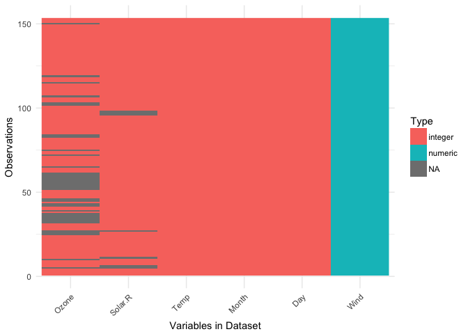

The classes are represented on the legend, and missing data represented by grey.

by default, `vis_dat` sorts the columns according to the type of the data in the vectors. You can turn this off by setting `sort_type == FALSE`. This feature is better illustrated using the `airquality` dataset from base R.

``` r

vis_dat(airquality, 
        sort_type = FALSE)
```

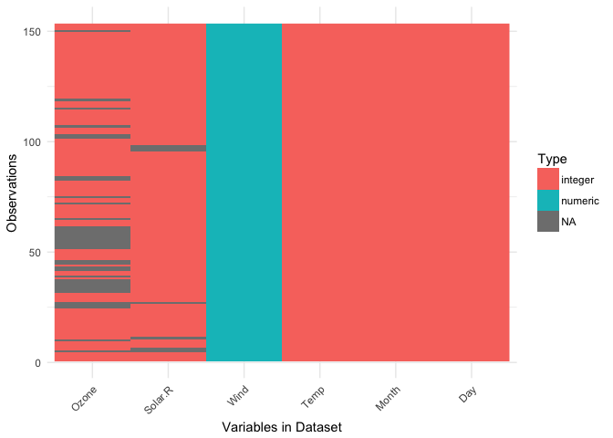

The plot above tells us that R reads this dataset as having characters, and integer values, along with some missing data in `Ozone` and `Solar.R`.

### with different data

To demonstrate what visdat looks like when you have different kinds of data, we can look at the `typical_data` from within visdat, created using the excellent [`wakefield package`](https://github.com/trinker/wakefield).

``` r

vis_dat(typical_data)
#> Warning: attributes are not identical across measure variables; they will
#> be dropped
```

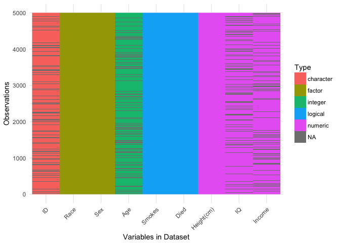

We can also look into using even wider data, looking at `typical_larger_data`

``` r

vis_dat(typical_larger_data)
#> Warning: attributes are not identical across measure variables; they will
#> be dropped
```

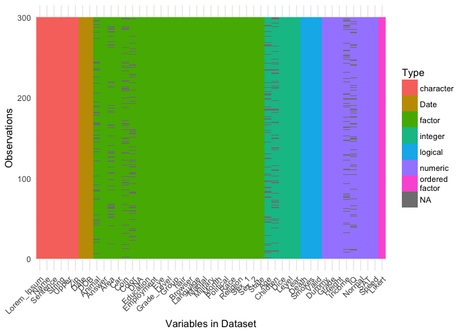

using `vis_miss()`
------------------

We can explore the missing data further using `vis_miss()`

``` r

vis_miss(airquality)
```

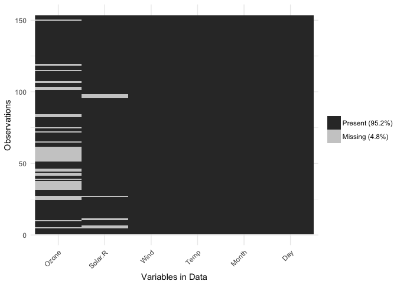

The percentages of missing/complete in `vis_miss` are accurate to 1 decimal place.

You can cluster the missingness by setting `cluster = TRUE`

``` r

vis_miss(airquality, 
         cluster = TRUE)
```

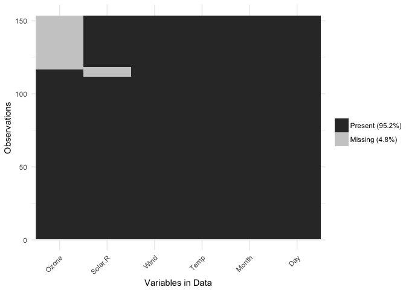

The columns can also just be arranged by columns with most missingness, by setting `sort_miss = TRUE`.

``` r

vis_miss(airquality,
         sort_miss = TRUE)
```


When there is &lt;0.1% of missingness, `vis_miss` indicates that there is &gt;1% missingness.

``` r

test_miss_df <- data.frame(x1 = 1:10000,
                           x2 = rep("A", 10000),
                           x3 = c(rep(1L, 9999), NA))

vis_miss(test_miss_df)
#> Warning: attributes are not identical across measure variables; they will
#> be dropped
```

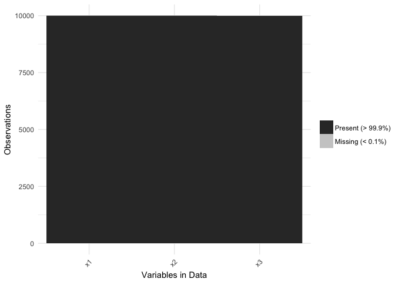

`vis_miss` will also indicate when there is no missing data at all

``` r

vis_miss(mtcars)
```

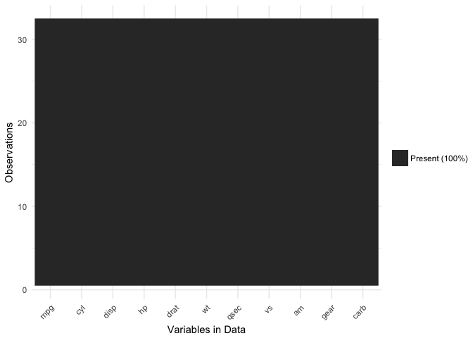

Experimental features
=====================

using `vis_compare()`
---------------------

Sometimes you want to see what has changed in your data. `vis_compare()` helps with that. It is currently only just barely working, so keep in mind that this is very much in its beta stages.

For the sake of simplicity, lets make some changes to `iris`, and compare this new dataset

``` r

iris_diff <- iris
iris_diff[sample(1:150, 30),sample(1:4, 2)] <- NA

vis_compare(iris_diff, iris)
#> vis_compare is still in BETA! If you have suggestions or errors,
#>           post an issue at https://github.com/njtierney/visdat/issues
#> Warning in if (dim(df1) != dim(df2)) {: the condition has length > 1 and
#> only the first element will be used
#> Warning: attributes are not identical across measure variables; they will
#> be dropped

#> Warning: attributes are not identical across measure variables; they will
#> be dropped
```

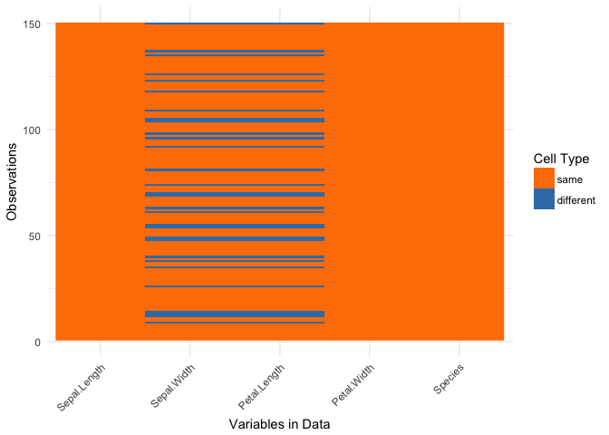

Here the differences are marked in blue.

If you try and compare differences when the dimensions are different, you get an ugly error.

``` r

iris_diff_2 <- iris
iris_diff_2$new_col <- iris$Sepal.Length + iris$Sepal.Width

vis_compare(iris, iris_diff_2)
#> vis_compare is still in BETA! If you have suggestions or errors, post an issue at https://github.com/njtierney/visdat/issuesthe condition has length > 1 and only the first element will be usedError: `.x` (5) and `.y` (6) are different lengths
```

using `vis_guess()`
-------------------

`vis_guess()` takes a guess at what each cell is. It's best illustrated using some messy data, which we'll make here.

``` r

messy_vector <- c(TRUE,
                  T,
                  "TRUE",
                  "T",
                  "01/01/01",
                  "01/01/2001",
                  NA,
                  NaN,
                  "NA",
                  "Na",
                  "na",
                  "10",
                  10,
                  "10.1",
                  10.1,
                  "abc",
                  "$%TG")

set.seed(1114)
messy_df <- data.frame(var1 = messy_vector,
                       var2 = sample(messy_vector),
                       var3 = sample(messy_vector))
```

``` r

vis_guess(messy_df)
#> vis_guess is still in BETA! If you have suggestions or errors,
#>           post an issue at https://github.com/njtierney/visdat/issues
```

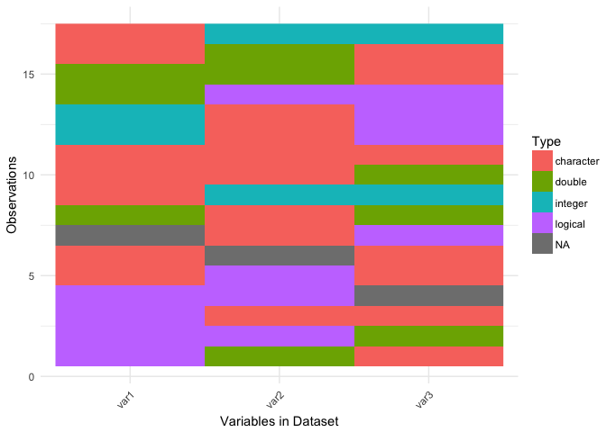

So here we see that there are many different kinds of data in your dataframe. As an analyst this might be a depressing finding. Compare this to `vis_dat`.

``` r

vis_dat(messy_df)
```

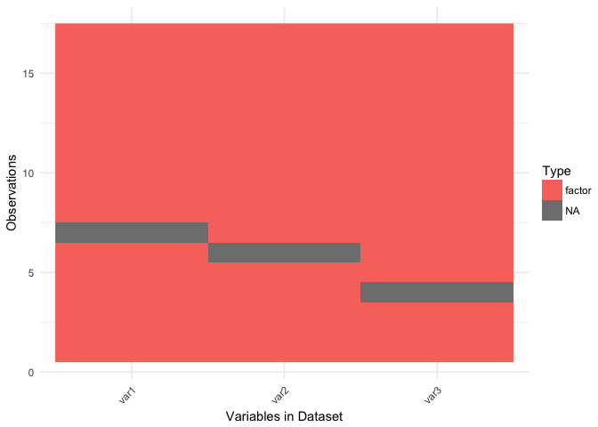

Where you'd just assume your data is wierd because it's all factors - or worse, not notice that this is a problem.

At the moment `vis_guess` is very slow. Please take this into consideration when you are using it on data with more than 1000 rows. We're looking into ways of making it faster, potentially using methods from the `parallel` package, or extending the c++ code from `readr::parse_guess`.

Interactivity
=============

Thanks to Carson Sievert, you can now add some really nifty interactivity into visdat by using `plotly::ggplotly`, allowing for information to be revealed upon mouseover of a cell. The code to do this can be seen below, but is not shown as the github README doesn't support HTML interactive graphics...yet.

``` r

library(plotly)

vis_dat(airquality) %>% ggplotly()
```

vis\_dat\_ly
------------

This is still under development, but it is basically a faster version of doing a ggplot and then calling ggplotly.

vis\_miss\_ly
-------------

This is also under development, and still needs some more work on the legend, etc.

``` r

vis_miss_ly(airquality)
```


Road Map
========

**visualising expectations**

The idea here is to pass expectations into `vis_dat` or `vis_miss`, along the lines of the `expectation` command in `assertr`. For example, you could ask `vis_dat` to identify those cells with values of -1 with something like this:

``` r

data %>% 
  expect(value == -1) %>%
  vis_dat
```

Thank yous
==========

Thank you to Ivan Hanigan who [first commented](http://www.njtierney.com/r/missing%20data/rbloggers/2015/12/01/ggplot-missing-data/#comment-2388263747) this suggestion after I made a blog post about an initial prototype `ggplot_missing`, and Jenny Bryan, whose [tweet](https://twitter.com/JennyBryan/status/679011378414268416) got me thinking about vis\_dat, and for her code contributions that removed a lot of errors.

Thank you to Hadley Wickham for suggesting the use of the internals of `readr` to make `vis_guess` work.

Thank you to Miles McBain for his suggestions on how to improve vis guess. This resulted in making it at least 2-3 times faster.

Thanks also to Carson Sievert for writing the code that combined plotly with visdat, and for Noam Ross for suggesting this in the first place.
