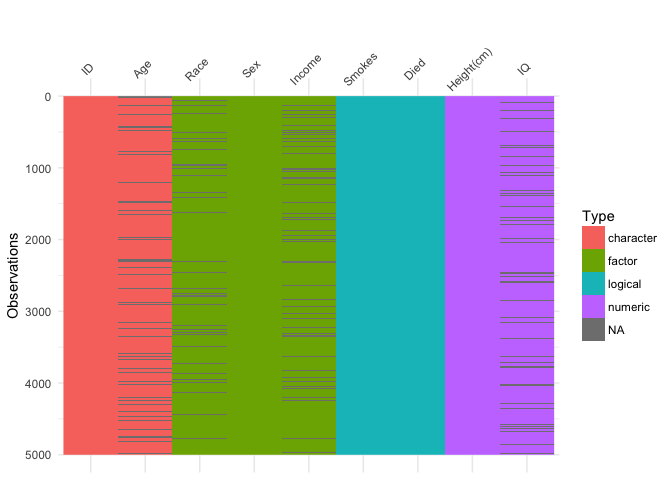
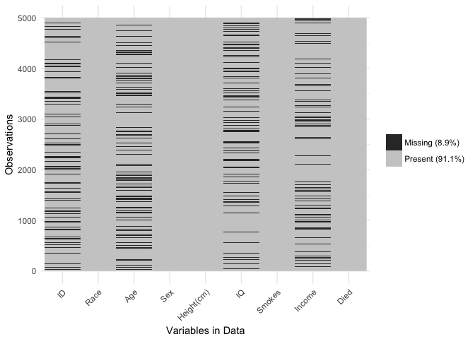

# visdat: Visualising whole data frames
09 January 2017  

# Summary

As described by Hadley Wickham [@wickham2016], there are 6 phases of data science:


You can get insight into your data by modelling, visualising, and transforming, which Wickham describes as "Understanding" or "knowledge generation". There is some overlap here, as in this process it wouldn't be surprising that you might uncover some feature of your dataset that you would need to clean up or change. For example, in analysing some data, you might discover that some strings were indeed factors, or that gender was considered numeric in your regression, warranting you to re-visit the Tidying phase.

In the same way, this process gets applied in the Tidying step of data science. You read in your data, but you then need to look at it to understand what you need to do to make it ready for analysis. A phrase that often arises in this process is "looking at the data". It is helpful to look more closely at what this means. You can look at the first six rows of data, the head of the data:


```r
head(iris)
```

```
##   Sepal.Length Sepal.Width Petal.Length Petal.Width Species
## 1          5.1         3.5          1.4         0.2  setosa
## 2          4.9         3.0          1.4         0.2  setosa
## 3          4.7         3.2          1.3         0.2  setosa
## 4          4.6         3.1          1.5         0.2  setosa
## 5          5.0         3.6          1.4         0.2  setosa
## 6          5.4         3.9          1.7         0.4  setosa
```

Another alterantive is `glimpse`, from the `dplyr` package [@dplyr]


```r
dplyr::glimpse(iris)
```

```
## Observations: 150
## Variables: 5
## $ Sepal.Length <dbl> 5.1, 4.9, 4.7, 4.6, 5.0, 5.4, 4.6, 5.0, 4.4, 4.9,...
## $ Sepal.Width  <dbl> 3.5, 3.0, 3.2, 3.1, 3.6, 3.9, 3.4, 3.4, 2.9, 3.1,...
## $ Petal.Length <dbl> 1.4, 1.4, 1.3, 1.5, 1.4, 1.7, 1.4, 1.5, 1.4, 1.5,...
## $ Petal.Width  <dbl> 0.2, 0.2, 0.2, 0.2, 0.2, 0.4, 0.3, 0.2, 0.2, 0.1,...
## $ Species      <fctr> setosa, setosa, setosa, setosa, setosa, setosa, ...
```

This has a better printing method that gives us more information about the data, displaying doubles and a factor. However, we don't always have data like the canonical iris dataset. Let's take a look at some data that might be a bit more typical of "messy" data.


```r
library(visdat)
dplyr::glimpse(typical_data)
```

```
## Observations: 5,000
## Variables: 9
## $ ID         <chr> "0001", "0002", "0003", "0004", "0005", NA, "0007",...
## $ Race       <fctr> White, Hispanic, White, Black, White, Hispanic, Hi...
## $ Age        <int> 34, 25, 35, NA, NA, NA, 26, 31, 20, 26, NA, NA, 21,...
## $ Sex        <fctr> Female, Male, Male, Female, Male, Male, Male, Fema...
## $ Height(cm) <dbl> 181.6, 174.3, 171.9, 188.4, 171.1, 179.5, 175.8, 17...
## $ IQ         <dbl> 100, 100, 104, 116, 106, 105, 95, 98, 88, NA, 96, 1...
## $ Smokes     <lgl> FALSE, FALSE, FALSE, FALSE, FALSE, FALSE, TRUE, FAL...
## $ Income     <dbl> 33873.82, 38799.39, 7235.28, 29629.44, 19990.00, 69...
## $ Died       <lgl> TRUE, TRUE, FALSE, TRUE, TRUE, FALSE, FALSE, TRUE, ...
```

Looking at this, you might then ask:

> Isn't it odd that Income is a factor? And Age is a character? 

And you might start to wonder what else is different, what else changed? 

And it might be a bit unclear where to go from there. Do you plot the data? Why does my plot look wierd? What are these other strange features in the data? The `visdat` package provides visualisations of an entire dataframe at once. Initially inspired by [`csv-fingerprint`](https://github.com/setosa/csv-fingerprint), `visdat` provides tools to create heatmap-like visualisations of an entire dataframe. `visdat` is an R [@Rcore] package provides 2 main functions `vis_dat` and `vis_miss`.

`vis_dat()` helps explore the data class structure and missingness:


```r
vis_dat(typical_data)
```

```
## Warning: attributes are not identical across measure variables; they will
## be dropped
```

<!-- -->

And the `vis_miss` function provides a custom plot for missing data.


```r
vis_miss(typical_data)
```

```
## Warning: attributes are not identical across measure variables; they will
## be dropped
```

<!-- -->

These functions provide useful tools to help "get a look at the data", using principled visualisation techniques. The plots are built using ggplot2 [@ggplot2], which provides a consistent and powerful framework for visualisations. This means that users can customise and extend graphics from visdat very easily.

# References
