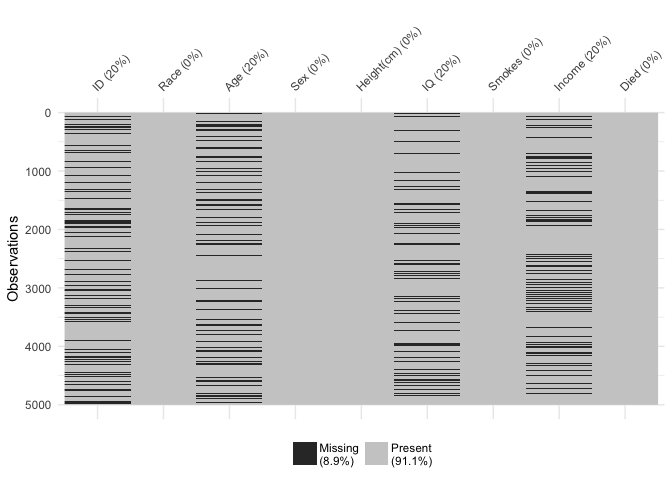

# visdat: Visualising Whole Data Frames
01 August 2017  

# Summary

Reading in a new dataset means looking at the data to get a sense of what it contains, and potential problems and challenges with the data to get it analysis ready. "Looking at the data" can mean different things. Often times you look at the first six rows of data, the head of the data:


```r
head(iris)
```

```
##   Sepal.Length Sepal.Width Petal.Length Petal.Width Species
## 1          5.1         3.5          1.4         0.2  setosa
## 2          4.9         3.0          1.4         0.2  setosa
## 3          4.7         3.2          1.3         0.2  setosa
## 4          4.6         3.1          1.5         0.2  setosa
## 5          5.0         3.6          1.4         0.2  setosa
## 6          5.4         3.9          1.7         0.4  setosa
```

Or you can `glimpse` the data, using the `dplyr` package [@dplyr]


```r
dplyr::glimpse(iris)
```

```
## Observations: 150
## Variables: 5
## $ Sepal.Length <dbl> 5.1, 4.9, 4.7, 4.6, 5.0, 5.4, 4.6, 5.0, 4.4, 4.9,...
## $ Sepal.Width  <dbl> 3.5, 3.0, 3.2, 3.1, 3.6, 3.9, 3.4, 3.4, 2.9, 3.1,...
## $ Petal.Length <dbl> 1.4, 1.4, 1.3, 1.5, 1.4, 1.7, 1.4, 1.5, 1.4, 1.5,...
## $ Petal.Width  <dbl> 0.2, 0.2, 0.2, 0.2, 0.2, 0.4, 0.3, 0.2, 0.2, 0.1,...
## $ Species      <fctr> setosa, setosa, setosa, setosa, setosa, setosa, ...
```

This shows that there are 150 observations, and 5 variables, which are doubles and a factor, along with some of the values in the data. However, we usually don't have data like the canonical iris dataset. Let's take a look at some data that might be a bit more typical of "messy" data.


```r
library(visdat)
dplyr::glimpse(typical_data)
```

```
## Observations: 5,000
## Variables: 9
## $ ID         <chr> "0001", "0002", "0003", "0004", "0005", "0006", "00...
## $ Race       <fctr> Black, Black, Black, Hispanic, NA, White, White, B...
## $ Age        <chr> NA, "25", "31", "27", "21", "22", "23", "21", NA, "...
## $ Sex        <fctr> Male, Male, Female, Female, Female, Female, Female...
## $ Height(cm) <dbl> 175.9, 171.7, 173.5, 172.4, 158.5, 169.5, 163.7, 16...
## $ IQ         <dbl> 110, 84, 115, 84, 116, 83, 101, 97, 92, 99, 88, 86,...
## $ Smokes     <lgl> FALSE, TRUE, FALSE, FALSE, FALSE, FALSE, FALSE, FAL...
## $ Income     <fctr> 4334.29, 16682.37, 50402.01, 91442.86, 75266.05, 1...
## $ Died       <lgl> FALSE, TRUE, FALSE, FALSE, FALSE, FALSE, FALSE, FAL...
```

Looking at this, you might then ask: "Isn't it odd that Income is a factor? And Age is a character?". And you might start to wonder what else is different, what else changed? It might be a bit unclear where to go from there. Do you do some exploratory plots of the data? What if the plot looks weird because the data has strange types? What if the data has other strange features? 

There is a need for a tool to do preliminary data visualisation, to identify these problems early. The `visdat` package provides this, creating visualisations of an entire dataframe at once. Initially inspired by [`csv-fingerprint`](https://github.com/setosa/csv-fingerprint), `visdat` provides tools to create heatmap-like visualisations of an entire dataframe. `visdat` is an R [@Rcore] package provides 2 main functions `vis_dat` and `vis_miss`.

`vis_dat()` helps explore the data class structure and missingness, by displaying the class for each variable and the missing data, and presenting the plot in an intuitive way - it reads top down as the data would. The columns are grouped by similar class as well, to put similarly classified data types together.


```r
vis_dat(typical_data)
```

<!-- -->

`vis_miss()` focuses on just displaying the present and missing data, again reading top down, but also displaying the percent of missing data in each column, and overall.


```r
vis_miss(typical_data)
```

<!-- -->

These functions provide useful tools to help "get a look at the data", using preliminary visualisation techniques. The plots are built using ggplot2 [@ggplot2], which provides a consistent and powerful framework for visualisations. This means that users can customise and extend graphics from visdat very easily.

# Acknowlegements

I would like to thank the two reviewers, Mara Averick and Sean Hughes, for their helpful suggestions that resulted in a much better package.

# References
